 
<!--BEGIN_DATA
{
    "create_date": "2023-10-30 20:25", 
    "modify_date": "2023-10-30 20:25", 
    "is_top": "0", 
    "summary": "redux不好用？万字细究redux项目实操<br/>Redux Toolkit", 
    "tags": "Web", 
    "file_name": "万字细究redux项目实操与Redux Toolkit.md"
}
END_DATA-->

#### <p>原文出处：<a href='https://juejin.cn/post/7178678099901415483' target='blank'>redux不好用？万字细究redux项目实操</a></p>

大家好，我是张添财。每次提及redux可能会有很多小伙伴头疼，究其原因redux的使用链路比较长。并且由于其灵活性较强，尤其进行模块化拆分后，我们看着那一堆的文件免不了要瑟瑟发抖。本文旨在帮助大家从头到尾深入探究redux，并且引入书店借书这个实际场景与加深大家的记忆。好了，嘿喂购，咱这就开始！

## 一、react 组件通信

众所周知，react的思想可以用一个公式来概括：UI=Render(state) 从这我们就不难看出：在开发react业务时，实际上就是在操作react的state状态去进行rerender来改变UI视图。那既然这样，我们如何管理state状态，如何操作state来进行组件通信就显得尤为重要了。这也就引出了我们接下来要介绍的业务中组件通信常用的三种方式：

### 1.1 props: 组件间流式传值

通常情况下，如果我们的state通信只涉及到两三个层级，我们常常用props传值的方式来进行传递state数据从而实现组件间的数据通信。如下图：

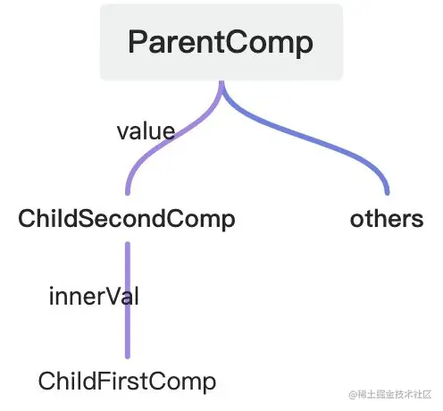

```js
const ChildFirstComp=(props)=>{
    return (<div>
        这是从ChildSecondComp传进来的值:{props.innerVal}
    </div>)
}

const ChildSecondComp=(props)=>{
    return (<div>
        这是从ParentComp传进来的值:{props.value}
        <ChildFirstComp  innerVal={props.value}/>
    </div>)
}

const ParentComp=(props)=>{
    const testVal='这是在父组件声明的值'
    return (<div>
      这是ParentComp组件
    <ChildSecondComp  value={testVal}/>
    </div>)
}
```

从上面我们可以看出，如果组件的嵌套层级不深的情况下，props传值还是很方便的。但是一旦组件层级非常深，我们再采用props传值的这种方式就很容易陷入流式传递的陷阱。也即我们的state就像水流一样，从顶层组件一层一层往内层传递，这显然加重了我们的开发负担，通信链路过长。所以，总的来说，简单的父子传值以这种方式通信没问题，但复杂层级嵌套还是得另行考虑通信方式！

### 1.2 Context: 局部共享数据

上文说道，pros传值不适合嵌套层级过深的组件通信。如果我们想在嵌套层级过深的组件之间通信，且兄弟组件之间也进行相关state传递时，我们可以利用Context的方式来进行数据共享。

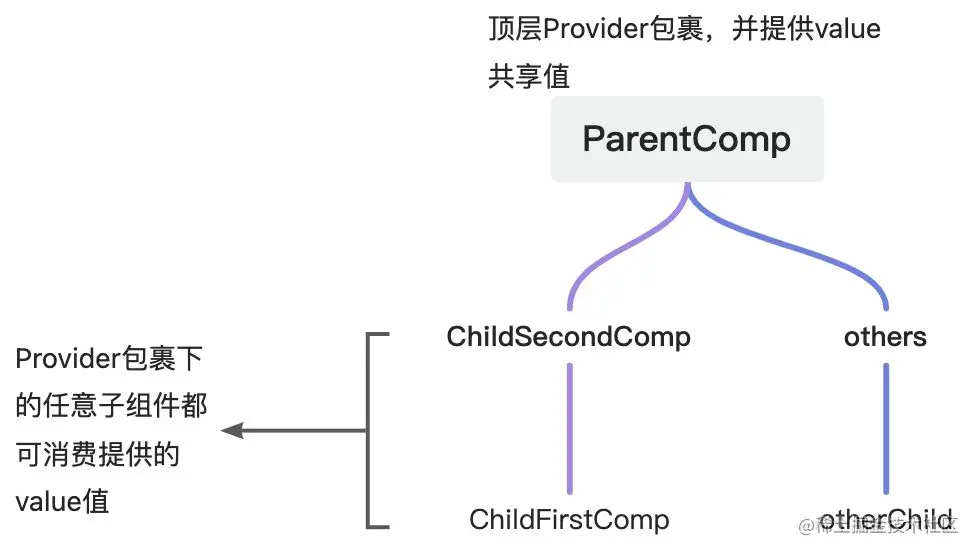

#### Context使用步骤：

* 1. 调用 React.createContext() 创建一个Context对象 。Context对象中包含 Provider(提供数据) 和 Consumer(消费数据) 两个组件

```js
import React from 'react'
export const GrandContext=React.createContext()
```

* 2. 在顶层组件中引入grandContext中Provider组件进行提供数据，并设置value属性。注意，Provider组件里的value属性值就是内部要共享的数据值：

```js
import React from 'react'
import {GrandContext} from './grandContext'
...

export default function GrandFDemo() {
    return (
        <Provider value={{grandVal:'这是Provider提供的数据'}}>
            <div>
            TestDemo
                <FaDemo></FaDemo>
            </div>
        </Provider>
    )
}
...
```

* 3. 在顶层组件内部包裹的组件中，哪一层想要接收数据，这一层就用Consumer包裹此组件，若要使用共享的value值在在回调函数中使用第一个参数即可，如下面代码所示：data参数就表示Provider提供的共享数据

```js
<GrandContext.Consumer>
    {
        data => {
            return (
                <div>SonDemo:{data.grandVal}</div>
            )
        }
    }
</GrandContext.Consumer>
```

这是完整代码：

```js
import React from 'react'
import {GrandContext} from './grandContext'

const SonDemo=() => {
    return (
        <GrandContext.Consumer>
            {
                data => {
                    return (
                        <div>SonDemo:{data.grandVal}</div>
                    )
                }
            }
        </GrandContext.Consumer>
    )
}

const FaDemo=() => {
    return (
        <div>
            FaDemo
            <SonDemo></SonDemo>
        </div>
    )
}

export default function GrandFDemo() {
    return (
        <GrandContext.Provider value={{grandVal:'这是Provider提供的数据'}}>
            <div>
            	GrandFDemo
                <FaDemo></FaDemo>
            </div>
        </GrandContext.Provider>
    )
}
```

实际业务里，我们常用useContext钩子来代替上面这种Consumer组件的写法：

```js
import React , { useContext } from 'react'
import {GrandContext} from './grandContext'

...
const SonDemo=() => {
   const proVal=useContext(GrandContext)
    return (
        <div>
    	SonDemo:{proVal.grandVal}
   	</div>
    )
}
...
```

至此我们也就基本掌握了Context使用。各位小伙伴看完Context顿时感觉Context大法好呀，这么一来我的共享数据直接在顶层维护就好了，其他组件哪里想用哪里调useContext取值就行了，美滋滋。但是该说不说，Context 还是有几个缺点：

  1. 只有在Provider包裹内的组件才可以使用共享的value值，也即value值的共享范围还不够宽泛。

  2. 我们Provider共享出去的value只要有更新，所有消费该Context共享数据的组件都会触发rerender。也就是说，如果我们的context的数据里有多个key，只有其中一个key（咱称为key1）会频繁更新，其他key值都比较稳定。如果key1值发生变化，即使子孙组件只使用了其他的key值而没有消费key1，它依然会频繁渲染，这就很容易会导致性能问题。(优化手段一般是拆分context或者缓存UI组件)

现在我们再引申这么一个场景需求：state数据需要广泛应用在项目里各个组件，并且这些组件没有很规律的层级关系。我还需要这个state能被改变，state变化的同时也要引起视图变化。并且，除此之外，我还要求能严格控制组件的rerender。

看完这个需求，我们常规的props传值和Context似乎就有点不够看了。那怎么办呢？关门，放redux！

### 1.3 Redux: 状态管理中心

我们在开始介绍redux之前，需要清楚一点：redux 并非react专属，它也可以在jQ、Angular里使用。只是redux和React结合比较好，因为react的原则是通过state来描述界面的状态，而Redux可以派发状态的更新，让react作出响应。

redux是一个状态管理库，它的使用流程其实很明晰：通过dispatch派发action来修改store里的state数据，而连接state与action的就是我们使用时重点去维护的reducer。redux可以帮助我们实现数据的全局共享，我们引入redux之后，就达到实现无视组件层级哪里需要哪里用的目的。并且redux内部集成了相关api来帮助我们去触发视图的更新，也就是说，我们利用redux就可以做到“按需render”，这也就解决了Context的频繁render的情况。

说完了概念，咱们再来说明几条使用redux时遵循的原则：

  1. 单一数据源store：redux建议我们只创建一个store来进行数据管理，这样可以方便我们维护全局共享数据state。

  2. 共享数据state只读：redux要求我们只能用dispatch派发action的方式来修改state，不能在业务里直接操作state进行修改赋值。

  3. 使用纯函数reducer来操作action和state：redux要求我们使用的reducer都应该是纯函数，不能产生任何的副作用；

好了，到此我们初遇redux的阶段就结束了，下面我们就来好好盘盘redux里相关的API以及一些和redux有关的第三方库吧。

## 二、换个角度看redux

上一part的结尾部分，我们初步介绍了redux。但相信很多小伙伴心里免不了吐槽：“这介绍确实太初步了，说了点东西，但感觉又没说。”别急别急，咱接下来就是本文的重头戏：里里外外细说redux。

我个人一直觉得知识应该是鲜活的，如果只堆概念不仅有些无聊，而且各位小伙伴的吸收效果也不见得有多好。还会出现我看了，但转头就忘了的现象。添财今天换个方式来同各位一起探究redux，咱直接把redux搬到现实生活中，用去书店借书来做个类比。让各位好好了解redux整个处理流程！


### 2.1 概念类比，redux照进现实

各位彦祖、胡歌们都去过书店，借书还书那肯定也是常事（当然去图书馆蹭空调的是谁我不说....）好了，那现在咱把redux揪到我们生活中来。把书店和redux做一层映射：

① 我们把redux的store比作新华书店（新华书店打钱！！）；

② 把reducer比作图书管理员；

③ 把state比作新华书店里的书；

④ 业务里要用到state数据的地方就是我们这些去借书的彦祖们；

⑤ 而我们想要借哪本书，借几本的这个行为就是action；

⑥ 我们借书要用的书店借记卡就是redux里的dispatch。

好了，映射做完了，咱们此时来回忆一下去新华书店借书的流程：我现在想要看书了于是就跑去书店找图书管理员，找到后，我拿着书店借记卡说：咱现在要借一本《明朝那些事》，图书管理员听到后一顿骚操作就把书借给我了。现在书店里能借出去的书少了一本，咱现在手里就拿着《明朝那些事》开始看。

借书流程回忆完了，下一步咱们来用redux里的相关术语来复现一下这个借书的流程：

  1. 首先，新华书店（store）全部的书是redux里的state数据；
  2. 我现在想要看书的这个需求翻译一下就是我们业务里需要用到store里的state；
  3. 咱拿借记卡跑去书店里问管理员借了一本书，这个行为翻译成业务语言就是：业务里需要用到state数据，咱在业务中用dispatch派发了action操作，reducer接收到这个action之后根据我们的action来处理相关的state数据；
  4. 借到了《明朝...》则是 我们在业务开发中拿到了所需的state数据；
  5. 书店里能借出去的书少了一本 则表示reducer更新了当前的state数据。


### 2.2 关键点总结

好了，上面我们已经把redux和我们书店借书的流程完美的糅合在一起了，下面咱们来提取一下关键点：

① 我想要借书，就必须要去书店。那我们要用redux，就必须得有store；

② 书店将图书借给很多来借书的人，那store也把state数据共享给我们项目里的各个业务逻辑；

③ 书店得有图书管理员去管理这些书，那store里也得有管理state的管理者reducer；

④ 我去书店借书必须向图书管理员说我要借什么书，这样管理员才知道去拿哪本书。那业务使用操作state时也需要action来说明我们要怎么操作state，这样reducer才能进一步去识别；

⑤ 我们借书得有借记卡，总不能拿添财书店的卡借新华书店的书。那相应的，业务里我们要触发action操作也只能通过 dispatch
来进行，否则，reducer不认。

⑥ 书店里的图书经过管理员的借记操作完成了可借图书数量的更新。store也通过reducer完成了对全局共享数据state的更新。

唠了这么多，咱的目的就是为了让大家对操作redux的流程大致有个了解，如果按照传统那种只堆概念，我个人感觉是有点生硬的。这种介绍方式应该会让各位印象深刻些。

到这，相信大家也总结出了关键词：存放数据的**store**；管理数据的**reducer**；能让图书管理员肯拿书出借的借记卡**dispatch**；能让管理员知道要操作哪本书的**action**。至此，咱就要开启下一part，对这些关键词进一步探讨。

## 三、redux 细究

我们在项目里使用redux拢共分四步：① 创建书店 store 塞满图书state 、② 招聘图书管理员reducer、③ 维护下我们借书的操作actions、④ 在业务逻辑里去操作 state。好了，工欲善其事必先利其器，咱想用redux，那不得先下载这个三方库嘛：

```js
yarn add redux 
```

下载好之后，咱就开始从零到一创建”新华书店“吧（手头狗头）

### 3.1 Store ：应有尽有的书店

在redux里，store就是我们的书店。它就是state的**数据管理中心**。我们整个项目最好只有**一个 Store**。在我们开发时，需要通过`legacy_createStore`方法来创建，此方法的返回值就是我们所需的store对象。store对象中包含getState、dispatch、subscribe等api以供我们来管理state数据。在调用`legacy_createStore`方法时，我们必须传入reducer作为参数。

**legacy_createStore** 参数含义如下所示：

① 参数一（必填）：项目里的reducers，联系项目里state与action，state也通过reducers完成数据的更新。

② 参数二（非必填）：设置state的初始值。但是此处设置的值会覆盖掉在reducer里设置的初始值。

③ 参数三（非必填）：redux的增强器，我们chrome的redux插件、支持redux进行异步调用的中间件都是在此配置。

为了方便我们开发时在浏览器中查看redux里的状态值，可以安装`redux-devtools-extension`插件来增强redux功能。将此插件的composeWithDevTools API传到legacy_createStore里即可生效（ 记得先在浏览器里下载拓展啊)

```js
    yarn add redux-devtools-extension
```

```js
import { legacy_createStore as createStore } from 'redux'
import { composeWithDevTools } from 'redux-devtools-extension'

const rootReducer=(state={val:'这里会被覆盖掉',counter:0},action)=>{return state}

// 创建 Store 实例
const store = createStore(
    // 参数一：根 reducer
    rootReducer,
    // 参数二：初始化时要加载的状态
    {
        counter: 11
    },
    // 参数三：增强器,加中间件
    composeWithDevTools()
)

// 导出 Store 实例，
export default store
```

至此，我们的store就创建好了，下面我们就来测试下store有没有生效，我们可以调用store对象上的 getState 方法来获取当前store里的state数据。

代码如下：

```js
import React from 'react'
import store from '@/store'

export default function GrandFDemo() {
    return (
        <div>
        这是展示store里的结果：{store.getState().counter}
        </div>
    )
}
```

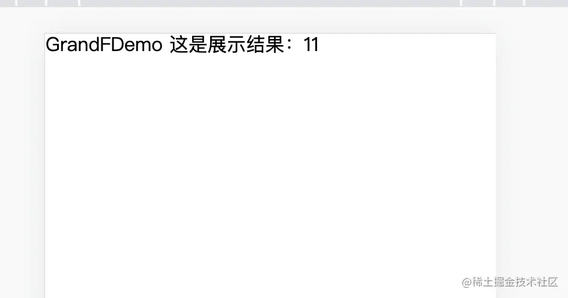

好了，我们的书店就创建好了，store部分就暂时告一段落，书店怎么去响应我们借阅图书的操作员，我们又如何具体操作我们的state数据则放到下文细说。

### 3.2、reducer : 尽职尽责的管理员

我们刚刚已经把新华书店建立起来了，那下一步必须得招聘个管理员呐。不出意外，这一part我们来介绍下我们的图书管理员：reducer。

首先我们的管理员reducer就是一个函数，此函数可以接收两个参数：state 和action。state是我们当前的全局共享数据，action则是一个对象其中则包含我们想要如何去修改state的相关属性。

> 这也很容易理解，毕竟图书管理员就是要知道我们想借哪本书，想要借几本。对应到这里就是reducer要知道我们要进行操作的action，再根据我们的action去对state进行相应的处理。

reducer会接收这两个参数并返回一个新的state，这个更新后的state值就是最新的全局共享数据值。除此之外，我们还需要特别注意的一点：reducer得是一个纯函数，他不能对外部产生副作用！

#### 3.2.1 补充知识：纯函数

纯函数： 一个函数的返回结果**只依赖于它传进来的参数**，并且在执行过程里面没有副作用，我们就把这个函数叫做纯函数。

> 纯函数的条件:
>
> ① 返回结果只依赖传进来的参数(参数怎么来的怎么走，不改变传进来的参数)；
>
> ② 在执行过程中没有副作用。

由于 **Reducer** 是纯函数，同样的 **state** 必定得到同样的 **view**，所以 **Reducer** 函数内不能直接对原**state进行赋值操作** 必须返回一个全新的对象。

好了，到这里咱就来做一个较具官方味道的发言性总结：各位同好们，所谓 reducer 就是 redux 根据派发的action来具体操作state数据的一个纯函数，此函数内部一般会用switch或者if逻辑来对不同的action类型进行分类处理，从而返回一个更新后的state数据。

下面我们就该进入到代码阶段了，光说不练假把式，话不多说，show me the code！

#### 3.2.2 代码实操

我们还是沿用store部分的代码，此处咱就是来拓展一下reducer，主要是往reducer塞我们的state处理逻辑，让reducer可以根据不同的action类型来进行相应的操作返回。

代码如下：

```js
import { legacy_createStore as createStore } from 'redux'
import { composeWithDevTools } from 'redux-devtools-extension'

//注意，这里设置的初始值会被createStore处传入的初始值覆盖
const initState={counter:666}

const rootReducer=(state=initState,action)=>{
	 switch (action.type) {
        case "TEST_ONE":
            return {...state, counter:111};
        case "TEST_TWO":
            return {...state, counter:222};
        case "TEST_THREE":
            return {...state, counter:888}
        default: 
            return state;
    }
}

// 创建 Store 实例
const store = createStore(
    // 参数一：根 reducer
    rootReducer,
    // 参数三：增强器,加中间件
    composeWithDevTools()
)

// 导出 Store 实例，
export default store
```

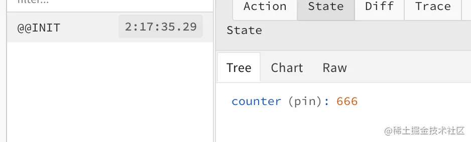

我们的书店已经创建，管理员也到位了，接下来就该咱出场去借书了。

### 3.3 dispatch和action：借记卡和借书操作

一卡在手，图书我有！前面铺垫了那么多，现在终于可以借书了。借书之前咱还是得想想要借什么书......思索一会，咱想借《明朝那些事儿》，于是有了下面这段代码：

```js
const action={
  type:'MING_DYNASTY',
  num:1
}
```

这个action就表示我想借明朝，并且只借一本。紧接着来了一个问题，咱要借书，那必须得有个凭证呐。没凭证书店也不给借呀，不然要是借了不还该咋办？诶，这里我们的dispatch就闪亮登场了✨！


正如我们需要借记卡去借书管理员才会处理，我们在业务里必须通过dispatch派发action后reducer才会进行相应处理。好了，终于把正主引出来了，接下来我们就来探究下action和dispatch的使用吧。

#### 3.3.1 初识 action

action从类型上来说就是一个**对象**，此对象内部包含我们的操作类型type、state相关数据。之所以要包含操作类型type 是因为我们的action肯定不止有一个，既然这样我们就用type去区分不同action操作。区分了action操作，我们当然要知道每个action都要带来什么样的值来让reducer处理更新，这样我们就用payload来传相关数据。所以一般的，我们在真实开发中都会这么设置action对象：

```js
const action={
  	type:'这里的值要和reducer中的type值对应',
    payload:{ 这里的值就是参与到state值更新的相关数据  }
}

// 当然，我们在业务里也经常使用函数来动态生成action
const generateAction=(type,payload)=>{
  return {
      type,
      payload
  }
}
```

action设计好了，下面该轮到dispatch了。在上面我们也说明了要想action能被reducer处理，我们在业务里必须通过dispatch来进行派发。一旦业务里使用dispatch派发action后，我们的reducer就会根据action去处理state并且返回更新后的state值。

#### 3.3.2 初遇 dispatch

dispatch是我们通过createStore创建出来的store对象里的api，其作用就是派发action给reducer。需要注意的是：我们要想改变state值，唯一的途径就是通过dispatch来派发action，再经过reducer返回改变后的state值，不能直接对state进行赋值操作！

> 补充：在没有引入中间件的情况下，我们dispatch派发的action只能是个对象，但如果有中间件增强，我们dispatch里就可以传一个函数进去来做些异步的操作！并且我们每派发一次dispatch，都会在内部调一次reducer

好了，接下来我们就对之前的代码做些调整：

index.js

```js
import { legacy_createStore as createStore } from 'redux'
import { composeWithDevTools } from 'redux-devtools-extension'

//注意，这里设置的初始值会被createStore处传入的初始值覆盖
const initState={title:'《我要借书》',num:1}

const rootReducer=(state=initState,action)=>{
  const {type,payload}=action
	 switch (type) {
        case "MING_DYNASTY":
            return {...state, 
                    num:payload.num,
                    title:payload.title
                   };
        default: 
            return state;
    }
}

const store = createStore(
    rootReducer,
    composeWithDevTools()
)

// 导出 Store 实例，
export default store
```

TestDemo.jsx :

```js
import React from 'react'
import { Button } from 'antd';
import store from '@/store'

const actionType={
  type: "MING_DYNASTY",
  payload:{
    title:"《明朝那些事儿》",
    num:1
  }
}

export default function GrandFDemo() {
  return (
    <div>
      借的书名：{store.getState().title}
      <br />
      借了几本：{store.getState().num}
      <br />
      <Button onClick={() => { store.dispatch(actionType) }} >我要借书</Button>
    </div>
  )
}
```

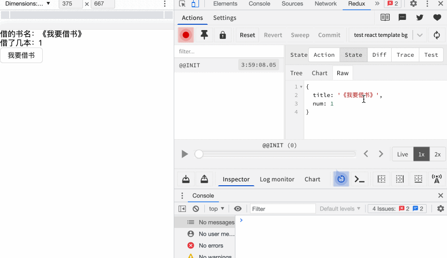

从这张图里我们清楚的看到，redux里数据确实已经改变了。但是，我们视图层面上的值却并没有发生变化。这现象很好解释：react里视图层变化需要进行rerender，而rerender触发的条件不是state变了，就是props变了。此处我们想实现store中数据变更引起UI视图层数据变化得额外做些处理。好了，问题已经引申，下面就让我们开始解决这个问题吧！

#### 3.3.3 触发 render

上一part我们提出了一个问题：明明redux里的数据已经发生了改变，但视图层没有进行相应的变化。那这一部分我们就来重点探索下项目里该怎么去解决这个bug。

首先我们也已清楚，视图层没发生变化是因为没有触发react的rerender。那既然这样问题就很好解决了，我们把store里的state值赋值给业务里的state就可以了，当store里数据值变化时再通过业务里的setState去改变业务的state值就能解决react没有rerender的问题。

但这样做真的能解决吗？

到这里各位小伙伴得先思考一个问题：我该怎么去判断何时进行触发rerender呢？最佳时机当然是监听到store里state发生改变后就进行rerender。那这又引入一个问题：我怎么知道store里的state数据发生了改变呢？如果我连监听时机都无法确定，还怎么去进行setState呢？

看到这里，估计有的小伙伴心里想“咱也不管你store里的数据什么时候变了，我就在你派发action之后就触发rerender。一句话，莽就完事了！”于是，就有了下面的代码：

```js
import React , { useState } from 'react'
import { Button } from 'antd';
import store from '@/store'

const actionType={
  同上...
}

export default function GrandFDemo() {
  const [update,setUpdate]=useState({})
  return (
    <div>
      借的书名：{store.getState().title}
      <br />
      借了几本：{store.getState().num}
      <br />
      <Button onClick={() => { 
      setUpdate({})
      store.dispatch(actionType) 
    }} >我要借书</Button>
    </div>
  )
}
```

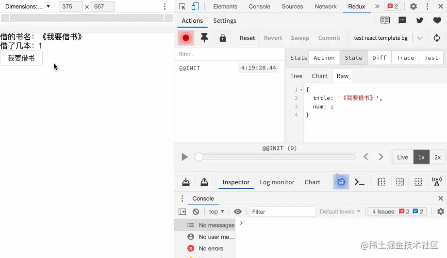

看到代码这一刻，咱脑海里飘过一段歌词：“你也没有错,只是不爱我~”。这段代码没问题，确实解决了bug，强制rerender来进行视图层的数据更新。这必须是“代码和人，有一个能跑就行”，况且这还跑的挺好。

这种解法能覆盖大多数情况，可一旦后续我们想引入中间件来对action做改造，或者有些情况派发了action但我们state和之前仍一样，那还怎么写总归是不行的。原因在于：①引入中间件的目的大概率是要进行异步操作，而一旦有异步操作我们先强制render了，而后异步的更新才好，这样还是会造成视图不更新的情况。②如果我们派发的action里并没改变state，那用这种强制render的写法就相当于不管state更没更新都触发了界面的重新渲染。

所以，要真正解决这个bug，还是得去监测store里state的更新时机。等state更新之后，我们再进行rerender的操作去改变视图。至于我们刚才提出怎么知道store里的state数据发生了改变，这里store是给我们提供了api的，这就是大名鼎鼎的subscribe。

### 3.4 subscribe 监听 reducer

由于redux采用的是发布-订阅模式，我们可以使用subscribe去监听数据的变化。它就相当于一个监听器，每次我们的reducer处理完action之后，subscribe都会去执行其内部的回调函数。当然，subscribe也会返回一个取消订阅的函数，在我们组件卸载时需要进行取消订阅。

需要强调的是：subscribe并不在意state是否更新了，只要reducer处理完并return之后，subscribe里的回调都会执行。不会存在因为state没变就不执行的情况。并且，subscribe是在reducer处理完action之后执行的，也不是在派发action时！

使用方法如下：

```js
const unSubscribe = store.subscribe(() => {
    console.log('store里的state有变化');
})
```

知道了使用方法之后咱就上面的代码进行改造 ：

```js
import React, { useEffect, useState } from 'react'
import store from '@/store/index'
import { Button } from 'antd';

const actionType=() => {
   ...略
}

// 真实开发不会这么写，这里只是demo示例，下一部分切合业务会演示实际用法
export default function GrandFDemo() {
    const [update,setUpdate]=useState({})

    useEffect(() => {
      const unSubscribe = store.subscribe(() => {
            console.log('业务派发了action');
            setUpdate({})
        })
      return ()=>{
          unSubscribe()
      }
    },[])

    return (
        <div>
            借的书名：{store.getState().title}
            <br />
            借了几本：{store.getState().num}
            <br />
            <Button onClick={() => { 
                store.dispatch(actionType())
            }} >我要借书</Button>
        </div>
    )
}
```

> 注意： 我们在使用subscribe时，store.subscribe() 订阅的时机一定要在dispatch之前，否则就订阅不到数据变化了。如下面代码，我们在subscribe之前先dispatch了一下，会发现这个dispatch虽然修改了state数据，但是subscribe没有订阅到！

```js
...
useEffect(() => {
      store.dispatch(actionType())
      // subscribe并没有订阅到dispatch的派发
      const unSubscribe = store.subscribe(() => {
            console.log('store里state有变化');
            setUpdate({})
        })
      return ...
    },[])
...
```

至此，我们对redux的基本用法也大致明白了。到这我们再来回顾总结下使用流程：

  1. 通过legacy_createStore创建store来存储我们的state；
  2. 业务里声明action去设置我们想要怎么操作store的state（通过dispatch派发）；
  3. reducer接收state和action并根据action类型对应处理state并返回更新后的值；
  4. 业务中subscribe订阅了state的变化，并执行了回调；
  5. 业务里触发rerender去进行视图层面的更新；

上面一部分我们实现了在业务中使用redux，但是，我们按照上面的写法会有两个问题：

1、业务组件使用第三方创建的store对象应该要解耦的，最好是从外部传进来而不是直接导入，否则一旦有变动得去业务里一个个换；

2、代码层面冗余，需要在每个组件里都进行subscribe订阅。为了解决这些问题，redux官方其实给我们推荐了一个第三方库：react-redux。为了说明引入这个库的必要性，咱先来手写些代码去解决下上面两个问题。

### 3.5 优化写法

#### 3.5.1 解耦store

我们业务使用时，redux的store对象最好是从外部传进去，那这自然而然就想到了Provider、Consumer的方式。将store作为Provider的value属性，哪个业务组件用到了直接Consumer消费即可。我们只改业务部分代码，store部分还是沿用上文中的，下面看代码：

context.js：

```js
import React from 'react';
export const storeContext=React.createContext()
```

项目入口文件：

```js
import React from 'react';
import ReactDOM from 'react-dom/client';
import store from '@/store'
import {storeContext} from '@/utils/context'
import App from './App';
import 'antd/dist/reset.css';

const root = ReactDOM.createRoot(document.getElementById('root'));

root.render(
    <storeContext.Provider value={store}>
        <App />
    </storeContext.Provider>
);
```

业务文件：

将原来直接导入store改为利用context来进行消费store。

App.jsx:

```js
import TestDemo from '@/components/testComp/TestDemo'

function App() {
    return (
        <div className="App">
            <TestDemo />
        </div>
    );
}

export default App;
```

TestDemo.jsx:

```js
import React, { useEffect, useState, useContext } from 'react'
import {storeContext} from '@/utils/context'
import { Button } from 'antd';

const actionType=() => {
  ...略
}

export default function GrandFDemo() {
    const [update,setUpdate]=useState({})
    const storeConsumer=useContext(storeContext)

    useEffect(() => {
        storeConsumer.subscribe(() => {
            console.log('store有变化');
            setUpdate({})
        })
    },[])
    
    return (
        <div>
            借的书名：{storeConsumer.getState().title}
            <br />
            借了几本：{storeConsumer.getState().num}
            <br />
            <Button onClick={() => { 
                storeConsumer.dispatch(actionType())
            }} >我要借书</Button>
        </div>  
    )
}
```

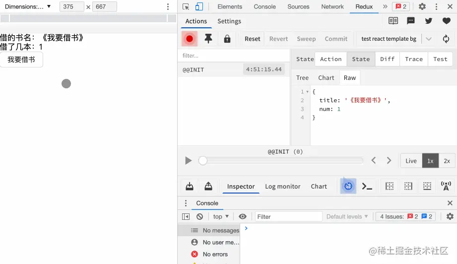 如上图所示，我们替换之后，代码没有问题。

#### 3.5.2 抽离公共的订阅逻辑

上面我们也提到过，我们需要在每一个业务组件里都调用subscribe进行订阅才能监测到store的变化。为了抽取订阅逻辑，我们直接封装一个自定义hook来解决这个问题：

```js
import {useState,useEffect,useContext} from "react"
import {storeContext} from '@/utils/context'

export const useStore=() => {
    const storeConsumer=useContext(storeContext)
    const [update,setUpdate]=useState({})
   
    useEffect(() => {
        storeConsumer.subscribe((val) => {
            console.log('store有变化',val);
            setUpdate({})
        })
    },[])

    return {
        storeConsumer
    }
}
```

自定义hook完成后，我们在业务组件引入即可：

```js
import React, {  useContext } from 'react'
import {useStore} from '../useStore'
import { Button } from 'antd';

const actionType=() => {
  ...略
}

export default function GrandFDemo() {
    const {storeConsumer} = useStore()
    
    return (
        <div>
            借的书名：{storeConsumer.getState().title}
            <br />
            借了几本：{storeConsumer.getState().num}
            <br />
            <Button onClick={() => { 
                storeConsumer.dispatch(actionType())
            }} >我要借书</Button>
        </div>  
    )
}
```

### 3.6 实现connect函数

现在我们订阅的公共逻辑是抽取到自定义hook里了。除此之外，我还想拓展一个需求：能不能把store相关的一些api和我们props做一层映射，也就是说咱直接在业务组件里配一些prop就能去操作store里的数据（为了引出connect真是要老命了）。

既然这么提了，那必须是可以实现的！为了实现和connect函数用法类似的方法，这里咱就不用自定义hook去实现了。话不多说，且看分析：

总结一下我们刚才要拓展的那个需求，目的就是为了增强业务组件的props，使业务组件可以以一种黑盒的方式直接去操作store中的数据。一看到增强组件的props，一些小伙伴的dna可能动了：这不纯纯用高阶函数嘛。既然这样，那就关门，放高阶函数！

```js
import React ,{PureComponent}from 'react'
import {storeContext} from '@/utils/context'
```
类写法：

```js
export const connect =(mapStateToProps, mapDispatchToProps) => {
    return (EnhancedComponent) => {
        class WrappedComp extends PureComponent {
            constructor(props,context) {
                super(props);
                this.state = {}
            }
            componentDidMount() {
                this.unsubscribe = this.context.subscribe(() => {
                     this.setState({...this.context.getState()})
                })
            }
            componentWillUnmount() {
                this.unsubscribe();
            }
            render() {
                return <EnhancedComponent {...this.props} 
                    {...mapStateToProps(this.context.getState())}
                    {...mapDispatchToProps(this.context.dispatch)}/>
            }
        }					
        WrappedComp.contextType = storeContext;
        return WrappedComp
    }
}
```

或者用函数式写法：

```js
import React ,{useEffect,useContext,useState} from 'react'
import {storeContext} from '@/utils/context'

export const connect=(mapStateToProps, mapDispatchToProps) => {
    return (EnhancedComponent) => {
        return (props) => {
            const context=useContext(storeContext)
            const [state,setState]=useState({})
            useEffect(() => {
                const unsubscribe = context.subscribe(() => {
                    setState({...context.getState()})
                })
                return () => {
                    unsubscribe()
                }
            },[])
            return (
                <div>
                    <EnhancedComponent {...props} 
                        {...mapStateToProps(context.getState())}
                        {...mapDispatchToProps(context.dispatch)}
                    />
                </div>
            )
        }
    }
}
```

看完代码，可能有的小伙伴这时候DNA就又动了：mapStateToProps、mapDispatchToProps 这个我熟呀，咱项目里用的就是这个来做映射的。该说不说，到此，咱就不知不觉实现了connect函数。手写完这个高阶函数之后，再去用第三方库的现成API感觉就不会突兀了！下面我们结合手写版的connect函数对业务组件进行调整：

```js
import React, { useContext,useState } from 'react' 
import { Button } from 'antd';
import {connect} from '../connect'

const actionType=() => {
  return   {
     ...略
    }
}

function GrandFDemo(props) {
  return (
    <div>
      借的书名：{props.title}
      <br />
      借了几本：{props.num}
      <br />
      <Button onClick={() => { 
      props.borrowBook(actionType())
    }} >我要借书</Button>
    </div>
  )
}

function mapStateToProps(sharedData) {
  return{
    title: sharedData.title,
    num:sharedData.num
  }
}

function mapDispatchToProps(dispatch){
  return{
    borrowBook:(action) => {
      dispatch(action)
    }
  }
}

export default  connect(mapStateToProps,mapDispatchToProps)(GrandFDemo)
```

从上面代码我们就可以发现，利用connect函数之后，我们就可以直接把一些和共享数据相关的拎到mapStateToProps、mapDispatchToProps而且我们再想操作共享数据时，就可以直接从自身props解构出来进行操作了。简单好用，一个字总结就是~~~6 。


## 四、引入react-redux库

上面一part我们虽然实现了store的解耦、connect函数的手写。但我们实际项目中，为了追求效率和代码逻辑的健壮性都会去引入react-redux这个第三方库来辅助我们开发，上面介绍了那么多也是为了帮助我们理解的更深刻。

老规矩，先下载react-redux：

```js
yarn add react-redux
```

> 多提一句：在我们实际项目中，并不是一定要用react-redux，虽然其给我们提供了很多便利，但是这也意味着咱还得去看下 react-redux里面相关的用法。

好了，接下来咱就开始介绍下react-redux里的相关api，也看看它到底是有多便捷（我们的store相关数据还是沿用之前的）。

### 4.1 Provider：共享store

react-redux里有一个Provider组件，其作用是将我们的redux里的store共享给所有的业务组件，我们的store只有经过Provider共享了才能被react-redux其他钩子获取使用。

Provider用法很简单，将我们在代码实现那一par自己维护的storeContext.Provider 替换成react-redux里的Provider即可。注意，react-redux中的Provider是使用store这个key值来传递共享中心store的；我们之前是用value来共享store的。

```js
import { Provider } from 'react-redux';
import App from './App';
import store from '@/store'
...
...
const root = ReactDOM.createRoot(document.getElementById('root'));

root.render(
    <Provider store={store}>
        <App />
    </Provider>
);
```

### 4.2 useStore: 获取store

上面我们把store共享给了全局，但是怎么在业务去拿这个store呢？这不useStore虽迟但到！

useStore是react-redux给我们这些玩家提供的一个获取当前项目store的钩子，我们利用这个钩子就可以去调用store上的dispatch、getState 等Api:

```js
import React from 'react'
import {useStore} from 'react-redux'
import { Button } from 'antd';

const actionType=() => {
  return   {
    ...同上
  } 
}

export default function Demo2(props) {
  const store=useStore()
  console.log('>>>>',store);
  return (
    <div>
      借的书名：{store.getState().title}
      <br />
      借了几本：{store.getState().num}
      <br />
      <Button onClick={() => { store.dispatch(actionType()) }}>我要借书</Button> 
    </div>
  )
}
```

### 4.3 useSelector：获取state，视图更新

之前我们说过，redux用的是订阅发布模式，如果不用subscribe订阅store的数据更新，从而在回调进行render的话，我们派发action后，只会改数据而不会引视图层的更新。那既然引入了react-redux，我们还需要手动订阅吗？还是那句话：那肯定不需要呀！

react-redux给我们提供了一个获取state的钩子函数useSelector。此钩子接收一个回调函数作为参数，回调的第一个参数就是我们的store所有的state值，返回值就是我们要取所有state值里的哪一个state值。

用法如下所示：

```js
import {useSelector} from 'react-redux'
...
 const globalnum=useSelector((allGlobalData)=>allGlobalData.num)
...
```

useSelector的获取state值的特性不是我想要重点说的。useSelector部分的主菜是它不仅能获取store里的state值，还能进行视图层面的render更新！！在useStore部分我们如果调试了就会发现，单凭store.dispatch、store.getState()不能引起rerender，想要改变视图还要我们手动去触发。

咱先上一段代码大家体会体会：

```js
import React from 'react'
import {useStore,useSelector} from 'react-redux'
import { Button } from 'antd';

const actionType=() => {
  return   {
    type: "MING_DYNASTY",
    payload:{
      title:"《明朝那些事儿》",
      num:1
    }
  } 
}

export default function Demo2(props) {
  const store=useStore()
  const data=useSelector((store) => { 
    return store.title 
  })

  console.log('视图render了>>>>');
  return (
    <div>
      借的书名：{store.getState().title}
      <br />
      <br />
      <Button onClick={() => { store.dispatch(actionType()) }}>我要借书</Button> 
    </div>
  )
}
```

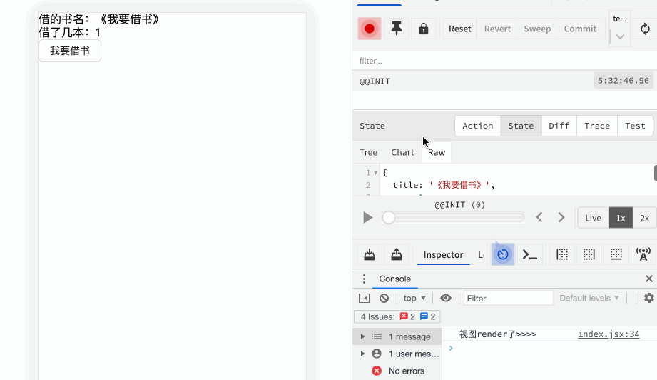

从上面这张图我们可以看到视图层发生了变化，但按道理来说视图是不会变化的：

1、首先我们是使用useStore来进行取值或者派发，useStore不会引起视图层render的；

2、其次我们只声明了useSelector返回出来的data值但还没有使用它，但当我们派发时视图就render了。后续当我们当我们再次单击我要借书按钮时，视图层又不进行render了，这现象属实奇怪。

有的小伙伴心里可能有个猜测：useSelector内部是不是有强制render的方法，当满足某些条件时就会进行触发从而刷新视图。咱就是说“盲生，你发现了华点” 。useSelector内部的处理这里咱们不做深入探讨，毕竟都能另开一篇文章了，简单总结就是：useSelector注册了个订阅，当我们state被操作时，此订阅就会被调用，若是这次操作导致useSelector返回值（注意，是useSelector的返回值对应这里就是data值）发生了改变，此时就会触发一次rerender改变视图并返回一个新值。


useSelector源码里使用 checkForUpdates来确认本次操作是否更新了返回值 ，若更新了则进行 forceRender。感兴趣的小伙伴们可以去看下react-redux的源码。

到这里可能会有人提问：如果我每次都返回对象呢？这样每次都是一个新的引用呐，还会触发forceRender吗？害，不愧是盲生，又发现了华点。确实，真要是返回对象那每次都会forceRender，为了避免这种情况，我们可以在useSelector的第二个参数上传入**shallowEqual**来解决对象每次render的问题:

```js
const data=useSelector((globalState) => { 
    return {title:globalState.title }
},shallowEqual)
```

补充：何时用useStore、何时用useSelector ？

**useStore使用场景：**

我们在实际项目中，有些地方的共享数据可能只作为参数进行组件内部赋值此时我们就没必要用useSelector进行取值，而是用**useStore**的getState方法去获取值。这样做的好处是避免了引入useSelector触发组件频繁rerender的问题。

**useSelector使用场景：**

当然，如果我们的共享数据要作为UI层的展示数据，并且也涉及到更新之类的情况，此时我们则用**useSelector**来去获取store里的state值。

### 4.4 useDispatch：派发action

useDispatch钩子的作用非常直白：返回dispatch进行派发action。这个钩子可以让我们在不引入store的情况下直接用store对象里的dispatch方法。用法如下：

```js
import { useDispatch} from 'react-redux'
...
  const dispatch=useDispatch()
...
```

### 4.5 connect：连接store操作与业务props属性

我们刚刚也手写了connect函数，其实react-redux已经给我们提供了的，使用方法和我们手写版的一模一样。将想要获取的state值维护在mapStateToProps中，更新store里state数据的方法维护到mapDispatchToProps中。同样的，我们使用了connect函数后，就不用手动去订阅store了，因为connect内部帮我们做了。下面看用法：

```js
import React from 'react'
import {connect} from 'react-redux'
import { Button } from 'antd';

const actionType=() => {
  return   {
    type: "MING_DYNASTY",
    payload:{
      title:"《明朝那些事儿》",
      num:val
    }
  } 
}

function Demo(props) {
  return (
    <div>
      借的书名：{props.title}
      <br />
      借了几本：{props.num} 
      <br />
      <Button onClick={() => { props.borrowBook(actionType()) }}>我要借书</Button>
    </div>
  )
}

function mapStateToProps(sharedData){
  return {
        title:sharedData.title
        num:sharedData.num
    }
}

function mapDispatchToProps(dispatch){
  return{
    borrowBook:(action) => {
      dispatch(action)
    }
  }
}

export default connect(mapStateToProps,mapDispatchToProps)(Demo)
```

我们可以看出，业务组件中使用了connect函数后，组件就变成了一个ui组件，一些业务逻辑就可以完成交给mapStateToProps、mapDispatchToProps来处理了！实际开发中，我个人偏向用useSelector和useDispatch来进行redux数据里的相关操作的。当然，如果想要把业务逻辑与组件层解耦，也可使用connect来进行相关操作。

## 五、redux功能增强

### 5.1 combineReducer：拆分reducer

我们首先要思考一个问题：随着我们项目的迭代，store里的reducer会处理越来越多的action，那时我们一个reducer可能会出现两三千行的情况，而且还全都掺着一堆判断。嘶~恐怖如斯，那我们应该怎么解决这个问题呢？肯定多招些图书管理员呗！

我们使用combineReducer 的目的就是为了让我们能有多个管理员也即可以帮助我们去拆分项目里的reducer。有了combineReducer之后，我们就能根据业务里的各个模块，将reducer对应模块进行拆分。每个模块的reducer维护每个业务模块对应的action和state，这样既利于维护，代码可读性也更高。 

首先要清楚combineReducer就是个函数，此函数接收各个模块的reducer作为参数。一般的我们建议将各个模块的reducer维护到一个对象中并作为参数传入combineReducer中。然后把combineReducer的返回值作为此项目的总reducer传入store中。好了，下面咱就用combineReducer来改造下上文的store文件：

store/index.js:

```js
import { legacy_createStore as createStore,combineReducers } from 'redux'
import { composeWithDevTools } from 'redux-devtools-extension'

// 1、这个bookReducer是我们业务里 book模块相关的reducer
const initBookState={title:'《我要借书》',num:1}
const bookReducer=(state=initBookState,action)=>{
  const {type,payload}=action
  switch (type) {
    case "MING_DYNASTY":
      return {...state, 
              num:payload.num,
              title:payload.title
             };
    default: 
      return state;
  }
}

// 2、userReducer是业务里 user模块相关的reducer
const initUserState={userID:'001',userName:'张添财'}
const userReducer=(state=initUserState,action)=>{
  const {type,payload}=action
  switch (type) {
    case "ROOT_USER":
      return {
        ...state, 
        userID:payload.userID,
        userName:payload.userName
      };
    default: 
      return state;
  }
}

// 用combineReducers整合各模块的reducer
const rootReducer=combineReducers({
  book:bookReducer,
  user:userReducer
})

const store = createStore(
  rootReducer,
  composeWithDevTools()
)

// 导出 Store 实例，
export default store
```

注意：我们用combineReducers改造reducer的同时，也要注意区分各自模块的action的type类型，不能出现重复现象！！并且由于是将项目reducer拆分成如上`combineReducers({ book:bookReducer, user:userReducer})`的形式，所以我们在业务中取值也要相应取对应key：`store.getState().book / store.getState().user`
但是我们在各自的bookReducer、userReducer中不用再区分book还是user，因为已经是各自维护本模块的state了。也既reducer不用写成如下形式：

```js
...
const bookReducer=(state=initBookState,action)=>{
  ...
  switch (type) {
    case "MING_DYNASTY":
      return {
        			...state, 
              // 这里不需要写成这种形式
              book:{
                num:payload.num,
              	title:payload.title
              }
             };
     ...
  }
}

const userReducer=(state=initUserState,action)=>{
 ...
  switch (type) {
    case "ROOT_USER":
      return {
        ...state, 
        // 这里不需要写成这种形式
        user:{
           userID:payload.userID,
        	 userName:payload.userName
        }
      };
  ...
  }
}
...
```

### 5.2 增加redux-thunk中间件支持异步请求

在我们真实开发中有些数据是拿服务端响应回来的数据的。这就要求redux要能支持异步。但默认情况下，redux是不支持异步请求数据的，也就是说从dispatch派发action --> reducer处理这个流程都是同步进行的。为了解决这个问题，redux允许我们使用中间件来在dispatch派发的action最终达到reducer之前进行功能拓展。

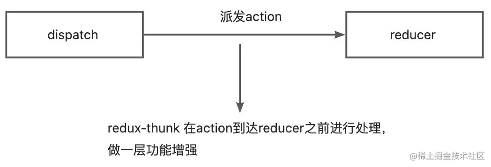

好了，此处我们引入 redux-thunk 来让redux支持一些异步操作。

下载安装redux-thunk：

```js
yarn add redux-thunk
```

store引入redux-thunk中间件：

```js
import { legacy_createStore as createStore ,applyMiddleware} from 'redux'
import { composeWithDevTools } from 'redux-devtools-extension'
import thunk from 'redux-thunk'
import rootReducer from './reducer'

// 创建 Store 实例
const store = createStore(
    // 参数一：根 reducer
    rootReducer,
    // 参数三：增强器,加中间件
    composeWithDevTools(applyMiddleware(thunk))
)

// 导出 Store 实例
export default store
```

这里我们要先了解下redux-thunk的整体使用流程：默认情况下，我们redux里的action都必须是一个对象。但是react-thunk可以允许我们的action既可以是一个对象，也可以是函数。当我们的action是一个函数时，它会接收两个参数dispatch和getState。我们把函数形式的action传到业务组件里的dispatch时，其内部会主动对action进行调用，不用我们去手动调。

```js
前提：引入react-thunk

const mockRequest=()=>{
  return new Promise((resolve)=>{
      setTimeout(()=>{
          resolve({title:"《三体》",num:1})
      },2000)
  })
}

const actionSync=(payload)=>({
  type:"SANTI",
  payload
})

// 这里入参的dispatch就相当于store里的dispatch；getState就是store里的getState函数
const actionAsync=async(dispatch,getState)=>{
    console.log('这是当前的state的值',getState())
    const res=await mockRequest()
    dispatch(actionSync(res))
}


业务文件：

...
 const	dispatch=useDispatch()
  	...
  	...
  	// 这里不用我们主动去调用actionAsync！！
    dispatch(actionAsync)
...
```

以上就是我们使用中间件来增强redux的全部步骤。不过各位小伙伴还是结合自己的业务去引入中间件，毕竟就算不引入redux-thunk咱还是可以在业务里调接口后再去派发action嘛！

## 六、业务实操-模块化拆分

在上面部分我们都是把reducer、store合并在一个文件中。但我们现在都是模块化开发，所以我们在使用redux的时候也要进行相应的模块化拆分。一般地，我们会将整个store文件拆分成index.js、reducer、action三个模块文件，这里我们就对之前的store文件进行改造拆分。

首先，我们把reducer拎出来单独创建文件夹，再根据业务模块来创建不同的reducer文件。

拆分book模块的reducer:

```js
|---reducer
   |---bookReducer.js
```

```js
const initState={title:'《我要借书》',num:1,allBooks:[]}
const bookReducer = (state=initState, action) => {  
    const {type,payload}=action
    switch (type) {
        case "MING_DYNASTY":
            return {
              	...state, 
                num:payload.num,
                title:payload.title
            };
        case "ALL_BOOKS":
            return {...state, allBooks:payload.allBooks};
        default: 
            return state;
    }
}

export default bookReducer
```

拆分user模块的reducer:

```js
|---reducer
    |---userReducer.js
```

```js
const initState={userID:'001',userName:'张添财'}
const userReducer = (state=initState, action) => {  
    const {type,payload}=action
    switch (type) {
        case "ROOT_USER":
            return {
              	...state, 
                userID:payload.userID,
                userName:payload.userName
            };
        default: 
            return state;
    }
}

export default userReducer
```

拆分reducer文件夹的入口文件，合并reducer：

```js
|---reducer
    |---index.js
```

```js
import { combineReducers } from 'redux'
import bookReducer from './bookReducer'
import userReducer from './userReducer'

const rootReducer=combineReducers({
	book:bookReducer,
  user:userReducer
})
export default rootReducer
```

同时在store中引入rootReducer：

```js
import { legacy_createStore as createStore ,applyMiddleware} from 'redux'
import { composeWithDevTools } from 'redux-devtools-extension'
import thunk from 'redux-thunk'
import rootReducer from './reducer'

// 创建 Store 实例
const store = createStore(
    rootReducer,
    composeWithDevTools(applyMiddleware(thunk))
)

// 导出 Store 实例
export default store
```

其次，创建action文件夹，根据个业务模块创建actions：

book模块的action：

```js
|---actions
    |---book
        |---booksActionCreator.js
```

```js
const mockRequest=()=>{
  // 模拟接口请求
  return new Promise((resolve)=>{
      setTimeout(()=>{
          resolve([{title:"《明朝那些事儿》",num:10},
                   {title:"《三体》",num:8},
                   {title:"《时间简史》",num:20}])
      },1000)
  })
}

export const borrowBooksAction=(val=1)=>{
	return {
      type: "MING_DYNASTY",
    	payload:{
      	title:"《明朝那些事儿》",
      	num:val
    }
  }
}

const allBooksAction=(data)=>{
	return {
 			type: "ALL_BOOKS",
    	payload:{
        allBooks:data
  }
}

export const fetchAllBooksAction=async()=>{
    return (dispatch)=>{
        const res=await mockRequest()
        dispatch(allBooksAction(res))
    }
}
```

user模块的action：

```js
|---actions
    |---user
        |---userActionCreator.js
```

```js
export const borrowBooksAction=()=>{
	return {
      type: "ROOT_USER",
    	payload:{
      	userID:"007",
      	userName:'添财青年'
    }
  }
}
```

最后，在业务组件进行派发action即可：

Demo.jsx:

```js
import React from 'react'
import {useSelector, useDispatch} from 'react-redux'
import {borrowBooksAction} from '@/redux/reducer/booksActionCreator'
import { Button } from 'antd';
import Demo from './Demo'

function Demo(props) {
    const data=useSelector((store) => { 
        return {title:store.book.title,num:store.book.num,allBooks:store.book.allBooks }
    },shallowEqual)
    
    const dispatch=useDispatch()
    
    return (
        <div>
            借的书名：{data.title}
            <br />
            借了几本：{data.num}
            <br />
      <Button onClick={() => { dispatch(borrowBooksAction(1)) }}>借明朝</Button> 
      <Button onClick={() => { store.dispatch(fetchAllBooksAction()) }}>获取全部可借图书</Button> 
          	<br />
          这是全部的可借图书：{
            data.allBooks.map((item)=>{
              return (
                <div>
                  item.title
                  <br />
                </div>
              )
            })
          }
        </div>
    )
}

export default Demo
```

好了，至此，我们redux部分就到此结束了。在我们的实际开发就是按照业务实操这一part进行文件拆分、store数据分发的，各位多加练习，问题都不大的！

整个store模块的目录结构：

```js
 |---store
     |---index.js
     |---reducer
        |---userReducer.js
        |---bookReducer.js
     |---actions
        |---book
            |---booksActionCreator.js
        |---user
            |---userActionCreator.js
```

## 结语

能看到这里的小伙伴属实难得，在写到这里的时候本来还想顺着思路介绍下RTK，奈何写的时间太长了，精力被榨干了，没办法，咱只能后续有机会再聊聊RTK了。年底了，回想22年初给自己定的各种计划真是让人汗颜！过完了兵荒马乱的2022，咱期待着明年一切都会好起来的吧。又是那句话：修炼内功，砥砺前行，各位继续努力呀！

<hr>

#### <p>原文出处：<a href='https://blog.csdn.net/Azbtt/article/details/130905273' target='blank'>Redux Toolkit</a></p>

上边的案例我们一直在使用[Redux](https://so.csdn.net/so/search?q=Redux&spm=1001.2101.3001.7020)核心库来使用Redux，除了Redux核心库外Redux还为我们提供了一种使用Redux的方式——Redux Toolkit。它的名字起的非常直白，Redux工具包，简称RTK。RTK可以帮助我们处理使用Redux过程中的重复性工作，简化Redux中的各种操作。

## 1.Redux

[Toolkit](https://so.csdn.net/so/search?q=Toolkit&spm=1001.2101.3001.7020) 概览

### 1.1 Redux Toolkit 是什么？

**Redux Toolkit** 是官方推荐的编写 **Redux** 逻辑的方法。 它包含我们对于构建 **Redux** 应用程序必不可少的包和函数。 **Redux Toolkit** 的构建简化了大多数 **Redux** 任务，防止了常见错误，并使编写 **Redux** 应用程序变得更加容易。可以说 **Redux Toolkit** 就是目前 **Redux** 的最佳实践方式。  

为了方便后面内容，之后 **Redux Toolkit** 简称 **RTK**

### 1.2 目的

Redux 核心库是故意设计成非定制化的样子（unopinionated）。怎么做完全取决于你，例如配置 store，你的 state 存什么东西，以及如何构建 reducer。  

有些时候这样挺好，因为有很高的灵活性，但我们又不总是需要这么高的自由度。有时，我们只是想以最简单的方式上手，并想要一些良好的默认行为能够开箱即用。或者，也许你正在编写一个更大的应用程序并发现自己正在编写一些类似的代码，而你想减少必须手工编写的代码量。  

**Redux Toolkit** 它最初是为了帮助解决有关 Redux 的三个常见问题而创建的：

  * “配置 Redux store 过于复杂”
  * “我必须添加很多软件包才能开始使用 Redux”
  * “Redux 有太多样板代码”

### 1.3 为什么需要使用 Redux Toolkit

通过遵循我们推荐的最佳实践，提供良好的默认行为，捕获错误并让你编写更简单的代码，**React Toolkit** 使得编写好的 Redux 应用程序以及加快开发速度变得更加容易。 Redux Toolkit 对**所有 Redux 用户都有帮助**，无论技能水平或者经验如何。可以在新项目开始时添加它，也可以在现有项目中将其用作增量迁移的一部分。

### 1.4 文档链接

学习的最佳方法我个人觉得还是看官方文档比较权威： [中文官方文档](http://cn.redux.js.org/introduction/getting-started)、[英文官方文档](https://redux-toolkit.js.org/)。

  * 简介 
    * [快速开始](https://redux-toolkit.js.org/introduction/quick-start)
  * 教程 
    * [基础教程](https://redux-toolkit.js.org/tutorials/basic-tutorial)
    * [中级教程](https://redux-toolkit.js.org/tutorials/intermediate-tutorial)
    * [高级教程](https://redux-toolkit.js.org/tutorials/advanced-tutorial)
  * 使用 Redux Toolkit 
    * [入门](https://redux-toolkit.js.org/usage/usage-guide)
  * API 文档 
    * [configureStore](https://redux-toolkit.js.org/api/configureStore)
    * [getDefaultMiddleware](https://redux-toolkit.js.org/api/getDefaultMiddleware)
    * [createReducer](https://redux-toolkit.js.org/api/createReducer)
    * [createAction](https://redux-toolkit.js.org/api/createAction)
    * [createSlice](https://redux-toolkit.js.org/api/createSlice)
    * [createSelector](https://redux-toolkit.js.org/api/createSelector)
    * [其他 Export](https://redux-toolkit.js.org/api/other-exports)

## 2.安装

安装，无论是[RTK](https://so.csdn.net/so/search?q=RTK&spm=1001.2101.3001.7020)还是Redux，在React中使用时react-redux都是必不可少，所以使用RTK依然需要安装两个包：react-redux和@reduxjs/toolkit。  

npm

> npm install react-redux @reduxjs/toolkit -S

yarn

> yarn add react-redux @reduxjs/toolkit

在官方文档中其实提供了完整的 **RTK** 项目创建命令，但咱们学习就从基础的搭建开始吧。

## 3.基础开发流程

安装完相关包以后开始编写基本的 **RTK** 程序

  * 创建一个store文件夹
  * 创建一个index.ts做为主入口
  * 创建一个festures文件夹用来装所有的store
  * 创建一个counterSlice.js文件，并导出简单的加减方法

### 3.1 创建 Redux State Slice

创建 slice 需要一个字符串名称来标识切片、一个初始 state 以及一个或多个定义了该如何更新 state 的 reducer 函数。slice 创建后 ，我们可以导出 slice 中生成的 Redux action creators 和 reducer 函数。  

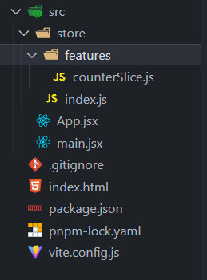  

store/features/counterSlice.js

```js
import { createSlice } from '@reduxjs/toolkit'

const initialState = {
  value: 0,
}

// 创建一个Slice
export const counterSlice = createSlice({
  name: 'counter',
  initialState,
  reducers: {
    // 定义一个加的方法
    increment: state => {
      state.value += 1
    },
    // 定义一个减的方法
    decrement: state => {
      state.value -= 1
    },
  },
})

console.log('counterSlice', counterSlice)
console.log('counterSlice.actions', counterSlice.actions)

// 导出加减方法
export const { increment, decrement } = counterSlice.actions

// 暴露reducer
export default counterSlice.reducer
```

createSlice是一个全自动的创建reducer切片的方法，在它的内部调用就是createAction和createReducer，之所以先介绍那两个也是这个原因。createSlice需要一个对象作为参数，对象中通过不同的属性来指定reducer的配置信息。  

createSlice(configuration object) 配置对象中的属性：

  * name —— reducer的名字，会作为action中type属性的前缀，不要重复
  * initialState —— state的初始值
  * reducers —— reducer的具体方法，需要一个对象作为参数，可以以方法的形式添加reducer，RTK会自动生成action对象。

总的来说，使用createSlice创建切片后，切片会自动根据配置对象生成action和reducer，action需要导出给调用处，调用处可以使用action作为dispatch的参数触发state的修改。reducer需要传递给configureStore以使其在仓库中生效。  

我们可以看看counterSlice和counterSlice.actions是什么样子  

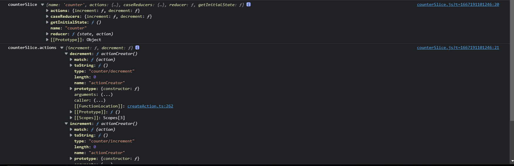

### 3.2 将 Slice Reducers 添加到 Store 中

下一步，我们需要从计数切片中引入 reducer 函数，并将它添加到我们的 store 中。通过在 reducer 参数中定义一个字段，我们告诉 store 使用这个 slice reducer 函数来处理对该状态的所有更新。  

我们以前直接用redux是这样的

```js
const reducer = combineReducers({
    counter:counterReducers
});

const store = createStore(reducer);
```

store/index.js  

切片的reducer属性是切片根据我们传递的方法自动创建生成的reducer，需要将其作为reducer传递进configureStore的配置对象中以使其生效：

```js
import { configureStore } from '@reduxjs/toolkit'
import counterSlice from './features/counterSlice'

// configureStore创建一个redux数据
const store = configureStore({
  // 合并多个Slice
  reducer: {
    counter: counterSlice,
  },
})

export default store
```

  * configureStore需要一个对象作为参数，在这个对象中可以通过不同的属性来对store进行设置，比如：reducer属性用来设置store中关联到的reducer，preloadedState用来指定state的初始值等，还有一些值我们会放到后边讲解。
  * reducer属性可以直接传递一个reducer，也可以传递一个对象作为值。如果只传递一个reducer，则意味着store中只有一个reducer。若传递一个对象作为参数，对象的每个属性都可以执行一个reducer，在方法内部它会自动对这些reducer进行合并。

### 3.3 store加到全局

main.js

```js
import React from 'react'
import ReactDOM from 'react-dom/client'
import App from './App'

// redux toolkit
import { Provider } from 'react-redux'
import store from './store'

ReactDOM.createRoot(document.getElementById('root')).render(
  <Provider store={store}>
    <App />
  </Provider>,
)
```

### 3.4 在 React 组件中使用 Redux 状态和操作

现在我们可以使用 React-Redux 钩子让 React 组件与 Redux store 交互。我们可以使用 useSelector 从 store 中读取数据，使用 useDispatch dispatch actions。  

App.jsx

```js
import React from 'react'
import { useDispatch, useSelector } from 'react-redux'
// 引入对应的方法
import { increment, decrement } from './store/features/counterSlice'
export default function App() {
  const count = useSelector(state => state.counter.value)
  const dispatch = useDispatch()
  return (
    <div style={{ width: 100, margin: '100px auto' }}>
      <button onClick={() => dispatch(increment())}>+</button>
      <span>{count}</span>
      <button onClick={() => dispatch(decrement())}>-</button>
    </div>
  )
}
```

  

现在，每当你点击”递增“和“递减”按钮。

  * 会 dispatch 对应的 Redux action 到 store
  * 在计数器切片对应的 reducer 中将看到 action 并更新其状态
  * 组件将从 store 中看到新的状态，并使用新数据重新渲染组件

### 3.5 小总结

这是关于如何通过 React 设置和使用 Redux Toolkit 的简要概述。 回顾细节：

  * 使用configureStore创建 Redux store 
    * configureStore 接受 reducer 函数作为命名参数
    * configureStore 使用的好用的默认设置自动设置 store
  * 为 React 应用程序组件提供 Redux store 
    * 使用 React-Redux 组件包裹你的 
    * 传递 Redux store 如 
  * 使用 createSlice 创建 Redux “slice” reducer 
    * 使用字符串名称、初始状态和命名的 reducer 函数调用“createSlice”
    * Reducer 函数可以使用 Immer 来“改变”状态
    * 导出生成的 slice reducer 和 action creators
  * 在 React 组件中使用 React-Redux useSelector/useDispatch 钩子 
    * 使用 useSelector 钩子从 store 中读取数据
    * 使用 useDispatch 钩子获取 dispatch 函数，并根据需要 dispatch actions

## 4.补充解析上面计数器案例

这个工具帮我们封装好了很多操作，虽然很方便，但是刚使用很多地方不是那么习惯。  
每个文件的代码就不贴了，和上面一样的，可以复制到文本结合看

### 4.1 创建 Slice Reducer 和 Action

store/features/counterSlice.js  
早些时候，我们看到单击视图中的不同按钮会 dispatch 三种不同类型的 Redux action：

  * {type: “counter/increment”}
  * {type: “counter/decrement”}
  * {type: “counter/incrementByAmount”}

我们知道 action 是带有 type 字段的普通对象，type 字段总是一个字符串，并且我们通常有 action creator 函数来创建和返回action 对象。那么在哪里定义 action 对象、类型字符串和 action creator 呢？  

我们_可以_每次都手写。但是，那会很乏味。此外，Redux 中_真正_重要的是 reducer 函数，以及其中计算新状态的逻辑。  

Redux Toolkit 有一个名为 createSlice 的函数，它负责生成 action 类型字符串、action creator 函数和 action 对象的工作。你所要做的就是为这个 slice 定义一个名称，编写一个包含 reducer 函数的对象，它会自动生成相应的 action 代码。name 选项的字符串用作每个 action 类型的第一部分，每个 reducer 函数的键名用作第二部分。因此，“counter” 名称 + “increment” reducer 函数生成了一个 action 类型 {type: “counter/increment”}。（毕竟，如果计算机可以为我们做，为什么要手写！）  

除了 name 字段，createSlice 还需要我们为 reducer 传入初始状态值，以便在第一次调用时就有一个 state。在这种情况下，我们提供了一个对象，它有一个从 0 开始的 value 字段。  

我们可以看到这里有三个 reducer 函数，它们对应于通过单击不同按钮 dispatch 的三种不同的 action 类型。  

createSlice 会自动生成与我们编写的 reducer 函数同名的 action creator。我们可以通过调用其中一个来检查它并查看它返回的内容：

```js
console.log(counterSlice.actions.increment())
// {type: "counter/increment"}
```

它还生成知道如何响应所有这些 action 类型的 slice reducer 函数：

```js
const newState = counterSlice.reducer(
  { value: 10 },
  counterSlice.actions.increment()
)

console.log(newState)
// {value: 11}
```

### 4.2 Reducer 的规则

Reducer 必需符合以下规则：

  * 仅使用 state 和 action 参数计算新的状态值
  * 禁止直接修改 state。必须通过复制现有的 state 并对复制的值进行更改的方式来做 _不可变更新（immutable updates）_。
  * 禁止任何异步逻辑、依赖随机值或导致其他“副作用”的代码

但为什么这些规则很重要？有几个不同的原因：

  * Redux 的目标之一是使你的代码可预测。当函数的输出仅根据输入参数计算时，更容易理解该代码的工作原理并对其进行测试。
  * 另一方面，如果一个函数依赖于自身之外的变量，或者行为随机，你永远不知道运行它时会发生什么。

“不可变更新（Immutable Updates）” 这个规则尤其重要，值得进一步讨论。

### 4.3 Reducer 与 Immutable 更新

前面讲过 “mutation”（更新已有对象/数组的值）与 “immutability”（认为值是不可以改变的）  

在 Redux 中，**_永远_ 不允许在 reducer 中更改 state 的原始对象！**

```js
// ❌ 非法 - 默认情况下，这将更改 state！
state.value = 123
```

不能在 Redux 中更改 state 有几个原因：

  * 它会导致 bug，例如视图未正确更新以显示最新值
  * 更难理解状态更新的原因和方式
  * 编写测试变得更加困难
  * 它违背了 Redux 的预期精神和使用模式

所以如果我们不能更改原件，我们如何返回更新的状态呢？  
**Reducer 中必需要先创建原始值的副本，然后可以改变副本。**

```js
// ✅ 这样操作是安全的，因为创建了副本
return {
  ...state,
  value: 123
}
```

我们已经看到我们可以[手动编写 immutable 更新](https://cn.redux.js.org/tutorials/essentials/part-1-overview-concepts#immutability)。但是，手动编写不可变的更新逻辑确实繁琐，而且在 reducer 中意外改变状态是 Redux 用户最常犯的一个错误。  

**这就是为什么 Redux Toolkit 的 createSlice 函数可以让你以更简单的方式编写不可变更新！**  

createSlice 内部使用了一个名为 [Immer](https://immerjs.github.io/immer/) 的库。 Immer 使用一种称为 “Proxy” 的特殊 JS 工具来包装你提供的数据，当你尝试 ”mutate“ 这些数据的时候，奇迹发生了，**Immer 会跟踪你尝试进行的所有更改，然后使用该更改列表返回一个安全的、不可变的更新值**，就好像你手动编写了所有不可变的更新逻辑一样。  

所以，下面的代码：

```js
function handwrittenReducer(state, action) {
  return {
    ...state,
    first: {
      ...state.first,
      second: {
        ...state.first.second,
        [action.someId]: {
          ...state.first.second[action.someId],
          fourth: action.someValue
        }
      }
    }
  }
}
```

可以变成这样：

```js
function reducerWithImmer(state, action) {
  state.first.second[action.someId].fourth = action.someValue
}
```

变得非常易读！  
但，还有一些非常重要的规则要记住：

#### 警告

**你只能在 Redux Toolkit 的 createSlice 和 createReducer 中编写 “mutation” 逻辑，因为它们在内部使用 Immer！如果你在没有 Immer 的 reducer 中编写 mutation 逻辑，它将改变状态并导致错误！**

## 5.传递参数

上面的项目中固定的加一减一，那如果我们想加多少就能动态加多少，那就需要传参。那如何传参呢？

### 5.1 定义接受参数

接收参数的方式和 **redux** 一样，我们可以通过 action 来接收参数，如下：  
store/features/counterSlice.js

```js
import { createSlice } from '@reduxjs/toolkit'

// 创建一个Slice
export const counterSlice = createSlice({
  //  ...
  reducers: {
    incrementByAmount: (state, action) => {
      // action 里面有 type 和 payload 两个属性，所有的传参都在payload里面
      console.log(action)
      state.value += action.payload
    },
  },
})

// 导出加减方法
export const { increment, decrement, incrementByAmount } = counterSlice.actions

// 暴露reducer
export default counterSlice.reducer
```

incrementByAmount的action参数  

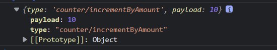

### 5.2 传递参数

和 **redux** 的传参一样，如下：

```js
import React, { useState } from 'react'
import { useDispatch, useSelector } from 'react-redux'

// 引入对应的方法
import { incrementByAmount } from './store/features/counterSlice'

export default function App() {
  const count = useSelector(state => state.counter.value)
  const dispatch = useDispatch()
  const [amount, setAmount] = useState(1)

  return (
    <div style={{ width: 500, margin: '100px auto' }}>
      <input type="text" value={amount} onChange={e => setAmount(e.target.value)} />
      <button onClick={() => dispatch(incrementByAmount(Number(amount) || 0))}> Add Amount </button>
      <span>{count}</span>
    </div>
  )
}
```

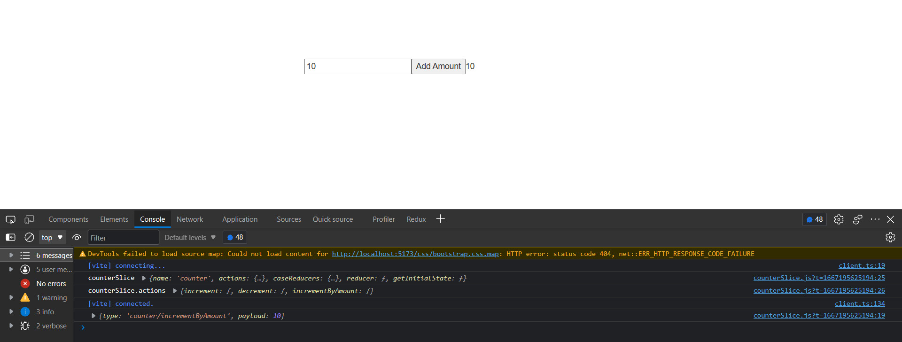

注意这里reducer的action中如果要传入参数，只能是一个payload，如果是多个参数的情况，那就需要封装成一个payload的对象。

### 5.3 Action Payloads

以一个常见的todo案例来讲解  
store/features/todoSlice.js

```js
import { createSlice, nanoid } from '@reduxjs/toolkit'

const initialState = {
  todoList: [],
}

// 创建一个Slice
export const todoSlice = createSlice({
  name: 'todo',
  initialState,
  reducers: {
    addTodo: (state, action) => {}
    },
  },
})

// 导出加减方法
export const { addTodo } = todoSlice.actions

// 暴露reducer
export default todoSlice.reducer
```

store/index.js

```js
import { configureStore } from '@reduxjs/toolkit'
import counterSlice from './features/counterSlice'
import todoSlice from './features/todoSlice'

// configureStore创建一个redux数据
const store = configureStore({
  // 合并多个Slice
  reducer: {
    counter: counterSlice,
    todo: todoSlice,
  },
})

export default store
```

Todo.jsx

```js
import React from 'react'
import { useDispatch, useSelector } from 'react-redux'
// 引入对应的方法
import { addTodo } from '../store/features/todoSlice'

export default function Todo() {
  const todoList = useSelector(state => state.todo.todoList)
  const dispatch = useDispatch()

  return (
    <div>
      <p>任务列表</p>
      <ul>
        {todoList.map(todo => (
          <li key={todo.id}>
            <input type="checkbox" defaultChecked={todo.completed} /> {todo.content}
          </li>
        ))}
      </ul>
      <button onClick={() => dispatch(addTodo('敲代码'))}>增加一个todo</button>
    </div>
  )
}
```

我们刚刚看到 createSlice 中的 action creator 通常期望一个参数，它变成了action.payload。这简化了最常见的使用模式，但有时我们需要做更多的工作来准备 action 对象的内容。 在我们的 postAdded 操作的情况下，我们需要为新todo生成一个唯一的 ID，我们还需要确保有效 payload 是一个看起来像 {id, content, completed}
的对象。  

现在，我们正在 React 组件中生成 ID 并创建有效 payload 对象，并将有效 payload 对象传递给 addTodo。但是，如果我们需要从不同的组件 dispatch 相同的 action，或者准备 payload 的逻辑很复杂怎么办？ 每次我们想要 dispatch action 时，我们都必须复制该逻辑，并且我们强制组件确切地知道此 action 的有效 payload 应该是什么样子。

#### 注意

如果 action 需要包含唯一 ID 或其他一些随机值，请始终先生成该随机值并将其放入 action 对象中。 **Reducer中永远不应该计算随机值**，因为这会使结果不可预测。  

幸运的是，createSlice 允许我们在编写 reducer 时定义一个 prepare 函数。 prepare 函数可以接受多个参数，生成诸如唯一ID 之类的随机值，并运行需要的任何其他同步逻辑来决定哪些值进入 action 对象。然后它应该返回一个包含 payload 字段的对象。（返回对象还可能包含一个 meta 字段，可用于向 action 添加额外的描述性值，以及一个 error 字段，该字段应该是一个布尔值，指示此 action 是否表示某种错误。）  

rtk还提供了一个nanoid方法，用于生成一个固定长度的随机字符串，类似uuid功能。  

可以打印dispatch(addTodo(’敲代码‘))的结果看到，返回了一个带有payload字段的action

```js
import { createSlice, nanoid } from '@reduxjs/toolkit'

// 创建一个Slice
export const todoSlice = createSlice({
  name: 'todo',
  initialState,

  reducers: {
    addTodo: {
      // 这个函数就是我们平时直接写在这的函数（ addTodo: (state, action) => {}）
      reducer(state, aciton) {
        console.log('addTodo-reducer执行')
        const { id, content } = aciton.payload
        state.todoList.push({ id, content, completed: false })
      },

       // 预处理函数，返回值就是reducer函数接收的pyload值, 必须返回一个带有payload字段的对象
      prepare(content) {
        console.log('prepare参数', content)
        return {
          payload: {
            id: nanoid(),
            content,
          },
        }
      },
    },
  },
})
```

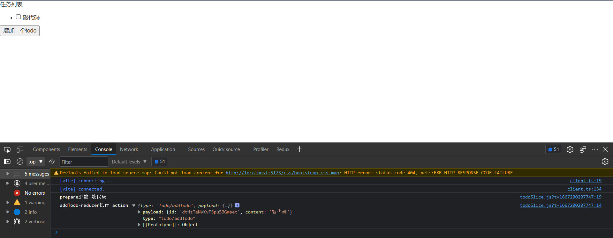  

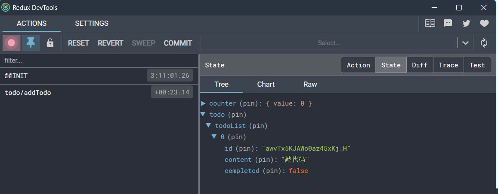

## 6.异步逻辑与数据请求

### 6.1 Thunks 与异步逻辑

就其本身而言，Redux store 对异步逻辑一无所知。它只知道如何同步 dispatch action，通过调用 root reducer 函数更新状态，并通知 UI 某些事情发生了变化。任何异步都必须发生在 store 之外。  

但是，如果你希望通过调度或检查当前 store 状态来使异步逻辑与 store 交互，该怎么办？ 这就是 [Redux middleware](https://cn.redux.js.org/tutorials/fundamentals/part-4-store#middleware) 的用武之地。它们扩展了 store，并允许你：

  * dispatch action 时执行额外的逻辑（例如打印 action 的日志和状态）
  * 暂停、修改、延迟、替换或停止 dispatch 的 action
  * 编写可以访问 dispatch 和 getState 的额外代码
  * 教 dispatch 如何接受除普通 action 对象之外的其他值，例如函数和 promise，通过拦截它们并 dispatch 实际 action 对象来代替

Redux 有多种异步 middleware，每一种都允许你使用不同的语法编写逻辑。最常见的异步 middleware 是 [redux-thunk](https://github.com/reduxjs/redux-thunk)，它可以让你编写可能直接包含异步逻辑的普通函数。Redux Toolkit 的 configureStore 功能[默认自动设置 thunk middleware](https://redux-toolkit.js.org/api/getDefaultMiddleware#included-default-middleware)，[我们推荐使用 thunk 作为 Redux 开发异步逻辑的标准方式](https://cn.redux.js.org/style-guide/#use-thunks-for-async-logic)。

### 6.2 Thunk 函数

thunk最重要的思想，就是可以接受一个返回函数的action creator。如果这个action creator 返回的是一个函数，就执行它，如果不是，就按照原来的action执行。  

正因为这个action creator可以返回一个函数，那么就可以在这个函数中执行一些异步的操作。  

Thunks 通常还可以使用 action creator 再次 dispatch 普通的 action，比如 dispatch(increment())  

为了与 dispatch 普通 action 对象保持一致，我们通常将它们写为 _thunk action creators_，它返回 thunk 函数。这些 action creator 可以接受可以在 thunk 中使用的参数。

```js
const incrementAsync = amount => {
  return (dispatch, getState) => {
    setTimeout(() => {
      dispatch(incrementByAmount(amount))
    }, 1000)
  }
}
```

incrementAsync函数就返回了一个函数，将dispatch作为函数的第一个参数传递进去，在函数内进行异步操作就可以了。  

Thunk 通常写在 “slice” 文件中。createSlice 本身对定义 thunk 没有任何特殊支持，因此你应该将它们作为单独的函数编写在同一个 slice 文件中。这样，他们就可以访问该 slice 的普通 action creator，并且很容易找到 thunk 的位置。

### 6.3 改写之前的计数器案例

增加一个延时器  
store/features/counterSlice.js

```js
import { createSlice } from '@reduxjs/toolkit'

const initialState = {
  value: 0,
}

// 创建一个Slice
export const counterSlice = createSlice({
  name: 'counter',
  initialState,
  reducers: {
    incrementByAmount: (state, action) => {
      // action 里面有 type 和 payload 两个属性，所有的传参都在payload里面
      state.value += action.payload
    },
  },
})

const {incrementByAmount } = counterSlice.actions

export const incrementAsync = amount => {
  return (dispatch, getState) => {
    const stateBefore = getState()
    console.log('Counter before:', stateBefore.counter)
    setTimeout(() => {
      dispatch(incrementByAmount(amount))
      const stateAfter = getState()
      console.log('Counter after:', stateAfter.counter)
    }, 1000)
  }
}

// 暴露reducer
export default counterSlice.reducer
```

`App.jsx

```js
import React, { useState } from 'react'
import { useDispatch, useSelector } from 'react-redux'
// 引入对应的方法
import { incrementAsync } from './store/features/counterSlice'

export default function App() {
  const count = useSelector(state => state.counter.value)
  const dispatch = useDispatch()
  const [amount, setAmount] = useState(1)

  return (
    <div style={{ width: 500, margin: '100px auto' }}>
      <input type="text" value={amount} onChange={e => setAmount(e.target.value)} />
      <button onClick={() => dispatch(incrementAsync(Number(amount) || 0))}> Add Async </button>
      <span>{count}</span>
    </div>
  )
}
```

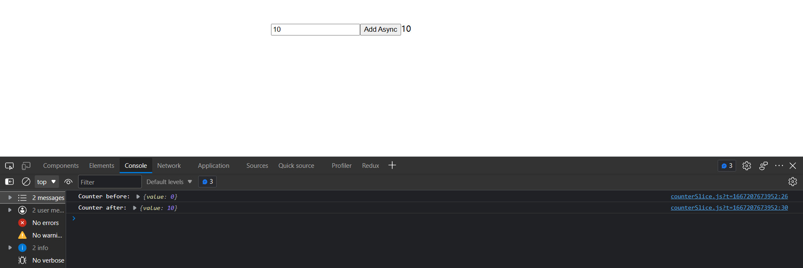

### 6.4 编写异步 Thunks

Thunk 内部可能有异步逻辑，例如 setTimeout、Promise 和 async/await。这使它们成为使用 AJAX 发起 API
请求的好地方。  

Redux 的数据请求逻辑通常遵循以下可预测的模式：

  * 在请求之前 dispatch 请求“开始”的 action，以指示请求正在进行中。这可用于跟踪加载状态以允许跳过重复请求或在 UI 中显示加载中提示。
  * 发出异步请求
  * 根据请求结果，异步逻辑 dispatch 包含结果数据的“成功” action 或包含错误详细信息的 “失败” action。在这两种情况下，reducer 逻辑都会清除加载状态，并且要么展示成功案例的结果数据，要么保存错误值并在需要的地方展示。

这些步骤不是 _必需的_，而是常用的。（如果你只关心一个成功的结果，你可以在请求完成时发送一个“成功” action ，并跳过“开始”和“失败” action 。）  

Redux Toolkit 提供了一个 createAsyncThunk API 来实现这些 action 的创建和 dispatch，我们很快就会看看如何使用它。  

如果我们手动编写一个典型的 async thunk 的代码，它可能看起来像这样：

```js
const getRepoDetailsStarted = () => ({
  type: 'repoDetails/fetchStarted'
})

const getRepoDetailsSuccess = repoDetails => ({
  type: 'repoDetails/fetchSucceeded',
  payload: repoDetails
})

const getRepoDetailsFailed = error => ({
  type: 'repoDetails/fetchFailed',
  error
})

const fetchIssuesCount = (org, repo) => async dispatch => {
  dispatch(getRepoDetailsStarted())
  try {
    const repoDetails = await getRepoDetails(org, repo)
    dispatch(getRepoDetailsSuccess(repoDetails))
  } catch (err) {
    dispatch(getRepoDetailsFailed(err.toString()))
  }
}
```

但是，使用这种方法编写代码很乏味。每个单独的请求类型都需要重复类似的实现：

  * 需要为三种不同的情况定义独特的 action 类型
  * 每种 action 类型通常都有相应的 action creator 功能
  * 必须编写一个 thunk 以正确的顺序发送正确的 action

createAsyncThunk 实现了这套模式：通过生成 action type 和 action creator 并生成一个自动 dispatch 这些 action 的 thunk。你提供一个回调函数来进行异步调用，并把结果数据返回成 Promise。

### 6.5 使用 createAsyncThunk 请求数据

Redux Toolkit 的 createAsyncThunk API 生成 thunk，为你自动 dispatch 那些 “start/success/failure” action。  
让我们从添加一个 thunk 开始，该 thunk 将进行 AJAX 调用。  

store/features/counterSlice.js

```js
import { createSlice, createAsyncThunk } from '@reduxjs/toolkit'

// 请求电影列表
const reqMovieListApi = () =>
  fetch(
    'https://pcw-api.iqiyi.com/search/recommend/list?channel_id=1&data_type=1&mode=24&page_id=1&ret_num=48',
  ).then(res => res.json())

const initialState = {
  status: 'idel',
  list: [],
  totals: 0,
}

// thunk函数允许执行异步逻辑, 通常用于发出异步请求。
// createAsyncThunk 创建一个异步action，方法触发的时候会有三种状态：
// pending（进行中）、fulfilled（成功）、rejected（失败）
export const getMovieData = createAsyncThunk('movie/getMovie', async () => {
  const res = await reqMovieListApi()
  return res.data
})
```

createAsyncThunk 接收 2 个参数:

  * 将用作生成的 action 类型的前缀的字符串
  * 一个 “payload creator” 回调函数，它应该返回一个包含一些数据的 Promise，或者一个被拒绝的带有错误的 Promise

Payload creator 通常会进行某种 AJAX 调用，并且可以直接从 AJAX 调用返回 Promise，或者从 API 响应中提取一些数据并返回。我们通常使用 JS async/await 语法来编写它，这让我们可以编写使用 Promise 的函数，同时使用标准的 try/catch 逻辑而不是 somePromise.then() 链式调用。  

在这种情况下，我们传入 ‘movie/getMovie’ 作为 action 类型的前缀。我们的 payload 创建回调等待 API 调用返回响应。响应对象的格式为 {data: []}，我们希望我们 dispatch 的 Redux action 有一个 payload，也就是电影列表的数组。所以，我们提取 response.data，并从回调中返回它。  

当调用 dispatch(getMovieData()) 的时候，getMovieData 这个 thunk 会首先 dispatch 一个 action 类型为’movie/getMovie/pending’：  

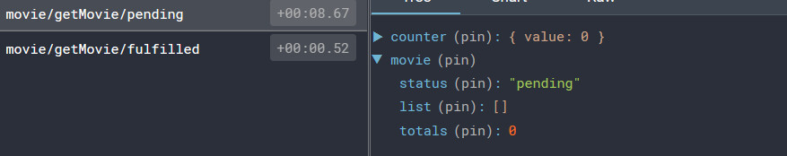  

我们可以在我们的 reducer 中监听这个 action 并将请求状态标记为 “loading 正在加载”。  

一旦 Promise 成功，getMovieData thunk 会接受我们从回调中返回的 response.data ，并 dispatch 一个 action，action 的 payload 为 接口返回的数据（response.data ），action 的 类型为 ‘movie/getMovie/fulfilled’。  

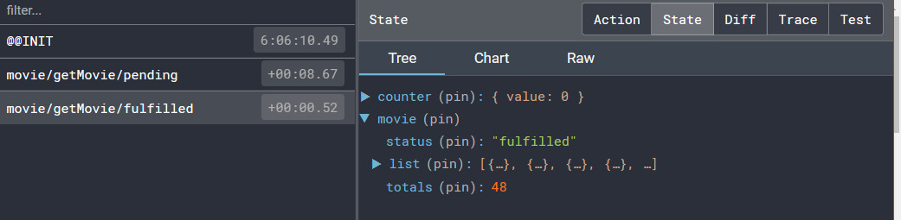

### 6.6 使用 extraReducers

有时 slice 的 reducer 需要响应 _没有_ 定义到该 slice 的 reducers 字段中的 action。这个时候就需要使用 slice 中的 extraReducers 字段。  

extraReducers 选项是一个接收名为 builder 的参数的函数。builder 对象提供了一些方法，让我们可以定义额外的 case reducer，这些 reducer 将响应在 slice 之外定义的 action。我们将使用 builder.addCase(actionCreator, reducer) 来处理异步 thunk dispatch 的每个 action。  

在这个例子中，我们需要监听我们 getMovieData thunk dispatch 的 “pending” 和 “fulfilled” action 类型。这些 action creator 附加到我们实际的 getMovieData 函数中，我们可以将它们传递给 extraReducers 来监听这些 action：

```js
const initialState = {
  status: 'idel',
  list: [],
  totals: 0,
}

export const getMovieData = createAsyncThunk('movie/getMovie', async () => {
  const res = await reqMovieListApi()
  return res.data
})

// 创建一个 Slice
export const movieSlice = createSlice({
  name: 'movie',
  initialState,

  // extraReducers 字段让 slice 处理在别处定义的 actions，
  // 包括由 createAsyncThunk 或其他slice生成的actions。
  extraReducers(builder) {
    builder
      .addCase(getMovieData.pending, state => {
        console.log('🚀 ~ 进行中！')
        state.status = 'pending'
      })
      .addCase(getMovieData.fulfilled, (state, action) => {
        console.log('🚀 ~ fulfilled', action.payload)
        state.status = 'pending'
        state.list = state.list.concat(action.payload.list)
        state.totals = action.payload.list.length
      })
      .addCase(getMovieData.rejected, (state, action) => {
        console.log('🚀 ~ rejected', action)
        state.status = 'pending'
        state.error = action.error.message
      })
  },
})

// 默认导出
export default movieSlice.reducer
```

我们将根据返回的 Promise 处理可以由 thunk dispatch 的三种 action 类型：

  * 当请求开始时，我们将 status 枚举设置为 ‘pending’
  * 如果请求成功，我们将 status 标记为 ‘pending’，并将获取的电影列表添加到 state.list
  * 如果请求失败，我们会将 status 标记为 ‘pending’，并将任何错误消息保存到状态中以便我们可以显示它

### 6.7 完善案例

store/index.js

```js
import { configureStore } from '@reduxjs/toolkit'
import counterSlice from './features/counterSlice'
import movieSlice from './features/movieSlice'

// configureStore创建一个redux数据
const store = configureStore({
  // 合并多个Slice
  reducer: {
    counter: counterSlice,
    movie: movieSlice,
  },
})

export default store
```

Movie.jsx

```js
// 引入相关的hooks
import { useSelector, useDispatch } from 'react-redux'
// 引入对应的方法
import { getMovieData } from '../store/features/movieSlice'

function Movie() {
  // 通过useSelector直接拿到store中定义的list
  const movieList = useSelector(store => store.movie.list)
  // 通过useDispatch 派发事件
  const dispatch = useDispatch()

  return (
    <div>
      <button
        onClick={() => {
          dispatch(getMovieData())
        }}
      >
        获取数据
      </button>
      <ul>
        {movieList.map(movie => {
          return <li key={movie.tvId}> {movie.name}</li>
        })}
      </ul>
    </div>
  )
}

export default Movie
```

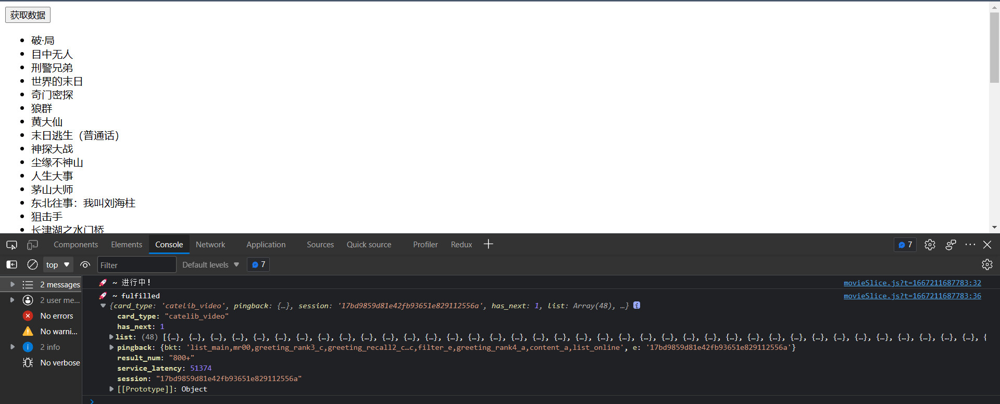  

createAsyncThunk可以写在任何一个slice的extraReducers中，它接收2个参数，

  * 生成action的type值，这里type是要自己定义，不像是createSlice自动生成type，这就要注意避免命名冲突问题了(如果createSlice定义了相当的name和方法，也是会冲突的)
  * 包含数据处理的promise，首先会dispatch一个action类型为movie/getMovie/pending，当异步请求完成后，根据结果成功或是失败，决定dispatch出action的类型为movie/getMovie/fulfilled或movie/getMovie/rejected，这三个action可以在slice的extraReducers中进行处理。这个promise也只接收2个参数，分别是payload和包含了dispatch、getState的thunkAPI对象，所以除了在slice的extraReducers中处理之外，createAsyncThunk中也可以调用任意的action，这样就很像原本thunk的写法了，并不推荐

## 7.数据持久化

### 7.1 概念

一般是指页面刷新后，数据仍然能够保持原来的状态。  

一般在前端当中，数据持久化，可以通过将数据存储到localstorage或Cookie中存起来，用到的时候直接从本地存储中获取数据。而redux-persist是把redux中的数据在localstorage中存起来，起到持久化的效果。

### 7.2 使用

npm i redux-persist --save  

store/index.js

```js
import { configureStore, combineReducers } from '@reduxjs/toolkit'

// --- 新增 ---
import {
  persistStore,
  persistReducer,
  FLUSH,
  REHYDRATE,
  PAUSE,
  PERSIST,
  PURGE,
  REGISTER,
} from 'redux-persist'

import storage from 'redux-persist/lib/storage'

// --- 新增 ---
import counterSlice from './features/counterSlice'
import movieSlice from './features/movieSlice'

// --- 新增 ---
const persistConfig = {
  key: 'root',
  storage,
  // 指定哪些reducer数据持久化
  whitelist: ['movie'],
}

const persistedReducer = persistReducer(
  persistConfig,
  combineReducers({
    counter: counterSlice,
    movie: movieSlice,
  }),
)

// --- 新增 ---
// 这里照着我这样配中间件就行，getDefaultMiddleware不要直接导入了，已经内置了
export const store = configureStore({
  reducer: persistedReducer,
  middleware: getDefaultMiddleware =>
    getDefaultMiddleware({
      serializableCheck: {
        ignoredActions: [FLUSH, REHYDRATE, PAUSE, PERSIST, PURGE, REGISTER],
      },
    }),
})

export const persistor = persistStore(store)
```

main.js

```js
import React from 'react'
import ReactDOM from 'react-dom/client'
import App from './App'
import Movie from './components/Movie'
import { Provider } from 'react-redux'
import { PersistGate } from 'redux-persist/integration/react'
import { store, persistor } from './store'

ReactDOM.createRoot(document.getElementById('root')).render(
  <Provider store={store}>
    <PersistGate loading={null} persistor={persistor}>
      <Movie />
    </PersistGate>
  </Provider>,
)
```

然后就可以直接使用了。  
最终效果：  

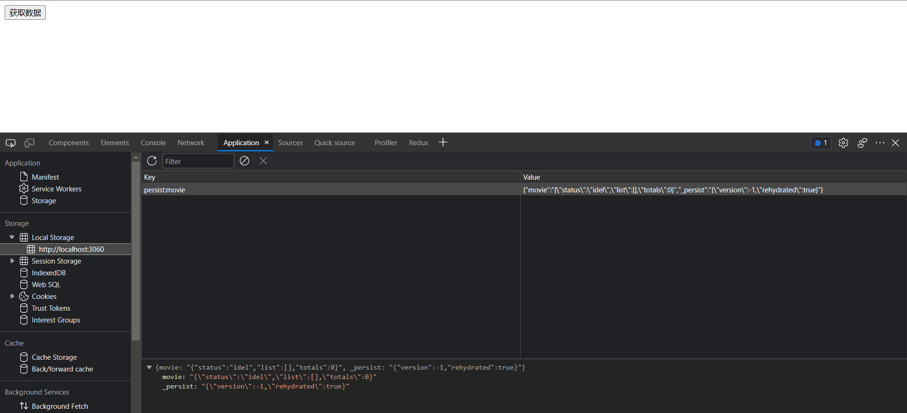

### 7.3 让每一个仓库单独存储

以前使用过pinia-plugin-persist，我觉得这个pinia这个插件使用比redux-persist方便  

这里的方法是我自己想出来的，不知道对不对  
store/index.js

```js
import { configureStore, combineReducers } from '@reduxjs/toolkit'
import {
  persistStore,
  persistReducer,
  FLUSH,
  REHYDRATE,
  PAUSE,
  PERSIST,
  PURGE,
  REGISTER,
} from 'redux-persist'

import storage from 'redux-persist/lib/storage'
import counterSlice from './features/counterSlice'
import movieSlice from './features/movieSlice'

const rootPersistConfig = {
  key: 'root',
  storage,
  whitelist: [],
}

const moviePersistConfig = {
  key: 'movie',
  storage,
}

const counterPersistConfig = {
  key: 'counter',
  storage,
}

const persistedReducer = persistReducer(
  rootPersistConfig,
  combineReducers({
    counter: persistReducer(counterPersistConfig, counterSlice),
    movie: persistReducer(moviePersistConfig, movieSlice),
  }),
)

// configureStore创建一个redux数据
export const store = configureStore({
  // 合并多个Slice
  reducer: persistedReducer,
  middleware: getDefaultMiddleware =>
    getDefaultMiddleware({
      serializableCheck: {
        ignoredActions: [FLUSH, REHYDRATE, PAUSE, PERSIST, PURGE, REGISTER],
      },
    }),
})

export const persistor = persistStore(store)
```

效果：  

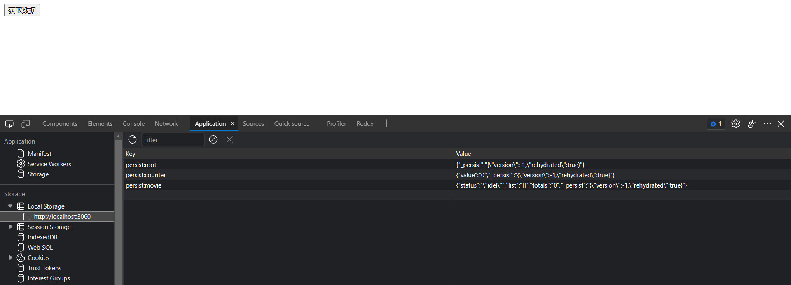


## 参考 

* 文章：[「Redux Toolkit」 是个好东西 ](https://juejin.cn/post/7025891039315492900)
* Github: [redux-essentials-counter-example](https://github.com/reduxjs/redux-essentials-counter-example)
