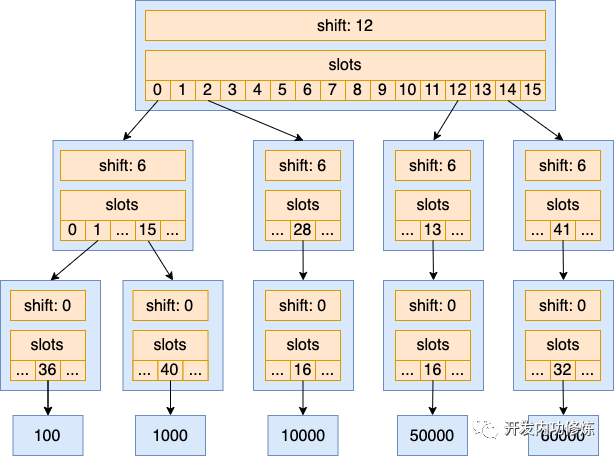

 
<!--BEGIN_DATA
{
    "create_date": "2023-07-11 09:07", 
    "modify_date": "2023-07-11 09:07", 
    "is_top": "0", 
    "summary": "为什么新版内核将进程pid管理从bitmap替换成了radix-tree？", 
    "tags": "Linux", 
    "file_name": "为什么新版内核将进程pid管理从bitmap替换成了radix-tree？.md"
}
END_DATA-->

#### <p>原文出处：<a href='https://mp.weixin.qq.com/s/0w7dJh0Gr4PokUBcy8rN7w' target='blank'>为什么新版内核将进程pid管理从bitmap替换成了radix-tree？</a></p>

> 在下一本新书里我会将参考的 Linux 内核版本升级成6.10。上周末写到创建进程部分的时候，发现内核已经将进程 pid 号的管理从 bitmap 换成了基数树(radix-tree)，所以写篇文章来和大家聊聊这个改动。

第一次写进程创建的时候我使用的内核版本还是 3.10 的版本。在这个版本里已分配的进程 pid 号是用 bitmap 来存储的。但在 5.4 和 6.1 版本里，发现进程 pid 号管理实现已经从 bitmap 替换成了基数树（radix-tree）。后来翻了下版本更新历史，原来自从 Linux 4.15 之后，内核就已经将 bitmap 换掉了。

所以今天我来给大家聊聊为什么 Linux 内核要将 bitmap 替换成基数树，最后也看看这次替换的性能效果。

## 一、旧的 bitmap 方式管理 pid

内核需要为每一个进程/线程都分配一个进程号。

如果每个使用过的进程号如果使用传统的 int 变量来存储的话会消耗很大的内存。假如内核要支持最大 65535 个进程，那存储这些进程号需要 65535*4 字节 = 262,140字节 ≈ 260 KB。

bitmap 可以极大地压缩整数的存储。如果使用 bitmap 来存储使用过的进程号，用一个 bit 表示对应的 pid 是否被使用过了。最大支持 65535 个进程的话，只需要 65535 / 8 = 8 KB 的内存就够用了。相比上面的 260 KB，内存节约的非常的多。

占用内存小还有一个特别大的优势，那就是遍历的时候，由于局部性特别好，CPU 缓存命中率特别的高，遍历的时候性能就会特别好。所以，之前很长的一段时间里，内核都是使用 bitmap 来管理所有的进程 pid。


内核中创建进程时申请 pid 的核心函数是 alloc_pid。在 3.10 版本中的时候，分配 pid 调用 pidmap 的接口函数 `alloc_pidmap` 来完成。它的源码是下面这个样子的：

```c
//file:kernel/pid.c  
struct pid *alloc_pid(struct pid_namespace *ns)  
{  
 ...  
 
 // 进程可能归属多个命名空间，在每一个命令空间中都需要分配进程号  
 // 实际调用 alloc_pidmap 来申请整数类型的进程号  
 tmp = ns;  
 pid->level = ns->level;  
 for (i = ns->level; i >= 0; i--) {  
  nr = alloc_pidmap(tmp);  
  pid->numbers[i].nr = nr;  
 
  ...  
 }  
 
 ... 

 return pid  
}  
```

如前面所述，bitmap 的最大好处是节约内存。但其也有个比较大的缺点，分配一个新的 pid 时的计算复杂度比较高。如果在进程数量比较多的，几乎需要把整个 bitmap 中的每一个 bit 位都遍历一遍才行。

```c
// file:kernel/pid.c  
static int alloc_pidmap(struct pid_namespace *pid_ns)  
{  
 ...  

 map = &pid_ns->pidmap[pid/BITS_PER_PAGE];  
 for (i = 0; i <= max_scan; ++i) {  
  for ( ; ; ) {  
   if (!test_and_set_bit(offset, map->page)) {  
    atomic_dec(&map->nr_free);  
    set_last_pid(pid_ns, last, pid);  
    return pid;  
   }  
   offset = find_next_offset(map, offset);  
   pid = mk_pid(pid_ns, map, offset);  
   
   ...  
  }  
  
  ...  
 }  
}  
```

在最近几年的业界发展中，服务器的内存越来越大，服务器上几百 GB 的内存都很常见。另外随着这几年轻量化容器云的发展，服务器上运行的进程数越来越多。传统的基于bitmap 来管理分配的 pid 的节约内存的优势越来越显得没有价值，而它分配新 pid 时占用的 CPU 资源较高这一缺点越来越明显。

## 二、使用基数树管理 pid

在 2017 年的时候，Gargi Sharma 提交了一个名为 “Replace PID bitmap allocation with IDR AP” 的patch，在这个提交里 bitmap 被开始替换成了基数树。并最终被并入到了 Linux 4.15 的版本中。关于这个提交的详情参见https://lwn.net/Articles/735675/ 或 https://lore.kernel.org/lkml/f5104f457ed581e0ac032a68af03c5ba5cb94755.1506342921.git.gs051095@gmail.com/

树相关的数据结构是变体最多的，基数树就是树数据结构的其中一种。它有最明显的特点是它的每一层只管理一个 6 bit 的分段。所以它的分叉数基本是固定的 64（2^6=64）（根节点除外），层数也是固定的。

基数树节点的数据结构定义中，有几个非常重要的字段，分别是 shift、slots 和 tags。

```c
//file:include/linux/xarray.h  
struct xa_node {  
 ...  

 unsigned char shift;  
 void __rcu *slots[XA_CHUNK_SIZE];  
 union {  
  unsigned long tags[XA_MAX_MARKS][XA_MARK_LONGS];  
  ...  
 };  
}  
```

shift 表示了自己在数字中表示第几段数字。在Linux 中默认的基数大小为 6。这种情况下最低一层的内部节点，shift 为 0，倒数第二层 shift 为 6。再上一层节点的 shift 为 12。以此类推，shift 从低往高， 逐层递增 6。

slots 是一个指针数组，存储的是其指向的子节点的指针。内核中默认情况下 `XA_CHUNK_SIZE` 是 64，也就是是一个 `*slots[64]`。每个元素都指向下一级的树节点，没有下一级子节点的话指针指向 null。

tags 用来记录 slog 数组中每一个下标的存储状态。可以用来表示每一个 slot 是否已经分配出去的状态。它是一个 long 类型的数组，一个 long 类型的变量是 8 个字节，正好有 64 个 bit 位。

上面的过程描述有点抽象。为了更好地理解，我们再使用一个简单的例子来看一下基数树在内存中的样子。

> 内核中的基数树是用于管理 32 bit 位的 整数 ID 的，但为了举例更简单清晰，我们用 16 bit 的整数组成的基数树来举例。

16 bit 的无符号整数的表示范围是 0 - 65536。假设有一个由已经分配出去的 100、1000、10000、50000、60000 的整数 ID。我们把这几个数组来组成的基数树。

首先把上述各个整数的二进制形式转化出来如下，

  * 100: 0000,000001,100100
  * 1000: 0000,001111,101000
  * 10000: 0010,011100,010000
  * 50000: 1100,001101,010000
  * 60000: 1110,101001,100000

在表示方式上，从尾部开始，按照 6 bit 为一组来表示。这样，每一个 16 bit 位的数字可以拆分表示为一个三段的数字。

在基数树中，根节点用来存储的每个数字的第一段。如果其中某一个数字已占用，那就把 slot 对应的下标的指针指向其子节点。否则为空。在计算机中计算的时候，是通过将每个值右移 shift 这么多位，根节点的 shift 为 12，那就右移 12 位取得其结果。

对于整数 100、1000、10000、50000 和 60000 来说，它们的第一段分别是二进制 0000、0000、0010、1100 和 1110，转化成 10 进制后是 0、0、2、12 和 14。

再下面一层节点的 slot 下标是每个值中间 6 个 bit 位的值，其 shift 为 6。第一层树的节点的 slot 是每个值最后 6 个 bit 的值，其 shift 为 0。我们再将上述每一个整数按照 6 bit 为分段，表示成 10 进制如下：

  * 100: 0,1,36
  * 1000: 0,15,40
  * 10000: 2,28,16
  * 50000: 12,13,16
  * 60000: 14,41,32

那么 100、1000、10000、50000、60000 这几个数组成的基数树的结构如下图所示。



拿整数 100 举例，按每 6 bit 一段分表示后为 0, 1, 36。其第一段是 0 ，那就在基数树的根节点的 slots 的 0 号下标存储其子节点指针。其第 2 分段为 1 ，那就在其第二层节点的 slots 的 1 号下标存储其子节点指针。在第三层节点的 slots 的 36 号下标存储最终的值 100。

基数树就这样建立好了。

在这个树的基础上判断一个整数值是否存在，或者是从这个树中分配一个新的未使用过的整数 ID 出来的时候，只需要分别对 3 层的树节点进行遍历，分别查看每一层中的 tag 状态位，看 slots 对应的下标是否已经占用即可。不像 bitmap 需要遍历整个 bit 数组。计算复杂度得到大大降低。

内核和上面例子的区别是其基数树存储的是 32 bit 位的整数。树的层次也就需要 6 层节点来存储。

使用了基数树后，内核源码也就发生了变化。在比较新的 6.1 `版本的内核中，alloc_pid` 变成了下面这个样子，通过调用 `idr_alloc` 来申请一个未使用过的进程 ID 出来。

```c
//file:kernel/pid.c  
struct pid *alloc_pid(struct pid_namespace *ns, ...)  
{  
 ...  

 // 进程可能归属多个命名空间，在每一个命令空间中都需要分配进程号  
 // 实际调用 idr_alloc 来申请整数类型的进程号   
 tmp = ns;  
 pid->level = ns->level;  
 for (i = ns->level; i >= 0; i--) {  
  nr = idr_alloc(&tmp->idr, NULL, tid,  
        tid + 1, GFP_ATOMIC);  
  
  ...  
  
  pid->numbers[i].nr = nr;  
  pid->numbers[i].ns = tmp;  
  tmp = tmp->parent;  
 }  
 ...  
}  
```

其申请的核心过程是 `idr_get_free`，主要就是遍历这颗基数树的若干节点，并根据每个节点的 tag、slot 等字段找出还未被占用的整数 ID。

```c
//file:lib/radix-tree.c  
void __rcu **idr_get_free(struct radix_tree_root *root, ...)  
{  
 ...  

 shift = radix_tree_load_root(root, &child, &maxindex);  
 while (shift) {  
  shift -= RADIX_TREE_MAP_SHIFT; //RADIX_TREE_MAP_SHIFT为6  
  ...  
  // 遍历 tag 状态 bitmap，寻找下一个可用的下标  
  offset = radix_tree_find_next_bit(node, IDR_FREE,  
       offset + 1);  
  start = next_index(start, node, offset);  
 }  
 ...  
}  
```

## 三、基数树的性能效果

原理我们讲完了，我们再来看下使用基数树替代 bitmap 后的性能表现如何。这里我们直接引用该 patch 的提交者 Gargi Sharma 提供的实验数据。来自 https://lwn.net/Articles/735675/。

Gargi Sharma 在 10000 个进程的情况下分别统计了 ps、pstree 的耗时情况。

```c
ps:  
 With IDR API With bitmap  
real 0m1.479s 0m2.319s  
user 0m0.070s 0m0.060s  
sys 0m0.289s 0m0.516s  
```

```c
pstree:  
 With IDR API With bitmap  
real 0m1.024s 0m1.794s  
user    0m0.348s 0m0.612s  
sys 0m0.184s 0m0.264s  
```

可见，在使用了基数树后，ps 和 pstree 命令的耗时都缩短了不少，性能大约提升了有 50%
