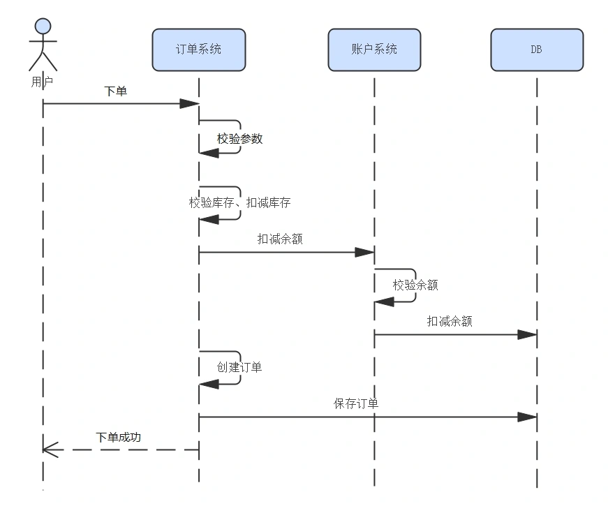
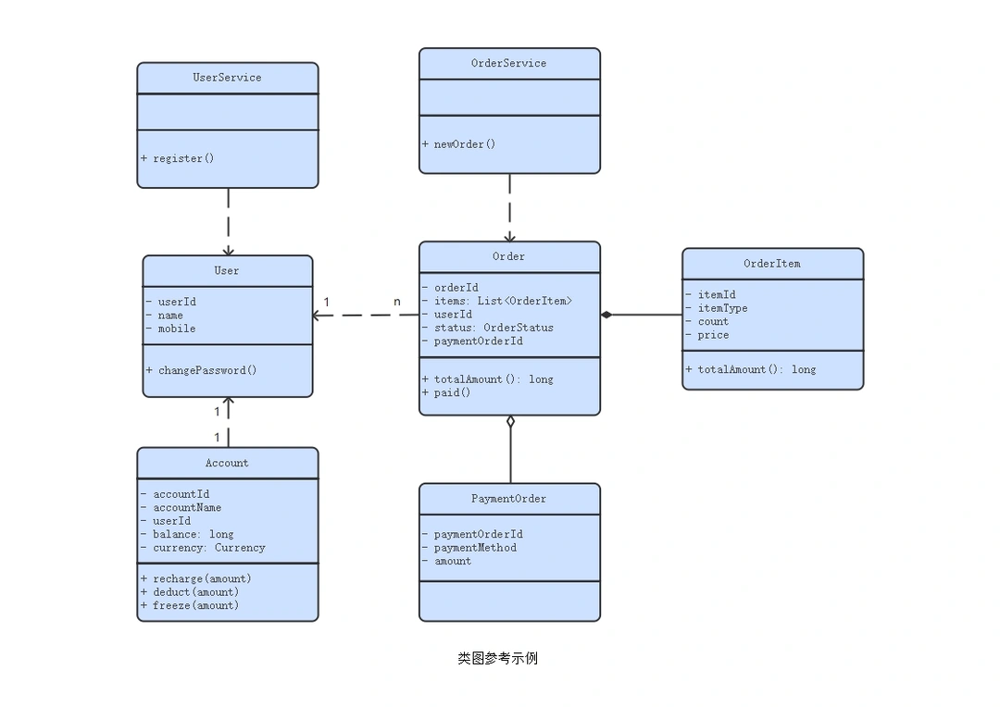
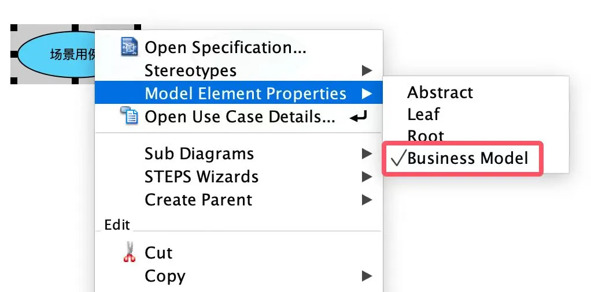
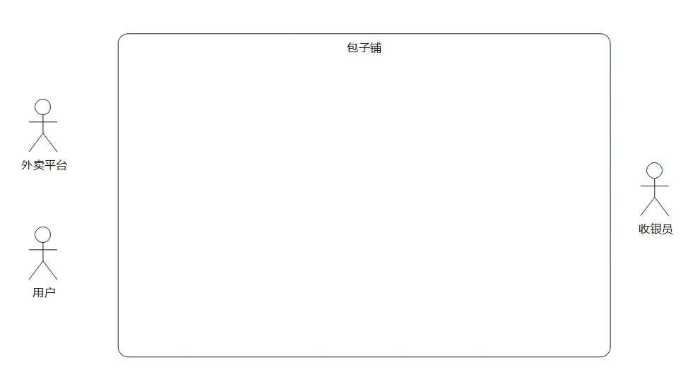
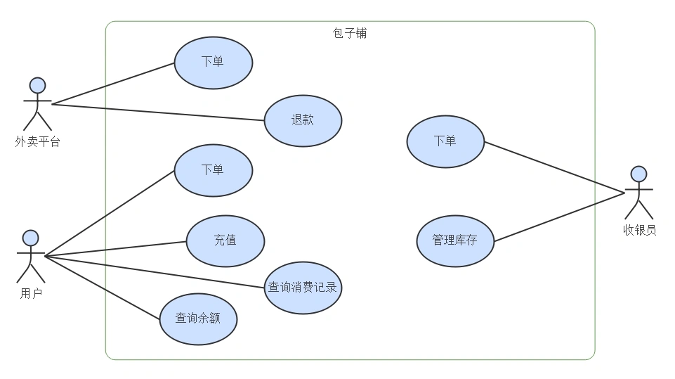
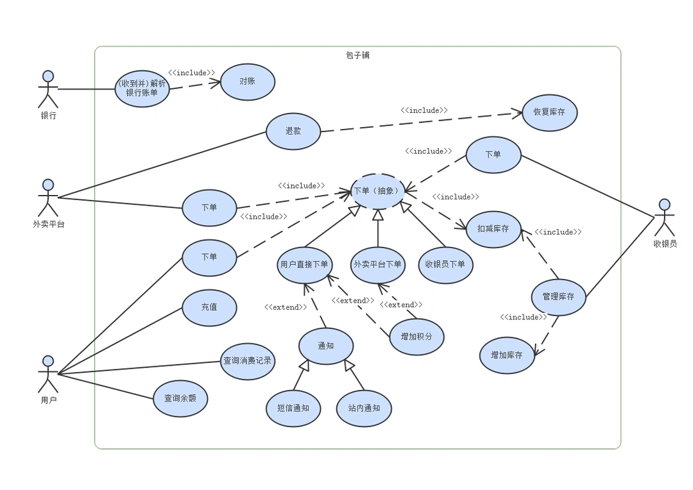
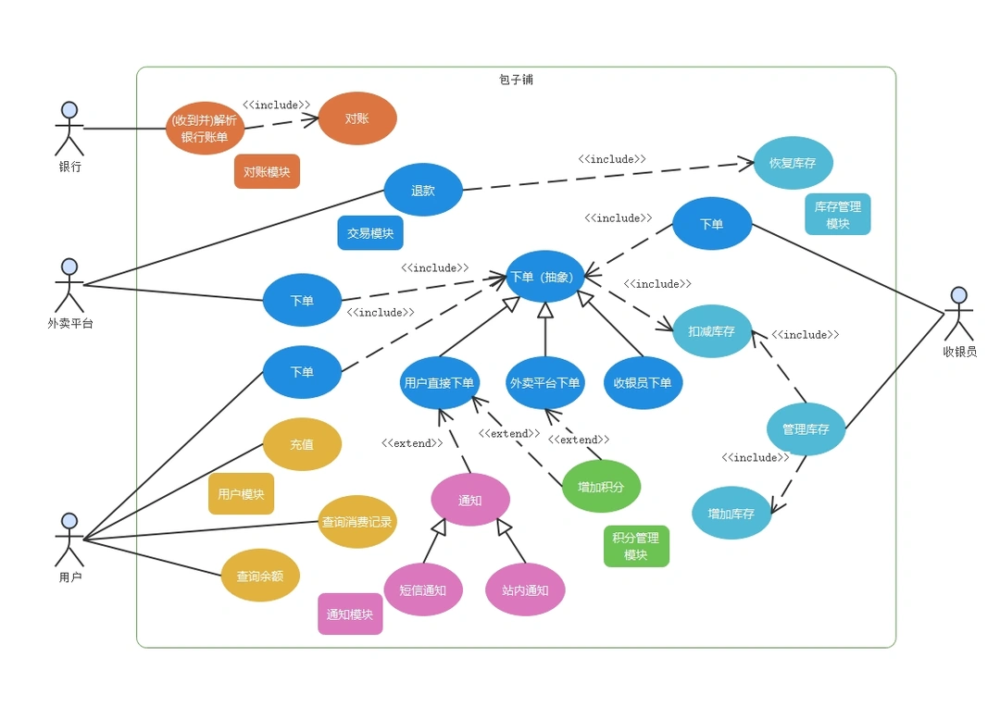

 
<!--BEGIN_DATA
{
    "create_date": "2024-12-09 09:41", 
    "modify_date": "2024-12-09 09:41", 
    "is_top": "0", 
    "summary": "为什么说用例设计在软件开发中非常重要", 
    "tags": "系统、架构", 
    "file_name": "为什么说用例设计在软件开发中非常重要.md"
}
END_DATA-->

#### <p>原文出处：<a href='https://km.woa.com/articles/show/618670' target='blank'>为什么说用例设计在软件开发中非常重要</a></p>

_用例(Use Case)__设计___可以说是软件设计的基本功，我现在还记得上大学刚学UML的时候，老师第一个教的图就是用例图，后面其他的图几乎都是在围绕
用例而展开。但为什么在工作中看到画用例图的反而少了？我与很多程序员交流，可能有这些原因：

  1. 不清楚用例设计有什么用，不就是画几个圈圈，能代表什么呢？
  2. 好像那几个圈圈不画，也并不影响开发。靠着时序图+表结构设计就足够把开发工作做完了

这还是从一线大厂程序员那里听到的答案，可见这个世界果然是一个巨大的草台班子😂。

没关系，不管之前懂不懂，看完这篇，你一定会对用例设计有个新的认识。

## 1. 用例设计有意义吗

你的身边是不是也有很多程序员，从未画过用例图，也一样吧代码写了？这是否意味着用例图的作用不大？

我说一下我的观点：**初级程序员画时序图，中级程序员画类图，高级程序员画用例图**。为什么这么说？

时序图 Sequence Diagram_描述的是一个过程，为了说清一个需求，把过程讲清楚是最朴素的也是最直接的方式，比如：



有些程序员拿着时序图配合数据库设计就开始写代码了，也是ok，时序图对了，业务逻辑上不会差太远。**但时序图是线性的，缺少结构关系**，不体现复用也不体现如何封装，只依赖时序图设计写出来的代码像流水账，只是把CRUD拼凑起来，随着业务的复杂度越来越高，代码的if...else...分支也越来越多，最终难以维护。

我们进入下一个level，看看_类图 Class Diagram_。类图用来说明程序的结构再合适不过。类图有几个关键要素：

  1. 类的属性和方法。在设计类的细节的时候，会自然融入面向对象的思维，想到类应该有哪些属性和行为，以及做怎样的封装最合适
  2. 类图有6大关系：依赖（Dependency）、关联（Association）、泛化（Generalization）、实现（Implementation）、组合（Composition）、聚合（Aggregation）。这六大关系始终在提醒你，要考虑模型的亲疏远近关系，例如**依赖是弱联系，关联是强联系，聚合是松联系，组合是强联系。**



(这里仅提供一个示例，图中的设计未必合理)

经常画类图的程序员，会有更强的**结构性思维，这是成为合格架构师的重要基础**。如果有时序图+类图做参考，代码就鲜活起来了，不再是为了如何组装和存储数据，而是围绕更加内聚的领域模型去展开。

若只有类图和时序图，对细节的把控固然没问题，但就是太细节了，缺少顶层视角。一个系统里几十上百个类，全部呈现出来眼花缭乱，只展示部分又看不清全貌。怎样用一张简单的图来说明一个系统提供了什么能力，且能把这些能力的依赖关系说清楚？

我们进入下一个level：高级程序员需要的是对整个系统全局的把控。这就要靠用例图了，用例图就像是站在系统的上帝视角来看，一张图展示出系统的全貌。

通过一张好的用例图，能清楚看清系统的模块划分。此外用例图还是从业务过渡到技术的桥梁，好的用例设计可以把业务和技术实现做完美衔接。

## 2. 什么是用例

用例分为两种：场景用例和系统用例。这是两种用例图标的区别：


图是用visual paradigm画的，可以用右键菜单切换不同的用例类型：



  * _场景用例_ 用于描述一个完整的全链路流程，例如用户在电商平台购买商品，需涉及支付、商户扣减库存、优惠券核销、创建订单、创建物流单、物流发货等步骤，这些组合起来才是一个完整的“购买商品”场景用例。场景用例通常维度较高，用于分析跨系统协作，最终给用户交付价值。用户通过“购买商品”这个用例，交付的价值就是成功收到自己购买的商品。

  * _系统用例_ 则是描述一个系统对外提供的能力，例如上面的“用户支付”、“创建物流单”都是系统用例。设计系统用例的时候，需要划定系统边界。

**为了更好地进行说明，我举一个例子：小帅开了一家包子铺，主营业务就是卖包子，为了更好地管理用户、订单、账务，小帅准备搭建一套系统。** 今天先介绍一下**系统用例**怎么设计。

## 3. 用例设计的步骤

### **3.1 识别参与者**

**参与者是在系统边界以外的，直接与系统交互的人或物**。这里的物可以是其他系统、合作机构、或是一个定时触发器。有了参与者，在设计用例的时候才会考虑这个用例的服务对象是谁。

分析一下包子铺系统的主要参与者，一开始识别不全也没关系，先把主要的列出来：

  * 真正的用户，他们通过系统来下单购买包子，还可以提前充值

  * 外卖平台，用户可以通过外卖平台购买包子，同时也需要处理退款

  * 收银员：在系统后台进行管理操作



### **3.2 分析一级用例**

**一级用例是指参与者直接与系统交互的功能，体现在图上就是直接和参与者相连的用例**，需要用一个动词或动宾短语来描述用例，而不能用名词。这里我们只讲重点，因此省去那些注册、登录、修改密码之类的用例。

  * 对于用户来说，首要的当然是可以下单购买包子，当然也可以提前充值，有充值就需要有查询余额和消费记录。

  * 外卖平台与系统对接，主要提供下单和退款这两个能力

  * 收银员通过柜台上的电脑与系统交互，收银员可以直接在机器上下单，还需要管理包子的剩余库存。



**很多人到这一步就认为用例设计已经结束了，不就是画几个小人和圈圈吗？如果只是这样，用例设计就没有意义，软件设计是为了对现实进****行建模并且能有效指导开发。因此我们还需要对用例进行进一步分析****。**

### **3.3 用例详细分析**

到目前为止，图上所表示的用例还只是一个个的动宾短语，下一步要做的是**把每一个用例进行展开**。展开的形式可以是：  

①文字说明，把这个用例的主流程、异常流程都描述清楚；  

②也可以用流程图或时序图，同样要表达出主流程、异常流程。

以用户下单为例说明

```
## 用户下单用例
主流程
1. 用户在页面上选择好要购买的包子，提交订单
2. 创建订单，校验库存是否充足，锁定库存
3. 选择支付方式，完成支付
4. 扣减库存，交易成功
5. 给用户加积分
6. 通知用户

分支流程1
2.1 如果库存不足，返回错误提示
```

**当我们把所有用例都展开以后，就会发现用例之间其实是存在联系的。** 例如

  * 不管用什么方式下单，都需要扣减库存，可以把扣减库存作为一个子用例，下单和扣减库存是include关系

  * 用户直接下单和外卖平台下单，流程是类似的，区别在于用户直接下单需要调用支付能力，从外卖平台下单就不需要支付（在外卖平台已经支付完成了）。这种情况可以抽象出一个父用例

  * 类似“给用户加积分”、“通知用户”等用例，不影响交易主流程，可以改为扩展用例

  * 随着用例展开，会发现一些之前遗漏的部分，例如这里就把对账给漏了，为了能实现自动化对账，需要从银行获取账单，**这里就要新增一个“银行”参与者，重复以上所有步骤，把相关用例补齐**

我们把分析完后完整的用例图画出来看看：



有几个注意点：

  1. 对于不同参与者，即便提供了非常类似的用例，也要求尽量拆开。参与者不同往往意味着需求也不同。例如用户通过进入系统购买包子，需要验证是否登录，明确是谁在购买，买完包子可以加积分；但用户通过门店收银员来购买包子，就是一手交钱一手交货，收银员并不需要知道买包子的人是谁。**也就是说一级用例尽量不复用，二级用例尽量复用**

  2. 需要区分include和extend，箭头方向是不一样的，下面讲到系统实现的时候也不一样

  3. 上面这几个步骤不是走完一遍就结束了，通常随着分析的更加深入，会不断识别出新的用例，以及调整用例关系

### **3.4 check用例设计是否有遗漏**

怎么评估用例设计全不全，有没有遗漏？

可以结合场景用例和系统用例来看，因为场景用例是给用户直接交付价值的，把场景用例拆解以后（场景用例可以展开画成带泳道的_活动图Activity Diagram_），每一个Activity（就是业务流程节点）都应该有对应的系统用例来支持，通过这样全流程串联推演，可以一定程度保证系统用例设计不遗漏。

如果你们恰好有跨领域的_全局架构师_，那就可以把场景用例交给全局架构师来负责画（这个可以放到第一步）。通过场景用例，可以再进步一自上而下拆解为系统用例。

后续有空我也会再介绍一些场景用例的分析方法。

## 4. 用例对写代码的意义

### **4.1 简化详细设计**

进入到详细设计阶段，每个用例只需设计自己的流程，而不用关注相关的其他用例。

例如在设计“下单”这个用例的时候，在时序图上可以直接调用“扣减库存”用例，至于库存具体怎么扣减，下单不需要关心。这样代码的复用性就通过子用例的复用体现出来了。每个单独用例的设计也会变得更简单。

### **4.2 用例决定协作分工**

如果涉及多人协作开发，有了用例图，分工上就不用发愁了，每个人分几个用例，不会互相有代码冲突，用例之间只需定义好接口即可，开发完了再联调。

### **4.3 用例决定模块划分**

有用例图以后，**再也不用靠拍脑袋来划分模块，用例的相互关系已经决定了系统的模块划分**。 我们可以在图上把不同的模块用不同颜色标明



实际上，当你习惯了这种设计方式后，**做更高级的、跨系统的架构，用的也是同样的思路**。假如包子铺的规模越来越大，到了要系统拆分的时候，很容易能想到，交易模块变成交易子系统，库存模块变成库存子系统...

### **4.4 用例决定代码的分层**

咱辛苦分析这么久，画了用例图，当然不是为了画着玩的是吧？用例的几种关系：依赖、扩展、继承，在代码里都可以得到体现，可以做到真正指导开发。

  * **依赖关系（include）**

如果你恰巧在用_领域驱动设计（Domain Driven Design）_ 那就很妙，不用再纠结代码是写在app service还是domain service了。有个简单的原则：  

**一级用例代码写在app service层**

**二级用例、三级用例代码写在domain service层**

这样划分的原因是，一级用例通常表示系统的边界，是直接跟参与者交互的，这与app service的定位刚好相符；二级、三级用例是不直接与参与者交互的，是系统内部的能力，在domain service层可以最大程度进行复用。

  * **扩展关系（extend）**

扩展用例通常是非核心功能，或者不在主流程里， 扩展用例一般也放在domain service层，区别是**可以通过监听事件的方式来实现，与主流程解耦。**

```java
package cn.louisxiv.baozi.application.service;

@Service
public class OrderAppService {

    @AutoWired
    EventPublisher eventPublisher;

    /**
     * 下单一级用例
     */
    public void newOrder(NewOrderRequest request) {
        // 前面是下单的代码
        // ......

        // 下单成功，事件发布
        CommonEvent event = EventFactory.newEvent(EventType.ORDER_CREATED, eventPayload);
        eventPublisher.publish(event);
    }
}


package cn.louisxiv.baozi.domain.service;

// 消息通知服务，通过订阅事件来实现
public class NotificationService implements EventSubscriber {

    @override
    public void subscribe(CommonEvent event) {
        // 订阅并处理消息通知
        // 这部分后续会有详细代码参考，还请点个关注 ^_^
    }
}
`​``

  * **继承关系**

熟悉面向对象的朋友都知道，继承关系表示A is a B，例如Cat is an Animal。父类表示共性的东西，子类拥有自己的特性。在用例的继承关系中，**父用例表示流程中共性的部分（通常是大体的流程框架），子用例可以复用父用例的流程框架，再扩展实现自己的特殊逻辑。**这个...看起来是不是很像设计模式中的_模板方法模式（Template Method Pattern）_

因此在代码实现上，也可以用父类和子类来实现：

```java
package cn.louisxiv.baozi.domain.service;

/**
 * 下单领域服务
 */
public abstract class OrderService {
    /*
     * 库存服务
     */
    InventoryService inventoryService;
    TransOrderRepository orderRepository;
    /**
     * 领域层，下单二级用例，这里提供了下单的总体流程框架
     * 通常在app service层已经开启了事务，这一层默认在事务内
     * @param order 订单领域模型
     * @param userId 用户id
     */
    public void newOrder(TransOrder order, UserId userId) {
        // 从订单中获取 itemType和quantity
        // 扣减库存
        inventoryService.deduct(itemType, quantity);
        // 扣余额
        // 外卖下单和通过门店下单不需要扣余额，把余额扣除的逻辑交给子类
        deductBalance(order, userId);
        // 保存订单
        orderRepository.save(order);
        // 下单成功，事件发布（这个可以放app层，也可以放domain层，看具体怎么编排）
        // 不同的下单方式，生成的事件内容不一样，交给子类
        CommonEvent event = orderCreatedEvent(order, userId);
        eventPublisher.publish(event);
    }
    /**
     * 扣余额
     */
    protected abstract void deductBalance(TransOrder order, UserId userId);
    /**
     * 生成统一事件
     */
    protected abstract CommonEvent orderCreatedEvent(TransOrder order, UserId userId);
}

// 用户直接下单用例，只需实现两个方法即可
@Service
public class DirectOrderService extends OrderService {
    protected void deductBalance(TransOrder order, UserId userId) {
        // ...
    }
    protected CommonEvent orderCreatedEvent(TransOrder order, UserId userId) {
        // ...
    }
}
```

_我自己反复推敲了一下这个例子，感觉可能举的不那么贴切，但是一时又找不到更合适的例子。大家看看这种思路即可。_

## 5. 实际项目中的注意事项

  * **关于微服务拆分的问题**

我只是以包子铺这样一个小型的项目来说明，用例图看起来就已经有点复杂度了，在大型项目里面，一个系统有几百个用例是很正常的。

不过现在流行用微服务，当你识别到一个系统用例过多的时候，应该很容易能想到要做拆分，前面提到的拆分方法就能派上用场。**下次老板问你为什么这么拆的时候，希望你不要再回答：“一般一个微服务提供8~10个接口是比较合理的”这种话。**跟多少个接口没关系，拆分的原则就只有一个：根据画好的用例图，上面所呈现出来的高内聚、低耦合来划分。

  * **关于什么情况下可以对系统设计做裁剪的问题**

**原则是：抓大放小。** 大型系统要把方方面面都设计到位是很耗时的，有些情况也未必有那个必要。我们要抓的**大** ，就是

  1. 完整的用例图一定要有，因为这个决定了整个系统的架构、开发分工

  2. 把里面的核心用例挑出来做详细设计，详细设计包括领域模型（类图）、数据模型（ER图）、核心流程（时序图）、状态迁移（状态图）、接口文档

所谓的**小** 就是那些非核心用例，在真的时间有限的情况下，可以只用文字表述大致流程，把接口设计清楚即可。

另外还是**尽量通过工具来保证质量**，例如代码质量扫描、数据库设计规范扫描、接口自动化测试等，通过其他辅助手段来弥补设计不足的问题。

到这基本上把方法介绍完了，你可以再领悟体会一下**用例设计是把业务和技术实现做完美衔接的桥梁**这句话，是不是这么个道理？

希望看到这里的人，可以稍稍感受到一些系统设计和架构设计之美，_架构设计也可以如数学公式推导一样一步步得出答案_。不要再写枯燥的CRUD了，赶紧试试看，把这些方法用起来吧！
