<!--BEGIN_DATA
{
    "create_date": "2021-01-28 13:40", 
    "modify_date": "2021-01-28 13:40", 
    "is_top": "0", 
    "summary": "主动噪声控制 (Active Noise Control, ANC)理论及Matlab代码实现<br/>", 
    "tags": "音视频、算法", 
    "file_name": "主动噪声控制理论.md"
}
END_DATA-->

#### <p>原文出处：<a href='https://www.cnblogs.com/LXP-Never/p/11693567.html' target='blank'>主动噪声控制 (Active Noise Control, ANC)理论及Matlab代码实现</a></p>

## 声波相消理论

当两列声波同时在同一媒质中传播并在某处相遇时，任意点上的振动将是二者引起振动的叠加，该现象被称为**声波干涉**。

> 若两列声波具有**相同频率**及**固定相位差**，当其传播到同一位置时，若出现**同相振动**则会产生**相长干涉**，若出现**反相振动**则会出现**相消干涉**。
>
> 基于声波相消干涉原理来实现噪声能量的抵消，这即为主动噪声控制的物理基础。

在实际应用中，可通过自适应数字处理器与电声器件相搭配的方式来辅助生成反相抵消声波，进而实现初级噪声的有效抑制。

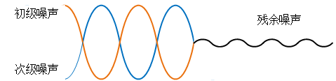

初级噪声是原始噪声信号，次级噪声是扬声器生成的噪声，用来抵消原始噪声。

在系统正常工作的情况下，扬声器的输出信号与原始噪声信号在特定的空间内实现干涉。要想形成稳定干涉，两列波需要满足以下三个条件：

  1. 传播方向相同
  2. 相位差保持恒定
  3. 振动频率相同

从质点位移的角度分析：设噪声信号由公式1表示，抵消信号由式公式2表示，在指定的降噪区域叠加后的信号由公式3表示。

<span class="LaTex" alt="LaTex">$$公式1：y_1=A\sin (w_1t+\theta_1)$$</span>

<span class="LaTex" alt="LaTex">$$公式2：y_2=A\sin (w_2t+\theta_2)$$</span>

<span class="LaTex" alt="LaTex">$$公式3：y_3=y_1+y_2=A\sin(w_1t+\theta_1)+A\sin (w_2t+\theta_2)$$</span>

当<span class="LaTex" alt="LaTex">$$w_1=w_2=w$$</span>时，公式3可以简写为：

<span class="LaTex" alt="LaTex">$$$公式4：y_3=A(\sin wt*(\cos \theta_1+\cos\theta_2)+\cos wt*(\sin\theta_1+\sin\theta_2))$$</span>

当<span class="LaTex" alt="LaTex">$$\theta_1-\theta_2=(2k+1)\pi$$</span> (奇数)时，<span class="LaTex" alt="LaTex">$$y_3=0$$</span>，残余噪声消失。利用和差化积公式将公式4改写为：

<span class="LaTex" alt="LaTex">$$公式5：y_{3}=A\left[2+2 \cos \left(\theta_{2}-\theta_{1}\right)\right] * \sin\left(\omega t+\theta_{1}+k\right)$$</span>

当<span class="LaTex" alt="LaTex">$$\frac{2\pi}{3}\leq abs(\theta_1-\theta_2)\leq\frac{4\pi}{3}$$</span>时，满足<span class="LaTex" alt="LaTex">$$abs(y_{3max})\leq abs(y_{1max})$$</span>，这时候起到降噪的作用，当相位差的绝对值不在这个范围时会产生干涉相长的现象，此时降噪系统起不到降噪的效果。ANC降噪系统的自适应过程就是在调节抵消信号的初始相位，以满足系统对相位的要求。

## ANC系统基本结构

主动噪声控制系统的结构形式可以根据以下标准进行划分：

1）根据 ANC 系统**是否直接获取参考信号**，将 ANC 系统分为

  * **前馈 ANC 系统**：产生次级噪声之前就通过传感器测量初级噪声的频率以获取参考信号。
  * **反馈 ANC 系统**：不需要测得参考信号就产生次级噪声进行相消干涉

2）根据**次级声源及误差传声器的数量**将ANC 系统分为

  * **单通道 ANC 系统**
  * **多通道 ANC 系统**

3）根据**目标降噪对象的频谱特征**将 ANC 系统分为

  * **宽带 ANC 系统**
  * **窄带 ANC 系统**
  * **宽窄带混合 ANC 系统**

### 前馈型与反馈型ANC系统

　**前馈 ANC 系统通过在目标噪声源处放置参考传声器或非声学传感器的方式来直接获取参考信号**，误差传感器测得的残余噪声信号连同传感器获取的参考信号均作为控制器的输入，产生并调节次级声源信号<span class="LaTex" alt="LaTex">$$y_n$$</span> ，驱动次级扬声器发出次级噪声，与初级声源产生的噪声进行相消干涉，最终使得误差传感器处的声压值最小。

  * **优点**：有很强的鲁棒性，不仅适用于窄带噪声信号，也可用于处理宽带噪声信号。
  * **缺点**：有些特定的场景可能不适合安装 参考传声器

参考信号可由声学传感器获取，也可由非声学传感器（如转速计、加速度计等）获得。但声学传感器的引入容易造成声反馈现象，从而削弱系统的鲁棒性。故而窄带 ANC 系统中的参考信号一般由非声学传感器采集。通过非声学传感器可采集到噪声源信号的同步信号（如转速、加速度等），按照一定的线性关系可将其转换为频率值，根据该频率值可使信号发生器产生与窄带噪声频率一致的参考信号。

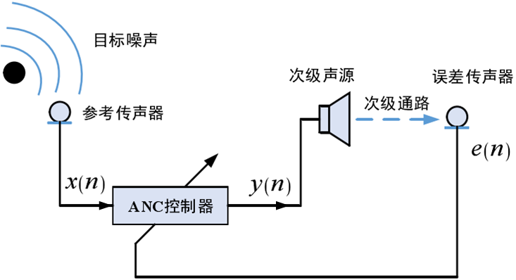

　**反馈型 ANC 系统**中没有传感器来测得参考输入信号，**仅通过误差传感器**获取经相消干涉后的残余噪声并将其送入到反馈控制器，进而达到调节次级声源$y_n$的目的，使其发出与初级噪声幅值相等相位相反的次级噪声

  * **优点**：结构简单，不存在单反馈问题，因具有一定的主动阻尼而可以有效抑制系统的暂态信号
  * **缺点**：易受外界干扰而导致控制器发散，故系统稳定性不佳，此外，受限于参考信号的估计精度与硬件系统的时延，反馈 ANC 系统能实现的降噪频段相对较窄且降噪时易出现中高频段噪声不降反增的“水床效应”，对宽带噪声的处理能力较差

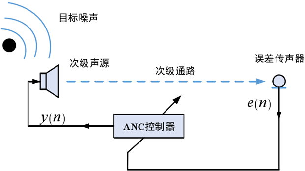

目前，这两种结构在实际生活中均有所应用，但绝大多数应用场景均会优先采用综合性能更为优越的前馈 ANC 系统，仅在某些参考信号不易获取、不能准确获取和无法安装参考信号传感器的场景中考虑使用反馈 ANC 系统。

### 单通道与多通道ANC系统

**单通道 ANC 系统**通常仅**包含一个误差传声器与一个次级声源**，可采用前馈结构或反馈结构

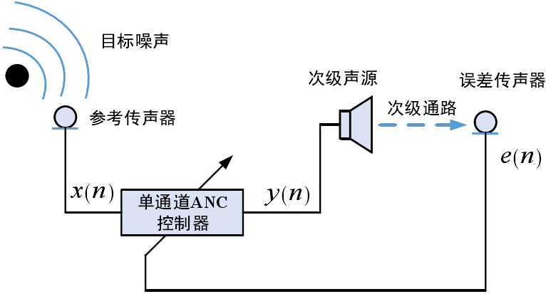

  * **优点**：仅包含一条次级通路，算法简单，易于实现，
  * **缺点**：降噪空间会有所局限性

**多通道 ANC 系统**一般包括**两个及以上的次级声源或误差传声器**，次级通路数是该系统次级声源数与误差传声器数的乘积，可采用前馈或反馈结构，当选用前馈结构时，参考传声器的数量可以为一个或多个。

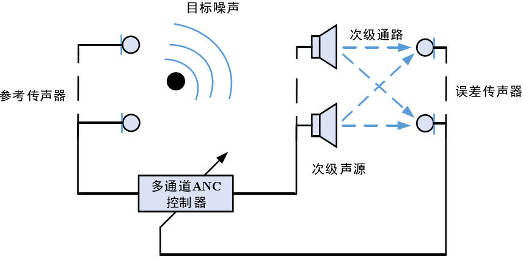

  * **优点**：多通道ANC系统可实现更优的降噪效果及更大的降噪空间。
  * **缺点**：因为大量的次级通道数会大大的提高ANC系统的复杂度，因此算法运算量会大大地增加，同时系统的稳定性与可靠性均会有所下降

### 宽带与窄带ANC系统

**宽带 ANC 系统**通常采用参考传声器来构造参考噪声信号，进而实现较宽频段内的有效降噪，其基本结构类似于前馈 ANC 系统。

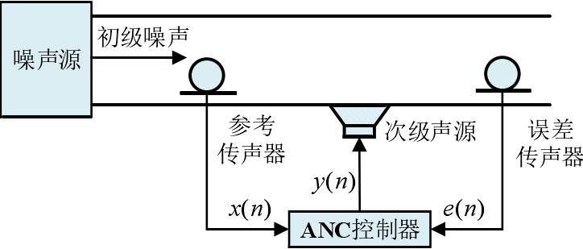

  * **缺点**：当参考传声器距离次级声源较近时，声反馈现象较为严重，因此在其中引入声反馈消除技术是十分必要

针对由发动机、压缩机、风扇等旋转机械部件运动而产生的周期性窄频带噪声，通过转速传感器、振动加速度传声器等非声学传感器的使用可辅助构造出较为精准的窄带参考信号，这类以非声学传感器来获取参考信号的 ANC 系统一般称之为**窄带 ANC 系统**

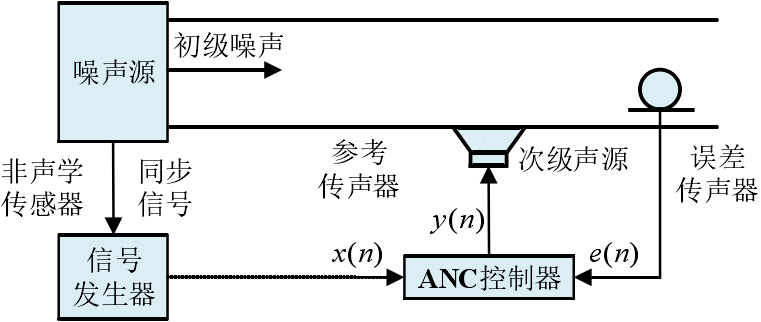

  * **优点**：由于非声学传感器的使用，窄带 ANC 系统不存在声反馈问题，同时也避免了参考传声器所存在的老化和非线性问题，此外，窄带阶次噪声通常具有较强的周期特性，由转速传感器等所构造的参考信号可有效满足系统对目标噪声的连续追踪需求，因此，窄带 ANC 系统通常具有较优良的窄带阶次分量降噪特性。

在实际生活中，大多数目标噪声均具有典型的宽窄带混合特性，采用由宽带 ANC 子系统、窄带 ANC 子系统所构成的**宽窄带混合 ANC系统**往往能实现更为理想的控制效果。

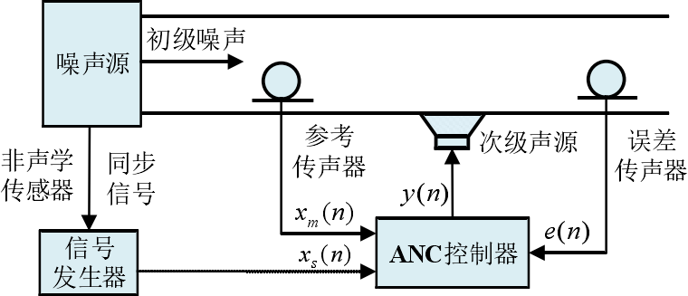

  * **缺点**：同时包含了宽带 ANC 部分与窄带 ANC 部分，因此结构相对复杂，因而同时采用了声学传声器与非声学传感器来构造参考噪声信号，次级声源发出的抵消信号也是由宽、窄带 ANC 部分的输出信号求和得出

## ANC算法

噪声信号随时间的推移而不断变化，其特性无法进行预先估计，这一性质导致噪声很难被实时跟踪。**ANC 技术要求对时变的噪声输入信号进行跟踪，从而调节控制器使产生的次级噪声信号能最大的削弱噪声输入信号**。**自适应滤波器**可以很好的跟踪时变信号，通过**某种优化误差准则**不断调整产生所需信号。而这种**优化误差准则实际上就属于 ANC 算法**。

### LMS算法

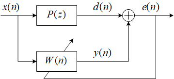

过程讲解：噪声信号<span class="LaTex" alt="LaTex">$$x(n)$$</span>通过初级路径<span class="LaTex" alt="LaTex">$$H(z)$$</span>成为初级噪声信号<span class="LaTex" alt="LaTex">$$d(n)$$</span>，噪声信号<span class="LaTex" alt="LaTex">$$x(n)$$</span>和误差信号<span class="LaTex" alt="LaTex">$$e(n)$$</span>传入自适应滤波器以供权重更新，自适应滤波器输出<span class="LaTex" alt="LaTex">$$y(n)$$</span>，去和初级噪声信号做减法，使得误差信号<span class="LaTex" alt="LaTex">$$e(n)$$</span>逐渐减少到0。

符号定义

  * <span class="LaTex" alt="LaTex">$$x(n)$$</span>：噪声信号
  * <span class="LaTex" alt="LaTex">$$P(z)$$</span>：**初级声源路径**，<span class="LaTex" alt="LaTex">$$P(n)$$</span>次级路径冲击响应
  * <span class="LaTex" alt="LaTex">$$d(n)$$</span>：误差传感器的**初级噪声**信号
  * <span class="LaTex" alt="LaTex">$$e(n)$$</span>：**误差信号**
  * <span class="LaTex" alt="LaTex">$$w(n)$$</span>：LMS自适应滤波器
  * <span class="LaTex" alt="LaTex">$$y(n)$$</span>：自适应滤波器的输出

<span class="LaTex" alt="LaTex">$$e(n)=d(n)-w^T(n)x(n)$$</span>

运用最小均方误差准则，通过对其求导并令其等于0，求到使得误差<span class="LaTex" alt="LaTex">$$|e(n)|^2$$</span>最小时的<span class="LaTex" alt="LaTex">$$w$（$|e(n)|$$</span>在最小点不可导，所以使用的是<span class="LaTex" alt="LaTex">$$|e(n)|^ 2$$</span>），对于LMS算法，其滤波器系数迭代公式为

<span class="LaTex" alt="LaTex">$$
\begin{aligned} w(n+1) &=w(n)-\mu \frac{\partial e(n)^{2}}{\partial w} \\ &=w(n)-2 \mu e(n) \frac{\partial(d(n)-w * x(n))}{\partial w} \\ &=w(n)+2 \mu e(n) x(n) \end{aligned}
$$</span>

式中，<span class="LaTex" alt="LaTex">$$\mu$$</span>为**固定步长因子**，<span class="LaTex" alt="LaTex">$$\mu$$</span>的大小很大程度上决定了算法的收敛与稳态性能。<span class="LaTex" alt="LaTex">$$\mu$$</span>越大，算法收敛越快，但稳态误差也越大；$<span class="LaTex" alt="LaTex">$\mu$$</span>越小，算法收敛越慢，但稳态误差也越小。为保证算法稳态收敛，应使<span class="LaTex" alt="LaTex">$$\mu$$</span>在以下范围取值：

<span class="LaTex" alt="LaTex">$$0 < \mu  < \frac{2}{{\sum\limits_{i = 1}^N {x(i)_{}^2} }}$$</span>

实际情况中基于前馈网络的自适应算法原理图如下所示了，LMS算法忽略了次级通道<span class="LaTex" alt="LaTex">$$S(z)$$</span>，**也就是说通过自适应滤波器生成的次级声源<span class="LaTex" alt="LaTex">$$y(n)$$</span>能够使得误差<span class="LaTex" alt="LaTex">$$e(n) \approx 0$$</span>，但是<span class="LaTex" alt="LaTex">$$y(n)$$</span>通过次级声道<span class="LaTex" alt="LaTex">$$S(z)$$</span>后的<span class="LaTex" alt="LaTex">$$y'(n)$$</span>就不一定能够使得<span class="LaTex" alt="LaTex">$$e(n) \approx 0$$</span>了**。因此由于次级通道的存在，LMS算法通常会导致不稳定，误差信号在时间上未与参考信号正确对齐，存在延时。可以使用多种可能的方案来补偿次级通道的影响。

Morgan提出了两种解决这个问题的方法。 第一种解决方案是放置一个与<span class="LaTex" alt="LaTex">$$S(n)$$</span>串联的逆滤波器<span class="LaTex" alt="LaTex">$$\frac{1}{S(n)}$$</span>，以消除其影响。第二种解决方案是在参考信号路径中放置一个相同的滤波器，以实现LMS算法的权重更新，从而实现所谓的FXLMS算法[9]。

由于<span class="LaTex" alt="LaTex">$$S(n)$$</span>不一定存在逆，因此FXLMS算法通常是最有效的方法。 FXLMS算法是由Widrow 在自适应控制和Burgess的情况下独立导出的，用于ANC应用。

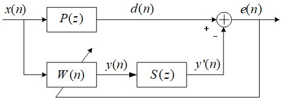

**FXLMS算法**

Widrow，Shur和Shaffer提出了考虑次级路径（从扬声器到误差麦克风）模型的方法[11]。下图给出了Kuo和Morgan提出的FXLMS算法的框图，说明了降噪算法的工作原理

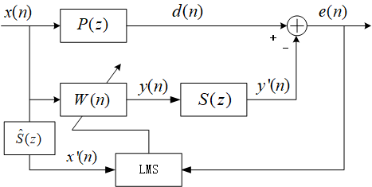

符号定义

  * <span class="LaTex" alt="LaTex">$$x(k)$$</span>：噪声信号
  * <span class="LaTex" alt="LaTex">$$P(z)$$</span>：初级路径，<span class="LaTex" alt="LaTex">$$p(n)$$</span>初级路径传递函数
  * <span class="LaTex" alt="LaTex">$$d(n)$$</span>：误差传感器的初级噪声信号
  * <span class="LaTex" alt="LaTex">$$S(z)$$</span>：次级路径，$S(n)$次级路径传递函数
  * <span class="LaTex" alt="LaTex">$$W(n)$$</span>：自适应滤波器
  * <span class="LaTex" alt="LaTex">$$y(n)$$</span>：自适应滤波器的输出
  * <span class="LaTex" alt="LaTex">$$y'(n)$$</span>：通过次级路径的次级噪声信号
  * <span class="LaTex" alt="LaTex">$$\hat{S}(z)$$</span>：估计的次级路径
  * <span class="LaTex" alt="LaTex">$$x'(n)$$</span>：通过估计的次级路径，产生的噪声
  * <span class="LaTex" alt="LaTex">$$e(n)$$</span>：**误差信号**

1) 误差信号表示为

<span class="LaTex" alt="LaTex">$$e(n)=d(n)-s(n)*[w^T(n)x(n)]$$</span>

其中n是时间索引，<span class="LaTex" alt="LaTex">$$s(n)$$</span>是次级路径<span class="LaTex" alt="LaTex">$$S(z)$$</span>的脉冲响应，<span class="LaTex" alt="LaTex">$$*$$</span>表示线性卷积，<span class="LaTex" alt="LaTex">$$w(n)$$</span>和<span class="LaTex" alt="LaTex">$$x(n)$$</span>分别是<span class="LaTex" alt="LaTex">$$w(z)$$</span>的系数和噪声信号。

假设均方代价函数<span class="LaTex" alt="LaTex">$$\xi(n)=E[e^2(n)]$$</span>，自适应滤波器使瞬时平方误差最小

<span class="LaTex" alt="LaTex">$$\xi(n)=e^2(n)$$</span>

采用梯度下降算法，根据步长更新负梯度方向的滤波器权重向量

<span class="LaTex" alt="LaTex">$$w(n+1)=w(n)-\frac{\mu}{2}\triangledown \xi(n)$$</span>

其中<span class="LaTex" alt="LaTex">$$\triangledown \xi(n)$$</span>是时刻n的均方误差（MSE）梯度的瞬时估计，并表示为<span class="LaTex" alt="LaTex">$$\triangledown\xi(n)=\triangledown e^2(n)=2[\triangledown e(n)]e(n)$$</span>。我们得到<span class="LaTex" alt="LaTex">$$\triangledown e(n)=-s(n)*x(n)=-x'(n)$$</span>，权重更新变为

<span class="LaTex" alt="LaTex">
$$w(n+1)=w(n)-\frac{\mu}{2}\triangledown \xi(n)\\\  
\quad\quad\quad=w(n)-\frac{\mu}{2}[-2x'(n)e(n)]\\\  
\quad\quad\quad=w(n)+\mu x'(n)e(n)
$$</span>

在实际的ANC应用中，<span class="LaTex" alt="LaTex">$$S(z)$$</span>是未知的，必须通过附加滤波器<span class="LaTex" alt="LaTex">$$\hat{S}(z)$$</span>进行估算。因此，通过使参考信号通过次级路径的此估计来生成滤波后的参考信号，其中<span class="LaTex" alt="LaTex">$$\hat{s}(n)$$</span>是次级的估计冲激响应。 。

<span class="LaTex" alt="LaTex">$$x'(n)=\hat{s}(n)*x(n)$$</span>

### 次级通道在线辨识

就实际应用而言，次级通道的传递函数显然无法明确得知，而** ANC系统中的自适应滤波器可对次级通道进行估计**。当传递函数为时变函数时，采用在线辨识算法，即在 ANC系统运行的同时对次级通道进行估计。下图给出了含在线辨识的 FXLMS 算法结构，自适应滤波器的输出<span class="LaTex" alt="LaTex">$$y_n$$</span>引入线辨识系统，作为LMS算法的输入。同时将系统中的残余噪声信号与<span class="LaTex" alt="LaTex">$$y_n$$</span>经次级通道的估计之后得到的<span class="LaTex" alt="LaTex">$$\hat{y}_p(n)$$</span>相比较，将所得到的误差也用作 LMS算法的激励，调节参数，不断逼近次级通道传递函数，完成对次级通道的实时在线辨识。

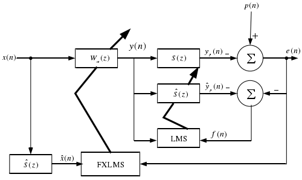

含在线辨识的 FXLMS 算法结构

次级通道的在线辨识应当满足两个基本要求：实现对次级通道较为精准的估计；同时在线辨识不应该对主降噪系统产生影响。而图 2.5所示的次级通道的在线辨识对<span class="LaTex" alt="LaTex">$$y(n)$$</span>进行直接处理，使得这两个基本要求相互矛盾。故而实际的 ANC系统应在在线辨识不被干扰与辨识不对主降噪系统产生干扰之间取得一个相对平衡。为在这两者间获取更为适宜的平衡点，Eriksson 提出增加辅助随机噪声作为在线辨识系统的激励，而在主降噪系统中<span class="LaTex" alt="LaTex">$$y(n)$$</span>减去辅助噪声之后再驱动扬声器产生声音信号进入次级通道。但辅助噪声又对残余噪声造成了影响，Lan 在研究宽带ANC系统时提出了通过<span class="LaTex" alt="LaTex">$$|e(n)|$$</span>对辅助噪声进行进一步的约束。刘在Lan 的基础上针对窄带前馈ANC系统，改为利用<span class="LaTex" alt="LaTex">$$|e(n-1)|$$</span>对送入系统的辅助噪声进行约束，如图2.6 所示。本文所展开的在线辨识采用的正是该方法。

次级通道的在线辨识可对时变次级通道传递函数进行估计，但同时增加了整个 ANC 系统的负担，此外，辅助噪声的存在仍在一定程度上削弱了 ANC 系统的鲁棒性。

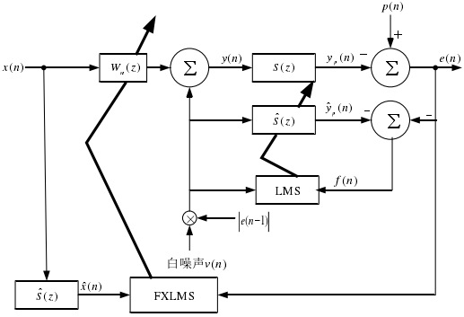

带自激的在线辨识FXLMS算法结构

### 次级通道离线辨识

当次级通道环境不随着时间而改变时，可以使用离线辨识算法。离线辨识是运行 ANC 系统进行降噪之前针对次级通道预先进行训练估计，固定并保存作为训练结果的次级通道模型，再将该模型引入到 ANC 系统并启动系统进行降噪。次级通道的离线辨识原理图如图 2.7 所示。

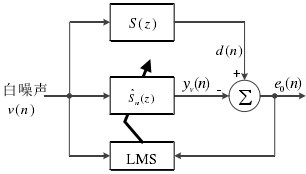

次级通道离线辨识原理图

其中，白噪声信号<span class="LaTex" alt="LaTex">$$v(n)$$</span>作为系统在第n 时刻的激励，此刻次级通道的输出为<span class="LaTex" alt="LaTex">$$d(n)$$</span>，即离线辨识系统的期望信号。<span class="LaTex" alt="LaTex">$$y_v(n)$$</span>则是白噪声激励信号经过次级通道的估计函数<span class="LaTex" alt="LaTex">$$\hat{S}_n(z)$$</span>的输出，<span class="LaTex" alt="LaTex">$$y_v(n)$$</span>与期望信号<span class="LaTex" alt="LaTex">$$d(n)$$</span>之差即为辨识误差<span class="LaTex" alt="LaTex">$$e_o(n)$$</span>，送入到 LMS 算法中。经过不断迭代更新后当辨识误差<span class="LaTex" alt="LaTex">$$e_o(n)$$</span>趋近于零时，<span class="LaTex" alt="LaTex">$$y_v(n)$$</span>与期望信号<span class="LaTex" alt="LaTex">$$d(n)$$</span>趋近于相同，则可知次级通道的估计函数<span class="LaTex" alt="LaTex">$$\hat{S}_n(z)$$</span>趋近于次级通道<span class="LaTex" alt="LaTex">$$S(z)$$</span>，实现了对次级通道的离线辨识。

离线辨识是脱离 ANC 降噪系统，独立进行系统辨识，不会给 ANC 降噪系统增加运行负担，同样不会损害 ANC 降噪系统的鲁棒性。若 ANC 系统的次级通道传递函数时不变，则离线辨识具有一定的优势，在本文后期具体实验时会给出更为直观的说明。

## FM 问题及非平稳

在前馈型 ANC 系统中，对参考信号的提取采用非声学传感器时，若传感器长时间工作将会累积损耗最终致使精度减削，采集到的参考信号频率将与实际初级噪声的频率存在误差。又或者，当信号发生器发出的信号不够精确，与期望存在误差。这些情况最终导致参考信号频率与实际噪声频率间存在误差，即所谓的 FM。

FM 问题对窄带前馈 ANC 具有致命性的影响力。哪怕系统中仅存在 1%的 FM 量，也将导致系统无法进行有效消噪。本文将在第三章和第六章分别从实时仿真以及实际实验两方面分析说明 FM 问题。

另外，噪声源设备的速度变化将直接表现为初级噪声信号频率的变化，而频率不稳定的初级噪声对系统的鲁棒性及跟踪能力有着毁坏性的损伤。非平稳一直是存在于实际的ANC 应用中不可避免的又一问题，当初级噪声表现出非平稳时，采集参考信号的传感器会有响应延时并最终引起非平稳的 FM。在本文的第三章将对非平稳的 FM 进行仿真分析。

## 本章小结

本章对 ANC 技术的理论基础进行了详细介绍。首先，针对 ANC 系统分别从反馈型和前馈型两种类型对 ANC 系统类型进行概要描述。其次，详细描述了传统ANC 算法，对 FXLMS 算法的基础 LMS 略有介绍，重点以 FXLMS 算法展开论述，继而详解了次级通道的在线辨识与离线辨识，并对在线辨识与离线辨识的应用场景进行了简要说明。最后，针对存在于前馈型 ANC系统中的 FM 及非平稳问题进行简要说明。

代码实现

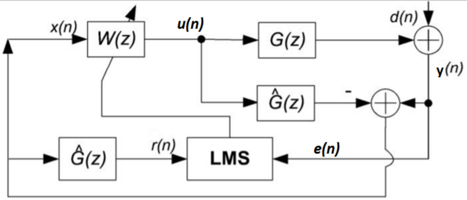

x(n)：参考信号

u(n)：控制信号

d(n)：期望信号

y(n)：输出信号

r(n)：x滤波后的信号

e(n)：误差信号

W(z)：自适应滤波器

G(z)：真实的次级通道

<span class="LaTex" alt="LaTex">$$\hat{G}(z)$$</span>：估计的次级通道

```
%              +-----------+                       +   
% x(k) ---+--->|   P(z)    |--yp(k)----------------> sum --+---> e(k)
%         |    +-----------+                          ^-   |
%         |                                           |    |
%         |        \                                ys(k)  |     
%         |    +-----------+          +-----------+   |    |
%         +--->|   C(z)    |--yw(k)-->|   S(z)    |---+    |
%         |    +-----------+          +-----------+        |
%         |            \                                   |
%         |             \----------------\                 |
%         |                               \                |
%         |    +-----------+          +-----------+        |
%         +--->|   Sh(z)   |--xs(k)-->|    LMS    |<-------+
%              +-----------+          +-----------+        

% LMS最小均方误差
% S(z)次级通道传递函数      % ys(k)次级声源
% P(z)主通道传递函数        % yp(k)初级声源
% C(z)控制器               % yw(k)控制器
% Sh(z)传感器函数          % xs(k)传感器参考信号

clear
T=1000; % 仿真持续时间

% 我们不知道p(z)和S(z)，所以我们必须建立dummy虚拟路径
Pw=[0.01 0.25 0.5 1 0.5 0.25 0.01];
Sw=Pw*0.25;

x_iden=randn(1,T); % 产生shape=(1,1000)的白噪声信号估计S(z)

% 送至actuator执行，在传感器位置测量，
y_iden=filter(Sw, 1, x_iden);

% 然后，开始识别过程
Shx=zeros(1,16);       % 传感器Sh(z)的状态
Shw=zeros(1,16);       % 传感器Sh(z)的权重
e_iden=zeros(1,  T);   % 识别错误的数据缓冲区

%LMS 算法
% [Shy,Shw]=lms(Shx,y_iden,x_iden,Shw,e_iden,T);
mu=0.1;                         % 学习率
for k=1:T                      % 离散时间 k
    Shx=[x_iden(k) Shx(1:15)];  % 更新传感器的状态
    Shy=sum(Shx.*Shw);            % 计算传感器Sh(z)的输出
    e_iden(k)=y_iden(k)-Shy;    % 计算误差     
    Shw=Shw+mu*e_iden(k)*Shx;   % 调整权重
end

% 检查结果
subplot(2,1,1)
plot((1:T), e_iden)
ylabel('Amplitude');
xlabel('Discrete time k');
legend('Identification error');
subplot(2,1,2)
stem(Sw) 
hold on 
stem(Shw, 'r*')
ylabel('Amplitude');
xlabel('Numbering of filter tap');
legend('S(z)系数', 'Sh(z)系数')


% 第second task二个任务是主动控制
X=randn(1,T);

% 测量传感器位置接收的噪声，
Yd=filter(Pw, 1, X);

% 启动系统
Cx=zeros(1,16);       % C(z)的状态
Cw=zeros(1,16);       % C(z)的权重
Sx=zeros(size(Sw));   % secondary次路径的虚拟状态
e_cont=zeros(1,T);    % 控制错误的数据缓冲区
Xhx=zeros(1,16);      % 过滤后x(k)的状态

% FxLMS 算法
% [Cy,Cw]=FxLMS(X,Cx,Cw,Sx,Sw,Shx,Shw,e_cont,Xhx,T,Yd);
mu=0.1;                            % 学习率
for k=1:T                          % 离散时间 k
    Cx=[X(k) Cx(1:15)];            % 更新控制器状态 
    Cy=sum(Cx.*Cw);                % 计算控制器输出
    Sx=[Cy Sx(1:length(Sx)-1)];    % 传播到secondary path
    e_cont(k)=Yd(k)-sum(Sx.*Sw);   % 测量残差
    Shx=[X(k) Shx(1:15)];          % 更新Sh(z)的状态
    Xhx=[sum(Shx.*Shw) Xhx(1:15)]; % 计算过滤后的x(k)
    Cw=Cw+mu*e_cont(k)*Xhx;        % 调整controller的权重
end

% 结果
figure
subplot(2,1,1)
plot((1:T), e_cont)
ylabel('Amplitude');
xlabel('Discrete time k');
legend('Noise residue')
subplot(2,1,2)
plot((1:T), Yd) 
hold on 
plot((1:T), Yd-e_cont, 'r:')
ylabel('Amplitude');
xlabel('Discrete time k');
legend('噪声信号', '控制信号')
```

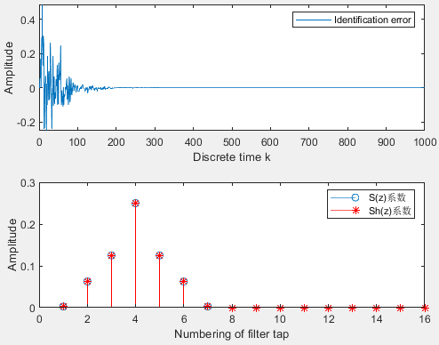

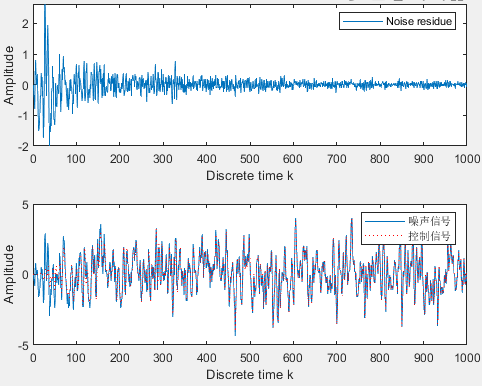

## 参考文献

* 窄带主动噪声控制系统实时仿真及硬件实现_毛梦菲
