 
<!--BEGIN_DATA
{
    "create_date": "2020-12-12 09:40", 
    "modify_date": "2020-12-12 09:40", 
    "is_top": "0", 
    "summary": "图解！24张图彻底弄懂九大常见数据结构！ 图解！10张图揭秘树和森林！", 
    "tags": "数据结构、算法", 
    "file_name": "九大常见数据结构.md"
}
END_DATA-->

#### 
原文出处：<a href='https://mp.weixin.qq.com/s/lnMvB3zgWZTmCfCvnNwTbA' target='blank'>图解！24张图彻底弄懂九大常见数据结构！</a>

​数据结构想必大家都不会陌生，对于一个成熟的程序员而言，熟悉和掌握数据结构和算法也是基本功之一。数据结构本身其实不过是数据按照特点关系进行存储或者组织的集合，特殊的结构在不同的应用场景中往往会带来不一样的处理效率。

常用的数据结构可根据数据访问的特点分为线性结构和非线性结构。线性结构包括常见的链表、栈、队列等，非线性结构包括树、图等。数据结构种类繁多，本文将通过图解的方式对常用的数据结构进行理论上的介绍和讲解，以方便大家掌握常用数据结构的基本知识。

本文提纲：

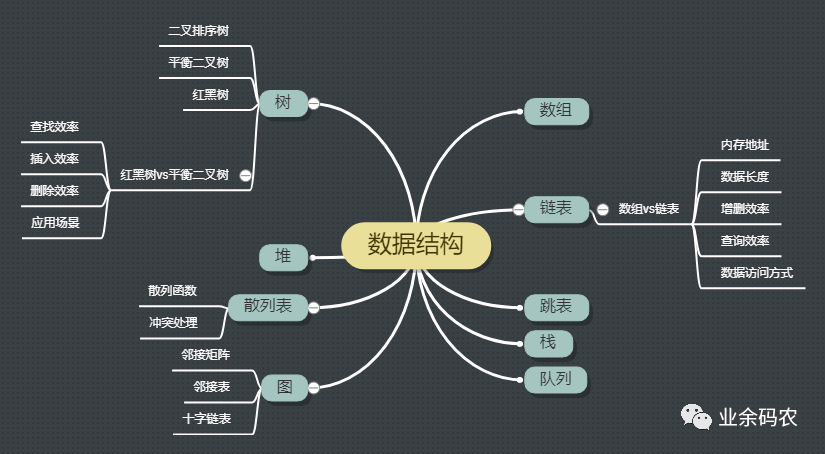

### 1 数组

数组可以说是最基本最常见的数据结构。数组一般用来存储相同类型的数据，可通过数组名和下标进行数据的访问和更新。数组中元素的存储是按照先后顺序进行的，同时在内存中也是按照这个顺序进行连续存放。数组相邻元素之间的内存地址的间隔一般就是数组数据类型的大小。

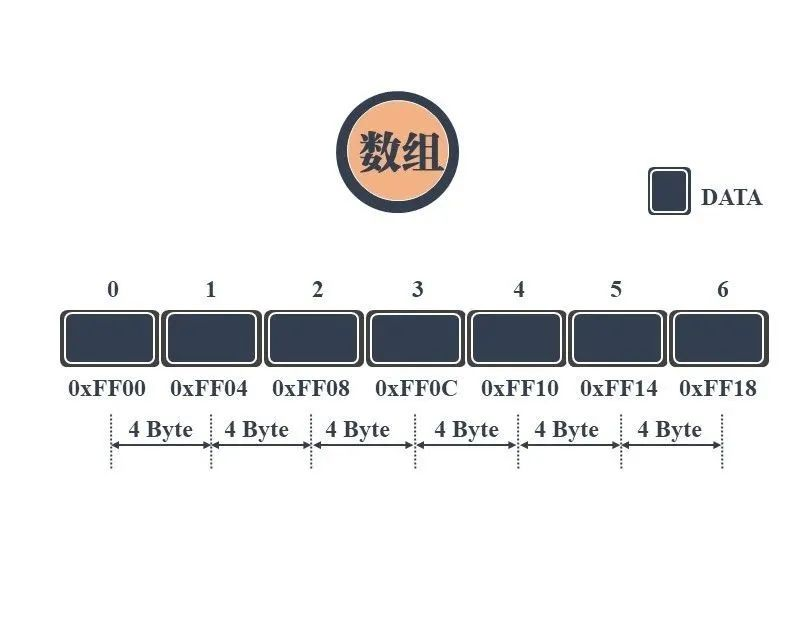

### 2 链表

链表相较于数组，除了数据域，还增加了指针域用于构建链式的存储数据。链表中每一个节点都包含此节点的数据和指向下一节点地址的指针。由于是通过指针进行下一个数据元素的查找和访问，使得链表的自由度更高。

这表现在对节点进行增加和删除时，只需要对上一节点的指针地址进行修改，而无需变动其它的节点。不过事物皆有两极，指针带来高自由度的同时，自然会牺牲数据查找的效率和多余空间的使用。

一般常见的是有头有尾的单链表，对指针域进行反向链接，还可以形成双向链表或者循环链表。

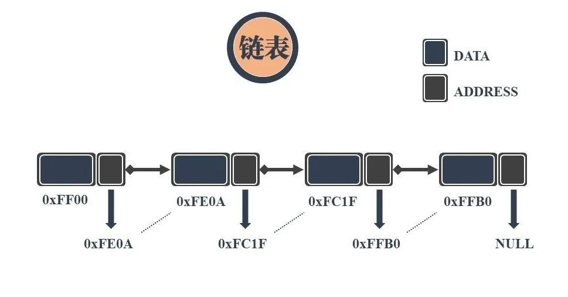

**链表和数组对比**

链表和数组在实际的使用过程中需要根据自身的优劣势进行选择。链表和数组的异同点也是面试中高频的考察点之一。这里对单链表和数组的区别进行了对比和总结。

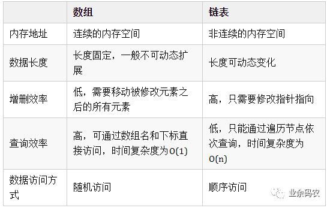

### 3 跳表

从上面的对比中可以看出，链表虽然通过增加指针域提升了自由度，但是却导致数据的查询效率恶化。特别是当链表长度很长的时候，对数据的查询还得从头依次查询，这样的效率会更低。跳表的产生就是为了解决链表过长的问题，通过增加链表的多级索引来加快原始链表的查询效率。这样的方式可以让查询的时间复杂度从O(n)提升至O(logn)。

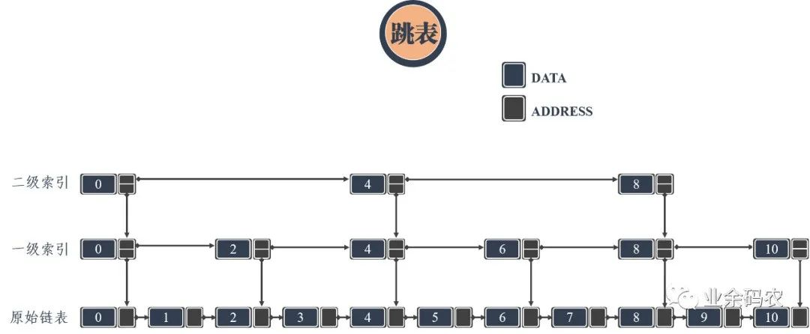

跳表通过增加的多级索引能够实现高效的动态插入和删除，其效率和红黑树和平衡二叉树不相上下。目前redis和levelDB都有用到跳表。

从上图可以看出，索引级的指针域除了指向下一个索引位置的指针，还有一个down指针指向低一级的链表位置，这样才能实现跳跃查询的目的。

### 4 栈

栈是一种比较简单的数据结构，常用一句话描述其特性，后进先出。栈本身是一个线性表，但是在这个表中只有一个口子允许数据的进出。这种模式可以参考腔肠动物...即进食和排泄都用一个口...

栈的常用操作包括入栈push和出栈pop，对应于数据的压入和压出。还有访问栈顶数据、判断栈是否为空和判断栈的大小等。由于栈后进先出的特性，常可以作为数据操作的临时容器，对数据的顺序进行调控，与其它数据结构相结合可获得许多灵活的处理。

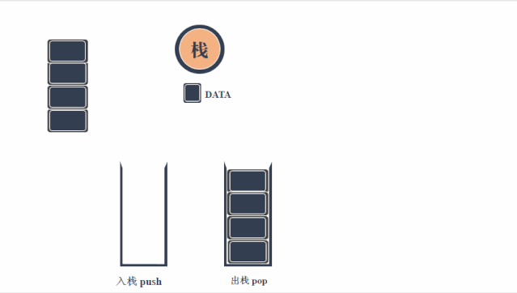

### 5 队列

队列是栈的兄弟结构，与栈的后进先出相对应，队列是一种先进先出的数据结构。顾名思义，队列的数据存储是如同排队一般，先存入的数据先被压出。常与栈一同配合，可发挥最大的实力。

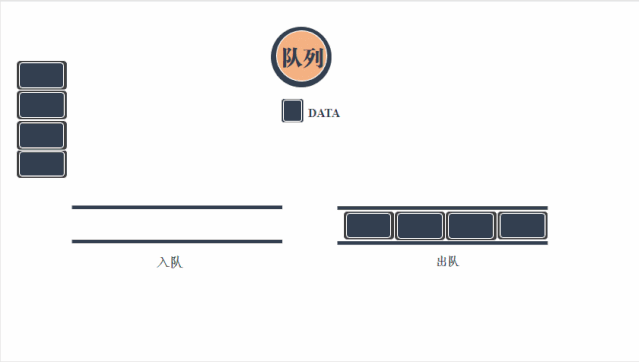

### 6 树

树作为一种树状的数据结构，其数据节点之间的关系也如大树一样，将有限个节点根据不同层次关系进行排列，从而形成数据与数据之间的父子关系。常见的数的表示形式更接近“倒挂的树”，因为它将根朝上，叶朝下。

树的数据存储在结点中，每个结点有零个或者多个子结点。没有父结点的结点在最顶端，成为根节点；没有非根结点有且只有一个父节点；每个非根节点又可以分为多个不相交的子树。

这意味着树是具备层次关系的，父子关系清晰，家庭血缘关系明朗；这也是树与图之间最主要的区别。

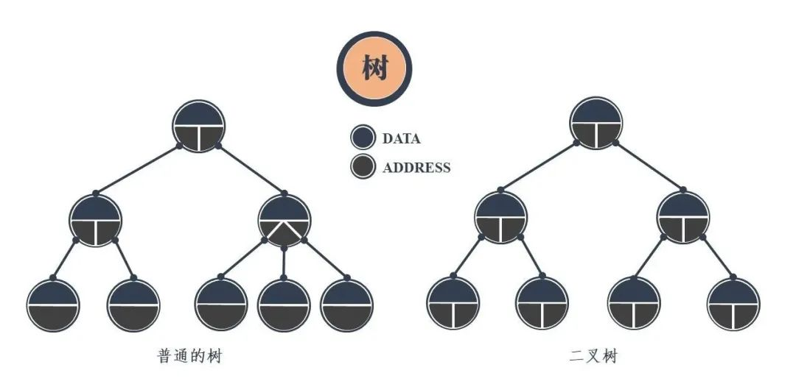

别看树好像很高级，其实可看作是链表的高配版。树的实现就是对链表的指针域进行了扩充，增加了多个地址指向子结点。同时将“链表”竖起来，从而凸显了结点之间的层次关系，更便于分析和理解。

树可以衍生出许多的结构，若将指针域设置为双指针，那么即可形成最常见的二叉树，即每个结点最多有两个子树的树结构。二叉树根据结点的排列和数量还可进一度划分为完全二叉树、满二叉树、平衡二叉树、红黑树等。

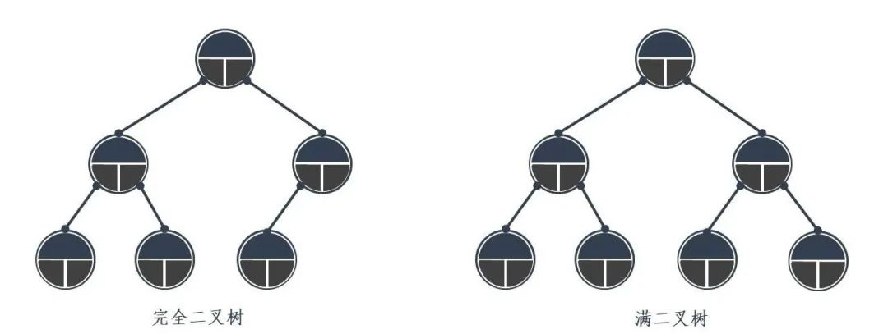

> **完全二叉树**：除了最后一层结点，其它层的结点数都达到了最大值；同时最后一层的结点都是按照从左到右依次排布。
>
> **满二叉树**：除了最后一层，其它层的结点都有两个子结点。

**平衡二叉树**

平衡二叉树又被称为AVL树，它是一棵二叉排序树，且具有以下性质：它是一棵空树或它的左右两个子树的高度差的绝对值不超过1，并且左右两个子树都是一棵平衡二叉树。

> **二叉排序树**：是一棵空树，或者：若它的左子树不空，则左子树上所有结点的值均小于它的根结点的值；若它的右子树不空，则右子树上所有结点的值均大于它的根结点的值；它的左、右子树也分别为二叉排序树。
>
> **树的高度**：结点层次的最大值
>
> **平衡因子**：左子树高度 - 右子树高度

二叉排序树意味着二叉树中的数据是排好序的，顺序为左结点<根节点<右结点，这表明二叉排序树的中序遍历结果是有序的。（还不懂二叉树四种遍历方式[前序遍历、中序遍历、后序遍历、层序遍历]的同学赶紧补习！）

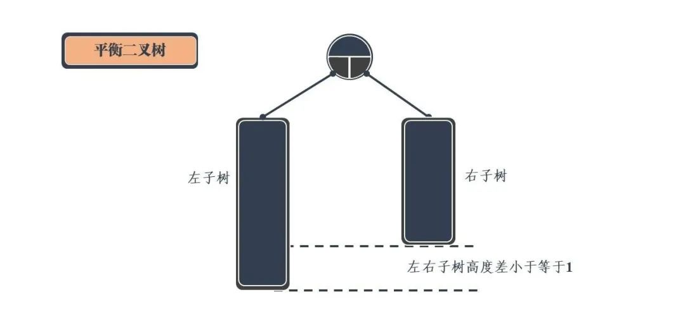

平衡二叉树的产生是为了解决二叉排序树在插入时发生线性排列的现象。由于二叉排序树本身为有序，当插入一个有序程度十分高的序列时，生成的二叉排序树会持续在某个方向的字数上插入数据，导致最终的二叉排序树会退化为链表，从而使得二叉树的查询和插入效率恶化。

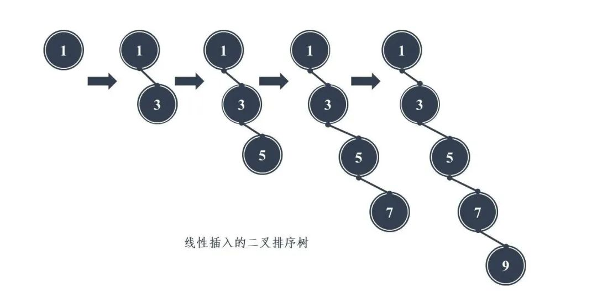

平衡二叉树的出现能够解决上述问题，但是在构造平衡二叉树时，却需要采用不同的调整方式，使得二叉树在插入数据后保持平衡。主要的四种调整方式有LL（左旋）、RR（右旋）、LR（先左旋再右旋）、RL（先右旋再左旋）。这里先给大家介绍下简单的单旋转操作，左旋和右旋。LR和RL本质上只是LL和RR的组合。

> 在插入一个结点后应该沿搜索路径将路径上的结点平衡因子进行修改，当平衡因子大于1时，就需要进行平衡化处理。从发生不平衡的结点起，沿刚才回溯的路径取直接下两层的结点，如果这三个结点在一条直线上，则采用**单旋转**进行平衡化，如果这三个结点位于一条折线上，则采用**双旋转**进行平衡化。

左旋：S为当前需要左旋的结点，E为当前结点的父节点。

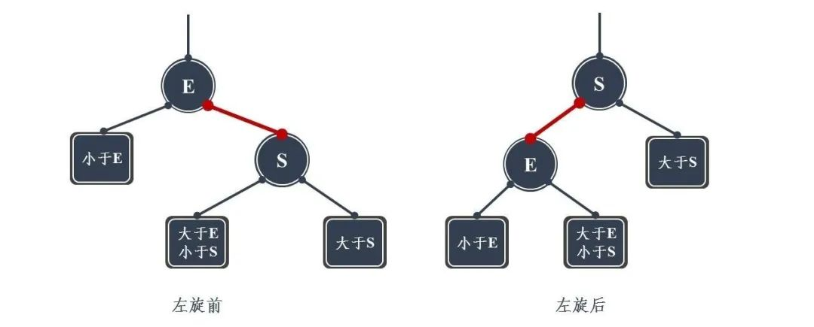

左旋的操作可以用一句话简单表示：将当前结点S的左孩子旋转为当前结点父结点E的右孩子，同时将父结点E旋转为当前结点S的左孩子。可用动画表示：

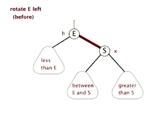

右旋：S为当前需要左旋的结点，E为当前结点的父节点。右单旋是左单旋的镜像旋转。

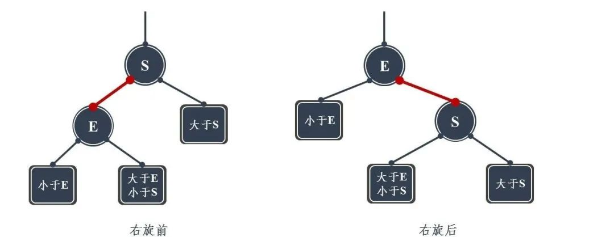

左旋的操作同样可以用一句话简单表示：将当前结点S的左孩子E的右孩子旋转为当前结点S的左孩子，同时将当前结点S旋转为左孩子E的右孩子。可用动画表示：

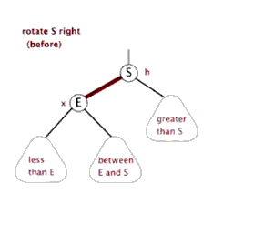

**红黑树**

平衡二叉树（AVL）为了追求高度平衡，需要通过平衡处理使得左右子树的高度差必须小于等于1。高度平衡带来的好处是能够提供更高的搜索效率，其最坏的查找时间复杂度都是O(logN)。但是由于需要维持这份高度平衡，所付出的代价就是当对树种结点进行插入和删除时，需要经过多次旋转实现复衡。这导致AVL的插入和删除效率并不高。

为了解决这样的问题，能不能找一种结构能够兼顾搜索和插入删除的效率呢？这时候红黑树便申请出战了。

红黑树具有五个特性：

>   1. 每个结点要么是红的要么是黑的。
>
>   2. 根结点是黑的。
>
>   3. 每个叶结点（叶结点即指树尾端NIL指针或NULL结点）都是黑的。
>
>   4. 如果一个结点是红的，那么它的两个儿子都是黑的。
>
>   5. 对于任意结点而言，其到叶结点树尾端NIL指针的每条路径都包含相同数目的黑结点。

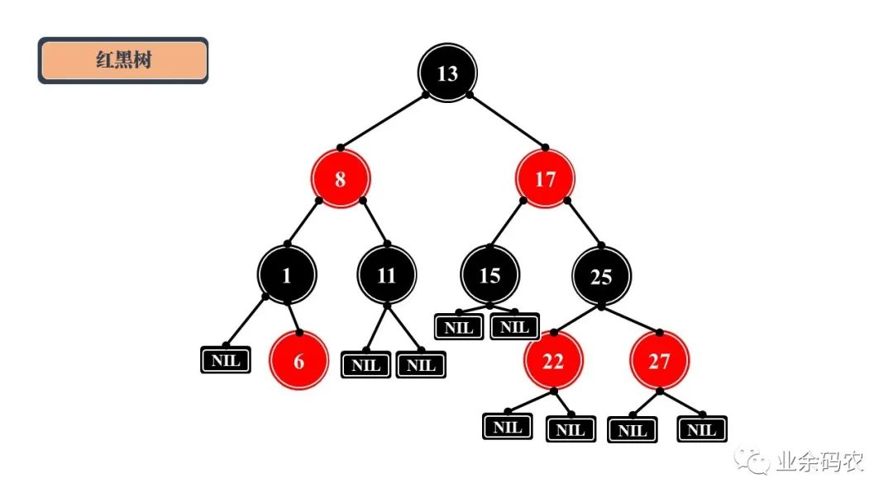

红黑树通过将结点进行红黑着色，使得原本高度平衡的树结构被稍微打乱，平衡程度降低。红黑树不追求完全平衡，只要求达到部分平衡。这是一种折中的方案，大大提高了结点删除和插入的效率。C++中的STL就常用到红黑树作为底层的数据结构。

**红黑树VS平衡二叉树**

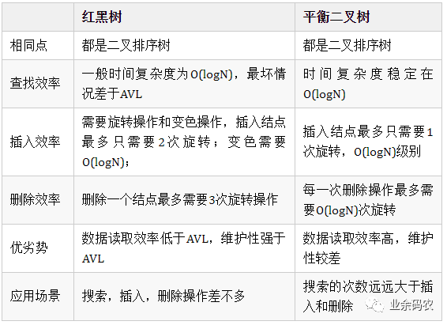

除了上面所提及的树结构，还有许多广泛应用在数据库、磁盘存储等场景下的树结构。比如B树、B+树等。这里就先不介绍了诶，下次在讲述相关存储原理的时候将会着重介绍。（其实是因为懒）

### 7 堆

了解完二叉树，再来理解堆就不是什么难事了。堆通常是一个可以被看做一棵树的数组对象。堆的具体实现一般不通过指针域，而是通过构建一个一维数组与二叉树的父子结点进行对应，因此堆总是一颗完全二叉树。

对于任意一个父节点的序号n来说（这里n从0算），它的子节点的序号一定是2n+1，2n+2，因此可以直接用数组来表示一个堆。

不仅如此，堆还有一个性质：堆中某个节点的值总是不大于或不小于其父节点的值。将根节点最大的堆叫做最大堆或大根堆，根节点最小的堆叫做最小堆或小根堆。

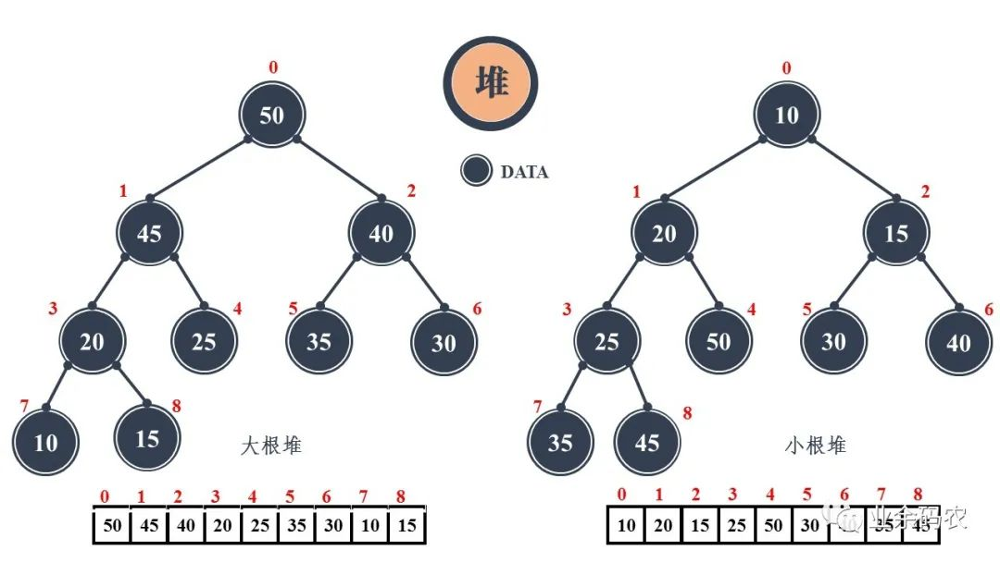

堆常用来实现优先队列，在面试中经常考的问题都是与排序有关，比如堆排序、topK问题等。由于堆的根节点是序列中最大或者最小值，因而可以在建堆以及重建堆的过程中，筛选出数据序列中的极值，从而达到排序或者挑选topK值的目的。

### 8 散列表

散列表也叫哈希表，是一种通过键值对直接访问数据的机构。在初中，我们就学过一种能够将一个x值通过一个函数获得对应的一个y值的操作，叫做映射。散列表的实现原理正是映射的原理，通过设定的一个关键字和一个映射函数，就可以直接获得访问数据的地址，实现O(1)的数据访问效率。在映射的过程中，事先设定的函数就是一个映射表，也可以称作散列函数或者哈希函数。

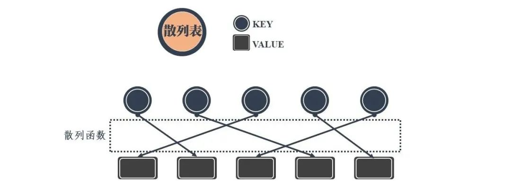

散列表的实现最关键的就是散列函数的定义和选择。一般常用的有以下几种散列函数：

> **直接寻址法**：取关键字或关键字的某个线性函数值为散列地址。
>
> **数字分析法**：通过对数据的分析，发现数据中冲突较少的部分，并构造散列地址。例如同学们的学号，通常同一届学生的学号，其中前面的部分差别不太大，所以用后面的部分来构造散列地址。
>
> **平方取中****法**：当无法确定关键字里哪几位的分布相对比较均匀时，可以先求出关键字的平方值，然后按需要取平方值的中间几位作为散列地址。这是因为：计算平方之后的中间几位和关键字中的每一位都相关，所以不同的关键字会以较高的概率产生不同的散列地址。
>
> **取随机数法**：使用一个随机函数，取关键字的随机值作为散列地址，这种方式通常用于关键字长度不同的场合。
>
> **除留取余法**：取关键字被某个不大于散列表的表长 n 的数 m 除后所得的余数 p 为散列地址。这种方式也可以在用过其他方法后再使用。该函数对 m 的选择很重要，一般取素数或者直接用 n。

确定好散列函数之后，通过某个`key`值的确会得到一个唯一的`value`地址。但是却会出现一些特殊情况。即通过不同的`key`值可能会访问到同一个地址，这个现象称之为冲突。

冲突在发生之后，当在对不同的`key`值进行操作时会使得造成相同地址的数据发生覆盖或者丢失，是非常危险的。所以在设计散列表往往还需要采用冲突解决的办法。

常用的冲突处理方式有很多，常用的包括以下几种：

> **开放地址法**（也叫开放寻址法）：实际上就是当需要存储值时，对Key哈希之后，发现这个地址已经有值了，这时该怎么办？不能放在这个地址，不然之前的映射会被覆盖。这时对计算出来的地址进行一个探测再哈希，比如往后移动一个地址，如果没人占用，就用这个地址。如果超过最大长度，则可以对总长度取余。这里移动的地址是产生冲突时的增列序量。
>
> **再哈希法**：在产生冲突之后，使用关键字的其他部分继续计算地址，如果还是有冲突，则继续使用其他部分再计算地址。这种方式的缺点是时间增加了。
>
> **链地址法**：链地址法其实就是对Key通过哈希之后落在同一个地址上的值，做一个链表。其实在很多高级语言的实现当中，也是使用这种方式处理冲突的。
>
> **公共溢出区**：这种方式是建立一个公共溢出区，当地址存在冲突时，把新的地址放在公共溢出区里。

目前比较常用的冲突解决方法是链地址法，一般可以通过数组和链表的结合达到冲突数据缓存的目的。

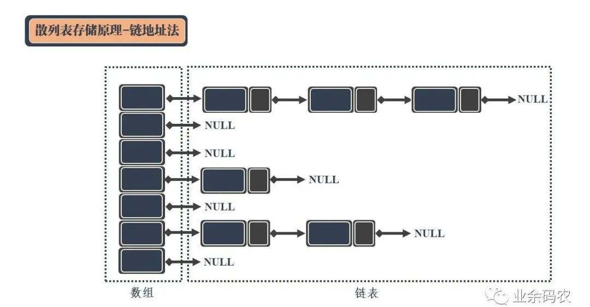

左侧数组的每个成员包括一个指针，指向一个链表的头。每发生一个冲突的数据，就将该数据作为链表的节点链接到链表尾部。这样一来，就可以保证冲突的数据能够区分并顺利访问。

考虑到链表过长造成的问题，还可以使用红黑树替换链表进行冲突数据的处理操作，来提高散列表的查询稳定性。

### 9 图

图相较于上文的几个结构可能接触的不多，但是在实际的应用场景中却经常出现。比方说交通中的线路图，常见的思维导图都可以看作是图的具体表现形式。

图结构一般包括顶点和边，顶点通常用圆圈来表示，边就是这些圆圈之间的连线。边还可以根据顶点之间的关系设置不同的权重，默认权重相同皆为1。此外根据边的方向性，还可将图分为有向图和无向图。

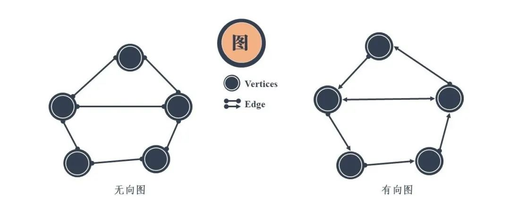

图结构用抽象的图线来表示十分简单，顶点和边之间的关系非常清晰明了。但是在具体的代码实现中，为了将各个顶点和边的关系存储下来，却不是一件易事。

**邻接矩阵**

目前常用的图存储方式为邻接矩阵，通过所有顶点的二维矩阵来存储两个顶点之间是否相连，或者存储两顶点间的边权重。

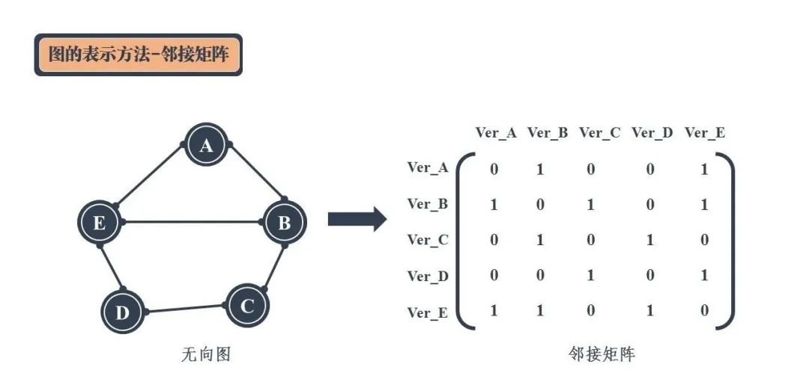

无向图的邻接矩阵是一个对称矩阵，是因为边不具有方向性，若能从此顶点能够到达彼顶点，那么彼顶点自然也能够达到此顶点。此外，由于顶点本身与本身相连没有意义，所以在邻接矩阵中对角线上皆为0。

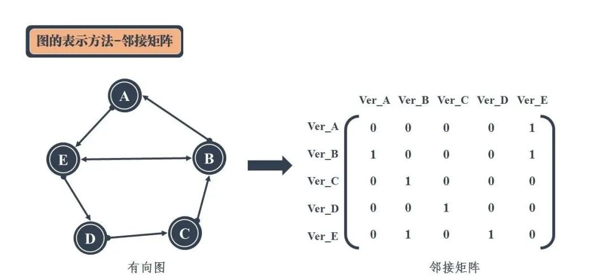

有向图由于边具有方向性，因此彼此顶点之间并不能相互达到，所以其邻接矩阵的对称性不再。

用邻接矩阵可以直接从二维关系中获得任意两个顶点的关系，可直接判断是否相连。但是在对矩阵进行存储时，却需要完整的一个二维数组。若图中顶点数过多，会导致二维数组的大小剧增，从而占用大量的内存空间。

而根据实际情况可以分析得，图中的顶点并不是任意两个顶点间都会相连，不是都需要对其边上权重进行存储。那么存储的邻接矩阵实际上会存在大量的0。虽然可以通过稀疏表示等方式对稀疏性高的矩阵进行关键信息的存储，但是却增加了图存储的复杂性。

因此，为了解决上述问题，一种可以只存储相连顶点关系的邻接表应运而生。

**邻接表**

在邻接表中，图的每一个顶点都是一个链表的头节点，其后连接着该顶点能够直接达到的相邻顶点。相较于无向图，有向图的情况更为复杂，因此这里采用有向图进行实例分析。

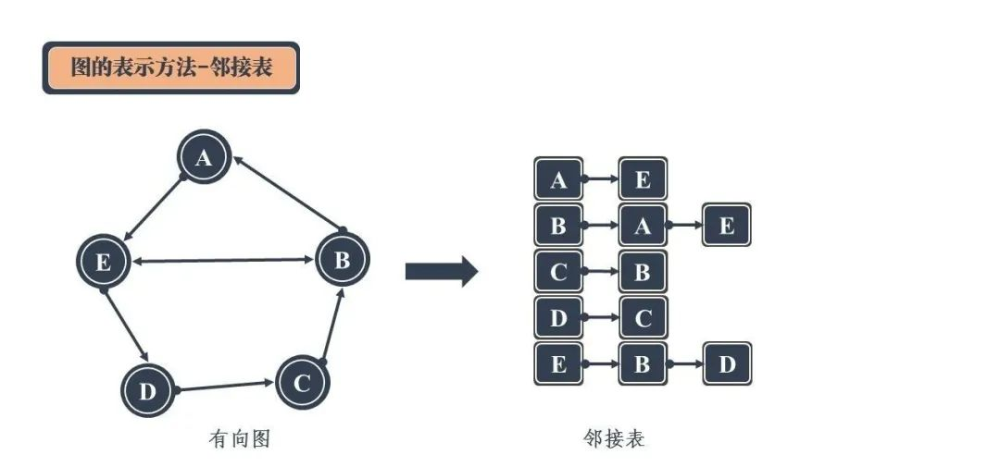

在邻接表中，每一个顶点都对应着一条链表，链表中存储的是顶点能够达到的相邻顶点。存储的顺序可以按照顶点的编号顺序进行。比如上图中对于顶点B来说，其通过有向边可以到达顶点A和顶点E，那么其对应的邻接表中的顺序即B->A->E，其它顶点亦如此。

通过邻接表可以获得从某个顶点出发能够到达的顶点，从而省去了对不相连顶点的存储空间。然而，这还不够。对于有向图而言，图中有效信息除了从顶点“指出去”的信息，还包括从别的顶点“指进来”的信息。这里的“指出去”和“指进来”可以用出度和入度来表示。

> 入度：有向图的某个顶点作为终点的次数和。
>
> 出度：有向图的某个顶点作为起点的次数和。

由此看出，在对有向图进行表示时，邻接表只能求出图的出度，而无法求出入度。这个问题很好解决，那就是增加一个表用来存储能够到达某个顶点的相邻顶点。这个表称作逆邻接表。

**逆邻接表**

逆邻接表与邻接表结构类似，只不过图的顶点链接着能够到达该顶点的相邻顶点。也就是说，邻接表时顺着图中的箭头寻找相邻顶点，而逆邻接表时逆着图中的箭头寻找相邻顶点。

邻接表和逆邻接表的共同使用下，就能够把一个完整的有向图结构进行表示。可以发现，邻接表和逆邻接表实际上有一部分数据时重合的，因此可以将两个表合二为一，从而得到了所谓的十字链表。

**十字链表**

十字链表似乎很简单，只需要通过相同的顶点分别链向以该顶点为终点和起点的相邻顶点即可。

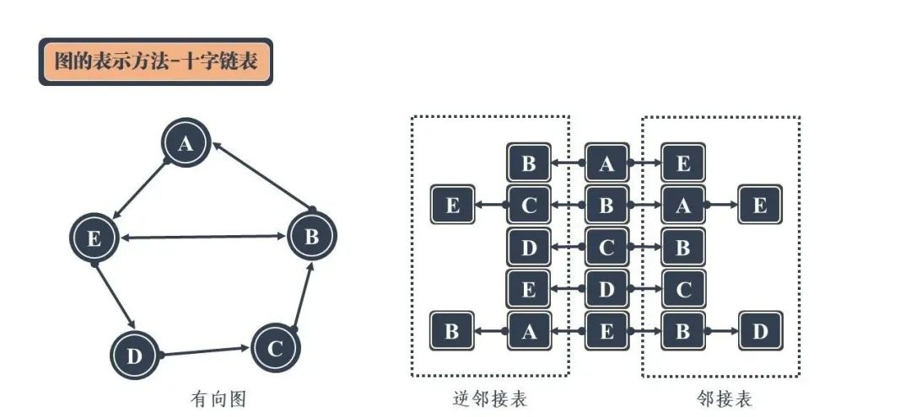

但这并不是最优的表示方式。虽然这样的方式共用了中间的顶点存储空间，但是邻接表和逆邻接表的链表节点中重复出现的顶点并没有得到重复利用，反而是进行了再次存储。因此，上图的表示方式还可以进行进一步优化。

十字链表优化后，可通过扩展的顶点结构和边结构来进行正逆邻接表的存储：（下面的弧头可看作是边的箭头那端，弧尾可看作是边的圆点那端）

> **data**：用于存储该顶点中的数据；
>
> **firstin指针**：用于连接以当前顶点为弧头的其他顶点构成的链表，即从别的顶点指进来的顶点；
>
> **firstout指针**：用于连接以当前顶点为弧尾的其他顶点构成的链表，即从该顶点指出去的顶点；

边结构通过存储两个顶点来确定一条边，同时通过分别代表这两个顶点的指针来与相邻顶点进行链接：

> **tailvex**：用于存储作为弧尾的顶点的编号；
>
> **headvex**：用于存储作为弧头的顶点的编号；
>
> **headlink ****指针**：用于链接下一个存储作为弧头的顶点的节点；
>
> **taillink ****指针**：用于链接下一个存储作为弧尾的顶点的节点；

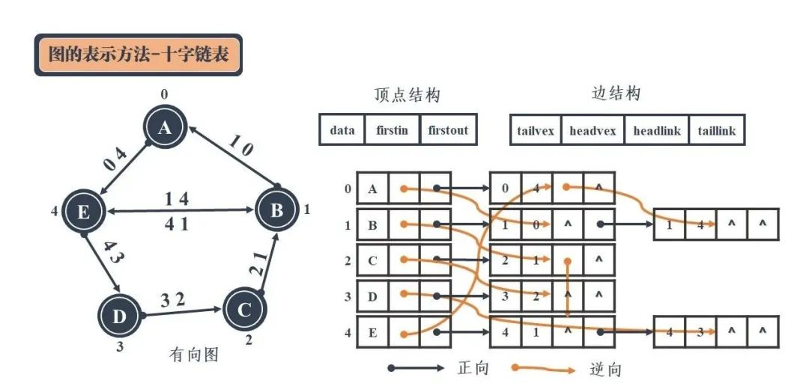

以上图为例子，对于顶点A而言，其作为起点能够到达顶点E。因此在邻接表中顶点A要通过边`AE`（即边04）指向顶点E，顶点A的`firstout`指针需要指向边04的`tailvex`。同时，从B出发能够到达A，所以在逆邻接表中顶点A要通过边`AB`（即边10）指向B，顶点A的`firstin`指针需要指向边10的弧头，即`headlink`指针。依次类推。

十字链表采用了一种看起来比较繁乱的方式对边的方向性进行了表示，能够在尽可能降低存储空间的情况下增加指针保留顶点之间的方向性。具体的操作可能一时间不好弄懂，建议多看几次上图，弄清指针指向的意义，明白正向和逆向邻接表的表示。

### 10 总结

数据结构博大精深，没有高等数学的讳莫如深，也没有量子力学的玄乎其神，但是其在计算机科学的各个领域都具有强大的力量。本文试图采用图解的方式对九种数据结构进行理论上的介绍，但是其实这都是不够的。

即便是简单的数组、栈、队列等结构，在实际使用以及底层实现上都会有许多优化设计以及使用技巧，这意味着还需要真正把它们灵活的用起来，才能够算是真正意义上的熟悉和精通。但是本文可以作为常见数据结构的一个总结，当你对某些结构有些淡忘的时候，不妨重新回来看看。

#### 
原文出处：<a href='https://mp.weixin.qq.com/s/WB3tRYIEm_ZURkUrTK_92w' target='blank'>图解！10张图揭秘树和森林！</a>

说起树，想必大多数人第一反应都是二叉树以及二叉树的各种亲戚，包括红黑树、平衡二叉树等。但是其实除了二叉树外，普通的树结构在数据结构中也占据着非常重要的一部分。

不仅如此，所谓百川成海，白木成林。既然有了树结构，自然而然也会有相应的森林结构。因此，本文就将从普通的树结构出发，探讨并介绍一下树和森林的那些事。

### 树的定义

树实际上就是由许多个节点组成的集合，只不过每个节点的的组成是根据树状结构进行划分。一颗普通的树结构可以通过以下图来定义。  

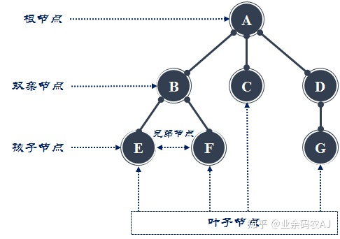

还是再来罗嗦一遍，树的结构就像是一颗倒挂的树，结点的组成是以层级往下。一棵树由若干子树构成，而子树又有更小的子树构成。

### 树的血缘关系

对于树中的某个结点，最多只和上一层的结点有直接的关系，而与其下一层的多个结点有直接关系。其上一层的结点称为**双亲结点**，下一层的结点称为**孩子结点**。所有位于树的最底部，没有孩子结点的结点被称之为**叶子节点**。具有相同双亲的结点互为**兄弟节点**。

### 树的家族等级

树是一个大家族，等级十分森严。树中某个结点的子树个数称为该**结点的度**。所以叶子结点也就是度为0的结点。而度不为0的结点被称之为**内部结点**。每一个结点都具有自己的**层次**，该层次由高往低递增，根结点为第一层，根的孩子结点为第二层，依次类推。一棵树最大的层数称之为**树的高度**（或深度）。

### 树的存储结构

由于普通的树结构并不像二叉树那么规则，可能是多叉树的组合，因此很难用常规的线性结构来存储。因此树结构的存储需要将树家族中的关系剥离出来进行存储，保存了每个结点之间的关系，整个树结构也就能依次进行恢复。

这就好比家族中的族谱一样，记录的是我们和双亲以及兄弟姐妹的关系。对于树而言，则根据存储关系的不同，可分为双亲表示、孩子表示以及孩子兄弟表示三种存储方法。

### 双亲表示法

树的双亲表示，显然就是通过**记录每个结点的双亲结点**来存储整颗树的层次关系。这里常用的一种存储结构就是数组。在连续的地址中存储树的结点，同时将之与其双亲结点在数组中的序号进行对应，这样一来就能够保存所有结点的双亲信息。

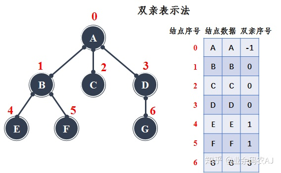

双亲表示法直接存储的是结点的双亲位置（对应于数组的下标），因此在求某个结点的双亲结点以及祖先结点时非常方便。但是却无法直接获得该结点的孩子结点的位置。

若需要查找指定结点的孩子以及后代结点，需要遍历整个数组并进行多次判断才行。

### 孩子表示法

树的双亲表示法的缺点显而易见，所以最直接的解决办法就是干脆存孩子结点算了。还别说，孩子表示法就是这样一种表示方法。但是相较于双亲结点的存储，存储孩子结点有一个需要考虑的问题，就是某个结点的双亲结点最多只有一个，但是其孩子结点可能有多个。如果每个孩子结点都存储在数组里，这样的方式不是一个明智的选择，并且也没有必要。

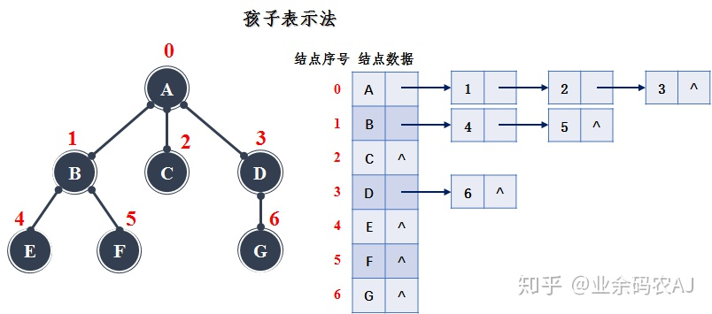

所以在使用孩子表示法来存储树的结构时，常使用数组+链表的结构。这种结构是不是很常见，跟解决哈希冲突的链地址法有异曲同工之意。在这样的链式结构中，用指针指示出结点的每个孩子，每个孩子的位置通过链表依次相连，这样就十分方便与查找每个结点的子孙。

只不过问题依旧，若要找出寻找某个结点的双亲则同样需要遍历所有链表。不过，既然双亲表示和孩子表示都有了，简单粗暴的合并一下不就可以相互补充，共同进退吗。

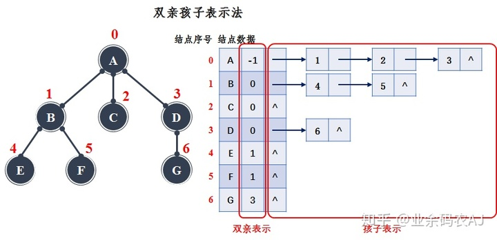

所谓的双亲孩子表示法，直接将双亲表示和孩子表示组合起来即可。这样即可满足双亲的查找，也可以满足孩子的查找。

### 孩子兄弟表示法

本来有了双亲孩子表示法就已经足够用来存储树中的数据信息了，为什么还要来一个孩子兄弟法呢？其实不然，孩子兄弟表示法反而是一种很有意思且很有价值的表示方式。

在孩子兄弟表示法中，我们约定只存储每个结点的第一个孩子结点和下一个兄弟结点。不仅如此，结点的存储是通过链表进行的。话说不太清，还是直接看图吧。

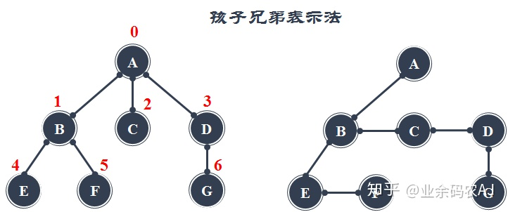

看起来似乎有些诡异的形状，每个结点都作为链表的一个节点，通过两个指针分别指向第一个孩子结点和下一个兄弟结点。为了防止大家看不懂，我举个例子。拿结点​B​来说，它的第一个孩子结点是​E​，而它的下一个兄弟是与它处于同一层级的C。因此结点B的两个指针分别指向了​E​和​C​。

孩子兄弟表示法这样看起来似乎很鸡肋，但是假如我们调整一下右边这个图，就能看出其中的蹊跷了。

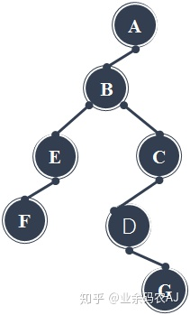

看出来了吗，孩子兄弟表示法实际上就是将一颗普通的树转换成了二叉树的形式。所以说二叉树为什么这么重要，因为万变不离其中呀。看到这，其实也透露出树和二叉树之间的转换关系，许多二叉树上的性质和操作也可以借此运用在普通的树结构中。

### 树的遍历

学过二叉树的同学想必应该对前序遍历、中序遍历、后序遍历、中序遍历烂熟于心了吧，无论是迭代还是非迭代的写法，都是基础得不能再基础的东西了。而对于普通的树而言，由于每个结点子树的个数并不一定，因此不好规定前、中、后序的顺序。

所以一般而言对于树的遍历方式有两种，根据根结点被遍历的先后可分为先根遍历和后根遍历。

树的先根遍历是先访问树的根节点，然后依次遍历根结点的各个子树。如此递推。当将一颗普通树转换为对应的二叉树时（孩子兄弟表示法），其实就相当于是前序遍历。

树的后根遍历就不用多说了吧，跟先根遍历相反，先访问根结点的各颗子树，再访问树根结点。而树的后根遍历就相当于转换后二叉树的中序遍历。不信的话你试试。

### 树、森林和二叉树的相互转换

写到这，突然发现好像忘记介绍森林是什么东西了。其实森林的概念很简单，就是很多颗树。对，就是这样。

树、森林和二叉树本质上都是类似的结构，因此相互之间可以进行转换。任意一个森林或者一棵树都可以对应表示为一颗二叉树，而任何一颗二叉树也能够对应到一个森林或一棵树上。

树转换为二叉树，我们在前面已经介绍过，就是通过树的孩子兄弟表示法。通过孩子兄弟法进行表示时，每一个树都可以用一颗唯一的二叉树来表示。但是转换过来的二叉树却有一个非常显著的特点。仔细观察。

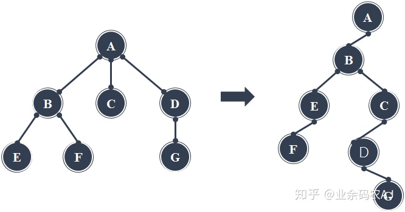

很显然，这不是一颗平衡的二叉树。并且，根节点是没有右子树的，我敢肯定的说。这是因为根节点是没有兄弟结点的，它只有孩子结点，所以在转换为二叉树之后，一定是没有右子树的。

不过这样的缺陷可以在森林中进行弥补。由于森林中有很多棵树，因此可以将其它树作为右子树。具体的实现步骤，先将森林中的每一棵树转换为二叉树，再将第一颗树的根结点作为转换后的二叉树的根。第一棵树的左子树作为转换后二叉树根结点的左子树，第二棵树作为转换后二叉树的右子树。第三颗树作为转换后二叉树根结点的右子树的右子树。以此类推。

咱们来举个例子。这里有一个由三颗树构成的森林。

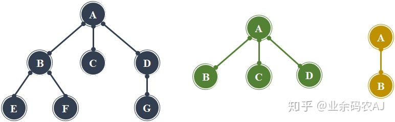

将上面三棵树分辨转换二叉树是以下形式。

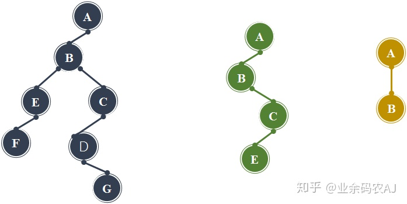

然后将绿色二叉树作为蓝色二叉树根节点的右子树，将黄色二叉树作为绿色二叉树根节点的右子树，就可以得到森林转换为二叉树的结果。

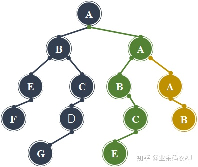

根据以上的规则，同样可以将一颗二叉树转换为树和森林。

### 总结

在数据结构中，估计树和森林不算很热门的结构，甚至许多工作过很多年的老码农都不曾用过。写这篇文章的时候，我也在想树和森林到底在实际中有什么用，似乎最重要的部分就是将一颗普通的树转换成二叉树来处理。但是我想这就是它的价值所在吧。

许多真实场景中，可能数据之间的关系并不能直接通过二叉树来表示和存储，一开始可能都需要通过多叉树或者各种畸形的树结构来定义关系。这样的树肯定是不适用于快速的处理和访问的，因此往往需要将这些奇形怪状的树转换为规则的二叉树来进行进一步的处理。最终为了回归到具体的应用，也需要将二叉树重新分解为最初的树或者森林结构来获得应用意义。

总的来说，存在即是真理。不怕用不到，就怕想不到。
