 
<!--BEGIN_DATA
{
    "create_date": "2021-12-11 21:10", 
    "modify_date": "2021-12-11 21:10", 
    "is_top": "0", 
    "summary": "二维码原理与使用", 
    "tags": "其它", 
    "file_name": "二维码原理与使用.md"
}
END_DATA-->

#### <p>原文出处：<a href='https://mp.weixin.qq.com/s/oJmQxytE02DZ46LclaAIPg' target='blank'>二维码原理与使用</a></p>

## 1、什么是二维码？

二维码是用某种特定的几何图形按一定规律在平面（二维方向上）分布的黑白相间的图形记录数据符号信息的。通常分为堆叠式二维码和矩阵式二维码。

  * 堆叠式/行排式二维条码，堆叠式/行排式二维条码又称堆积式二维条码或层排式二维条码，其编码原理是建立在一维条码基础之上，按需要堆积成二行或多行。它在编码设计、校验原理、识读方式等方面继承了一维条码的一些特点，识读设备与条码印刷与一维条码技术兼容。但由于行数的增加，需要对行进行判定，其译码算法与软件也不完全相同于一维条码。有代表性的行排式二维条码有：Code 16K、Code 49、PDF417、MicroPDF417 等。
  * 矩阵式二维码，最流行莫过于QR CODE ,我们常说的二维码就是它了。矩阵式二维条码（又称棋盘式二维条码）它是在一个矩形空间通过黑、白像素在矩阵中的不同分布进行编码。在矩阵相应元素位置上，用点（方点、圆点或其他形状）的出现表示二进制“1”，点的不出现表示二进制的“0”，点的排列组合确定了矩阵式二维条码所代表的意义。矩阵式二维条码是建立在计算机图像处理技术、组合编码原理等基础上的一种新型图形符号自动识读处理码制。具有代表性的矩阵式二维条码有：Code One、MaxiCode、QR Code、 Data Matrix、Han Xin Code、Grid Matrix 等。

现在所看到的二维码绝大多数是“QR码”，QR码是“Quick Response”（快速反应）的缩写，由日本Denso-Wave公司发明。二维码的名称是相对与一维码来说的，相比“一维码（比如条形码）”存储的数据量更大；可以包含数字、字符，及中文文本等混合内容；有一定的容错性（在部分损坏以后可以正常读取）；空间利用率高等。

### QR码的特点

#### 存储大容量信息

传统的条形码只能处理20位左右的信息量，与此相比，QR码可处理条形码的几十倍到几百倍的信息量。另外，QR码还可以支持所有类型的数据。（如：数字、英文字母、日文字母、汉字、符号、二进制、控制码等）。一个QR码最多可以处理7089字(仅用数字时)的巨大信息量。

#### 在小空间内打印

QR码使用纵向和横向两个方向处理数据，如果是相同的信息量，QR码所占空间为条形码的十分之一左右。(还支持Micro QR码，可以在更小空间内处理数据。)

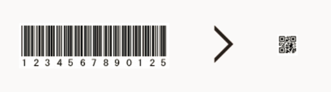

#### 有效表现各种字母

QR码是日本国产的二维码，因此非常适合处理日文字母和汉字。QR码字集规格定义是按照日本标准“JIS第一级和第二级的汉字”制定的，因此在日语处理方面，每一个全角字母和汉字都用13比特的数据处理，效率较高，与其他二维码相比，可以多存储20%以上的信息。

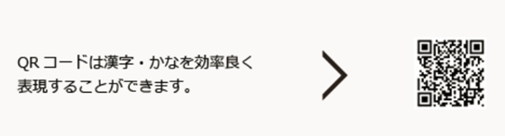

#### 对变脏和破损的适应能力强

QR码具备“纠错功能”，即使部分编码变脏或破损，也可以恢复数据。数据恢复以码字为单位（是组成内部数据的单位，在QR码的情况下，每8比特代表1码字），最多可以纠错约30%（根据变脏和破损程度的不同，也存在无法恢复的情况）。

#### 可以从任意方向读取

QR码从360°任一方向均可快速读取。其奥秘就在于QR码中的3处定位图案，可以帮助QR码不受背景样式的影响，实现快速稳定的读取。

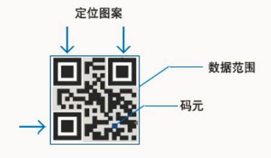

#### 支持数据合并功能

QR码可以将数据分割为多个编码，最多支持16个QR码。使用这一功能，还可以在狭长区域内打印QR码。另外，也可以把多个分割编码合并为单个数据。

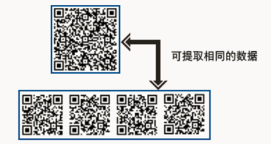

### QR码的信息量和版本

QR码设有1到40的不同版本（种类)，每个版本都具备固有的码元结构(码元数)。（码元是指构成QR码的方形黑白点。)“码元结构”是指二维码中的码元数。官方叫版本Version。Version 1是21 x 21的矩阵，Version 2是 25 x 25的矩阵，Version 3是29的尺寸，每增加一个version，就会增加4的尺寸，公式是：`(V-1)*4 + 21`（V是版本号） 最高Version 40，`(40-1)* 4+21 = 177`，所以最高是177 x 177 的正方形。

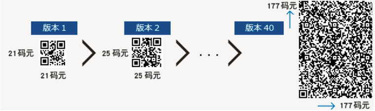

QR码的各个版本结合数据量、字符类型和纠错级别，均设有相对应的最多输入字符数。也就是说，如果增加数据量，则需要使用更多的码元来组成QR码，QR码就会变得更大。

例如，需要输入的数据为100位的数字时，通过以下步骤来选定。

  * 假设要输入的数据种类为“数字”

  * 从“L” “M” “Q” “H”中选择纠错级别。（假设选择“M”）

  * 查看下表，先从数字列找出数字为100以上且接近100的，其次找出纠错级别“M”，两者交叉的部分就是最佳版本。

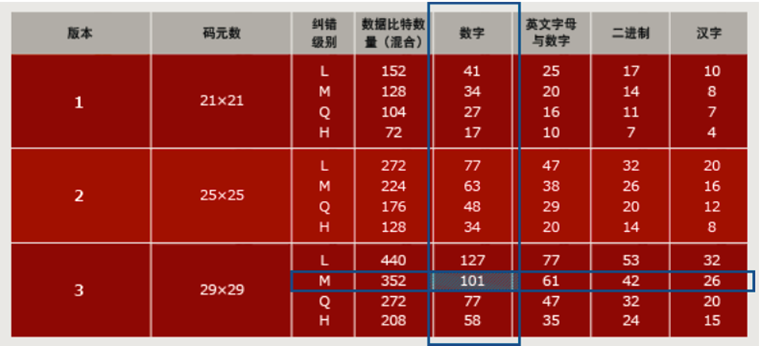

通过下面的计算为每个字符类型，总比特数的计算方法。

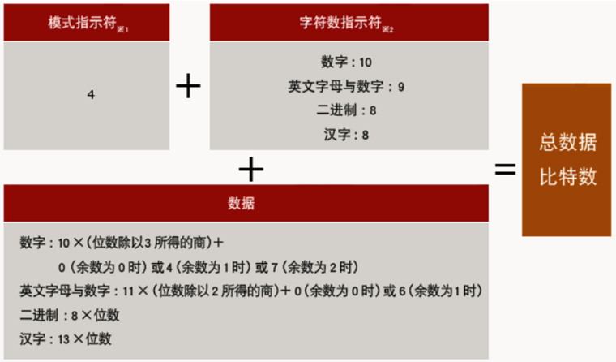

### QR码的纠错

QR码具有“纠错功能”。即使编码变脏或破损，也可自动恢复数据。这一“纠错能力”具备4个级别，用户可根据使用环境选择相应的级别。调高级别，纠错能力也相应提高，但由于数据量会随之增加，编码尺寸也也会变大。

用户应综合考虑使用环境、编码尺寸等因素后选择相应的级别。在工厂等容易沾染赃物的环境下，可以选择级别Q或H，在不那么脏的环境下，且数据量较多的时候，也可以选择级别L。一般情况下用户大多选择级别M(15%)。

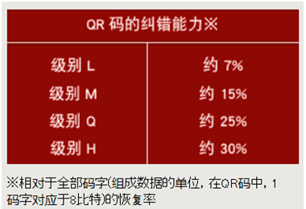

纠错级别的比率，是指全部码字与可以纠错的码字的比率。  

例如，需要编码的码字数据有100个，并且想对其中的一半，也就是50个码字进行纠错，则计算方法如下。纠错需要相当于码字2倍的符号（RS编码※），因此在这种情况下的数量为50个×2＝100码字。因此，全部码字数量为200个，其中用作纠错的码字为50个，所以计算得出，相对于全部码字的纠错率就是25%。这一比率相当于QR码纠错级别中的“Q”级别。

另外，在上述例子当中，也可以认为相对于码字数据的纠错率为50%，但变脏或破损的部位不仅仅局限于码字数据部分，因此，在QR码中，还是用相对于全部码字的比率来描述纠错率。

RS编码：QR码的纠错功能是通过将RS编码附加到原数据中的方式实现的。RS编码是应用于音乐CD等用途的数学纠错方法。它能以字节为单位进行纠错，适合用于错误位置会集中的突发错误。

### QR码的种类

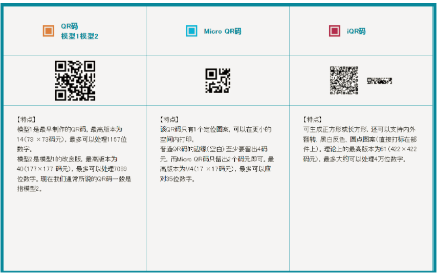

### QR码的基本结构

QR(Quick-Response) code是被广泛使用的一种二维码，解码速度快。它可以存储多用类型，下图是qrcode的基本结构：


#### 定位图案

  * 位置探测图形（Position Detection Pattern）：用于标记二维码的矩形大小，个数为3，因为3个即可标识一个矩形，同时可以用于确认二维码的方向。

  * 位置探测图形分隔符（Separators for Postion Detection Patterns）： 留白是为了更好的识别图形。

  * 定位图形（Timing Patterns）：二维码有40种尺寸，尺寸过大了后需要有根标准线，不然扫描的时候可能会扫歪了。

  * 校正图形（Alignment Patterns）：只有Version 2以上（包括Version2）的二维码需要这个东东，规格确定，校正图形的数量和位置也就确定了。

#### 功能性数据

  * 格式信息（Format Information）：存在于所有的尺寸中，用于存放一些格式化数据。表示改二维码的纠错级别，分为L、M、Q、H；

  * 版本信息（Version Information）：即二维码的规格，在 >= Version 7以上，需要预留两块3 x 6的区域存放一些版本信息。

#### 数据信息和纠错信息

  * 数据信息和纠错信息：实际保存的二维码信息（Data Code 数据码）和纠错信息（Error Correction Code 纠错码）（用于修正二维码损坏带来的错误）。

## 2、二维码的编码过程

既然已经知道了二维码的组成，接下来就来学习生如何生成二维码：

### 需求分析

需求分析主要是确定编码的字符类型， 选择纠错等级等。比如确定要生成的二维码的数据类型是什么？二维码可以储存文本信息，但是文本信息可以代表很多的东西，例如二维码可以将URL进行编码，特殊的字符创让解码器知道这是一个URL地址，从而从浏览器打开这个网址。比如下图就是“`https://www.biaodianfu.com`”的二维码。

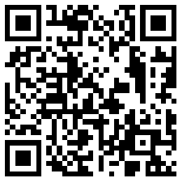

二维码可以保存洞中类型的可操作文本信息，下面将介绍到底二维码可以存储哪些信息。

#### 网址URL

二维码最普通的方式就是编译网址，需要注意的是在编译时网址需要有协议，比如“https://”，否则就会被认为是普通的文本信息。
如：https://www.biaodianfu.com/

#### E-mail地址

为了识别出来编译的信息为email地址，格式为：mailto:username@gmail.com，解码器就或为你创建一个空白邮件。

#### 手机号码

在编译手机号码的时候，最好是在手机号码前加上国别好号，比如中国就是“+86”，例如：TEL:+8613800138000

#### 地理信息

已编译Google西雅图的办公室的经纬度信息为例，维度为40.71872，西经73.98905，经纬度精确到单位到100米。具体格式为：GEO:40.71872,-73.98905,100

其他协议包括：日历事件、WIFI配置、应用商店等。具体可以参考Barcode-Contents

### 数据编码

数据编码就是将数据字符转换为位流，每8位一个码字，整体构成一个数据的码字序列。其实知道这个数据码字序列就知道了二维码的数据内容。

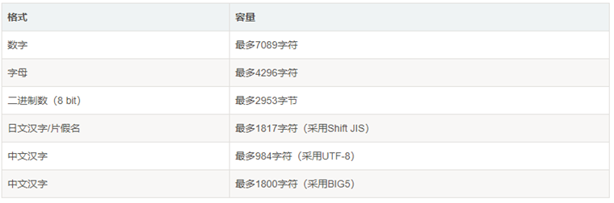

目前二维码支持的集中数据为：

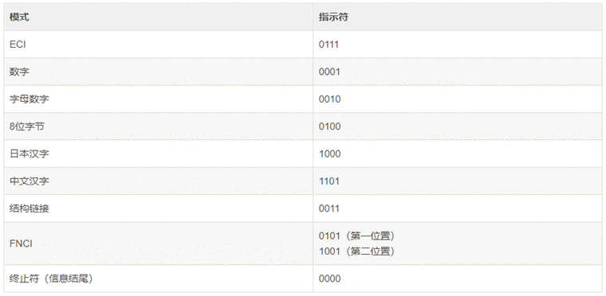

  * ECI（Extended Channel Interpretation mode）：用于特殊的字符集。并不是所有的扫描器都支持这种编码。

  * 数字（Numeric mode）：数字编码，从0到9。

  * 字母数字（Alphanumeric mode）：字符编码。包括 0-9，大写的A到Z（没有小写），以及符号$ % * + – . / : 包括空格。

  * 8位字节（Byte mode）：可以是0-255的ISO-8859-1字符。有些二维码的扫描器可以自动检测是否是UTF-8的编码。

  * 日本汉字（Kanji mode）：这是日文编码，也是双字节编码。同样，也可以用于中文编码。

  * 中国汉字

  * 结构链接（Structured Append mode）：用于混合编码，也就是说，这个二维码中包含了多种编码格式。

  * FNC1（FNC1 mode）：主要是给一些特殊的工业或行业用的。比如GS1条形码之类的。

数据可以按照一种模式进行编码，以便进行更高效的解码，例如：对数据：01234567编码（版本1-H），

  1. 分组：012 345 67

  2. 转成二进制：012→0000001100 345→0101011001 67 →1000011

  3. 转成序列：0000001100 0101011001 1000011

  4. 字符数 转成二进制：8→0000001000

  5. 加入模式指示符（上图数字）0001：0001 0000001000 0000001100 0101011001 1000011

对于字母、中文、日文等只是分组的方式、模式等内容有所区别。基本方法是一致的。

### 纠错编码

QR码缺一部分或者被遮盖一部分也能被正确扫描，要归功于QR码在发明时的“容错度”设计，生成器会将部分信息重复表示（也就是冗余）来提高其容错度。QR码在生成时可以选择四种程度的容错度（可修正的字码量），分别是L,M,Q,H，对应7%，15%，25%，30%的容错度。也就是说，如果你在生成二维码时选择H档容错度，即使30%的图案被遮挡，也可以被正确扫描。这也就是为什么现在许多二维码中央都可以加上LOGO。

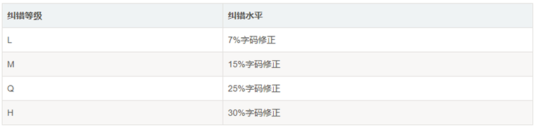

二维码的纠错码主要是通过Reed-Solomon error correction（里德-所罗门纠错算法）来实现的。大致的流程为对数据码进行分组，然后根据纠错等级和分块的码字，产生纠错码字。

在二维码规格和纠错等级确定的情况下，其实它所能容纳的码字总数和纠错码字数也就确定了，比如：版本10，纠错等级时H时，总共能容纳346个码字，其中224个纠错码字。就是说二维码区域中大约1/3的码字时冗余的。对于这224个纠错码字，它能够纠正112个替代错误（如黑白颠倒）或者224个据读错误（无法读到或者无法译码），这样纠错容量为：112/346=32.4%。

### 构造最终数据信息

完成上述操作后，并不是就能直接生成二维码了，还需要进行处理的就是穿插放置数据，比如有4个区块的，那么统一把每一区块的第一列放在一起，然后是第二列。以此类推。

在规格确定的条件下，将上面产生的序列按次序放如分块中。按规定把数据分块，然后对每一块进行计算，得出相应的纠错码字区块，把纠错码字区块按顺序构成一个序列，添加到原先的数据码字序列后面。

### 构造矩阵

将探测图形、分隔符、定位图形、校正图形和码字模块放入矩阵中。’

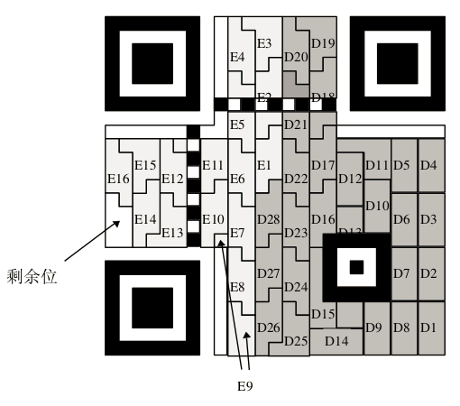

把上面的完整序列填充到相应规格的二维码矩阵的区域

最终编码的填充方式如下：从左下角开始沿着红线填我们的各个bits，1是黑色，0是白色。如果遇到了上面的非数据区，则绕开或跳过。

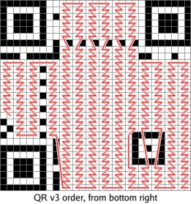

### 掩摸图案

按照上面的方法生成的图片可能会不均匀，比如说出现大面积的黑白或黑快，使得扫描变得困难，解决方法是进行（XOR）掩摸操作。QR有8个Mask你可以使用，如下所
示：

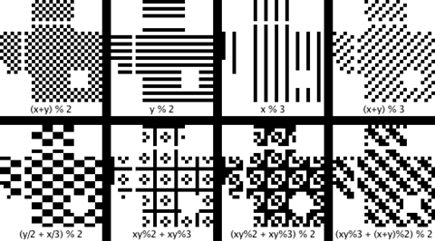

需要注意的是，掩摸只会和数据区进行XOR，不会影响功能区。具体可以查看里德-所罗门码。

### 格式和版本信息

最后一步就是生成格式和版本信息放入相应区域内。版本7-40都包含了版本信息，没有版本信息的全为0。二维码上两个位置包含了版本信息，它们是冗余的。版本信息共18位，6X3的矩阵，其中6位是数据位，如版本号8，数据位的信息是 001000，后面的12位是纠错位。

至此，按照上面大致的流程就可以使生成二维码图片了。由于讲的比较简单，具体的细节可查看QR Code标准文档。

## 3、二维码的解析

二维码的扫描总共需要三个流程，分别是条码定位、分割和解码。

### 条码的定位

条码的定位就是找到条码符号的图像区域，对有明显条码特征的区域进行定位。然后根据不同条码的定位图形结构特征对不同的条码符号进行下一步的处理。实现条码的定位采用以下步骤：

  * 利用点运算的阈值理论将采集到的图象变为二值图像，即对图像进行二值化处理

  * 得到二值化图像后，对其进行膨胀运算

  * 对膨胀后的图象进行边缘检测得到条码区域的轮廓

下图是经过上述处理后得到的一系列图像：

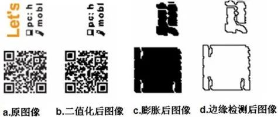

### 条码的分割

  * 修正不完成的边界，分割出一个完整的条码区域。

  * 通过凸壳计算准确分割出整个符号。

  * 区域增长和凸壳计算交替进行获取最终图片。

### 解码

  * 对图像进行网格取样

  * 根据阀值确认深色块与浅色快

  * 用”1″和”0″构造位图

  * 获取二进制序列值

  * 对数据进行纠错和

  * 根据编码规则把转换成内容

## 4、二维码的商业应用

单纯的二维码的生成和扫描可能一点作用都没有，但是通过各种场景的应用就可以让其发挥价值。

### 实现内容的快速准确输入

目前见得比较多的就是使用二维码生成网址或者手机应用的下载链接，目的也就是实现用户在手机上的信息录入，并且也能保证录入的信息不受人为因素（粗心大意）的影响。比如采用二维码进行跟踪物流包裹来代替人为的记录包裹编号。同时个人名片也是一个很好的案例。只需要手机扫描二维码就可以将名片信息直接诶保存到手机的通讯录。这些信息是直接存在在二维码中的。

### 对信息进行标识

将二维码作为一个信息标识存在在产品或者物品上，方面用户了解物品的详情。目前已经有的应用比如博物馆对藏品打上二维码，用户只要扫描二维码就能打开相关的介绍视频或录音等，从先前的平面化信息转化成影音信息。其真实的信息并没有直接存储在二维码中，而是存储了信息的一个链接而已。相当于程序中的“指针”。

### 起到线上线下的后台桥梁

目前做的比较好的比如线下扫描，线上比价，将线下的数产品数据和线上的价格数据进行匹配处理和展示。

### 作为电子票务的凭证

比如新版的火车票上的二维码就是属于票务凭证的很好案例。通过验证二维码信息进行身份和信息的验证。通过验证二维码信息的验证来控制闸机。另外目前很多线上预订的景区等，也通过预订后将二维码发送到用户手机号，景区在门口通过电子枪扫描确认有效性。但是由于手机设备大小等不易，类似的流程目前还存在诸多不便。

### 作为身份的验证

具体流程是现在手机上通过相关的权限认证。再通过已验证的信息去关联扫描到的内容。具体案例如微信的二维码登录。支付宝、微信的扫码支付。都是通过手机上已经验证的信息反馈进行身份的验证。

## 5、如何让二维码有想扫的冲动

在对二维码进行推广的时候，需要考虑到如何提升用户的扫码率。主要从两方面进行考虑：

### 场景方面

  * 信号好的，或有免费WIFI的地方，没有信号的地方可能扫描出网页也打不开。没有WIFI，可能用户不会去使用3G流量下载你的应用。

  * 要用户很闲的场景下，比如用户没事玩手机的时候，比如公交站台。如果用户处理忙碌状态，很少会去扫描身边的二维码。

  * 注意印刷的质量，比如印刷在布类上，或者户外的广告上，印刷的不好可能就使条码扫不出来。

### 条码设计

表达清楚扫描后会出现什么。告诉用户扫描后会得到什么，比如扫码知道无线密码等。下面的二维码就是一个很好的示例：


不表达清楚扫描后会出现什么。让用户出于好奇心去扫描，比如利用二维码的容错性，将二维码设计的非常的有个性，比如下图：

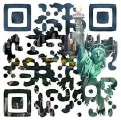

最忌讳的是将一个平白无奇的二维码直接一放。

## 6、其他二维码相关问题

二维码扫描会使手机中毒？

目前很多手机中毒的原因可能就是使用二维码导致的，其实二维码本身由于数据量的限制很难中毒，很多中毒的原因是手机系统做过越狱或者Root，在此基础上通过扫描安装了一些有恶意程序的APP。所以对于root过的手机用户在扫码下载时一定要注意。

## 7、实战：使用Python生成和解析二维码

### 使用python-qrcode生成二维码

python-qrcode是一个使用纯Python写的Python，使用简单，但是相关的功能也比较简陋。

```python
import qrcode
# 二维码内容（链接地址或文字）
data = 'https://www.biaodainfu.com/'
# 生成二维码
img = qrcode.make(data=data)
# 显示二维码
img.show()
# 保存二维码
# img.save('qr.jpg')
```

上面是最基本的配置，我们也可以通过传参来调整二维码格式：

```python
import qrcode

'''
version：二维码的格子矩阵大小，可以是 1 到 40，1 最小为 21*21，40 是 177*177
error_correction：二维码错误容许率，默认 ERROR_CORRECT_M，容许小于 15% 的错误率
box_size：二维码每个小格子包含的像素数量
border：二维码到图片边框的小格子数，默认值为 4
'''
qr = qrcode.QRCode(
   version=2,
   error_correction=qrcode.constants.ERROR_CORRECT_L,
   box_size=15,
   border=3,
)

# 二维码内容
data = 'https://www.biaodianfu.com/'
qr.add_data(data=data)
# 启用二维码颜色设置
qr.make(fit=True)
img = qr.make_image(fill_color='blue', back_color='white')
# 显示二维码
img.show()
```

### 使用Amazing-QR生成个性化二维码

Amazing-QR除了能生成正常的二维码外，还支持生成含有背景图片或者动态图片的二维码。示例：


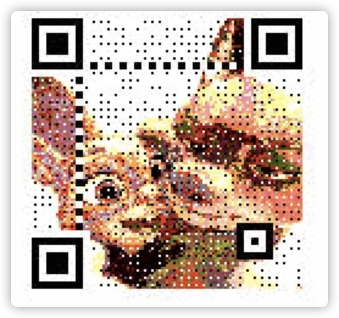

使用方法：

```python
from amzqr import amzqr
import os

data = 'https://www.biaodianfu.com/'
version, level, qr_name = amzqr.run(
   words=data,
   version=4,
   level='H',
   picture='logo-vertical.png',
   colorized=True,
   contrast=1.0,
   brightness=1.0,
   save_name=None,
   save_dir=os.getcwd()
)
```

参数解释：

```python
words：要生成二维码的文字信息，一般是网址等信息；
version：边长，范围是1至40，数字越大边长越大；
level：纠错等级，范围是L、M、Q、H，H的纠错能力最强；
picture：背景图片的路径+文件名称；
colorized：是否彩色，在选择背景图片时生效；
contrast：对比度，0 表示原始图片，更小的值表示更低对比度，更大反之。默认为1.0
brightness：亮度，用法和取值与contrast相同
save_name：生成二维码的文件名称，格式可以是 .jpg， .png ，.bmp ，.gif，默认输出文件名是“qrcode.png”；
save_dir：生成二维码图片的保存路径；
```

### 使用zxing解析二维码

Zxing是一款开源的条码识别工具，除了QR code还支持识别其他条形码。它有各种语言版本的实现。这里使用的是Python版本。

可以使用pip insatall直接安装，使用方式非常简单：

```python
import zxing

reader = zxing.BarCodeReader()
barcode = reader.decode('qrcode.png')
print(barcode)
```

参考链接：

  * [微信支付二维码规范](https://pay.weixin.qq.com/wiki/doc/api/micropay.php?chapter=23_18&index=8)

## 8、相关文章:

1. [深入学习Python import机制](https://www.biaodianfu.com/python-import.html)
2. [时间序列预测之ARIMA](https://www.biaodianfu.com/arima.html)
3. [假设检验之卡方检验](https://www.biaodianfu.com/chi-square-test.html)
4. [Microsoft REST API Guidelines中文翻译](https://www.biaodianfu.com/microsoft-rest-api-guidelines.html)
5. [自然语言处理工具包推荐](https://www.biaodianfu.com/nlp-tools.html)
