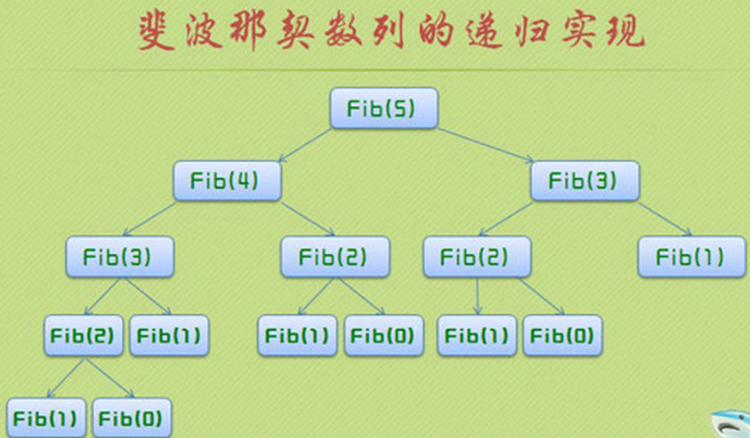
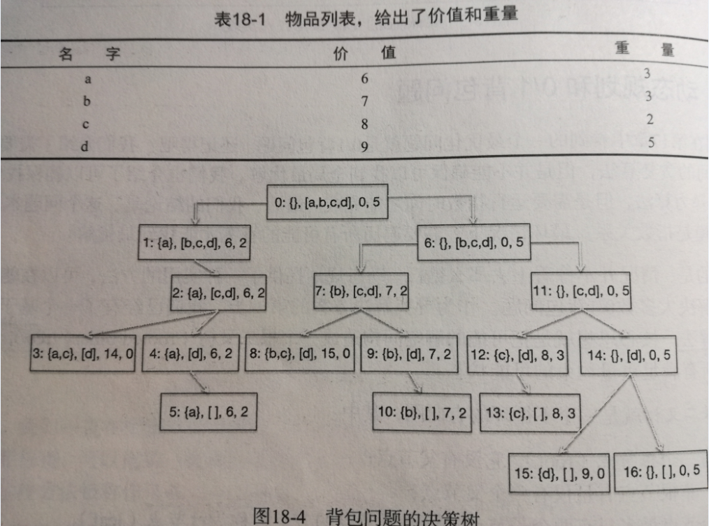
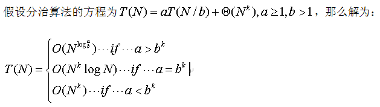
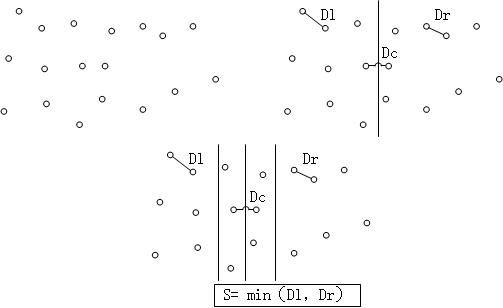
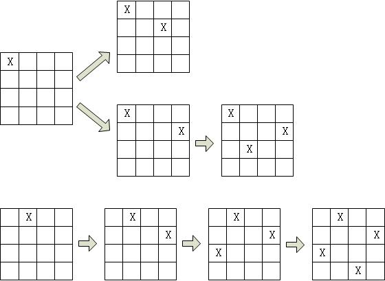
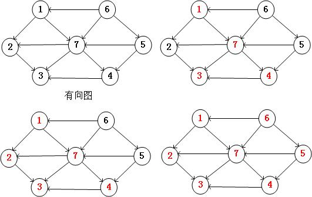
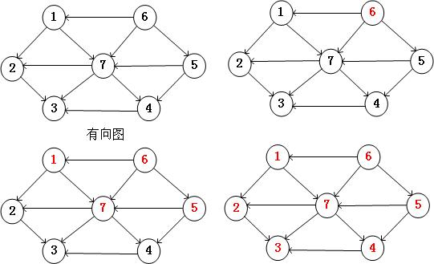

 
<!--BEGIN_DATA
{
    "create_date": "2020-04-27 21:22", 
    "modify_date": "2020-04-27 21:22", 
    "is_top": "0", 
    "summary": "贪婪算法<br>动态规划<br>动态规划解决0/1背包问题<br>分治算法（divide and conquer）<br>回溯算法（BackTracking）--八皇后问题<br>关于深度优先和广度优先的问题", 
    "tags": "算法、C/C++、Python", 
    "file_name": "五大常用算法总结.md"
}
END_DATA-->

####<p>原文出处：<a href='https://blog.csdn.net/changyuanchn/article/details/51476281' target='blank'>五大常用算法总结</a></p>


###引言

据说有人归纳了计算机的五大常用算法，它们是贪婪算法，动态规划算法，分治算法，回溯算法以及分支限界算法。虽然不知道为何要将这五个算法归为最常用的算法，但是毫无疑问，这五个算法是有很多应用场景的，最优化问题大多可以利用这些算法解决。算法的本质就是解决问题。当数据量比较小时，其实根本就不需要什么算法，写一些for循环完全就可以很快速的搞定了，但是当数据量比较大，场景比较复杂的时候，编写for循环就是一个很不明智的方式了。一是耗时，二是写出的代码绝对是天书。当然还有第三点，这点也是最重要的，写代码是一种艺术，而不是搬砖。前面的文章里对这五种算法都已经做了详细的讲解和归纳，本文主要是一个总结，将这五种算法整理到一起来对比，分析一下。

###0） 穷举法

穷举法简单粗暴，没有什么问题是搞不定的，只要你肯花时间。同时对于小数据量，穷举法就是最优秀的算法。就像太祖长拳，简单，人人都能会，能解决问题，但是与真正的高手过招，就颓了。

###1） 贪婪算法

贪婪算法可以获取到问题的局部最优解，不一定能获取到全局最优解，同时获取最优解的好坏要看贪婪策略的选择。特点就是简单，能获取到局部最优解。就像打狗棍法，同一套棍法，洪七公和鲁有脚的水平就差太多了，因此同样是贪婪算法，不同的贪婪策略会导致得到差异非常大的结果。  
具体的详细解析请参见下面的文章：  
<http://blog.csdn.net/changyuanchn/article/details/51417211>

###2） 动态规划算法

当最优化问题具有重复子问题和最优子结构的时候，就是动态规划出场的时候了。动态规划算法的核心就是提供了一个memory来缓存重复子问题的结果，避免了递归的过程中的大量的重复计算。动态规划算法的难点在于怎么将问题转化为能够利用动态规划算法来解决。当重复子问题的数目比较小时，动态规划的效果也会很差。如果问题存在大量的重复子问题的话，那么动态规划对于效率的提高是非常恐怖的。就像斗转星移武功，对手强它也会比较强，对手若，他也会比较弱。  
具体的详细解析请参见下面的文章：  
<http://blog.csdn.net/changyuanchn/article/details/51420028>  
<http://blog.csdn.net/changyuanchn/article/details/51429979>

###3）分治算法

分治算法的逻辑更简单了，就是一个词，分而治之。分治算法就是把一个大的问题分为若干个子问题，然后在子问题继续向下分，一直到base cases，通过base cases的解决，一步步向上，最终解决最初的大问题。分治算法是递归的典型应用。  
具体的详细解析请参见下面的文章：  
<http://blog.csdn.net/changyuanchn/article/details/17150109>  
<http://blog.csdn.net/changyuanchn/article/details/51465175>

###4） 回溯算法

回溯算法是深度优先策略的典型应用，回溯算法就是沿着一条路向下走，如果此路不同了，则回溯到上一个分岔路，在选一条路走，一直这样递归下去，直到遍历万所有的路径。八皇后问题是回溯算法的一个经典问题，还有一个经典的应用场景就是迷宫问题。  
具体的详细解析请参见下面的文章：  
<http://blog.csdn.net/changyuanchn/article/details/17354461>

###5） 分支限界算法

回溯算法是深度优先，那么分支限界法就是广度优先的一个经典的例子。回溯法一般来说是遍历整个解空间，获取问题的所有解，而分支限界法则是获取一个解（一般来说要获取最优解）。  
具体的详细解析请参见下面的文章：  
<http://blog.csdn.net/changyuanchn/article/details/17102037>


<hr>


####<p>原文出处：<a href='https://blog.csdn.net/changyuanchn/article/details/51417211' target='blank'>贪婪算法</a></p>

最优化问题是计算机领域的一个很重要的问题，很多现实的问题本质上都是最优化问题，或者说都可以转化为最优化的问题。比如说怎么规划旅游线路最省钱，在指定的时间里做更多的事情等等，这些都是最优化问题。为了解决最优化问题，各种大神提出了各种算法，有穷举（这个是凑数的），贪婪，动态规划，分治算法，回溯算法等等。本文主要归纳整理贪婪算法。

贪婪算法是指，在对问题求解时，总是做出在当前看来是最好的选择。也就是说，不从整体最优上加以考虑，他所做出的是在某种意义上的局部最优解。

贪婪算法不能保证得到全局最优解（_应该说大部分情况下都不是全局最优_），最重要的是要选择一个优的贪婪策略，如果贪婪策略选的不好，结果就会比较差。然而就像Ivan说过的“我认为贪婪是健康的，你可以在贪婪的同时自我感觉很良好”（_这货后来被监禁了，这货后来被监禁了，这货后来被监禁了，重要的话说三遍_）。贪婪算法依旧是一个很不错的算法，这是一个简单同时还能得到比较不错的结果的算法（_非常切合中庸之道啊_）。

贪婪算法可解决的问题通常大部分都有如下的特性：(**这段内容是抄的**)  

⑴随着算法的进行，将积累起其它两个集合：一个包含已经被考虑过并被选出的候选对象，另一个包含已经被考虑过但被丢弃的候选对象。  

⑵有一个函数来检查一个候选对象的集合是否提供了问题的解答。该函数不考虑此时的解决方法是否最优。  

⑶还有一个函数检查是否一个候选对象的集合是可行的，也即是否可能往该集合上添加更多的候选对象以获得一个解。和上一个函数一样，此时不考虑解决方法的最优性。  

⑷选择函数可以指出哪一个剩余的候选对象最有希望构成问题的解。  

⑸最后，目标函数给出解的值。  

⑹为了解决问题，需要寻找一个构成解的候选对象集合，它可以优化目标函数，贪婪算法一步一步的进行。起初，算法选出的候选对象的集合为空。接下来的每一步中，根据选择函数，算法从剩余候选对象中选出最有希望构成解的对象。如果集合中加上该对象后不可行，那么该对象就被丢弃并不再考虑；否则就加到集合里。每一次都扩充集合，并检查该集合是否构成解。如果贪婪算法正确工作，那么找到的第一个解通常是最优的。

**上面的话总结一下就是自己决定一个策略，从一个集合里拿向另一个空集合里装，什么时候拿满了就搞定。**

一个典型的最优化问题就是0/1背包问题，下面我们通过这个问题来实践一下贪婪算法。

[0-1背包问题]有一个背包，背包容量是M=150kg。有7个物品，**_物品不可以分割成任意大小_**。（**这句很重要**）  
要求尽可能让装入背包中的物品总价值最大，但不能超过总容量。  
物品 A B C D E F G  
重量 35kg 30kg 6kg 50kg 40kg 10kg 25kg  
价值 104040 305050 354040 30$

要想得到最优的结果，最容易想到的就是穷举法，那么首先用穷举法来处理这个问题。

> 见如下的链接 <http://blog.csdn.net/changyuanchn/article/details/51417796>

穷举法的时间复杂度有些恐怖，那么我们利用贪婪算法来解决0/1背包问题

类的定义与穷举法一样：

    
    
    ##item have three attribute: name,weight,value
    class Item(object):
        def __init__(self,n,v,w):
            self.name=n
            self.weight=float(w)
            self.value=float(v)

        def getName(self):
            return self.name

        def getValue(self):
            return self.value

        def getWeight(self):
            return self.weight

        def __str__(self):
            result = ' < '+self.name+' , '+str(self.value)+' , '+str(self.weight) + '>'
            return result
    

定义三种贪婪的策略：分别为按价值，按最小重量，以及性价比（价值/重量）

    
    
    def value(item):
        return item.getValue()

    def weightInverse(item):
        return 1.0/item.getValue()

    def density(item):
        return item.getValue()/item.getWeight()
    

利用贪婪来获取解空间：  
这里 `keyFunciton` 是具体的贪婪策略  
函数实现了按照具体的贪婪策略来逐步选择物品，直到满足限制条件为止。  
sorted函数是按照具体的贪婪策略进行排序。

    
    
    def greedy(items,maxWeight,keyFunction):
        itemsCopy = sorted(items,key=keyFunction,reverse = True)
        result = []
        totalValue = 0.0
        totalWeight = 0.0

        for i in range(len(itemsCopy)):
            if(totalWeight + itemsCopy[i].getWeight()) <= maxWeight:
                result.append(itemsCopy[i])
                totalValue +=itemsCopy[i].getValue()
                totalWeight +=itemsCopy[i].getWeight()

        return (result,totalValue)
    

测试代码：

    
    
    def buildItem():
        names=['A','B','C','D','E','F','G']
        vals = [35,30,6,50,40,10,25]
        weights=[10,40,30,50,35,40,30]
        Items=[]
        for i in range(len(names)):
            Items.append(Item(names[i],vals[i],weights[i]))
        return Items

    def testGreedy(items,constraint,keyFunction):
        taken,val=greedy(items,constraint,keyFunction)
        print 'Total value of items taken = ', val
        for item in taken:
            print ' ', item

    def testGreedys(maxWeight = 150):
        items = buildItem()
        print 'Use greedy by value to fill knapsack of size', maxWeight 
        testGreedy(items, maxWeight, value)
        print '\n Use greedy by weight to fill knapsack of size', maxWeight
        testGreedy(items, maxWeight, weightInverse)
        print '\n Use greedy by density to fill knapsack of size', maxWeight
        testGreedy(items, maxWeight, density)
    
    
具体的实验结果如下：

    
    
    Use greedy by value to fill knapsack of size 150
    Total value of items taken =  155.0
       < D , 50.0 , 50.0>
       < E , 40.0 , 35.0>
       < A , 35.0 , 10.0>
       < B , 30.0 , 40.0>
     Use greedy by weight to fill knapsack of size 150
    Total value of items taken =  106.0
       < C , 6.0 , 30.0>
       < F , 10.0 , 40.0>
       < G , 25.0 , 30.0>
       < B , 30.0 , 40.0>
       < A , 35.0 , 10.0>
     Use greedy by density to fill knapsack of size 150
    Total value of items taken =  150.0
       < A , 35.0 , 10.0>
       < E , 40.0 , 35.0>
       < D , 50.0 , 50.0>
       < G , 25.0 , 30.0>
    runing time is 0.000358
    


从结果中可以得出两个事实：  
**1） 贪婪不一定能得到全局最优解，贪婪得到的是局部最优解，最终结果取决于贪婪策略**   
**2） 贪婪的时间消耗比穷举法低好多**

**总结：贪婪算法或许不是一个很好的算法，但是在解决一些问题时，如果选择好的贪婪策略，结果也是可以很优秀的。**

彩蛋：贪婪算法没有办法得到全局最优解，那么0/1背包问题怎么办，岂不是很孤独？不用担心，大神们是很有爱的，他们早已搞定了这个问题，就是利用动态规划的方法，下面的链接将讲解动态规划


<hr>


####<p>原文出处：<a href='https://blog.csdn.net/changyuanchn/article/details/51420028' target='blank'>动态规划</a></p>

动态规划是20世纪50年代由Richard Bellman发明的。不像贪婪算法，回溯算法等，单从名字上根本理解不了这是什么鬼。Bellman自己也说了，这个名字完全是为了申请经费搞出来的（**囧**），所以说这个名字坑了一代又一代的人啊。

言归正传，我们来了解下动态规划，dynamic Programming，是一种高效解决问题的方法，使用与具有**重复子问题**和**最优子结构**的问题。（**_又是两个搞不懂的名词啊_**）。不过没问题，我们可以通过举例子来说明。

如果可以把局部子问题的解结合起来得到全局最优解，那这个问题就具备**最优子结构**  
如果计算最优解时需要处理很多相同的问题，那么这个问题就具备**重复子问题**

就像看上了一个女孩，不能直接上去泡人家，要先制造一次偶遇一样，这里我们先从一个简单的问题来认识动态规划。

####Fibonacci sequence

fibonacci数列是递归算法的一个典型的例子，这里不介绍了，大家都懂，直接上代码：

    
    
    import time
    def Fibnacci(n):
        if n==0 or n==1:
            return 1
        else:
            return Fibnacci(n-1) + Fibnacci(n-2)
    num=37 
    start = time.clock()
    Fibnacci(num)
    end = time.clock()
    print "Fibnacci sequense costs",end-start
    

结果耗时：
  
    
    Fibnacci sequense costs 14.9839106433
    

这速度也是醉了啊，这才是37位啊，手算也就2分钟的事啊。  
如果试下`Fibnacci(120)` ，这个千万不敢试，会怀孕，说错了，是会看不到明天的太阳。（**官方统计算完基本上要250000年**）

那么为什么会这么慢呢。我们以`Fibnacci(5)` 位例子，每次计算`Fibnacci(5)` 都要计算`Fibnacci(4)`和`Fibnacci(3)` ，而`Fibnacci(4)`要计算`Fibnacci(3)` 和`Fibnacci(2)`，`Fibnacci(3)`要计算`Fibnacci(2)` 和`Fibnacci(1)`，一直这样递归下去，作了大量的重复计算。而函数调用时很费时间和空间的。

有一个图很好的说明了这个问题：  


既然重复计算如此耗时，那么能不能不重复计算这些值呢？当第一次计算了这些值的时候，我们把他们缓存起来，等到再次使用的时候，直接把他们拿过来用，这样就不用做大量的重复计算了。**这就是动态规划的核心思想。**

还是以Fibnacci为例子：  
每当我们第一次计算`Fibnacci(n)`的时候，我们就将其缓存到memo的列表中，当需要再次计算`Fibnacci(n)`的时候，首先去memo的列表中
查找，如果找到了就直接拿来用，找不到再计算。下面是具体的程序：

    
    
    def fastFib(n,memo={}):
        if n==0 or n==1:
            return 1
        try:
            return memo[n]
        except KeyError:
            result = fastFib(n-1,memo) + fastFib(n-2,memo)
            memo[n] = result
            return result
  

实验下效果;

    
    
    n=120
    start = time.clock()
    fastFib(n)
    end = time.clock()
    print "Fibnacci sequense costs",end-start   
    Fibnacci sequense costs 0.00041543479823
    
    

这就是差距啊！从算法复杂度上来讲这次的算法每次只调用`fastFib`函数一次，所以复杂度为**_`O(n)`_**  
**这就是差距的原因。**

下一章节将是如何利用动态规划来解决0/1背包问题


<hr>


####<p>原文出处：<a href='https://blog.csdn.net/changyuanchn/article/details/51429979' target='blank'>动态规划解决0/1背包问题</a></p>

之前总结了利用穷举法，贪婪法解决0/1背包的方法，同时也通过Fibnacci介绍了动态规划，那么该如何来利用动态规划来解决0/1背包问题呢？

首先动态规划有两个条件;  
如果可以把局部子问题的解结合起来得到全局最优解，那这个问题就具备**最优子结构**  
如果计算最优解时需要处理很多相同的问题，那么这个问题就具备**重复子问题**

从这两点看，0/1背包问题跟动态规划没有半毛钱的关系啊。那这两者又是怎么联系起来的呢？我们通过二叉树将两者联系起来。

二叉树是一种树，每个跟节点至多有两个子节点。

我们可以将0/1背包问题通过二叉树来表示：

**[0-1背包问题]**有一个背包，背包容量是M=150kg。有7个物品，物品不可以分割成任意大小。（这句很重要）   
要求尽可能让装入背包中的物品总价值最大，但不能超过总容量。  
物品 A B C D E F G  
重量 35kg 30kg 6kg 50kg 40kg 10kg 25kg  
价值 10 40 30 50 35 40 30

我们可以用下面的二叉树来表示问题的所有的解空间。

  
**借个图，实在是不想画了，见谅**

每个节点由四部分组成：

第一个集合表示：已经拿到背包里的物品  
第二个集合表示：还没有决定要拿走的物品  
第三个值表示：当前背包里的物品总价值  
第四个值表示：背包剩余的重量

我们按照如下的策略进行生长

**左子树表示：拿到了第二个集合中的第一个物品，右子树表示放弃掉第二个集合中的第一个物品**

那么由着这个树一直生长下去，我们可以得到最终问题的解空间。

很明显这是一个可以用递归解决的问题。

那么下面就首先用递归的算法先来解决这个问题

对于递归来说要有一个边界条件，那么这里的边界条件有两个，一个是第二个集合为空（**意味着全部拿走**），另一个是第四个值为0（**意味着背包已经装满了**），而他们就是**叶子节点**，因为树的遍历或者说是递归只能是到达叶子节点就结束了。

###普通递归方法求解：

    
    
    ##item have three attribute: name,weight,value
    class Item(object):
        def __init__(self,n,v,w):
            self.name=n
            self.weight=float(w)
            self.value=float(v)
        def getName(self):
            return self.name
        def getValue(self):
            return self.value
        def getWeight(self):
            return self.weight
        def __str__(self):
            result = ' < '+self.name+' , '+str(self.value)+' , '+str(self.weight) + '>'
            return result

    def maxValue(oraSet,leftRoom):
        ##leaf 
        if oraSet == [] or leftRoom == 0:
            return (0,())
        ##only right tree
        elif oraSet[0].getWeight() > leftRoom:
            result = maxValue(oraSet[1:],leftRoom)
        ##select the best from the left and right
        else:
            ##left tree, means we select nextItem(the first value of the remains)
            nextItem = oraSet[0]
            leftVal, leftToken = maxValue(oraSet[1:], leftRoom - nextItem.getWeight())
            leftVal +=nextItem.getValue()
            ##right tree,means we do not select nextItem
            rightVal,rightToken = maxValue(oraSet[1:],leftRoom)
            if leftVal > rightVal:
                result = (leftVal,leftToken+(nextItem,))
            else:
                result = (rightVal,rightToken)
        return result

    def buildItem():
        names=['A','B','C','D','E','F','G']
        vals = [35,30,6,50,40,10,25]
        weights=[10,40,30,50,35,40,30]
        Items=[]
        for i in range(len(names)):
            Items.append(Item(names[i],vals[i],weights[i]))
        return Items

    def testCode():
        value,token = maxValue(buildItem(), 150)
        for item in token:
            print item
        print "Total value of tokens is ", value

    testCode()
     < E , 40.0 , 35.0>
     < D , 50.0 , 50.0>
     < B , 30.0 , 40.0>
     < A , 35.0 , 10.0>
    Total value of tokens is  155.0
    time consumption is: 0.000482480256484
    
   
###动态规划解法：

要想用动态规划，首先要满足两个条件：**_重复子问题_** 和 **_最优子结构_**  
每个父节点会组合子节点的解来得到这个父节点为跟的子树的最优解，所以存在最优子结构。  
同一层的每个节点剩余的可选物品集合都是一样的，所以具有重复子问题  
因此可以利用动态规划来解决问题。

**动态规划的核心就是提供了一个memory，能够缓存已经计算过的值**
    
    
    ##item have three attribute: name,weight,value
    import time 
    class Item(object):
        def __init__(self,n,v,w):
            self.name=n
            self.weight=float(w)
            self.value=float(v)
        def getName(self):
            return self.name
        def getValue(self):
            return self.value
        def getWeight(self):
            return self.weight
        def __str__(self):
            result = ' < '+self.name+' , '+str(self.value)+' , '+str(self.weight) + '>'
            return result

    def fastMaxVal(oraSet,leftRoom,memo={}):
        if (len(oraSet),leftRoom) in memo:
            result = memo[(len(oraSet),leftRoom)]
        elif oraSet == [] or leftRoom == 0:
            result = (0,())
        elif oraSet[0].getWeight()>leftRoom:
            result = fastMaxVal(oraSet[1:],leftRoom,memo)
        else:
            nextItem = oraSet[0]
            leftValue,leftToken = fastMaxVal(oraSet[1:],leftRoom - nextItem.getWeight(),memo)
            leftValue +=nextItem.getValue()
            rightValue,rightToken = fastMaxVal(oraSet[1:],leftRoom,memo)
            if leftValue >rightValue:
                result = (leftValue,leftToken+(nextItem,))
            else:
                result = (rightValue,rightToken)
        memo[(len(oraSet),leftRoom)] = result
        return result

    def buildItem():
        names=['A','B','C','D','E','F','G']
        vals = [35,30,6,50,40,10,25]
        weights=[10,40,30,50,35,40,30]
        Items=[]
        for i in range(len(names)):
            Items.append(Item(names[i],vals[i],weights[i]))
        return Items

    def testCode():
        value,token = fastMaxVal(buildItem(), 150)
        for item in token:
            print item
        print "Total value of tokens is ", value

    start=time.clock()
    testCode()
    end = time.clock()
    print "time consumption is:", end-start


     < E , 40.0 , 35.0>
     < D , 50.0 , 50.0>
     < B , 30.0 , 40.0>
     < A , 35.0 , 10.0>
    Total value of tokens is  155.0
    time consumption is: 0.000385599247536
    

可以看出相较于最基本的递归方法，动态规划还是更快一些的，当然这里快的不明显，因为数据量表小，但是当数据量比较大时，这个时间的节省就比较可观了。

####思考：

#####1） 动态规划为什么会快？

因为这里不需要调用函数计算重复子问题，那么一定就是快很多么？不一定，这取决于重复子问题的多少。0/1背包问题当数据量大时，他的时间节省比较多的原因在与我们设计的重复子问题比较好，因为对于物品的多种组合来说，他们的剩余空间的一致的概率比较大，多以告知重复子问题会比较多。

#####2）动态规划的核心：

核心在于memory的设计，这里我们利用了`memo[(len(oraSet),leftRoom)]`中的`(len(oraSet),leftRoom)`字典作为键，为什么可以利用len(oraSet)而不是`oraSet`呢（当然`oraSet`也是可以的）？这是因为对于每一层的子节点来说，剩余物品的个数都是一致的，这个个数可以区分重复子问题。而动态规划相较于普通的递归算法，主要的就是增加了memory

#####3）如何设计动态规划算法：

首先看问题是否满足动态规划的两个条件：重复子问题，最优子结构；然后首先利用递归算法解决问题，设计memory，然后修改递归算法的实现，加入memory，最终实现动态规划的算法。


<hr>


####<p>原文出处：<a href='https://blog.csdn.net/changyuanchn/article/details/17150109' target='blank'>分治算法（divide and conquer）</a></p>


0） 引论

正如名字divide and conquer所言，分治算法分为两步，一步是divide，一步是conquer。

Divide：Smaller Problems are solved recursively except base cases.

Conquer：The solution to the original problem is then formed from the solutions to the sub-problem.

说白了，分治算法就是把一个大的问题分为若干个子问题，然后在子问题继续向下分，一直到base cases，通过base cases的解决，一步步向上，最终解决最初的大问题。分治算法是递归的典型应用。

常见的利用分治算法思想的有[快速排序](http://blog.csdn.net/changyuanchn/article/details/16863869)以及[合并排序](http://blog.csdn.net/changyuanchn/article/details/16855959)等等。

1） 分治排序的运行时间问题

  

这里写下这个结论只是为了后面分析时间问题的方便。

2） 最近点问题

假设在坐标平面上分布了一系列的点，那么问题是求取这些点两两之间的最短距离。

最naive的做法当然是穷举法，计算所有的两两点间的距离，然后取最小值。穷举法对于小样本总是不错的。但是对于大样本来说，就不是那么合适了，这里我们用divide-and-conquer算法来解决这一问题。

  

首先对于所有的点，按照x坐标将其分为两部分，这就是divide，那么最短距离就是左边部分中的最短距离Dl，右边部分的最短距离Dr，以及左右部分之间的距离Dc。对于Dl以及Dr，可以递归的计算得到，这就是conquer。那么唯一的问题就是Dc。我们知道如果最短距离是Dc的话，那么Dc<=min（Dl，Dr）。因此我们只需要计算距离divide分割线S = min（Dl，Dr）的点就可以了。进一步我们可以看到对于每个在2S区域内的点，只需要计算y坐标距离这一点不大于S的点就可以，这样可以进一步简化运算量。


```
for(i=0;i<NumPointsInStrip;i++)
	for(j=i+1;j<NumPointsInStrip;j++)
		if(Pi and Pj coordinates differ by more than S)
			break;
		else
			if(Dist(Pi,Pj)<S)
				S = Dist(Pi,Pj);
```


<hr>


 
####<p>原文出处：<a href='https://blog.csdn.net/changyuanchn/article/details/51465175' target='blank'>分治算法</a></p>


分治算法的名字是divide-and-conquer, 从名字上看一目了然，就是先把一个问题divide成为几个子问题，然后分别解决各个子问题。兵法有云：分而治之，各个击破。

###英文释义

divide the problem instance, solve subproblems recursively, combine the results, and thereby conquer the problem

###算法内涵

分治算法就是把一个困难的问题分解为一系列的子问题，这些子问题具有如下的特点：  
1） 子问题比原问题更新解决  
2） 子问题的解可以合并为原问题的解

典型的应用包括回文以及二分查找等。

###算法举例

####回文

这里的回文是指资格字符串，它从头到尾读与从尾到头读的内容是一致的，比如说doggod,无论从左到右耗时从右到左都是一样的。

    
    
    def isPal(s):
        if len(s) <= 1:
            return True
        else:
            return s[0]==s[-1] and isPal(s[1:-1])
    s = 'doggod'
    result = isPal(s)
    print result
    


可以看出算法就是利用递归不断的处理更小的子问题。

####二分查找

二分查找也是典型的分治算法的有应用。二分查找需要一个默认的前提，那就是查找的数列是有序的。  
二分查找的思路比较简单：  
1） 选择一个标志i将集合分为二个子集合  
2） 判断标志L(i)是否能与要查找的值des相等，相等则直接返回  
3） 否则判断L(i)与des的大小  
4） 基于判断的结果决定下步是向左查找还是向右查找  
5） 递归记性上面的步骤

    
    
    def binarySearch(L,e,low,high):
        if high == low:
            return L[low] == e 
        mid = (low+high)//2
        if L[mid]==e:
            return True
        elif L[mid]>e:
            if low == mid:
                return False
            else:
                return binarySearch(L,e,low, mid-1)
        else:
            return binarySearch(L,e,mid+1,high)

    def search(L,e):
        result = binarySearch(L,e,0,len(L)-1)
        print result   
    L = range(10);
    e = 7

    search(L,e)    
    
    
###总结

分治算法的一个核心在于子问题的规模大小是否接近，如果接近则算法效率较高。

分治算法和动态规划都是解决子问题，然后对解进行合并；但是分治算法是寻找远小于原问题的子问题（因为对于计算机来说计算小数据的问题还是很快的），同时分治算法的效率并不一定好，而动态规划的效率取决于子问题的个数的多少，子问题的个数远小于子问题的总数的情况下（也就是重复子问题多），算法才会很高效。


<hr>


####<p>原文出处：<a href='https://blog.csdn.net/changyuanchn/article/details/17354461' target='blank'>回溯算法（BackTracking）--八皇后问题</a></p>


0） 回溯算法：

回溯算法也算是遍历算法的一种，回溯算法是对Brute-Force算法的一种改进算法，一个典型的应用是走迷宫问题，当我们走一个迷宫时，如果无路可走了，那么我们就可以退一步，再在其他的路上尝试一步，如果还是无路可走，那么就再退一步，尝试新的路，直到走到终点或者退回到原点。


1） 皇后问题：

N皇后问题是指在N*N的棋盘上放置N个皇后，使这N个皇后无法吃掉对方（也就是说两两不在一行，不在一列，也不在对角线上）。经典的是8皇后问题，这里我们为了简单，以4皇后为例。

首先利用回溯算法，先给第一个皇后安排位置，如下图所示，安排在（1,1）然后给第二个皇后安排位置，可知（2,1），（2,2）都会产生冲突，因此可以安排在（2,3），然后安排第三个皇后，在第三行没有合适的位置，因此回溯到第二个皇后，重新安排第二个皇后的位置，安排到（2,4），然后安排第三个皇后到（3,2），安排第四个皇后有冲突，因此要回溯到第三个皇后，可知第三个皇后也就仅此一个位置，无处可改，故继续向上回溯到第二个皇后，也没有位置可更改，因此回溯到第一个皇后，更改第一个皇后的位置，继续上面的做法，直至找到所有皇后的位置，如下图所示。

这里为什么我们用4皇后做例子呢？因为3皇后是无解的。同时我们也可以看到回溯算法虽然也是Brute-Force，但是它可以避免去搜索很多的不可能的情况，因此算法是优于Brute-Force的。

  


下面我们来编程实现：


```
#include <stdio.h>
#include <windows.h>
 
#define N 8
#define abs(x) (((x)>=0)?(x):-(x)) 
int col[N+1];
int count=0;
 
void Output();
void Queen(int i,int n);
 
void main()
{
	int i;
	for(i=1;i<=N;i++)
	{
		col[1] = i;
		Queen(2,N);
	}
	printf("%d\n",count);
	system("pause");
}
 
void Queen(int i,int n)
{
	if(i>n)
		Output();
	else
	{
		int j;
		for(j=1;j<=N;j++)
		{
			col[i]=j;
			int k=1; //已经安排了位置的皇后的游标指示
			while(k<i)//比较现在的皇后与之前的皇后有没有冲突
			{	
				if((col[k]-col[i])*(abs(col[k]-col[i]) - abs(k-i))!=0)//冲突条件
				{
					k++;
					if(k==i)
						Queen(i+1,n);
				}
				else
					break;
			}
		}
	}
}

void Output()
{
	int i;
	count++;
	for(i=1;i<=N;i++)
	{
		printf("(%d,%d)\n",i,col[i]);
	}
	printf("\n");
}
```


如果要计算8皇后问题，则只需要把上面的N=4改为N=8就可以了。8皇后问题有92中解法，可以试一下。


<hr>


####<p>原文出处：<a href='https://blog.csdn.net/changyuanchn/article/details/17102037' target='blank'>关于深度优先和广度优先的问题</a></p>

Depth-First Search和Breadth-First Search，即深度优先和广度优先是图的两种搜索的方法。其实与其说是方法，不如说是两种思想。下面我们就来介绍这两种思想。

1） Depth-First Search

深度优先是指在图的查找中，对每一个分支深入到不能再深入为止，如果到达了终点，则选择另一个未访问的顶点，继续查找，知道每个节点都被访问到，并且每个节点只能被访问一次。

基本算法：

a） 访问顶点V

b） 依次从V的未访问的节点出发，遍历所有与V在相通路径上的节点。

c） 选取还未被访问的结点，重复上面的过程。


下图就是深度优先的一个遍历过程。



2） Breadth-First Search

广度优先是分层次的展开检查图中的所有结点，知道找到最终的结果。也就是说首先搜索与s距离为k的所有结点，然后在搜索与s距离k+1的所有结点。算法通过已找到的节点和未找到的节点的边界向外扩展。Dijkstra算法以及prim算法都是应用的这一思想。


下图就是广度优先的一个遍历过程。



