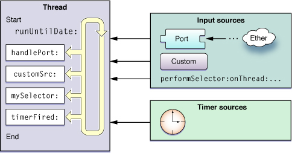
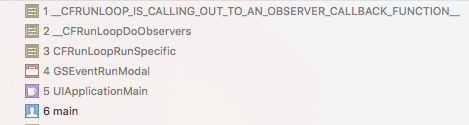
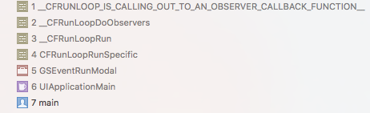
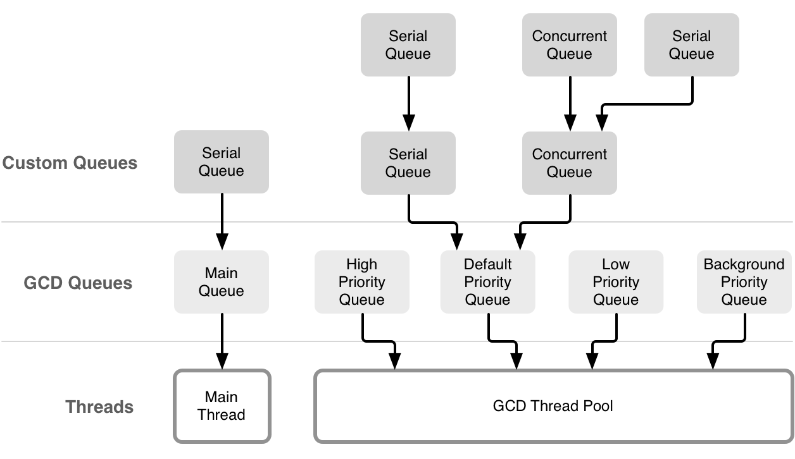
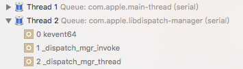
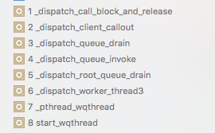

 
<!--BEGIN_DATA
{
    "create_date": "2016-09-06 10:38", 
    "modify_date": "2016-09-06 10:38", 
    "is_top": "0", 
    "summary": "从NSTimer的失效性谈起", 
    "tags": "iOS", 
    "file_name": "从NSTimer的失效性谈起.md"
}
END_DATA-->

####
原文出处：<a href='https://yq.aliyun.com/articles/17710?spm=5176.100240.searchblog.7.XVZxqf' target='blank'>从NSTimer的失效性谈起（一）：关于NSTimer和NSRunLoop</a>

##一、NSTimer的失效性

在iOS中要设置一个定时器的通常做法是调用如下API：
    
    + (NSTimer *)scheduledTimerWithTimeInterval:(NSTimeInterval)ti invocation:(NSInvocation *)invocation repeats:(BOOL)yesOrNo;

这个API会创建一个NSTimer对象，将其添加到当前runloop的defaultMode中，然后返回该对象，如下所说：

> Creates and returns a new NSTimer object and schedules it on the current run
loop in the default mode.

由于NSTimer的过期事件需要由NSRunLoop来执行：

而在次线程上我们还需要额外显式地开启次线程所对应的runloop（比较麻烦），所以通常我们都会在主线程直接调用该API来设置并启动一个定时器。

一个NSRunLoop有几种mode，目前我们接触比较多的是`NSDefaultRunLoopMode`和`UITrackingRunLoopMode`，而 `NSRunLoopCommonModes`更多类似于一个标志，可以通过如下API将某一种mode归进commonModes：

    CF_EXPORT void CFRunLoopAddCommonMode(CFRunLoopRef rl, CFStringRef mode);

这样一来，我们就可以通过将定时器添加到`NSRunLoopCommonModes`来一次性添加到多个对应的mode中。

通常，我们添加到defaultMode的定时器是可以正常工作的，不过[当用户对scrollView进行滑动时定时器就失效了](http://stackoverflow.com/q/9090658/889538)。这是因为此时mainRunLoop从`NSDefaultRunLoopMode`退出，而进入到了`UITrackingRunLoopMode`，所以添加到前者的定时器不会得到处理。

##二、验证mainRunLoop的mode变化

关于NSRunLoop的进一步探究，可以参考：[Run Loops](https://developer.apple.com/library/ios/documentation/Cocoa/Conceptual/Multithreading/RunLoopManagement/RunLoopManagement.html)，[NSRunLoop Internals](https://mikeash.com/pyblog/friday-qa-2010-01-01-nsrunloop-internals.html)，[CFRunLoop.c](http://opensource.apple.com/source/CF/CF-1153.18/CFRunLoop.c)，[深入理解RunLoop](http://blog.ibireme.com/2015/05/18/runloop/)。

我们可以通过RunLoopObserver来观察一个runloop的mode切换：

        CFRunLoopObserverRef observerRef = CFRunLoopObserverCreateWithHandler(NULL, kCFRunLoopAllActivities, YES, 0, ^(CFRunLoopObserverRef observer, CFRunLoopActivity activity) {
            if (activity == kCFRunLoopExit) {
                NSLog(@"runloop mode %@ exit\n", [[NSRunLoop currentRunLoop] currentMode]);
            } else if (activity == kCFRunLoopEntry) {
                NSLog(@"runloop mode %@ entry\n", [[NSRunLoop currentRunLoop] currentMode]);
            }
        });
        CFRunLoopAddObserver(CFRunLoopGetMain(), observerRef, kCFRunLoopCommonModes);

之前我猜想：对于mainRunLoop来说，一旦进入就不会退出了，除非应用程序结束。经过模拟，可以发现在滑动scrollView的时候会触发`kCFRunLoopExit`和`kCFRunLoopEntry`事件，断点得到的调用栈如下图：

通过上图调用栈来对应[CFRunLoop.c源码](http://opensource.apple.com/source/CF/CF-1153.18/CFRunLoop.c)可以找到相应方法调用：  
    
    SInt32 CFRunLoopRunSpecific(CFRunLoopRef rl, CFStringRef modeName, CFTimeInterval seconds, Boolean returnAfterSourceHandled) {     /* DOES CALLOUT */
        ... // 省略部分代码
        __CFRunLoopDoObservers(rl, currentMode, kCFRunLoopEntry);
        result = __CFRunLoopRun(rl, currentMode, seconds, returnAfterSourceHandled, previousMode);
        __CFRunLoopDoObservers(rl, currentMode, kCFRunLoopExit);
        ... // 省略部分代码
        return result;
    }

可以看到在`CFRunLoopRunSpecific`这一层对应的是`kCFRunLoopEntry`和`kCFRunLoopExit`的回调，而具体事件处理则落在了`__CFRunLoopRun`内：
 
    /* rl, rlm are locked on entrance and exit */
    static int32_t __CFRunLoopRun(CFRunLoopRef rl, CFRunLoopModeRef rlm, CFTimeInterval seconds, Boolean stopAfterHandle, CFRunLoopModeRef previousMode) {
        uint64_t startTSR = mach_absolute_time();
        ... // 省略部分代码
        dispatch_source_t timeout_timer = NULL;
        ... // 省略部分代码
        int32_t retVal = 0;
        do {
            ... // 省略部分代码
            __CFRunLoopDoObservers(rl, rlm, kCFRunLoopBeforeTimers);
            __CFRunLoopDoObservers(rl, rlm, kCFRunLoopBeforeSources);
            __CFRunLoopDoBlocks(rl, rlm);
            ... // 省略部分代码
            Boolean poll = sourceHandledThisLoop || (0ULL == timeout_context->termTSR);
            ... // 省略部分代码
            if (!poll) __CFRunLoopDoObservers(rl, rlm, kCFRunLoopBeforeWaiting);
            ... // 省略部分代码
            if (!poll) __CFRunLoopDoObservers(rl, rlm, kCFRunLoopAfterWaiting);
            ... // 省略部分代码
        } while (0 == retVal);
        return retVal;
    }

可以看到在`__CFRunLoopRun`中负责剩余几种状态的回调：`kCFRunLoopBeforeTimers`，`kCFRunLoopBeforeSources`，`kCFRunLoopBeforeWaiting`和`kCFRunLoopAfterWaiting`，对应着如下调用栈：

综上可以验证在开始滚动和停止滚动的时候，mainRunLoop确实会进行mode的切换。开始滚动时从`NSDefaultRunLoopMode`切换到`UITrackingRunLoopMode`（可能是为了让滚动更顺畅？），停止滚动时则反过来。

而不同mode维护着各自的inputSources和timerSources，所以在`UITrackingRunLoopMode`下不会处理添加到`NSDefaultRunLoopMode`的定时器。

####
原文出处：<a href='https://yq.aliyun.com/articles/17709?spm=5176.100240.searchblog.11.XVZxqf' target='blank'>从NSTimer的失效性谈起（二）：关于GCD Timer和libdispatch</a>

##一、GCD Timer的创建和安放

虽然GCD Timer并不依赖于NSRunLoop，但是有没有可能在某种情况下，GCD Timer也失效了？就好比一开始我们也不知道NSTimer对应着一个runloop的某种mode。

先来看看GCD Timer的使用方法：

    dispatch_source_t timer = dispatch_source_create(DISPATCH_SOURCE_TYPE_TIMER, 0, 0, aQueue);
    dispatch_source_set_timer(timer, DISPATCH_TIME_NOW, ti * NSEC_PER_SEC, ti * 0.1 * NSEC_PER_SEC);
    dispatch_source_set_event_handler(timer, ^{
        //...
    });
    dispatch_resume(timer);

考虑到NSTimer作为timerSource被放到一个runloop的某种mode所对应的集合中，那么我们自然而然会联想GCD Timer作为dispatch_source_t被放到哪里呢？

参考[libdispatch的源码](https://opensource.apple.com/tarballs/libdispatch/)，`dispatch_source_create`这个API为一个`dispatch_source_t`类型的结构体ds做了分配内存和初始化操作，然后将其返回。

摘取其中代码片段来看：

    ds = _dispatch_alloc(DISPATCH_VTABLE(source),
            sizeof(struct dispatch_source_s));
    // Initialize as a queue first, then override some settings below.
    _dispatch_queue_init((dispatch_queue_t)ds);
    ds->dq_label = "source";
    ds->do_ref_cnt++; // the reference the manager queue holds
    ds->do_ref_cnt++; // since source is created suspended
    ds->do_suspend_cnt = DISPATCH_OBJECT_SUSPEND_INTERVAL;
    // The initial target queue is the manager queue, in order to get
    // the source installed. <rdar://problem/8928171>
    ds->do_targetq = &_dispatch_mgr_q;

从以上代码片段中可以得到几个信息：

  1. 在命名方面，`dispatch_source_t`变量命名为ds，从而可以推断dq_label成员应该是属于`dispatch_queue_t`的，而do_ref_cnt应该对应着`dispatch_object_t`这么一个类型，ref_cnt引用计数则显然是用来管理“对象”的生命周期；
  2. 考虑到出现了`dispatch_object_t`这么一个类型，我们可以自然而然地猜想dispatch_系列的结构体应该都“继承自”dispatch_object_t，虽然C语言中没有面向对象编程中的继承这个概念，但只要将dispatch_object_t结构体放在内存布局的开始处（作为“基类”），则实现了继承的概念，另外一个例子是Python的C实现，具体可以参考[Python源码剖析](https://book.douban.com/subject/3117898/)一书；
  3. 从最后三行的注释来看，默认初始化do_targetq为`_dispatch_mgr_q`，这是为了保证source被安装，所以可以初步得到一个`dispatch_source_t`的安放信息；需要注意的是`_dispatch_mgr_q`在GCD中是个很重要的角色，从命名也可以看出基本是作为单例管理队列来进行调度分发的；
  4. 进一步证明了即便 `dispatch_source_create`这个API不传入queue参数，timer也可以有效工作，因为这个参数只是用来表明回调在哪里执行，如果没有传入，回调则交于root queue来分发；当然，如果有传入queue参数，则会将该参数作为targetq；

##二、libdispatch的基本结构关系

上面提到了“基类”的概念，这里先看下“基类”的布局：

    #define DISPATCH_STRUCT_HEADER(x) \
        _OS_OBJECT_HEADER( \
        const struct dispatch_##x##_vtable_s *do_vtable, \
        do_ref_cnt, \
        do_xref_cnt); \
        struct dispatch_##x##_s *volatile do_next; \
        struct dispatch_queue_s *do_targetq; \
        void *do_ctxt; \
        void *do_finalizer; \
        unsigned int volatile do_suspend_cnt;
    struct dispatch_object_s {
        DISPATCH_STRUCT_HEADER(object);
    };

从命名上来看，dispatch_系列的结构体都应该有这么一个Header部分。  
也就是说在libdispatch中，很多结构体都继承自上述基类：

 
    struct dispatch_queue_s {
        DISPATCH_STRUCT_HEADER(queue);
            DISPATCH_QUEUE_HEADER;
        //...省略部分代码
    };
    struct dispatch_semaphore_s {
        DISPATCH_STRUCT_HEADER(semaphore);
            //...省略部分代码
    }
    struct dispatch_source_s {
        DISPATCH_STRUCT_HEADER(source);
        //...省略部分代码
    };
    //...省略其它继承示例

##三、再看dispatch_source_t

其中，`dispatch_source_t`作为我们目前的重点讨论对象，做一下延伸：

    
    struct dispatch_source_s {
        DISPATCH_STRUCT_HEADER(source);
        DISPATCH_QUEUE_HEADER;
        DISPATCH_SOURCE_HEADER(source);
        unsigned long ds_ident_hack;
        unsigned long ds_data;
        unsigned long ds_pending_data;
    };

除了开头的`DISPATCH_STRUCT_HEADER`，紧接着的是`DISPATCH_QUEUE_HEADER`，接下来才是`DISPATCH_SOURCE_HEADER`。

也就是说，除了基类信息，一个dispatch_source_t还包含着queue的信息。而在`DISPATCH_SOURCE_HEADER`中，第一个成员如下：
 
    #define DISPATCH_SOURCE_HEADER(refs) \
        dispatch_kevent_t ds_dkev; \
            //...省略部分代码
    struct dispatch_kevent_s {
        TAILQ_ENTRY(dispatch_kevent_s) dk_list;
        TAILQ_HEAD(, dispatch_source_refs_s) dk_sources;
        struct kevent64_s dk_kevent;
    };
    typedef struct dispatch_kevent_s *dispatch_kevent_t;

这个成员在`dispatch_source_create`方法中也会被初始化，以备用来后续事件监听。

##四、Timer类型dispatch_source_t的处理

以上讨论的基本是通用的`dispatch_source_t`相关处理，接下来讨论一个GCD Timer的真正处理流程，主要是`dispatch_source_set_timer`这个API：
    
    void
    dispatch_source_set_timer(dispatch_source_t source,
        dispatch_time_t start,
        uint64_t interval,
        uint64_t leeway);

在这个方法中，会将定时器的相关信息封装在一个`dispatch_set_timer_params`结构体中作为上下文参数params，交由_dispatch_mgr_q来异步调用`_dispatch_source_set_timer2`方法：
 
    
    // 不同版本不一样，这里取了比较容易理解的版本做示例
    dispatch_barrier_async_f(&_dispatch_mgr_q, params, _dispatch_source_set_timer2);

这个方法也是作为GCD API暴露给开发者的，在这个方法中做了进一步封装：

 
     // ...省略部分代码
    dispatch_continuation_t dc = fastpath(_dispatch_continuation_alloc_cacheonly());
    dc->do_vtable = (void *)(DISPATCH_OBJ_ASYNC_BIT | DISPATCH_OBJ_BARRIER_BIT);
    dc->dc_func = func;
    dc->dc_ctxt = context;
    _dispatch_queue_push(dq, dc);

这里将相关参数信息以及接下来要调用的方法名封装作为一个`dispatch_continuation_t`结构体，可以理解为一个队列任务块，然后push到队列
中——这里的队列是`_dispatch_mgr_q`。

到这里我们可以更清晰地了解到GCD内部是如何对我们调用的API进行封装、进队，然后进一步分发执行。

##五、熟悉又陌生的com.apple.libdispatch-manager

作为iOS开发，我们对`com.apple.libdispatch-manager`这个字符串应该很熟悉，比如在crash日志中看过，也会在断点调试时遇到——它基本都是紧随在主线程之后。

这个字符串所对应的队列就是上文提到的`_dispatch_mgr_q`：

    
    static const struct dispatch_queue_vtable_s _dispatch_queue_mgr_vtable = {
        .do_type = DISPATCH_QUEUE_MGR_TYPE,
        .do_kind = "mgr-queue",
        .do_invoke = _dispatch_mgr_invoke,
        .do_debug = dispatch_queue_debug,
        .do_probe = _dispatch_mgr_wakeup,
    };
    // 6618342 Contact the team that owns the Instrument DTrace probe before renaming this symbol
    struct dispatch_queue_s _dispatch_mgr_q = {
        .do_vtable = &_dispatch_queue_mgr_vtable,
        .do_ref_cnt = DISPATCH_OBJECT_GLOBAL_REFCNT,
        .do_xref_cnt = DISPATCH_OBJECT_GLOBAL_REFCNT,
        .do_suspend_cnt = DISPATCH_OBJECT_SUSPEND_LOCK,
        .do_targetq = &_dispatch_root_queues[DISPATCH_ROOT_QUEUE_COUNT - 1],
        .dq_label = "com.apple.libdispatch-manager",
        .dq_width = 1,
        .dq_serialnum = 2,
    };

我们发现，就连`_dispatch_mgr_q`都有它对应的`do_targetq`，从命名上来看，可以初步推断`_dispatch_mgr_q`要做的事情最终都会丢到它的targetq上来完成。

实际上，在libdispatch中，只要有targetq，都会一层一层地往上扔，直到尽头。那么尽头在哪里呢？这里引用[Concurrent Programming: APIs and Challenges](https://www.objc.io/issues/2-concurrency/concurrency-apis-and-pitfalls/)里的一张图：

尽头在GCD的线程池。

##六、GCD的尽头：root queue和线程池

回过头来看`_dispatch_mgr_q`的`do_targetq`，是`_dispatch_root_queues`中的最后一个元素。而root queue数组中按优先级升序排列：

	 // 老版本libdispatch的代码，新版本不同
    static struct dispatch_queue_s _dispatch_root_queues[] = {
        {
            .do_vtable = &_dispatch_queue_root_vtable,
            .do_ref_cnt = DISPATCH_OBJECT_GLOBAL_REFCNT,
            .do_xref_cnt = DISPATCH_OBJECT_GLOBAL_REFCNT,
            .do_suspend_cnt = DISPATCH_OBJECT_SUSPEND_LOCK,
            .do_ctxt = &_dispatch_root_queue_contexts[0],
            .dq_label = "com.apple.root.low-priority",
            .dq_running = 2,
            .dq_width = UINT32_MAX,
            .dq_serialnum = 4,
        },
        {
            // ... 省略部分代码
            .dq_label = "com.apple.root.low-overcommit-priority",
        },
        {
            // ... 省略部分代码
            .dq_label = "com.apple.root.default-priority",
        },
        {
            // ... 省略部分代码
            .dq_label = "com.apple.root.default-overcommit-priority",
        },
        {
            // ... 省略部分代码
            .dq_label = "com.apple.root.high-priority",
        },
        {
                    // ... 省略部分代码
            .dq_label = "com.apple.root.high-overcommit-priority",
        },
    };

可以看到，在老版本的libdispatch中，`_dispatch_mgr_q`是取最高优先级的root queue来作为`do_targetq`的。而在新版本中，则是有专门为其服务的root queue：
 
    static struct dispatch_queue_s _dispatch_mgr_root_queue = {
        .do_vtable = DISPATCH_VTABLE(queue_root),
        .do_ref_cnt = DISPATCH_OBJECT_GLOBAL_REFCNT,
        .do_xref_cnt = DISPATCH_OBJECT_GLOBAL_REFCNT,
        .do_suspend_cnt = DISPATCH_OBJECT_SUSPEND_LOCK,
        .do_ctxt = &_dispatch_mgr_root_queue_context,
        .dq_label = "com.apple.root.libdispatch-manager",
        .dq_running = 2,
        .dq_width = DISPATCH_QUEUE_WIDTH_MAX,
        .dq_serialnum = 3,
    };
    static struct dispatch_queue_s _dispatch_mgr_root_queue = {
        .do_vtable = DISPATCH_VTABLE(queue_root),
        .do_ref_cnt = DISPATCH_OBJECT_GLOBAL_REFCNT,
        .do_xref_cnt = DISPATCH_OBJECT_GLOBAL_REFCNT,
        .do_suspend_cnt = DISPATCH_OBJECT_SUSPEND_LOCK,
        .do_ctxt = &_dispatch_mgr_root_queue_context,
        .dq_label = "com.apple.root.libdispatch-manager",
        .dq_running = 2,
        .dq_width = DISPATCH_QUEUE_WIDTH_MAX,
        .dq_serialnum = 3,
    };

不过无论是老版本还是新版本，`_dispatch_mgr_q`的`do_targetq`——不妨称作`_dispatch_mgr_root_queue`——的VTABLE中，最终指向的方法都是`_dispatch_queue_wakeup_global`：
    
    // 老版本
    .do_probe = _dispatch_queue_wakeup_global,
    // 新版本
    unsigned long
    _dispatch_root_queue_probe(dispatch_queue_t dq)
    {
        _dispatch_queue_wakeup_global(dq);
        return false;
    }

也就是说，当任务一层一层最终丢到root queue上，触发的是`_dispatch_queue_wakeup_global`这个方法。在这个方法中，则是线程池的相关维护，比如调用`pthread_create`创建线程来执行`_dispatch_worker_thread`方法。

到目前为止，我们跳过了一些过程讨论到了GCD的线程池，接下来我们会先回过头来看如何一步步走到线程的创建和执行的，再讨论线程创建后要执行些什么。

##七、从任务安排到分发

我们在第四部分讨论到了`_dispatch_queue_push(dq,dc);`，将定时器相关信息以及下一步要调用的方法封装成`dispatch_continuation_t`结构放到队列`_dispatch_mgr_q`中。

那么，`_dispatch_mgr_q`是做什么的呢？可以先简单直接地看看它通常在做什么：

可以看到，它通常都是没事干等事来。先来看看它怎么处于等事干的状态，也就是它怎么被创建出来并初始化完成的。

我们从上图调用栈可以看到线程入口是`_dispatch_mgr_thread`，它是作为`_dispatch_mgr_q`的.do_invoke的：

    
    
    DISPATCH_VTABLE_SUBCLASS_INSTANCE(queue_mgr, queue,
        .do_type = DISPATCH_QUEUE_MGR_TYPE,
        .do_kind = "mgr-queue",
        .do_invoke = _dispatch_mgr_thread,
        .do_probe = _dispatch_mgr_queue_probe,
        .do_debug = dispatch_queue_debug,
    );

什么时候会触发.do_invoke调用呢？在整个libdispatch中，只有在元素出队的时候才会触发：

    static inline void
    _dispatch_continuation_pop(dispatch_object_t dou)
    {
        dispatch_continuation_t dc = dou._dc, dc1;
        dispatch_group_t dg;
        _dispatch_trace_continuation_pop(_dispatch_queue_get_current(), dou);
        if (DISPATCH_OBJ_IS_VTABLE(dou._do)) {
            return dx_invoke(dou._do);
        }

那就是说`_dispatch_mgr_q`从root queue出队时会进入等事干的状态，那么它是什么时候进队的？当我们要push任务块进入队列时，会唤醒该队列并调用其`.do_probe`成员，而`_dispatch_mgr_q`对应的`.do_probe`是`_dispatch_mgr_wakeup`：    
    
    unsigned long
    _dispatch_mgr_wakeup(dispatch_queue_t dq DISPATCH_UNUSED)
    {
        if (_dispatch_queue_get_current() == &_dispatch_mgr_q) {
            return false;
        }
        static const struct kevent64_s kev = {
            .ident = 1,
            .filter = EVFILT_USER,
            .fflags = NOTE_TRIGGER,
        };
    #if DISPATCH_DEBUG && DISPATCH_MGR_QUEUE_DEBUG
        _dispatch_debug("waking up the dispatch manager queue: %p", dq);
    #endif
        _dispatch_kq_update(&kev);
        return false;
    }

在`_dispatch_kq_update`里面会做一次性的初始化：`dispatch_once_f(&pred, NULL,
_dispatch_kq_init);`，其中有执行到：

  
    _dispatch_queue_push(_dispatch_mgr_q.do_targetq, &_dispatch_mgr_q);

也就是将`_dispatch_mgr_q`进队并wakeup它的targetq。由于它的targetq是root queue，所以就会调用到`_dispatch_queue_wakeup_global`，就到了我们在第六部分讲的GCD尽头，创建或从线程池中获取一个线程来执行`_dispatch_worker_thread`：
 
    
    static void *
    _dispatch_worker_thread(void *context)
    {
        dispatch_queue_t dq = context;
        // ... 省略部分代码
        const int64_t timeout = 5ull * NSEC_PER_SEC;
        do {
            _dispatch_root_queue_drain(dq);
        } while (dispatch_semaphore_wait(&pqc->dpq_thread_mediator,
                dispatch_time(0, timeout)) == 0);
        // ... 省略部分代码
        return NULL;
    }

在drain一个queue的过程，就是尽可能地将队列里面的任务块一个个出队，出队时就会触发出队元素的`.do_invoke`，对应于`_dispatch_mgr_q`就是`_dispatch_mgr_thread`：
 
    void
    _dispatch_mgr_thread(dispatch_queue_t dq DISPATCH_UNUSED)
    {
        _dispatch_mgr_init();
        // never returns, so burn bridges behind us & clear stack 2k ahead
        _dispatch_clear_stack(2048);
        _dispatch_mgr_invoke();
    }
    static void
    _dispatch_mgr_invoke(void)
    {
        static const struct timespec timeout_immediately = { 0, 0 };
        struct kevent64_s kev;
        bool poll;
        int r;
        for (;;) {
            _dispatch_mgr_queue_drain();
            poll = _dispatch_mgr_timers();
            if (slowpath(_dispatch_select_workaround)) {
                poll = _dispatch_mgr_select(poll);
                if (!poll) continue;
            }
            poll = poll || _dispatch_queue_class_probe(&_dispatch_mgr_q);
            r = kevent64(_dispatch_kq, _dispatch_kevent_enable,
                    _dispatch_kevent_enable ? 1 : 0, &kev, 1, 0,
                    poll ? &timeout_immediately : NULL);
            _dispatch_kevent_enable = NULL;
            if (slowpath(r == -1)) {
                int err = errno;
                switch (err) {
                case EINTR:
                    break;
                case EBADF:
                    DISPATCH_CLIENT_CRASH("Do not close random Unix descriptors");
                    break;
                default:
                    (void)dispatch_assume_zero(err);
                    break;
                }
            } else if (r) {
                _dispatch_kevent_drain(&kev);
            }
        }
    }

一旦进入`_dispatch_mgr_invoke`，这个线程就进入了等事干的状态。

##八、GCD Timer到期时的任务分发

上面讲了`_dispatch_mgr_q`的初始化和工作过程，现在回过头来继续看GCD Timer的处理过程。

和第七部分开头一样：我们在第四部分讨论到了`_dispatch_queue_push(dq,dc);`，将定时器相关信息以及下一步要调用的方法封装成`dispatch_continuation_t`结构放到队列`_dispatch_mgr_q`中。

这时候我们push了任务块进入`_dispatch_mgr_q`，就会wakeup to drain，将任务块pop出来：

   
    static inline void
    _dispatch_continuation_pop(dispatch_object_t dou)
    {
        dispatch_continuation_t dc = dou._dc, dc1;
        dispatch_group_t dg;
        _dispatch_trace_continuation_pop(_dispatch_queue_get_current(), dou);
        if (DISPATCH_OBJ_IS_VTABLE(dou._do)) {
            return dx_invoke(dou._do);
        }
        // ... 省略部分代码
        _dispatch_client_callout(dc->dc_ctxt, dc->dc_func);
        // ... 省略部分代码
    }

回头看下我们之前进队时封装的信息：

        dispatch_continuation_t dc = _dispatch_continuation_alloc_from_heap();
        dc->do_vtable = (void *)(DISPATCH_OBJ_ASYNC_BIT | DISPATCH_OBJ_BARRIER_BIT);
        dc->dc_func = func;
        dc->dc_ctxt = ctxt;

而在pop过程中的判断条件是`if (DISPATCH_OBJ_IS_VTABLE(dou._do))`，相关代码如下：

    #define DISPATCH_OBJ_ASYNC_BIT  0x1
    #define DISPATCH_OBJ_BARRIER_BIT    0x2
    #define DISPATCH_OBJ_GROUP_BIT  0x4
    // vtables are pointers far away from the low page in memory
    #define DISPATCH_OBJ_IS_VTABLE(x)   ((unsigned long)(x)->do_vtable > 127ul)

条件不满足，所以我们执行了方法调用，一步步先进入了`_dispatch_source_set_timer2`再进入`_dispatch_source_set_timer3`，然后更新timer链表：

    
    // Updates the ordered list of timers based on next fire date for changes to ds.
    // Should only be called from the context of _dispatch_mgr_q.
    static void
    _dispatch_timers_update(dispatch_source_t ds)

这里值得一提的是，如果定时器采用的是wall clock，那么会做下额外的处理：
    
        if (params->values.flags & DISPATCH_TIMER_WALL_CLOCK) {
            _dispatch_mach_host_calendar_change_register();
        }

当定时器到期时就会执行`_dispatch_wakeup(ds)`，然后一路push & wakeup直到root queue。通常我们创建的queue所对应的targetq是default优先级的root queue，所以最终还是走到了`_dispatch_queue_wakeup_global`来分配线程执行drain queue的pop动作：

最终回调出去。

##九、GCD Timer的失效性

讨论了那么多，那么GCD Timer是不是也有可能在某种情况下失效呢？

关于定时器的有效工作，有两个关键环节，一个是mgr queue，另一个是root queue。可以看到mgr
queue只是负责事件监听和分发，可以理解是很轻量级的、不应该也不允许存在失效的；而root queue则负责从线程池分配线程执行任务，线程池的大小目前来看是255，并且有高低优先级之分。

我们创建的GCD Timer的优先级是继承自它的targetq的，而我们正常创建的queue所对应的root queue优先级是default，所以说如果存在大量高优先级的任务派发，或者255个线程都卡住了，那么GCD Timer是会被影响到的。

