 
<!--BEGIN_DATA
{
    "create_date": "2024-06-03 14:00", 
    "modify_date": "2024-06-03 14:00", 
    "is_top": "0", 
    "summary": "从VSCode源码中我看到的...", 
    "tags": "Web", 
    "file_name": "从VSCode源码中我看到的....md"
}
END_DATA-->

### <p>原文出处：<a href='https://zhuanlan.zhihu.com/p/631272487' target='blank'>从VSCode源码中我看到的...</a></p>


本文作者是蚂蚁集团前端工程师亦池，VSCode 作为一款高性能、扩展性良好的 code IDE，应该是大型复杂应用的典型代表了，又是开源的十分适合学习，本是想翻翻源码熏陶一下编程修养，细读了比较有特色的一些功能：依赖注入、自带生命周期管理的事件体系、框架层和 contrib 扩展层、端差异代码的处理，了解了进程的设计、令人惊艳的 LSP 设计，也顺手记录了一些翻到的比较巧妙的功能代码片段。但除了编程上的熏陶，**更能让人受启发的是其设计思想，无论是技术上面向社区开发者提供的扩展能力，还是在产品上的克制取舍和前瞻性。**

## 优质资料

面对一个庞大复杂的项目翻看源码容易迷失，有 2 个方向可以帮助我们：

  * 带着问题去看，问清楚自己想要搞清楚哪些问题，关心哪些实现。然后带着问题去找，忽略非关心的内容。最忌事无巨细的逐行查看，容易迷失
  * 先看看社区已有的解析源码类的文章作为导读，脑海有个基础的结构脉络。

官方文章：

  * 插件开发手册：[https://code.visualstudio.com/api/extension-guides/overview](https://code.visualstudio.com/api/extension-guides/overview)。从插件开发了解最接近源码的 API 的使用。
  * 开发者 wiki：[https://github.com/Microsoft/vscode/wiki/](https://github.com/Microsoft/vscode/wiki/)
    * 代码结构：[https://github.com/microsoft/vscode/wiki/Source-Code-Organization](https://github.com/microsoft/vscode/wiki/Source-Code-Organization)
    * monaco 的 mvvm 架构：[https://github.com/microsoft/vscode/wiki/%5BWIP%5D-Code-Editor-Design-Doc](https://github.com/microsoft/vscode/wiki/%255BWIP%255D-Code-Editor-Design-Doc)
  * [https://microsoft.github.io/monaco-editor/](https://microsoft.github.io/monaco-editor/)

社区资料：

  * vscode 的技术产品设计思想精华：
  * [从 VSCode 看大型 IDE 技术架构](https://yuque.antfin-inc.com/yunfengdie/blog/vscode%3Fview%3Ddoc_embed)、（语雀的阅读体验真的好不少）
  * 信息清单类：  

    * vscode 中的一些服务和功能：[https://www.wendell.fun/posts/vscode-services](https://www.wendell.fun/posts/vscode-services)

业界研究者（很多开发 web ide 和各种类型编辑器的同学输出了系列文章）：

  * [https://www.zhihu.com/people/wendzhue/posts](https://www.zhihu.com/people/wendzhue/posts)
    * [https://www.wendell.fun/tags/vscode](https://www.wendell.fun/tags/vscode)
  
  * [Visual Studio Code / Egret Wing 技术架构：基础 · Chen’s Blog](https://imzc.me/dev/2016/08/15/vscode-the-architecture/)

## 代码结构

**功能有清晰的分层，依赖关系是清晰单向的**： 

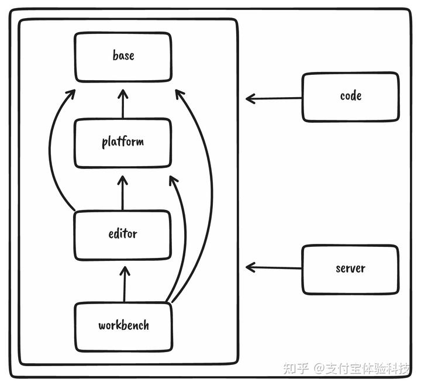

每层针对不同端还有自己的实现分层：

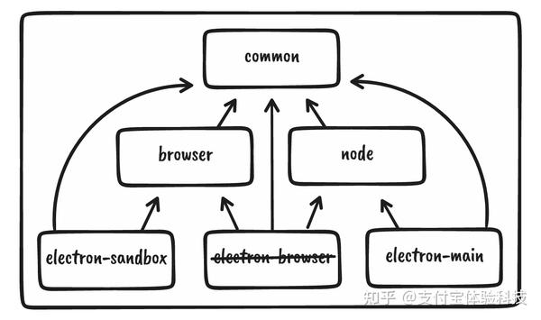

## 依赖注入

vscode 中将各种功能解耦成一个个的 service，每个能力组合一个个 service 实现。这里的 service
通过依赖注入的方式附着到使用方上。

```js
class Client {
  constructor(
    @IModelService modelService: IModelService
  ) {
    // use services
  }
}
```

### 意义

依赖注入（DI）能够实现控制反转（IOC）。

> 消费者对象在使用服务的时候，并不是自己构造一个服务对象（仔细品味：如果它知道要具体要构造哪个类，它实际上也就知道了这个类的实现细节），而是从某个服务注册机构（通常叫做注入器）得到一个服务对象，只要这个对象满足它的接口的要求就可以了，这个过程往往是在消费者对象构造时完成的，所以被称为注入。这实际上是一种控制反转（IOC）。

  * 解耦，使用方不用关心实例化流程，将手动创建对象的控制权转移至第三方的依赖注入容器
  * IoC 容器可以来统一管理对象的生命周期、依赖关系
  * 便于多版本的实现，譬如跨端时对于一个 service 的 web 端和 app 端实现的不一样，依赖注入容器去管理，消费 service 的使用方可以不感知。 :::

### 实现

vscode 中通过装饰器注解的方式来声明依赖关系，不过它并没有直接使用 reflect-metadata，而是基于 decorator 标注元信息实现了一套自己的依赖注入模式。

### 声明一个 service

service 就是一个普普通通的 class，在声明时并没有什么特殊的：

```js
export class BrowserURLService extends AbstractURLService {
    private provider: IURLCallbackProvider | undefined;

    constructor(
        @IBrowserWorkbenchEnvironmentService environmentService: IBrowserWorkbenchEnvironmentService,
        @IOpenerService openerService: IOpenerService,
        @IProductService productService: IProductService
    ) {
        super();
        this.provider = environmentService.options?.urlCallbackProvider;
        if (this.provider) {
            this._register(this.provider.onCallback(uri => this.open(uri, { trusted: true })));
        }
        this._register(openerService.registerOpener(new BrowserURLOpener(this, productService)));
    }

    create(options?: Partial<UriComponents>): URI {
        if (this.provider) {
            return this.provider.create(options);
        }
        return URI.parse('unsupported://');
    }
}

export abstract class AbstractURLService extends Disposable implements IURLService {
    declare readonly _serviceBrand: undefined;
    
    private handlers = new Set<IURLHandler>();
    
    abstract create(options?: Partial<UriComponents>): URI;

    open(uri: URI, options?: IOpenURLOptions): Promise<boolean> {
        const handlers = [...this.handlers.values()];
        return first(handlers.map(h => () => h.handleURL(uri, options)), undefined, false).then(val => val || false);
    }

    registerHandler(handler: IURLHandler): IDisposable {
        this.handlers.add(handler);
        return toDisposable(() => this.handlers.delete(handler));
    }
}

export interface IURLService {
    readonly _serviceBrand: undefined;

    /**
     * Create a URL that can be called to trigger IURLhandlers.
     * The URL that gets passed to the IURLHandlers carries over
     * any of the provided IURLCreateOption values.
     */
    create(options?: Partial<UriComponents>): URI;
    open(url: URI, options?: IOpenURLOptions): Promise<boolean>;
    registerHandler(handler: IURLHandler): IDisposable;
}

export const IURLService = createDecorator<IURLService>('urlService');
```

  * **针对每个 service，都有一个 IXXXService 的 interface 声明**，这个方式挺值得推荐的。
    * 一方面是接口先行设计，清晰明了。
    * 另一方面也声明了 service 对外的 API，这样不同端的实现细节可以不同，但是都要满足实现这些 interface
    * 另外，通过这个 inferface 创建一个包含类型的变量标识符，IXXXService 就是后面向 IOC 容器注入的标识。
  * 每个 service 最终都`extends Disposable`，这个后续还会讲，使用来管理依赖和销毁的基础类。

### 注册

我们看一下单例的注册方式：

```js
registerSingleton(IURLService, BrowserURLService, InstantiationType.Delayed);
```

遵从了这样的 API：

```js
registerSingleton(
  ISymbolNavigationService, // identifier
  SymbolNavigationService,  // ctor of an implementation
  InstantiationType.Delayed // delay instantiation of this service until is actually needed
);
```

实现：

```js
const _registry: [ServiceIdentifier<any>, SyncDescriptor<any>][] = [];

export const enum InstantiationType {
    /**
     * Instantiate this service as soon as a consumer depdends on it. _Note_ that this
     * is more costly as some upfront work is done that is likely not needed
     */
    Eager = 0,
    /**
     * Instantiate this service as soon as a consumer uses it. This is the _better_
     * way of registering a service.
     */
    Delayed = 1
}

export function registerSingleton<T, Services extends BrandedService[]>(
                    id: ServiceIdentifier<T>, 
                    ctorOrDescriptor: { new(...services: Services): T } | SyncDescriptor<any>, 
                    supportsDelayedInstantiation?: boolean | InstantiationType): void {

    if (!(ctorOrDescriptor instanceof SyncDescriptor)) {
        ctorOrDescriptor = new SyncDescriptor<T>(ctorOrDescriptor as new (...args: any[]) => T, 
                                                 [], 
                                                 Boolean(supportsDelayedInstantiation));
    }

    _registry.push([id, ctorOrDescriptor]);
}

// src/vs/platform/instantiation/common/descriptors.ts
export class SyncDescriptor<T> {
    readonly ctor: any;
    readonly staticArguments: any[];
    readonly supportsDelayedInstantiation: boolean;
    constructor(ctor: new (...args: any[]) => T, staticArguments: any[] = [], supportsDelayedInstantiation: boolean = false) {
        this.ctor = ctor;
        this.staticArguments = staticArguments;
        this.supportsDelayedInstantiation = supportsDelayedInstantiation;
    }
}
```

其实就是就是往 service 记录数组 _registry 里增加了一条记录，记录这个 service 的标识符、构造器、参数这些。

### 实例化

registerSingleton 注册只是记录。那么 service 的实例化发生在什么时机呢？其实是使用时才会去实例化，不过表现出来有几种情况

  * src/vs/code/electron-main/main.ts，入口文件中实例化并收集到依赖注入容器中。这里可以直接调用实例化，也可以通过 new SyncDescriptor 注册一个依赖去收集并且延迟实例化，每实例化一个 service，会根据依赖分析先实例化它依赖的 service。

```js
const services = new ServiceCollection();
...
services.set(ILogService, logService);
services.set(IConfigurationService, new ConfigurationService(environmentService.settingsResource));
services.set(ILifecycleService, new SyncDescriptor(LifecycleService));
...

new InstantiationService(services, true);
```

  * 应用程序中手动获取服务时再进行实例化：

```js
instantiationService.invokeFunction(accessor => {
  const logService = accessor.get(ILogService);
  const authService = accessor.get(IAuthService);
});
```

  * `this.instantiationService.createInstance(IEditorService)`手动调用实例化需要的service

**src/vs/platform/instantiation/common/instantiationService.ts 是实现实例化和 service 管理的核心方法**。

### ✨被调用时再实例化

通过 new SyncDescriptor 来设置 supportsDelayedInstantiation 标识的 service 是延迟实例化的。那么是如何做到使用时才实例化的？

针对 supportsDelayedInstantiation 的 service，又创建了个 InstantiationService 来作为它的依赖注入容器，创建 IdleValue 在空闲时或者使用时完成实例化，并将原 service 的内容 Proxy 代理到新对象上，这样劫持 get 方法，在调用 service 的内容时可以先进行 idle 注入的实例化操作。

```js
private _createServiceInstance<T>(id: ServiceIdentifier<T>, 
                                  ctor: any, 
                                  args: any[] = [], 
                                  supportsDelayedInstantiation: boolean, 
                                  _trace: Trace): T {
    if (!supportsDelayedInstantiation) {
        // eager instantiation
        return this._createInstance(ctor, args, _trace);
    } else {
        const child = new InstantiationService(undefined, this._strict, this, this._enableTracing);
        child._globalGraphImplicitDependency = String(id);

        // Return a proxy object that's backed by an idle value. That
        // strategy is to instantiate services in our idle time or when actually
        // needed but not when injected into a consumer
        // return "empty events" when the service isn't instantiated yet
        const earlyListeners = new Map<string, LinkedList<Parameters<Event<any>>>>();
        const idle = new IdleValue<any>(() => {
            const result = child._createInstance<T>(ctor, args, _trace);
            // early listeners that we kept are now being subscribed to
            // the real service
            for (const [key, values] of earlyListeners) {
                const candidate = <Event<any>>(<any>result)[key];
                if (typeof candidate === 'function') {
                    for (const listener of values) {
                        candidate.apply(result, listener);
                    }
                }
            }
            earlyListeners.clear();
            return result;
        });

        return <T>new Proxy(Object.create(null), {
            get(target: any, key: PropertyKey): any {
                if (!idle.isInitialized) {
                    // looks like an event
                    if (typeof key === 'string' && (key.startsWith('onDid') || key.startsWith('onWill'))) {
                        let list = earlyListeners.get(key);
                        if (!list) {
                            list = new LinkedList();
                            earlyListeners.set(key, list);
                        }
                        const event: Event<any> = (callback, thisArg, disposables) => {
                            const rm = list!.push([callback, thisArg, disposables]);
                            return toDisposable(rm);
                        };
                        return event;
                    }
                }

                // value already exists
                if (key in target) {
                    return target[key];
                }

                // create value
                const obj = idle.value;
                let prop = obj[key];
                if (typeof prop !== 'function') {
                    return prop;
                }
                prop = prop.bind(obj);
                target[key] = prop;
                return prop;
            },

            set(_target: T, p: PropertyKey, value: any): boolean {
                idle.value[p] = value;
                return true;
            },
            getPrototypeOf(_target: T) {
                return ctor.prototype;
            }
        });
    }
}

/**
 * An implementation of the "idle-until-urgent"-strategy as introduced
 * here: https://philipwalton.com/articles/idle-until-urgent/
 */
export class IdleValue<T> {
    private readonly _executor: () => void;
    private readonly _handle: IDisposable;
    private _didRun: boolean = false;
    private _value?: T;
    private _error: unknown;

    constructor(executor: () => T) {
        this._executor = () => {
            try {
                this._value = executor();
            } catch (err) {
                this._error = err;
            } finally {
                this._didRun = true;
            }
        };
        this._handle = runWhenIdle(() => this._executor());
    }

    dispose(): void {
        this._handle.dispose();
    }
    
    get value(): T {
        if (!this._didRun) {
            this._handle.dispose();
            this._executor();
        }
        if (this._error) {
            throw this._error;
        }
        return this._value!;
    }

    get isInitialized(): boolean {
        return this._didRun;
    }
}
```

get value() 做到了使用 service 上的内容时，检查 service 是否有被实例化，没有的话，进行实例化后，在返回原来 service 上的对应内容

### 使用

```js
export class ExtensionsWorkbenchService extends Disposable implements IExtensionsWorkbenchService, IURLHandler {
  constructor(
        @IInstantiationService private readonly instantiationService: IInstantiationService,
    @IURLService urlService: IURLService,
  ){
    // ....
  }
  // ...
}
```

上文也说了，vscode 中的依赖注入的装饰器实现中并没有进行实例化，只是收集依赖关系：

```js
export const IURLService = createDecorator<IURLService>('urlService');

/**
 * The *only* valid way to create a {{ServiceIdentifier}}.
 */
export function createDecorator<T>(serviceId: string): ServiceIdentifier<T> {
  if (_util.serviceIds.has(serviceId)) {
    return _util.serviceIds.get(serviceId)!;
  }

  const id = <any>function (target: Function, key: string, index: number): any {
    if (arguments.length !== 3) {
      throw new Error('@IServiceName-decorator can only be used to decorate a parameter');
    }
    storeServiceDependency(id, target, index);
  };

  id.toString = () => serviceId;
  _util.serviceIds.set(serviceId, id);

  return id;
}

class XXX {
  constructor(
        @ICodeEditorService private readonly _editorService: ICodeEditorService,
    ) {
    }
}
```

:::success

  * 依赖注入的方式解耦了 service 的实现、引用、实例化，把生命周期和依赖分析交给了依赖注入容器 InstantiationService 来管理。
  * **延迟实例化的实现，能够做到类被调用时才实例化，最大化减少了开销** :::

### 资料

  * [https://github.com/microsoft/vscode/wiki/Source-Code-Organization#dependency-injection](https://github.com/microsoft/vscode/wiki/Source-Code-Organization%23dependency-injection)
  * 装饰器基础知识：、

## ✨事件体系（生命周期）

### 特点

  * **生命周期由框架层统一管理**
    * **事件定义方的类销毁时** -> **销毁定义的事件**(event.js：Emitter.dispose) -> **销毁定义的事件的所有监听器内容**（事件listener的callback函数全重置为undefined），事件监听队列_listeners的LinkedList清空

事件全都是通过`this._register(new Emitter<IXXXEvent>())`的模式关联到类的

  * **事件监听方的类销毁时 -> 销毁对事件注册的监听器**

注册某事件onDidVisibleEditorsChange的监听处理函数：`this._register(this.onDidVisibleEditorsChange(() => this.handleVisibleEditorsChange()));`

  * 事件有明显的源头，能追踪到事件的提供方，有完整的类型定义

使用方：`this._codeEditorService.onCodeEditorAdd(this._onDidAddEditor, this, this._toDispose);`

**vscode 对事件的生命周期进行了统一的管控，避免了人肉去关心类销毁时事件的清理**。 这个我个人觉得挺重要的，毕竟我经常会忘记去清理事件，而且这类问题在开发时还不容易发现。事件不及时清理一方面是内存得不到释放，越堆越大影响性能，另一方面，还有可能因为类销毁了被绑定的事件没销毁还被触发，对后续功能产生影响导致异常。

事件让我们能够解耦两个功能模块，在不互相引用的情况下能够进行交互。但其实两个模块还是有逻辑上的关系的，在各自领域的功能上不相互依赖，但是对于整体的产品功能来说是需要相互配合的。eventEmit带来的一个问题就是随处的on和emit让我们不知道有哪些事件，不知道事件的定义方是谁，需要传递的参数是什么，只能依赖编辑器检索的方式查代码找关系。这些问题在vscode的这种事件体系下得到了解决。

### 使用

先从使用案例上感受下这套事件体系的 API。

事件的定义:（生产一个事件）

```js
export class EditorService extends Disposable implements EditorServiceImpl {
    declare readonly _serviceBrand: undefined;

    //#region events

    private readonly _onDidActiveEditorChange = this._register(new Emitter<void>());
    readonly onDidActiveEditorChange = this._onDidActiveEditorChange.event;
    
    private readonly _onDidVisibleEditorsChange = this._register(new Emitter<void>());
    readonly onDidVisibleEditorsChange = this._onDidVisibleEditorsChange.event;
    
    private readonly _onDidEditorsChange = this._register(new Emitter<IEditorsChangeEvent>());
    readonly onDidEditorsChange = this._onDidEditorsChange.event;
    
    private readonly _onDidCloseEditor = this._register(new Emitter<IEditorCloseEvent>());
    readonly onDidCloseEditor = this._onDidCloseEditor.event;
    
    //#endregion
}
```

事件的消费：（注册监听函数）

```js
import { Event } from 'vs/base/common/event';

class MainThreadDocumentAndEditorStateComputer {
  constructor(
        @IEditorService private readonly _editorService: IEditorService,
    ) {
        this._editorService.onDidActiveEditorChange(_ => this._updateState(), this, this._toDispose);

        Event.filter(this._paneCompositeService.onDidPaneCompositeOpen, event => event.viewContainerLocation === ViewContainerLocation.Panel)(_ => this._activeEditorOrder = ActiveEditorOrder.Panel, undefined, this._toDispose);
        Event.filter(this._paneCompositeService.onDidPaneCompositeClose, event => event.viewContainerLocation === ViewContainerLocation.Panel)(_ => this._activeEditorOrder = ActiveEditorOrder.Editor, undefined, this._toDispose);
        this._editorService.onDidVisibleEditorsChange(_ => this._activeEditorOrder = ActiveEditorOrder.Editor, undefined, this._toDispose);
    }
}
```

### ⚠️实现

⚠️⚠️⚠️高能预警，这块的实现上特别的绕，代码不是很好懂，如果我节选的片段看完还是晕建议去翻翻源码，IDE 里阅读源码时辅助的定义、实现、类型查看和跳转，让看源码效率和清晰度都比文章高很多。

### disposable

类和事件的销毁处理都源于 Disposable 的基类。 当类 xxxService 销毁时，xxxService extendsDisposable，会触发 Disposable.dispose 方法，让 `_store.dispose`，而 `_store` 里保存的是 `_register` 时 `_store.add` 的内容：

```js
export abstract class Disposable implements IDisposable {
    /**
     * A disposable that does nothing when it is disposed of.
     *
     * TODO: This should not be a static property.
     */
    static readonly None = Object.freeze<IDisposable>({ dispose() { } });
    protected readonly _store = new DisposableStore();
    constructor() {
        trackDisposable(this);
        setParentOfDisposable(this._store, this);
    }
    public dispose(): void {
        markAsDisposed(this);
        this._store.dispose();
    }
    /**
     * Adds `o` to the collection of disposables managed by this object.
     */
    protected _register<T extends IDisposable>(o: T): T {
        if ((o as unknown as Disposable) === this) {
            throw new Error('Cannot register a disposable on itself!');
        }
        return this._store.add(o);
    }
}

export class DisposableStore implements IDisposable {
    static DISABLE_DISPOSED_WARNING = false;

    private readonly _toDispose = new Set<IDisposable>();
    private _isDisposed = false;

    constructor() {
        trackDisposable(this);
    }

    /**
     * Dispose of all registered disposables and mark this object as disposed.
     *
     * Any future disposables added to this object will be disposed of on `add`.
     */
    public dispose(): void {
        if (this._isDisposed) {
            return;
        }
        markAsDisposed(this);
        this._isDisposed = true;
        this.clear();
    }

    /**
     * @return `true` if this object has been disposed of.
     */
    public get isDisposed(): boolean {
        return this._isDisposed;
    }

    /**
     * Dispose of all registered disposables but do not mark this object as disposed.
     */
    public clear(): void {
        if (this._toDispose.size === 0) {
            return;
        }
        try {
            dispose(this._toDispose);
        } finally {
            this._toDispose.clear();
        }
    }

    /**
     * Add a new {@link IDisposable disposable} to the collection.
     */
    public add<T extends IDisposable>(o: T): T {
        if (!o) {
            return o;
        }
        if ((o as unknown as DisposableStore) === this) {
            throw new Error('Cannot register a disposable on itself!');
        }

        setParentOfDisposable(o, this);
        if (this._isDisposed) {
            if (!DisposableStore.DISABLE_DISPOSED_WARNING) {
                console.warn(new Error('Trying to add a disposable to a DisposableStore that has already been disposed of. The added object will be leaked!').stack);
            }
        } else {
            this._toDispose.add(o);
        }

        return o;
    }
}
```

从上述代码可以看到，最终调用的是`dispose(this._toDispose)`,也就是原始的`_register`时的实例上的dispose方法

```js
export function dispose<T extends IDisposable>(arg: T | Iterable<T> | undefined): any {
    if (Iterable.is(arg)) {
        const errors: any[] = [];

        for (const d of arg) {
            if (d) {
                try {
                    d.dispose();
                } catch (e) {
                    errors.push(e);
                }
            }
        }

        if (errors.length === 1) {
            throw errors[0];
        } else if (errors.length > 1) {
            throw new AggregateError(errors, 'Encountered errors while disposing of store');
        }

        return Array.isArray(arg) ? [] : arg;
    } else if (arg) {
        arg.dispose();

        return arg;
    }
}
```

### event

那么我们再看看`this._register(this.onDidVisibleEditorsChange(() => this.handleVisibleEditorsChange()));`注册的原始实例到底是什么：

```js
private readonly _onDidVisibleEditorsChange = this._register(new Emitter<void>());

readonly onDidVisibleEditorsChange = this._onDidVisibleEditorsChange.event;

get event(): Event<T> {
    if (!this._event) {
        this._event = (callback: (e: T) => any, thisArgs?: any, disposables?: IDisposable[] | DisposableStore) => {
            if (!this._listeners) {
                this._listeners = new LinkedList();
            }

            if (this._leakageMon && this._listeners.size > this._leakageMon.threshold * 3) {
                console.warn(`[${this._leakageMon.name}] REFUSES to accept new listeners because it exceeded its threshold by far`);
                return Disposable.None;
            }

            const firstListener = this._listeners.isEmpty();
            if (firstListener && this._options?.onWillAddFirstListener) {
                this._options.onWillAddFirstListener(this);
            }

            let removeMonitor: Function | undefined;
            let stack: Stacktrace | undefined;

            if (this._leakageMon && this._listeners.size >= Math.ceil(this._leakageMon.threshold * 0.2)) {
                // check and record this emitter for potential leakage
                stack = Stacktrace.create();
                removeMonitor = this._leakageMon.check(stack, this._listeners.size + 1);
            }

            if (_enableDisposeWithListenerWarning) {
                stack = stack ?? Stacktrace.create();
            }

            const listener = new Listener(callback, thisArgs, stack);
            const removeListener = this._listeners.push(listener);

            if (firstListener && this._options?.onDidAddFirstListener) {
                this._options.onDidAddFirstListener(this);
            }

            if (this._options?.onDidAddListener) {
                this._options.onDidAddListener(this, callback, thisArgs);
            }

            const result = listener.subscription.set(() => {
                removeMonitor?.();
                if (!this._disposed) {
                    this._options?.onWillRemoveListener?.(this);
                    removeListener();
                    if (this._options && this._options.onDidRemoveLastListener) {
                        const hasListeners = (this._listeners && !this._listeners.isEmpty());
                        if (!hasListeners) {
                            this._options.onDidRemoveLastListener(this);
                        }
                    }
                }
            });

            if (disposables instanceof DisposableStore) {
                disposables.add(result);
            } else if (Array.isArray(disposables)) {
                disposables.push(result);
            }

            return result;
        };
    }

    return this._event;
}
```

`this.onDidVisibleEditorsChange(() => this.handleVisibleEditorsChange())`返回的内容是result，即：

```js
const result = listener.subscription.set(() => {
  removeMonitor?.();

  if (!this._disposed) {
    this._options?.onWillRemoveListener?.(this);
    removeListener();
  
    if (this._options && this._options.onDidRemoveLastListener) {
      const hasListeners = (this._listeners && !this._listeners.isEmpty());
      if (!hasListeners) {
        this._options.onDidRemoveLastListener(this);
      }
    }
  }
});
```

listener:

```js
class Listener<T> {
    readonly subscription = new SafeDisposable();

    constructor(
        readonly callback: (e: T) => void,
        readonly callbackThis: any | undefined,
        readonly stack: Stacktrace | undefined
    ) { }

    invoke(e: T) {
        this.callback.call(this.callbackThis, e);
    }
}

export class SafeDisposable implements IDisposable {
    dispose: () => void = () => { };
    unset: () => void = () => { };
    isset: () => boolean = () => false;

    constructor() {
        trackDisposable(this);
    }

    set(fn: Function) {
        let callback: Function | undefined = fn;

        this.unset = () => callback = undefined;
        this.isset = () => callback !== undefined;

        this.dispose = () => {
            if (callback) {
                callback();
                callback = undefined;
                markAsDisposed(this);
            }
        };

        return this;
    }
}
```

这里比较绕，`listener.subscription.set`设置的函数是 dispose 时要执行的回调函数，里面就包含了`removeListener`的核心能力（就是把这个 listener 的处理函数从事件监听器列表的 `_listeners` 的 LinkedList 里remove掉）

所以`this.onDidVisibleEditorsChange(() => this.handleVisibleEditorsChange())`返回的内容 result 就是上面 SafeDisposable 设置好了 dispose 方法的 this。

**最终监听方 xxxService 的类销毁时 -> 调用 xxxService.dispose() -> 找到 xxxService上 `_register` 的事件监听器的返回内容 -> 执行事件监听器返回内容 SafeDisposable.dispose -> 抹除了原始事件监听列表里对 xxxService 对该事件注册的监听处理函数。**

### 总结

事件是什么，事件本身没有任何功能逻辑，事件的功能逻辑都在监听函数的处理中，事件提供的是一种**注册事件标识符、外界能注册某个事件发生时的回调（监听函数）、外界能够触发事件的能力、内部在事件发生时能执行监听函数、移出监听函数销毁事件等清理能力**，vscode 将事件的清理做成了自动化的方式。

整个过程比较绕，有必要再回头总结一下：

  * 类的具名化调用
    * 通过`new Emitter<IXXXEvent>()`生产一个包含类型的事件，提供的`get event()`获得可以注册回调函数 listener 的事件接口，并且将这个 event 挂载在功能类`XXXService`的属性`onXXXEvent`上
    * 其它类通过依赖注入和上述功能类产生依赖关系，调用上述`XXXService.onXXXEvent(() => //listener )`注册回调函数

  * 类的自动销毁：通过依赖的标准化注册流程，**一个类销毁时，自动分析依赖销毁依赖里相关的内容，做到了自动化的链式销毁。**
    * 事件定义方的类销毁时：`this._register(new Emitter<IXXXEvent>())`将生产的事件_register 到自己的类上，收集了一个依赖，在自己的类 dispose 时调用 `_register` 里注册的事件 Emitter 的 dispose 方法，做到了自己销毁时，自己生产的事件也被销毁
    * 事件监听方的类销毁时：监听方 xxxService 的类销毁 -> 调用 xxxService.dispose() -> 找到 xxxService 上 `_register` 的事件监听器的返回内容 -> 执行事件监听器返回内容SafeDisposable.dispose -> 抹除了原始事件监听列表里对 xxxService 对该事件注册的监听处理函数。

### 资料

  * [VSCode 源码解读：事件系统设计](https://juejin.cn/post/7048141444128702495)

## contrib 扩展与框架

vscode 中对外的插件是 extension，使用的都是 vscode 开放的 api 来交互，能使用的能力是被约束和规范化的。而内部内置的插件是 contrib，它通过调用一系列更加底层的 API 来扩展 vscode 的能力，代码在相应层的 contrib下存放。

这是我原本最关心的部分，我想探索插件和框架的设计边界和协同。在做语雀编辑器的内源梳理时，这部分遇到了不少问题，语雀的插件体系比较灵活能够访问到框架层大多数能力，很多编辑器核心的能力都是插件实现的，但是一部分能力因为过于核心基础，导致了框架层也会调用到，出现了框架对插件的不合理依赖，这部分治理时比较痛苦，想学习下 vscode 的做法。

关于插件拓展部分 extension，因为是社区开发需要参与的，直接看官网开发文档和其它文章就已经比较清晰：

  * [https://code.visualstudio.com/api/extension-guides/overview](https://code.visualstudio.com/api/extension-guides/overview)。
  * 从零开始 - VSCode 插件运行机制：[https://zhuanlan.zhihu.com/p/54289476](https://zhuanlan.zhihu.com/p/54289476)

我这里主要关注内部的 contrib。

另外 vscode 也开放了 contrib poinits，通过 json 配置就可以对内部 contrib 实现的扩展点，进行扩充能力：[https://code.visualstudio.com/api/references/contribution-points](https://code.visualstudio.com/api/references/contribution-points)

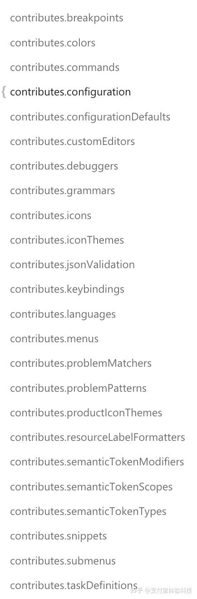

contrib 的实现也有一些约束规范：

  * Contrib 目录下的所有代码不允许依赖任何本文件夹之外的文件
  * Contrib 主要是使用 Core 暴露的一些扩展点来做事情
  * 每一个 Contrib 如果要对外暴露，将API 在一个出口文件里面导出 eg: `contrib/search/common/search.ts`
  * 一个 Contrib 如果要和另一个 Contrib 发生调用，不允许使用除了出口 API 文件之外的其它文件
  * 接上一条，即使 Contrib 可以调用另一个 Contrib 的出口 API，也要审慎的考虑，应尽量避免两个 Contrib 互相依赖

### 使用 registry 注册扩展项

这部分我们通过一个功能模块的示例来了解，我选的是折叠块模块调用配置项的扩展点注册配置项。

```js
import { IConfigurationRegistry, Extensions as ConfigurationExtensions } from 'vs/platform/configuration/common/configurationRegistry';

class DefaultFoldingRangeProvider extends Disposable implements IWorkbenchContribution {
    static readonly configName = 'editor.defaultFoldingRangeProvider';

    constructor(
        @IExtensionService private readonly _extensionService: IExtensionService,
        @IConfigurationService private readonly _configurationService: IConfigurationService,
    ) {
        super();
        this._store.add(this._extensionService.onDidChangeExtensions(this._updateConfigValues, this));
        this._store.add(FoldingController.setFoldingRangeProviderSelector(this._selectFoldingRangeProvider.bind(this)));
        this._updateConfigValues();
    }

   // 具体的业务逻辑先不看了
}

Registry.as<IConfigurationRegistry>(ConfigurationExtensions.Configuration).registerConfiguration({
    ...editorConfigurationBaseNode,

    properties: {
        [DefaultFoldingRangeProvider.configName]: {
            description: nls.localize('formatter.default', "Defines a default folding range provider that takes precedence over all other folding range providers. Must be the identifier of an extension contributing a folding range provider."),
            type: ['string', 'null'],

            default: null,

            enum: DefaultFoldingRangeProvider.extensionIds,
            enumItemLabels: DefaultFoldingRangeProvider.extensionItemLabels,
            markdownEnumDescriptions: DefaultFoldingRangeProvider.extensionDescriptions
        }
    }
});

Registry.as<IWorkbenchContributionsRegistry>(WorkbenchExtensions.Workbench).registerWorkbenchContribution(
    DefaultFoldingRangeProvider,
    LifecyclePhase.Restored
);
```

### registry

registry 本身是一个 map 格式的注册记录器

```js
export interface IRegistry {
    /**
     * Adds the extension functions and properties defined by data to the
     * platform. The provided id must be unique.
     * @param id a unique identifier
     * @param data a contribution
     */
    add(id: string, data: any): void;

    /**
     * Returns true iff there is an extension with the provided id.
     * @param id an extension identifier
     */
    knows(id: string): boolean;

    /**
     * Returns the extension functions and properties defined by the specified key or null.
     * @param id an extension identifier
     */
    as<T>(id: string): T;
}

class RegistryImpl implements IRegistry {
    private readonly data = new Map<string, any>();

    public add(id: string, data: any): void {
        Assert.ok(Types.isString(id));
        Assert.ok(Types.isObject(data));
        Assert.ok(!this.data.has(id), 'There is already an extension with this id');
        this.data.set(id, data);
    }

    public knows(id: string): boolean {
        return this.data.has(id);
    }

    public as(id: string): any {
        return this.data.get(id) || null;
    }
}

export const Registry: IRegistry = new RegistryImpl();
```

`Registry.as<IConfigurationRegistry>(ConfigurationExtensions.Configuration).registerConfiguration`调用的是 ConfigurationExtensions 的注册能力，看一下是什么：

```js
export interface IConfigurationRegistry {
    /**
     * Register a configuration to the registry.
     */
    registerConfiguration(configuration: IConfigurationNode): void;
  // ...
}

class ConfigurationRegistry implements IConfigurationRegistry {
  public registerConfiguration(configuration: IConfigurationNode, validate: boolean = true): void {
        this.registerConfigurations([configuration], validate);
    }
  // ....
}

export const Extensions = {
    Configuration: 'base.contributions.configuration'
};

const configurationRegistry = new ConfigurationRegistry();
Registry.add(Extensions.Configuration, configurationRegistry);
```

这下就清晰了，折叠块 DefaultFoldingRangeProvider 通过 configurationRegistry 访问到了 ConfigurationRegistry 的能力，向其注册了配置项内容：

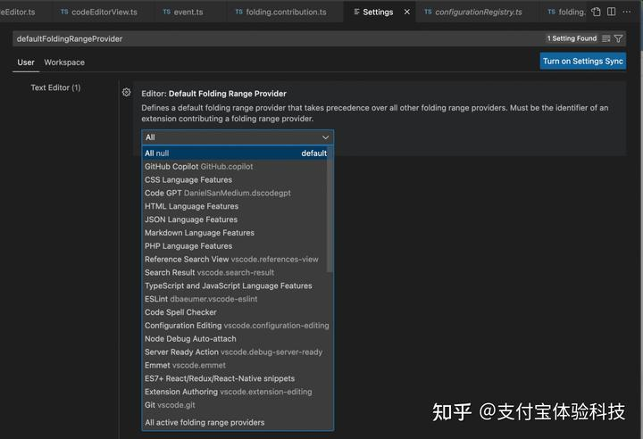

### 扩展机制

所以 registry 是一种机制，通过这种规范方式，让 contrib 能提供一种公开的能力，给其他的 contrib 来调用扩展。

所以还有一批注册编辑器 command 和 action 的方法，可以注册菜单栏、快捷键等的内容和响应逻辑。譬如：

command 和 action 的注册

```js
abstract class FoldingAction<T> extends EditorAction {

 abstract invoke(foldingController: FoldingController, 
                 foldingModel: FoldingModel, 
                 editor: ICodeEditor, 
                 args: T, 
                 languageConfigurationService: ILanguageConfigurationService): void;

 public override runEditorCommand(accessor: ServicesAccessor, 
                                  editor: ICodeEditor, 
                                  args: T): void | Promise<void> {  

  const languageConfigurationService = accessor.get(ILanguageConfigurationService);  
  const foldingController = FoldingController.get(editor);  

  if (!foldingController) {  
   return;  
  }  

  const foldingModelPromise = foldingController.getFoldingModel();  

  if (foldingModelPromise) {  
   this.reportTelemetry(accessor, editor);  

   return foldingModelPromise.then(foldingModel => {  
    if (foldingModel) {  
     this.invoke(foldingController, 
                 foldingModel, 
                 editor, 
                 args, 
                 languageConfigurationService);  

     const selection = editor.getSelection();  
     if (selection) {  
      foldingController.reveal(selection.getStartPosition());  
     }  
    }  
   });  
  }  
 }

 protected getSelectedLines(editor: ICodeEditor) {  
  const selections = editor.getSelections();  
  return selections ? selections.map(s => s.startLineNumber) : [];  
 }

 protected getLineNumbers(args: FoldingArguments, editor: ICodeEditor) {  
  if (args && args.selectionLines) {  
   return args.selectionLines.map(l => l + 1); // to 0-bases line numbers  
  }  
  return this.getSelectedLines(editor);  
 }

 public run(_accessor: ServicesAccessor, _editor: ICodeEditor): void {  
 }  
}

class FoldAction extends FoldingAction<FoldingArguments> {
 constructor() {  
  super({  
   id: 'editor.fold',  
   label: nls.localize('foldAction.label', "Fold"),  
   alias: 'Fold',  
   precondition: CONTEXT_FOLDING_ENABLED,  
   kbOpts: {  
    kbExpr: EditorContextKeys.editorTextFocus,  
    primary: KeyMod.CtrlCmd | KeyMod.Shift | KeyCode.BracketLeft,  
    mac: {  
     primary: KeyMod.CtrlCmd | KeyMod.Alt | KeyCode.BracketLeft  
    },  
    weight: KeybindingWeight.EditorContrib  
   },  
   description: {  
    description: 'Fold the content in the editor',  
    args: [  
     {  
      name: 'Fold editor argument',  
      description: `Property-value pairs that can be passed through this argument:  
       * 'levels': Number of levels to fold.  
       * 'direction': If 'up', folds given number of levels up otherwise folds down.  
       * 'selectionLines': Array of the start lines (0-based) of the editor selections to apply the fold action to. If not set, the active selection(s) will be used.  
       If no levels or direction is set, folds the region at the locations or if already collapsed, the first uncollapsed parent instead.  
      `,  
      constraint: foldingArgumentsConstraint,  
      schema: {  
       'type': 'object',  
       'properties': {  
        'levels': {  
         'type': 'number',  
        },  
        'direction': {  
         'type': 'string',  
         'enum': ['up', 'down'],  
        },  
        'selectionLines': {  
         'type': 'array',  
         'items': {  
          'type': 'number'  
         }  
        }  
       }  
      }  
     }  
    ]  
   }  
  });  
 }

 invoke(_foldingController: FoldingController, 
        foldingModel: FoldingModel, 
        editor: ICodeEditor, 
        args: FoldingArguments): void {  

  const lineNumbers = this.getLineNumbers(args, editor);
  const levels = args && args.levels;  
  const direction = args && args.direction;

  if (typeof levels !== 'number' && typeof direction !== 'string') {  
   // fold the region at the location or if already collapsed, the first uncollapsed parent instead.  
   setCollapseStateUp(foldingModel, true, lineNumbers);  
  } else {  
   if (direction === 'up') {  
    setCollapseStateLevelsUp(foldingModel, true, levels || 1, lineNumbers);  
   } else {  
    setCollapseStateLevelsDown(foldingModel, true, levels || 1, lineNumbers);  
   }  
  }  
 }  
}

registerEditorContribution(FoldingController.ID, 
                           FoldingController, 
                           EditorContributionInstantiation.Eager); // eager because it uses `saveViewState`/`restoreViewState`  

registerEditorAction(UnfoldAction);  
registerEditorAction(UnFoldRecursivelyAction);  
registerEditorAction(FoldAction);  
registerEditorAction(FoldRecursivelyAction);  
registerEditorAction(FoldAllAction);  
registerEditorAction(UnfoldAllAction);  
registerEditorAction(FoldAllBlockCommentsAction);  
registerEditorAction(FoldAllRegionsAction);  
registerEditorAction(UnfoldAllRegionsAction);  
registerEditorAction(FoldAllRegionsExceptAction);  
registerEditorAction(UnfoldAllRegionsExceptAction);  
registerEditorAction(ToggleFoldAction);  
registerEditorAction(GotoParentFoldAction);  
registerEditorAction(GotoPreviousFoldAction);  
registerEditorAction(GotoNextFoldAction);  
registerEditorAction(FoldRangeFromSelectionAction);  
registerEditorAction(RemoveFoldRangeFromSelectionAction);

for (let i = 1; i <= 7; i++) {  
 registerInstantiatedEditorAction(  
  new FoldLevelAction({  
   id: FoldLevelAction.ID(i),  
   label: nls.localize('foldLevelAction.label', "Fold Level {0}", i),  
   alias: `Fold Level ${i}`,  
   precondition: CONTEXT_FOLDING_ENABLED,  
   kbOpts: {  
    kbExpr: EditorContextKeys.editorTextFocus,  
    primary: KeyChord(KeyMod.CtrlCmd | KeyCode.KeyK, KeyMod.CtrlCmd | (KeyCode.Digit0 + i)),  
    weight: KeybindingWeight.EditorContrib  
   }  
  })  
 );  
}

CommandsRegistry.registerCommand('_executeFoldingRangeProvider', async function (accessor, ...args) {  
 // ...  
});
```

command 和 action 的提供方

```js
/*---------------------------------------------------------------------------------------------  
 *  Copyright (c) Microsoft Corporation. All rights reserved.  
 *  Licensed under the MIT License. See License.txt in the project root for license information.  
 *--------------------------------------------------------------------------------------------*/  

import * as nls from 'vs/nls';  
import { URI } from 'vs/base/common/uri';  
import { ICodeEditor, IDiffEditor } from 'vs/editor/browser/editorBrowser';  
import { ICodeEditorService } from 'vs/editor/browser/services/codeEditorService';  
import { Position } from 'vs/editor/common/core/position';  
import { IEditorContribution, IDiffEditorContribution } from 'vs/editor/common/editorCommon';  
import { ITextModel } from 'vs/editor/common/model';  
import { IModelService } from 'vs/editor/common/services/model';  
import { ITextModelService } from 'vs/editor/common/services/resolverService';  
import { MenuId, MenuRegistry, Action2 } from 'vs/platform/actions/common/actions';  
import { CommandsRegistry, ICommandHandlerDescription } from 'vs/platform/commands/common/commands';  
import { ContextKeyExpr, IContextKeyService, ContextKeyExpression } from 'vs/platform/contextkey/common/contextkey';  
import { ServicesAccessor as InstantiationServicesAccessor, BrandedService, IInstantiationService, IConstructorSignature } from 'vs/platform/instantiation/common/instantiation';  
import { IKeybindings, KeybindingsRegistry, KeybindingWeight } from 'vs/platform/keybinding/common/keybindingsRegistry';  
import { Registry } from 'vs/platform/registry/common/platform';  
import { ITelemetryService } from 'vs/platform/telemetry/common/telemetry';  
import { withNullAsUndefined, assertType } from 'vs/base/common/types';  
import { ThemeIcon } from 'vs/base/common/themables';  
import { IDisposable } from 'vs/base/common/lifecycle';  
import { KeyMod, KeyCode } from 'vs/base/common/keyCodes';  
import { ILogService } from 'vs/platform/log/common/log';  

export type ServicesAccessor = InstantiationServicesAccessor;  
export type EditorContributionCtor = IConstructorSignature<IEditorContribution, [ICodeEditor]>;  
export type DiffEditorContributionCtor = IConstructorSignature<IDiffEditorContribution, [IDiffEditor]>;  

export const enum EditorContributionInstantiation {  
 /**  
  * The contribution is created eagerly when the {@linkcode ICodeEditor} is instantiated.  
  * Only Eager contributions can participate in saving or restoring of view state.  
  */  
 Eager,  

 /**  
  * The contribution is created at the latest 50ms after the first render after attaching a text model.  
  * If the contribution is explicitly requested via `getContribution`, it will be instantiated sooner.  
  * If there is idle time available, it will be instantiated sooner.  
  */  
 AfterFirstRender,  

 /**  
  * The contribution is created before the editor emits events produced by user interaction (mouse events, keyboard events).  
  * If the contribution is explicitly requested via `getContribution`, it will be instantiated sooner.  
  * If there is idle time available, it will be instantiated sooner.  
  */  
 BeforeFirstInteraction,  

 /**  
  * The contribution is created when there is idle time available, at the latest 5000ms after the editor creation.  
  * If the contribution is explicitly requested via `getContribution`, it will be instantiated sooner.  
  */  
 Eventually,  

 /**  
  * The contribution is created only when explicitly requested via `getContribution`.  
  */  
 Lazy,  
}  

export interface IEditorContributionDescription {  
 readonly id: string;  
 readonly ctor: EditorContributionCtor;  
 readonly instantiation: EditorContributionInstantiation;  
}  

export interface IDiffEditorContributionDescription {  
 id: string;  
 ctor: DiffEditorContributionCtor;  
}  

//#region Command  

export interface ICommandKeybindingsOptions extends IKeybindings {  
 kbExpr?: ContextKeyExpression | null;  
 weight: number;  
 /**  
  * the default keybinding arguments  
  */  
 args?: any;  
}  

export interface ICommandMenuOptions {  
 menuId: MenuId;  
 group: string;  
 order: number;  
 when?: ContextKeyExpression;  
 title: string;  
 icon?: ThemeIcon;  
}  

export interface ICommandOptions {  
 id: string;  
 precondition: ContextKeyExpression | undefined;  
 kbOpts?: ICommandKeybindingsOptions | ICommandKeybindingsOptions[];  
 description?: ICommandHandlerDescription;  
 menuOpts?: ICommandMenuOptions | ICommandMenuOptions[];  
}  

export abstract class Command {  
 public readonly id: string;  
 public readonly precondition: ContextKeyExpression | undefined;  
 private readonly _kbOpts: ICommandKeybindingsOptions | ICommandKeybindingsOptions[] | undefined;  
 private readonly _menuOpts: ICommandMenuOptions | ICommandMenuOptions[] | undefined;  
 private readonly _description: ICommandHandlerDescription | undefined;  

 constructor(opts: ICommandOptions) {  
  this.id = opts.id;  
  this.precondition = opts.precondition;  
  this._kbOpts = opts.kbOpts;  
  this._menuOpts = opts.menuOpts;  
  this._description = opts.description;  
 }  

 public register(): void {  

  if (Array.isArray(this._menuOpts)) {  
   this._menuOpts.forEach(this._registerMenuItem, this);  
  } else if (this._menuOpts) {  
   this._registerMenuItem(this._menuOpts);  
  }  

  if (this._kbOpts) {  
   const kbOptsArr = Array.isArray(this._kbOpts) ? this._kbOpts : [this._kbOpts];  
   for (const kbOpts of kbOptsArr) {  
    let kbWhen = kbOpts.kbExpr;  
    if (this.precondition) {  
     if (kbWhen) {  
      kbWhen = ContextKeyExpr.and(kbWhen, this.precondition);  
     } else {  
      kbWhen = this.precondition;  
     }  
    }  

    const desc = {  
     id: this.id,  
     weight: kbOpts.weight,  
     args: kbOpts.args,  
     when: kbWhen,  
     primary: kbOpts.primary,  
     secondary: kbOpts.secondary,  
     win: kbOpts.win,  
     linux: kbOpts.linux,  
     mac: kbOpts.mac,  
    };  

    KeybindingsRegistry.registerKeybindingRule(desc);  
   }  
  }  

  CommandsRegistry.registerCommand({  
   id: this.id,  
   handler: (accessor, args) => this.runCommand(accessor, args),  
   description: this._description  
  });  
 }  

 private _registerMenuItem(item: ICommandMenuOptions): void {  
  MenuRegistry.appendMenuItem(item.menuId, {  
   group: item.group,  
   command: {  
    id: this.id,  
    title: item.title,  
    icon: item.icon,  
    precondition: this.precondition  
   },  
   when: item.when,  
   order: item.order  
  });  
 }  

 public abstract runCommand(accessor: ServicesAccessor, args: any): void | Promise<void>;  
}  

//#endregion Command  

//#region MultiplexingCommand  

/**  
 * Potential override for a command.  
 *  
 * @return `true` if the command was successfully run. This stops other overrides from being executed.  
 */  
export type CommandImplementation = (accessor: ServicesAccessor, args: unknown) => boolean | Promise<void>;  

interface ICommandImplementationRegistration {  
 priority: number;  
 name: string;  
 implementation: CommandImplementation;  
}  

export class MultiCommand extends Command {  

 private readonly _implementations: ICommandImplementationRegistration[] = [];  

 /**  
  * A higher priority gets to be looked at first  
  */  
 public addImplementation(priority: number, name: string, implementation: CommandImplementation): IDisposable {  
  this._implementations.push({ priority, name, implementation });  
  this._implementations.sort((a, b) => b.priority - a.priority);  
  return {  
   dispose: () => {  
    for (let i = 0; i < this._implementations.length; i++) {  
     if (this._implementations[i].implementation === implementation) {  
      this._implementations.splice(i, 1);  
      return;  
     }  
    }  
   }  
  };  
 }  

 public runCommand(accessor: ServicesAccessor, args: any): void | Promise<void> {  
  const logService = accessor.get(ILogService);  
  logService.trace(`Executing Command '${this.id}' which has ${this._implementations.length} bound.`);  
  for (const impl of this._implementations) {  
   const result = impl.implementation(accessor, args);  
   if (result) {  
    logService.trace(`Command '${this.id}' was handled by '${impl.name}'.`);  
    if (typeof result === 'boolean') {  
     return;  
    }  
    return result;  
   }  
  }  
  logService.trace(`The Command '${this.id}' was not handled by any implementation.`);  
 }  
}  

//#endregion  

/**  
 * A command that delegates to another command's implementation.  
 *  
 * This lets different commands be registered but share the same implementation  
 */  
export class ProxyCommand extends Command {  
 constructor(  
  private readonly command: Command,  
  opts: ICommandOptions  
 ) {  
  super(opts);  
 }  

 public runCommand(accessor: ServicesAccessor, args: any): void | Promise<void> {  
  return this.command.runCommand(accessor, args);  
 }  
}  

//#region EditorCommand  

export interface IContributionCommandOptions<T> extends ICommandOptions {  
 handler: (controller: T, args: any) => void;  
}  
export interface EditorControllerCommand<T extends IEditorContribution> {  
 new(opts: IContributionCommandOptions<T>): EditorCommand;  
}  
export abstract class EditorCommand extends Command {  

 /**  
  * Create a command class that is bound to a certain editor contribution.  
  */  
 public static bindToContribution<T extends IEditorContribution>(controllerGetter: (editor: ICodeEditor) => T | null): EditorControllerCommand<T> {  
  return class EditorControllerCommandImpl extends EditorCommand {  
   private readonly _callback: (controller: T, args: any) => void;  

   constructor(opts: IContributionCommandOptions<T>) {  
    super(opts);  

    this._callback = opts.handler;  
   }  

   public runEditorCommand(accessor: ServicesAccessor, editor: ICodeEditor, args: any): void {  
    const controller = controllerGetter(editor);  
    if (controller) {  
     this._callback(controller, args);  
    }  
   }  
  };  
 }  

 public static runEditorCommand(  
  accessor: ServicesAccessor,  
  args: any,  
  precondition: ContextKeyExpression | undefined,  
  runner: (accessor: ServicesAccessor | null, editor: ICodeEditor, args: any) => void | Promise<void>  
 ): void | Promise<void> {  
  const codeEditorService = accessor.get(ICodeEditorService);  

  // Find the editor with text focus or active  
  const editor = codeEditorService.getFocusedCodeEditor() || codeEditorService.getActiveCodeEditor();  
  if (!editor) {  
   // well, at least we tried...  
   return;  
  }  

  return editor.invokeWithinContext((editorAccessor) => {  
   const kbService = editorAccessor.get(IContextKeyService);  
   if (!kbService.contextMatchesRules(withNullAsUndefined(precondition))) {  
    // precondition does not hold  
    return;  
   }  

   return runner(editorAccessor, editor, args);  
  });  
 }  

 public runCommand(accessor: ServicesAccessor, args: any): void | Promise<void> {  
  return EditorCommand.runEditorCommand(accessor, args, this.precondition, (accessor, editor, args) => this.runEditorCommand(accessor, editor, args));  
 }  

 public abstract runEditorCommand(accessor: ServicesAccessor | null, editor: ICodeEditor, args: any): void | Promise<void>;  
}  

//#endregion EditorCommand  

//#region EditorAction  

export interface IEditorActionContextMenuOptions {  
 group: string;  
 order: number;  
 when?: ContextKeyExpression;  
 menuId?: MenuId;  
}  

export interface IActionOptions extends ICommandOptions {  
 label: string;  
 alias: string;  
 contextMenuOpts?: IEditorActionContextMenuOptions | IEditorActionContextMenuOptions[];  
}  

export abstract class EditorAction extends EditorCommand {  

 private static convertOptions(opts: IActionOptions): ICommandOptions {  

  let menuOpts: ICommandMenuOptions[];  
  if (Array.isArray(opts.menuOpts)) {  
   menuOpts = opts.menuOpts;  
  } else if (opts.menuOpts) {  
   menuOpts = [opts.menuOpts];  
  } else {  
   menuOpts = [];  
  }  

  function withDefaults(item: Partial<ICommandMenuOptions>): ICommandMenuOptions {  
   if (!item.menuId) {  
    item.menuId = MenuId.EditorContext;  
   }  
   if (!item.title) {  
    item.title = opts.label;  
   }  
   item.when = ContextKeyExpr.and(opts.precondition, item.when);  
   return <ICommandMenuOptions>item;  
  }  

  if (Array.isArray(opts.contextMenuOpts)) {  
   menuOpts.push(...opts.contextMenuOpts.map(withDefaults));  
  } else if (opts.contextMenuOpts) {  
   menuOpts.push(withDefaults(opts.contextMenuOpts));  
  }  

  opts.menuOpts = menuOpts;  
  return <ICommandOptions>opts;  
 }  

 public readonly label: string;  
 public readonly alias: string;  

 constructor(opts: IActionOptions) {  
  super(EditorAction.convertOptions(opts));  
  this.label = opts.label;  
  this.alias = opts.alias;  
 }  

 public runEditorCommand(accessor: ServicesAccessor, editor: ICodeEditor, args: any): void | Promise<void> {  
  this.reportTelemetry(accessor, editor);  
  return this.run(accessor, editor, args || {});  
 }  

 protected reportTelemetry(accessor: ServicesAccessor, editor: ICodeEditor) {  
  type EditorActionInvokedClassification = {  
   owner: 'alexdima';  
   comment: 'An editor action has been invoked.';  
   name: { classification: 'SystemMetaData'; purpose: 'FeatureInsight'; comment: 'The label of the action that was invoked.' };  
   id: { classification: 'SystemMetaData'; purpose: 'FeatureInsight'; comment: 'The identifier of the action that was invoked.' };  
  };  
  type EditorActionInvokedEvent = {  
   name: string;  
   id: string;  
  };  
  accessor.get(ITelemetryService).publicLog2<EditorActionInvokedEvent, EditorActionInvokedClassification>('editorActionInvoked', { name: this.label, id: this.id });  
 }  

 public abstract run(accessor: ServicesAccessor, editor: ICodeEditor, args: any): void | Promise<void>;  
}  

export type EditorActionImplementation = (accessor: ServicesAccessor, editor: ICodeEditor, args: any) => boolean | Promise<void>;  

export class MultiEditorAction extends EditorAction {  

 private readonly _implementations: [number, EditorActionImplementation][] = [];  

 /**  
  * A higher priority gets to be looked at first  
  */  
 public addImplementation(priority: number, implementation: EditorActionImplementation): IDisposable {  
  this._implementations.push([priority, implementation]);  
  this._implementations.sort((a, b) => b[0] - a[0]);  
  return {  
   dispose: () => {  
    for (let i = 0; i < this._implementations.length; i++) {  
     if (this._implementations[i][1] === implementation) {  
      this._implementations.splice(i, 1);  
      return;  
     }  
    }  
   }  
  };  
 }  

 public run(accessor: ServicesAccessor, editor: ICodeEditor, args: any): void | Promise<void> {  
  for (const impl of this._implementations) {  
   const result = impl[1](accessor, editor, args);  
   if (result) {  
    if (typeof result === 'boolean') {  
     return;  
    }  
    return result;  
   }  
  }  
 }  

}  

//#endregion EditorAction  

//#region EditorAction2  

export abstract class EditorAction2 extends Action2 {  

 run(accessor: ServicesAccessor, ...args: any[]) {  
  // Find the editor with text focus or active  
  const codeEditorService = accessor.get(ICodeEditorService);  
  const editor = codeEditorService.getFocusedCodeEditor() || codeEditorService.getActiveCodeEditor();  
  if (!editor) {  
   // well, at least we tried...  
   return;  
  }  
  // precondition does hold  
  return editor.invokeWithinContext((editorAccessor) => {  
   const kbService = editorAccessor.get(IContextKeyService);  
   if (kbService.contextMatchesRules(withNullAsUndefined(this.desc.precondition))) {  
    return this.runEditorCommand(editorAccessor, editor!, ...args);  
   }  
  });  
 }  

 abstract runEditorCommand(accessor: ServicesAccessor, editor: ICodeEditor, ...args: any[]): any;  
}  

//#endregion  

// --- Registration of commands and actions  


export function registerModelAndPositionCommand(id: string, handler: (accessor: ServicesAccessor, 
                                                                      model: ITextModel, 
                                                                      position: Position, 
                                                                      ...args: any[]) => any) {  
 CommandsRegistry.registerCommand(id, function (accessor, ...args) {  

  const instaService = accessor.get(IInstantiationService);  

  const [resource, position] = args;  
  assertType(URI.isUri(resource));  
  assertType(Position.isIPosition(position));  

  const model = accessor.get(IModelService).getModel(resource);  
  if (model) {  
   const editorPosition = Position.lift(position);  
   return instaService.invokeFunction(handler, model, editorPosition, ...args.slice(2));  
  }  

  return accessor.get(ITextModelService).createModelReference(resource).then(reference => {  
   return new Promise((resolve, reject) => {  
    try {  
     const result = instaService.invokeFunction(handler, 
                                                reference.object.textEditorModel, 
                                                Position.lift(position), 
                                                args.slice(2));  
     resolve(result);  
    } catch (err) {  
     reject(err);  
    }  
   }).finally(() => {  
    reference.dispose();  
   });  
  });  
 });  
}  

export function registerEditorCommand<T extends EditorCommand>(editorCommand: T): T {  
 EditorContributionRegistry.INSTANCE.registerEditorCommand(editorCommand);  
 return editorCommand;  
}  

export function registerEditorAction<T extends EditorAction>(ctor: { new(): T }): T {  
 const action = new ctor();  
 EditorContributionRegistry.INSTANCE.registerEditorAction(action);  
 return action;  
}  

export function registerMultiEditorAction<T extends MultiEditorAction>(action: T): T {  
 EditorContributionRegistry.INSTANCE.registerEditorAction(action);  
 return action;  
}  

export function registerInstantiatedEditorAction(editorAction: EditorAction): void {  
 EditorContributionRegistry.INSTANCE.registerEditorAction(editorAction);  
}  

/**  
 * Registers an editor contribution. Editor contributions have a lifecycle which is bound  
 * to a specific code editor instance.  
 */  
export function registerEditorContribution<Services extends BrandedService[]>(
                    id: string, 
                    ctor: { new(editor: ICodeEditor, ...services: Services): IEditorContribution }, 
                    instantiation: EditorContributionInstantiation): void {  
 EditorContributionRegistry.INSTANCE.registerEditorContribution(id, ctor, instantiation);  
}  

/**  
 * Registers a diff editor contribution. Diff editor contributions have a lifecycle which  
 * is bound to a specific diff editor instance.  
 */  
export function registerDiffEditorContribution<Services extends BrandedService[]>(
                    id: string, 
                    ctor: { new(editor: IDiffEditor, ...services: Services): IEditorContribution }): void {  
 EditorContributionRegistry.INSTANCE.registerDiffEditorContribution(id, ctor);  
}  

export namespace EditorExtensionsRegistry {  

 export function getEditorCommand(commandId: string): EditorCommand {  
  return EditorContributionRegistry.INSTANCE.getEditorCommand(commandId);  
 }  

 export function getEditorActions(): Iterable<EditorAction> {  
  return EditorContributionRegistry.INSTANCE.getEditorActions();  
 }  

 export function getEditorContributions(): IEditorContributionDescription[] {  
  return EditorContributionRegistry.INSTANCE.getEditorContributions();  
 }  

 export function getSomeEditorContributions(ids: string[]): IEditorContributionDescription[] {  
  return EditorContributionRegistry.INSTANCE.getEditorContributions().filter(c => ids.indexOf(c.id) >= 0);  
 }  

 export function getDiffEditorContributions(): IDiffEditorContributionDescription[] {  
  return EditorContributionRegistry.INSTANCE.getDiffEditorContributions();  
 }  
}  

// Editor extension points  
const Extensions = {  
 EditorCommonContributions: 'editor.contributions'  
};  

class EditorContributionRegistry {  

 public static readonly INSTANCE = new EditorContributionRegistry();  

 private readonly editorContributions: IEditorContributionDescription[] = [];  
 private readonly diffEditorContributions: IDiffEditorContributionDescription[] = [];  
 private readonly editorActions: EditorAction[] = [];  
 private readonly editorCommands: { [commandId: string]: EditorCommand } = Object.create(null);  

 constructor() {  
 }  

 public registerEditorContribution<Services extends BrandedService[]>(
                id: string, 
                ctor: { new(editor: ICodeEditor, ...services: Services): IEditorContribution }, 
                instantiation: EditorContributionInstantiation): void {  
  this.editorContributions.push({ id, ctor: ctor as EditorContributionCtor, instantiation });  
 }  

 public getEditorContributions(): IEditorContributionDescription[] {  
  return this.editorContributions.slice(0);  
 }  

 public registerDiffEditorContribution<Services extends BrandedService[]>(
                id: string, 
                ctor: { new(editor: IDiffEditor, ...services: Services): IEditorContribution }): void {  
  this.diffEditorContributions.push({ id, ctor: ctor as DiffEditorContributionCtor });  
 }  

 public getDiffEditorContributions(): IDiffEditorContributionDescription[] {  
  return this.diffEditorContributions.slice(0);  
 }  

 public registerEditorAction(action: EditorAction) {  
  action.register();  
  this.editorActions.push(action);  
 }  

 public getEditorActions(): Iterable<EditorAction> {  
  return this.editorActions;  
 }  

 public registerEditorCommand(editorCommand: EditorCommand) {  
  editorCommand.register();  
  this.editorCommands[editorCommand.id] = editorCommand;  
 }  

 public getEditorCommand(commandId: string): EditorCommand {  
  return (this.editorCommands[commandId] || null);  
 }  

}  
Registry.add(Extensions.EditorCommonContributions, EditorContributionRegistry.INSTANCE);  

function registerCommand<T extends Command>(command: T): T {  
 command.register();  
 return command;  
}  

export const UndoCommand = registerCommand(new MultiCommand({  
 id: 'undo',  
 precondition: undefined,  
 kbOpts: {  
  weight: KeybindingWeight.EditorCore,  
  primary: KeyMod.CtrlCmd | KeyCode.KeyZ  
 },  
 menuOpts: [{  
  menuId: MenuId.MenubarEditMenu,  
  group: '1_do',  
  title: nls.localize({ key: 'miUndo', comment: ['&& denotes a mnemonic'] }, "&&Undo"),  
  order: 1  
 }, {  
  menuId: MenuId.CommandPalette,  
  group: '',  
  title: nls.localize('undo', "Undo"),  
  order: 1  
 }]  
}));  

registerCommand(new ProxyCommand(UndoCommand, { id: 'default:undo', precondition: undefined }));  

export const RedoCommand = registerCommand(new MultiCommand({  
 id: 'redo',  
 precondition: undefined,  
 kbOpts: {  
  weight: KeybindingWeight.EditorCore,  
  primary: KeyMod.CtrlCmd | KeyCode.KeyY,  
  secondary: [KeyMod.CtrlCmd | KeyMod.Shift | KeyCode.KeyZ],  
  mac: { primary: KeyMod.CtrlCmd | KeyMod.Shift | KeyCode.KeyZ }  
 },  
 menuOpts: [{  
  menuId: MenuId.MenubarEditMenu,  
  group: '1_do',  
  title: nls.localize({ key: 'miRedo', comment: ['&& denotes a mnemonic'] }, "&&Redo"),  
  order: 2  
 }, {  
  menuId: MenuId.CommandPalette,  
  group: '',  
  title: nls.localize('redo', "Redo"),  
  order: 1  
 }]  
}));  

registerCommand(new ProxyCommand(RedoCommand, { id: 'default:redo', precondition: undefined }));  

export const SelectAllCommand = registerCommand(new MultiCommand({  
 id: 'editor.action.selectAll',  
 precondition: undefined,  
 kbOpts: {  
  weight: KeybindingWeight.EditorCore,  
  kbExpr: null,  
  primary: KeyMod.CtrlCmd | KeyCode.KeyA  
 },  
 menuOpts: [{  
  menuId: MenuId.MenubarSelectionMenu,  
  group: '1_basic',  
  title: nls.localize({ key: 'miSelectAll', comment: ['&& denotes a mnemonic'] }, "&&Select All"),  
  order: 1  
 }, {  
  menuId: MenuId.CommandPalette,  
  group: '',  
  title: nls.localize('selectAll', "Select All"),  
  order: 1  
 }]  
}));
```

### contrib 之间互相调用

  * 依赖注入的方式
    * 注入依赖的 service
    * 服务调用
      * 监听事件，注册 service 的事件的处理器
      * 调用 service 的方法

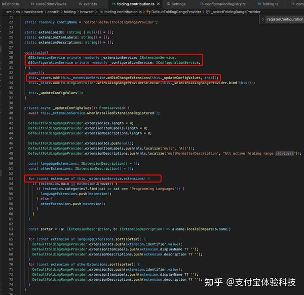

  * 直接通过`editor.getContribution`获取的方式，语雀编辑器里的 service 是类似这部分的实现的实现

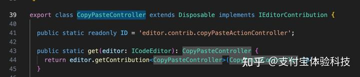

### 总结

  * Register 模式，功能的提供方和使用方都是 contrib，类型是通过调用时手动传递具体的范型来获得的。
    * 框架通过 Register 模块提供了一种功能的注册机制
    * contrib 里一些插件使用 register 扩展具体的可注册的功能 xxxRegister，譬如用户配置项能力
    * contrib 里另一些插件引用这些具体的 xxxRegister 来使用，注册配置化的能容，譬如具体用户配置项菜单

  * 基于 Register，具体的功能 contrib 还拓展了 registerCommand、registerAction 的上层封装，来配置聚合的更复杂的拓展点 :::

vscode 中主题色、快捷键、菜单栏、用户配置项都是通过 register 机制由扩展点注册到核心模型上的。

contrib 之间可以互相引用，但是框架层不能引用 contrib，我想，如果有框架层需要引入 contrib 拓展的 Register 内容的话，那这个 Register 内容应该提升到框架层来实现吧。

### 资料

  * contrib 的实现：[https://www.wendell.fun/posts/vscode-contrib](https://www.wendell.fun/posts/vscode-contrib)

## 端差异代码的实现

曾经我也有过这个困惑，web、app、小程序等不同端有对同一个功能不同实现的代码，如果管理和使用呢？常规的判断环境 if else 难维护，也会引入其它端的代码导致不必要的包体积。vscode 提供了一些优雅的模式。

每个功能区块如果有端差异，提供不同端的实现方式，但是对外暴露的内容一致，譬如 api 和 service 名。依赖这些功能区块的上层能力是不需要关注底层差异的，直接通过依赖注入的方式指明同一个 serviceId 就好，这个 serviceId 是一份接口声明，不同平台引用的都是相同一份：

```js
import { IClipboardService } from 'vs/platform/clipboard/common/clipboardService';

export class CopyPasteController extends Disposable implements IEditorContribution {
  constructor(
        editor: ICodeEditor,
        @IClipboardService private readonly _clipboardService: IClipboardService,
    ) {}
}

export class DialogHandlerContribution extends Disposable implements IWorkbenchContribution {
  constructor(
        @IClipboardService clipboardService: IClipboardService,
    ) {}
}
```

在打包不同平台上的 vscode 时，注入不同的 clipboardService：

```js
import 'vs/workbench/services/clipboard/browser/clipboardService';
import 'vs/workbench/services/clipboard/electron-sandbox/clipboardService';
```

总的来说，想要让 vscode 在浏览器中运行，只需要修改被注入的服务，然后通过不同的打包入口引入这些服务，无须修改上层代码。

在工程构建阶段，分平台有不同的入口，构建了不同的对应端的代码。

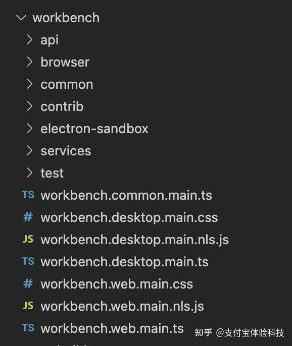

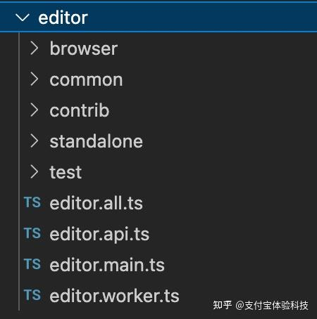

```js
//#region --- workbench services
import 'vs/workbench/services/clipboard/browser/clipboardService';
//#region --- workbench services
import 'vs/workbench/services/clipboard/electron-sandbox/clipboardService';
```

  * 功能模块提供相同的一份 interface，不同端有对应的逻辑实现
  * 功能模块的使用方都是通过相同的依赖注入的模式注入 service，按 interface 规范调用接口，并不关心端的差异
  * IOC 容器也都是不同端分别注入对应端的实现 service，暴露出来的可注入的依赖也完全一致
  * 程序提供不同端的入口，来引入不同端的实现标准。打包程序给不同端提供不同的 bundle 文件。  

由此，没有针对端差异的 if else 逻辑，任何模块都不感知自己依赖的模块的端差异。仅仅做的是入口文件处引入内容不同，最小化了代码和编程成本。  

## 一些巧妙的功能代码片段

记录一些看到的很小的功能点但设计比较巧妙的代码片段，非本篇重点内容，默认折叠。 具体case可展开### 事件泄漏的检测

```js
class LeakageMonitor {
    private _stacks: Map<string, number> | undefined;
    private _warnCountdown: number = 0;

    constructor(
        readonly threshold: number,
        readonly name: string = Math.random().toString(18).slice(2, 5),
    ) { }

    dispose(): void {
        this._stacks?.clear();
    }

    check(stack: Stacktrace, listenerCount: number): undefined | (() => void) {
        const threshold = this.threshold;
        if (threshold <= 0 || listenerCount < threshold) {
            return undefined;
        }
        if (!this._stacks) {
            this._stacks = new Map();
        }

        const count = (this._stacks.get(stack.value) || 0);
        this._stacks.set(stack.value, count + 1);
        this._warnCountdown -= 1;

        if (this._warnCountdown <= 0) {
            // only warn on first exceed and then every time the limit
            // is exceeded by 50% again
            this._warnCountdown = threshold * 0.5;
            // find most frequent listener and print warning
            let topStack: string | undefined;
            let topCount: number = 0;
            for (const [stack, count] of this._stacks) {
                if (!topStack || topCount < count) {
                    topStack = stack;
                    topCount = count;
                }
            }
            console.warn(`[${this.name}] potential listener LEAK detected, having ${listenerCount} listeners already. MOST frequent listener (${topCount}):`);
            console.warn(topStack!);
        }

        return () => {
            const count = (this._stacks!.get(stack.value) || 0);
            this._stacks!.set(stack.value, count - 1);
        };
    }
}

class Stacktrace {
    static create() {
        return new Stacktrace(new Error().stack ?? '');
    }

    private constructor(readonly value: string) { }

    print() {
        console.warn(this.value.split('\n').slice(2).join('\n'));
    }
}
```

注册事件监听函数时会执行下述代码来检测是否调用超出阈值:

```js
if (this._leakageMon && this._listeners.size >= Math.ceil(this._leakageMon.threshold * 0.2)) {
  // check and record this emitter for potential leakage
  stack = Stacktrace.create();
  removeMonitor = this._leakageMon.check(stack, this._listeners.size + 1);
}
```

这里比较巧妙的是对一个方法调用方的识别，同一个事件可能被多个不同的地方触发，怎么确定是来自同一个调用方的频繁调用超出阈值，从而识别出泄漏风险。这里**使用new Error().stack来获得调用上下文的堆栈信息进行format获得唯一标识符，能让代码准确识别运行时的调用方**。

### 多个类的多个实例之间的绑定

类和类的引用之间也可能是网状且非单例的

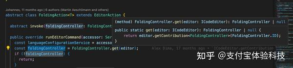

这个case种FoldingController的类暴露了static的get方法，根据传入的editor实例的不同，获取不同editor上挂载的实例化后的自己。

### 单例的自我实例化

定义后立即实例化，并暴露到自己的static属性上，方便使用方调用


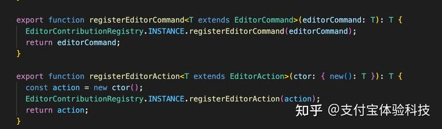

### 延迟/防抖的实现并且提供取消能力

延迟执行一次并且可以取消：

```js
export class RunOnceScheduler implements IDisposable {
    protected runner: ((...args: unknown[]) => void) | null;

    private timeoutToken: any;
    private timeout: number;
    private timeoutHandler: () => void;

    constructor(runner: (...args: any[]) => void, delay: number) {
        this.timeoutToken = -1;
        this.runner = runner;
        this.timeout = delay;
        this.timeoutHandler = this.onTimeout.bind(this);
    }

    /**
     * Dispose RunOnceScheduler
     */
    dispose(): void {
        this.cancel();
        this.runner = null;
    }

    /**
     * Cancel current scheduled runner (if any).
     */
    cancel(): void {
        if (this.isScheduled()) {
            clearTimeout(this.timeoutToken);
            this.timeoutToken = -1;
        }
    }

    /**
     * Cancel previous runner (if any) & schedule a new runner.
     */
    schedule(delay = this.timeout): void {
        this.cancel();
        this.timeoutToken = setTimeout(this.timeoutHandler, delay);
    }

    get delay(): number {
        return this.timeout;
    }

    set delay(value: number) {
        this.timeout = value;
    }

    /**
     * Returns true if scheduled.
     */
    isScheduled(): boolean {
        return this.timeoutToken !== -1;
    }

    flush(): void {
        if (this.isScheduled()) {
            this.cancel();
            this.doRun();
        }
    }

    private onTimeout() {
        this.timeoutToken = -1;
        if (this.runner) {
            this.doRun();
        }
    }

    protected doRun(): void {
        this.runner?.();
    }
}
```

类似debounce但支持取消的能力：

```js
/**
 * A helper to delay (debounce) execution of a task that is being requested often.
 *
 * Following the throttler, now imagine the mail man wants to optimize the number of
 * trips proactively. The trip itself can be long, so he decides not to make the trip
 * as soon as a letter is submitted. Instead he waits a while, in case more
 * letters are submitted. After said waiting period, if no letters were submitted, he
 * decides to make the trip. Imagine that N more letters were submitted after the first
 * one, all within a short period of time between each other. Even though N+1
 * submissions occurred, only 1 delivery was made.
 *
 * The delayer offers this behavior via the trigger() method, into which both the task
 * to be executed and the waiting period (delay) must be passed in as arguments. Following
 * the example:
 *
 *      const delayer = new Delayer(WAITING_PERIOD);
 *      const letters = [];
 *
 *      function letterReceived(l) {
 *          letters.push(l);
 *          delayer.trigger(() => { return makeTheTrip(); });
 *      }
 */
export class Delayer<T> implements IDisposable {
    private deferred: IScheduledLater | null;
    private completionPromise: Promise<any> | null;
    private doResolve: ((value?: any | Promise<any>) => void) | null;
    private doReject: ((err: any) => void) | null;
    private task: ITask<T | Promise<T>> | null;

    constructor(public defaultDelay: number | typeof MicrotaskDelay) {
        this.deferred = null;
        this.completionPromise = null;
        this.doResolve = null;
        this.doReject = null;
        this.task = null;
    }

    trigger(task: ITask<T | Promise<T>>, delay = this.defaultDelay): Promise<T> {
        this.task = task;
        this.cancelTimeout();
        if (!this.completionPromise) {
            this.completionPromise = new Promise((resolve, reject) => {
                this.doResolve = resolve;
                this.doReject = reject;
            }).then(() => {
                this.completionPromise = null;
                this.doResolve = null;
                if (this.task) {
                    const task = this.task;
                    this.task = null;
                    return task();
                }
                return undefined;
            });
        }
        const fn = () => {
            this.deferred = null;
            this.doResolve?.(null);
        };
        this.deferred = delay === MicrotaskDelay ? microtaskDeferred(fn) : timeoutDeferred(delay, fn);
        return this.completionPromise;
    }

    isTriggered(): boolean {
        return !!this.deferred?.isTriggered();
    }

    cancel(): void {
        this.cancelTimeout();
        if (this.completionPromise) {
            this.doReject?.(new CancellationError());
            this.completionPromise = null;
        }
    }

    private cancelTimeout(): void {
        this.deferred?.dispose();
        this.deferred = null;
    }

    dispose(): void {
        this.cancel();
    }
}
```

### 有优先级的RAF

```js
/**
 * Schedule a callback to be run at the next animation frame.
 * This allows multiple parties to register callbacks that should run at the next animation frame.
 * If currently in an animation frame, `runner` will be executed immediately.
 * @return token that can be used to cancel the scheduled runner (only if `runner` was not executed immediately).
 */
export let runAtThisOrScheduleAtNextAnimationFrame: (runner: () => void, priority?: number) => IDisposable;

/**
 * Schedule a callback to be run at the next animation frame.
 * This allows multiple parties to register callbacks that should run at the next animation frame.
 * If currently in an animation frame, `runner` will be executed at the next animation frame.
 * @return token that can be used to cancel the scheduled runner.
 */
export let scheduleAtNextAnimationFrame: (runner: () => void, priority?: number) => IDisposable;

class AnimationFrameQueueItem implements IDisposable {
    private _runner: () => void;
    public priority: number;
    private _canceled: boolean;

    constructor(runner: () => void, priority: number = 0) {
        this._runner = runner;
        this.priority = priority;
        this._canceled = false;
    }

    public dispose(): void {
        this._canceled = true;
    }

    public execute(): void {
        if (this._canceled) {
            return;
        }
        try {
            this._runner();
        } catch (e) {
            onUnexpectedError(e);
        }
    }

    // Sort by priority (largest to lowest)
    public static sort(a: AnimationFrameQueueItem, b: AnimationFrameQueueItem): number {
        return b.priority - a.priority;
    }
}

(function () {
    /**
     * The runners scheduled at the next animation frame
     */
    let NEXT_QUEUE: AnimationFrameQueueItem[] = [];

    /**
     * The runners scheduled at the current animation frame
     */
    let CURRENT_QUEUE: AnimationFrameQueueItem[] | null = null;

    /**
     * A flag to keep track if the native requestAnimationFrame was already called
     */
    let animFrameRequested = false;

    /**
     * A flag to indicate if currently handling a native requestAnimationFrame callback
     */
    let inAnimationFrameRunner = false;

    const animationFrameRunner = () => {
        animFrameRequested = false;
        CURRENT_QUEUE = NEXT_QUEUE;
        NEXT_QUEUE = [];
        inAnimationFrameRunner = true;
        while (CURRENT_QUEUE.length > 0) {
            CURRENT_QUEUE.sort(AnimationFrameQueueItem.sort);
            const top = CURRENT_QUEUE.shift()!;
            top.execute();
        }
        inAnimationFrameRunner = false;
    };

    scheduleAtNextAnimationFrame = (runner: () => void, priority: number = 0) => {
        const item = new AnimationFrameQueueItem(runner, priority);
        NEXT_QUEUE.push(item);
        if (!animFrameRequested) {
            animFrameRequested = true;
            requestAnimationFrame(animationFrameRunner);
        }
        return item;
    };

    runAtThisOrScheduleAtNextAnimationFrame = (runner: () => void, priority?: number) => {
        if (inAnimationFrameRunner) {
            const item = new AnimationFrameQueueItem(runner, priority);
            CURRENT_QUEUE!.push(item);
            return item;
        } else {
            return scheduleAtNextAnimationFrame(runner, priority);
        }
    };
})();

export function measure(callback: () => void): IDisposable {
    return scheduleAtNextAnimationFrame(callback, 10000 /* must be early */);
}

export function modify(callback: () => void): IDisposable {
    return scheduleAtNextAnimationFrame(callback, -10000 /* must be late */);
}
```

给requestAnimationFrame加上优先级，来控制同一个事件队列里任务的先后场景，一个典型的场景是实现dom的先查measure后改modify，**在当前的animation frame查询，下一个animation frame修改，避免在一个frame里又查又改造成大量回流带来的性能问题**。

## 其它

vscode 中还有很多优秀的设计，不是我特别关心的内容我也没一一读源码，就不 po 代码了，仅用文字再列举一些。

### ✨进程的管理

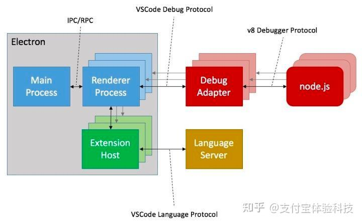

新的进程的在 vscode 这里似乎是不要钱的，乍一看设计的非常激进：

  * 主进程管理软件生命周期、窗口管理、各进程通信等
  * 每个渲染窗口一个独立进程（UI相关）
  * 每个插件一个独立进程
  * 还有一些功能进程如 debugger 进程

然而性能却出奇的好，通过进程强隔离做到了：

  * 任何窗口都是独立的，挂了不影响其他的。浏览器窗口也是这样
  * 任何一个插件也是独立的，挂了也不影响全局
  * 主进程和激活窗口的渲染进程优先级最高，可以最快速度渲染出编辑器 code 内容，然后 ts 语言着色、eslint、git 等等插件进程再工作，增强能力。让用户等的不是那么久，可以最快看到内容，**有比较好的体验**。
  * **插件进程不能直接访问渲染进程，插件也就不能访问 UI 内容，只能通过框架提供的API依靠进程通信来访问有限的内容，安全稳定，界面一致。非常适合 vscode 这种界面设计要求高度统一并且稳定的产品**。毕竟用户肯定不想装个插件页面就变得不一样不知道怎么用了的意外。如果实在是要有灵活性还有 webview 能力的兜底。

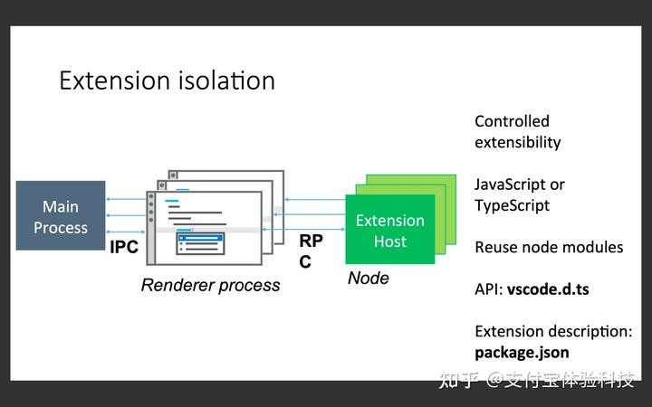

### 命令系统

命令是一种很好的模式，vscode 的命令设计和大多数框架的设计基本类似，没有过多可说的。

### 配置化

插件的很多能力都是配置化的，包括内置的一批语言插件的语法特性都是，贴一段 css 语言的感受一下：

```js
"contributes": {
    "languages": [
      {
        "id": "css",
        "aliases": [
          "CSS",
          "css"
        ],
        "extensions": [
          ".css"
        ],
        "mimetypes": [
          "text/css"
        ],
        "configuration": "./language-configuration.json"
      }
    ],

    "grammars": [
      {
        "language": "css",
        "scopeName": "source.css",
        "path": "./syntaxes/css.tmLanguage.json",
        "tokenTypes": {
          "meta.function.url string.quoted": "other"
        }
      }
    ]
  },
{
    "comments": {
        "blockComment": ["/*", "*/"]
    },

    "brackets": [
        ["{", "}"],
        ["[", "]"],
        ["(", ")"]
    ],

    "autoClosingPairs": [
        { "open": "{", "close": "}", "notIn": ["string", "comment"] },
        { "open": "[", "close": "]", "notIn": ["string", "comment"] },
        { "open": "(", "close": ")", "notIn": ["string", "comment"] },
        { "open": "\"", "close": "\"", "notIn": ["string", "comment"] },
        { "open": "'", "close": "'", "notIn": ["string", "comment"] }
    ],

    "surroundingPairs": [
        ["{", "}"],
        ["[", "]"],
        ["(", ")"],
        ["\"", "\""],
        ["'", "'"]
    ],

    "folding": {
        "markers": {
            "start": "^\\s*\\/\\*\\s*#region\\b\\s*(.*?)\\s*\\*\\/",
            "end": "^\\s*\\/\\*\\s*#endregion\\b.*\\*\\/"
        }
    },

    "indentationRules": {
        "increaseIndentPattern": "(^.*\\{[^}]*$)",
        "decreaseIndentPattern": "^\\s*\\}"
    },

    "wordPattern": "(#?-?\\d*\\.\\d\\w*%?)|(::?[\\w-]*(?=[^,{;]*[,{]))|(([@#.!])?[\\w-?]+%?|[@#!.])"
}
```

还有一些 commands 的配置、UI 层的控制：

```js
{
  "contributes": {
    "commands": [
      {
        "command": "myExtension.sayHello",
        "title": "Say Hello"
      }
    ],

    // ui层的tree-view
    "views": {
      "explorer": [
        {
          "id": "nodeDependencies",
          "name": "Node Dependencies"
        }
      ]
    }
  }
}
```

这些框架层已经严格限制了内容，插件层的拓展用配置，相对于用编程模式的命令式注册，可以减少大量的模版代码，并且更加收拢聚焦。

###  language service protocol （LSP）

上面的配置环节可见到一款语言特性可以通过配置实现，那么内部是怎么做到的呢？这是最令我震惊的设计部分，完全体现了一个团队在技术产品设计上的高度。

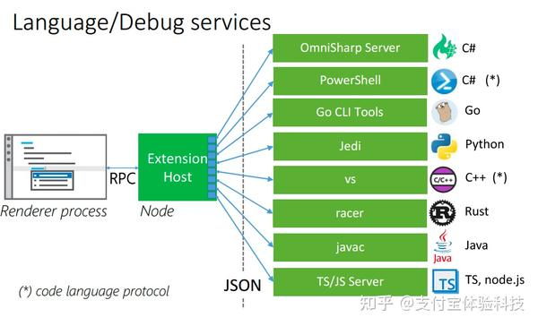  

让我们想想编辑器里语言着色、关键词识别、代码对识别来补全、锁进 等这些编程语言特征是怎么做到的？在没了解这部分之前，我以为是每种语言都有对应的内部插件，解析 ast 来获得这些信息。

但是真相是，**vscode 制定了通用的通信协议来支持多种语言，每种语言自行实现逻辑。而且也不是靠解析 ast 这么高成本的方式，而是每种语言通过配置定义了补全组、缩进、折叠、token 这些基础语言特性后**，**靠正则匹配这种快捷的方式进行的**。这样的设计做到了足够通用可扩展，并且性能优异。

这些对我来说都是魔法特性了：

  * 通过配置就能生成基础的语言特性，譬如补全组、缩进、折叠、token 的识别、enter 键按下后的行为：[https://code.visualstudio.com/api/language-extensions/language-configuration-guide](https://code.visualstudio.com/api/language-extensions/language-configuration-guide)
  * Language Server Extension： 你可以实现自动补全 autocomplete, 错误检查 error-checking (diagnostics), 跳转到定义 jump-to-definition：[https://code.visualstudio.com/api/language-extensions/language-server-extension-guide](https://code.visualstudio.com/api/language-extensions/language-server-extension-guide)

由于 VSC 采用多进程的架构，语言的开发者可以使用自己熟悉的语言编写这门语言的语言服务，VSC 将采用 JSON-RPC 通信的方式跟语言服务沟通，执行用户命令，获取结果。

再来看看 LSP 内容的设计：

> LSP 关心的是用户在编辑代码时最经常处理的物理实体（比如文件、目录）和状态（光标位置）。它根本没有试图去理解语言的特性，编译也不是它所关心的问题，没有涉及
AST。  

LSP 最重要的概念是动作和位置，LSP 的大部分请求都是在表达”在指定位置执行规定动作“。举个栗子，用户把鼠标悬停在某个类名上方，查看相关的定义和文档。这时 VS Code 会发送一个['text Document/hover'](https://microsoft.github.io/language-server-protocol/specification%23textDocument_hover)请求给 LS，这个请求里最关键的信息就是当前的文档和光标的位置。LS 收到请求之后，经过一系列内部计算（识别出光标位置所对应的符号，并找出相关文档），找出相关的信息，然后发回给 VS Code 显示给用户看。这样一来一回的交互，在 LSP 里被抽象成请求(Request)和回复(Response)，LSP 同时也规定了它们的规格(Schema)。在开发者看来，概念非常少，交互形式也很简单，实现起来非常轻松。

通过这一套标准，实现了各种语言在编辑器里非常好用一致的跳转行为：

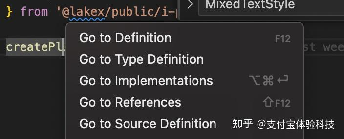
  
### 技术产品的设计

要祭出这张 vscode 经典的产品定位图了：

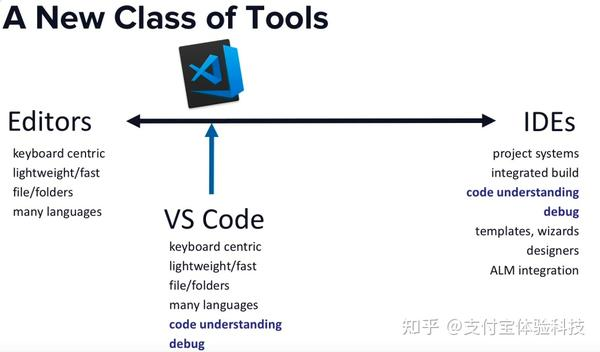

其实工程师也是离产品很近的一个岗位，小到一个组件对外 props、method 的设计，大到一款框架、工具、技术产品，哪些内容暴露哪些内容隐藏，做什么不做什么，核心功能是什么，附加拓展的增强能力又是什么，如何让用户高效低成本的使用，如何让它们进化良性发展，无不考验着我们的产品设计能力。

vscode 代码翻下来，除了一些技术实现上的“术”层面的内容让我学习借鉴，更是对他在产品设计“法”层面的内容有醍醐灌顶感，譬如：

  * 定位是编辑器内容 + 编程语言感知 + debugger 能力
  * 编辑器核心能力和插件扩展能力的划分
  * LSP、DAP 这些规范的设计
  * 极度克制的 UI 层内容的暴露
  * remote development、web IDE 这些前瞻性的产品能力

不过从代码层面看，可能每一款复杂的产品最终代码都谈不上多优雅明了，vscode 的代码也有很多晦涩难懂绕来绕去的地方 。

vscode 目前是主流的编辑器了，无疑在产品上是很成功的，社区也贡献了丰富的 vscode 插件来不断增强能力，到现在还有 copilot 的 AI 辅助能力加持，从好用升级到智能。开源后，大家也基于它二次开发生产了众多的 code web IDE、游戏编辑器、3D 编辑器等各种产品。无疑贡献重大，值得我们学习，值得致敬。
