 
<!--BEGIN_DATA
{
    "create_date": "2020-12-21 15:22", 
    "modify_date": "2020-12-21 15:22", 
    "is_top": "0", 
    "summary": "从fishhook第三方库学到的知识", 
    "tags": "iOS、C/C++、系统", 
    "file_name": "从fishhook第三方库学到的知识.md"
}
END_DATA-->

#### <p>原文出处：<a href='https://mp.weixin.qq.com/s/-vK9kx8JEiIJWRlmYu5sqw' target='blank'>从fishhook第三方库学到的知识</a></p>


### 背景

在写监控App启动时间的博客之前，发现有一个知识点，还是要讲解梳理一下，毕竟在监控App启动时间优化之前要用到一个知识点- Hook技术。  

在逆向开发中是指改变程序运行流程的技术，通过Hook可以让自己的代码运行在别人的程序中。需要了解其Hook原理，这样就能够对恶意代码攻击进行有效的防护。

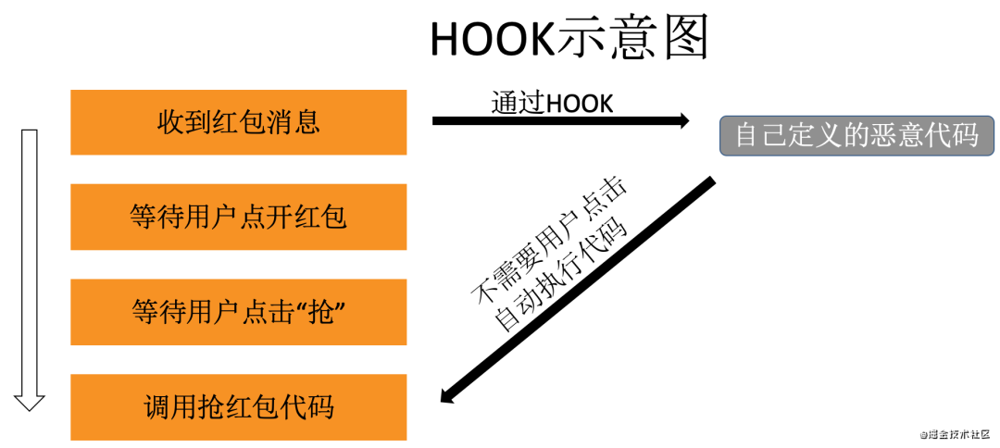

### Hook方案

#### 2.1 Method Swizzle方式

Method Swizzle，是利用OC的Runtime的特性，去动态改变SEL(方法编号)与IMP(方法实现)的对应关系，达到OC方法调用流程更改的目的。也是主要用于OC方法。

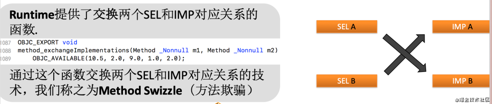

#### 2.2 fishhook

fishHook是Facebook提供的一个动态修改链接mach-O文件的工具。fishhook 的强大之处在于它可以 HOOK 系统的静态 C 函数。  

本篇我们着重讲解一下fishhook的源码和原理知识，下一篇讲解启动时间监控方面的内容。

### fishhook原理

> 利用MachO文件加载原理，通过修改懒加载表(Lazy Symbol Pointers)和非懒加载表(Non-Lazy Symbol Pointers)这两个表的指针达到C函数HOOK的目的。

#### 3.1 前提

在分析fishhook原理之前，先来问两个问题：

##### 3.1.1 MachO文件加载

> 在程序启动的时候 Mach-O 文件会被 DYLD （动态加载器）加载进内存。加载完 Mach-O 后，DYLD接着会去加载 Mach-O 所依赖的动态库。

##### 3.1.2 ASLR技术

地址空间布局随机化。会让 Mach-O 文件加载的时候是随机地址。有了这个技术，Mach-O 文件每次加载进内存的时候地址都是不一样的。主要是为了防止逆向技术。

Mach-O 文件里只有我们自己写的函数，系统的动态库的函数是不在 Mach-O 文件里的。也就是说每次启动从 Mach-O文件到系统动态库函数的偏移地址都是变化的。

##### 3.1.3 MachO链接函数地址

苹果为了能在 Mach-O 文件中访问外部函数，采用了一个技术，叫做PIC（位置代码独立）技术。

> PIC技术
>
> C语言是静态的,也就是说,在编译的时候就已经确定了函数的地址。而系统的函数由于共享缓存库的存在,必须是dyld加载的时候(运行时)才能确定,这明显存在矛盾。为了解决这个问题,苹果针对Mach-O文件提供了一种PIC技术,即在MatchO的_Data段中添加懒加载表(Lazy Symbol Pointers)和非懒加载表(Non-Lazy Symbol Pointers)这两个表,让系统的函数在编译的时候先指向懒加载表(Lazy Symbol Pointers)或非懒加载表(Non-Lazy Symbol Pointers)中的符号地址,这两个表中的符号的地址的指向在编译的时候并没有指向任何地方,app启动,被dyld加载到内存,就进行链接, 给这2个表赋值动态缓存库的地址进行符号绑定。

当应用程序想要调用 Mach-O 文件外部的函数的时候，或者说如果 Mach-O 内部需要调用系统的库函数时，Mach-O 文件会：

  * 先在 Mach-O 文件的 _DATA 段中建立一个指针（8字节的数据，放的全是0），这个指针变量指向外部函数。 
  * DYLD 会动态的进行绑定！将 Mach-O 中的 _DATA 段中的指针，指向外部函数。

所以说，C的底层也有动态的表现。C在内部函数的时候是静态的，在编译后，函数的内存地址就确定了。但是，外部的函数是不能确定的，也就是说C的底层也有动态的。fishhook 之所以能 hook C函数，是利用了 Mach-O 文件的 PIC 技术特点。也就造就了静态语言C也有动态的部分，通过 DYLD进行动态绑定的时候做了手脚。

##### 3.1.4 fishhook原理

经常说符号，其实 _DATA 段中建立的指针就是符号。fishhook的原理其实就是，将指向系统方法（外部函数）的符号重新进行绑定指向内部的函数。这样就把系统方法与自己定义的方法进行了交换。这也就是为什么C的内部函数修改不了，自定义的函数修改不了，只能修改 Mach-O 外部【共享缓存库中】的函数。  

#### 3.2  源码

通过fishhook的官方文档可以知道，fishhook的使用方法大致如下：

```cpp
#import <dlfcn.h>  
#import <UIKit/UIKit.h>  
#import "AppDelegate.h"  
#import "fishhook.h"  
    
static int (*orig_close)(int);  
static int (*orig_open)(const char *, int, ...);  
    
int my_close(int fd) {  
  printf("Calling real close(%d)\n", fd);  
  return orig_close(fd);  
}  
    
int my_open(const char *path, int oflag, ...) {  
  va_list ap = {0};  
  mode_t mode = 0;  
    
  if ((oflag & O_CREAT) != 0) {  
    // mode only applies to O_CREAT  
    va_start(ap, oflag);  
    mode = va_arg(ap, int);  
    va_end(ap);  
    printf("Calling real open('%s', %d, %d)\n", path, oflag, mode);  
    return orig_open(path, oflag, mode);  
  } else {  
    printf("Calling real open('%s', %d)\n", path, oflag);  
    return orig_open(path, oflag, mode);  
  }  
}  
    
int main(int argc, char * argv[])  
{  
  @autoreleasepool {  
    rebind_symbols((struct rebinding[2]){{"close", my_close, (void *)&orig_close}, {"open", my_open, (void *)&orig_open}}, 2);  
    
    // Open our own binary and print out first 4 bytes (which is the same  
    // for all Mach-O binaries on a given architecture)  
    int fd = open(argv[0], O_RDONLY);  
    uint32_t magic_number = 0;  
    read(fd, &magic_number, 4);  
    printf("Mach-O Magic Number: %x \n", magic_number);  
    close(fd);  
    
    return UIApplicationMain(argc, argv, nil, NSStringFromClass([AppDelegate class]));  
  }  
}  
```

##### 3.2.1 入口函数

先从函数的入口，rebind_symbols开始谈起吧，rebind_symbols主要是使用_dyld_register_func_for_add_image来注册回调函数，在加载动态库的时候执行一些操作

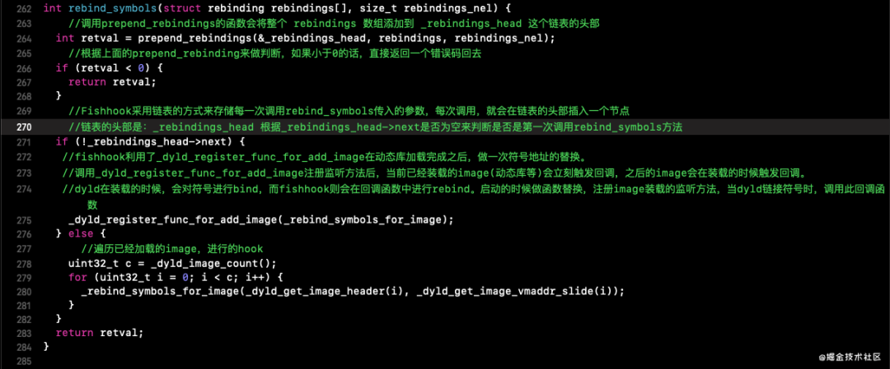

补充：链表结构体【保存的是我们要交换的函数所带信息的结构体数据】

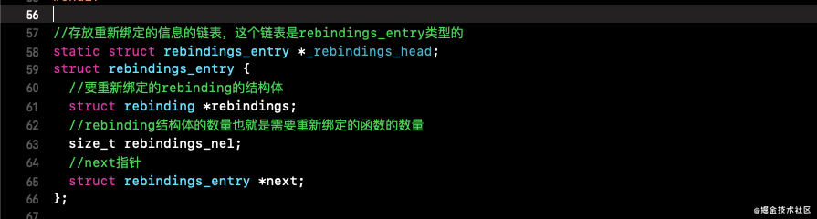

##### 3.2.2 prepend_rebindings

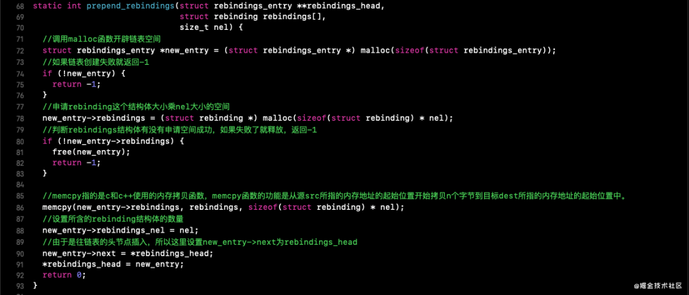

##### 3.2.3 入口函数中_rebind_symbols_for_image

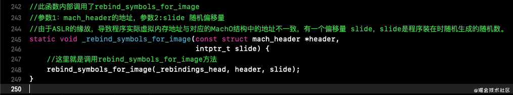

##### 3.2.4 看下rebind_symbols_for_image函数，先看一部分

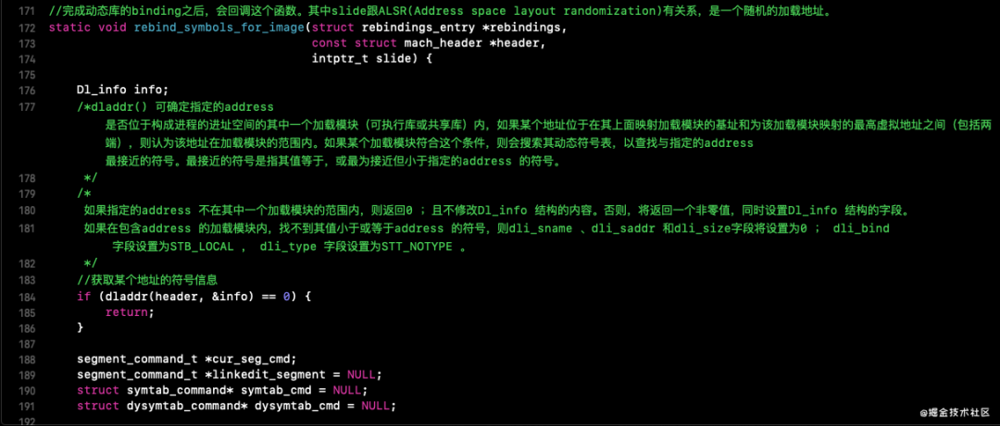

##### 3.2.5 接下来就是去寻找****LINKEDIT和LC_SYMTAB以及LC_DYSYMTAB【下一部分】

就是下面图三部分：

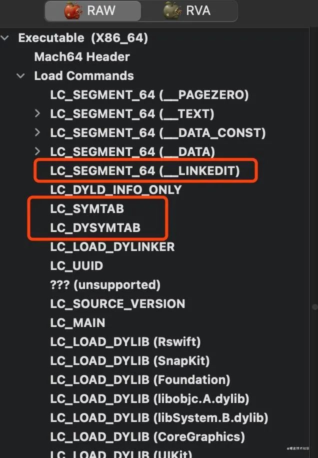

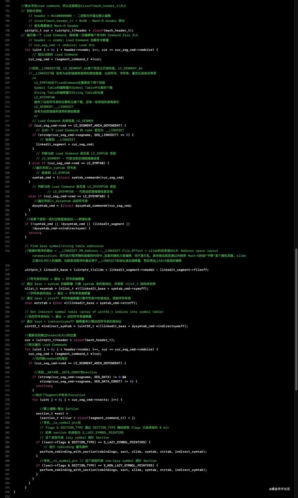

##### 3.2.6 寻找到section之后就要去调用perform_rebinding_with_section函数。

下面我们就看看这个函数，上面之所以说`__nl_symbol_ptr`和`__la_symbol_ptr`的概念是因为`__DATA`区有两个section和动态符号链接相关：`__nl_symbol_ptr`、`__la_symbol_ptr`。`__nl_symbol_ptr`为一个指针数组，直接对应non-lazy绑定数据。`__la_symbol_ptr`也是一个指针数组，通过dyld_stub_binder进行链接实现。  

下面看下`perform_rebinding_with_section`函数

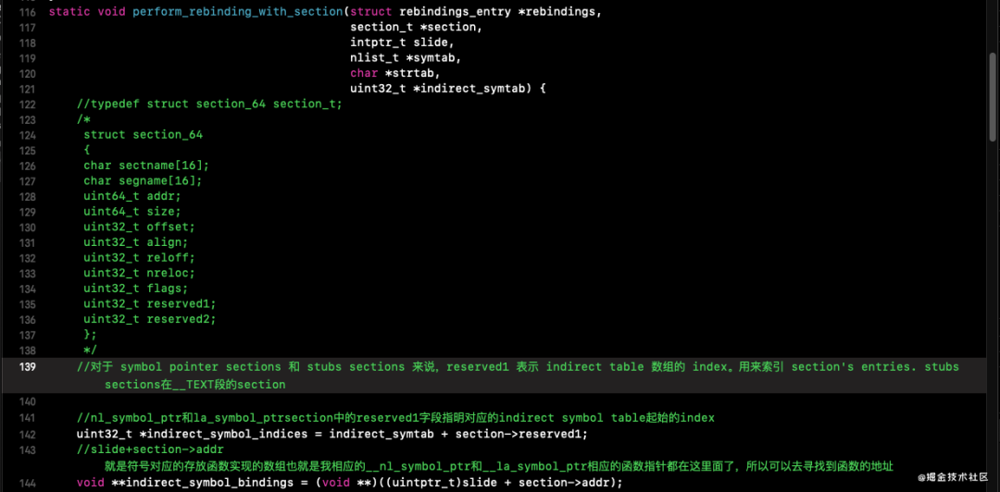

到了这里其实void indirect_symbol_bindings = (void )((uintptr_t)slide + section->addr);找到的就是

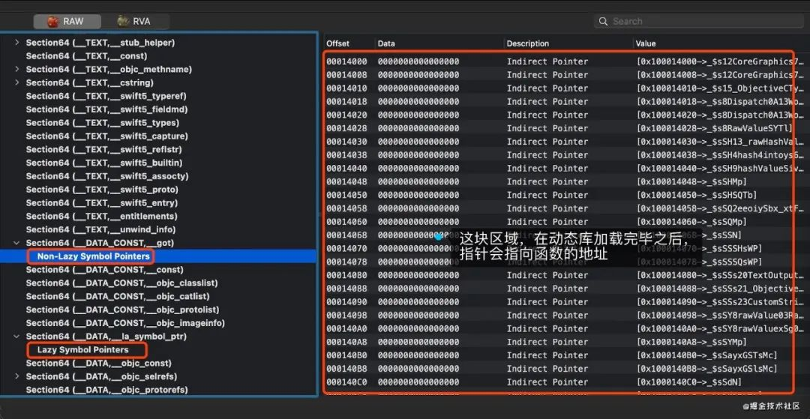

所以下面进行遍历交换

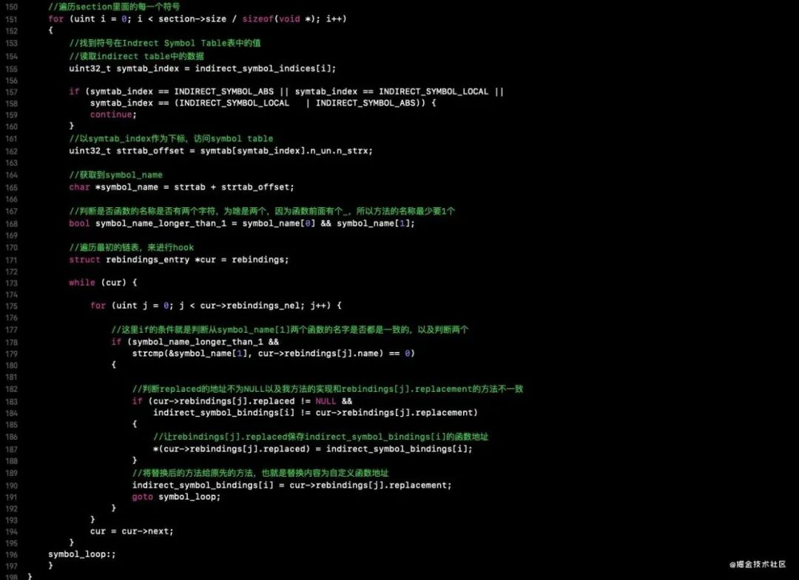

##### 3.2.7 关于源码的全部注解如下：

```cpp
#include "fishhook.h"  
#include <dlfcn.h>  
#include <stdbool.h>  
#include <stdlib.h>  
#include <string.h>  
#include <sys/mman.h>  
#include <sys/types.h>  
#include <mach/mach.h>  
#include <mach/vm_map.h>  
#include <mach/vm_region.h>  
#include <mach-o/dyld.h>  
#include <mach-o/loader.h>  
#include <mach-o/nlist.h>  
  
#ifdef __LP64__  
typedef struct mach_header_64 mach_header_t;  
typedef struct segment_command_64 segment_command_t;  
typedef struct section_64 section_t;  
typedef struct nlist_64 nlist_t;  
#define LC_SEGMENT_ARCH_DEPENDENT LC_SEGMENT_64  
#else  
typedef struct mach_header mach_header_t;  
typedef struct segment_command segment_command_t;  
typedef struct section section_t;  
typedef struct nlist nlist_t;  
#define LC_SEGMENT_ARCH_DEPENDENT LC_SEGMENT  
#endif  
  
#ifndef SEG_DATA_CONST  
#define SEG_DATA_CONST  "__DATA_CONST"  
#endif  
  
//存放重新绑定的信息的链表，这个链表是rebindings_entry类型的  
static struct rebindings_entry *_rebindings_head;  
struct rebindings_entry {  
  //要重新绑定的rebinding的结构体  
  struct rebinding *rebindings;  
  //rebinding结构体的数量也就是需要重新绑定的函数的数量  
  size_t rebindings_nel;  
  //next指针  
  struct rebindings_entry *next;  
};  
  
static int prepend_rebindings(struct rebindings_entry **rebindings_head,  
                              struct rebinding rebindings[],  
                              size_t nel) {  
  //调用malloc函数开辟链表空间  
  struct rebindings_entry *new_entry = (struct rebindings_entry *) malloc(sizeof(struct rebindings_entry));  
  //如果链表创建失败就返回-1  
  if (!new_entry) {  
    return -1;  
  }  
  //申请rebinding这个结构体大小乘nel大小的空间  
  new_entry->rebindings = (struct rebinding *) malloc(sizeof(struct rebinding) * nel);  
  //判断rebindings结构体有没有申请空间成功，如果失败了就释放，返回-1  
  if (!new_entry->rebindings) {  
    free(new_entry);  
    return -1;  
  }  
      
  //memcpy指的是c和c++使用的内存拷贝函数，memcpy函数的功能是从源src所指的内存地址的起始位置开始拷贝n个字节到目标dest所指的内存地址的起始位置中。  
  memcpy(new_entry->rebindings, rebindings, sizeof(struct rebinding) * nel);  
  //设置所含的rebinding结构体的数量  
  new_entry->rebindings_nel = nel;  
  //由于是往链表的头节点插入，所以这里设置new_entry->next为rebindings_head  
  new_entry->next = *rebindings_head;  
  *rebindings_head = new_entry;  
  return 0;  
}  
  
static vm_prot_t get_protection(void *sectionStart) {  
  mach_port_t task = mach_task_self();  
  vm_size_t size = 0;  
  vm_address_t address = (vm_address_t)sectionStart;  
  memory_object_name_t object;  
#if __LP64__  
  mach_msg_type_number_t count = VM_REGION_BASIC_INFO_COUNT_64;  
  vm_region_basic_info_data_64_t info;  
  kern_return_t info_ret = vm_region_64(  
      task, &address, &size, VM_REGION_BASIC_INFO_64, (vm_region_info_64_t)&info, &count, &object);  
#else  
  mach_msg_type_number_t count = VM_REGION_BASIC_INFO_COUNT;  
  vm_region_basic_info_data_t info;  
  kern_return_t info_ret = vm_region(task, &address, &size, VM_REGION_BASIC_INFO, (vm_region_info_t)&info, &count, &object);  
#endif  
  if (info_ret == KERN_SUCCESS) {  
    return info.protection;  
  } else {  
    return VM_PROT_READ;  
  }  
}  

static void perform_rebinding_with_section(struct rebindings_entry *rebindings,  
                                            section_t *section,  
                                            intptr_t slide,  
                                            nlist_t *symtab,  
                                            char *strtab,  
                                            uint32_t *indirect_symtab) {  
    //typedef struct section_64 section_t;  
    /*  
      struct section_64  
      {  
      char sectname[16];  
      char segname[16];  
      uint64_t addr;  
      uint64_t size;  
      uint32_t offset;  
      uint32_t align;  
      uint32_t reloff;  
      uint32_t nreloc;  
      uint32_t flags;  
      uint32_t reserved1;  
      uint32_t reserved2;  
      };  
      */  
    //对于 symbol pointer sections 和 stubs sections 来说，reserved1 表示 indirect table 数组的 index。用来索引 section's entries. stubs sections在__TEXT段的section  
      
    //nl_symbol_ptr和la_symbol_ptrsection中的reserved1字段指明对应的indirect symbol table起始的index  
    uint32_t *indirect_symbol_indices = indirect_symtab + section->reserved1;  
    //slide+section->addr 就是符号对应的存放函数实现的数组也就是我相应的__nl_symbol_ptr和__la_symbol_ptr相应的函数指针都在这里面了，所以可以去寻找到函数的地址  
    void **indirect_symbol_bindings = (void **)((uintptr_t)slide + section->addr);  
    vm_prot_t oldProtection = VM_PROT_READ;  
    if (isDataConst) {  
        oldProtection = get_protection(rebindings);  
        mprotect(indirect_symbol_bindings, section->size, PROT_READ | PROT_WRITE);  
    }  
    //遍历section里面的每一个符号  
    for (uint i = 0; i < section->size / sizeof(void *); i++)  
    {  
        //找到符号在Indrect Symbol Table表中的值  
        //读取indirect table中的数据  
        uint32_t symtab_index = indirect_symbol_indices[i];  
          
        if (symtab_index == INDIRECT_SYMBOL_ABS || symtab_index == INDIRECT_SYMBOL_LOCAL ||  
            symtab_index == (INDIRECT_SYMBOL_LOCAL   | INDIRECT_SYMBOL_ABS)) {  
            continue;  
        }  
        //以symtab_index作为下标，访问symbol table  
        uint32_t strtab_offset = symtab[symtab_index].n_un.n_strx;  
          
        //获取到symbol_name  
        char *symbol_name = strtab + strtab_offset;  
          
        //判断是否函数的名称是否有两个字符，为啥是两个，因为函数前面有个_，所以方法的名称最少要1个  
        bool symbol_name_longer_than_1 = symbol_name[0] && symbol_name[1];  
          
        //遍历最初的链表，来进行hook  
        struct rebindings_entry *cur = rebindings;  
          
        while (cur) {  
              
            for (uint j = 0; j < cur->rebindings_nel; j++) {  
                  
                //这里if的条件就是判断从symbol_name[1]两个函数的名字是否都是一致的，以及判断两个  
                if (symbol_name_longer_than_1 &&  
                    strcmp(&symbol_name[1], cur->rebindings[j].name) == 0)  
                {  
                      
                    //判断replaced的地址不为NULL以及我方法的实现和rebindings[j].replacement的方法不一致  
                    if (cur->rebindings[j].replaced != NULL &&  
                        indirect_symbol_bindings[i] != cur->rebindings[j].replacement)  
                    {  
                        //让rebindings[j].replaced保存indirect_symbol_bindings[i]的函数地址  
                        *(cur->rebindings[j].replaced) = indirect_symbol_bindings[i];  
                    }  
                    //将替换后的方法给原先的方法，也就是替换内容为自定义函数地址  
                    indirect_symbol_bindings[i] = cur->rebindings[j].replacement;  
                    goto symbol_loop;  
                }  
            }  
            cur = cur->next;  
        }  
    symbol_loop:;  
    }  
}  

//完成动态库的binding之后，会回调这个函数。其中slide跟ALSR(Address space layout randomization)有关系，是一个随机的加载地址。  
static void rebind_symbols_for_image(struct rebindings_entry *rebindings,  
                                      const struct mach_header *header,  
                                      intptr_t slide) {  
      
    Dl_info info;  
    /*dladdr() 可确定指定的address 是否位于构成进程的进址空间的其中一个加载模块（可执行库或共享库）内，如果某个地址位于在其上面映射加载模块的基址和为该加载模块映射的最高虚拟地址之间（包括两端），  
则认为该地址在加载模块的范围内。如果某个加载模块符合这个条件，则会搜索其动态符号表，以查找与指定的address 最接近的符号。最接近的符号是指其值等于，或最为接近但小于指定的address 的符号。  
      */  
    /*  
      如果指定的address 不在其中一个加载模块的范围内，则返回0 ；且不修改Dl_info 结构的内容。否则，将返回一个非零值，同时设置Dl_info 结构的字段。  
      如果在包含address 的加载模块内，找不到其值小于或等于address 的符号，则dli_sname 、dli_saddr 和dli_size字段将设置为0 ；dli_bind 字段设置为STB_LOCAL ， dli_type 字段设置为STT_NOTYPE 。  
      */  
    //获取某个地址的符号信息  
    if (dladdr(header, &info) == 0) {  
        return;  
    }  
      
    segment_command_t *cur_seg_cmd;  
    segment_command_t *linkedit_segment = NULL;  
    struct symtab_command* symtab_cmd = NULL;  
    struct dysymtab_command* dysymtab_cmd = NULL;  
      
    //要去寻找load command，所以这里跳过sizeof(mach_header_t)大小  
    // 初始化游标  
        // header = 0x100000000 - 二进制文件基址默认偏移  
        // sizeof(mach_header_t) = 0x20 - Mach-O Header 部分  
        // 首先需要跳过 Mach-O Header  
      uintptr_t cur = (uintptr_t)header + sizeof(mach_header_t);  
    // 遍历每一个 Load Command，游标每一次偏移每个命令的 Command Size 大小  
        // header -> ncmds: Load Command 加载命令数量  
        // cur_seg_cmd -> cmdsize: Load 大小  
      for (uint i = 0; i < header->ncmds; i++, cur += cur_seg_cmd->cmdsize) {  
          // 取出当前的 Load Command  
        cur_seg_cmd = (segment_command_t *)cur;  
  
        //找到__LINKEDIT段，LC_SEGMENT_64是个宏定义代表的是，LC_SEGMENT_64  
        //__LINKEDIT段 含有为动态链接库使用的原始数据，比如符号，字符串，重定位表条目等等  
          /*  
            LC_SYMTAB这个LoadCommand主要提供了两个信息  
            Symbol Table的偏移量与Symbol Table中元素的个数  
            String Table的偏移量与String Table的长度  
            LC_DYSYMTAB  
            提供了动态符号表的位移和元素个数，还有一些其他的表格索引  
            LC_SEGMENT.__LINKEDIT  
            含有为动态链接库使用的原始数据  
            */  
          // Load Command 的类型是 LC_SEGMEN  
        if (cur_seg_cmd->cmd == LC_SEGMENT_ARCH_DEPENDENT) {  
            // 比对一下 Load Command 的 name 是否为 __LINKEDIT  
          if (strcmp(cur_seg_cmd->segname, SEG_LINKEDIT) == 0) {  
              // 检索到 __LINKEDIT  
            linkedit_segment = cur_seg_cmd;  
          }  
            // 判断当前 Load Command 是否是 LC_SYMTAB 类型  
            // LC_SEGMENT - 代表当前区域链接器信息  
        } else if (cur_seg_cmd->cmd == LC_SYMTAB) {  
          //遍历寻找lc_symtab 符号表  
            // 检索到 LC_SYMTAB  
          symtab_cmd = (struct symtab_command*)cur_seg_cmd;  
        }  
          // 判断当前 Load Command 是否是 LC_DYSYMTAB 类型  
                  // LC_DYSYMTAB - 代表动态链接器信息区域  
        else if (cur_seg_cmd->cmd == LC_DYSYMTAB) {  
            //遍历寻找lc_dysymtab 动态符号表  
          dysymtab_cmd = (struct dysymtab_command*)cur_seg_cmd;  
        }  
      }  
        //如果下面有一项为空就直接返回---容错处理  
      if (!symtab_cmd || !dysymtab_cmd || !linkedit_segment ||  
          !dysymtab_cmd->nindirectsyms) {  
        return;  
      }  
  
      // Find base symbol/string table addresses  
      //链接时程序的基址 = __LINKEDIT.VM_Address -__LINKEDIT.File_Offset + silde的改变值ASLR：Address space layout randomization，将可执行程序随机装载到内存中,这里的随机只是偏移，而不是打乱，具体做法就是通过内核将 Mach-O的段“平移”某个随机系数。slide 正是ASLR引入的偏移，也就是说程序的基址等于__LINKEDIT的地址减去偏移量，然后再加上ASLR造成的偏移  
  
      uintptr_t linkedit_base = (uintptr_t)slide + linkedit_segment->vmaddr - linkedit_segment->fileoff;  
  
        //符号表的地址 = 基址 + 符号表偏移量  
    // 通过 base + symtab 的偏移量 计算 symtab 表的首地址，并获取 nlist_t 结构体实例  
      nlist_t *symtab = (nlist_t *)(linkedit_base + symtab_cmd->symoff);  
        //字符串表的地址 = 基址 + 字符串表偏移量  
    // 通过 base + stroff 字符表偏移量计算字符表中的首地址，获取字符串表  
      char *strtab = (char *)(linkedit_base + symtab_cmd->stroff);  
  
      // Get indirect symbol table (array of uint32_t indices into symbol table)  
      //动态符号表地址 = 基址 + 动态符号表偏移量  
    // 通过 base + indirectsymoff 偏移量来计算动态符号表的首地址  
      uint32_t *indirect_symtab = (uint32_t *)(linkedit_base + dysymtab_cmd->indirectsymoff);  
  
      //重新回到跳过header头大小的位置  
      cur = (uintptr_t)header + sizeof(mach_header_t);  
      //再次遍历 Load Commands  
      for (uint i = 0; i < header->ncmds; i++, cur += cur_seg_cmd->cmdsize) {  
        cur_seg_cmd = (segment_command_t *)cur;  
          //先判断command的描述  
        if (cur_seg_cmd->cmd == LC_SEGMENT_ARCH_DEPENDENT) {  
  
            //寻找__DATA和__DATA_CONST的section  
          if (strcmp(cur_seg_cmd->segname, SEG_DATA) != 0 &&  
              strcmp(cur_seg_cmd->segname, SEG_DATA_CONST) != 0) {  
            continue;  
          }  
          //标示了Segment中有多少secetion  
          for (uint j = 0; j < cur_seg_cmd->nsects; j++) {  
  
              //算上偏移-取出 Section  
            section_t *sect =  
              (section_t *)(cur + sizeof(segment_command_t)) + j;  
              //寻找__la_symbol_ptr区  
              // flags & SECTION_TYPE 通过 SECTION_TYPE 掩码获取 flags 记录类型的 8 bit  
              // 如果 section 的类型为 S_LAZY_SYMBOL_POINTERS  
              // 这个类型代表 lazy symbol 指针 Section  
            if ((sect->flags & SECTION_TYPE) == S_LAZY_SYMBOL_POINTERS) {  
                // 进行 rebinding 重写操作  
              perform_rebinding_with_section(rebindings, sect, slide, symtab, strtab, indirect_symtab);  
            }  
              //寻找__nl_symbol_ptr // 这个类型代表 non-lazy symbol 指针 Section  
            if ((sect->flags & SECTION_TYPE) == S_NON_LAZY_SYMBOL_POINTERS) {  
              perform_rebinding_with_section(rebindings, sect, slide, symtab, strtab, indirect_symtab);  
            }  
          }  
        }  
      }  
}  
  
//此函数内部调用了rebind_symbols_for_image  
//参数1：mach_header的地址，参数2:slide 随机偏移量  
//由于ASLR的缘故，导致程序实际虚拟内存地址与对应的MachO结构中的地址不一致，有一个偏移量 slide，slide是程序装在时随机生成的随机数。  
static void _rebind_symbols_for_image(const struct mach_header *header,  
                                      intptr_t slide) {  
    //这里就是调用rebind_symbols_for_image方法  
    rebind_symbols_for_image(_rebindings_head, header, slide);  
}  
  
int rebind_symbols_image(void *header,  
                          intptr_t slide,  
                          struct rebinding rebindings[],  
                          size_t rebindings_nel) {  
    struct rebindings_entry *rebindings_head = NULL;  
    int retval = prepend_rebindings(&rebindings_head, rebindings, rebindings_nel);  
    rebind_symbols_for_image(rebindings_head, (const struct mach_header *) header, slide);  
    if (rebindings_head) {  
      free(rebindings_head->rebindings);  
    }  
    free(rebindings_head);  
    return retval;  
}  
  
int rebind_symbols(struct rebinding rebindings[], size_t rebindings_nel) {  
    //调用prepend_rebindings的函数会将整个 rebindings 数组添加到 _rebindings_head 这个链表的头部  
  int retval = prepend_rebindings(&_rebindings_head, rebindings, rebindings_nel);  
    //根据上面的prepend_rebinding来做判断，如果小于0的话，直接返回一个错误码回去  
  if (retval < 0) {  
    return retval;  
  }  
    //Fishhook采用链表的方式来存储每一次调用rebind_symbols传入的参数，每次调用，就会在链表的头部插入一个节点  
    //链表的头部是：_rebindings_head 根据_rebindings_head->next是否为空来判断是否是第一次调用rebind_symbols方法  
  if (!_rebindings_head->next) {  
    //fishhook利用了_dyld_register_func_for_add_image在动态库加载完成之后，做一次符号地址的替换。  
    //调用_dyld_register_func_for_add_image注册监听方法后，当前已经装载的image(动态库等)会立刻触发回调，之后的image会在装载的时候触发回调。  
    //dyld在装载的时候，会对符号进行bind，而fishhook则会在回调函数中进行rebind。启动的时候做函数替换，注册image装载的监听方法，当dyld链接符号时，调用此回调函数  
    _dyld_register_func_for_add_image(_rebind_symbols_for_image);  
  } else {  
      //遍历已经加载的image，进行的hook  
    uint32_t c = _dyld_image_count();  
    for (uint32_t i = 0; i < c; i++) {  
      _rebind_symbols_for_image(_dyld_get_image_header(i), _dyld_get_image_vmaddr_slide(i));  
    }  
  }  
  return retval;  
}  
```

### fishhook实例

#### 4.1 原理探究

##### 4.1.1 代码如下：

```cpp
// rebinding 结构体的定义  
//    struct rebinding {  
//        const char *name; // 需要 HOOK 的函数名称，字符串  
//        void *replacement; // 替换的新函数（函数指针，也就是函数名称）  
//        void **replaced; //  保存原始函数指针变量/地址的指针(它是一个二级指针!)  
//    };  
// C 语言传参是值/址传递的，把它的值/址穿过去，就可以在函数内部修改函数指针变量的值  
  
- (void)viewDidLoad {  
    [super viewDidLoad];  
      NSLog(@"123");  
    //rebinding结构体  
    struct rebinding nslog;  
    nslog.name = "NSLog";// 函数名称  
    nslog.replacement = myNslog; // 新的函数指针  
    nslog.replaced = (void *)&sys_nslog;// 保存原始函数地址的变量的指针  
    //rebinding结构体数组  
    struct rebinding rebs[1] = {nslog};  
    /**  
      * 存放rebinding结构体的数组  
      * 数组的长度  
      */  
    rebind_symbols(rebs, 1);  
}  
//---------------------------------更改NSLog-----------  
//函数指针，用来保存原始的函数地址 (C 语言语法，函数指针类型变量)  
static void(*sys_nslog)(NSString * format,...);  
//定义一个新的函数  
void myNslog(NSString * format,...){  
    format = [format stringByAppendingString:@"勾上了！\n"];  
    //调用原始的  
    sys_nslog(format);  
}  
  
-(void)touchesBegan:(NSSet<UITouch *> *)touches withEvent:(UIEvent *)event  
{  
    NSLog(@"点击了屏幕！！");  
}  
```

##### 4.1.2 运行结果如下：

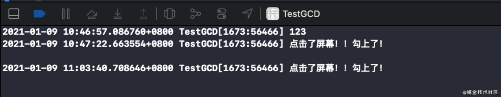

4.1.3 用MachOView打开可执行文件

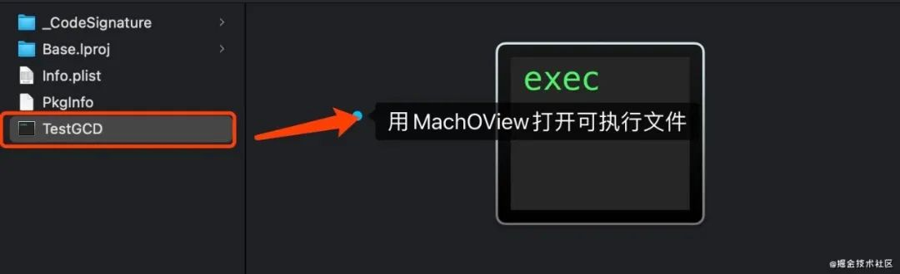

4.1.4 MachOView查看NSLog函数文件的Offset【偏移地址】

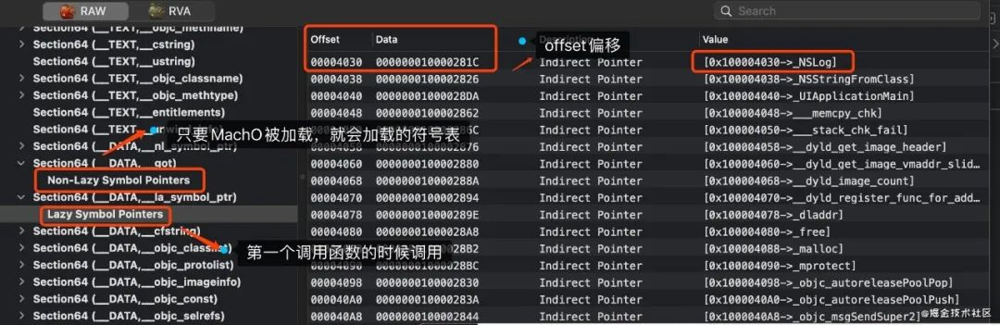

从图看出offset偏移地址为4030，也就是NSLog函数文件的偏移地址，懒加载此表时在Mach-O文件偏移地址+函数偏移的地址

##### 4.1.5 在下面处打断点，查看Mach-O函数偏移地址，通过指令image list第一个就是Mach-O内容和地址

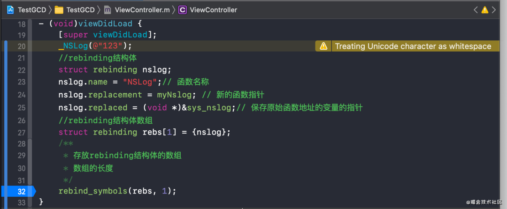

运行代码查看MachO偏移地址0x000000010d391000，发现MachO在内存的偏移地址也就是Mach-O真实的地址

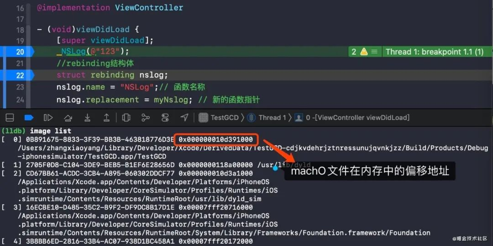

##### 4.1.6 将断点打在NSLog(@"123")上

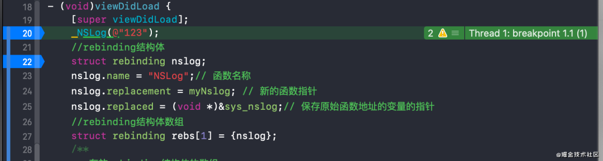

然后控制台看下NSLog这个函数，4.1.4得到的NSLog偏移地址为4030，而MachO在内存偏移的真实地址为0x000000010d391000

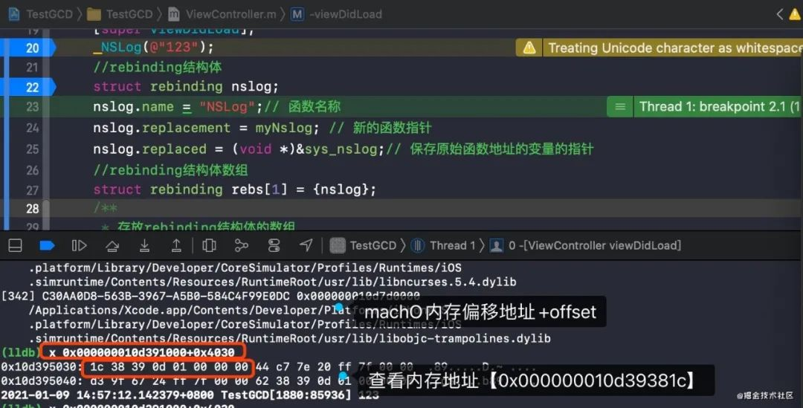

当执行过打印123后，然后再次查看0x000000010d391000+0x4030，通过dis -s 内存地址看内容

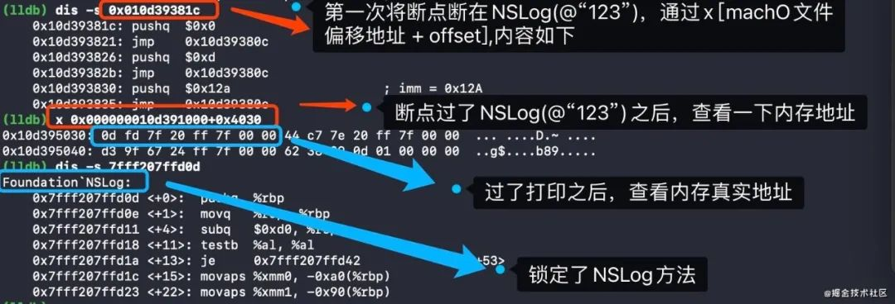

##### 4.1.7 当点击屏幕时，hook如下

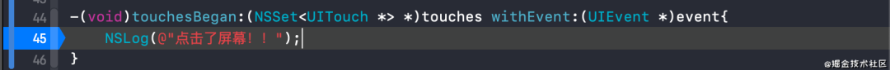

查看地址和内容：

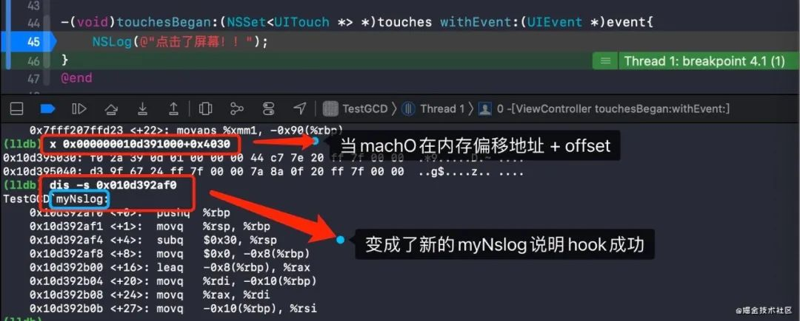

后1次是点击屏幕时断点进入到了里面，再看内容，打印的对象是NSLog还是myNslog，通过上面发现是myNslog，说明Hook成功。

> 通过上面可看出，fishhook能够Hook c函数，是因为Mach-O文件特点，PIC位置代码独立造就了静态语言C也有动态的部分，之后通过Dyld进行动态绑定的时机，在这其中我们就可以做手脚，替换自定义的方法。

#### 4.2 符号表查看函数名称

> fishhook是根据方法字符串的名字“NSLog”，它是怎么找到的呢？下面将讲解利用符号表查看函数名称字符串。

#### 4.2.1 再次查看Mach-O文件，查看懒加载表中的NSLog函数

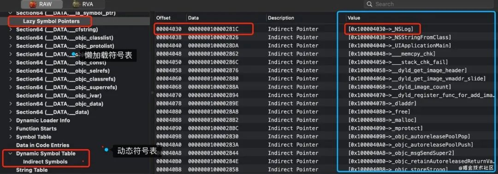

懒加载表是和动态符号表是一一对应关系，通过上面发现NSLog函数时第一个，而对应的Dynamic Symbol table也是第一个，打开Dynamic Symbol table

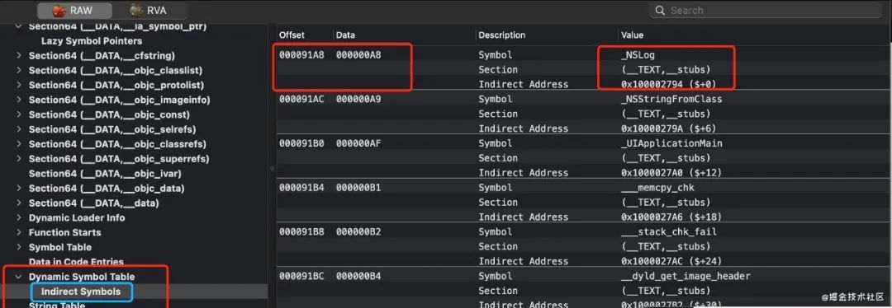

查看Dynamic Symbol Table 第一个也是NSLog，查看Data值为A8，对应的十进制为168，然后到Symbols Table里面查看168，如下：

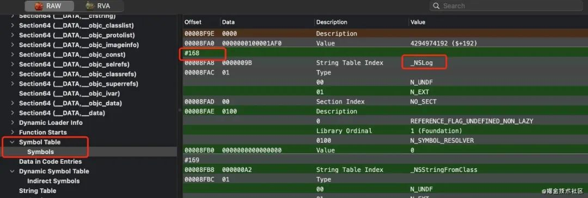

上面得知Symbols Table的data值为0000009B，然后加上String Table的函数第一个地址为00004F04，然后将0x0000009B + 0x00009260 = 0x92FB，查看0x92FB内容

#### 4.3 fishhook在github有流程说明图

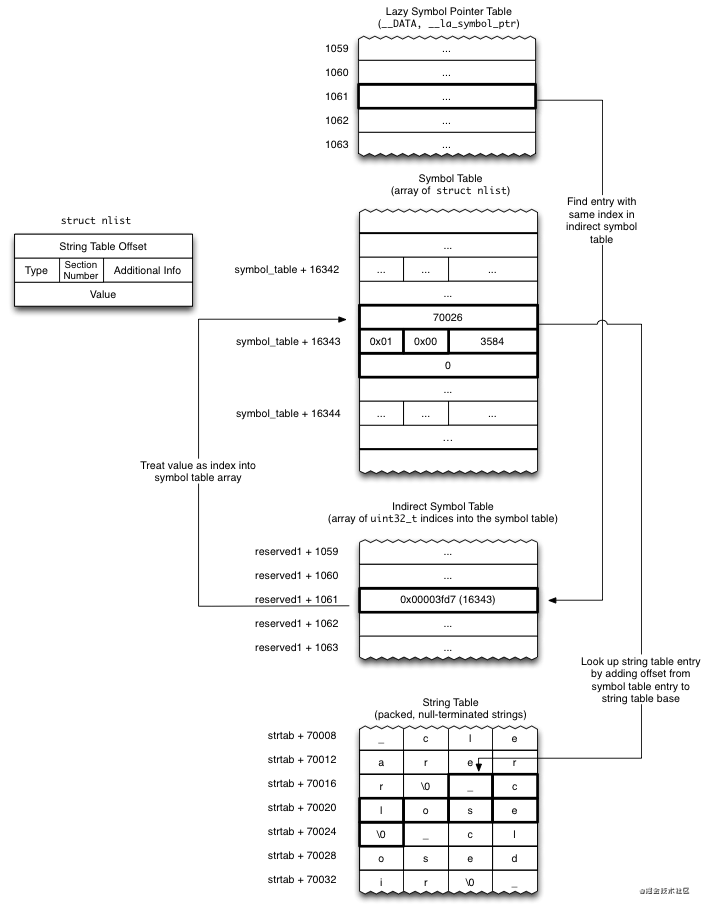

### Hook原理总结

上面讲述了Hook的几种技术方式以及fishhook的原理探究，以及如何让别人的app实现自己的代码。下面我们对此总结一下，写了一个本篇博客的整个过程便于大家整理，希望对大家有所帮助加深理解。

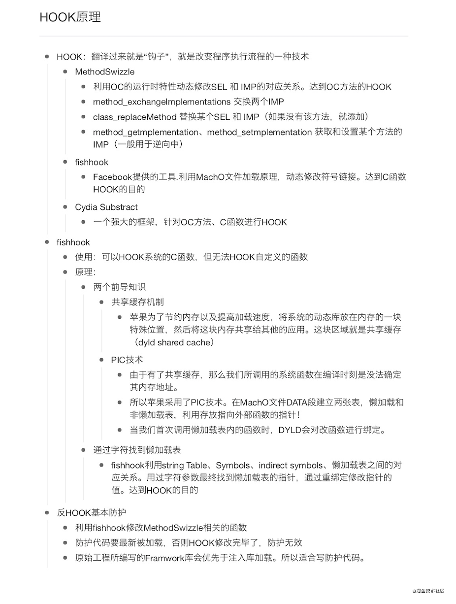

### 总结

本篇博客是临时加上去的，因为以前做过逆向开发相关研究，发现在讲解iOS启动优化之路，fishhook是逻辑和mach-O是需要讲解的，所以就写了本篇博客。

fishhook其实大家认真看下内容，也就是两三百行代码，本人觉得思路以及了解fishhook如何工作的是很重要的。下一篇将讲述如何去监测App启动时间的博客，再一次进阶高级开发工程师。

大致情况就是这样，欢迎点赞博客及关注本人，后期会继续分享更多的干货供大家分析参考点评！！！

  
