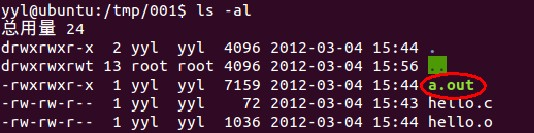
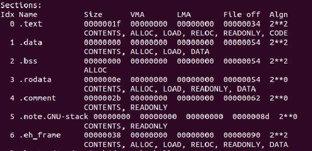
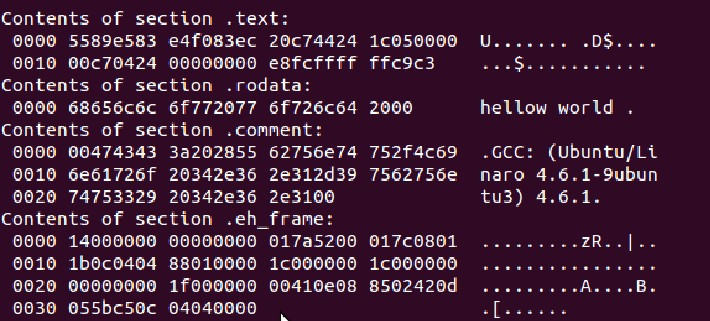
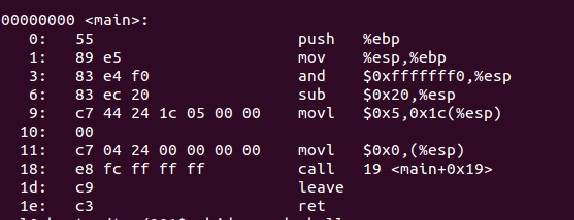
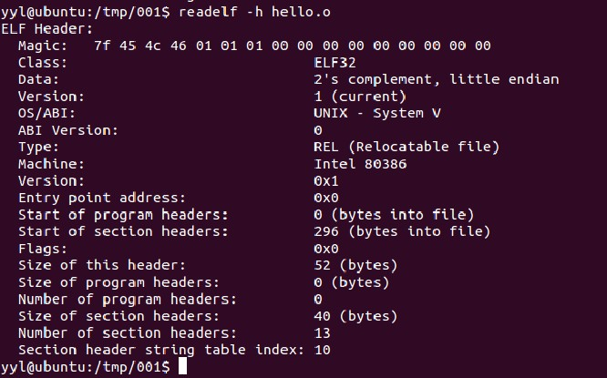
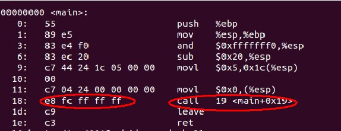
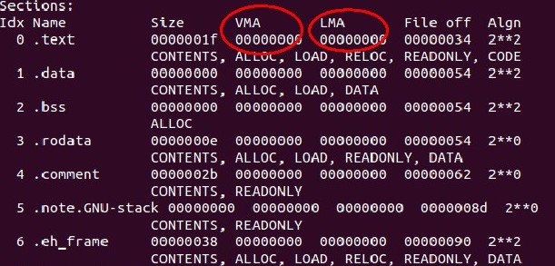

 
<!--BEGIN_DATA
{
    "create_date": "2016-12-28 21:59", 
    "modify_date": "2016-12-28 21:59", 
    "is_top": "0", 
    "summary": "从hello world 说程序运行机制", 
    "tags": "C/C++", 
    "file_name": "从hello world说程序运行机制.md"
}
END_DATA-->

####<p>原文出处：<a href='http://www.cnblogs.com/yanlingyin/archive/2012/03/05/2379199.html' target='blank'>从hello world 说程序运行机制</a></p>

学习任何一门编程语言，都会从hello world 开始。对于一门从未接触过的语言，在短时间内我们都能用这种语言写出它的hello world。

然而，对于hello world 这个简单程序的内部运行机制，我相信还有很多人都不是很清楚。

hello world 这些信息是如何通显示器过显示的？

cpu执行的代码和程序中我们写的的代码肯定不一样，她是什么样子的？又是如何从我们写的代码变成cpu能执行的代码的？

程序运行时代码是在什么地方？她们是如何组织的？

程序中的变量存储在什么地方？

函数调用是怎样是现的？

这篇文章将简单的讨论程序的运行机制

**开发平台隐藏的过程**

每一种语言都有自己的开发平台，我们的程序大多是也都是在这里诞生的。从程序源代码到可执行文件的转化过程其实是分很多步而且是很复杂的，只是而现在的开发平台把所有的这些事情都自己承担了，给我们带来方便的同时她也影藏了大量的实现细节。所以大多程序员只负责编写代码，其它的复杂的转换工作则由开发平台默默完成。

按照我的理解，简单 的说从源代码到可执行文件的过程可分为以下几个阶段:  

1、从源代码到机器语言并将产生的机器语言按照一定的规律组织起来。我们暂且称为文件A。

2、把文件A和运行A需要的文件B（如库函数）链接起来，形成文件A+

3、把文件A+装载进入内存，运行文件

（其实如果是看参考书或者其他资料的话可能不止这几步，只是这里为了简化我把它归纳为3步）

这些事形成可执行文件的关键步骤，缺一不可。现在看到被开发平台"蒙蔽"了吧。下面的部分将拨开迷雾，还你开发平台的真面目。

**目标文件**

在计算机领域有过一句经典的话：

"any problem in computer science can be sloved by another layer of
indirecition"

"计算机科学领域的任何问题都可以通过增加一个中间层来解决"

比如说要实现从A到B的转换，可以先把A转换为文件A+，再把文件A+转换为我们需要的文件B。（其实在波利亚的《how to slove
it》里面对这种方法也有叙述。在解题的时候可以通过增加中间层来简化问题）

那么从源代码到可执行文件的过程可以这样理解。从源代码到可执行文件也是一样的， 通过（不断的）在他们之间增加中间层，来解决问题。

和上文说的， 先把源程序转化为中间文件A，再把中间文件转化为我们需要的目标文件。

在处理文件的时候就是按照这种思路来的。


其实上面说的文件A更专业的说法是：目标文件。她不是可执行程序，需要和其它的目标文件进行链接、装载后才能执行。对于一个源程序， 开发平台首先要做的就是把源程序
翻译成机器语言。其中很重要的一部就是编译。相信很多人都知道，就是把源代码翻译成机器语言（其实就是一堆二进制代码）。编译知识很重要，却不是本文的重点，有兴趣的可自行google。

**目标文件格式：**

现在来看一下上面说的目标文件是如何组织的（也就是存放结构）。

**起源：**

想象一下如果是你来设计会如何组织这些二进制代码？就像书桌上的物品要分类放置才整洁一样，为了便于管理翻译出来的二进制代码也分类存放，把表示代码的放在一起，表示数据的放在一起。这样，二进制代码就分为了不同的块来存放。这样的一个区域就是被称为段（segment）的东西。

**标准：**

和计算机科学中的很多东西一样，为了方便人们的交流、程序的兼容等问题。也为这种二进制的存放方式制订了标准，于是COFF（common object file format）就诞生了。现在的windows、Linux、等主流操作系统下的目标文件格式和COFF大同小异，都可以认为是它的变种。

**a.out：**

a.out是目标文件的默认名字。也就是说，当编译一个文件的时候，如果不对编译后的目标文件重命名，编译后就会产生一个名字为a.out的文件。

 具体的为什么会用这个名字这里就不在深究了。有兴趣的可以自己google。

下面的图可以让你更直观的了解目标文件:


**上图是目标文件的典型结构，实际的情况可能会有所差别，但都是在这个基础上衍生出来的。**

**ELF文件头：**即上图中的第一个段。其中的header是目标文件的头部，里面包含了这个目标文件的一些基本信息。如该文件的版本、目标机器型号、程序入口地址等等。

**文本段**：里面的数据主要是程序中的代码部分。

**数据段**：程序中的数据部分，比如说变量。

**重定位段**：

重定位段包括了文本重定位和数据重定位，里面包含了重定位信息。一般来说，代码中都会存在引用了外部的函数，或者变量的情况。既然是引用，那么这些函数、变量并没存在该目标文件内。在使用他们的时候，
就要给出他们的实际地址（这个过程发生在链接的时候）。正是这些重定位表，提供了寻找这些实际地址的信息。理解了上面之后，文本重定位和数据重定位也就不难理解了。

**符号表：**符号表包含了源代码中所有的符号信息 。 包括每个变量名、函数名等等。里面记录了每个符号的信息，比如说代码中有"student"这个符号，对应的在符号表中就包括这个符号的信息。包括这个符号所在的段、它的属性（读写权限）等相关信息。

其实符号表最初的来源可以说是在编译的词法分析阶段。在做词法分析的时候，就把代码中的每个符号及其属性都记录在符号表中。

**字符串表：**和符号表差不多的功能，存放了一些字符串信息。

其中还有一点要说吗的是：目标文件都是以二进制来存储的，它本身就是二进制文件。

现实中的目标文件会比这个模型要复杂些，但是它的思路都是一样的，就是按照类型来存储，再加上一些描述目标文件信息的段和链接中需要的信息。


**a.out剖分**

Hello World

空口无凭，我们现在就来研究一下hello world编译后形成的目标文件，这里用 C 来描述。

简单的hellow world 源码：

```c
/*hello.c*/

#include<stdio.h>

int main()
{
　　int a=5;
　　printf("hellow world \n");
}
```

为了在数据段中也有数据可放，这里增加了"int a=5"。

如果在VC上的话，点击运行便能看到结果。

为了能看清楚内部到底是如何处理的，我们使用GCC来编译。

运行

 gcc hello.c

再看我们的目录下，就多了目标文件a.out。



现在我们想做的是看看a.out里到底有什么，可能有童鞋回想到用vim文本查看，当时我也是这么天真的认为。但a.out是何等东西，怎能这么简单就暴露出来呢 。
是的，vim不行。"我们遇到的问题大多是前人就已经遇到并且已经解决的"，对，其中有一个很强悍的工具叫做objdump。有了它，我们就能彻底的去了解目标文件的
各种细节，当然还有一个叫做readelf也很有用，这个在后面介绍。

这两个工具一般Linux里面都会自带有有，可以自行google

注：这里的代码主要是在Linux下用GCC编译，查看目标文件用的是Objdump、readelf。但是我会把所有的运行结果都上图，所以之前没有接触过Linux的童鞋来看下面的内容也完全没问题哦。我用的是ubuntu，感觉挺好~

下面是a.out的组织结构：（每段的起始地址、、大小等等）

查看目标文件的命令是    objdump -h a.out



就和上文中描述的目标文件的格式一样，可以看出是分类存储的。目标文件被分为了6段。

从左到右，第一列（Idx Name）是段的名字，第二列（Size）是大小 ，VMA为虚拟地址，LMA为物理地址，Fileoff是文件内的偏移。也就是这段相对于段中某一参考（一般是段起始）的距离。最后的Algn是对段属性的说明，暂时不用理会

"text"段：代码段。

"data"段：也就是上面说的数据段，保存了源代码中的数据，一般是以初始化的数据。

"bss"段：也是数据段，存放那些未初始化的数据，因为这些数据还未分配空间，所以单独存放。

"rodata"段：只读数据段，里面存放的数据是只读的。

"cmment"存放的是编译器版本信息。

剩下的两段对我们的讨论没有实际意义，就不再介绍。认为他们包含了一些链接、编译、装在的信息就可。

**注：**

这里的目标文件格式只是列出实际情况中主要部分。实际情况还有一些表未列出。如果你也在用Linux，可以用objdump -X 列出更详细的段内容。

**深入a.out**

上面部分通过实例说了目标文件中的典型的段，主要是段的信息，如大小 等相关的属性。

那么这些段里面究竟有些什么东西呢，"text"段里到底存了什么东西，还是用我们的objdump。

objdump -s a.out   通过-s选项就可以查看目标文件的十六进制格式。

查看结果如下：



如上图所示，列出了各段的十六进制表示形式。可以看出图中共分为两栏，左边的一栏是十六进制的表示， 右边则显示相应的信息。

比较明显的如"rodata"只读数据段中就有 "hello world"。。汗，好像程序里的"hello"打错了，后面多加了一个"w"，截图麻烦，。原谅下哈。

你也可以查看"hellow world"的ASCII值，对应的十六进制就是里面的内容了。

"comment"上文中说的这个段包含了一些编译器的版本信息，这个段后面的内容就是了：GCC编译器，后面的是版本号。

a**.out反汇编**

 编译的过程总是先把源文先变为汇编形式，再翻译为机器语言。（添加中间层嘛）看了这么多的a.out，再研究一下他的汇编形式是恨必要的

objdump -d a.out可以列出文件的汇编形式。不过这里只列出了主要部分，即main函数部分，其实在main函数执行的开始和main函数执行以后都还有多工作要做。

即初始化函数执行环境以及释放函数占用的空间等。



上面的图中，左边是代码的十六进制形式，左边是汇编形式。对汇编熟悉的童鞋应该能看懂大部分，这里就不在多述。

**a.out头文件**

在介绍目标文件格式的时候，提到过头文件这个概念，里面包含了这个目标文件的一些基本信息。如该文件的版本、目标机器型号、程序入口地址等等。

下图是文件头的形式：

可以用readelf -h 来查看。(下图中查看的是 hello.o，它是源文件hello.c编译但未链接的文件。 这个和查看a.out 大部分是一样的)



 图中分为两栏，左边一栏表示的是属性，右边是属性值。第一行常被称为魔数。后面是一连串的数字，其中的具体含义就不多说了，可以自己去google。

接下来的是一些和目标文件相关的信息。由于和我们要讨论的问题关系不大，这里就不展开讨论了。


上面是内容用具体的实例说了目标文件内部的组织形式，目标文件只是产生可执行文件过程中的一个中间过程，对于程序是如何运行的还没做讨论，

目标文件是如何转变为可执行文件以及可执行文件是如何执行的将在下面的部分中讨论


**对链接的简单认识**

链接通俗的说就是把几个可执行文件。

如果程序A中引用了文件B中定义的函数，为了A中的函数能正常执行，就需要把B中的函数部分也放在A的源代码中，那么将A和B合并成一个文件的过程就是链接了。

有专门的过程用来链接程序，称为链接器。他将一些输入的目标文件加工后合成一个输出文件。这些目标文件中往往有相互的数据、函数引用。

上文中我们看过了hello world的反汇编形式，是一个还没有经过链接的文件，也就是说当引用外部函数的时候是不知道其地址的：

如下图：



上图中，cal指令就是调用了printf()函数，因为这时候printf()函数并不在这个文件中，所以无法确定它的地址，在十六进制中就用"ff ff ff"来表示它的地址。等经过链接以后，这个地址就会变为函数的实际地址，应为连接后这个函数已经被加载进入这个文件中了。

链接的分类：

按把A相关的数据或函数合并为一个文件的先后可以把链接分为静态链接和动态链接。

静态链接：

在程序执行之前就完成链接工作。也就是等链接完成后文件才能执行。但是这有一个明显的缺点，比如说库函数。如果文件A 和文件B 都需要用到某个库函数，链接完成后他
们连接后的文件中都有这个库函数。当A和B同时执行时，内存中就存在该库函数的两份拷贝，这无疑浪费了存储空间。当规模扩大的时候，这种浪费尤为明显。静态链接还有不容易升级等缺点。为了解决这些问题，现在的很多程序都用动态链接。

动态链接：和静态链接不一样，动态链接是在程序执行的时候才进行链接。也就是当程序加载执行的时候。还是上面的例子，如果A和B都用到了库函数Fun()，A和B执行的时候内存中就只需要有Fun()的一个拷贝。

关于链接还有很多知识，以后会用专门的文章来谈。这里就不展开讲了。

**对装载的简单解释** 

 我们知道，程序要运行是必然要把程序加载到内存中的。在过去的机器里都是把整个程序都加载进入物理内存中，现在一般都采用了虚拟存储机制，即每个进程都有完整的地址空间，给人的感觉好像每个进程都能使用完成的内存。然后由一个内存管理器把虚拟地址映射到实际的物理内存地址。

按照上文的叙述， 程序的地址可以分为虚拟地址和实际地址。虚拟地址即她在她的虚拟内存空间中的地址，物理地址就是她被加载的实际地址。



 在上文中查看段 的时候或许你已经注意到了，由于文件是未链接、未加载的，所以每个段的虚拟地址和物理地址都是0.

加载的过程可以这样理解：先为程序中的各部分分配好虚拟地址，然后再建立虚拟地址到物理地址的映射。其实关键的部分就是虚拟地址到物理地址的映射过程。程序装在完成之后，cpu的程序计数器pc就指向文件中的代码起始位置，然后程序就按顺序执行。


**小结一下**

写这篇文章的目的在于梳理程序运行的机制，在一个可执行文件执行的背后都隐藏了什么。

从源代码到可执行文件通常要经历许多中间步骤，每一个中间步骤都生成一个中间文件。只是现在的集成开发环境都吧这些步骤影藏了，习惯于集成开发环境的我们也就逐渐的忽略了这些重要的技术内幕。这篇文章也只是介绍了一下这个过程的主线而已。其中的每一个细节展开来讲都可足已用一篇文章来论述。

上面写的多是我个人的理解和看法。有不足的地方、还望能不吝赐教。


参看资料：computer systems 《windows内核分析》《程序员的自我修养》


<hr>


####<p>原文出处：<a href='http://blog.csdn.net/ljianhui/article/details/21666327' target='blank'>程序运行时的内存空间分布</a></p>


版权声明：本文为博主原创文章，未经博主允许不得转载。

我们在写程序时，既有程序的逻辑代码，也有在程序中定义的变量等数据，那么当我们的程序进行时，我们的代码和数据究竟是存放在哪里的呢？下面就来总结一下。

一、程序运行时的内存空间情况

其实在程序运行时，由于内存的管理方式是以页为单位的，而且程序使用的地址都是虚拟地址，当程序要使用内存时，操作系统再把虚拟地址映射到真实的物理内存的地址上。所以在程序中，以虚拟地址来看，数据或代码是一块块地存在于内存中的，通常我们称其为一个段。而且代码和数据是分开存放的，即不储存于同于一个段中，而且各种数据也是分开存放在不同的段中的。

下面以一个简单的程序来看一下在Linux下的程序运行空间情况，代码文件名为space.c

    
    
    #include <unistd.h>
    #include <stdio.h>
    int main()
    {
    	printf("%d\n", getpid());
    	while(1);
    	return 0;
    }

  

这个程序非常简单，输出当前进程的进程号，然后进入一个死循环，这个死循环的目的只是让程序不退出。而在Linux下有一个目录/proc/$(pid)，这个目录保存了进程号为pid的进程运行时的所有信息，其中有一个文件maps，它记录了程序执行过程中的内存空间的情况。编译运行上面的代码，其运行结果如图1所示：

  

  

从上面的图中，我们可以看到这样一个简单的程序，在执行时，需要哪些库和哪些空间。上面的图的各列的意思，不一一详述，只对重要的进行说明。

第一列的是一个段的起始地址和结束地址，第二列这个段的权限，第三列段的段内相对偏移量，第六列是这个段所存放的内容所对应的文件。从上图可以看到我们的程序进行首先要加载系统的两个共享库，然后再加载我们写的程序的代码。 

对于第二列的权限，r：表示可读，w：表示可写，x：表示可执行，p：表示受保护（即只对本进程有效，不共享），与之相对的是s，意是就是共享。  

从上图我们可以非常形象地看到一个程序进行时的内存分布情况。下面我们将会结合上图，进行更加深入的对内存中的数据段的解说。

二、程序运行时内存的各种数据段
  
1.bss段

该段用来存放没有被初始化或初始化为0的全局变量，因为是全局变量，所以在程序运行的整个生命周期内都存在于内存中。有趣的是这个段中的变量只占用程序运行时的内存空间，而不占用程序文件的储存空间。可以用以下程序来说明这点，文件名为bss.c

    
    
    #include <stdio.h>
    int bss_data[1024 * 1024];
    int main()
    {
    	return 0;
    }

这个程序非常简单，定义一个4M的全局变量，然后返回。编译成可执行文件bss，并查看可执行文件的文件属性如图2所示：

  

从可执行文件的大小4774B可以看出，bss数据段（4M）并不占用程序文件的储存空间，在下面的data段中，我们可以看到data段的数据是占用可执行文件的储存空间的。

在图1中，有文件名且属性为rw-p的内存区间，就是bss段。 

2.data段

初始化过的全局变量数据段，该段用来保存初始化了的非0的全局变量，如果全局变量初始化为0，则编译有时会出于优化的考虑，将其放在bss段中。因为也是全局变量，所以在程序运行的整个生命周期内都存在于内存中。与bss段不同的是，data段中的变量既占程序运行时的内存空间，也占程序文件的储存空间。可以用下面的程序来说明，文件名为data.c：

    
    
    #include <stdio.h>
    int data_data[1024 * 1024] = {1};
    int main()
    {
    	return 0;
    }

这个程序与上面的bss唯一的不同就是全局变量int型数组data_data，其中第0个元素的值初始化为1，其他元素的值初始化成默认的0，而因为数组的地址是连续的，所以只要有一个元素在data段中，则其他的元素也必然在data段中。编译连接成可执行文件data，并查看可执行文件的文件属性如图3所示：

  

从可执行文件的大小来看，data段数据（data_data数组的大小，4M）占用程序文件的储存空间。


在图1中，有文件名且属性为rw-p的内存区间，就是data段，它与bss段在内存中是共用一段内存的，不同的是，bss段数据不占用文件，而data段数据占用文件储存空间。

3.rodata段

该段是常量数据段，用于存放常量数据，ro就是Read Only之意。但是注意并不是所有的常量都是放在常量数据段的，其特殊情况如下：

1）有些立即数与指令编译在一起直接放在代码段（text段，下面会讲到）中。

2）对于字符串常量，编译器会去掉重复的常量，让程序的每个字符串常量只有一份。

3）有些系统中rodata段是多个进程共享的，目的是为了提高空间的利用率。


在图1中，有文件名的属性为r--p的内存区间就是rodata段。可见他是受保护的，只能被读取，从而提高程序的稳定性。
 

4.text段

text段就是代码段，用来存放程序的代码（如函数）和部分整数常量。它与rodata段的主要不同是，text段是可以执行的，而且不被不同的进程共享。

在图1中，有文件名且属性为r-xp的内存区间就是text段。就如我们所知道的那样，代码段是不能被写的。

5.stack段

该段就是栈段，用来保存临时变量和函数参数。程序中的函数调用就是以栈的方式来实现的，通常栈是向下（即向低地址）增长的，当向栈中push一个元素，栈顶指针就会向
低地址移动，当从栈中pop一个元素，栈顶指针就会向高地址移动。栈中的数据只在当前函数或下一层函数中有效，当函数返回时，这些数据自动被释放，如果继续对这些数据进行访问，将发生未知的错误。通常我们在程序中定义的不是用malloc系统函数或new出来的变量，都是存放在栈中的。例如，如下函数：
    
    
    void func（）
    {
        int a = 0;
        int *n_ptr = malloc(sizeof(int));
        char *c_ptr = new char;
    }

  

整型变量a，整型指针变量n_ptr和char型指针变量c_ptr，都存放在栈段中，而n_ptr和c_ptr指向的变量，由于是malloc或new出来的，所以存放在堆中。当函数func返回时，a、n_ptr、c_ptr都会被释放，但是n_ptr和c_ptr指向的内存却不会释放。因为它们是存在于堆中的数据。
  

在图1中，文件名为stack的内存区间即为栈段。
 

6.heap段

heap（堆）是最自由的一种内存，它完全由程序来负责内存的管理，包括什么时候申请，什么时候释放，而且对它的使用也没有什么大小的限制。在C/C++中，用alloc系统函数和new申请的内存都存在于heap段中。
  
以上面的程序为例，它向堆申请了一个int和一个char的内存，因为没有调用free或delete，所以当函数返回时，堆中的int和char变量并没有释放，造成了内存泄漏。  

由于在图1所对应的代码中没有使用alloc系统函数或new来申请内存，所以heap段并没有在图1中显示出来，所以以下面的程序来说明heap段的位置，代码文件为heap.c，代码如下：

    
    
    #include <unistd.h>
    #include <stdlib.h>
    #include <stdio.h>
    int main()
    {
    	int *n_ptr = malloc(sizeof(int));
    	printf("%d\n", getpid());
    	while(1);
    	free(n_ptr);
    	return 0;
    }

查看其运行时内存空间分布如下：

  

可以看到文件名为heap的内存区间就是heap段。从上图，也可以看出，虽然我们只申请4个字节（sizeof(int))的空间，但是在操作系统中，内存是以页的方式进行管理的，所以在分配heap内存时，还是一次分配就为我们分配了一个页的内存。注：无论是图1，还是上图，都有一些没有文件名的内存区间，其实没用文件名的内存区间表示使用mmap映射的匿名空间。

