<!--BEGIN_DATA
{
    "create_date": "2023-07-26 22:30", 
    "modify_date": "2023-07-26 22:30", 
    "is_top": "0", 
    "summary": "从iOS App启动速度看如何为基础性能保驾护航", 
    "tags": "iOS", 
    "file_name": "从iOS App启动速度看如何为基础性能保驾护航.md"
}
END_DATA-->

#### <p>原文出处：<a href='https://developer.jdcloud.com/article/2693' target='blank'>从iOS App启动速度看如何为基础性能保驾护航</a></p>

## 1 前言

启动是App给用户的第一印象，一款App的启动速度，不单单是用户体验的事情，往往还决定了它能否获取更多的用户。所以到了一定阶段App的启动优化是必须要做的事情。App启动基本分为以下两种

### 1.1 冷启动

App 点击启动前，它的进程不在系统里，需要系统新创建一个进程分配给它启动的情况。这是一次完整的启动过程。  

表现：App第一次启动，重启，更新等

### 1.2 热启动

App 在冷启动后用户将 App 退后台，在 App 的进程还在系统里的情况下，用户重新启动进入 App 的过程，这个过程做的事情非常少。  

所以我们主要说道说道冷启动的优化

## 2 启动流程

### 2.1 APP启动都干了什么

要对启动速度进行优化，我们需要知道启动过程中的大致流程是什么，做了什么事情，是否能针对性优化。  

下图是启动流程的详细分解

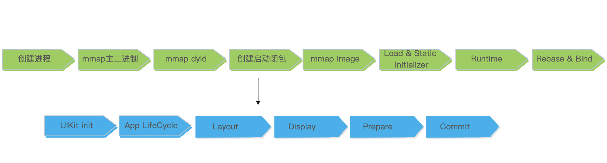

1. 点击图标，创建进程
2. mmap 主二进制，找到 dyld 的路径
3. mmap dyld，把入口地址设为`_dyld_start`

dyld 是启动的辅助程序，是 in-process 的，即启动的时候会把 dyld 加载到进程的地址空间里，然后把后续的启动过程交给 dyld。dyld主要有两个版本：dyld2 和 dyld3。  

iOS 12之前主要是dyld2，iOS 13 开始 Apple 对三方 App 启用了 dyld3，dyld3的最重要的特性就是启动闭包，闭包存储在沙盒的 tmp/com.apple.dyld 目录，清理缓存的时候切记不要清理这个目录。  

闭包里主要有以下内容：

  * dependends，依赖动态库列表
  * fixup：bind & rebase 的地址
  * initializer-order：初始化调用顺序
  * optimizeObjc: Objective C 的元数据
  * 其他：main entry, uuid等等

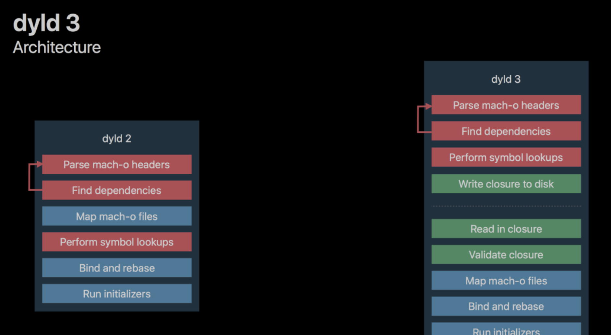

上图虚线之上的部分是out-of-process的，在App下载安装和版本更新的时候会去执行，直接从缓存中读取数据，加快加载速度  

这些信息是每次启动都需要的，把信息存储到一个缓存文件就能避免每次都解析，尤其是 Objective-C 的运行时数据（Class/Method…）解析耗时,所以对启动速度是一个优化提升  

4. 把没有加载的动态库 mmap 进来，动态库的数量会影响这个阶段  

dyld从主执行文件的header获取到需要加载的所依赖动态库列表，然后它需要找到每个 dylib，而应用所依赖的 dylib 文件可能会再依赖其他dylib，所以所需要加载的是动态库列表一个递归依赖的集合  

5. 对动态库集合循环load, mmap 加载到虚拟内存里，对每个 Mach-O 做 fixup，包括 Rebase 和 Bind。  

对每个二进制做 bind 和 rebase，主要耗时在 Page In，影响 Page In 数量的是 objc 的元数据

  * Rebase 在Image内部调整指针的指向。在过去，会把动态库加载到指定地址，所有指针和数据对于代码都是对的，而现在地址空间布局是随机化(ASLR)，所以需要在原来的地址根据随机的偏移量做一下修正, 也就是说Mach-O 在 mmap 到虚拟内存的时候，起始地址会有一个随机的偏移量 slide，需要把内部的指针指向加上这个 slide.
  * Bind 是把指针正确地指向Image外部的内容。这些指向外部的指针被符号(symbol)名称绑定，dyld需要去符号表里查找，找到symbol对应的实现， 像 printf 等外部函数，只有运行时才知道它的地址是什么，bind 就是把指针指向这个地址，这也是后面我们能用fishhook来hook一些动态符号的核心

如下图，编译的时候，字符串 1234 在`__cstring`的 0x10 处，所以 DATA 段的指针指向 0x10。但是 mmap 之后有一个偏移量slide=0x1000，这时候字符串在运行时的地址就是 0x1010，那么 DATA 段的指针指向就不对了。Rebase 的过程就是把指针从0x10，加上 slide 变成 0x1010。运行时类对象的地址已经知道了，bind 就是把 isa 指向实际的内存地址。

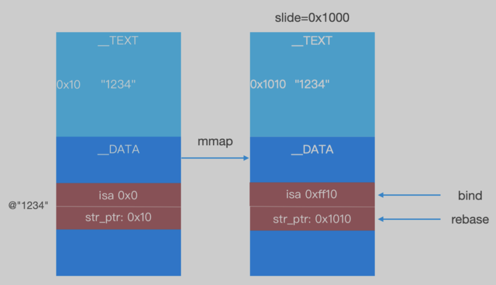

6. 初始化 objc 的 runtime，由于闭包已经初始化了大部分，这里只会注册 sel 和装载 category  

7. +load 和静态初始化被调用，除了方法本身耗时，这里可能还会引起大量 Page In，如果调用了dispatch_async则会延迟启动后的runloop开启后执行  

如果触发静态初始化，则会延迟到运行时执行  

8. 初始化 UIApplication，启动 Main Runloop  

可以在之前章节利用runloop统计首屏耗时  
也可以在启动结束做一些预热任务  

9. 执行 will/didFinishLaunch，这里主要是业务代码耗时  

首页的业务代码都是要在这个阶段，也就是首屏渲染前执行的，主要包括了：首屏初始化所需配置文件的读写操作；首屏列表大数据的读取；首屏渲染的大量计算等；sdk的初始化；对于大型组件化工程，也包含了很多moudle的启动加载项 

10. Layout，viewDidLoad 和Layoutsubviews 会在这里调用，Autolayout 太多会影响这部分时间  

11. Display，drawRect 会调用  

12. Prepare，图片解码发生在这一步  

13. Commit，首帧渲染数据打包发给 RenderServer，走GPU渲染流水线流程，启动结束  

(tips: 2.2.10-2.2.13这里主要是图形渲染流水线的部分流程，Application产生图元阶段(CPU阶段))。后续会交由单独的RenderServer进程，再调用渲染框架(Metal/OpenGL ES)来生成 bitmap，放到帧缓冲区里，硬件根据时钟信号读取帧缓冲区内容，完成屏幕刷新

### 2.2 启动各阶段时长统计

上一小节对启动各个阶段过程的详细阐述，归纳起来大致分为6个阶段(WWDC2019)：

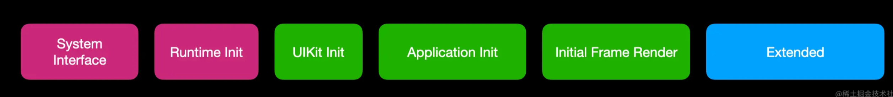

通过对各个阶段进行时长统计分析，进行优化然后对比。  

可以在Xcode中设置环境变量`DYLD_PRINT_STATISTICS`和`DYLD_PRINT_STATISTICS_DETAILS`看下启动阶段和对应的耗时(iOS15后环境变量失效)  

也可以通过Xcode MetricKit 本身也可以看到启动耗时：打开 Xcode -> Window -> Origanizer -> Launch Time  

如果公司有对应的成熟监控体系最好，这里我们主要通过手动无侵入埋点去统计启动时长，对启动流程pre main-> after main进行统计分析

#### 2.1.1 进程创建时间打点

通过 sysctl 系统调用拿到进程创建的时间戳

```objc
#import <sys/sysctl.h>
#import <mach/mach.h>

+ (BOOL)processInfoForPID:(int)pid procInfo:(struct kinfo_proc*)procInfo
{
    int cmd[4] = {CTL_KERN, KERN_PROC, KERN_PROC_PID, pid};
    size_t size = sizeof(*procInfo);
    return sysctl(cmd, sizeof(cmd)/sizeof(*cmd), procInfo, &size, NULL, 0) == 0;
}

+ (NSTimeInterval)processStartTime
{
    struct kinfo_proc kProcInfo;
    if ([self processInfoForPID:[[NSProcessInfo processInfo] processIdentifier] procInfo:&kProcInfo]) {
        return kProcInfo.kp_proc.p_un.__p_starttime.tv_sec * 1000.0 + kProcInfo.kp_proc.p_un.__p_starttime.tv_usec / 1000.0;
    } else {
        NSAssert(NO, @"无法取得进程的信息");
        return 0;
    }
```

#### 2.1.2 main()执行时间打点

```objc
// main之前调用
// pre-main()阶段结束时间点：__t2
void static __attribute__ ((constructor)) before_main()
{
  if (__t2 == 0)
  {
    __t2 = CFAbsoluteTimeGetCurrent() + kCFAbsoluteTimeIntervalSince1970;
  }
}
```

#### 2.1.3 首屏渲染时间打点

启动的终点对应用户感知到的 Launch Image 消失的第一帧  

iOS 12 及以下：root viewController 的 viewDidAppear 
iOS 13+：applicationDidBecomeActive  

Apple 官方的统计方式是第一个 CA::Transaction::commit，但对应的实现在系统框架内部，不过我们可以找到最接近这个的时间点  

通过 Runloop 源码分析和调试，我们发现 CFRunLoopPerformBlock，kCFRunLoopBeforeTimers 和 CA::Transaction::commit()为最近的时间点，所以在这里打点即可. 
具体就是可以通过在 didFinishLaunch 中向 Runloop 注册 block 或者 BeforeTimer 的 Observer 来获取这两个时间点的回调，代码如下：  

注册block：

```objc
//注册block
CFRunLoopRef mainRunloop = [[NSRunLoop mainRunLoop] getCFRunLoop];
CFRunLoopPerformBlock(mainRunloop,NSDefaultRunLoopMode,^(){
    NSTimeInterval stamp = [[NSDate date] timeIntervalSince1970];
    NSLog(@"runloop block launch end:%f",stamp);
});
```

监听BeforeTimer 的 Observer

```objc
//注册kCFRunLoopBeforeTimers回调
CFRunLoopRef mainRunloop = [[NSRunLoop mainRunLoop] getCFRunLoop];
CFRunLoopActivity activities = kCFRunLoopAllActivities;
CFRunLoopObserverRef observer = CFRunLoopObserverCreateWithHandler(kCFAllocatorDefault, activities, YES, 0, ^(CFRunLoopObserverRef observer, CFRunLoopActivity activity) {
    if (activity == kCFRunLoopBeforeTimers) {
        NSTimeInterval stamp = [[NSDate date] timeIntervalSince1970];
        NSLog(@"runloop beforetimers launch end:%f",stamp);
        CFRunLoopRemoveObserver(mainRunloop, observer, kCFRunLoopCommonModes);
    }
});
CFRunLoopAddObserver(mainRunloop, observer, kCFRunLoopCommonModes);
```

综上分析现有项目版本启动时间均值：

```
[函数名:+[LaunchTrace mark]_block_invoke][行号:54]—————App启动————-耗时:pre-main:4.147820  
[函数名:+[LaunchTrace mark]_block_invoke][行号:55]—————App启动————-耗时:didfinish:0.654687  
[函数名:+[LaunchTrace mark]_block_invoke][行号:56]—————App启动————-耗时:total:4.802507
```

## 3 启动优化

上节我们主要分析了App启动流程和时长统计，下面就是我们要优化的方向，尽可能对各个阶段进行优化，当然也不是过度优化，项目不同阶段、不同规模相应的问题会不一样，做针对性分析优化.

### 3.1 Pre Main 优化

#### 3.1.1 调整动态库

查看了现有工程，基本都以动态库进行链接，总计48个，所以思路如下

  * 减少动态库，自有动态库转静态库
  * 现有的库是以CocoaPods管理的，所以通过hook pod构建流程修改Xcode config将部分pod的Mach-O type改为Static Library；
  * 同时对一些代码较大的动态库进行ROI分析，分析是否可以不依赖，在代码内即可实现替代逻辑，这样删除一些ROI很低的动态库
  * 合并动态库
  * 目前项目引入的动态库较为简单，不存在合并项，对于有些中大型工程，有很多自己的基建UI库，很多过于分散，需要做的就是能聚合就聚合，譬如XXTableView, XXHUD, XXLabel，建议合并成一个XXUIKit；譬如一些工具库，也可以根据实际情况聚合为一个
  * 动态库懒加载
  * 经过分析目前项目阶段规模还没必要进行懒加载动态库，毕竟优化要考虑收益，仅做优化思路参考
  * 正常动态库都是会被主二进制直接或者间接链接的，那么这些动态库会在启动的时候加载。如果只打包进 App，不参与链接，那么启动的时候就不会自动加载，在运行时需要用到动态库里面的内容的时候，再手动懒加载
  * 运行时通过-[NSBundle load]来加载，本质上调用的是底层的 dlopen。

#### 3.1.2 rebase&binding&objc setup阶段

  * 无关的Class、Method的符号加载耗时也会带来额外的启动耗时；所以我们要减少__DATA段中的指针数量；对项目代码分析发现很多类似的Category，每个Category里面可能只有一个功能函数，所以具体根据项目情况分析进行Category合并

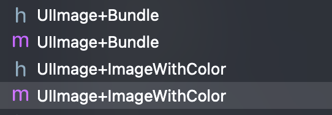

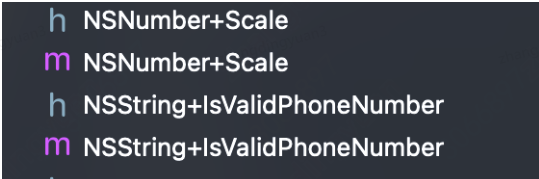

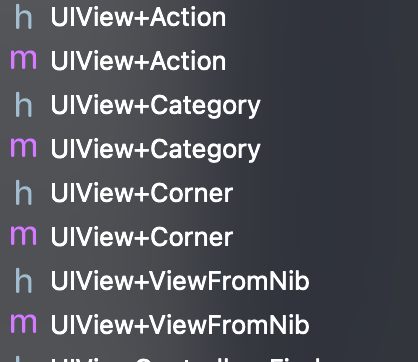

  * +load 除了方法本身的耗时，还会引起大量 Page In，另外 +load 的存在对 App 稳定性也是冲击，因为 Crash 了捕获不到。
  * 项目中不少类似以下load函数逻辑，具体分析后很多可以作为启动器进行治理管理，runloop空闲去执行，
  * 首屏后延时加载

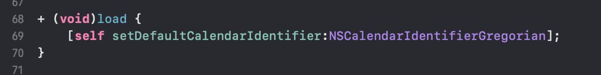

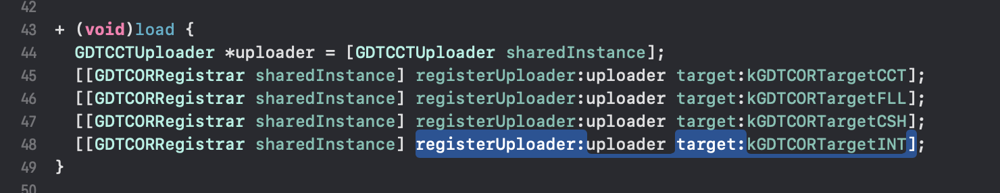

  * 另外一类是load逻辑操作：很多组件化通讯解耦方案之一就是在load函数内做协议和类的绑定，这部分可以利用 clang attribute，将其迁移到编译期：

```c
typedef struct{
    const char * cls;
    const char * protocol;
}_di_pair;
#if DEBUG
#define DI_SERVICE(PROTOCOL_NAME,CLASS_NAME)\
__used static Class<PROTOCOL_NAME> _DI_VALID_METHOD(void){\
    return [CLASS_NAME class];\
}\
__attribute((used, section(_DI_SEGMENT "," _DI_SECTION ))) static _di_pair _DI_UNIQUE_VAR = \
{\
_TO_STRING(CLASS_NAME),\
_TO_STRING(PROTOCOL_NAME),\
};\
#else
__attribute((used, section(_DI_SEGMENT "," _DI_SECTION ))) static _di_pair _DI_UNIQUE_VAR = \
{\
_TO_STRING(CLASS_NAME),\
_TO_STRING(PROTOCOL_NAME),\
};\
#endif
```

原理很简单：宏提供接口，编译期把类名和协议名写到二进制的指定段里，运行时把这个关系读出来就知道协议是绑定到哪个类了。

  * 下线代码

无用代码删除在所有的性能优化手段里基本上是ROI最低的。但是几乎所有ROI较高的技术手段都是一次性优化方案，经过几个版本迭代后再做优化就会比较乏力。相比之下，针对代码的检测和删除在很长的一段时间内提供了很大的优化空间  

检测手段：静态扫描Mach-O文件对classlist和classrefs做差集，形成初步的无用类集合，并根据业务代码特征做二次适配  

当然还有其他常用的技术手段包括AppCode工具检测以及以例如Pecker这样的基于 IndexStoreDB 、线上统计等。  

不过以上方案对Swift的检测方案不太适用(和OC存储差异)，这里可以参考github.com/wuba/WBBlad…  

对项目进行检测，发现还是很多无用类的：

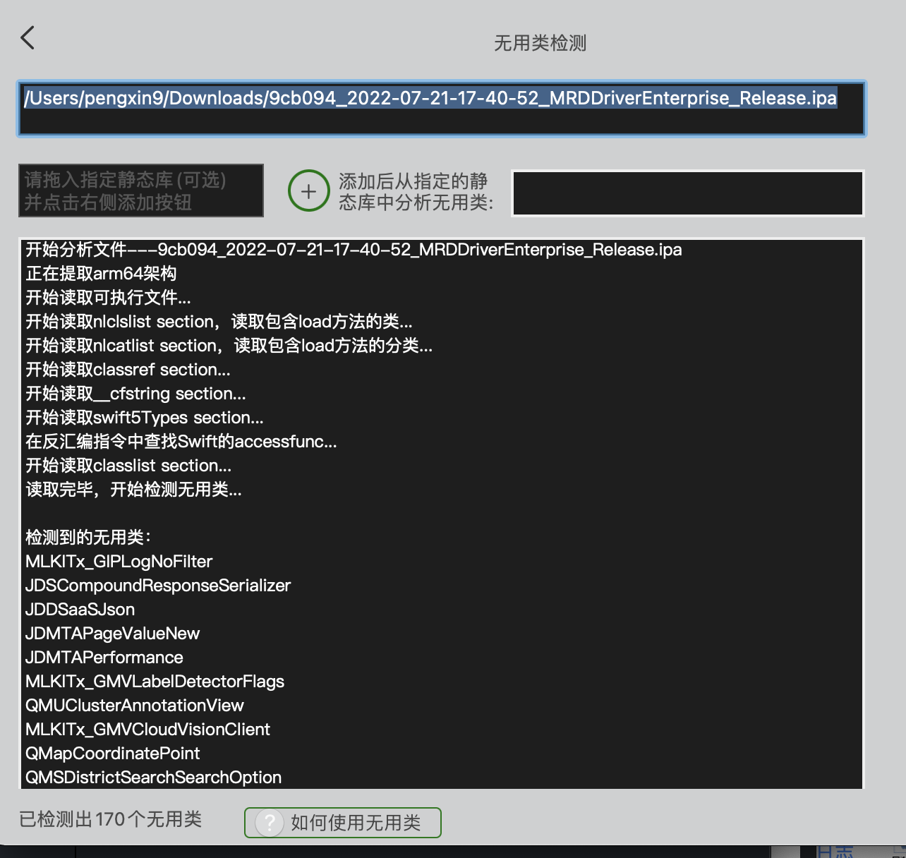

然后二次分析验证，进行优化

#### 3.1.3 二进制重排

iOS系统中虚拟内存到物理内存的映射都是以页为最小单位的。当进程访问一个虚拟内存Page而对应的物理内存却不存在时，就会出现Page Fault缺页中断,（对应System Trace的File Backed Page In）然后操作系统把数据加载到物理内存中，如果已经已经加载到物理内存了，则会触发Page Cache Hit，后者是比较快的，这也是热启动比冷启动快的原因之一。  

虽然缺页中断异常这个处理速度是很快的，但是在一个App的启动过程中可能出现上千(甚至更多)次Page Fault，这个时间积累起来会比较明显了。

> 基于上面原理. 我们的目标就是在启动的时候增加Page Cache Hit，减少Page Fault，从而达到优化启动时间的目的  
>
> 我们需要确定，在启动的时候，执行了哪些符号，尽可能让这些符号的内存集中在一起，减少占用的页数，就能减少Page Fault的命中次数

程序默认情况下是顺序执行的:

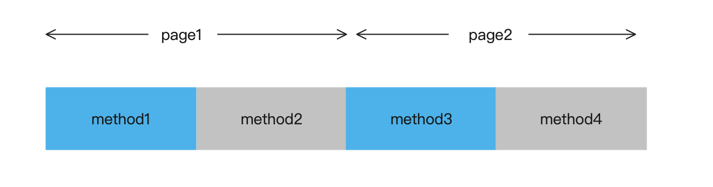

如果启动需要使用的方法分别在2页Page1和Page2中(method1和method3)，为了执行相应的代码，系统就必须进行两个Page Fault。  
如果我们对方法进行重新排列，让method1和method3在一个Page，那么就可以较少一次Page Fault。

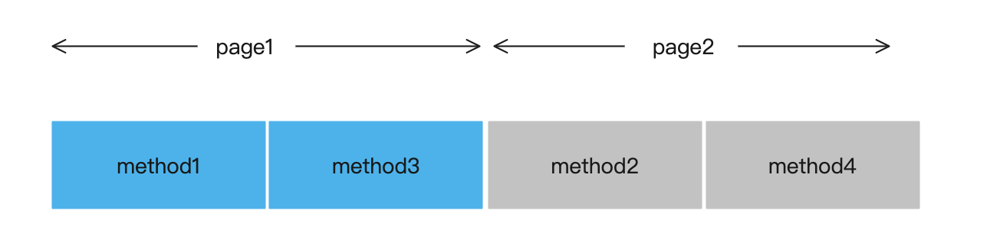

通过Instruments中的System Trace工具来看下当前的page fault加载情况

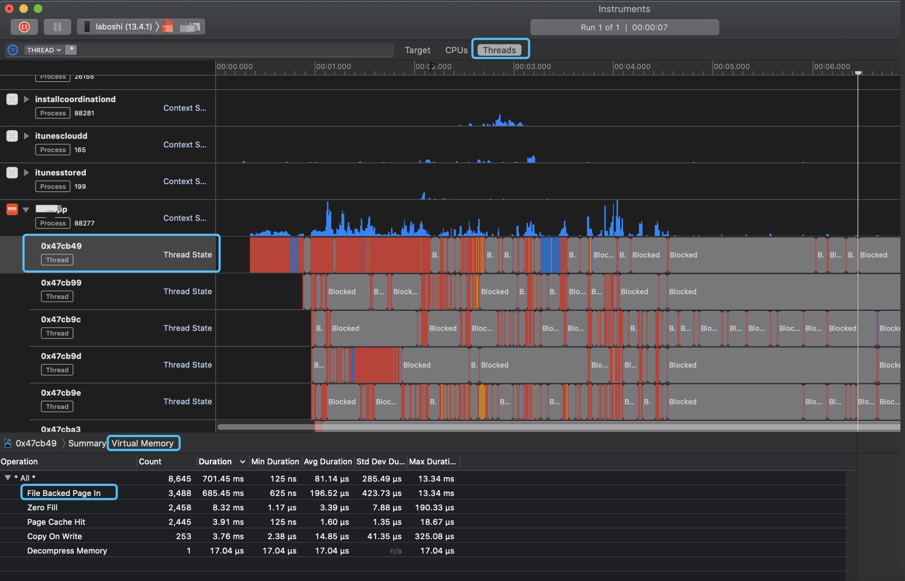

这里有个注意点，为了确保App是真正的冷启动，需要把内存清干净，不然结果会不太准，下图是我直接杀掉App，重新打开得到的结果

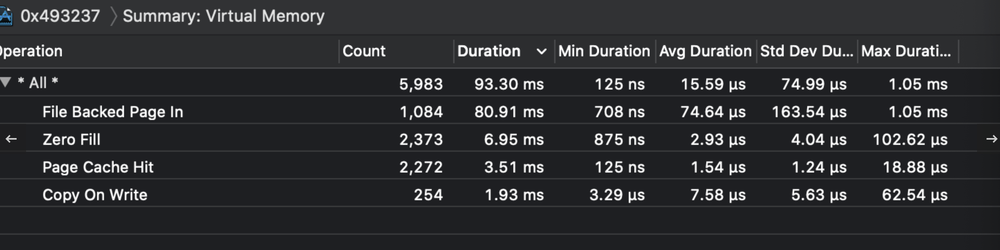

可以看到，和第一次测试差的有点多，我们可以在杀掉App后，重新打开多个其他的App（尽可能多），或者卸载重装，这样在重新打开App的时候，就会冷启动  
综上我们要做的就是将启动时调用的函数符号集中靠前排列，减少缺页中断数量

  * 获取启动代码执行顺序
  * 确定App在启动的时候，调用了哪些函数（使用了哪些符号），这里推荐一个工具[AppOrderFiles](https://github.com/yulingtianxia/AppOrderFiles>)，使用Clang SanitizerCoverage，通过编译器插装的方式，获取到调用函数的符号顺序（当然我们也可以在Build Settings中修改Write Link Map File为YES编译后会生成一个Link Map符号表txt，进行分析，创建我们自己的order文件）在App启动后，到首屏VC的viewDidLoad方法内输出order file。  

输出的文件在App沙盒，用模拟器运行更方便，得到文件app.order，这里面就是排好序的符号列表，根据App的执行顺序，如果项目比较大的话，会比较久.  

把order文件放到工程目录，配置到Xcode里面`Build Setting -> Order File -> $(PROJECT_DIR)/xxx.order`

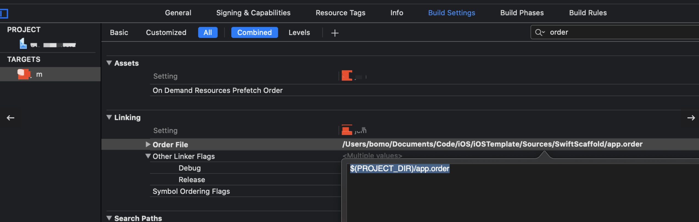

  * 验证\对比  
Xcode里面Build Setting有个Write Link Map File，可以生成Link Map文件的选项，路径如下

```
Link Map文件  
Intermediates.noindex/xxxx.build/Debug-iphoneos/xxx.build/xxx-LinkMap-normal-arm64.txt  

生成app文件路径  
Products/Debug-iphoneos/xxx.app
```

这里我们只关注Link Map File的符号表Symbols，这里的顺序就是Mach-O文件对应的顺序，如果与xxx.order的顺序一致，就表明改成功了  

再次通过System Trace工具测试修改前后对比

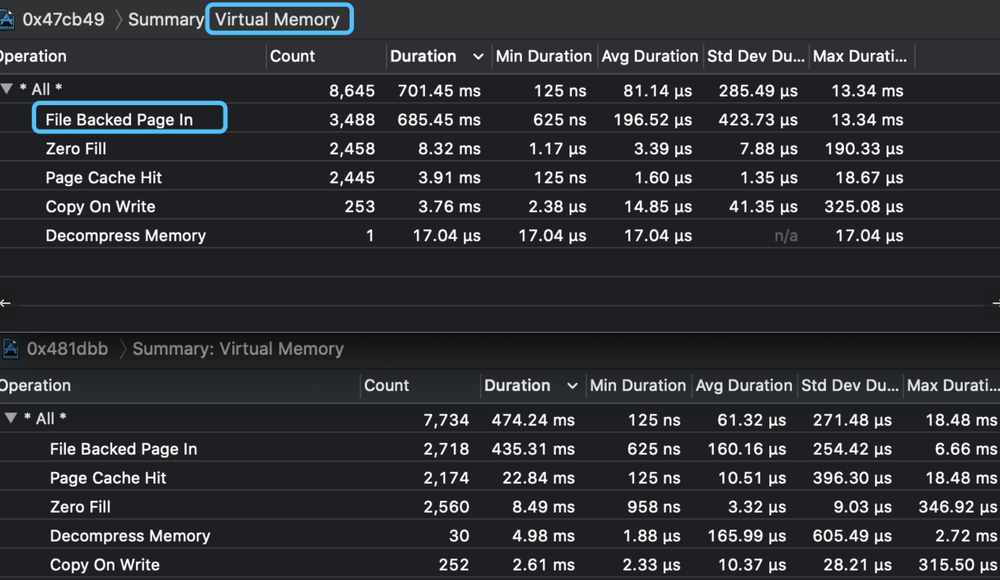

优化前后对比，缺页中断明显减少

> 获取函数调用符号，采用Clang插桩可以直接hook到Objective-C方法、Swift方法、C函数、Block，可以不用区别对待

### 3.2 After Main优化

这部分是个大头的优化项，实际场景需要我们根据自己的具体项目来分析，但大体遵循一些相同的思路

#### 3.2.1 功能/方法优化

  * 推迟&减少I/O操作
  * 此处对项目after main后的启动逻辑分析不涉及IO操作未做优化
  * 控制线程数量
  * 项目中启动阶段线程数量不多且必要，影响不大就未动，但根据各自的项目情况进行分析治理
  * 启动加载项治理
  * 这里主要是一些基建和三方/集团SDK初始化任务以及各业务组件工程的启动加载项, 包括前面部分load函数的逻辑放到这里的启动器来进行调度管理。
  * 我们可以把这部分做一个启动器进行维护和监控，防劣化。
  * 启动器自注册，注册项包括启动操作闭包，启动执行优先级，启动操作是否后台执行等可选项。
  * 自注册服务无非还是：”启动项：启动闭包 “ 这么一个绑定实现，所以可以类似前面(class-protocol绑定)所讲的思路，将这部分操作写入到可执行文件的**DATA段中，运行时再从**DATA段取出数据进行相应的操作（调用函数），这样也能够覆盖所有的启动阶段，例如main()之前的阶段。
  * 对项目分析后，将键盘初始化、地图定位、意见反馈还有非首页模块初始化等非必要的启动项降低优先级延后时机执行。
  * 串行->并行 同步->异步
  * 对于一些耗时操作异步、并行操作，不阻塞主线程的执行
  * 方法耗时统计分析
  * 统计启动过程业务代码耗时并对耗时方法进行分析治理
  * 高频次方法调用
  * 有些方法的单个耗时不高，但是频繁调用就会显现耗时，我们可以加内存缓存，当然了具体场景具体分析
  * 利用闪屏页的时间做一些首页UI的预构建
  * 项目中有启动闪屏页，还有第一次启动弹框隐私页这个间隙做一些首屏操作的前移


  * 利用这一段时间来构建首页UI了、首屏网络数据的预下载、缓存、启动Flutter引擎等工作

#### 3.2.2 首屏渲染优化

屏幕显示遵循一套图形渲染管线来完成最终的显示工作：

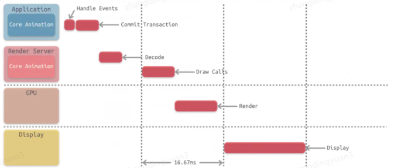

1. Application阶段(应用内)：

Handle Events：  
这个过程中会先处理点击事件，这个过程中有可能会需要改变页面的布局和界面层次。

Commit Transaction：  
此时 App 会通过 CPU 处理显示内容的前置计算，比如布局计算、图片解码等任务，之后将计算好的图层进行打包发给 Render Server。（核心Core Animation负责）  

Commit Transaction 这部分中主要进行的是：Layout、Display、Prepare、Commit 等四个具体的操作,最后形成一条事务，通过 CA::Transaction::commit()提交渲染

  * Layout：  
构建视图相关，layoutSubviews、addSubview 方法添加子视图、AutoLayout根据 Layout Constraint 计算各个view的frame，文本计算(size)等。  

layoutSubviews：在此阶段会调用，但是满足条件如frame，bounds，transform属性改变、添加或者删除view、显式调用setNeedsLayout等

  * Display：  
绘制视图：交给 Core Graphics 进行视图的绘制，得到图元 primitives 数据，注意不是位图数据，位图是GPU阶段根据图元组合而得。但是如果重写了 drawRect: 方法，这个方法会直接调用 Core Graphics 绘制方法得到 bitmap 数据，同时系统会额外申请一块内存，用于暂存绘制好的 bitmap，导致绘制过程从 GPU 转移到了 CPU，这就导致了一定的效率损失。与此同时，这个过程会额外使用 CPU 和内存，因此需要高效绘制，否则容易造成 CPU 卡顿或者内存爆炸。

  * Prepare：  
Core Animation 额外的工作，主要是图片解码和转换，尽量使用GPU支持的格式, Apple推荐JPG和PNG  

譬如在UIImageView中展示图片，会经历如下过程: 加载、解码、渲染 简单说就是将普通的二进制数据 (存储在dataBuffer 数据) 转化成 RGB的数据(存储在ImageBuffer), 这个被称为图像的解码decode, 它有如下特点:  

decode解码过程是一个耗时过程, 并且是在CPU中完成的. 也就是我们这部分的prepare中完成。  

解码以后的RGB图占用的内存大小只与bitmap的像素格式(RGB32, RGB23, Gray8 …)和图片宽高有关, 常见bitmap大小:

每个像素点大小 _ width _ height, 而与原来的压缩格式PNG, JPG大小无关.

2. GPU渲染阶段：  

主要是一些图元的操作、几何处理、光栅化、像素处理等，不一一细说，这部分操作我们能做的工作毕竟是有限的  

所以，我们大致可以做的优化点如下：

  * 预渲染\异步渲染：
  * 大致思路就是在子线程将所有的视图绘制成一张位图，然后回到主线程赋值给 layer的 contents
  * 图片异步解码：
  * 注意这里并不是将图片加载放到异步线程中在异步线程中生成一个 UIImage或者是 CGImage然后再主线程中设置给 UIImageView，而是在子线程中先将图片绘制到CGBitmapContext，然后从bitmap 直接创建图片，常用的图片框架都类似。
  * 按需加载
  * 不需要或者非首屏较为复杂的视图延后加载，减少首屏图层的层级
  * 其他：
  * 离屏渲染 尽量减少透明视图个数等等一些细节也要注意

## 4 成果

经过一些列优化，还是有一些速度的提升，虽然工程还不是大型工程，不过及早持续优化可以防止业务迭代到一定程度难以下手的地步。 
iPhone 7p多次均值 
优化前

```
[函数名:+[LaunchTrace mark]_block_invoke][行号:54]—————App启动————-耗时:pre-main:4.147820  
[函数名:+[LaunchTrace mark]_block_invoke][行号:55]—————App启动————-耗时:didfinish:0.654687  
[函数名:+[LaunchTrace mark]_block_invoke][行号:56]—————App启动————-耗时:total:4.802507
```

优化后

```
[函数名:+[LaunchTrace mark]_block_invoke][行号:54]—————App启动————-耗时:pre-main:3.047820  
[函数名:+[LaunchTrace mark]_block_invoke][行号:55]—————App启动————-耗时:didfinish:0.254687  
[函数名:+[LaunchTrace mark]_block_invoke][行号:56]—————App启动————-耗时:total:3.302507
```

pre main阶段下降平均大概20%, after main阶段平均下降大概60%, 总体均值下降30%.  
当然目前还处于未上线版本，后续上线后借助监控平台借助线上更多数据，更多机型来更好的的进行分析优化

## 5 总结

启动速度瓶颈非一日之寒，需要持续的进行优化，这当中也少不了监控体系的持续建设和优化，日常线上数据的分析，防止业务快速迭代中的启动速度劣化，对动态库的引入、新增 +load 和静态初始化、启动任务的新增都要加入Code Review机制，优化启动架构为启动这些基础性能保驾护航。
