<!--BEGIN_DATA
{
    "create_date": "2023-06-26 18:10", 
    "modify_date": "2023-06-26 18:10", 
    "is_top": "0", 
    "summary": "从代码到像素：浏览器渲染原理浅析", 
    "tags": "Web", 
    "file_name": "从代码到像素：浏览器渲染原理浅析.md"
}
END_DATA-->

#### <p>原文出处：<a href='https://km.woa.com/articles/show/581905?kmref=vkm_headline' target='blank'>从代码到像素：浏览器渲染原理浅析</a></p>

> 当看到这篇文章的时候，我猜你正在使用着浏览器，或者至少是一个浏览器内核。但你是否曾经想过，原本存储在腾讯服务器里的一串枯燥代码，到底经历了什么，才变成了丰富多彩的图文页面呢？这就要归功于浏览器的一个核心部分：渲染引擎。

## 一、从一个黑方块说起

这是俄罗斯艺术家马列维奇至上主义的代表作：

<div style="width: 200px; height: 200px; background: black; color: white">
        Black Square
</div>

它的代码很简单：

```
<!DOCTYPE html> 
<html>
<head>
    <title>Black Square</title>
    <style>
        div {
            width: 200px; 
            height: 200px;
        }
    </style>
</head>
<body>
    <div style="background: black; color: white">
        Black Square
    </div>
</body>
</html>
```

下文中，我们会基于Chromium于2021年开始正式应用的RenderingtNG渲染架构，首先明确浏览器渲染的**目标**，然后详细介绍这个黑方块渲染的**各个阶段**。文章会帮助你了解如何利用渲染原理，提高网页的渲染性能。一些概念会配有在线示例，读者可以自主操作体验。

### 渲染是什么？

浏览器的渲染主要有两个目标：

  1. 将web页面内容转化为像素显示出来；

  2. 在页面发生变化（动画、滚动、缩放）时高效地更新。

在后续介绍中，我们会依次完成这两个目标。

浏览器渲染大部分的过程发生在被沙箱隔离的**renderer process（渲染进程）**中，渲染只负责**页面内容**部分（也就是下图中的**content**）。渲染的输入包括**HTML、CSS、JS和一些外部媒体资源**，其输出为一系列**OpenGL的操作**（**OpenGL**是用于渲染图形的跨语言、跨平台的API接口 ）。在Windows中，Chrome会通过Angle组件将OpenGL转化为DirectX的操作，这些操作最终会被输出到操作系统。因此，我们关注的主要是夹在中间的各个步骤。

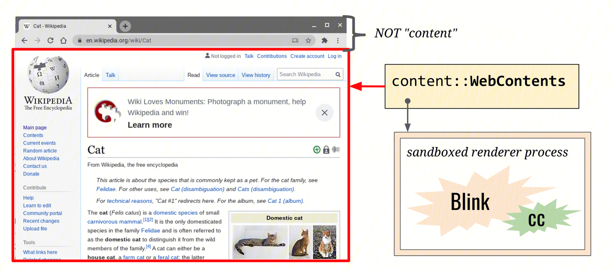

页面内容（content） - 来自 Life of a Pixel

## 二、主要流程

那么，这个黑方块到底经历了怎么样的过程，才呈现在了我们面前呢？其主要的渲染流程如下图所示：

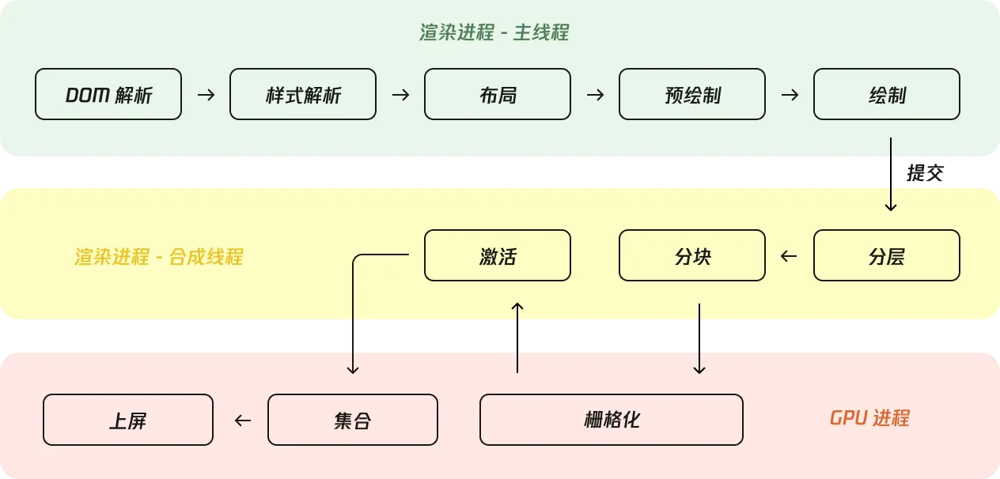

接下来，我们会抽丝剥茧依次介绍各个步骤，以及中间数据的流转。

### Step 1：DOM 解析（parse）

这一步的目的是将从网络获取到的**字节流**转化，生成DOM树。DOM树表达了整个页面的层级结构，是我们在渲染流程中遇到的第一个树。它不仅是浏览器内部的数据结构，同时也提供了API来供JavaScript脚本操作。V8引擎通过**bindings层**来与DOM的C++层通讯。

整个解析流程如下：

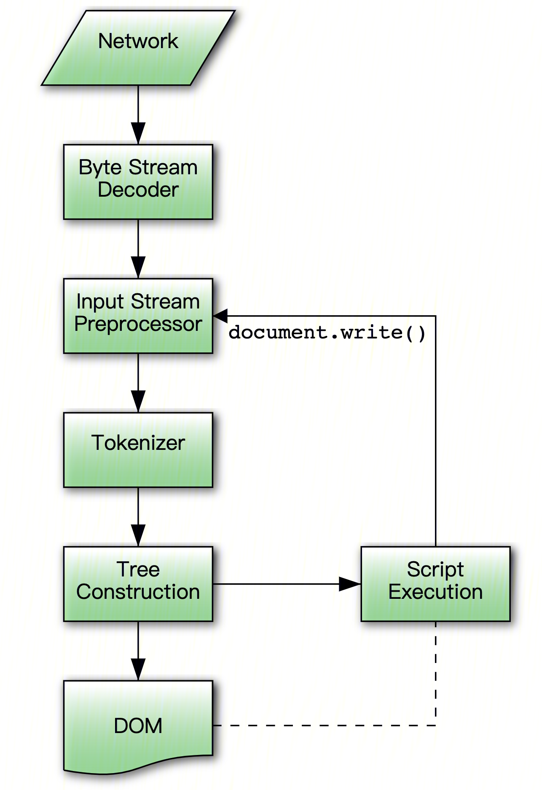

浏览器解析流程 - 来自 HTML spec

#### 解析主流程

  1. 首先，“输入字节流”通过**Byte Stream Decoder**（字节流译码器），解析为“输入流”。这一部分通过“编码嗅探算法”来确定文档的编码。  

> 编码嗅探算法中，大致优先级顺序为：BOM标志>用户设置>HTTP header>预扫描1024字节（查找meta标签）>同源父页面编码，详见[HTML 规范](https://html.spec.whatwg.org/multipage/parsing.html#encoding-sniffing-algorithm)。

  2. **Input Stream Preprocessor**主要用于将文档中的双换行处理为单换行（删除 U+000D CR）。

  3. **Tokenizer**是一个有限状态机，其输入为上文中的输入流，即Code Points流。Tokenizer能够输出六种**Token（符号）**，分别为：DOCTYPE、开始标签、结束标签、注释、字符、EOF。其中，开始和结束标签中包含了**标签名**（如span）、**标签属性**（如id=container）、**是否为self-closing （自闭合）标签**等数据。 黑方块的body部分将生成如下Token序列：  

```
start tag: body
start tag: div, style = background: black; color: white
char: Black Square
end tag: div
end tag: body
```

  4. **Tree Construction**模块接收到Tokenizer释放出的符号，用于构建DOM树。模块内部会维护一个栈，用于记录当前正在修改的DOM节点层级，称为**Stack of open elements**。栈的最外层元素就是目前正在进行修改的DOM节点，也称**当前节点**。这个阶段有一些有趣的规律，我们举例子来说明：

    * 当模块接收到一个self-closing（自闭合）的HTML开始标签（例如`<div/>`）时，模块会装作斜线“/”不存在。（注意，最新的HTML标准中不存在自闭合标签，只有空标签）  

```
<div/>
<div></div>
```

渲染结果如下，这是因为第一个div标签未闭合，而未闭合的div标签会自动闭合：  

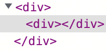  

* 当table中的元素出现的位置出错时，出错的元素会发生**foster parenting**（寄养家庭）现象。一般情况下，元素会被放置到紧靠table元素**前面**的位置。  
如下面这段代码：  

```
<table>
  <div>
    <p>在table中的p</p>
  </div>
  <tr>
    <td>CELL1</td>
    <td>CELL2</td>
    <td>CELL3</td>
  </tr>
  <tr>
    <td>CELL4</td>
    <td>CELL5</td>
    <td>CELL6</td>
  </tr>
  <span>在table中的span</span>
</table>
```

最终生成的DOM结构如下，div和span这些不应该出现在table中的标签会被寄养到table隔壁：[[示例]](https://root.shanqiaosong.com/shan/demo/foster-parenting.html)  

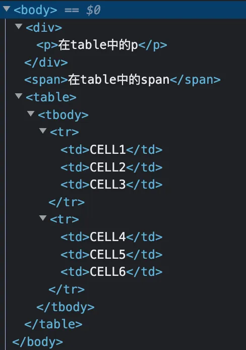  

* 当模块遇到script标签时，JS代码会立刻被执行。这也是遇到外部script时，解析会被阻塞的原因。JS可以**操作当前已经构建的DOM树**，也可以使用 `document.write` 方法**改变Tokenizer的输入流**。

* 当模块接收到字符时，遵循如下规则：如果当前节点是文本节点，则加入该节点中；否则新建一个文本节点。  

如下面代码：  

```
A<script>
var text = document.getElementsByTagName('script')[0].firstChild;
text.data = 'B';
document.body.appendChild(text);
</script>C
```

最终生成的DOM结构如下，B和C会合并为一个文本节点：[[示例]](https://root.shanqiaosong.com/shan/demo/text-node.html)

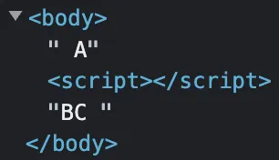  

* 整个解析过程有十分完善的**错误处理机制**，具体可以查阅[https://html.spec.whatwg.org/multipage/parsing.html#parse-errors/](https://html.spec.whatwg.org/multipage/parsing.html#parse-errors)。  

* 为了让外部资源加载更快，浏览器会另外启动一个解析流程，称为**preload scanner**。这个解析流程在发现外部资源或JS脚本时不会阻塞，而是直接进行下载，并继续向后解析。为了让preload scanner生效来加快页面加载，应该尽量避免使用JS动态注入资源。我们也可以通过rel=preload属性来明确告知浏览器预先下载资源。

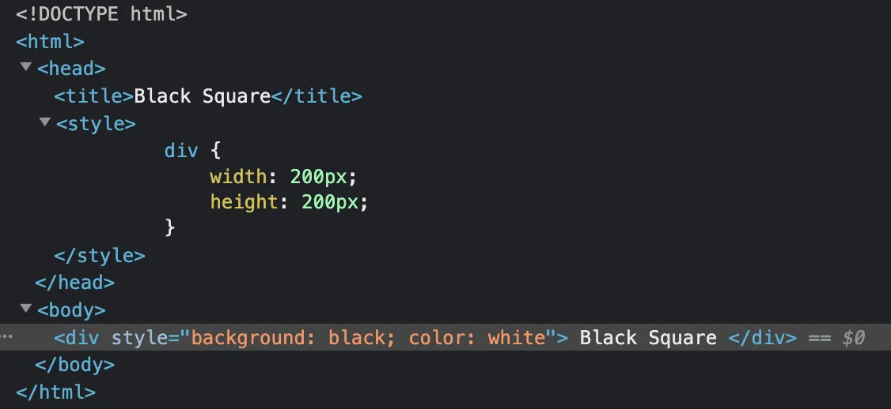

黑方块的DOM结构

### Step 2：样式解析（style）

在这一阶段，浏览器将**解析阶段**中收集到的所有CSS规则计算为DOM树中每一个元素的**计算CSS属性**（computed
style）。这一阶段会构建CSSOM对象，这个对象主要用于为JS控制CSS提供一系列API：

  1. 浏览器会有一套内置样式表，除了这套样式表之外，页面中的所有其他CSS规则都可以通过document.styleSheets访问和操作。例如：  

```
const stylesheet = document.styleSheets[0];
stylesheet.cssRules[0].style.width = "500px";
stylesheet.cssRules[0].style.height = "500px";
```

这样，黑方块就会变成更大的黑方块。

  2. 元素的内联样式可以通过DOM获取到，如：
`document.querySelector('div').style.color = "green";`  
这样，黑方块就会变成绿方块。

浏览器收集到所有的样式表后，计算其优先级，并通过StyleResolver计算每一个DOM元素的最终样式集合（所有样式的最终值），被称为计算样式（computed style）。我们也可以通过JS获取到：

```
// 新API
$0.computedStyleMap().get('font-size')
// 或者旧API
window.getComputedStyle($0)['font-size']
```

我们也可以通过Chrome的开发者工具来查看计算样式：

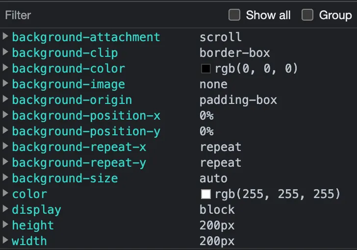

黑方块的计算样式

但注意，这些方法获取到的计算样式也包含了一部分布局阶段（layout）才会生成的信息，比如宽度和高度。

### Step 3：布局（layout）

这一阶段使用前面生成的DOM树和CSS信息，确定元素的坐标与尺寸。

#### 布局树

布局操作在**layout tree（布局树）**上进行，这个树会在上一个阶段，也就是样式（style）阶段结束时生成。layout tree的结构与DOM树大致相当，但有一些不同，比如：

  1. CSS的属性中，display为none、contents的元素**不在**布局树中出现，不参与布局（但是visibility=hidden的元素仍然会参与布局）；

  2. Inline元素会在外层被嵌套一层block，来保证布局时，兄弟节点都是inline或者都为block；

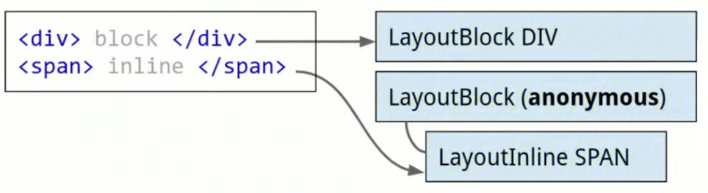

inline外层嵌套匿名block

#### 布局算法

在旧引擎的布局算法中，layout tree是一个可变的（mutable）树，会被重复使用。布局的过程就是在布局树中将各个节点的坐标计算出来的过程，输出仍然是这个layout tree。当样式改变的时候，对应的对象会被标为脏对象，重新执行布局。这种算法的弊端是输入和输出界限不清，由于布局算法十分复杂，因此需要小心地辨别哪些数据是可靠的。

blink中**新采用的布局引擎叫做layoutNG**，它实现了输入输出的隔离。对于每一种布局（布局由HTML标签和CSS的display类型决定），都有一个布局算法类[NGLayoutAlgorithm](https://chromium.googlesource.com/chromium/src/+/refs/heads/main/third_party/blink/renderer/core/layout/ng/ng_layout_algorithm.h)。算法的输入为：当前的节点（包括子节点信息和computed style）以及布局空间限制[NGConstraintSpace](https://chromium.googlesource.com/chromium/src/+/refs/heads/main/third_party/blink/renderer/core/layout/ng/ng_constraint_space.h)，算法输出为[NGPhysicalFragment](https://chromium.googlesource.com/chromium/src/+/refs/heads/main/third_party/blink/renderer/core/layout/ng/ng_physical_fragment.h)s（比如当文字换行时，会生成多个片段）。布局空间限制代表了在当前的布局空间内，哪些空间是当前元素在使用布局算法时可以占用的。除去这些输入之外，算法不能获取任何其他数据。整个引擎的输出为一个不可变的树：fragment tree。

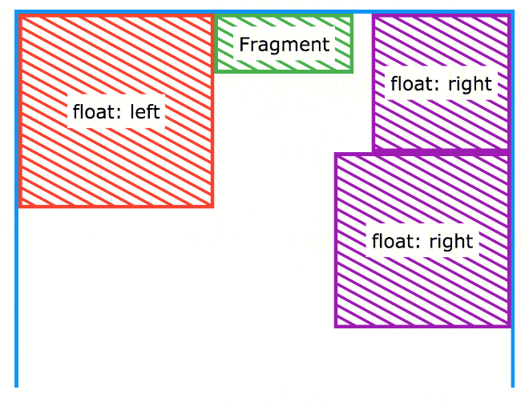

[NGConstraintSpace](https://chromium.googlesource.com/chromium/src/+/refs/heads/main/third_party/blink/renderer/core/layout/ng/ng_constraint_space.h)示例，这个空间宽度固定、高度无限，存在一些“排除”区域（NGExclusion）

下面以**Block layout**（块状布局）为例简要了解布局算法的实现。

Block布局基于BFC（block formatting context）。在每一个BFC中，都进行一次完全隔离的布局计算。不同BFC之间的布局不会相互影响。也就是说，元素浮动不会进入到其他BFC内部，并且外边距塌陷也不会在分属不同BFC的元素之间发生。

> BFC 会在以下情形下创建：  
> 1. html元素  
> 2. 浮动元素  
> 3. 绝对定位元素（ `absolute` 或 `fixed` ）  
> 4. `inline-block`  
> 5. `flow-root`  
> 6. `overflow` 不是 `visible` 或 `clip`  
> 7. `flex` 的子元素 
> 可参考 [Block formatting context](https://developer.mozilla.org/en-US/docs/Web/Guide/CSS/Block_formatting_context)。

block布局中，每一个子元素都在BFC中确定**自己的**位置。这个位置信息使用一个BFC Offset（[NGLayoutResult::BfcOffset](https://cs.chromium.org/chromium/src/third_party/blink/renderer/core/layout/ng/ng_layout_result.h)）来表示。

浮动元素定位后，会在BFC中增加一块“排除”区域，这些排除区域由[ExclusionSpace](https://cs.chromium.org/chromium/src/third_party/blink/renderer/core/layout/ng/ng_exclusion_space.h)类管理。这个类能够提供一些查询方法，比如在剩余空间中找到一块可以容纳某个尺寸的元素的布局位置，当定位其他的浮动元素时就可以用到。block布局中还需要考虑到**外边距塌陷（margin collapsing）**。考虑下面的复杂情况：

```
<div style="margin-bottom: 3px">
  <div style="margin-bottom: -5">
    <div style="margin-bottom: 7px">Hi</div>
  </div>
</div>
<!-- MarginStrut -->
<div style="margin-top: 11px">
  <div style="margin-top: -13px">there</div>
</div>
```

真正的间距算法如下： `max(3, 7, 11) + min(-5, -13) = -2` 。

在实现中，算法会维护一个 `MarginStrut` （外边距支柱）对象，夹在两个兄弟元素之间。每个元素与其上方的`MarginStrut`相绑定，称为“**当前**”的`MarginStrut`，来记录**当前位置**（当前处理的元素和上面的兄弟元素之间）最大的正margin和最小的负margin。当计算一个节点的位置时，利用递归方法，输入为当前 `MarginStrut` 和 `MarginStrut` 的坐标位置，每次递归结束后通过计算就能确认元素下方的`MarginStrut` 对象。如果当前元素存在边框或内边距，说明margin collapsing过程结束，计算当前 `MarginStrut`的最终值（最大的正margin + 最小的负margin），并加上 `MarginStrut` 的位置，作为当前元素的BFCOffset。然后开始循环对每个子元素递归这个过程，递归前将这个子元素的margin-top加入 `MarginStrut` ，递归后将输出的下方`MarginStrut` 加上子元素的margin-bottom作为下一个子元素的输入，并更新 `MarginStrut` 的位置。

具体的算法可以参见blink代码：[ng_block_layout_algorithm.cc](https://source.chromium.org/chromium/chromium/src/+/refs/heads/main:third_party/blink/renderer/core/layout/ng/ng_block_layout_algorithm.cc;drc=20911ffd8a0e1636801ddf303c17375fdedf9c83;bpv=0;bpt=0;l=2695)

下面是简单版计算示例：

```cpp
Fragment* Layout(LogicalOffset bfc_estimate, MarginStrut input_strut) {
  // 表示当前元素上方的MarginStrut，已经包含当前元素的margin-top
  MarginStrut curr_strut = input_strut;
  // MarginStrut的位置
  LogicalOffset curr_bfc_estimate = bfc_estimate; 

  // 当前元素存在border-top或padding-top，margin collapsing结束
  if (border_padding.block_start) { 
    // 计算MarginStrut的最终高度，加到MarginStrut位置上，结果就是当前元素的BFC offset
    curr_bfc_estimate += curr_strut.Sum(); 
    // 重置MarginStrut
    curr_strut = MarginStrut(); 
	 // 设置当前元素的BFC offset
    fragment_builder.SetBfcOffset(curr_bfc_estimate); 
	 // MarginStrut位置加上当前元素的border-top和padding-top
    curr_bfc_estimate += border_padding.block_start; 
  }

  // 对每个子元素进行递归
  for (const auto&amp; child : children) { 
    // 加上子元素的margin-top
    curr_strut.Append(child.margins.block_start); 
	 // 开始递归
    const auto* fragment = child.Layout(curr_bfc_estimate, curr_strut); 
    // 递归结束后，获取子元素下方的MarginStrut（不包含子元素的margin-bottom）
    curr_strut = fragment->end_margin_strut; 
	 // 加上子元素的margin-bottom
    curr_strut.Append(child.margins.block_end); 
    // 更新MarginStrut的位置
    curr_bfc_estimate = fragment->BfcOffset() + fragment->BlockSize(); 
  }
  // 循环结束后curr_strut就是当前元素下方的MarginStrut（不包含当前元素的margin-bottom）
  fragment_builder.SetEndMarginStrut(curr_strut); 
  return fragment_builder.ToFragment();
}
```

#### 示例

**用一个实际的例子进行说明layout过程，**如下面的代码：

```
<div style="max-width: 100px">
  <div style="float: left; padding: 8px">F</div>
  <br>The <b>quick brown</b> fox
  <div style="margin: -60px 0 0 80px">jumps</div>
</div>
```

会生成下面的layout tree：

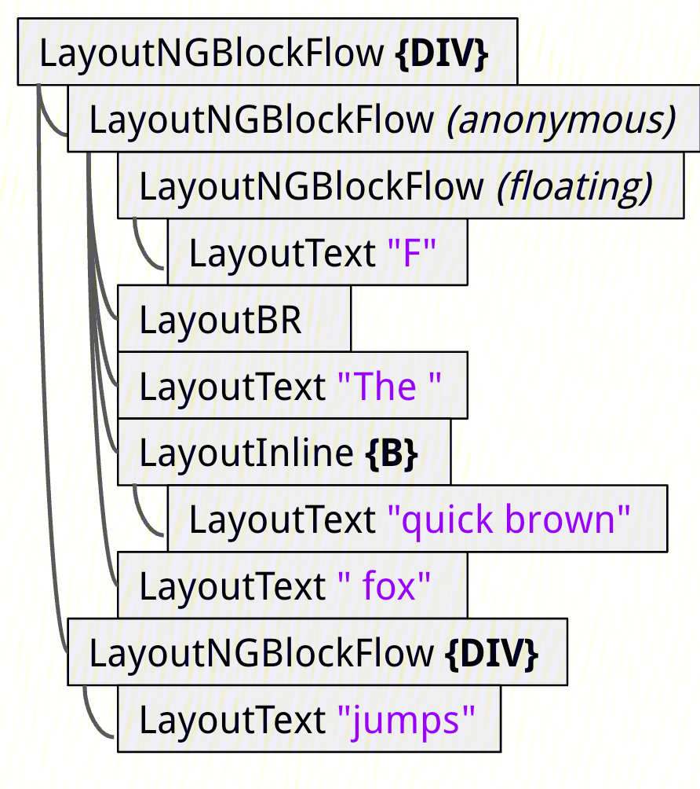

可以看到，中间插入了一层匿名块，这样能够保证同级节点都为block或都为inline。 最终生成的fragment tree如下，其中文字的排版使用了开源的HarfBuzz模块：

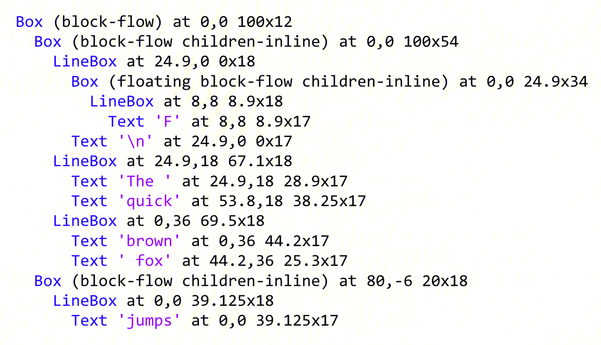

最终渲染结果：

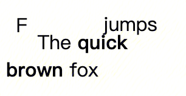

可以看到，“The”的位置在(24.9, 18)，由于F内边距为8，字符宽度为8.9，因此左侧距离一共为8+8+8.9=24.9。

### Step 4：预绘制（pre-paint）

清楚了每个元素的尺寸和位置，我们就可以基于这些信息开始进行绘制了。但绘制前，我们先考虑一个问题：当页面画面变化时，为了得到流畅的运动效果，每一秒至少需要渲染60帧。如果每次渲染都要经历整个渲染流程，会带来很大的性能开销。另外，JS的运行也发生在renderer process中，渲染的流程会与JS执行发生竞争。因此，为了达成渲染的第二个目标，也就是高效处理页面的变化，现代浏览器采用了先**分层**（layerize）后**合成**（composite）的机制进行优化，称为**合成机制**。

#### 合成的概念

合成机制是怎样优化渲染流程的呢？简单来讲，一些元素会被分在同一个图层，每个图层分别进行绘制，最终所有的图层再叠加在一起。**这个过程发生在renderer process的另一个线程中**，被称为**impl线程**（也被称为compositor thread合成线程）。

比如在下面的代码中，wobble元素被添加了动画效果。此时如果对动画元素进行分层，则在实际的渲染过程中，只需要对动画图层整体进行几何变换，再重新合成即可，前置步骤都可以省略掉。这样就能够极大提高动画效率。

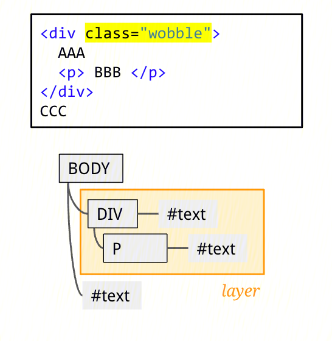

图层可以看做是DOM结构的子树


渲染结果，黄色边框为一个分层

此外，在滚动、缩放这些操作中，也仅仅需要在**合成阶段**移动、缩放、裁剪图层，这样就能够**释放renderer process的主线程**，用于其他任务（如JS的执行）。

事实上，当浏览器接收到滚动事件时，如果可以直接通过合成来进行画面更新，则主线程根本不会进行处理。但当滚动的元素没有形成图层，或存在滚动事件监听器时，滚动事件则会被转发到主线程进行处理。这些区域被标记为慢速滚动区域。我们也可以通过devtools来查看这些区域：[[示例]](https://root.shanqiaosong.com/shan/demo/slow-scrolling.html)

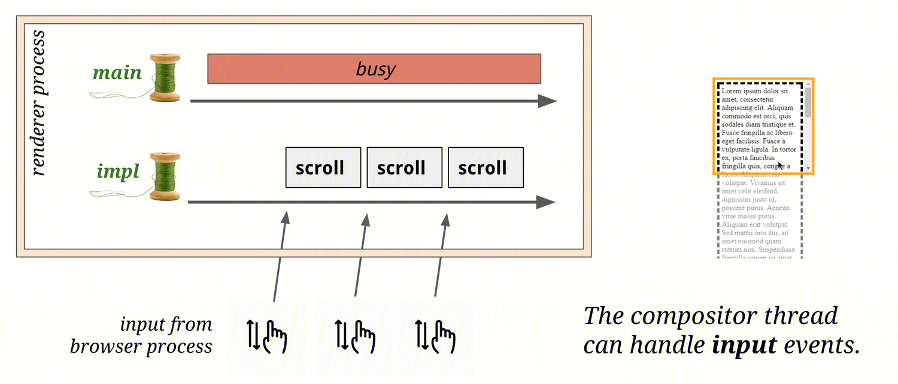

impl线程

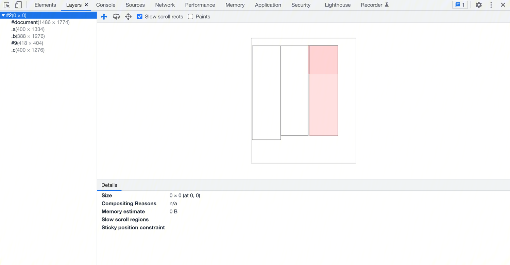

红色标识出了慢速滚动区域

#### property tree

那么到底哪些元素会被分在同一图层？这就不得不提到一个重要的数据结构： property tree。

在布局之后，会进行一个准备步骤：prepaint。顾名思义，prepaint在paint过程之前，其主要目标是生成property tree。property tree的功能是记录一个元素需要应用哪些视觉效果和滚动效果（这些效果最后会被GPU执行），比如CSS transform、filter、透明度以及滚动的位置与裁剪（overflow: hidden）等。

property tree解决了paint和composite分离的大问题。另外，IntersectionObserver的实现以及layout shift的测量也都基于property tree。每个文档都有四个不同的property tree，分别代表transform（CSS的transform）、clip（overflow的裁剪）、effect（CSS的透明度、filter、混合模式等）、scroll（滚动位置）。property tree的结构可以理解为DOM树的一个稀疏表示。比如一个文档中有3个DOM元素存在 `overflow: hidden` 的裁剪，那么clip property tree就会存在三个节点，并且其父子关系符合他们之间包含块（containing block）的关系。

通过文档的property tree，我们可以为每一个元素计算出应用于这个元素上的所有效果，这个效果是一个四元组（分别来自四个property tree），被称作**property tree state**。之后步骤中的绘制和分层就会基于我们这时生成的**property tree**进行。

#### 像素吸附

prepaint过程之前只是用于处理滚动，而现在不仅生成了上文中property tree，同时，prepaint还会进行**像素吸附**，也就是对小数像素的四舍五入。像素吸附的基本思想是元素的每个边缘都吸附到最近的像素边界。这样的算法能够保证每个边缘和元素的尺寸误差都不会超过1px，并且误差不会积累。具体算法如下：

```
left: round(left)
top: round(top)
right: round(left + width)
bottom: round(top + height)
width: round(left + width) - round(left)
height: round(top + height) - round(top)
```

### Step 5：绘制（paint）

确定了每一个片段的位置信息后，就可以进行绘制了。注意，这里的绘制只是**记录绘制的操作步骤**，而没有产生像素。这些操作步骤称为**paint ops**。绘制阶段会为每一个layout object（layout tree的节点）产生一个paint ops列表，所有的列表被集合在PaintArtifact对象中。这个对象就是绘制流程的输出结果。

#### 层叠上下文（stacking context）

绘制时，模块会参考层叠顺序来进行绘制。在每一个stacking context（层叠上下文）中，非定位元素都遵循backgrounds、floats、foregrounds、outline的顺序进行绘制，因此会出现这样的现象：

```
<body>
    <div style="background: green; color: white">
        Green Green Green
    </div>
    <div style="background: blue; margin-top: -12px">
        Blue Blue Blue
    </div>
</body>
```

渲染结果为下图，蓝色元素的背景竟然穿插在了绿色元素文字与背景之间：[[示例]](https://root.shanqiaosong.com/shan/demo/stack.html)

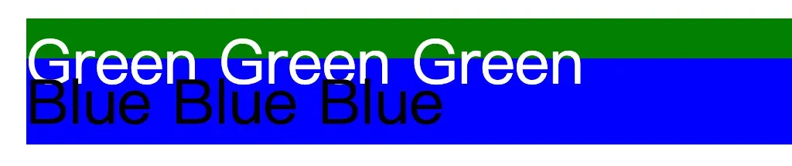

这是因为同一个stacking context中的背景都会先被绘制，然后才绘制元素的前景（即文字部分）。

> 在确定层叠顺序时，stacking context是基本的单位。在stacking context的内部进行排序，而不同的stacking context之间互不影响。

以下元素行为会产生一个stacking context：

  1. HTML 元素

  2. `position` 值为 `absolute` 或 `relative` 且 `z-index` 值不为 `auto`

  3. `position` 值为 `fixed` 或 `sticky` 的元素

  4. `opacity` 属性值小于 `1`

  5. `transform`

  6. `filter`

  7. `backdrop-filter`

  8. flex 容器的子元素，且 `z-index` 值不为 `auto` ；

  9. grid 容器的子元素，且 `z-index` 值不为 `auto` ；

> 参考：<https://developer.mozilla.org/en-US/docs/Web/CSS/CSS_Positioning/Understanding_z_index/The_stacking_context>

在stacking context内部，首先会按照z-index确定前后顺序（注意，z-index只能在定位元素上使用）。在同一z-index的元素排序顺序为（从底部到顶部）：

  1. 根元素的背景和边框

  2. 非定位元素，按照HTML出现顺序排序

  3. 定位元素，按照HTML出现顺序排序

> 一个反直觉的细节：当非定位元素有opacity属性小于1时，把它当做定位元素看待。参考：<https://www.w3.org/TR/css-color-3/#transparency>

为了便于理解stacking context的效果，参考如下代码：

```
<div class="context1">
  context1
  <div class="static"> static1 </div>
  <div class="z4">  z-index = 4  <br> absolute </div>
  <div class="zn2"> z-index = -2 <br> absolute </div>
  <div class="context2">
    context2 absolute
    <div class="z3"> z-index = 3 <br> absolute </div>
    <div class="z5"> z-index = 5 <br> absolute </div>
  </div>
  <div class="static2"> static2 </div>
</div>
```

static2透明度为1的渲染结果：

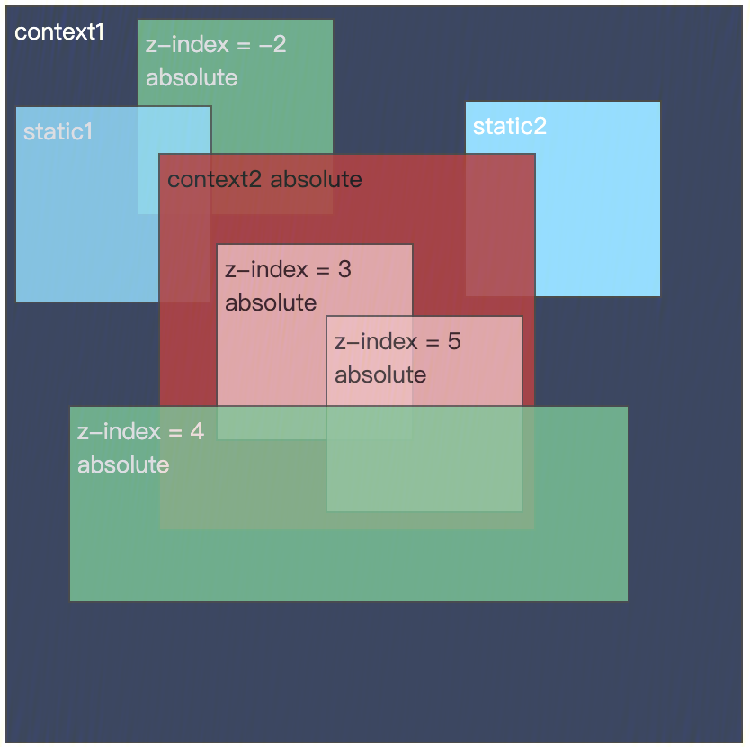

static2透明度小于1的渲染结果：

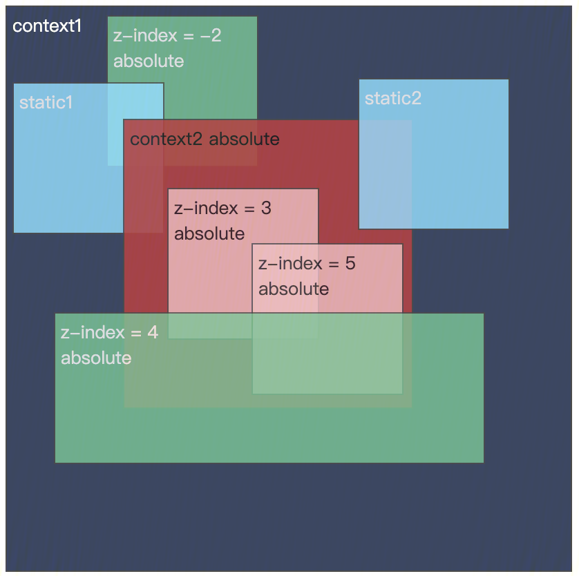

这个示例中可以特别注意的是，z-index=5的块出现在z-index=4的块下方，这是因为他们不属于同一个stacking context，因此会分开进行绘制操作，不在一起进行排序。

当将右上角的static2透明度设置为0.7时，它就会浮起到context2的上方。因为这时他们都**相当于定位元素**，且都在默认层（z-index=0），并且static2在HTML顺序上落在了context2的后面。[[示例]](https://root.shanqiaosong.com/shan/demo/z-index.html)

#### paint ops

绘制时，每一个paint ops都代表一个基本的绘制步骤，例如我们的黑方块会生成如下的paint ops。这里的详情可以在开发者工具的Layers标签中看到：[[示例]](https://root.shanqiaosong.com/shan/demo/paint.html)

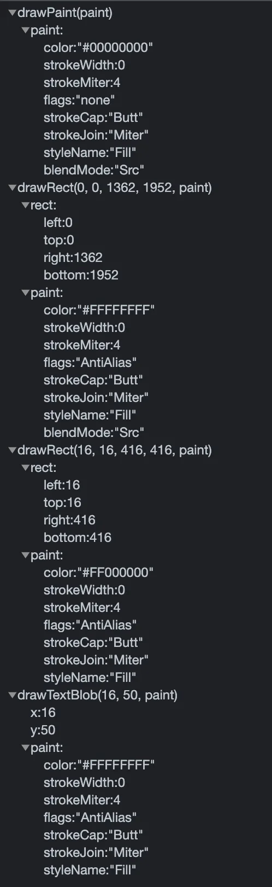

由于Chrome采用了Skia框架，因此这些paint ops都对应着Skia对画布的操作：第一步的drawPaint用于清空画布；第二步的drawRect绘制了网页的白色背景；第三步绘制了黑色的方块，可以看出左侧和上边各有16px的间距。最后绘制了前景，也就是白色的“Black Square”文字。

其中文字的部分会对每一个字符分别绘制，而字符的坐标和字形数据都来自于开源的HarfBuzz模块：

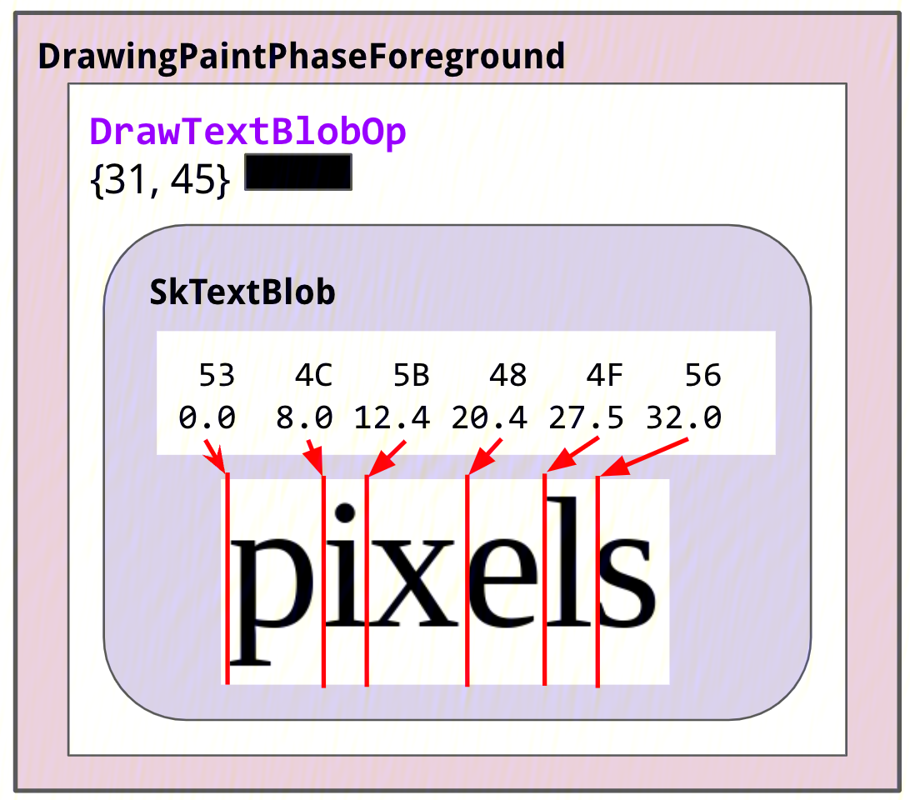

### Step 6：提交与分层（commit & layerize）

#### 提交

之前的步骤都发生在renderer process中的主线程中，而提交这一步骤，就会将paint阶段生成的paint ops（也被称为display items）与prepaint阶段生成的property tree全部传送到impl线程。还记得impl线程吗？它也被称为compositor thread合成线程，在这个线程中，会发生分层、渲染以及激活三个阶段。

#### 分层

在RenderingNG中，paint ops也被称为display items。事实上，这些绘图操作会被分组，每个组被称为一个**paint chunk**，而分组的依据就是上文中计算出的property tree state。应用了相同property tree state的display item会被分配到相同的组，这样他们就可以同时进行变换。而我们的分层（提升为图层）逻辑就依赖于这个组和它所对应的property tree state。

分层的基本原理是默认将所有的chunk都合并为一组，但如果预期这个chunk对应的property tree state（代表了应用到这个chunk的效果）会发生变化，则不合并这个chunk，将其提升为一个**图层**（composited layer）。分层后，所有图层的列表被称为composited layer list。

根据这个原理，浏览器有一系列的分层规则，包括：

  1. 根元素

  2. 可以滚动的元素

  3. 存在transform的animation或transition

  4. 3D转换

  5. position: fixed并且will-change为top、bottom、left、right

  6. will-change 样式的值为 opacity、transform、transform-style、perspective、filter、backdrop-filter

  7. 下方有其他图层

开发中，我们可以通过 `will-change: opacity;` 或者 `transform: rotateY(0);`等方式**强制将元素提升为图层**来提高渲染效率。但当图层过多时，则GPU负担会过重，因此应该节制使用。

我们可以通过Chrome的devtools查看页面的分层情况，甚至可以查看分层的原因：[[示例]](https://root.shanqiaosong.com/shan/demo/layer.html)

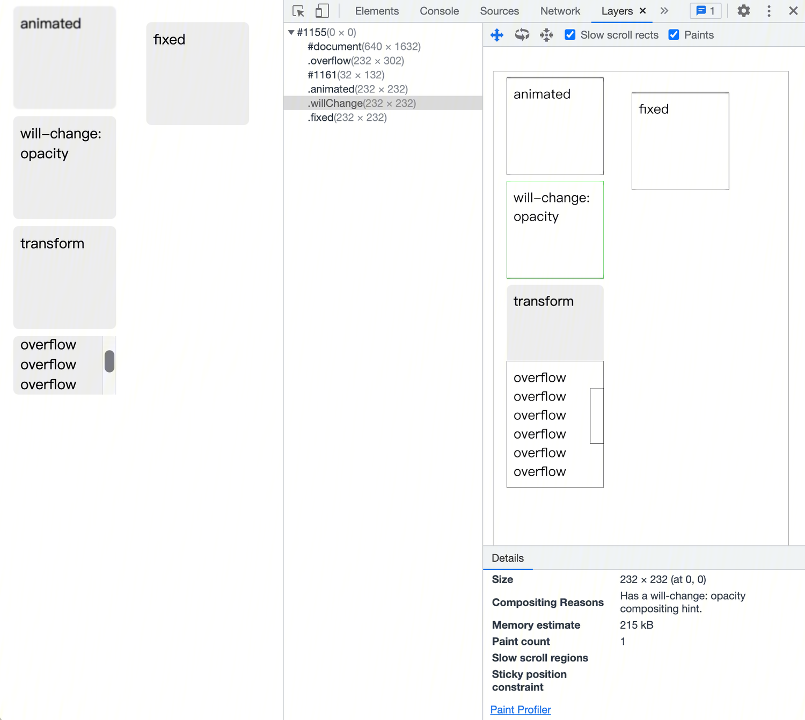

chrome devtools

### Step 7：栅格化（raster）

在之前的浏览器中，渲染过程由CPU进行，生成的点阵图则存储在内存中，在显示的时候再上传到GPU中。而现代浏览器都支持了**硬件加速渲染**，即通过GPU的着色器（shader）直接生成像素，点阵图直接存储在显存中。

我们可以通过 chrome://gpu/ 这个链接来查看浏览器是否开启了硬件加速栅格化。

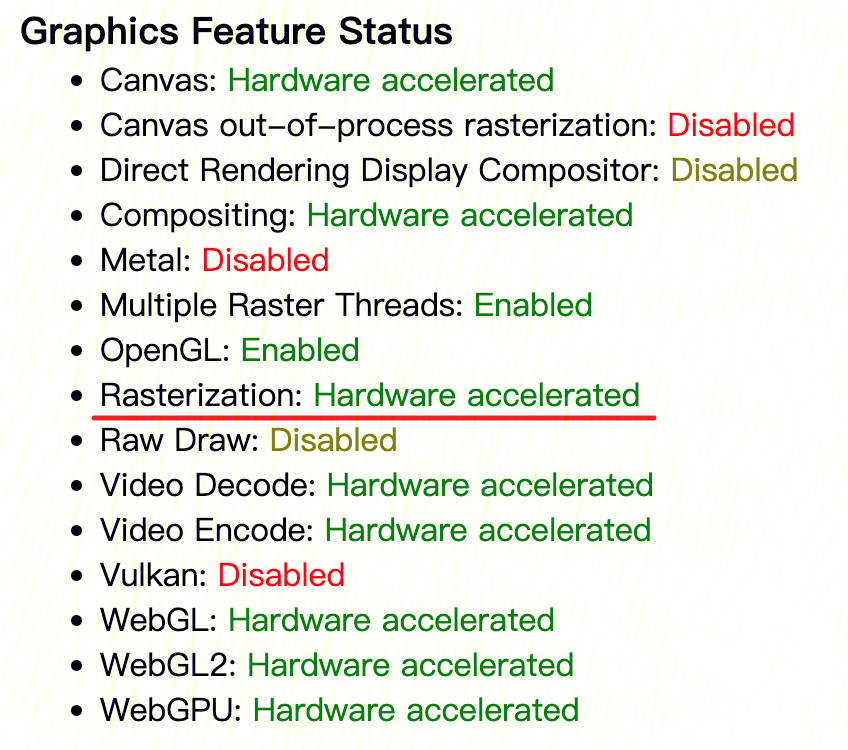

已开启硬件加速栅格化

由于render process是被沙箱隔离的，所以我们不能直接对GPU发出指令，而需要借助另外一个**GPU进程**，二者通过IPC通信。 在Chrome中，栅格化使用了**Skia库**。Skia库在Android系统、flutter中也被使用。Skia在硬件之上封装了一层，实现了抗锯齿、贝塞尔曲线、混合模式等能力。上一步生成的paint ops其实就是在对一个Skia画布[SkCanvas](https://skia.org/docs/user/api/skcanvas_overview/)进行一系列操作，而Skia内部则将这些操作转换为OpenGL的一系列命令。

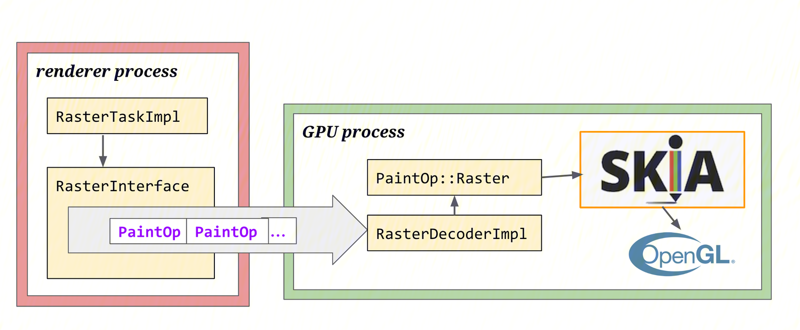

render process将paint ops发送到GPU process

这种隔离有两个好处：当浏览器遇到恶意代码时，可以阻止代码操作计算机硬件；另外当计算机硬件不稳定时（如GPU出错），也不会影响网页进程。

我们注意到，这里通过IPC传输的paint ops是与平台无关的。Skia会抹平各平台的差异。

### Step 8：分块、激活、集合与上屏（tile, activate, aggregate & draw）

#### 分块（tile）和激活（activate）

由于一些层可能比较大，因此Chrome对大图层进行分块（tiling）。不同的图块（tile）可以并行栅格化，并且可见块的优先级较高，这样能够加快栅格化的速度。栅格化还可以指定不同的分辨率，可以在缩放时渲染出合适的图块。

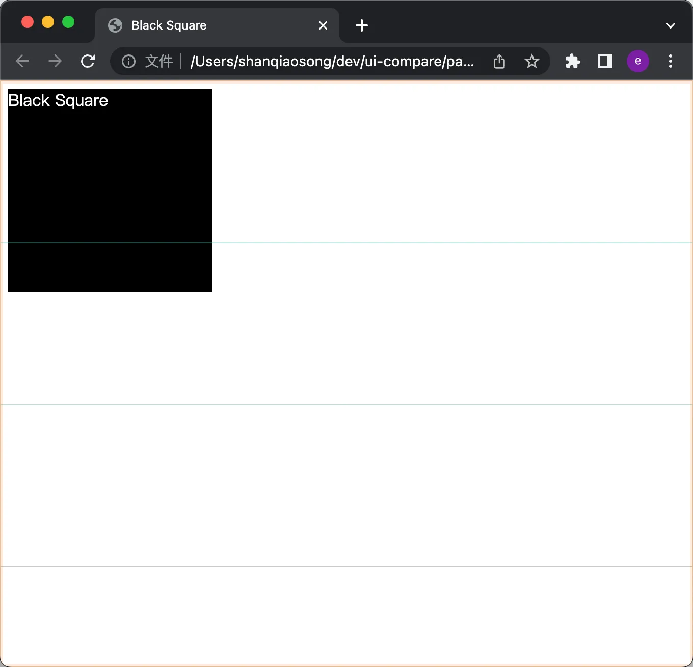

黑方块页面被分为了 1个图层（橙色边框）和4个图块（蓝色边框）

栅格化结束后，impl线程会生成多个**四边形**（DrawQuad）。四边形是用于GPU显示图形的数据结构，指定四边形的顶点位置与纹理，就可以在屏幕中显示出来。由于栅格化的结果存储在显存中，因此四边形只需要携带位图的指针作为纹理，发送到GPU进程进行显示即可。同时，四边形还要携带prepaint阶段生成的property tree，用于对四边形进行变换。

所有图层上的所有四边形被包裹成一个CompositorFrame，发送到GPU进程中。这个过程叫做激活（activate）。CompositorFrame就代表了合成线程产生的动画的一帧（时间意义上的一帧）。每个CompositorFrame都会有一个标识符：surface ID，这样iframe的显示就可以通过引用一个surface ID来实现。

> 为了实现一些滤镜、混合模式等效果，必须进行多次渲染，因此实际上一个CompositorFrame会由多个render pass组成，每个render pass则是一个四边形的列表。具体可以阅读 <https://developer.chrome.com/articles/renderingng-data-structures/#intermediate-render-passes>

#### 集合（aggregate）

每一个页面甚至跨域的iframe都会产生一个独立的renderer进程，产生独立的CompositorFrame；浏览器自身的UI（导航栏、Tab栏）的显示也会生成一个CompositorFrame。所有的CompositorFrame都会被发送到GPU进程中（也称为vis进程），组合成一个全局唯一的CompositorFrame，这个过程称为集合（aggregation）。GPU会最终执行这个CompositorFrame产生屏幕上的像素，完成上屏（draw）。

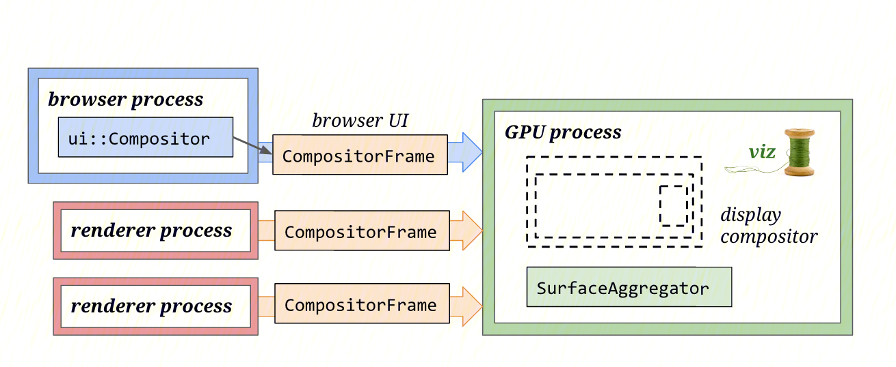

所有的CompositorFrame都被发送到GPU进程

### 拥抱变化：重排与重绘（reflow & repaint）

为了应对页面的变化，渲染引擎会经历重排和重绘两个关键过程。重排指重新进行布局；重绘指重新进行绘制。二者都是十分耗时的操作，因此在开发中，需要尽量减少二者发生的频率。

  1. 变更DOM布局、改变窗口尺寸会导致重排；

  2. `display: none` 会导致layout tree发生变更；而 `visibility: hidden` 不会。因此前者会导致重排，后者不会；

  3. 通常情况下，改变节点尺寸、位置会导致重排；而通过transform改变位置和尺寸只会导致重绘。

为了减少重排，有这些技巧：

  1. 使用 `el.style.cssText` 或 `el.className` 来统一改变样式，而不是每个样式单独修改；

  2. 批量处理DOM。可以使用 `documentFragment` 来临时存储DOM，或者先通过 `display: none` 隐藏，修改后再进行显示；

  3. 先统一查询DOM样式，再统一修改。

如下面代码中，反复查询并设置，就会导致反复重排，影响性能：

```
var box1Height = document.getElementById('box1').clientHeight;
document.getElementById('box1').style.height = box1Height + 10 + 'px';

var box2Height = document.getElementById('box2').clientHeight;
document.getElementById('box2').style.height = box2Height + 10 + 'px';

var box3Height = document.getElementById('box3').clientHeight;
document.getElementById('box3').style.height = box3Height + 10 + 'px';

var box4Height = document.getElementById('box4').clientHeight;
document.getElementById('box4').style.height = box4Height + 10 + 'px';

var box5Height = document.getElementById('box5').clientHeight;
document.getElementById('box5').style.height = box5Height + 10 + 'px';

var box6Height = document.getElementById('box6').clientHeight;
document.getElementById('box6').style.height = box6Height + 10 + 'px';
```

通过devtools的性能工具，我们看到：[[示例]](https://root.shanqiaosong.com/shan/demo/reflow-bad.html)

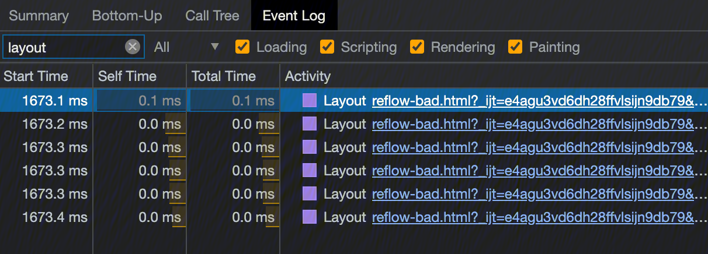

共进行了六次重排。将读取和写入操作分离：

```
var box1Height = document.getElementById('box1').clientHeight;
var box2Height = document.getElementById('box2').clientHeight;
var box3Height = document.getElementById('box3').clientHeight;
var box4Height = document.getElementById('box4').clientHeight;
var box5Height = document.getElementById('box5').clientHeight;
var box6Height = document.getElementById('box6').clientHeight;

document.getElementById('box1').style.height = box1Height + 10 + 'px';
document.getElementById('box2').style.height = box2Height + 10 + 'px';
document.getElementById('box3').style.height = box3Height + 10 + 'px';
document.getElementById('box4').style.height = box4Height + 10 + 'px';
document.getElementById('box5').style.height = box5Height + 10 + 'px';
document.getElementById('box6').style.height = box6Height + 10 + 'px';
```

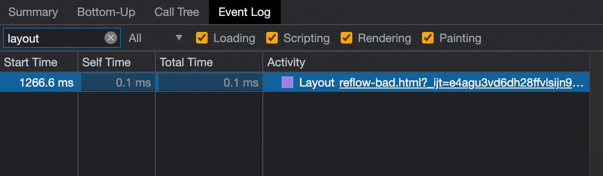

查看devtools，只发生了一次重排。[[示例]](https://root.shanqiaosong.com/shan/demo/reflow-good.html)

## 三、总结

下面对渲染完整的流水线进行总结：首先网页数据会进入渲染进程的**主线程**：生成DOM树（parse），解析CSS计算computed style（style），合成layout tree以便于布局。根据不同的布局来应用相应的布局算法，生成fragment tree（layout）。依据要应用的样式来生成property tree（prepaint），生成paint ops（paint），将两者提交到impl线程（commit）。**impl线程中**：根据规则对paint操作进行分层（layerize），分块（tile）后发送到**GPU进程**进行异步栅格化（raster）。栅格化结果会在impl线程中生成四边形DrawQuad，经过激活（activate）发送到**GPU进程**中进行集合与显示（aggregate & draw）。

见下图，流水线节点的颜色代表这个过程发生的位置，绿色代表主线程，黄色代表impl线程，橙色代表GPU进程。

当发生变更（如滚动、动画）时，如果可以通过合成特性来变更画面，则可以直接在impl线程中处理。impl线程直接修改对应的property tree来响应滚动和动画，无需进行布局、绘制、栅格化等过程。否则还需要在主线程中重新处理。因此在下图中，animate和scroll采用了两种颜色进行标识。

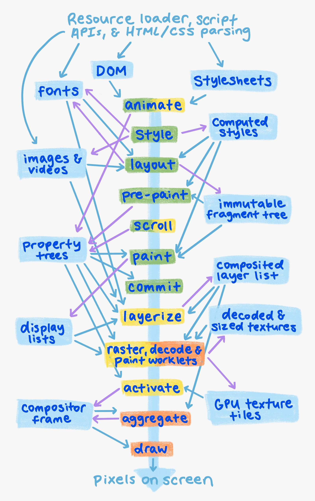

所有流程

<div align="center"><div style="width: 200px; height: 200px; background: black; color: white">
        黑色方块诞生了。
</div></div>

## 参考文献：

1. <https://docs.google.com/presentation/d/1boPxbgNrTU0ddsc144rcXayGA_WF53k96imRH8Mp34Y/edit#slide=id.ga884fe665f_64_753>
2. <https://chromium.googlesource.com/chromium/src/+/main/third_party/blink/renderer/core/layout/ng/BlockLayout.md>
3. <https://chromium.googlesource.com/chromium/src/+/main/third_party/blink/renderer/core/layout/ng/README.md>
4. <https://developer.chrome.com/articles/layoutng/>
5. <https://developer.chrome.com/articles/blinkng/>
6. <https://web.dev/preload-scanner/>
7. [https://html.spec.whatwg.org/multipage/parsing.html](https://html.spec.whatwg.org/multipage/parsing.html#encoding-sniffing-algorithm)
8. <https://developer.mozilla.org/en-US/docs/Web/Guide/CSS/Block_formatting_context>
9. <https://docs.google.com/document/d/1uxbDh4uONFQOiGuiumlJBLGgO4KDWB8ZEkp7Rd47fw4/edit#heading=h.x9ezjanpnt4j>
10. <https://developer.chrome.com/articles/renderingng-architecture/>
