<!--BEGIN_DATA
{
    "create_date": "2022-08-05 12:10", 
    "modify_date": "2022-08-05 12:10", 
    "is_top": "0", 
    "summary": "从内存角度透视现代C++关键特性", 
    "tags": "C/C++", 
    "file_name": "从内存角度透视现代C++关键特性.md"
}
END_DATA-->

#### 
原文出处：<a href='https://mp.weixin.qq.com/s/y9qbKWu_cwkbqH9Vw1Ewig' target='blank'>从内存角度透视现代C++关键特性</a>

C++是一门复杂的语言，每一个语言点上都有几种甚至是十几种组合等你去决策。Boolan首席软件专家李建忠老师结合20年来开发、教学的经验揭秘：通过内存，将C++核心特性串联起来：

内存是C++类型系统在运行时的载体；

内存管理正确与否直接决定C++程序的正确性；

内存是C++性能攸关的重要组成部分。

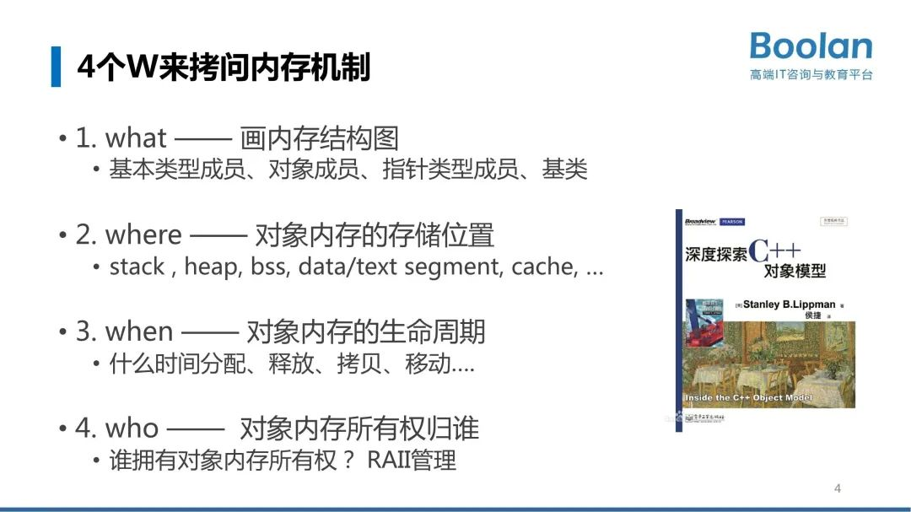  

## 从内存机制看移动语义

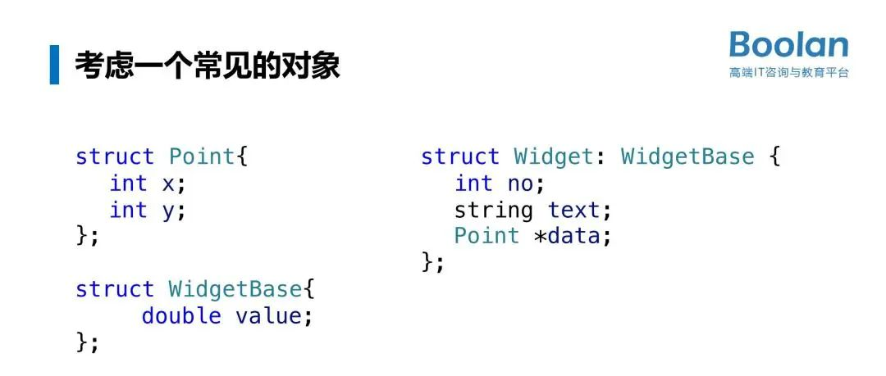

我们先来看一个常见的、很典型的对象（上图右），它具备了几种不同类型的成员，那这样一个对象在移动的时候应该如何去考虑？在C++里面理解移动你必须要先理解深拷贝。

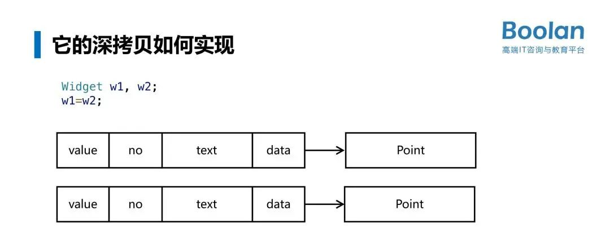

上图是widget的内存结构图。value是从基类继承过来的，需要注意的是它从基类继承过来往往放在对象的第一个。也就是基类在内存的排布上是排在你自己的数据成员的前面，如果有多个基类是按照声明基类的顺序。string需要特别注意的是：string内部实现了一个叫小对象优化，字符串小于23个字符默认放在栈上，超过23个字符就需要放在堆上。

这样一个对象w1,假如我要对他进行一个深拷贝，w1=w2。深拷贝当然不是默认就能获得的，三法则、五法则要求有指针成员的类必须要去写它的深拷贝。自定义深拷贝要做什么？针对我们这个类有4个步骤：

1. 拷贝WidgetBase基类

2. 拷贝 基本类型 int no;

3. 拷贝 对象类型 string text; （调用拷贝函数）

4. 深拷贝指针类型 Point* data; （创建堆内存指针，调用Point拷贝函数）。

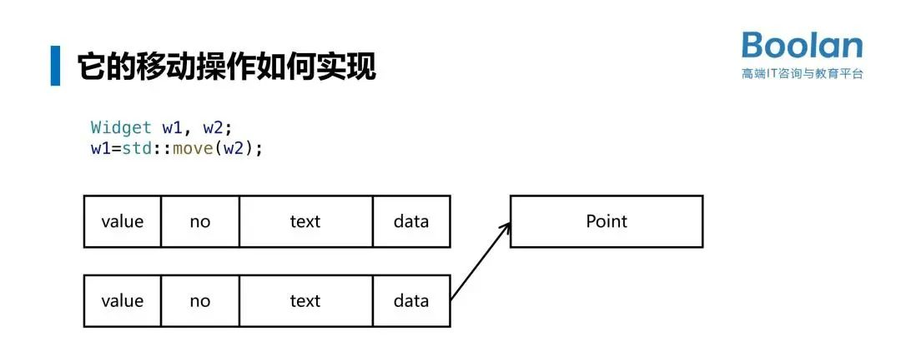

理解了深拷贝，接下来要理解移动操作怎么做？也是四个步骤：  

1. 对WidgetBase基类执行 std::move

2. 拷贝 基本类型 int no;

3. 移动 对象类型 string text; （调用std::move函数）

4. 移动指针类型 Point* data; （将当前指针设为nullptr） 

和深拷贝一样，如果想要记忆、背诵这四条规则是比较难的，最好的做法是画出内存结构图。这样才能确保滴水不漏的把每一个成员都进行了合适的移动、拷贝。

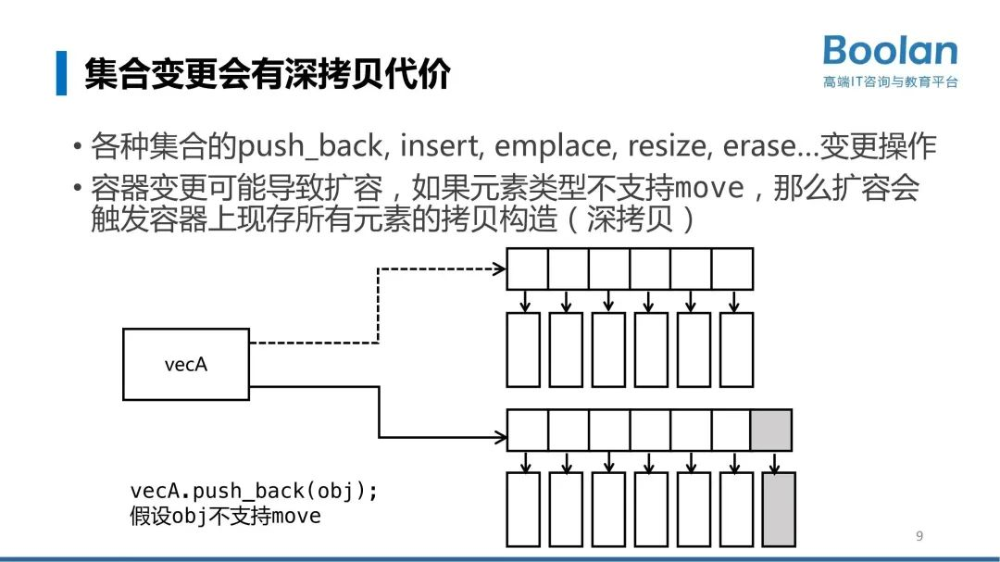

类似vector这样的一些容器有`push_back`, insert, emplace, resize, erase等等这些变更操作，这些变更会导致集合可能扩容。一旦扩容会新建一个新的数组，它的长度是前面的double。然后它把上面要拷贝一下，这个时候拷贝的话如果你不支持移动它就要执行深拷贝，老对象都要经历一遍深拷贝。这个实际上是很浪费的，因为这些弄完都是要删除的。  

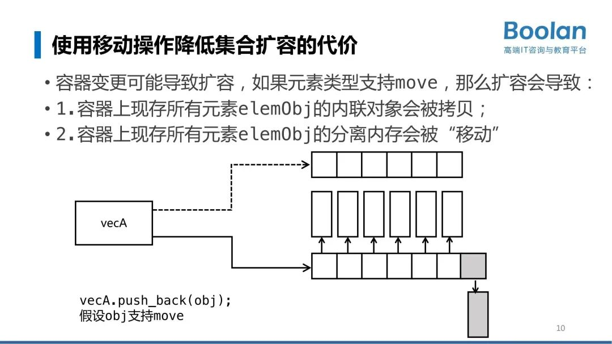

如果支持移动呢？内存结构会如何变换？针对容器中内联对象进行拷贝，里面的指针对象是用移动。这个得到的性能提升是非常可观的。

## 从内存机制看智能指针

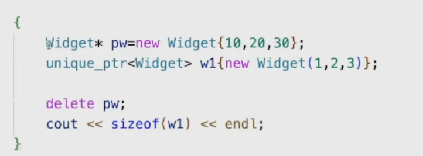

我在这段代码中创建了一个裸指针的对象和智能指针的对象，那这两个有什么区别。

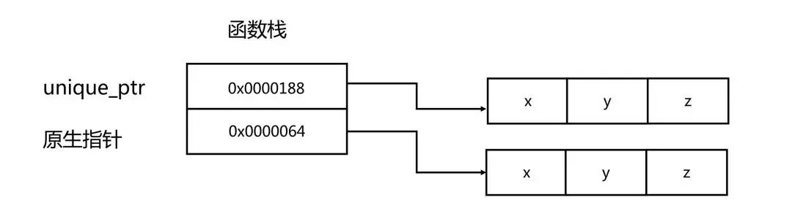

从内存结构图来看裸指针和原生指针在目前来说没有形成差别。  

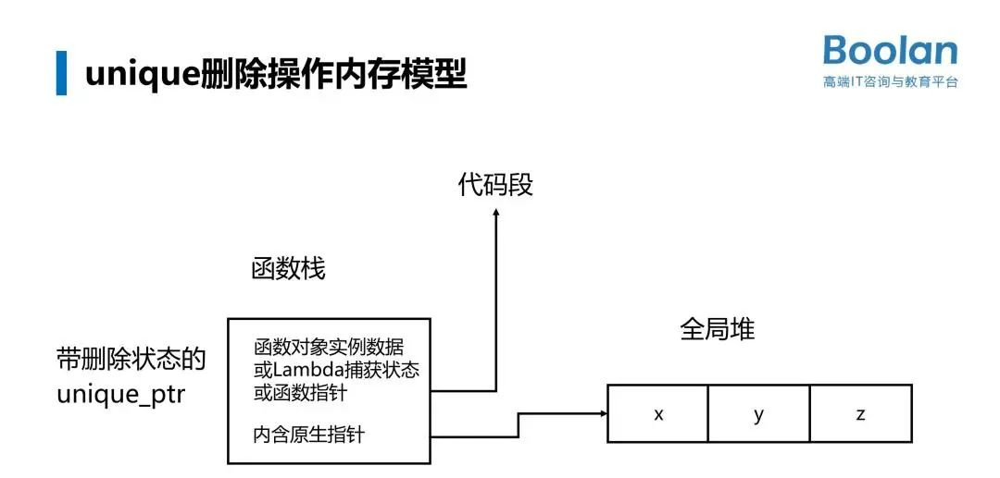

`unique_ptr`它可以指定一个删除的回调函数，这个时候内存结构就发生变化了。

再来看`shared_ptr`,比如共享指针，我们来看下面代码

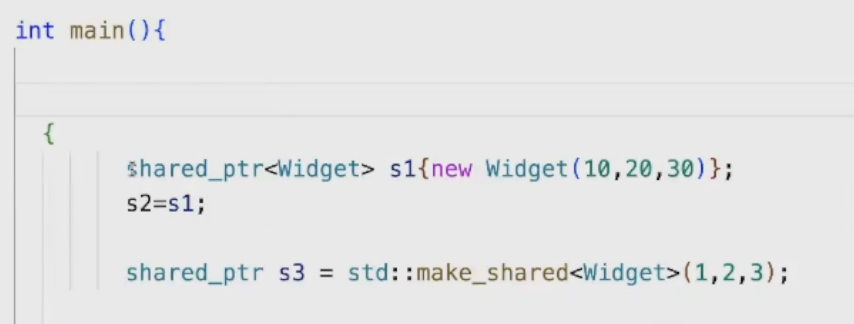

这个是一个共享指针,它的内存模型图是怎么样子的？这个结构非常复杂。

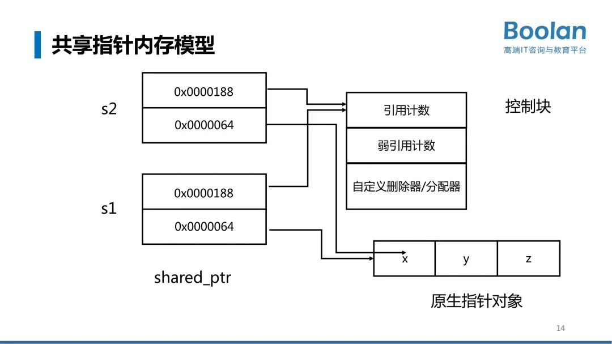

s1和s2里面都有两个指针，一个是指向原生对象的指针，在往上`shared_ptr`固定有一个叫做控制块指针，这个控制块指向了有弱引用计数、引用技术还有一个自定义删除器的结构。s2的原生对象指针跟s1指向的是一样的。控制块指针指向也是一样的。它只要有这个控制块，引用计数就会加1，`shared_ptr`的拷贝构造就是对引用计数加1，不会真正做深拷贝。所以你从这里可以很清晰的看到`shared_ptr`在背后共享的结构是什么样子的。

`shared_ptr`有个特别有意思的东西叫做`make_shared`,它叫原位构造，它甚至会导致一些奇奇怪怪的性能问题。通常来说它的性能是更好的，默认的`shared_ptr`创造出来的是这样一个结构（下图）。

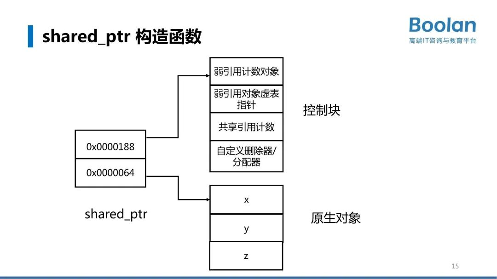

`make_shared`它会将两块不同的内存放成一块内存，好处就是堆上内存块数越多，内存碎片的可能性越高。而且会导致内存本地局部性比较差，可能会发生cache missing这样的性能损失。

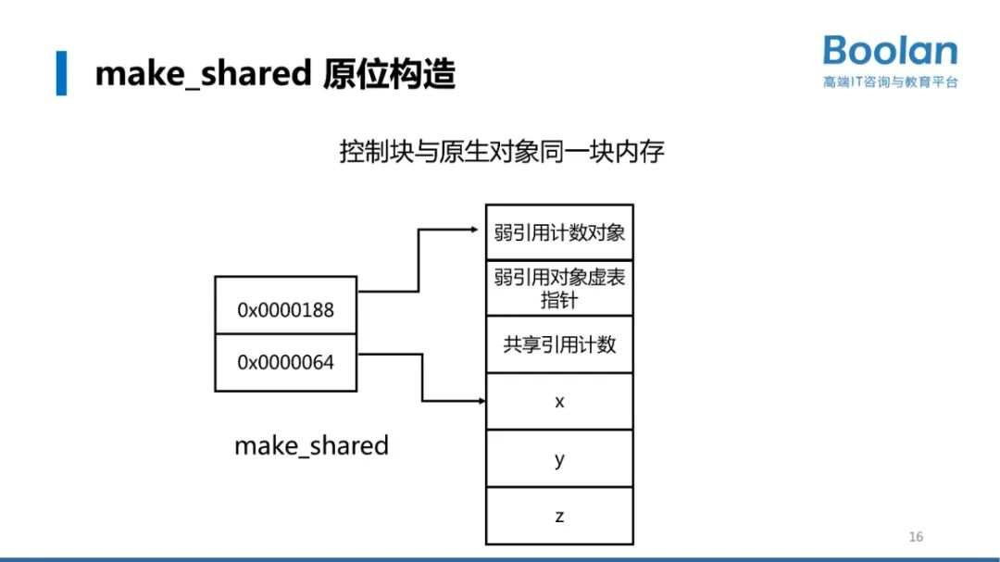

有一些特殊的场景，`make_shared`并不见得那么好，很可能会导致性能损失。简单用这个图来说就是：如果`shared_ptr`默认构造你构造出来然后转成一个弱引用，弱引用对应的共享强引用指针的计数如果变成0的话，弱引用会把xyz这一块对象删掉。如果你的弱引用本身没有析构的话，没有销毁的话，你的弱引用计数块还会在。如果在这种情况下用`make_shared`创造的话，xyz就不能被删掉。这个时候怎么办，只能弱引用的时候只能把上下两块东西绑定在一起，它的生命周期会被拖大延长。

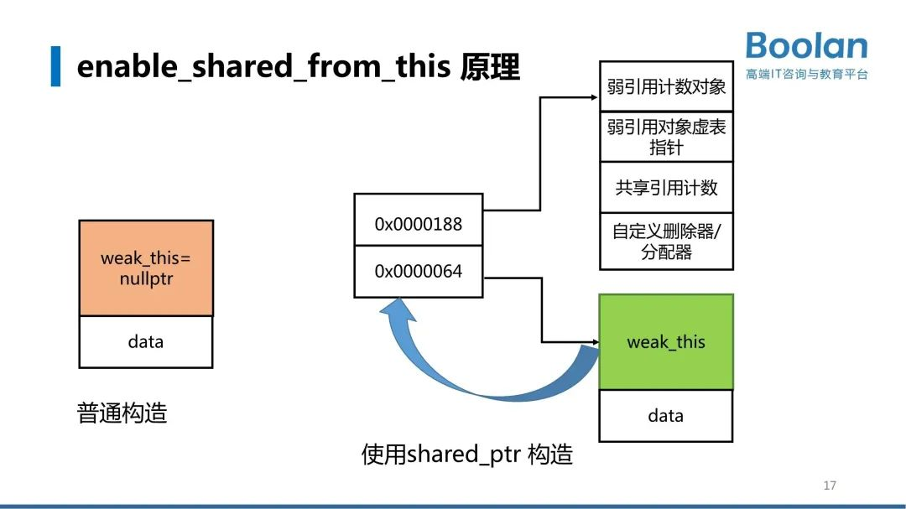

把this指针包装成一个`shared_ptr`传出去是完全错误的，双重所有权会导致this对象被删除。那么应该怎么做呢？很多教科书上或者领导会告诉你，要给这个类加一个`enable_share_from_this`，调用的时候调用`enable_share_from_this`，更好一点的可以加一个工厂函数。这个结论的内存原理是什么呢？

如果你用`shared_ptr`构造this的话，原生对象继承`enable_share_from_this`它里面有一个字段，`weak_this。weak_this`是一个弱引用指针，弱引用指针和`shared_ptr`共享计数，使得如果你这个当前对象的强引用指针`shared_ptr`指针引用计数变为0，这个弱引用就不起作用了。

## 从内存机制看lambda表达式

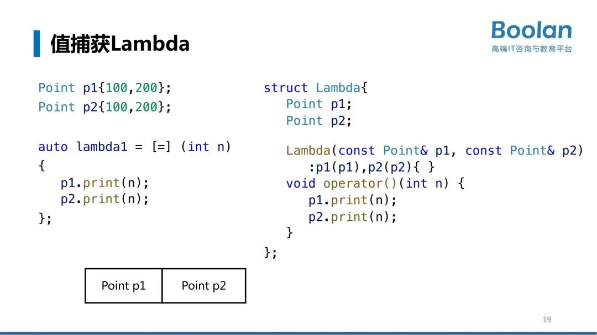

lambda表达式也是一个特别容易出问题的机制，大家写lambda值捕获，别人通常会告诉你值捕获过来之后，如果你里面改了东西，它对外界没有影响。它背后的原理是什么？

值捕获是把p1,p2变成里边的字段了，变成里面的数据成员了，然后这个数据成员通过lambda，你可以假设它有个构造函数，从外部拷贝，p1拷贝构造、p2拷贝构造。如果你的类里面支持的是一个深拷贝，那拷贝构造过来当然对外界没有影响了。内部怎么更改对它也不影响。所以lambda的内存结构就是这个样子。

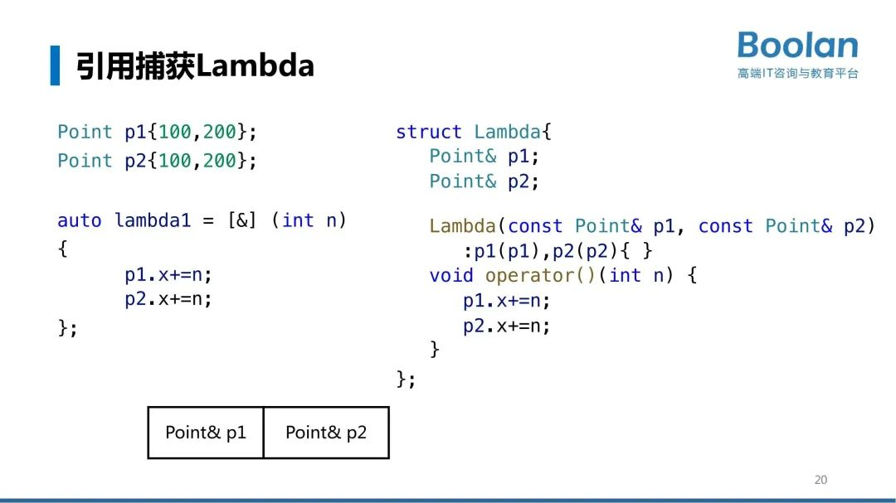

第二个，这把一个等号改成引用，这是lambda的值捕获变成引用捕获。大家看point&符号（上图右），那也就是它里面这个引用字段，这里面存的引用实际上就是一个指针，这个指针的大小也就是八个字节。  

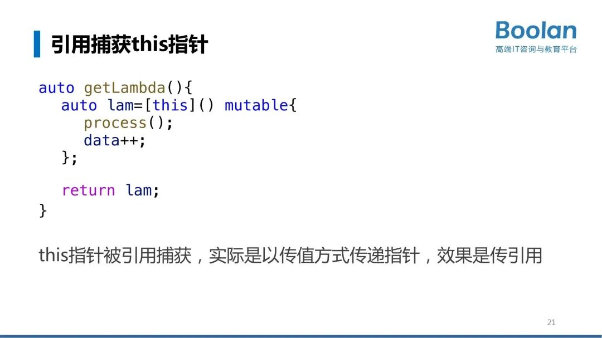

lambda捕获this结构是什么样子，它就是一个指针指向你的那个对象。你所在这个对象的生命周期要注意去管理它。如果它是在栈上，它被析构了你这个this当然是有问题的，如果在堆上你也的确保它不能delete。

因此lambda后来又发展出来：怎么确保未来生命周期跟lambda是同步的呢，有一个技巧是：用前面的`enable_share_from_this`这个结构，作为它的基类，然后用`self=shared_form_this`放到捕获里面。这个捕获有一个好处是可以保证它的生存周期跟你同步。
