 
<!--BEGIN_DATA
{
    "create_date": "2020-11-05 12:02", 
    "modify_date": "2020-11-05 12:02", 
    "is_top": "0", 
    "summary": "从基础科学看科技创新", 
    "tags": "其它", 
    "file_name": "从基础科学看科技创新.md"
}
END_DATA-->

#### 
原文出处：<a href='https://mp.weixin.qq.com/s/T14deU1X8E9bmI7ADWc0jw' target='blank'>从基础科学看科技创新</a>

说起科技创新，不得不提那句“摸着美帝过河”的玩笑话，虽是玩笑，却也一定程度概括了咱们这几十年科技发展的大体思路。不过摸了几十年，美帝会被摸秃噜头吗？万一秃了，往后的路可咋整？这是一个大话题，咱从头说起。

## 科技断层

捋一捋盘根错节的现代科技，个人认为，有这么几个断层。

以尚待验证的大一统**弦理论**为起点，由弦形成基本粒子和基本作用力，粒子通过作用力构成原子，再由原子构成物质，物质形成材料，撑起了诸如材料、化工、机械、电气等制造业。这一大块算是被揉到了一起，本僧称之为**现代科技的第一大板块。**

第一大板块虽然仍有大量空白，但总体上没有明显断层，所以《芯片》一文可以从电子属性开始，一直讲到计算机原理。但是，人类无法从化学反应开始，一步一步严格推导出细胞活动。

于是，**从物质到生命，出现了现代科技的第一个断层。**

绕过断层，由细胞出发，到组织器官，再到个体生命，就连贯多了，撑起了生物学、医学、营养学、农学等产业（本文笼统称为生物学和医学），构成了现代科技的第二大板块。

**第二大板块自成体系，多是宏观经验总结，很少有严密的微观过程。**比如，病毒侵入体内，人体就会启动免疫系统，生物学家可以自信满满的把免疫应答过程描述一遍。不过，这些细胞活动一环扣一环的反应方程式，没人能写下来，以至于很多吃瓜群众一直怀疑生物体到底是不是由化学反应驱动的。

**下一个断层就更离谱了：从生命到思维。**  

从一颗受精卵开始，细胞长着长着就出现了思维，大脑有了思维，人就有了人性，事儿就复杂了。一大堆各怀鬼胎的人混在一起形成群落，产生了心理学、社会学、政治学、经济
学、教育学、宗教文化……

**第三大板块统称社会科学，其规律更加依赖宏观实践总结。**没有人会从大脑的物理化学反应出发，推导出个人行为，进而再预测出群体行为，最后制定相关政策。也没有人能精确说明，哪些化学反应控制着人的性格和智商。再或者，把三岁小孩打一顿，对他未来成长会产生哪些影响。

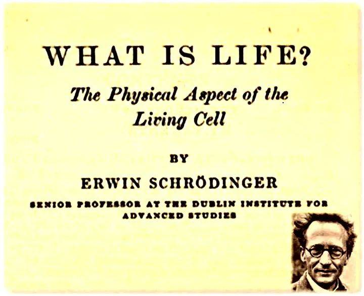
  
以物理学那种大包大揽的性格，必然是想打破所有壁垒，统一物理学、生物学、社会学。其中，**量子力学奠基人****薛定谔**是第一个吹响号角的物理学家，代表作《生命是什么：活细胞的物理学观》，其**核心思想是：在生命体内运行的所有规律，必须符合基本的物理定律。**

可惜，那个年代的生物学、医学，甚至化学，都跟儿戏似的，看病全靠缘分，这导致很多科学家认为生命是独立于物理化学规律之外的一种特殊现象。这个一两百年前的话题，至今仍然甚嚣尘上，只不过争辩双方从科学家换成了吃瓜群众。

好在分子生物学总算姗姗来迟，犹如黑暗中一道闪电，努力打通着三大板块之间的壁垒，试图从分子层面阐明生命现象的本质，迈出了万里长征的第一步。

举俩例子。大脑中5-羟色胺的减少，会使人对悲观情绪特别敏感，表现为焦虑抑郁；5-羟色胺增加后又会使情绪稳定，遇事不慌，妥妥的领导气质。去甲肾上腺素的不足会导致意志薄弱、情绪低落、思维迟钝，俗称懒惰；而充足的去甲肾上腺素可以提高大脑专注度和判断力，让人化身工作狂。

这条路若是能一路走到底，还挺期待一万年后人类是个啥模样，不知道是否可以预设智商情商性格。

## 油尽灯枯的第一板块？

要聊这个话题，还得把时间拉长点。

第一次工业革命，技术是蒸汽机，理论是热力学。  

理论和技术几乎不分先后，甚至可以说，热力学理论就是在革命中成长起来的。

第二次工业革命，技术是电气工程，理论是电学磁学。

1831年，法拉第发现电磁感应（理论），1866年，西门子发明第一台实用发电机（技术）。1865年，麦克斯韦统一电磁学（理论），1895年，马可尼进行首次无线电通信（技术）。理论和技术隔了30年。

第三次工业革命，代表技术是计算机，理论是量子力学。

1900年，普朗克提出量子假说，1956年，人类第一台晶体管计算机问世，中间隔了50年。这个算法稍微有点牵强，毕竟从量子力学到能带理论就折腾了二三十年，不过先不管了，糊涂账就这么算着。

第四次工业革命，没有力挽狂澜的标志性技术，什么原子能、新材料、航天、纳米、生物、人工智能都来凑数，这样组团闹革命到底算不算革命一直有争议。至于革命理论嘛，还是以量子理论为主，这你也好意思叫革命？只有生物技术是个例外，生物技术的理论基础显然不是物理学，这中间还隔着断层呢。

如果再算上工业革命前的古代，技术多是机械工程和化工冶金，理论主要是力学和化学，很明显，**技术先于理论。**

各位，看出点规律没？

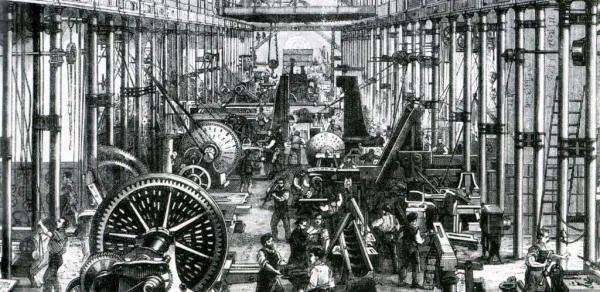

革命先革到这里，咱们算算革命功绩。

**第一次革命比较彻底，核心是把化学能转化成机械能**，这类设备统称热机，除了蒸汽机，还包括后来的汽轮机、燃气轮机、内燃机等各种“机”。革了200多年，热机总算快趟到头了，顺带把化学能也榨干了。

化学反应的本质是折腾原子的外层电子，到如今，一公斤燃料无论怎么折腾，外层电子蕴含的能量就那么多，很难再大幅度提高。除非你向里面的原子核下手，不过这就成了原子能，俗称核能，不属于化学能。

第二次革命原本也熄火了，后来又被第三次革命捎了一程。作为150年前的理论，电磁学实在是榨不出油水了，全靠后面的新材料、半导体带着跑。眼下，半导体自己也快奔到头了，电磁学只好到站下车。

**第三次革命**其实内容蛮多的，但**核心是材料**。这个话题本僧从2018年开始，说了删，删了说，反复好几回，待会咱悠着点再试一回。

材料学说到底还是在压榨量子理论，人类再怎么不济，毕竟榨了一百多年，虽然还有不少潜力，但尽头已是隐约可见。

于是，大伙被逼着开辟了量子力学的第二战场，即通过“非材料”的方式压榨量子力学，就是现在所谓的“量子技术”，量子计算机、量子通信之类的。不过，进展远不如当年榨材料那么轻松。

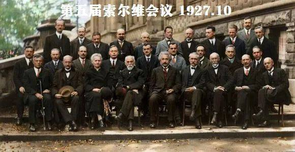

接下来，还有新鲜的物理理论吗？有是有，就是死活榨不出油水。

相对论，和量子力学同时代，到今天也只能用在高速场景的校准和天文计算，完全没有提供新的生产技术，忙活一个世纪打开了不少窗，但还不知道榨油的门朝哪边开。

不说相对论这个老光棍了，还有别的吗？还有一个，**标准粒子模型。**

名气大不的标准模型，论起历史地位，绝对不亚于量子力学，更关键的是，油水看起来比量子力学还多。光是这公式看着就很得劲！

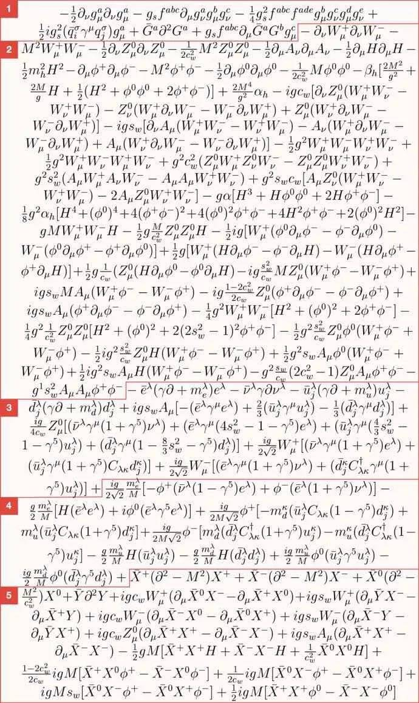

下面，本僧要提个人观点了。

在没有科学思想的古代，技术可以蓬勃发展，但到了第一次工业革命，这种随地捡钱的好事就越来越少了，再往后，**理论和技术的时间间隔越来越长。**

标准模型从1954年杨振宁-米尔斯理论算起，到现在大约75年，从以前的革命规律看，似乎酝酿时间还差点火候，没到榨油的阶段。

但换个角度看，理论和技术中间可不是干等，还有一连串的小理论。量子力学刚出道时，只是个数学游戏罢了，根本没有油水，一直折腾到能带理论，才发现了半导体这个大油库，带出了计算机，整个过程还算连贯。

反观标准模型，折腾到70年代，理论就齐活了，往后50年，实验屡有进展，理论却进入了平缓期。换句话说，就是干等。

基础理论停滞，很快就会导致紧挨着的第一板块动力不足，前两次革命诞生的技术分支陆续开始熄火，带着大伙飞的第三次革命也不乐观，半导体奔到2030年就差不多把能带理论榨干了。

看起来，新旧理论交替之际会出现一个持续时间难以预测的空档，届时第一板块的技术大爆炸进入平缓期估计是大概率事件。

不过，理想还是要有的，万一标准模型可以榨油了，妥妥的惊天地泣鬼神！

## 前程万里的第二板块？

第二板块离着基础物理有点远，更重要的是，第二板块的生物学医学实在太初级了，比我们的社会主义初级阶段还要初级，所以受物理学空档期的影响并不明显。

早期的医学就是残酷的人体实验，手术室和屠宰场差不多，直到50年代，以发现DNA双螺旋结构为标志，分子生物学开始兴起。这一下，生物学医学算是找着阳光大道了。

从意义上讲，生物技术单独就可以撑起一次技术革命，有新理论，有新技术，不过成就实在有点寒碜，终究没能形成燎原之势。

有多寒碜？2020年诺贝尔医学奖给了丙肝相关工作，各位注意了，丙肝是屈指可数的几乎能百分百彻底治愈的慢性病。也就是说，治愈一种慢性病就是诺贝尔奖级别的成就，现代医学对绝大部分慢性病只能缓解，剩下的就靠病人自愈。

再说几个有意思的例子。生物学医学专业相对容易发论文，把理论物理的同学眼馋的不行。生物学医学论文相对容易造假，因为实验重复性太差，只要你一口咬定实验时母猪就是上天飞走了，谁也没法断然否定。生物学医学的研究成果，尤其是营养学，反复推翻是常有的事。

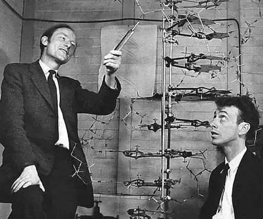

黯然神伤之余，也说明了生物学医学仍在快速发展，未来仍有巨大潜力。

尽管在阳光大道上奔了大半个世纪，从化学反应到生命诞生，中间依然隔了十万八千里。集全人类最高科技制造的机器，其复杂程度远不及一个小小的细胞。

好消息是，生物学目前发现的所有规律，都在已知的物理规则内，从逻辑上说，这叫瓮中捉鳖。生物学就好像一道复杂的N次N元方程，至少题目能看明白，只是难度有点大，相信随着解题手段的提升，一定会解出越来越多的答案。不像现在的物理学，试卷上一堆乱码，该干啥都不知道。

从最近的诺贝尔化学奖看，基因编辑、酶的定向演化、生物分子高分辨率结构测定、DNA修复的细胞机制……化学奖一多半已经被生物学霸占了，这说明生物学正努力往化学的方向跑。

以本僧浅薄的学识看，第一板块攒下的地盘，足够生物学蓬勃发展很多年，至少应该能攻克癌症和大部分慢性病。

假设未来，生物学和化学物理之间的鸿沟被填平，两大板块融为一体，别的不说，向天再借五百年的事情就有着落了！

## 见仁见智的第三板块？

生物学尚且如此初级，想从分子生物学角度解决第三板块的问题，显然是痴人说梦。现在所谓的脑波分析、脑机接口，都还停留在炼丹术水平。不过最近几年大数据兴起，给这个板块带来一点思路。

给教育界的朋友举个例子。美国有一个统计，说是在四岁之前，穷人家孩子因为父母忙于奔波，比富人家孩子少听三千万个单词。这三千万个单词，让富孩子的大脑发育更好，智力更高，为阶层板结做了一份小小贡献。所以说，中国父母爱唠叨的传统美德不能丢！

考虑到第三板块离基础科学实在太远，就此别过。

## 中西差距

目前为止话题还算平和，毕竟咱们智人20万年混成这样，多少有些惭愧。但智人内部的话题就刺激多了，关于核心技术哪家强，有的说中方吊打西方，有的说西方摁着中方，双方都言之凿凿，把我等吃瓜群众绕得晕头转向。

其实技术这东西吧，比女朋友简单，只要你投入了时间和金钱，它一定会有所回报的。科研就是由需求驱动的试错活动，归纳起来只有一条铁律：**技术=时间×金钱。**

相信我，只要不违反物理规律，没有哪个技术能挡得住金钱攻势。所以就按这公式，用微积分的方法粗略算算各国科技总量，谢绝较真。

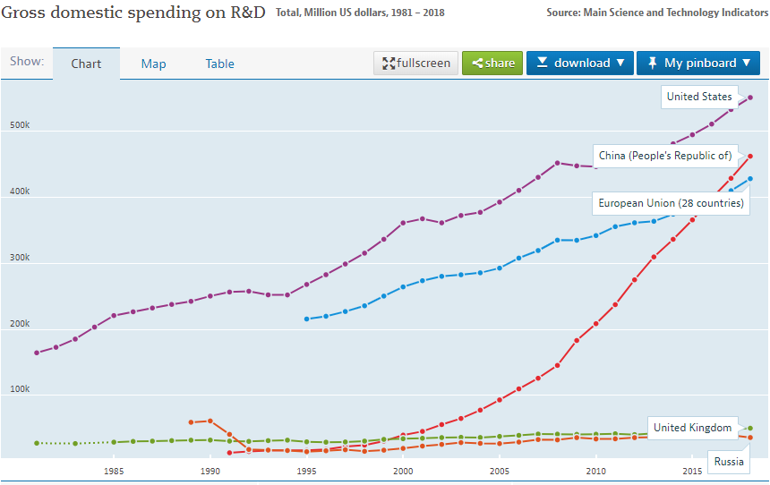

这是各国历年的科研投入。

紫线美帝，稳坐头把交椅，时间×金钱约等于14600。

红线中国，单年烧钱规模已超过欧萌28国排第二，但历史债多了点，时间×金钱约等于4500。考虑到人民币购买力、廉价科研狗和山寨因素，建议上调至8000。

蓝线欧萌，10200。

然后如下图，还抬着头的有日本、德国、韩国、法国，依次是5000，3200，1200，1900。其他基本都躺平了，包括上图中的英国和俄罗斯。

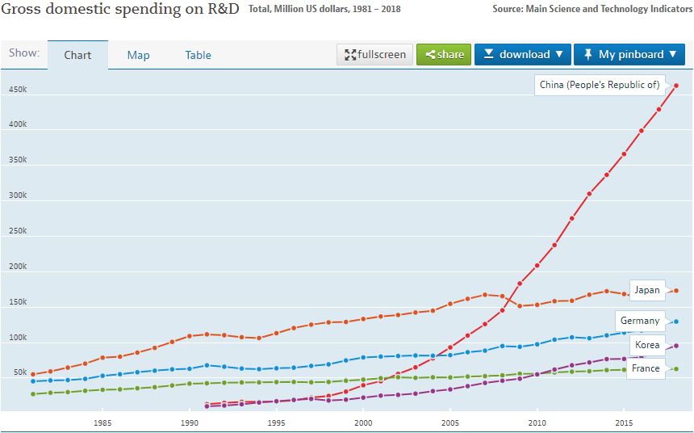

虽然方法有点搞笑，但引出了两个结论：

**第一，中国总体科技实力已经不输日本。**这话一出肯定炸锅，不对吧，日本有很多技术，中国都望尘莫及，咋还有脸说不输日本？没错，但中国也有很多技术让日本望尘莫及的。日本还有诺贝尔奖呢？这衡量的是几十年前的“科学”成就，并非当下的“技术”水平。其实，无论从哪项科研指标看，确实已经很难找到数据证明“日本科研水平领先中国”了。

**第二，中美差距仍然巨大，外加美帝是西方领袖，美欧合一块是中国的三倍。**咱们这几年技术确实长进不少，把吃瓜群众口味惯坏了，产生了天下无敌的错觉。事实上，中国仍处在追赶阶段，咱也不用不好意思，“中国发展迅速，但仍与发达国家有较大差距”，这个句式至少还能再用十年。

大账算好了，接下来盘盘细账。

## 第一板块：知道是什么，但不知道怎么造

**这块技术分两种，一种容易山寨，另一种不容易山寨。**（这不是废话么……）

先说第一种。

前几次革命后，很多理论趋于成熟，使得第一板块沉淀了大量成熟技术。比如熟透的普通力学，所以，自行车100年了还是这结构，桌椅板凳1000年了也没啥变化。

但是这些旧技术通过巧妙组合可以形成新技术，这类技术因为有成熟理论兜底，试错时间往往是可预期的，实在不行就多烧点钱，短时间内基本都能拿下。

当然了，山寨起来也相对容易些。比如，独步武林的架桥机，把这台设备的每一个零件都拆了，每一个细节都抄下来，山寨一台架桥机对几个工业大国来说并不难，反正总不能比航母还难吧？

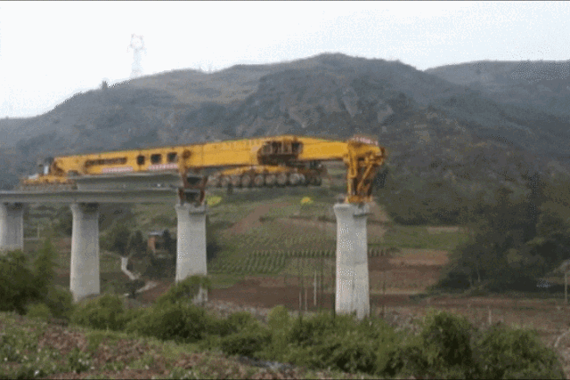

这么说起来，没啥值得自豪了？人家美帝只是不想玩而已！要这么说的话，美帝登月也没啥了不起的，中俄欧咬咬牙，再跺跺脚，土星五号难不倒谁！

这种论调其实低估了需求对技术的重要性，就好像一个聪明孩子考了60分，非说自己只是不想学习，不然肯定考第一。这种状态只要持续几年，工人技能和上下游产业链都会慢慢退化，等高考来临就知道光靠聪明是不够的。

需求和技术的完美结合，比暂时的技术领先更加重要。中国正是凭借这颗星球上最旺盛的工业化需求，催生出各种应用技术，甭管山寨还是原创，只要短时间内能拿下的，基本全拿下了，几乎与整个外国平起平坐，甚至还有超越的势头。

虽然美帝要山寨这类技术并不难，但背后的需求不容易山寨，由此建立的工业体系，反而成了技术的最大壁垒。手握全球制造业半壁江山，无论生产什么产品，都是一种举足轻重的存在。

**在本僧看来，制造业霸权甚至比金融霸权更有意义，**附个论据：16世纪的西班牙。

作为人类史上第一个全球霸主，西班牙凭借无敌舰队掠夺美洲金银购买各国商品，和美帝印钞一个德性。目前美元占全球货币储备大约60%，当年西班牙控制了全球80%的金银。习惯了躺着赚钱，就不愿下地干活了，西班牙很快被伺候的生活不能自理，连武器都大量外购，工业快速没落。反观英国法国，为了赚土豪家的金银，没日没夜干活，看似不公平，却实实在在带动了工商业。最终英国率先开启工业革命，西班牙霸主宝座拱手让人。

（注意，这说的是历史，谢绝和当前国际关系做联想。）

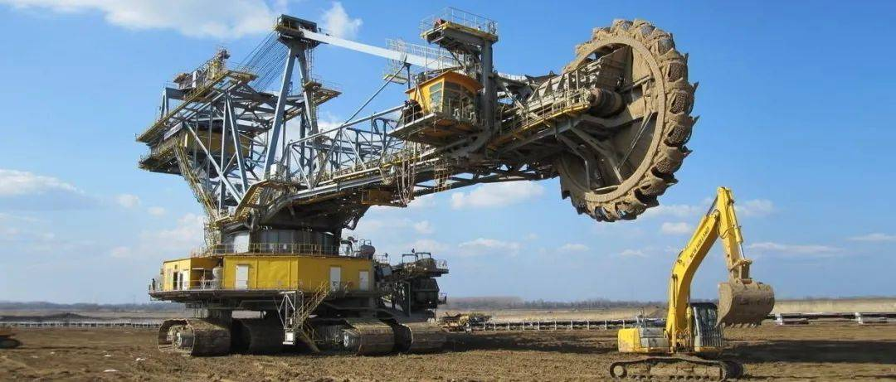

下面说第二种技术。

作为一个追赶者，就要有追赶者的心态，首先追上的，肯定是短时间内能拿下的技术，然后才是长时间磨出来的技术。啥技术需要长时间磨呢？大多是理论不够成熟，只能依赖经验积累的技术。

典型代表：第一性原理分子动力学。

术语有点拗口，大概意思是说，从单个原子的性质出发，计算出整块材料的全部属性。这思路异常潇洒，现在能算到什么程度了？本僧在前文提过，即便是10个最简单的氢原子混在一起，要计算它们的相互作用几乎是不可能的。

这事玄乎的很，算得上物理学和材料学之间一个小小的断层，当然，断层意味着潜力。研发新材料相当于在断层里淘金，没有成熟理论指导，只能靠蛮力一轮一轮烧钱试错，时间难免就长了。

其实很多牛逼设备，你拼命往细拆，最终发现都是材料技术。

机床，号称“工业之母”，只能仰望日本德国瑞士。主轴和轴承摩擦产生的热变形、刀具的磨损，都会带来加工误差，这些问题只能倚赖材料的提升。

液压系统，就是类似千斤顶那种结构，美国日本德国的天下。差在哪？密封圈不给力，液压油容易泄露；液压油不给力，热胀冷缩影响精度，等等。这显然又是材料的问题。

飞机发动机，涡轮叶片不够结实，油门踩狠了容易散架。材料的问题。

螺栓，俗称螺丝钉，高温高压腐蚀性的极端环境，没几家扛得住。材料的问题。

半导体芯片，更是涉及成堆的材料。

来个小结：**像这类有商业需求的基础材料，西方自然舍得不停烧钱，加上材料学潜力犹在，仍可拓展，所以西方大多都保持着领先。**

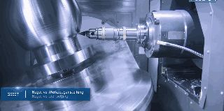

不过一些特殊领域的材料，情况有了些变化。

稀土永磁体，就是用稀土做的磁铁，用处大大的。中国有很多高品位稀土矿，稀土加工技术绝对前列，甚至还挤垮了美帝的稀土工业。所以和“磁”相关的技术，美帝也得抱咱大腿，比如，磁约束核聚变的配件出口了不少，太空暗物质探测是美帝少有的拉中国一起的太空项目。

非线性光学晶体，一种激光器的核心部件。2009年中国对美帝实施禁运，2016年美帝打破中国技术封锁，不过中国趁机又往前奔了一代。美帝曾经指责中国拿激光致盲他家卫星，官媒偶尔也会泄露几张激光反导的照片，看起来应该还是不错的。

再来个小结：**这类商业价值不大，但军事价值、科研价值较高的材料，显然是中国更舍得烧钱，所以有不少已经趟到了前面。**

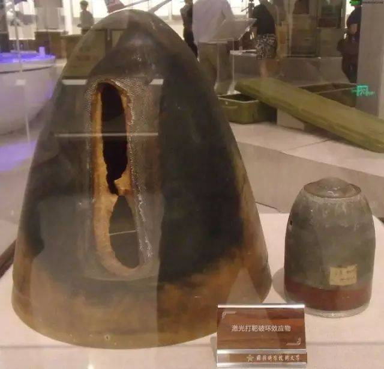

那么问题来了，材料为啥这么难山寨？

做菜都见过吧，番茄炒蛋的成分可以告诉你，但你做的菜就是没我做的好吃。比如前阵子韩国被日本禁运的电子级氢氟酸，参数明明白白告诉你，纯度11个9，你从哪里下手山寨？

一块材料拿到手，要测出其中的成分及比例，也就几顿饭的功夫。进一步，想要知道不同原子之间的排列规则，过程稍微复杂一点，但几天下来基本也摸透了。

你以为这样就山寨完成了吗？不，这才开始，你得找到一种让不同原子按特定规则排列的方法，这个才叫核心技术。因为分子动力学和算命先生差不多，理论计算不如多试几次，这都是烧钱的苦力活。

虽然总体上美帝仍然领先，但前面现存的理论空间已经不充裕了，所以美帝被后面的人撵得很紧张。

拿一张本僧亲手拍的原子力显微镜照片做分割线：

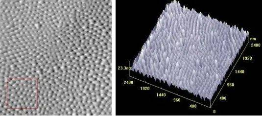

像“分子动力学”这种玄乎事还有不少，比如“空气动力学”，流体力学的分支，“玄学排行榜”上大名鼎鼎。这哥们儿几乎全是经验公式，就是靠实验攒下大量数据，凑出公式，完全不管内在机理。

但凡飞行器想在大气层内混，就不得不考虑空气动力学，这事和材料学一样，主要靠试。好在钱学森那辈人攒下了雄厚的家底，东风17，21，26的独特弹道，运20的贴地飘飞，歼20的超音速机动……谦虚点说，这块，咱们不输美帝。

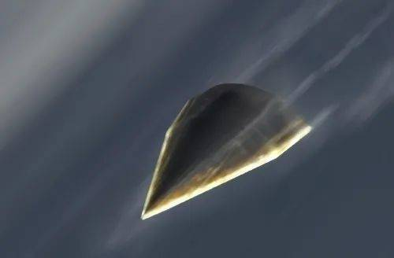

第一板块的较量大体如此，成熟理论基本榨干，生涩理论仍有腾挪躲闪的空间，但中国紧紧撵在后面。至于规则之外，大家都是懵逼状，大哥别笑二哥。

又又又拿核聚变举个例子。地球上你眼睛能看到的所有东西，原子和原子之间都是靠化学键连接的，这个连接能量大约10ev级别，而核聚变产生的中子能量是14兆ev，差了1兆倍。所以呢，聚变反应一旦启动，腔壁材料会受到14兆ev的中子冲击，你让人家10ev的化学键怎么扛得住？

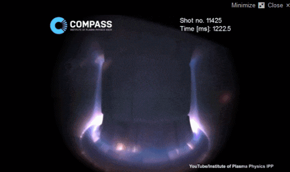

那能否搞一块键能超过100兆ev的材料？

呵呵。

## 第二板块：知道怎么造，但不知道是什么

把这块技术粗暴的分为生物学和医药学。

得益于最近几年大量烧钱，中国的生物学很快就把历史债还上了，毕竟分子生物学只有半个世纪的债，不算多。

美帝趟过的路，咱们也趟了七八成，稳稳跟上了脚步，偶尔还能冒个尖，再过几年应该能出不少好成绩。不过目前的话，1965年的结晶牛胰岛素，或许是目前为止中国对生物学的最大贡献了，这是人类第一次人工合成有活性的蛋白质。

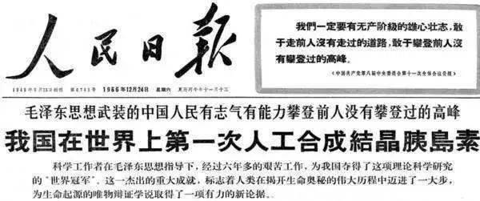

虽然医药搞的对象也是生物，但和生物学不算一码事。

相比快熬出头的生物学，医药学却是另一幅光景。因为医药有巨大的商业价值，所以西方的烧钱规模咱们连尾灯都看不到，因此，成就也看不到尾灯，差距甚大。

医药界最潇洒的事情，莫过于“搞清发病机理，凭空设计一种药物分子，解决问题”，这就是新药。

这有多难呢？一杯咖啡下肚，到底是致癌还是防癌，全球各大机构折腾数十年，各种结论翻来覆去，美国还差点规定咖啡必须贴致癌标签，到今天也没个定数。

咖啡尚且如此，何况是药？你还别嫌人家没用，医药学理论就是这么生涩，比材料学还坑人，所以新药研发只能靠烧钱往前硬推。（这事在[《癌症》](https://mp.weixin.qq.com/s/kNqXTwIMOrWJ0Rn5qug2aA)篇里有很多例子，大伙可以温故一下。）

好消息是，一旦找到了有效成分，生产难度并不大，生产成本也不高，即便印度这么烂的工业底子，都能轻松山寨各种药品。但是药物的分离提纯还是要些功底的，印度在这块只能算马马虎虎，和西方正版药差距不小。

既然印度可以大大方方山寨药品，那为啥咱们不干呢？其实咱们也干，不过只能在专利过期后才行，这叫仿制药。中国绝大部分药都是仿制药，咱们进药店看到琳琅满目的药品，几乎没有一种是中国原创的。

不过，咱们从中药里倒是找到过几种药物成分，就是数量有点少。顺便给喜欢回归自然的朋友提个醒，实际上，只要搞清楚了门道，没有一种纯天然的东西能好过人工合成的。比如天然青蒿素治疗疟疾复发率很高，后来屠呦呦等人合成了双氢青蒿素及各种衍生物，才把疟疾彻底搞定。

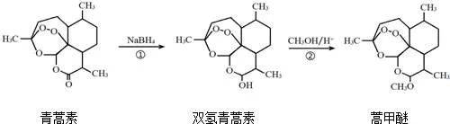

中药之所以争论不休，根本原因就是找不到哪种成分在起作用以及具体作用过程，从现代医学角度讲，无法严格证明有用。但是现代医学连咖啡都没整明白，水平实在也不敢恭维。

虽然中国的医药发展很快，但前面的理论空间仍然很大，所以美帝还在一骑绝尘中，看起来短期内咱们是撵不上了。

## 在挥霍和荒诞中前进

在科研领域充斥着很多奇怪言论，诸如，只有基督教社会才能搞科研，只有西方体制才能搞科研，中文不利于搞科研，等等。这些无稽之谈中，只有一点是有道理的，中国学术行政化严重，阻碍创新。

不过，尽管中国科研环境存在诸多问题，却不妨碍科技水平飞速发展，你说奇怪不？原因很简单，其实咱们搞科研，和打仗攻山头差不多，定下目标，拿下目标，拿不下就得吃苦头。

这做法靠谱吗？有美帝当灯塔的时候，是靠谱的，因为美帝已经站在山头了，那说明一定有路可以上去，所以立军令状也不是完全没道理。别急着嘲笑山寨，哥们儿的学名叫“逆向工程”，这是落后学习先进的必经之路，德国美国日本，有一个算一个，都获得过山寨大国的称号。可以向毛主席保证，一旦中国冒尖了，美帝山寨起来也绝不手软。

但在后美帝时代，情况就不一样了，实际上，现在已经有很多学者指出了类似问题，而且也看到了一些政策调整，相信过几年？十几年？二十几年？应该会进入到一个新阶段。

其实这些细枝末节不算啥，调整几轮总能摸到路子。科研最重要且短时间内无法调整的因素只有一个：人口规模，准确点说，是受教育的人口规模。还是那句话，大家都是智人，谁也别瞧不起谁。

以美国为首、以基督教为文化背景的西方，科研体系本质上是一体的，可以互通有无。比如荷兰的光刻机，美帝付钱就可以买，和自家一样，难道荷兰不会反水吗？不会，因为光刻机用了很多美帝技术。

按这个逻辑算，欧美、日韩、澳加新以，合计人口大约14亿，巧不巧？还有印度，人家也13亿出头了。除此之外，地球上就没有十亿级人口的群体了。

二十年前，80后被称为垮掉的一代、应试教育的牺牲品，被美国的快乐教育各种嘲讽。今天，中国经济科技的快速发展，80后是主力军，这至少说明咱们当年的土教育不算失败。

因此，中国和西方的受教育人口是差不多的，这是我们追赶西方的最大信心基础。至于印度，还是先扫盲吧。

作为普通老百姓，除了多生娃之外，还有一个力所能及的事，就是舆论上的包容。有时候，科技创新的荒诞程度会超过老百姓的想象！

二战时期，英国打算用冰块造航母，人家可不是讲讲而已，哥们真动手了，做了详细方案，取名“哈巴库克号”。结果嘛，发动机太烫把冰融化了……

90年代美帝要建超级对撞机，花了20亿美元才发现是个无底洞，然后就把项目砍了，20亿美元直接打水漂。

美国心理学会曾经有个下属科研机构叫“美国心灵学会”，养了一群有特异功能的大仙和神童，后来发现都是造假被关闭了。

澳大利亚科学家曾经连续观察到神秘宇宙电波，引发轰动，最后发现是隔壁微波炉的干扰。

还有更离谱的，因为实验细胞被污染，导致大伙都在错误的基础上做实验，3万多篇论文面临被废危险，意味着成千上万科学家做了几十年无用功，白烧了数十亿美元经费。

咱们这边比较热门的也有俩，一是大型对撞机要不要烧钱，二是量子通信是不是骗钱。

其实吧，原创科研本来就是豪赌，要么别赌，愿赌就得服输。在科研上浪费点钱，总好过浪费在其他地方，只要不涉及犯罪和败坏道德，咱们应该给那些在人类空白地带趟路的人更加宽松的舆论氛围。

## 基础科学：是时候了

对发展中国家来说，基础研究并不是紧迫的事情，工业化才是王道。所以在前几十年，中国应用技术的发展速度远远甩开了基础科学，科学大旗主要是美帝在扛，科学人才也往美帝跑，有数据为证。

美国基础研究经费占研发总投入的15%，每年还有两三个点的增长，投入最多，产出也最多，小日子稳稳的。

咱们在干嘛呢？《2019年全国科技经费投入统计公报》显示，中国82.7%的研发经费用在了“试验发展”上，这个词的官方定义是：利用从基础研究、应用研究和实际经验所获得的现有知识，为产生新的产品、材料和装置，建立新的工艺、系统和服务，以及对已产生和建立的上述各项作实质性的改进而进行的系统性工作。

也就是说，**中国绝大部分研发经费用在了“利用现有知识产生新产品”，**这么个玩法，很快就把“现有知识”榨干了。没办法，只能一起烧钱拱理论了。

中国基础研究经费占研发总投入常年维持在5%左右，2019年猛增22.5%，首次突破6%，2020年预计8%，2025年目标15%。届时，中国研发总投入也会超过美国，显然，这是打算要扛旗了。

最后，咱们把眼光放回到全人类。从牛顿算起，西方扛着科学大旗，唱着新自由主义的赞歌，带领人类从马车时代一路奔到信息时代，成绩斐然。眼下这歌明显有点唱歪了，导致扛旗有些乏力。

中国从洋务运动开始，紧赶慢赶一个半世纪，步伐确实越发稳健了，是时候让东方智慧和科学思想磨合一下了，看看几千年的处世哲学能否接过科学大旗，继续带领人类进入下一个文明阶段。

  