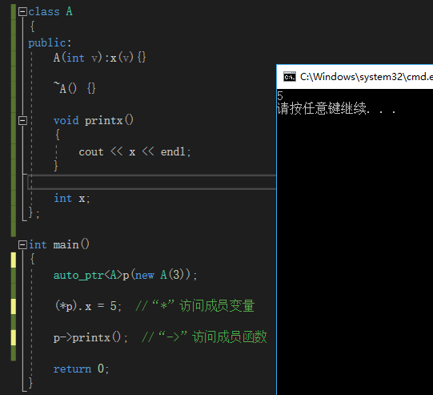
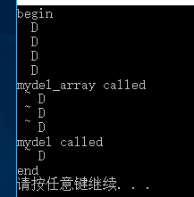
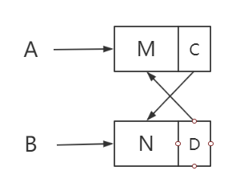
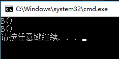
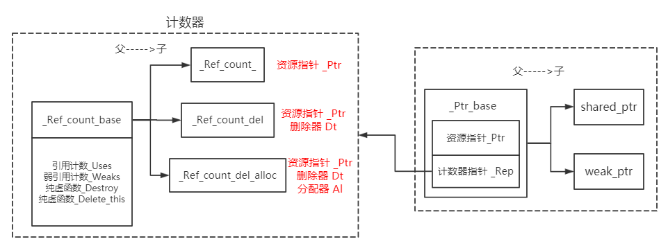
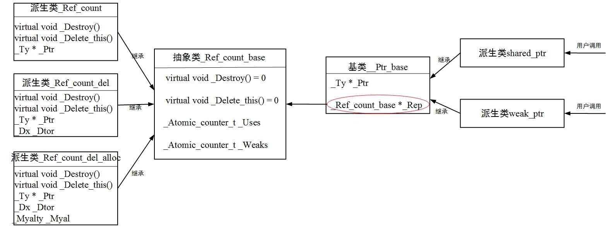
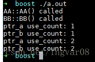
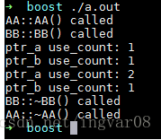

<!--BEGIN_DATA
{
    "create_date": "2023-03-10 11:12", 
    "modify_date": "2023-03-10 11:12", 
    "is_top": "0", 
    "summary": "从源码理解智能指针（一）——auto_ptr、unique_ptr<br/>从源码理解智能指针（二）—— shared_ptr、weak_ptr<br/>智能指针原理剖析（二）：shared_ptr、weak_ptr_weak_ptr", 
    "tags": "C/C++", 
    "file_name": "从源码理解C++智能指针.md"
}
END_DATA-->

#### <p>原文出处：<a href='https://blog.csdn.net/qq_28114615/article/details/100528326' target='blank'>从源码理解智能指针（一）——auto_ptr、unique_ptr_unique_ptr和auto_ptr从源码理解智能指针与智能指针原理剖析</a></p>

在C++中，是通过new和delete来进行动态内存管理的。使用new从堆上分配空间，使用delete来释放空间。由于这两个工作都不是自动进行的，因此动态内存的管理是很困难的，因为无法确保能在正确的时间对已申请的动态内存进行释放：有可能申请之后忘记释放，这样就会造成内存泄漏；也有可能提前就进行了释放，这就会引起后续的非法访问操作。

智能指针，就是为了更简单、更安全地管理动态内存。智能指针是基于“以对象管理资源”的观念，主要有两个关键点：获得资源后立刻放进管理对象（也就是“资源取得时机便是初始化时机”，即RAII），并且管理对象调用析构函数时确保资源被释放。这里所说的“管理对象”，就是智能指针。实际上，**智能指针就是****具有指针行为的对象**。

（以下源码均源于VS2013自带STL）

## auto_ptr

auto_ptr虽然在C++11中已经被弃用，但是通过它来理解智能指针还是非常有帮助的，它定义在xmemory文件中。

### 构造函数

* `auto_ptr`类提供了三种构造方式：

```cpp
template<class _Ty>
class auto_ptr
{	// wrap an object pointer to ensure destruction
public:
	typedef auto_ptr<_Ty> _Myt;
	typedef _Ty element_type;
	explicit auto_ptr(_Ty *_Ptr = 0) _THROW0()   //通过指针构造
		: _Myptr(_Ptr)
	{	// construct from object pointer
	}

	auto_ptr(_Myt& _Right) _THROW0()   //拷贝构造
		: _Myptr(_Right.release())
	{	// construct by assuming pointer from _Right auto_ptr
	}
    
    template<class _Other>
    auto_ptr(auto_ptr<_Other>& _Right) _THROW0()  //不同模板类型auto_ptr对象构造
        : _Myptr(_Right.release())
    {	// construct by assuming pointer from _Right
    }
	......
private:
	_Ty *_Myptr;	// the wrapped object pointer
};
```

三者分别如下所示：

```cpp
int * x = new int(3);

std::auto_ptr<int> ptr0(x);    //第一种构造

std::auto_ptr<int> ptr1(ptr0)；  //第二种构造

std::auto_ptr<const int> ptr2(ptr0);    //第三种构造

对于第一种构造，是直接通过一个指针来构造，用传入的指针初始化成员指针_Myptr变量；

对于第二种构造，是通过另一个auto_ptr对象来构造，并用传入的对象调用release函数的返回值来初始化_Myptr；

对于第三种构造，是通过不同模板类型的auto_ptr对象来构造，也是将传入的对象调用release函数的返回值来初始化_Myptr。
```

`auto_ptr`的成员函数release定义如下：

```cpp
template<class _Ty>
class auto_ptr
{	// wrap an object pointer to ensure destruction
public:
	typedef auto_ptr<_Ty> _Myt;
	typedef _Ty element_type;
	......
	_Ty *release() _THROW0()
	{	// return wrapped pointer and give up ownership
		_Ty *_Tmp = _Myptr;
		_Myptr = 0;
		return (_Tmp);
	}
	......
private:
	_Ty *_Myptr;	// the wrapped object pointer
};
```

在release函数中，会先保存指针成员`_Myptr`的值到`_Tmp`中，然后将`_Myptr`置0后，返回_Tmp。回到构造函数中，当使用`auto_ptr`对象来构造时，**传入的对象参数的`_Myptr`就会被置为0，也就是NULL，而它原来的值则会被保留到新构造的对象中**。相当于换了一个指针指向原地址。这一点充分体现了`auto_ptr`的要求：**一个物件只能有一个拥有者，严禁一物二主**（《C++标准程序库》）。

### 拷贝赋值

`auto_ptr`通过重载赋值运算符来实现拷贝赋值。赋值重载定义如下：

```cpp
template<class _Ty>
class auto_ptr
{	// wrap an object pointer to ensure destruction
public:
	typedef auto_ptr<_Ty> _Myt;
	typedef _Ty element_type;
	......
	template<class _Other>
	_Myt& operator=(auto_ptr<_Other>& _Right) _THROW0()
	{	// assign compatible _Right (assume pointer)
		reset(_Right.release());
		return (*this);
	}
	
    _Myt& operator=(_Myt& _Right) _THROW0()
	{	// assign compatible _Right (assume pointer)
		reset(_Right.release());
		return (*this);
	}
    ......
private:
	_Ty *_Myptr;	// the wrapped object pointer
};
```

和前面的构造类似，这里的拷贝赋值也重载了两种：一种是相同模板类型下`auto_ptr`对象的拷贝赋值，另一种则是不同模板类型下auto_ptr对象的拷贝赋值。这两种的实现都是相同的，都会**调用release函数，相当于释放了传入对象的拥有权，并将拥有权转移到被赋值的左值对象上。**这里还调用了一个reset函数，该函数定义如下：

```cpp
template<class _Ty>
class auto_ptr
{	// wrap an object pointer to ensure destruction
public:
	typedef auto_ptr<_Ty> _Myt;
	typedef _Ty element_type;
	......
	void reset(_Ty *_Ptr = 0)
	{	// destroy designated object and store new pointer
		if (_Ptr != _Myptr)
			delete _Myptr;
		_Myptr = _Ptr;
	}
private:
	_Ty *_Myptr;	// the wrapped object pointer
};
```

reset函数的作用很简单：如果传入的指针与当前的`_Myptr`指针不同，那么就释放`_Myptr`所指向的内存，不管是否相同，最后都会将传入的指针参数赋值给`_Myptr`。这就相当于**让`auto_ptr`的指针成员`_Myptr`指向传入指针参数所指向的地方。**

也就是说，拷贝赋值的作用，就是**让当前`auto_ptr`指向传入赋值的参数指向的地方，并且重置该参数指针为NULL，相当于拥有权的转移，也体现了“一个物件只能有一个拥有者”的设计思想。**

这里说了一个“让`auto_ptr`指向的地方”，显然，`auto_ptr`只是一个类/对象，它的“指向”都是通过其成员指针变量指针`_Myptr`实现的，按道理来说`auto_ptr`不应该有“指向”的说法，但是`auto_ptr`又却是被称为智能指针，这就是因为作为类/对象的`auto_ptr`确实能有指针一样的行为。

### 让auto_ptr对象具有指针的行为

简单来说，就是要让`auto_ptr`对象用起来像指针。举个例子，定义了一个`auto_ptr`对象：`auto_ptr<type>p(new type())`;**通过`*p`可以访问到用来初始化的type类型的对象，并且p->xxx则可以访问用于初始化的type类型的对象中的成员**。可以看到，这两种方式完全把p当做了一个指针来使用，并且这个指针就指向用来初始化`auto_ptr`的参数。

前面说过，`auto_ptr`的指针行为，都是通过指针`_Myptr`来实现的，因此，要想让`*p`和`p->`有意义，只需要指针`_Myptr`来重载“*”和“->”即可。`auto_ptr`是这样做的：

```cpp
template<class _Ty>
class auto_ptr
{	// wrap an object pointer to ensure destruction
public:
	typedef auto_ptr<_Ty> _Myt;
	typedef _Ty element_type;
	......
	_Ty& operator*() const _THROW0()
	{	// return designated value
		return (*get());
	}
	
    _Ty *operator->() const _THROW0()
	{	// return pointer to class object
		return (get());
	}
	
    _Ty *get() const _THROW0()
	{	// return wrapped pointer
		return (_Myptr);
	}
	......
private:
	_Ty *_Myptr;	// the wrapped object pointer
};
```

先来看这里有一个get函数，调用该函数得到`_Myptr`的值。重载`“*”`，使得`“*p”`返回的实际上是`*_Mypt`r，而`“p->”`返回的则是`_Myptr`本身。举个例子，如果`auto_ptr`的模板类型为class A，那么`_Myptr`就是指向一个A object的指针，那么`*_Myptr`就是这个object，因此就会有以下结果：



由图可知，重载`“*”`和`“->”`，就可以通过`auto_ptr`对象去访问它所指向的对象，当然，如果`auto_ptr`本身模板类型就是`int、double`这样的，那么`(*p)`就是对应的int型变量的值，而`p->`理应是int型变量的地址，但是由于“->”很特殊，因此光是一个“p->”并不能通过编译，需要“p.operator->()”才是int型变量的地址。

这样，就使得`auto_ptr`的行为更像指针。

### 析构函数

智能指针作为“用对象管理资源”的工具，需要实现两个关键：在资源获取时就是初始化，这一点在构造函数中得以体现；第二点则是在析构函数中释放资源。下面就来看看`auto_ptr`的析构函数：

```cpp
template<class _Ty>
class auto_ptr
{	// wrap an object pointer to ensure destruction
public:
	typedef auto_ptr<_Ty> _Myt;
	typedef _Ty element_type;
	......
	~auto_ptr() _NOEXCEPT
	{	// destroy the object
		delete _Myptr;
	}
	......
private:
	_Ty *_Myptr;	// the wrapped object pointer
};
```

在析构函数中，只做了一件事：释放`_Myptr`指向的地址。这样，就保证了资源在`auto_ptr`对象构造时获取，在`auto_ptr`对象析构时释放，实现“智能”管理资源。

由上可知，`auto_ptr`是一种独占性的指针，但是它最大的问题在于：向用户提供了拷贝、赋值等操作，而这些操作的最后都会把原对象持有的指针置为NULL，却不给用户任何提示。这就会导致用户不小心对`auto_ptr`对象进行了拷贝、赋值等操作，却没有任何提示，如果用户又不小心使用了原对象，那么就很有可能引起问题，而这种问题是很难发现的。并且从另方面来说，既然设计原则是“严禁一物二主”，那么为何还提供拷贝、赋值这样的操作呢？这显然也是不符合“独占”语义的，更符合“交换拥有权”的语义，而`unique_ptr`则解决了这一问题。

## unique_ptr

`unique_ptr`是`auto_ptr`从C++11开始的一种替代品，它也延续了`auto_ptr`“严禁一物二主”的原则，不过`unique_ptr`更符合语义的一点，是直接禁止了拷贝构造和赋值重载，如下所示：

```cpp
template<class _Ty,class _Dx>	
class unique_ptr
{
        ......
    unique_ptr(const _Myt&) = delete;       //禁用拷贝构造
    _Myt& operator=(const _Myt&) = delete;  //禁用赋值重载
}
```

在分析`unique_ptr`源码之前，还有一些是需要知道的。

`unique_ptr`与`auto_ptr`相比，多了一个删除器，顾名思义，删除器是用来释放`unique_ptr`所管理的资源的，这也是为什么`unique_ptr`的模板参数实际上有两个（如上所示的`_Ty`，`_Dx`），其中`_Ty`就是我们需要`unique_ptr`管理资源的对象类型，而`_Dx`则是删除器的类型。而事实上我们平时在定义一个`unique_ptr`时，只需要指定一个模板参数，这是因为`unique_ptr`有一个默认的删除器类型。在文件memory中，就定义了这样的默认参数：

```cpp
template<class _Ty,
	    class _Dx = default_delete<_Ty> >
class unique_ptr;
```

关于这里默认的删除器`default_delete`，可见也是一个**模板类**，具体的后面再说。简而言之，需要知道，**`unique_ptr`有两个模板参数，`_Ty`是需要管理资源的对象类型，`_Dx`是删除器类型，删除器是用来释放`unique_ptr`所管理的资源的。**

如`std::unique_ptr<A>up`;那么`_Ty`就是类A类型，`_Dx`就是默认的删除器类型`default_delete`。

### _Unique_ptr_base

`unique_ptr`的实现比`auto_ptr`的实现复杂多了。`unique_ptr`还有一个父类`_Unique_ptr_base`。这个类的作用，是用来专门管理删除器的。`_Unique_ptr_base`类有两种定义，也可以看做是模板类的重载，它们的区别在于模板参数不同：

```cpp
template<class _Ty,class _Dx,bool _Empty_deleter>
class _Unique_ptr_base  {......}

template<class _Ty,class _Dx>
class _Unique_ptr_base<_Ty, _Dx, true>  : public _Dx   {......}
```

第一种`_Unique_ptr_base`定义了三种模板参数，`_Ty`和`_Dx`的含义与前面相同，最后还有一个bool型参数，用来描述删除器是否为空；而在第二种`_Unique_ptr_base`中就只有`_Ty`和`_Dx`两种模板参数，但是`_Unique_ptr_base`后面又跟着3个模板参数`_Ty`，`_Dx`和true，这种写法的作用就是：如果`_Unique_ptr_base`的第三个模板参数是true，就使用第二种定义，否则使用第一种定义。至于什么情况下true，这需要到`unique_ptr`定义中才知道，不过从这个变量的名称`_Empty_deleter`可以猜到，true表示删除器为空。现在来看下两种`_Unique_ptr_base`的定义：

```cpp
template<class _Ty,
        class _Dx,
        bool _Empty_deleter>
class _Unique_ptr_base  //传入的删除器类型非空且与默认的删除器不同
{   // stores pointer and deleter
public:
    typedef typename remove_reference<_Dx>::type _Dx_noref;  //将删除器类型去除引用特性后的类型
    typedef typename _Get_deleter_pointer_type<_Ty, _Dx_noref>::type pointer;
 
    _Unique_ptr_base(pointer _Ptr, _Dx _Dt)   //两个参数的构造函数
        : _Myptr(_Ptr), _Mydel(_Dt)
    {   // construct with pointer and deleter
    }
 
    _Unique_ptr_base(pointer _Ptr)     //只含一个参数的构造函数
        : _Myptr(_Ptr)
    {   // construct with pointer and deleter
    }
 
    template<class _Ptr2,
            class _Dx2>
    _Unique_ptr_base(_Ptr2 _Ptr, _Dx2 _Dt)
        : _Myptr(_Ptr), _Mydel(_Dt)   //带两个参数的模板构造函数
    {   // construct with compatible pointer and deleter
    }
 
    template<class _Ptr2>
    _Unique_ptr_base(_Ptr2 _Ptr)   //只带一个参数的模板构造函数
        : _Myptr(_Ptr)
    {   // construct with compatible pointer and deleter
    }
 
    _Dx_noref& get_deleter()     //返回删除器，const和非const型_Unique_ptr_base对象均可调用
    {   // return reference to deleter
        return (_Mydel);
    }
 
    const _Dx_noref& get_deleter() const   //返回删除器，由const型_Unique_ptr_base对象调用
    {   // return const reference to deleter
        return (_Mydel);
    }
 
    pointer _Myptr; // the managed pointer   //管理的指针实例
    _Dx _Mydel;     // the deleter  //删除器实例
};
```

```cpp
template<class _Ty,
        class _Dx>
class _Unique_ptr_base<_Ty, _Dx, true>  //传入的删除器为空或者就是默认的删除器
        : public _Dx
{   // store pointer and empty deleter
public:
    typedef _Dx _Mybase;
    typedef typename remove_reference<_Dx>::type _Dx_noref;
    typedef typename _Get_deleter_pointer_type<_Ty, _Dx_noref>::type pointer;
 
    _Unique_ptr_base(pointer _Ptr, _Dx _Dt) _NOEXCEPT
        : _Myptr(_Ptr), _Mybase(_Dt)
    {   // construct with pointer and deleter
    }
 
    template<class _Ptr2,
            class _Dx2>
    _Unique_ptr_base(_Ptr2 _Ptr, _Dx2 _Dt) _NOEXCEPT
        : _Myptr(_Ptr), _Mybase(_Dt)
    {   // construct with compatible pointer and deleter
    }
 
    ......  //其余两种构造函数与上面定义的完全相同
 
    _Dx_noref& get_deleter() _NOEXCEPT
    {   // return reference to deleter
        return (*this);
    }
 
    const _Dx_noref& get_deleter() const _NOEXCEPT
    {   // return const reference to deleter
        return (*this);
    }
 
    pointer _Myptr; // the managed pointer
};
```

可以看到两种定义的不同：

1.删除器为空时，`_Unique_ptr_base`只有一个`_Myptr`成员，删除器不为空时，`_Unique_ptr_base`除了`_Myptr`成员，还有一个`_Mydel`成员；

2.删除器为空时，`_Unique_ptr_base`还继承了传入的删除器类型（删除器为空，还继承删除器，是不是很奇怪？）；

3.删除器为空时，获取删除器函数`get_deleter`返回的是`*this`，而删除器不为空时，获取删除器`get_deleter`返回的是`_Mydel`成员。

第二点是很奇葩的，为什么删除器为空了还继承删除器，不过结合第三点，删除器为空时返回的是`*this`，相当于返回的是对象自己，但是很明显`_Unique_ptr_base`中并没有任何删除器，因此可以想到，这里`*this`返回的，实际上是继承的那个删除器。那么既然删除器为空，哪来的删除器呢？这就只有一种情况：**删除器为空时，使用的是默认的删除器`default_delete`**。再回到第一点，**之所以删除器为空时，少了一个`_Mydel`成员，这是因为此时使用的是默认的删除器，而删除器不为空时，就需要用到一个`_Mydel`成员来保存一个删除器的实例。**

另外一点可以验证的是：当删除器为空时，如果构造函数需要初始化删除器，`_Unique_ptr_base`是用传入的删除器来初始化它所继承的`_Dx`类，而当删除器不为空，就用传入的删除器类型来初始化`_Mydel`成员。

这里还有两个问题，`remove_reference`和`_Get_deleter_pointer_type`，现在就来分析一下二者：

### remove_reference

`remove_reference`的定义如下：

```cpp
template<class _Ty>
struct remove_reference
{	// remove reference
    typedef _Ty type;
};

template<class _Ty>
struct remove_reference<_Ty&>
{	// remove reference
    typedef _Ty type;
};

template<class _Ty>
struct remove_reference<_Ty&&>
{	// remove rvalue reference
    typedef _Ty type;
};
```

正如其名，不管参数是X、X&还是X&&，最终type都会变成X，即**去除传入类型的引用特性**。

`_Unique_ptr_base`中的使用方式为**`typedef typename remove_reference<_Dx>::type _Dx_noref`**;因此，`_Dx_noref`实际上就是删除器类型`_Dx`去除引用特性后的类型。（如果删除器类型为`A&`，`A&&`或者`A`，那么`_Dx_noref`的类型就是A）

### _Get_deleter_pointer_type

```cpp
template<class _Val,class _Ty>
struct _Get_deleter_pointer_type
{ 
	template<class _Uty> 
	static auto _Fn(int) -> _Identity<typename _Uty::pointer>; 
	template<class _Uty> 
	static auto _Fn(_Wrap_int) -> _Identity<_Val *>; 
	typedef decltype(_Fn<_Ty>(0)) _Decltype; 
	typedef typename _Decltype::type type; 
}

struct _Wrap_int
{	// wraps int so that int argument is favored over _Wrap_int
    _Wrap_int(int)
	{	// do nothing
	}
};

template<class _Ty>
struct _Identity
{	// map _Ty to type unchanged, without operator()
    typedef _Ty type;
};
```

这里用到了后置返回值类型，可参考[后置返回值类型分析](https://blog.csdn.net/qq_28114615/article/details/100553186)。

`_Fn`支持两种类型的参数，一种是int型参数，一种是`_Wrap_int`型参数。注意到`_Wrap_int`中定义了int型的构造函数，并且**构造函数并没有声明为explict**，因此如果int型参数的`_Fn`不能用时，**对`_Fn`传入int型实参也是可以调用`_Fn(_Wrap_int)`的，因为此时可以发生int到`_Wrap_int`的隐式转换**。

后面的`_Decltyp`e实际上就是`_Fn<_Ty>(0)`的返回值类型，如果`_Fn<_Ty>(0)`调用的是第一个`_Fn`，那么`_Decltype`就是`_Identity<typename _Uty::pointer>`，相应的type就是`_Uty::pointer`；如果`_Fn<_Ty>(0)`调用的是第二个`_Fn`，那么`_Decltype`就是`_Identity<Val *>`，而 `_Unique_ptr_base`中对其使用方式为**`typedef typename _Get_deleter_pointer_type<_Ty, _Dx_noref>::typepointer`**;因此，调用`_Fn<_Ty>(0)`两种不同的结果会使得type为`_Dx_noref::pointer`或者是`_Ty*`。那么`_Fn<_Ty>(0)`到底会调用哪个呢？

按理来说，0是一个int型的值，也应该调用第一种`_Fn`，但是这是有前提条件的：如果`_Dx_nore`f中没有pointer类型，那么第一种`_Fn`是无法调用的，因为返回值类型是不成立的，要让第一种`_Fn`能够调用，那么`_Dx_noref`中就必须定义一个pointer类型，如：`class _Dx{typedef int pointer;......}`。如果没有，那么0就会被隐式转换，然后通过`_Wrap_int`的构造函数来调用第二个`_Fn`,这种情况下，最后的type就是`_Ty*`了。

也就是说，对于**`typedef typename _Get_deleter_pointer_type<_Ty, _Dx_noref>::type pointer`**;中的pointer类型，**如果删除器类型`_Dx`中定义了pointer类型，定义的pointer就是`_Dx::pointer`类型，否则就是`_Ty *`类型，也就是`unique_ptr`管理的对象的指针类型**。举个例子，`std::unique_ptr<A>up(new A())`；使用的是默认的删除器，因此pointer就是`A*`类型。

简而言之，在一般情况下，`_Unique_ptr_base`中包含了一个`unique_ptr`管理的对象的指针实例`_Myptr`以及一个删除器类型的实例`_Mydel`（如果没有定义删除器，那么就是继承自默认的删除器）。通过`_Unique_ptr_base`就可以获取到这两种实例。

分析完了`_Unique_ptr_base`，现在再来看`unique_ptr`。

### _Unique_ptr_base的第三个模板参数

`unique_ptr`的部分定义如下：

```cpp
template<class _Ty,class _Dx>	// = default_delete<_Ty>
class unique_ptr
	: private _Unique_ptr_base<_Ty, _Dx,
			                    is_empty<_Dx>::value
				                || is_same<default_delete<_Ty>, _Dx>::value>
	//如果传入的删除器类型为空（删除器大小为0就是空）或者和默认的删除器类型相同，第3个参数就是true
{	// non-copyable pointer to an object
public:
	typedef unique_ptr<_Ty, _Dx> _Myt;

	typedef _Unique_ptr_base<_Ty, _Dx,
		is_empty<_Dx>::value
			|| is_same<default_delete<_Ty>, _Dx>::value> _Mybase;

	typedef typename _Mybase::pointer pointer;
	typedef _Ty element_type;
	typedef _Dx deleter_type;
    ......
}
```

通过这段定义也可以知道“何时第三个模板参数为true”：**当删除器类型`_Dx`为空类型或者删除器类型`_Dx`和默认的删除器类型完全相同时，第三个模板参数就为true**。这里的空类型简单来说就是内部没有占空间大小的成员，举个例子，如果没有非静态成员、虚表指针、虚基类指针或者继承自一个空的类，那么就认为这是一个空类。

### 构造函数

前面说了，如果创建`unique_ptr`时传入的删除器类型中不包含pointer类型，那么`unique_ptr`中的pointer类型就是其管理的对象的指针类型。`unique_ptr`的构造函数都是围绕pointer来的。

#### 无参/NULL构造

`unique_ptr`提供了多种构造函数，如下所示：

```cpp
unique_ptr() _NOEXCEPT     //无参构造，如std::unique_ptr<A>up;
		: _Mybase(pointer())
{	// default construct
    static_assert(!is_pointer<_Dx>::value,
    	"unique_ptr constructed with null deleter pointer");
}

unique_ptr(nullptr_t) _NOEXCEPT    //NULL构造，如std::unique_ptr<A>up(nullptr);
		: _Mybase(pointer())
{	// null pointer construct
    static_assert(!is_pointer<_Dx>::value,
    	"unique_ptr constructed with null deleter pointer");
}
```

这两种对应的是无参构造和NULL构造，如果没有传入构造参数，那么`unique_ptr`就**只知道它需要管理的对象类型，但是并未指定具体的管理实例**。这两种构造方式做的都是同一件事：用一个临时构造的pointer类型实例去构造`_Unique_ptr_base`，从前面`_Unique_ptr_base`的定义也可以知道，这实际上是初始化`_Unique_ptr_base`的`_Myptr`成员为NULL。

#### 用管理对象实例构造

为了给`unique_ptr`指定一个具体的管理实例，就可以通过下面一种最常用的构造函数：

```cpp
explicit unique_ptr(pointer _Ptr) _NOEXCEPT  //通过指针构造，如std::unique<A>up(new A());
	: _Mybase(_Ptr)
{	// construct with pointer
	static_assert(!is_pointer<_Dx>::value,
		"unique_ptr constructed with null deleter pointer");
}
```

这种构造方式是通过指针来构造，指针类型一般就是`unique_ptr`所管理的对象类型的指针，同样的，将传入的指针用来初始化`_Unique_ptr_base`的`_Myptr`成员。这样，`unique_ptr`就有了一个具体的管理实例。

#### 用管理对象实例及删除器实例构造

除了用指定的对象实例来初始`_Myptr`成员的构造函数，`unique_ptr`还提供用指定的删除器实例来初始化`_Unique_ptr_base`的`_Mydel`实例：

```cpp
unique_ptr(pointer _Ptr,
	typename _If<is_reference<_Dx>::value, _Dx,
		const typename remove_reference<_Dx>::type&>::type _Dt) _NOEXCEPT
		//如果_Dx是引用，_Dt就是_Dx本身类型，否则就是_Dx的左值引用（保证形参是实参的引用）
	: _Mybase(_Ptr, _Dt)
{	// construct with pointer and (maybe const) deleter&
}  //如D d;  std::unique_ptr<A,D>up(new A(),d);

unique_ptr(pointer _Ptr,
	typename remove_reference<_Dx>::type&& _Dt) _NOEXCEPT  //删除器右值构造
	: _Mybase(_Ptr, _STD move(_Dt))
{	// construct by moving deleter
	static_assert(!is_reference<_Dx>::value,
		"unique_ptr constructed with reference to rvalue deleter");
}//如 std::unique_ptr<A,D>up(new A(),D());
```

以上两种分别提供了以删除器类型的左值和右值为参数的构造方式。需要注意的是第二种：由于第二种构造方式**传入的实参必定是一个右值**，因此可以直接使用std::move来把形参也以右值的形式转发到`_Unique_ptr_base`的构造函数中，而无需使用std::forward（用于实参即可能是左值，也可能是右值的情况）。虽然`_Unique_ptr_base`中并没有提供右值构造方式，以后也可能会扩展，这样的做法能完美保持实参的右值型，值得学习。

#### 用另一个unique_ptr进行构造（移动构造）

前面已经说过，为了避免`auto_ptr`的缺点，`unique_ptr`是不支持拷贝构造的，那么这里还能用另一个`unique_ptr`来进行构造呢？

由于C++11中引入了移动语义，因此虽然不能使用拷贝构造，但是可以使用移动构造。试想一下，之所以拷贝构造被禁止，是因为拷贝本身就不符合“独占式”的语义（拷贝相当于会存在两份相同的），而移动构造的语义则是将资源的拥有权从A转移到B，这种语义完全符合“独占式”及`auto_ptr`、`unique_ptr`的设计原则。这就好比，一个`unique_ptr`不再想占有它所管理的资源，此时让另一个`unique_ptr`去接管资源，转移拥有权后也并不会违背“独占式”的原则，因此移动构造对于`unique_ptr`来说是非常适合的。

```cpp
//相同类型unique_ptr右值构造
unique_ptr(unique_ptr&& _Right) _NOEXCEPT 
    : _Mybase(_Right.release(),
        _STD forward<_Dx>(_Right.get_deleter()))
    {   // construct by moving _Right
    }

//不同类型的unique_ptr右值构造
template<class _Ty2,   
    class _Dx2,
    class = typename enable_if<!is_array<_Ty2>::value  //参数unique_ptr管理的不是数组资源
        && is_convertible<typename unique_ptr<_Ty2, _Dx2>::pointer,
            pointer>::value  //两种unique_ptr的pointer能够相互转换
        && ((is_reference<_Dx>::value && is_same<_Dx, _Dx2>::value)
            || (!is_reference<_Dx>::value
                && is_convertible<_Dx2, _Dx>::value)),//二者的删除器也必须能相互转换或者相同
        void>::type>
    unique_ptr(unique_ptr<_Ty2, _Dx2>&& _Right) _NOEXCEPT
        : _Mybase(_Right.release(),
            _STD forward<_Dx2>(_Right.get_deleter()))
    {   // construct by moving _Right
    }

//auto_ptr右值构造
template<class _Ty2,
    class = typename enable_if<is_convertible<_Ty2 *, _Ty *>::value
        && is_same<_Dx, default_delete<_Ty> >::value,
        void>::type>
    unique_ptr(auto_ptr<_Ty2>&& _Right) _NOEXCEPT
        : _Mybase(_Right.release())
    {   // construct by moving _Right
    }
```

这里提供了三种移动构造，分别为以下情况：

```cpp
1.相同类型的unique_ptr右值构造；

2.不同类型的unique_ptr右值构造，但是用来构造的unique_ptr不能是管理数组资源的，并且二者所管理的资源类型和删除器类型必须能相互转换；

3.用auto_ptr的右值来构造，前提是auto_ptr管理的资源类型必须和被构造的unqiue_ptr的管理资源类型能够相互转换，并且被构造的unqiue_ptr的删除器类型必须是默认的删除器（这是因为auto_ptr中不存在删除器，所以为了安全起见只支持默认的删除器）；

class A{...};

class B:public A{...};

class D1{...};  //删除器

class D2:public D1{...};   //删除器

std::unique_ptr<A>p0(new A());     //指针构造

std::unique_ptr<A>p1(std::move(p0));    //用p0的右值构造p1，属于第1种；

std::unique_ptr<B>p2(std::move(p0));    //错误，因为类型A不能转换到类型B（父类转换成子类不安全），属于第2种；

std::unique_ptr<A>p3(std::move(p2));    //假设p2创建成功，p2管理B类型，类型B可以安全转换到类型A，属于第2种；

std::unique_ptr<A>p4(std::move(std::auto_ptr<B>()));    //用管理子类类型的auto_ptr构造管理父类类型的unique_ptr，属于第3种。
```

在使用一个对象去移动构造一个`unique_ptr`时，就应当知道：**构造后原对象就没有资源的拥有权了，之后就不能再通过原对象来读取/修改资源，要么不再使用，要么就重新赋予新的资源，**这本身也是移动构造的意义。

在这些构造函数内部，可以看到，前面两种都是对传入参数的删除器进行了forward转发，其实这里的forward转发只是为了保持删除器参数以右值形式去初始化`_Unique_ptr_base`，和前面类似，只是保持了实参的右值型，但是并未实现`_Unique_ptr_base`的右值构造。

然后再看第一个参数，都是将传入的参数调用release函数后再去初始化`_Myptr`和`_Mydel`，这里的release函数理应和`auto_ptr`中的release定义类似：用一个新对象来获取传入对象的资源拥有权并返回新对象，其定义如下：

#### release函数

```cpp
pointer release() _NOEXCEPT
{	// yield ownership of pointer
	pointer _Ans = this->_Myptr;
	this->_Myptr = pointer();
	return (_Ans);
}
```

所谓的转移资源，实际上就是获取原对象的`_Myptr`指针，然后让原对象的`_Myptr`置为NULL（通过pointer()实现），最后用返回的新pointer来初始化新的`unique_ptr`的`_Myptr`成员。

### 赋值重载

说完了构造，再来说说赋值。

`unique_ptr`通过移动构造来体现了“独占”的原则，同样的，赋值也应当体现出“独占”。`unique_ptr`禁用了左值的赋值重载，但是提供了右值的赋值重载，既然参数是一个右值，说明赋值之后，参数就会失去资源的拥有权了，如下所示：

```cpp
template<class _Ty2,   //不同类型的unique_ptr之间的赋值
		class _Dx2>
typename enable_if<!is_array<_Ty2>::value
	&& is_convertible<typename unique_ptr<_Ty2, _Dx2>::pointer,
		pointer>::value,
	_Myt&>::type
operator=(unique_ptr<_Ty2, _Dx2>&& _Right) _NOEXCEPT
{	// assign by moving _Right
    reset(_Right.release());
    this->get_deleter() = _STD forward<_Dx2>(_Right.get_deleter());
    return (*this);
}

//相同类型的unique_ptr之间的赋值
_Myt& operator=(_Myt&& _Right) _NOEXCEPT  
{	// assign by moving _Right
	if (this != &_Right)
	{	// different, do the move
		reset(_Right.release());
		this->get_deleter() = _STD forward<_Dx>(_Right.get_deleter());
	}
	return (*this);
}
```

和前面移动构造的前两种类似，也可以用不同模板类型的`unique_ptr`来进行赋值，不过也需要满足二者所管理的资源类型能够相互转换才行。先来看看删除器的赋值，实际上这里使用的是删除器类型中的赋值重载，将传入的参数的删除器赋值给当前`unique_ptr`的删除器，这里使用forward函数进行转发，是为了**以右值类型的参数去调用删除器中的赋值重载函数**（然而目前版本的默认删除器类型中并没有定制右值参数的赋值重载，使用的是默认生成赋值重载函数，即可接受左值也可接收右值，但默认的赋值重载函数实现的是“拷贝”而不是移动）。

赋值的过程中还调用了一个reset函数，reset函数的参数是传入参数调用release的返回值，因此可以猜到，reset函数的作用，应当是用release的返回值来更新当前`unique_ptr`对象的`_Myptr`成员。现在来看看reset函数：

#### reset函数

```cpp
void reset(pointer _Ptr = pointer()) _NOEXCEPT
{	// establish new pointer
	pointer _Old = this->_Myptr;   //保存原来的_Myptr
	this->_Myptr = _Ptr;    //将新的参数赋值给_Myptr
	if (_Old != pointer())   //如果原来的_Myptr不是null，就调用原来的删除器的括号重载函数
		this->get_deleter()(_Old);
}
```

这里有个需要注意的地方，reset函数不仅用传入的新的指针更新了原来的`_Myptr`，如果原来的`_Myptr`不是null（说明`unique_ptr`在调用reset前就已经拥有了其他资源），还会以原来的指针为参数，调用删除器中的括号重载函数，这一步的作用实际上就是**释放`unique_ptr`原本持有的资源**，简而言之，reset函数的作用，会让当前的`unique_ptr`持有传入的新资源的同时，还会使用删除器释放原来持有的资源。关于这里如何通过删除器释放资源的，后面将进行分析。

### 资源交换swap

从前面的移动构造、右值类型的赋值重载可以看到，`unique_ptr`完美的体现了“独占”语义，这是`auto_ptr`完全比不上的。更为丰富的，`unique_ptr`还提供了交换资源的功能：**两个相同类型的`unique_ptr`，可以相互交换各自占用的资源**。由swap函数实现：

```cpp
void swap(_Myt& _Right) _NOEXCEPT
{	// swap elements
    _Swap_adl(this->_Myptr, _Right._Myptr);   //互换_Myptr
    _Swap_adl(this->get_deleter(),    //互换删除器
    	      _Right.get_deleter());
}

template<class _Ty> inline
void _Swap_adl(_Ty& _Left, _Ty& _Right)
{	// exchange values stored at _Left and _Right, using ADL
    swap(_Left, _Right);
}
```

swap的实现很简单，就是交换两个`unique_ptr`中的`_Myptr`和删除器。

### 获取资源指针get

`unique_ptr`可以通过get函数来获取`_Myptr`指针，该函数定义如下：

```cpp
pointer get() const _NOEXCEPT
{	// return pointer to object
    return (this->_Myptr);
}
```

### 其它的一些重载

`unique_ptr`还提供了另外三种运算符重载：

```cpp
typename add_reference<_Ty>::type operator*() const  //重载*运算符
{	// return reference to object
    return (*this->_Myptr);
}
pointer operator->() const _NOEXCEPT    //重载->运算符
{	// return pointer to class object
    //return this->_Myptr;
    return (_STD pointer_traits<pointer>::pointer_to(**this));
}
explicit operator bool() const _NOEXCEPT   //重载布尔运算符
{	// test for non-null pointer
    return (this->_Myptr != pointer());
}
```

前两种重载了“*”和“->”，这样可以使得对unique_ptr对象的使用更像是指针行为。

第三种重载了布尔运算符，当unique_ptr对象作为布尔判断条件时，可以知道该对象的`_Myptr`成员是否为null（即是否持有资源），举个例子，如下所示：

```cpp
std::unique_ptr<A>p0;    //无参构造，不持有资源 则 if(p0)的判断为false。
std::unique_ptr<A>p1(new A());     //持有资源，则if(p1)的判断为true。
```

### 析构函数

前面提到了`unique_ptr`中除了管理资源的对象外还有一个删除器，但是删除器和`unique_ptr`管理的资源的联系在哪呢？删除器的作用，是用来释放`unique_ptr`所管理的资源，因此，删除器就应当在析构函数中得到调用，`unique_ptr`就是这样做的：

```cpp
~unique_ptr() _NOEXCEPT
{	// destroy the object
	if (this->_Myptr != pointer())
		this->get_deleter()(this->_Myptr);
}
```

和前面的reset函数一样，也是调用了删除器的括号重载函数，通过这个函数来释放资源。

### 删除器deleter

接下来就看看`unique_ptr`的删除器是如何释放资源的。以默认的删除器为例，其定义如下：

```cpp
template<class _Ty>
struct default_delete
{	
    // default deleter for unique_ptr
    typedef default_delete<_Ty> _Myt;

    default_delete() _NOEXCEPT    //默认构造
    {	// default construct
    }

    //拷贝构造
    template<class _Ty2,
    	class = typename enable_if<is_convertible<_Ty2 *, _Ty *>::value,
    		void>::type>
    default_delete(const default_delete<_Ty2>&) _NOEXCEPT
    {	// construct from another default_delete
    }

    //重载括号运算符
    void operator()(_Ty *_Ptr) const _NOEXCEPT
    {	// delete a pointer
    	static_assert(0 < sizeof (_Ty),
    		"can't delete an incomplete type");
    	delete _Ptr;
    }
};
```

删除器类型中定义的两种构造函数都是什么都没做，重点关注括号运算符的重载。这实际上就是一个仿函数，当析构函数和reset函数调用`this->get_deleter()(this->_Myptr)`;时，实际上调用的就是这里的括号重载函数。之所以说它是一个仿函数，是因为这里的`this->get_deleter()`返回的就是一个`default_delete`实例，也就相当于在调用`default_delete(this->_Myptr)`;这就使得`default_delete`这个类可以像函数一样去使用。而在这个仿函数中，则是释放了参数指针所指向的空间，完成了资源的释放。

### 管理数组资源的unique_ptr

`unique_ptr`还可以管理类型为数组的资源，其定义如下：

```cpp
template<class _Ty,
    class _Dx>
    class unique_ptr<_Ty[], _Dx>
        : private _Unique_ptr_base<_Ty, _Dx,
            is_empty<_Dx>::value
                || is_same<default_delete<_Ty[]>, _Dx>::value>
    {   // non-copyable pointer to an array object
public:
    typedef unique_ptr<_Ty[], _Dx> _Myt;
    typedef _Unique_ptr_base<_Ty, _Dx,
        is_empty<_Dx>::value
            || is_same<default_delete<_Ty[]>, _Dx>::value> _Mybase;
    typedef typename _Mybase::pointer pointer;
    typedef _Ty element_type;
    typedef _Dx deleter_type;
 
    using _Mybase::get_deleter;
 
    //无参构造，如 std::unique_ptr<B[]>p;
    unique_ptr() _NOEXCEPT
        : _Mybase(pointer())  
        {   // default construct
        static_assert(!is_pointer<_Dx>::value,
            "unique_ptr constructed with null deleter pointer");
        }
    //指针构造,如std::unique_ptr<B[]>p(new B[10]);
    explicit unique_ptr(pointer _Ptr) _NOEXCEPT
        : _Mybase(_Ptr)
        {   // construct with pointer
        static_assert(!is_pointer<_Dx>::value,
            "unique_ptr constructed with null deleter pointer");
        }
    //用指针和删除器实例左值构造，如D d;std::unique_ptr<B[],D>p(new B[10],d);
    unique_ptr(pointer _Ptr,
        typename _If<is_reference<_Dx>::value, _Dx,
            const typename remove_reference<_Dx>::type&>::type _Dt) _NOEXCEPT
        : _Mybase(_Ptr, _Dt)
        {   // construct with pointer and (maybe const) deleter&
        }
    //用指针和删除器实例右值构造，如D d;std::unique_ptr<B[],D>p(new B[10],D());
    unique_ptr(pointer _Ptr,
        typename remove_reference<_Dx>::type&& _Dt) _NOEXCEPT
        : _Mybase(_Ptr, _STD move(_Dt))
        {   // construct by moving deleter
        static_assert(!is_reference<_Dx>::value,
            "unique_ptr constructed with reference to rvalue deleter");
        }
    //移动构造，如std::unique_ptr<B[]>p(new B[10]);std::unique_ptr<B[]>pp(std::move(p));
    unique_ptr(unique_ptr&& _Right) _NOEXCEPT
        : _Mybase(_Right.release(),
            _STD forward<_Dx>(_Right.get_deleter()))
        {   // construct by moving _Right
        }
    //右值赋值重载，如std::unique_ptr<B[]>p(new B[10]); p=std::unique_ptr<B[]>();
    _Myt& operator=(_Myt&& _Right) _NOEXCEPT
        {   // assign by moving _Right
        if (this != &_Right)
            {   // different, do the swap
            reset(_Right.release());
            this->get_deleter() = _STD move(_Right.get_deleter());
            }
        return (*this);
        }
    //nullptr构造
    unique_ptr(nullptr_t) _NOEXCEPT
        : _Mybase(pointer())
        {   // null pointer construct
        static_assert(!is_pointer<_Dx>::value,
            "unique_ptr constructed with null deleter pointer");
        }
    //nullptr赋值重载
    _Myt& operator=(nullptr_t) _NOEXCEPT
        {   // assign a null pointer
        reset();
        return (*this);
        }
 
    void reset(nullptr_t) _NOEXCEPT  //内部使用的还是管理非数组下的reset
        {   // establish new null pointer
        reset();   
        }
 
    void swap(_Myt& _Right) _NOEXCEPT   //交换资源
        {   // swap elements
        _Swap_adl(this->_Myptr, _Right._Myptr);
        _Swap_adl(this->get_deleter(), _Right.get_deleter());
        }
 
    ~unique_ptr() _NOEXCEPT   //析构函数调用_Delete来释放资源
        {   // destroy the object
        _Delete();
        }
    //重载索引运算符
    typename add_reference<_Ty>::type operator[](size_t _Idx) const
        {   // return reference to object
        return (this->_Myptr[_Idx]);
        }
    //获取资源指针
    pointer get() const _NOEXCEPT
        {   // return pointer to object
        return (this->_Myptr);
        }
    //重载布尔运算符
    explicit operator bool() const _NOEXCEPT
        {   // test for non-null pointer
        return (this->_Myptr != pointer());
        }
    //转移占有权
    pointer release() _NOEXCEPT
        {   // yield ownership of pointer
        pointer _Ans = this->_Myptr;
        this->_Myptr = pointer();
        return (_Ans);
        }
    //先释放当前资源，再用参数更新资源指针
    void reset(pointer _Ptr = pointer()) _NOEXCEPT
        {   // establish new pointer
        _Delete();
        this->_Myptr = _Ptr;
        }
    //禁用其它类型的参数构造
    template<class _Ptr2>
        explicit unique_ptr(_Ptr2) = delete;
    //禁用其它类型的参数构造
    template<class _Ptr2,
        class _Dx2>
        unique_ptr(_Ptr2, _Dx2) = delete;
    //禁用拷贝构造
    unique_ptr(const _Myt&) = delete;
    //禁用赋值
    _Myt& operator=(const _Myt&) = delete;
    //禁用带参reset
    template<class _Ptr2>
        void reset(_Ptr2) = delete;
 
private:
    void _Delete()   //调用删除器仿函数来释放资源
        {   // delete the pointer
        if (this->_Myptr != pointer())
            this->get_deleter()(this->_Myptr);
        }
    };
```

可以看到，与管理非数组资源的`unique_ptr`相比，管理数组资源的`unique_ptr`大部分函数实现都差不多的。不同的有以下几点：

1.禁止用非模板参数类型的参数来进行构造；

2.重载了下标运算符；

### 管理数组资源的删除器

除了这两个，默认的删除器也有变化，由于管理的数组资源，而原来的删除器用的是delete而不是delete[]，来看下数组资源对应的删除器：

```cpp
template<class _Ty>
struct default_delete<_Ty[]>
{	
    // default deleter for unique_ptr to array of unknown size
    typedef default_delete<_Ty> _Myt;
    default_delete() _NOEXCEPT
	{	// default construct
	}

    template<class _Other>
    void operator()(_Other *) const = delete;

    void operator()(_Ty *_Ptr) const _NOEXCEPT
	{	// delete a pointer
    	static_assert(0 < sizeof (_Ty),
    		"can't delete an incomplete type");
    	delete[] _Ptr;
	}
};
```

除了把仿函数中的`delete`改为`delete[]`之外，这里还禁用了以其他类型作为模板参数的仿函数，这意味着只能使用删除器所管理的数组资源类型的参数来调用删除器的仿函数。举个例子，`std::unique_ptr<B[]> p`;那么传入删除器的仿函数的类型则只能是`B *`类型，而不能是`A *`等其它类型。

### 使用自定义删除器

```cpp
class mydel_array
{
public:
	template <typename T>
	void operator ()(T* x){
		std::cout << "mydel_array called" << std::endl;
		delete[] x;
	}
};

class mydel
{
public:
	template <typename T>
	void operator ()(T* x){
		std::cout << "mydel called" << std::endl;
		delete x;
	}
};

class D 
{
public:
	D(){    std::cout << "  D" << std::endl;  }
	~D(){    std::cout << " ~ D" << std::endl;    }
};


int _tmain(int argc, _TCHAR* argv[])
{
	std::cout << "begin" << std::endl;
	{
		std::unique_ptr<D, mydel>p(new D);
		std::unique_ptr<D[], mydel_array>pa(new D[3]);
	}
	std::cout << "end" << std::endl;
}
```



## 总结

`auto_ptr`和`unique_ptr`都是独占式指针，`auto_ptr`为了实现“独占式”语义，拷贝构造和赋值重载会偷偷地把原对象的资源给拿走，但是不会给用户任何提示，这是很危险的，并且拷贝和赋值本身的语义就不符合资源的独占原则。

在C++11中，用`unique_ptr`完全取代了`auto_ptr`，这完全归功于“移动语义”的出现，`unique_ptr`完全禁用了`auto_ptr`中所使用的拷贝构造和赋值重载，但是增加了用右值进行构造的移动构造方式以及用右值进行赋值的功能，移动语义完美的贴合了“独占”的原则，将资源的拥有权从一方转移到另一方，但是用户在使用时也需要为“移动语义”而留心：**移动语义表明会放弃对当前对象所持有资源的占有权，“移动”发生之后你不应当再试图通过当前对象去访问、修改资源，因为它已经不持有任何资源了，要么就不再使用它，要么就让它持有新的资源**。

`auto_ptr`直接在析构函数中进行了资源的释放，而`unique_ptr`则是通过删除器来释放资源，并且允许用户自定义删除器，如果要使用自定义的删除器，那么就必须定义一个仿函数类，在仿函数中进行资源的释放。

<hr>


#### <p>原文出处：<a href='https://blog.csdn.net/qq_28114615/article/details/101166744' target='blank'>从源码理解智能指针（二）—— shared_ptr、weak_ptr</a></p>

共享式指针允许多个智能指针持有同一资源，并且当没有智能指针持有该资源时就自动销毁资源。为了实现共享+智能，就需要用到一个计数器，来记录某个资源被多少对象持有，当计数值为0时，就销毁该资源。

在`shared_ptr`和`weak_ptr`中，这样的计数器实际上是一个单独的类。它主要负责**资源引用计数（增加、减少）**以及**资源的释放**。此外，通过计数器，还能像`unique_ptr`那样指定删除器，还增加了一个空间分配器。下面就先来分析一下计数器：

## 计数器

计数器的根本，是一个抽象类`_Ref_count_base`，其定义如下：

```cpp
class _Ref_count_base       //管理计数变量        虚基类
{   // common code for reference counting
private:
    virtual void _Destroy() = 0;
    virtual void _Delete_this() = 0;
 
private:
    _Atomic_counter_t _Uses;    //引用计数
    _Atomic_counter_t _Weaks;   //弱引用计数
 
protected:
    _Ref_count_base()   //初始化两个计数变量为1
    {   // construct
        _Init_atomic_counter(_Uses, 1);
        _Init_atomic_counter(_Weaks, 1);
    }
 
public:
    virtual ~_Ref_count_base() _NOEXCEPT
    {   // ensure that derived classes can be destroyed properly
    }
 
    ......
 
    unsigned int _Get_uses() const  //返回引用计数
    {   // return use count
        return (_Get_atomic_count(_Uses));
    }
 
    void _Incref()
    {   // increment use count
        _MT_INCR(_Mtx, _Uses);// _Uses+1
    }
 
    void _Incwref()
    {   // increment weak reference count
        _MT_INCR(_Mtx, _Weaks);//_Weaks+1
    }
 
    void _Decref()
    {   // decrement use count
        if (_MT_DECR(_Mtx, _Uses) == 0)
        {   // destroy managed resource, decrement weak reference count
            _Destroy();
            _Decwref();  //如果资源已经被释放了，那么weak_ptr也没有任何作用了，
        }
    }
 
    void _Decwref()
    {   // decrement weak reference count
        if (_MT_DECR(_Mtx, _Weaks) == 0) //如果_Weaks-1后为0，就调用_Delete_this
            _Delete_this();  //释放当前对象
    }
 
    long _Use_count() const  //返回引用计数
    {   // return use count
        return (_Get_uses());
    }
 
    bool _Expired() const  //检测是否失效，失效是指引用计数为0
    {   // return true if _Uses == 0
        return (_Get_uses() == 0);
    }
 
    virtual void *_Get_deleter(const _XSTD2 type_info&) const
    {   // return address of deleter object
        return (0);
    }
};
```

```cpp
_Ref_count_base中主要包含以下信息：

1.两个纯虚函数_Destroy()和_Delete_this()，意味着二者必须在子类中实现，前者用来释放计数器对应的资源，后者用来释放计数器自身；

2.两个计数变量_Uses和_Weaks，前者是强引用计数，主要用于shared_ptr中，后者用于weak_ptr中；

3.定义了对_Uses和_Weaks的增加、减少函数。如果某一次减少使得_Uses为0，那么就会调用子类中实现的_Destroy函数并且减少_Weaks；如果某一次减少使得_Weaks为0，就会调用子类中实现的_Delete_this函数；

4._Ref_count_base的构造会初始化_Uses和_Weaks为1；

5._Uses和_Weaks的增加、减少都是原子操作。

显然，作为一个抽象类，不可能仅仅通过_Ref_count_base来实现计数器的，真正的计数器是子类来实现，_Ref_count_base的子类有三种:_Ref_count、_Ref_count_del和_Ref_count_del_alloc。从子类名也可以看出来，从前往后三种子类的功能更强大，体现在计数、删除器和分配器三个方面。
```

### _Ref_count

`_Ref_count`就是一种计数器，它内部的成员变量只含一个资源指针`_Ptr`，其定义如下：

```cpp
template<class _Ty>
class _Ref_count : public _Ref_count_base  //父类中管理计数变量，_Ref_count中管理其相应的资源
{   // handle reference counting for object without deleter
public:
    _Ref_count(_Ty *_Px)
        : _Ref_count_base(), _Ptr(_Px)
    {   // construct
    }

private:
    virtual void _Destroy()  //重写虚基类中的_Destroy
    {   // destroy managed resource
        delete _Ptr;   //释放资源
    }

    virtual void _Delete_this()
    {   // destroy self
        delete this;  //销毁当前对象
    }

    _Ty * _Ptr;   //资源指针
};
```

```cpp
该类中主要包含以下信息：

1._Ref_count中含有一个资源指针_Ptr，指向该计数器对应的资源；

2._Ref_count从_Ref_count_base_继承来的计数变量相关操作，都是针对_Ptr的；

3._Ref_count类中必须重写_Destroy和_Delete_this函数，前者对_Ptr进行释放，后者用来析构当前计数器对象。由于_Ref_count_base_的析构函数是虚函数，因此_Ref_count可以完全析构；

4._Ref_count类只接受用资源指针构造。
```

### _Ref_count_del

`_Ref_count_del`是第二种计数器，它除了拥有资源指针外，还拥有一个删除器实例，如下所示：

```cpp
template<class _Ty, class _Dx>
class _Ref_count_del : public _Ref_count_base //父类中管理计数变量，_Ref_count_del中管理相应的资源指针和删除器
{   // handle reference counting for object with deleter
public:
    _Ref_count_del(_Ty *_Px, _Dx _Dt)
        : _Ref_count_base(), _Ptr(_Px), _Dtor(_Dt)
    {   // construct
    }
 
    virtual void *_Get_deleter(const _XSTD2 type_info& _Typeid) const
    {   // return address of deleter object
        return ((void *)(_Typeid == typeid(_Dx) ? &_Dtor : 0));
    }
 
private:
    virtual void _Destroy()
    {   // destroy managed resource
        _Dtor(_Ptr);
    }
 
    virtual void _Delete_this()
    {   // destroy self
        delete this;
    }

    //资源指针以及删除器
    _Ty * _Ptr;
    _Dx _Dtor;  // the stored destructor for the controlled object
};
```

```cpp
该类主要包含以下信息：

1._Ref_count_del除了有一个资源指针_Ptr，还有一个_Dx类型的删除器实例_Dtor；

2._Ref_count_del从_Ref_count_base_继承来的计数变量相关操作，都是针对_Ptr的；

3.重写的_Destroy函数中，并不像_Ref_count那样直接调用delete删除，而是使用的_Dtor(_Ptr)，这说明删除器必须是一个仿函数类，_Delete_this和上述相同；

4._Ref_count_del只接受用资源指针和删除器实例来构造。
```

### _Ref_count_del_alloc

最后一种计数器，除了包含一个删除器实例，还包含一个分配器实例，如下所示：

```cpp
template<class _Ty, class _Dx, class _Alloc>
class _Ref_count_del_alloc
    : public _Ref_count_base //父类中管理计数变量，_Ref_count_del_alloc中管理相应的资源指针、删除器和分配器
{   // handle reference counting for object with deleter and allocator
public:
    typedef _Ref_count_del_alloc<_Ty, _Dx, _Alloc> _Myty;
    typedef typename _Alloc::template rebind<_Myty>::other _Myalty;

    _Ref_count_del_alloc(_Ty *_Px, _Dx _Dt, _Myalty _Al)
        : _Ref_count_base(), _Ptr(_Px), _Dtor(_Dt), _Myal(_Al)
    {   // construct
    }

    virtual void *_Get_deleter(const _XSTD2 type_info& _Typeid) const
    {   // return address of deleter object
        return ((void *)(_Typeid == typeid(_Dx) ? &_Dtor : 0));//如果传入的类型与删除器类型相同，就返回删除器地址
    }

private:
    virtual void _Destroy()
    {   // destroy managed resource
        _Dtor(_Ptr);   //将资源指针作为参数调用删除器
    }

    virtual void _Delete_this()
    {   // destroy self
        _Myalty _Al = _Myal; 
        _Al.destroy(this);
        _Al.deallocate(this, 1);
    }

    //资源指针、删除器、分配器
    _Ty * _Ptr;
    _Dx _Dtor;  // the stored destructor for the controlled object
    _Myalty _Myal;  // the stored allocator for this
}
```

```cpp
该类主要包含以下信息：

1._Ref_count_del_alloc增加了一个分配器实例；

2._Ref_count_del_alloc从_Ref_count_base_继承来的计数变量相关操作，都是针对_Ptr的；

3.重写的_Destroy函数中，用仿函数类实例_Dtor来销毁资源指针，而在重写的_Delete_this中，则是通过分配器实例来进行的，可见，分配器中必须实现destroy函数和deallocate函数（这就很像STL中的allocator）；

4._Ref_count_del只接受用资源指针、删除器实例和分配器实例来构造。
```

可以看到，计数器实际上是通过`_Ref_count_base`的三个子类来实现的，这三种子类中都包含了一个资源指针，调用的destroy函数也是用来删除资源指针所指向的“资源”，可以理解为，**计数器实际上就已经绑定到了某一处资源上**。从这一点上，我们也大致能猜出，`shared_ptr`和`weak_ptr`之所以能和计数器对应起来，就是靠同一处资源。

## _Ptr_base

在分析`shared_ptr`和`weak_ptr`之前，需要先分析另一个很重要的类——`_Ptr_base`。`shared_ptr`和`weak_ptr`都继承自它，现在来看看这个类的定义。

### _Ptr_base的成员变量

```cpp
template<class _Ty>
class _Ptr_base   //包含一个资源指针以及一个计数器
{   // base class for shared_ptr and weak_ptr
        ......
private:
    _Ty *_Ptr;   //资源指针
    _Ref_count_base *_Rep;   //计数器指针
};
```

可以看到，`_Ptr_base`中，只有两个成员变量，`_Ptr`就是指向“资源”的资源指针，`_Rep`则是指向一个计数器实例的计数器指针了。这就相当于每个`shared_ptr`或者`weak_ptr`都通过`_Rep`指针指向一个计数器，而这个计数器中的资源指针也理应和这里的资源指针`_Ptr`相同。

### 构造函数

`_Ptr_base`只提供了一个无参构造和两种移动构造，如下所示：

```cpp
_Ptr_base()//无参构造
    : _Ptr(0), _Rep(0)
{   // construct
}

_Ptr_base(_Myt&& _Right)  //移动构造_Ptr_base，交换两个_Ptr_base的_Ptr和_Rep，交换后_Right的_Ptr和_Rep都为0
    : _Ptr(0), _Rep(0)
{   // construct _Ptr_base object that takes resource from _Right
    _Assign_rv(_STD forward<_Myt>(_Right));
}

template<class _Ty2>
    _Ptr_base(_Ptr_base<_Ty2>&& _Right)//不同类型的右值构造，右值构造后_Right的_Ptr和_Rep都变为0
    : _Ptr(_Right._Ptr), _Rep(_Right._Rep)  //用_Right的两个指针来初始化当前_Ptr_base的两个指针
{   // construct _Ptr_base object that takes resource from _Right
    _Right._Ptr = 0;
    _Right._Rep = 0;
}
```

对于无参构造，`_Ptr`和`_Rep`都会初始化为0，相当于nullptr，即“**不持有任何资源和计数器**”。对于移动构造，构造后会让右值参数的`_Ptr`和`_Rep`都置为0，实现了“资源的转移”。

这里还用到了一个`_Assign_rv`函数，这个函数就是把当前对象的`_Ptr`及`_Rep`和传入参数对象的`_Ptr`和`_Rep`进行互换。该函数定义如下：

```cpp
void _Assign_rv(_Myt&& _Right)
{   // assign by moving _Right
    if (this != &_Right)
        _Swap(_Right);//交换两个对象的_Rep和_Ptr指针
}

void _Swap(_Ptr_base& _Right)   //交换二者的资源指针和引用计数器
{   // swap pointers
    _STD swap(_Rep, _Right._Rep);
    _STD swap(_Ptr, _Right._Ptr);
}
```

### 赋值重载

`_Ptr_base`只定义了移动赋值，这就意味着如果赋值参数非右值，那么`_Ptr_base`就会使用默认的赋值函数。移动赋值定义如下：

```cpp
_Myt& operator=(_Myt&& _Right)//右值赋值重载，
{   // construct _Ptr_base object that takes resource from _Right
    _Assign_rv(_STD forward<_Myt>(_Right));
    return (*this);
}
```

这里还是相当于把当前对象的`_Ptr`和`_Rep`与传入的参数`_Right`的`_Ptr`和`_Rep`进行交换。

### 获取引用计数

`_Ptr_base`中可以通过`use_count`函数来获取持有资源的引用计数，如下所示。

```cpp
long use_count() const _NOEXCEPT  //返回引用计数
{   // return use count
    return (_Rep ? _Rep->_Use_count() : 0);
}
```

实际上是调用计数器中的`_Use_count`函数，返回的是计数器中的`_Uses`变量。

### 减少引用计数

`_Ptr_base`中自己定义了减少引用计数的两种函数，分别用来减少`_Ptr_base`对应的计数器中的`_Uses`和`_Weaks`：

```cpp
void _Decref()//减少引用次数
{   // decrement reference count
    if (_Rep != 0)
        _Rep->_Decref();
}
void _Decwref()//减少弱引用次数
{   // decrement weak reference count
    if (_Rep != 0)
        _Rep->_Decwref();
}
```

可以看到，实际上就是调用相应计数器中的对应函数。

### _Reset函数

`_Ptr_base`中提供了多个`_Reset`函数的重载版本，如下所示：

```cpp
void _Reset()  //重置，不持有任何资源以及引用计数器
{   // release resource
    _Reset(0, 0);
}

template<class _Ty2>
void _Reset(const _Ptr_base<_Ty2>& _Other)//用其他的_Ptr_base来Reset
{   // release resource and take ownership of _Other._Ptr
    _Reset(_Other._Ptr, _Other._Rep); 
}

template<class _Ty2>
void _Reset(const _Ptr_base<_Ty2>& _Other, bool _Throw)
{   // release resource and take ownership from weak_ptr _Other._Ptr
    _Reset(_Other._Ptr, _Other._Rep, _Throw);
}

template<class _Ty2>
void _Reset(const _Ptr_base<_Ty2>& _Other, const _Static_tag&)
{   // release resource and take ownership of _Other._Ptr
    _Reset(static_cast<_Ty *>(_Other._Ptr), _Other._Rep);
}

template<class _Ty2>
void _Reset(const _Ptr_base<_Ty2>& _Other, const _Const_tag&)
{   // release resource and take ownership of _Other._Ptr
    _Reset(const_cast<_Ty *>(_Other._Ptr), _Other._Rep);
}

template<class _Ty2>
void _Reset(const _Ptr_base<_Ty2>& _Other, const _Dynamic_tag&)
{   // release resource and take ownership of _Other._Ptr
    _Ty *_Ptr = dynamic_cast<_Ty *>(_Other._Ptr);
    if (_Ptr)
        _Reset(_Ptr, _Other._Rep);
    else
        _Reset();
}

template<class _Ty2>
void _Reset(auto_ptr<_Ty2>&& _Other)
{   // release resource and take _Other.get()
    _Ty2 *_Px = _Other.get();
    _Reset0(_Px, new _Ref_count<_Ty>(_Px));
    _Other.release();
    _Enable_shared(_Px, _Rep);
}

//为shared_ptr绑定新的资源指针以及_Other中的计数器
//注意，这里的_Other应该是不同类型的shared_ptr，把它的计数器赋给了当前的shared_ptr
template<class _Ty2>
void _Reset(_Ty *_Ptr, const _Ptr_base<_Ty2>& _Other)//用新的资源指针和_Other的引用计数器来重置
{   // release resource and alias _Ptr with _Other_rep
    _Reset(_Ptr, _Other._Rep);//重置为新的资源指针和引用计数管理器
}

//为shared_ptr绑定新的资源指针和新的计数器
//如果新的计数器非NULL，计数器就加1，如果本身持有计数器，那么原来的计数器就减1
//注意，_Ref_count_base参数只有计数变量，没有资源指针
void _Reset(_Ty *_Other_ptr, _Ref_count_base *_Other_rep)//重新绑定当前shared_ptr的资源指针和计数器，对原有计数器引用计数-1，新的计数器引用计数+1
{   // release resource and take _Other_ptr through _Other_rep
    if (_Other_rep)//如果传入的计数器不为NULL，相当于_Reset了之后当前的shared_ptr就要使用这个计数器对应的资源了，因此该资源就增加一次引用
        _Other_rep->_Incref();
    _Reset0(_Other_ptr, _Other_rep);//重新绑定资源指针和计数器
}
//和上面一样，只是多了一个是否抛出异常的参数
void _Reset(_Ty *_Other_ptr, _Ref_count_base *_Other_rep, bool _Throw)
{   // take _Other_ptr through _Other_rep from weak_ptr if not expired
    // otherwise, leave in default state if !_Throw,
    // otherwise throw exception
    if (_Other_rep && _Other_rep->_Incref_nz())//如果引用计数器非null，并且计数值不为0
        _Reset0(_Other_ptr, _Other_rep);
    else if (_Throw)
        _THROW_NCEE(bad_weak_ptr, 0);
}
```

这么多版本看着吓人，实际上本质是一样的：用其它对象的`_Ptr`和`_Rep`来重置当前对象的`_Ptr`和`_Rep`，相当于当前对象获取传入对象的资源指针和计数器。从这个本质上来看，肯定会做两件事：**减少当前对象持有资源的引用计数`_Uses`，增加传入对象持有资源的引用计数`_Uses`**。

前面的多个重载版本内部调用的实际上是最后的那两个版本：

```cpp
void _Reset(_Ty *_Other_ptr, _Ref_count_base *_Other_rep)；  
void _Reset(_Ty *_Other_ptr, _Ref_count_base *_Other_rep, bool _Throw)；
```

注意到，在这两个函数的内部，都会通过调用计数器的`_Incref`或者`_Incref_nz`增加传入对象持有资源的引用计数。然后调用的都是同一个`_Reset0`函数，该函数定义如下：

```cpp
void _Reset0(_Ty *_Other_ptr, _Ref_count_base *_Other_rep)
{   // release resource and take new resource
    if (_Rep != 0)
        _Rep->_Decref();
    _Rep = _Other_rep;  //用传入的两个参数来赋值给_Rep和_Ptr
    _Ptr = _Other_ptr;
}
```
在该函数中，对当前对象持有资源的引用计数减1，然后将传入对象的两个指针赋值给当前对象。

### _Resetw函数

这个函数也提供了多个重载版本，如下所示。

```cpp
void _Resetw()//初始化weak_ptr的资源指针和计数器都为NULL
{   // release weak reference to resource
    _Resetw((_Ty *)0, 0);
}

template<class _Ty2>//用不同类型的weak_ptr或者shared_ptr的资源指针和计数器来更新当前的weak_ptr
void _Resetw(const _Ptr_base<_Ty2>& _Other)
{   // release weak reference to resource and take _Other._Ptr
    Resetw(_Other._Ptr, _Other._Rep);
}

template<class _Ty2>
void _Resetw(const _Ty2 *_Other_ptr, _Ref_count_base *_Other_rep)
{   // point to _Other_ptr through _Other_rep
    Resetw(const_cast<_Ty2*>(_Other_ptr), _Other_rep);
}

template<class _Ty2>
void _Resetw(_Ty2 *_Other_ptr, _Ref_count_base *_Other_rep)
{   // point to _Other_ptr through _Other_rep
    if (_Other_rep)
        _Other_rep->_Incwref();  //新的引用计数器的弱引用计数+1
    if (_Rep != 0)
        _Rep->_Decwref(); //原本的引用计数器的弱引用计数-1
    _Rep = _Other_rep;  //重置资源指针以及引用计数器
    _Ptr = _Other_ptr;
}
```

前面版本的_Resetw函数最终都会调用最后一个版本的`_Resetw`，在该版本中，和`_Reset`一样，只不过对象由引用计数变量`_Uses`变成了弱引用计数变量`_Weak`，对当前对象的弱引用计数减一，然后对传入对象的引用计数加1。

分析完了`_Ptr_base`，现在再来看继承自它的`shared_ptr`和`weak_ptr`。

## shared_ptr

`shared_ptr`继承自`_Ptr_base`，也就有了父类中的资源指针`_Ptr`和计数器指针`_Rep`，除此之外，**`shared_ptr`中并未定义任何成员变量**，只定义了两种类型`_Myt`和`_Mybase`分别为当前`shared_ptr`和基类的类型，还有一大堆成员函数。

```cpp
template<class _Ty>
    class shared_ptr
        : public _Ptr_base<_Ty>
{   // class for reference counted resource management
  public:
     typedef shared_ptr<_Ty> _Myt;
     typedef _Ptr_base<_Ty> _Mybase;
        ......
}
```

### 构造函数

`shared_ptr`中提供了许多构造函数，下面把它们分成几个部分讲。

#### 无参构造

`shared_ptr`的无参构造函数中什么都没做，不过即使是这样，通过构造基类也使得`_Ptr`和`_Rep`均初始化为0。

```cpp
shared_ptr() _NOEXCEPT     //无参构造
{   // construct empty shared_ptr
}
```

#### 用一般参数构造

这一类构造函数是指用非完整对象来进行构造，如资源指针、删除器实例和分配器实例中一个或多个组合参数来构造。

```cpp
template<class _Ux>
    explicit shared_ptr(_Ux *_Px)    //用资源指针构造
{   // construct shared_ptr object that owns _Px
    _Resetp(_Px);//用传入的资源指针来初始化资源指针，默认的引用计数管理器是_Ref_count类型，该计数器也和这个资源绑定
}

template<class _Ux,
    class _Dx>
    shared_ptr(_Ux *_Px, _Dx _Dt)//用不同类型的资源指针以及删除器来构造
{   // construct with _Px, deleter
    _Resetp(_Px, _Dt);//默认的引用计数器为_Ref_count_del,其中包含了一个删除器以及资源指针
}

shared_ptr(nullptr_t)//nullptr构造
{   // construct empty shared_ptr
}

template<class _Dx>
    shared_ptr(nullptr_t, _Dx _Dt) //用nullptr和删除器实例来构造
{   // construct with nullptr, deleter
    _Resetp((_Ty *)0, _Dt);
}

template<class _Dx,
    class _Alloc>
    shared_ptr(nullptr_t, _Dx _Dt, _Alloc _Ax)//用nullptr、删除器实例、分配器实例来构造
{   // construct with nullptr, deleter, allocator
    _Resetp((_Ty *)0, _Dt, _Ax);
}

template<class _Ux,
    class _Dx,
    class _Alloc>
    shared_ptr(_Ux *_Px, _Dx _Dt, _Alloc _Ax)//用不同类型的资源指针、和删除器及分配器实例构造
{   // construct with _Px, deleter, allocator
    _Resetp(_Px, _Dt, _Ax);
}
```

这一类构造函数有一个共同点，就是在构造函数内部会调用`_Resetp`函数，`_Resetp`函数有三个重载版本，定义如下：

```cpp
private://以下3个_Resetp在 用资源指针、删除器、分配器三者一个或多个来构造时调用，
    //三者对应三种情况，分配相应的计数器，分配的计数器中的资源指针/删除器、分配器就是传入的资源指针/删除器、分配器
    //初始化后引用计数和弱引用计数均为1
template<class _Ux>
    void _Resetp(_Ux *_Px)   //只用一个资源指针来构造shared_ptr时会调用该函数，分配一个默认的计数器
    {   // release, take ownership of _Px
    _TRY_BEGIN  // allocate control block and reset   try {
    _Resetp0(_Px, new _Ref_count<_Ux>(_Px));
    _CATCH_ALL  // allocation failed, delete resource   }catch(...){
    delete _Px;
    _RERAISE;    //throw
    _CATCH_END   //end
}

template<class _Ux,
    class _Dx>
    void _Resetp(_Ux *_Px, _Dx _Dt)
    {   // release, take ownership of _Px, deleter _Dt
    _TRY_BEGIN  // allocate control block and reset
    _Resetp0(_Px, new _Ref_count_del<_Ux, _Dx>(_Px, _Dt));
    _CATCH_ALL  // allocation failed, delete resource
    _Dt(_Px);
    _RERAISE;
    _CATCH_END
}

template<class _Ux,
    class _Dx,
    class _Alloc>
    void _Resetp(_Ux *_Px, _Dx _Dt, _Alloc _Ax)
{   // release, take ownership of _Px, deleter _Dt, allocator _Ax
    typedef _Ref_count_del_alloc<_Ux, _Dx, _Alloc> _Refd;
    typename _Alloc::template rebind<_Refd>::other _Al = _Ax;

    _TRY_BEGIN  // allocate control block and reset
    _Refd *_Ptr = _Al.allocate(1);
    ::new (_Ptr) _Refd(_Px, _Dt, _Al);
    _Resetp0(_Px, _Ptr);
    _CATCH_ALL  // allocation failed, delete resource
    _Dt(_Px);
    _RERAISE;
    _CATCH_END
}
```

`_Resetp`函数的三种形式，分别对应了三种计数器，每一种`_Resetp`函数中都会用相应的计数器实例作为参数来调用`_Resetp0`函数，`_Resetp0`函数定义如下：

```cpp
template<class _Ux>
void _Resetp0(_Ux *_Px, _Ref_count_base *_Rx)
{   // release resource and take ownership of _Px
    this->_Reset0(_Px, _Rx); //用_Px和_Rx进行重置
    _Enable_shared(_Px, _Rx);
}
```

这里的`_Reset0`函数是在基类`_Ptr_base`中定义的，用来设置`_Ptr`和`_Rep`。到这里，这一类构造函数的构造过程也就清楚了，举个例子：如果构造时只用一个资源指针`_Ptr`构造，那么就会通过`_Resetp`分配一个`_Ref_count`计数器实例，然后用传入的资源指针`_Ptr`和`_Ref_count`来构造当前`shared_ptr`对象；如果构造时还传入了删除器，同理就分配`_Ref_count_del`计数器实例，然后进行构造；如果构造时还传入了分配器，就用`_Ref_count_del_alloc`来构造。不管是哪种构造方式，构造结束后计数器中的计数变量都为1。

不管是什么情况，`shared_ptr`对象一开始不是从无参构造得到，就是通过这类构造函数得到，从`_Resetp`的几个版本函数中都可以看到，`shared_ptr`本身持有的`_Ptr`和与之绑定的计数器的`_Ptr`是相同的，也就是说，在正常情况下，**`shared_ptr`和它所对应的计数器所持有的资源指针，是相同的。并且，计数器所对应的资源指针，一经构造，则不可更改**。

#### 用完整对象构造

这一类构造函数是通过完整的对象来构造，比如用`shared_ptr`对象、`weak_ptr`甚至`auto_ptr`对象来构造，如下所示：

```cpp
template<class _Ty2>
shared_ptr(const shared_ptr<_Ty2>& _Right, _Ty *_Px) _NOEXCEPT
{   // construct shared_ptr object that aliases _Right
    this->_Reset(_Px, _Right); //把_Right的计数器和_Px作为当前shared_ptr的新的资源指针和计数器，_Right的计数器并不会改变资源指向
}

shared_ptr(const _Myt& _Other) _NOEXCEPT//同类型拷贝构造，让当前shared_ptr绑定到_Other的资源指针和计数器
{   // construct shared_ptr object that owns same resource as _Other
    this->_Reset(_Other);//当前shared_ptr和_Other共享计数器和资源
}

//用不同类型的shared_ptr来进行构造，如果_Ty2 *不能与_Ty *相互转换，那么enable_if就不存在type成员，编译自然报错
template<class _Ty2,
class = typename enable_if< is_convertible<_Ty2 *, _Ty *>::value,void>::type>
shared_ptr(const shared_ptr<_Ty2>& _Other) _NOEXCEPT//不同类型的shared_ptr拷贝构造
{   // construct shared_ptr object that owns same resource as _Other
    this->_Reset(_Other);//共享计数器和资源
}
//用weak_ptr来构造shared_ptr，如果成功，二者共享资源指针以及计数器，否则抛出异常
template<class _Ty2>
explicit shared_ptr(const weak_ptr<_Ty2>& _Other,
    bool _Throw = true)
{   // construct shared_ptr object that owns resource *_Other
    this->_Reset(_Other, _Throw);
}

//直接用_Other进行强制转换来构造，第二个参数指定使用const_cast转换
template<class _Ty2>
shared_ptr(const shared_ptr<_Ty2>& _Other, const _Const_tag& _Tag)
{   // construct shared_ptr object for const_pointer_cast
    this->_Reset(_Other, _Tag);
}

//_Dynamic_cast转换
template<class _Ty2>
shared_ptr(const shared_ptr<_Ty2>& _Other, const _Dynamic_tag& _Tag)
{   // construct shared_ptr object for dynamic_pointer_cast
    this->_Reset(_Other, _Tag);
```

这一类构造函数实质上就是调用`_Ptr_base`中的`_Reset`函数，相当于是用传入的完整对象的资源指针和计数器指针来初始化构造对象的资源指针和计数器指针，既然调用了`_Reset`函数，那么传入的对象资源的引用计数就必定会加1。

#### 移动构造

`shared_ptr`除了使用`shared_ptr`来移动构造，还支持使用`auto_ptr`和`unique_ptr`来移动构造，在移动构造之后，传入的对象就不应持有资源了。

```cpp
template<class _Ty2>
shared_ptr(auto_ptr<_Ty2>&& _Other)
{   // construct shared_ptr object that owns *_Other.get()
    this->_Reset(_STD move(_Other));
}

shared_ptr(_Myt&& _Right) _NOEXCEPT
    : _Mybase(_STD forward<_Myt>(_Right))
{   // construct shared_ptr object that takes resource from _Right
}

//用不同类型的shared_ptr来移动构造，也需要保证_Ty2 *能和_Ty *进行转换
template<class _Ty2,
    class = typename enable_if<is_convertible<_Ty2 *, _Ty *>::value,
        void>::type>
shared_ptr(shared_ptr<_Ty2>&& _Right) _NOEXCEPT
: _Mybase(_STD forward<shared_ptr<_Ty2> >(_Right))
{   // construct shared_ptr object that takes resource from _Right
}

template<class _Ux,
    class _Dx>  //用unique_ptr来移动构造，获取其资源指针以及删除器，并将_Right的资源指针设置为NULL
shared_ptr(unique_ptr<_Ux, _Dx>&& _Right)
{   // construct from unique_ptr
    _Resetp(_Right.release(), _Right.get_deleter());
}
```

可以看到在这一部分的构造函数中，多处用到move/forward，这其是都是为了保持参数的右值型，让这些参数在内部调用时也能以右值的类型传入。移动构造相当于把参数对象的资源指针和计数器指针转移到构造对象上，资源的引用计数应当不变。

### 析构函数

```cpp
~shared_ptr() _NOEXCEPT
{   // release resource
    this->_Decref(); //如果引用计数为0，则在计数器类中进行资源释放
}
```

`shared_ptr`析构函数实际上就是调用计数器的`_Decref`函数，减少持有资源的引用计数。

### 赋值重载

`shared_ptr`提供以下赋值操作：

```cpp
template<class _Ux, class _Dx>
_Myt& operator=(unique_ptr<_Ux, _Dx>&& _Right)
{   // move from unique_ptr
    shared_ptr(_STD move(_Right)).swap(*this);
    return (*this);
}

//用shared_ptr来移动赋值，移动构造一个临时对象然后进行交换
_Myt& operator=(_Myt&& _Right) _NOEXCEPT
{   // construct shared_ptr object that takes resource from _Right
    shared_ptr(_STD move(_Right)).swap(*this);
    return (*this);
}

//用不同类型的shared_ptr移动赋值，移动构造一个临时对象，然后用临时对象的资源指针和计数器指针来交换
template<class _Ty2>//不同类型的shared_ptr会在构造临时对象时进行检查是否能转换类型
_Myt& operator=(shared_ptr<_Ty2>&& _Right) _NOEXCEPT
{   // construct shared_ptr object that takes resource from _Right
    shared_ptr(_STD move(_Right)).swap(*this);
    return (*this);
}

_Myt& operator=(const _Myt& _Right) _NOEXCEPT
{   // assign shared ownership of resource owned by _Right
    shared_ptr(_Right).swap(*this);//之所以要构造一个临时对象，是为了增加计数器，并且交换之后能够把从*this那得来的计数器减1
    return (*this);
}

//用不同类型的shared_ptr进行赋值，类型是否能相互转换会在构造临时对象中判断，
//临时对象构造成功后，会把传入的_Right的引用计数+1，交换后持有*this的计数器
//函数退出时临时对象析构，会把*this原来的计数器引用计数-1
template<class _Ty2>
_Myt& operator=(const shared_ptr<_Ty2>& _Right) _NOEXCEPT
{   // assign shared ownership of resource owned by _Right
    shared_ptr(_Right).swap(*this);
    return (*this);
}

//用不同类型的auto_ptr来移动赋值，这里使用临时对象可以判断类型是否能转换，以及析构时对*this的原计数器自动计数-1
template<class _Ty2>
_Myt& operator=(auto_ptr<_Ty2>&& _Right)
{   // assign ownership of resource pointed to by _Right
    shared_ptr(_STD move(_Right)).swap(*this);
    return (*this);
}
```

这些赋值函数内部实现都有一个共同点：先用参数对象构造一个临时的`shared_ptr`对象，然后再将当前对象与这个临时对象swap。swap函数作用，就是交换当前对象和临时对象的`_Ptr`和`_Rep`。那么，为什么要这么做呢？

既然要实现赋值，那么就需要有三件事需要做：**将参数对象的`_Ptr`和`_Rep`赋值给当前对象、增加参数对象持有资源的引用计数、减少当前对象持有资源的引用计数**。只有完成这三步，才能真正实现`shared_ptr`的赋值。

```cpp
用参数对象构造一个临时对象，这就相当于让参数对象持有资源的引用计数加1；

临时对象的_Ptr和_Rep就是参数对象的_Ptr和_Rep， 通过临时对象和当前对象swap，相当于把_Ptr和_Rep赋值给当前对象；

临时对象是一个栈上对象，赋值函数结束后会自动析构临时对象，临时对象析构会让原来的参数对象的持有资源引用计数减1。
```

也就是说，通过`shared_ptr().swap(*this)`，则可以完成以上三个步骤。

### reset函数

`shared_ptr`也有reset函数，通过reset函数，相当于重新构造了`shared_ptr`。

```cpp
void reset() _NOEXCEPT    //把当前的shared_ptr重置为空，即不持有任何资源和计数器
{   // release resource and convert to empty shared_ptr object
    shared_ptr().swap(*this);
}

template<class _Ux>
void reset(_Ux *_Px)
{   // release, take ownership of _Px
    shared_ptr(_Px).swap(*this);
}

template<class _Ux,
    class _Dx>
void reset(_Ux *_Px, _Dx _Dt)
{   // release, take ownership of _Px, with deleter _Dt
    shared_ptr(_Px, _Dt).swap(*this);
}

template<class _Ux,
    class _Dx,
    class _Alloc>
void reset(_Ux *_Px, _Dx _Dt, _Alloc _Ax)
{   // release, take ownership of _Px, with deleter _Dt, allocator _Ax
    shared_ptr(_Px, _Dt, _Ax).swap(*this);
```

### 获取资源指针

`shared_ptr`通过get函数来获取资源指针，其内部实际上调用的是父类中的`_Get`函数，用来获取父类中定义的`_Ptr`。

```cpp
_Ty *get() const _NOEXCEPT    //获取资源指针
{   // return pointer to resource
    return (this->_Get());
}
```

### 其他的重载

```cpp
typename add_reference<_Ty>::type operator*() const _NOEXCEPT
{   // return reference to resource
    return (*this->_Get());
}

_Ty *operator->() const _NOEXCEPT
{   // return pointer to resource
    return (this->_Get());
}

explicit operator bool() const _NOEXCEPT
{   // test if shared_ptr object owns no resource
    return (this->_Get() != 0);
}
```

和`unique_ptr`类似，重载`“*”`和`“->”`让`shared_ptr`的行为更像指针，`shared_ptr`对象的布尔判断，实际上是判断其资源指针是否为nullptr。

### shared_ptr是否独占资源

通过unique函数可以检查当前对象是否是唯一拥有资源的`shared_ptr`，它是通过判断引用计数是否为1来实现的。

```cpp
bool unique() const _NOEXCEPT
{   // return true if no other shared_ptr object owns this resource
    return (this->use_count() == 1);
}
```

## 循环引用计数问题

通过以上对`shared_ptr`的分析可以知道，多个`shared_ptr`可以持有同一资源，同一资源每被一个`shared_ptr`持有，相应的引用计数就会加1，当`shared_ptr`对象析构时，持有资源并不一定就会一同被销毁，而只是减少了引用计数而已。引用计数的存在，使得多个`shared_ptr`可以同时持有一个资源，但同时也是因为引用计数的存在，也会引起相应的问题。

现在假设有4个`shared_ptr`的对象A、B、C、D，A和B分别持有资源M和N，而C和D恰好又分别属于资源M和N，更奇葩的是，C持有资源N而D持有N，这样就构成了以下情况：



为了正常释放资源M，那么对象A和对象D就必须正常析构，而对象D的析构的前提是资源N被正常释放，这就相当于资源M的释放前提是资源N的释放；

同样，为了正常释放资源N，那么对象B和对象C就必须正常析构，而对象C的析构前提是资源M被正常释放，这就相当与资源N的释放前提是资源N的释放；

这样就引起了类似于死锁的问题：资源M需要资源N释放才能释放，资源N需要资源M释放才能释放，最后的结果，就是资源M和资源N都不能释放，用代码来描述如下所示：

```cpp
class B
{
public:
    B()
    {
        cout << "B()" << endl;
    }
    ~B()
    {
        cout << "~B()" << endl;
    }
    std::shared_ptr<B>pb;
};

int _tmain(int argc, _TCHAR* argv[])
{
    std::shared_ptr<B>p1(new B());  
    std::shared_ptr<B>p2(new B());
    p1->pb = p2;
    p2->pb = p1;
}
```



可见，创建的两处B资源并未正常释放，引起了内存泄漏。

这个问题的根本，就是位于资源M中的对象C持有了资源N，这样就导致资源N的释放的前提是B和C都析构，资源M同理。从程序中可以看到，对象A和B（对应于p1和p2）是不会依赖于其他资源的，如果资源N可以不受对象C的影响，那么在对象B析构时，资源N就可以释放了，其本质还是因为对象C持有资源N时增加了资源N的引用计数。

那么有没有什么办法既可以让对象C能够持有资源N，又不会增加资源N的引用计数呢？其实通过裸指针完全可以实现，比如C被申明为`B*`类型而不是`shared_ptr`对象，那么直接让C指向资源N，这样就可以了。

另一个方法则是使用`weak_ptr`。`weak_ptr`既然存在，那么自然就有其相较于裸指针的优势，下面就先来分析一下`weak_ptr`。

## weak_ptr

`weak_ptr`也是继承于`_Ptr_base`，不过它的定义比`shared_ptr`简单多了。

### 构造函数

`weak_ptr`只能通过其它的`weak_ptr`对象或者`shared_ptr`对象来构造，如下所示：

```cpp
weak_ptr() _NOEXCEPT   //无参构造
{   // construct empty weak_ptr object
}

weak_ptr(const weak_ptr& _Other) _NOEXCEPT  //用weak_ptr进行构造，和shared_ptr类似的
{   // construct weak_ptr object for resource pointed to by _Other
    this->_Resetw(_Other);
}

template<class _Ty2,
class = typename enable_if<is_convertible<_Ty2 *, _Ty *>::value,
    void>::type>
weak_ptr(const shared_ptr<_Ty2>& _Other) _NOEXCEPT  //用shared_ptr来构造
{   // construct weak_ptr object for resource owned by _Other
    this->_Resetw(_Other); //重置后当前weak_ptr的弱引用计数-1，_Other的弱引用计数+1，
}

template<class _Ty2,
class = typename enable_if<is_convertible<_Ty2 *, _Ty *>::value,
    void>::type>
weak_ptr(const weak_ptr<_Ty2>& _Other) _NOEXCEPT
{   // construct weak_ptr object for resource pointed to by _Other
    this->_Resetw(_Other.lock());//
}
```

从构造函数的限制上就能看出，`weak_ptr`是依赖于`shared_ptr`对象的，你不能不依赖其它的`shared_ptr`来创建一个`weak_ptr`（无参构造除外）。这些构造函数最终都是调用`_Resetw`函数，`_Resetw`函数在前面`_Ptr_base`中也有提到，获取参数对象的`_Pt`r和`_Rep`，然后增加、减少相应对象的**弱引用计数**。

### 赋值重载

```cpp
weak_ptr& operator=(const weak_ptr& _Right) _NOEXCEPT
{   // assign from _Right
    this->_Resetw(_Right);
    return (*this);
}

template<class _Ty2>
weak_ptr& operator=(const weak_ptr<_Ty2>& _Right) _NOEXCEPT
{   // assign from _Right
    this->_Resetw(_Right.lock()); //lock()中构造shared_ptr时会检查类型是否相容，通过lock()还可以检查传入参数的引用计数是否为0，如果为0就用空的shared_ptr构造
    return (*this);
}

template<class _Ty2>
weak_ptr& operator=(const shared_ptr<_Ty2>& _Right) _NOEXCEPT
{   // assign from _Right
    this->_Resetw(_Right);
    return (*this);
}
```

由此可以看到，`weak_ptr`也是可以进行赋值拷贝的，但是它并不会像`shared_ptr`那样用`_Reset`来增加引用计数，而是通过`_Resetw`来增加或减少弱引用计数。

### 析构函数

`weak_ptr`的析构函数作用就是减少资源的弱引用次数，如前所述，当资源引用此时为0时会销毁资源，而当弱引用次数为0时会销毁计数器对象。由于`weak_ptr`需要`shared_ptr`才能构造，所以同一资源弱引用计数肯定不会小于引用计数，如果弱引用此时都已经为0了，说明没有任何`weak_ptr`再持有这个资源，此时也不可能有`shared_ptr`持有这个资源，此时的计数器也没有任何意义，直接销毁计数器即可。

```cpp
~weak_ptr() _NOEXCEPT  //减少弱引用计数，
{   // release resource
    this->_Decwref();           
}
```

### 检查资源是否有效

`weak_ptr`的一个优势，就是可以随时查看它所持有的资源是否有效。这里的有效是指资源还未被释放。这一点对于普通的裸指针或者`shared_ptr`来说是完全做不到的。裸指针只是一个地址，无法通过这个地址知道它是否已经被释放，而对于`shared_ptr`，它自身的存在就会影响资源，所以通过`shared_ptr`来检查资源是否有效是不现实的。而对于`weak_ptr`来说，它只是持有资源，但是并不会影响资源的释放，通过expired函数可以获取计数器中的引用计数变量，这样就可以知道资源是否还有效。

```cpp
bool expired() const _NOEXCEPT  //失效是引用计数为0
{   // return true if resource no longer exists
    return (this->_Expired());
}

bool _Expired() const//为true则表明资源已失效
{   // test if expired
    return (!_Rep || _Rep->_Expired());
}
```

### lock函数

`weak_ptr`还有一个很重要的lock()函数，其定义如下：

```cpp
shared_ptr<_Ty> lock() const _NOEXCEPT
{   // convert to shared_ptr
    return (shared_ptr<_Ty>(*this, false));//用当前weak_ptr构造shared_ptr，计数器不变，如果weak_ptr对应的计数器引用计数已经为0了，那么返回得到的就是一个无参构造的shared_ptr
}
```

这个函数会使用`weak_ptr`的资源指针和计数器去构造一个`shared_ptr`，如果计数器中引用计数为0，那么返回的`shared_ptr`就是一个无参构造的`shared_ptr`。

该函数的返回值类型为`shared_ptr`类型，而`shared_ptr`重载了operator bool，所以还可以通过`if( weak_ptr.lock())`来判断资源是否被释放。如果资源已经被释放，那么lock的返回值就是一个`_Ptr`为0的`shared_ptr`，bool值就是false。

如果前面的expired函数为false，说明资源还未被释放，那么通过lock函数还可以重新获得一个持有该资源的`shared_ptr`，相当于可以锁住资源，防止资源被释放。需要注意的是，如果通过`weak_ptr`重新提升为了一个`shared_ptr`，那么说明本身资源就有效的，不然不可能提升成功，也就是说，提升之后资源的引用计数至少为2。

## 总结

`shared_ptr`和`weak_ptr`的结构大致如下所示：



`shared_ptr`是共享式指针，多个对象可以持有同一个资源，只有当最后一个持有该资源的对象析构时，才会释放资源；

与`shared_ptr`相比，`weak_ptr`是一种功能不完整的“智能指针”，从`weak_ptr`只能通过`shared_ptr`来构造，并且连基本的`“*”`和`“->”`都没有重载就可以看出来，`weak_ptr`实际上就是用来辅助`shared_ptr`的工具，不能单独使用。它也会持有资源，但它并不会影响资源的引用计数，说起来裸指针也能持有资源并不会影响资源的引用计数。而对于`weak_ptr`来说，它的优势在于，它可以通过expired来检查资源的有效性（即是否被释放），在需要的时候可以通过lock转换为`shared_ptr`来使用资源，这是裸指针所做不到的；

**应当遵从RAII原则，资源的获取时刻就是智能指针的初始化，而不应当用原生指针去构造`shared_ptr`对象**，如以下所示：

```cpp
int * p = new A();

std::shared_ptr<A>sp(p);   //应当直接std::shared_ptr<A>sp(new A())；
```

这样容易引起两个问题：

1. 指针p暴露在外面，这是智能指针所不允许的，因为随时有可能在某个地方delete p;从而影响智能指针的管理；
2. 一不小心就会用p去构造多个`shared_ptr`，如`std::shared_ptr<A>sp(p);std::shared_ptr<A>sp1(p);sp`和sp1都用p来构造，按理来说应当是p这个资源的引用计数为2，但实际上不是的，因为每当一个`shared_ptr`通过非完整对象构造出来，都会分配一个新的计数器给它，这就相当于sp和sp1的计数器是不同的，相当于有两个计数器管理同一资源，当sp析构，导致sp对应的计数器的引用计数为0，此时就会释放资源p，等到sp1析构的时候，又会使得sp1对应的计数器引用计数为0，此时又会释放资源p，这样就引起了多次析构同一资源。为了避免这一问题，就应当遵从RAII原则，**避免原生指针和智能指针同时存在**；

遵从RAII原则的另一种构造`shared_ptr`的方式，是使用`make_shared`函数，该函数传入的参数就是构造相应资源的参数，返回一个管理该资源的`shared_ptr`；

非完整对象构造`shared_ptr`（如只使用资源指针或删除器、分配器来构造）时会分配一个新的计数器实例，而其它构造方式以及赋值则只是改变计数器及其计数，而不会分配新的计数器；

如果一个`shared_ptr`对象位于某一资源内部，而该资源被其它对象所持有，就需要考虑循环引用的问题，是否需要转换`weak_ptr`；

`shared_ptr`虽然有它好的地方，但是由于计数器类的存在，会导致其开销比普通指针大得多，因此绝不应该滥用`shared_ptr`，相比之下`unique_ptr`的开销更小，如果能用`unique_ptr`解决的问题就不要用`shared_ptr`。

<hr>
 
#### <p>原文出处：<a href='https://blog.csdn.net/weixin_49199646/article/details/110004839' target='blank'>智能指针原理剖析（二）：shared_ptr、weak_ptr_weak_ptr</a></p>

## shared_ptr、weak_ptr原理剖析

关于`shared_ptr`源码剖析的博客有很多，推荐一篇讲解十分详细的博客：[从源码理解智能指针（二）—— shared_ptr、weak_ptr](https://blog.csdn.net/qq_28114615/article/details/101166744)。本文在此基础上，对`shared_ptr`、`weak_ptr`实现的原理进行总结并画出类关系图，读者可结合两篇博客一起阅读，从而帮助理解。

总体而言，实现`shared_ptr`、`weak_ptr`智能指针是通过两个基类`_Ref_count_base`、`_Ptr_base`以及它们的派生类来实现的，其结构图如下：  



### 1、抽象类_Ref_count_base

```cpp
class _Ref_count_base
    {   // common code for reference counting
private:
    virtual void _Destroy() = 0;
    virtual void _Delete_this() = 0;

private:
    _Atomic_counter_t _Uses;  //强引用计数
    _Atomic_counter_t _Weaks;  //弱引用计数

protected:
    _Ref_count_base()
    {   // construct
        _Init_atomic_counter(_Uses, 1);  //强引用计数初始化为1
        _Init_atomic_counter(_Weaks, 1); //弱引用计数初始化为1
    }

public:
    virtual ~_Ref_count_base() _NOEXCEPT  //虚析构函数
    {   // ensure that derived classes can be destroyed properly
    }

    unsigned int _Get_uses() const  //获取强引用计数
    {   // return use count
        return (_Get_atomic_count(_Uses));
    }
        
    void _Incref()
    {   // increment use count
        _MT_INCR(_Mtx, _Uses);// _Uses+1
    }
 
    void _Incwref()
    {   // increment weak reference count
        _MT_INCR(_Mtx, _Weaks);//_Weaks+1
    }
        
    void _Decref()
    {   // decrement use count
        if (_MT_DECR(_Mtx, _Uses) == 0)
        {   // destroy managed resource, decrement weak reference count
            _Destroy(); //释放资源
            _Decwref();
        }
    }

    void _Decwref()
    {   // decrement weak reference count
        if (_MT_DECR(_Mtx, _Weaks) == 0)  //判断弱引用计数-1后是否为0
            _Delete_this(); //删除计数器自身
    }

    long _Use_count() const  //返回强引用计数
    {   // return use count
        return (_Get_uses());
    }

    bool _Expired() const    //强引用计数是否为0
    {   // return true if _Uses == 0
        return (_Get_uses() == 0);
    }

    virtual void *_Get_deleter(const _XSTD2 type_info&) const
    {   // return address of deleter object
        return (0);
    }
};
```

`_Ref_count_base`是派生类`_Ref_count`、`_Ref_count_del`、`_Ref_count_del_alloc`的基类，是计数器的接口。基类中纯虚函数`virtual void _Destroy() = 0`、`virtual void _Delete_this() = 0`是实现多态的接口，具体定义在三个子类中实现，分别表示释放资源、删除计数器自身。

`_Uses`是强引用计数，计算引用资源的`shared_ptr`个数，`_Weaks`是弱引用计数，计算引用资源的`weak_ptr`的个数。`_Uses`和`_Weaks`的增加或减少，在底层中通过一条指令就可以实现，是**原子操作**。

类中封装了函数`_Decref()`，表示：若 引用计数 `_Uses == `0，就调用`_Destroy()`来释放资源，并调用`_Decwref()`递减`_Weaks`。

类中封装了函数`_Decwref()`，表示：若弱引用计数`_Weaks= =0`，就调用`_Delete_this()`来删除计数器自身。  

由`_Ref_count_base`类的源码可知，释放资源的条件为： `_Uses== 0`；删除计数器的条件为：`_Uses== 0 && _Weaks==0`。

#### 1.1、派生类_Ref_count

```cpp
template<class _Ty>
	class _Ref_count
	: public _Ref_count_base
{	// handle reference counting for object without deleter
public:
	_Ref_count(_Ty *_Px)
		: _Ref_count_base(), _Ptr(_Px)
	{	// construct
	}

private:
	virtual void _Destroy()
	{	// destroy managed resource
		delete _Ptr;
    }

	virtual void _Delete_this()
	{	// destroy self
		delete this;
	}

	_Ty * _Ptr;
};
```

`Ref_count`是`_Ref_count_base`的派生类，定义了资源释放函数`_Destroy()` 、删除计数器自身函数`_Delete_this()`，以及一个指向`_Ty`类型的指针`_Ptr`，由派生类`_Ref_count`生成对象时只能通过指针`_Ptr`来进行构造。

#### 1.2、派生类_Ref_count_del

```cpp
template<class _Ty,
	class _Dx>
	class _Ref_count_del
	: public _Ref_count_base
{	// handle reference counting for object with deleter
public:
	_Ref_count_del(_Ty *_Px, _Dx _Dt)
		: _Ref_count_base(), _Ptr(_Px), _Dtor(_Dt)
	{	// construct
	}

	virtual void *_Get_deleter(const _XSTD2 type_info& _Typeid) const
	{	// return address of deleter object
		return ((void *)(_Typeid == typeid(_Dx) ? &_Dtor : 0));
	}

private:
	virtual void _Destroy()
	{	// destroy managed resource
		_Dtor(_Ptr);
	}

	virtual void _Delete_this()
	{	// destroy self
		delete this;
	}

	_Ty * _Ptr;
	_Dx _Dtor;	// the stored destructor for the controlled object 被控制对象的已析构函数
};
```

`Ref_count_del`是`_Ref_count_base`的派生类，定义了资源释放函数`_Destroy()` 、删除计数器自身函数`_Delete_this()`，以及一个指向`_Ty`类型的指针`_Ptr`和`_Dx`类型的删除器`_Dtor`，由派生类`_Ref_count`生成对象时只能通过指针`_Ptr`和删除器`_Dtor`来进行构造。

#### 1.3、派生类_Ref_count_del_alloc

```cpp
template<class _Ty,
	class _Dx,
	class _Alloc>
	class _Ref_count_del_alloc
	: public _Ref_count_base
{	// handle reference counting for object with deleter and allocator
public:
	typedef _Ref_count_del_alloc<_Ty, _Dx, _Alloc> _Myty;
	typedef typename _Alloc::template rebind<_Myty>::other _Myalty;
	_Ref_count_del_alloc(_Ty *_Px, _Dx _Dt, _Myalty _Al)
		: _Ref_count_base(), _Ptr(_Px), _Dtor(_Dt), _Myal(_Al)
	{	// construct
	}
	
    virtual void *_Get_deleter(const _XSTD2 type_info& _Typeid) const
	{	// return address of deleter object
		return ((void *)(_Typeid == typeid(_Dx) ? &_Dtor : 0));
	}

private:
	virtual void _Destroy()
	{	// destroy managed resource
		_Dtor(_Ptr);
	}
	
    virtual void _Delete_this()
	{	// destroy self
		_Myalty _Al = _Myal;
		_Al.destroy(this);
		_Al.deallocate(this, 1);
	}

	_Ty * _Ptr;
	_Dx _Dtor;	// the stored destructor for the controlled object
	_Myalty _Myal;	// the stored allocator for this
};
```

`Ref_count_del_alloc`是`_Ref_count_base`的派生类，定义了资源释放函数`_Destroy()` 、删除计数器自身函数`_Delete_this()`，以及一个指向`_Ty`类型的指针`_Ptr`、`_Dx`类型的删除器`_Dtor`、`_Myalty`类型的分配器`_Myal`，由派生类`_Ref_count`生成对象时只能通过指针`_Ptr`、删除器`_Dtor`和分配器`_Myal`来进行构造。

### 2、基类_Ptr_base

基类`_Ptr_base`中含有两个成员变量，一个指向`_Ty`类型的指针`_Ptr`、一个指向`_Ref_count_base`类型的计数器指针`_Rep`。此处的指针`_Ptr`应与类`_Ref_count_base下`派生类中的`_Ptr`相同。  

`_Ptr_base`中的主要函数如下：

```cpp
_Ptr_base()  //无参构造函数

_Ptr_base(_Myt&& _Right)    //移动构造函数
template<class _Ty2> _Ptr_base(_Ptr_base<_Ty2>&& _Right)  //移动构造函数
_Myt& operator=(_Myt&& _Right)   //移动赋值函数

long use_count() const _NOEXCEPT  //获取强引用计数

void  _Decref()  //调用_Rep->_Decref()，减少计数器的强引用计数
void  _Decwref()  //调用_Rep->_Decwref()，减少计数器的弱引用计数
void _Reset()及其重载版本   //重置当前shared_ptr，减少当前对象持有某资源的强引用计数，增加传入对象持有新资源的强引用计数
void _Resetw()及其重载版本    //重置当前weak_ptr，减少当前对象持有某资源的弱引用计数，增加传入对象持有新资源的弱引用计数
```

### 3、shared_ptr

`shared_ptr`是基类`_Ptr_base`的派生类，也是用户生成共享智能指针的接口。`shared_ptr`封装了大量的构造函数、赋值函数，主要供用户构造对象使用：

#### 传参构造函数

```cpp
shared_ptr() _NOEXCEPT  //无参构造函数，调用基类默认构造函数，使_Ptr和_Rep均初始化为0

template<class _Ux> 
explicit shared_ptr(_Ux *_Px)    //用资源指针_Px构造，调用_Ref_count，构造完成后强引用计数为1

template<class _Ux,class _Dx> 
shared_ptr(_Ux *_Px, _Dx _Dt)//用资源指针和删除器来构造，调用_Ref_count_del，构造完成后强引用计数为1

template<class _Dx> 
shared_ptr(nullptr_t, _Dx _Dt) //用nullptr和删除器来构造，调用_Ref_count_del，构造完成后强引用计数为1

template<class _Dx,class _Alloc> 
shared_ptr(nullptr_t, _Dx _Dt, _Alloc _Ax) //用nullptr、删除器、分配器来构造，调用_Ref_count_del_alloc，构造完成后强引用计数为1

template<class _Ux,class _Dx,class _Alloc> 
shared_ptr(_Ux *_Px, _Dx _Dt, _Alloc _Ax) //用不同类型的资源指针、删除器及分配器来构造，调用_Ref_count_del_alloc，构造完成后强引用计数为1
```

以上构造函数为传参构造函数：用于从无到有构造一个`shared_ptr`对象，同时生成一个计数器对象，构造完成后的引用计数和弱引用计数均为1。

#### 拷贝构造函数

```cpp
template<class _Ty2> 
shared_ptr(const shared_ptr<_Ty2>& _Right, _Ty *_Px) _NOEXCEPT  //传入shared_ptr对象和新的资源指针对构造对象，_Right的引用计数不会改变

shared_ptr(const _Myt& _Other) _NOEXCEPT  //拷贝构造，传入shared_ptr对象，当前对象绑定_Other的资源指针和计数器，引用计数+1

template<class _Ty2> 
explicit shared_ptr(const weak_ptr<_Ty2>& _Other,bool _Throw = true)  //用weak_ptr对象来构造shared_ptr，若成功，二者共享资源指针以及计数器，强引用计数+1，否则抛出异常

template<class _Ty2> 
shared_ptr(const shared_ptr<_Ty2>& _Other, const _Const_tag& _Tag) //传入shared_ptr对象来构造，第二个参数指定使用_Const_tag转换

template<class _Ty2> 
shared_ptr(const shared_ptr<_Ty2>& _Other, const _Dynamic_tag& _Tag) //传入shared_ptr对象来构造，第二个参数指定使用Dynamic_tag转换
```

以上构造函数均为拷贝构造函数：均调用`_Ptr_base`中的`_Reset`函数，即用现有的对象来构造新的对象，共享资源和计数器，且构造完成后强引用计数+1。

#### 移动构造函数

```cpp
template<class _Ty2> 
shared_ptr(auto_ptr<_Ty2>&& _Other)  //传入auto_ptr临时对象，构造完成后，临时对象销毁

shared_ptr(_Myt&& _Right) _NOEXCEPT  //传入shared_ptr临时对象，构造完成后，临时对象销毁

template<class _Ty2, class = typename enable_if<is_convertible<_Ty2 *, _Ty *>::value,void>::type> 
shared_ptr(shared_ptr<_Ty2>&& _Right) _NOEXCEPT  //传入不同类型的shared_ptr临时对象，构造完成后，临时对象销毁

template<class _Ux,class _Dx>
shared_ptr(unique_ptr<_Ux, _Dx>&& _Right) //传入unique_ptr临时对象，获取其资源指针以及删除器，并将_Right的资源指针设置为NULL
```

以上构造函数均为移动构造函数：用一个临时对象来构造新的对象，继承其资源和计数器，构造完成销毁临时对象，故引用计数不变。

#### 赋值函数

```cpp
template<class _Ux,class _Dx> 
_Myt& operator=(unique_ptr<_Ux, _Dx>&& _Right)  //传入unique_ptr临时对象，赋值给当前shared_ptr对象，_Right的引用计数不变，自身的引用计数-1

_Myt& operator=(_Myt&& _Right) _NOEXCEPT  //传入shared_ptr临时对象，赋值完成后，_Right的引用计数不变，当前对象的引用计数-1

template<class _Ty2> 
_Myt& operator=(shared_ptr<_Ty2>&& _Right) _NOEXCEPT  //传入不同类型的shared_ptr临时对象，赋值完成后，临时对象销毁

_Myt& operator=(const _Myt& _Right) _NOEXCEPT  //传入shared_ptr对象，可以是临时对象也可以是非临时对象，_Right的引用计数+1，当前对象的引用计数-1

template<class _Ty2> 
_Myt& operator=(const shared_ptr<_Ty2>& _Right) _NOEXCEPT  //传入不同类型的shared_ptr对象，_Right的引用计数+1，当前对象的引用计数-1

template<class _Ty2> 
_Myt& operator=(auto_ptr<_Ty2>&& _Right)  //传入不同类型的auto_ptr对象，_Right的引用计数不变，当前对象的计数器引用计数-1
```

由上述赋值函数可知，若为移动赋值函数，传入的对象为临时对象，赋值完成后，临时对象持有资源的引用计数不发生不变化（移动对象std::move），当前对象持有资源的引用计数-1；若为拷贝赋值函数，赋值完成后，传入对象的引用计数+1，当前对象持有资源的引用计数-1。

#### 析构函数

```cpp
~shared_ptr() _NOEXCEPT
{	// release resource
	this->_Decref(); //如果引用计数为0，则在计数器类中进行资源释放
}
```

某个`shared_ptr`生命期结束时，会自动调用析构函数，析构函数中会调用计数器的`_Decref()`函数，资源的强引用计数-1，若强引用计数为0，就会调用`_Destroy()`函数释放资源。

综上所述，智能指针`shared_ptr`的原理为：所有`shared_ptr`对象中通过同一个计数器来计算资源的引用计数`_Uses`，可通过拷贝构造函数、移动构造函数、赋值函数来增加新的`shared_ptr`指向该对象，并自动调用计数器递增引用计数。当某个`shared_ptr`生命期结束时，会自动调用析构函数，析构函数中会递减它所指向对象的引用计数，若强引用计数为0，析构函数就会调用计数器的`_Destroy()`函数释放内存资源。

#### shared_ptr线程安全

**（1）shared_ptr对象的线程安全：** 同一个`shared_ptr`对象被多个线程写不是线程安全的，需要加锁；  
**（2）计数器的线程安全：** 共享引用计数的不同的`shared_ptr`对象，其引用计数的增加或减少被多个线程写是线程安全的，因为引用计数的增加或减小是原子操作。

#### shared_ptr应用场景

**（1）多个对象共享同一个资源，对象指向资源的创建与销毁是分离的；**  

**（2）容器中存储动态对象。** 假设程序中定义一个容器为`vector<int*> v;int * p=new int(4);v.push_back( p);`，当程序结束对应容器的生命期也结束时，vector容器会发生析构从而释放其中的元素p，但是并不会释放p所指向的内存资源，就会造成内存泄露。当将容器中的指针元素换为`shared_ptr`时，即`vector<shared_ptr< int>>`，当vector生命期结束时，析构容器中的元素，而`shared_ptr`对象可以自动释放其管理的内存资源，就不会发生内存泄露。  

**（3）管理动态数组。**

### 4、weak_ptr

`weak_ptr`也是基类`_Ptr_base`的派生类，是用户生成弱共享智能指针的接口。`weak_ptr`的定义比`shared_ptr`简单很多。

`weak_ptr`的构造函数、赋值函数与`shared_ptr`类似，但是**只能通过其它`weak_ptr`、`shared_ptr`来构造**，在此不再重复。

**`weak_ptr`中没有重载`->`操作符，无法获取资源指针，无法访问资源的内存空间，只能判断资源是否有效；**

**`weak_ptr`对象与`shared_ptr`对象共享一个计数器对象，计数器对象在构造第一个`shared_ptr`对象时生成；**

`weak_ptr`利用expired函数检查资源是否有效，若返回true（即引用计数为0），表示资源已经释放，否则，至少有一个`shared_ptr`对象持有资源。

`weak_ptr`不能直接访问资源，而必须调用lock函数检查资源是否被释放，并返回一个`shared_ptr`对象。若资源已被释放（即expired为true），返回的是一个空`shared_ptr`对象；否则，返回一个`shared_tr`，引用计数+1。

同`shared_ptr`一样，`weak_ptr`的生命期结束时，会自动调用析构函数，析构函数中会调用计数器的`_Decwref()`函数，资源的弱引用计数-1，若弱引用计数为0，就会调用`_Delete_this()`函数删除计数器对象。

**综上所述，智能指针`weak_ptr`的原理为：`weak_ptr`对象依赖`shared_ptr/weak_ptr`对象生成，并自动调用计数器递增弱引用计数。当某个`weak_ptr`生命期结束时，会自动调用析构函数，析构函数中会通过计数器递减弱引用计数，若弱引用计数为0，析构函数就会调用计数器的`_Delete_this()`函数删除计数器对象。**

不知道大家有没有注意到一个问题，为什么在计数器初始化的时候就要将弱引用计数设置为1呢？  

若弱引用计数初始化为0，在强引用计数不为0的情况下，`weak_ptr`对象生命期都结束时，此时弱引用计数为0，就会删除计数器，但这时`share_ptr`对象尚在使用、资源也未释放，就会出现内存错误。

### 5、shared_ptr使用注意事项

在使用`shared_ptr`指针的过程中，一定要注意避免智能指针的循环引用从而导致的内存泄露，而解决这个问题的方法就是在可能出现循环引用的地方使用`weak_ptr`来替代`shared_ptr`。  
举例说明：（以下内容来自博客：[关于shared_ptr与weak_ptr的使用](https://blog.csdn.net/ingvar08/article/details/79200424)。）

```cpp
#include <iostream>
#include <boost/smart_ptr.hpp>

using namespace std;
using namespace boost;

class BB;

class AA
{
public:
    AA() { cout << "AA::AA() called" << endl; }
    ~AA() { cout << "AA::~AA() called" << endl; }
    shared_ptr<BB> m_bb_ptr;  //!
};

class BB
{
public:
    BB() { cout << "BB::BB() called" << endl; }
    ~BB() { cout << "BB::~BB() called" << endl; }
    shared_ptr<AA> m_aa_ptr; //!
};

int main()
{
    shared_ptr<AA> ptr_a (new AA);
    shared_ptr<BB> ptr_b ( new BB);
    cout << "ptr_a use_count: " << ptr_a.use_count() << endl;
    cout << "ptr_b use_count: " << ptr_b.use_count() << endl;

    //下面两句导致了AA与BB的循环引用，结果就是AA和BB对象都不会析构
    ptr_a->m_bb_ptr = ptr_b;
    ptr_b->m_aa_ptr = ptr_a;
    cout << "ptr_a use_count: " << ptr_a.use_count() << endl;
    cout << "ptr_b use_count: " << ptr_b.use_count() << endl;
}
```

运行结果：

  

由结果可知：由于类A和B中内部的成员变量`shared_ptr`各自保存了对方的一次引用，使得`shared_ptr`对象`ptr_a`和`ptr_b`各自的引用计数均为2，程序结束时两者的引用计数均-1但都不为0，因此不会释放各自持有的内存资源，即A和B的析构函数不会被调用，因此就发生了内存泄露。

出现循环引用的解决办法就是将其中一个`shared_ptr`改为`weak_ptr`，对应代码如下：

```cpp
#include <iostream>
#include <boost/smart_ptr.hpp>

using namespace std;
using namespace boost;

class BB;

class AA
{
public:
    AA() { cout << "AA::AA() called" << endl; }
    ~AA() { cout << "AA::~AA() called" << endl; }
    weak_ptr<BB> m_bb_ptr;  //!
};

class BB
{
public:
    BB() { cout << "BB::BB() called" << endl; }
    ~BB() { cout << "BB::~BB() called" << endl; }
    shared_ptr<AA> m_aa_ptr; //!
};

int main()
{
    shared_ptr<AA> ptr_a (new AA);
    shared_ptr<BB> ptr_b ( new BB);
    cout << "ptr_a use_count: " << ptr_a.use_count() << endl;
    cout << "ptr_b use_count: " << ptr_b.use_count() << endl;

    //下面两句导致了AA与BB的循环引用，结果就是AA和BB对象都不会析构
    ptr_a->m_bb_ptr = ptr_b;
    ptr_b->m_aa_ptr = ptr_a;
    cout << "ptr_a use_count: " << ptr_a.use_count() << endl;
    cout << "ptr_b use_count: " << ptr_b.use_count() << endl;
}
```

运行结果：  
  

从结果可以看到`ptr_a`的引用计数为2，而`ptr_b`的引用计数为1，这是因为`weak_ptr`不会改变强引用计数，因此在程序结束时`ptr_a`与`ptr_b`的引用计数均会-1，此时`ptr_b`的引用计数变为0，就会释放其持有的内存资源即BB发生析构，而BB析构时又会释放其成员变量`m_aa_ptr`就会使`ptr_a`的引用计数-1变为0，从而`ptr_a`就会释放其持有的资源，即AA发生析构。由此可见，此时不会发生内存泄露。

参考博客：[share_ptr与weak_ptr的区别与联系](https://blog.csdn.net/weixin_41066529/article/details/89480260)。
