 
<!--BEGIN_DATA
{
    "create_date": "2024-02-19 14:05", 
    "modify_date": "2024-02-19 14:05", 
    "is_top": "0", 
    "summary": "从裸机启动一个C++程序", 
    "tags": "C/C++", 
    "file_name": "从裸机启动一个C++程序.md"
}
END_DATA-->

#### <p>原文出处：<a href='https://km.woa.com/articles/show/597540' target='blank'>从裸机启动一个C++程序</a></p>

本文是纯原创文章，在创作时分了16篇更新在[笔者的个人CSDN博客](https://borehole.blog.csdn.net/)上，为保护版权，图片
都有CSDN的水印，整理到KM上时直接引用了img.blog.csdn的图片链接。（因为创作的时候都是直接截图贴上去的，没有本地保留不带水印的版本「手动捂脸」「手动狗头」，如果页面配图有问题可以在附件里找原图）。

由于原本是分篇的，因此工程示例的文件编号可能还保留原本的章节号，笔者就懒得去一一更改了，大家能找到就好~~_

对于一个C++程序员来说，可能更多是是每天都在跟各种上层语义、设计模式、软件方法等等在打交道。但对于「一个C++程序是如何运行在机器上的」这件事可能会比较陌生。有时，遇到一些问题，在宏观角度看起来可能比较难以解释，但其实从底层出发，就能发现这个问题其实根本不算问题。类似的问题有：

  1. 空指针到底能不能访问？(`int *p = nullptr; *p = 5;`)

  2. 给一个变量取地址，取到的是不是物理地址？(`int a; std::cout << &a;`)

  3. 操作一个常数地址是否合法？（`*(int *)0xa0000 = 0x41;`）

  4. 全局变量、静态局部变量、字符串字面量等在内存中是如何布局的？

  5. C/C++程序如何编译为内核代码，运行在内核态程序上？

  6. gdb过程中，看到的寄存器是否是真实的？

上面这些疑问，有一些是被读者问到的，还有一些是笔者曾经思考过，但没有很快解决的。与此同时，笔者发现，中层、通用性的教程比比皆是，但高层和底层的、专精型的教程却是少之又少。很多问题可能其实很简单，但就是搜不到相关的教程。笔者也曾尝试到一些系统讲解底层的书籍中寻找答案，但也发现，它们在各自突出的领域中讲解地很详细，但对于上下层串联的部分却总是有缺失，导致各个领域的知识是破碎的，难以关联在一起，以建立一个更加宏观的体系。

于是在经过了一系列研究和实验之后，笔者决定起笔这一篇文章。在这篇文章中将会介绍：

  1. x86体系的结构和启动过程

  2. 如何编写一个简单的MBR(Master Boot Record)，然后进入内核程序

  3. 如何从用C/C++来生成内核程序（包括编译、链接、转载的方法）

  4. 站在内核的角度看到的内存结构是怎样的

  5. C/C++程序的内存分布是怎样的，各部分加载到内存中的形态是怎样的

  6. C代码和C++代码编译方式的异同

关于本文，有以下几点说明：

  1. 本文的底层逻辑以x86体系为例，C/C++代码也会生成x86体系的机器码。

  2. 虽然我们的项目是x86架构的，但即便你使用的是ARM架构的设备（例如搭载苹果自研M系列芯片的Mac）也没有关系，笔者会介绍可以在ARM版macOS上编译和运行x86程序的方法，会使用跨平台运行的模拟器。

  3. 本文使用到的工具都是业界通用的、能轻易在网上下载到并且很容易找到对应说明文档的软件，不会使用笔者自研的黑盒程序，并且会详细介绍每一种工具的部署、使用方法，保证读者可以完成实验

  4. 对于一些历史发展历程，和一些历史遗留问题的诞生，笔者会花一部分篇幅来「讲故事」，如果读者不感兴趣，则可以跳过相关的篇幅，直接看结论即可。

如果你准备好了的话，我们马上开始！

## x86体系架构

相信读者对x86这个词肯定不陌生，那么它到底指的是什么呢？

### 指令集

对于一个CPU来说，其实就是一个高集成的逻辑电路。如果你玩过数字电路的话，一定会知道所谓的「与」「或」「非」门电路，用这些门电路组合起来，我们就可以实现更多更复杂的功能。

不过逻辑电路再复杂，无非也就是把「一组输入的电信号」转换为「一组输出的电信号」，这就是它最基本的功能。比如说，某一个芯片有3个输入引脚，2个输出引脚，当我给输入引脚分别给「高电平，高电平，低电平」的时候，它能在输出引脚给我「低电平，高电平」这样的信号。在刚才这段描述中，「芯片的输入、输出引脚个数」称为「芯片的接口规模」，而「当给XXX输入信号的时候，能给我YYY输出信号」则称为「芯片的逻辑功能」。

因此，我们把那些「可以用来输出的信号」就称作「指令」，而这个芯片能够支持的所有「指令」的集合，就称为「指令集」。因此，一个CPU的指令集直接决定了它的原始功能。

而x86体系架构使用的这种指令集，我们就可以叫他x86指令集，用来描述所有x86体系架构的CPU能够支持哪些指令。

当然，除了最核心的指令集以外，「体系架构」自然还包括CPU的其他部件要有哪些，以及跟外部硬件应当如何交互。总之，我们可以认为这是一套协议标准，当我们使用了x86体系的CPU以后，它一定会含有哪些部件、怎么给它指令它就能正常运行、外部的硬件应当如何布局等等这些问题就已经确定了。我们只需要按照它所规定的协议来编写程序，就可以在这个体系上正常运行了。

### 为什么叫x86？

解释完x86是什么了以后，相信一定会有读者好奇，这种架构为什么叫这个名字？它和我们现在市面上主流的硬件设备是什么样的关系？

故事要从1978年开始说起。1978年，Intel公司推出了一款CPU，型号叫8086（至于为啥叫这个数字，估计只能问Intel了……）。其实在当年，这款CPU也没激起多大的浪花，我们现在大家都去研究它，也不过是幸存者偏差罢了。所以我们只需要知道，20世纪70年代末，一个姓英的公司（英特尔）发布了一款芯片，型号为8086。

8086芯片没有太大的动静，这有一个非常关键的问题，就是它太贵了！因为它要卖360美元一个。注意！这仅仅是CPU的价钱，没有算其他的硬件。所以能用得起的一般都是极个别的企业，个人用户可谓望尘莫及了。而真正让这个系列的芯片火起来的是8088。

8088我们可以认为是8086的一个精简版，或者我们可以戏称为「8086 SE」~。1981年，IBM使用了8088芯片，生产了面相个人的PC，价格亲民，因此在全球范围内火了起来，也就带动了这个系列的芯片的销量。

此后，Intel就开始了这个架构的CPU的研发迭代，后续又推出了80186、80286、80386。它们都兼容8086的工作模式，但在这个过程中还是出现了一些小插曲（或者可以理解为小bug，这个后续章节会涉及）。

由于这个系列都以86结尾，因此就管这个系列叫做「x86」系列。但注意，「x86架构」则是专指80386以及以后的芯片，而不包括8086、80186和80286，原因我们会在后续章节解释。

直到1992年，本应叫「80586」的CPU诞生之前，Intel因为一些商标版权的问题，使得这个系列不得不改名，当时的80586上市时，名为「Pentium」，中文译作「奔腾」。

后续Intel又发布了「Celeron（赛扬）」系列，还有「Core（酷睿）」系列，以及「Xeon（至强）」系列，都沿用了x86架构，Intel将其称为「IA-32架构」，它们都保持着向下兼容。

### x64和x86的关系

故事的转折点在2001年，那个时候有人觉得x86架构有缺陷，不应该继续沿用，于是推出了一款全新的架构，称之为「IA-64」架构，并推出了这个架构的处理器——「Itanium（安腾）」系列。

这里的IA指的是Intel Architecture，而64表示它的指令字长（后续会重点解释）。本来这个命名的目的也很明确，曾经的是「IA-32」，现在重新设计以后叫做「IA-64」。但是因为它并没有向下兼容IA-32，并且价格昂贵，因此在个人PC领域并没有溅起水花。而它主打的服务器领域则是没有拼过IBM的PowerPC，所以也没有太多市场。这也导致了安腾系列的CPU至今都不是很出名。

IA-64不成功，但另一个64位架构却火了，这就是AMD公司在1999年首次推出的AMD64架构。后续AMD64架构被广泛用于个人PC上。那么，AMD64的魅力在哪？其实就在于，它兼容了IA-32架构，并在此之上进行了扩展。因此，AMD64架构也被称为「x86-64」架构，也就是扩展64位的x86架构。

所以这里就有一个很有意思的现象，IA-64作为IA-32的继承者，并没有兼容IA-32，并且没落了。反而是AMD64夺得了王冠，向下兼容IA-32。由于AMD64架构的成功，后续也被Intel所使用，并将其命名为Intel 64。

其实Intel 64和AMD64基本没有区别，主要还是商业竞争中刻意区分了它们。但是硬件厂商的这些商业竞争，对于这些软件公司来说无足轻重，他们只关心，我的软件适配哪种架构，就够了。因此，他们无论描述为「AMD64」还是「Intel 64」，都似乎有站队的嫌疑，而又因为Intel64和AMD64其实就是同一套架构，因此这些软件厂商又把这种架构称为「x64架构」，其中「x」你自己脑补把，Intel也行，AMD也行。

因此我们总结一下：

  1. x86架构又叫IA-32架构，是从Intel 80386芯片开始所使用的架构，向下兼容8086和80286架构

  2. IA-64架构不兼容IA-32，仅用于Intel Itanium系列

  3. x86-64架构向下兼容IA-32架构，又被称为AMD64架构和Intel 64架构，进而合称x64架构，目前市面上绝大多数的个人PC使用的就是这种架构（包括Intel的酷睿、至强，AMD的锐龙系列）

值得注意的是，由于x64是向下兼容x86的，因此在很多人口中，并不会区分它们，又因为x86架构已经过时很久了，现在很少有设备会去使用。因此有时我们听到「x86」其实指的就是x64架构，尤其是跟ARM架构放在一起描述的时候（比如我们经常会说，苹果从x86转向了ARM，但其实这里的x86指的是x64，而非真正的IA-32架构）。

所以为了避免混淆，笔者在本系列文章中，统一用「IA-32架构」和「AMD64」架构的名称，而不使用「x86」这种可能有二义性的词汇。

### 为什么选择AMD64架构？

因为这是当前市面上使用最多的架构。随处可见的Intel Core处理器，AMD Ryzen处理器使用的都是AMD64架构。并且，最常用作服务器的Intel Xeon处理器也是这个架构的，所以我们了解最主流的架构自然是不亏的。

另一方面，也正是因为这是目前的主流架构，因此它的相关资料也是最全、最好找的，黑盒较少，比较透明，所以学习门槛较低。计算机底层专业课程的各主流教材也都是选用了这个架构为例进行讲解的。

既然我们是为了理清程序的构建和运行相关知识，那么架构这里就不要让它成为我们的极大困难点，于是，笔者「毅然决然地」选择了它。（偷笑，其实是因为别无选择~）

## 搭建虚拟环境

了解完这个架构的情况以后，我们接下来要做的就是找机器，然后进行开发了。

### 硬件环境

既然是要给AMD64架构的设备进行开发，那么首先，我们得先有一个AMD64架构的硬件设备才行。首先最容易想到的，就是真实地搞一台AMD64架构的电脑。

这方法最直接，但是成本有点高，而且装载程序可能没那么方便。当然了，如果你手边正好有空闲的设备，或者已经不用的老设备，那自然无可厚非。你可以把程序直接运行在真机上，也会有一个不一样的体会，而且满满的仪式感，很酷！

### 虚拟环境

如果没有，那也没关系，因为我们可以用虚拟机。关于虚拟机的运行，通常有两种方式：

  1. 通过虚拟化（Virtualization）技术运行

  2. 通过软件模拟（Simulation）运行

这里~翻译必须出来背个锅了！Virtualization和Simulation是完全不同的两种虚拟技术，但这里的翻译似乎完全没有把它们区分开，「虚拟化」和「模拟」到底什么区别？反正，从字面上……我是区别不开…………

那么这两者究竟指什么呢？首先我们要知道，要想通过软件的方式模拟一台硬件设备，那这个「软件」应当是运行在已经良好运行的操作系统上了。换句话说，我们要用操作系统开启一个应用程序，然后在这个应用程序中，模拟出硬件设备的各种部件，再利用这种模拟出的部件来执行指令。

#### 软件模拟方式

那么最容易想到的就是用「纯软件」的方式来模拟。比如说我设置一个变量，用来表示`rax`寄存器，设置另一个变量来表示`rip`寄存器。再设置一片内存空间来表示模拟器的内存空间。之后，当我接收到类似于「把`0x10`内存空间的值写到`rax`寄存器中」这样的指令时，就把对应内存空间中，偏移量是`0x10`的值，赋值给用于表示`rax`寄存器的变量中。大致上用简单的代码来表示就是：

```cpp
uint64_t rax; // 用于模拟rax寄存器
std::byte mem[1024 * 1024]; // 用于模拟1MB的内存

// 执行将内存数据读取到rax中的指令
void load_mem_to_rax(std::ptrdiff_t address) {
  rax = *reinterpret_cast<uint64_t *>(mem + address);
}
```

由此方法，模拟出所有硬件部件和所有指令集中的指令，那么自然就可以模拟出硬件设备的运行情况。

上面这种模拟方式就称为「Simulation」方式，或者叫「软件模拟」方式。

这种方式的优点非常明显：

  1. 不受目标机器架构的影响，也就是说，我们可以在ARM架构的电脑上运行AMD64架构的模拟器，反之亦然。

  2. 可以实时观测和修改模拟硬件的值。这种优势更加明显，由于CPU的微指令更改的仅仅是CPU内部部件的值（比如说寄存器）或者内存某个数据的值。这些更改如果不能显示到屏幕上的话，我们就没法观测到。但如果我们用的是纯软件模拟的机器，那观察这些值就变得无可厚非了，因为它们本质上只是这个进程当中的变量而已。这个优点甚至是我们使用真机都无法比拟的。

当然，它的缺点也非常明显，那就是性能底下。试想，一条软件模拟的「内存读入寄存器」的指令，被软件模拟成了不同变量之间的赋值，这过程还有不少程序逻辑，还有本身OS的调度算法等等。中间隔了这么多层，CPU真实运行的指令早都不知道被扩大成多少条了。因此，这种方式的模拟器，它的性能下降幅度是指数型的。

#### 虚拟化方式

随着虚拟机的使用越来越普遍，市面上主流的OS都开始重视了这个问题。因此，从OS层就已经包装了用于虚拟化的API。然后，「虚拟机」这个APP直接调用OS提供的虚拟化API来完成模拟。

这种技术并不是再完全使用软件模拟硬件情况了，而是会「尽可能多地」直接使用硬件。例如虚拟机中要执行「内存`0x10`数据读取到`rax`寄存器中」这样的指令，通过虚拟化API，CPU会真实地执行一条从内存中读取数据放到寄存器中的指令。只不过这片内存空间并非`0x10`（OS会做一层映射），这个寄存器也可能不是`rax`。

因此，通过虚拟化API运行的虚拟机软件，会被OS认为是一种特殊的进程，对内部执行的指令仅仅做简单的映射，就直接交给硬件去执行。但所以一条指令对于CPU来说可能只是会变成几条指令而已。它的性能下降幅度是线性的，如果优化的好的话，这种下降幅度可能会非常小。

由于这种方式依赖于OS所提供的「虚拟化API」，因此这种方式被称为「虚拟化」方式。

对比软件模拟方式，虚拟化方式的优点非常明显，那就是性能显著提升。但与之相对的就都是它的劣势了，比如说它不能跨架构模拟，也不容易直接观测到硬件的状态。

#### 静态转义方式

其实还有一种模拟方式，它介于前面介绍的两种之间，适用于跨架构模拟。更准确地来说，并不是「模拟」，而是「转义」。

举例来说，我希望在ARM架构上运行AMD64架构的程序。那么在运行之前，我先读一遍原程序，比如说当它出现「把数据加载到`rax`寄存器中」指令的时候，我就想，嗯……虽然我的ARM架构中没有`rax`寄存器，但是，我可以用其他的寄存器来代替，比如说`x0`。那我就把所有要给`rax`中写数据的指令，都翻译成给`x0`寄存器中写数据。

形象点来说，就是在运行一个程序之前，先「读懂」这个程序，然后翻译成当前架构的新程序，然后再去运行。

这种模拟方式，性能损耗在「模拟」和「虚拟化」之间，如果优化的好也可以获得不错的性能。但它最大的缺点就在于，对这个「翻译软件」的要求太高了！通常只适用于运行APP，而不能用于运行OS。并且「翻译软件」不仅要对翻译前后的架构指令非常清楚，还要对OS的调度方式了如指掌才行。

这种方式有一个非常典型的例子，就是苹果公司的Rosetta，也只有苹果公司能够同时对新旧指令架构和macOS都了如指掌，所以他能做出Rosetta也就不足为奇了。

### 在主流平台上搭建虚拟环境

了解完虚拟环境之后，试问读者，我们应当用哪一种呢？

首先，咱们只是写一些非常简单的程序，目的是学习和梳理底层的知识，所以远到不了考虑虚拟机性能折损的情况。

其次，咱们需要观测到硬件的执行情况，需要随时了解寄存器和内存当中的数据。

最后，我相信还有不少小伙伴跟我一样，用的是苹果自研芯片的Mac，这玩意本身就不是AMD64架构或者IA-32架构的机器，必须进行跨架构模拟。

那么结论就显而易见了，我们将会使用「软件模拟」方式。用到的软件是`bochs`，这是一款AMD64模拟器，并且支持非常强大的调试指令，非常适合我们当前的诉求。接下来就为大家介绍如何在macOS和Windows系统上配置`bochs`。

#### 在macOS上配置bochs

`bochs`是一个AMD64模拟器，我们可以在它上面运行AMD64架构、IA-32架构、80286架构甚至是8086架构的程序。但`bochs`本身是跨平台的软件，因此，无论你用的是Intel芯片的Mac还是苹果自研芯片的Mac，都可以安装`bochs`。

虽然我们也可以从`bochs`官网下载源工程然后构建安装，但是环境配置以及各种依赖软件搞起来太麻烦了，所以我们选取一种最简便的方式，使用Home Brew。

Home Brew是Mac上的开源软件管理器，类似于Debian中的apt-get和RedHat中的yum。但它并没有集成在macOS中，所以我们需要先安装它。

这是[Home Brew的官网](https://brew.sh/)，但由于众所周知的原因，它的默认资源在中国大陆是访问不到的，所以我们需要使用镜像资源。有一个国内的大神制作了一个安装Home Brew，并将资源库替换为镜像资源的一个脚本，我们可以直接使用。

打开终端，执行下列命令：

```
/bin/zsh -c "$(curl -fsSL https://gitee.com/cunkai/HomebrewCN/raw/master/Homebrew.sh)"
```

会自动下载这个脚本，然后依据提示指定一个镜像源，输入系统密码，然后安装Home Brew。

由于Home Brew所在github的DNS有过一起污染事件，所以如果当你使用时出现类似于下面的这种报错时：

```
Warning: No remote 'origin' in /opt/homebrew/Library/Taps/homebrew/homebrew-cask, skipping update!
```

这时我们可以执行下面的指令来解决：

```
git config --global --add safe.directory /opt/homebrew/Library/Taps/homebrew/homebrew-core
git config --global --add safe.directory /opt/homebrew/Library/Taps/homebrew/homebrew-cask
git config --global --add safe.directory /opt/homebrew/Library/Taps/homebrew/homebrew-services
```

当安装好Home Brew以后，就可以通过下面的指令来安装`bochs`：

```
brew install bochs
```

安装完毕之后，我们执行：

```
bochs --help
```

如果能顺利打印出帮助信息，那么恭喜，`bochs`已经安装成功！

#### 在Windows上安装bochs

同样地，由于`bochs`是跨架构、跨平台软件，因此也可以在Windows上正常运行，也包括了ARM架构的Windows（例如搭载了骁龙8cx芯片的电脑，就是ARM架构的）。下面介绍在Windows上安装bochs的方法。

首先在[SourceForge网站](https://sourceforge.net/projects/bochs/)上下载`bochs`的安装包。

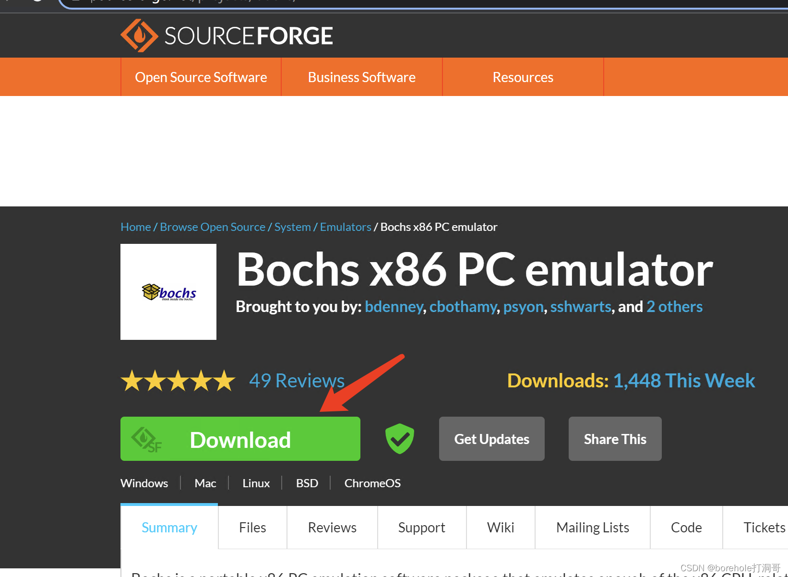

下载完毕后双击进行安装。

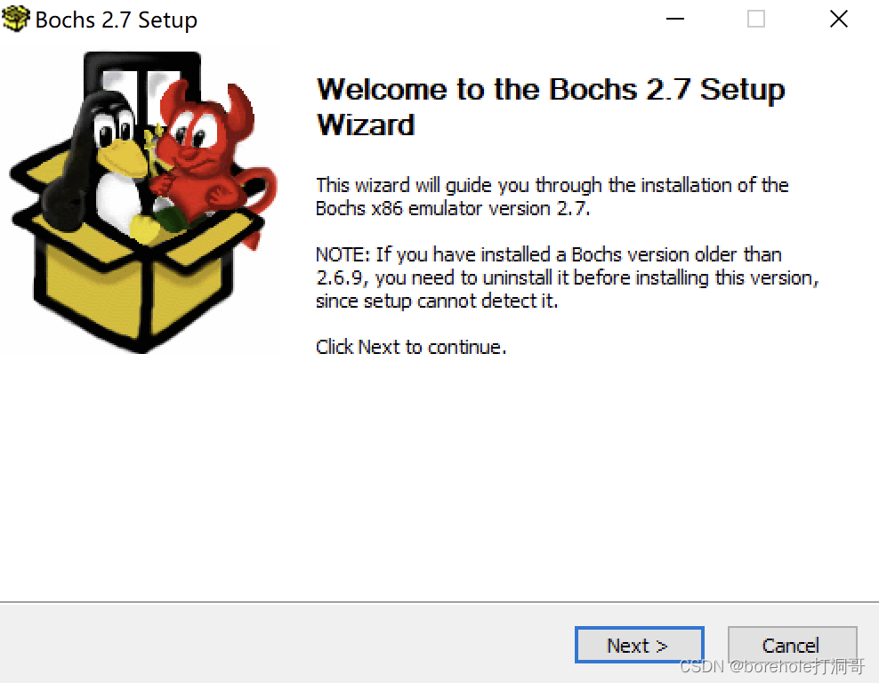

安装过程中的选项保持默认即可。等安装完毕后，可以在开始菜单中找到bochs，这里我们不要直接运行，而是选择下面的`Folder`文件夹打开。

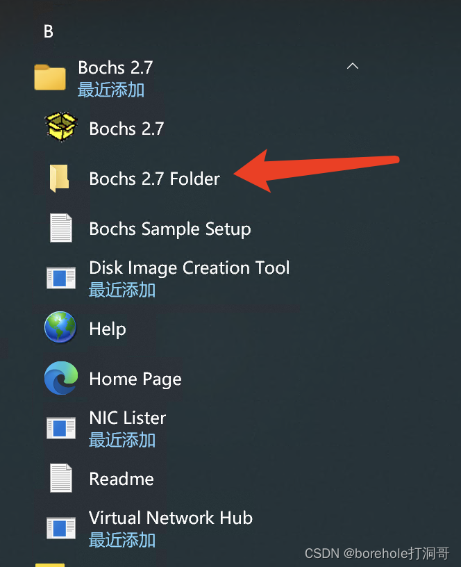 

打开后我们选择`bochsdbg.exe`打开。注意，在Windows中的`bochs`默认是不带调试功能的，必须要运行`bochsdbg`才可以进行调试。本文后续所有要求运行`bochs`的地方，对于使用Windows的读者，都要换成`boch sdbg`。（包括命令行、makefile中填写的也应当是`bochsdbg`而不是`bochs`，请读者一定要注意！）

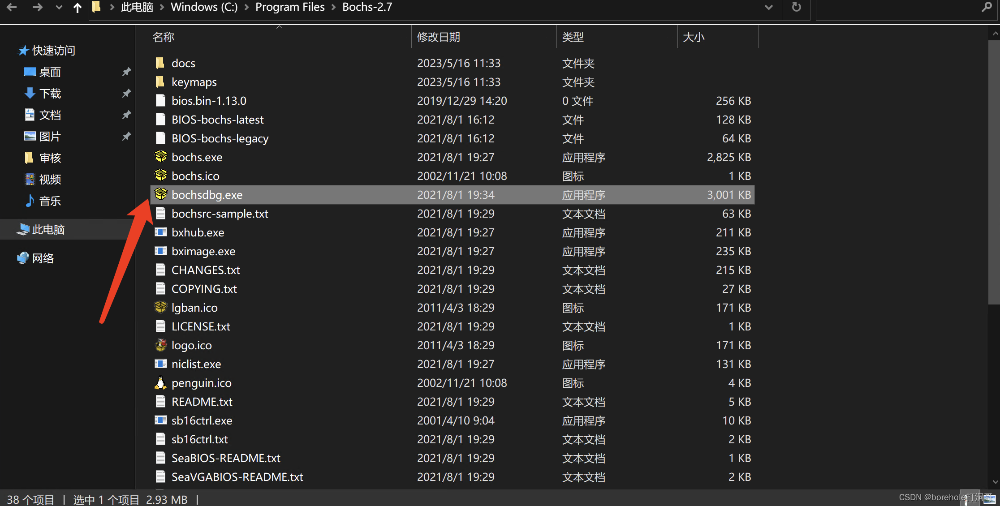 

打开之后，可以选择左侧Load按钮加载`bochsrc`配置文件运行，后续如果我们用命令行加`-f`参数后则无需手动加载。现在暂时也可以不用加载配置文件，直接用默认方式执行，点击右侧的Start即可看到运行效果。

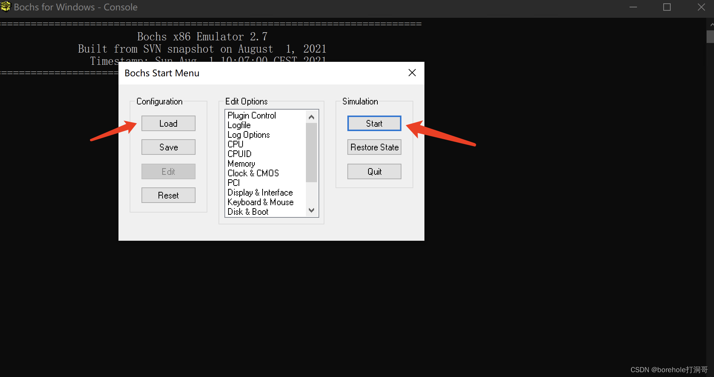 

之后便可以看到`bochs`的运行状态，左侧是用于调试的命令行，右侧是虚拟机的显示效果。

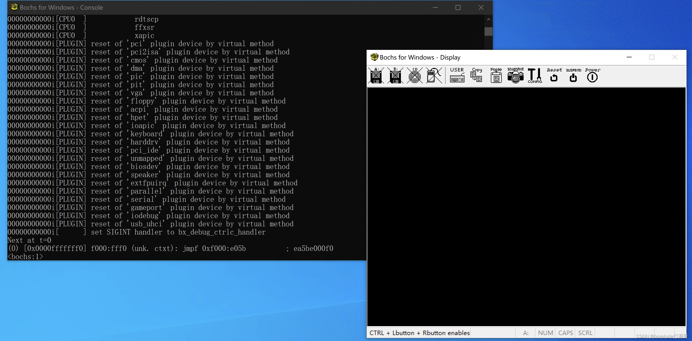

## 运行在8086上的第一个程序

既然硬件环境已经就绪了，那接下来，就要想办法让它运行我们的程序了。不过在此之前，我们必须要了解一下8086的主要架构，以及执行程序的方式。

### 为什么要了解8086

话说，我们不是要研究AMD64架构嘛，干嘛要扯这几十年前的这款胡子都老白了的这款CPU爷爷呢？其实我们在前面介绍AMD64历史的时候就提到过，IA-32也好，AMD64也好，它本质上并不是完全新的架构，而是保持着向下兼容的。

一方面来说，IA-32和AMD64都是从8086模式开始启动的，在开机的那一瞬间，你的电脑其实就是8086，然后再通过一些配置，切换到286模式、386模式、AMD64模式等等的。因此，要想在AMD64架构的裸机开始加载程序，8086的工作方式我们是避不开的。

另一方面来说，从IA-32和AMD64架构中来看，其实它还是有很浓重的8086风格，主干框架并没有大的变动，因此，了解了8086以后，自然而然也就了解了AMD64的其中一部分了。

因此，我们有必要在那些额外扩展的环节之前，先来了解一下8086。

### 8086体系架构

我们要了解8086体系的计算机中的几大硬件，它们是：

  1. CPU

  2. 内存

  3. BIOS

  4. 硬盘

  5. 显卡

  6. I/O设备

CPU是核心，我们放后面来讲，先讲讲内存、硬盘（外存）和显卡。

#### 内存和外存

「内存」这个词感觉在近年来，已经被移动设备行业的术语给“污染”了。因为我们常说的「手机内存」其实指的并不是计算机领域术语中的「内存」。

内存，全称「内部存储器」，英文名称是「Internal Memory」，又被称为「主存」。之所以叫「内」，这也是有历史原因的。因为早年，内存并不是一个独立的硬件，而是直接将内存颗粒焊死在主板上的。

所以，以这个核心的元器件作为边界，在「里面」的存储器就叫内存，然后在这个体系外部的就叫做了「外存」。

还有一个原因在于，内存是可以直接和CPU交互的，而外存则不可以，它必须通过I/O接口，将数据先通过内存，然后才可以被CPU处理。

内存一般使用的是电路方式存储，比如说由晶体管组成的双稳态电路，通过电路的电压来表示比特位的信号。这种存储方式的优点就是读写速度会很快（毕竟是电路实现），而缺点就是，依赖持续的电力。换句话说，如果断电了，数据就会丢失，重新上电以后，里面的数据是什么是不一定的（随缘，非常的薛定谔），得重新写入以后才会可用。

所以，移动设备行业里所谓的「手机内存」，指的显然不是这个意义上的内存。这其实也是划界的问题，因为手机内存中的「内」是相对于SD卡而言的，手机里自带的存储就叫了个「内存」。但计算机专业领域中的「内存」则是体系结构的内部。（后来也是因为手机内存这个称呼已经有了，再想提及手机里真正意义上的「内存」的时候，又不得不加定语，叫了个「运行内存」。所以用计算机专业领域的概念来说，「手机内存」其实是「外存」，「手机运行内存」才是「内存」）。

我们再来说说外存。外存自然就是前面说的那一套之外的存储设备咯，像是早期的软盘。你想想啊，机器里其实只有一个软驱的，要用的时候，把软盘插到软驱里，再来读取数据。所以，这个「软盘」不就是「计算机外部」的存储设备吗？这样解释可能更容易被接受。

当然，像是硬盘、光盘、U盘等等这些，也都属于外存，虽然硬盘一般是放在机箱里面的，不会频繁插拔，但不影响它在体系结构中的角色。

外存一般用非电路方式存储，像是软盘、机械硬盘采用的就是磁性存储，通过磁头去感应某一个位置磁粉的N极或S极来识别比特位。而光盘则是采用光返性质存储，驱动器来识别某一位置的反光性来识别比特位。再像是U盘（闪存盘）、固态硬盘这些则是用浮栅层来存储，通过栅格中的电子数来识别这一位置的比特位数据。

既然是非电路方式，那么它就不怕掉电，数据将会更长久地保存。不过相对地，它的读写速度就会慢很多。

#### 显卡

显卡，全称「显示适配器」，英文是「Graphics Adapter」。顾名思义，就是用来把信号变成画面，呈现在显示器上的硬件。

在早期，显卡的作用仅仅是用来做信号转换，在内存当中会分配一片专属区域，供显卡来使用。显卡就是不断地读取这片内存区域的数据，然后把它按照一定的协议方式，转换成显示器上的图像。当需要变换显示的东西的时候，CPU就会改写这片内存空间，这样在下一帧的时候，显卡就会按照对应的要求，变换显示的图像。

在这套体系当中，图形的处理完全是由CPU来承担的，而用于显示输出的数据，也是由内存的一部分来承担的，我们把这片用于显示画面的内存区域叫做「显存」。

然而后来，随着人们对图形质量的要求越来越高，因此就想到专门搞一个用来处理图像数据的处理器，也就是GPU，GPU也需要自己的主存，也叫做「独立显存」。

稍微多扯几句，现在我们再说「显卡」，默认都是包含了GPU的显卡，而不再是单纯的显示适配器了。随着现代显卡的性能不断发展，在一些对图形性能要求不是那么高的设备上，就考虑不使用独立显卡，而是将显卡（包括GPU）继承在其他部件上，这种显卡也被称为「集成显卡」。将GPU集成在主板上的叫做「板载显卡」，将GPU集成在CPU中的叫做「核心显卡」。不过板载显卡已经被淘汰了，目前如果你的电脑中没有独显的话，那一定是核显。注意，这种情况只是GPU集成在了「CPU这个芯片」当中，但早已不是早期那种，没有GPU的情况了。

#### BIOS

前面我们介绍了内存和外存的特性，不知道读者有没有这样一个疑问：既然CPU只能操作内存，而内存又是断电后数据就消掉了，外存虽然可以长久保存，但是刚开机的时候，CPU又执行不到这里来。那么，开机后CPU到底要执行哪里的指令呢？

这确实是个很严重的问题，所以说，计算机需要一个「固化」下来的启动程序，做一些硬件自检的功能，然后把一份指令从外存读到内存中，再开始执行。承担这个任务的就是BIOS，全称Basic Input/Output System，中文译作「基本输入输出系统」。一般会用一种类似于FPGA的这种ROM，随着新机器的发型，直接固化在主板上了，当然后来也出了一些可升级固件的BIOS。

硬件的问题解决了，还有另一个问题，照理说，BIOS也不属于内存，那CPU要怎么执行到BIOS中的指令呢？Intel解决这个问题的方法叫做「统一编址」，简单来说，就是把一部分内存地址，映射给内存之外的部件，比如说BIOS。对于CPU来说，它会「认为」自己是在通过内存数据线来操作内存，但其实中间的一部分链接到了BIOS中。

因此，当计算机启动的时候，它会先执行BIOS中的指令，BIOS里会把一份代码从外存加载到内存中，然后再来执行它。由于这份代码是程序员完全可控的，因此接下来的事情就由这份代码来完成了。我们把BIOS加载的第一段程序叫做「MBR(Master Boot Record)」。

另外多啰嗦几句，前面介绍的BIOS也是计算机专业领域当中「BIOS」的概念，而现代我们常说的「BIOS」，里面有丰富图形界面，多种功能（甚至可以超频的那种），其实已经不是传统的BIOS了，而是UEFI(Unified Extensible Firmware Interface)。只不过因为它承担着与BIOS类似的作用，所以大家仍然习惯称之为「BIOS」，这一点希望读者悉知。笔者在后续描述中的「BIOS」特指计算机专业领域术语的BIOS，而对于UEFI则会单独称为「UEFI」。

#### CPU

终于讲到了核心的部件——CPU。CPU，全称「Central Processing Unit」，中文译为「中央处理单元」或「中央处理器」，但这个中文名用得不多，一般还是直接叫它CPU。

【注：为了简化问题，帮助读者快速上手，下面的CPU框架结构是简化版的，想知道完整、规范地8086CPU内部结构的读者可以在网上自行搜索。】

CPU有三个重要的部分：运算器（CU, Calculation Unit）、执行器（EU, Execution Unit）和寄存器（Register）。其他类似于缓存（Cache）之类的东西先不讲，因为我们暂时感知不到。

运算器，简单来说就是CPU的原子功能，比如说能做加减法运算之类的。它能做哪些运算取决于它的指令集。

执行器，由它来负责，当前要使用运算器的哪个功能，执行什么样的指令。

寄存器，则是CPU内部用来存放数据的地方，对于软件层面来说，我们主要操作的就是寄存器，因为其他部件都是按照自己的规则去执行的，我们只需要控制寄存器，就可以完成我们希望CPU执行的指令。

照理说，这个时候我应该介绍一下8086的14个寄存器的，但是笔者觉得，前面的铺垫有点太多了，读者可能已经迫不及待想写点程序运行运行了，所以，这些内容，等用到的时候再说吧~

### 让机器执行起来

啰里八嗦了那么多，总算是可以开始运行程序了！现在就请打开`bochs`，我们用debug模式来裸机运行一下，看看会发生什么。

对于Windows系统来说，直接运行`bochsdbg.exe`就可以了，暂时还不用加载配置文件，对于macOS来说，需要指定一下显示的配置。我们找一个工作路径（以后项目的代码都可以放到这个里面），例如`~/code`，再里面创建一个文件名为`bochsrc`，这是虚拟机的配置文件，然后编辑里面的内容如下：

```
display_library: sdl2
```

主要是因为，`bochs`的显示输出，默认用的并不是`sdl2`，这在macOS上是显示不出来的，所以我们需要指定到这个库。

如果你的机器上还没有安装，那么可以用`brew install sdl2`来安装。

保存完毕以后，在工作路径上通过这个配置文件来运行虚拟机：

```
bochs -qf bochsrc
```

即可启动虚拟机，命令行会保持在调试状态： 

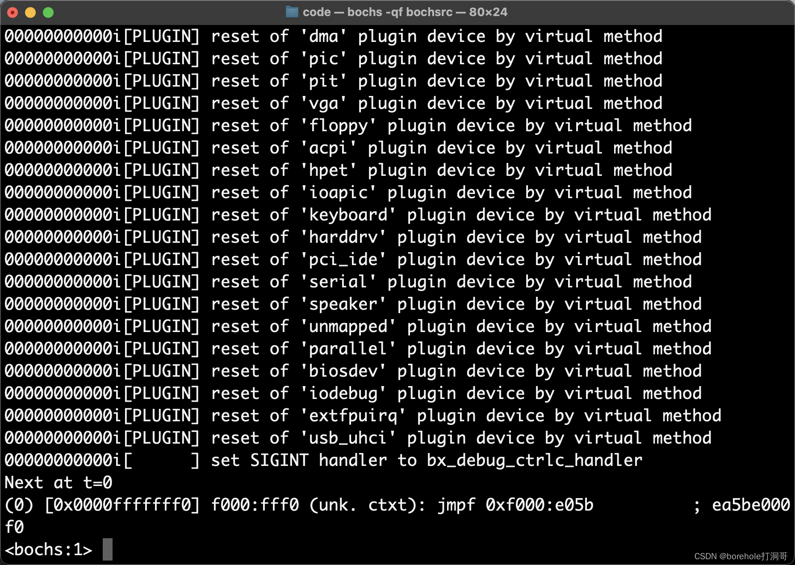

这时候我们可以输入`c`，回车，表示继续执行，不出意外的话，会弹出虚拟机的显示窗口：

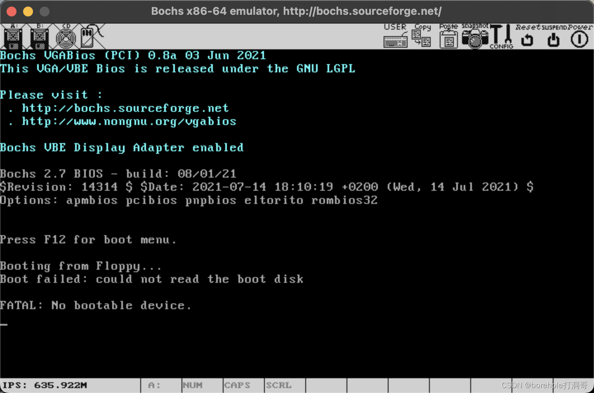

可以看到，BIOS中的指令已经运行完毕了，但是由于它没有搜索到外存，所以最终停在了这里。

很好！接下来，我们只需要把指令给它加载到外存里就OK了吧！你可以想象，现在我们把程序写好了，放到一张软盘中，然后把软盘插到软驱里，再重启电脑，这样的话，BIOS就应当能检测到软盘中的内容，并自动加载到内存里了。

不过对于虚拟机来说，上面这套动作得靠配置文件来完成。打开我们刚才的`bochsrc`（如果你用Windows，之前没有建立的话，现在就该建立了！），加入以下内容（注意，macOS的话不可以删除`sdl2`的配置项哈！）：

```
boot: floppy ## 设置软盘启动
floppy_bootsig_check: disabled=0 ## 打开自检
floppya: type=1_44, 1_44="a.img", status=inserted, write_protected=0 ## 使用1.44MB的3.5英寸软盘，取镜像为a.img，开机默认已插入软驱，不开启写保护
```

这样再开机的时候，就可以读取软盘镜像了。那么接下来，我们只需要把要执行的指令，写成这个名为`a.img`的软盘镜像里就大功告成了。

那怎么创建软盘镜像呢？需要用到二进制编辑器。二进制编辑器很多，macOS上推荐使用Hex Fiend，可以直接在App Store中下载到：

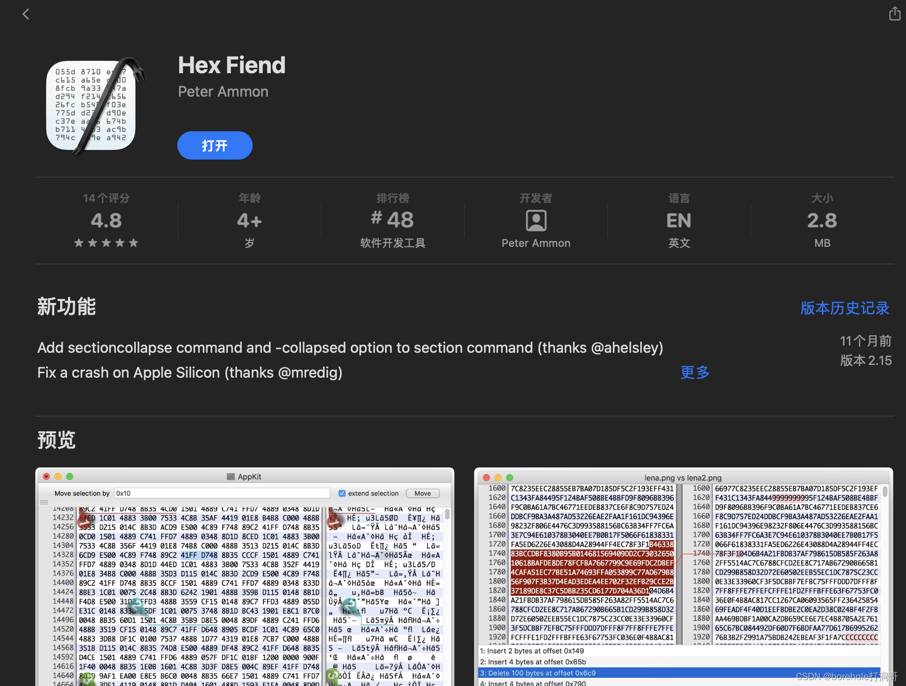

对于Windows来说，可以使用ultra edit，请读者自行安装，如果你实在找不到合适的也无妨，因为我们不可能一直用编辑二进制的方式来写程序，下一章开始我们就改用其他方式了，可以看一下笔者的操作，领悟精神即可。

为了能看到执行效果，我们就把一个数写到一个寄存器里，然后通过`bochs`的调试指令来看看寄存器里的值，如果生效了，那么就证明我们的MBR已经加载并执行成功了。比如说，我们给`ax`寄存器中放一个数值`6`。关于`ax`寄存器是什么后面章节会讲，反正当前只要知道它是一个8086中的寄存器就好了。

那么，把`6`写入`ax`寄存器的命令是什么？这个可以通过查Intel手册知道，应当是：

```
 B8 06 00
```

`B8`是指令码，表示给`ax`寄存器中存入数据。后面的`06 00`是操作数，因为`ax`是一个十六位寄存器，所以给它应该要放一个16位的操作数。那为什么是`06 00`而不是`00 06`呢？这是因为，8086体系使用小端序，也就是低字节放数的低位。但是在书写数据的时候，我们又习惯从低到高来写，所以就变成了`06 00`，看上去可能有点不适应，但是还是需要大家适应一下~

那是不是这样就OK了？并不是！虽然BIOS会自动加载数据，但是，BIOS有一个约定，它会检测这段数据的最后两个字节是否是`55 AA`，是才会认为这是一段合法的MBR，才会加载。至于为啥是这俩魔数……emmm……估计没人晓得~

由于BIOS只会加载512字节（也就是对于软盘来说的第一个扇区），又对后两个字节有标志检测，所以，MBR应当是不多不少正好512字节，并且要在软盘的第一个扇区，这样才能正确被加载。所以，我们补全到512字节，并且把后两个字节设置为`55 AA`，如下图：

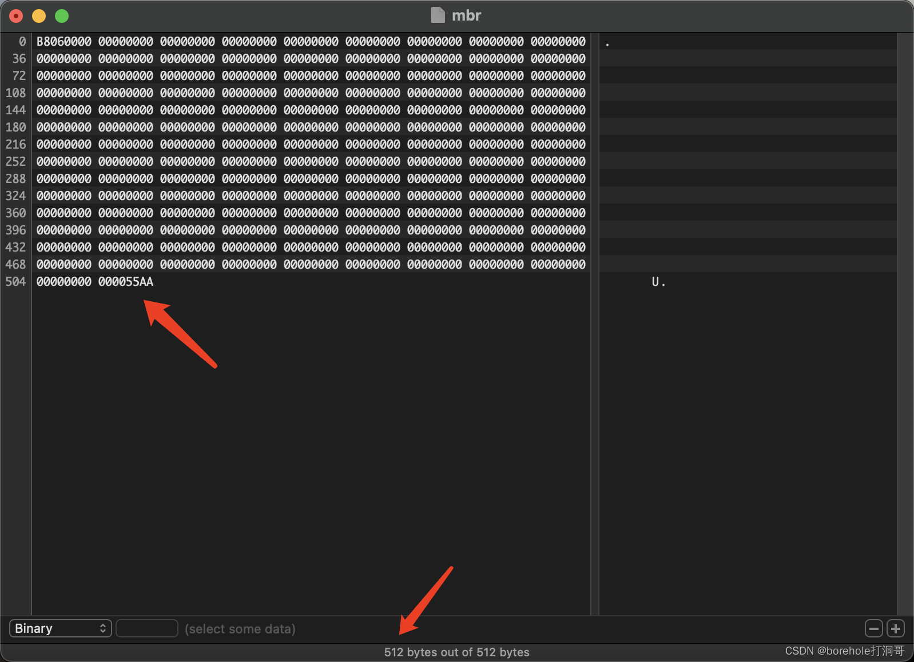

保存成a.img，就可以使用了！

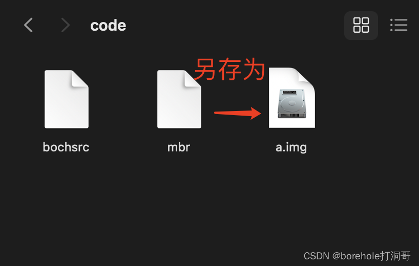

然后我们再执行`bochs -qf bochsrc`，（Windows可以先打开`bochsdbg.exe`，然后选择`Load`按钮加载`bochsrc`），注意，现在还不能无脑按`c`，因为我们的MBR里只有一条指令，黑着往下执行的话会观察不到。所以，我们需要打一个断点，让`bochs`执行到这个位置的时候停一下。

那么另一个问题来了，断点应该打在哪？这取决于，BIOS会把MBR加载到内存的哪一个位置。这里的约定是`0x7c00`的位置（同样，至于为什么是这个地址估计也没人知道了~总之是作为一种约定），那么我们就要在`0x7c00`的位置打断点，所以执行下面的调试指令：

```
 pb 0x7c00
```

然后再按`c`，这样执行到这一位置的时候就会停下来：

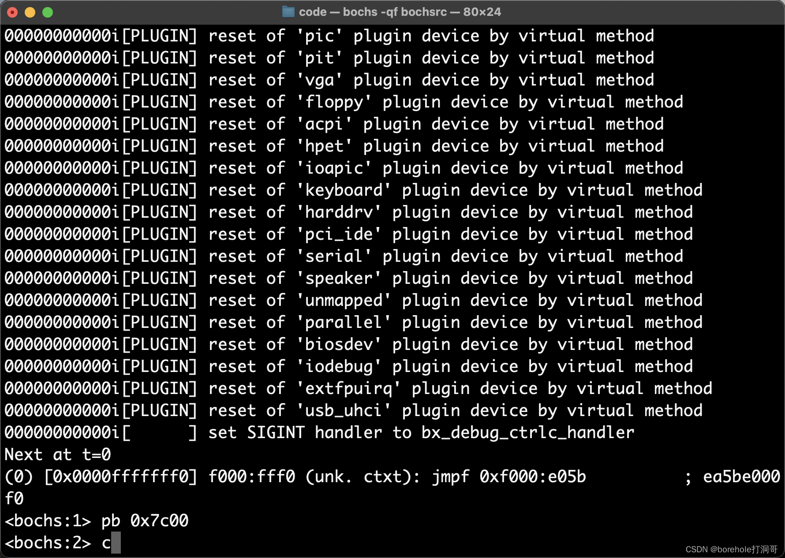

停下来的时候，调试页面会显示这样的情况：

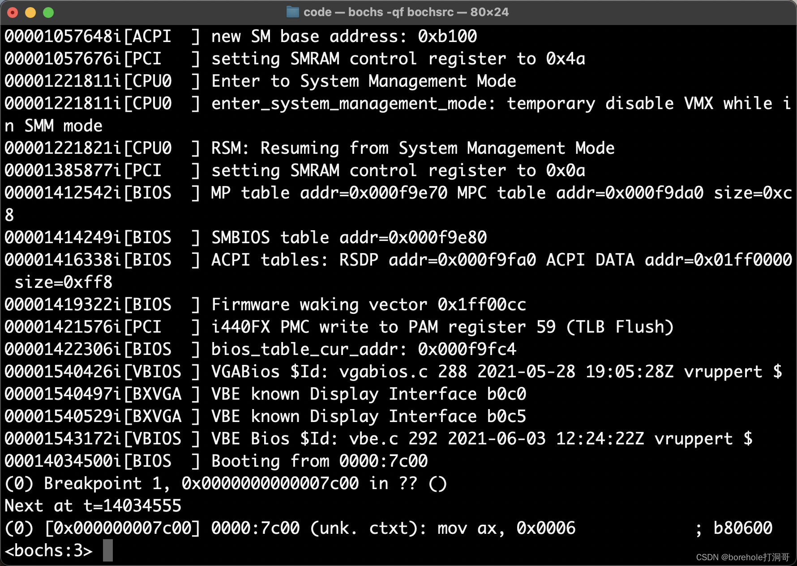

注意最下面一行，中括号里的就是当先执行指令的内存地址，也就是`0x7c00`，证明这个断点位置是对的，在继续执行之前，我们先来看一下当前`ax`寄存器的情况，输入`r`指令，回车可以看到通用寄存器的状态：

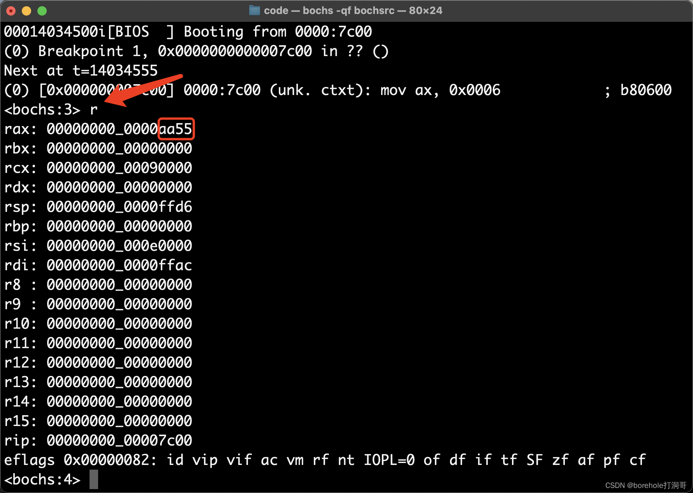

这里需要解释一下，由于`bochs`是AMD64架构的模拟器，所以这里的寄存器都是按64位显示的，它们的扩展情况将会在后续章节来介绍，目前我们只需要知道，要看`ax`寄存器的值，其实就是看`rax`的最后16位（也就是最后4位十六进制位），如上图红框里的，就是`ax`的值，现在是`aa55`。

然后，我们往下执行一条指令就好了，`s`命令是单条执行，只会向下执行一句指令。所以我们输入`s`，回车，再输入`r`来打印一下寄存器的情况：

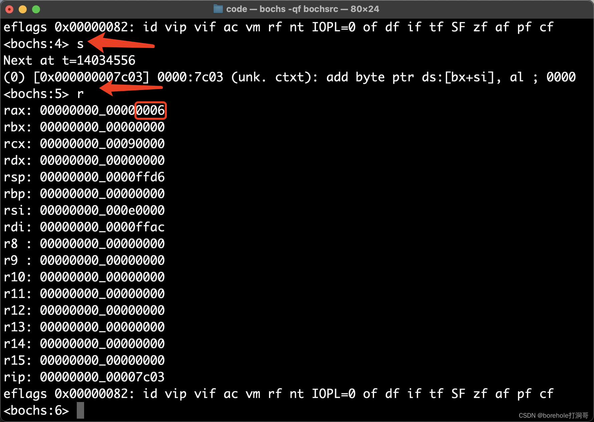

OK，`ax`寄存器真的被改写成`0006`了，说明我们的指令已经成功运行了！

### 改用汇编语言

不知道会不会有读者跟笔者一样，第一次在裸机上运行一句指令以后会无比兴奋，仿佛打开了新世界的大门，恨不得现在就着手写一片江山上去！但是先别急！因为这种用二进制机器码直接编程的难度也忒大了。我得去记住所有的指令码和指令格式，万一错一个数字那就整个都不对了，况且它可读性也很差呀！谁能一眼看出来`B80600`是什么鬼？

当然了，要是退回到8086的年代，可能程序员真的是这么干的，但是现在，我们有了更方便的工具，这种仿古式的编程方法，稍微体验一下就OK啦。回到上面的指令，既然`B80600`是「给`ax`寄存器写入`0006`这个数」的含义，那么，能否有一个翻译器，把我的这种表意，转换成机器指令呢？

当然有！这就是汇编器，它可以把汇编语言转换成机器码。比如说：

```
mov ax, 0x06
```

表明给`ax`寄存器中传入`0x06`这个十六进制数，然后交由汇编器将其转换为`B80600`。这样的语言就叫做汇编语言，汇编语言看起来是比机器码要友好得多了吧？

不过成熟的汇编器除了做指令翻译以外，可能还会有一些更方便的功能，类似于编译器的预处理，做一些静态的数值转换之类的工作，但是不同的汇编器支持的汇编语言也会略有不同，业界比较常用的有两个：nasm和gas。

gas也就是GNU的asmmbly(汇编语言)，之所以比较常用，是因为gcc只能将C代码编译成gas格式，后续本篇的示例中，也会使用gcc编译器，编译后的就是gas格式。

nasm是一个比较被普遍认可的汇编器，全称Netwide Assembler。它的优点在于语法简洁易用。在本篇的示例中，对于需要直接手动开发的汇编语言部分，将会使用nasm。

接下来就来介绍如何安装nasm。

#### 安装nasm汇编器

首先，登录[nasm官网](https://www.nasm.us/)，点击当前最新的稳定版本（读者看到的时候有可能已经是高于截图的版本了，不过没关系，选择最新的稳定版即可）。 

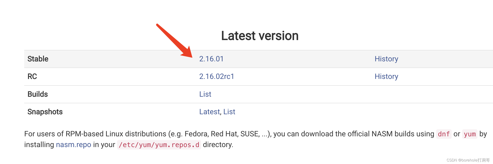

接下来，根据自己所使用的OS选择对应的文件夹，如果你用macOS，就选`macosx`，如果你用Windows，就选`win64`。注意，这里只区分操作系统，不区分你的实际硬件架构，即便你使用苹果自研芯片的Mac，或者搭载骁龙芯片的Windows，这里的软件也同样适用。

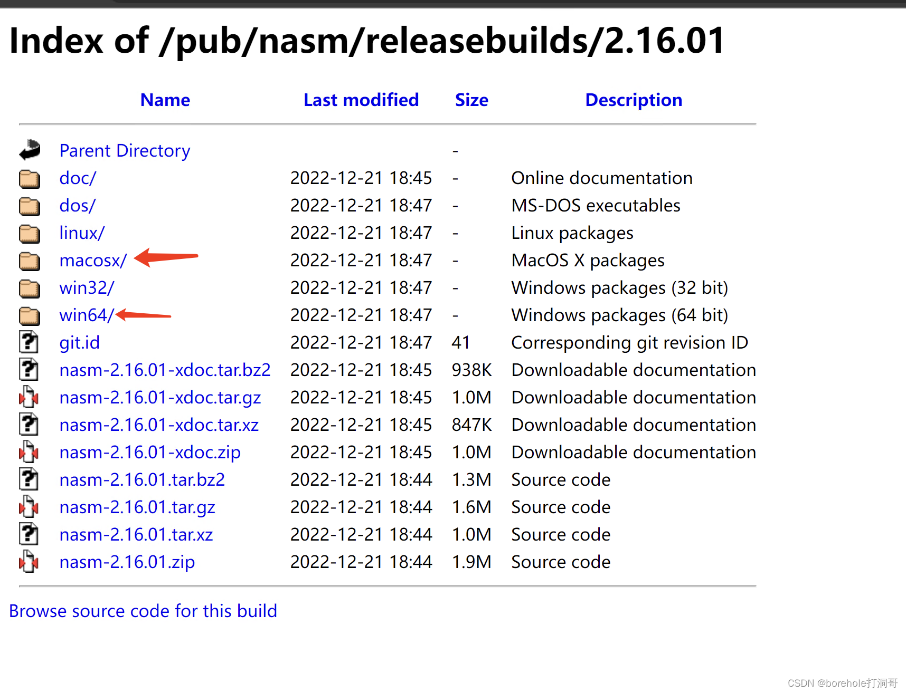

接下来Windows和macOS的步骤会有不同，笔者分别来介绍。

##### 在Windows上安装nasm

由于Windows版本中提供了安装包，因此，比较方法的做法是下载这个`installer`，然后通过自带的安装程序安装到电脑中。当然，如果你对搭建环境比较熟的话，也可以直接下载下面的`zip`，解压缩后得到的直接是`nasm`程序本身。 

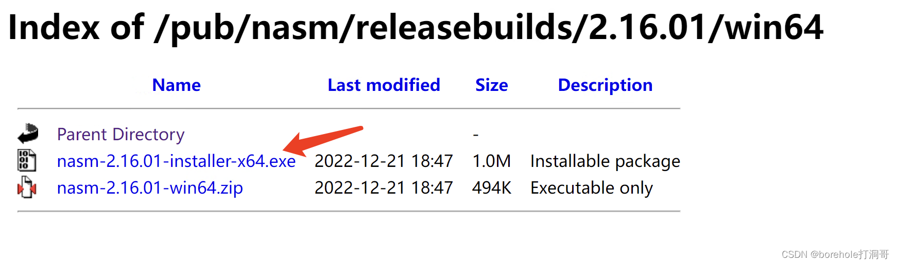

如果你选择了安装器的版本，那么直接运行安装器，安装选项全部默认即可。 

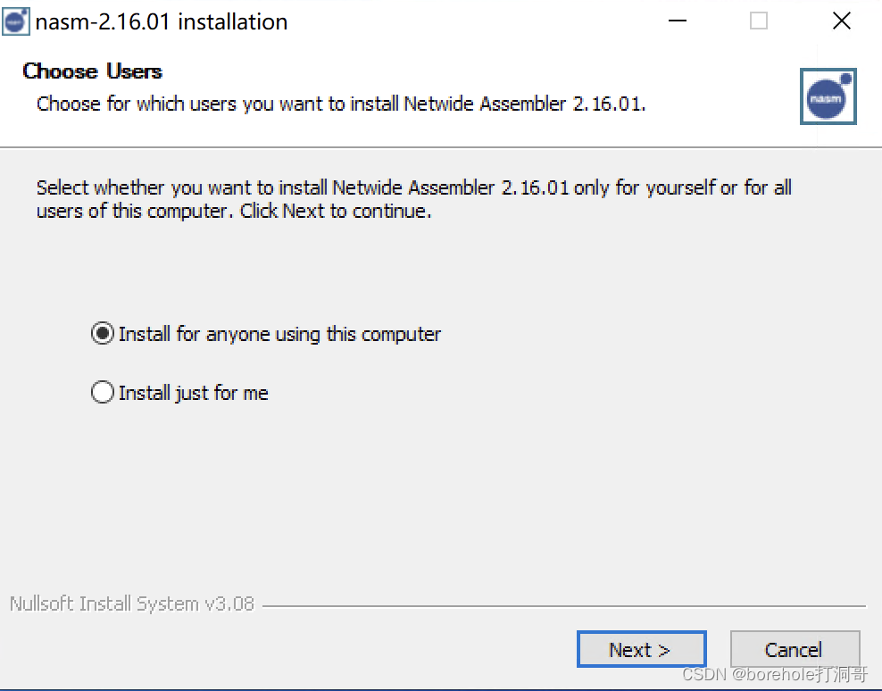

不过这里要注意一下安装路径，默认情况是`C:\Program Files\NASM`，Windows默认这个带空格的路径确实是一个饱含诟病的历史遗留问题，不过对于`nasm`来说影响不大，安装在默认路径下也是OK的，只不过我们要记住这个路径，保证能找到它。如果你没有用安装器，而是直接下载的`zip`然后解压缩的话，也请把整个文件夹放在一个合适的路径下，保证自己找得到。

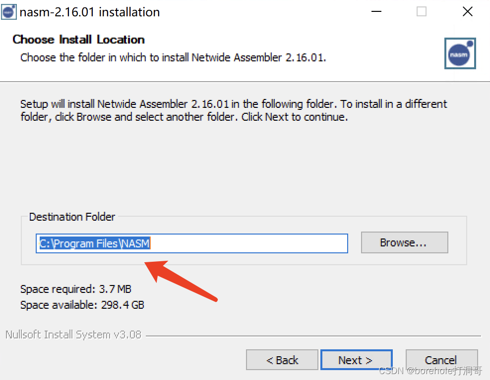

等安装完毕后，`nasm`就已经躺在刚才的安装路径下了。但是每次都指定绝对路径去运行着实麻烦了一些，也不方便我们进行项目的迁移，因此，我们还要把它配置到环境变量里。按Win+R组合键，弹出「运行」窗口，输入`sysdm.cpl`，回车，即可打开系统属性设置。

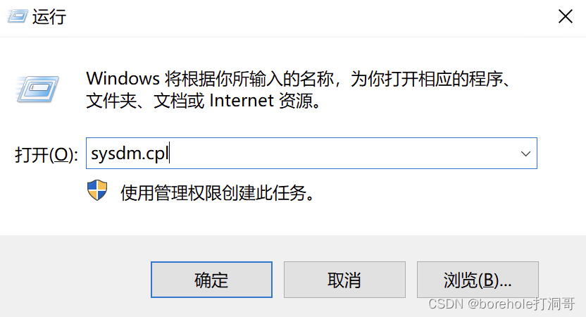

在「系统属性」设置中，选择「高级」标签页，再点击下面的「环境变量」按钮。 


接着，在环境变量中找到用户变量里的`Path`，这个变量决定了，如果你不指定绝对路径，而是直接输入一个命令的时候，系统会去哪些路径中找程序。我们希望的效果是，当我们想运行`nasm`的时候，直接输「`nasm`」就好了，而不是每次都要输「`C:\ProgramFiles\NASM\nasm`」，因此，就要把这个路径也配置到环境变量中。

选择`Path`后点击「编辑」，或者直接双击`Path`也可以，就可以编辑环境变量了。 

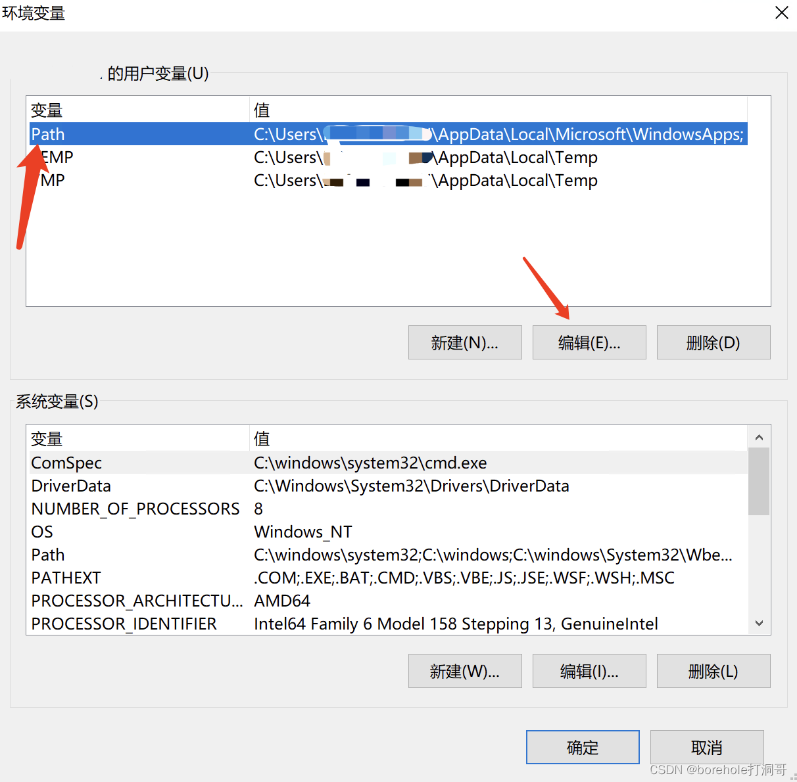

在「编辑环境变量」的窗口中点击「新建」，然后把`nams`的安装路径写进去。注意，要写全路径，并且只需要写到`NASM`这层路径就好了，确保这个路径下有`nasm.exe`这个可执行程序。 

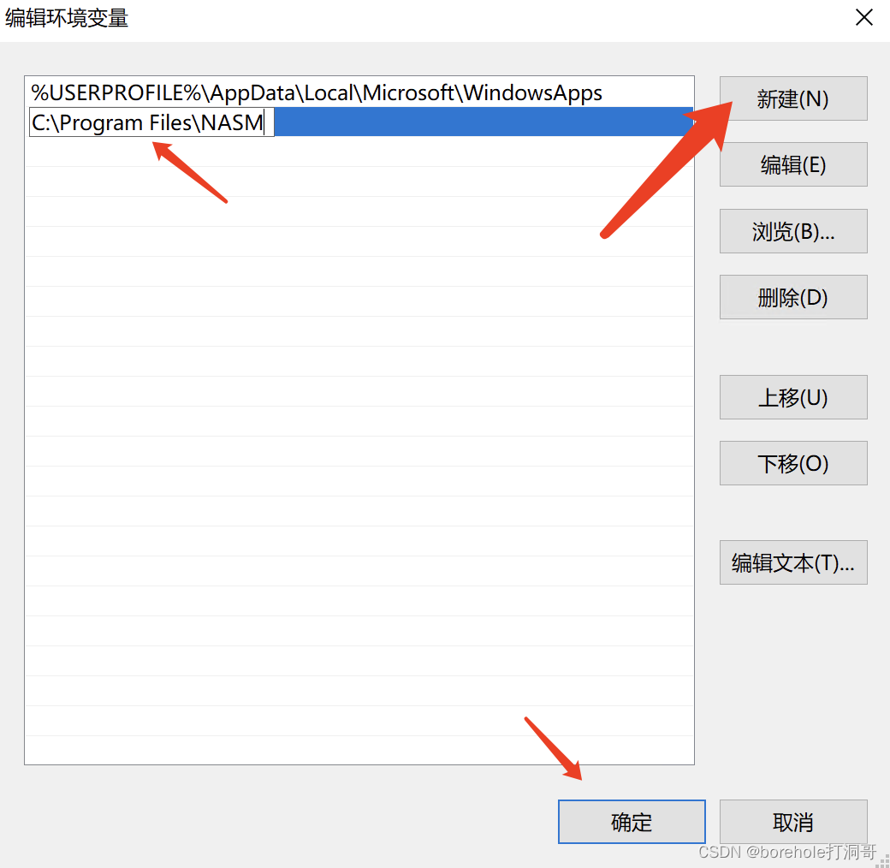

环境变量设置好以后，我们就可以尝试运行一下`nasm`了。按Win+R打开「运行」，输入`cmd`，回车，即可调出控制台。


在控制台中输入`nasm -v`，如果能够看到打印出的`nasm`版本号信息，就说明我们已经安装配置完毕了！

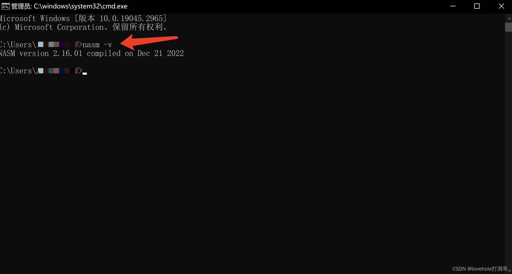

##### 在macOS上安装nasm

由于macOS版本的`nasm`没有安装包，所以我们只能下载源程序的压缩包。 

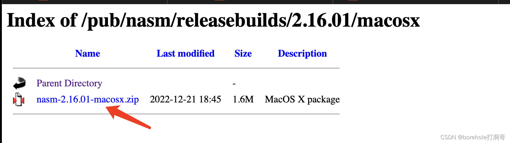

解压缩之后，就已经是可以执行的程序了，不过一般情况下浏览器默认会把文件下到「下载」这个路径中，这里自然不合适放一个经常要用到的程序，所以请手动把它挪到一个妥当的位置。

我这里选择的是用户根路径，也就是`~/`。文件夹它默认带版本号，你可以改个名字，也可以不管它，只要确保里面有`nasm`这个可执行程序就好了。我这里的路径是`~/nasm-2.16.01`。

同样地，为了让我们使用时可以只输入`nasm`，而不是`~/nasm-2.16.01/nasm`，我们还需要把这个路径放入环境变量。

macOS最早默认使用的bash，后来换成了zsh，因为这个切换已经很久了，所以笔者介绍zsh的情况，如果你用的是其他版本的shell，就请自行解决环境变量的配置问题。

执行下面的命令，编辑zsh的配置文件：

```
vim ~/.zprofile
```

注意，即便你当前没有`.zprofile`这个文件也没关系，上面的命令执行会以新建文件的方式。

然后再编辑界面按「i」键，进入编辑模式，此时左下角会显示「INSERT」，表示在编辑模式。如果里面已经有一些配置了，无视就好，我们在文件最后加上：

```
PATH=$PATH:/Users/xxx/nasm-2.16.01
```

注意，由于我是放在`~/`里的，但这里要写全路径，所以你需要看一下全路径是什么，用波浪线有时可能会失效。

那一句的意思就是，在`PATH`这个变量后面，加上一个`nasm`的路径，所以这里要填写你的`nasm`所在路径。

由于`.zprofile`会在每次运行终端的时候自动执行，因此我们把命令写在这个文件里就不用每次手动配置了，但由于现在还没生效，所以你还需要执行一句：

```
source ~/.zprofile
```

或者干脆把终端关了，重新开一下，就生效了。

然后我们在控制台输入

```
nasm -v
```

如果能够看到版本信息，那么说明`nasm`已经安装配置成功。 


## 编写MBR

上一章我们已经成功地在8086上运行了指令，同时也介绍了nasm汇编语言。那么接下来这一章，我们就来看看如何写BIOS自检后的第一道程序——MBR。

### 8086的14个寄存器

既然咱们已经决定要在8086上运行程序了，那么自然，现在是逃不过要了解一下8086 CPU的一些详细情况了。

值得注意的是，8086**并不是只有14个寄存器**，只不过这14个寄存器是对于程序来说直接打交道的。CPU内部自然还有一些用于体系自身运行的，对外不透明的寄存器，不过这些我们就不需要了解了（其实很多更详细的那些也属于Intel的商业机密，咱也没法了解）。

我先把要关注的这14个寄存器的名称列出来，然后再来解释：

<table><thead><tr><th>符号</th><th>名称</th><th>中文翻译</th></tr></thead><tbody><tr><td>AX</td><td>Accumulator</td><td>累加器</td></tr><tr><td>BX</td><td>Base</td><td>基地址</td></tr><tr><td>CX</td><td>Count</td><td>计数器</td></tr><tr><td>DX</td><td>Data</td><td>数据存储</td></tr><tr><td>BP</td><td>Base Pointer</td><td>基址</td></tr><tr><td>SP</td><td>Stack Pointer</td><td>栈地址</td></tr><tr><td>DI</td><td>Destination Index</td><td>目的偏移地址</td></tr><tr><td>SI</td><td>Source Index</td><td>源偏移地址</td></tr><tr><td>CS</td><td>Code Segment</td><td>指令段</td></tr><tr><td>DS</td><td>Data Segment</td><td>数据段</td></tr><tr><td>ES</td><td>Extra Segment</td><td>附加段</td></tr><tr><td>SS</td><td>Stack Segment</td><td>栈段</td></tr><tr><td>IP</td><td>Instruction Pointer</td><td>指令地址</td></tr><tr><td>FLAG</td><td>Flag</td><td>标志位</td></tr></tbody></table>

需要强调一点，除了IP和FLAG以外，上面寄存器的名称所描述的本意，只是这个寄存器「通常」或「默认」用做的事情，**并不是说该寄存器只可以用做这一种情况**。寄存器是很珍贵的资源，因此实际操作的使用用法是灵活多样的，所以笔者并不想拿这些寄存器名称本身的含义去大书特书。大家其实需要知道，我们要关注这14个寄存器，记住它们的符号（因为汇编语言里要用到）就好了，在一些必须指定寄存器的场景，我们再单独去记忆就好了。

另外，上面这些寄存器都是16位的，这也就意味着，8086每个节拍处理的数据都是16位的，在8086这块CPU里，数据处理和传递的基本单位就是16bit，我们也称「8086的字长为16位」，也称「8086是16位CPU」。

### 8086的寻址方式

前面我们说，8086是16位CPU，这个仅仅是指它的字长，但并不对应它的最大寻址空间。一个CPU的最大寻址空间并不取决于它的字长，而是取决于它对外的地址总线的个数。

如果你玩过数字逻辑器件的话，应该知道有一种器件叫做「译码器」，例如下图展示的是74138，三线-八线译码器：

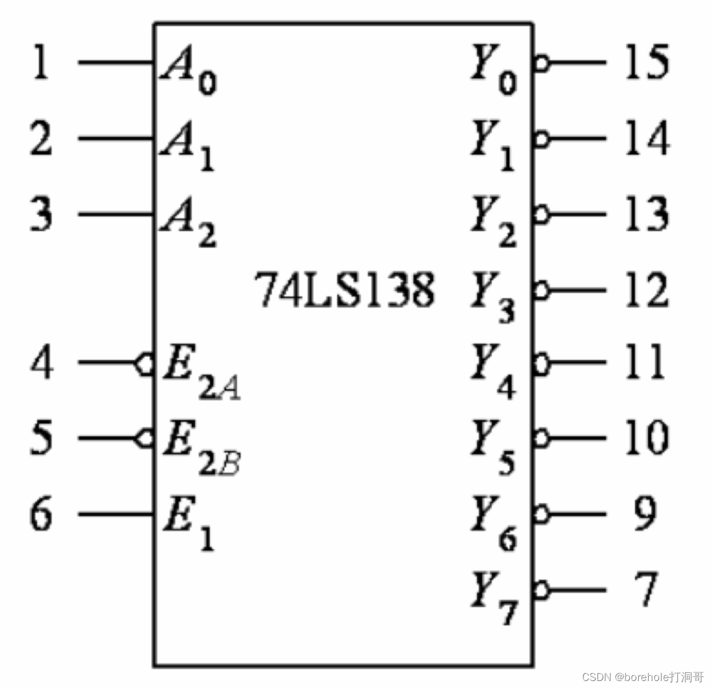

它的输入端（A~0~、A~1~、A~2~）就是地址总线，我们可以想象，这三根线接到了CPU上。后面的输出端（Y~0~~Y~7~）就是数据线，我们可以想象，这8跟线接到了内存的存储单元上。

当A~0~A~1~A~2~输入为`010`时，表示需要控制第2号地址，那么Y~2~会输出1。同理，当A~0~A~1~A~2~输入为`101`时，表示需要控制52号地址，那么Y~5~会输出1。依次类推

在上面所述的这种结构中，我们认为CPU有3根地址总线，那么寻址空间就是23=8，地址从`000`到`111`。

而在计算机体系中，存储单元一般不会按二进制位（bit）来编址，而是按照字节（Byte），也就是说，每8个bits为一组，编一个地址。那么地址总线是3的CPU，就可以访问8字节的内存空间。

而对于8086来说，它含有20根地址总线（**注意，并不是16根！**），那么，8086的寻址空间就是：

<svg xmlns="http://www.w3.org/2000/svg" width="36.728ex" height="2.185ex" role="img" focusable="false" viewBox="0 -883.9 16233.8 965.9" xmlns:xlink="http://www.w3.org/1999/xlink" aria-hidden="true" style="vertical-align: -0.186ex;"><defs><path id="MJX-1-TEX-N-32" d="M109 429Q82 429 66 447T50 491Q50 562 103 614T235 666Q326 666 387 610T449 465Q449 422 429 383T381 315T301 241Q265 210 201 149L142 93L218 92Q375 92 385 97Q392 99 409 186V189H449V186Q448 183 436 95T421 3V0H50V19V31Q50 38 56 46T86 81Q115 113 136 137Q145 147 170 174T204 211T233 244T261 278T284 308T305 340T320 369T333 401T340 431T343 464Q343 527 309 573T212 619Q179 619 154 602T119 569T109 550Q109 549 114 549Q132 549 151 535T170 489Q170 464 154 447T109 429Z"></path><path id="MJX-1-TEX-N-30" d="M96 585Q152 666 249 666Q297 666 345 640T423 548Q460 465 460 320Q460 165 417 83Q397 41 362 16T301 -15T250 -22Q224 -22 198 -16T137 16T82 83Q39 165 39 320Q39 494 96 585ZM321 597Q291 629 250 629Q208 629 178 597Q153 571 145 525T137 333Q137 175 145 125T181 46Q209 16 250 16Q290 16 318 46Q347 76 354 130T362 333Q362 478 354 524T321 597Z"></path><path id="MJX-1-TEX-I-1D435" d="M231 637Q204 637 199 638T194 649Q194 676 205 682Q206 683 335 683Q594 683 608 681Q671 671 713 636T756 544Q756 480 698 429T565 360L555 357Q619 348 660 311T702 219Q702 146 630 78T453 1Q446 0 242 0Q42 0 39 2Q35 5 35 10Q35 17 37 24Q42 43 47 45Q51 46 62 46H68Q95 46 128 49Q142 52 147 61Q150 65 219 339T288 628Q288 635 231 637ZM649 544Q649 574 634 600T585 634Q578 636 493 637Q473 637 451 637T416 636H403Q388 635 384 626Q382 622 352 506Q352 503 351 500L320 374H401Q482 374 494 376Q554 386 601 434T649 544ZM595 229Q595 273 572 302T512 336Q506 337 429 337Q311 337 310 336Q310 334 293 263T258 122L240 52Q240 48 252 48T333 46Q422 46 429 47Q491 54 543 105T595 229Z"></path><path id="MJX-1-TEX-N-3D" d="M56 347Q56 360 70 367H707Q722 359 722 347Q722 336 708 328L390 327H72Q56 332 56 347ZM56 153Q56 168 72 173H708Q722 163 722 153Q722 140 707 133H70Q56 140 56 153Z"></path><path id="MJX-1-TEX-N-31" d="M213 578L200 573Q186 568 160 563T102 556H83V602H102Q149 604 189 617T245 641T273 663Q275 666 285 666Q294 666 302 660V361L303 61Q310 54 315 52T339 48T401 46H427V0H416Q395 3 257 3Q121 3 100 0H88V46H114Q136 46 152 46T177 47T193 50T201 52T207 57T213 61V578Z"></path><path id="MJX-1-TEX-N-34" d="M462 0Q444 3 333 3Q217 3 199 0H190V46H221Q241 46 248 46T265 48T279 53T286 61Q287 63 287 115V165H28V211L179 442Q332 674 334 675Q336 677 355 677H373L379 671V211H471V165H379V114Q379 73 379 66T385 54Q393 47 442 46H471V0H462ZM293 211V545L74 212L183 211H293Z"></path><path id="MJX-1-TEX-N-38" d="M70 417T70 494T124 618T248 666Q319 666 374 624T429 515Q429 485 418 459T392 417T361 389T335 371T324 363L338 354Q352 344 366 334T382 323Q457 264 457 174Q457 95 399 37T249 -22Q159 -22 101 29T43 155Q43 263 172 335L154 348Q133 361 127 368Q70 417 70 494ZM286 386L292 390Q298 394 301 396T311 403T323 413T334 425T345 438T355 454T364 471T369 491T371 513Q371 556 342 586T275 624Q268 625 242 625Q201 625 165 599T128 534Q128 511 141 492T167 463T217 431Q224 426 228 424L286 386ZM250 21Q308 21 350 55T392 137Q392 154 387 169T375 194T353 216T330 234T301 253T274 270Q260 279 244 289T218 306L210 311Q204 311 181 294T133 239T107 157Q107 98 150 60T250 21Z"></path><path id="MJX-1-TEX-N-35" d="M164 157Q164 133 148 117T109 101H102Q148 22 224 22Q294 22 326 82Q345 115 345 210Q345 313 318 349Q292 382 260 382H254Q176 382 136 314Q132 307 129 306T114 304Q97 304 95 310Q93 314 93 485V614Q93 664 98 664Q100 666 102 666Q103 666 123 658T178 642T253 634Q324 634 389 662Q397 666 402 666Q410 666 410 648V635Q328 538 205 538Q174 538 149 544L139 546V374Q158 388 169 396T205 412T256 420Q337 420 393 355T449 201Q449 109 385 44T229 -22Q148 -22 99 32T50 154Q50 178 61 192T84 210T107 214Q132 214 148 197T164 157Z"></path><path id="MJX-1-TEX-N-37" d="M55 458Q56 460 72 567L88 674Q88 676 108 676H128V672Q128 662 143 655T195 646T364 644H485V605L417 512Q408 500 387 472T360 435T339 403T319 367T305 330T292 284T284 230T278 162T275 80Q275 66 275 52T274 28V19Q270 2 255 -10T221 -22Q210 -22 200 -19T179 0T168 40Q168 198 265 368Q285 400 349 489L395 552H302Q128 552 119 546Q113 543 108 522T98 479L95 458V455H55V458Z"></path><path id="MJX-1-TEX-N-36" d="M42 313Q42 476 123 571T303 666Q372 666 402 630T432 550Q432 525 418 510T379 495Q356 495 341 509T326 548Q326 592 373 601Q351 623 311 626Q240 626 194 566Q147 500 147 364L148 360Q153 366 156 373Q197 433 263 433H267Q313 433 348 414Q372 400 396 374T435 317Q456 268 456 210V192Q456 169 451 149Q440 90 387 34T253 -22Q225 -22 199 -14T143 16T92 75T56 172T42 313ZM257 397Q227 397 205 380T171 335T154 278T148 216Q148 133 160 97T198 39Q222 21 251 21Q302 21 329 59Q342 77 347 104T352 209Q352 289 347 316T329 361Q302 397 257 397Z"></path><path id="MJX-1-TEX-I-1D43E" d="M285 628Q285 635 228 637Q205 637 198 638T191 647Q191 649 193 661Q199 681 203 682Q205 683 214 683H219Q260 681 355 681Q389 681 418 681T463 682T483 682Q500 682 500 674Q500 669 497 660Q496 658 496 654T495 648T493 644T490 641T486 639T479 638T470 637T456 637Q416 636 405 634T387 623L306 305Q307 305 490 449T678 597Q692 611 692 620Q692 635 667 637Q651 637 651 648Q651 650 654 662T659 677Q662 682 676 682Q680 682 711 681T791 680Q814 680 839 681T869 682Q889 682 889 672Q889 650 881 642Q878 637 862 637Q787 632 726 586Q710 576 656 534T556 455L509 418L518 396Q527 374 546 329T581 244Q656 67 661 61Q663 59 666 57Q680 47 717 46H738Q744 38 744 37T741 19Q737 6 731 0H720Q680 3 625 3Q503 3 488 0H478Q472 6 472 9T474 27Q478 40 480 43T491 46H494Q544 46 544 71Q544 75 517 141T485 216L427 354L359 301L291 248L268 155Q245 63 245 58Q245 51 253 49T303 46H334Q340 37 340 35Q340 19 333 5Q328 0 317 0Q314 0 280 1T180 2Q118 2 85 2T49 1Q31 1 31 11Q31 13 34 25Q38 41 42 43T65 46Q92 46 125 49Q139 52 144 61Q147 65 216 339T285 628Z"></path><path id="MJX-1-TEX-I-1D440" d="M289 629Q289 635 232 637Q208 637 201 638T194 648Q194 649 196 659Q197 662 198 666T199 671T201 676T203 679T207 681T212 683T220 683T232 684Q238 684 262 684T307 683Q386 683 398 683T414 678Q415 674 451 396L487 117L510 154Q534 190 574 254T662 394Q837 673 839 675Q840 676 842 678T846 681L852 683H948Q965 683 988 683T1017 684Q1051 684 1051 673Q1051 668 1048 656T1045 643Q1041 637 1008 637Q968 636 957 634T939 623Q936 618 867 340T797 59Q797 55 798 54T805 50T822 48T855 46H886Q892 37 892 35Q892 19 885 5Q880 0 869 0Q864 0 828 1T736 2Q675 2 644 2T609 1Q592 1 592 11Q592 13 594 25Q598 41 602 43T625 46Q652 46 685 49Q699 52 704 61Q706 65 742 207T813 490T848 631L654 322Q458 10 453 5Q451 4 449 3Q444 0 433 0Q418 0 415 7Q413 11 374 317L335 624L267 354Q200 88 200 79Q206 46 272 46H282Q288 41 289 37T286 19Q282 3 278 1Q274 0 267 0Q265 0 255 0T221 1T157 2Q127 2 95 1T58 0Q43 0 39 2T35 11Q35 13 38 25T43 40Q45 46 65 46Q135 46 154 86Q158 92 223 354T289 629Z"></path></defs><g stroke="currentColor" fill="currentColor" stroke-width="0" transform="matrix(1 0 0 -1 0 0)"><g data-mml-node="math"><g data-mml-node="msup"><g data-mml-node="mn"><use xlink:href="#MJX-1-TEX-N-32"></use></g><g data-mml-node="TeXAtom" transform="translate(500, 413) scale(0.707)" data-mjx-texclass="ORD"><g data-mml-node="mn"><use xlink:href="#MJX-1-TEX-N-32"></use><use xlink:href="#MJX-1-TEX-N-30" transform="translate(500, 0)"></use></g></g></g><g data-mml-node="mi" transform="translate(1257.1, 0)"><use xlink:href="#MJX-1-TEX-I-1D435"></use></g><g data-mml-node="mo" transform="translate(2293.9, 0)"><use xlink:href="#MJX-1-TEX-N-3D"></use></g><g data-mml-node="mn" transform="translate(3349.7, 0)"><use xlink:href="#MJX-1-TEX-N-31"></use><use xlink:href="#MJX-1-TEX-N-30" transform="translate(500, 0)"></use><use xlink:href="#MJX-1-TEX-N-34" transform="translate(1000, 0)"></use><use xlink:href="#MJX-1-TEX-N-38" transform="translate(1500, 0)"></use><use xlink:href="#MJX-1-TEX-N-35" transform="translate(2000, 0)"></use><use xlink:href="#MJX-1-TEX-N-37" transform="translate(2500, 0)"></use><use xlink:href="#MJX-1-TEX-N-36" transform="translate(3000, 0)"></use></g><g data-mml-node="mi" transform="translate(6849.7, 0)"><use xlink:href="#MJX-1-TEX-I-1D435"></use></g><g data-mml-node="mo" transform="translate(7886.4, 0)"><use xlink:href="#MJX-1-TEX-N-3D"></use></g><g data-mml-node="mn" transform="translate(8942.2, 0)"><use xlink:href="#MJX-1-TEX-N-31"></use><use xlink:href="#MJX-1-TEX-N-30" transform="translate(500, 0)"></use><use xlink:href="#MJX-1-TEX-N-32" transform="translate(1000, 0)"></use><use xlink:href="#MJX-1-TEX-N-34" transform="translate(1500, 0)"></use></g><g data-mml-node="mi" transform="translate(10942.2, 0)"><use xlink:href="#MJX-1-TEX-I-1D43E"></use></g><g data-mml-node="mi" transform="translate(11831.2, 0)"><use xlink:href="#MJX-1-TEX-I-1D435"></use></g><g data-mml-node="mo" transform="translate(12868, 0)"><use xlink:href="#MJX-1-TEX-N-3D"></use></g><g data-mml-node="mn" transform="translate(13923.8, 0)"><use xlink:href="#MJX-1-TEX-N-31"></use></g><g data-mml-node="mi" transform="translate(14423.8, 0)"><use xlink:href="#MJX-1-TEX-I-1D440"></use></g><g data-mml-node="mi" transform="translate(15474.8, 0)"><use xlink:href="#MJX-1-TEX-I-1D435"></use></g></g></g></svg>

所以，8086最多支持1MB的内存空间，地址从20个`0`到20个`1`，不过用二进制表示会比较冗长，所以我们通常用十六进制表示内存地址，也就是`0x00000`到`0xfffff`。

前面我们提到过，类似于BIOS这样的部件，随不属于内存，但使用了统一编址的方式，因此，BIOS里的数据仍然会被包含在这1MB当中，因此实际可用的物理内存，是不足1MB的，但这件事对于CPU来说是无感知的，它会按照同样的方式，通过地址总线来操作外部硬件，无论它是内存还是BIOS。也正是由于这种编址方式，就是为了让CPU不去区分实质硬件，因此，对于统一编址的硬件来说，我们仍然称其地址为「内存地址」，虽然它压根不是内存。

那么另一个很严重的问题就出现了，8086是16位CPU，它的寄存器也都是16位的，但却有20根地址总线，那我们怎么表示一个内存地址呢？8086采用的方式是，用两个16位寄存器来拼成一个20位内存地址，示意图如下：


也就是说，把其中一个寄存器作为「段寄存器」，它的0~15地址线接给全加器的4~19位，作为第一个加数。再把另一个寄存器作为「地址寄存器」，它的0~15地址线接给全加器的0~15位，作为另一个加数。

上面的和作为输出地址。（当然，实际8086内部逻辑器件比这复杂的多，笔者仅仅是做一个示意）

那么用公式来表示就是：

<svg xmlns="http://www.w3.org/2000/svg" width="20.259ex" height="2.262ex" role="img" focusable="false" viewBox="0 -750 8954.6 1000" xmlns:xlink="http://www.w3.org/1999/xlink" aria-hidden="true" style="vertical-align: -0.566ex;"><defs><path id="MJX-2-TEX-I-1D44E" d="M33 157Q33 258 109 349T280 441Q331 441 370 392Q386 422 416 422Q429 422 439 414T449 394Q449 381 412 234T374 68Q374 43 381 35T402 26Q411 27 422 35Q443 55 463 131Q469 151 473 152Q475 153 483 153H487Q506 153 506 144Q506 138 501 117T481 63T449 13Q436 0 417 -8Q409 -10 393 -10Q359 -10 336 5T306 36L300 51Q299 52 296 50Q294 48 292 46Q233 -10 172 -10Q117 -10 75 30T33 157ZM351 328Q351 334 346 350T323 385T277 405Q242 405 210 374T160 293Q131 214 119 129Q119 126 119 118T118 106Q118 61 136 44T179 26Q217 26 254 59T298 110Q300 114 325 217T351 328Z"></path><path id="MJX-2-TEX-I-1D451" d="M366 683Q367 683 438 688T511 694Q523 694 523 686Q523 679 450 384T375 83T374 68Q374 26 402 26Q411 27 422 35Q443 55 463 131Q469 151 473 152Q475 153 483 153H487H491Q506 153 506 145Q506 140 503 129Q490 79 473 48T445 8T417 -8Q409 -10 393 -10Q359 -10 336 5T306 36L300 51Q299 52 296 50Q294 48 292 46Q233 -10 172 -10Q117 -10 75 30T33 157Q33 205 53 255T101 341Q148 398 195 420T280 442Q336 442 364 400Q369 394 369 396Q370 400 396 505T424 616Q424 629 417 632T378 637H357Q351 643 351 645T353 664Q358 683 366 683ZM352 326Q329 405 277 405Q242 405 210 374T160 293Q131 214 119 129Q119 126 119 118T118 106Q118 61 136 44T179 26Q233 26 290 98L298 109L352 326Z"></path><path id="MJX-2-TEX-I-1D45F" d="M21 287Q22 290 23 295T28 317T38 348T53 381T73 411T99 433T132 442Q161 442 183 430T214 408T225 388Q227 382 228 382T236 389Q284 441 347 441H350Q398 441 422 400Q430 381 430 363Q430 333 417 315T391 292T366 288Q346 288 334 299T322 328Q322 376 378 392Q356 405 342 405Q286 405 239 331Q229 315 224 298T190 165Q156 25 151 16Q138 -11 108 -11Q95 -11 87 -5T76 7T74 17Q74 30 114 189T154 366Q154 405 128 405Q107 405 92 377T68 316T57 280Q55 278 41 278H27Q21 284 21 287Z"></path><path id="MJX-2-TEX-N-3D" d="M56 347Q56 360 70 367H707Q722 359 722 347Q722 336 708 328L390 327H72Q56 332 56 347ZM56 153Q56 168 72 173H708Q722 163 722 153Q722 140 707 133H70Q56 140 56 153Z"></path><path id="MJX-2-TEX-N-28" d="M94 250Q94 319 104 381T127 488T164 576T202 643T244 695T277 729T302 750H315H319Q333 750 333 741Q333 738 316 720T275 667T226 581T184 443T167 250T184 58T225 -81T274 -167T316 -220T333 -241Q333 -250 318 -250H315H302L274 -226Q180 -141 137 -14T94 250Z"></path><path id="MJX-2-TEX-I-1D460" d="M131 289Q131 321 147 354T203 415T300 442Q362 442 390 415T419 355Q419 323 402 308T364 292Q351 292 340 300T328 326Q328 342 337 354T354 372T367 378Q368 378 368 379Q368 382 361 388T336 399T297 405Q249 405 227 379T204 326Q204 301 223 291T278 274T330 259Q396 230 396 163Q396 135 385 107T352 51T289 7T195 -10Q118 -10 86 19T53 87Q53 126 74 143T118 160Q133 160 146 151T160 120Q160 94 142 76T111 58Q109 57 108 57T107 55Q108 52 115 47T146 34T201 27Q237 27 263 38T301 66T318 97T323 122Q323 150 302 164T254 181T195 196T148 231Q131 256 131 289Z"></path><path id="MJX-2-TEX-N-3C" d="M694 -11T694 -19T688 -33T678 -40Q671 -40 524 29T234 166L90 235Q83 240 83 250Q83 261 91 266Q664 540 678 540Q681 540 687 534T694 519T687 505Q686 504 417 376L151 250L417 124Q686 -4 687 -5Q694 -11 694 -19Z"></path><path id="MJX-2-TEX-N-34" d="M462 0Q444 3 333 3Q217 3 199 0H190V46H221Q241 46 248 46T265 48T279 53T286 61Q287 63 287 115V165H28V211L179 442Q332 674 334 675Q336 677 355 677H373L379 671V211H471V165H379V114Q379 73 379 66T385 54Q393 47 442 46H471V0H462ZM293 211V545L74 212L183 211H293Z"></path><path id="MJX-2-TEX-N-29" d="M60 749L64 750Q69 750 74 750H86L114 726Q208 641 251 514T294 250Q294 182 284 119T261 12T224 -76T186 -143T145 -194T113 -227T90 -246Q87 -249 86 -250H74Q66 -250 63 -250T58 -247T55 -238Q56 -237 66 -225Q221 -64 221 250T66 725Q56 737 55 738Q55 746 60 749Z"></path><path id="MJX-2-TEX-N-2B" d="M56 237T56 250T70 270H369V420L370 570Q380 583 389 583Q402 583 409 568V270H707Q722 262 722 250T707 230H409V-68Q401 -82 391 -82H389H387Q375 -82 369 -68V230H70Q56 237 56 250Z"></path></defs><g stroke="currentColor" fill="currentColor" stroke-width="0" transform="matrix(1 0 0 -1 0 0)"><g data-mml-node="math"><g data-mml-node="mi"><use xlink:href="#MJX-2-TEX-I-1D44E"></use></g><g data-mml-node="mi" transform="translate(529, 0)"><use xlink:href="#MJX-2-TEX-I-1D451"></use></g><g data-mml-node="mi" transform="translate(1049, 0)"><use xlink:href="#MJX-2-TEX-I-1D451"></use></g><g data-mml-node="mi" transform="translate(1569, 0)"><use xlink:href="#MJX-2-TEX-I-1D45F"></use></g><g data-mml-node="mo" transform="translate(2297.8, 0)"><use xlink:href="#MJX-2-TEX-N-3D"></use></g><g data-mml-node="mo" transform="translate(3353.6, 0)"><use xlink:href="#MJX-2-TEX-N-28"></use></g><g data-mml-node="mi" transform="translate(3742.6, 0)"><use xlink:href="#MJX-2-TEX-I-1D460"></use></g><g data-mml-node="mo" transform="translate(4489.3, 0)"><use xlink:href="#MJX-2-TEX-N-3C"></use><use xlink:href="#MJX-2-TEX-N-3C" transform="translate(778, 0)"></use></g><g data-mml-node="mn" transform="translate(6323.1, 0)"><use xlink:href="#MJX-2-TEX-N-34"></use></g><g data-mml-node="mo" transform="translate(6823.1, 0)"><use xlink:href="#MJX-2-TEX-N-29"></use></g><g data-mml-node="mo" transform="translate(7434.3, 0)"><use xlink:href="#MJX-2-TEX-N-2B"></use></g><g data-mml-node="mi" transform="translate(8434.6, 0)"><use xlink:href="#MJX-2-TEX-I-1D451"></use></g></g></g></svg>

其中`s`表示段寄存器中的值，`d`表示地址寄存器中的值。左移4位是指二进制位，效果相当于十进制
中的`X16`，相当于十六进制中的末尾补0。

举个简单的例子，如果`s`是`0xf055`，`d`是`0xa003`那么地址怎么来算呢？首先给`s`末尾补0（因为是十六进制的），然后跟`d`相加即可，也就是`0xf0550 + 0xa003`，等于`0xfa553`。

在8086中，可以用做段寄存器的有cs、ds、es和ss，而可以用做地址寄存器的有bx、di、si、bp和sp。如果你要问，为什么其他寄存器不可以呢？那也很好解释，因为只有这几个寄存器，有连接到译码器之前那个全加器上的电路，其他寄存器没有这个电路，自然也就不能直接用做此目的。

由于一个二十位的内存地址需要两个十六位操作数来表示，在汇编语言中，会采用冒号隔开，也就是`s:d`的方式。例如`0xf055:0xa003`表示了`0xfa553`这个地址。当然，我们也发现了，这种方式下，地址表示是不唯一的，例如`0xfa00:0x0553`也同样表示`0xfa553`这个地址。所以由于这个特性也会导致一些有趣的问题，我们将会在后面的章节来详细解释。

### 8086启动时发生的事情

前面我们已经体验过一次8086的启动了，不过那会笔者为了让大家能先快速有一个感性的认知，就没有介绍过多的内容。在继续编写MBR之前，我们还是有必要详细理解一下8086启动过程。

CPU在启动上电的瞬间之后，它只会机械性地做一件事，就是每个时钟周期，把指令读进来，执行，然后再读下一条指令，执行……如此循环往复。

那么，究竟要从哪个位置读指令呢？这是IP寄存器决定的，IP寄存器指向哪里，CPU就会读取哪里的指令。等指令结束后，IP会自动增加指令长度的数值，这样CPU就可以执行下一条指令了。

由于8086指令集属于CISC指令集（Complex Instruction Set Computer），它的指令长度是不同的，因此，每次执行指令后，IP的偏移数也不尽相同，这取决于刚才执行的那条指令的长度。不过我们不需要过多担心，指令长度这件事CPU会自己处理好。

这里还有一个问题，IP也是一个16位寄存器，它自己没法完整表示内存地址，还需要一个栈寄存器跟它组团。那么这个栈寄存器就是CS。

换句话说，CPU永远都会执行`CS:IP`处的指令，只要设置好这两个寄存器，CPU就能正常执行指令。

在8086上电的时候，CS寄存器被初始化为`0xf000`，而IP寄存器被初始化为`0xfff0`，所以自然，CPU执行的第一条执行在`0xffff0`这个位置。为了保证机器上电自检，以及MBR加载的事项能够顺利完成，那么这个位置已经会被映射到BIOS当中，这样保证机器上电后，可以自然而然地执行BIOS中的内容。

在8086中，BIOS会被映射到`0xf0000`到`0xfffff`的位置，这64KB的地址由BIOS来控制。

BIOS内部会具体执行哪些指令我们不得而知（虽然通过bochs确实能看到，但它用的BIOS也只是一个开源版本的固件罢了，真机上的BIOS内容并不开源，我们也没法知道），但BIOS一定会做一些约定好的事情，方便下一步的OS内核可以正常加载。比如说，BIOS会检测外存、I/O设备是否正常，并且如果发现了MBR（也就是外存中，第一个扇区的数据，以`0xaa55`结尾的），就会把这一扇区（512字节）的内容，加载到`0x7c00`的位置，然后把`CS:IP`设置为`0x0000:0x7c00`，保证下一条指令就是`0x7c00`处的指令。

回想一下前面章节中，我们给软盘的第一个扇区的第一行写了一个`B80600`，然后在`0x7c00`出打了断点，就可以看到ax寄存器确实变成了`6`，这就是因为，这一扇区的数据，被BIOS加载到了`0x7c00`的地方，然后把`CS:IP`设置为`0x0000:0x7c00`，这样，`B80600`就成了BIOS之后执行的首条指令了。

### 继续编写MBR

有了这些理论基础，我们就可以继续来编写MBR了。相信大家首先想做的，应该就是在屏幕上输出点东西吧！接下来我们就按照国际惯例，在屏幕上输出`Hello World!`。

在已经安装好`nasm`的前提下，我们在项目路径下新建一个文件，叫做`mbr.nas`，然后输入下面内容：

```
mov ax, 0xb800
mov ds, ax
mov [0x0000], byte 'H'
hlt
times 510-($-$$) db 0
dw 0xaa55
```

稍后我们再来解释代码，咱们现来看看效果。

首先，要把汇编代码转换为机器码，输入下面指令，通过`nasm`来进行汇编：

```
nasm mbr.nas -o mbr.bin
```

得到`mbr.bin`文件，然后将其重命名为`a.img`（可以直接用图形界面操作，也可以执行命令`cp mbr.bin a.img`），再启动`bochs`。（注意，这里复用了前面章节的工程路径，因此需要前面`bochrc`的配置文件，详情可以查看前面章节）

```
bochs -qf bochsrc
```

然后按`c`命令，即可看到输出结果。如果你也跟我一开始一样，盯着下面的`Booting from Floppy...`没反应，然后认为程序没有生效的话，那请你往最开头来看： 

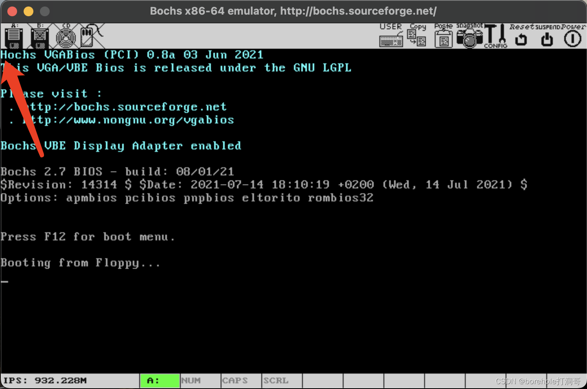

可以看到，这里原本应该是「Bochs」，但是第一个字母被我们改成了「H」，所以输出是成功了。这主要是因为BIOS在屏幕上输出了一些东西，然后并没有清屏，导致我们自己的输出被「淹没」在里面了。不过要清屏需要额外解释一些其他东西，为了循序渐进，所以咱们暂时先忍忍，知道要在这些乱七八糟的信息里去寻找我们的输出就可以了。

接下来我们聚焦到这几行汇编语句上，解释一下我们都做了什么。

```
mov ax, 0xb800
```

这一句，是给`ax`寄存器中赋值`0xb800`，`mov`指令其实更准确应该是「copy」，它会把右边的操作数赋值给左边，移动之后后面的操作数不会消失。后面一句

```
mov ds, ax
```

则是把`ax`的值赋值给`ds`寄存器，这样`ds`寄存器中也是`0xb800`了。

相信读者在这里一定会有疑惑，为什么我不能直接`mov ds, 0xb800`呢？何苦劳烦`ax`这样节外生枝？这就是我们编写汇编语言的时候必须要考虑的问题。汇编语言仅仅是把二进制的机器码，换了一种更加接近人类语言的方式展示而已，但它本质没有变，汇编器会把它转换成对应的机器码。所以，我们写的每一条汇编指令，都应该要有对应的机器指令才对，也就是机器能够支持的指令。而8086中的段寄存器并不可以直接通过立即数来赋值，因为8086体系根本没有这样的机器指令。

所以，在编写汇编语言的时候，我们要以CPU硬件的思维来思考，书写「指令」本身，而不是高层的抽象语义。用前面的例子来说，我们要达成「把`0xb800`这个数赋值给`ds`寄存器」的这个需求，要使用「`mov ax, 0xb800`和`mov ds, ax`」这两条指令来完成。当然，你换成`bx`、`cx`或者`dx`做中间量也是OK的，因为这几个寄存器都可以通过立即数来赋值。

这两行代码的含义已经清楚了，我们来解释一下目的。在前面的章节中笔者曾经介绍过「显存」的概念，显卡会按照每个刷新周期，读取某一片内存空间，然后按照一定的规则解析，并输出给显示器，这片内存空间就是「显存」。

在8086机器初始化时，会默认使用标准VGA协议，并且是80×25×16的文字模式。也就是说，在这种模式下，显示器可以显示25行，每行80个字符（ASCII字符），并且支持最多16种颜色。在这种模式下，对应的显存是`0xb8000`~`0xb8f9f`，一共4000字节的位置。每两字节对应一个字符显示位，低字节表示ASCII码，高字节表示颜色信息。

因此，`0xb8000`这个内存地址，对应的就是屏幕上第一行第一个字符对应的ASCII码，`0xb8001`对应的是它的颜色信息。同理，`0xb8002`对应第一行第二个字符的ASCII，`0xb8003`对应它的颜色……`0xb80a0`对应第二行第一个字符的ASCII，`0xb80a1`对应它的颜色……`0xb8f9e`对应第25行（最后一行）第80个字符（最后一个字符）的ASCII，`0xb8f9f`对应它的颜色。通过给显存中写入数据，就可以控制屏幕上的字符。

那么，颜色信息是怎样的呢？颜色信息的字节中，0~2位表示文字颜色的RGB，第3位表示是否高亮，4~6位表示背景色RGB，第7位表示是否闪烁。我们可以把颜色总结如下表：

<table><thead><tr><th>位号</th><th>符号</th><th>意义</th></tr></thead><tbody><tr><td>0</td><td>FB</td><td>前景色蓝色元素</td></tr><tr><td>1</td><td>FG</td><td>前景色绿色元素</td></tr><tr><td>2</td><td>FR</td><td>前景色红色元素</td></tr><tr><td>3</td><td>I</td><td>高亮</td></tr><tr><td>4</td><td>BB</td><td>背景色蓝色元素</td></tr><tr><td>5</td><td>BG</td><td>背景色绿色元素</td></tr><tr><td>6</td><td>BR</td><td>背景色红色元素</td></tr><tr><td>7</td><td>K</td><td>闪烁</td></tr></tbody></table>

配合上I位，前景色可以有16种颜色，分别是：

<table><thead><tr><th>R</th><th>G</th><th>B</th><th>I</th><th>颜色</th></tr></thead><tbody><tr><td>0</td><td>0</td><td>0</td><td>0</td><td>黑</td></tr><tr><td>0</td><td>0</td><td>0</td><td>1</td><td>灰</td></tr><tr><td>0</td><td>0</td><td>1</td><td>0</td><td>蓝</td></tr><tr><td>0</td><td>0</td><td>1</td><td>1</td><td>浅蓝</td></tr><tr><td>0</td><td>1</td><td>0</td><td>0</td><td>绿</td></tr><tr><td>0</td><td>1</td><td>0</td><td>1</td><td>浅绿</td></tr><tr><td>0</td><td>1</td><td>1</td><td>0</td><td>青</td></tr><tr><td>0</td><td>1</td><td>1</td><td>1</td><td>浅青</td></tr><tr><td>1</td><td>0</td><td>0</td><td>0</td><td>红</td></tr><tr><td>1</td><td>0</td><td>0</td><td>1</td><td>浅红</td></tr><tr><td>1</td><td>0</td><td>1</td><td>0</td><td>品红</td></tr><tr><td>1</td><td>0</td><td>1</td><td>1</td><td>洋红</td></tr><tr><td>1</td><td>1</td><td>0</td><td>0</td><td>棕</td></tr><tr><td>1</td><td>1</td><td>0</td><td>1</td><td>浅棕</td></tr><tr><td>1</td><td>1</td><td>1</td><td>0</td><td>浅灰</td></tr><tr><td>1</td><td>1</td><td>1</td><td>1</td><td>白</td></tr></tbody></table>

而背景色没有高亮位，因此只支持8种：

<table><thead><tr><th>R</th><th>G</th><th>B</th><th>颜色</th></tr></thead><tbody><tr><td>0</td><td>0</td><td>0</td><td>黑</td></tr><tr><td>0</td><td>0</td><td>1</td><td>蓝</td></tr><tr><td>0</td><td>1</td><td>0</td><td>绿</td></tr><tr><td>0</td><td>1</td><td>1</td><td>青</td></tr><tr><td>1</td><td>0</td><td>0</td><td>红</td></tr><tr><td>1</td><td>0</td><td>1</td><td>品红</td></tr><tr><td>1</td><td>1</td><td>0</td><td>棕</td></tr><tr><td>1</td><td>1</td><td>1</td><td>浅灰</td></tr></tbody></table>

最后配合K位，表示是否闪烁。

这里建议大家想看那种颜色，可以做一些尝试，还可以配合一下位置来编写代码，比如说，我想在屏幕第一排第一个、第二排第二个、第三排第三个分别显示`ABC`，然后随便用上点颜色看看效果，就可以写成：

```
mov ax, 0xb800
mov ds, ax
mov [0x0000], byte 'A'
mov [0x0001], byte 0xF0
mov [0x00A2], byte 'B'
mov [0x00A3], byte 0x46
mov [0x0144], byte 'C'
mov [0x0145], byte 0x32

hlt

times 510-($-$$) db 0
dw 0xaa55
```

效果如下（注意，A是闪烁的，但截图显示不出来）： 

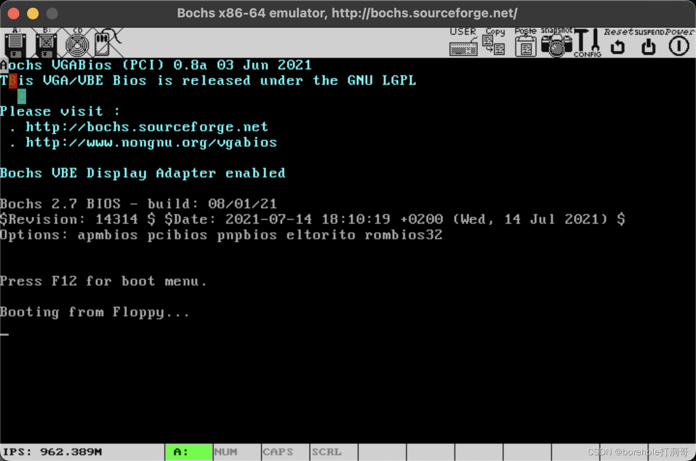

我们继续来解释代码，中括号表示取内存地址，所以这里的`[0x0000]`表示取地址是`0x0000`的内存地址，在`mov`指令下，表示给内存写入数据。我们知道，一个完整的内存地址应该有两部分，而对于立即数寻址的方式来说，默认段寄存器是`ds`，也就是说，`[0x0000]`其实等价于`[ds:0x0000]`，这就是刚才我们之所以要先设置`ds`的原因。由于`ds`已经被设置为`0xb800`，因此`[0x0000]`就是`[0xb800:0x0000]`，自然也就表示了`0xb8000`的地址，也就是显存的第一个字节。

那为什么要写那个`byte`呢？当我们操作寄存器的时候，会按照寄存器的大小来识别操作数，比如说`mov ax, 0x5`，由于`ax`是16位的，因此，后面的`0x5`会自动补全为`0x0005`。但是，当我们操作内存的时候，就需要手动指定操作数的长度了。长度描述符有`byte`、`word`、`dword`和`qword`，分别表示1字节、2字节、4字节和8字节。注意，如果使用`word`或以上的形式，将会按照小端序来处理，例如`mov [0], word 0xabcd`则会在`ds:0`的位置写入`0xcd`，然后在`ds:1`的位置写入`0xab`。再多啰嗦一句，如果不写`0x`前缀或`h`后缀的话，将会按照十进制类解读。

综合一下，前三行代码：

```
mov ax, 0xb800
mov ds, ax
mov [0x0000], byte 'H'
```

表示的就是，在屏幕的最左上角的位置显示一个字母'H'，由于之前BIOS已经写入部分显存数据了，所以它的颜色会保持不变，当然，我们可以通过类似于`mov [0x0001], byte 0x0f`的语句把它的颜色变成白色。

大家可以尝试用这种方法在屏幕上输出各种各样的内容。

后面有一句

```
hlt
```

这是挂起指令，可以让CPU暂时先不要向下继续执行，直到响应中断（关于中断会在后续章节介绍）。这里写这行语句的目的在于，每次都给bochs打断点有点麻烦，而使用`hlt`指令就可以让CPU悬停再此处，方便我们观察输出，所以就不用打断点了。

最后一行的`dw 0xaa55`，这里的`dw`是伪指令，也就是说，它并不会翻译成机器指令，而是用于指导编译器做预处理用的，有点类似与C/C++中以`#`开头的语句。`dw`的意思就是按字面写2个字节，内容是后面的数，也就是`0xaa55`。前面我们说过，BIOS只有在检测第一个扇区的后两个字节是`0x55`和`0xaa`的时候，才认为是合法MBR，并加载。所以，这行语句就是干这件事的，我们可以看到汇编之后的二进制中，最后2个字符被写入成功了：

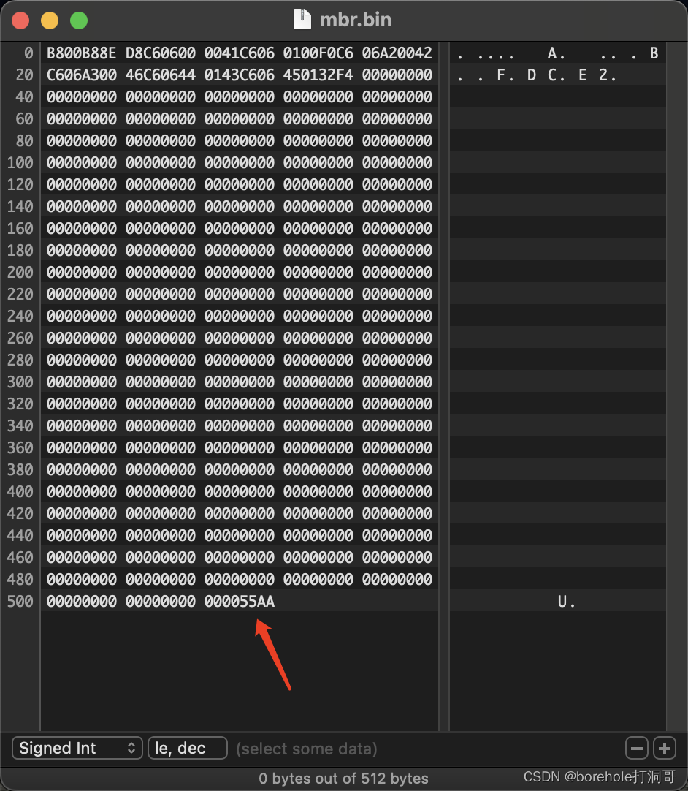

`dw`表示写2个字节，对应的还有`db`写1个字节，`dd`写4个字节，`dw`写8个字节，注意，都是小端序。所以上面的伪指令其实还可以改成`db 0x55 0xaa`，效果是一样的。

最后一个问题就是，`0xaa55`是这512字节的最后两个字节，但我们刚才也没写几句指令，这中间的部分咋整？可以补0，但得补多少0呢？这主要取决于，刚才我们写的所有指令占了多少字节。注意，汇编语言中的行号是没有执行层的含义的，因为对于CISC指令集来说，每条指令的长度都可能不一样，所以行数跟指令的字节数没有直接关系。

所以，计算指令长度的这件事也就交给汇编器了，`times`也是伪指令，表示后面紧跟的指令执行几次，比如说`times 5 db 0`就等价于`db 0 0 0 0 0`。而`$`和`$$`符号则是指令的偏移数，`$`表示当前位置的偏移数，`$$`表示首行的偏移数。注意，之所以首行也会有偏移数，这是有一种情况，就是当前文件的第一条指令并不一定加载到内存`0`的位置，虽然在本代码中`$$`就是`0`，但我们还是用`$-$$`来计算一下偏移量，而不直接用`$`。

所以，这一行的意义就很明确了，`times 510-($-$$) db 0`，就是从当前位置，一直补到第510字节，都补0。然后最后两个字节留给`0x55`和`0xaa`。

## 软中断

由于本系列文章并不是专业的8086汇编教程 ，因此不会过分纠结汇编语言的指令和编程技巧。但距离我们的目标——运行一个C++程序还有挺远的距离，就比如，BIOS只负责加载512字节的MBR，多的部分怎么办？另外还有一个非常令人困扰的问题，就是如何清屏？

当然了，显存的位置都已经清楚了，把他们全搞成空格符，自然也就相当于清屏了。只不过这种功能还不需要我们自己来写，用软中断的方式就可以解决。

要解决这些问题，首先我们需要了解一下软中断，在此之前，需要先了解一下中断。

### 中断机制

简单来说，中断机制解决的就是CPU和外部设备速度严重不匹配的问题。比如说，当你在键盘上按下一个按钮的时候，CPU是需要响应的，但是，CPU怎么知道你按没按下键盘呢？

一种方式就是主动监听，用大白话来解释就是，CPU要隔三差五去看一下，键盘有没有被按下，如果有，就响应，如果没有，就回来继续干活。

但这种主动监听的方式有一个非常严重的问题，就是速率不匹配。当代CPU的主频基本都是3GHz数量级，即便是最早的8086，主频也有4.77MHz。再想想你敲击键盘的速度，根据吉尼斯官方记录，世界冠军的打字速度也不过是每分钟807个字符，这个换算下来也就是13Hz左右。换句话说，你敲一下键盘，CPU已经干了50万次以上的工作了，由于这种速率不匹配，因此选用主动监听方式对资源是一种极大的浪费。

因此，人们就想了一个办法，设计了一个中断控制器，用来监听外部事项（例如键盘敲击信号），当需要CPU响应的时候，中断控制器再去「通知」CPU，“你把手上的活先停一下，有个事情要处理。”这种机制就叫中断机制。

对于中断信号，CPU要做出对应的处理，那么自然就要有一些用于处理中断的指令，当CPU收到对应的中断时，就去执行对应的指令即可。这种机制有点像Qt中的signal-slot机制，也有点类似于Vue中的`@click`绑定触发事件。总之，都是将一个事件（或者信号）跟一个函数相绑定，当收到事件信号时，执行对应的函数。

不过既然中断的处理过程就相当于一个函数的话，它自然**也可以当做一个普通的函数直接调用**，这种方式就被称为「软中断」。换句话说，软中断其实跟原本的中断机制没什么关系，它只不过利用了中断号，直接去执行了对应的中断响应函数罢了。

所以，**软中断本质上就是函数调用**。

### 通过BIOS中断来清屏

在BIOS内部，会实现存一些中断响应的流程指令，所以我们可以通过软中断调用方式，去执行BIOS所提供的一些功能。这些BIOS提供的功能也称为「BIOS中断」。

BIOS中断可以提供很多功能，详细的情况只能去查BIOS手册了，这里笔者只介绍咱们用得上的。首先，就来解决清屏的问题。

中断的调用需要配合固定的寄存器传入参数，之前我们说过，默认情况下显卡使用的是文字模式，那么只要重新再进入一次文字模式就可以自动清屏功能，需要`al`传入`0x03`，`ah`传入`0x0`，然后使用`0x10`号中断即可实现清屏（如果是其他显示模式，则会切换至文字模式）。

等等，`al`和`ah`寄存器是哪冒出来的？其实是这样的，对于`ax`、`bx`、`cx`和`dx`这4个寄存器来说，可以拆成高8位和低8位两个8位寄存器来使用。`al`就是`ax`的低8位，`bh`就是`bx`的高8位，以此类推。

所以，`al=0x03`，`ah=0x0`，效果跟`ax=0x0003`是一样的。

我们修改一下MBR的代码，首先清屏，然后再打印`Hello,World!`来看看效果：

```
mov al, 0x03
mov ah, 0x00
; 也可以写作 mov ax, 0x0003
int 0x10 ; 调用0x10号BIOS中断，清屏

mov ax, 0xb800
mov ds, ax
mov [0x0000], byte 'H'
mov [0x0001], byte 0x0f ; 黑底白字
mov [0x0002], byte 'e'
mov [0x0003], byte 0x0f
mov [0x0004], byte 'l'
mov [0x0005], byte 0x0f
mov [0x0006], byte 'l'
mov [0x0007], byte 0x0f
mov [0x0008], byte 'o'
mov [0x0009], byte 0x0f
mov [0x000a], byte ','
mov [0x000b], byte 0x0f
mov [0x000c], byte 'W'
mov [0x000d], byte 0x70 ; 浅灰底黑字
mov [0x000e], byte 'o'
mov [0x000f], byte 0x70 
mov [0x0010], byte 'r'
mov [0x0011], byte 0x70 
mov [0x0012], byte 'd'
mov [0x0013], byte 0x70 
mov [0x0014], byte '!'
mov [0x0015], byte 0x70 
hlt

times 510-($-$$) db 0
dw 0xaa55
```

效果如下：

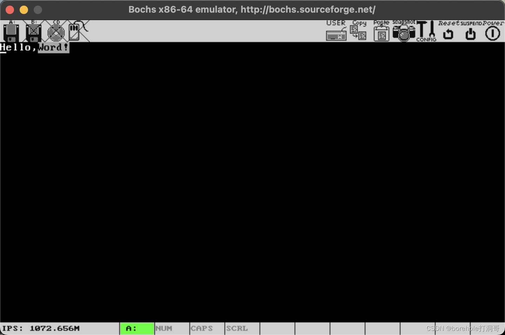

这样看上去是不是顺眼多了？

## 跳转

前面我们介绍过，8086CPU总是在执行`CS:IP`所对应的内存位置的指令，一般情况下，会按照顺序一条一条执行。除非一种特殊情况——跳转指令。

所谓「跳转」，顾名思义，就是不要再继续向下执行，而是跳到某一个位置开始执行。因此，跳转指令就是要改变`CS:IP`的指向。

跳转指令主要分为两种，分别是「近跳」和「远跳」。不过笔者认为，这两个名字也起得不是特别恰当，其实他们跟远近并没有直接关系。

### 近跳

所谓「近跳」，我们可以理解为`CS`不变，`IP`做一个偏移，它的操作数是一个偏移量，比如说`-3`就表示向前跳转`3`字节、`5`就表示向后偏移`5`字节。

然而在汇编语言里，我们也不好手动去计算偏移量，因此这种时候就需要用到强大的汇编器预处理功能——标签。我们来看一个例子：

```
L1: 
mov ax, 1
jmp L2
mov bx, 2
L2:
mov cx, 8_
```

其中的`L1:`和`L2:`就是标签，它也是伪指令，并不会生成对应的机器码，而是会影响汇编器的预处理。标签名可以随便起，只要不跟汇编关键字冲突即可，后面的冒号也可以省略。

上面例程中的近跳指令是：

```
jmp L2
```

预处理时，汇编器会根据`L2`标签到当前位置（跳转指令的位置）之前的**偏移量**来给近跳指令添加操作数。以上面例程来说，实际的操作数正好是`mov bx, 2`这条指令的长度，也就是3，那么`jmp L2`就相当于`jmp +3`。

当CPU执行到近跳指令时，则会将`IP`寄存器与近跳指令的操作数相加，然后去执行对应位置的指令，进而达到跳转的目的。

### 远跳

所谓「远跳」，其实是给`CS`和`IP`都给一个绝对值，它的操作数是一个绝对的内存地址，而不是偏移量。例如：

```
jmp 0x0820:0x0000
```

这条指令执行完后，`CS`会赋值为`0x0820`，`IP`会赋值为`0x0000`，接着就会执行`0x08200`位置的指令。

这里需要强调的是，汇编语言指导的是机器指令，它不具备高等语义，因此，汇编器不会去检查`0x08200`这个地址在不在你当前操作的源文件里，也不会去管那个位置到底会不会加载合法的指令，这一切都应该由程序员自行负责。

当然，使用远跳指令时也可以使用标签，只不过此时的标签会使用「相对于文件头」的偏移量。比如说：

```
mov ax, 0
mov bx, 1
L1:
mov cx, 2
jmp 0x0000:L1
```

上面例程中`jmp 0x0000:L1`就是远跳指令，这时的`L1`就会解析为这个标签相对于文件头的偏移量，实际上也就是`mov ax, 0`和`mov bx, 1`的指令长度和，也就是6。那么这条指令其实应该是`jmp 0x0000:0x0006`。

这里再次强调重点：近跳指令不改变`CS`，操作数是偏移量；远跳指令会改变`CS`，操作数是绝对数。这一点在8086模式下可能看上去没那么重要，但当后面我们切换到286模式时，这一点会非常重要，所以请读者一定要记住。

## 多加载几个扇区

到目前为止，我们的程序都挤在软盘的第一个扇区里，指望BIOS自动加载。不过显然这区区512字节的空间很容易捉襟见肘，那么如何把软盘中的其他扇区内容也加载到内存中呢？在8086模式下，BIOS中断可以替我们搞定。

```
; 加载一个扇区到0x08000的位置
mov ax, 0x0800
mov es, ax
mov bx, 0 ; 软盘中的内容会加载到es:bx的位置
mov ah, 2 ; ah=2, 使用读盘功能
mov al, 2 ; ah表示需要读取连续的几个扇区（读2个就是1KB的大小）
mov ch, 0 ; ch表示第几柱面
mov dh, 0 ; dh表示第几磁头
mov cl, 2 ; cl表示第几扇区
mov dl, 0 ; dl表示驱动器号，软盘会在0x00~0x7F，硬盘会在0x80~0xFF
int 0x13  ; 执行0x13号中断的2号功能（读盘功能）
```

对于老式机械硬盘、软盘来说，它们都属于「磁盘」的一种。根据其机械结构分为柱面(Cylinder)、磁头(Head)、扇区(Sector)，一般表示为`CHS`，柱面和磁头从`0`开始，扇区从`1`开始标号。

BIOS如果设置为软盘启动，就会加载`0`号驱动器的`C0-H0-S1`到内存的`0x07c00`的位置。如果设置为硬盘启动，就会加载`0x80`号驱动器的`C0-H0-S1`到内存的`0x07c00`的位置。

那么现在，我们承担MBR角色的程序，就需要再把其他数据也加载到内存中。不过这时的内存选址就由我们随意了，并不一定要紧接着MBR加载的位置，上面例程中选择了`0x08000`的位置，你也可以选择其他位置，但要主要，不能占用BIOS预留的位置，也不能占用显存位置。通常8086的内存布局如下：

<table><thead><tr><th>起始地址</th><th>结束地址</th><th>长度</th><th>作用</th></tr></thead><tbody><tr><td><code>0x00000</code></td><td><code>0x003ff</code></td><td>1KB</td><td>中断向量表</td></tr><tr><td><code>0x00400</code></td><td><code>0x004ff</code></td><td>256B</td><td>BIOS数据区</td></tr><tr><td><code>0x00500</code></td><td><code>0x07bff</code></td><td>29.75KB</td><td>-</td></tr><tr><td><code>0x07c00</code></td><td><code>0x07dff</code></td><td>512B</td><td>MBR</td></tr><tr><td><code>0x07e00</code></td><td><code>0x9fbff</code></td><td>607.5KB</td><td>-</td></tr><tr><td><code>0xa0000</code></td><td><code>0xbffff</code></td><td>128KB</td><td>显存</td></tr><tr><td><code>0xc0000</code></td><td><code>0xc7fff</code></td><td>32KB</td><td>显卡BIOS</td></tr><tr><td><code>0xc8000</code></td><td><code>0xeffff</code></td><td>160KB</td><td>统一编址的I/O</td></tr><tr><td><code>0xf0000</code></td><td><code>0xfffff</code></td><td>64KB</td><td>BIOS</td></tr></tbody></table>

从上表可知，`0x00500`到`0x9fbff`这638.75KB的空间都是可用的，但是由于MBR占用了其中的512B，剩下的部分我们可以自由支配。

下面我们就编写一个程序，前512B作为MBR，加载两个扇区（1KB）的数据到`0x08000`的位置，然后再跳转至该位置，执行指令：

```
; C0H0S1
; 调用0x10号BIOS中断，清屏
mov al, 0x03
mov ah, 0x00
int 0x10 
; 加载一个扇区到0x08000的位置
mov ax, 0x0800
mov es, ax
mov bx, 0 ; 软盘中的内容会加载到es:bx的位置
mov ah, 2 ; ah=2, 使用读盘功能
mov al, 2 ; ah表示需要读取连续的几个扇区（读2个就是1KB的大小）
mov ch, 0 ; ch表示第几柱面
mov dh, 0 ; dh表示第几磁头
mov cl, 2 ; cl表示第几扇区
mov dl, 0 ; dl表示驱动器号，软盘会在0x00~0x7F，硬盘会在0x80~0xFF
int 0x13  ; 执行0x13号中断的2号功能（读盘功能）

jmp 0x0800:0x0000 ; 这里写成0x0000:0x8000也OK，只是CS和IP的值会不同，但CS:IP是相同的

times 510-($-$$) db 0 ; MBR剩余部分用0填充
dw 0xaa55

; 现在已经是C0H0S2的内容了
begin:
mov ax, 0xb800
mov ds, ax
mov [0x0000], byte 'H'
mov [0x0001], byte 0x0f
mov [0x0002], byte 'e'
mov [0x0003], byte 0x0f
mov [0x0004], byte 'l'
mov [0x0005], byte 0x0f
mov [0x0006], byte 'l'
mov [0x0007], byte 0x0f
mov [0x0008], byte 'o'
mov [0x0009], byte 0x0f
hlt

times 1024-($-begin) db 0 ; 补满2个扇区
```

可以确认一下，此时的`mbr.bin`变成了1536B，当然，它现在叫「MBR」已经不太合适了，它应当是包含了MBR和内核程序的一个总包。暂时我们先忽略这个叫法的问题，稍后再来看如何将MBR和内核程序分离。

同样，将其重命名为`a.img`，然后打开bochs看运行效果： 

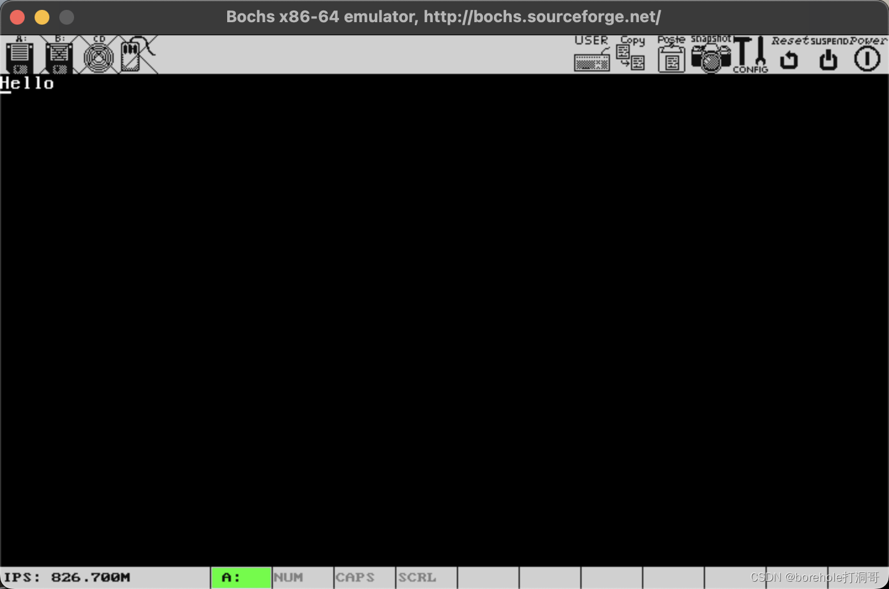

这证明，后面扇区的内容也加载成功了，跳转指令也完成了正确的跳转。

另外，当我们程序有稍微的规模了的时候，大家可以考虑用单步执行命令来做调试。例如启动后，我们先在`0x7c00`处打断点，然后`c`执行BIOS的指令，然后按`n`开始跳过调用流程的单步调试（`s`是单纯的单步调试，但是会把BIOS中断中的指令也显示出来，按`n`则不会）。大概效果如下：

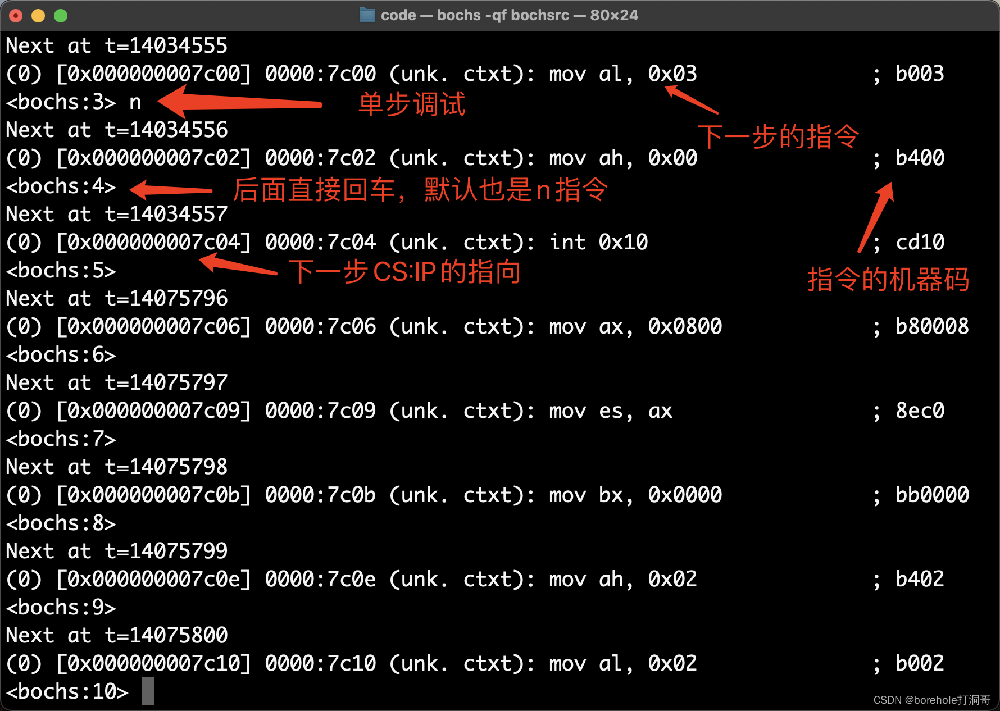

而在经历一些加载数据功能后，我们还可以用`x`命令来查看对应内存位置，例如当执行完`0x13`中断后，我可以看一下`0x08000`位置的内存，到底有没有写入数据：

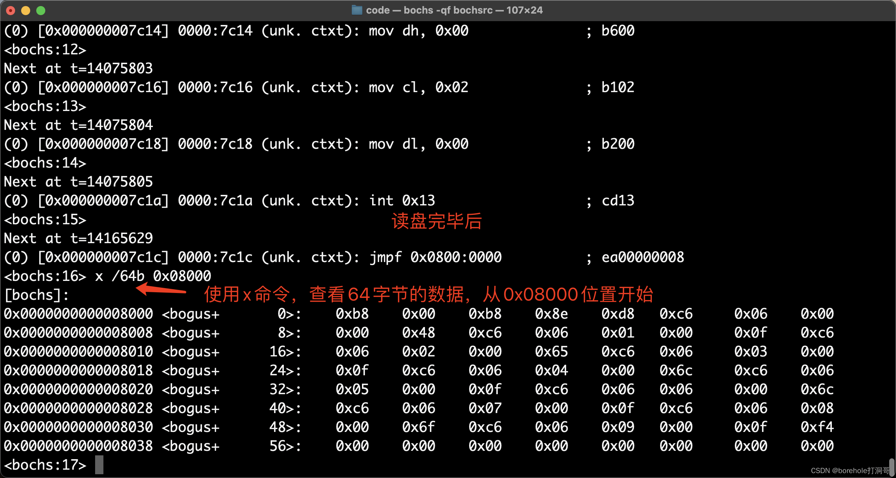

也可通过`r`和`sreg`指令查看寄存器的值，比如在跳转指令前后，查看`CS`和`IP`的值。跳转前：

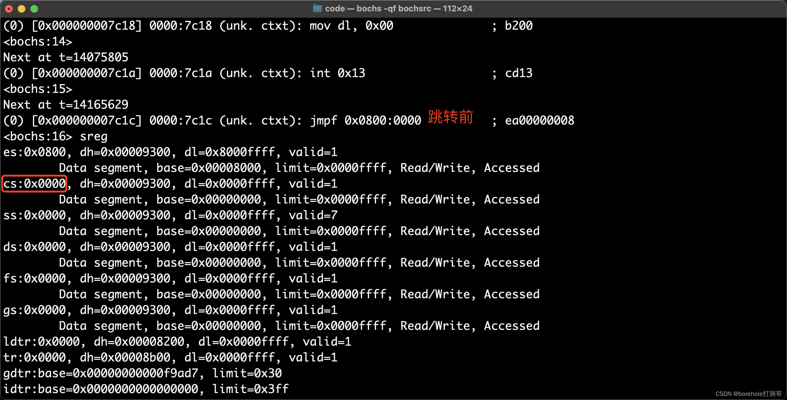 
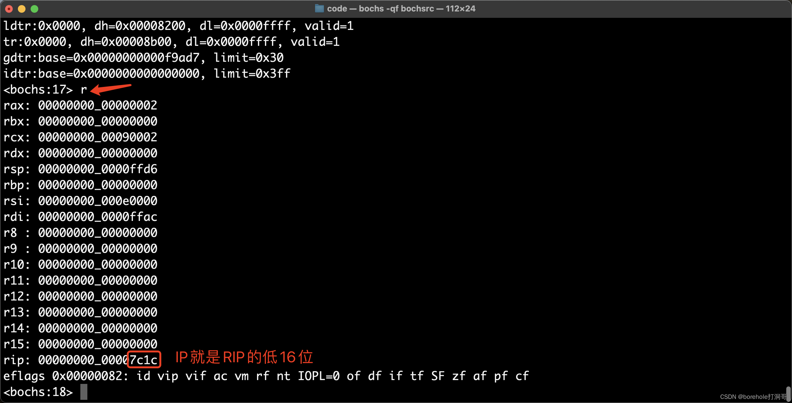

然后执行`n`，完成跳转指令后，再看一下`CS`和`IP`的值： 

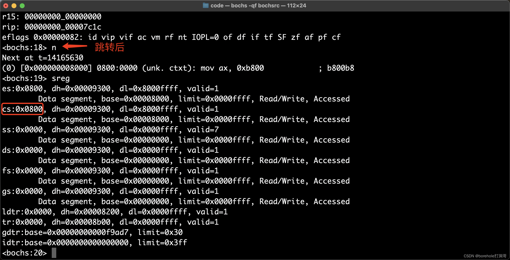
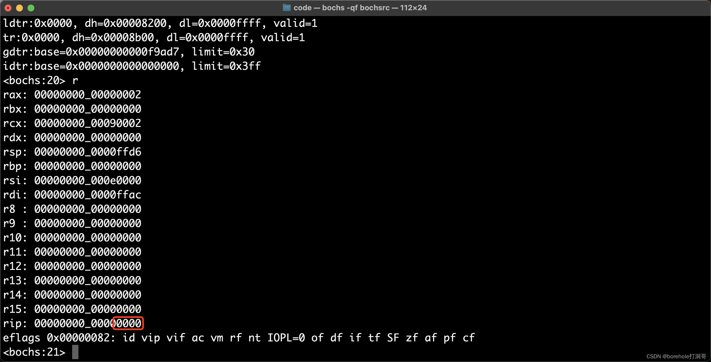

大家可以根据需要进行调试观察自己的程序。

## 改为硬盘启动

### BIOS中断的局限性

照理说，按照前面一节的方法，利用BIOS中断加载软盘中的数据到内存中再去执行，在8086下貌似是没什么问题的。但这不是长久之际，8086下只有640KB不到的内存空间供我们支配，自然用当前的这种方式没什么问题，但毕竟8086模式只是过渡，后续我们要切换到32位模式以支持4GB内存，还要切换到64位模式支持更大的内存。

虽然BIOS中断是很方便的工具，相当于基础系统提供了一些库函数供我们使用，但它毕竟依赖BIOS，BIOS中提供的指令都是16位实模式（8086模式）的指令，一旦后续我们切换为i286模式、i386模式后，这些BIOS中断就无法使用了（因为指令集不匹配）。

其实，向显存写入数据的这种需求，也是可以通过BIOS中断来完成的，但笔者并没有介绍这种方法，而是使用直接操作显存的方式，目的也就在此，因为我们不可能一直停留在8086模式。同理，加载外存中的数据这种需求，也应当有它原始方法。

### I/O设备的操作

前面我们介绍过I/O，有一些是统一编址的（比如显存），也有一些是独立编址的，CPU会通过专用的指令，控制I/O控制器（或者也可以叫南桥芯片）来管理这些I/O设备。

I/O设备会映射成一个端口号，CPU向对应的端口号发送或读取数据，间接通过I/O控制器来控制外围的I/O设备。软驱也是其中的一员，我们可以控制几个软驱控制器（例如DOR、FDC）来读取和写入软盘中的内容。不过软驱的控制方法比较麻烦（只支持CHS模式，不支持LBA模式。LBA模式在后面章节详细介绍），又因为3.5英寸软盘只有1440KB的限制，迟早不够使，因此，我们姑且就不去详细研究软驱的控制方法了。接下来，我们要将我们的模拟器环境，改为用硬盘启动。

### 配置硬盘启动

配置硬盘，需要修改`bochsrc`的内容，我们将软盘启动相关配置注释掉或删除掉，改为以下内容：

```
## boot: floppy ## 设置软盘启动
## floppy_bootsig_check: disabled=0 ## 打开自检
## floppya: type=1_44, 1_44="a.img", status=inserted, write_protected=0 ## 使用1.44MB的3.5英寸软盘，取镜像为a.img，开机默认已插入软驱，不开启写保护

ata0: enabled=1, ioaddr1=0x1f0, ioaddr2=0x3f0, irq=14 ## 主盘端口映射为1f0，从盘映射为3f0，中断号设置为14（虽然这几个参数都可以定制化，但这个参数是业界标准的，不建议更改）
ata0-master: type=disk, mode=flat, path=a.img, cylinders=1, heads=1, spt=1 ## 主盘位置加载一块规格为C1H1S1的硬盘，镜像使用a.img
boot: disk ## 设置为硬盘启动
```

这里需要注意一下，硬盘的规格我们暂时设置的是1柱面1磁头1扇区，也就是只有512字节的硬盘，那么对于`a.img`来说，超过512B的部分是不会加载进去的。（暂时这样设置一下，后面肯定会改的。）

首先先来测试一下MBR能否正常加载，所有我们把之前MBR中写的那些跳转语句、还有512B后面的部分都先删除，打印几个文字来验一验效果：

```
; 调用0x10号BIOS中断，清屏
mov al, 0x03
mov ah, 0x00
int 0x10 

mov ax, 0xb800
mov ds, ax
mov [0x0000], byte 'H'
mov [0x0001], byte 0x0f
mov [0x0002], byte 'e'
mov [0x0003], byte 0x0f
mov [0x0004], byte 'l'
mov [0x0005], byte 0x0f
mov [0x0006], byte 'l'
mov [0x0007], byte 0x0f
mov [0x0008], byte 'o'
mov [0x0009], byte 0x0f
hlt

times 510-($-$$) db 0 ; MBR剩余部分用0填充
dw 0xaa55
```

将其编译为`mbr.bin`，确认一下它的大小是512字节： 

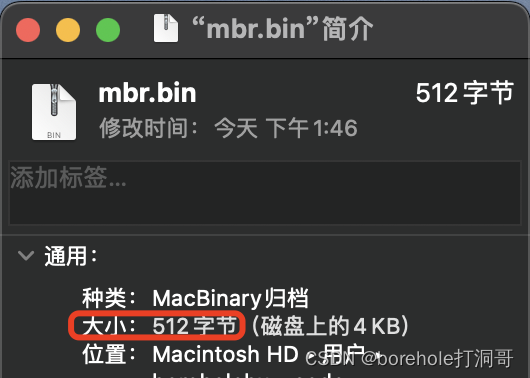

然后把它复制为`a.img`，再启动一下看看效果：

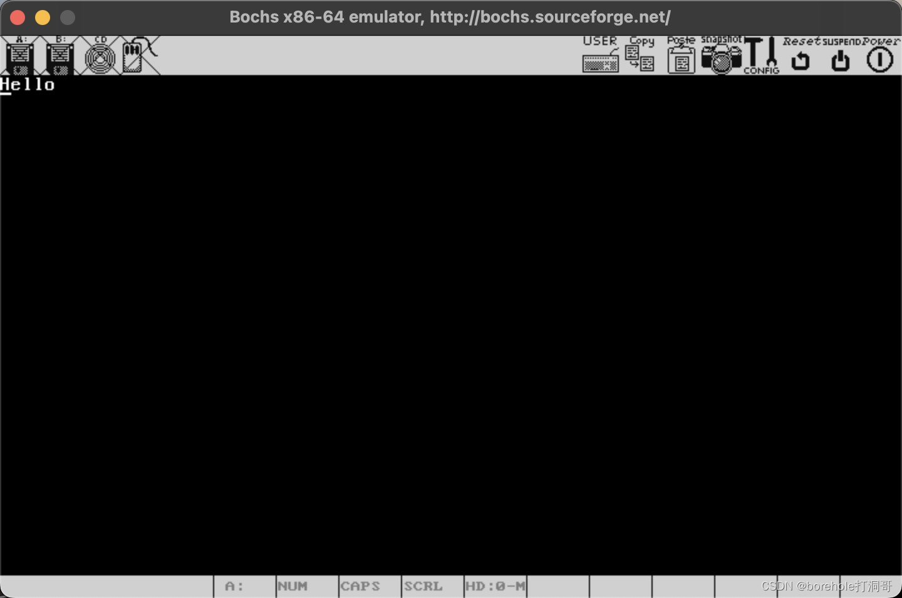

能看到输出，说明我们已经成功切换成硬盘启动了。那么接下来就是如何加载后面扇区的数据的问题了。

### 通过操作I/O加载硬盘数据

前面我们用了CHS方式来编号硬盘，但除了CHS以外，还有另外一种方式，叫做LBA，也就是Logical Block Address。这种方式下，硬盘会直接按照连续的扇区进行编号，对磁头和柱面不再感知。

LBA28是一种比较原始的方式，28表示用28位编号，也就是`0x0000000`~`0xFFFFFFF`的扇区号，注意，`0`号是预留位，真正的扇区是从`1`号开始的。

用于控制硬盘的设备会有对应的端口号，在前面我们`bochsrc`中也有对应的配置，比如当前使用了默认值，也就是`0x01f0`，从这个端口向后的若干端口都是用来操作硬盘的。因此，我们要按照一定的顺序，向对应的端口中写入数据，来指导硬盘控制器读取硬盘数据。

首先要配置的是需要读取的端口数，这个数据要写入`0x01f2`端口中：

```
; 设置读取扇区的数量
mov dx, 0x01f2
mov al, 2 ; 读取连续的几个扇区，每读取一个al就会减1
out dx, al
```

然后我们来配置起始扇区号。1号扇区就是MBR，已经加载进来了，所以我们从第2号扇区开始加载。虽然只是一个简单的2号，但其实LBA28模式下扇区号是有28位的，因此我们要拆分成4次，分别写入不同的端口中。`0x01f3`需要传入扇区号的`0~7`位，`0x01f4`需要传入扇区号的`8~15`位，`0x01f5`需要传入扇区号的`16~23`位，`0x01f5`则拆分为3部分，低4位是扇区号的`24~27`位，第4位表示主从盘，高3位表示扇区编号的模式。

这部分的代码如下，笔者已经加入了详细的注释，请读者仔细阅读：

```
; 设置起始扇区号，28位需要拆开
mov dx, 0x01f3
mov al, 0x02 ; 从第2个扇区开始读（1起始，0留空），扇区号0~7位
out dx, al
mov dx, 0x01f4 ; 扇区号8~15位
mov al, 0
out dx, al
mov dx, 0x01f5 ; 扇区号16~23位
mov al, 0
out dx, al
mov dx, 0x01f6
mov al, 111_0_0000b ; 低4位是扇区号24~27位，第4位是主从盘（0主1从），高3位表示磁盘模式（111表示LBA模式）
```

接下来要配置操作命令，我们要做「读盘」操作，对应的命令号是`0x20`，它要写入`0x01f7`端口：

```
; 配置命令
mov dx, 0x01f7
mov al, 0x20 ; 0x20命令表示读盘
out dx, al
```

一切就绪之后，控制器就会开始读盘了，但这需要一定的时间，所以此时程序要等待驱动器工作完成。`0x01f7`端口如果使用`in`命令，读取到的是硬盘控制器的状态数据，其中第`7`位表示是否忙碌，第`3`位表示是否就绪。那么也就是说，当第`7`位是`0`且第`3`位是`1`的话，说明驱动器已经完成，否则就要持续等待：

```
wait_finish:
; 检测状态，是否读取完毕
mov dx, 0x01f7
in al, dx ; 通过该端口读取状态数据
and al, 1000_1000b ; 保留第7位和第3位
cmp al, 0000_1000b ; 要检测第7位为0（表示不在忙碌状态）和第3位是否是1（表示已经读取完毕）
jne wait_finish ; 如果不满足则循环等待
```

当驱动器就绪后，我们就可以通过`0x01f0`端口来加载数据到内存了。这个端口是个16位端口，因此每次可以读2字节。这里我们用一个循环语句来完成，循环语句的循环次数要写在`cx`中，每次循环时`cx`会自动减1，直到`cx`为0则跳出循环。

所以，如果我们需要加载2个扇区的数据，那么就是`1024`字节的内容，而循环次数就是`512`，所以把这个数配到`cx`中：

```
mov cx, 512 ; 一共要读的字节除以2（表示次数，因为每次会读2字节所以要除以2）
```

还是按照一开始的规划，我们把屏幕打印的部分放到第二扇区，然后把它加载到`0x08000`的内存位置：

```
mov dx, 0x01f0
mov ax, 0x0800
mov ds, ax
xor bx, bx ; [ds:bx] = 0x08000
read:
in ax, dx ; 16位端口，所以要用16位寄存器
mov [bx], ax
add bx, 2 ; 因为ax是16位，所以一次会写2字节
loop read
```

最后通过跳转指令跳转过去，查看是否加载成功。下面给出完整代码：

```
; C0H0S1
; 调用0x10号BIOS中断，清屏
mov al, 0x03
mov ah, 0x00
int 0x10 

; LBA28模式，逻辑扇区号28位，从0x0000000到0xFFFFFFF
; 设置读取扇区的数量
mov dx, 0x01f2
mov al, 2 ; 读取连续的几个扇区，每读取一个al就会减1
out dx, al
; 设置起始扇区号，28位需要拆开
mov dx, 0x01f3
mov al, 0x02 ; 从第2个扇区开始读（1起始，0留空），扇区号0~7位
out dx, al
mov dx, 0x01f4 ; 扇区号8~15位
mov al, 0
out dx, al
mov dx, 0x01f5 ; 扇区号16~23位
mov al, 0
out dx, al
mov dx, 0x01f6
mov al, 111_0_0000b ; 低4位是扇区号24~27位，第4位是主从盘（0主1从），高3位表示磁盘模式（111表示LBA）
; 配置命令
mov dx, 0x01f7
mov al, 0x20 ; 0x20命令表示读盘
out dx, al

wait_finish:
; 检测状态，是否读取完毕
mov dx, 0x01f7
in al, dx ; 通过该端口读取状态数据
and al, 1000_1000b ; 保留第7位和第3位
cmp al, 0000_1000b ; 要检测第7位为0（表示不在忙碌状态）和第3位是否是1（表示已经读取完毕）
jne wait_finish ; 如果不满足则循环等待

; 从端口加载数据到内存
mov cx, 512 ; 一共要读的字节除以2（表示次数，因为每次会读2字节所以要除以2）
mov dx, 0x01f0
mov ax, 0x0800
mov ds, ax
xor bx, bx ; [ds:bx] = 0x08000
read:
in ax, dx ; 16位端口，所以要用16位寄存器
mov [bx], ax
add bx, 2 ; 因为ax是16位，所以一次会写2字节
loop read

jmp 0x0800:0x0000 ; 这里写成0x0000:0x8000也OK，只是CS和IP的值会不同，但CS:IP是相同的

times 510-($-$$) db 0 ; MBR剩余部分用0填充
dw 0xaa55

; 现在已经是C0H0S2的内容了
begin:
mov ax, 0xb800
mov ds, ax
mov [0x0000], byte 'H'
mov [0x0001], byte 0x0f
mov [0x0002], byte 'e'
mov [0x0003], byte 0x0f
mov [0x0004], byte 'l'
mov [0x0005], byte 0x0f
mov [0x0006], byte 'l'
mov [0x0007], byte 0x0f
mov [0x0008], byte 'o'
mov [0x0009], byte 0x0f
hlt

times 1024-($-begin) db 0 ; 补满2个扇区
```

注意，由于我们已经把扇区扩展到了3个，因此`bochsrc`里面 也需要修改一下硬盘的规模：

```
ata0: enabled=1, ioaddr1=0x1f0, ioaddr2=0x3f0, irq=14 ## 主盘端口映射为1f0，从盘映射为3f0，中断号设置为14（虽然这几个参数都可以定制化，但这个参数是业界标准的，不建议更改）
ata0-master: type=disk, mode=flat, path=a.img, cylinders=1, heads=1, spt=3 ## 主盘位置加载一块规格为C1H1S3的硬盘，镜像使用a.img
boot: disk ## 设置为硬盘启动
```

最后通过汇编生成`mbr.bin`，复制为`a.img`，再启动`bochs`就可以看到执行效果：

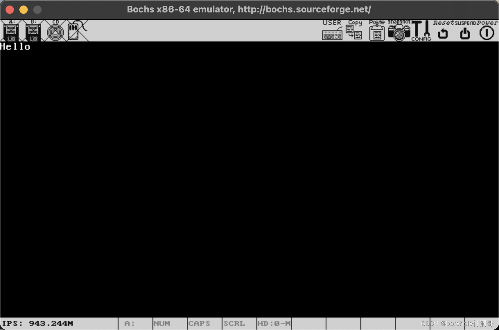

此时也可以通过调试指令来验证`0x8000`的内存中确实加载了对应的指令： 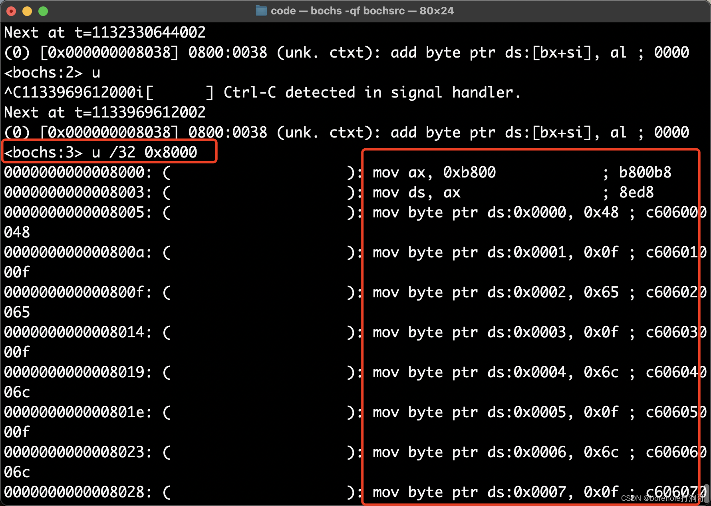

由此殊途同归，我们没有使用BIOS中断，也同样完成了硬盘加载的工作。

## 把MBR和内核源码拆开

### 拆分MBR和Kernel

前面章节中我们已经可以成功把硬盘里除第一扇区外的其他扇区正常加载到内存中了，但之前的做法是把后续的代码和MBR源码挤在同一个文件中，这显然是不方便后续管理的。

从架构设计的角度上来说，MBR以外的这些代码属于OS内核，因此对于「MBR」和「OS内核」这两部分的内容，还是应该拆开的。MBR由BIOS引导，而内核由MBR引导。

做法也很简单，把MBR和内核的代码分别拆到两个文件中：

mbr.nas:

```
; 调用0x10号BIOS中断，清屏
mov al, 0x03
mov ah, 0x00
int 0x10 

; ...省略中间代码...
jmp 0x0800:0x0000 ; 跳转到内核代码

times 510-($-$$) db 0 ; MBR剩余部分用0填充
dw 0xaa55
; 到此，只会有512字节的二进制文件生成
```

kernel.nas:

```
begin:
mov ax, 0xb800
mov ds, ax
mov [0x0000], byte 'H'
; ...省略中间代码...
hlt

times 1024-($-$$) db 0 ; 由于begin已经在此文件中定投了，所以这里改成了$$
```

它们可以分别汇编成独立的二进制，使用如下指令：

```
nasm mbr.nas -o mbr.bin
nasm kernel.nas -o kernel.bin
```

从而生成`mbr.bin`和`kernel.bin`两份二进制。接下来的问题就在于，如何把这两份二进制拼成一份完整的磁盘镜像（`a.img`）。如果有读者在前面对于笔者总是要节外生枝，把`mbr.bin`复制一份作为`a.img`的行为不理解的话，相信此时应该能够理解了。

考虑到后续可能发展到不止两个二进制，而且文件体积会变大，因此，我们采取的方式是，先生成一个空的磁盘镜像文件，再向这个镜像文件的合适位置里写入二进制。（想象真机的场景，我们应当是首先拥有一块硬盘或者软盘，然后再往这个硬盘中写入数据。而不是直接拿着数据去定制生产一块硬盘。）

这里我们使用`bximage`工具来创建磁盘镜像，这个工具是`bochs`自带的，所以只要正确安装了`bochs`，就不需要单独安装它。

使用以下命令来创建磁盘镜像：

```
bximage -q -func=create -hd=16M a.img
```

这里的`-q`表示安静模式，如果参数错误会直接报错，而不是进入交互模式。`-func-create`表示创建镜像。`-hd=16M`表示创建一个大小是16MB的硬盘（注意这里最小是16M）。最后的`a.img`是文件名。

默认情况下，扇区大小是标准的`512B`，所以我们相当于生成了一个`C/H/S=32/16/64`规格的硬盘，控制台也会有提示：

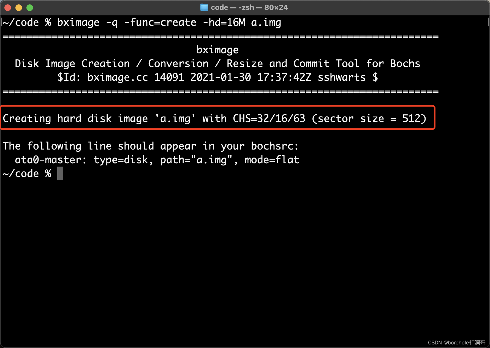

哎？不是说`S=64`嘛，怎么变`63`了？这就是前面我们提到过的有一个小问题，就是说0号扇区是留空的，真正的扇区要从1号开始。所以如果表示扇区号的寄存器预留了6位，那么实际可用的扇区应该是<svg xmlns="http://www.w3.org/2000/svg" width="11.221ex" height="2.072ex" role="img" focusable="false" viewBox="0 -833.9 4959.6 915.9" xmlns:xlink="http://www.w3.org/1999/xlink" aria-hidden="true" style="vertical-align: -0.186ex;"><defs><path id="MJX-10-TEX-N-32" d="M109 429Q82 429 66 447T50 491Q50 562 103 614T235 666Q326 666 387 610T449 465Q449 422 429 383T381 315T301 241Q265 210 201 149L142 93L218 92Q375 92 385 97Q392 99 409 186V189H449V186Q448 183 436 95T421 3V0H50V19V31Q50 38 56 46T86 81Q115 113 136 137Q145 147 170 174T204 211T233 244T261 278T284 308T305 340T320 369T333 401T340 431T343 464Q343 527 309 573T212 619Q179 619 154 602T119 569T109 550Q109 549 114 549Q132 549 151 535T170 489Q170 464 154 447T109 429Z"></path><path id="MJX-10-TEX-N-36" d="M42 313Q42 476 123 571T303 666Q372 666 402 630T432 550Q432 525 418 510T379 495Q356 495 341 509T326 548Q326 592 373 601Q351 623 311 626Q240 626 194 566Q147 500 147 364L148 360Q153 366 156 373Q197 433 263 433H267Q313 433 348 414Q372 400 396 374T435 317Q456 268 456 210V192Q456 169 451 149Q440 90 387 34T253 -22Q225 -22 199 -14T143 16T92 75T56 172T42 313ZM257 397Q227 397 205 380T171 335T154 278T148 216Q148 133 160 97T198 39Q222 21 251 21Q302 21 329 59Q342 77 347 104T352 209Q352 289 347 316T329 361Q302 397 257 397Z"></path><path id="MJX-10-TEX-N-2212" d="M84 237T84 250T98 270H679Q694 262 694 250T679 230H98Q84 237 84 250Z"></path><path id="MJX-10-TEX-N-31" d="M213 578L200 573Q186 568 160 563T102 556H83V602H102Q149 604 189 617T245 641T273 663Q275 666 285 666Q294 666 302 660V361L303 61Q310 54 315 52T339 48T401 46H427V0H416Q395 3 257 3Q121 3 100 0H88V46H114Q136 46 152 46T177 47T193 50T201 52T207 57T213 61V578Z"></path><path id="MJX-10-TEX-N-3D" d="M56 347Q56 360 70 367H707Q722 359 722 347Q722 336 708 328L390 327H72Q56 332 56 347ZM56 153Q56 168 72 173H708Q722 163 722 153Q722 140 707 133H70Q56 140 56 153Z"></path><path id="MJX-10-TEX-N-33" d="M127 463Q100 463 85 480T69 524Q69 579 117 622T233 665Q268 665 277 664Q351 652 390 611T430 522Q430 470 396 421T302 350L299 348Q299 347 308 345T337 336T375 315Q457 262 457 175Q457 96 395 37T238 -22Q158 -22 100 21T42 130Q42 158 60 175T105 193Q133 193 151 175T169 130Q169 119 166 110T159 94T148 82T136 74T126 70T118 67L114 66Q165 21 238 21Q293 21 321 74Q338 107 338 175V195Q338 290 274 322Q259 328 213 329L171 330L168 332Q166 335 166 348Q166 366 174 366Q202 366 232 371Q266 376 294 413T322 525V533Q322 590 287 612Q265 626 240 626Q208 626 181 615T143 592T132 580H135Q138 579 143 578T153 573T165 566T175 555T183 540T186 520Q186 498 172 481T127 463Z"></path></defs><g stroke="currentColor" fill="currentColor" stroke-width="0" transform="matrix(1 0 0 -1 0 0)"><g data-mml-node="math"><g data-mml-node="msup"><g data-mml-node="mn"><use xlink:href="#MJX-10-TEX-N-32"></use></g><g data-mml-node="TeXAtom" transform="translate(500, 363) scale(0.707)" data-mjx-texclass="ORD"><g data-mml-node="mn"><use xlink:href="#MJX-10-TEX-N-36"></use></g></g></g><g data-mml-node="mo" transform="translate(1125.8, 0)"><use xlink:href="#MJX-10-TEX-N-2212"></use></g><g data-mml-node="mn" transform="translate(2126, 0)"><use xlink:href="#MJX-10-TEX-N-31"></use></g><g data-mml-node="mo" transform="translate(2903.8, 0)"><use xlink:href="#MJX-10-TEX-N-3D"></use></g><g data-mml-node="mn" transform="translate(3959.6, 0)"><use xlink:href="#MJX-10-TEX-N-36"></use><use xlink:href="#MJX-10-TEX-N-33" transform="translate(500, 0)"></use></g></g></g></svg>个。因此用`bximage`工具的时候，实际生成的磁盘大小会比我们输入的值略小，也就是每个柱面都会少一个扇区。

所以这里按照`C/H/S=32/16/63`来计算，磁盘大小应该是<svg xmlns="http://www.w3.org/2000/svg" width="46.245ex" height="1.731ex" role="img" focusable="false" viewBox="0 -683 20440.4 765" xmlns:xlink="http://www.w3.org/1999/xlink" aria-hidden="true" style="vertical-align: -0.186ex;"><defs><path id="MJX-11-TEX-N-33" d="M127 463Q100 463 85 480T69 524Q69 579 117 622T233 665Q268 665 277 664Q351 652 390 611T430 522Q430 470 396 421T302 350L299 348Q299 347 308 345T337 336T375 315Q457 262 457 175Q457 96 395 37T238 -22Q158 -22 100 21T42 130Q42 158 60 175T105 193Q133 193 151 175T169 130Q169 119 166 110T159 94T148 82T136 74T126 70T118 67L114 66Q165 21 238 21Q293 21 321 74Q338 107 338 175V195Q338 290 274 322Q259 328 213 329L171 330L168 332Q166 335 166 348Q166 366 174 366Q202 366 232 371Q266 376 294 413T322 525V533Q322 590 287 612Q265 626 240 626Q208 626 181 615T143 592T132 580H135Q138 579 143 578T153 573T165 566T175 555T183 540T186 520Q186 498 172 481T127 463Z"></path><path id="MJX-11-TEX-N-32" d="M109 429Q82 429 66 447T50 491Q50 562 103 614T235 666Q326 666 387 610T449 465Q449 422 429 383T381 315T301 241Q265 210 201 149L142 93L218 92Q375 92 385 97Q392 99 409 186V189H449V186Q448 183 436 95T421 3V0H50V19V31Q50 38 56 46T86 81Q115 113 136 137Q145 147 170 174T204 211T233 244T261 278T284 308T305 340T320 369T333 401T340 431T343 464Q343 527 309 573T212 619Q179 619 154 602T119 569T109 550Q109 549 114 549Q132 549 151 535T170 489Q170 464 154 447T109 429Z"></path><path id="MJX-11-TEX-N-D7" d="M630 29Q630 9 609 9Q604 9 587 25T493 118L389 222L284 117Q178 13 175 11Q171 9 168 9Q160 9 154 15T147 29Q147 36 161 51T255 146L359 250L255 354Q174 435 161 449T147 471Q147 480 153 485T168 490Q173 490 175 489Q178 487 284 383L389 278L493 382Q570 459 587 475T609 491Q630 491 630 471Q630 464 620 453T522 355L418 250L522 145Q606 61 618 48T630 29Z"></path><path id="MJX-11-TEX-N-31" d="M213 578L200 573Q186 568 160 563T102 556H83V602H102Q149 604 189 617T245 641T273 663Q275 666 285 666Q294 666 302 660V361L303 61Q310 54 315 52T339 48T401 46H427V0H416Q395 3 257 3Q121 3 100 0H88V46H114Q136 46 152 46T177 47T193 50T201 52T207 57T213 61V578Z"></path><path id="MJX-11-TEX-N-36" d="M42 313Q42 476 123 571T303 666Q372 666 402 630T432 550Q432 525 418 510T379 495Q356 495 341 509T326 548Q326 592 373 601Q351 623 311 626Q240 626 194 566Q147 500 147 364L148 360Q153 366 156 373Q197 433 263 433H267Q313 433 348 414Q372 400 396 374T435 317Q456 268 456 210V192Q456 169 451 149Q440 90 387 34T253 -22Q225 -22 199 -14T143 16T92 75T56 172T42 313ZM257 397Q227 397 205 380T171 335T154 278T148 216Q148 133 160 97T198 39Q222 21 251 21Q302 21 329 59Q342 77 347 104T352 209Q352 289 347 316T329 361Q302 397 257 397Z"></path><path id="MJX-11-TEX-N-35" d="M164 157Q164 133 148 117T109 101H102Q148 22 224 22Q294 22 326 82Q345 115 345 210Q345 313 318 349Q292 382 260 382H254Q176 382 136 314Q132 307 129 306T114 304Q97 304 95 310Q93 314 93 485V614Q93 664 98 664Q100 666 102 666Q103 666 123 658T178 642T253 634Q324 634 389 662Q397 666 402 666Q410 666 410 648V635Q328 538 205 538Q174 538 149 544L139 546V374Q158 388 169 396T205 412T256 420Q337 420 393 355T449 201Q449 109 385 44T229 -22Q148 -22 99 32T50 154Q50 178 61 192T84 210T107 214Q132 214 148 197T164 157Z"></path><path id="MJX-11-TEX-I-1D435" d="M231 637Q204 637 199 638T194 649Q194 676 205 682Q206 683 335 683Q594 683 608 681Q671 671 713 636T756 544Q756 480 698 429T565 360L555 357Q619 348 660 311T702 219Q702 146 630 78T453 1Q446 0 242 0Q42 0 39 2Q35 5 35 10Q35 17 37 24Q42 43 47 45Q51 46 62 46H68Q95 46 128 49Q142 52 147 61Q150 65 219 339T288 628Q288 635 231 637ZM649 544Q649 574 634 600T585 634Q578 636 493 637Q473 637 451 637T416 636H403Q388 635 384 626Q382 622 352 506Q352 503 351 500L320 374H401Q482 374 494 376Q554 386 601 434T649 544ZM595 229Q595 273 572 302T512 336Q506 337 429 337Q311 337 310 336Q310 334 293 263T258 122L240 52Q240 48 252 48T333 46Q422 46 429 47Q491 54 543 105T595 229Z"></path><path id="MJX-11-TEX-N-3D" d="M56 347Q56 360 70 367H707Q722 359 722 347Q722 336 708 328L390 327H72Q56 332 56 347ZM56 153Q56 168 72 173H708Q722 163 722 153Q722 140 707 133H70Q56 140 56 153Z"></path><path id="MJX-11-TEX-N-30" d="M96 585Q152 666 249 666Q297 666 345 640T423 548Q460 465 460 320Q460 165 417 83Q397 41 362 16T301 -15T250 -22Q224 -22 198 -16T137 16T82 83Q39 165 39 320Q39 494 96 585ZM321 597Q291 629 250 629Q208 629 178 597Q153 571 145 525T137 333Q137 175 145 125T181 46Q209 16 250 16Q290 16 318 46Q347 76 354 130T362 333Q362 478 354 524T321 597Z"></path><path id="MJX-11-TEX-N-37" d="M55 458Q56 460 72 567L88 674Q88 676 108 676H128V672Q128 662 143 655T195 646T364 644H485V605L417 512Q408 500 387 472T360 435T339 403T319 367T305 330T292 284T284 230T278 162T275 80Q275 66 275 52T274 28V19Q270 2 255 -10T221 -22Q210 -22 200 -19T179 0T168 40Q168 198 265 368Q285 400 349 489L395 552H302Q128 552 119 546Q113 543 108 522T98 479L95 458V455H55V458Z"></path><path id="MJX-11-TEX-N-2E" d="M78 60Q78 84 95 102T138 120Q162 120 180 104T199 61Q199 36 182 18T139 0T96 17T78 60Z"></path><path id="MJX-11-TEX-I-1D440" d="M289 629Q289 635 232 637Q208 637 201 638T194 648Q194 649 196 659Q197 662 198 666T199 671T201 676T203 679T207 681T212 683T220 683T232 684Q238 684 262 684T307 683Q386 683 398 683T414 678Q415 674 451 396L487 117L510 154Q534 190 574 254T662 394Q837 673 839 675Q840 676 842 678T846 681L852 683H948Q965 683 988 683T1017 684Q1051 684 1051 673Q1051 668 1048 656T1045 643Q1041 637 1008 637Q968 636 957 634T939 623Q936 618 867 340T797 59Q797 55 798 54T805 50T822 48T855 46H886Q892 37 892 35Q892 19 885 5Q880 0 869 0Q864 0 828 1T736 2Q675 2 644 2T609 1Q592 1 592 11Q592 13 594 25Q598 41 602 43T625 46Q652 46 685 49Q699 52 704 61Q706 65 742 207T813 490T848 631L654 322Q458 10 453 5Q451 4 449 3Q444 0 433 0Q418 0 415 7Q413 11 374 317L335 624L267 354Q200 88 200 79Q206 46 272 46H282Q288 41 289 37T286 19Q282 3 278 1Q274 0 267 0Q265 0 255 0T221 1T157 2Q127 2 95 1T58 0Q43 0 39 2T35 11Q35 13 38 25T43 40Q45 46 65 46Q135 46 154 86Q158 92 223 354T289 629Z"></path></defs><g stroke="currentColor" fill="currentColor" stroke-width="0" transform="matrix(1 0 0 -1 0 0)"><g data-mml-node="math"><g data-mml-node="mn"><use xlink:href="#MJX-11-TEX-N-33"></use><use xlink:href="#MJX-11-TEX-N-32" transform="translate(500, 0)"></use></g><g data-mml-node="mo" transform="translate(1222.2, 0)"><use xlink:href="#MJX-11-TEX-N-D7"></use></g><g data-mml-node="mn" transform="translate(2222.4, 0)"><use xlink:href="#MJX-11-TEX-N-31"></use><use xlink:href="#MJX-11-TEX-N-36" transform="translate(500, 0)"></use></g><g data-mml-node="mo" transform="translate(3444.7, 0)"><use xlink:href="#MJX-11-TEX-N-D7"></use></g><g data-mml-node="mn" transform="translate(4444.9, 0)"><use xlink:href="#MJX-11-TEX-N-36"></use><use xlink:href="#MJX-11-TEX-N-33" transform="translate(500, 0)"></use></g><g data-mml-node="mo" transform="translate(5667.1, 0)"><use xlink:href="#MJX-11-TEX-N-D7"></use></g><g data-mml-node="mn" transform="translate(6667.3, 0)"><use xlink:href="#MJX-11-TEX-N-35"></use><use xlink:href="#MJX-11-TEX-N-31" transform="translate(500, 0)"></use><use xlink:href="#MJX-11-TEX-N-32" transform="translate(1000, 0)"></use></g><g data-mml-node="mi" transform="translate(8167.3, 0)"><use xlink:href="#MJX-11-TEX-I-1D435"></use></g><g data-mml-node="mo" transform="translate(9204.1, 0)"><use xlink:href="#MJX-11-TEX-N-3D"></use></g><g data-mml-node="mn" transform="translate(10259.9, 0)"><use xlink:href="#MJX-11-TEX-N-31"></use><use xlink:href="#MJX-11-TEX-N-36" transform="translate(500, 0)"></use><use xlink:href="#MJX-11-TEX-N-35" transform="translate(1000, 0)"></use><use xlink:href="#MJX-11-TEX-N-31" transform="translate(1500, 0)"></use><use xlink:href="#MJX-11-TEX-N-35" transform="translate(2000, 0)"></use><use xlink:href="#MJX-11-TEX-N-30" transform="translate(2500, 0)"></use><use xlink:href="#MJX-11-TEX-N-37" transform="translate(3000, 0)"></use><use xlink:href="#MJX-11-TEX-N-32" transform="translate(3500, 0)"></use></g><g data-mml-node="mi" transform="translate(14259.9, 0)"><use xlink:href="#MJX-11-TEX-I-1D435"></use></g><g data-mml-node="mo" transform="translate(15296.7, 0)"><use xlink:href="#MJX-11-TEX-N-3D"></use></g><g data-mml-node="mn" transform="translate(16352.4, 0)"><use xlink:href="#MJX-11-TEX-N-31"></use><use xlink:href="#MJX-11-TEX-N-35" transform="translate(500, 0)"></use><use xlink:href="#MJX-11-TEX-N-2E" transform="translate(1000, 0)"></use><use xlink:href="#MJX-11-TEX-N-37" transform="translate(1278, 0)"></use><use xlink:href="#MJX-11-TEX-N-35" transform="translate(1778, 0)"></use></g><g data-mml-node="mi" transform="translate(18630.4, 0)"><use xlink:href="#MJX-11-TEX-I-1D440"></use></g><g data-mml-node="mi" transform="translate(19681.4, 0)"><use xlink:href="#MJX-11-TEX-I-1D435"></use></g></g></g></svg>才对。

注意在macOS中，数据单位的换算是按1000来换算的（不知道苹果为什么这么搞……），所以会显示`16.5MB`，因此不要信任这个数字（Windows中的换算是对的），而是应当看实际以「字节」为单位的数字是否正确。 

生成好磁盘镜像以后，我们使用`dd`工具，把MBR和内核的二进制分别写在磁盘镜像的第一个和第二、三个扇区中：

```
dd if=mbr.bin of=a.img conv=notrunc
dd if=kernel.bin of=a.img bs=512 seek=1 conv=notrunc
```

这里的`if`参数是输入文件，`of`参数是输出文件，`conv=notrunc`表示不改变输出文件的大小。`bs=512 seek=1`表示扇区大小是`512B`，跳过`1`个扇区后开始（因为内核要从第二个扇区开始写）。

由于`dd`是类UNIX自带指令，使用macOS的话可以直接使用，而如果使用Windows则需要额外安装（下一节介绍Windows上安装`dd`的方法）。

由于这里磁盘镜像的结构发生了变化，所以我们同步调整`bochsrc`，如下：

```
ata0: enabled=1, ioaddr1=0x1f0, ioaddr2=0x3f0, irq=14 ## 主盘端口映射为1f0，从盘映射为3f0，中断号设置为14（虽然这几个参数都可以定制化，但这个参数是业界标准的，不建议更改）
ata0-master: type=disk, mode=flat, path=a.img, cylinders=32, heads=16, spt=63 ## 主盘位置加载一块规格为C32H16S63的硬盘，镜像使用a.img
boot: disk ## 设置为硬盘启动
```

启动`bochs`可以看到效果：

```
bochs -qf bochsrc
```

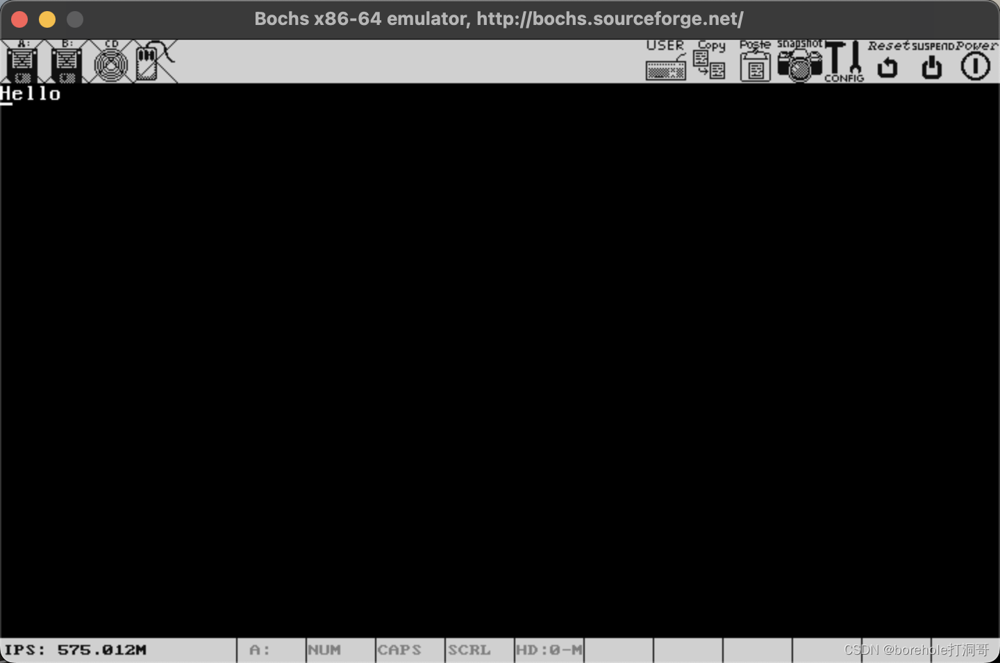

证明我们的加载是成功的。

### 在Windows上安装dd工具

macOS和Linux中有很多非常方便的工具，毕竟他们同属于类UNIX家族。但Windows和他们并不同源，所以需要单独来安装。当然，Windows上也有原生的同作用的工具可用，如果读者熟悉的话当然没问题。但本篇文章为了保证多平台的一致性，还是会使用`dd`工具，因此这里介绍一下如何在Windows上安装`dd`工具。

在[chrysocome官网](http://www.chrysocome.net/download)上下载dd工具，注意这里下载列表里的东西比较多，不要下载错了，要找到``ddrelease64.exe`。

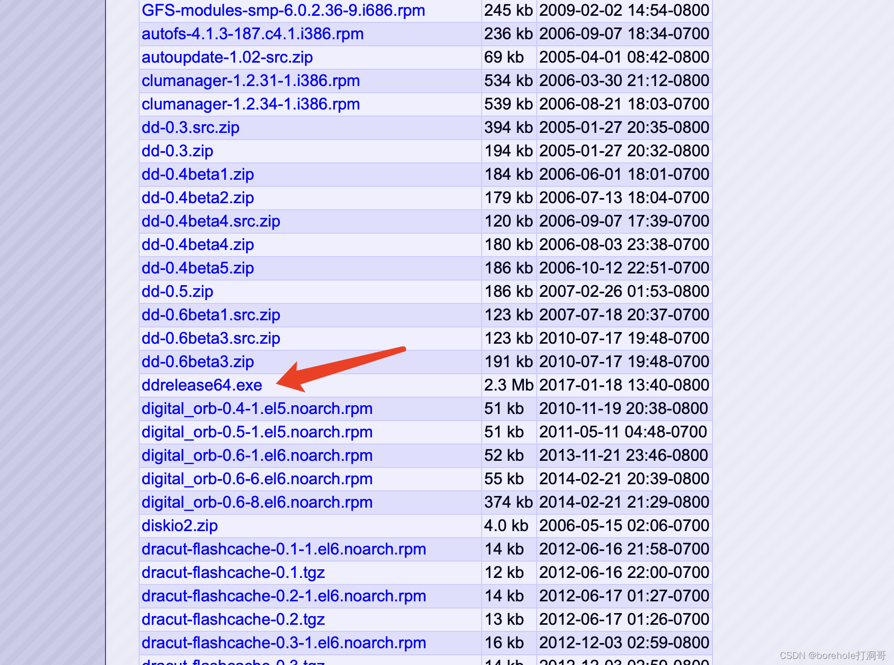

这个工具没有安装包，下载下来直接就是可用的工具，我们把它放到一个方便自己管理的路径下，然后把这个路径配置到环境变量中（方法可以参考前面配置nasm的方法）。

更简单的方法是直接把这个程序复制到`C:\Windows`下，因为这个路径本来就在环境变量中。

建议把`ddrelease64.exe`重命名为`dd.exe`，这样命令会统一，使用更方便。

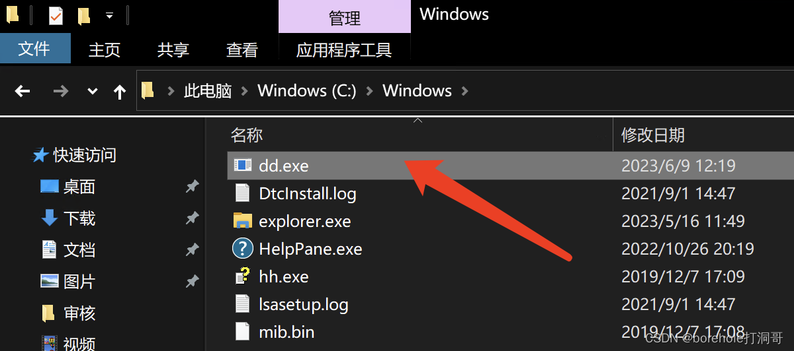

之后打开控制台，输入`dd -h`，如果能正常输出，说明dd工具已经配置就绪。

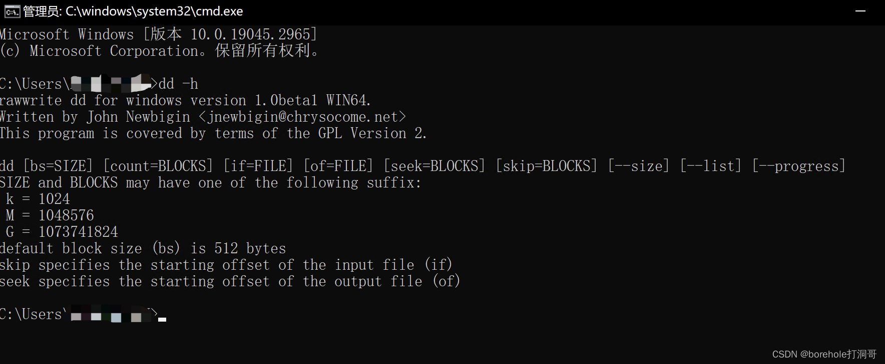

### 使用makefile

当文件拆开后，每次生成`a.img`需要好几条命令，并且后续会逐渐增多，所以搞一个项目工程生成的配置文件是一个比较好的方法。这里我们使用`make`工具。

`make`工具是GNU工具集中的一部分，在macOS下可通过Home Brew安装，在Windows下可通过MinGW来安装。

#### 在macOS上安装make

在安装并配置好Home Brew的前提下，输入下面命令：

```
brew install make
```

等待安装流程结束后输入`make -v`，如果能出现版本号，证明安装成功。 

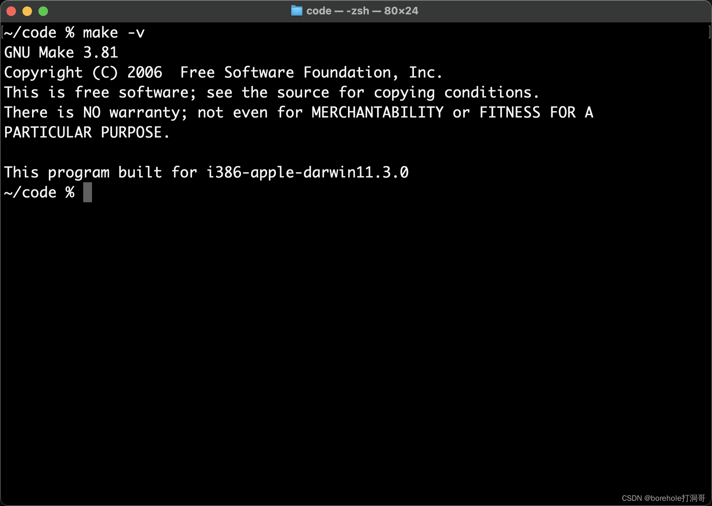

#### 在Windows上安装make

刚才介绍过，make工具属于GNU工具集中的，在Windows上安装GNU工具集需要用到MinGW工具，以后我们安装gcc相关工具也会用到MinGW。

首先进入[sourceforge官网](https://sourceforge.net/projects/mingw/)下载MinGW。


之后运行安装包，并进行安装 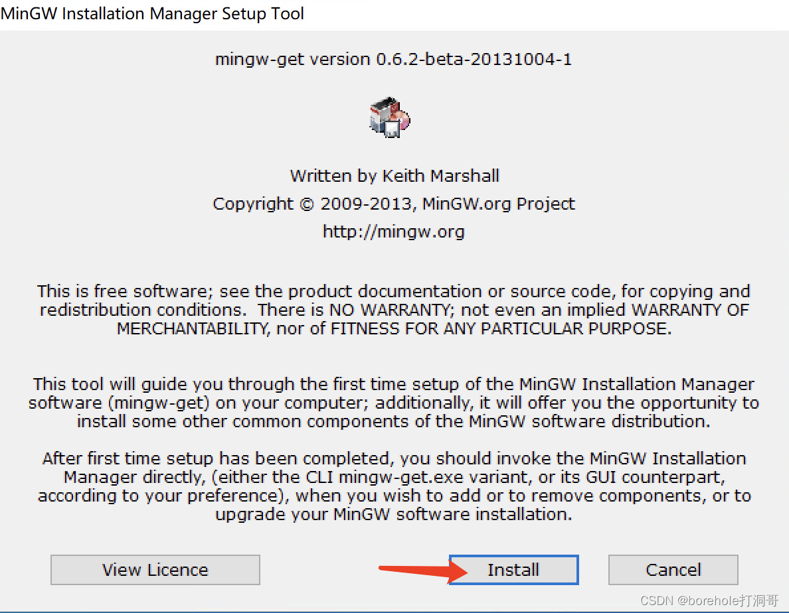

同样，安装参数保持默认即可。

安装完毕后点击「continue」。 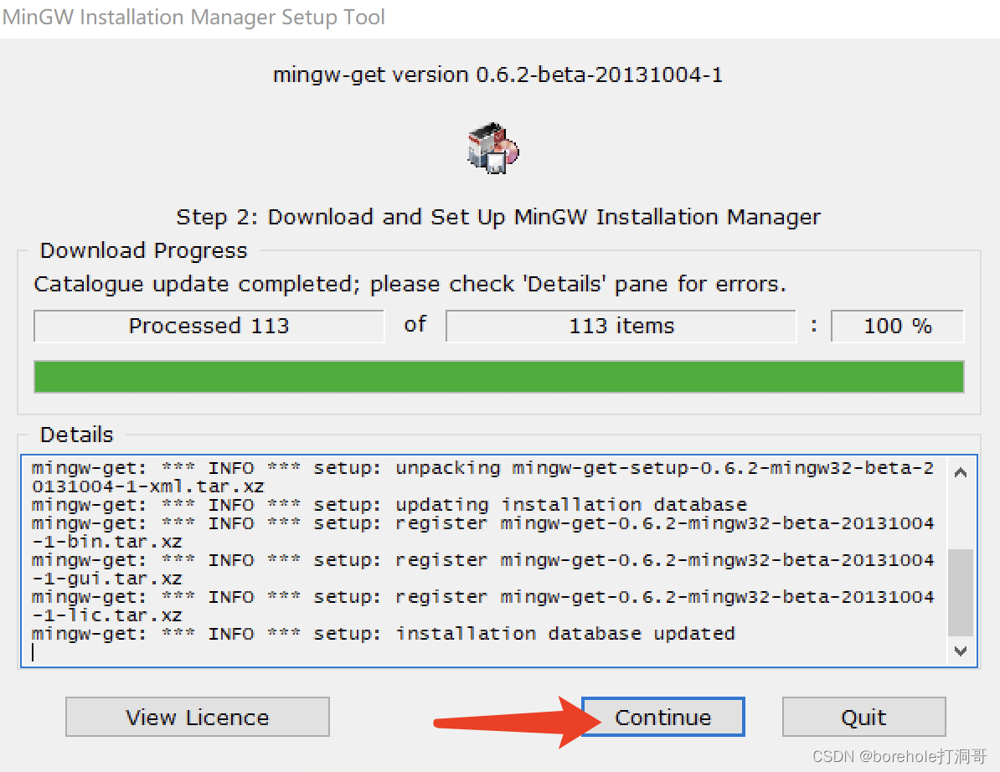

之后会弹出MinGW的管理界面，选择「All Package」，然后找到`mingw32-make`的bin文件（注意要找bin文件，这才是程序，其他的是文档），点击后选「Mark to installation」 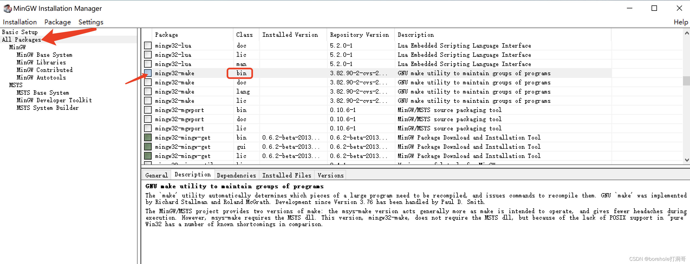

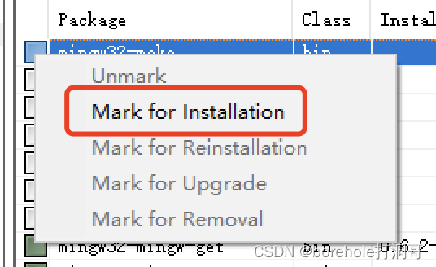

确认它被选中的情况下，点击「Installation」，选择「Apply Changes」，随后点击「Apply」即可开始安装`make`。

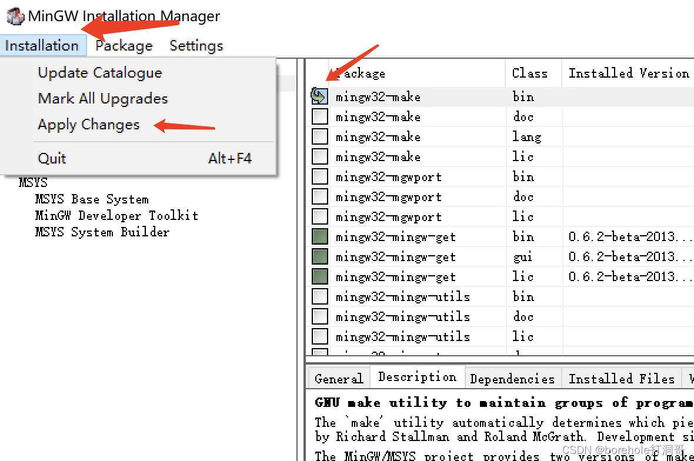
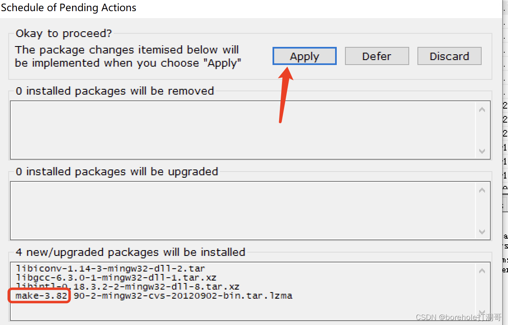

之后就是配置环境变量，默认情况下MinGW安装的程序会放在`C:\MinGW\bin`中。

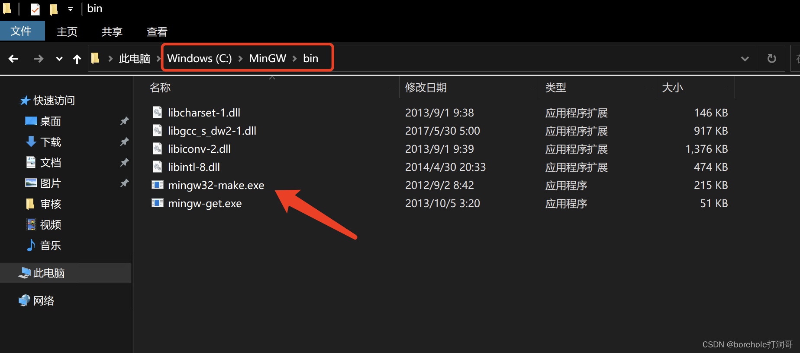

我们把这个路径配置到环境变量中（详细方法可以看前面章节）： 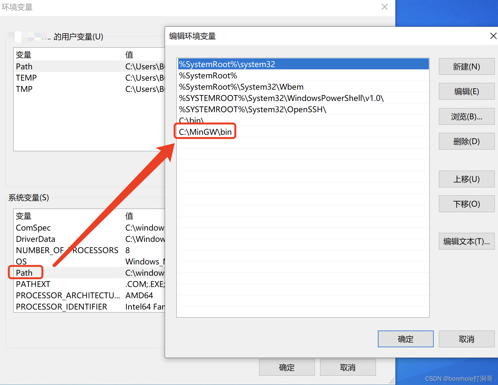

然后我们打开控制台，输入`mingw32-make -v`，如果能出现版本号说明配置成功。

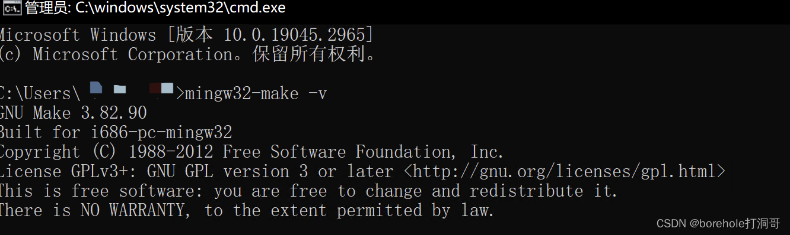

#### 配置项目的makefile

`make`工具的运行依赖于`makefile`文件，我们在工程路径下创建一个名为`makefile`的文件，注意，这个文件没有任何后缀。然后编写以下内容：

```
.PHONY: all
all: sys

.PHONY: run
run: bochsrc sys
	bochs -qf bochsrc

a.img:
	rm -f a.img
	bximage -q -func=create -hd=16M $@

sys: a.img mbr.bin kernel.bin
	dd if=mbr.bin of=a.img conv=notrunc
	dd if=kernel.bin of=a.img bs=512 seek=1 conv=notrunc

mbr.bin: mbr.nas
	nasm mbr.nas -o mbr.bin

kernel.bin: kernel.nas
	nasm kernel.nas -o kernel.bin

.PHONY: clean
clean:
	-rm -f *.bin 
```

要注意，上面的行前缩进都必须是制表符（`'\t'`，也就是按TAB键），而不可以是空格，否则无法正常运行。

保存之后，直接在项目路径下输入`make run`（如果是MinGW安装的则应当输入`mingw32-make run`，后文都同理，不再特别标注），即可全自动生成`a.img`，并且启动`bochs`运行：

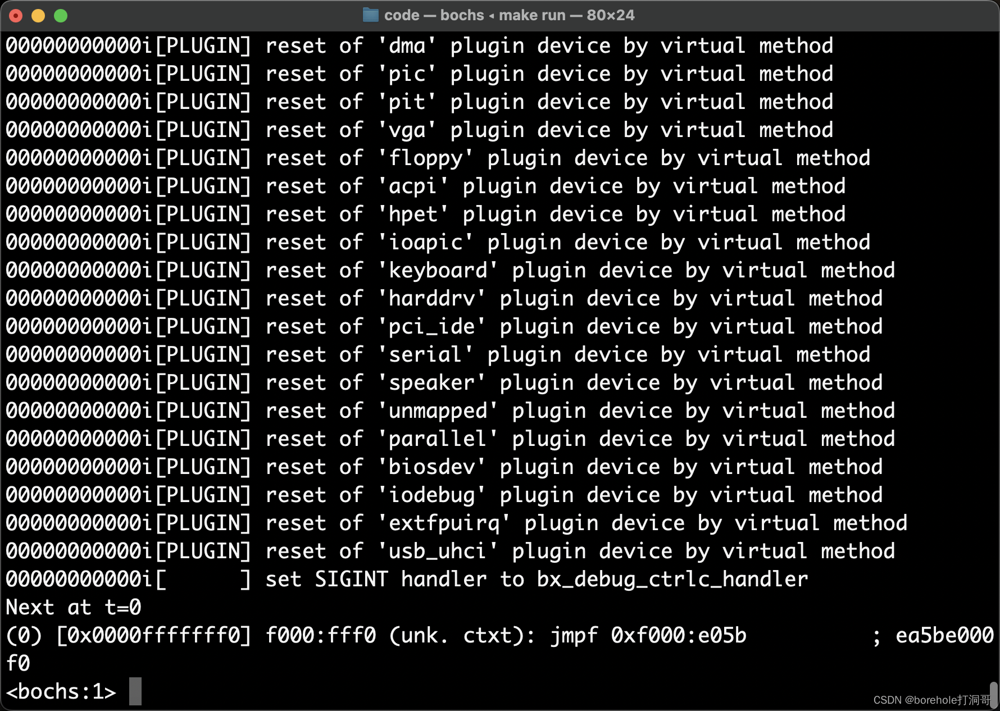

接下来我们来解释一下`makefile`中的内容代表什么含义。

大致上来说，`makefile`的写法是：

```
目标: 依赖1 依赖2 ...
[Tab] 生成指令
```

比如说前面的：

```
mbr.bin: mbr.nas
    nasm mbr.nas -o mbr.bin
```

就表示，要生成`mbr.bin`文件，则需要`mbr.nas`文件，生成的指令是`nasm mbr.nas -o mbr.bin`。与此同时，它自带依赖，比如说生成`sys`需要`mbr.bin`，那么它就会先去生成`mbr.bin`。

对于这个`.PHONY:run`则表示后面的`run`并不是实际文件，而是一个标签。

`make`规则会默认按照第一个规则，也就是说，如果我们直接输入`make`，就相当于输入了`make all`，匹配`makefile`中的`all`标签。一般情况下还会在最后设置一个`clean`标签用做清理。

详细的`makefile`写法就不在本篇内容中介绍了，如果读者感兴趣可以自行查阅。为了降低门槛，笔者在本篇文章中也不会使用复杂的`makefile`语法，所以读者无需担心。

## 从8086到80286

到目前为止，我们已经从裸机启动开始，加载了mbr，又通过mbr加载了kernel。真的要说起来，再往后就应该是用kernel来调度用户程序了，但目前我们还没办法走到这一步，因为有一个很严重的问题，就是目前整个理论和流程，都是8086上的。

要想继续进行，咱们得先进入一个正常的模式，至少要先进入IA32模式，我们才能聊加载C/C++程序的事。但想从8086模式进入IA32模式并不是件容易的事，我们得串一遍架构发展的流程。这件事还蛮有意思的，因为我觉得跟生物进化如出一辙。比如说人类在母体内的发育过程，就很像一个极速版的人类从原始海洋生物不断进化的过程。类比到程序启动这里也是一样的，Intel从8086开始，到推出286、386、再到后面64位CPU的历史发展过程，也会浓缩在计算机启动的过程中。

在计算机启动时，CPU就是以8086模式工作的（当然，如果Intel推出x86S模式以后，情况可能会发生变化，但至少本文编写时，以常规AMD64架构方式设计的CPU还是会以8086模式开始启动的），然后要通过一些配置进入286模式，再进入IA-32模式，再进入AMD-64模式。

所以，我们还是需要了解一下中间这些历史发展情况，然后来指导我们如何配置和进入更高层的模式。

### A20使能端

之前我们提到过8086机器有20位地址总线，但是却是用了2个16位寄存器来表示内存地址的。但是，用2个16位来拼凑一个20位地址，其实是有盈余的。

我们计算一下就可以知道，这种表示方式的范围应该是`0x0000:0x0000`~`0xffff:0xffff`，也就是`0x00000`~`0x10ffef`。我们发现最大值已经超过了20位的范围`0xfffff`。那么如果我真的把寄存器配成`0x10000`~`0x10ffef`之间的部分会怎么样？还记得前面解释内存地址拼接时的那张图吗？


既然是全加器，它的输出端其实应该要有进位符的输出的。事实上在硬件中的确有这个进位输出端，只不过在8086的CPU中，结果被丢弃了而已。

因此，在8086中，超过了16位的部分会被丢弃，也就是说`0x10000`~`0x10ffef`的部分会变成`0x0000`~`0x0ffef`。

接下来我们做个实验来验证这个说法。将`es:dx`配置为`0xff00:0xf000`，结果应该是`0x10e000`，那么按照刚才的说法，这个地址其实应该会反转到`0x0e000`处。

把`kernel.nas`改为以下内容：

```
begin:
mov ax, 0xff00
mov es, ax

mov [es:0xf000], byte 0xaa ; 给这个位置写入0xaa

hlt

times 1024-($-begin) db 0
```

然后通过调试模式，查看写入内存这一句的前后，内存的情况。我们`make run`以后，输入`pb 0x8000`，在`kernel`处打断点，然后用`c`命令执行至`kernel`处。再执行2次`n`命令，到我们需要观察的位置：

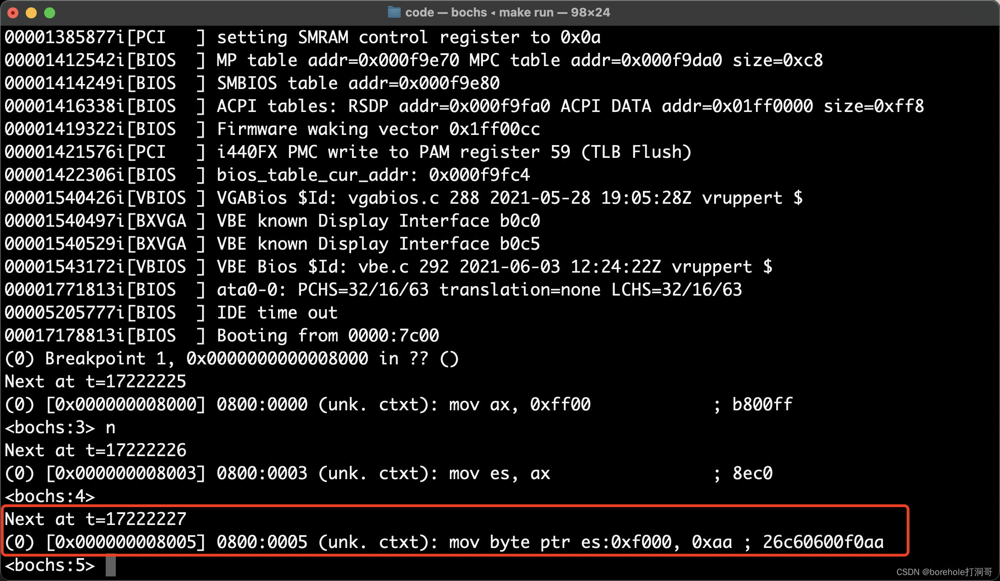 

这时你可以通过`x`命令来看看此时的内存情况，现在不看，等一下执行完再看也行。

再执行一次`n`命令，让写入内存的指令生效，之后我们来看一下`0xe000`的内存情况，通过`x 0xe000`命令：

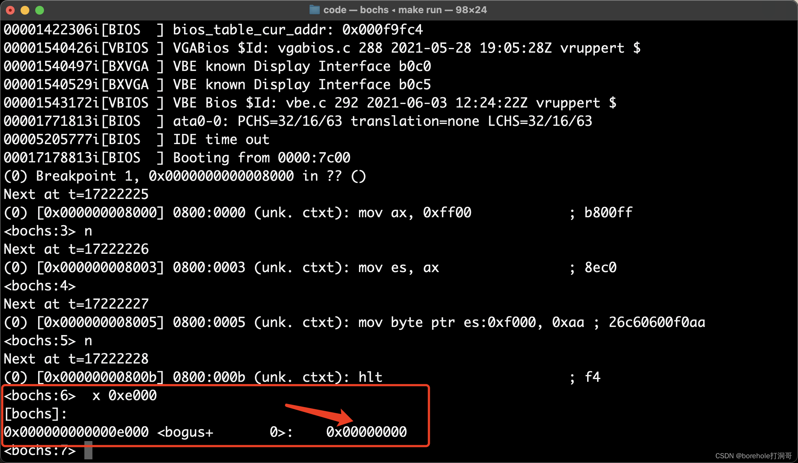 

不对呀！这里的内存为什么没有被改呢？先不急，我们再来看一下`0x10e000`的情况：

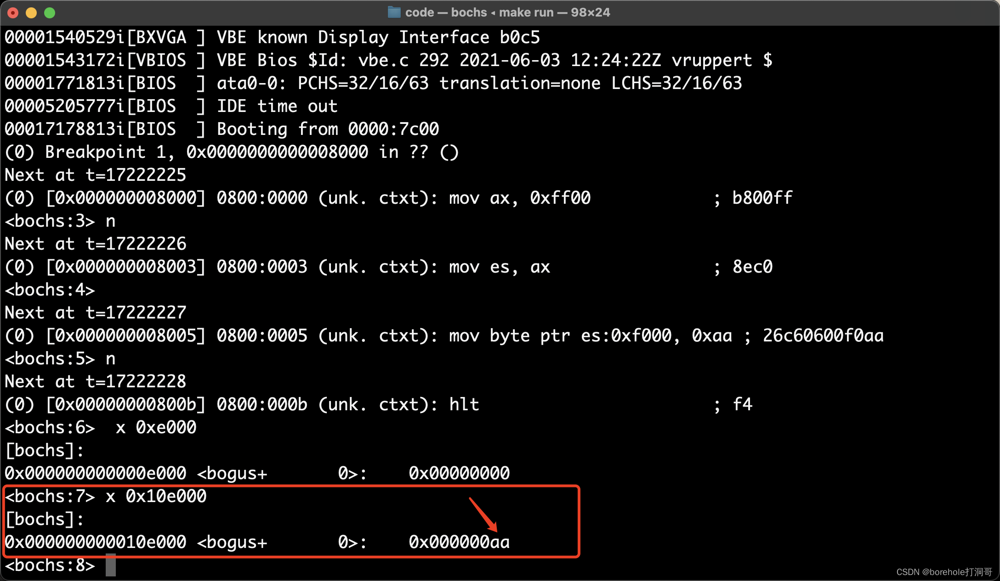

这里是生效的！那这件事就很奇怪了，它事实上并没有发生我们预料之中的反转情况，因为根据上面的实验，`0x10e000`并没有映射到`0x0e000`上。

所以这里必须要提醒大家，虽然前面我们一直在解释8086的各种情况，**但bochs并不是8086模拟器！**，而是AMD-64模拟器。换句话说，咱们现在的运行环境并不是真正的8086，只是一个AMD-64的CPU，**运行在了8086模式下**罢了。

刚才我们说，20位全加器的进位结果，在8086上是被丢弃的，这是因为8086只有20位地址线。但是，到了80286的时候，就已经升级为24位地址线了，那么当时Intel理所应当地认为，这个全加器的进位结果，就应该接到第20位地址线（或者叫A20）上。

也就是说，80286处理器运行在8086模式下时，会有21位地址是有效的，有效地址范围是`0x00000`~`0x10ffef`，超出`0xfffff`的部分并不会反转（因为进位标志是有效的）。这个特性同样在后续的IA-32架构和AMD-64架构上被延续了下来，所以，我们在模拟器上看不到内存地址的反转。

虽然说现在看起来，这种做法无可厚非，但是当年却爆炸了。据说，是因为一个比较重要的软件，程序员在编写的时候利用了这种反转特性进行了编码。那么在8086机器上是运行OK的，但是换到了80286机器上，程序就不能正常运行了。（这个故事也告诉我们，程序员编码的时候还是应当以软件方式来思考问题，不应当依赖这种非常特殊的硬件特性来实现功能，否则硬件兼容性就会很差。）

因此为了解决这个问题，主板厂商想了一个办法，就是用南桥芯片来控制CPU的A20使能。通过给特定端口的I/O发送消息，来间接控制A20地址线是否有效。如果要在80286上运行依赖于地址反转的8086程序的话，只需要先将A20地址线去使能，然后就可以正常运行。

这个功能被映射到了I/O的`0x92`端口上，这个端口控制器的第1位（注意是第1位而不是第0位，也就是从低向高的低二位）用于控制A20的使能，也被称为A20 Mask位，简称A20M。为`1`时，A20去使能，地址会反转；为`0`时，A20使能，地址不会反转。

所以，我们先将A20M开启，然后再去写内存，就也可以达成目的了，代码如下：

```
begin:

; 开启A20M，允许超1M的地址反转
in al, 0x92
and al, 11111101b
out 0x92, al

; 再尝试溢出地址中写入数据
mov ax, 0xff00
mov es, ax

mov [es:0xf000], byte 0xaa

hlt

times 1024-($-begin) db 0 ; 补满2个扇区
```

然后按照之前的方式重新实验，可以观察到这时，`0xe000`的内存是被实际操作的： 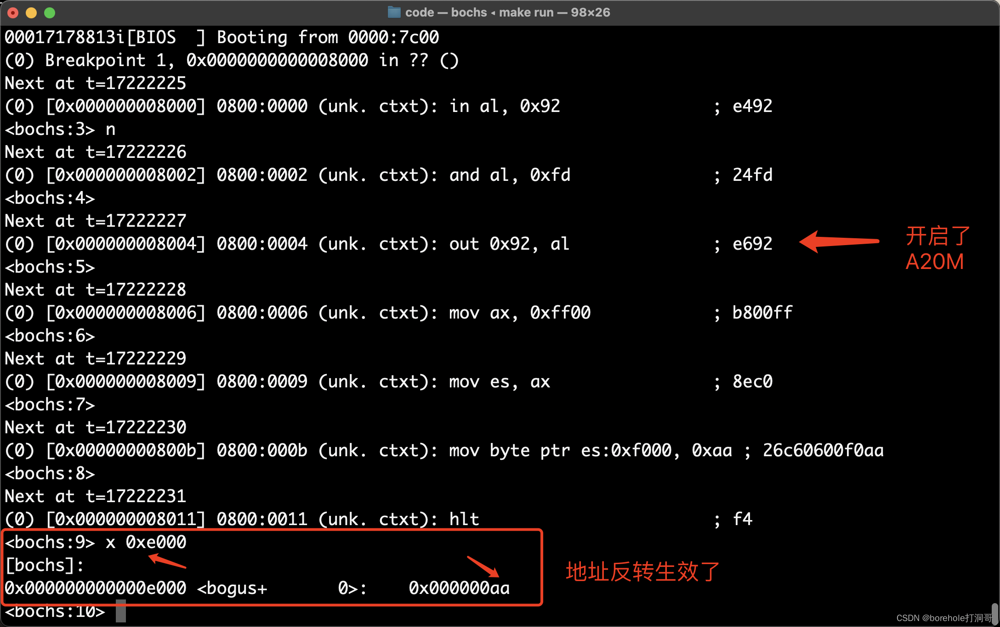
不过对于我们来说，正常情况下不用刻意控制A20M，因为它默认是关闭的（也就是说A20默认是使能的）。

所以，这个例子也是为了提醒大家，我们现在并不是真正的8086设备，而是以8086模式运行的AMD64设备。（当然，后面要介绍的80826模式、IA32模式也是同理）。

## 从8086到80286

我们知道8086有20位地址总线，而80286有24位地址总线。因此，如果按照8086的寻址方式，即便是我们打开了A20M，也只是最多能达到21位的寻址空间。那么如何利用好这24位地址总线呢？

比较容易想到的一种方案是这样的。既然在8086里，我们是通过2个16位寄存器拼出一个20位地址的，那么，稍微改变一下偏移的策略，也是可以用2个16位寄存器拼出一个24位地址的嘛。也就是说段地址偏移8位（不再是4位）再加上偏移地址就好了。

上面这种方法确实可以简单地解决问题，但在80286诞生的时候，8086已经有相当一部分市场了，如果这时Intel推出一款新的处理器是新的寻址方式的话，就无法兼容现有的软件。因此，要想让8086的软件能够正常在80286上运行，80286就需要一种向下兼容的运行模式，也就是8086模式，在这种模式下，要按照8086的寻址方式来工作。

不过照理说，这样也不冲突，8086模式下我们按偏移4位的方式，286模式下我们按偏移8位的方式，也可以解决问题，但Intel并没有选择这样做，原因其实是在于恶意软件的防范（通俗的说法就是防病毒）。

在8086上，由于段寄存器是可以随便填写的，所有的程序都拥有最高权限，都可以访问任意的内存空间。随着计算机功能的不断扩充，逐渐也就不满足于单进程的运行方式了，那么，就需要引入操作系统的概念，区分「内核进程」和「用户进程」，让每个程序只能操作自己的一亩三分地，不能越权。因此，Intel就在80286上引入了这种保护基址，通过将内存分段，并且给每个段分配一个地址范围和操作权限。OS负责统筹段的选择，在进入用户进程之前，配置好对应的段，然后再执行用户进程，这样，用户进程的执行过程中就无法跨段操作，从而保证程序安全。

既然分段，还要额外配置段的范围以及权限，那么显然这个内容就不是一个简单的段地址这么简单了，因此，在286模式下，「段寄存器」就不能简简单单只保存一个段基址了，因为这样的信息是不够的。

286模式的解决方法，是把「段配置」这样的配置信息存在内存中，包括需要分几个段，每个段的首地址、末地址是多少，段的权限是怎样的。然后，把需要使用的段的**序号**传入段寄存器。寻址时，会首先根据段寄存器中保存的段序号找到对应的**段基址**，然后用基址加上偏移地址得到物理地址。之后，会根据段配置的权限，对当前操作指令进行合法性判断，例如对于只读的段来说，如果遇到写入操作，那么就会认为操作非法，从而触发系统中断。

大致的过程就是上述的这样，我们把段寄存器中保存的**段序号**称为「段选择子」，而这种通过段的提前配置，然后用段选择子+偏移地址的这种寻址方式称为「保护模式」，与之对应的原本8086的寻址方式则被称为「实模式」。

所以，在进入保护模式之前，我们得先配置一份段的描述表，否则进入保护模式后寻址会出问题的。

### 全局描述表

全局描述表，又称GDT（Global Descriptor Table），就是用来配置我们的内存要如何分段的数据表。

由于目前我们还在实模式下，所以，咱们也只能在当前可用的内存中间中，找一个地方，来放GDT，这里，我们就暂且选择`0x7e00`这个位置，以后进入保护模式后可以再更换。

从`0x7e00`位置开始，每8个字节配置1个段，并且要求最开头的段（0号段）强制为空（为什么要强制为空呢？当程序发生不合法的短访问时，系统中断会使得段寄存器强制归零，那么此时相当于选择了0号段，因此，0号段必须是一个不合法的段才行。）

之后，每一个段的配置要符合下面的描述表：

<table><thead><tr><th>内存偏移量（bit）</th><th>符号</th><th>解释</th></tr></thead><tbody><tr><td>0~15</td><td>Limit</td><td>段界限</td></tr><tr><td>16~39</td><td>Base</td><td>段基址</td></tr><tr><td>40</td><td>A</td><td>访问位</td></tr><tr><td>41~43</td><td>Type</td><td>描述符类型</td></tr><tr><td>44</td><td>S</td><td>系统/数据</td></tr><tr><td>45~46</td><td>DPL</td><td>权限级别</td></tr><tr><td>47</td><td>P</td><td>存在位</td></tr><tr><td>48~63</td><td>AVL</td><td>保留位</td></tr></tbody></table>

分别解释一下，首先，段界限`Limit`很好理解，就是当前这个段的大小，不过这里跟我们通常意义上理解的「大小」有一点区别，它想表明的是「段的最后一个字节的偏移量」，也就是说，这个值仍然在段内，只不过是段的最后一个字节。所以，`Limit`跟我们理解的`Size`其实差了1个字节。举例来说，如果我们希望这个段的大小是1KB，那么`Limit`应该填`1023`或者`0x3ff`而不是`1024`。

段基址`Base`就不用说了，就是这个段的首地址对应的内存大小。由于80286是24位地址空间，所以段基址也应该是个24位的内存地址。

访问位`A`可以理解为OS用作段访问标记的，用来让OS统计段的访问频率，以及虚拟内存策略使用。所以这一位对我们目前来说没有什么用途，填0就好。

子类型`Type`用于表示当前这个段的作用，`Type`内的3位分别叫做`X``E``W`，`X`和`W`这两个用过Unix的小伙伴一定很熟悉，分别表示「可执行」「可写」。如果`X`为0，那么当前段只能存数据，而不能用作执行指令。如果`W`为0，那么当前段只读，不可更改。

而`E`则表示段扩展方向，如果`E=0`则表示向高地址扩展，`E=1`表示向低地址扩展，不过目前我们暂时还不用考虑段的扩展问题，所以都默认填`0`就好。

`S`位表示这个段是否是「系统段」，系统段也是依赖于OS的概念，目前我们用不到，所以默认填`0`，表示他是普通的段。

`DPL`是权限等级，占2位，所以就是说一共可以划分4个等级，`0`位最高权限等级，`3`是最低等级。我们目前还是需要一个高权限来控制内核的，所以这里也应当填`0`。

`P`是存在位，或者也可以理解成「使能」位，如果`P`为0，则当前段失效。为`1`时当前段有效。这个主要是做虚拟内存进出策略时用到的，我们当前应当保证`P`为1。

最后的`AVL`是保留位，在80286模式下没有用处，我们留白即可。

那么，按照上述描述，咱们就可以着手配置一个段表了，代码如下：

```
; 下面配置GDT
mov ax, 0x07e0
mov es, ax

; 空白段
mov [es:0x00], dword 0
mov [es:0x04], dword 0

; 1号段
; 基址0x8000，大小8KB
mov [es:0x08], word 0x1fff ; Limit=0x1fff
mov [es:0x0a], word 0x8000 ; Base=0x008000，这是低16位
mov [es:0x0c], byte 0      ; 这是Base的高8位
mov [es:0x0d], byte 1_00_1_100_0b ; P=1, DPL=0, S=1, Type=100b, A=0
mov [es:0x0e], word 0	   ; 预留位，先填0
```

大家着重看一下这里的1号段，由于我们当前的目的并不是像OS那样做特别合理的段规划，因此，咱们暂时就配一个超管段，然后进入保护模式即可。我们就选取`0x8000`作为基址，配一个`8KB`的可写、可执行的段。

那么配置好的GDT，还需要想办法让它生效才行。80286提供了一个48位寄存器，用于存储GDT的配置，这个寄存器叫做`GDTR`，它的低16位表示GDT的界限（也就是`limit`逻辑，总长度-1），16~35位表示GDT的首地址，36~47位预留。

<table><thead><tr><th>地址</th><th>符号</th><th>说明</th></tr></thead><tbody><tr><td>0~15</td><td>GDT Limit</td><td>GDT的限度（长度-1）</td></tr><tr><td>16~35</td><td>GDT Base</td><td>GDT的首地址</td></tr><tr><td>36~47</td><td>AVL</td><td>预留位</td></tr></tbody></table>

我们来看代码：

```
; 下面是gdt信息的配置（暂且放在0x07f00的位置）
mov ax, 0x07f0
mov ex, ax
mov [es:0x00], word 15      ; 因为目前配了2个段，长度为16，所以limit为15
mov [es:0x02], dword 0x7e00 ; GDT配置表的首地址
; 把gdt配置进gdtr
lgdt [es:0x00]
```

最后用`lgdt`命令，把数据存入GDTR中，那么GDT就配置完毕了。

不过，当前我们仅仅是配置了GDT，但机器仍然还在8086模式下，所以它暂时还是没什么用的，我们需要切换机器的运行模式。

注意这里，我的措辞是「8086模式」「切换模式」，原因很简单，因为我们现在并不是真的在用8086的CPU，甚至也不是80286的CPU，咱们模拟器的是一个AMD64架构的CPU，因此8086模式也好，286模式也好，都只是它的一种工作模式罢了。不过也正因如此，我们才能做切换，要是真的是8086的CPU的话，你无论如何也没法切换成286的。

那么，如何切换至286模式呢？其实在CPU内部，有一个控制寄存器，叫做MSW，说是寄存器，其实就是控制开关啦，只要我们改变其中某些位的数值，就可以改变CPU的运行状态。MSW的最后一位就表示了寻址方式，计算机启动时它是默认至0的，这是寻址方式为8086方式（也就是实模式），当我们把它切为1的时候，就会切换至286模式（也就是保护模式）。

但另一个很难受的问题在于，80286的MSW这个16位控制寄存器仅出现在了80286这款CPU上，到了80386的时候就淘汰了，所以，目前的x86汇编器都很难支持这个操作这个寄存器的指令。原本笔者是想让大家体验一把「纯粹」的286，但出于这个原因，无奈，我们还是只能用更「高档」的语法来实现这个功能。

其实MSW寄存器在80386上，成为了CR0寄存器的一部分。在80386上，CR0是一个控制寄存器，32位的，而它的低16位正好对应了MSW的功能。所以，我们更改CR0的最后一位，同样也可以切换至保护模式。只不过这里就不得不提前让我们来操作32位寄存器了，希望读者体谅，并且了解这步操作并不是80286的，而是我们当前的环境是AMD64模拟器，不得已而为之的，代码如下：

```
mov eax, cr0
or eax, 0x01 ; PE位置1，启动保护模式
mov cr0, eax
```

说明一下，`eax`是32位通用寄存器，它的低16位就是`ax`，这同样也是80386才支持的寄存器，我们此刻也只是无奈来使用一下它，希望读者悉知。

那么，当CR0被改变的那一刹那开始，CPU就进入保护模式了，那这个时候最大的问题就是，当前我们的CS寄存器里还是原来的数据，也就是段基址。我们得给他变成段选择子才行，而CS寄存器又不能直接改写，那怎么办呢？答案很简单，用远跳指令来强制刷新段寄存器，代码如下：

```
jmp 00001_00_0b:0 ; 远跳指令可以刷新cs，使用1号段
```

目前读者理解到这里就好，下一节我们会用一个完整的实例来演示。

## 重新写一份MBR代码

前面我们花了不少的篇幅来介绍保护模式，以及通过汇编指令进入保护模式的方法。那么这一节，我们就来上一个完整的实例，首先在实模式下加载Kernel，然后配置GDT，之后进入保护模式，跳转至Kernel，再在Kernel里再打印一些文字用以区分。

前面的实例中我们已经把工程代码分为了mbr和kernel，在mbr中读盘，加载到内存中，然后再通过跳转指令运行kernel文件。虽然照理来说，在kernel中再配置GDT然后进入保护模式也没什么问题，但这样就会使得kernel中同时夹杂两种模式的指令代码（后续我们介绍完386模式以后，就还可能会同时混有16位和32位指令），不方便管理和维护。因此，我们在mbr中就做好这一些，最后以保护模式跳转至kernel部分，这样我们的kernel就会纯粹许多。

下面是我们重新写的一份MBR代码：

```
; 调用0x10号BIOS中断，清屏
mov al, 0x03
mov ah, 0x00
int 0x10 

; LBA28模式，逻辑扇区号28位，从0x0000000到0xFFFFFFF
; 设置读取扇区的数量
mov dx, 0x01f2
mov al, 2 ; 读取连续的几个扇区，每读取一个al就会减1
out dx, al
; 设置起始扇区号，28位需要拆开
mov dx, 0x01f3
mov al, 0x02 ; 从第2个扇区开始读（1起始，0留空），扇区号0~7位
out dx, al
mov dx, 0x01f4 ; 扇区号8~15位
mov al, 0
out dx, al
mov dx, 0x01f5 ; 扇区号16~23位
mov al, 0
out dx, al
mov dx, 0x01f6
mov al, 111_0_0000b ; 低4位是扇区号24~27位，第4位是主从盘（0主1从），高3位表示磁盘模式（111表示LBA）
; 配置命令
mov dx, 0x01f7
mov al, 0x20 ; 0x20命令表示读盘
out dx, al

wait_finish:
; 检测状态，是否读取完毕
mov dx, 0x01f7
in al, dx ; 通过该端口读取状态数据
and al, 1000_1000b ; 保留第7位和第3位
cmp al, 0000_1000b ; 要检测第7位为0（表示不在忙碌状态）和第3位是否是1（表示已经读取完毕）
jne wait_finish ; 如果不满足则循环等待

; 从端口加载数据到内存
mov cx, 512 ; 一共要读的字节除以2（表示次数，因为每次会读2字节所以要除以2）
mov dx, 0x01f0
mov ax, 0x0800
mov ds, ax
xor bx, bx ; [ds:bx] = 0x08000
read:
in ax, dx ; 16位端口，所以要用16位寄存器
mov [bx], ax
add bx, 2 ; 因为ax是16位，所以一次会写2字节
loop read

; 下面配置GDT
mov ax, 0x07e0
mov es, ax

; 空白段
mov [es:0x00], dword 0
mov [es:0x04], dword 0

; 1号段
; 基址0x8000，大小8KB
mov [es:0x08], word 0x1fff ; Limit=0x1fff
mov [es:0x0a], word 0x8000 ; Base=0x008000，这是低16位
mov [es:0x0c], byte 0      ; 这是Base的高8位
mov [es:0x0d], byte 1_00_1_100_0b ; P=1, DPL=0, S=1, Type=100b, A=0
mov [es:0x0e], word 0      ; 保留位都置0

; 下面是gdt信息的配置（暂且放在0x07f00的位置）
mov ax, 0x07f0
mov es, ax
mov [es:0x00], word 15      ; 因为目前配了2个段，长度为16，所以limit为15
mov [es:0x02], dword 0x7e00 ; GDT配置表的首地址
; 把gdt配置进gdtr
lgdt [es:0x00]

mov eax, cr0
or eax, 0x01 ; PE位置1，启动保护模式
mov cr0, eax

jmp 00001_00_0b:0 ; 远跳指令可以刷新cs，使用1号段，正好跳转至kernel的加载位置（0x8000）

times 510-($-$$) db 0 ; MBR剩余部分用0填充
dw 0xaa55
```

可以看到最后有一个远跳指令`jmp 00001_00_0b:0`，由于这个时候我们已经通过控制`cr0`寄存器来进入保护模式了，所以前面段的部分就已经不是段基址而是段选择子了。通过远跳指令我们就可以刷新`cs`寄存器，让他表示选择子`1`号段，而根据GDT的配置，`1`号段的段基址就是`0x8000`，也就正好是我们Kernel加载的位置。

所以接下来，我们只需要在Kernel中，输出一下信息，观察程序能否正常运行即可。但有个严重的问题是，要想输出信息我们需要写显存，可是显存在`0xb8000~0xb8f9f`，而`1`号段的界限在`0x1fff`，所以，我们当前的情况是没法操作显存的。那怎么办？我相信有读者可能会想到，那要不我们把`1`号段配长一点，包括到显存，是不是就可以操作了？

答案是：不可以！因为除了界限问题，保护模式下段是具有属性的，也就是GDT中的`Type`的`XEW`这3位，我们配置的时候配置的是`100`，`W`为`0`的时候是不可写的，所以我们不可以向这个段里写数据。

那，把`Type`配成`101`不就可以解决了么？理论上来说是的，但并不推荐大家这样去做，因为我们不希望指令段在执行时轻易被更改，这样程序的风险极大。当然了，如果大家仅仅是自己做实验方便的话，倒也无妨。

不过更稳妥的做法，是再配一个段，专门去管理显存。这样我们就要回到MBR里加一个GDT，把显存区域划分成一个段，然后再在显存中写数据即可。

```
; 2号段
; 基址0xb8000，上限0xb8f9f，覆盖所有显存
mov [es:0x10], word 0x0f9f ; Limit=0x0f9f
mov [es:0x12], word 0x8000 ; Base=0x0b8000，这是低16位
mov [es:0x14], byte 0x0b   ; 这是Base的高8位
mov [es:0x15], byte 1_00_1_001_0b ; P=1, DPL=0, S=1, Type=001b, A=0
mov [es:0x16], word 0
```

别忘了对应的GDT的配置也要变，要让`2`号段生效才行：

```
; 下面是gdt信息的配置（暂且放在0x07f00的位置）
mov ax, 0x07f0
mov es, ax
mov [es:0x00], word 23      ; 因为目前配了3个段，长度为24，所以limit为23
mov [es:0x02], dword 0x7e00 ; GDT配置表的首地址
```

下面给出修正后的完整MBR代码：

```
; 调用0x10号BIOS中断，清屏
mov al, 0x03
mov ah, 0x00
int 0x10 

; LBA28模式，逻辑扇区号28位，从0x0000000到0xFFFFFFF
; 设置读取扇区的数量
mov dx, 0x01f2
mov al, 2 ; 读取连续的几个扇区，每读取一个al就会减1
out dx, al
; 设置起始扇区号，28位需要拆开
mov dx, 0x01f3
mov al, 0x02 ; 从第2个扇区开始读（1起始，0留空），扇区号0~7位
out dx, al
mov dx, 0x01f4 ; 扇区号8~15位
mov al, 0
out dx, al
mov dx, 0x01f5 ; 扇区号16~23位
mov al, 0
out dx, al
mov dx, 0x01f6
mov al, 111_0_0000b ; 低4位是扇区号24~27位，第4位是主从盘（0主1从），高3位表示磁盘模式（111表示LBA）
; 配置命令
mov dx, 0x01f7
mov al, 0x20 ; 0x20命令表示读盘
out dx, al

wait_finish:
; 检测状态，是否读取完毕
mov dx, 0x01f7
in al, dx ; 通过该端口读取状态数据
and al, 1000_1000b ; 保留第7位和第3位
cmp al, 0000_1000b ; 要检测第7位为0（表示不在忙碌状态）和第3位是否是1（表示已经读取完毕）
jne wait_finish ; 如果不满足则循环等待

; 从端口加载数据到内存
mov cx, 512 ; 一共要读的字节除以2（表示次数，因为每次会读2字节所以要除以2）
mov dx, 0x01f0
mov ax, 0x0800
mov ds, ax
xor bx, bx ; [ds:bx] = 0x08000
read:
in ax, dx ; 16位端口，所以要用16位寄存器
mov [bx], ax
add bx, 2 ; 因为ax是16位，所以一次会写2字节
loop read

; 下面配置GDT
mov ax, 0x07e0
mov es, ax

; 空白段
mov [es:0x00], dword 0
mov [es:0x04], dword 0

; 1号段
; 基址0x8000，大小8KB
mov [es:0x08], word 0x1fff ; Limit=0x1fff
mov [es:0x0a], word 0x8000 ; Base=0x008000，这是低16位
mov [es:0x0c], byte 0      ; 这是Base的高8位
mov [es:0x0d], byte 1_00_1_100_0b ; P=1, DPL=0, S=1, Type=100b, A=0
mov [es:0x0e], word 0

; 2号段
; 基址0xb8000，上限0xb8f9f，覆盖所有显存
mov [es:0x10], word 0x0f9f ; Limit=0x0f9f
mov [es:0x12], word 0x8000 ; Base=0x0b8000，这是低16位
mov [es:0x14], byte 0x0b   ; 这是Base的高8位
mov [es:0x15], byte 1_00_1_001_0b ; P=1, DPL=0, S=1, Type=001b, A=0
mov [es:0x16], word 0

; 下面是gdt信息的配置（暂且放在0x07f00的位置）
mov ax, 0x07f0
mov es, ax
mov [es:0x00], word 23      ; 因为目前配了3个段，长度为24，所以limit为23
mov [es:0x02], dword 0x7e00 ; GDT配置表的首地址
; 把gdt配置进gdtr
lgdt [es:0x00]

mov eax, cr0
or eax, 0x01 ; PE位置1，启动保护模式
mov cr0, eax

jmp 00001_00_0b:0 ; 远跳指令可以刷新cs，使用1号段，正好跳转至kernel的加载位置（0x8000）

times 510-($-$$) db 0 ; MBR剩余部分用0填充
dw 0xaa55
```

然后我们在Kernel中打印随便打印点东西，查看效果即可。注意，要写显存的话，需要将段寄存器调整到`2`号选择子。

以下是Kernel例程：

```
begin:

mov ax, 00010_00_0b ; 选择2号段，以操作显存
mov ds, ax
; 打印Hello
mov [0x0000], byte 'H'
mov [0x0001], byte 0x0f
mov [0x0002], byte 'e'
mov [0x0003], byte 0x0f
mov [0x0004], byte 'l'
mov [0x0005], byte 0x0f
mov [0x0006], byte 'l'
mov [0x0007], byte 0x0f
mov [0x0008], byte 'o'
mov [0x0009], byte 0x0f

hlt

times 1024-($-begin) db 0 ; 补满2个扇区
```

以下是运行效果图： 

上面的工程代码可以参考附件7。

## 探秘IA-32

### 稍安勿躁，我们没有偏题

到这一章的程度，我相信一定会有读者有这样的疑问：你不是要介绍怎么从裸机启动开始运行一个C++程序吗？到现在别说C++了，我们连C的毛都没见到嘞，天天都是各种硬件构造什么的，你是不是歪楼了啊？

笔者确实很担心大家会有这样的想法，所以觉得这里有必要解释一下。我们在前面的章节也提到过，计算机能够直接运行的只能是机器指令，汇编语言虽然很接近机器指令，但还是需要先经过汇编器的转换。而像C语言这种上层语言，就更不可能直接被计算机识别了，它要经历很多繁琐的转换步骤（比如预处理、编译、链接）。

前面介绍的8086实模式也好，80286的保护模式也好，用的都是Intel的16位指令集。虽然说当年贝尔实验室的大佬用C语言去开发Linux的时候还没有80286，并且确实也有适配80286的16位指令集的C语言编译期存在。但这些东西都没有被广泛使用，前面我们切换保护模式的时候就已经出现了类似的问题，因为现在的 CPU（即便是模拟器），都没有286的控制寄存器了，我们不得不用去操作`CR0`。

主要是因为，从80386开始确立的IA-32架构，在后续的很长一段时间内成为了PC机的主流架构，另一方面，目前C/C++的发行版编译期都是可以原生完美支持IA-32架构的编译的，但80286模式的确不能很好地支持，需要我们特殊去配置。

因此，笔者还是希望我们先稳定地了解到IA-32模式下，再考虑跟C语言去进行联动，所以这一章，还需要大家再坚持一下，当咱们的程序可以在IA-32模式下正常执行的时候，我们就可以开始跟C语言联动啦。

### 从286到386

80286最大的功劳就是引入了保护模式，这是一种完全不同于实模式的段分配方式。不知大家是否还记得，最初引入保护模式的两个主要目的是什么？一个是为了程序安全（所以引入了段权限），另一个则是因为寻址空间变大了，地址寄存器不够用。

而80386的最大功劳应该就是32位了，从386开始，不仅有了32位内存寻址空间，32位寄存器，同时还有了32位的指令集。

32位寻址空间也就意味着支持内存地址从`0x00000000`到`0xffffffff`一共`4294967296B`，合`4GB`的寻址空间。如果读者早年关注过个人PC的问题的话，可能会知道以前32位的电脑，最大只能支持`4GB`的内存，原因就是这个，因为寻址空间只有这么大。

寄存器方面，386将8个通用寄存器都扩展到了32位，分别是`eax`，`ebx`，`ecx`，`edx`，`ebp`，`esp`，`edi`，`esi`。注意这些寄存器的是在原本的16位寄存器上扩展得到的，例如说`eax`的低16位其实就是`ax`寄存器。当然了，指令寄存器`ip`也扩展到了`eip`，只不过这个寄存器不能随便使用罢了。同时还添加了`gs`和`fs`两个段寄存器。

而指令集也新添了32位指令集，注意这里是「添加」而不是「替换」，也就是说，386开始的CPU同样可以以实模式、286模式运行，这两种模式下执行的都是16位指令，只有在切换到386模式（或者叫IA-32模式）下，才会支持32位指令集。

IA-32模式也是保护模式，它跟286模式的区别在于指令集，所以286模式可以称为「16位保护模式」，IA-32模式可以称为「32位保护模式」。不过由于286比较短命，所以现在很少使用了，现代CPU也不会刻意进入286模式，而是会从实模式直接切换到IA-32模式（后面章节介绍切换方法的时候，这个问题就显而易见了），因此通常我们直接说「保护模式」，指的就是32位的保护模式，也就是IA-32模式。

### IA-32汇编指令

这里需要给大家强调的是，汇编语言虽然很接近机器指令，但并不完全等价。同一条汇编指令，汇编为16位指令和32位指令可能是不同的，这一点大家一定要注意。

例如，`mov ax, 5`这句汇编，16位指令会汇编为`B8 05 00`，而32位指令会汇编为`66 B8 05 00`。所以我们在使用汇编语言的时候，除了要关注汇编语句本身，也要关注它的汇编环境才可以。

那么，如何在`nasm`中制定汇编指令集呢？方法如下：

```
[bits 32]
mov ax, 5
```

用`[bits 32]`语句声明后，从这一行往后的汇编指令，就会按照32位方式来汇编。如果想切回16位模式，那么就再声明`[bits 16]`即可。注意，如果我们没有显式声明的话，`nasm`默认是按照16位方式的，大家一定要注意。

不过现在我们写32位指令还无法运行，因为我们需要先将CPU切换到IA-32模式。

### GDT的AVL保留位

在286的时候，我们配置GDT时，给了这样一张表：

<table><thead><tr><th>内存偏移量（bit）</th><th>符号</th><th>解释</th></tr></thead><tbody><tr><td>0~15</td><td>Limit</td><td>段界限</td></tr><tr><td>16~39</td><td>Base</td><td>段基址</td></tr><tr><td>40</td><td>A</td><td>访问位</td></tr><tr><td>41~43</td><td>Type</td><td>描述符类型</td></tr><tr><td>44</td><td>S</td><td>系统/数据</td></tr><tr><td>45~46</td><td>DPL</td><td>权限级别</td></tr><tr><td>47</td><td>P</td><td>存在位</td></tr><tr><td>48~63</td><td>AVL</td><td>保留位</td></tr></tbody></table>

注意这里的`48~63`位这`16`位是保留字段，而到了IA-32开始，这保留字段就真正发挥它的意义了。首先，既然是32位寻址空间，那么段基址它至少得是一个32位地址才行吧，而现在只有`16~39`这24位地址，还有8位怎么办？就只能塞到这保留的16位中了。还剩下`8`位则是增加了一些其他功能。下面给出IA-32模式下的GDT配置字段意义表：

<table><thead><tr><th>内存偏移量（bit）</th><th>符号</th><th>解释</th></tr></thead><tbody><tr><td>0~15</td><td>Limit-Low</td><td>段界限(低16位)</td></tr><tr><td>16~39</td><td>Base</td><td>段基址(低24位)</td></tr><tr><td>40</td><td>A</td><td>访问位</td></tr><tr><td>41~43</td><td>Type</td><td>描述符类型</td></tr><tr><td>44</td><td>S</td><td>系统/数据</td></tr><tr><td>45~46</td><td>DPL</td><td>权限级别</td></tr><tr><td>47</td><td>P</td><td>存在位</td></tr><tr><td>48~51</td><td>Limit-High</td><td>段界限(高4位)</td></tr><tr><td>52</td><td>G</td><td>段粒度</td></tr><tr><td>53</td><td>D/B</td><td>16位/32位</td></tr><tr><td>54~55</td><td>AVL</td><td>保留位</td></tr><tr><td>56~63</td><td>Base-High</td><td>段基址(高8位)</td></tr></tbody></table>

正是由于386是在286的基础上扩展的，所以才会造成这里的段基址配置没有写在一起，而是劈开了，因为低24位就是原先286上的，而高8位则是386开始扩展的。与此同时，386也扩充了段的上限，从以前的16位扩充到了20位，那么高4位也是分开写的。

正常来说，20位的界限的话，那一个段最多只能是`1MB`的大小，但这对于IA-32架构的`4GB`内存来说显得有点局促了。为了解决这个问题，`G`配置位表示「粒度」，通俗来说就是`Limit`的单位。当`G`为`0`时，`Limit`的单位是`Byte`，那么这个段最少为`1B`，最多可以有`1MB`；而`G`为`1`时，`Limit`的单位是`4KB`，那么这个段最少有`4KB`，最多可以有`4GB`。因此，通过`Limit`和`G`两个配置项共同决定一个段的大小是多少。

最后的这个`D/B`就是问题的关键了，它用来表示，这个段里面是16位数据（或指令）还是32为数据（或指令）的。对于代码段，如果`D/B`为`0`，则执行时会使用`ip`寄存器加载16位指令，如果`D/B`为`1`，则会使用`eip`寄存器加载32位指令。对于栈段，表示选择使用`sp`还是`esp`寄存器。换句话说，这一项配置的就是当前段要用16位模式还是32位模式来操作。（当然，如果是数据段的话，这一项就无所谓了，毕竟数据段的操作寄存器是由程序指定的，不需要通过段配置来确定。）如果说我们要把Kernel代码用32位方式来汇编的话，那么用于保存Kernel指令的内存段就要配置为32位的（也就是`D/B`要写`1`）才行，否则跳转后就不能正常执行指令。

那么我们就把前面的代码做一个修改，给GDT重新配置上前面的字段，对于`1`号段来说，是我们的指令段，也就是用于加载Kernel的内容，所以我们需要把`D/B`位置`1`，而粒度、还有地址的高位部分就先保持不变即可。2号段照理说不用改变，但我们还是保持统一，把`D/B`位置`1`，代码如下：

```
; 1号段
; 基址0x8000，大小8KB
mov [es:0x08], word 0x1fff ; Limit=0x001fff，这是低8位
mov [es:0x0a], word 0x8000 ; Base=0x00008000，这是低16位
mov [es:0x0c], byte 0      ; 这是Base的16~23位
mov [es:0x0d], byte 1_00_1_100_0b ; P=1, DPL=0, S=1, Type=100b, A=0
mov [es:0x0e], byte 0_1_00_0000b  ; G=0, D/B=1, AVL=00, Limit的高4位是0000
mov [es:0x0f], byte 0      ; 这是Base的高8位

; 2号段
; 基址0xb8000，上限0xb8f9f，覆盖所有显存
mov [es:0x10], word 0x0f9f ; Limit=0x000f9f，这是低16位
mov [es:0x12], word 0x8000 ; Base=0x0b8000，这是低16位
mov [es:0x14], byte 0x0b   ; 这是Base的高8位
mov [es:0x15], byte 1_00_1_001_0b ; P=1, DPL=0, S=1, Type=001b, A=0
mov [es:0x16], byte 0_1_00_0000b  ; G=0, D/B=1, AVL=00, Limit的高4位是0000
mov [es:0x17], byte 0      ; 这是Base的高8位
```

### 32位Kernel

调整完GDT以后，当段选择子切换为对应段的时候，由于`D/B`位的原因，CPU就可以识别到，要用32位指令来解析代码了。但如果这时Kernel是没有调整过的，就会造成CPU会把16位指令「误认为」是32位指令进行解析。

```
; 原本的16位Kernel中的前两句
mov ax, 00010_00_0b
mov ds, ax
```

实际执行时会被认为： 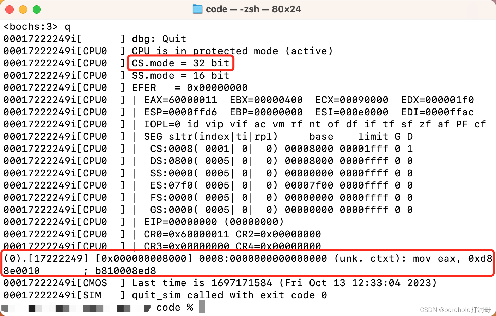

因此，这就需要我们制定Kernel代码，要按照32位指令集来汇编，方法在前面提到过，用`[bits 32]`：

```
[bits 32] ; 这里声明按照32位指令汇编

begin:

mov ax, 00010_00_0b ; 选择2号段，以操作显存
mov ds, ax
; 打印Hello
mov [0x0000], byte 'H'
mov [0x0001], byte 0x0f
; ...
```

重新构建后，就可以正常运行了： 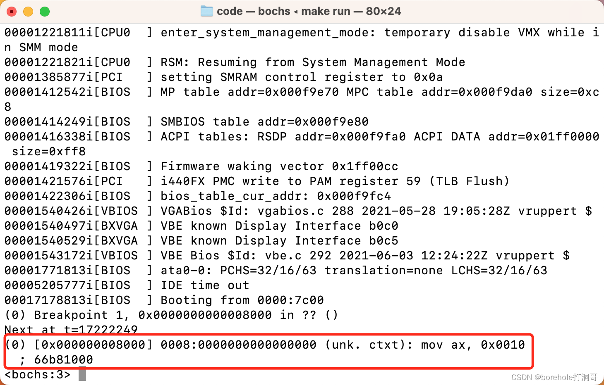

最后的运行效果如下： 

由此，我们在IA-32模式下，成功打印了`Hello`字样。后续我们的Kernel代码都会采用32位指令来编写。

## 调用栈

到目前为止，我们的代码还都是线性的，也就是按照我们书写顺序，逐条来执行的。但事实上真正可用的代码是不可能做到一条线走到底的，一定会有一些封装的子模块，然后互相调用。

就像一个C语言代码，我们不可能做到所有的代码全部挤在`main`函数中吧？一定是说`main`作为入口，然后跟其他函数再进行调用和返回这样的过程。

那么在IA-32汇编中如何完成类似的操作呢？要想实现这个功能，我们大致上需要3个方面的前置知识：

  1. 调用和回跳

  2. 参数传递

  3. 现场保留与现场还原

下面就逐一来介绍。

### 调用和回跳

前面我们介绍过几种跳转指令`jmp`，但它只能做到一次单纯的跳转，却没有办法记录我们是从哪里跳转来的，我们也就没办法做「回跳」。而要想实现类似于函数调用这样的功能，就必须要能够做到回跳。

比较容易想到的办法是，在`jmp`之前，我们先把当前的`cs:eip`的值保存在某一个位置，等后续执行完希望回跳的时候，再根据这里保存的`cs:eip`值跳转回来。

但这样做有两个问题。首先，`cs`和`eip`的值是没法直接读取到的，只能由CPU自己来控制。其次，多数情况下程序不会只做一层跳转和回跳，因为跳转之后还可能会再跳转，然后逐一回跳。所以固定空间记录回跳地址肯定是不可行的，必须要用到栈结构。当发生调用时，我们把当前地址压栈，而需要回跳时再弹栈并跳转，这样才能解决多层跳转问题。

IA-32汇编提供了单独的`call`和`ret`指令，用来解决上述需求。使用`call`指令时，会将当前的`cs:eip`压栈，写到`ss:esp`的位置，然后进行跳转。使用`ret`指令时，会先弹栈，然后再跳转到刚才从栈中弹出的地址，实现回跳功能。

既然用到了栈寄存器，那么肯定是需要我们要划分一片栈区才行。但目前我们划分的两个段都不太适合做栈区，毕竟1号段是指令，2号段是显存。所以看来，我们还是得补一个数据栈，用于存放指令执行过程中产生的临时数据才行。

因此，咱们就再回到MBR，配一个3号段作为数据段：

```
; 3号段
; 基址0x200000，大小4MB
mov [es:0x18], word 0x0400 ; Limit=0x3ff，这是低8位
mov [es:0x1a], word 0x0000 ; Base=0x00200000，这是低16位
mov [es:0x1c], byte 0x0020 ; 这是Base的16~23位
mov [es:0x1d], byte 1_00_1_001_0b ; P=1, DPL=0, S=1, Type=001b, A=0
mov [es:0x1e], byte 1_1_00_0000b  ; G=1, D/B=1, AVL=00, Limit的高4位是0000
mov [es:0x1f], byte 0x00   ; 这是Base的高8位
```

我们这里分配了一个数据段3号段，分了`4MB`的大小，所以我们把`G`调成了`1`，然后`Limit`配了`0x3ff`所以大小是`1024×4KB=4MB`。至于基址，反正现在也有4GB的内存空间了，我们就往高地址一点的位置放，这里选择了`0x200000`。

记得要调整GDT的大小：

```
; 下面是gdt信息的配置（暂且放在0x07f00的位置）
mov ax, 0x07f0
mov es, ax
mov [es:0x00], word 31      ; 因为目前配了4个段，长度为32，所以limit为31
mov [es:0x02], dword 0x7e00 ; GDT配置表的首地址
```

同时注意，要调整一下虚拟机的内存大小：

```
a.img:
  rm -f a.img
  bximage -q -func=create -hd=4096M $@
```

之后，我们就可以在Kernel里去使用了，下面给一个简单的示例供大家参考：

```
[bits 32]

begin:

mov ax, 00011_00_0b ; 选择3号段，数据段
mov ss, ax

mov ax, 00010_00_0b ; 选择2号段，显存段
mov ds, ax

; 压栈
push 0x0f420f41
; 弹栈
pop edx
mov [0x0000], edx ; 写入显存

hlt

times 1024-($-begin) db 0 ; 补满2个扇区
```

如果顺利的话，显存里应该会有`0x41`和`0x42`两个字符（也就是`AB`）： 

我们也可以通过命令查看此时的寄存器情况： 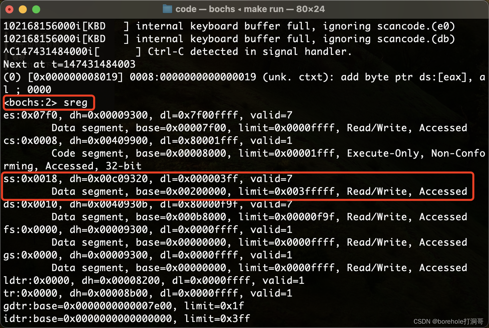

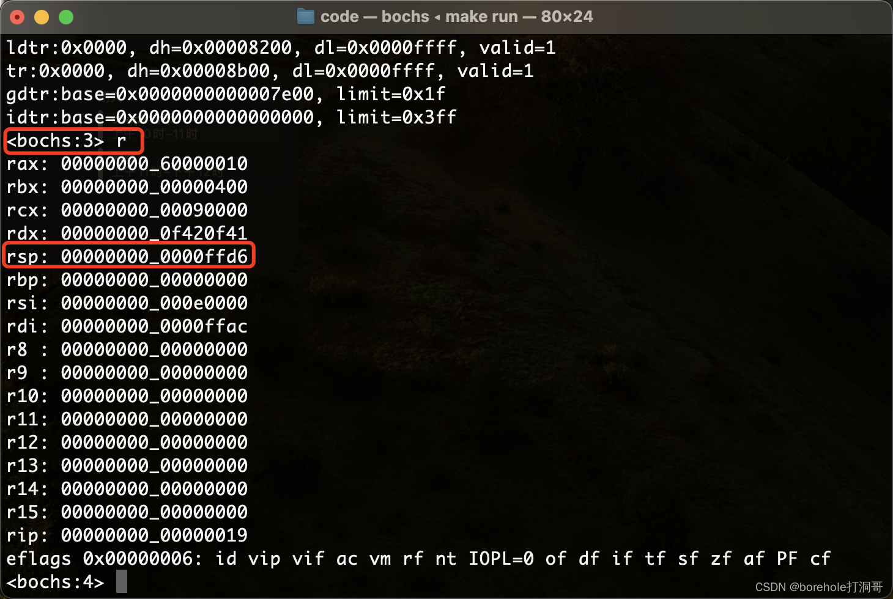

接下来我们就做一个调用和回调的验证。我们在`begin`段中先打印一些字符，然后跳转到`f_test`段中打印一些字符，然后返回回去之后再打印一些字符，验证是否能正常发生跳转。例程如下：

```
[bits 32]

begin:

mov ax, 00011_00_0b ; 选择3号段，数据段
mov ss, ax

mov ax, 00010_00_0b ; 选择2号段，显存段
mov ds, ax

mov [0x0000], byte '_'
mov [0x0001], byte 0x0f
mov [0x0002], byte '1'
mov [0x0003], byte 0x0f
mov [0x0004], byte '_'
mov [0x0005], byte 0x0f

call f_test ; 调用
; 调用后会回跳回来
mov [0x0010], byte '_'
mov [0x0011], byte 0x0f
mov [0x0012], byte '2'
mov [0x0013], byte 0x0f
mov [0x0014], byte '_'
mov [0x0015], byte 0x0f

hlt

f_test:
mov [0x0020], byte '_'
mov [0x0021], byte 0x0f
mov [0x0022], byte 'f'
mov [0x0023], byte 0x0f
mov [0x0024], byte '_'
mov [0x0025], byte 0x0f
ret ; 回跳

times 1024-($-begin) db 0 ; 补满2个扇区
```

如果说`_1_`、`_2_`和`_f_`都能打印出来的话，说明我们的跳转是成功的，结果如下：

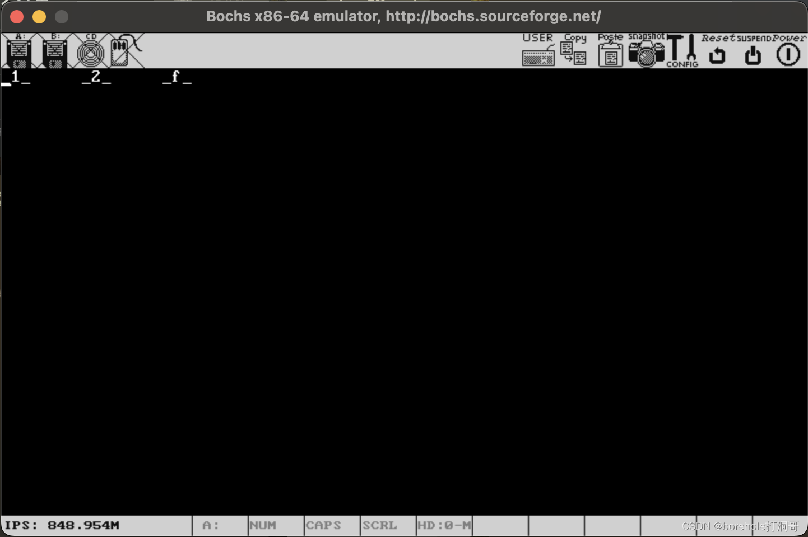

读者也可以自行进行验证，除了可以逐步调试观察寄存器以外，也可以自行尝试增添一些代码来做验证。

上面的工程代码可以参考附件8。

### 参数传递

前面我们介绍了通过`call`和`ret`指令进行调用和回跳，但这样单纯的调用和回跳适用范围是很局限的，多数情况下我们还是需要携带参数。

例如，我们想把「输出到显存」这个需求封装成一个调用过程，而需要输出的数据则通过参数传递的方式来确定。为了简化问题，我们先来实现传递单个字符的情况。

要想传递参数其实很简单，我们只需要在`call`之前，将参数入栈即可，下面给出一个简单的示例（注意，下面的实例是有问题的！！！）：

```
[bits 32]

begin:

mov ax, 00011_00_0b ; 选择3号段，数据段
mov ss, ax
mov eax, 0x1000
mov esp, eax        ; 设置初始栈顶

mov ax, 00010_00_0b ; 选择2号段，显存段
mov ds, ax

; 32位环境下，入栈只能32位，所以先组一下数据
mov al, byte 'A'  ; 字符'A'
mov ah, byte 0x0f ; 黑底白色
push eax          ; 整个32位都入栈（用的时候只解析低16位）
call print

hlt

print:

pop edx ; 出栈，写到edx暂存
mov [0x0000], dx ; 低16位才是有用的数据

ret ; 回跳

times 1024-($-begin) db 0 ; 补满2个扇区
```

如果读者尝试执行一下上面的实例，就会发现两个问题。第一，显存中的数据是不正确的，屏幕无法正常显示；第二，在执行到`ret`指令的时候会异常中断，CPU会复位。

出问题的点就在于对栈的不当使用。我们在希望传参的时候，把参数进行了压栈，而后执行`call`指令的时候，又隐式用到了栈，也就是`cs:eip`（实际上这里因为是近跳，只保存了相对位置）压栈。那么在`print`里面，直接弹栈的应当是回跳地址，而不是参数。

又执行到`ret`的时候，则会再次弹栈作为回跳地址，而此时弹栈的是参数，而不是回跳地址，于是此处触发了异常中断。因此，在`print`内部这样直接弹栈肯定是不正确的做法。

从另一个角度来解释，`'A'`和`0x0f`以及补`0`的16位，这一组32位数据`0x00000f41`是在`begin`中压栈的，我们可以理解为「`begin`这个方法中分配的栈空间」，那么它应当归`begin`去管理和释放。而`print`过程中，只可读取，而不可随意释放（也就是不能弹栈），它只能去管理自己内部分配的栈空间。

那既然不能`pop`，我们又如何在`print`内部找到参数的位置呢？只能通过`ss:esp`来计算了，进入`print`时，栈顶指向的是回跳地址，再向上32位才是参数（注意栈指针是向低地址方向前进的，所以我们找栈内元素需要加上偏移地址走回去）。所以我们应当写作：

```
print:

mov edx, [ss:esp+4] ; esp+4才是参数位置
mov [0x0000], dx    ; 取低16位写入显存

ret ; 回跳，由于没有擅自pop，此时就会将正确的回跳地址弹栈
```

这时再重新运行则可以正常显示： 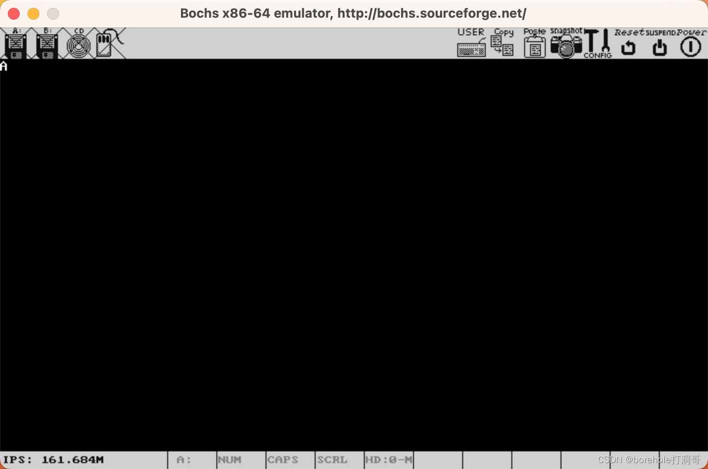

### 全局数据

前面的例程中，我们确实可以通过参数来动态变化需要打印的文字了，但问题是，我们写入显存的位置是固定的，也就是说，不管你调用多少次，显示的文字都只会在第一个位置。

然而我们自然是希望，每当调用一次`print`之后，「光标」可以向后移动，下次再调用的时候就可以在后面的位置继续打印了。

要想实现这种功能，咱们就需要一个专门的内存空间，来保存当前的光标位置，每当我们进行一次`print`以后，就把光标向后移动一次。那这个内存空间应当是全局的，不能随着某次调用就释放或清零，所以放在栈区就不合适了。刚才我们把初始栈顶设为了`0x1000`，那么`0x200000~0x201000`的位置就留给栈了，咱们再在数据段重新找一个地方存光标数据，比如就放在`0x202000`的位置。修改后的例程如下：

```
[bits 32]

begin:

mov ax, 00011_00_0b ; 选择3号段，数据段
mov ss, ax
mov es, ax      ; es也置为3号段
mov eax, 0x1000
mov esp, eax    ; 设置初始栈顶

mov ax, 00010_00_0b ; 选择2号段，显存段
mov ds, ax

; 初始化光标信息
mov [es:0x2000], dword 0 ; 初始化为0

; 32位环境下，入栈只能32位，所以先组一下数据
mov al, byte 'H'  ; 字符'H'
mov ah, byte 0x0f ; 黑底白色
push eax          ; 整个32位都入栈（用的时候只解析低16位）
call print

; 再打印一个字符
mov al, byte 'i'  ; 字符'i'
mov ah, byte 0x0f ; 黑底白色
push eax          
call print

; 再打印一个字符
mov al, byte '!'  ; 字符'!'
mov ah, byte 0x0f ; 黑底白色
push eax          
call print

hlt

print:
mov edx, [ss:esp+4] ; esp+4才是参数位置
; 获取光标信息作为偏移地址
mov ebx, [es:0x2000]
; 注意，此时ebx中的是字符数，而不是内存偏移量，因为一个字符要占2字节的显存（数据+颜色）
sal ebx, 1       ; 左移一位，相当于乘以2，算出实际的内存偏移量
mov [ebx], dx    ; 取低16位写入显存
; 改变光标信息
inc dword [es:0x2000]  ; 自增

ret ; 回跳

times 1024-($-begin) db 0 ; 补满2个扇区
```

一些需要注意的细节已经在代码注释中标注，希望读者仔细阅读，此处不再赘述。运行结果如下： 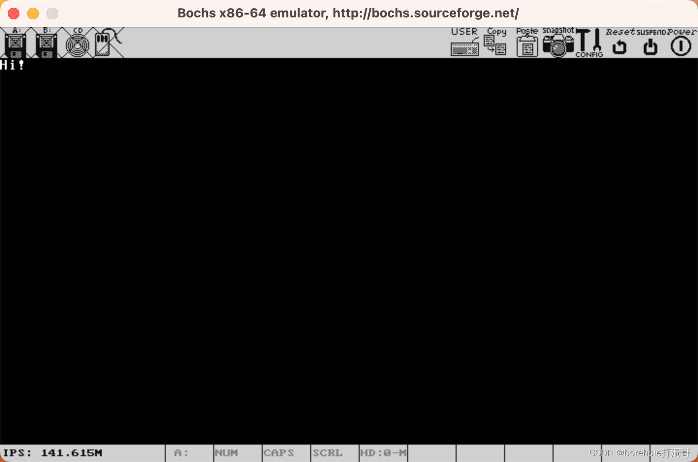

### 现场记录与还原

不知道大家有没有发现一个问题，通用寄存器我们在每一个调用过程中都可能用到，但是，当发生调用以后，寄存器就可能被调用的过程改变。换句话说，每次`call`一个过程以后，此时的寄存器值是不确定的，因为可能会被这个过程改乱。

所以这是一个很严重的问题，虽然`call`和`ret`可以让指令地址回跳，但是却无法让寄存器数据还原。解决的办法也是类似的，就是对于一个调用的过程来说，如果要使用某个寄存器，那么就事先「记录」以下这个寄存器原本的值，等到用过以后，再把这个寄存器进行「还原」。我们将这个动作称为「现场记录」和「现场还原」。

首先我先给一个例子来演示一下，如果不做现场记录和还原会发生什么：

```
[bits 32]

begin:

mov ax, 00011_00_0b ; 选择3号段，数据段
mov ss, ax
mov es, ax      ; es也置为3号段
mov eax, 0x1000
mov esp, eax    ; 设置初始栈顶

mov ax, 00010_00_0b ; 选择2号段，显存段
mov ds, ax

; 初始化光标信息
mov [es:0x2000], dword 0 ; 初始化为0

; 打印黑底白字'H'
mov al, byte 'H'  ; 字符'H'
mov ah, byte 0x0f ; 黑底白色
push eax          
call print

; 再打印个黑底白字'i'
mov al, byte 'i' ; 字符'i'
; 照理说ah跟上面一样，所以不用变
push eax
call print

hlt

print: ; 逻辑不变，这里把edx平替为eax
mov eax, [ss:esp+4] ; esp+4才是参数位置
; 获取光标信息作为偏移地址
mov ebx, [es:0x2000]
; 注意，此时ebx中的是字符数，而不是内存偏移量，因为一个字符要占2字节的显存（数据+颜色）
sal ebx, 1       ; 左移一位，相当于乘以2，算出实际的内存偏移量
mov [ebx], ax    ; 取低16位写入显存
; 改变光标信息
inc dword [es:0x2000]  ; 自增

ret ; 回跳

times 1024-($-begin) db 0 ; 补满2个扇区
```

运行后会发现，`i`字符没有正常打印： 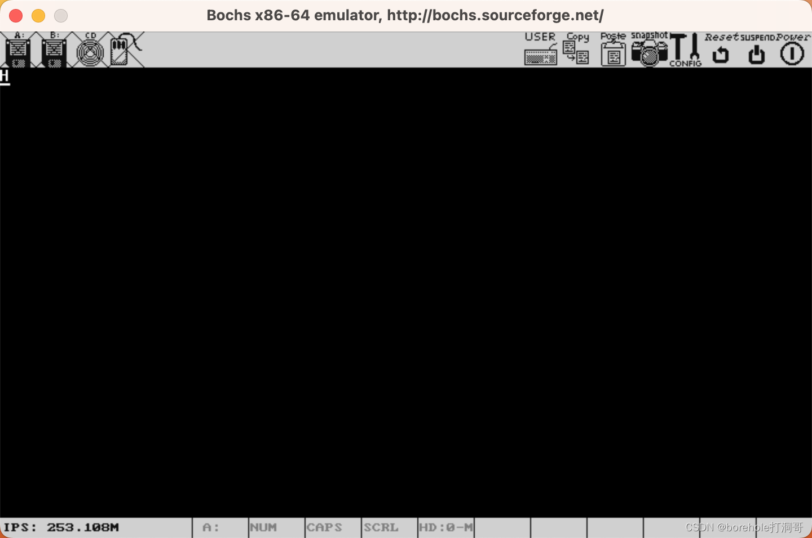

我们观察此时的寄存器可以看到，`eax`的值是不正确的： 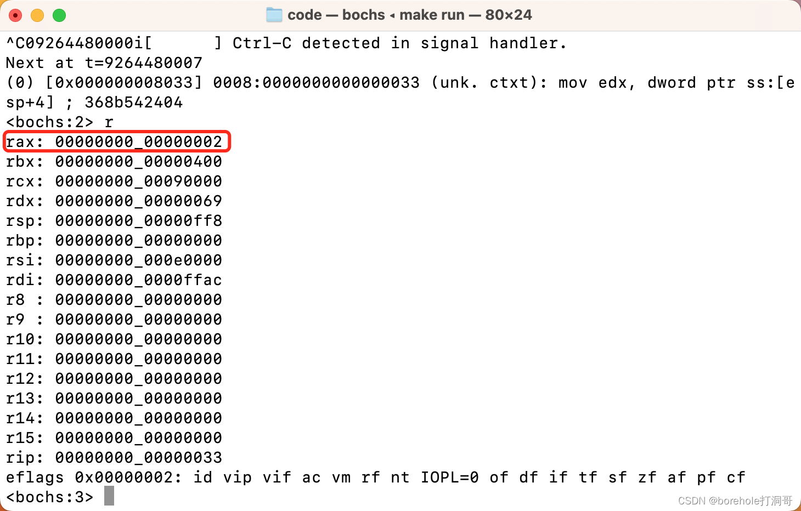

这就是因为，`print`过程中修改了`eax`的值，导致回跳以后，寄存器的值没有还原。

所以，对于需要进行回跳的过程而言，做现场记录和还原是必要的，原则就是只要这个过程用到了的寄存器，就需要先进行现场记录。而在回跳之前，要把所有记录的进行还原。

修改后的`print`代码如下：

```
print: 
; 现场记录，由于过程用到了eax和edx，所以讲这两个寄存器的值入栈
push eax
push edx
; 下面是实际逻辑
mov edx, [ss:esp+12] ; 注意此时，因为现场记录又占用了2个栈空间，因此esp上移3个32位才是参数
; 获取光标信息作为偏移地址
mov eax, [es:0x2000]
sal eax, 1       ; 左移一位，相当于乘以2，算出实际的内存偏移量
mov [eax], dx    ; 取低16位写入显存
; 改变光标信息
inc dword [es:0x2000]  ; 自增
; 现场还原
pop edx
pop eax
ret ; 回跳
```

上面的例程又暴露出另一个问题，就是说因为现场记录这件事需要用到栈空间，因此会使`esp`进行偏移，后续非常不利于我们计算出原本的栈顶位置以及寻找参数。因此，推荐的做法是，在过程一开始的时候，就先记录一下此时的栈顶（也就是`esp`的值），然后再去操作栈。这样如果需要找到参数，也就不用再去计算当前的`esp`偏移量，而是直接用记录好的栈顶去计算。

原本我们是靠入栈来记录各种数据的，但现在咱们就是要记录栈顶呀，单纯入栈的话，`esp`还是会跑掉，所以它得是个固定位置才行。有的读者可能会想到，那就跟光标信息一样，通过固定的全局数据来存储。没错，这确实是一种可行的方案，但毕竟要访问内存，对于这种高频操作来说效率比较低，不过不用担心，Intel给我们提供了一个专门的寄存器来做这件事，这就是`ebp`寄存器。

`ebp`寄存器也是一种通用寄存器，你当然可以把它用到任何的用途上，但对于这种含有调用栈的过程来说，我们通常是用它来记录当前栈顶的。因此，在每个调用栈开始时，我们都需要记录这个栈顶，并且把它写到`ebp`中，等调用结束时，再把上一个栈顶还原给`ebp`，然后再进行回跳，以保证`ebp`永远都指向**当前**栈的栈顶。

完善后的代码如下：

```
print: 
; 现场记录
push ebp ; 栈顶记录（上一个调用栈的栈顶）
mov ebp, esp ; 用ebp记录现在的栈顶
; 通用寄存器的记录
push eax
push edx
; 下面是实际逻辑
mov edx, [ss:ebp+8] ; 现在再寻找参数时，就用ebp来计算了，ebp前有一个记录的上一个栈顶，以及一个回跳地址，所以固定偏移2个32位就是参数位置，不会随着入栈而跑偏
; 获取光标信息作为偏移地址
mov eax, [es:0x2000]
sal eax, 1       ; 左移一位，相当于乘以2，算出实际的内存偏移量
mov [eax], dx    ; 取低16位写入显存
; 改变光标信息
inc dword [es:0x2000]  ; 自增
; 现场还原
pop edx
pop eax
pop ebp ; 还原到之前调用栈的栈顶
ret ; 回跳
```

既然`ebp`用来记录栈顶了，因此我们在`begin`中配置好栈空间以后，也应当记录一下初始情况的栈顶，将它的功能利用起来：

```
begin:

mov ax, 00011_00_0b ; 选择3号段，数据段
mov ss, ax

mov eax, 0x1000
mov esp, eax    ; 设置初始栈顶
mov ebp, eax    ; ebp也记录初始栈顶
```

有的读者可能会疑惑，从`begin`跳转到`print`的时候，我们做了一系列现场记录的事情，但从MBR跳转到`begin`的时候为什么没有做？这个请大家一定要理解做现场记录的目的，只有需要回跳的过程，才有必要记录一下上一个调用时的现场。而`begin`咱们是通过MBR最后的`jmp`跳转过来的，MBR只是做单纯的引导，等执行到Kernel以后，就再也不会跳转回MBR了，因此`begin`可以视为这个操作系统的「主函数」，不会再回跳，自然也就没有必要记录上一级的现场了。

### 栈帧

另一个有意思的事情是，如果整个调用栈都做了这样的栈顶的记录的话，我们是可以通过当前栈空间的情况，来依次还原出调用栈的。下面我们给一个用例，不做逻辑功能，仅仅做栈调用的演示：

```
begin:

mov ax, 00011_00_0b ; 选择3号段，数据段
mov ss, ax

mov eax, 0x1000
mov esp, eax    ; 设置初始栈顶
mov ebp, eax

call f1
hlt

f1:
push ebp
mov ebp, esp

call f2 ; f1中调用f2

pop ebp
ret

f2:
push ebp
mov ebp, esp

pop ebp
ret
```

我们执行到`f2`的时候，看一下此时的栈空间情况： 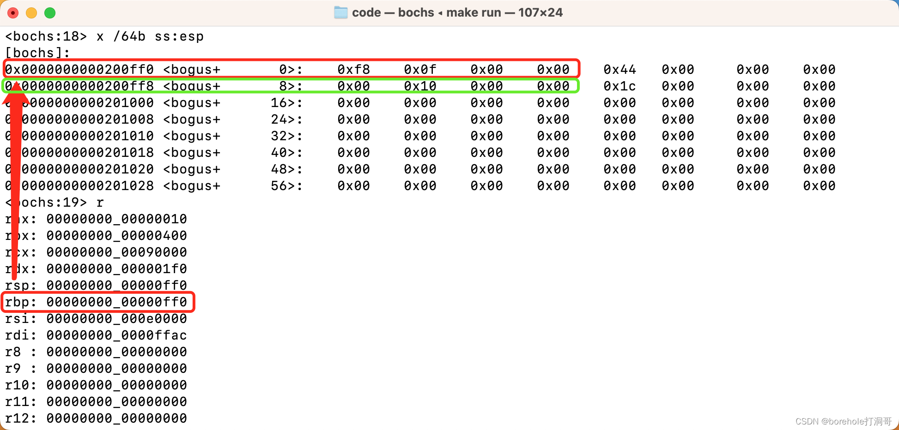

此时的`ebp`是`0x0ff0`，指向当前(`f2`)的栈顶，我们找到`ss:0x0ff0`，也就是`0x200ff0`的位置，可以看到这里存放的就是上一个调用栈(`f1`)的栈顶`0x0ff8`。再查看`ss:0x0ff8`的位置，则可以看到再上一个调用栈(`begin`)的栈顶`0x1000`，正好对应我们指定的初始化栈顶位置。

在调用栈中的每次伴随记录栈顶的`call`过程，我们称其为一个「栈帧(stack frame)」，在执行过程中，我们随时都可以根据`ebp`和栈内存的数据情况，还原出整个调用栈来，通过每次栈顶的记录情况，来判断栈空间的归属情况（判断哪片空间是哪个栈帧使用的）。

上面的工程代码可以参考附件9。

## 开始使用C语言

从这一节开始，我们就要研究如何将我们的Kernel与C语言联动了。大家先回忆一下之前我们提到的，汇编语言也并不是计算机可以直接识别的代码，必须要经过汇编器来进行翻译，变成计算机可以直接识别的机器指令才能够执行。

同理，C语言相比汇编是更上一层的语言了，更加不可能被计算机直接识别和执行，它也需要先被转换成机器指令才行。我们把将C语言源代码转换成机器指令的过程称为「编译(compile)」。

但C语言跟汇编语言还不太一样，毕竟汇编指令和机器指令有着一一对应的关系，因此汇编器的工作相对简单许多。而编译器就不能是做简单的映射了，而是要理解高级语义，然后输出成能够实现相同功能的机器指令。有关编译原理的详细内容不作为本文的重点，因此也就不过多介绍了。

用于编译的工具我们称之为「编译器(compiler)」，而C语言的编译器就是「C Compiler」，简写为「cc」。所以接下来，我们需要安装cc，市面上有很多版本的cc，这里我们为了方便起见，就使用GNU工具集中的gcc。下面分别介绍在Windows和MacOS上安装gcc的方法：

### 安装gcc

需要说明的一点是，无论是Mac还是Windows PC，都存在AMD64架构的和ARM架构的。Intel和AMD芯片是AMD64环境，我们在上面默认安装的gcc就是AMD64版本的。但对于ARM架构的Apple Silicon或者骁龙芯片的环境来说，默认安装的gcc是aarch-64版本的。

但因为咱们的工程（包括bochs环境）都是模拟AMD64架构的，因此aarch-64版本的gcc是不能编译AMD64指令的（当然也不能编译IA-32指令）。因此，对于ARM环境，我们不能使用默认的gcc，而是要使用专门编译AMD64指令的gcc，这个工具称为`x86_64-elf-gcc`。其中的`x86_64-elf`前缀就是针对AMD64架构的交叉编译环境，保证其输出是AMD64指令集的。当然，除了`gcc`本身，其他的GNU工具集都有交叉编译版本，例如`x86_64-elf-as`、`x86_64-elf-ld`、`x86_64-elf-objcopy`等。

当然，即便你本身就是AMD64环境，也同样可以安装`x86_64-elf`前缀的工具，不影响使用的。另外一点就是对于macOS来说，默认的cc是`clang`，并且为了兼容，它把所有`gcc`命令都进行了映射，也就是说，我们直接输入`gcc`其实是使用了`clang`，所以会比较麻烦，但如果使用`x86_64-elf-gcc`则不会出现这个问题。因此为了统一起见，后面的教程都以交叉编译环境为例，保证读者在所有的环境下都可用。

#### 在macOS上安装gcc

Mac上我们同样是使用HomeBrew来完成安装。我们这里将需要用到的两个工具集一次性安装：

```
brew install x86_64-elf-gcc x86_64-elf-gdb
```

安装完成后可以通过以下命令验证：

```
x86_64-elf-gcc -v
```

#### 在Windows上安装gcc

在Windows上我们需要通过MinGW工具来安装。打开MinGW的安装器，分别找到`mingw32-gcc`和`mingw32-gdb`，然后安装即可，详情可以查看前面安装`make`工具的方法。

除了使用图形化工具以外，还可以通过控制台指令来安装：

```
mingw-get install gcc gdb
```

需要注意，即便是ARM架构的Windows，通过MinGW安装的工具也是AMD-64架构的，所以大家不用担心。

安装完毕后可以通过`mingw32-gcc -v`来判断是否安装成功。为了跟本文的命令相匹配，这里建议大家把所有`mingw32-`前缀都换成`x86_64-elf-`前缀。当然，不改也可以，后面工程中出现的指令（包括`makefile`中的指令）大家记得更换为对应名称即可。

### C源码编译后

我们先来写一个简单的C程序，注意，此时的代码我们是要加载到Kernel里的，这是内核态的部分，还并没有任何OS来支持，所以所有的C语言库都是没法用的，是需要我们自己来实现的。因此，就先不用吧，空着跑一下：

```c
// entry.c
void Entry() {
  int a = 5;
  int b = a;
}
```

如何把这个C源码加到我们的Kernel里呢？这是个问题，因为直接编译的话会单独出一个文件来，但咱肯定是要打包到`a.img`里，并且还要在`begin`里去`call`才能调用到这里的。

那怎么办？别急，我们一步一步来。想想，如果能把C代码变成汇编的话，我们直接把汇编指令粘贴到Kernel中，是不是也可以实现诉求？虽然有点蠢，但是先试试吧。

用以下指令可以把C代码编译成汇编指令：

```
x86_64-elf-gcc -S -masm=intel -m32 -march=i386 entry.c -o entry.gas
```

解释一下上面的指令，`x86_64-elf-gcc`是C编译器，`-S`表示将其编译为汇编指令（而不是机器指令），`-masm=intel`表示使用Inte形式l汇编（如果不指定的话，则会默认编译成AT&T形式汇编）。`-m32`表示要编译为32位指令集（默认会编译为64位）。`-march=i386`表示要编译为386指令（也就是IA-32指令）。

我们输出的结果是`gas`格式，注意这里`gas`不是气体的意思哈，这个词要分开读，`g`就是GNU工具集的前缀，`as`是`assambly`的前两个字母，所以`gas`就是「GNU的汇编格式」。

由于编译器版本和环境默认配置的不同，得到的`gas`文件可能也存在区别，大家不用太在意，核心内容是大差不差的：

```
	.section	__TEXT,__text,regular,pure_instructions
	.build_version macos, 13, 0	sdk_version 14, 0
	.intel_syntax noprefix
	.globl	_Entry                          ## -- Begin function Entry
	.p2align	4, 0x90
_Entry:                                 ## @Entry
	.cfi_startproc
## %bb.0:
	push	ebp
	.cfi_def_cfa_offset 8
	.cfi_offset ebp, -8
	mov	ebp, esp
	.cfi_def_cfa_register ebp
	sub	esp, 8
	mov	dword ptr [ebp - 4], 5
	mov	eax, dword ptr [ebp - 4]
	mov	dword ptr [ebp - 8], eax
	add	esp, 8
	pop	ebp
	ret
	.cfi_endproc
                                        ## -- End function
.subsections_via_symbols
```

我知道这一堆东西有点乱，因为是`gas`，所以出现了很多`gas`专用的伪指令语法，不过没关系，咱们将这些去掉，只看有用的指令部分：

```
_Entry: 
	push ebp
	mov	ebp, esp
	sub	esp, 8
	mov	dword ptr [ebp - 4], 5
	mov	eax, dword ptr [ebp - 4]
	mov	dword ptr [ebp - 8], eax
```

这样清晰很多，虽然中间出现了`dword ptr`这种`gas`语法，但相信大家应该能看得懂，我们也可以手动把他改写成`nasm`汇编：

```
_Entry: 
  push ebp
  mov	ebp, esp
  sub	esp, 8
  mov	dword [ebp - 4], 5
  mov	eax, dword [ebp - 4]
  mov	dword [ebp - 8], eax
```

可以看到，C语言函数编译后，遵从了我们前面介绍的栈帧和现场记录规则。其中的`ebp - 4`和`ebp -8`分别对应了局部变量`a`和`b`。把这玩意复制到我们的Kernel中，再在`begin`里进行`call _Entry`就好了吧。

可是，我们不可能真的每次都手动这样去复制汇编代码吧？还是要找到真正的构建工程的方法才行。

### 链接

所谓的链接，就是把多个文件组合起来的过程。举例来说，我们在`entry.c`中实现了`Entry()`函数，但是希望在`kernel.nas`中调用，那么，就需要把这两个文件进行链接，成为一个完整的二进制。

就以前面的工程项目为例，我们在`entry.c`中实现了`Entry()`函数，那么首先，我们需要把`entry.c`转换成待链接文件，这种文件格式通常以`.o`结尾。它是一种中间态文件，并不能像二进制那样直接执行，同时也不能像源代码那样可视化阅读。在`.o`文件中除了有这个文件的过程指令（比如`Entry`函数编译成的机器指令）以外，还会有很多额外的信息，比如说这个文件中含有哪些标签，需要使用额外的哪些标签之类的。之后我们收集所有的`.o`之后，再通过链接成为最终的二进制。

把C代码转换成`.o`文件的指令如下：

```
x86_64-elf-gcc -c -m32 -march=i386 entry.c -o entry.o
```

注意这里的`-c`参数，表示把源文件编译为待链接的文件。编译结束后我们得到了`entry.o`。

那接下来的问题就是，如何把`kernel.nas`也转换成`.o`文件呢？我们前面一直都是直接把`nas`转换成二进制的，但现在由于要和`entry.o`进行联动，我们就不得不多一步，先把`kernal.nas`转换成`kernel.o`，然后再去参与链接。

因此，我们需要对`kernel.nas`做一些改造，让它变得可链接。改造后的代码如下：

```
[bits 32]
section .text ; 这里要配合.o文件的要求，指定为.text段

begin:
	mov ax, 00011_00_0b 
	mov ss, ax
	mov eax, 0x1000
	mov esp, eax    
	mov ebp, eax    

	extern Entry ; 声明外部含有一个Entry的标签，链接时会检测
	call Entry

	hlt
```

代码不长，但需要解释的地方还挺多的，我们一个一个来。

首先，要注意因为现在`kernel.nas`不是直接变成二进制了，而是会参与链接，因此，以前文件末尾的`times 1024-($-begin) db 0`是一定要去掉的，否则跳转后的位置指令会变成`0x0000`。

其次，我们在文件首增加的`section .text`是用于指定当前这个代码属于哪个分段，分段这个概念在单文件下没有什么作用，但是如果用于链接，那就需要指定给对应的段。这里由于我们要跟C语言联动，所以要配合C链接时的规范，因此这里要指定为`.text`段。至于这个名称大家不用过于纠结，只是因为C语言这么规定了，我们配合就好。

最后，`extern Entry`则表示，外部存在一个名为`Entry`的标签，稍后链接的时候才会确定它具体表示什么地址。有了这样的声明以后就可以`call Entry`了。

说到这里相信读者也能够明白，以链接模式来处理文件时，这些标签的地址都是不能确定的，只能暂时作为一个标记，后续所有`.o`文件齐全的时候，「链接」过程才能确定这些标签表示的具体地址，同时如果有不存在的标签也会在这个阶段检测出并报错。

处理好源文件，我们就可以将它编译成`.o`文件了（注意这里的措辞，我用了「编译」而不是「汇编」，因为此时已经不是简单的汇编转机器码这么简单的工作了），命令如下：

```
nasm kernel.nas -f elf -o kernel.o
```

其中`-f elf`参数表示以链接方式处理。

现在我们已经收集齐了`entry.o`和`kernel.o`，可以进行链接了。由于`kernel`这个名称目前已经代指`kernel.nas`文件直接处理出的东西了，所以我们将这个步骤的输出重新命名为`kernel_final`。链接过程需要用到的工具叫做「链接器(linker)」，输出的结果通常以`.out`为后缀。指令如下：

```
x86_64-elf-ld -m elf_i386 kernel.o entry.o -o kernel_final.out
```

其中`x86_64-elf-ld`是链接器工具，`-m elf_i386`指定按IA-32架构方式进行处理。链接之后我们得到了`kernel_final.out`。

**有一个非常重要的点！**，由于我们的MBR到Kernel的步骤是通过直接的`jmp`跳转指令来的，MBR并没有参与链接，因此，我们必须保证，`begin`这个标签正好是MBR的跳转位置。换句话说，在`kernel_final.out`中，`begin`必须是**第一个**过程，至于其他的过程，由于在内部都是通过`call`跳转的，因此顺序无所谓。那么，如何保证`begin`一定是被放到第一个呢？这取决于我们传给链接器的参数顺序，只要保证`kernel.o`是第一个入参即可。后续工程可能会加入更多的`.o`，但是一定要记住，`kernel.o`**必须是第一个**！

其实此时的`kernel_final.out`已经是完整的机器指令了，但这个格式是用于OS调度的，它含有很多环境和配置信息方便OS来处理。但此时咱们并不是要把它当应用程序来处理，而是作为内核使用的，所以我们还差最后一步，就是把里面核心的指令部分提取出来，去掉冗余信息，成为一个纯粹的内核程序二进制。对于`.out`文件来说，内部结构仍然是分为很多个模块的，而我们只需要其中指令的那一部分，所以这里使用一个对象拷贝工具，来把其中的指令模块提取出来，命令如下：

```
x86_64-elf-objcopy -I elf32-i386 -S -R ".eh_frame" -R ".comment" -O binary kernel_final.out kernel_final.bin
```

其中`x86_64-elf-objcopy`是对象提取工具。`-I elf32-i386`表示用IA-32架构方式处理。`-S`表示只提取其中的指令部分。`-R ".eh_frame" -R ".comment"`则是除去其中不必要的数据段。`binary`表示以纯粹二进制形式输出。最终我们可以得到`kernel_final.bin`，这就是完整的内核二进制了。

### 试试运行

因为这一部分的命令突然变多了，所以，笔者整理了一份`makefile`供大家参考（暂时没有用太多makefile技巧，写的比较LOW，后续会重新整理的）：

```
.PHONY: all
all: sys

.PHONY: run
run: bochsrc sys
	bochs -qf bochsrc

a.img:
	rm -f a.img
	bximage -q -func=create -hd=4096M $@

sys: a.img mbr.bin kernel_final.bin
	dd if=mbr.bin of=a.img conv=notrunc
	dd if=kernel_final.bin of=a.img bs=512 seek=1 conv=notrunc

mbr.bin: mbr.nas
	nasm mbr.nas -o mbr.bin

kernel.o: kernel.nas
	nasm kernel.nas -f elf -o kernel.o

entry.o: entry.c
	x86_64-elf-gcc -c -m32 -march=i386 entry.c -o entry.o

kernel_final.out: kernel.o entry.o
	x86_64-elf-ld -m elf_i386 kernel.o entry.o -o kernel_final.out

kernel_final.bin: kernel_final.out
	x86_64-elf-objcopy -I elf32-i386 -S -R ".eh_frame" -R ".comment" -O binary kernel_final.out kernel_final.bin

.PHONY: clean
clean:
	-rm -f .DS_Store
	-rm -f *.bin 
	-rm -f *.img
	-rm -f *.o
	-rm -f *.out
```

让我们利用这个`makefile`来构建并运行一下，看看程序能否正常进入`Entry()`函数中。我们在`0x8000`处打断点，然后逐条指令运行，就可以观察到进入`Entry()`前后的情况： 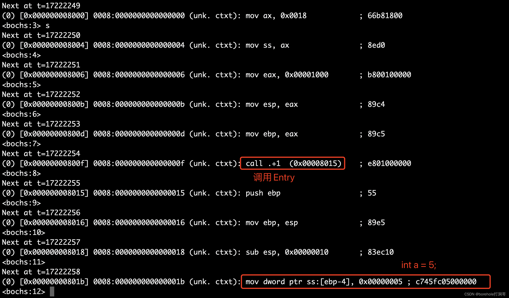

大功告成！咱们已经成功从裸机启动开始，执行到一个C程序了！当然这仅仅是开始，我们还有很多细节要掌握的，比如如何在C语言中打印数据呢？后面章节会继续讨论的。

上面的工程代码可以参考附件10。

## Hello, C World!

我们虽然已经成功驱动C语言代码了，但仅仅是通过`bochs`断点来看看出入栈那也未免太无聊了，咱们肯定是希望能用C语言来写功能的。

我相信很多读者应该跟我一样，第一反应就是写个`Hello, World!`，但当前我们在内核态上运行程序，这个过程会复杂很多。标准库中的`printf`函数是要依赖OS所提供的`stdout`接口的，只有这样程序才能知道要把需要输出的数据送到哪里，OS也才能通过控制台来显式。而现在咱们什么都没，所以只能自己来实现文字输出。

虽然没人给我们提供`stdout`，但咱们是在内核态呀！是可以直接写显存的呀！咱们直接给显存里写数据，不就可以达到输出字符的功能了吗？

思路有了，接下来我们需要确定细节。之前已经尝试了局部变量，编译器会按照栈空间的方式来处理，也就是取决于进入函数之前`ss`和`esp`的值。可现在咱们要操作显存，这是一个固定的内存地址，这如何操作呢？我们来做个实验，看看下面的程序会如何编译：

```c
void Entry() {
  unsigned char *p = (unsigned char *)0xb8000; // 尝试定义一个指针
  *p = 0x40; // 看看这个值究竟会写到哪里 
}
```

上面我们定义了一个指针，值是`0xb8000`，那么这样做能否让他真的指向现存呢？咱们用`-S`参数来把它编译成汇编看看结果（省略无关内容）：

```
_Entry:                                 
  push	ebp
  mov	ebp, esp
  push	eax
  mov	eax, 753664
  mov	dword ptr [ebp - 4], eax
  mov	eax, dword ptr [ebp - 4]
  mov	byte ptr [eax], 64 ; 重点关注这一行
  add	esp, 4
  pop	ebp
  ret
```

可以看到，`ebp - 4`就是这个变量`p`的位置，由于是栈寄存器，所以默认取的是`ss`段，也就是说`p`的实际地址是`ss:ebp-4`。我们之前配置好了`ss`寄存器，所以这里没有问题。

但后面，解指针操作`*p = 0x40`这一步，我们看到首先从`ebp-4`的位置读取数据到`eax`中，然后直接操作`eax`取址来写数据。但`eax`是通用寄存器，它的默认段是`ds`段，也就是说，`mov byte [eax], 64`其实是`mov byte [ds:eax], 64`。

因此我们得出结论：**指针的值，是ds段对应的偏移地址**，而并非实际的物理地址。

了解了这个就好办了，在进入`Entry`函数之前，我们只要把`ds`配置成显存段即可，这样进入`Entry`后，指针的值就是显存段的偏移地址。

```
[bits 32]
section .text 

begin:

mov ax, 00011_00_0b ; 选择3号段，数据段
mov ss, ax
mov eax, 0x1000
mov esp, eax    ; 设置初始栈顶
mov ebp, eax    ; ebp也记录初始栈顶

; 把ds配成显存段
mov ax, 00010_00_0b
mov ds, ax
; 进入Entry后，指针的偏移地址就是相对0xb8000的

extern Entry
call Entry

hlt
```

然后我们尝试在`Entry()`中操作显存：

```c
void Entry() {
  unsigned char *p = (unsigned char *)0x0; // 指向显存首地址
  *p = 'H';
  p[1] = 0x0f; // 黑底白色
  p[2] = 'i';
  p[3] = 0x0f;
}
```

咱们构建并运行一下，看看效果： 

没问题！确实可以这么搞。

不过先别急着去封装`putchar`，这样做是有个潜在问题的，请看下面示例：

```c
void Entry() {
  int a = 5;
  int *p = &a;
  *p = 10; // 这一步会不会有问题呢？
}
```

既然我们已经知道，指针的值是相对于`ds`段的偏移地址了，那我们对局部变量取地址取到的是什么？是`ds`段的还是`ss`段的呢？还是，编译成汇编看看结果就很清晰了：

```
_Entry: 
  push	ebp
  mov	ebp, esp
  sub	esp, 8
  mov	dword ptr [ebp - 4], 5   ; int a = 5;
  lea	eax, [ebp - 4]           ; 注意看这一句
  mov	dword ptr [ebp - 8], eax
  mov	eax, dword ptr [ebp - 8]
  mov	dword ptr [eax], 10		 ; 解指针时仍然是用ds:eax
  add	esp, 8
  pop	ebp
  ret
```

再次解释一下这里的`lea`命令，这个就是取地址命令，也就是取`[ebp-4]`的地址，其实等价于我们理解的`mov eax, ebp-4`，但是因为没有这个汇编指令，所以必须写成`lea eax, [ebp-4]`。而因为这里是`ebp`，所以它匹配的段是`ss`。

那么这样就出现了一个很严重的问题，我们取地址的时候是取的`ss`段的偏移地址，但是解指针的时候却是`ds`段的偏移地址。这显然是要出大问题的呀！

为什么会发生这样的现象？其实很容易理解，因为对于C语言来说，我们通常认为，能走到C语言的过程中开始，就应当使用上层程序语言的思路来进行开发了，而不应该到处还在纠结这些底层实现。所以在C语言的世界观中，「栈段」和「数据段」应该是一起的才对，至少在C的语义层面，不应该区分它。

既然如此，我们直接把`ds`给成显存段就是一个不合理的操作了，我们应当按照C的标准要求，将`ds`和`ss`保持一致才对，这样无论是栈空间还是指针的值，都在同一个段中。

可如果我么把`ds`也配成数据段的话，写显存的需求要怎么办呢？这个问题，咱们还是要回归到C语言的语义本身上来。如果说你并不理解底层显存这件事的话，让你用C语言输出一个字符，你会首先想到什么？肯定是通过`putchar`函数来完成。而至于这个函数内部怎么实现的，会把这个数据写到哪里，那应该是OS操心的事。

因此，解决方案也就很清晰了，我们要实现类似于`putchar`的函数来专门进行输出，而不是直接使用显存的偏移地址。不过`putchar`还存在光标管理、换行等问题，我们稍后再来实现，现在先简单针对「写显存」这件事。

既然在C语言中没法制定段寄存器，那么在制定段写数据的这件事就只能由汇编来实现了，因此，咱们在工程中新建一个文件`asm_func.nas`，专门用来实现一些C语言无法直接实现的功能，同样地，它也需要参与Kernel的链接过程。

首先，咱们就先做一个最简单的，实现在显存段的制定地址写一个制定的数据这样一个功能，函数原型是：

```c
void SetVMem(long addr, unsigned char data); // 在显存的addr偏移地址出写入data数据
```

由于`addr`是表示偏移地址，在32位环境下，偏移地址应该也是32位数据类型，所以这里写了`long`。（C语言32位环境下`long`类型是32位的。）

我们之前已经实现过单个参数传递的调用过程，我们知道在`call`之前会把参数压栈，过程中再通过`ebp+8`去找到参数。多个参数则是同样的做法，只不过要进行多次压栈。而对于C语言的函数调用有一个规定，就是按照函数声明的**逆序**进行压栈。对于上面的函数来说就是会先压栈`data`，然后压栈`addr`，然后再`call SetVMem`这样。

另一个要注意的问题是，虽然`data`是`unsigned char`类型，只占一个字节，但由于`push`操作是匹配指令集位宽的，也就是32位，所以它在栈中实际上也会占4个字节的大小。

这样就明确了，`ebp+8`就是`addr`，`ebp+12`就是`data`（这里注意，先压栈的在上面，`data`是先压栈的，所以它在更高地址的位置）。我们就可以来实现`SetVMem`了，下面是`asm_func.nas`的内容：

```
[bits 32]
section .text 

global SetVMem ; 告诉链接器下面这个标签是外部可用的
SetVMem:
    ; 现场记录
    push ebp
    mov ebp, esp
    ; 过程中用到的寄存器都要先记录
    push ebx
    push ecx
    push edx

    mov bx, es ; 用bx记录原本的es，用于后续恢复现场（这里是因为寄存器还够用，如果不够用的话就还是要压栈）
    ; 把es配成显存段
    mov dx, 00010_00_0b
    mov es, dx
    ; 通过参数找到addr和data
    mov edx, [ebp+8]  ; addr
    mov ecx, [ebp+12] ; data
    ; 通过es加偏移地址来操作显存
    mov [es:edx], cl  ; 由于data是1字节的，所以其实只有cl是有效数据

    ; 现场还原
    mov es, bx
    pop edx
    pop ecx
    pop ebx
    mov esp, ebp
    pop ebp
    ; 回跳
    ret
```

然后我们也将`kernal.nas`中的段寄存器重新配置：

    
```
[bits 32]
section .text 

begin:

mov ax, 00011_00_0b ; 选择3号段，数据段
mov ss, ax
; ds要跟ss一致
mov ds, ax
; es也初始化为数据段（防止后续出问题，先初始化）
mov es, ax

; 初始化栈
mov eax, 0x1000
mov esp, eax    ; 设置初始栈顶
mov ebp, eax    ; ebp也记录初始栈顶

extern Entry
call Entry

hlt
```

那么，在`entry.c`中如何调用呢？自然也是通过函数声明了， 不过这里要按照C语言的方式进行声明，下面是修改后的`entry.c`:

```c
// 函数声明，实现是用汇编的，链接时会匹配
extern void SetVMem(long addr, unsigned char data);

void Entry() {
  SetVMem(0, 'H');
  SetVMem(1, 0x0f);
  SetVMem(2, 'i');
  SetVMem(3, 0x0f);
}
```

记得要把`asm_fun.nas`的处理也写在`makefile`中，不然`setVMem`函数声明了却没有实现，会链接报错的：

```
.PHONY: all
all: sys

.PHONY: run
run: bochsrc sys
	bochs -qf bochsrc

a.img:
	rm -f a.img
	bximage -q -func=create -hd=4096M $@

sys: a.img mbr.bin kernel_final.bin
	dd if=mbr.bin of=a.img conv=notrunc
	dd if=kernel_final.bin of=a.img bs=512 seek=1 conv=notrunc

mbr.bin: mbr.nas
	nasm mbr.nas -o mbr.bin

kernel.o: kernel.nas
	nasm kernel.nas -f elf -o kernel.o

entry.o: entry.c
	x86_64-elf-gcc -c -m32 -march=i386 entry.c -o entry.o

asm_func.o: asm_func.nas
	nasm asm_func.nas -f elf -o asm_func.o

kernel_final.out: kernel.o entry.o asm_func.o
	x86_64-elf-ld -m elf_i386 kernel.o entry.o asm_func.o -o kernel_final.out

kernel_final.bin: kernel_final.out
	x86_64-elf-objcopy -I elf32-i386 -S -R ".eh_frame" -R ".comment" -O binary kernel_final.out kernel_final.bin

.PHONY: clean
clean:
	-rm -f .DS_Store
	-rm -f *.bin 
	-rm -f *.img
	-rm -f *.o
	-rm -f *.out
	-rm -f *.gas
```

下面是运行结果： 

由此，我们实现了C跟汇编的联动，在不去魔改C配置的情况下，用汇编实现局部功能的方式，间接实现了在C中控制显存的功能。

目前的项目工程会我会上传到附件11-1中，作为一个单独目录，读者可以参考。

### 继续封装一把

现在这种情况，我们调用`SetVMem`函数来输出着实是有点奇怪了，所以咱们乘胜追击，来封装一个`putchar`函数。

同样地，我们需要一个全局变量来记录光标信息，不过这次是在C语言上了，难度会低很多：

```c
extern void SetVMem(long addr, unsigned char data);

// 定义光标信息
typedef struct {
  long offset; // 暂时只需要一个偏移量
} CursorInfo;

CursorInfo g_cursor_info = {0}; // 全局变量，保存光标信息

// 这里我们按照C标准库中的函数原型来定义
int putchar(int ch) {
  if (ch == '\n') { // 处理换行
    g_cursor_info.offset += 80 * 2; // 一行是80字符
    g_cursor_info.offset -= ((g_cursor_info.offset / 2) % 80) * 2; // 回到行首
  } else {
    SetVMem(g_cursor_info.offset++, (unsigned char)ch);
    SetVMem(g_cursor_info.offset++, 0x0f);
  }
  return ch;
}

void Entry() {
  putchar('H');
  putchar('i');
}
```

看似没有问题，不过如果直接运行的话，你会发现，又触发异常中断了。唉，内核态程序真的好脆弱呀~

原因主要是全局变量的处理上。我们之前已经踩过了栈空间和指针不匹配的坑，现在终于踩到了一个新坑，就是全局变量的坑上。排查问题的思路相同，还是编译成汇编来看，不过因为上面代码稍微有点复杂，我们简化一下，只看全局变量的情况：

```c
int g_value = 5; // 定义全局变量

void Entry() {
  g_value = 10;
}
```

上面这个程序会怎样被编译呢？我们看看结果：

```
.text
  .globl	g_value
  .data
  .align 4
  .type	g_value, @object
  .size	g_value, 4
g_value:                 ; 注意这里，全局变量用的是标签直接表示地址
  .long	5
  .text
  .globl	Entry
  .type	Entry, @function
Entry:
  push	ebp
  mov	ebp, esp
  mov	DWORD PTR g_value, 10 ; 这里也是使用标签来表示地址的。
  nop
  pop	ebp
  ret
```

可以看到，全局变量并不是通过`mov`指令来存储的，而是随着指令本身，一起加载到了内存中。既然是用标签来表示地址的，按照前面我们编写汇编时的规律，这个标签，将会被翻译为**相对于文件**的偏移地址。

这是继`ss`和`ds`后，出现的第三个偏移地址，相对于文件的偏移地址。注意，当前这个文件是后续要参与链接的，所以事实上它并不是相对于`entry.gas`的偏移地址，而是相对于`kernel_final.bin`的位置，请大家一定要明确。既然是当前文件的位置，那自然，它的物理地址取决于实际指令加载的内存位置，而这个内存加载位置确实以`cs`的段为段基址的。

其实不仅是全局变量，函数指针也会有类似的问题，比如：

```c
void f() {}

void Entry() {
  void (*fptr)() = f; // 这里的fptr其实取的是f相对于cs的偏移地址，读者可以自行验证
}
```

既然如此，我们难道要将`ds`和`ss`转换成代码段吗？这显然是不可行的，毕竟代码段只能用来执行，不能用来操作（因为`Type`字段配置问题）。

虽然我们不应该让`ds`和`ss`选择代码段，但我们可以让代码段和数据段的基址相同（大小可以不同）。换言之，由于C语言代码编译后，代码段之间会夹杂很多全局、静态数据在里面，因此，代码段应当作为数据段的一部分，并且他们的首地址相同。当然，数据段可以比代码段长一些。

由此，我们不得不再次回MBR重新配置一下GDT：

```
; 3号段-数据段（要包含和对其代码段）
; 基址0x8000，大小4MB
mov [es:0x18], word 0x03ff ; Limit=0x400，这是低8位
mov [es:0x1a], word 0x8000 ; Base=0x00008000，这是低16位
mov [es:0x1c], byte 0x0000 ; 这是Base的16~23位
mov [es:0x1d], byte 1_00_1_001_0b ; P=1, DPL=0, S=1, Type=001b, A=0
mov [es:0x1e], byte 1_1_00_0000b  ; G=1, D/B=1, AVL=00, Limit的高4位是0000
mov [es:0x1f], byte 0x00   ; 这是Base的高8位
```

不过这样做马上也能发现一些隐患，比如说数据段的跨度其实包含了显存，而且也包含了GDT的位置。这显然是非常不安全的。

正常的OS肯定不会在MBR中直接加载好所有的配置，MBR只加载一个Boot程序，并进入IA-32模式，然后在这个Boot程序中，再重新读盘，并把真正的Kernel加载到更高地址（至少是大于1MB的部分）去，那么此时再去重新分段就不会出现我们现在这种Kernel只能在前1MB的空间里，于是不得不把段首分在这里的这种情况了。

但目前我们就先这样做吧，把程序跑起来再说。将数据段重新配置后，我们再来尝试一下运行包含了之前`entry.c`代码的整个工程，看看`putchar`函数能否如预期那样执行： 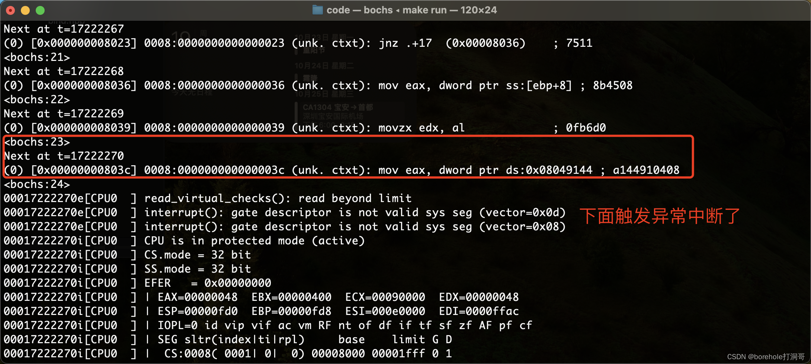

可以看到，在尝试操作全局变量的时候仍然出现了问题，而且这个`0x08049144`着实是个很奇怪的地址，这是为什么呢？

原因在于，`ld`在链接时，有一个默认的代码加载偏移地址，这个地址并不是`0`，所以，相当于代码中所有标签都加上了一个偏移量。

而现在我们需要让他们统一起来，因此要在链接时添加一个参数，指定文件基础偏移量是`0`，这个参数是`-Ttext=0`，完整的链接命令如下：

```
x86_64-elf-ld -m elf_i386 -Ttext=0 kernel.o entry.o asm_func.o -o kernel_final.out
```

这下再运行，没问题了！ 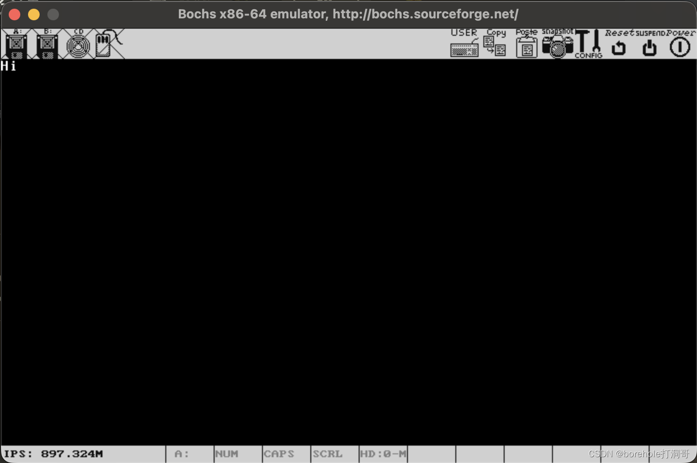

### 乘胜追击

既然`putchar`都实现了，我们就再乘胜追击一下，实现一个`puts`吧，废话不多说，直接上代码：

  
```c
extern void SetVMem(long addr, unsigned char data);

// 定义光标信息
typedef struct {
  long offset; // 暂时只需要一个偏移量
} CursorInfo;

CursorInfo g_cursor_info = {0}; // 全局变量，保存光标信息

int putchar(int ch) {
  if (ch == '\n') { // 处理换行
    g_cursor_info.offset += 80 * 2; // 一行是80字符
    g_cursor_info.offset -= ((g_cursor_info.offset / 2) % 80) * 2; // 回到行首
  } else {
    SetVMem(g_cursor_info.offset++, (unsigned char)ch);
    SetVMem(g_cursor_info.offset++, 0x0f);
  }
  return ch;
}

int puts(const char *str) {
  // 处理C字符串，需要向后找到0结尾，逐一调用putchar
  for (const char *p = str; *p != '0'; p++) {
    putchar(*p);
  }
  return 0;
}

void Entry() {
  puts("Hello, World!\nThe 2nd line.");
}
```

运行结果如下： 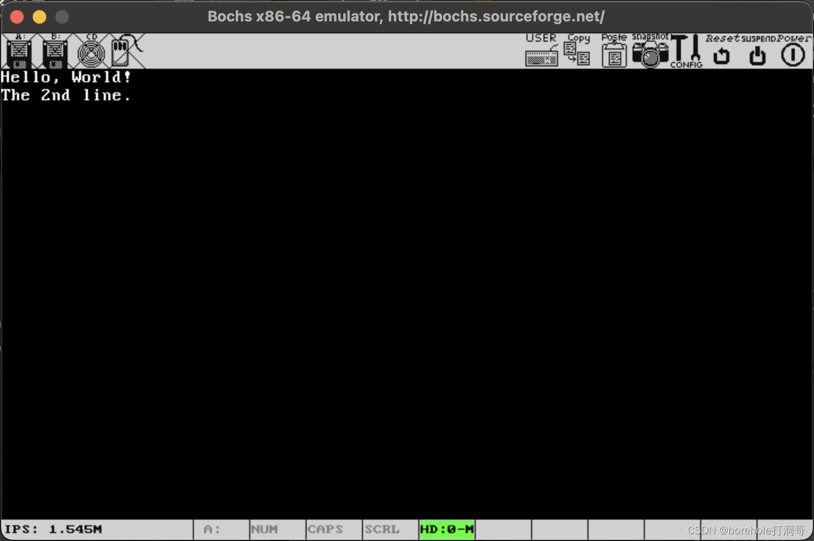

完美！撒花！

上面的工程代码可以参考附件11-2。

### 重新整理工程文件

到目前为止，我们工程中的源文件有两类，一类是`.nas`结尾的汇编代码，另一类是`.c`结尾的C语言代码，他们之间还有互相调用的关系（`kernel.nas`调用`entry.c`，而`entry.c`会调用`asm_fun.nas`）。

同时，我们把跟MBR和Kernel头部的部分，以及管理C程序相关的库都是混在一起写的，后续如果工程再复杂起来，会显得比较凌乱不好管理。所以，在继续之前，我们先做这么几件事：

  1. 把函数声明、结构体定义等收纳到头文件中管理。

  2. 分离MBR、Kernel、C库相关部分，在独立路径中管理（并编写对应的`makefile`）

  3. 将C库的部分先整理为静态链接库（`lib`），之后再参与编译。

整理后的路径如下： 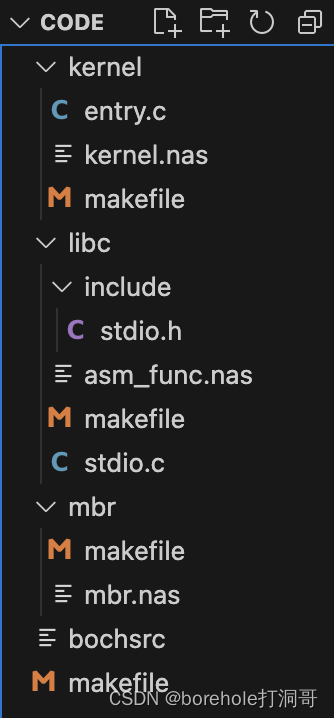

这里调整后的路径会上传到附件中（12-1），建议读者可以对照着工程来看。

根目录下我们保留`bochsrc`，这是配置虚拟机的。然后里面分别有`mbr`、`kernel`和`libc`三个路径。前两个无需解释，后面这个`libc`就是我们把一些C库相关的东西写在这个路径里，而kernel逻辑相关的则是放在`kernel`路径下，例如`kernel/entry.c`

与此同时，我们将挤在`entry.c`当中的`putchar`、`puts`相关逻辑转移至`libc/stdio.c`中，并且在`libc/include/stdio.h`中进行声明。

之后，在编译选项中通过`-I`参数，可以将默认的头文件搜索路径定向到`libc/include`中。并且针对`libc`路径单独进行静态链接库打包，成为`libc.a`。

最后，在链接选项中，通过`-L`参数指定静态库搜索路径为`libc`，并且通过`-l`参数指定使用`libc.a`静态库。

**再次强调**，请读者通过附件中的工程代码，仔细阅读一下改造后的工程布局和对应的`makefile`。由于文章中不便表示这种路径调整的动作，因此不再在正文中引用代码，请读者通过工程实例来查看。

## 继续完善C库

接下来我们要继续完善C库，实现几个重要的功能，让代码库至少处于一个基本可用状态。

### stddef

这个库主要是实现一些宏和类型定义：

```c
// stddef.h
#ifndef NULL
#define NULL (void *)0
#endif

typedef unsigned size_t;
typedef unsigned uintptr_t;
```

### stdint

这个库主要是实现一些定长整型。注意，当前我们是在32位环境下，日后切换到64位环境后要做一定的适配。

```c
typedef char int8_t;
typedef short int16_t;
typedef int int32_t;
typedef long long int64_t;

typedef unsigned char uint8_t;
typedef short uint16_t;
typedef unsigned int uint32_t;
typedef unsigned long long uint64_t;

typedef int intptr_t;
typedef unsigned uintptr_t;
```

### stdarg

这个库主要是服务于变参函数，因为我们想实现`printf`，那关于变参的处理，是需要一些辅助工具的。

```c
#include <stdint.h>
#include <stddef.h>

typedef uint8_t *va_list;

#define va_start(varg_ptr, last_val) (varg_ptr = (uint8_t *)(&last_val + 1))
#define va_arg(varg_ptr, type) (varg_ptr += sizeof(type), *((type *)varg_ptr - 1))
#define va_end(varg_ptr) (varg_ptr = NULL)
```

如果读者对这几个宏有疑惑的话，那我们可以换一个思路来考虑。所谓变参，其实就是从C语言编译器的层面上不限制函数参数罢了，但读取参数的方式是没变的，都是从`ebp+8`开始是第一个参数，依次向上寻找。

所以，当我们确定了变参的头部以后，按照指针偏移向上寻找即可。所以`va_list`就是变参头部的指针，`va_start`用于确定变参头部的地址，而`va_arg`则是通过参数的类型来获取数据，并且进行指针偏移。最后的`va_end`是将指针清空。

稍后我们会利用它来实现`printf`。

### string

这里实现一些与字符串相关的工具，注意其实这些工具更适合用汇编直接来实现，但暂时这里先给出C语言实现的版本：

```c
#include "include/string.h"
#include "include/stdint.h"

char *strcpy(char *dst, const char *src) {
  char *p = dst;
  while (*src != '\0') {
    *p++ = *src++;
  }
  return dst;
}

size_t strlen(const char *str) {
  size_t size = 0;
  for (const char *p = str; *p != '\0'; p++) {
    size++;
  }
  return size;
}

void *memcpy(void *dst, const void *src, size_t size) {
  uint8_t *p = (char *)dst;
  const uint8_t *q = (const uint8_t *)src;
  for (int i = 0; i < size; i++) {
    p[i] = q[i];
  }
  return dst;
}

void *memset(void *dst, int ch, size_t size) {
  uint8_t *p = dst;
  for (long i = 0; i < size; i++) {
    p[i] = (uint8_t)ch;
  }
  return dst;
}
```

### stdio

最后，咱们在`stdio`上实现`sprintf`和`printf`，这里我们仅实现基本的格式符，复杂的(如`%0.3f`)暂时不考虑，如果读者感兴趣可以自行实现。代码如下：

```c
#include "include/stdio.h"
#include "include/string.h"

extern void SetVMem(long addr, unsigned char data);

#define STDOUT_BUF_SIZE 1024

// 定义光标信息
typedef struct {
  long offset; // 暂时只需要一个偏移量
} CursorInfo;

static CursorInfo g_cursor_info = {0}; // 全局变量，保存光标信息

int putchar(int ch) {
  if (ch == '\n') { // 处理换行
    g_cursor_info.offset += 80 * 2; // 一行是80字符
    g_cursor_info.offset -= ((g_cursor_info.offset / 2) % 80) * 2; // 回到行首
  } else {
    SetVMem(g_cursor_info.offset++, (unsigned char)ch);
    SetVMem(g_cursor_info.offset++, 0x0f);
  }
  return ch;
}

int puts(const char *str) {
  // 处理C字符串，需要向后找到0结尾，逐一调用putchar
  for (const char *p = str; *p != '0'; p++) {
    putchar(*p);
  }
  return 0;
}

static size_t int_to_string(char *res, int i, uint8_t base) {
  if (base > 16 || base <= 1) {
    return 0;
  }
  if (i == 0) {
    res[0] = '0';
    return 1;
  }
  int size = 0;
  if (i < 0) {
    res[0] = '-';
    i *= -1;
    size++;
  }

  int quo = i / base;
  int rem = i % base;
  // 利用函数递归栈逆向结果
  if (quo != 0) {
    size += int_to_string(res + size, quo, base);
  }
  
  if (rem >= 0 && rem <= 9) {
    res[size] = (char)rem + '0';
    size++;
  } else if (rem <= 15) {
    res[size] = (char)rem - 10 + 'a';
    size++;
  }

  return size;
}

static size_t uint_to_string(char *res, unsigned i, uint8_t base) {
  if (base > 16 || base <= 1) {
    return 0;
  }
  if (i == 0) {
    res[0] = '0';
    return 1;
  }
  int size = 0;

  int quo = i / base;
  int rem = i % base;
  // 利用函数递归栈逆向结果
  if (quo != 0) {
    size += int_to_string(res, quo, base);
  }
  
  if (rem >= 0 && rem <= 9) {
    res[size] = (char)rem + '0';
    size++;
  } else if (rem <= 15) {
    res[size] = (char)rem - 10 + 'a';
    size++;
  }

  return size;
}

int vsprintf(char *str, const char *fmt, va_list li) {
  const char *p_src = fmt;
  char *p_dst = str;
  while (*p_src != '\0') {
    if (*p_src == '%') {
      p_src++;
      switch (*p_src++) {
        case '%':
          *p_dst++ = '%';
          break;

        case 'd':
          p_dst += int_to_string(p_dst, va_arg(li, int), 10);
          break;
        
        case 'u':
          p_dst += uint_to_string(p_dst, va_arg(li, unsigned), 10);
          break;
        
        case 'x':
          p_dst += uint_to_string(p_dst, va_arg(li, unsigned), 16);
          break;

        case 'o':
          p_dst += uint_to_string(p_dst, va_arg(li, unsigned), 8);
          break;

        case 'c':
          *p_dst++ = (char)va_arg(li, int); // 4字节对齐
          break;

        case 's':
          const char *str = va_arg(li, const char *);
          strcpy(p_dst, str);
          p_dst += strlen(str);
      }
    } else {
      *p_dst++ = *p_src++;
    }
  }
  return p_dst - str;
}

int sprintf(char *str, const char *fmt, ...) {
  va_list li;
  va_start(li, fmt);
  int ret = vsprintf(str, fmt, li);
  va_end(li);
  return ret;
}

int vprintf(const char *fmt, va_list li) {
  char buf[STDOUT_BUF_SIZE];
  memset(buf, 0, sizeof(buf));
  int ret = vsprintf(buf, fmt, li);
  if (ret < 0) {
    return ret;
  }
  for (const char *p = buf; *p != 0; p++) {
    putchar(*p);
  }
  return ret;
}

int printf(const char *fmt, ...) {
  va_list li;
  va_start(li, fmt);
  int ret = vprintf(fmt, li);
  va_end(li);
  return ret;
}
```

## 看一看效果

在构建之前还有一个问题要注意，咱们之前的代码在MBR里只读取了2个扇区，随着Kernel的逐渐增大，这个大小可能很快就超了，所以咱们要去MBR里改一下，让它多读几个扇区：

```
; LBA28模式，逻辑扇区号28位，从0x0000000到0xFFFFFFF
; 设置读取扇区的数量
mov dx, 0x01f2
mov al, 12 ; 读取连续的几个扇区，每读取一个al就会减1
out dx, al
; 设置起始扇区号，28位需要拆开
mov dx, 0x01f3
mov al, 0x02 ; 从第2个扇区开始读（1起始，0留空），扇区号0~7位
out dx, al
mov dx, 0x01f4 ; 扇区号8~15位
mov al, 0
out dx, al
mov dx, 0x01f5 ; 扇区号16~23位
mov al, 0
out dx, al
mov dx, 0x01f6
mov al, 111_0_0000b ; 低4位是扇区号24~27位，第4位是主从盘（0主1从），高3位表示磁盘模式（111表示LBA）
; 配置命令
mov dx, 0x01f7
mov al, 0x20 ; 0x20命令表示读盘
out dx, al

wait_finish:
	; 检测状态，是否读取完毕
	mov dx, 0x01f7
	in al, dx ; 通过该端口读取状态数据
	and al, 1000_1000b ; 保留第7位和第3位
	cmp al, 0000_1000b ; 要检测第7位为0（表示不在忙碌状态）和第3位是否是1（表示已经读取完毕）
	jne wait_finish ; 如果不满足则循环等待
	
	; 从端口加载数据到内存
	mov cx, 1024 * 12 / 2 ; 一共要读的字节除以2（表示次数，因为每次会读2字节所以要除以2）
	mov dx, 0x01f0
	mov ax, 0x0800
	mov ds, ax
	xor bx, bx ; [ds:bx] = 0x08000
read:
	in ax, dx ; 16位端口，所以要用16位寄存器
	mov [bx], ax
	add bx, 2 ; 因为ax是16位，所以一次会写2字节
	loop read
```

另一个就是，由于gcc在编译时会自动去寻找系统自带的C头文件，可能会造成编译时函数重复定义的报错，因此，我们还需要在每一个C文件的编译指令加一个`-fno-buildin`参数，例如：

```
entry.o: entry.c ../libc/include/stdio.h
  x86_64-elf-gcc -c -m32 -march=i386 -fno-builtin -I../libc/include entry.c -o entry.o
```

最后我们在`Entry()`中调用`printf`：

```c
#include <stdio.h>

void Entry() {
  const char *data = "ABC123~~";
  int a = 6;
  printf("Hello, World!\n%s\n%d", data, a);
}
```

运行结果如下： 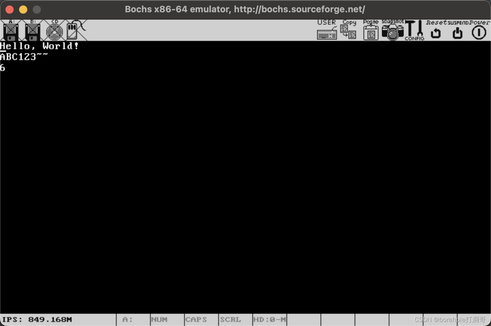

至此，咱们已经基本实现从裸机启动开始运行了一个相对完整的C程序了。那是不是在这个基础上链接个C++程序就全剧终了呢？放心！自然不会。虽然说C++也可以很轻松链接到目前的工程上，但笔者希望能带领大家更近一步，比如进入64位模式，比如显示图像（而不是纯文本）。

本节的实例工程会上传至附件（12-2），后面章节我们还会继续探索。

## 图形模式

我们前面章节所有的指令，都是在显卡的文字模式下运行的，通过给显存中直写字符的方式来输出文字。

照理说，保持着文字模式我们也可以进入IA-32e模式并执行64位指令，但我们最终的目标是运行C++程序，为了可以更好地发挥C++的作用，笔者打算后续用C++实现一套简单的UI绘制API，因此，咱们需要使用图形模式。

### 回到MBR

我们在MBR中首先有这么一段指令：

```
; 调用0x10号BIOS中断，清屏
mov al, 0x03
mov ah, 0x00
int 0x10 
```

当时笔者一直将它解释位清屏，其实`0x10`中断的威力远不如此，`al`中配置的`0x03`其实是让显卡进入文字模式。由于我们发起此终端是让显卡重新进入了一次文字模式，因此显存会被重新初始化，进而达到的清屏的目的。

那么我们此时还可以调用这个中断，让显卡进入图形模式。当然，图形模式中有不同的分辨率、色域等等，这些需要显卡的支持。但它们有一套VGA标准模式，是所有显卡都会支持的，我们这里选择通用模式中配置最高模式，这个模式下支持320×200分辨率，256色。开启此模式的方法很简单，只需要让`al`为`0x13`，然后调用`0x10`中断即可开启。我们把MBR最前面的清屏指令改成下面这样：

```
; 开启320*200分辨率256色图形模式(此时显存0xa0000~0xaf9ff)
mov al, 0x13
mov ah, 0x00
int 0x10 
```

由于此模式下，显存也发生了改变，所以我们把GDT中，显存对应的2号段也做对应的更改：

```
; 2号段
; 基址0xa0000，上限0xaf9ff，覆盖所有显存
mov [es:0x10], word 0xf9ff ; Limit=0x00f9ff，这是低16位
mov [es:0x12], word 0x0000 ; Base=0x0a0000，这是低16位
mov [es:0x14], byte 0x0a   ; 这是Base的高8位
mov [es:0x15], byte 1_00_1_001_0b ; P=1, DPL=0, S=1, Type=001b, A=0
mov [es:0x16], byte 0_1_00_0000b  ; G=0, D/B=1, AVL=00, Limit的高4位是0000
mov [es:0x17], byte 0      ; 这是Base的高8位
```

### 图形模式的像素点阵

当然，在此模式下，显存不再被解释为ASCII了，而是每个字节表示一个像素点的颜色。既然是一个字节，自然也就支持一共256种颜色。这256种颜色理论上可以自行通过调色盘来进行更改的，但我们为了简化问题，就使用默认的这256种颜色。

这256种颜色如下： 

上图是按16×16来排布的，因此用十六进制很好找，比如说`0x46`就是上图中第五行的第七个颜色（0起始）。

当进入了图形模式后，原本我们写的一些`g_cursor_info`之类的东西肯定是都不适用了，而且也没办法直接输出文字。不过在此之前，我们还是先来验证一下是否正常启用了图形模式，咱们在主函数中设置一些像素点的颜色看看效果：

```c
void Entry() {
  for (int i = 0; i < 200; i++) {
    for (int j = 0; j < 320; j++) {
      int offset = i * 320 + j;
      SetVMem(offset, j & 0x0f); // 纵向条纹
    }
  }
}
```

执行效果如下： 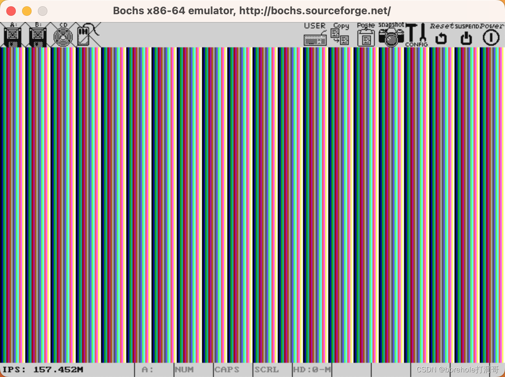

虽然看着有点晕，但至少说明我们图形模式是OK了。趁热打铁，咱们写一些工具，用于在图形模式上绘制点和矩形：

```c
#include <stdint.h>
extern void SetVMem(long addr, uint8_t data);

// 设置画布（背景色）
void SetBackground(uint8_t color) {
  for (int i = 0; i < 320 * 200; i++) {
    SetVMem(i, color);
  }
}

// 画一个点
void DrawPoint(int x, int y, uint8_t color) {
  SetVMem(y * 320 + x, color);
}

// 画一个矩形
void DrawRect(int x, int y, int width, int length, uint8_t color) {
  for (int i = 0; i < width; i++) {
    for (int j = 0; j < length; j++) {
      DrawPoint(x + i, y + j, color);
    }
  }
}

void Entry() {
  // 背景设置为白色
  SetBackground(0x0f);
  // 画两个矩形
  DrawRect(50, 30, 40, 40, 0x28); // 红色正方形
  DrawRect(85, 20, 10, 30, 0x30); // 绿色条状
}
```

运行效果如下： 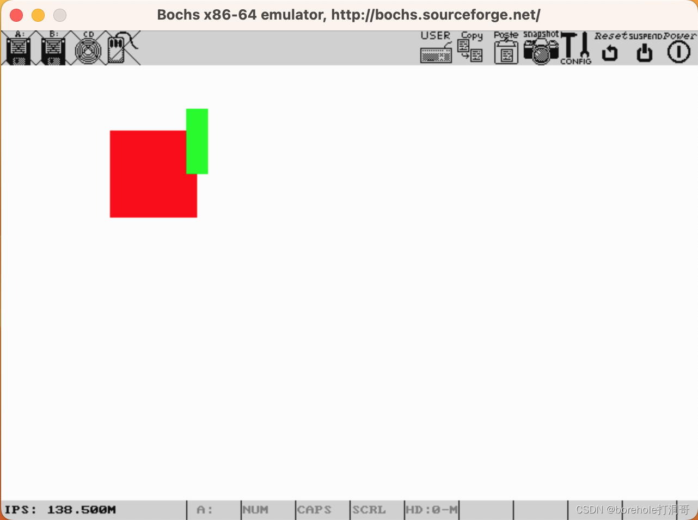

可以看到，图形之间的遮盖关系也是符合我们预期的，绿色的会覆盖红色的部分，因为它的代码更靠后。

### 字体文件

那么，图形模式下我们要想输出文字该怎么办？这时候就需要将文字转换为点阵集，也就是绘制字体。

举例来说，对于`'A'`字符，我们可以绘制一个8×16的点阵：

```c
{
  0b00000000,
  0b00011000,
  0b00011000,
  0b00011000,
  0b00011000,
  0b00100100,
  0b00100100,
  0b00100100,
  0b00100100,
  0b01111110,
  0b01000010,
  0b01000010,
  0b01000010,
  0b11100111,
  0b00000000,
  0b00000000,
}
```

上面字体配置中，按照二进制位来表示当前这个像素要不要渲染。比如我们可以尝试一下：

```c
// 绘制字符
void DrawCharacter(int x, int y, char ch, uint8_t color) {
  // 目前无视ch，只绘制'A'
  (void)ch;

  uint8_t font[] = {
    0b00000000,
    0b00011000,
    0b00011000,
    0b00011000,
    0b00011000,
    0b00100100,
    0b00100100,
    0b00100100,
    0b00100100,
    0b01111110,
    0b01000010,
    0b01000010,
    0b01000010,
    0b11100111,
    0b00000000,
    0b00000000,
  };

  // 开始绘制
  for (int i = 0; i < 16; i++) {
    for (int j = 0; j < 8; j++) {
      // 如果当前位置是否需要渲染，则设置颜色
      if (font[i] & (1 << (7 - j))) {
        SetVMem(x + j + (y + i) * 320, color);
      }
    }
  }
}

void Entry() {
  // 背景设置为白色
  SetBackground(0x0f);
  // 写个字符
  DrawCharacter(50, 50, 'A', 0x30); // 绿色的A
}
```

运行结果如下： 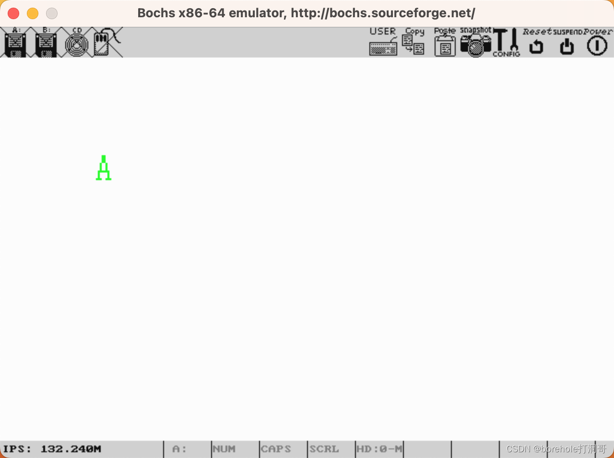

因此，如法炮制，我们只需要设置其他的字符的字体即可。这里采用这样的方法，我们在工程中添加`font.c`，专门用于保存所有ASCII对应的绘制字体，然后再根据此方法去改造`putchar`函数，即可实现在图形模式中输出文本。

这里的相关代码会放在附件中（13-1），读者可以自行取用，正文中则不再赘述。不过这里需要注意，因为字体文件比较大，所以读盘的时候要多读几个扇区，否则字体文件装载不全，已经在附件中呈现，读者请自行检验。下面是运行效果：

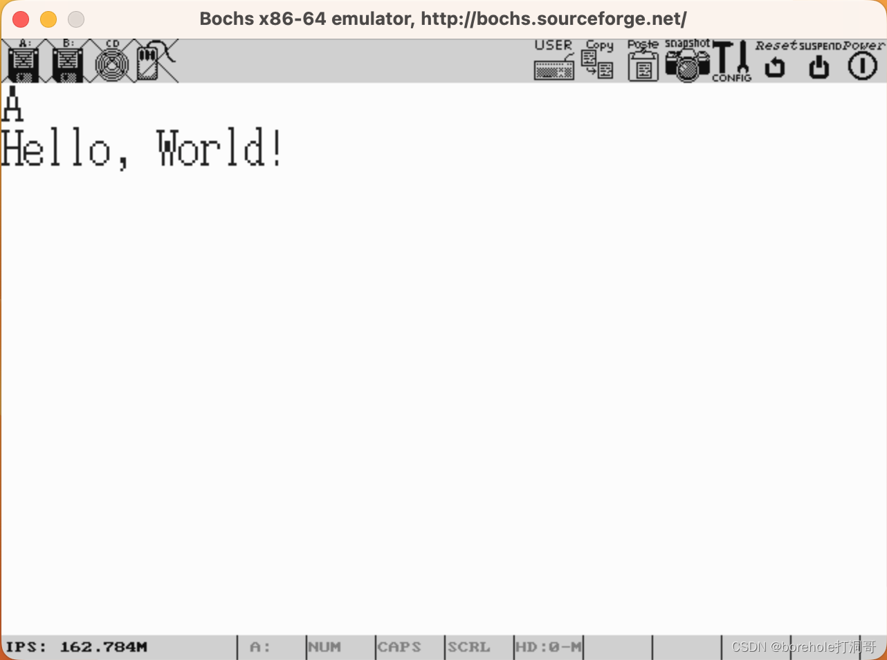

## 分页机制

由于咱们现在一直都是在内核态上运行程序的，并没有任何用户态进程的存在，所以可能大家并没有这种体会。但是，我们设想一下，假如我们真的写了一个成熟的操作系统，这个操作系统不可能说把自己加载完了就`hlt`在那里了。我们肯定是要去操作它，让它执行其他的应用程序。

但只要你去执行一个应用程序，那么就要给这个应用程序去分配必要的内存。应用程序只能访问它这一片空间，而不能够越界。我们能想到最简单的办法就是给每一个进程分一个段，等它结束时再回收这个段，以便用于以后继续分配。

但这样一来有一个问题，随着越来越多的进程运行然后释放，我们的内存可能就被划分为了许多碎片，而段的分配是连续的，假如说明明此时可用空间是够的，但是连续的可用空间不足，那就没办法分段。

所以为了解决这个问题，386引入了「页机制」，简单来说，就是让程序使用「虚拟地址」，由对应的页地址部件将其转化为物理地址后再读入内存。而这种访问方式的最小单位是4KB，被称为「页」。换句话说，物理内存中只有4KB内是连续的，页之间可能是不连续的，但在用户程序看来，却是完全连续的，因为用户程序看到的是虚拟地址。

不过研究分页机制会跟本文的主题偏离，因此我们在这里不做过于详细的展开，读者只需要知道这一机制引入的原因，以及配置方法即可，我们的目的是进入IA-32e模式，然后执行64位的指令而已，还没必要大动干戈去调度用户程序。因此这里只会简单配置一个页表，然后让程序正常运行即可。

一个页是4KB，而且要求必须是4KB对其的，也就是说页的起始位置不可以是任意的，而必须是4KB的整数倍，也就是说地址的低12位都是0。而且，既然我们要管理这些页，内核至少要知道，当前分配了哪些页，他们的物理地址在哪里，一些内部配置是什么样的。这就需要我们来维护一张「页表」。

### 页表

页表中应当包含页的物理地址，以及一些其他的配置项。在IA-32模式中，一个页表项占4字节，详情如下：

<table><thead><tr><th>二进制位</th><th>符号</th><th>意义</th></tr></thead><tbody><tr><td>0</td><td>P</td><td>存在位</td></tr><tr><td>1</td><td>RW</td><td>只读or可写</td></tr><tr><td>2</td><td>US</td><td>权限级别</td></tr><tr><td>3</td><td>PWT</td><td>通写</td></tr><tr><td>4</td><td>PCD</td><td>高速缓存禁止</td></tr><tr><td>5</td><td>A</td><td>访问</td></tr><tr><td>6</td><td>D</td><td>脏页</td></tr><tr><td>7</td><td>PS</td><td>页尺寸</td></tr><tr><td>8</td><td>G</td><td>全局</td></tr><tr><td>9-11</td><td>AVL</td><td>保留位</td></tr><tr><td>12-31</td><td>Base(12-31)</td><td>页首地址的12-31位</td></tr></tbody></table>

由于页地址要求低12位必须为0，所以页表项中也只需要记录高20位即可，剩下的那12位留给了页的配置。由于我们不涉及内核调度的问题，因此很多配置项我们都可以忽略，只需要关注`P`和`RW`即可，其它项暂且都置0就好了。

但是这里有另一个问题，32位寻址空间最多有4GB，一个页是4KB，也就是说最多我们可以有1048576个页，而每个页表项占4字节，那么光是页表都要有4194304字节，也就是4MB的空间。

而实际情况是，计算机的物理内存可能根本没有这么大，很多页是虚拟的，在不用的时候可能被操作系统写入了硬盘中，等需要时再做换页，但它的页表项却是必须在内存中的，这就活活占用了4MB的死空间。在386那个年代可能物理内存也就几MB吧，这显然是不能接受的。

于是乎，我们想了一个办法，就是把页表进行分层，首先，我只占用4KB的大小，先做一个页目录，然后页目录项在指向一个子页表，页表中再去配置实际的页。这样一来有两个好处，第一，如果我只用到一少部分的页配置，我就不用占用太多空间，因为我可以选择只配置其中一部分页表。第二，页表本身也可以作为活跃的页，跟硬盘进行交换，所以内存中只有页目录这4KB的死空间被占用而已，这个大小是比较能接受的。

另一个问题就是，一但CPU开启分页模式后，通过段寄存器和偏移地址计算出的线性地址就不再是物理地址，而是要通过页的转换成为物理地址。但咱们现在内核已经加载进去了，开启分页模式之后，我们得保证后续指令能够正常运行，**就得让这时的线性地址正好等于物理地址才行**，否则经过转换后地址飞了，就不能正常执行后续指令了。因此，我们至少得把低1MB的空间都分好页，并且保证这些页是连续的，正好映射到物理内存中。而1MB的空间按照每页4KB来算的话，咱们得配256个页。

### 页配置

接下来，我们将在`kernel.nas`中配置页表，至于页表的位置无所谓，你选一个没有被占用的就好了，这里我们以`0x20000`为例。

不过既然要在`0x20000`这个位置写东西，咱们就得有个段来支持才行，索性我们就配一个`0x0`地址起始的辅助段，方便我们操作这部分空间。在MBR中添加：

```
; 4号段-辅助段
; 基址0x0000，上限0xfffff 
mov [es:0x20], word 0x00ff ; Limit=0x00ff，这是低16位
mov [es:0x22], word 0x0000 ; Base=0x0a0000，这是低16位
mov [es:0x24], byte 0x00   ; 这是Base的高8位
mov [es:0x25], byte 1_00_1_001_0b ; P=1, DPL=0, S=1, Type=001b, A=0
mov [es:0x26], byte 1_1_00_0000b  ; G=1, D/B=1, AVL=00, Limit的高4位是0000
mov [es:0x27], byte 0      ; 这是Base的高8位
```

同时记得修改GDT的长度：

```
; 下面是gdt信息的配置（暂且放在0x07f00的位置）
mov ax, 0x07f0
mov es, ax
mov [es:0x00], word 39      ; 因为目前配了5个段，长度为40，所以limit为39
mov [es:0x02], dword 0x7e00 ; GDT配置表的首地址
```

回到kernel.nas，按照之前的规划，`0x20000`~`0x20fff`的位置就是我们的页目录。由于咱们只需要配256个页，所以只需要用一张页表即可覆盖，那我们就选`0x21000`~`0x21fff`作为这个页表。

那么我们在页目录的起始配一个指向`0x21000`位置页表的页目录项，代码如下：

```
; 选取0x20000作为页目录的地址
; 从0x20000开始的4096字节都是页目录
; 页目录的第一项指向一个页表
; 页表范围是0x21_000~0x21_fff
mov [es:0x20000], word 00100001_000_0_0_0_0_0_0_0_1_1b ; P=1, RW=1, US=0, PWT=0, PCD=0, A=0, D=0, G=0, PAT=0, AVL=000, Base=0x00021_000（取前20位）
```

然后我们再来配置这张页表，由于要分256个页，所以我们通过一个循环来计算页首地址以及写入页表项，每次循环时，页的基址应该加`4KB`，配置项保持不变。让低1MB的内存空间正好映射到前256个页表项中，也就是把`0x0`~`0xfff`分给`0`号页，`0x1000`~`0x1fff`分给`1`号页，以此类推。代码如下：

```
; 接下来要把0x21000~0x213ff范围里的256个页表项进行配置(正好对应低1MB)
mov ecx, 256
mov ebx, 0x21000 ; 页表项地址
mov edx, 0x00000_003 ; 页表配置项值，从0地址开始

.l1:
  mov [es:ebx], edx
  add ebx, 4
  add edx, 0x0001_000 ; 相当于页物理地址+4KB
  loop .l1
```

配置好页表项后，还需要告诉CPU我们的页目录配置在哪里了，IA-32架构的CR3寄存器就是做这件事的，它用来保存页目录首地址。

```
; 将页目录首地址写入CR3寄存器中
mov eax, 00100000_00000000_0_0_00b ; PCD=0, PWT=0, BASE=0x00020_000
mov cr3, eax
```

做好一切准备后，我们就可以开启分页模式了，开启分页模式的方法是更改CR0的第31位（也就是最高位），将其置`1`，然后CPU就会立即进入分页模式。

```
; 开启CR0的第31位（最高位）以开启分页机制
mov eax, cr0
or eax, 0x80000000
mov cr0, eax 
```

我们保持后续所有流程不变，如果还能正常看到输出，证明我们的分页是没问题的。

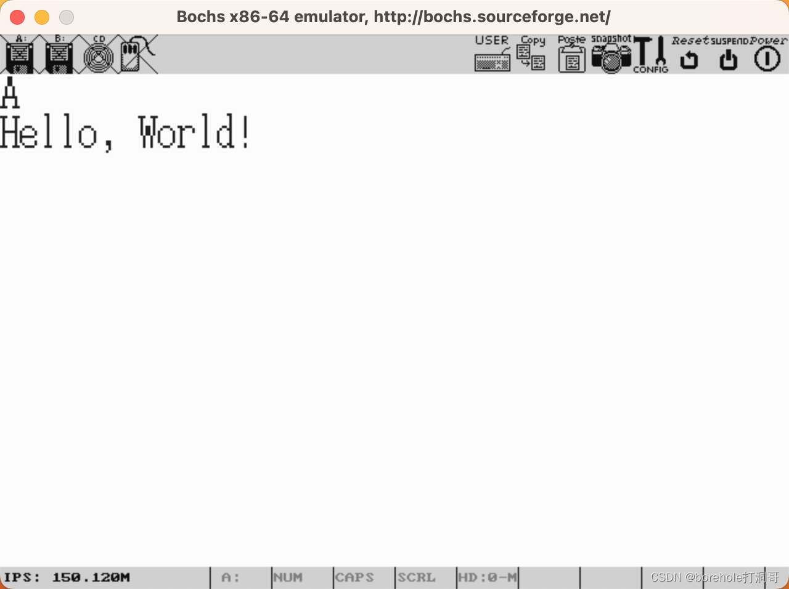

到此步为止的实例代码，笔者会放在附件中(13-2)，读者可自行参考。

## AMD64模式

目前咱们已经做好了万全的准备，接下来我们就是要进军64位了。在此之前我们来介绍一下相关背景知识。

### IA-32e架构

笔者在前面章节曾经介绍过IA-64和AMD64的爱恨情仇，AMD64架构是由AMD最先提出，在IA-32架构的基础上进行扩展的64位指令集，向下兼容IA-32模式，但IA-64并不兼容IA-32。由于它是由IA-32模式扩展来的，并且兼容IA-32，因此这种工作模式也被称作IA-32e（IA-32 Extension）模式，或IA-32扩展模式。

首先是硬件扩充，原本的一些寄存器被重新扩展至64位，并以r开头（re-extend，再次扩展的意思），例如`rax`，它的低32位就是`eax`。除此之外，该架构还额外提供了8个通用寄存器，分别命名为`r8`~`r15`。它们也可以拆出32位寄存器来用，例如`r8`的低32位是`r8d`，低16位是`r8w`，低8位是`r8b`。

`rax`,`rbx`,`rcx`,`rdx`寄存器结构示意图如下： 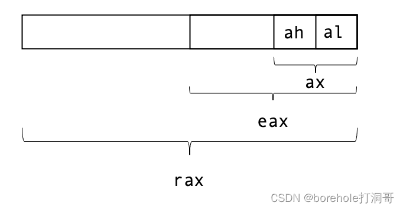

`rsp`,`rbp`,`rsi`,`rdi`寄存器结构示意图如下： 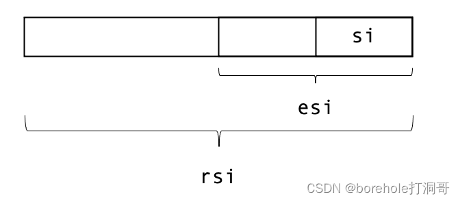

`r8`~`r15`寄存器结构示意图如下： 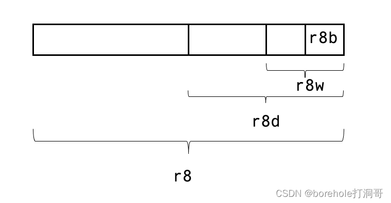

相信大家用起来都不会太陌生。与此同时，`ip`也扩展位`rip`，用于加载64位指令。

接下来的问题就是，如何使CPU进入IA-32e模式，并执行64位指令？这里还有一段路程要走，大家稍安勿躁。

### 4层分页

我们知道IA-32e模式是要支持64位指令的，同时也拥有理论64位的寻址空间，最大支持16EB的内存空间。倘若说这玩意我们还是按4KB来分页，页表又要炸掉了。由于要支持64位地址，因此这时的页表项也被扩充到8字节，低12位的含义不变，只是向上多扩展了32位用于表示页地址的。也正因如此，现在一个页表里最多只能配512个页了，页表更加得炸。

所以，之前的2层分页就不满足要求了，IA-32e模式提供了4层分页的方式，顾名思义就是从最初的页目录到最后的页表最多有4级。这4层分别被叫做`PML4`,`PDPT`,`PDT`,`PT`。

刚才我用了「最多」这个词，也就是说，我们不一定真的分4层，也可以在2层或者3层就截止，再哪层截止决定了页的大小。

这里的逻辑是，假如我们真的配置到了`PT`层，那么它指向的页就是4KB的，正常来说`PDT`层的项应当指向一个`PT`层表才对，但如果这时我们不让他再继续分级，而是直接指向页的话，这个页的大小就是2MB（相当于这2MB不再细分成512个4KB的页了，而是直接作为一个页）。

同理，如果我们直接在`PDT`层就直接指向页的话，那么这一个页就是1GB，相当于1GB不再细分成512个2MB的页。

那么如何表示当前页表项是指向实际页呢，还是指向下一个层级的页表呢？这就用到了`PS`位，当`PS`为1时，表示它指向下一级页表，为`0`时表示直接指向页。

由于我们当前就利用前1MB的空间就够了，所以，咱们就选择按2MB大小分页，这样只需要分1个页就够用了，所以，我们配置页表只到`PDT`层，并且这一层里只需要配一个页表项，让它的物理地址是`0x0`起始的就够了。代码如下：

```
进制位	符号	意义
0	P	存在位
1	RW	只读or可写
2	US	权限级别
3	PWT	通写
4	PCD	高速缓存禁止
5	A	访问
6	D	脏页
7	PS	页尺寸
8	G	全局
9-11	AVL	保留位
12-31	Base(12-31)	页首地址的12-31位
由于页地址要求低12位必须为0，所以页表项中也只需要记录高20位即可，剩下的那12位留给了页的配置。由于我们不涉及内核调度的问题，因此很多配置项我们都可以忽略，只需要关注P和RW即可，其它项暂且都置0就好了。

但是这里有另一个问题，32位寻址空间最多有4GB，一个页是4KB，也就是说最多我们可以有1048576个页，而每个页表项占4字节，那么光是页表都要有4194304字节，也就是4MB的空间。

而实际情况是，计算机的物理内存可能根本没有这么大，很多页是虚拟的，在不用的时候可能被操作系统写入了硬盘中，等需要时再做换页，但它的页表项却是必须在内存中的，这就活活占用了4MB的死空间。在386那个年代可能物理内存也就几MB吧，这显然是不能接受的。

于是乎，我们想了一个办法，就是把页表进行分层，首先，我只占用4KB的大小，先做一个页目录，然后页目录项在指向一个子页表，页表中再去配置实际的页。这样一来有两个好处，第一，如果我只用到一少部分的页配置，我就不用占用太多空间，因为我可以选择只配置其中一部分页表。第二，页表本身也可以作为活跃的页，跟硬盘进行交换，所以内存中只有页目录这4KB的死空间被占用而已，这个大小是比较能接受的。

另一个问题就是，一但CPU开启分页模式后，通过段寄存器和偏移地址计算出的线性地址就不再是物理地址，而是要通过页的转换成为物理地址。但咱们现在内核已经加载进去了，开启分页模式之后，我们得保证后续指令能够正常运行，就得让这时的线性地址正好等于物理地址才行，否则经过转换后地址飞了，就不能正常执行后续指令了。因此，我们至少得把低1MB的空间都分好页，并且保证这些页是连续的，正好映射到物理内存中。而1MB的空间按照每页4KB来算的话，咱们得配256个页。

页配置
接下来，我们将在kernel.nas中配置页表，至于页表的位置无所谓，你选一个没有被占用的就好了，这里我们以0x20000为例。

不过既然要在0x20000这个位置写东西，咱们就得有个段来支持才行，索性我们就配一个0x0地址起始的辅助段，方便我们操作这部分空间。在MBR中添加：

; 4号段-辅助段
; 基址0x0000，上限0xfffff 
mov [es:0x20], word 0x00ff ; Limit=0x00ff，这是低16位
mov [es:0x22], word 0x0000 ; Base=0x0a0000，这是低16位
mov [es:0x24], byte 0x00   ; 这是Base的高8位
mov [es:0x25], byte 1_00_1_001_0b ; P=1, DPL=0, S=1, Type=001b, A=0
mov [es:0x26], byte 1_1_00_0000b  ; G=1, D/B=1, AVL=00, Limit的高4位是0000
mov [es:0x27], byte 0      ; 这是Base的高8位
同时记得修改GDT的长度：

; 下面是gdt信息的配置（暂且放在0x07f00的位置）
mov ax, 0x07f0
mov es, ax
mov [es:0x00], word 39      ; 因为目前配了5个段，长度为40，所以limit为39
mov [es:0x02], dword 0x7e00 ; GDT配置表的首地址
回到kernel.nas，按照之前的规划，0x20000~0x20fff的位置就是我们的页目录。由于咱们只需要配256个页，所以只需要用一张页表即可覆盖，那我们就选0x21000~0x21fff作为这个页表。

那么我们在页目录的起始配一个指向0x21000位置页表的页目录项，代码如下：

; 选取0x20000作为页目录的地址
; 从0x20000开始的4096字节都是页目录
; 页目录的第一项指向一个页表
; 页表范围是0x21_000~0x21_fff
mov [es:0x20000], word 00100001_000_0_0_0_0_0_0_0_1_1b ; P=1, RW=1, US=0, PWT=0, PCD=0, A=0, D=0, G=0, PAT=0, AVL=000, Base=0x00021_000（取前20位）
然后我们再来配置这张页表，由于要分256个页，所以我们通过一个循环来计算页首地址以及写入页表项，每次循环时，页的基址应该加4KB，配置项保持不变。让低1MB的内存空间正好映射到前256个页表项中，也就是把0x0~0xfff分给0号页，0x1000~0x1fff分给1号页，以此类推。代码如下：

; 接下来要把0x21000~0x213ff范围里的256个页表项进行配置(正好对应低1MB)
mov ecx, 256
mov ebx, 0x21000 ; 页表项地址
mov edx, 0x00000_003 ; 页表配置项值，从0地址开始

.l1:
  mov [es:ebx], edx
  add ebx, 4
  add edx, 0x0001_000 ; 相当于页物理地址+4KB
  loop .l1
配置好页表项后，还需要告诉CPU我们的页目录配置在哪里了，IA-32架构的CR3寄存器就是做这件事的，它用来保存页目录首地址。

; 将页目录首地址写入CR3寄存器中
mov eax, 00100000_00000000_0_0_00b ; PCD=0, PWT=0, BASE=0x00020_000
mov cr3, eax
做好一切准备后，我们就可以开启分页模式了，开启分页模式的方法是更改CR0的第31位（也就是最高位），将其置1，然后CPU就会立即进入分页模式。

; 开启CR0的第31位（最高位）以开启分页机制
mov eax, cr0
or eax, 0x80000000
mov cr0, eax 
我们保持后续所有流程不变，如果还能正常看到输出，证明我们的分页是没问题的。


到此步为止的实例代码，笔者会放在附件中(13-2)，读者可自行参考。

AMD64模式
目前咱们已经做好了万全的准备，接下来我们就是要进军64位了。在此之前我们来介绍一下相关背景知识。

IA-32e架构
笔者在前面章节曾经介绍过IA-64和AMD64的爱恨情仇，AMD64架构是由AMD最先提出，在IA-32架构的基础上进行扩展的64位指令集，向下兼容IA-32模式，但IA-64并不兼容IA-32。由于它是由IA-32模式扩展来的，并且兼容IA-32，因此这种工作模式也被称作IA-32e（IA-32 Extension）模式，或IA-32扩展模式。

首先是硬件扩充，原本的一些寄存器被重新扩展至64位，并以r开头（re-extend，再次扩展的意思），例如rax，它的低32位就是eax。除此之外，该架构还额外提供了8个通用寄存器，分别命名为r8~r15。它们也可以拆出32位寄存器来用，例如r8的低32位是r8d，低16位是r8w，低8位是r8b。

rax,rbx,rcx,rdx寄存器结构示意图如下： 

rsp,rbp,rsi,rdi寄存器结构示意图如下： 

r8~r15寄存器结构示意图如下： 

相信大家用起来都不会太陌生。与此同时，ip也扩展位rip，用于加载64位指令。

接下来的问题就是，如何使CPU进入IA-32e模式，并执行64位指令？这里还有一段路程要走，大家稍安勿躁。

4层分页
我们知道IA-32e模式是要支持64位指令的，同时也拥有理论64位的寻址空间，最大支持16EB的内存空间。倘若说这玩意我们还是按4KB来分页，页表又要炸掉了。由于要支持64位地址，因此这时的页表项也被扩充到8字节，低12位的含义不变，只是向上多扩展了32位用于表示页地址的。也正因如此，现在一个页表里最多只能配512个页了，页表更加得炸。

所以，之前的2层分页就不满足要求了，IA-32e模式提供了4层分页的方式，顾名思义就是从最初的页目录到最后的页表最多有4级。这4层分别被叫做PML4,PDPT,PDT,PT。

刚才我用了「最多」这个词，也就是说，我们不一定真的分4层，也可以在2层或者3层就截止，再哪层截止决定了页的大小。

这里的逻辑是，假如我们真的配置到了PT层，那么它指向的页就是4KB的，正常来说PDT层的项应当指向一个PT层表才对，但如果这时我们不让他再继续分级，而是直接指向页的话，这个页的大小就是2MB（相当于这2MB不再细分成512个4KB的页了，而是直接作为一个页）。

同理，如果我们直接在PDT层就直接指向页的话，那么这一个页就是1GB，相当于1GB不再细分成512个2MB的页。

那么如何表示当前页表项是指向实际页呢，还是指向下一个层级的页表呢？这就用到了PS位，当PS为1时，表示它指向下一级页表，为0时表示直接指向页。

由于我们当前就利用前1MB的空间就够了，所以，咱们就选择按2MB大小分页，这样只需要分1个页就够用了，所以，我们配置页表只到PDT层，并且这一层里只需要配一个页表项，让它的物理地址是0x0起始的就够了。代码如下：

; IA-32e模式下使用4级分页，PML4-PDPT-PDT-PT
; 这种模式下的页目录项、页表项都是8字节，高52位是物理地址
; 如果在PDPT上就设PS=1的话，实际上只分2层，每页1GB
; 如果在PDT上就设PS=1的话，实际上只分3层，每页2MB
; 到了PT上PS必须设为1（因为此模式最多支持4层），每页4KB
; 这里就将0x00000~0x1FFFFF这2MB的空间放到首个页结构项中

; PML4
mov [es:0x20000], dword 0x21003 ; P=1, RW=1, PS=0(表示有下级页表), Base=0x21_000
mov [es:0x20004], dword 0

; PDPT
mov [es:0x21000], dword 0x22003 ; P=1, RW=1, PS=0(表示有下级页表), Base=0x22_000
mov [es:0x21004], dword 0

; PDT
mov [es:0x22000], dword 0x83 ; P=1, RW=1, PS=1(不再有下级页表，所以直接按2MB分页), Base=0x0，大小2MB
mov [es:0x22004], dword 0
  
; 将页目录首地址写入CR3寄存器中
mov eax, 00100000_00000000_0_0_00b ; PCD=0, PWT=0, BASE=0x00020_000
mov cr3, eax
```

与此同时，我们现在的页表项是按8字节一项来配置的，这件事得让CPU知道，不然它还是按4字节作为一项来解析的话就麻烦了。这时我们需要将CR4的第5位置1，表示「开启64位地址扩展的分页模式」，代码如下：

```
; 开启CR4的第5位，开启64位地址扩展的分页模式
mov eax, cr4
or eax, 0x20
mov cr4, eax
```

### 进入IA-32e模式

在操作CR0开启分页模式之前，我们还需要通知CPU开启IA-32e模式，毕竟咱们刚才配置的这种4层分页模式在i386模式下是不支持的，所以开启分页模式之前，还要先开启IA-32e模式的标记位，这样CPU才能知道，开启分页模式的同时，改用IA-32e模式。

在IA-32e架构下，有一些扩展的寄存器，它们并没有像CR0这样直接集成到指令集中（这就是它区别于IA-64的地方，虽然扩充到了64位，但仍旧保持对IA-32的高度兼容），而是通过独立编址的方式，利用特殊的指令来操作，这些寄存器称为MSR(Modelspecific Register,模式指定寄存器)。我们现在要操作的寄存器叫做EFER(Extended FeatureEnable Register,扩展功能开启寄存器)，它的第8位表示开启长模式(long mode，大家姑且认为这个跟IA-32e模式等价)。代码如下：

```
; 读取EFER(Extended FeatureEnable Register)
mov ecx, 0xc0000080 ; rdmsr指令要求将需要读取的寄存器地址放在ecx中
rdmsr ; 读取结果会放在eax中
or eax, 0x100 ; 设置第8位，LME(Long Mode Enable)
wrmsr ; 将eax的值写入ecx对应地址的寄存器
```

准备工作做完以后，我们就可以操作CR0来开启分页模式了，与此同时，CPU也会进入IA-32e模式：

```
; 开启CR0的第31位（最高位）以开启分页机制
mov eax, cr0
or eax, 0x80000000
mov cr0, eax 
; 此时也会进入IA-32e模式
```

我们同样保持后续逻辑不变，来运行一下看看效果： 

没有问题！我们成功在IA-32e模式中配置了页表，并运行了内核程序。

到此的项目源码会放到附件(13-3)中。

等等……为什么这里能运行成功呢？进入IA-32e模式后难道不应该切换到64位指令集吗？为什么我们32位的Kernel还能正常运行？不知道读者到这里会不会有这样的疑问。

这就是IA-32e模式的伟大之处了，因为它可以完全兼容原本的IA-32指令，所以即使我们已经进入了IA-32e模式，它也能正常执行后续所有的IA-32指令。

那究竟如何真正地运行64位指令呢？这是我们下一章要研究的内容。

## 加载64位指令

前一节我们已经成功进入了IA-32e模式，但是，却意料之外地体验了一把在IA-32e模式上运行IA-32指令的兼容模式。

前面我们也看到了IA-32e架构下的硬件扩展方式，比如说寄存器都是在原本基础上扩展的，所以，他可以通过只用低32位寄存器的方式，运行IA-32的指令，以此实现高度兼容。

因此，这里的秘密就是在，段配置的一个保留位上，咱们前面讨论过，段描述符的第54和55位是保留位，因为在IA-32模式下不会去解析这两位。但是IA-32e模式下就利用了其中的第55位，用来表示该段是32位模式还是64位模式，当它为1时，CPU将会用64位指令来解析。

但是，前面分好的代码段我们不能动，毕竟内核这里还有一段32位的代码要执行。所以，我们就再分一个64位指令的段。不过64位的段有一个要求，就是「强制平坦」，也就是说，`Base`配置是无效的，强制按照`0x0`作为首地址。原因也很简单，因为IA-32e模式强制要求分页，所以他希望操作系统用这种更先进的方式来管理内存，因而分段这里就要求强制平坦。

注意，我们说的强制平坦是仅当第55位置1的情况才会强制平坦，如果这一位是0，那么向下兼容IA-32模式的话，段基址是有效的。

64位段配置如下：

```
; 5号段-64位代码段
; 基址0x0000，上限0xfffff 
mov [es:0x28], word 0x00ff ; Limit=0x00ff，这是低16位
mov [es:0x2a], word 0x0000 ; Base(无效)低16位
mov [es:0x2c], byte 0x0000 ; Base(无效)16~23位
mov [es:0x2d], byte 1_00_1_101_0b ; P=1, DPL=0, S=1, Type=001b, A=0
mov [es:0x2e], byte 1_0_1_0_0000b  ; G=1, D/B=0, L=1(开启64位模式), AVL=0, Limit的高4位是0000
mov [es:0x2f], byte 0x00   ; Base(无效)高8位
```

这样，当我们把`CS`设置成5号段的时候就可以执行64位指令了。为此，咱们在kernel中添加一个64位指令，操作一下`R8`寄存器，来验证是否能正常执行：

```
; 进入IA-32e模式
; 刷新cs以进入64位指令模式
jmp 00101_00_0b:ent64 + 0x8000 ; 注意这里，平坦模式下，要从0x0计算偏移量

[bits 64]
ent64:
  mov r8, 0x12345678911

hlt
```

通过调试指令，可以观察这一句的执行情况： 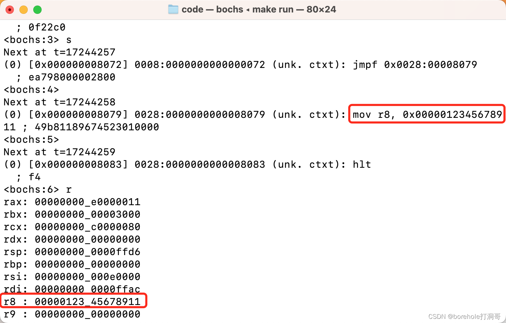

没问题，我们成功在IA-32e模式下运行了64位指令，并且给64位寄存器赋了值。

到此的项目代码将会放在附件（14-1）中，供读者参考。

### 改造剩余内核代码

既然我们成功进入了64位模式，那么将剩下的代码，改用64位编译模式，就可以链接到当前的内核中，这样我们就可以执行原本编写的C程序了。

C程序的源码是都不用改变的，我们只需要通过调整参数，让编译期按照64位的方式来编译就好了。不过有两个个地方是需要我们来管的，就是`asm_func.nas`，因为这个文件是用汇编写的，所以我们需要改造成64位指令。另一个地方是进入`entry`函数之前，有一些段和栈的配置需要改造。接下来我们一个一个来：

#### asm_func的改造

要改造的点有4处：

  1. 压栈弹栈时要匹配栈的位宽，因此要改成64位寄存器。

  2. 在64位模式下，由于段已经强制平坦了，因此不再允许用`es`加偏移来操作内存，只能用默认的`ds`，因此我们要把其中使用`es`的部分改成`ds`。

  3. 因为64位模式强制平坦，所以，原本的2号段无法使用了，我们得配一个新的数据段与其对齐。对应显存的地址也要改变。

  4. 在32位模式下，C语言规范传参方式都是通过压栈的，因此我们用`[rsp + 12]`的方法找参数。但是64位模式下，由于通用寄存器数量增加，为了更高效，会优先采用寄存器传参的方式。对于6个寄存器以下的情况，会按照`rdi`, `rsi`, `rdx`, `rcx`, `r8`, `r9`的顺序来传参，当大于6个时才会采用压栈的方式。所以读参方式要改造。

MBR的段配置处加一个6号段：

```
; 6号段-64位数据段
; 强制平坦模式，基址无效，上限0xffffffff
mov [es:0x30], word 0xffff ; Limit=0xffff，这是低16位
mov [es:0x32], word 0x0000 ; Base无效
mov [es:0x34], byte 0x0000 ; Base无效
mov [es:0x35], byte 1_00_1_001_0b ; P=1, DPL=0, S=1, Type=001b, A=0
mov [es:0x36], byte 1_0_1_0_0000b ; G=1, D/B=0, L=1, AVL=0, Limit的高4位是0000
mov [es:0x37], byte 0x00   ; Base无效

; 下面是gdt信息的配置（暂且放在0x07f00的位置）
mov ax, 0x07f0
mov es, ax
mov [es:0x00], word 55      ; 因为目前配了7个段，长度为56，所以limit为55
mov [es:0x02], dword 0x7e00 ; GDT配置表的首地址
; 把gdt配置进gdtr
lgdt [es:0x00]
```

`asm_func`改造后的代码如下：

```
[bits 64]
section .text 

global SetVMem ; 告诉链接器下面这个标签是外部可用的
SetVMem:
    ; 现场记录
    push rbp
    mov rbp, rsp
    ; 过程中用到的寄存器都要先记录
    push rbx
    push rcx
    push rdx

    ; 64位模式下不允许通过es偏移，所以只能设置ds
    mov bx, ds ; 用bx记录原本的ds，用于后续恢复现场（这里是因为寄存器还够用，如果不够用的话就还是要压栈）
    ; 把es配成数据
    mov dx, 00110_00_0b
    mov ds, dx
    ; 通过参数找到addr和data（64位优先用寄存器传参）
    mov rdx, rdi ; addr
    mov rcx, rsi ; data
    ; 通过偏移地址来操作显存（0xa0000是显存基址）
    mov [rdx+0xa0000], cl  ; 由于data是1字节的，所以其实只有cl是有效数据

    ; 现场还原
    mov ds, bx
    pop rdx
    pop rcx
    pop rbx
    mov rsp, rbp
    pop rbp
    ; 回跳
    ret
```

#### kernel的改造

在`kernel.nas`中，进入`entry`函数之前，我们要做段寄存器的配置，所以我们把`ds`、`es`和`ss`都配置为平坦模式的数据段，也就是6号段，代码如下：

```
mov ax, 00110_00_0b ; 选择6号段，数据段
mov ss, ax
; ds要跟ss一致
mov ds, ax
; es也初始化为数据段（防止后续出问题，先初始化）
mov es, ax

; 初始化栈
mov rax, 0x1000
mov rsp, rax    ; 设置初始栈顶
mov rbp, rax    ; ebp也记录初始栈顶

extern Entry
call Entry

hlt
```

#### 配置参数改造

接下来就是通过调整参数，把这些`.nas`和`.c`通过64位方式编译，并链接起来。

C编译参数要用`-m64 -march=x86-64`来生成64位的`.o`文件，`nas`的编译参数要用`-f elf64`来生成64位`.o``文件。

链接时也要用`-m elf_x86_64`参数，**而且要注意一个严重问题**，由于现在分段是平坦模式了，所以程序加载的内存地址不再是`0`的偏移量，而是`0x8000`，所以链接参数要做调整`-Ttext=0x8000`。

最后`objcopy`时也要制定参数`elf64-x86-64`，要注意这个指令的参数是用中划线而不是下划线，跟前两个指令要区分开。

完整的`kernel`的`makefile`如下：

```
.PHONY: all
all: kernel_final.bin

kernel.o: kernel.nas
	nasm kernel.nas -f elf64 -o kernel.o

entry.o: entry.c ../libc/include/stdio.h
# 需要用-I制定头文件扫描位置
	x86_64-elf-gcc -c -m64 -march=x86-64 -fno-builtin -I../libc/include entry.c -o entry.o -Wall -Werror -Wextra

../libc/libc.a:
	pushd ../libc && $(MAKE) clean && $(MAKE)  libc.a && popd

kernel_final.out: kernel.o entry.o ../libc/libc.a
# 需要用-L指定静态链接库位置
# -lc表示链接libc.a
# 注意kernel.o要放在第一个
	x86_64-elf-ld -m elf_x86_64 -Ttext=0x8000 kernel.o entry.o -L../libc -lc -o kernel_final.out

kernel_final.bin: kernel_final.out
	x86_64-elf-objcopy -I elf64-x86-64 -S -R ".eh_frame" -R ".comment" -O binary kernel_final.out kernel_final.bin

.PHONY: clean
clean:
	-rm -f .DS_Store
	-rm -f *.bin 
	-rm -f *.o
	-rm -f *.out
```

同理，调整`libc`的配置文件如下：

```
.PHONY: all
all: libc.a

font.o: font.c
	x86_64-elf-gcc -c -m64 -march=x86-64 -fno-builtin font.c -o font.o

stdio.o: stdio.c include/stdio.h
	x86_64-elf-gcc -c -m64 -march=x86-64 -fno-builtin stdio.c -o stdio.o

string.o: string.c include/string.h
	x86_64-elf-gcc -c -m64 -march=x86-64 -fno-builtin string.c -o string.o

asm_func.o: asm_func.nas
	nasm asm_func.nas -f elf64 -o asm_func.o

libc.a: asm_func.o stdio.o string.o font.o
# $^表示所有依赖文件
# ar是制作静态链接库的工具
	x86_64-elf-ar -crv --target=elf64-x86-64 libc.a $^

.PHONY: clean
clean:
	-rm -f *.o libc.a
```

#### 看一眼64位改造后的成果

都改造完毕后就可以尝试运行了，这是我们第一次在64位模式下运行完整的程序： 

完美！该部分的项目源码将会放在附件（14-2）中，供读者参考。

## 加一个C++程序

终于，我们到了邀请最终大咖登场的环节了。既然64位C语言程序已经可以正常运行，那么同理，我们把C++代码编译成`elf64`格式的文件，链接到Kernel中，照理说就大功告成了。

因此，我们先在工程中建立一个`main.cpp`，然后在`makefile`中编写对应的构建命令：

```
main.o: main.cpp
	x86_64-elf-g++ -c -std=c++17 -m64 -march=x86-64 -fno-builtin -I../libc/include main.cpp -o main.o -Wall -Werror -Wextra

# 注意链接的时候要加上main.o
kernel_final.out: kernel.o entry.o main.o ../libc/libc.a 
	x86_64-elf-ld -m elf_x86_64 -Ttext=0x8000 kernel.o entry.o main.o -L../libc -lc -o kernel_final.out
```

这里用来编译C++代码的指令是`x86_64-elf-g++`，这里我们指定C++17标准，其余参与跟C语言的`entry.c`相同，不再赘述。

然后我们在`main.cpp`中实现`main`函数，但是有一点要注意，因为程序实际的入口是`Entry`，所以需要在`Entry`中调用`main`函数。不过既然已经有了这一步调用，我们索性就把函数返回值打印出来，代码如下：

```c
void Entry() {
  // 背景设置为白色
  SetBackground(0x0f);
  
  extern int main();
  int ret = main();
  printf("main() returned by: %d", ret);
}
```

接下来我们来实现`main`函数。有一点需要注意的是，由于C++是支持函数重载的，所以参与链接的函数符号并不仅仅是函数名，还包含了参数信息。这种构建方式是C语言不支持的，因此，我们想在`entry.c`中调用`main.cpp`中的`main`函数，还需要对这个函数进行额外的声明，告诉编译器采用原始C的方式做链接符号。

声明的方法是使用`extern "C"`关键字。需要知晓的是，用C方式编译的函数不再支持重载，但可以和C语言源码链接上：

```c
extern "C"
int main() {
  return 0;
}
```

好了，运行一下看看效果吧： 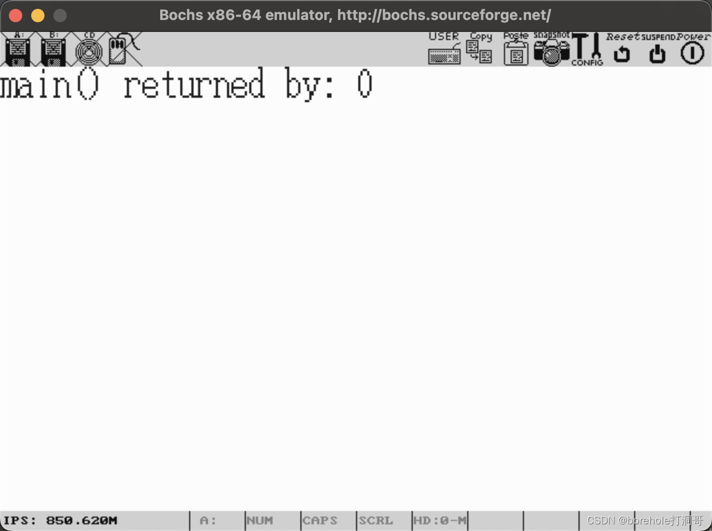

大功告成，我们实现了「从裸机启动开始运行一个C++程序」的任务，撒花！！~~

……

真的大功告成了吗？哈哈！当然没那么简单，C++不像C那么纯粹，它存在很多隐含的动作，只是因为目前`main`函数过于简单，我们还没有踩任何坑而已。

因此，我们不能过于激动，还是要沉下心来继续进行一段修炼。 不过不用操之过急，可以先享受片刻胜利的喜悦，下一章我们再来看看上了C++之后会碰到哪些问题。

到此的项目源码会放入附件（14-3）中，供读者参考。

## 艰辛的C++程序

### 趁热打铁

上一章的最后咱们已经成功把C++文件链接进Kernel了，趁热打铁，我们用C++语法来实现绘制图形的功能，比如我们可以将绘制点和绘制矩形的方法封装成类，通过调用`SetVMem`进行操作。代码如下：

```c
extern "C" { // 由于这些库都是C方式的，因此需要额外声明
  #include <stdint.h>
  extern void SetVMem(long addr, uint8_t data); 
}

constexpr int screen_width = 320;
constexpr int screen_length = 200;

class Point {
 public:
  Point(int x, int y);
  ~Point() = default;
  void Draw(uint8_t color) const;

 private:
  int x_, y_;
};

Point::Point(int x, int y): x_(x), y_(y) {}

void Point::Draw(uint8_t color) const {
  SetVMem(y_ * screen_width + x_, color);
}

class Rect {
 public:
  Rect(int x, int y, int width, int length);
  ~Rect() = default;
  void Draw(uint8_t color) const;

 private:
  int x_, y_, width_, length_;
};

Rect::Rect(int x, int y, int width, int length): x_(x), y_(y), width_(width), length_(length) {}

void Rect::Draw(uint8_t color) const {
  for (int i = 0; i < width_; i++) {
    for (int j = 0; j < length_; j++) {
      Point{x_ + i, y_ + j}.Draw(color);
    }
  }
}

extern "C"
int main() {
  Rect{10, 10, 50, 30}.Draw(0x26);
  return 0;
}
```

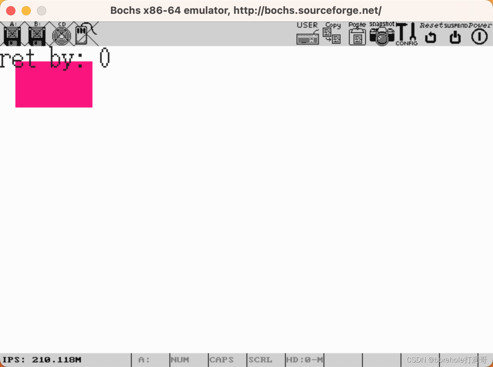

目前功能都没有问题，接下来我们要做一下工程源码的整理。

### C库的C++改造

由于我们要将C库引入到C++代码中，所以如果都是在C++中显式使用`extern "C"`就会很麻烦，因此好的做法是，把这种差别体现在头文件中，无论是C语言还是C++都可以直接使用。

编译器用于区别C还是C++源码的方法是通过一个编译宏`__cplusplus`，这个宏同时还表示了C++版本。因此，我们在头文件中进行判断，如果含有这个宏，就自动添加`extern "C"`，否则不添加。也就是这样：

```c
#ifdef __cplusplus
extern "C" {
#endif

// 这里是头文件的实际内容
// ...

#ifdef __cplusplus
}
#endif
```

我们将C库中的所有头文件都按这种方式改造，并且把`SetVMem`函数也提供在`stdio.h`中。这样，对于`main.cpp`来说，只需要正常引入头文件即可。

### 将图形绘制相关代码独立

我们把挤在`main.cpp`中的图形绘制相关代码单独抽出去，创建`graphic_ui.hpp`和`graphic_ui.cpp`文件。

```c
// graphic_ui.hpp
#pragma once
#include <stdint.h>

namespace ui {

constexpr int screen_width = 320;
constexpr int screen_length = 200;

class Point {
 public:
  Point(int x, int y);
  ~Point() = default;
  void Draw(uint8_t color) const;

 private:
  int x_, y_;
};

class Rect {
 public:
  Rect(int x, int y, int width, int length);
  ~Rect() = default;
  void Draw(uint8_t color) const;

 private:
  int x_, y_, width_, length_;
};

}
```

```c
// graphic_ui.cpp
#include "graphic_ui.hpp"
#include <stdio.h>

namespace ui {

Point::Point(int x, int y): x_(x), y_(y) {}

void Point::Draw(uint8_t color) const {
  SetVMem(y_ * screen_width + x_, color);
}

Rect::Rect(int x, int y, int width, int length): x_(x), y_(y), width_(width), length_(length) {}

void Rect::Draw(uint8_t color) const {
  for (int i = 0; i < width_; i++) {
    for (int j = 0; j < length_; j++) {
      Point{x_ + i, y_ + j}.Draw(color);
    }
  }
}

}
```

同时，加上对应的`makefile`：

```
.PHONY: all
all: kernel_final.bin

kernel.o: kernel.nas
	nasm kernel.nas -f elf64 -o kernel.o

graphic_ui.o: graphic_ui.cpp graphic_ui.hpp
	x86_64-elf-g++ -c -std=c++17 -m64 -march=x86-64 -fno-builtin -I../libc/include graphic_ui.cpp -o graphic_ui.o -Wall -Werror -Wextra

main.o: main.cpp graphic_ui.hpp
	x86_64-elf-g++ -c -std=c++17 -m64 -march=x86-64 -fno-builtin -I../libc/include main.cpp -o main.o -Wall -Werror -Wextra

entry.o: entry.c ../libc/include/stdio.h
# 需要用-I制定头文件扫描位置
	x86_64-elf-gcc -c -m64 -march=x86-64 -fno-builtin -I../libc/include entry.c -o entry.o -Wall -Werror -Wextra

../libc/libc.a:
	pushd ../libc && $(MAKE) clean && $(MAKE)  libc.a && popd

kernel_final.out: kernel.o entry.o main.o graphic_ui.o ../libc/libc.a 
# 需要用-L指定静态链接库位置
# -lc表示链接libc.a
# 注意kernel.o要放在第一个
	x86_64-elf-ld -m elf_x86_64 -Ttext=0x8000 kernel.o entry.o main.o graphic_ui.o -L../libc -lc -o kernel_final.out

kernel_final.bin: kernel_final.out
	x86_64-elf-objcopy -I elf64-x86-64 -S -R ".eh_frame" -R ".comment" -O binary kernel_final.out kernel_final.bin

.PHONY: clean
clean:
	-rm -f .DS_Store
	-rm -f *.bin 
	-rm -f *.o
	-rm -f *.out
```

主函数则改造为：

```c
#include <stdint.h> // 改造后的头文件可以直接引用
#include "graphic_ui.hpp"

extern "C"
int main() {
  ui::Rect{10, 10, 50, 30}.Draw(0x26);
  return 0;
}
```

至此的项目源码放在附件（15-1）中，读者可自行验证。

### 绘制圆

已经有了绘制点和矩形的类了，我们想再添加一个绘制圆形的类。圆需要圆心和半径来确定，而圆形就是一个点，因此这里我们正好可以测试一下类的组合。代码如下：

```c
// graphic_ui.hpp
class Circle {
 public:
  Circle(const Point &center, int radium);
  ~Circle() = default;
  void Draw(uint8_t color) const;

 private:
  Point center_;
  int radium_;
};

// graphic_ui.cpp
Circle::Circle(const Point &center, int radium): center_(center), radium_(radium) {}

void Circle::Draw(uint8_t color) const {
  // 采用点阵扫描的方法，沿着x轴，从(c.x - r, c.y)开始，一直绘制到(c.x + r, c.y)
  // 中间横坐标每增加1，就计算当前横坐标上，符合(x-c.x)²+(y-c.y)²≤r²的纵坐标值，并绘制颜色
  for (int x = center_.x - radium_; x <= center_.x + radium_; i++) {
    // y = c.y±√(r²-(x-c.x)²)
    int y1 = center_.y - ::sqrt(radium_ * radium_ - (x - center_) * (x - center_));
    int y2 = center_.y + ::sqrt(radium_ * radium_ - (x - center_) * (x - center_));
    for (int y = y2; y < y1; y++) {
        Point{x, y}.Draw(color);
    }
  }
}
```

由于这里需要开平方的能力，因此我们在C库中添加`math.h`和`math.c`，同时实现`sqrt`函数：

```c
// math.h
#ifdef __cplusplus
extern "C" {
#endif
#include "stdint.h"

int abs(int n);
int sqrt(int n);

#ifdef __cplusplus
}
#endif
```

```c
// math.c
#include "include/math.h"

int abs(int n) {
  if (n < 0) {return -n;}
  return n;
}

int sqrt(int n) {
  if (n < 0) {return 0;}
  // 由于是整数，直接暴力尝试
  for (int i = 0; i < n; i++) {
    if (i * i <= n && (i + 1) * (i + 1) >= n) {
        return i;
    }
  }
  
  return 0;
}
```

之所以这里用整型，主要是当前没有配置浮点型的相关运算，在Intel体系中，浮点运算是又x87部件运行的，所以这部分都有单独的运行指令，而我们没有做相关配置，所以只要程序中出现浮点型，就会执行失败。不过当前需求下整型也完全够用了，所以这里先用整型。

主函数中绘制圆看看结果：

```c
#include <stdint.h>
#include "graphic_ui.hpp"

extern "C"
int main() {
  ui::Circle{{100, 100}, 80}.Draw(0x23);

  return 0;
}
```

效果如下：

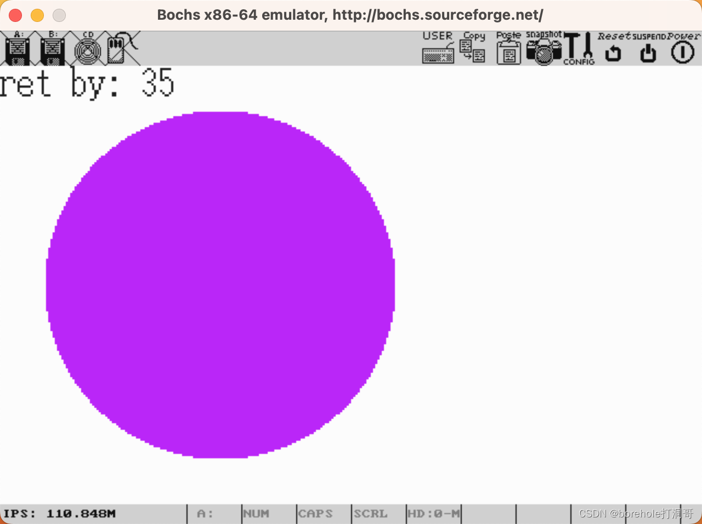

圆已经可以绘制出来了，但这个返回值为什么是`35`呢？看来上了64位以后，变参的获取方式也存在了一些问题。之前我们在`stdarg.h`中是这样定义的：

```c
#define va_start(varg_ptr, last_val) (varg_ptr = ((uint8_t *)&last_val + sizeof(last_val)))
```
在64位环境下这个写法是有问题的，原因很简单，我们之前提到过，因为在64位环境下，函数参数并不是全部压栈的，而是优先进入寄存器。虽然，为了解析这些参数，编译器还是会把它们重新入栈，但有一个严重的问题，就是`last_val`和真实变参并不是连续的。

比如，我们定义如下变参函数：

```c
void Demo(int a, ...) {}
```

汇编后是：

```
Demo(int, ...):
        push    rbp
        mov     rbp, rsp
        sub     rsp, 72
        mov     DWORD PTR [rbp-180], edi ; a
        mov     QWORD PTR [rbp-168], rsi ; arg1
        mov     QWORD PTR [rbp-160], rdx
        mov     QWORD PTR [rbp-152], rcx
        mov     QWORD PTR [rbp-144], r8
        mov     QWORD PTR [rbp-136], r9
        test    al, al
        je      .L3
        movaps  XMMWORD PTR [rbp-128], xmm0
        movaps  XMMWORD PTR [rbp-112], xmm1
        movaps  XMMWORD PTR [rbp-96], xmm2
        movaps  XMMWORD PTR [rbp-80], xmm3
        movaps  XMMWORD PTR [rbp-64], xmm4
        movaps  XMMWORD PTR [rbp-48], xmm5
        movaps  XMMWORD PTR [rbp-32], xmm6
        movaps  XMMWORD PTR [rbp-16], xmm7
.L3:
        nop
        leave
        ret
```

可以看到`a`与第一个变参之间并不是差64位。而且，这个值会随着`Demo`中局部变量的增加而改变。

因此，在64位环境下，我们不能在通过简单的宏定义来完成，编译器会把变参从寄存器中，先取出来放在栈内的某一个空间（比如上例中的`rbp-168`），然后当调用`va_arg`时，再把指针指向对应的参数位置。

由于在这种场景下，语言标准并没有定义这些参数从寄存器中取出来后如何布局，因此这些行为完全由编译器来决定。编译器自身实现了这些变参的解析功能，所以，我们直接调用编译器的内建函数：

```c
// 通过编译器内建功能来完成
typedef __builtin_va_list va_list;
#define va_start(v, l) __builtin_va_start(v, l)
#define va_arg(v, t) __builtin_va_arg(v, t)
#define va_end(v) __builtin_va_end(v)
```

而具体的`__builtin`方法的实现，交由编辑器即可。

所以，改造完这个以后我们再看看运行结果： 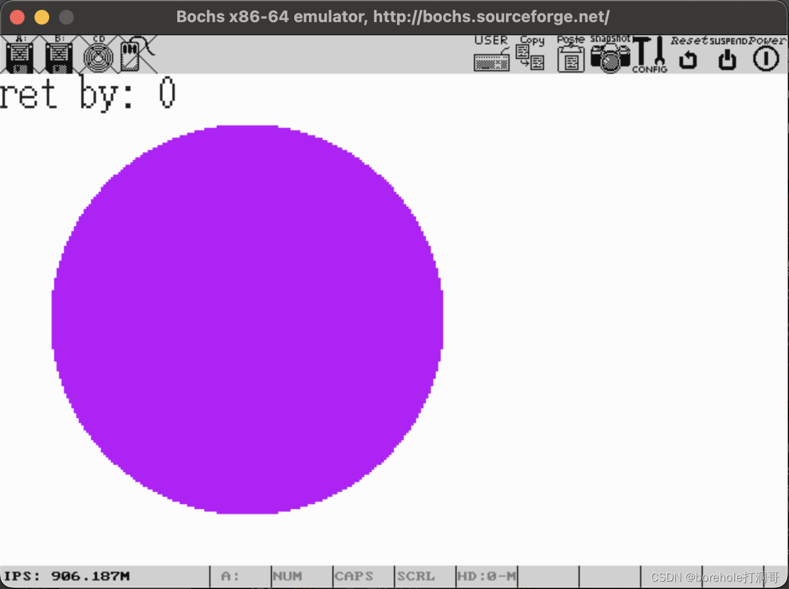

这个小bug也解决了。

至此，工程源码将会在附件（15-2）中，供读者参考。

### 虚函数链接问题

在编写图形渲染类的时候大家应该能够发现一个问题，就是`Point`,`Rect`,`Circle`都属于「图形」，并且都实现了用于渲染的`Draw`方法，因此，按照OOP设计，它们应当同属一个父类。

因此我们抽象一个`Shape`父类，将`Draw`方法改为虚函数。代码如下：

```c
#pragma once
#include <stdint.h>

namespace ui {

constexpr int screen_width = 320;
constexpr int screen_length = 200;

class Shape {
 public:
  virtual void Draw(uint8_t color) const = 0;
};

class Point : public Shape {
 public:
  Point(int x, int y);
  ~Point() = default;
  void Draw(uint8_t color) const override;
  int x() const {return x_;}
  int y() const {return y_;}

 private:
  int x_, y_;
};

class Rect : public Shape {
 public:
  Rect(int x, int y, int width, int length);
  ~Rect() = default;
  void Draw(uint8_t color) const override;

 private:
  int x_, y_, width_, length_;
};

class Circle : public Shape {
 public:
  Circle(const Point &center, int radium);
  ~Circle() = default;
  void Draw(uint8_t color) const override;

 private:
  Point center_;
  int radium_;
};

}
```

不过这时，构建的时候就会发现以下报错：

```c
x86_64-elf-ld: graphic_ui.o:(.rodata._ZTIN2ui6CircleE[_ZTIN2ui6CircleE]+0x0): undefined reference to `vtable for __cxxabiv1::__si_class_type_info'
x86_64-elf-ld: graphic_ui.o:(.rodata._ZTIN2ui4RectE[_ZTIN2ui4RectE]+0x0): undefined reference to `vtable for __cxxabiv1::__si_class_type_info'
x86_64-elf-ld: graphic_ui.o:(.rodata._ZTIN2ui5PointE[_ZTIN2ui5PointE]+0x0): undefined reference to `vtable for __cxxabiv1::__si_class_type_info'
x86_64-elf-ld: graphic_ui.o:(.rodata._ZTIN2ui5ShapeE[_ZTIN2ui5ShapeE]+0x0): undefined reference to `vtable for __cxxabiv1::__class_type_info'

```

报错是链接阶段的，说是没有找到`__cxxabiv1::__si_class_type_info`和`__cxxabiv1::__class_type_info`的虚函数表。那这又是个什么东西呢？

从命名上我们可以得知，这玩意属于「C++ ABI v1」，也就是Application Binary Interface，应用程序二进制接口。也就是说，这应当是OS为App所实现的通用接口。作为应用程序App，在构建时，会依赖操作系统提供的这些接口。

上面缺少的`type_info`相关信息，就是C++ App在运行时RTTI(Run-Time Type Identification)所使用的一些类型信息。

正常来说，ABI的实现都在libc++库中，由对应的OS来提供。但这件事奇怪的点就在于，我们当前就是内核程序，并不是App，谁来提供ABI呢？显然，也只有我们自己了。

不过既然我们目前并没有RTTI的需求，所以我们构造一个假的，只要能让链接器找到就好了。代码如下：

```c
namespace __cxxabiv1 {
  struct __si_class_type_info {
    virtual void f() {} // 必须有一个虚函数，才能构建虚函数表
  } ins1; // 必须至少有一个对象实例，才能促使类型构建虚函数表

  struct __class_type_info {
    virtual void f() {}
  } ins2;
}
```

这样再重新构建，发现正常了，运行结果如下： 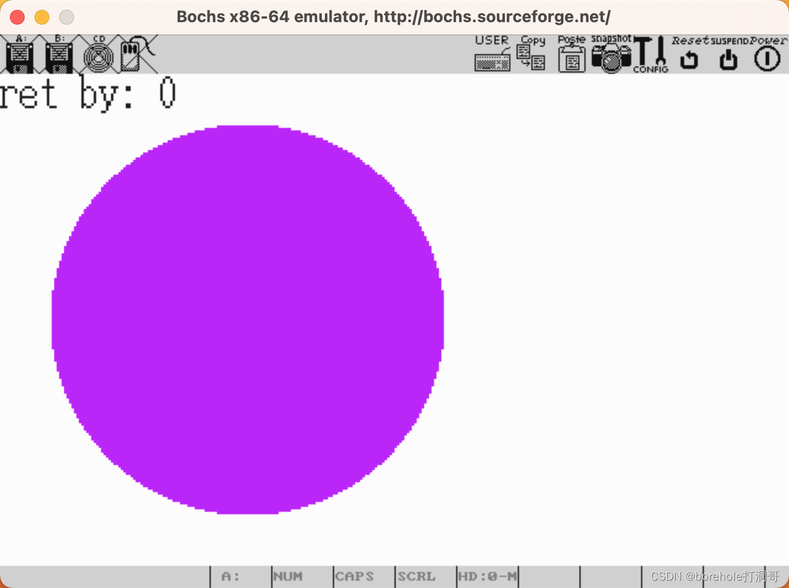

当然，这只是目前需求的做法，如果你真的想继续使用C++的其他功能，那对应的ABI还是要好好实现的。这也是很多人说C++并不适合写内核，原因就在这，它并不像C那样纯粹，必须依赖很多额外的东西才能够正常构建，而在写内核的时候这些东西往往是缺失的。

目前的项目源码将会在附件(15-3)中，供读者参考。

## 终章

本系列文章已经接近尾声，最后的这一章还是照例来进行总结、归纳、答疑、填坑和讲故事。

### 回答序章的问题

在前言序章的时候，笔者曾经提过一些被问到的问题：

  1. 空指针到底能不能访问？(`int *p = nullptr; *p = 5;`)

  2. 给一个变量取地址，取到的是不是物理地址？(`int a; std::cout << &a;`)

  3. 操作一个常数地址是否合法？（`*(int *)0xa0000 = 0x41;`）

  4. 全局变量、静态局部变量、字符串字面量等在内存中是如何布局的？

  5. C/C++程序如何编译为内核代码，运行在内核态程序上？

  6. gdb过程中，看到的寄存器是否是真实的？

现在到了解答的时候了，有了从裸机启动一直到运行C++程序的这个经历，想来再回头看这几个问题一定会有不一样的视角。

#### 空指针能不能访问？

这个问题其实应该分成两个维度来回答。首先我们要搞明白「空指针」和「0值指针」的关系。

从C++语言设计哲学上来说，「空指针」是有独立语义的，就是没有指向任何地址的指针。而「0值指针」则是指向地址为`0x0`的指针。这二者是有本质区别的。

只不过在编译器实现的时候，考虑到`0x0`地址通常是已经被占用的地址，因此将它**作为**空地址的符号。如果不这样做的话，就必须要用额外的标识来表示空值。大家可以参考`std::optional`，比如说下面二者就是不等价的：

```cpp
std::optional<int> a = std::nullopt; // 空值
std::optional<int> b = 0;			 // 0值
```

因此，按语言设计这个维度来说，空指针确实应当是不可访问的，但是0值可以。而实际上，由于编译器把0值作为了空值，因此，即便我们用空值来赋值指针，其实也被转换为了0值：

```c
int *p = nullptr; // 空值语义，但实际上会转换为0值
int *p = reinterpret_cast<int *>(0);
```

但是，如果编译器开启了优化，那么对于空值则可能会有一些UB上的优化，而0值则一定会作为普通指针。关于这一点感兴趣的读者可以参考[《C++中那些你不知道的未定义行为》](https://blog.csdn.net/fl2011sx/article/details/129686793)

那么回到问题本身，语义上的空指针不可访问，但0值指针（包括被编译器实现为0值的指针）是可以访问的，`0`在这里其实是段偏移地址。而至于这个地址到底能不能正常访问取决于端配置，只要权限是匹配的，就可以访问（参考我们前面用显存段写输出的那个例子，显存段的`0`号偏移地址就是一个可操作的地址）。

#### 给一个变量取地址，取到的是不是物理地址？

这个答案也很明确了，不一定是物理地址。我们取到的其实是段偏移地址。

对于没有分页的系统来说，段基址+段偏移地址就是物理地址。而对于有分页的系统来说，段基址+段偏移地址得到线性虚拟地址，再通过页表转换后才可以得到物理地址。

#### 操作一个常数地址是否合法？

这个问题我们在前面例程中得到了非常充分的验证，直接操作一个常数地址是完全没有问题的，这个常数就是段偏移地址。

这件事之所以反直觉，主要是我们平时编写应用程序的时候，你对该程序将来会被OS分配到哪个段、哪个页、哪片地址是不清楚的，所以常数地址大概率是踩到了对当前程序无权限的部分，因而被OS拦截。

但如果是内核程序，并且在合法的段内操作合法的地址，那常数地址完全没有问题。

#### 全局变量、静态局部变量、字符串字面量等在内存中是如何布局的？

这个问题我们在初次链接C程序的时候踩过坑，相信大家也印象深刻了。

全局变量、静态变量和字符串字面量其实都在程序的`.Text`段中，但会独立于指令单独存放。程序中会使用这个位置相对于`ds`的段偏移地址。当需要读取和操作的时候，也是通过`ds`加这个地址来找到对应内存位置的。

#### C/C++程序如何编译为内核代码，运行在内核态程序上？

这个问题我们也全流程体验了一遍，首先要把C/C++文件编译为`elf`格式的文件。同时，要把用于引导的汇编指令也编译成`elf`格式，然后和前面的`elf`进行链接，并且保证汇编头在最前面的位置，保证二进制装载后的首地址可控。

链接后的文件再用`obj-copy`提取出中间核心的部分，就可以作为内核态指令加载到内存中了。只要能够保证MBR初始化时能够把这部分指令加载进内存中，并做正确的跳转，就能正常执行这部分内核代码。

#### gdb过程中，看到的寄存器是否是真实的？

gdb调试是调试应用程序的手段，对于我们编写内核程序肯定是无能为力的。但我们体验过内核程序以后应该能够知道，应用程序运行和内核运行的唯一区别在内存，也就是内核需要先给应用程序来分配内存页，然后再去加载应用程序。

然而，执行应用程序的时候，各种内存偏移可能会跟实际物理情况不符，但寄存器是不受影响的，至少在AMD64体系中，不存在虚拟寄存器的说法。因此，应用程序运行中寄存器一定是真实的，但内存地址并不是实际的物理地址。

所以我们通过gdb或者lldb等调试工具来运行程序时，获取到的这些寄存器的值，至少在应用程序实际执行到这个位置时的情况一定是相符的。

### 额外的思考

#### 高级语言和汇编语言的区别

在前面章节我们做64位改造的时候，就有一个非常经典且有趣的事情。就是我们要对进入IA-32e模式后的所有汇编指令进行改造，包括`asm_func.nas`，但C语言源码却是可以一个字符都不变。

C语言代码适配的方式是取改编译指令，比如说`--m64`这些。换句话说，高级语言本身是不假定它的运行硬件架构的，这个转换工作由编译器完成。同一份代码，你可以把它编译成任意架构（只要编译器支持）的机器指令。

而汇编则不同，汇编原本就是机器指令的另一种展示，所以它强依赖于运行环境，硬件不支持的指令你想都不用想，肯定没有汇编。就类似于`mov es, 0x80`这种语法就是错误的，因为没有对应的机器码。我们必须用`mov ax, 0x80`和`mov es, ax`两条指令来完成。当然，如果切换了运行架构，那么所有的汇编指令也都要做对应的改造。

#### C语言适合写内核而C++不适合

这一个说法相信读者也能在很多场合听过，笔者也是，但事实上必须要自己亲自体验一遍才能深刻理解。

我们在链接C语言后，发现这件事情没什么太大压力，咱们把想要的功能用C语言写出来，然后丢给编译器就好了，内核就能正常执行。但是换成C++后，就会发现编译、链接阶段都会出现很多依赖问题，我们就不得不去研究ABI，实现一些额外的事情才能让代码正常构建。

换句话说，C语言可以脱离C的标准库、链接库等来独立使用，我们一个独立的C源码，不依赖任何额外由OS提供的功能，也可以轻松构建，所以用它来写内核就很容易。

但C++不行，C++默认你OS已经提供了很多功能的实现，我们前面体验了ABI确实导致的链接问题，其实还远不止这些，有的地方C++还对STL有依赖，比如说`std::initializer_list`，如果你不去单独实现的话，编译都无法通过。

所以，我们才看到很多大佬都理所应当使用C来编写内核，而不是C++。同时也正是因为C++的这种黏性太强，让一些大佬对C++嗤之以鼻，尽管它提供了很多方便的功能是C没有的，但还是由于门槛和成本太高，在内核介不受欢迎。（注意，只是说「不适合」，但绝对不是「不可以」。）

新时代里C语言确实已经开始有点力不从心了，但编写内核这样的需求确实一直存在，并且逐步扩大的。这种场景下也诞生了一些新的语言，更适合写内核，但同时提供了很多C不具备的功能，修复了很多C的缺陷。比如说Rust语言，同样值得大家来学习研究。

#### 向下兼容

笔者在前面章节也提到过，计算机启动的过程像是计算机硬件发展的历史流程的缩影，类似于生物在母体发育的过程像是生物进化的历史流程的缩影。

对于AMD-64架构的设备来说，开机时就是一个8086，后面再通过一些配置，逐渐变成286、386，再到64位模式。出现这种情况的原因就是它始终保持了向下兼容，才能在不断迭代进化中生存下去。

如果大家用过一些比较有名的开源库的话，也会发现很多类似的情况，比如说某个API的名称，明显不合理（比如说用了一个跟实际意义完全不符的名称，或者参数类型明显不对）的情况。开发者早都发现了它，但通常并不会直接删除这个错误的API，而是额外添加一个正确的API，并保留原本的API，然后在内部做一个适配转发，同时会在API文档中标注`deprecated`以及应当使用的API名。

原因也很简单，就是为了兼容。尽管你用了一个错误的API，但可能很多项目已经依赖了它，并把它用在了正确的地方。那这个时候你的「修错」动作反而可能会造成更大的后果，因此选择保留。

但，这样持续迭代下去，会导致历史包袱越来越大，慢慢阻碍后面的发展，因此，我们还得在一定时间段去逐渐下线它。例如C++标准中，有一些旧的语法，虽然不会在决定下线它的时候马上就直接删除，但再过几个版本可能就会了。所以我们可能会看到一些「计划废弃」和「废弃」的语法或API，以及类似于「C++14中标记为计划废弃，不建议使用；C++20中正是废弃」之类的描述。

无独有偶，Intel公布的x86S就是在做这样的事情，毕竟这个年代了，8086确实考虑可以考虑退出历史舞台了。

### 心得体会

到了讲故事的环节啦！笔者想聊一聊写这篇文章的心路历程。

其实能从裸机运行开始就把控它，让它运行自己写的程序，这件事一直以来都是笔者的一个心愿，我相信也是很多计算机爱好者共同的心愿。因为我们接触电脑肯定不是从裸机开始接触的，我们印象里都是开机后等待OS加载，OS好了我们再打开要用的功能。包括学编程的我们，写出来的程序也是在特定OS上运行的。这就让人非常好奇，OS本身到底是怎么运行的，电脑开机以后都做了什么。

为了能搞清楚这个问题，我查过非常多的资料，阅读多很多相当厉害的书籍教程。笔者一开始研究这件事情，是因为有一本书，日本作者川合秀実（かわいひだみ）编写的《30日でできる！OS自作入門》，由浅入深讲解了如何从裸机启动，到运行一个简单的操作系统。按照这本书的方法，我们甚至可以写出一个带鼠标操作，可以执行多任务应用程序的简易操作系统。笔者当初托人从日本带回了日语原版的来研究，收获非常大。本篇文章中使用的字体文件，就是参考这本书中来编写的，在此万分感谢这本书提供的宝贵的素材和知识。

但这本教程有一个问题，就是他着重讲解的是，基于C语言，如何实现操作系统的基本功能，而对于汇编的部分，以及汇编和C联合构建的部分确实没有做讲解的。作者直接在这本书的附送光盘里，把所有构件用的工具都附带进去了，还很贴心地提供了`bat`文件，我们改完代码，直接双击就可以完成构建。同时，他使用了作者自己优化过的汇编工具——`nask`，但这玩意这本书独一份的，找不到迭代版本也找不到详细的文档资料。但也正是因为这个，勾起了笔者很大的胃口，因为中间这部分能力是缺失的，对我来说是黑盒，我不知道这些工具做了什么，也不知道这些工具是川合さん自己提供的，还是业界通用的工具。

另一方面，这本书由于年代久远，它讲解的只有32位环境，也就是基于IA-32架构的，同时，提供的构建工具也只支持Windows系统。

所以，笔者只能再去查阅其他资料，来解决以下这几个问题：

  1. 进入内核之前要做哪些配置，哪些是必须的，哪些是可选的？

  2. C程序怎么跟汇编程序链接，怎么从汇编指令跳转到C函数？

  3. 怎么进入64位模式，64位模式下C程序的编译跟32位的有哪些不同？

于是，笔者带着这些问题，继续去寻找资料。先是找到了一本由李忠、王小波、余洁编写的《x86汇编语言：从实模式到保护模式》，这是笔者发现的第二本宝藏教程。这本书中也是通过编写模拟内核的方式来讲解汇编语言的，并不是像大多数汇编教材那样，是编写用户态的应用程序。因而笔者从这本书中学到了很多裸机启动时的事情，包括8086实模式要做的事情、进入保护模式要做的GDT的配置、进入保护模式的方法、系统分页的方法等等。可以说，这本书已经非常好地讲解了如何在IA-32架构下启动和编写内核。而且他用了`nasm`、`bochs`这些业界通用的工具，并且跨平台，我在Mac上也能很方便地学习和实验。

但这只解决我的第一个疑问，后面的两个怎么办呢？比如如何让C跟汇编去链接。《x86汇编语言》里没有使用C语言，而《OS自作入門》里是用自带工具来做链接的，内部黑盒。无奈，我只能继续寻找其他资料。于是，我找到了田宇的《一个64位操作系统的设计与实现》。这本书与《OS自作入門》类似，重点是在操作系统原理和实现的部分，但它却用了`nasm`编写汇编头，并且使用`gcc`、`ld`等GNU工具作为构建工具，因此，笔者主要攻克的是这本书给出的`makefile`。不过虽然找到了编译参数，但书中并没有对这些参数的用法和意义做详细的介绍，只是给出了这个构建命令而已。

但这没关系，这已经离我的目标更进一步了，我着重去查相关参数的说明文档，这就包括了GNU的官方说明文档，以及很多散落在各个社区、论坛的一些零星的讨论。终于拼凑出了完整的，将汇编和C源码链接，生成二进制的方法。但是后续实验时又发现，链接后的文件指令顺序不符合预期，因为MBR跳转后并没有到Kernel的部分，而是直接跳到了C构建出的某个函数里。在经历了多次尝试之后终于发现，这个顺序跟链接时传入的参数顺序一致，所以要把Kernel头放在第一个参数。

搞定了链接问题，最后就是64位模式。虽然在《一个64位操作系统的设计与实现》中确实就是一个64位的操作系统了，但前期从实模式一直进入IA32-e模式的配置这部分介绍得又非常少，只能看到对应的代码但对这部分的知识确是缺失的，于是为了补齐这部分内容，笔者又找到了邓志著的《x86/x64体系探索与编程》，才看到了从实模式/保护模式进入IA-32e的方法以及需要的配置。但其实这个过程也并不顺利，就比如这本书中配置页表的时候，单纯用了4行代码就完成了，但并没有详细绍4级页表结构的设计方法，以及如何控制页的大小（4KB或2MB或1GB），笔者也去网上搜索了大量资料。

因此，最后能梳理出从裸机启动到内核C++程序的完整过程，绝非单一某个资料或教程就可以领悟。这个过程中最大的几点体会就是：

  1. 领域内详细资料很多，但跨领域穿线的资料少之又少。前面介绍的几本书中，都对它本身主题的内容有非常详细和深入的介绍，但单看某一本这整件事情都是无法串起来的。

  2. 不要指望能搜到某一个资料是正好100%命中自己的需求的。要通过各种资料理解和变通，最后再组装成自己要的知识。

  3. 实践是检验真理的唯一标准。任何渠道获取到的内容都可能是不对的，或者说，你的理解和作者想表达的意思很有可能出现偏差，因此不能轻信任何一条结论，一定要通过自己动手实验去验证。

经常有人问笔者「你都是从哪学会这些知识的呀？」「你是看哪本书学的XXX知识呀？」「能不能给我推荐一些教程呀？」这里也是希望通过这个例子来告诉读者上面3点体会，获取知识的途径其实会经历很多坎坷的，一定不要做伸手党，指望有唾手可得的知识，而是要通过自己的努力不断获取。

最终，笔者前后用了差不多半年的时间，边学习边实验边输出，整理出这篇文章。这篇文章最主要的作用就是穿线，而不是对每一个领域做深入。因此，虽然最后我们运行了内核态程序，但其实离一个真正可用的OS内核还相差甚远。但这也正是笔者的目的，笔者希望尽可能用细线来穿，减少多余的东西。比如说IDP（中断配置表）就没有进行讲解和配置，因为即便没有这个环节，我们也能运行内核态64位程序，所以笔者希望大家可以不受这个东西的干扰。

当然，如果读者对中间某个环节感兴趣，也可以很方便地继续深入研究，因为沿着这个维度的资料是很丰富的，各个领域都有更加深入和更加详细的资料供大家学习。本文旨在填补「穿线引导」这个环节的空缺，读者可以将本文作为学习底层原理的一个引子，来增加知识广度和延展性，然后再向自己感兴趣的领域继续深入学习。

【完结】

附件(2)

[ 从裸机启动一个C++程序-demo_code.zip](./zip/从裸机启动一个C++程序-demo_code.zip)
