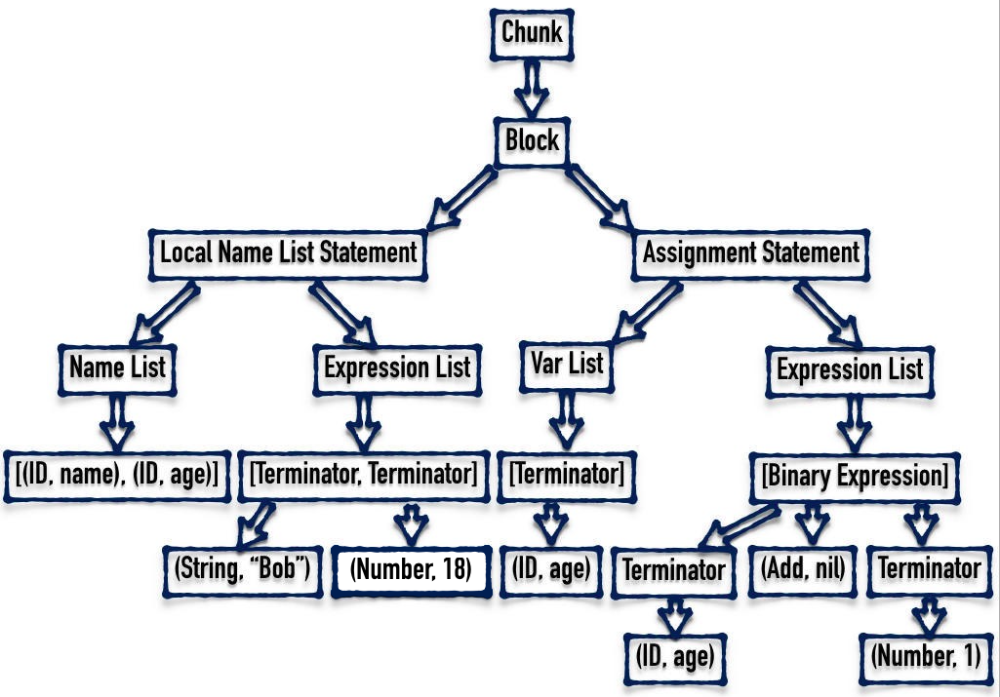
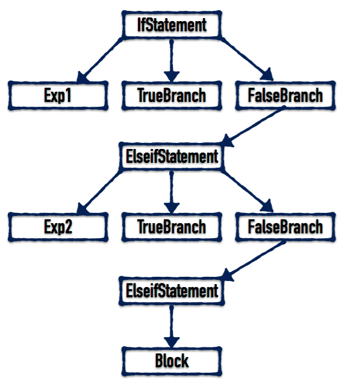

<!--BEGIN_DATA
{
    "create_date": "2016-06-15 13:03", 
    "modify_date": "2016-06-15 13:17", 
    "is_top": "0", 
    "summary": "从零开始实现Lua解释器", 
    "tags": "Lua", 
    "file_name": "从零开始实现Lua解释器.md"
}
END_DATA-->

原文出处：<a href="http://www.jianshu.com/p/e6e807fe51ec" target="blank">从零开始实现Lua解释器之介绍</a>

##从零开始实现Lua解释器之介绍

> **警告⚠️**：这将是一个又臭又长的系列教程，教程结束的时候，你将拥有一个除了性能差劲、扩展性差、标准库不完善之外，其他方面都和官方相差无几的 Lua
语言解释器。说白了，这个系列的教程实现的是一个玩具语言，仅供学习，无实用性。请谨慎 Follow，请谨慎 Follow，请谨慎 Follow。

####前言

* * *

编译原理是计算机科学的一个重要且复杂的知识体系。这个系列教程也只是你入门前的垫脚石。但即使如此，也并不代表这个教程就很简单，如果决定开始，请坚持到底。这是一
个认真严肃的教程(咳咳)，它不像网络上的其他类似教程，要么实现一个“高级计算器”就完事了，要么语法分析还没讲完，就太监了。也不像其他的 Lua
源码阅读类的指导教程，去教你怎么阅读并理解官方实现的 Lua 解释器的源码。但我相信完成本教程后再去读官方实现的源代码，也会轻松很多。

本教程将从零开始，一砖一瓦的构建出一个完整的解释器。不使用任何自动化的工具，也不使用任何第三方库，从词法分析到虚拟机，全部亲力亲为。我们将要实现的语言起名为
SLua，意思是 Simple Lua。

####前置要求

* * *

本教程并不是面向编程初学者的，你至少需要满足以下要求才可以继续阅读：

  * 本教程使用的编程语言为 Google 出品的 Go 语言。Go 语言上手非常容易，如果你有过其他任何语言的编程经验，请花几个小时阅读这篇教程：[墙外多语言版](https://tour.golang.org/)、[墙内中文版](https://tour.go-zh.org/)。

  * 本教程的定位不是教科书，因此不会过多的提及关于编译原理的理论性的内容，而更加注重实践。所以，这要求你至少要知道编译过程流水线的基本步骤以及每个步骤的作用，比如：词法分析、语法分析、虚拟机等。

  * 既然要实现 Lua 语言的解释器，自然要求你熟悉 Lua 语言，即使没有用它写过项目，至少要熟悉 Lua 语言的语法及语言特性。

####面向人群

* * *

  * 如果你很想知道脚本语言的解释器的工作原理，请继续阅读。
  * 如果你不仅想知道工作原理，还想亲自实现一个，请继续阅读。
  * 如果你学完学校开设的编译原理课程，除了学会了 LEX 和 YACC，其余的还是一无所知，请继续阅读。

####开发方式

* * *

我们不准备从一开始就着手实现一个完完整整的解释器，支持所有的 Feature，这样无疑会顾此失彼，也会极大的拉高教程的阅读门槛。所以我们会先抽取 Lua
中一些最最基本的特性，实现一个可以工作的原型。在原型之上，我们再不断添加特性，直到完成为止。

在第一个版本中，我们会将一些比较重要的 Feature 都砍掉，将目光集中在整个流程的实现上。

所以，第一个版本将：

  * 不支持 Table
  * 不支持函数和闭包
  * 不支持 for 循环语句
  * 不支持 repeat...until 循环语句
  * 不支持多行注释和多行字符串

阉割的差不多了，看看还剩下什么：

  * 变量的声明及赋值(全局变量和局部变量)
  * do ... end 代码块
  * if ... elseif ... else ... end 分支语句
  * while 循环语句
  * 单行注释
  * 单行形式的字符串
  * 各种单目和双目的运算符

####编译流程

* * *

SLua 的编译共分为以下几个阶段：

  * 词法分析：将用户输入的文本形式的源代码分解为一个 Token 列表
  * 语法分析：将词法分析的输出作为输入，生成无语义信息的抽象语法树(AST)
  * 语义分析：完善 AST 中的语义相关的信息
  * 代码生成：根据 AST 生成字节码
  * 虚拟机：解释并执行字节码
  * 标准库：提供系统级的实用函数

教程的章节安排也和编译流程保持一致。

####获取源代码

* * *

代码已托管到 Github 上：[SLua](https://github.com/ksco/SLua/releases)，每一个阶段的代码我都会创建一个
release，你可以直接下载作为参照。虽然提供了源代码，但并不建议直接复制粘贴，因为这样学到的知识会很容易忘记。

原文出处：<a href="http://www.jianshu.com/p/dda6fb0cc26b" target="blank">从零开始实现Lua解释器之Token实现</a>

##从零开始实现Lua解释器之Token实现

> **警告⚠️**：这将是一个又臭又长的系列教程，教程结束的时候，你将拥有一个除了性能差劲、扩展性差、标准库不完善之外，其他方面都和官方相差无几的 Lua
语言解释器。说白了，这个系列的教程实现的是一个玩具语言，仅供学习，无实用性。请谨慎 Follow，请谨慎 Follow，请谨慎 Follow。

>

> 这是本系列教程的第二篇，如果你没有看过之前的文章，请[从头](http://www.jianshu.com/p/e6e807fe51ec)观看。

####前言

* * *

本节我们正式开始这个教程，在本文中，我们将开始着手实现 SLua 的词法解析模块一个重要的类型：Token。

####Token 定义

* * *

所谓的 Token 就是一个词法单元，用来表示程序中最基本的一个元素。举例来说，编程语言中的每个关键字、操作符、Identifier、数字、字符串等，都是
Token。所以第一步，我们需要定义一个结构体来表示一个 Token。

首先想到的是 Token 需要有字段来表示类型。通常我们都会使用枚举来完成这个任务。但 Go 语言并没有提供枚举的支持，所以我们使用 const
表达式定义一系列的常量来达到这个目的：

    
    
    const (
        TokenAnd          string = "and"
        TokenDo                  = "do"
        TokenElse                = "else"
        TokenElseif              = "elseif"
        TokenEnd                 = "end"
        TokenFalse               = "false"
        TokenIf                  = "if"
        TokenLocal               = "local"
        TokenNil                 = "nil"
        TokenNot                 = "not"
        TokenOr                  = "or"
        TokenThen                = "then"
        TokenTrue                = "true"
        TokenWhile               = "while"
        TokenID                  = "<id>"
        TokenString              = "<string>"
        TokenNumber              = "<number>"
        TokenAdd                 = "+"
        TokenSub                 = "-"
        TokenMul                 = "*"
        TokenDiv                 = "/"
        TokenLen                 = "#"
        TokenLeftParen           = "("
        TokenRightParen          = ")"
        TokenAssign              = "="
        TokenSemicolon           = ";"
        TokenComma               = ","
        TokenEqual               = "=="
        TokenNotEqual            = "~="
        TokenLess                = "<"
        TokenLessEqual           = "<="
        TokenGreater             = ">"
        TokenGreaterEqual        = ">="
        TokenConcat              = ".."
        TokenEOF                 = "<eof>"
    )

> 后面会有解释为什么类型枚举要使用 string 类型，而不是通常用的 int。

在上一篇文章中介绍过，为了简化任务，我们第一次实现的是一个被严重阉割过的 Lua，所以相应地，Token 的类型也少了很多。

有了类型的定义，我们就可以定义 Token 结构体了：

    
    
    type Token struct {
        Category string
    }

其中，Category 中存储的就是 Token 的类型。对于关键字和操作符，这样的定义就足够了，因为它们并不需要其他额外的信息。但
TokenID、TokenString 需要有个额外的字符串存储具体的值，同理对于 TokenNumber，则需要有个 float64
的字段来存储具体的数值。

为了不浪费存储空间，在 C 语言中，我们很容易想到使用 union 结构来达到这一目的：

    
    
    union {
        double num;
        char* str;
    };

但不幸的是，Go 语言并不支持 union，所以只能另辟蹊径。好在 Go
语言提供了一个强大的类型：interface{}。这是一个通用类型，可以存储**任意**类型的值。我们可以使用它来存储 string 和 float64
类型的值。所以，现在 Token 类型的定义如下：

    
    
    type Token struct {
        Value    interface{}
        Category string
    }

> 为了简化实现，在 Lua 中，不管整数值还是浮点数，在底层都是存储在一个 float64 中的。

另外，为了用户的体验，在程序出错的时候需要告诉用户是哪一行哪一列出了错，所以我们需要记录下 Token 所在的行和列，现在的 Token 定义如下：

    
    
    type Token struct {
        Value    interface{}
        Line     int
        Column   int
        Category string
    }

有了这个结构体，我们还需要为它定义一些方法。

    
    
    func NewToken() *Token {
        token := new(Token)
        token.Category = TokenEOF
        return token
    }

上面的 NewToken 方法返回一个类型为 TokenEOF 的 Token，EOF 的意思是 End Of
File，用来表示文件的结尾，也就是源代码读取结束。

> 我们使用 TokenEOF 作为默认值。

为了调试打印方便，我们给 Token 定义 String 方法，以满足 fmt.Stringer 接口：

    
    
    func (t *Token) String() string {
        var s string
        if t.Category == TokenNumber || t.Category == TokenID ||
            t.Category == TokenString {
            s = fmt.Sprintf("%v", t.Value)
        } else {
            s = t.Category
        }
        return s
    }

注意到，在 String 方法中，如果 Token 的类型为 TokenNumber、TokenID 或 TokenString 时，返回值为 Value
字段中存储的具体值。否则直接返回 Token 的类型。这也是我们的类型枚举使用的是 string 类型，而不是常见的 int 类型的原因。

> 1.Go 语言不同于 Java 等语言，它的接口实现机制是隐式的。只要你实现了接口要求的方法，就相当于实现了接口，
没有显式声明的必要。所以自然也就没有关键字 implements。

>

> 2.fmt.Stringer 的定义为：

>  
>  
>     type Stringer interface {

>         String() string

>     }

除此之外，我们还定义了 Clone 方法，用来深度拷贝 Token 值：

    
    
    func (t *Token) Clone() *Token {
        return &Token{
            Value:    t.Value,
            Line:     t.Line,
            Column:   t.Column,
            Category: t.Category,
        }
    }

另外，我们还提供了一个帮助函数，用来确定某个字符串是不是 Lua 的关键字之一。这个函数将在之后的词法解析中用到：

    
    
    func isKeyword(id string) bool {
        switch id {
        case TokenAnd, TokenDo, TokenElse, TokenElseif, TokenEnd,
            TokenFalse, TokenIf, TokenLocal, TokenNil, TokenNot,
            TokenOr, TokenThen, TokenTrue, TokenWhile:
            return true
        default:
            return false
        }
     }

注意到，Go 语言中的 switch 语句不需要使用 break。

至此，Token 类型的完整定义就完成了。你可以在此查看完整的源代码：[地址](https://github.com/ksco/SLua/blob/9069
36037645d171f46543c9ddee4c7b80e063be/scanner/token.go)。

####获取源代码

* * *

代码已托管到 Github 上：[SLua](https://github.com/ksco/SLua/releases)，每一个阶段的代码我都会创建一个
release，你可以直接下载作为参照。虽然提供了源代码，但并不建议直接复制粘贴，因为这样学到的知识会很容易忘记。

原文出处：<a href="http://www.jianshu.com/p/3ed643138bdd" target="blank">从零开始实现Lua解释器之词法分析</a>

##从零开始实现Lua解释器之词法分析

> **警告⚠️**：这将是一个又臭又长的系列教程，教程结束的时候，你将拥有一个除了性能差劲、扩展性差、标准库不完善之外，其他方面都和官方相差无几的 Lua
语言解释器。说白了，这个系列的教程实现的是一个玩具语言，仅供学习，无实用性。请谨慎 Follow，请谨慎 Follow，请谨慎 Follow。

>

> 这是本系列教程的第三篇，如果你没有看过之前的文章，请[从头](http://www.jianshu.com/p/e6e807fe51ec)观看。

####前言

* * *

本次我们将为 SLua 实现完整的词法解析器。词法解析的任务比较简单，所以编写起来难度也不大。在上一篇教程中，我们引入了 Token
类型，词法解析器做的事情就是把用户输入的源代码转化成一个 Token 序列。在本文中我们将编写一个新的类型：Scanner (扫描器)，完成词法分析的任务。

> 题外话：我讨厌废话，所以我会尽量将语言组织的简练易懂。如果您觉得文章有词不达意的地方，欢迎在评论区或发私信提出来，我会及时改进，为后续的读者谢谢您。

####使用方式

* * *

在 Scanner 完成之后，我们可以这样来使用它：

    
    
    // slua.go
    package main
    import (
        "fmt"
        "strings"
        "github.com/ksco/slua/scanner"
    )
    func main() {
        defer func() {
            if err := recover(); err != nil {
                fmt.Println(err)
            }
        }()
        r := strings.NewReader("local 你好 = 'Hello, 世界'")
        s := scanner.New(r)
        t := s.Scan()
        for t.Category != scanner.TokenEOF {
            fmt.Printf("Type:%v Value:%v\n", t.Category, t)
            t = s.Scan()
        }
    }

> 如果你不熟悉 Go 语言，可能会对下面这段代码感到困惑。

>  
>  
>     defer func() {

>         if err := recover(); err != nil {

>             fmt.Println(err)

>         }

>     }()

>

> 解释：Go 语言使用 panic 来抛出错误，使程序进入“恐慌”模式，可以使用 defer 和 recover
来处理错误，恢复运行。预知详情，请看这篇文章：[英文版(需要翻墙)](https://blog.golang.org/defer-panic-and-
recover)、[中文版](http://m.oschina.net/blog/119216?p=1)

可以看到，scanner 模块提供了 New 函数，用来实例化一个 Scanner 类型，它接受一个满足 io.RuneReader
接口的参数。在上面的代码中，为了测试方便，我们传入了一个 strings.Reader 作为参数。

另外，Scanner 类还导出了一个方法 Scan，每次调用这个函数，都会返回下一个 Token，直到文件结束为止(返回值的 Category 为
TokenEOF 即为结束)。

> 之所以使用 io.RuneReader，而不是更为常见的 io.ByteReader，是因为我们想让 SLua 支持
UNICODE，可以使用中文作为标志符(Identifier)，很 Cool 吧？

上面的程序的输出如下：

    
    
    $ go run slua.go
    Type:local Value:local
    Type:<id> Value:你好
    Type:= Value:=
    Type:<string> Value:Hello, 世界

####具体实现

* * *

#####New 方法

好了，最终成果展示完毕，现在我们就来实现它！首先第一步，我们需要定义 Scanner 类型。

    
    
    type Scanner struct {
        reader  io.RuneReader
        module  string
        current rune
        line    int
        column  int
        buffer  []rune
    }

下面逐一解释每个参数的作用。

  * reader：自然想到，我们需要存储传进来的 io.RuneReader 参数。
  * module：如果程序运行出错的话，我们需要知道到底是在哪个阶段出的错，是词法分析、语法分析还是语义分析？module 字段用于存储当前所在的模块。
  * current：存储当前所在位置的 rune 字符。
  * line、column：因为 Token 需要存储所在的行和列，所以 Scanner 就需要维护这两个变量。
  * buffer 作为缓冲区，用作解析字符串和数字。

这样，我们就可以定义 scanner.New 函数了：

    
    
    const eof rune = 0
    func New(reader io.RuneReader) *Scanner {
        s := new(Scanner)
        s.module = "scanner"
        s.reader = reader
        s.line = 1
        s.current = eof
    }

> 等等，你是不是漏掉为 column 字段做初始化了？

>

> Go 语言会为未初始化的变量设定一个默认的初始值：数字类型的默认值为 0、字符串默认为 ""、指针默认为 nil 等等，所以 column 值为
0，这刚好就是我们希望的。

#####Scan 方法初探

下面我们就开始定义前面提到过的 Scan 方法。但在此之前，我们还需要定义一些私有的帮助方法。

> Go 语言提供了简单的访问权限的控制，但它并没有 public 和 private 等关键字，而且它的权限控制是针对模块的，而不是类。规则非常简单：如果
类型、常量、函数等的首字母是大写的，那它就是模块外可见的。如果首字母小写，那它就只能在模块内访问。

    
    
    func (s *Scanner) next() rune {
        ch, _, err := s.reader.ReadRune()
        if err == nil {
            s.column++
        }
        return ch
    }

next 函数非常简单，它使用 ReadRune 函数来读取一个字符，如果读取成功就将 column +1，然后将读取到的字符返回。如果读取失败，ch 为
0，这刚好就是我们定义的 eof 常量。

有了 next 函数，我们可以开始定义 Scan 函数。

    
    
    func (s *Scanner) Scan() *Token {
        if s.current == eof {
            s.current = s.next()
        }
        for s.current != eof {
            switch s.current {
            case ' ', '\t', '\v', '\f':
                s.current = s.next()
            default:
                s.current = s.next()
            }
        }
        return NewToken()
    }

首先我们判断 s.current 是否为 eof，如果是就调用 next 函数为其赋值。剩下的部分应该都很容易懂。第一个 case
是为了去除源代码中的空白符。剩下的字符我们暂时用 default 分支简单处理。

######处理换行符

换行符的处理较为简单：

    
    
    case '\r', '\n':
        s.newLine()

如果当前的字符为 \r、\n，就调用 newLine 方法。newLine 定义如下：

    
    
    func (s *Scanner) newLine() {
        ch := s.next()
        if (ch == '\r' || ch == '\n') && ch != s.current {
            s.current = s.next()
        } else {
            s.current = ch
        }
        s.line++
        s.column = 0
    }

注意，如果下一个字符也是 \r 或 \n，且不与当前字符相同，则两个换行符就合并做为一个来处理。

> 这样做是为了系统兼容：

>

> \r = CR (Carriage Return) 在 OSX 之前用于 Mac OS 的换行符。

>

> \n = LF (Line Feed) 用于 OSX/Unix 系统的换行符。

>

> \r\n = CR + LF 用于 Windows 系统的换行符。

>

> 参考链接：[StackOverflow](http://stackoverflow.com/questions/15433188/r-n-r-n
-what-is-the-difference-between-them)

######解析单字节操作符

在讲解如何解析操作符之前，需要介绍另一个私有方法：

    
    
    func (s *Scanner) normalToken(category string) *Token {
        return &Token{
            Line:     s.line,
            Column:   s.column,
            Category: category,
        }
    }

这个函数根据传入的类型以及 Scanner 内部存储的行列信息，构造出一个 Token 实例，并返回其指针。有了它，我们就可以解析单个字符长度的操作符了。

    
    
    case '+', '*', '/', '#', '(', ')', ';', ',':
        t := s.current
        s.current = s.next()
        return s.normalToken(string(t))

对于上面定义的 normalToken 方法，我们注意到，它只能定义没有附加信息类型的 Token，所以对于 TokenNumber、TokenID 和
TokenString，我们还需做点额外的工作：

    
    
    func (s *Scanner) stringToken(value, category string) *Token {
        t := s.normalToken(category)
        t.Value = value
        return t
    }
    func (s *Scanner) numberToken(value float64) *Token {
        t := s.normalToken(TokenNumber)
        t.Value = value
        return t
    }

stringToken 之所以还需要传入类型，是因为它有 TokenString 和 TokenID 两种选择。

######解析注释

注释的解析也不麻烦：

    
    
    case '-':
        n := s.next()
        if n == '-' {
            s.comment()
        } else {
            s.current = n
            return s.normalToken(TokenSub)
        }

Lua 使用 `\-- 这是一个单行注释` 来表示单行注释，跟 C/C++ 的单行注释规则相同，只不过不是 // 而是 --。  
所以，如果我们遇到一个 - 符号，就需要看一下它下一个符号，如果下一个符号还是 -，则说明这是一个单行注释。否则，就作为 TokenSub 类型处理。

如果是注释，我们就调用 comment 方法来处理，它的定义如下：

    
    
    func (s *Scanner) comment() {
        s.current = s.next()
        for s.current != '\r' && s.current != '\n' && s.current != eof {
            s.current = s.next()
        }
    }

逻辑很简单，我们一直往下读取，直到遇到换行符或读取到文件尾(EOF)为止。

######错误处理

接下来，我们还有字符串、标记符(包括关键字)和数字需要处理。在此之前，我们需要先介绍一下 SLua 的错误处理方式。

Go 语言定义了一个 error 接口：

    
    
    type error interface {
            Error() string
    }

只要满足这个接口的类型就可以直接做为参数传入 panic 函数。所以我们定义了满足这个接口的 Error 类型：

    
    
    package scanner
    import "fmt"
    type Error struct {
        module string
        line   int
        column int
        str    string
    }
    func (e *Error) Error() string {
        return fmt.Sprintf("%v:%v:%v %v", e.module, e.line, e.column, e.str)
    }

具体代码就不详细说了，一看就懂。

######解析数字

数字的解析算是比较麻烦的部分了。

    
    
    case '0', '1', '2', '3', '4', '5', '6', '7', '8', '9':
        return s.number(false)
    case '.':
        n := s.next()
        if n == '.' {
            s.current = s.next()
            return s.normalToken(TokenConcat)
        } else {
            s.buffer = s.buffer[:0]
            s.buffer = append(s.buffer, s.current)
            s.current = n
            return s.number(true)
        }

如代码所示，如果我们遇到数字符号，就调用 number 方法。另外，Lua 和 C 语言相似，允许小于 1 的浮点数省略前面的 0，直接以 . 号开始，例如
.141592653。但如果我们连续遇到两个点号，则说明是 TokenConcat。number 的定义如下：

    
    
    func (s *Scanner) number(point bool) *Token {
        if !point {
            s.buffer = s.buffer[:0]
            for unicode.IsDigit(s.current) {
                s.buffer = append(s.buffer, s.current)
                s.current = s.next()
            }
            if s.current == '.' {
                s.buffer = append(s.buffer, s.current)
                s.current = s.next()
            }
        }
        for unicode.IsDigit(s.current) {
            s.buffer = append(s.buffer, s.current)
            s.current = s.next()
        }
        str := string(s.buffer)
        number, err := strconv.ParseFloat(str, 64)
        if err != nil {
            panic(&Error{
                module: s.module,
                line:   s.line,
                column: s.column,
                str:    "parse number " + str + " error: invalid syntax",
            })
        }
        return s.numberToken(number)
    }

number 函数接受一个参数，用来表示是否已经遇到过 . 号了。另外我们使用了 unicode.IsDigit 来判断是否为数字字符，使用了
strconv.ParseFloat 将字符串转换为数字。**请注意错误处理方式，和文首的示例代码配合着看(panic 和 recover)。**

######解析 ~= 操作符

Lua 使用 ~= 来表示不等于，逻辑等同于 C/C++ 中的 != 操作符。解析代码如下：

    
    
    case '~':
        n := s.next()
        if n != '=' {
            panic(&Error{
                module: s.module,
                line:   s.line,
                column: s.column,
                str:    "expect '=' after '~'",
            })
        }
        s.current = s.next()
        return s.normalToken(TokenNotEqual)

######解析 =、==、<、<=、>、>= 操作符

    
    
    case '=':
        return s.xequal(TokenEqual)
    case '>':
        return s.xequal(TokenGreaterEqual)
    case '<':
        return s.xequal(TokenLessEqual)

xequal 方法定义如下：

    
    
    func (s *Scanner) xequal(category string) *Token {
        t := s.current
        ch := s.next()
        if ch == '=' {
            s.current = s.next()
            return s.normalToken(category)
        }
        s.current = ch
        return s.normalToken(string(t))
    }

xequal 的逻辑是：如果跟在当前符号后面的是一个 = 符号，则返回传入的类型的 Token，否则就返回当前符号所代表类型的 Token。

######解析单行字符串

    
    
    case '\'', '"':
        return s.singlelineString()

与 Python 类似，Lua 的单行字符串可以包裹在 ' 或 " 中。singlelineString 方法定义入下：

    
    
    func (s *Scanner) singlelineString() *Token {
        quote := s.current
        s.current = s.next()
        s.buffer = s.buffer[:0]
        for s.current != quote {
            if s.current == eof {
                panic(&Error{
                    module: s.module,
                    line:   s.line,
                    column: s.column,
                    str:    "incomplete string at <eof>",
                })
            }
            if s.current == '\r' || s.current == '\n' {
                panic(&Error{
                    module: s.module,
                    line:   s.line,
                    column: s.column,
                    str:    "incomplete string at <eol>",
                })
            }
            s.stringChar()
        }
        s.current = s.next()
        return s.stringToken(string(s.buffer), TokenString)
    }
    func (s *Scanner) stringChar() {
        if s.current == '\\' {
            s.current = s.next()
            if s.current == 'a' {
                s.buffer = append(s.buffer, '\a')
            } else if s.current == 'b' {
                s.buffer = append(s.buffer, '\b')
            } else if s.current == 'f' {
                s.buffer = append(s.buffer, '\f')
            } else if s.current == 'n' {
                s.buffer = append(s.buffer, '\n')
            } else if s.current == 'r' {
                s.buffer = append(s.buffer, '\r')
            } else if s.current == 't' {
                s.buffer = append(s.buffer, '\t')
            } else if s.current == 'v' {
                s.buffer = append(s.buffer, '\v')
            } else if s.current == '\\' {
                s.buffer = append(s.buffer, '\\')
            } else if s.current == '"' {
                s.buffer = append(s.buffer, '"')
            } else if s.current == '\'' {
                s.buffer = append(s.buffer, '\'')
            } else {
                panic(&Error{
                    module: s.module,
                    line:   s.line,
                    column: s.column,
                    str:    "unexpect character after '\\'",
                })
            }
        } else {
            s.buffer = append(s.buffer, s.current)
        }
        s.current = s.next()
    }

其中，stringChar 函数用来处理字符串中出现的转义字符。如果在字符串结束之前遇到了换行符或读取到文件尾，则输出处错误信息。

到现在为止，除了标记符(包括关键字)，所有的 case 都解析完毕了，所以我们可以将 TokenID 类型的解析放在 default 中：

    
    
    default:
        return s.id()

在 Lua 中，标记符需要以 _ 或其他非符号 UNICODE 字符开头，剩下的部分除此之外还可以包含数字。

> 例如 `hello`、`_temp`、`k_1077`、`信息列表123`、`さよなら` 都是合法的标记符。

为此我们需要有个函数来帮助我们确定某字符是否为合法字符：

    
    
    func isLetter(ch rune) bool {
        return ascii.IsLetter(byte(ch)) || ch == '_' ||
            ch >= 0x80 && unicode.IsLetter(ch)
    }

其中 ascii.IsLetter 是我们自定义的函数，定义如下：

    
    
    package ascii
    func IsLetter(ch byte) bool {
        return 'a' <= ch && ch <= 'z' || 'A' <= ch && ch <= 'Z'
    }

你可能会奇怪，问什么我们要多此一举呢，isLetter 完全可以这样来写：

    
    
    func isLetter(ch rune) bool {
        return ch == '_' || unicode.IsLetter(ch)
    }

答案是出于**性能**考虑。在 unicode.IsLetter
的内部实现中，需要查找一个巨大的列表来确定结果。而在代码中，绝大多数的标记符和所有的关键字都是由 ASCII 字符组成，我们利用 ||
操作符的“截断”特性来尽量避免调用 unicode.IsLetter 函数，以提高性能。

> 具体的讨论请见这个帖子：[地址(需翻墙)](https://groups.google.com/forum/#!topic/golang-
nuts/lV0D2kTycRE)

id 函数的定义如下：

    
    
    func (s *Scanner) id() *Token {
        if !isLetter(s.current) {
            panic(&Error{
                module: s.module,
                line:   s.line,
                column: s.column,
                str:    "unexpect character",
            })
        }
        s.buffer = s.buffer[:0]
        s.buffer = append(s.buffer, s.current)
        s.current = s.next()
        for isLetter(s.current) || unicode.IsDigit(s.current) {
            s.buffer = append(s.buffer, s.current)
            s.current = s.next()
        }
        str := string(s.buffer)
        if isKeyword(str) {
            return s.stringToken(str, str)
        }
        return s.stringToken(str, TokenID)
    }

至此，Scanner 类型的完整定义就完成了。你可以在此查看完整的源代码：[scanner/scanner.go](https://github.com/k
sco/SLua/blob/906936037645d171f46543c9ddee4c7b80e063be/scanner/scanner.go)、[sc
anner/error.go](https://github.com/ksco/SLua/blob/906936037645d171f46543c9ddee
4c7b80e063be/scanner/error.go)。

> 虽然 Scanner 的定义完成了，但我们并没有进行[单元测试](https://zh.wikipedia.org/wiki/%E5%8D%95%E5%
85%83%E6%B5%8B%E8%AF%95)，所以我们不清楚程序中是否存在未知的 Bug，这显然对后续的开发是不利的。幸运的是，Go 语言提供了强大的
testing 包用于单元测试，你可以学习一下这个包的使用方法，并用其对 scanner
模块进行完整的单元测试。因为词法分析的单元测试比较简单，就不详细说了。

####获取源代码

* * *

代码已托管到 Github 上：[SLua](https://github.com/ksco/SLua/releases)，每一个阶段的代码我都会创建一个
release，你可以直接下载作为参照。虽然提供了源代码，但并不建议直接复制粘贴，因为这样学到的知识会很容易忘记。

原文出处：<a href="http://www.jianshu.com/p/98f26097e2b6" target="blank">从零开始实现Lua解释器之AST</a>

##从零开始实现Lua解释器之AST

> **警告⚠️**：这将是一个又臭又长的系列教程，教程结束的时候，你将拥有一个除了性能差劲、扩展性差、标准库不完善之外，其他方面都和官方相差无几的 Lua
语言解释器。说白了，这个系列的教程实现的是一个玩具语言，仅供学习，无实用性。请谨慎 Follow，请谨慎 Follow，请谨慎 Follow。

>

> 这是本系列教程的第四篇，如果你没有看过之前的文章，请[从头](http://www.jianshu.com/p/e6e807fe51ec)观看。

####前言

* * *

从本节起，我们开始实现语法分析器，也就是一直被神化的所谓的 Parser。也许看完本系列教程之后，你就会觉得 Parser 并没有那么难。关于
Parser，我不想解释太多概念性的东西，如果你不了解它，请先看这篇文章：[《谈谈Parser》 -
王垠](http://www.jianshu.com/p/35b9fc5467e0)，看完以后再继续往下看。

在实现 Parser 之前，我们首先要定义抽象语法树(Abstract Syntax Tree，AST)，将词法分析器生成的 Token 列表转换为 AST
是 Parser 的主要任务。在 AST
中，每个节点都表示源代码中的一种结构，之所以说它是抽象的，是因为它并没有表示出真实语法中出现的每个细节，而是使用一种抽象的树形结构来表现。

语法分析阶段生成的 AST 中并没有包含相应的语义信息，即上下文无关。

> 语义信息指的是上下文相关的信息，例如数字和 nil 不能相加，break 语句必须在某个循环之内，未定义的变量不能使用(在 Lua 中未定义的变量被看作
nil)等等。

在语义分析阶段，相应的语义信息才会被加入到 AST 中，这时的 AST 也就变为上下文相关的了。

####语法分析流程

* * *

举个例子来说，下面这段程序：

    
    
    local name, age = 'Bob', 18
    age = age + 1

首先会被词法分析器解析为下面 Token 列表：

类型 值

TokenLocal

<空>

TokenID

name

TokenComma

<空>

TokenID

age

TokenAssign

<空>

TokenString

Bob

TokenComma

<空>

TokenNumber

18

TokenID

age

TokenAssign

<空>

TokenID

age

TokenAdd

<空>

TokenNumber

1

然后这个列表被送入 Parser 中，产出下图所示的抽象语法树：

  

AST 图例

由上图可知，AST 的节点有很多种类型组成，每种语法结构都会生成固定类型的子树。下面我们具体解释一下 AST 中节点的组成以及每个节点对应的源代码。

####AST 组成

* * *

首先，为了后续的方便，我们统一使用 SyntaxTree 来表示一切节点，而不是使用具体的类型。它的定义如下：

    
    
    type SyntaxTree interface{}

#####Chunk

Chunk 是 AST 的根节点，用来表示整个程序，它在语法结构上和 Block 相似，但因为是根节点，所以并不能包含自身。它包含且仅包含一个 Block。

    
    
    type Chunk struct {
        Block SyntaxTree
    }

#####Block

Block 表示一个代码块，它由零到多个语句组成。首先，整个源文件中的所有代码被看作是一个 Block；其次，do ... end
语句、循环以及函数等内部包含的代码块也都是一个 Block。

    
    
    type Block struct {
        Stmts []SyntaxTree
    }

#####DoStatement

用来表示 do ... end 语句。注意到，它包含一个 Block。

    
    
    type DoStatement struct {
        Block SyntaxTree
    }

#####WhileStatement

表示 While 循环语句。其中 Exp 表示判断循环是否继续的表达式，Block 表示的是函数内部的代码块。

    
    
    type WhileStatement struct {
        Exp   SyntaxTree
        Block SyntaxTree
    }

> 举例：

>  
>  
>     while a < 10 do a = a + 1 end

#####IfStatement

用来表示 If 语句。其中 Exp 表示判断条件是否成立的表达式，TrueBranch 表示条件成立时要执行的代码块，FalseBranch 则可能是
ElseifStatement、ElseStatement 或者为空(nil)

    
    
    IfStatement struct {
        Exp         SyntaxTree
        TrueBranch  SyntaxTree
        FalseBranch SyntaxTree
    }

#####ElseifStatement

用来表示 Elseif 语句。其中 Exp 表示判断条件是否成立的表达式，TrueBranch 表示条件成立时要执行的代码块，FalseBranch
则可能是 ElseifStatement、ElseStatement 或者为空(nil)

    
    
    ElseifStatement struct {
        Exp         SyntaxTree
        TrueBranch  SyntaxTree
        FalseBranch SyntaxTree
    }

#####ElseStatement

用来表示 Else 语句。其中 Block 是要执行的代码块。

    
    
    ElseStatement struct {
        Block SyntaxTree
    }

> 举例：为了帮助读者更好的理解 if ... elseif ... else ... end 语句生成的 AST 的样子，我们举个例子：

>  
>  
>     if (exp1) then block

>     elseif (exp2) then block

>     else block end

>

> 对于上面的代码，生成的 AST 如下所示：

>

>   

>

> AST 实例

#####LocalNameListStatement

用来表示定义 Local 变量的语句。其中 NameList 表示的是欲定义的局部变量列表，ExpList 是赋值给前面的 NameList 的表达式列表。

    
    
    LocalNameListStatement struct {
        NameList SyntaxTree
        ExpList  SyntaxTree
    }

> 举例：

>  
>  
>     local a, b, c = 12, "abc", 3.14

#####AssignmentStatement

用来表示变量的赋值和全局变量的声明。其中 VarList 表示欲赋值的(欲申请的全局)变量列表，ExpList 是赋值给前面的 VarList
的表达式列表。

    
    
    AssignmentStatement struct {
        VarList SyntaxTree
        ExpList SyntaxTree
    }

> 举例：

>  
>  
>     a, b = "abc", 3.14

#####VarList

用于 AssignmentStatement 中的 VarList。

    
    
    VarList struct {
        VarList []SyntaxTree
    }

#####Terminator

终结符，表示无法再往下分解最小的语法单元，AST 中的叶子节点。

    
    
    Terminator struct {
        Tok *scanner.Token
    }

#####BinaryExpression

双目运算符表达式。

    
    
    BinaryExpression struct {
        Left    SyntaxTree
        Right   SyntaxTree
        OpToken *scanner.Token
    }

#####UnaryExpression

单目运算符表达式。

    
    
    UnaryExpression struct {
        Exp     SyntaxTree
        OpToken *scanner.Token
    }

#####NameList

用于 LocalNameListStatement 中的 NameList。

    
    
    NameList struct {
        Names []*scanner.Token
    }

#####ExpressionList

用于 LocalNameListStatement 和 AssignmentStatement 中的 ExpList。

    
    
    ExpressionList struct {
        ExpList []SyntaxTree
    }

至此，构建 AST 所需要的类型已经全部完成了。你可以在此查看完整的源代码：[地址](https://github.com/ksco/SLua/blob/7
7b95e8c8ba57baefd7c492b43d72c3412d87408/syntax/tree.go)。

####获取源代码

* * *

代码已托管到 Github 上：[SLua](https://github.com/ksco/SLua/releases)，每一个阶段的代码我都会创建一个
release，你可以直接下载作为参照。虽然提供了源代码，但并不建议直接复制粘贴，因为这样学到的知识会很容易忘记。

原文出处：<a href="http://www.jianshu.com/p/7f5fc5a01b75" target="blank">从零开始实现Lua解释器之语法分析1</a>

##从零开始实现Lua解释器之语法分析1

> **警告⚠️**：这将是一个又臭又长的系列教程，教程结束的时候，你将拥有一个除了性能差劲、扩展性差、标准库不完善之外，其他方面都和官方相差无几的 Lua
语言解释器。说白了，这个系列的教程实现的是一个玩具语言，仅供学习，无实用性。请谨慎 Follow，请谨慎 Follow，请谨慎 Follow。

>

> 这是本系列教程的第五篇，如果你没有看过之前的文章，请[从头](http://www.jianshu.com/p/e6e807fe51ec)观看。

####前言

* * *

> 语法分析算是 SLua 解释器中相对复杂的一个模块了，为了避免篇幅过长，我们将分成多篇来讲解，本文是第一部分。

有了上一节定义的一系列 AST 节点，本节可以开始定义 Parser 类型及其方法了。 Parser 以 Scanner 类型输出的 Token
序列作为输入，将其解析为一棵 AST。

####使用方式

* * *

在实现之前，先来看一下在 Parser 完成之后，我们应该怎样来使用它：

    
    
    // slua.go
    package main
    import (
        "fmt"
        "strings"
        "github.com/ksco/SLua/parser"
        "github.com/ksco/slua/scanner"
    )
    func main() {
        defer func() {
            if err := recover(); err != nil {
                fmt.Println(err)
            }
        }()
        r := strings.NewReader("local さよなら = 'Hello, 世界'")
        s := scanner.New(r)
        p := parser.New(s)
        tree := p.Parse()
        // do something with tree next...
    }

可以看到，parser 导出了一个 New 函数，用于生成 Parser 实例，它接受一个 Scanner 类型的实例，以便在内部调用它的 Scan
方法来获得 Token 序列。Parser 类型有一个名为 Parse
的公共方法，这个方法所做的工作就是语法分析器的全部，它的返回值即我们需要的语法分析树(AST)。在后续的语义分析、代码生成阶段，我们都是通过遍历 AST
来完成工作的。

####具体实现

* * *

下面就来看一下 parser 模块的具体实现。

#####Parser 类型定义

* * *
    
    
    type Parser struct {
        s              *scanner.Scanner
        module         string
        currentToken   *scanner.Token
        lookAheadToken *scanner.Token
    }

下面我们来详细讲一下每个参数的作用。

  * s：用于存储传进来的 Scanner 实例。
  * module：与 Scanner 中的 module 模块作用相同，都是保存模块名称，用于报错。
  * currentToken：存储当前所在位置的 Token。
  * lookAheadToken：因为在解析过程中，有时需要“向前看一步”才能确定如何进行解析，所以我们需要存储当前位置的下一个 Token。

#####New 函数定义

* * *

New 函数的定义非常简单：

    
    
    func New(s *scanner.Scanner) *Parser {
        p := new(Parser)
        p.s = s
        p.module = "parser"
        p.currentToken = scanner.NewToken()
        p.lookAheadToken = scanner.NewToken()
        return p
    }

初始化时，currentToken 和 lookAheadToken 的类型都为 TokenEOF。

#####Parse 方法初探

* * *

在定义 Parse 方法之前，我们需要定义两个辅助性的私有方法来操作 currentToken 和 lookAheadToken 变量。函数定义如下：

    
    
    func (p *Parser) nextToken() *scanner.Token {
        if p.lookAheadToken.Category != scanner.TokenEOF {
            p.currentToken = p.lookAheadToken.Clone()
            p.lookAheadToken.Category = scanner.TokenEOF
        } else {
            p.currentToken = p.s.Scan()
        }
        return p.currentToken
    }
    func (p *Parser) lookAhead() *scanner.Token {
        if p.lookAheadToken.Category == scanner.TokenEOF {
            p.lookAheadToken = p.s.Scan()
        }
        return p.lookAheadToken
    }

先来看 lookAhead 方法，它的逻辑是，如果 lookAheadToken 的类型为 TokenEOF，则说明其没有存储有效值，就调用 Scan
函数读取一个新的 Token 存储到 lookAheadToken 中，并将其返回。如果已经存储了有效值了，则直接返回。

而 nextToken 方法则用于读取下一个 Token 作为当前的 Token，将其存储于 currentToken 中，并返回。它的逻辑是，如果
lookAheadToken 的类型不是 TokenEOF，则说明之前调用过 lookAhead 函数，所以我们就直接读取它的值作为
currentToken，否则，就调用 Scan 方法来获取下一个 Token。

有了两个函数，我们就可以正式开始定义 Parse 函数了。上一节我们提到过，AST 的根节点为 Chunk，而 Chunk 的唯一子节点是
Block。所以，Parse 函数的定义其实非常简单：

    
    
    func (p *Parser) Parse() syntax.SyntaxTree {
        return p.parseChunk()
    }

在实现 parseChunk 函数之前，我们先要介绍一下 parser 模块的错误处理方式，跟 scanner 模块相同，我们定义了满足 error 接口的
Error 类型来表示错误：

    
    
    package parser
    import (
        "fmt"
        "github.com/ksco/slua/scanner"
    )
    type Error struct {
        module string
        token  *scanner.Token
        str    string
    }
    func (e *Error) Error() string {
        return fmt.Sprintf("%v:%v:%v: '%v' %v", e.module, e.token.Line,
            e.token.Column, e.token.String(), e.str)
    }
    func assert(cond bool, msg string) {
        if !cond {
            panic("lemon/parser internal error: " + msg)
        }
    }

此外，我们还定义了一个 assert 函数来表示断言。因为 Go 语言没有提供系统断言函数，所以就只能自己定义一个。

parseChunk 函数定义如下：

    
    
    func (p *Parser) parseChunk() syntax.SyntaxTree {
        block := p.parseBlock()
        if p.nextToken().Category != scanner.TokenEOF {
            panic(&Error{module: p.module, token: p.currentToken,
                str: "expect <eof>"})
        }
        return &syntax.Chunk{Block: block}
    }

因为 Chunk 的唯一子节点是一个 Block，所以我们首先调用 parseBlock
函数去解析它，如果源代码没有语法问题，则在解析完成后，Scanner 应该刚好解析到代码结尾，所以下一个 Token 的类型应该为
TokenEOF，如果不是，则说明代码存在语法错误，所以使用 panic 函数抛出错误。如果代码没有错误，我们将解析完成后得到的 Chunk
返回，这就是我们要得到的 AST 了。

在讨论怎样去解析 Block 之前，我们先看一下 Block 到底是什么。简单来说，Block 是一系列语句的集合。那么都在哪些情况下的语句集合算
Block 呢？首先，我们知道，整个程序是一个 Block。除此之外 ，以下列表中的 <block> 部分都属于 Block：

  * do <block> end
  * while <exp> do <block> end
  * if <exp> then <block> end
  * if <exp> then <block> elseif ...
  * if <exp> then <block> else ...

根据上面的总结，我们可以得出一个结论：所有的 Block 结尾的下一个 Token 的类型必然是
TokenEOF、TokenEnd、TokenElseif、TokenElse 其中之一，我们可以根据这个信息来判断当前的 Block
是否结束。知道了这个方法，解析 Block 的工作就简单多了。接下来，我们就看一下 parseBlock 函数是如何工作的吧。

    
    
    func (p *Parser) parseBlock() syntax.SyntaxTree {
        block := &syntax.Block{}
        for p.lookAhead().Category != scanner.TokenEOF &&
            p.lookAhead().Category != scanner.TokenEnd &&
            p.lookAhead().Category != scanner.TokenElseif &&
            p.lookAhead().Category != scanner.TokenElse {
            stmt := p.parseStatement()
            if stmt != nil {
                block.Stmts = append(block.Stmts, stmt)
            }
        }
        return block
    }

很容易理解吧，我们不断地判断下一个 Token 是不是 Block 的结束 Token 之一，如果不是，那就说明接下来碰到的是一个语句，我们就调用
parseStatement 函数来解析它，并将解析结果加入到 Block 节点的 Stmts 列表中，直到结束为止。

在 SLua 中，共有以下几种类型的语句(Statement)：空语句、Do 语句，While 循环语句，If 判断语句、Local
变量声明语句、其他语句。所以 parseStatement 的逻辑也非常简单，我们只需借助 lookhAhead 函数“往前看一步”：

  * 如果看到的是分号，则说明是一个空语句，直接跳过，返回 nil。
  * 如果看到的是 do，就调用 parseDoStatement 函数。
  * 如果看到的是 while，就调用 parseWhileStatement 函数
  * 剩下的同理...

parseStatement 函数的定义如下：

    
    
    func (p *Parser) parseStatement() syntax.SyntaxTree {
        switch p.lookAhead().Category {
        case ";":
            p.nextToken()
        case scanner.TokenDo:
            p.parseDoStatement()
        case scanner.TokenWhile:
            p.parseWhileStatement()
        case scanner.TokenIf:
            p.parseIfStatement()
        case scanner.TokenLocal:
            p.parseLocalStatement()
        default:
            p.parseOtherStatement()
        }
        return nil
    }

本节就先说到这里，在下一节中，我们将继续介绍 parseStatement 函数中用到的各个函数的定义。

> 在第三篇关于词法分析的文章的最后部分，我简单提及了 Go 语言中进行单元测试的方法，但因为对词法分析器进行单元测试比较简单，所以没有详细展开，而是留给了
读者自己去探索。但对语法分析器进行单元测试却比较麻烦，所以在语法分析器编写完成之后，我会单独写一篇文章对 parser 模块进行单元测试。

####获取源代码

* * *

代码已托管到 Github 上：[SLua](https://github.com/ksco/SLua/releases)，每一个阶段的代码我都会创建一个
release，你可以直接下载作为参照。虽然提供了源代码，但并不建议直接复制粘贴，因为这样学到的知识会很容易忘记。

原文出处：<a href="http://www.jianshu.com/p/62bf20ef3fb3" target="blank">从零开始实现Lua解释器之语法分析2</a>

##从零开始实现Lua解释器之语法分析2

> **警告⚠️**：这将是一个又臭又长的系列教程，教程结束的时候，你将拥有一个除了性能差劲、扩展性差、标准库不完善之外，其他方面都和官方相差无几的 Lua
语言解释器。说白了，这个系列的教程实现的是一个玩具语言，仅供学习，无实用性。请谨慎 Follow，请谨慎 Follow，请谨慎 Follow。

>

> 这是本系列教程的第六篇，如果你没有看过之前的文章，请[从头](http://www.jianshu.com/p/e6e807fe51ec)观看。

####前言

> 语法分析算是 SLua 解释器中相对复杂的一个模块了，为了避免篇幅过长，我们将分成多篇来讲解，本文是第二部分。

上一节说到了 parseStatement 的实现，现在我们就来分析一下 SLua 中到底有几种类型的 Statement：

  * Do Statament，这个语句的作用是将一个 Block 封装成一个单独的语句。类似于 C 语言中将一段代码放在一对大括号中，主要用于控制局部变量的作用域。
  * While Statement
  * If Statement
  * Local Statement，局部变量声明语句。
  * Other Statement，全局变量声明及变量赋值语句，没错，SLua 中的全局变量声明语句和变量赋值语句的形式是一样的。

####解析 Do Statement

Do Statement 的解析代码如下：

    
    
    func (p *Parser) parseDoStatement() syntax.SyntaxTree {
        p.nextToken()
        assert(p.currentToken.Category == scanner.TokenDo, "not a do statement")
        block := p.parseBlock()
        if p.nextToken().Category != scanner.TokenEnd {
            panic(&Error{
                module: p.module,
                token:  p.currentToken,
                str:    "expect 'end' for 'do' statement",
            })
        }
        return &syntax.DoStatement{Block: block}
    }

首先，我们使用 assert 函数来确保当前 Token 的类型为 TokenDo；然后调用 parseBlock 函数来解析 Do Statement
内部的 Block；紧接着，在解析完成后，我们检查下一个 Token 的类型是否为 TokenEnd，如果不是，则抛出错误。

> 怎么样，很简单吧。其他的语句的解析也跟这个类似，就像流水线一样，一步接一步，直到解析完成，将各部分的结果组装起来，得到我们需要的东西。

####解析 While Statement

在解析之前，我们先来看一下之前在介绍抽象语法树时提到过的 WhileStatement 的定义：

    
    
    type WhileStatement struct {
        Exp   SyntaxTree
        Block SyntaxTree
    }

可以看到，While Statement 包含两部分，Exp 为用于判断循环是否继续的表达式，Block 则是循环体。解析代码如下：

    
    
    func (p *Parser) parseWhileStatement() syntax.SyntaxTree {
        p.nextToken()
        assert(p.currentToken.Category == scanner.TokenWhile,
            "not a while statement")
        exp := p.parseExp()
        if p.nextToken().Category != scanner.TokenDo {
            panic(&Error{
                module: p.module,
                token:  p.currentToken,
                str:    "expect 'do' for 'while' statement",
            })
        }
        block := p.parseBlock()
        if p.nextToken().Category != scanner.TokenEnd {
            panic(&Error{
                module: p.module,
                token:  p.currentToken,
                str:    "expect 'end' for 'while' statement",
            })
        }
        return &syntax.WhileStatement {
            Exp:   exp,
            Block: block,
        }
    }

首先，与解析 Do Statement 相同，首先我们通过调用 assert 保证当前 Token 的类型为 TokenWhile；然后调用
parseExp 解析紧接着 TokenWhile 后面的循环表达式；正常情况下，表达式后面会跟着
TokenDo，所以，如果不是的话，我们就需要报告语法错误然后退出程序；紧跟在 TokenDo 之后的是一个做为函数体的 Block，我们调用之前定义好的
parseBlock 函数来解析它；最后，我们需要判断紧跟在 Block 之后的是否为 TokenEnd，如果不是，则需要报告语法错误。

> parseExp 函数的实现是整个语法分析最复杂的部分，我会在后面的文章中详细地讲解它，目前只需要知道它用于解析表达式就行了。

####解析 If Statement

相比于上面介绍的 Do Statement 和 While Statement，If Statement 的结构较为复杂，它可以包含零到多个 Elseif
分支和零或一个 Else 分支，所以将整个解析过程放在一个函数中无疑会大大增加复杂度，所以我们将解析函数拆分成了多个函数。

我们在[第四篇文章](http://www.jianshu.com/p/98f26097e2b6)中介绍过 If Statement 的结构：

  

IfStatement AST

由上图可以看到，If Statement 包含三个部分：Exp、True Branch、False Branch，其中 True Branch
为表达式求值为真的时候执行的 Block，而 FalseBranch 可以是 Elseif Statement 或 Else Statement 或
nil。Elseif Statement 的构成与 If Statement 相同，Else Statement 则只包含一个 Block。

下面先来看一下 If Statement 的实现：

    
    
    func (p *Parser) parseIfStatement() syntax.SyntaxTree {
        p.nextToken()
        assert(p.currentToken.Category == scanner.TokenIf, "not a if statement")
        exp := p.parseExp()
        if p.nextToken().Category != scanner.TokenThen {
            panic(&Error{
                module: p.module,
                token:  p.currentToken,
                str:    "expect 'then' for 'if' statement",
            })
        }
        trueBranch := p.parseBlock()
        falseBranch := p.parseFalseBranchStatement()
        return &syntax.IfStatement{
            Exp:         exp,
            TrueBranch:  trueBranch,
            FalseBranch: falseBranch,
        }
    }

首先，自然是判断当前的 Token 类型是否为 TokenIf；然后调用 parseExp 解析紧随其后的表达式；然后判断下一个 Token 的类型是否为
TokenThen，如果不是，则报告语法错误；然后我们调用 parseBlock 来解析 True Branch，调用
parseFalseBranchStatement 解析 False Branch。

上面说过，False Branch 有三种情况，容易想到，parseFalseBranchStatement 方法会根据下一个 Token 的类型是
TokenElseif、TokenElse 还是 TokenEnd 来执行不同的动作，下面就来看一下具体的实现：

    
    
    func (p *Parser) parseFalseBranchStatement() syntax.SyntaxTree {
        if p.lookAhead().Category == scanner.TokenElseif {
            return p.parseElseifStatement()
        } else if p.lookAhead().Category == scanner.TokenElse {
            return p.parseElseStatement()
        } else if p.lookAhead().Category == scanner.TokenEnd {
            p.nextToken()
        } else {
            panic(&Error{
                module: p.module,
                token:  p.lookAheadToken,
                str:    "expect 'end' for 'if' statement",
            })
        }
        return nil
    }

parseFalseBranchStatement 方法的实现很容易懂，这里就不再详细解释了。因为 Elseif Statement 与 If
Statement 的形式完全相同，所以解析它的方法的实现也基本相同，而 Else Statement 则只是简单地调用一个 parseBlock
方法就可以了，也不再细说，这两个方法的实现在下面：

    
    
    func (p *Parser) parseElseifStatement() syntax.SyntaxTree {
        p.nextToken()
        assert(p.currentToken.Category == scanner.TokenElseif,
            "not a 'elseif' statement")
        exp := p.parseExp()
        if p.nextToken().Category != scanner.TokenThen {
            panic(&Error{
                module: p.module,
                token:  p.currentToken,
                str:    "expect 'then' for 'elseif' statement",
            })
        }
        trueBranch := p.parseBlock()
        falseBranch := p.parseFalseBranchStatement()
        return &syntax.ElseifStatement{
            Exp:         exp,
            TrueBranch:  trueBranch,
            FalseBranch: falseBranch,
        }
    }
    func (p *Parser) parseElseStatement() syntax.SyntaxTree {
        p.nextToken()
        assert(p.currentToken.Category == scanner.TokenElse,
            "not a 'else' statement")
        block := p.parseBlock()
        if p.nextToken().Category != scanner.TokenEnd {
            panic(&Error{
                module: p.module,
                token:  p.currentToken,
                str:    "expect 'end' for 'else' statement",
            })
        }
        return &syntax.ElseStatement{Block: block}
    }

本节就先说到这里，在下一节中，我们将继续讲解解析 Local Statement 和 Other Statement 的方法实现。

####获取源代码

* * *

代码已托管到 GitHub 上：[SLua](https://github.com/ksco/SLua/releases)，每一个阶段的代码我都会创建一个
release，你可以直接下载作为参照。虽然提供了源代码，但并不建议直接复制粘贴，因为这样学到的知识会很容易忘记。

原文出处：<a href="http://www.jianshu.com/p/546da946a405" target="blank">从零开始实现Lua解释器之语法分析3</a>

##从零开始实现Lua解释器之语法分析3

> **警告⚠️**：这将是一个又臭又长的系列教程，教程结束的时候，你将拥有一个除了性能差劲、扩展性差、标准库不完善之外，其他方面都和官方相差无几的 Lua
语言解释器。说白了，这个系列的教程实现的是一个玩具语言，仅供学习，无实用性。请谨慎 Follow，请谨慎 Follow，请谨慎 Follow。

>

> 这是本系列教程的第七篇，如果你没有看过之前的文章，请[从头](http://www.jianshu.com/p/e6e807fe51ec)观看。

####前言

* * *

> 语法分析算是 SLua 解释器中相对复杂的一个模块了，为了避免篇幅过长，我们将分成多篇来讲解，本文是第三部分。

上一节讲解了 Do、While 和 If Statement 的实现，本节来说一下怎样解析 Local Statement。

> 至于剩下的 OtherStatement 以及神秘的 parseExp 函数将在下一篇教程中讲解。

#####解析 Local Statement

Local 语句为局部变量声明语句，下面的列举的代码都是合法的形式：

    
    
    local a = 10
    local b, c, d = 20, a + 10, 40
    local e
    local f, g = b - 25
    local h = 1, 20

通过观察可得，local 关键字后面跟的是欲声明的变量列表，变量之间由逗号隔开，等号以及后面的表达式列表是可选的。

解析代码如下：

    
    
    func (p *Parser) parseLocalStatement() syntax.SyntaxTree {
        p.nextToken()
        assert(p.currentToken.Category == scanner.TokenLocal,
            "not a local statement")
        if p.lookAhead().Category == scanner.TokenID {
            return p.parseLocalNameList()
        } else {
            panic(&Error{
                module: p.module,
                token:  p.lookAheadToken,
                str:    "unexpect token after 'local'",
            })
        }
    }

如上述代码所示，我们首先使用 assert 函数确保下一个 Token 的类型为 TokenLocal；然后，如果紧随 Local 之后的是一个
TokenID，则调用 parseLocalNameList 函数解析变量列表，如果不是，则解析出错，报告错误。

所以接下来我们看一下 parseLocalNameList 函数的实现：

    
    
    func (p *Parser) parseLocalNameList() syntax.SyntaxTree {
        nameList := p.parseNameList()
        var expList syntax.SyntaxTree
        if p.lookAhead().Category == scanner.TokenAssign {
            p.nextToken()
            expList = p.parseExpList()
        }
        return &syntax.LocalNameListStatement{
            NameList: nameList,
            ExpList:  expList,
        }
    }

首先，我们调用 parseNameList 解析变量列表；如果之后跟的是一个 TokenAssign，则说明这个语句有表达式列表，我们就调用
parseExpList 来解析表达式列表；最后，将解析结果返回即可。

上面用到了两个未定义的函数：parseNameList 和 parseExpList，先来看一下 parseNameList 的实现代码：

    
    
    func (p *Parser) parseNameList() syntax.SyntaxTree {
        if p.nextToken().Category != scanner.TokenID {
            panic(&Error{
                module: p.module,
                token:  p.currentToken,
                str:    "expect <id>",
            })
        }
        nameList := &syntax.NameList{}
        nameList.Names = append(nameList.Names, p.currentToken.Clone())
        for p.lookAhead().Category == scanner.TokenComma {
            p.nextToken()
            if p.nextToken().Category != scanner.TokenID {
                panic(&Error{
                    module: p.module,
                    token:  p.currentToken,
                    str:    "expect <id> after ','",
                })
            }
            nameList.Names = append(nameList.Names, p.currentToken.Clone())
        }
        return nameList
    }

聪明的你肯定一看就懂，刚上来我们判断一下当前 Token 是不是 TokenID，然后接下来的 for 循环以 TokenComma 为依据，将所有的
TokenID 加入到 Name 列表中并将其返回。

parseExpList 的实现方式也是大同小异，直接看代码吧：

    
    
    func (p *Parser) parseExpList() syntax.SyntaxTree {
        expList := &syntax.ExpressionList{}
        anymore := true
        for anymore {
            expList.ExpList = append(expList.ExpList, p.parseExp())
            if p.lookAhead().Category == scanner.TokenComma {
                p.nextToken()
            } else {
                anymore = false
            }
        }
        return expList
    }

####获取源代码

* * *

代码已托管到 GitHub 上：[SLua](https://github.com/ksco/SLua/releases)，每一个阶段的代码我都会创建一个
release，你可以直接下载作为参照。虽然提供了源代码，但并不建议直接复制粘贴，因为这样学到的知识会很容易忘记。

