 
<!--BEGIN_DATA
{
    "create_date": "2023-08-11 17:35", 
    "modify_date": "2023-08-11 17:35", 
    "is_top": "0", 
    "summary": "从零构建一个更好的Skia：TGFX绘图引擎解读", 
    "tags": "OpenGL", 
    "file_name": "从零构建一个更好的Skia：TGFX绘图引擎解读.md"
}
END_DATA-->

#### <p>原文出处：<a href='https://km.woa.com/articles/show/585391' target='blank'>从零构建一个更好的Skia：TGFX绘图引擎解读</a></p>

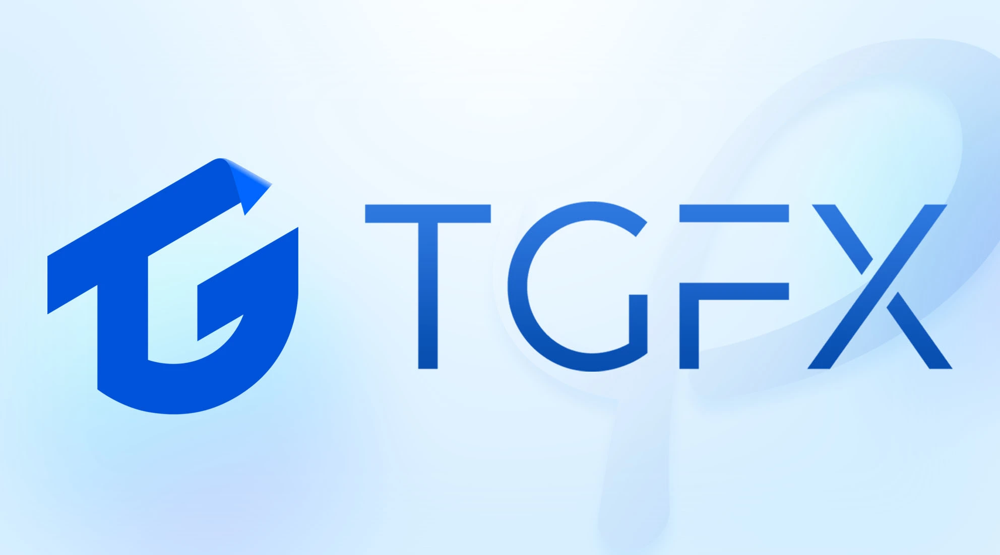

## 一、TGFX概述

TGFX（Tencent Graphics） 是一个跨平台的纯 GPU 绘图引擎，提供了完备的图片，矢量和文本的 2D 绘制能力。它最初是从 [PAG动效](https://pag.art/)的开源项目中孵化而来，作为 Skia 绘图引擎的轻量化平替方案，以仅 **400K** 左右的包体大小实现了 Skia 近 2M 包体的绝大部分功能，并为 PAG 4.0 版本带来了约 **65%** 的包体降低以及 **60%** 的矢量渲染性能提升。截止 2023 年 7 月，借助 PAG 项目，TGFX 已经实际运行在了 **1000+** 的头部业务场景中，如**微信，手Q，王者荣耀，小红书，知乎，Bilibili**等，稳定性也经过了 **10 亿+** 用户设备的持续验证。除了 PAG 外，TGFX 目前也独立在Bilibili的音视频编辑框架，[Hippy ](https://github.com/Tencent/Hippy)动态化框架以及[腾讯文档](https://docs.qq.com/)中作为底层的绘图引擎使用，也为腾讯文档带来了 **50% **的内存直线降低。

**Github地址**：[https://github.com/Tencent/libpag/tree/main/tgfx](https://github.com/Tencent/libpag/tree/main/tgfx)  

## 二、 诞生背景

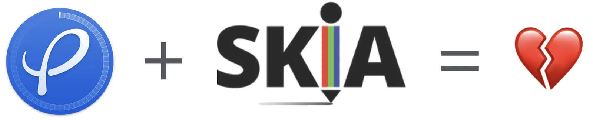

目前谷歌开源的 Skia 2D 绘图库几乎是行业里的事实标准，多年来几乎没有实质性的可替代方案出现，Chrome，Firefox，Flutter，Adobe系列软件，乃至 Android 系统都在基于 Skia 做文本和矢量的绘制。我们在 PAG 前三个版本中也同样在使用 Skia 构建动效的渲染，但到 PAG 4.0 时我们通过自研 TGFX 替换掉了 Skia，主要有以下两方面的原因：

### 包体和性能的限制

Skia 本身是一个维护了近 20 年的方案，也存在很多的历史包袱，很难满足 PAG 对包体和性能的进一步优化需求。在包体方面，我们当时虽然已经针对 Skia 做了非常多的定制和裁剪，但是它依然占据了 PAG 3.0 版本 **80%** **左右的包体**，也无法再进一步进行裁剪。而在性能方面，由于 Skia 需要兼容历史遗留的 CPU 绘制模式，**在 API 上暴露会比较保守**，很多针对现代 GPU 绘制管线可以进一步优化的接口都没暴露出来。

#### 应用场景覆盖不全

我们在 PAG 的迭代过程中发现并提交过多个 Issue 反馈给到谷歌 Skia，以下两个问题比较典型：

<table><tbody><tr><td colspan="1" rowspan="1" >
<p><span>问题</span></p>
</td>
<td colspan="1" rowspan="1" >
<p><span>截图</span></p>
</td>
<td colspan="1" rowspan="1" >
<p><span>链接</span></p>
</td>
</tr><tr><td colspan="1" rowspan="1" >
<p><span>圆角矩形边缘渲染出锯齿</span></p>
</td>
<td colspan="1" rowspan="1" >
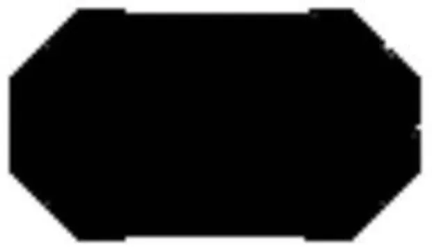
</td>
<td colspan="1" rowspan="1" ><a href="https://issues.skia.org/issues/40041938" target="_blank" rel="noreferrer"> https://issues.skia.org/issues/40041938 </a></td>
</tr><tr><td colspan="1" rowspan="1" >
<p><span>R8纹理绘制文本会出现方块</span></p>
</td>
<td colspan="1" rowspan="1" >
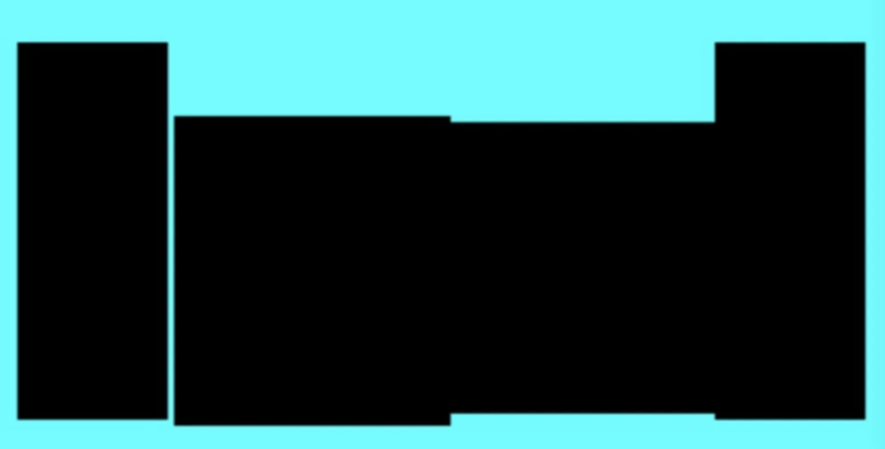
</td>
<td colspan="1" rowspan="1" ><a href="https://issues.skia.org/issues/40043309" target="_blank" rel="noreferrer"> https://issues.skia.org/issues/40043309 </a></td>
</tr></tbody></table>

前一个问题因为谷歌自己的产品 Flutter 中也有遇到，就很快被修复了。但是后一个问题，由于他们的产品很少会需要绘制图形到 R8 纹理上，虽然也是标准API 需要实现的能力范围，并且连错误的位置都已经定位了出来，2 年多过去了仍然未合入修复。所以 Skia 本质上还是主要服务谷歌自己产品的诉求，一旦遇到**谷歌系产品没覆盖到的需求场景以及线上紧急问题，优先级会很难得到保障**。腾讯系有很多产品都在重度依赖 Skia，也存在很多特定场景下产生的优化诉求，我们需要主动掌握基础渲染引擎相关的技术实现细节，才能比较好地保障这些谷歌以外的应用场景也能够得到优化。

为了彻底突破包体和性能的限制并全面覆盖自研产品的应用场景，我们从 2021 年中开始花了将近一年半的时间自研实现了一套轻量的纯 GPU 绘图引擎 TGFX，完成了对 Skia 的替换。

## 三、整体架构

下面这张图展示了 TGFX 相对完整的架构实现，横轴包含了具体使用绘图引擎过程会用到的关键类和操作流程，纵向围绕每个具体的环节展示了相关的公开接口和架构设计。标记虚线框的部分是仍在规划中要实现的模块。

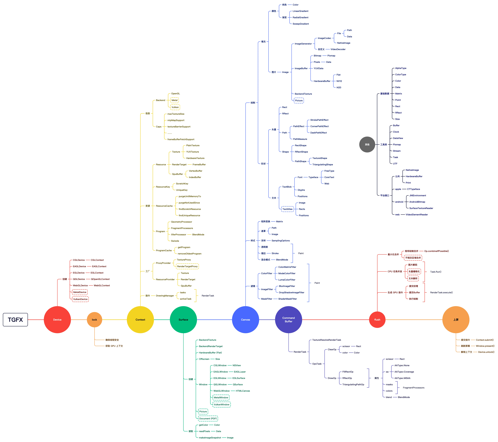

从功能构成角度看，整个 TGFX 绘图引擎大概可以分为：**图片绘制，矢量绘制，文本绘制**等三个主要模块构成。整体的实现顺序基本是按照：图片->矢量->文本 这样的顺序展开的。我们没有采用一步到位替换 Skia 的方式，而是用了**渐进式的功能替换**方式。这样做主要是为了确保替换过程中始终有可以运行调试的代码，并可以充分利用现有的自动化测试用例来保障替换过程渲染的正确。

### 包体优化

在包体方面，我们最终以 400K 左右的大小覆盖了 Skia 近 2M 包体的绝大部分功能。核心优化策略主要有两点：

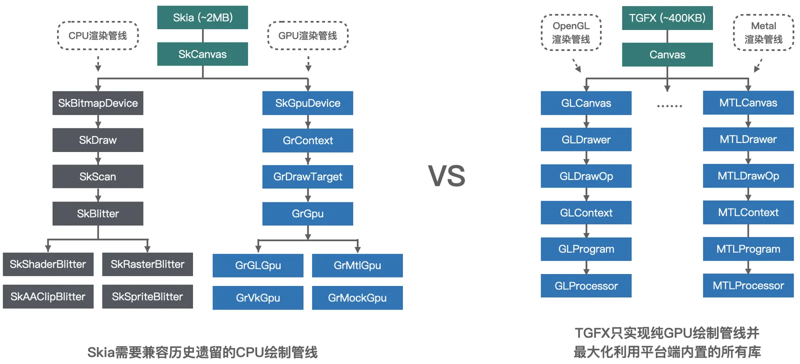

**彻底抛弃传统的 CPU 渲染管线：**因为现代的硬件已经几乎不存在没有 GPU 的设备了，即使像服务器端这种特殊的场景，通过 Swiftshader 来模拟 GPU 得到的性能也会让你很意外。但 Skia 由于历史原因一直同时包含了 CPU 和 GPU 的两条渲染管线，并且由于它的 GPU 渲染管线重度依赖 CPU 的部分，导致没法单独使用它的 GPU 渲染管线。我们在 TGFX 中彻底解决了这个耦合的问题，打造出了一个纯 GPU 的绘图引擎，这里就节省了大概一半的包体。

**最大化的利用平台端内置的所有能力：**例如图片解码，字体解析，矢量栅格化等等，这些都会优先使用系统原生的接口替代内置第三方库的策略。以文本和矢量的栅格化为例，在 iOS 上我们直接使用了系统提供的 CoreGraphics，文本方面则利用起 CoreText 等。而在其他平台才嵌入了 Freetype。虽然增加了不同平台适配的工作量，但是包体确实也获得了极致的优化。

### 调度流程优化

TGFX 并不只是做 Skia 的简化，还把一些在业务上调用起来非常复杂的通用功能进行了抽象整合。一个典型的 Skia 调用流程是从 TGFX 全流程的 Context 部分开始，但到 flush 就结束：

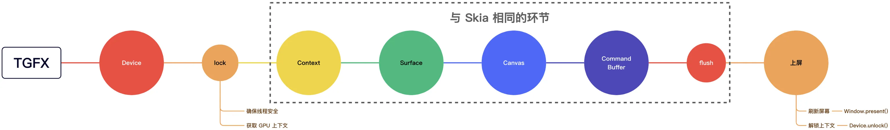

Skia 虽然提供了 GPU 的渲染管线，但要用起来门槛还是比较高的。主要存在两个问题：第一点是 **Skia只实现了跨平台渲染的部分**，所有跟平台相关的视图桥接以及上下文的初始化都需要用户自己处理。这会导致用户正常用起来 Skia 的 GPU模式需要对每个平台写大量的适配代码。除了工作量大外这部分还是兼容性的重灾区，要处理很多类似 iOS 中退到后台执行 OpenGL 的特殊情况。第二点是**Skia 并不帮你保证线程安全或者上下文状态的切换**，默认都由调用方自己处理。但绝大部分刚刚接触 Skia 的用户并不清楚这里的坑点，Skia 也没有显式说明过，按普通的方式接入使用，很容易就造成大量的显存泄露以及难以排查的随机 Crash。

以上这些问题我们在 PAG 项目里也花了近5年时间趟坑才逐一解决。为了避免每个业务都要重新经历一遍这些兼容性问题和坑点，我们在设计 TGFX 的调用流程时，在头尾补充上了 Skia 没有的 **Device & Window** 系统，并把在各个平台积累的GPU适配经验都沉淀到了这个模块中：

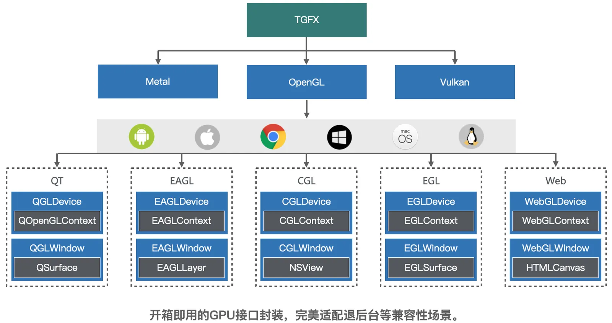

借助TGFX 提供的 Device & Window 系统，业务只要按照统一的模式进行调用，所有平台相关的复杂度都可以不用关心，并且从 API 上限制了你必须以**线程安全**的方式进行调用。即使没有非常资深的 GPU 渲染经验也可以很容易上手使用。

### 其他优化

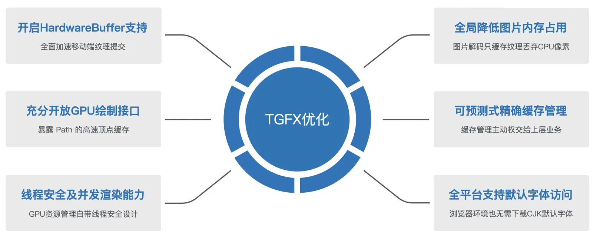

在性能和架构方面，还做了这些额外的优化：

  * 我们默认开启了 HardwareBuffer 的支持，来**全面加速纹理的提交**。这里重点是利用了运行时反射的机制彻底解决了设备兼容的问题，只要设备和系统存在这块能力我们就会自动开启。
  * 我们暴露了引擎内部 **Path 对应的 GPU 高速缓存**，例如已经三角剖分完的 Mesh 数据结构，相比纹理缓存的内存占用更低。这样避免了在 Skia里每次绘制 Path内部都要重复地做三角剖分的瓶颈。
  * 在线程安全以及并发渲染能力方面，除了前面提到的 Device&Windows 系统，TGFX 还彻底改进了 Skia 的 GPU 对象管理模型，**所有的 GPU 对象都可以在任意线程释放**，等关联的上下文激活时才真正清理，避免了在 Skia 中经常出现的随机 Crash 和泄露问题。
  * 我们在 TGFX 的接口设计上约束了图片解码完会尽可能只缓存 GPU 的纹理部分，这样理论上**全局可以直接降低一半的内存占用**，避免像 Skia 里一样图片总是重复占用双份内存，因为要兼容 CPU 绘制管线的读取。
  * Skia的缓存管理是比较粗暴的策略，通过设置一个上限，到达了再清理。我们讲绝大部分缓存都交给了上层业务精确管理，避免了 Skia里有很多绘制完一次然后长期不再用的缓存持续占用额外的内存。
  * TGFX 在**全平台都实现了默认字体的读取能力**，包括读取浏览器的默认字体库。解决了 Skia 的 Web 版本在这块的缺陷，否则渲染中文都要下载上百 M 的字体包的问题，在 Web 上几乎没有可用性。
  * TGFX 在纹理绘制功能里，**额外增加了对各种硬解视频帧格式的直接绘制能力**，可以一次性上屏无需先合并或经过任何 CPU处理，弥补了 Skia 不支持视频解码出来的图片帧直接上屏的问题。
  * 我们根据用户真实的使用习惯去掉了 Skia 里的统一 Shader 语言 sksl 设计，直接采用亲和原生平台 Shader 语言格式的形式暴露接口，既节省了包体，也**减少了 GPU Program 的编译耗时**。

以上部分的优化点在接下来的三大绘制模块章节中也会展开讲解。

## 四、图片绘制

### 纹理绘制

视频帧的渲染在现代图形绘制里已经是非常重要的部分，但 **Skia在很长时间内都没实现对YUV纹理直接绘制的支持**，而是提供了一个YUV转换RGB的方法，但每次绘制都要额外创建一个 RGB 纹理以拷贝的方式把 YUV 合并上去，再将 RGB 纹理通过标准的 SkCanvas 接口绘制上屏。这么做的主要原因是 Skia 的内置的渲染管线不支持把 YUV 格式纹理与Matrix/Alpha/Blend/Mask这些额外属性的直接叠加。这样也导致了所有视频帧都需要额外多离屏绘制一次，占用更多的内存而且性能也存在比较大瓶颈。于是我们当时在 PAG 的层面实现了一个叫 VideoImageDrawer 的OpenGL绘制类，能够在叠加 Matrix 和 Alpha 的情况下直接绘制 YUV 格式的视频帧到屏幕上。这样虽然解决了大部分简单场景下的性能问题，但如果视频帧还需要叠加 Blend和Mask 样式，仍然还是要先转换为 RGB 纹理，再交给 SkCanvas 叠加附加样式后完成上屏。

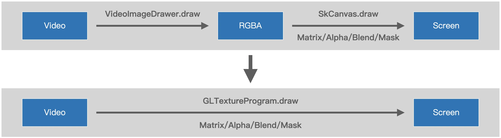

我们实现 Skia 替换的第一步就是围绕已有的 VideoImageDrawer 开始的，因为这个类本身已经具备了基础纹理绘制的能力，主要的工作量就是要再把 Blend 和 Mask 等附加样式也整合到它里面变成 GLTextureProgram，让纹理相关的绘制可以完全脱离 SkCanvas 在外部实现直接绘制。完成这个能力后也同时让YUV格式纹理成为了一等公民，可以直接与所有附加样式叠加后实现一次性绘制上屏。这让所有的**视频帧都减少了一次绘制，****也****提升了整体的绘制性能**。

### 混合模式

在实现各种附加样式的过程中，最复杂的其实是 Blend 混合模式的实现。Skia 实现的所有混合模式都是 W3C 标准里面定义的，具体的计算公式可以参考。这些混合模式大体可以分为三类：

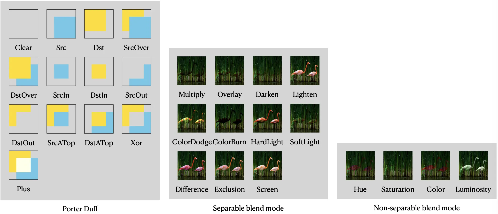

Porter Duff 模式是定义了 Src 和 Dst 像素之间运算的规则。可分离混合模式将混合公式单独应用于每组对应的分量。不可分离混合模式将所有颜色分量合在一起考虑，而不是单独查看每个分量。实现方式上分为两种，Porter Duff 可以直接用 glBlendFunc 的公式实现：另外两种需要用Shader 的方式来实现。理论上也可以全部用Shader 实现，这样维护起来成本会比较低。但是实际测试后发现用 Shader 替代 glBlendFunc 的方式性能上有折损，因此最终还是采用两种实现共存的方式：

<table><tbody><tr><td colspan="1" rowspan="1" >
<p><span>Screen.pag耗时(us)</span></p>
</td>
<td colspan="1" rowspan="1" >
<p><span>glBlendFunc&nbsp;方式</span></p>
</td>
<td colspan="1" rowspan="1" >
<p><span>Shader&nbsp;方式</span></p>
</td>
</tr><tr><td colspan="1" rowspan="1" >
<p><span>创建Program</span></p>
</td>
<td colspan="1" rowspan="1" >
<p><span>6</span></p>
</td>
<td colspan="1" rowspan="1" >
<p><span>181</span></p>
</td>
</tr><tr><td colspan="1" rowspan="1" >
<p><span>执行Draw</span></p>
</td>
<td colspan="1" rowspan="1" >
<p><span>136</span></p>
</td>
<td colspan="1" rowspan="1" >
<p><span>150</span></p>
</td>
</tr></tbody></table>

使用 Shader 方式实现混合模式的本质还是在操作两个纹理的混合规则，一大难点就是如何获取屏幕的已有像素内容。获取屏幕像素内容有三种方式：

1）借助 frame buffer fetch 扩展直接访问当前 frame buffer 上的颜色分量，这种方式的性能也是最高的，具体扩展名和 Shader 的内建变量如下表：

<table><tbody><tr><td colspan="1" rowspan="1" >
<p><span>扩展名</span></p>
</td>
<td colspan="1" rowspan="1" >
<p><span>内建变量</span></p>
</td>
</tr><tr><td colspan="1" rowspan="1" >
<p><span>GL_EXT_shader_framebuffer_fetch</span></p>
</td>
<td colspan="1" rowspan="1" >
<p><span>gl_LastFragData[0]</span></p>
</td>
</tr><tr><td colspan="1" rowspan="1" >
<p><span>GL_NV_shader_framebuffer_fetch</span></p>
</td>
<td colspan="1" rowspan="1" >
<p><span>gl_LastFragData[0]</span></p>
</td>
</tr><tr><td colspan="1" rowspan="1" >
<p><span>GL_ARM_shader_framebuffer_fetch</span></p>
</td>
<td colspan="1" rowspan="1" >
<p><span>gl_LastFragColorARM</span></p>
</td>
</tr></tbody></table>

2）如果当前 OpenGL 环境不存在 frame buffer fetch 扩展，但是绘制的目标本身就绑定了一个纹理，也可以将纹理直接传递给 shader。但因为我们对纹理既要读又要写，所以需要执行 glTextureBarrier 确保过程是先读后写的，不然会导致画面错乱。这种方式性能也还比较不错，但 glTextureBarrier 这个 API 只存在于高版本的桌面 OpenGL 以及一些 OpenGL ES 的扩展中，所以也并不是一直可用。

3）最后兜底的措施是把当前 frame buffer 的内容拷贝到一个纹理上，再把纹理传入 shader。至于具体的拷贝方式有非常多种，从这篇帖子可以得到最终的性能对比结论如下：

```
passthrough shader ~ glCopyTexSubImage2D > glBlitFramebuffer >> glCopyPixels
```

在Skia 里实际上把这几种方式全都实现了一遍，**出于包体优化原因我们只打算实现性能最好的一种方式**，也就是在前面两个方式里选择。又因为我们的 frame buffer 也不一定会绑定到纹理，还有可能是 render buffer，所以我们最终选择了统一用 glCopyTexSubImage2D 的方式实现从 frame buffer 到 纹理的拷贝。这里我们还做了一些局部拷贝的额外优化，因为通常我们绘制的都只是局部的区域，并不需要把完整的 frame buffer 内容都拷贝一份。

### 边缘抗锯齿

在实现了独立的纹理绘制能力后，仅仅把 Matrix/Alpha/Blend/Mask 这些附加样式叠加上是还不够的，因为当你绘制的图片带有一定旋转角度时，就会发现图片边缘有明显的锯齿：


有边缘锯齿（点击看大图）

大家可能会直接联想到用 MSAA 这类传统的抗锯齿技术去解决，但是这个方式占用内存比较多，并且还需要硬件层支持。对于简单纹理绘制这种显然有点杀鸡用牛刀的感觉。这里我们需要的其实是专门针对矢量图形设计的 CoverageAA 边缘抗锯齿能力。纹理绘制在形状上其实等同于矢量的简单矩形绘制，只不过填充的不是纯色是图片而已，但在抗锯齿的原理上是完全一样的：

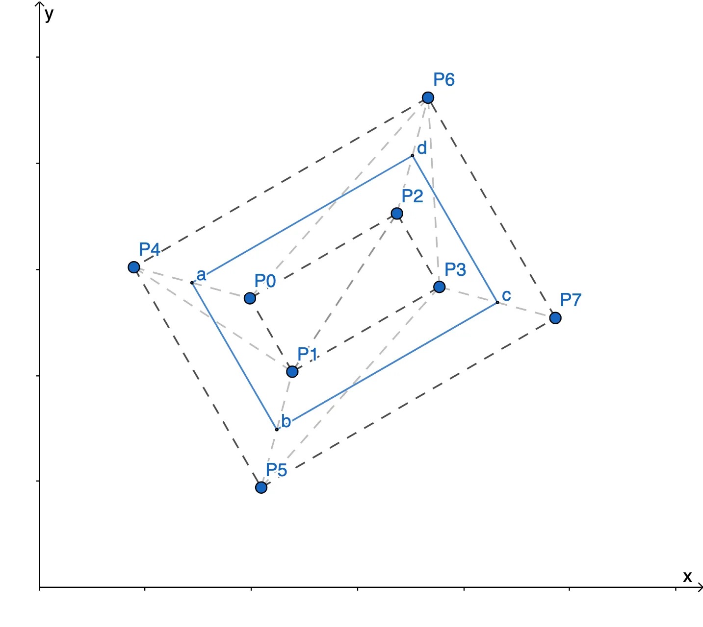

如图所示，矩形 abcd 是我们要绘制的区域，根据矩形的坐标向内缩 0.5px 得到矩形 P0_P1_P3_P2，向外扩 0.5px 得到矩形`P4_P5_P7_P6`。内矩形里面 alpha 都是 1，外矩形边缘 alpha 都是 0，内矩形和外矩形之间 alpha 从 1->0 渐变。这样我们就对边缘做了一个逐渐消失的效果，从视觉上看，边缘的锯齿就没那么明显了：


无边缘锯齿（点击看大图）

这里跟Skia 稍微不一样的地方是我们**全局默认是开启抗锯齿**的，避免业务要手动一个个配置 Paint，抗锯齿才是最常用的情况。另外，由于目前还没遇到任何场景需要关闭抗锯齿，我们也还没暴露关闭的开关到公开接口里。

### 纹理边缘采样 

前面提到过 TGFX 弥补了 Skia 不支持的视频帧直接上屏能力。除了各种多平面的 YUV 格式的绘制外，视频解码出来的就算单平面的纹理绘制起来也有比较多兼容问题要处理。例如 Android 端通过 MediaCodec硬解出来的 `EXTERNAL_OES` 格式纹理。它虽然表现为 RGB 单平面的，但实际上背后还是 YUV 的格式，只不过通过 OpenGL 的扩展包装成了语法糖。因为硬件解码通道都会有画面尺寸对齐的要求，因此 MediaCodec 直接产生的纹理通常都是比实际大一些的，然后你绘制的时候需要裁剪掉它额外扩展出来的边缘部分，否则就会出现绿边问题。但以往绘制这类硬解产生的EXTERNAL纹理时，Android 都是通过以下接口：

```
SurfaceTexture.getTransformMatrix();
```

直接给你一个 4x4 的最终 OpenGL 矩阵，让你应用到纹理上。这个形式对于自定义 Shader 绘制方式倒是很好用，相当于直接给你了最终答案。但是对于绘图引擎来说，我们纹理上的最终矩阵都是通过2D坐标系下的矩形裁剪区域算出来的，直接给个最终答案显然也没法直接传进去使用，不然就要额外做一套绘制的流程，就无法复用其他标准的Shader拼装能力。于是我们就通过反算从 SurfaceTexture 得到的矩阵，还原出了纹理的真实宽高。然后利用真实宽高和有效内容宽高计算裁剪区域，跟其他格式纹理合并到同样的绘制管线中，但最后绘制出来的图片还是带有绿边：

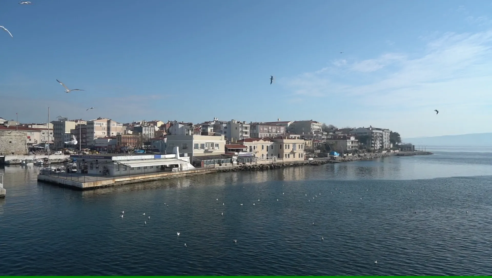

在[OpenGL ES Texture Coordinates Slightly Off](https://stackoverflow.com/questions/6023400/opengl-es-texture-coordinates-slightly-off)上看到说只有当采样的点在纹素中心，才返回准确的颜色，否则就是插值出来的。双线性插值会取临近 4个像素的加权平均值。也就是当采样的点在纹素中心和边界之间时，可能就会采到超出边界的颜色。

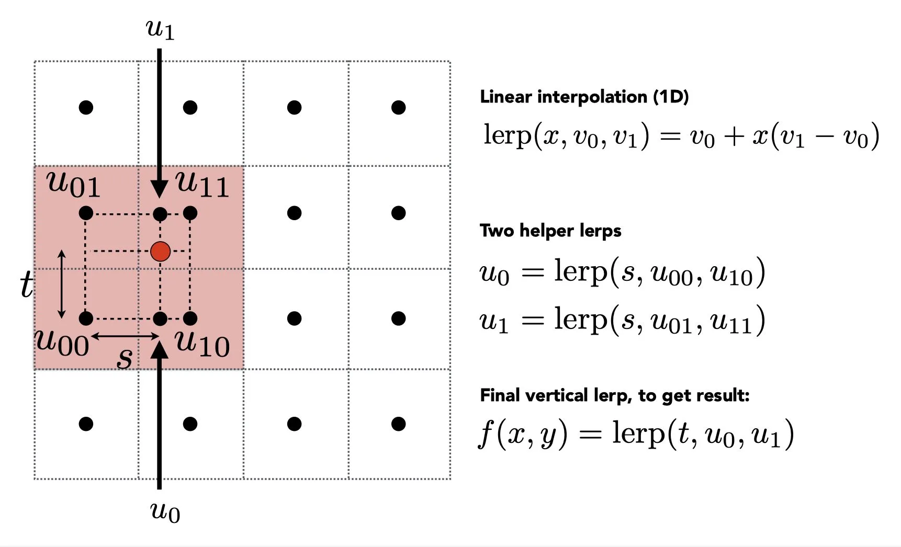

于是我们根据这个结论把纹理的采样坐标收缩了 0.5 纹数，但发现结果还是有绿边。然后我们通过对比也发现了我们生成的最终纹理矩阵和 Android 系统直接给出来的还是有一些差异，于是又深入去看了 Android 里的源码实现：


```cpp
void SurfaceTexture::computeTransformMatrix(float outTransform[16], const sp<GraphicBuffer>& buf,
                                            const Rect& cropRect, uint32_t transform,
                                            bool filtering) {
    if (!cropRect.isEmpty() && buf.get()) {
        float tx = 0.0f, ty = 0.0f, sx = 1.0f, sy = 1.0f;
        float bufferWidth = buf->getWidth();
        float bufferHeight = buf->getHeight();
        float shrinkAmount = 0.0f;
        if (filtering) {
            // In order to prevent bilinear sampling beyond the edge of the
            // crop rectangle we may need to shrink it by 2 texels in each
            // dimension.  Normally this would just need to take 1/2 a texel
            // off each end, but because the chroma channels of YUV420 images
            // are subsampled we may need to shrink the crop region by a whole
            // texel on each side.
            switch (buf->getPixelFormat()) {
                case PIXEL_FORMAT_RGBA_8888:
                case PIXEL_FORMAT_RGBX_8888:
                case PIXEL_FORMAT_RGBA_FP16:
                case PIXEL_FORMAT_RGBA_1010102:
                case PIXEL_FORMAT_RGB_888:
                case PIXEL_FORMAT_RGB_565:
                case PIXEL_FORMAT_BGRA_8888:
                    // We know there's no subsampling of any channels, so we
                    // only need to shrink by a half a pixel.
                    shrinkAmount = 0.5;
                    break;

                default:
                    // If we don't recognize the format, we must assume the
                    // worst case (that we care about), which is YUV420.
                    shrinkAmount = 1.0;
                    break;
            }
        }

        // Only shrink the dimensions that are not the size of the buffer.
        if (cropRect.width() < bufferWidth) {
            tx = (float(cropRect.left) + shrinkAmount) / bufferWidth;
            sx = (float(cropRect.width()) - (2.0f * shrinkAmount)) / bufferWidth;
        }
        if (cropRect.height() < bufferHeight) {
            ty = (float(bufferHeight - cropRect.bottom) + shrinkAmount) / bufferHeight;
            sy = (float(cropRect.height()) - (2.0f * shrinkAmount)) / bufferHeight;
        }

        mat4 crop(sx, 0, 0, 0, 0, sy, 0, 0, 0, 0, 1, 0, tx, ty, 0, 1);
        xform = crop * xform;
    }
}
```

通过注释的信息才明白了根本的原因：为了防止双线性采样超过裁剪边缘，普通纹理确实要收缩 0.5 纹素，但是 `EXTERNAL_OES` 纹理背后实际上是 YUV420 的格式，数据结构决定了存在两个像素共享一个颜色的情况，因此**YUV纹理要收缩 1.0 纹素才可以解决边缘采样的问题**。最终我们也把这些兼容处理完整沉淀到了 TGFX 引擎内，并跟绘图引擎原本的Shader拼装架构完美结合到了一起，让业务可以不用再趟相关兼容问题的坑。

## 五、矢量绘制

### 矢量绘制流程

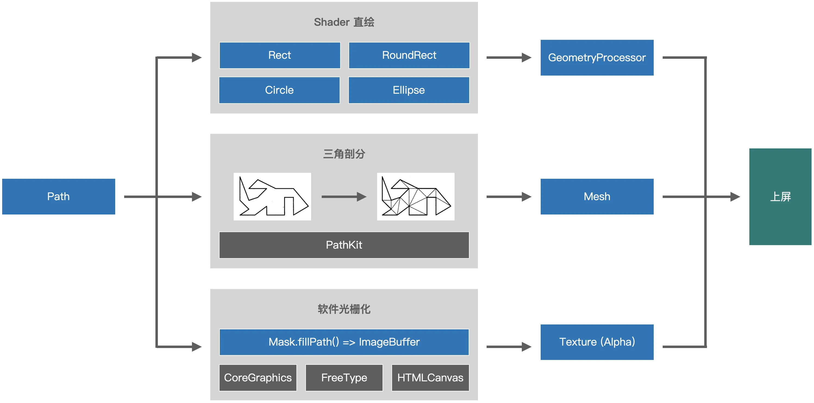

这是我们在 TGFX 里实现的整体矢量绘制架构图。Path的绘制存在非常多具体的实现路径，但从原理上都可以归纳为这三种方式：

  * **Shader 直绘****：**对于符合特定规律的简单图形直接用 Shader 代码直接生成形状。
  * **三角剖分****：**复杂图形通过三角剖分拆解为 Mesh之后提交给 GPU 绘制。
  * **软件光栅化****：**用软件栅格化方式得到矢量图对应的半透明纹理当做遮罩绘制。

#### **软件光栅化**

Skia 内部针对 Path 的绘制实现了种类繁多的 PathRenderer，但归纳一下其实也都是围绕以上列出的三种方式：


```cpp
PathRendererChain::PathRendererChain(GrRecordingContext* context, const Options& options) {
    const GrCaps& caps = *context->priv().caps();
    if (options.fGpuPathRenderers & GpuPathRenderers::kDashLine) {
        fChain.push_back(sk_make_sp<ganesh::DashLinePathRenderer>());
    }
    if (options.fGpuPathRenderers & GpuPathRenderers::kAAConvex) {
        fChain.push_back(sk_make_sp<AAConvexPathRenderer>());
    }
    if (options.fGpuPathRenderers & GpuPathRenderers::kAAHairline) {
        fChain.push_back(sk_make_sp<AAHairLinePathRenderer>());
    }
    if (options.fGpuPathRenderers & GpuPathRenderers::kAALinearizing) {
        fChain.push_back(sk_make_sp<AALinearizingConvexPathRenderer>());
    }
    if (options.fGpuPathRenderers & GpuPathRenderers::kAtlas) {
        if (auto atlasPathRenderer = AtlasPathRenderer::Make(context)) {
            fAtlasPathRenderer = atlasPathRenderer.get();
            context->priv().addOnFlushCallbackObject(atlasPathRenderer.get());
            fChain.push_back(std::move(atlasPathRenderer));
        }
    }
    if (options.fGpuPathRenderers & GpuPathRenderers::kSmall) {
        fChain.push_back(sk_make_sp<SmallPathRenderer>());
    }
    if (options.fGpuPathRenderers & GpuPathRenderers::kTriangulating) {
        fChain.push_back(sk_make_sp<TriangulatingPathRenderer>());
    }
    if (options.fGpuPathRenderers & GpuPathRenderers::kTessellation) {
        if (TessellationPathRenderer::IsSupported(caps)) {
            auto tess = sk_make_sp<TessellationPathRenderer>();
            fTessellationPathRenderer = tess.get();
            fChain.push_back(std::move(tess));
        }
    }

    // We always include the default path renderer (as well as SW), so we can draw any path
    fChain.push_back(sk_make_sp<DefaultPathRenderer>());
}
```

但我们并没有照搬 Skia 里各种 PathRenderer的实现，因为包体优化在当时是我们非常强的诉求，因此我们做了一些测试想要筛选出性价比高的PathRenderer。具体测试方式是关闭一些 PathRenderer然后使用这个版本构建的 PAG 库去跑全量自动化测试用例看总耗时，全量用例里面包含四千多个真实使用场景下产生的矢量图元。最后测试出来的结果非常意外：当关闭了所有的 GPU 直绘的 PathRenderer，只保留最后软件光栅化的那个DefaultPathRenderer 后，总体耗时没有增加还略缩短了一些。从矢量图形的整体耗时角度看，**GPU加速对于矢量图形的性能提升**似乎比较有限**，但不排除局部还有极端特例存在优化空间。

这个结果其实也符合周边其他一些库的表现，例如这么多年以来 CoreGraphics 一直都只有软件光栅化一种矢量绘制方案，但是也没影响到 iOS 整体的流畅度。行业里的 Path 绘制大多也都是依赖 CPU 去实现的，GPU 在发展的过程中没有太多考虑过这个问题。Khronos 有一个硬件加速矢量绘制的标准 [OpenVG](https://zh.wikipedia.org/wiki/OpenVG) ，但是没有普及起来。Nvidia 提供了 [GPU Accelerated Path Rendering](https://developer.nvidia.cn/gpu-accelerated-path-rendering)，也没有普及起来。

基于这个结论，我们最先开始落地的也是软件光栅化这条实现路径。出于包体优化的考虑，负责具体栅格化的模块我们并没有基于 Skia 的CPU 绘制管线实现，而是计划直接桥接到平台相关的接口。因此在 macOS 和 iOS 上就直接用了CoreGraphics。而在Android上本来也打算通过反射到 Java 端的方式实现栅格化。但后来在[rLottie](https://github.com/Samsung/rlottie) 项目里发现了新思路：他们整个矢量模块都是采用 FreeType 实现的栅格化。我们才意识到 **FreeType 也可以作为通用的矢量栅格化库使用**。再加上 Android 端本来也需要引用 FreeType 处理文字解析部分，因此直放弃了 Java 反射的思路，在其他平台统一采用 FreeType 处理矢量栅格化。但 Web 平台是个例外，还是直接采用了 HTMLCanvas 实现的栅格化，主要是因为 Web 平台要读取浏览器的默认字体导致我们没法使用 FreeType，额外引用一份 FreeType 的话会增加包体大小。

### Shader直绘

实现完软件栅格化的绘制路径后，我们测试发现新版本大部分情况下和旧版本的矢量绘制性能是接近的，但是少量的矢量素材性能出现比较大的倒退。具体分析后发现是比较极端的案例，这个素材里简单图形的占比极其高，绝大部分都是矩形，圆角矩形，圆等基础图形并且面积都比较大，这种情况下走光栅化性价比会比较低。这种情况在整体的占比倒不高，但是相对还比较好优化，因此我们又引入了针对所有简单图形的 Shader 直绘方式。因为之前已经有绘制纹理的Shader，实际上把纹理替换为纯色或者渐变就已经可以直接支持简单矩形的绘制了，并且还同样带了边缘抗锯齿能力。因此我们要补充的主要是剩下几种简单图形的直绘Shader。我们在这块相比 Skia 也做了一些简化，最终采用了**同一个 Shader来统一绘制圆角矩形，圆形，椭圆**等。因为圆形和椭圆其实可以看做是圆角局限的极限特例。

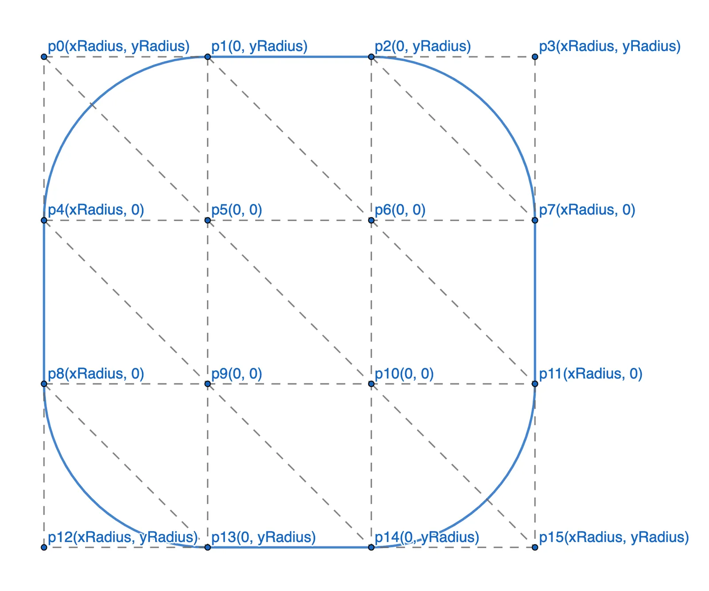

具体实现思路是把圆角矩形分成 9 份，分别是 4 个角（p0p1p5p4、p2p3p7p6、p8p9p13p12、p10p11p15p14），4个边缘（p1p2p6p5、p4p5p9p8、p6p7p11p10、p9p10p14p13）和 1 个中心（p5p6p10p11）。角的部分填充弧形，边缘和中心填充矩形。上传的顶点数据除了常规的屏幕坐标外，还额外提供了一个相对坐标，用于计算当前像素点跟图形整体外轮廓的距离。传进去的相对坐标经过标准化之后，不管是椭圆弧还是圆弧，都转化为半径为 1 的圆弧，根据公式可以计算出距离：

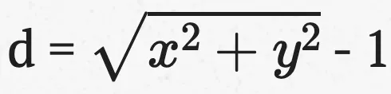

中心矩形的小矩形坐标 x, y 都是 0；边缘四个矩形的小矩形坐标要么 x 是 0，要么 y 是 0，所以它计算的是点到边缘直线的距离。角上四个矩形的小矩形坐标计算的是点到圆弧的距离。点到轮廓的距离为正，表示像素在图形外，可以标记 alpha 为 0。反之小于等于 0 表示在图形内，alpha 可标记为 1。最后边缘抗锯齿还是跟纹理绘制那边画矩形的做法一致，在边缘扩出一像素渐变的区域即可。实现完简单图形的 Shader 直绘之后，我们也和 Skia 的功能做了一下性能测试的对比，结果发现 **TGFX 绘制椭圆的实现比 Skia 要更快**：

<table><tbody><tr><td colspan="1" rowspan="1">
<p><span>绘制椭圆</span></p>
</td>
<td colspan="1" rowspan="1">
<p><span>Skia</span></p>
</td>
<td colspan="1" rowspan="1">
<p><span>TGFX</span></p>
</td>
</tr><tr><td colspan="1" rowspan="1">
<p><span>耗时(us)</span></p>
</td>
<td colspan="1" rowspan="1">
<p><span>6641</span></p>
</td>
<td colspan="1" rowspan="1">
<p><span>3620</span></p>
</td>
</tr></tbody></table>

深入分析后定位出了原因：因为 Skia 的所有 Shader 都是用它自己的 SKSL 编写的，所以都**存在把 SKSL 编译成 GLSL的额外开销**。我们在 TGFX 里并没有设计这个模块，主要的原因是实际观察了所有项目的使用方式，其实无论绘图引擎实现了多少种 GPU后端的适配，上层业务在实际使用的时候都只会用其中一种，并不存在需要运行时动态切换两种 GPU 后端的情况，而对于业务来说调用方本身是确定的 GPU后端和确定的 Shader 语言，对他们来说直接用当前 GPU 的原生 Shader 语言传入绘图引擎使用是最方便的。反而如果我们增加了一个 SKSL 的统一跨平台 Shader 语言，他们还要把自己已有的 Shader 重新写一遍适配我们的 Shader 语言，额外增加了业务的工作量。所以我们最终把 TGFX 设计成了亲和原生Shader 语言的交互方式，这样不仅**业务用起来更简单，还同时减小了包体大小并且提升了性能**。

到这里我们其实从整体角度**基本对齐了旧版本的矢量绘制性能**，异常的特例也覆盖到了，但其实矢量绘制还有进一步大幅提升性能的空间。

### 三角剖分

三角剖分的原理不过多介绍，具体可以参考：[Polygon Triangulation](http://groups.csail.mit.edu/graphics/classes/6.838/F01/lectures/PolygonTriangulation/index.html)。简单说就是给定一个矢量图形，通过三角剖分可以把它分解为很多小三角形的 Mesh 数据结构，这种数据结构的优势是可以直接作为顶点数据提交给 GPU 绘制，绘制效率非常高，3D 引擎中也大量使用。但要得到 Mesh 数据的过程本身也是有开销的，跟软件光栅化类似也都是软件完成的转换。根据实测的数据看，三角剖分的耗时和 Path含有的动作 Verb 数量正相关。目前在 Chrome 浏览器里就是把这个阈值设置为了**Verb数量小于 100 才开启三角剖分**，否则使用软件光栅化。具体可以参考：[Adjust the edge-AA tessellator maximum verb count](https://chromium-review.googlesource.com/c/chromium/src/+/1099564/).

但前面也提到过从整体结果看，GPU加速对矢量绘制性能的提升比较有限。所以想要继续提升矢量绘制的性能，其实从原理上靠的并不是引入更多的单点 GPU 加速方式，而是应该**从缓存架构设计的角度去加速**。Skia 真正的矢量绘制瓶颈其实是因为架构原因，它需要同时兼容历史遗留的 CPU 绘制管线和新的 GPU 绘制管线，也导致了 对外公开的 SkPath 对象无法暴露内部对应的高速 GPU 缓存，比如已经三角剖分完的 Mesh 数据结构。这样你每次绘制Path都只能重复地做三角剖分。

我们之所以特别需要缓存三角剖分的 Mesh 数据，是因为相比光栅化得到的纹理，它**占用的内存通常非常小**，缓存加速的性价比就很高。理论上不计内存地缓存所有图形的光栅化纹理，也是可以得到一样的加速效果，但是内存可能就爆了。因此在 PAG 的老版本里，我们一直只对完全静态的图层才会缓存一份矢量对应的纹理来加速。但是在动效素材里，完全静态的图层毕竟还是比较有限的。在 TGFX 里我们暴露了这个 Mesh 缓存之后，就有能力对所有矢量图形进行高性价比的缓存。

但我们最终的方案其实也不是直接全使用三角剖分的Mesh缓存，因为如果矢量图形的面积比较小图形又比较复杂的时候，三角剖分的 Mesh 数据量可能占用的内存不一定比对应的纹理小。我们可以根据所占用内存的大小来选择用哪种方式缓存，达到最高的性价比。但需要提前就能估算出来，不然就多了一次额外的生成开销。对于纹理来说所占用的内存是直接跟面积正相关的，比较好提前估算。但是三角剖分的内存结果其实不太好估计，主要存在两个指标，一个是 Verb 动作总数，另外一个是 Point 坐标点总数。于是我们实测了 **4346 **条真实场景下的矢量图形数据，得出了以下数据：

<table><tbody><tr><td colspan="1" rowspan="1" >
<p><span>倍数关系</span></p>
</td>
<td colspan="1" rowspan="1" >
<p><span>平均值</span></p>
</td>
<td colspan="1" rowspan="1" >
<p><span>标准差</span></p>
</td>
</tr><tr><td colspan="1" rowspan="1" >
<p><span>Buffer.size()&nbsp;/&nbsp;&nbsp;Path.countVerbs()&nbsp;</span></p>
</td>
<td colspan="1" rowspan="1" >
<p><span>282</span></p>
</td>
<td colspan="1" rowspan="1" >
<p><span>230</span></p>
</td>
</tr><tr><td colspan="1" rowspan="1" >
<p><span>Buffer.size()&nbsp;/&nbsp;Path.countPoints()&nbsp;</span></p>
</td>
<td colspan="1" rowspan="1" >
<p><span>173</span></p>
</td>
<td colspan="1" rowspan="1" >
<p><span>111</span></p>
</td>
</tr></tbody></table>

结论是**三角剖分结果的内存占用量和Path的 Point 数更正相关**，标准差更小。我们最终也取了 **170** 的作为内存倍数估计的常量。后续如果有更大的样本数据可以重新测试。虽然这个方式不算完美，但是用于估算已经足够了，目的也是让引擎在绝大部分情况都能得到缓存方式的最优解。这部分的缓存架构优化正是PAG 4.0 版本里取得 **矢量渲染性能提升60% **的主要贡献点。

### PathKit

最后提一下 [PathKit](https://github.com/libpag/pathkit) 这个库，它实际上就是 Skia 里的 SkPath 数据结构，本身 Skia 也有单独编译这个模块提供给 Web 平台代替浏览器默认的 Path 使用。但缺少标准的 C++ 引用方式，于是我们直接抽离了出来并加上了编译脚本让它可以脱离 Skia 单独引用。最开始实现矢量绘制的时候，我们并没有引用这个库，而是计划分别基于各个平台的接口去直接包装成公共的 Path对象，理论上这样软件栅格化的时候性能也更好，因为不需要再额外转换一次 SkPath 到平台相关的 Path 数据结构。但是实现到一半我们很快发现 CoreGraphics 的 CGPath 不存在 [Path Ops](https://skia.org/docs/dev/present/pathops/)相关的实现，也就是求矢量图形的交并集的布尔计算能力。Android 平台 Java 端的 Path 存在这个接口也是因为背后是 Skia 实现的。整体调研了一遍发现整个行业似乎也只有 Skia 实现了这个能力，再加上后来我们又引入了三角剖分的绘制方式，如果我们自己实现一遍这两块相关能力，大概率也只是照搬一遍 SkPath。这样没有什么意义，既不能对包体有优化，性能也没有变化，这个独立的模块目前已经是行业里性能做的最好的了。

我们的核心目的是**对绘图引擎渲染层面的自主可控**，强调 100%自研并不是我们的诉求。现代也不存在一个大型开源项目能完全脱离第三方库依赖完全自研，因此评估后我们决定直接基于 PathKit 来实现 Path 的基本数据结构，矢量光栅化和具体的渲染依然还是 TGFX 自己实现。除了 PathKit 外，整个 TGFX 项目还引用了另外一个来自 Skia 提供子库 skcms， 主要用于处理像素格式转换。原因也是直接可用，并且没有包体差异，没有必要去重复造轮子。

## 六、文本绘制

### 文本绘制流程

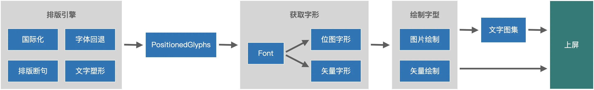

完整的文字绘制流程是很复杂的一块，在很多的平台的实现里都会按照 PositionedGlyphs 之前和之后分开两个库。例如 iOS 端的 CoreText 和 CoreGraphics 就是这种关系，Skia 也是一样。主要因前面排版引擎的部分各个业务需要的复杂度会很不一样，但是好在排版完的数据都是Font+Glyphs+Positions 这种通用的结构，绘图引擎只要专注实现 PositionedGlyphs 之后的部分即可。我们在 TGFX 也遵循了这个分层的设计原则，在 PAG 里实现了轻量的排版，字体回退以及和双字节 Emoji 相关的文本塑形能力，而腾讯文档则实现了自己非常复杂的文档级排版引擎。

文字的绘制大体上是一个数据转换的过程，最终还是会桥接到前面提到的图片绘制和矢量绘制模块上。首先排版引擎会把要绘制的文本转换为每个字体文件里对应的 Glyph ID，并且附加好具体要显示的位置数据。绘图引擎会根据 Glyph ID 从字体里获取对应的字形，这些字形根据字体不同有可能是矢量的也有可能是位图的（比如Emoji)，最后通过前面的两大绘制能力，要么直接绘制上屏，要么通过图集缓存一下，再进行合批上屏。

### 文字图集

图集是渲染文字常用的一种优化方式，每次都走光栅化逻辑会比较浪费硬件资源，缓存到图集上，直接从图集上读可以减少 CPU 占用，同时还能做到合批，提升渲染速度。TGFX 在这里跟 Skia 存在一些实现上的区别，我们**目前没有把文字图集模块默认实现在 TGFX 里**，而是跟排版引擎一样交给了外部控制，只暴露了高性能的图集绘制接口。主要的是出于内存优化的原因：

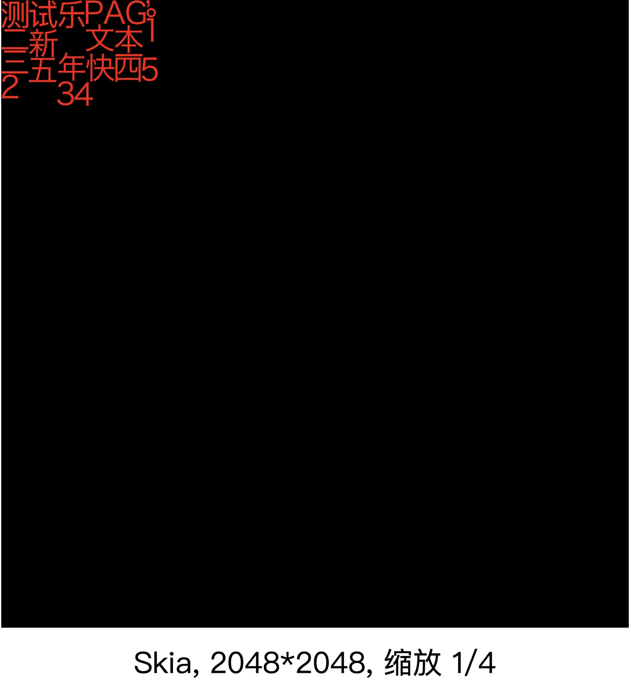

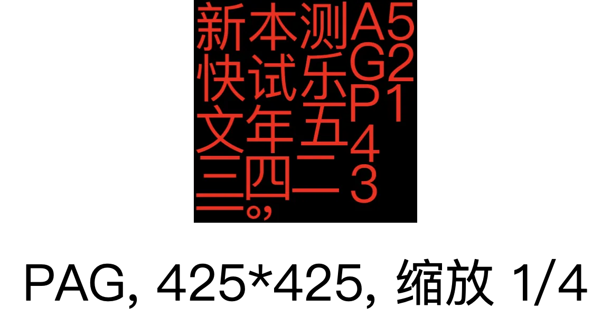

Skia 里会最多创建四个 2048*2048 的 R8 纹理，每个 R8 纹理分成多份区域，大小是 512*512，每个区域会再申请一份 CPU 的内存，来实现纹理局部更新，全部用完之后再执行剔除策略，剔除逻辑是按区域来的，最近最少使用的会优先剔除，但 **Skia并没有提供任何清理图集缓存的接口**。可以看出 Skia 是仅为大量文本的随机绘制场景做了适配，缓存的尺寸和生命周期均无法精确控制。而对类似 PAG 这种存在时间轴可以精确预测的场景，就会导致内存使用比较浪费。

一般情况下，一个 PAG 文件里的文字不会很多，用不到 2048*2048 的纹理，而且 PAG 动画存在时间轴，可以精确的知道什么时候应该释放图集，什么时候应该提前开始构建。因此考虑到不同业务的需求差别比较大，TGFX 内部暂时不做图集缓存，都交给由上层业务来创建、生成和释放图集实现精确的控制。但我们也在探索能兼顾随机缓存和精确控制两种场景的实现方式，未来还是有可能把图集能力下沉到 TGFX里，减少业务方的调用复杂度。

### 伽马校正

虽然整体上文字流程最终都是在复用图片绘制和矢量绘制的功能，但是也存在一些需要特殊处理的地方。例如在腾讯文档接入 TGFX 的过程中我们就发现一个问题，TGFX 绘制出的文字在 iOS 上要比 Skia 渲染的更细：

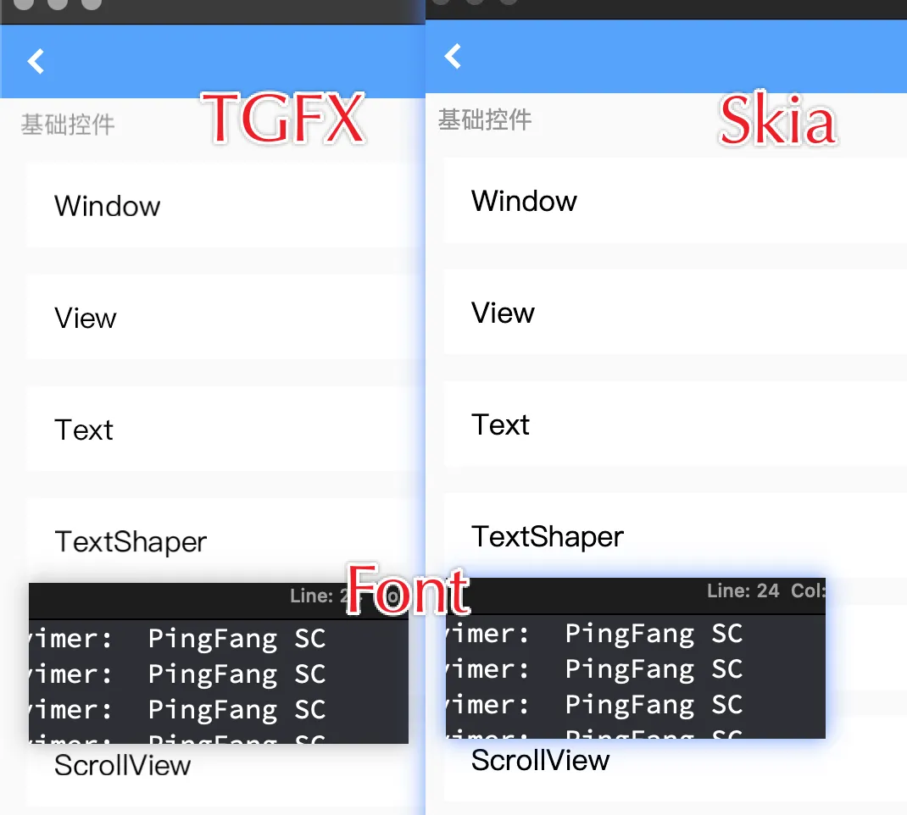

跟 Skia 的实现详细对比后才发现是色彩空间方面的问题，对于矢量字体，直接光栅化之后得到的通常都是 Linear 色彩空间的，我们还需要做伽马校正转换为sRGB 才行，否则表现出来就是文字边缘更细一些。关于这个问题在 Freetype 的文档中也有解释：[Gamma Correction](https://freetype.org/freetype2/docs/hinting/text-rendering-general.html#background)：目前有不少平台都漏掉了处理这个问题，比如 Linux 完全没做校正，而 Apple 平台原生都做过了，QT 和 Skia 也做了。

但我们在具体实现时并没有完全跟 Skia 采用一致的方法。前面提到过 Apple 的平台都是默认做过文字的伽马校正的，也就是说文本的光栅化如果用 FreeType 会得到 Linear 空间，而用 apple 平台的CoreGraphics 就会直接得到 sRGB 空间。Skia在这块采用了一个性能比较低但是利于流程维护的实现：当使用 CoreGraphics 直接光栅化文本时，会把得到的图片反向转换为 Linear 空间，然后再统一做一次伽马校正转换为 sRGB。这就相当于做了两遍不必要的转换，而且两个过程都是发生在 CPU 里的。**出于性能优化考虑，我们在 TGFX里简化了这个流程**：当在 Apple 平台直接光栅化文本时，默认会跳过伽马校正过程。仅当文本是通过 Path 间接传给 CoreGraphics 光栅化的，或在其他平台使用的是 FreeType 光栅化时，才统一加上伽马校正。

### SDF

SDF（Signed Distance Field）是一种使用非常广泛的矢量绘制技术，具体原理可以参考：[游戏中的Text Rendering](https://zhuanlan.zhihu.com/p/143871184)。虽然是一种通用的矢量绘制技术，但目前主要还是应用在文本的绘制上偏多。我们在实现TGFX文字绘制的过程中，也对这个技术做了一些调研：

**主要的优势**：

  * 矢量转为SDF缓存，相比光栅化所占用的内存更小。
  * 可以在一定范围内无极地放大缩小都能保持比较高的质量。
  * 可以快速基于SDF 实现描边，阴影，[抗锯齿](https://drewcassidy.me/2020/06/26/sdf-antialiasing/)等能力。
  * 原理简洁如果只是绘制没有什么额外包体要求。

**主要的劣势**：

  * 实时生成 SDF 比较慢（小尺寸合适）
  * 超出缩放范围的放大会失真（直角变折线弧）：

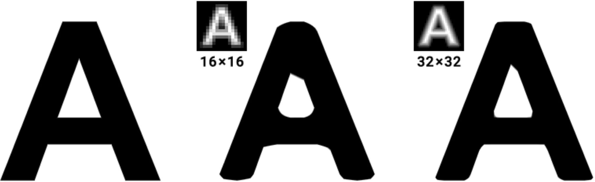

关于 SDF 实时生成慢的问题，网上也有一个[GPU 生成 SDF ](https://astiopin.github.io/2019/01/06/sdf-on-gpu.html)的解决方案，性能问题基本可以解决。关于失真的问题可能主要看具体业务场景的容忍成都。Skia 在非文字场景下的矢量绘制，仅当 Path 尺寸比较小的时候才会开启 SDF 缓存（小于324x324），猜测是因为小尺寸的矢量如果失真肉眼看也不太明显。

关于 SDF 和三角剖分两种矢量渲染方式的对比，根据以往经验两种方式的性能是比较接近的。目前 2D 绘图引擎里会以三角剖分方式为主，游戏场景下以 SDF 为主。除了对失真的容忍度不同外，猜测另外一个影响选择的主要因素是包体。SDF 因为原理比较简单，几乎没有额外的包体引入，游戏里也通常都是用离线预先生成的SDF 纹理。而三角剖分则需要引用额外的库来实现，但绘图引擎一般都自带了这个模块。

整体上 SDF 并不是标准的矢量绘制实现方式，因为可能存在失真的情况，更多的是一种在部分场景条件下的优化手段。也因为第一阶段我们还是侧重在实现最必要的能力上，所以在 TGFX 里目前还没有增加对 SDF 的支持。未来可能会提供 SDF 的支持，但设计思路会跟图集功能类似，只提供高性能的绘制接口，以及Path转换 SDF 缓存的工具方法，具体是否启用这个能力会交给业务方自己来决定。

## 七、 应用成果

再来看一下 TGFX 在项目里的整体应用成果：  

### 性能数据

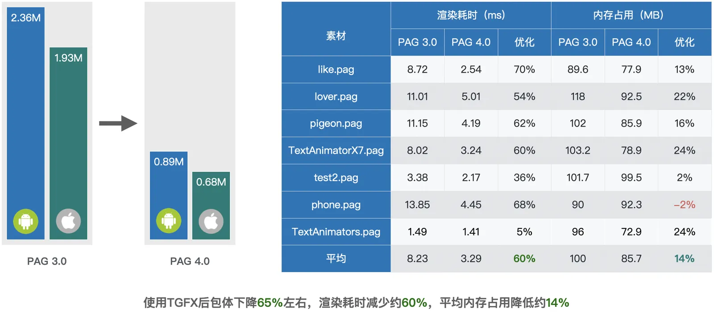

在我们把 Skia 彻底替换为 TGFX 绘图引擎后，PAG 4.0 版本的**包体整体平均都下降了 65% 左右，并且矢量渲染性能平均还提升了 60% 左右**。整体的优化非常显著。腾讯文档在升级到 TGFX 之后，相比之前使用 Skia 的版本，**整体内存占用直线降低了 50% 左右**，渲染耗时基本持平。

#### **性能解读**

大家直觉上可能都会认为性能的提升主要来自调用 GPU 的那些具体单点功能的实现上，其实 GPU 渲染发展到现在，所有单点能力的实现大家基本上都已差不多摸索出了最佳实践，**更大的性能提升主要都是来自 API 设计和架构调度层面的优化**。

腾讯文档的测试结果就很好的印证了这个结论。之前因为 Skia 接口存在 GPU 和 CPU 两套接口，导致上层业务非常容易混用。腾讯文档在后来迁移到 TGFX 的过程中，**由于TGFX的接口设计约束，迫使上层做了混用的拆解**，改完之后也获得了**整体****内存占用减半**的显著提升。而更关键的是完成迁移后他们再基于 TGFX 约束下的调用方式使用 Skia 也获得了接近的性能提升，正是因为 TGFX 和 Skia 在具体单点功能的实现上几乎都是一致的，区别主要是上层接口的设计是否能约束业务方更好的以最佳实践调用。但我们不能指望所有的上层业务方都精通底层渲染的最佳实践，如果API架构上设计的过于宽松，必然导致带来大量混用的额外开销。某种层面上说，**同时代的 Android 设备总是比 iOS 设备需要配置更多的硬件内存**，或许也是这个架构设计上的原因带来的。

再举个例子可能感受更直观一些。Skia早期的直接竞品是苹果的 CoreGraphics，那时候大家都还只有 CPU 的渲染管线。如果单纯对比 CPU 渲染管线，不管过去还是现在 Skia 都是吊打 CoreGraphics的。但后来这两个方案又经历了不同的发展方向，Skia 开始增加了 GPU 渲染管线，性能也进一步大幅提升。而本来就不够快的 CoreGraphics 压根没变，还是万年只具有 CPU 渲染能力。理论上这两者应该差距更大了。但从iOS 和Android系统的实际表现来看，CoreGraphics不仅没有变成瓶颈，iOS 整体的流畅度和平均占用的内存都更具优势。核心原因其实是我们对比错了对象，在 GPU 时代和 Skia 对等的其实应该是 [CoreAnimation](https://developer.apple.com/library/archive/documentation/Cocoa/Conceptual/CoreAnimation_guide/Introduction/Introduction.html)这个库，因为它才是直接承载 iOS 上所有UI渲染的核心模块：

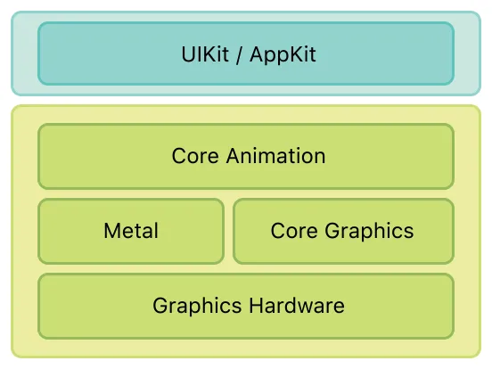

CoreGraphics 之所以后面都没再变，是因为苹果采用了跟谷歌不一样的设计思路，他们把负责 GPU 渲染的工作另起了一个项目实现。虽然CoreAnimation不开源，但从官网的架构图和公开接口不难看出来，它的整体架构设计**完全是为 GPU 渲染而优化**的，CoreGraphics也只是作为它内部的一个子库被调用。相比之下 Skia 则是把GPU的实现直接塞进了之前设计给 CPU 渲染的接口里，因此为了兼顾CPU渲染管线的接口使用，架构上就很难做到 100% 为 GPU 渲染管线而优化。

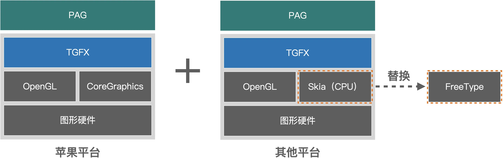

而我们最早在设计TGFX的时候，其实是计划在 Apple 平台上调用 CoreGraphics 光栅化，而在其他平台上直接用精简后的Skia的CPU模块光栅化。但因为后来发现 Freetype 本身就能实现通用的光栅化之后，才彻底抛弃了Skia 的 CPU 渲染管线。我们一开始的目标并不只是为了包体优化和做减法，而是希望像 CoreAnimation 一样，重新设计一套**优先为 GPU 渲染优化的管线及接口**。例如我们在 PAG 升级到 4.0 版本后带来的** 60% **矢量渲染性能提升，其中的每个单点能力，比如软件光栅化，比如三角剖分都是一样的实现，但我们在 TGFX 上的改动仅仅只是优化了缓存的架构，暴露了 Path 对应的 GPU 高速缓存给业务，就可以达到如此明显的性能提升。而 Skia 为了兼顾 CPU 渲染管线的通用性，就很难单独暴露只存在于 GPU 渲染管线下的接口。

当然 CoreAnimation 做的也不止是 GPU 绘图，还包含了动画的能力。如果要对应的话，可以简单理解CoreAnimation做的事情约等于TGFX+PAG两者的能力结合。抛开时间轴相关的属性，CoreAnimation 的整体接口设计也有很多当年 Flash 里显示列表相关架构的影子，例如CALayer上的shouldRasterize其实就是对应Flash里DisplayObject的cacheAsBitmap属性。设计上两者都是围绕容器和图层树状组织的结构，猜测CoreAnimation内也实现了类似 Flash 里的**脏矩形局部刷新渲染**等优化机制。整体上CoreAnimation 这种围绕 GPU 渲染优先的架构思路，还有很多的优化方向值得我们借鉴。

## 八、后续规划

### 指令化延迟渲染

前面说性能的提升主要来自 **API 设计和架构调度层面的优化**。我们目前已经完成了 CPU 和 GPU 的架构解耦，部分实现了优先为 GPU 渲染优化的管线及接口，结果也带来了矢量渲染性能和内存占用的显著优化。但其实这也只是我们规划的 TGFX 架构优化的第一步而已。想要进一步大幅提升渲染性能，还有一个比较重要的方向就是实现**指令化延迟渲染**。其实参考现代 GPU 硬件接口的发展趋势也已经给出了答案：[Metal Best Practices Guide-TripleBuffering](https://developer.apple.com/library/archive/documentation/3DDrawing/Conceptual/MTLBestPracticesGuide/TripleBuffering.html)

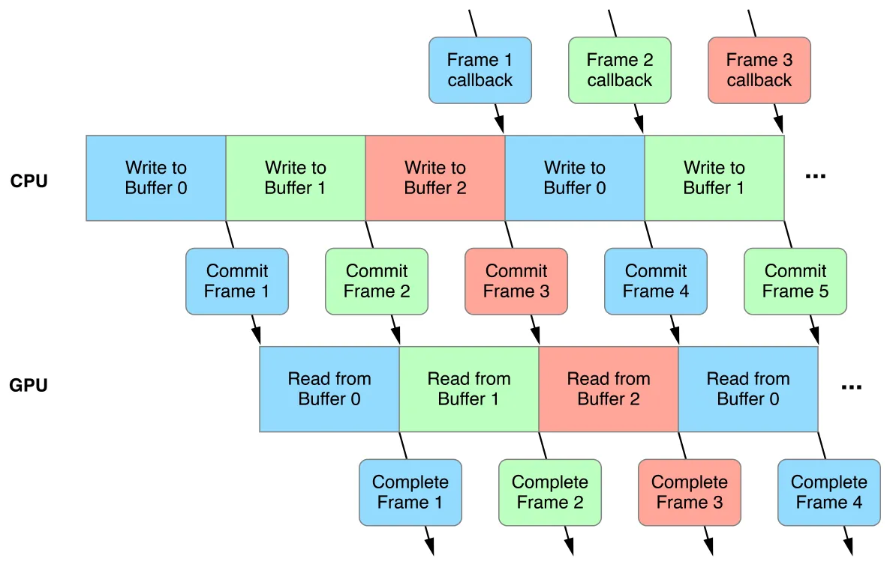

现代的 GPU 硬件接口无论是 Metal 还是 Vulkan，都已从 OpenGL 的状态机调用模式切换到了集中提交指令的CommandBuffer模式。核心就是想从 API 上引导开发者去尽可能地集中提交GPU绘制指令，避免在CPU和GPU之间来回切换。而由于Skia的上层接口设计还是存在大量CPU和GPU混用的情况，也导致在一帧内的绘制存在很多互相耦合依赖的环节，频繁在 CPU 和GPU操作之间切换。结果就是**虽然Skia已经适配了Metal和Vulkan，但在实际的使用过程中还是会出现比较多的串行打断**，没法做到极致的并发并一次性提交给CommandBuffer。大量CPU和GPU串行等待的结果就是硬件的利用率很低，**一方面总体渲染耗时较长，另外一方面硬件的性能又被大量空置浪费掉**。

要彻底解决这个问题我们需要的是将整个架构改造为完全指令化的延迟渲染，让业务不直接操作 GPU，只用一层非常轻量的接口收集用户的操作意图即可。实际上前面提到的iOS 上的 CoreAnimation 已经完成了这件事，它通过各种 CALayer 的子类来搜集开发的绘制意图。这样可以让一帧内的所有绘制过程都不直接实例化任何 GPU 对象，也不做任何的解码或者栅格化操作，而是生成各种代理对象，最后再集中处理。这样做不仅可以**大幅提高接口的易用性**，因为业务再也不需要关注任何 GPU 相关的概念，能够像使用普通软件渲染库一样轻松用起来 GPU 加速的绘图引擎。另外收集完轻量的指令之后集中提交也方便我们做性能优化。例如**指令合并**，或者让单次绘制内的 **CPU 子任务都可以高度并发起来**准备 GPU 数据。也可以很容易实现下一帧的提前预测，比如借鉴游戏引擎里的错帧渲染的优化技术，实现**帧与帧之间 CPU 和 GPU
工作的折叠并发**。完成指令化延迟渲染的架构优化后，我们也就可以解决 Skia 架构带来的打断问题，让上层业务的绘制操作可以直接打通到适合现代 GPU 的CommandBuffer 提交模式。

### 其他规划

  * 推动 TGFX 作为一个独立仓库开源，构建独立的测试用例。  
  * Vulkan 和 Metal 等渲染后端的支持
  * Picture 回放类的支持（与指令不同，它还未确定分辨率也未栅格化，可以通用在各种后端）。
  * 全链路广色域渲染支持
  * 文字图集的内置支持，目前实现在了 PAG 里，围绕文本图层实现高性能的定制。
  * 更加复杂的文本排版框架（独立于 TGFX 之外）
  * 打印支持，输出 PDF。
  * 实现 GIF 等多帧图片格式的解码器。
  * SkMatrix44 下沉到 TGFX。目前实现在了 PAG 里。作为 3D 变换的一个滤镜使用。
  * Canvas 的 saveLayer能力。目前 PAG 和腾讯文档都未使用到。
  * OpenGL Context 的状态属性缓存，避免反复设置。
  * 不相邻的但是也不重叠的 Op 合并，可能依赖 CoreAnimation 类似的图层数据结构才能做到。
  * 完善的运行时性能数据统计，打印准确内存占用以及 DrawCall 数量。
  * SDF（Signed Distance Field）绘制能力的支持，支持预先创建的 SDF 字体格式。
