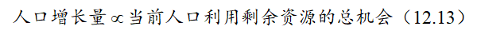
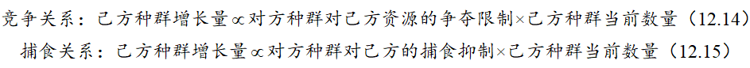
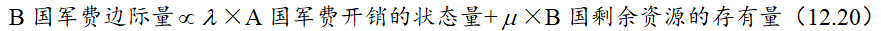
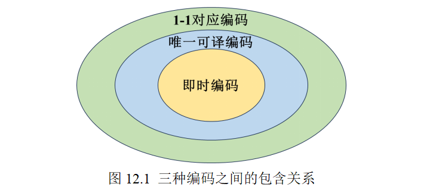
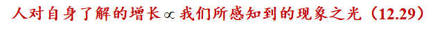
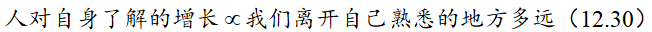

 
<!--BEGIN_DATA
{
    "create_date": "2025-05-17 19:01", 
    "modify_date": "2025-05-17 19:01", 
    "is_top": "0", 
    "summary": "何为一般系统？", 
    "tags": "数学", 
    "file_name": "何为一般系统？.md"
}
END_DATA-->

#### 
原文出处：<a href='https://mp.weixin.qq.com/s/kpn3k2oDJQPJLygCZQRbYA' target='blank'>何为一般系统？</a>

> 本讲关注下列问题：
>
> 1.为什么说数学模型一旦成功了就立刻过时了？
>
> 2.为什么不同领域会独立涌现出相似的数学模式？
>
> 3. 有哪些看起来不同，但其实紧密联系在一起的一般系统？

什么样的数学模型是成功的呢？无疑是已经成功地解决了问题并经过了长期检验的。

什么样的数学模型是过时的呢？恰恰就是那些已经成功解决了问题并经过长期检验的。

什么样的数学模型永不过时呢？反而是那些无法成功解决问题，但与其相似的模式却从多个相似领域的不同问题中独立涌现出来的模型。

什么样的数学模型毫无价值呢？恰恰是那些一遇到问题就被人想着拿来套用的模型。

我们首先来解释上面这四句看起来互相矛盾但其实互相支撑的论断。

首先，如果一个数学模型是为了解决某个领域的某个具体问题而被构建出来，已经在所需的精度和所需的尺度上解决了该问题，并通过了现实检验，那么这个模型无疑挖掘出了该问题在该尺度下的隐含规律。自此以后，人们再遇到同一个问题，便可以直接调用所挖掘出来的规律，没有必要重新建立模型去重复得出结果，毕竟这个模型已经被广泛检验过了（这是我们讨论的前提，尚未通过广泛检验的模型不在此列）。

换句话说，如果模型成功地解决了问题，那么日后调用的，就该是模型的结果，而非模型本身。

此时如果遇到了一个不同于原来问题的新问题——它有可能还是关于同一领域，但是所需的解决精度和尺度有所不同，那么按照我们在前面诸章节的讨论，它也属于是新的问题——我们就不能照搬原来的模型结果，更不能照搬原来的模型，因为该模型是针对原问题的特异性而构建的，它的有效性扎根于它的特异性当中——换句话说，如果它没有针对原问题的特异性，那么它也就没有了相应的有效性；如果它对于原问题和新问题都有效，那么这两个问题对于这个模型而言就是同一个问题。

既然新问题具有新的特异性，而原模型的有效性依赖于原问题的特异性，那么原模型就无法被原方不动地套用来解决新问题。于是原模型对于新问题而言就是过时的了——至少需要重新检验它对于新问题的有效性，往往需要针对新问题的特异性进行调整、修订和改编，甚至完全推翻从零开始重新构建模型。

如果一个模型虽然无法解决问题，或者只能粗糙地解决问题，但是其数学模式或关系结构，却多次独立地在各个不同领域的不同问题中涌现出来，这类的模型就永不过时——它似乎已经彰显了自然和社会的某个深层次普遍规律，当我们解决某个领域的具体问题时，需要不厌其烦地从它身上汲取营养、借助和参考它的结构形式，再经过必要的调整和修订，建立子代模型。

这样的模型我们称为一般系统。

可以作为一般系统的模型很多，例如我们前面反复提到的人口模型，或者说逻辑斯蒂方程

它的解曲线是 S 形曲线，这种曲线不仅在人口问题中很常见，在菌落生长、动植物生长、心理学、经济学、社会学中都能反复见到。它的基本模式是：在资源有限的情况下，当前时刻的增长量不仅和当前时刻的规模成正比，也受当前还能利用的剩余资源存量制约；换句话说，就是相对增长率和所剩余资源负相关。想象一下你的学习成绩就知道了，在你最初学习某个领域时水平会突飞猛进，直到过了某个阶段之后你的水平增长便会减缓，直到遇到难以逾越的瓶颈，此时如果没有特别地顿悟或者外界的刺激，便会一直趋近于这个瓶颈而无法超越——这便是因为你的心智水平的余量已经所剩不多了，无法继续支撑学业水平的相对增长率持续稳定的发展。

人口模型其实解决不了人口问题，任何国家的人口问题都不会寄希望于调用一个简单的人口模型就找到解决方案。人口问题需要更加精细化的模型，例如考虑年龄结构、移民情况和国内各地区之间的人口迁徙、城市化进程、经济发展周期甚至社会张力等等。但是人口模型，或者说逻辑斯蒂方程（12.1），作为一般系统，却成为了我们理解资源受限环境这一广泛场景下的系统增长规律的底层逻辑。

什么模型毫无价值呢？可以是任何的模型，甚至是一般系统层面的模型。这是否矛盾呢？其实并不矛盾——别忘了，我们前面反复讨论过的：“人”是模型最重要的参数。所以这里说的毫无价值，主要是“人”做了毫无价值的事：一遇到问题就机械地套用模型。为什么这毫无价值呢？这个价值依然是针对“人”而言：我只要调用任何一个靠谱的AI，就能以更高效和准确的方式去完成对于已有模型的机械套用，为什么还要耗费宝贵的人的创造力资源呢？！

这意味着，如果我们作为“人”，要想利用数学模型做有价值的事情，就要避免对于任何模型的机械套用。学习数学建模一以贯之的要点，如果说只留一个的话，就是下面这条：

**永远不要机械地套用模型，无论它看起来多么合理和强大。**

那么人是否会被 AI 所替代呢？恰恰是上面的讨论告诉我们：不可能。原因是逻辑上的，而非实证上的，虽然实证上已经有浩如烟海的例子，但是总有有一些“技术宗教”的信徒以“将来这些例子就能够用 AI 解决了，别忘了 AI 是发展的”来诡辩。所以我们从逻辑上下一道判定，它是最终宣判。

道理很简单，是本体论形式的，就是我们作为“人”，我们能感受到的问题，是“人”的问题，机器或 AI可以想象“人”所面临的问题，但它永远无法感同身受地理解这个问题，也无法预测将来会出现的问题。除非这个机器或 AI 能够具有以下属性：碳基、有性繁殖、具有与人同频的基因遗传和变异模式、涌现出人类同频的文化和艺术、放弃通过信息复制和工业制造的手段来更新自我、通过有机物进食和补充能量、具有和人一样的受骗和资源利用能力… …换句话说，就是一切能区分人和机器与 AI 的方面。

如果一个机器或 AI 具备了上述属性，也就是我们从任何方面（包括基因层面和更加微观的层面）都无法区分它是机器和 AI 还是人，我们一般就把它称为“人”了。

所以，除非机器或 AI 演化为和人等同，否则就一定存在某个“人”的问题，是它所无法解决的。我们在这里利用自指性很容易构造出一个：

“请一个能够代替人的 AI 找出它无法代替人的证据”

啊哈！无论它是否能够找到证据，它都会自相矛盾——仅凭借这句话作为符号的存在就足够了！

回到一般系统，为什么不同领域会独立涌现出相似的数学模式呢？这看起来非常不合理，因为这些领域往往如此独立，以至于它们的研究者互相之间可能都并不知道对方的存在；如果这些领域之中有可以互相交流的数学模式，为什么这些领域没有合并为一个领域呢？

再一次地，回到我们的基本论调：一切模型中，最重要的参数是“人”。对于具体模型而言，这个“人”更多地指向“具体的人”，就是模型的研究者自身；对于一般系统而言，这个“人”，则更多地指向“人类共同体”这个抽象的、平均的“人”——这种人类共同体的存在的保证，便是 20 世纪长足发展的基因和遗传理论——我和你可能并不相识，但是我们的基因却紧密相连，这决定了我们都有一双眼睛、两支耳朵、一个鼻子和两条腿。

即便是不同的领域，也都是基于现象在研究，这个现象可能来源自现实世界、数学世界或理念世界，哪怕是理论本身，也是一个现象。只要是针对现象的研究和思考，并尝试用定量的方式描述其中变量、参数、常量之间的等量关系、序关系、统计关联等等，就必须用到数学语言——这是因为数学语言的定义便是如此，如果你发现了一个新的办法描述这些关系，那么这个新方法便立刻变成了数学语言的新的成分——这里的“数学语言”被视为一种即时可译且符合逻辑语法的编码系统，换个说法，就是数学模型。

我们经常说学科融合、跨学科，“融合”与“跨”的桥梁和媒介是什么呢？就是数学模型。数学模型是将一个领域中的现象、发现、传统和结果，定量、符合逻辑且不易混淆和误解地传播的几乎最有效的途径。

从这个意义上来看，既然不同领域都是“人类能做的研究”，且“人类具有相近的数理文化和基因结构”，那么这些领域至少就存在互相理解、交流和解释的可能，一般系统的存在性便蕴于这种可能性之中。

另一个角度的解释来自于对世界的理解。我们总是觉得简单是对于复杂的简化，这个理解也对也不对。如果是站在“人的功能性理解”的角度，这总是对的，因为我们之所以称一个问题是复杂度，就是因为它难于理解；我们之所以称一个问题是简单的，就是因为它便于理解；是理解的难易程度，定义了一个事物是简单还是复杂，而非其具体占用了多少篇幅——我将字符“1”粘贴复制 1 千万遍，体量很大，但依然简单，因为它容易理解；薛定谔方程全部写出来用不了 15 个字符（见式12.2），但它依然很复杂，因为不易理解。

所以如果是站在“人的功能性理解”的角度，那么“简单是对于复杂的简化”几乎就是同义转述，并没有承载什么信息。

但是如果我们跳出“人的功能性理解”，而去尊崇科学审美的指引，朝向永恒不朽的那个“第一性原理”——所谓的“第一性原理”，由亚里士多德提出，认为每个系统中存在一个最基本的、不依赖于类比或经验的结构，构成系统中其它所有知识和推论的基础——那么我们必然将会付出不屑的努力，去从眼前的复杂系统中，挖掘出背后潜在的、支撑整个系统生成的、足够简洁到不需要任何先验知识就能体会的“系统源头”。这份努力的存在，使得“系统源头”在认识论层面上具备比复杂的现象更高层面的地位。从这个意义来说，复杂是简单的投影——系统中的对象在第一性原理的规划下演化出了各种复杂现象，这个第一性原理一定是简洁且易于理解的，否则从审美追求上就存在等待我们继续挖掘的更根本的“第一性原理”。

我将这种层面的追求称为“人的意义性理解”。我们通过探求各个系统的“第一性原理”来理解该系统存在的必然性和意义，同时也因为这种追求而达成了对不同系统中隐秘的链接的探查。这种隐秘的链接颇具哲学意味，很像我们中国的“道”和“一”，但是它们太难捉摸以至于难以描述，也很难在不同人之间交流和产生共识。如果我们寻求那种可用语言描述和交流的、最接近第一性原理的内容，那便是我们本节所说的“一般系统”了——放到中国古典哲学中，这个一般系统可以认为是《易经》，人们一方面向下通过它来解决问题，另一方面也通过它向上理解“道”和“一”。王阳明在他的心学中也强调了一般系统的重要性，他认为“知行合一”，即我们做的一切事情，都蕴含着“道”和“一”的一般系统，我们做事情的过程，就是理解“道”和“一”的过程，也是在我们心中构建连接它们和世界以及自我认知三者之间的一般系统。

那么在数学建模中都有哪些常见的一般系统呢？基于我自己的认知水平，觉得至少有一个，它能够将众多问题联系在一起，它就是“叠加与扩散”。它能够联系但不限于如下这些问题：

热扩散、欧姆定律、牛顿第二定律、动量定理、万有引力、测量与度量、广义相对论、曲率、人口模型、城市化进程、生态循环、熵、军备竞赛、博弈论、编码、最大熵原理、场和复数、最优作用原理，等等

受限于本书的目的和篇幅，我们无意于在此处给出这些问题的数学形式及其推导，我们仅在下面尝试将它们用“叠加与扩散”联系起来。

热扩散是我们生活中常见的现象，一杯开水放到室内渐渐降温，如果不考虑在此过程中水的蒸发和表面空气流动的不稳定性，其近似的降温规律符合

其中 <svg xmlns="http://www.w3.org/2000/svg" role="img" focusable="false" viewBox="0 -442 778 453" aria-hidden="true" style="vertical-align: -0.025ex;width: 1.76ex;height: 1.025ex;"><g stroke="currentColor" fill="currentColor" stroke-width="0" transform="matrix(1 0 0 -1 0 0)"><g data-mml-node="math"><g data-mml-node="mo"><path data-c="221D" d="M56 124T56 216T107 375T238 442Q260 442 280 438T319 425T352 407T382 385T406 361T427 336T442 315T455 297T462 285L469 297Q555 442 679 442Q687 442 722 437V398H718Q710 400 694 400Q657 400 623 383T567 343T527 294T503 253T495 235Q495 231 520 192T554 143Q625 44 696 44Q717 44 719 46H722V-5Q695 -11 678 -11Q552 -11 457 141Q455 145 454 146L447 134Q362 -11 235 -11Q157 -11 107 56ZM93 213Q93 143 126 87T220 31Q258 31 292 48T349 88T389 137T413 178T421 196Q421 200 396 239T362 288Q322 345 288 366T213 387Q163 387 128 337T93 213Z"></path></g></g></g><g></g></svg> 代表“正比于”。

类似的事情还发生在欧姆定律当中，这是任何初中生都要学习的基本定律，说的是

牛顿第二定律的内容也与此类似，说的是

通过动量定理的加工，它又可变为如下形式

万有引力也难逃此模式，具体表现为

其中质距比指“质量和距离之比”。

在我们从小到大无数次用尺子测量物体的过程中，也体现了相似的规律。回忆一下，我们测量过程中对刻度单位（或测量工具）的选取，是随着测量值和真实值的差（即残差）而改变的——首先用米尺、当米尺无法测量残差时改用厘米尺、当厘米尺无法测量残差时改用毫米尺、当毫米尺无法测量残差时改用游标卡尺，这个过程可以描述为

广义相对论也难逃此规律，虽然这个名词让好多人望而却步，但其实可以用生活中常见之物去理解它——想象在一个篮球的最上端放着一个橘子，一般情况下橘子的重量尚不足以使得篮球产生明显形变，所以橘子处于不稳定状态，稍微一晃动就会从篮球上掉下来；现在假设这个“顶着橘子的篮球”，被安置在加速度为 1000 个重力常数的火箭上（假设橘子和篮球都可以承受这么大的加速度而不损坏），这么大的加速度使得橘子施加给篮球的压力足以明显改变篮球的形状——在篮球表面压出一个“圆坑”，橘子则处于这个圆坑之中。现在这个橘子就不再处于不稳定位置，而是处于一种局部稳定的状态——你想要让橘子掉落，首先需要让它脱离这个“坑”。在这个过程中，我们可以提炼出如下规律

说到广义相对论，就不能不再提一句曲率（即衡量事物弯曲程度的一种数学度量），毕竟前者就是后者的物理表达。一般的数学上的曲率定义需要用到微分几何，但针对于一元函数的图象而言并不需要这样复杂，因为它可以被描述在二维平面当中，具体而言表达式为

其中 <svg xmlns="http://www.w3.org/2000/svg" role="img" focusable="false" viewBox="0 -759 2206.5 1009" aria-hidden="true" style="vertical-align: -0.566ex;width: 4.992ex;height: 2.283ex;"><g stroke="currentColor" fill="currentColor" stroke-width="0" transform="matrix(1 0 0 -1 0 0)"><g data-mml-node="math"><g data-mml-node="msup"><g data-mml-node="mi"><path data-c="66" d="M118 -162Q120 -162 124 -164T135 -167T147 -168Q160 -168 171 -155T187 -126Q197 -99 221 27T267 267T289 382V385H242Q195 385 192 387Q188 390 188 397L195 425Q197 430 203 430T250 431Q298 431 298 432Q298 434 307 482T319 540Q356 705 465 705Q502 703 526 683T550 630Q550 594 529 578T487 561Q443 561 443 603Q443 622 454 636T478 657L487 662Q471 668 457 668Q445 668 434 658T419 630Q412 601 403 552T387 469T380 433Q380 431 435 431Q480 431 487 430T498 424Q499 420 496 407T491 391Q489 386 482 386T428 385H372L349 263Q301 15 282 -47Q255 -132 212 -173Q175 -205 139 -205Q107 -205 81 -186T55 -132Q55 -95 76 -78T118 -61Q162 -61 162 -103Q162 -122 151 -136T127 -157L118 -162Z"></path></g><g data-mml-node="mi" transform="translate(612, 363) scale(0.707)"><path data-c="2032" d="M79 43Q73 43 52 49T30 61Q30 68 85 293T146 528Q161 560 198 560Q218 560 240 545T262 501Q262 496 260 486Q259 479 173 263T84 45T79 43Z"></path></g></g><g data-mml-node="mo" transform="translate(856.5, 0)"><path data-c="28" d="M94 250Q94 319 104 381T127 488T164 576T202 643T244 695T277 729T302 750H315H319Q333 750 333 741Q333 738 316 720T275 667T226 581T184 443T167 250T184 58T225 -81T274 -167T316 -220T333 -241Q333 -250 318 -250H315H302L274 -226Q180 -141 137 -14T94 250Z"></path></g><g data-mml-node="mi" transform="translate(1245.5, 0)"><path data-c="78" d="M52 289Q59 331 106 386T222 442Q257 442 286 424T329 379Q371 442 430 442Q467 442 494 420T522 361Q522 332 508 314T481 292T458 288Q439 288 427 299T415 328Q415 374 465 391Q454 404 425 404Q412 404 406 402Q368 386 350 336Q290 115 290 78Q290 50 306 38T341 26Q378 26 414 59T463 140Q466 150 469 151T485 153H489Q504 153 504 145Q504 144 502 134Q486 77 440 33T333 -11Q263 -11 227 52Q186 -10 133 -10H127Q78 -10 57 16T35 71Q35 103 54 123T99 143Q142 143 142 101Q142 81 130 66T107 46T94 41L91 40Q91 39 97 36T113 29T132 26Q168 26 194 71Q203 87 217 139T245 247T261 313Q266 340 266 352Q266 380 251 392T217 404Q177 404 142 372T93 290Q91 281 88 280T72 278H58Q52 284 52 289Z"></path></g><g data-mml-node="mo" transform="translate(1817.5, 0)"><path data-c="29" d="M60 749L64 750Q69 750 74 750H86L114 726Q208 641 251 514T294 250Q294 182 284 119T261 12T224 -76T186 -143T145 -194T113 -227T90 -246Q87 -249 86 -250H74Q66 -250 63 -250T58 -247T55 -238Q56 -237 66 -225Q221 -64 221 250T66 725Q56 737 55 738Q55 746 60 749Z"></path></g></g></g><g></g></svg> 和 <svg xmlns="http://www.w3.org/2000/svg" role="img" focusable="false" viewBox="0 -759 2400.9 1009" aria-hidden="true" style="vertical-align: -0.566ex;width: 5.432ex;height: 2.283ex;"><g stroke="currentColor" fill="currentColor" stroke-width="0" transform="matrix(1 0 0 -1 0 0)"><g data-mml-node="math"><g data-mml-node="msup"><g data-mml-node="mi"><path data-c="66" d="M118 -162Q120 -162 124 -164T135 -167T147 -168Q160 -168 171 -155T187 -126Q197 -99 221 27T267 267T289 382V385H242Q195 385 192 387Q188 390 188 397L195 425Q197 430 203 430T250 431Q298 431 298 432Q298 434 307 482T319 540Q356 705 465 705Q502 703 526 683T550 630Q550 594 529 578T487 561Q443 561 443 603Q443 622 454 636T478 657L487 662Q471 668 457 668Q445 668 434 658T419 630Q412 601 403 552T387 469T380 433Q380 431 435 431Q480 431 487 430T498 424Q499 420 496 407T491 391Q489 386 482 386T428 385H372L349 263Q301 15 282 -47Q255 -132 212 -173Q175 -205 139 -205Q107 -205 81 -186T55 -132Q55 -95 76 -78T118 -61Q162 -61 162 -103Q162 -122 151 -136T127 -157L118 -162Z"></path></g><g data-mml-node="mo" transform="translate(612, 363) scale(0.707)"><g data-c="2033"><path data-c="2032" d="M79 43Q73 43 52 49T30 61Q30 68 85 293T146 528Q161 560 198 560Q218 560 240 545T262 501Q262 496 260 486Q259 479 173 263T84 45T79 43Z"></path><path data-c="2032" d="M79 43Q73 43 52 49T30 61Q30 68 85 293T146 528Q161 560 198 560Q218 560 240 545T262 501Q262 496 260 486Q259 479 173 263T84 45T79 43Z" transform="translate(275, 0)"></path></g></g></g><g data-mml-node="mo" transform="translate(1050.9, 0)"><path data-c="28" d="M94 250Q94 319 104 381T127 488T164 576T202 643T244 695T277 729T302 750H315H319Q333 750 333 741Q333 738 316 720T275 667T226 581T184 443T167 250T184 58T225 -81T274 -167T316 -220T333 -241Q333 -250 318 -250H315H302L274 -226Q180 -141 137 -14T94 250Z"></path></g><g data-mml-node="mi" transform="translate(1439.9, 0)"><path data-c="78" d="M52 289Q59 331 106 386T222 442Q257 442 286 424T329 379Q371 442 430 442Q467 442 494 420T522 361Q522 332 508 314T481 292T458 288Q439 288 427 299T415 328Q415 374 465 391Q454 404 425 404Q412 404 406 402Q368 386 350 336Q290 115 290 78Q290 50 306 38T341 26Q378 26 414 59T463 140Q466 150 469 151T485 153H489Q504 153 504 145Q504 144 502 134Q486 77 440 33T333 -11Q263 -11 227 52Q186 -10 133 -10H127Q78 -10 57 16T35 71Q35 103 54 123T99 143Q142 143 142 101Q142 81 130 66T107 46T94 41L91 40Q91 39 97 36T113 29T132 26Q168 26 194 71Q203 87 217 139T245 247T261 313Q266 340 266 352Q266 380 251 392T217 404Q177 404 142 372T93 290Q91 281 88 280T72 278H58Q52 284 52 289Z"></path></g><g data-mml-node="mo" transform="translate(2011.9, 0)"><path data-c="29" d="M60 749L64 750Q69 750 74 750H86L114 726Q208 641 251 514T294 250Q294 182 284 119T261 12T224 -76T186 -143T145 -194T113 -227T90 -246Q87 -249 86 -250H74Q66 -250 63 -250T58 -247T55 -238Q56 -237 66 -225Q221 -64 221 250T66 725Q56 737 55 738Q55 746 60 749Z"></path></g></g></g><g></g></svg> 分别代表函数 <svg xmlns="http://www.w3.org/2000/svg" role="img" focusable="false" viewBox="0 -750 1900 1000" aria-hidden="true" style="vertical-align: -0.566ex;width: 4.299ex;height: 2.262ex;"><g stroke="currentColor" fill="currentColor" stroke-width="0" transform="matrix(1 0 0 -1 0 0)"><g data-mml-node="math"><g data-mml-node="mi"><path data-c="66" d="M118 -162Q120 -162 124 -164T135 -167T147 -168Q160 -168 171 -155T187 -126Q197 -99 221 27T267 267T289 382V385H242Q195 385 192 387Q188 390 188 397L195 425Q197 430 203 430T250 431Q298 431 298 432Q298 434 307 482T319 540Q356 705 465 705Q502 703 526 683T550 630Q550 594 529 578T487 561Q443 561 443 603Q443 622 454 636T478 657L487 662Q471 668 457 668Q445 668 434 658T419 630Q412 601 403 552T387 469T380 433Q380 431 435 431Q480 431 487 430T498 424Q499 420 496 407T491 391Q489 386 482 386T428 385H372L349 263Q301 15 282 -47Q255 -132 212 -173Q175 -205 139 -205Q107 -205 81 -186T55 -132Q55 -95 76 -78T118 -61Q162 -61 162 -103Q162 -122 151 -136T127 -157L118 -162Z"></path></g><g data-mml-node="mo" transform="translate(550, 0)"><path data-c="28" d="M94 250Q94 319 104 381T127 488T164 576T202 643T244 695T277 729T302 750H315H319Q333 750 333 741Q333 738 316 720T275 667T226 581T184 443T167 250T184 58T225 -81T274 -167T316 -220T333 -241Q333 -250 318 -250H315H302L274 -226Q180 -141 137 -14T94 250Z"></path></g><g data-mml-node="mi" transform="translate(939, 0)"><path data-c="78" d="M52 289Q59 331 106 386T222 442Q257 442 286 424T329 379Q371 442 430 442Q467 442 494 420T522 361Q522 332 508 314T481 292T458 288Q439 288 427 299T415 328Q415 374 465 391Q454 404 425 404Q412 404 406 402Q368 386 350 336Q290 115 290 78Q290 50 306 38T341 26Q378 26 414 59T463 140Q466 150 469 151T485 153H489Q504 153 504 145Q504 144 502 134Q486 77 440 33T333 -11Q263 -11 227 52Q186 -10 133 -10H127Q78 -10 57 16T35 71Q35 103 54 123T99 143Q142 143 142 101Q142 81 130 66T107 46T94 41L91 40Q91 39 97 36T113 29T132 26Q168 26 194 71Q203 87 217 139T245 247T261 313Q266 340 266 352Q266 380 251 392T217 404Q177 404 142 372T93 290Q91 281 88 280T72 278H58Q52 284 52 289Z"></path></g><g data-mml-node="mo" transform="translate(1511, 0)"><path data-c="29" d="M60 749L64 750Q69 750 74 750H86L114 726Q208 641 251 514T294 250Q294 182 284 119T261 12T224 -76T186 -143T145 -194T113 -227T90 -246Q87 -249 86 -250H74Q66 -250 63 -250T58 -247T55 -238Q56 -237 66 -225Q221 -64 221 250T66 725Q56 737 55 738Q55 746 60 749Z"></path></g></g></g><g></g></svg>
的一阶导数和二阶导数。看起来复杂的分母是为了抵消曲线作为函数图象在具体坐标系中的旋转所产生的影响。式（12.10）可以被简略写为

没错，这正是式（12.9）的同意翻译。

从式（12.3）到式（12.11），都体现了一个关系，那就是边际量和状态量之间的正比关系。这个关系就是我们所谓的“扩散”——状态产生改变状态的“势能”，这个势能不会直接改变状态，而是通过影响边际量造成状态的逐步改变，整个过程是动态的和自适应的。

但这和人口模型，或说和逻辑斯蒂模型又有什么关系呢？其实式（12.11）已经体现出了这一点，其中函数曲率和函数二阶导数之间虽然依然是正比关系，但是比例系数其实是随着系统状态变化的，如果这个变化反映的是“剩余资源对增长的限制”，便得到了逻辑斯蒂模型，即

如果我们将剩余资源和当前人口数的乘积，视为“当前人口所能接触到的资源总机会”——想象一下疫情感染模型中，新增感染人数是和“已感染者和未感染者之积”成正比就清楚了，这里以感染者和未感染者想接触才能有一定几率引起新增感染，所以这个乘积自然就代表了潜在的可能诱导出感染的机会总和——那么式（12.12）又可以表述为

这一点放到城市化进程中依然有效，这里我们用城市常住人口总数来度量城市化率。一方面城市人数越多，所能吸引的新增人数越多；另一方面打算新进入城市的人群又需要考虑城市人口过剩所造成的工作岗位紧缺的情况，即考虑剩余资源；所以城市化速度就自然地和当前城市人口与剩余资源的乘积，也就是城市人口所能调用的资源的总机会成正比，得到类似于式 12.13 的关系。

在生态模型中亦然如此，例如：在竞争关系模型中，A物种的数量一方面受到本种群数量的正向激励，另一方面也受到B物种数量对A物种数量的竞争抑制；在捕食关系模型中，被捕食一方的种群数量一方面受到本种群数量的正向激励，另一方面也受到对方种群的捕食抑制，这些都可以视为边际量正比于状态量的过程中，其比例系数受到外界影响而造成的叠加变化。具体而言即为

再一次地，式（12.14）和式（12.15）右侧乘积可被视为己方种群从对方种群的压制中（京生或捕食）与资源发生交互的总机会。事情再一次回到了“边际量正比于状态量”的模式。

那么这些又和熵有什么关系呢？这里的熵既指热力学中的熵，也指信息熵。二者的数学表达式是相似的，且都用来表征系统的无序程度。如果我们对熵求梯度，就会发现，它的梯度流在数学上等价于热流，换句话说，如果要用最快的方式改变熵，那么热扩散就是最佳的方式。这一点我在《为什么是数学》的对话27中给出了证明，这里不再赘述。所以熵和扩散是一体两面的对偶结构：熵是热扩散效果的最佳呈现形式，而热扩散则是熵实现最快变化的方式，即

当然还有许许多多的现象和结构可以归结到“边际量正比于状态量”的模式，这里我们无意于给出百科全书式地整理，但我们在下面将展示一种推广方式，它将上面的模式粘合为了博弈的形态。

一个典型的例子便是军备竞赛模型，其中A国的军费增长量受两个因素影响：一方面，A国受到B国当前军费开销的威慑，使得A国的军费增长量有正比于B国当前军费开销的趋势；另一方面，A国的军费不可能无限制增长，也受到本国剩余资源的约束。即

那么如何反映A国军费边际量同时受二者影响时的变化呢？考虑到这两种方式在时空局部上的相关性不显著（因为敌对双方没有直接大规模贸易和紧密交流），可以假设两种影响近似无关，这样一来，就可以采用“叠加原理”将式（12.17）和式（12.18）粘连起来，具体即

此时并不能简单地视为“边际量正比于状态量”的模式重复，而多个互不相关或近似互不相关的此类模式的叠加效果。同理也有

式（12.19）和式（12.20）将 A、B 两国军费开支和它们各自的剩余资源与所受威慑联系起来，其中存在明显的张力——即便某国所受威慑达到很高的程度，其军费开支也不可能永远以同样的增速一直提升下去。这种张力变预示了该系统已经成为一个博弈系统，类似的模式在许多动态博弈场景中也屡见不鲜。下面我们例举一个和一般的博弈系统不同的场景，并说明它其实也是类似的问题，那就是最优编码。

简单起见，想象在英文环境下，对 26 个英文字母进行二进制编码，即，将 26 个英文字母分别用 26 个不同的 <svg xmlns="http://www.w3.org/2000/svg" role="img" focusable="false" viewBox="0 -666 1694.7 860" aria-hidden="true" style="vertical-align: -0.439ex;width: 3.834ex;height: 1.946ex;"><g stroke="currentColor" fill="currentColor" stroke-width="0" transform="matrix(1 0 0 -1 0 0)"><g data-mml-node="math"><g data-mml-node="mn"><path data-c="30" d="M96 585Q152 666 249 666Q297 666 345 640T423 548Q460 465 460 320Q460 165 417 83Q397 41 362 16T301 -15T250 -22Q224 -22 198 -16T137 16T82 83Q39 165 39 320Q39 494 96 585ZM321 597Q291 629 250 629Q208 629 178 597Q153 571 145 525T137 333Q137 175 145 125T181 46Q209 16 250 16Q290 16 318 46Q347 76 354 130T362 333Q362 478 354 524T321 597Z"></path></g><g data-mml-node="mo" transform="translate(500, 0)"><path data-c="2C" d="M78 35T78 60T94 103T137 121Q165 121 187 96T210 8Q210 -27 201 -60T180 -117T154 -158T130 -185T117 -194Q113 -194 104 -185T95 -172Q95 -168 106 -156T131 -126T157 -76T173 -3V9L172 8Q170 7 167 6T161 3T152 1T140 0Q113 0 96 17Z"></path></g><g data-mml-node="mtext" transform="translate(944.7, 0)"><path data-c="A0" d=""></path></g><g data-mml-node="mn" transform="translate(1194.7, 0)"><path data-c="31" d="M213 578L200 573Q186 568 160 563T102 556H83V602H102Q149 604 189 617T245 641T273 663Q275 666 285 666Q294 666 302 660V361L303 61Q310 54 315 52T339 48T401 46H427V0H416Q395 3 257 3Q121 3 100 0H88V46H114Q136 46 152 46T177 47T193 50T201 52T207 57T213 61V578Z"></path></g></g></g><g></g></svg> 字符串所替代（不考虑大小写和标点）。为了能够解码，需要一些最基本的要求，唯一可译性便是其中最为基础的一条，即不允许出现编码后的段落有两种及以上的解码方式。需要注意的是，唯一可译性并不等价于＂不同的英文字母对应于不同的 <svg xmlns="http://www.w3.org/2000/svg" role="img" focusable="false" viewBox="0 -666 1694.7 860" aria-hidden="true" style="vertical-align: -0.439ex;width: 3.834ex;height: 1.946ex;"><g stroke="currentColor" fill="currentColor" stroke-width="0" transform="matrix(1 0 0 -1 0 0)"><g data-mml-node="math"><g data-mml-node="mn"><path data-c="30" d="M96 585Q152 666 249 666Q297 666 345 640T423 548Q460 465 460 320Q460 165 417 83Q397 41 362 16T301 -15T250 -22Q224 -22 198 -16T137 16T82 83Q39 165 39 320Q39 494 96 585ZM321 597Q291 629 250 629Q208 629 178 597Q153 571 145 525T137 333Q137 175 145 125T181 46Q209 16 250 16Q290 16 318 46Q347 76 354 130T362 333Q362 478 354 524T321 597Z"></path></g><g data-mml-node="mo" transform="translate(500, 0)"><path data-c="2C" d="M78 35T78 60T94 103T137 121Q165 121 187 96T210 8Q210 -27 201 -60T180 -117T154 -158T130 -185T117 -194Q113 -194 104 -185T95 -172Q95 -168 106 -156T131 -126T157 -76T173 -3V9L172 8Q170 7 167 6T161 3T152 1T140 0Q113 0 96 17Z"></path></g><g data-mml-node="mtext" transform="translate(944.7, 0)"><path data-c="A0" d=""></path></g><g data-mml-node="mn" transform="translate(1194.7, 0)"><path data-c="31" d="M213 578L200 573Q186 568 160 563T102 556H83V602H102Q149 604 189 617T245 641T273 663Q275 666 285 666Q294 666 302 660V361L303 61Q310 54 315 52T339 48T401 46H427V0H416Q395 3 257 3Q121 3 100 0H88V46H114Q136 46 152 46T177 47T193 50T201 52T207 57T213 61V578Z"></path></g></g></g><g></g></svg> 字符串＂的这种 1－1 对应关系。例如：如果我们将
<svg xmlns="http://www.w3.org/2000/svg" role="img" focusable="false" viewBox="0 -716 750 716" aria-hidden="true" style="vertical-align: 0px;width: 1.697ex;height: 1.62ex;"><g stroke="currentColor" fill="currentColor" stroke-width="0" transform="matrix(1 0 0 -1 0 0)"><g data-mml-node="math"><g data-mml-node="mi"><path data-c="41" d="M208 74Q208 50 254 46Q272 46 272 35Q272 34 270 22Q267 8 264 4T251 0Q249 0 239 0T205 1T141 2Q70 2 50 0H42Q35 7 35 11Q37 38 48 46H62Q132 49 164 96Q170 102 345 401T523 704Q530 716 547 716H555H572Q578 707 578 706L606 383Q634 60 636 57Q641 46 701 46Q726 46 726 36Q726 34 723 22Q720 7 718 4T704 0Q701 0 690 0T651 1T578 2Q484 2 455 0H443Q437 6 437 9T439 27Q443 40 445 43L449 46H469Q523 49 533 63L521 213H283L249 155Q208 86 208 74ZM516 260Q516 271 504 416T490 562L463 519Q447 492 400 412L310 260L413 259Q516 259 516 260Z"></path></g></g></g><g></g></svg> 编码为＂ 01010 ＂，将 <svg xmlns="http://www.w3.org/2000/svg" role="img" focusable="false" viewBox="0 -683 759 683" aria-hidden="true" style="vertical-align: 0px;width: 1.717ex;height: 1.545ex;"><g stroke="currentColor" fill="currentColor" stroke-width="0" transform="matrix(1 0 0 -1 0 0)"><g data-mml-node="math"><g data-mml-node="mi"><path data-c="42" d="M231 637Q204 637 199 638T194 649Q194 676 205 682Q206 683 335 683Q594 683 608 681Q671 671 713 636T756 544Q756 480 698 429T565 360L555 357Q619 348 660 311T702 219Q702 146 630 78T453 1Q446 0 242 0Q42 0 39 2Q35 5 35 10Q35 17 37 24Q42 43 47 45Q51 46 62 46H68Q95 46 128 49Q142 52 147 61Q150 65 219 339T288 628Q288 635 231 637ZM649 544Q649 574 634 600T585 634Q578 636 493 637Q473 637 451 637T416 636H403Q388 635 384 626Q382 622 352 506Q352 503 351 500L320 374H401Q482 374 494 376Q554 386 601 434T649 544ZM595 229Q595 273 572 302T512 336Q506 337 429 337Q311 337 310 336Q310 334 293 263T258 122L240 52Q240 48 252 48T333 46Q422 46 429 47Q491 54 543 105T595 229Z"></path></g></g></g><g></g></svg> 编码为＂ 010 ＂，将 <svg xmlns="http://www.w3.org/2000/svg" role="img" focusable="false" viewBox="0 -705 760 727" aria-hidden="true" style="vertical-align: -0.05ex;width: 1.719ex;height: 1.645ex;"><g stroke="currentColor" fill="currentColor" stroke-width="0" transform="matrix(1 0 0 -1 0 0)"><g data-mml-node="math"><g data-mml-node="mi"><path data-c="43" d="M50 252Q50 367 117 473T286 641T490 704Q580 704 633 653Q642 643 648 636T656 626L657 623Q660 623 684 649Q691 655 699 663T715 679T725 690L740 705H746Q760 705 760 698Q760 694 728 561Q692 422 692 421Q690 416 687 415T669 413H653Q647 419 647 422Q647 423 648 429T650 449T651 481Q651 552 619 605T510 659Q484 659 454 652T382 628T299 572T226 479Q194 422 175 346T156 222Q156 108 232 58Q280 24 350 24Q441 24 512 92T606 240Q610 253 612 255T628 257Q648 257 648 248Q648 243 647 239Q618 132 523 55T319 -22Q206 -22 128 53T50 252Z"></path></g></g></g><g></g></svg>
编码为＂ 10 ＂，即便这里 <svg xmlns="http://www.w3.org/2000/svg" role="img" focusable="false" viewBox="0 -716 3658.3 910" aria-hidden="true" style="vertical-align: -0.439ex;width: 8.277ex;height: 2.059ex;"><g stroke="currentColor" fill="currentColor" stroke-width="0" transform="matrix(1 0 0 -1 0 0)"><g data-mml-node="math"><g data-mml-node="mi"><path data-c="41" d="M208 74Q208 50 254 46Q272 46 272 35Q272 34 270 22Q267 8 264 4T251 0Q249 0 239 0T205 1T141 2Q70 2 50 0H42Q35 7 35 11Q37 38 48 46H62Q132 49 164 96Q170 102 345 401T523 704Q530 716 547 716H555H572Q578 707 578 706L606 383Q634 60 636 57Q641 46 701 46Q726 46 726 36Q726 34 723 22Q720 7 718 4T704 0Q701 0 690 0T651 1T578 2Q484 2 455 0H443Q437 6 437 9T439 27Q443 40 445 43L449 46H469Q523 49 533 63L521 213H283L249 155Q208 86 208 74ZM516 260Q516 271 504 416T490 562L463 519Q447 492 400 412L310 260L413 259Q516 259 516 260Z"></path></g><g data-mml-node="mo" transform="translate(750, 0)"><path data-c="2C" d="M78 35T78 60T94 103T137 121Q165 121 187 96T210 8Q210 -27 201 -60T180 -117T154 -158T130 -185T117 -194Q113 -194 104 -185T95 -172Q95 -168 106 -156T131 -126T157 -76T173 -3V9L172 8Q170 7 167 6T161 3T152 1T140 0Q113 0 96 17Z"></path></g><g data-mml-node="mtext" transform="translate(1194.7, 0)"><path data-c="A0" d=""></path></g><g data-mml-node="mi" transform="translate(1444.7, 0)"><path data-c="42" d="M231 637Q204 637 199 638T194 649Q194 676 205 682Q206 683 335 683Q594 683 608 681Q671 671 713 636T756 544Q756 480 698 429T565 360L555 357Q619 348 660 311T702 219Q702 146 630 78T453 1Q446 0 242 0Q42 0 39 2Q35 5 35 10Q35 17 37 24Q42 43 47 45Q51 46 62 46H68Q95 46 128 49Q142 52 147 61Q150 65 219 339T288 628Q288 635 231 637ZM649 544Q649 574 634 600T585 634Q578 636 493 637Q473 637 451 637T416 636H403Q388 635 384 626Q382 622 352 506Q352 503 351 500L320 374H401Q482 374 494 376Q554 386 601 434T649 544ZM595 229Q595 273 572 302T512 336Q506 337 429 337Q311 337 310 336Q310 334 293 263T258 122L240 52Q240 48 252 48T333 46Q422 46 429 47Q491 54 543 105T595 229Z"></path></g><g data-mml-node="mo" transform="translate(2203.7, 0)"><path data-c="2C" d="M78 35T78 60T94 103T137 121Q165 121 187 96T210 8Q210 -27 201 -60T180 -117T154 -158T130 -185T117 -194Q113 -194 104 -185T95 -172Q95 -168 106 -156T131 -126T157 -76T173 -3V9L172 8Q170 7 167 6T161 3T152 1T140 0Q113 0 96 17Z"></path></g><g data-mml-node="mtext" transform="translate(2648.3, 0)"><path data-c="A0" d=""></path></g><g data-mml-node="mi" transform="translate(2898.3, 0)"><path data-c="43" d="M50 252Q50 367 117 473T286 641T490 704Q580 704 633 653Q642 643 648 636T656 626L657 623Q660 623 684 649Q691 655 699 663T715 679T725 690L740 705H746Q760 705 760 698Q760 694 728 561Q692 422 692 421Q690 416 687 415T669 413H653Q647 419 647 422Q647 423 648 429T650 449T651 481Q651 552 619 605T510 659Q484 659 454 652T382 628T299 572T226 479Q194 422 175 346T156 222Q156 108 232 58Q280 24 350 24Q441 24 512 92T606 240Q610 253 612 255T628 257Q648 257 648 248Q648 243 647 239Q618 132 523 55T319 -22Q206 -22 128 53T50 252Z"></path></g></g></g><g></g></svg> 对应不同的编码，我们也无法达到唯一可译性，因为在解码时，＂ 01010＂既可解码为字母＂<svg xmlns="http://www.w3.org/2000/svg" role="img" focusable="false" viewBox="0 -716 750 716" aria-hidden="true" style="vertical-align: 0px;width: 1.697ex;height: 1.62ex;"><g stroke="currentColor" fill="currentColor" stroke-width="0" transform="matrix(1 0 0 -1 0 0)"><g data-mml-node="math"><g data-mml-node="mi"><path data-c="41" d="M208 74Q208 50 254 46Q272 46 272 35Q272 34 270 22Q267 8 264 4T251 0Q249 0 239 0T205 1T141 2Q70 2 50 0H42Q35 7 35 11Q37 38 48 46H62Q132 49 164 96Q170 102 345 401T523 704Q530 716 547 716H555H572Q578 707 578 706L606 383Q634 60 636 57Q641 46 701 46Q726 46 726 36Q726 34 723 22Q720 7 718 4T704 0Q701 0 690 0T651 1T578 2Q484 2 455 0H443Q437 6 437 9T439 27Q443 40 445 43L449 46H469Q523 49 533 63L521 213H283L249 155Q208 86 208 74ZM516 260Q516 271 504 416T490 562L463 519Q447 492 400 412L310 260L413 259Q516 259 516 260Z"></path></g></g></g><g></g></svg>＂，也可解码为字母段＂<svg xmlns="http://www.w3.org/2000/svg" role="img" focusable="false" viewBox="0 -705 2296.8 727" aria-hidden="true" style="vertical-align: -0.05ex;width: 5.196ex;height: 1.645ex;"><g stroke="currentColor" fill="currentColor" stroke-width="0" transform="matrix(1 0 0 -1 0 0)"><g data-mml-node="math"><g data-mml-node="mi"><path data-c="42" d="M231 637Q204 637 199 638T194 649Q194 676 205 682Q206 683 335 683Q594 683 608 681Q671 671 713 636T756 544Q756 480 698 429T565 360L555 357Q619 348 660 311T702 219Q702 146 630 78T453 1Q446 0 242 0Q42 0 39 2Q35 5 35 10Q35 17 37 24Q42 43 47 45Q51 46 62 46H68Q95 46 128 49Q142 52 147 61Q150 65 219 339T288 628Q288 635 231 637ZM649 544Q649 574 634 600T585 634Q578 636 493 637Q473 637 451 637T416 636H403Q388 635 384 626Q382 622 352 506Q352 503 351 500L320 374H401Q482 374 494 376Q554 386 601 434T649 544ZM595 229Q595 273 572 302T512 336Q506 337 429 337Q311 337 310 336Q310 334 293 263T258 122L240 52Q240 48 252 48T333 46Q422 46 429 47Q491 54 543 105T595 229Z"></path></g><g data-mml-node="mi" transform="translate(759, 0)"><path data-c="43" d="M50 252Q50 367 117 473T286 641T490 704Q580 704 633 653Q642 643 648 636T656 626L657 623Q660 623 684 649Q691 655 699 663T715 679T725 690L740 705H746Q760 705 760 698Q760 694 728 561Q692 422 692 421Q690 416 687 415T669 413H653Q647 419 647 422Q647 423 648 429T650 449T651 481Q651 552 619 605T510 659Q484 659 454 652T382 628T299 572T226 479Q194 422 175 346T156 222Q156 108 232 58Q280 24 350 24Q441 24 512 92T606 240Q610 253 612 255T628 257Q648 257 648 248Q648 243 647 239Q618 132 523 55T319 -22Q206 -22 128 53T50 252Z"></path></g><g data-mml-node="mo" transform="translate(1796.8, 0)"><path data-c="22" d="M34 634Q34 659 50 676T93 694Q121 694 144 668T168 579Q168 525 146 476T101 403T73 379Q69 379 60 388T50 401Q50 404 62 417T88 448T116 500T131 572Q131 584 130 584T125 581T112 576T94 573Q69 573 52 590T34 634ZM238 634Q238 659 254 676T297 694Q325 694 348 668T372 579Q372 525 350 476T305 403T277 379Q273 379 264 388T254 401Q254 404 266 417T292 448T320 500T335 572Q335 584 334 584T329 581T316 576T298 573Q273 573 256 590T238 634Z"></path></g></g></g><g></g></svg>。

除了唯一可译性，在移动通信时代之后，对于编码还有一条自然的要求，就是“即时性”：顾名思义，即随着 0、1 字符串的发送，就能够即时译码，而不需要等到所有文段都传输结束后再解码。可以给出简单的例子说明即时性和唯一可译性之间的区别，想象一下中文拼音串“liminguo”，当这段拼音串传输结束后，从发音上是唯一可译的，断句为“li/min/guo”，这是因为中文中并没有以单独韵母“uo”发因的常用字；但这种编码并非是即时性的，因为当我接收到部分编码，例如“limin”时，我不知道是应当断句为“li/min/”还是“min”未传输结束，毕竟名字叫“李明欧”和“李敏国”的人都大有人在。

很明显，即时码一定必然是唯一可译的，而唯一可译码一定是 1-1 对应的。换句话说，从性质的包含性来说，有如下关系

最优编码问题是：考虑到不同英文字母在整个英文预料环境中的出现频率不同，如何能够找到一种即时编码，使得其码字长度的期望值（即各个字母的编码长度乘以各自使用频率的加权和，也就是单个字母的平均编码长度）尽可能的小。

这个问题早在香农的信息论原始论文中就予以解决了，当时香农采用的是堆叠模型，但是后来人们找到了其它的视角看待这个问题，后者在形式上更为简洁，也便于理解到更加深刻的水平——那就是将最优编码问题，视为“单位区间 <svg xmlns="http://www.w3.org/2000/svg" role="img" focusable="false" viewBox="0 -750 2000.7 1000" aria-hidden="true" style="vertical-align: -0.566ex;width: 4.526ex;height: 2.262ex;"><g stroke="currentColor" fill="currentColor" stroke-width="0" transform="matrix(1 0 0 -1 0 0)"><g data-mml-node="math"><g data-mml-node="mo"><path data-c="5B" d="M118 -250V750H255V710H158V-210H255V-250H118Z"></path></g><g data-mml-node="mn" transform="translate(278, 0)"><path data-c="30" d="M96 585Q152 666 249 666Q297 666 345 640T423 548Q460 465 460 320Q460 165 417 83Q397 41 362 16T301 -15T250 -22Q224 -22 198 -16T137 16T82 83Q39 165 39 320Q39 494 96 585ZM321 597Q291 629 250 629Q208 629 178 597Q153 571 145 525T137 333Q137 175 145 125T181 46Q209 16 250 16Q290 16 318 46Q347 76 354 130T362 333Q362 478 354 524T321 597Z"></path></g><g data-mml-node="mo" transform="translate(778, 0)"><path data-c="2C" d="M78 35T78 60T94 103T137 121Q165 121 187 96T210 8Q210 -27 201 -60T180 -117T154 -158T130 -185T117 -194Q113 -194 104 -185T95 -172Q95 -168 106 -156T131 -126T157 -76T173 -3V9L172 8Q170 7 167 6T161 3T152 1T140 0Q113 0 96 17Z"></path></g><g data-mml-node="mn" transform="translate(1222.7, 0)"><path data-c="31" d="M213 578L200 573Q186 568 160 563T102 556H83V602H102Q149 604 189 617T245 641T273 663Q275 666 285 666Q294 666 302 660V361L303 61Q310 54 315 52T339 48T401 46H427V0H416Q395 3 257 3Q121 3 100 0H88V46H114Q136 46 152 46T177 47T193 50T201 52T207 57T213 61V578Z"></path></g><g data-mml-node="mo" transform="translate(1722.7, 0)"><path data-c="5D" d="M22 710V750H159V-250H22V-210H119V710H22Z"></path></g></g></g><g></g></svg> 中的空间争夺博弈”。

为了完成这种转化，首先需要将字母的编码对应到数轴上 <svg xmlns="http://www.w3.org/2000/svg" role="img" focusable="false" viewBox="0 -750 2000.7 1000" aria-hidden="true" style="vertical-align: -0.566ex;width: 4.526ex;height: 2.262ex;"><g stroke="currentColor" fill="currentColor" stroke-width="0" transform="matrix(1 0 0 -1 0 0)"><g data-mml-node="math"><g data-mml-node="mo"><path data-c="5B" d="M118 -250V750H255V710H158V-210H255V-250H118Z"></path></g><g data-mml-node="mn" transform="translate(278, 0)"><path data-c="30" d="M96 585Q152 666 249 666Q297 666 345 640T423 548Q460 465 460 320Q460 165 417 83Q397 41 362 16T301 -15T250 -22Q224 -22 198 -16T137 16T82 83Q39 165 39 320Q39 494 96 585ZM321 597Q291 629 250 629Q208 629 178 597Q153 571 145 525T137 333Q137 175 145 125T181 46Q209 16 250 16Q290 16 318 46Q347 76 354 130T362 333Q362 478 354 524T321 597Z"></path></g><g data-mml-node="mo" transform="translate(778, 0)"><path data-c="2C" d="M78 35T78 60T94 103T137 121Q165 121 187 96T210 8Q210 -27 201 -60T180 -117T154 -158T130 -185T117 -194Q113 -194 104 -185T95 -172Q95 -168 106 -156T131 -126T157 -76T173 -3V9L172 8Q170 7 167 6T161 3T152 1T140 0Q113 0 96 17Z"></path></g><g data-mml-node="mn" transform="translate(1222.7, 0)"><path data-c="31" d="M213 578L200 573Q186 568 160 563T102 556H83V602H102Q149 604 189 617T245 641T273 663Q275 666 285 666Q294 666 302 660V361L303 61Q310 54 315 52T339 48T401 46H427V0H416Q395 3 257 3Q121 3 100 0H88V46H114Q136 46 152 46T177 47T193 50T201 52T207 57T213 61V578Z"></path></g><g data-mml-node="mo" transform="translate(1722.7, 0)"><path data-c="5D" d="M22 710V750H159V-250H22V-210H119V710H22Z"></path></g></g></g><g></g></svg> 内的某个区间上，假设字母 <svg xmlns="http://www.w3.org/2000/svg" role="img" focusable="false" viewBox="0 -716 750 716" aria-hidden="true" style="vertical-align: 0px;width: 1.697ex;height: 1.62ex;"><g stroke="currentColor" fill="currentColor" stroke-width="0" transform="matrix(1 0 0 -1 0 0)"><g data-mml-node="math"><g data-mml-node="mi"><path data-c="41" d="M208 74Q208 50 254 46Q272 46 272 35Q272 34 270 22Q267 8 264 4T251 0Q249 0 239 0T205 1T141 2Q70 2 50 0H42Q35 7 35 11Q37 38 48 46H62Q132 49 164 96Q170 102 345 401T523 704Q530 716 547 716H555H572Q578 707 578 706L606 383Q634 60 636 57Q641 46 701 46Q726 46 726 36Q726 34 723 22Q720 7 718 4T704 0Q701 0 690 0T651 1T578 2Q484 2 455 0H443Q437 6 437 9T439 27Q443 40 445 43L449 46H469Q523 49 533 63L521 213H283L249 155Q208 86 208 74ZM516 260Q516 271 504 416T490 562L463 519Q447 492 400 412L310 260L413 259Q516 259 516 260Z"></path></g></g></g><g></g></svg> 的编码为 <svg xmlns="http://www.w3.org/2000/svg" role="img" focusable="false" viewBox="0 -666 1694.7 860" aria-hidden="true" style="vertical-align: -0.439ex;width: 3.834ex;height: 1.946ex;"><g stroke="currentColor" fill="currentColor" stroke-width="0" transform="matrix(1 0 0 -1 0 0)"><g data-mml-node="math"><g data-mml-node="mn"><path data-c="30" d="M96 585Q152 666 249 666Q297 666 345 640T423 548Q460 465 460 320Q460 165 417 83Q397 41 362 16T301 -15T250 -22Q224 -22 198 -16T137 16T82 83Q39 165 39 320Q39 494 96 585ZM321 597Q291 629 250 629Q208 629 178 597Q153 571 145 525T137 333Q137 175 145 125T181 46Q209 16 250 16Q290 16 318 46Q347 76 354 130T362 333Q362 478 354 524T321 597Z"></path></g><g data-mml-node="mo" transform="translate(500, 0)"><path data-c="2C" d="M78 35T78 60T94 103T137 121Q165 121 187 96T210 8Q210 -27 201 -60T180 -117T154 -158T130 -185T117 -194Q113 -194 104 -185T95 -172Q95 -168 106 -156T131 -126T157 -76T173 -3V9L172 8Q170 7 167 6T161 3T152 1T140 0Q113 0 96 17Z"></path></g><g data-mml-node="mtext" transform="translate(944.7, 0)"><path data-c="A0" d=""></path></g><g data-mml-node="mn" transform="translate(1194.7, 0)"><path data-c="31" d="M213 578L200 573Q186 568 160 563T102 556H83V602H102Q149 604 189 617T245 641T273 663Q275 666 285 666Q294 666 302 660V361L303 61Q310 54 315 52T339 48T401 46H427V0H416Q395 3 257 3Q121 3 100 0H88V46H114Q136 46 152 46T177 47T193 50T201 52T207 57T213 61V578Z"></path></g></g></g><g></g></svg> 字符串＂<svg xmlns="http://www.w3.org/2000/svg" role="img" focusable="false" viewBox="0 -441 4356.7 598.8" aria-hidden="true" style="vertical-align: -0.357ex;width: 9.857ex;height: 1.355ex;"><g stroke="currentColor" fill="currentColor" stroke-width="0" transform="matrix(1 0 0 -1 0 0)"><g data-mml-node="math"><g data-mml-node="msub"><g data-mml-node="mi"><path data-c="61" d="M33 157Q33 258 109 349T280 441Q331 441 370 392Q386 422 416 422Q429 422 439 414T449 394Q449 381 412 234T374 68Q374 43 381 35T402 26Q411 27 422 35Q443 55 463 131Q469 151 473 152Q475 153 483 153H487Q506 153 506 144Q506 138 501 117T481 63T449 13Q436 0 417 -8Q409 -10 393 -10Q359 -10 336 5T306 36L300 51Q299 52 296 50Q294 48 292 46Q233 -10 172 -10Q117 -10 75 30T33 157ZM351 328Q351 334 346 350T323 385T277 405Q242 405 210 374T160 293Q131 214 119 129Q119 126 119 118T118 106Q118 61 136 44T179 26Q217 26 254 59T298 110Q300 114 325 217T351 328Z"></path></g><g data-mml-node="mn" transform="translate(529, -150) scale(0.707)"><path data-c="31" d="M213 578L200 573Q186 568 160 563T102 556H83V602H102Q149 604 189 617T245 641T273 663Q275 666 285 666Q294 666 302 660V361L303 61Q310 54 315 52T339 48T401 46H427V0H416Q395 3 257 3Q121 3 100 0H88V46H114Q136 46 152 46T177 47T193 50T201 52T207 57T213 61V578Z"></path></g></g><g data-mml-node="msub" transform="translate(932.6, 0)"><g data-mml-node="mi"><path data-c="61" d="M33 157Q33 258 109 349T280 441Q331 441 370 392Q386 422 416 422Q429 422 439 414T449 394Q449 381 412 234T374 68Q374 43 381 35T402 26Q411 27 422 35Q443 55 463 131Q469 151 473 152Q475 153 483 153H487Q506 153 506 144Q506 138 501 117T481 63T449 13Q436 0 417 -8Q409 -10 393 -10Q359 -10 336 5T306 36L300 51Q299 52 296 50Q294 48 292 46Q233 -10 172 -10Q117 -10 75 30T33 157ZM351 328Q351 334 346 350T323 385T277 405Q242 405 210 374T160 293Q131 214 119 129Q119 126 119 118T118 106Q118 61 136 44T179 26Q217 26 254 59T298 110Q300 114 325 217T351 328Z"></path></g><g data-mml-node="mn" transform="translate(529, -150) scale(0.707)"><path data-c="32" d="M109 429Q82 429 66 447T50 491Q50 562 103 614T235 666Q326 666 387 610T449 465Q449 422 429 383T381 315T301 241Q265 210 201 149L142 93L218 92Q375 92 385 97Q392 99 409 186V189H449V186Q448 183 436 95T421 3V0H50V19V31Q50 38 56 46T86 81Q115 113 136 137Q145 147 170 174T204 211T233 244T261 278T284 308T305 340T320 369T333 401T340 431T343 464Q343 527 309 573T212 619Q179 619 154 602T119 569T109 550Q109 549 114 549Q132 549 151 535T170 489Q170 464 154 447T109 429Z"></path></g></g><g data-mml-node="mo" transform="translate(2031.8, 0)"><path data-c="2026" d="M78 60Q78 84 95 102T138 120Q162 120 180 104T199 61Q199 36 182 18T139 0T96 17T78 60ZM525 60Q525 84 542 102T585 120Q609 120 627 104T646 61Q646 36 629 18T586 0T543 17T525 60ZM972 60Q972 84 989 102T1032 120Q1056 120 1074 104T1093 61Q1093 36 1076 18T1033 0T990 17T972 60Z"></path></g><g data-mml-node="msub" transform="translate(3370.4, 0)"><g data-mml-node="mi"><path data-c="61" d="M33 157Q33 258 109 349T280 441Q331 441 370 392Q386 422 416 422Q429 422 439 414T449 394Q449 381 412 234T374 68Q374 43 381 35T402 26Q411 27 422 35Q443 55 463 131Q469 151 473 152Q475 153 483 153H487Q506 153 506 144Q506 138 501 117T481 63T449 13Q436 0 417 -8Q409 -10 393 -10Q359 -10 336 5T306 36L300 51Q299 52 296 50Q294 48 292 46Q233 -10 172 -10Q117 -10 75 30T33 157ZM351 328Q351 334 346 350T323 385T277 405Q242 405 210 374T160 293Q131 214 119 129Q119 126 119 118T118 106Q118 61 136 44T179 26Q217 26 254 59T298 110Q300 114 325 217T351 328Z"></path></g><g data-mml-node="mi" transform="translate(529, -150) scale(0.707)"><path data-c="68" d="M137 683Q138 683 209 688T282 694Q294 694 294 685Q294 674 258 534Q220 386 220 383Q220 381 227 388Q288 442 357 442Q411 442 444 415T478 336Q478 285 440 178T402 50Q403 36 407 31T422 26Q450 26 474 56T513 138Q516 149 519 151T535 153Q555 153 555 145Q555 144 551 130Q535 71 500 33Q466 -10 419 -10H414Q367 -10 346 17T325 74Q325 90 361 192T398 345Q398 404 354 404H349Q266 404 205 306L198 293L164 158Q132 28 127 16Q114 -11 83 -11Q69 -11 59 -2T48 16Q48 30 121 320L195 616Q195 629 188 632T149 637H128Q122 643 122 645T124 664Q129 683 137 683Z"></path></g></g></g></g><g></g></svg>＂，其中 <svg xmlns="http://www.w3.org/2000/svg" role="img" focusable="false" viewBox="0 -441 823 598.8" aria-hidden="true" style="vertical-align: -0.357ex;width: 1.862ex;height: 1.355ex;"><g stroke="currentColor" fill="currentColor" stroke-width="0" transform="matrix(1 0 0 -1 0 0)"><g data-mml-node="math"><g data-mml-node="msub"><g data-mml-node="mi"><path data-c="61" d="M33 157Q33 258 109 349T280 441Q331 441 370 392Q386 422 416 422Q429 422 439 414T449 394Q449 381 412 234T374 68Q374 43 381 35T402 26Q411 27 422 35Q443 55 463 131Q469 151 473 152Q475 153 483 153H487Q506 153 506 144Q506 138 501 117T481 63T449 13Q436 0 417 -8Q409 -10 393 -10Q359 -10 336 5T306 36L300 51Q299 52 296 50Q294 48 292 46Q233 -10 172 -10Q117 -10 75 30T33 157ZM351 328Q351 334 346 350T323 385T277 405Q242 405 210 374T160 293Q131 214 119 129Q119 126 119 118T118 106Q118 61 136 44T179 26Q217 26 254 59T298 110Q300 114 325 217T351 328Z"></path></g><g data-mml-node="mi" transform="translate(529, -150) scale(0.707)"><path data-c="69" d="M184 600Q184 624 203 642T247 661Q265 661 277 649T290 619Q290 596 270 577T226 557Q211 557 198 567T184 600ZM21 287Q21 295 30 318T54 369T98 420T158 442Q197 442 223 419T250 357Q250 340 236 301T196 196T154 83Q149 61 149 51Q149 26 166 26Q175 26 185 29T208 43T235 78T260 137Q263 149 265 151T282 153Q302 153 302 143Q302 135 293 112T268 61T223 11T161 -11Q129 -11 102 10T74 74Q74 91 79 106T122 220Q160 321 166 341T173 380Q173 404 156 404H154Q124 404 99 371T61 287Q60 286 59 284T58 281T56 279T53 278T49 278T41 278H27Q21 284 21 287Z"></path></g></g></g></g><g></g></svg> 为 0 或
<svg xmlns="http://www.w3.org/2000/svg" role="img" focusable="false" viewBox="0 -694 1646.2 888" aria-hidden="true" style="vertical-align: -0.439ex;width: 3.724ex;height: 2.009ex;"><g stroke="currentColor" fill="currentColor" stroke-width="0" transform="matrix(1 0 0 -1 0 0)"><g data-mml-node="math"><g data-mml-node="mn"><path data-c="31" d="M213 578L200 573Q186 568 160 563T102 556H83V602H102Q149 604 189 617T245 641T273 663Q275 666 285 666Q294 666 302 660V361L303 61Q310 54 315 52T339 48T401 46H427V0H416Q395 3 257 3Q121 3 100 0H88V46H114Q136 46 152 46T177 47T193 50T201 52T207 57T213 61V578Z"></path></g><g data-mml-node="mo" transform="translate(500, 0)"><path data-c="2C" d="M78 35T78 60T94 103T137 121Q165 121 187 96T210 8Q210 -27 201 -60T180 -117T154 -158T130 -185T117 -194Q113 -194 104 -185T95 -172Q95 -168 106 -156T131 -126T157 -76T173 -3V9L172 8Q170 7 167 6T161 3T152 1T140 0Q113 0 96 17Z"></path></g><g data-mml-node="msub" transform="translate(944.7, 0)"><g data-mml-node="mi"><path data-c="6C" d="M117 59Q117 26 142 26Q179 26 205 131Q211 151 215 152Q217 153 225 153H229Q238 153 241 153T246 151T248 144Q247 138 245 128T234 90T214 43T183 6T137 -11Q101 -11 70 11T38 85Q38 97 39 102L104 360Q167 615 167 623Q167 626 166 628T162 632T157 634T149 635T141 636T132 637T122 637Q112 637 109 637T101 638T95 641T94 647Q94 649 96 661Q101 680 107 682T179 688Q194 689 213 690T243 693T254 694Q266 694 266 686Q266 675 193 386T118 83Q118 81 118 75T117 65V59Z"></path></g><g data-mml-node="mn" transform="translate(298, -150) scale(0.707)"><path data-c="31" d="M213 578L200 573Q186 568 160 563T102 556H83V602H102Q149 604 189 617T245 641T273 663Q275 666 285 666Q294 666 302 660V361L303 61Q310 54 315 52T339 48T401 46H427V0H416Q395 3 257 3Q121 3 100 0H88V46H114Q136 46 152 46T177 47T193 50T201 52T207 57T213 61V578Z"></path></g></g></g></g><g></g></svg> 为字符串长度，那么就将其对应到二进制小数区间

有的读者可能不太容易想象二进制小数，但是大家对十进制小数很熟悉，例如： 0.35 ，意思其实是 <svg xmlns="http://www.w3.org/2000/svg" role="img" focusable="false" viewBox="0 -864 11686.3 946" aria-hidden="true" style="vertical-align: -0.186ex;width: 26.439ex;height: 2.14ex;"><g stroke="currentColor" fill="currentColor" stroke-width="0" transform="matrix(1 0 0 -1 0 0)"><g data-mml-node="math"><g data-mml-node="mn"><path data-c="30" d="M96 585Q152 666 249 666Q297 666 345 640T423 548Q460 465 460 320Q460 165 417 83Q397 41 362 16T301 -15T250 -22Q224 -22 198 -16T137 16T82 83Q39 165 39 320Q39 494 96 585ZM321 597Q291 629 250 629Q208 629 178 597Q153 571 145 525T137 333Q137 175 145 125T181 46Q209 16 250 16Q290 16 318 46Q347 76 354 130T362 333Q362 478 354 524T321 597Z"></path><path data-c="2E" d="M78 60Q78 84 95 102T138 120Q162 120 180 104T199 61Q199 36 182 18T139 0T96 17T78 60Z" transform="translate(500, 0)"></path><path data-c="33" d="M127 463Q100 463 85 480T69 524Q69 579 117 622T233 665Q268 665 277 664Q351 652 390 611T430 522Q430 470 396 421T302 350L299 348Q299 347 308 345T337 336T375 315Q457 262 457 175Q457 96 395 37T238 -22Q158 -22 100 21T42 130Q42 158 60 175T105 193Q133 193 151 175T169 130Q169 119 166 110T159 94T148 82T136 74T126 70T118 67L114 66Q165 21 238 21Q293 21 321 74Q338 107 338 175V195Q338 290 274 322Q259 328 213 329L171 330L168 332Q166 335 166 348Q166 366 174 366Q202 366 232 371Q266 376 294 413T322 525V533Q322 590 287 612Q265 626 240 626Q208 626 181 615T143 592T132 580H135Q138 579 143 578T153 573T165 566T175 555T183 540T186 520Q186 498 172 481T127 463Z" transform="translate(778, 0)"></path><path data-c="35" d="M164 157Q164 133 148 117T109 101H102Q148 22 224 22Q294 22 326 82Q345 115 345 210Q345 313 318 349Q292 382 260 382H254Q176 382 136 314Q132 307 129 306T114 304Q97 304 95 310Q93 314 93 485V614Q93 664 98 664Q100 666 102 666Q103 666 123 658T178 642T253 634Q324 634 389 662Q397 666 402 666Q410 666 410 648V635Q328 538 205 538Q174 538 149 544L139 546V374Q158 388 169 396T205 412T256 420Q337 420 393 355T449 201Q449 109 385 44T229 -22Q148 -22 99 32T50 154Q50 178 61 192T84 210T107 214Q132 214 148 197T164 157Z" transform="translate(1278, 0)"></path></g><g data-mml-node="mo" transform="translate(2055.8, 0)"><path data-c="3D" d="M56 347Q56 360 70 367H707Q722 359 722 347Q722 336 708 328L390 327H72Q56 332 56 347ZM56 153Q56 168 72 173H708Q722 163 722 153Q722 140 707 133H70Q56 140 56 153Z"></path></g><g data-mml-node="mn" transform="translate(3111.6, 0)"><path data-c="33" d="M127 463Q100 463 85 480T69 524Q69 579 117 622T233 665Q268 665 277 664Q351 652 390 611T430 522Q430 470 396 421T302 350L299 348Q299 347 308 345T337 336T375 315Q457 262 457 175Q457 96 395 37T238 -22Q158 -22 100 21T42 130Q42 158 60 175T105 193Q133 193 151 175T169 130Q169 119 166 110T159 94T148 82T136 74T126 70T118 67L114 66Q165 21 238 21Q293 21 321 74Q338 107 338 175V195Q338 290 274 322Q259 328 213 329L171 330L168 332Q166 335 166 348Q166 366 174 366Q202 366 232 371Q266 376 294 413T322 525V533Q322 590 287 612Q265 626 240 626Q208 626 181 615T143 592T132 580H135Q138 579 143 578T153 573T165 566T175 555T183 540T186 520Q186 498 172 481T127 463Z"></path></g><g data-mml-node="mo" transform="translate(3833.8, 0)"><path data-c="D7" d="M630 29Q630 9 609 9Q604 9 587 25T493 118L389 222L284 117Q178 13 175 11Q171 9 168 9Q160 9 154 15T147 29Q147 36 161 51T255 146L359 250L255 354Q174 435 161 449T147 471Q147 480 153 485T168 490Q173 490 175 489Q178 487 284 383L389 278L493 382Q570 459 587 475T609 491Q630 491 630 471Q630 464 620 453T522 355L418 250L522 145Q606 61 618 48T630 29Z"></path></g><g data-mml-node="msup" transform="translate(4834, 0)"><g data-mml-node="mn"><path data-c="31" d="M213 578L200 573Q186 568 160 563T102 556H83V602H102Q149 604 189 617T245 641T273 663Q275 666 285 666Q294 666 302 660V361L303 61Q310 54 315 52T339 48T401 46H427V0H416Q395 3 257 3Q121 3 100 0H88V46H114Q136 46 152 46T177 47T193 50T201 52T207 57T213 61V578Z"></path><path data-c="30" d="M96 585Q152 666 249 666Q297 666 345 640T423 548Q460 465 460 320Q460 165 417 83Q397 41 362 16T301 -15T250 -22Q224 -22 198 -16T137 16T82 83Q39 165 39 320Q39 494 96 585ZM321 597Q291 629 250 629Q208 629 178 597Q153 571 145 525T137 333Q137 175 145 125T181 46Q209 16 250 16Q290 16 318 46Q347 76 354 130T362 333Q362 478 354 524T321 597Z" transform="translate(500, 0)"></path></g><g data-mml-node="TeXAtom" transform="translate(1000, 393.1) scale(0.707)" data-mjx-texclass="ORD"><g data-mml-node="mo"><path data-c="2212" d="M84 237T84 250T98 270H679Q694 262 694 250T679 230H98Q84 237 84 250Z"></path></g><g data-mml-node="mn" transform="translate(778, 0)"><path data-c="31" d="M213 578L200 573Q186 568 160 563T102 556H83V602H102Q149 604 189 617T245 641T273 663Q275 666 285 666Q294 666 302 660V361L303 61Q310 54 315 52T339 48T401 46H427V0H416Q395 3 257 3Q121 3 100 0H88V46H114Q136 46 152 46T177 47T193 50T201 52T207 57T213 61V578Z"></path></g></g></g><g data-mml-node="mo" transform="translate(7009.9, 0)"><path data-c="2B" d="M56 237T56 250T70 270H369V420L370 570Q380 583 389 583Q402 583 409 568V270H707Q722 262 722 250T707 230H409V-68Q401 -82 391 -82H389H387Q375 -82 369 -68V230H70Q56 237 56 250Z"></path></g><g data-mml-node="mn" transform="translate(8010.1, 0)"><path data-c="35" d="M164 157Q164 133 148 117T109 101H102Q148 22 224 22Q294 22 326 82Q345 115 345 210Q345 313 318 349Q292 382 260 382H254Q176 382 136 314Q132 307 129 306T114 304Q97 304 95 310Q93 314 93 485V614Q93 664 98 664Q100 666 102 666Q103 666 123 658T178 642T253 634Q324 634 389 662Q397 666 402 666Q410 666 410 648V635Q328 538 205 538Q174 538 149 544L139 546V374Q158 388 169 396T205 412T256 420Q337 420 393 355T449 201Q449 109 385 44T229 -22Q148 -22 99 32T50 154Q50 178 61 192T84 210T107 214Q132 214 148 197T164 157Z"></path></g><g data-mml-node="mo" transform="translate(8732.3, 0)"><path data-c="D7" d="M630 29Q630 9 609 9Q604 9 587 25T493 118L389 222L284 117Q178 13 175 11Q171 9 168 9Q160 9 154 15T147 29Q147 36 161 51T255 146L359 250L255 354Q174 435 161 449T147 471Q147 480 153 485T168 490Q173 490 175 489Q178 487 284 383L389 278L493 382Q570 459 587 475T609 491Q630 491 630 471Q630 464 620 453T522 355L418 250L522 145Q606 61 618 48T630 29Z"></path></g><g data-mml-node="msup" transform="translate(9732.6, 0)"><g data-mml-node="mn"><path data-c="31" d="M213 578L200 573Q186 568 160 563T102 556H83V602H102Q149 604 189 617T245 641T273 663Q275 666 285 666Q294 666 302 660V361L303 61Q310 54 315 52T339 48T401 46H427V0H416Q395 3 257 3Q121 3 100 0H88V46H114Q136 46 152 46T177 47T193 50T201 52T207 57T213 61V578Z"></path><path data-c="30" d="M96 585Q152 666 249 666Q297 666 345 640T423 548Q460 465 460 320Q460 165 417 83Q397 41 362 16T301 -15T250 -22Q224 -22 198 -16T137 16T82 83Q39 165 39 320Q39 494 96 585ZM321 597Q291 629 250 629Q208 629 178 597Q153 571 145 525T137 333Q137 175 145 125T181 46Q209 16 250 16Q290 16 318 46Q347 76 354 130T362 333Q362 478 354 524T321 597Z" transform="translate(500, 0)"></path></g><g data-mml-node="TeXAtom" transform="translate(1000, 393.1) scale(0.707)" data-mjx-texclass="ORD"><g data-mml-node="mo"><path data-c="2212" d="M84 237T84 250T98 270H679Q694 262 694 250T679 230H98Q84 237 84 250Z"></path></g><g data-mml-node="mn" transform="translate(778, 0)"><path data-c="32" d="M109 429Q82 429 66 447T50 491Q50 562 103 614T235 666Q326 666 387 610T449 465Q449 422 429 383T381 315T301 241Q265 210 201 149L142 93L218 92Q375 92 385 97Q392 99 409 186V189H449V186Q448 183 436 95T421 3V0H50V19V31Q50 38 56 46T86 81Q115 113 136 137Q145 147 170 174T204 211T233 244T261 278T284 308T305 340T320 369T333 401T340 431T343 464Q343 527 309 573T212 619Q179 619 154 602T119 569T109 550Q109 549 114 549Q132 549 151 535T170 489Q170 464 154 447T109 429Z"></path></g></g></g></g></g><g></g></svg>，那么二进制小数是类似的，即

这样一来就不难理解区间（12.21）右端点（取不到）的含义了：在二进制小数 <svg xmlns="http://www.w3.org/2000/svg" role="img" focusable="false" viewBox="0 -666 5434.5 816" aria-hidden="true" style="vertical-align: -0.339ex;width: 12.295ex;height: 1.846ex;"><g stroke="currentColor" fill="currentColor" stroke-width="0" transform="matrix(1 0 0 -1 0 0)"><g data-mml-node="math"><g data-mml-node="mn"><path data-c="30" d="M96 585Q152 666 249 666Q297 666 345 640T423 548Q460 465 460 320Q460 165 417 83Q397 41 362 16T301 -15T250 -22Q224 -22 198 -16T137 16T82 83Q39 165 39 320Q39 494 96 585ZM321 597Q291 629 250 629Q208 629 178 597Q153 571 145 525T137 333Q137 175 145 125T181 46Q209 16 250 16Q290 16 318 46Q347 76 354 130T362 333Q362 478 354 524T321 597Z"></path><path data-c="2E" d="M78 60Q78 84 95 102T138 120Q162 120 180 104T199 61Q199 36 182 18T139 0T96 17T78 60Z" transform="translate(500, 0)"></path></g><g data-mml-node="msub" transform="translate(778, 0)"><g data-mml-node="mi"><path data-c="61" d="M33 157Q33 258 109 349T280 441Q331 441 370 392Q386 422 416 422Q429 422 439 414T449 394Q449 381 412 234T374 68Q374 43 381 35T402 26Q411 27 422 35Q443 55 463 131Q469 151 473 152Q475 153 483 153H487Q506 153 506 144Q506 138 501 117T481 63T449 13Q436 0 417 -8Q409 -10 393 -10Q359 -10 336 5T306 36L300 51Q299 52 296 50Q294 48 292 46Q233 -10 172 -10Q117 -10 75 30T33 157ZM351 328Q351 334 346 350T323 385T277 405Q242 405 210 374T160 293Q131 214 119 129Q119 126 119 118T118 106Q118 61 136 44T179 26Q217 26 254 59T298 110Q300 114 325 217T351 328Z"></path></g><g data-mml-node="mn" transform="translate(529, -150) scale(0.707)"><path data-c="31" d="M213 578L200 573Q186 568 160 563T102 556H83V602H102Q149 604 189 617T245 641T273 663Q275 666 285 666Q294 666 302 660V361L303 61Q310 54 315 52T339 48T401 46H427V0H416Q395 3 257 3Q121 3 100 0H88V46H114Q136 46 152 46T177 47T193 50T201 52T207 57T213 61V578Z"></path></g></g><g data-mml-node="msub" transform="translate(1710.6, 0)"><g data-mml-node="mi"><path data-c="61" d="M33 157Q33 258 109 349T280 441Q331 441 370 392Q386 422 416 422Q429 422 439 414T449 394Q449 381 412 234T374 68Q374 43 381 35T402 26Q411 27 422 35Q443 55 463 131Q469 151 473 152Q475 153 483 153H487Q506 153 506 144Q506 138 501 117T481 63T449 13Q436 0 417 -8Q409 -10 393 -10Q359 -10 336 5T306 36L300 51Q299 52 296 50Q294 48 292 46Q233 -10 172 -10Q117 -10 75 30T33 157ZM351 328Q351 334 346 350T323 385T277 405Q242 405 210 374T160 293Q131 214 119 129Q119 126 119 118T118 106Q118 61 136 44T179 26Q217 26 254 59T298 110Q300 114 325 217T351 328Z"></path></g><g data-mml-node="mn" transform="translate(529, -150) scale(0.707)"><path data-c="32" d="M109 429Q82 429 66 447T50 491Q50 562 103 614T235 666Q326 666 387 610T449 465Q449 422 429 383T381 315T301 241Q265 210 201 149L142 93L218 92Q375 92 385 97Q392 99 409 186V189H449V186Q448 183 436 95T421 3V0H50V19V31Q50 38 56 46T86 81Q115 113 136 137Q145 147 170 174T204 211T233 244T261 278T284 308T305 340T320 369T333 401T340 431T343 464Q343 527 309 573T212 619Q179 619 154 602T119 569T109 550Q109 549 114 549Q132 549 151 535T170 489Q170 464 154 447T109 429Z"></path></g></g><g data-mml-node="mo" transform="translate(2809.8, 0)"><path data-c="2026" d="M78 60Q78 84 95 102T138 120Q162 120 180 104T199 61Q199 36 182 18T139 0T96 17T78 60ZM525 60Q525 84 542 102T585 120Q609 120 627 104T646 61Q646 36 629 18T586 0T543 17T525 60ZM972 60Q972 84 989 102T1032 120Q1056 120 1074 104T1093 61Q1093 36 1076 18T1033 0T990 17T972 60Z"></path></g><g data-mml-node="msub" transform="translate(4148.4, 0)"><g data-mml-node="mi"><path data-c="61" d="M33 157Q33 258 109 349T280 441Q331 441 370 392Q386 422 416 422Q429 422 439 414T449 394Q449 381 412 234T374 68Q374 43 381 35T402 26Q411 27 422 35Q443 55 463 131Q469 151 473 152Q475 153 483 153H487Q506 153 506 144Q506 138 501 117T481 63T449 13Q436 0 417 -8Q409 -10 393 -10Q359 -10 336 5T306 36L300 51Q299 52 296 50Q294 48 292 46Q233 -10 172 -10Q117 -10 75 30T33 157ZM351 328Q351 334 346 350T323 385T277 405Q242 405 210 374T160 293Q131 214 119 129Q119 126 119 118T118 106Q118 61 136 44T179 26Q217 26 254 59T298 110Q300 114 325 217T351 328Z"></path></g><g data-mml-node="TeXAtom" transform="translate(529, -150) scale(0.707)" data-mjx-texclass="ORD"><g data-mml-node="mn"><path data-c="31" d="M213 578L200 573Q186 568 160 563T102 556H83V602H102Q149 604 189 617T245 641T273 663Q275 666 285 666Q294 666 302 660V361L303 61Q310 54 315 52T339 48T401 46H427V0H416Q395 3 257 3Q121 3 100 0H88V46H114Q136 46 152 46T177 47T193 50T201 52T207 57T213 61V578Z"></path><path data-c="31" d="M213 578L200 573Q186 568 160 563T102 556H83V602H102Q149 604 189 617T245 641T273 663Q275 666 285 666Q294 666 302 660V361L303 61Q310 54 315 52T339 48T401 46H427V0H416Q395 3 257 3Q121 3 100 0H88V46H114Q136 46 152 46T177 47T193 50T201 52T207 57T213 61V578Z" transform="translate(500, 0)"></path></g></g></g></g></g><g></g></svg>的末位（即小数点后第
<svg xmlns="http://www.w3.org/2000/svg" role="img" focusable="false" viewBox="0 -694 701.6 844" aria-hidden="true" style="vertical-align: -0.339ex;width: 1.587ex;height: 1.91ex;"><g stroke="currentColor" fill="currentColor" stroke-width="0" transform="matrix(1 0 0 -1 0 0)"><g data-mml-node="math"><g data-mml-node="msub"><g data-mml-node="mi"><path data-c="6C" d="M117 59Q117 26 142 26Q179 26 205 131Q211 151 215 152Q217 153 225 153H229Q238 153 241 153T246 151T248 144Q247 138 245 128T234 90T214 43T183 6T137 -11Q101 -11 70 11T38 85Q38 97 39 102L104 360Q167 615 167 623Q167 626 166 628T162 632T157 634T149 635T141 636T132 637T122 637Q112 637 109 637T101 638T95 641T94 647Q94 649 96 661Q101 680 107 682T179 688Q194 689 213 690T243 693T254 694Q266 694 266 686Q266 675 193 386T118 83Q118 81 118 75T117 65V59Z"></path></g><g data-mml-node="mn" transform="translate(298, -150) scale(0.707)"><path data-c="31" d="M213 578L200 573Q186 568 160 563T102 556H83V602H102Q149 604 189 617T245 641T273 663Q275 666 285 666Q294 666 302 660V361L303 61Q310 54 315 52T339 48T401 46H427V0H416Q395 3 257 3Q121 3 100 0H88V46H114Q136 46 152 46T177 47T193 50T201 52T207 57T213 61V578Z"></path></g></g></g></g><g></g></svg> 位）加 1 （加 1 后如有需要则前面数位需进位）。

对于其余的字母也用类似的办法对应到相应的左闭右开区间上。很显然，所有这些区间都位于 <svg xmlns="http://www.w3.org/2000/svg" role="img" focusable="false" viewBox="0 -750 2000.7 1000" aria-hidden="true" style="vertical-align: -0.566ex;width: 4.526ex;height: 2.262ex;"><g stroke="currentColor" fill="currentColor" stroke-width="0" transform="matrix(1 0 0 -1 0 0)"><g data-mml-node="math"><g data-mml-node="mo"><path data-c="5B" d="M118 -250V750H255V710H158V-210H255V-250H118Z"></path></g><g data-mml-node="mn" transform="translate(278, 0)"><path data-c="30" d="M96 585Q152 666 249 666Q297 666 345 640T423 548Q460 465 460 320Q460 165 417 83Q397 41 362 16T301 -15T250 -22Q224 -22 198 -16T137 16T82 83Q39 165 39 320Q39 494 96 585ZM321 597Q291 629 250 629Q208 629 178 597Q153 571 145 525T137 333Q137 175 145 125T181 46Q209 16 250 16Q290 16 318 46Q347 76 354 130T362 333Q362 478 354 524T321 597Z"></path></g><g data-mml-node="mo" transform="translate(778, 0)"><path data-c="2C" d="M78 35T78 60T94 103T137 121Q165 121 187 96T210 8Q210 -27 201 -60T180 -117T154 -158T130 -185T117 -194Q113 -194 104 -185T95 -172Q95 -168 106 -156T131 -126T157 -76T173 -3V9L172 8Q170 7 167 6T161 3T152 1T140 0Q113 0 96 17Z"></path></g><g data-mml-node="mn" transform="translate(1222.7, 0)"><path data-c="31" d="M213 578L200 573Q186 568 160 563T102 556H83V602H102Q149 604 189 617T245 641T273 663Q275 666 285 666Q294 666 302 660V361L303 61Q310 54 315 52T339 48T401 46H427V0H416Q395 3 257 3Q121 3 100 0H88V46H114Q136 46 152 46T177 47T193 50T201 52T207 57T213 61V578Z"></path></g><g data-mml-node="mo" transform="translate(1722.7, 0)"><path data-c="5D" d="M22 710V750H159V-250H22V-210H119V710H22Z"></path></g></g></g><g></g></svg> 之中。通过刚才对＂liminguo＂
例子的介绍，读者应该已经产生朴素的体会，即如果要达到解码的即时性，就不能发生＂某个码字的编码作为另一个码字编码的前缀＂这种情况（想象一下刚才的＂min＂和＂ming＂）。这个规律反映在我们刚才构造的区间上，就需要

实际上，只要满足要求（12.23），则相应的二进制编码就一定是即时可译的。 但是这样只能满足即时性，最优编码的本质难点在于＂最优性＂。假设第
<svg xmlns="http://www.w3.org/2000/svg" role="img" focusable="false" viewBox="0 -661 345 672" aria-hidden="true" style="vertical-align: -0.025ex;width: 0.781ex;height: 1.52ex;"><g stroke="currentColor" fill="currentColor" stroke-width="0" transform="matrix(1 0 0 -1 0 0)"><g data-mml-node="math"><g data-mml-node="mi"><path data-c="69" d="M184 600Q184 624 203 642T247 661Q265 661 277 649T290 619Q290 596 270 577T226 557Q211 557 198 567T184 600ZM21 287Q21 295 30 318T54 369T98 420T158 442Q197 442 223 419T250 357Q250 340 236 301T196 196T154 83Q149 61 149 51Q149 26 166 26Q175 26 185 29T208 43T235 78T260 137Q263 149 265 151T282 153Q302 153 302 143Q302 135 293 112T268 61T223 11T161 -11Q129 -11 102 10T74 74Q74 91 79 106T122 220Q160 321 166 341T173 380Q173 404 156 404H154Q124 404 99 371T61 287Q60 286 59 284T58 281T56 279T53 278T49 278T41 278H27Q21 284 21 287Z"></path></g></g></g><g></g></svg> 个英文字母（按照通常的 <svg xmlns="http://www.w3.org/2000/svg" role="img" focusable="false" viewBox="0 -716 8553 910" aria-hidden="true" style="vertical-align: -0.439ex;width: 19.351ex;height: 2.059ex;"><g stroke="currentColor" fill="currentColor" stroke-width="0" transform="matrix(1 0 0 -1 0 0)"><g data-mml-node="math"><g data-mml-node="mi"><path data-c="41" d="M208 74Q208 50 254 46Q272 46 272 35Q272 34 270 22Q267 8 264 4T251 0Q249 0 239 0T205 1T141 2Q70 2 50 0H42Q35 7 35 11Q37 38 48 46H62Q132 49 164 96Q170 102 345 401T523 704Q530 716 547 716H555H572Q578 707 578 706L606 383Q634 60 636 57Q641 46 701 46Q726 46 726 36Q726 34 723 22Q720 7 718 4T704 0Q701 0 690 0T651 1T578 2Q484 2 455 0H443Q437 6 437 9T439 27Q443 40 445 43L449 46H469Q523 49 533 63L521 213H283L249 155Q208 86 208 74ZM516 260Q516 271 504 416T490 562L463 519Q447 492 400 412L310 260L413 259Q516 259 516 260Z"></path></g><g data-mml-node="mo" transform="translate(750, 0)"><path data-c="2C" d="M78 35T78 60T94 103T137 121Q165 121 187 96T210 8Q210 -27 201 -60T180 -117T154 -158T130 -185T117 -194Q113 -194 104 -185T95 -172Q95 -168 106 -156T131 -126T157 -76T173 -3V9L172 8Q170 7 167 6T161 3T152 1T140 0Q113 0 96 17Z"></path></g><g data-mml-node="mtext" transform="translate(1194.7, 0)"><path data-c="A0" d=""></path></g><g data-mml-node="mi" transform="translate(1444.7, 0)"><path data-c="42" d="M231 637Q204 637 199 638T194 649Q194 676 205 682Q206 683 335 683Q594 683 608 681Q671 671 713 636T756 544Q756 480 698 429T565 360L555 357Q619 348 660 311T702 219Q702 146 630 78T453 1Q446 0 242 0Q42 0 39 2Q35 5 35 10Q35 17 37 24Q42 43 47 45Q51 46 62 46H68Q95 46 128 49Q142 52 147 61Q150 65 219 339T288 628Q288 635 231 637ZM649 544Q649 574 634 600T585 634Q578 636 493 637Q473 637 451 637T416 636H403Q388 635 384 626Q382 622 352 506Q352 503 351 500L320 374H401Q482 374 494 376Q554 386 601 434T649 544ZM595 229Q595 273 572 302T512 336Q506 337 429 337Q311 337 310 336Q310 334 293 263T258 122L240 52Q240 48 252 48T333 46Q422 46 429 47Q491 54 543 105T595 229Z"></path></g><g data-mml-node="mo" transform="translate(2203.7, 0)"><path data-c="2C" d="M78 35T78 60T94 103T137 121Q165 121 187 96T210 8Q210 -27 201 -60T180 -117T154 -158T130 -185T117 -194Q113 -194 104 -185T95 -172Q95 -168 106 -156T131 -126T157 -76T173 -3V9L172 8Q170 7 167 6T161 3T152 1T140 0Q113 0 96 17Z"></path></g><g data-mml-node="mtext" transform="translate(2648.3, 0)"><path data-c="A0" d=""></path></g><g data-mml-node="mi" transform="translate(2898.3, 0)"><path data-c="43" d="M50 252Q50 367 117 473T286 641T490 704Q580 704 633 653Q642 643 648 636T656 626L657 623Q660 623 684 649Q691 655 699 663T715 679T725 690L740 705H746Q760 705 760 698Q760 694 728 561Q692 422 692 421Q690 416 687 415T669 413H653Q647 419 647 422Q647 423 648 429T650 449T651 481Q651 552 619 605T510 659Q484 659 454 652T382 628T299 572T226 479Q194 422 175 346T156 222Q156 108 232 58Q280 24 350 24Q441 24 512 92T606 240Q610 253 612 255T628 257Q648 257 648 248Q648 243 647 239Q618 132 523 55T319 -22Q206 -22 128 53T50 252Z"></path></g><g data-mml-node="mo" transform="translate(3658.3, 0)"><path data-c="2C" d="M78 35T78 60T94 103T137 121Q165 121 187 96T210 8Q210 -27 201 -60T180 -117T154 -158T130 -185T117 -194Q113 -194 104 -185T95 -172Q95 -168 106 -156T131 -126T157 -76T173 -3V9L172 8Q170 7 167 6T161 3T152 1T140 0Q113 0 96 17Z"></path></g><g data-mml-node="mtext" transform="translate(4103, 0)"><path data-c="A0" d=""></path></g><g data-mml-node="mi" transform="translate(4353, 0)"><path data-c="44" d="M287 628Q287 635 230 637Q207 637 200 638T193 647Q193 655 197 667T204 682Q206 683 403 683Q570 682 590 682T630 676Q702 659 752 597T803 431Q803 275 696 151T444 3L430 1L236 0H125H72Q48 0 41 2T33 11Q33 13 36 25Q40 41 44 43T67 46Q94 46 127 49Q141 52 146 61Q149 65 218 339T287 628ZM703 469Q703 507 692 537T666 584T629 613T590 629T555 636Q553 636 541 636T512 636T479 637H436Q392 637 386 627Q384 623 313 339T242 52Q242 48 253 48T330 47Q335 47 349 47T373 46Q499 46 581 128Q617 164 640 212T683 339T703 469Z"></path></g><g data-mml-node="mo" transform="translate(5181, 0)"><path data-c="2C" d="M78 35T78 60T94 103T137 121Q165 121 187 96T210 8Q210 -27 201 -60T180 -117T154 -158T130 -185T117 -194Q113 -194 104 -185T95 -172Q95 -168 106 -156T131 -126T157 -76T173 -3V9L172 8Q170 7 167 6T161 3T152 1T140 0Q113 0 96 17Z"></path></g><g data-mml-node="mtext" transform="translate(5625.7, 0)"><path data-c="A0" d=""></path></g><g data-mml-node="mo" transform="translate(6042.3, 0)"><path data-c="2026" d="M78 60Q78 84 95 102T138 120Q162 120 180 104T199 61Q199 36 182 18T139 0T96 17T78 60ZM525 60Q525 84 542 102T585 120Q609 120 627 104T646 61Q646 36 629 18T586 0T543 17T525 60ZM972 60Q972 84 989 102T1032 120Q1056 120 1074 104T1093 61Q1093 36 1076 18T1033 0T990 17T972 60Z"></path></g><g data-mml-node="mo" transform="translate(7381, 0)"><path data-c="2026" d="M78 60Q78 84 95 102T138 120Q162 120 180 104T199 61Q199 36 182 18T139 0T96 17T78 60ZM525 60Q525 84 542 102T585 120Q609 120 627 104T646 61Q646 36 629 18T586 0T543 17T525 60ZM972 60Q972 84 989 102T1032 120Q1056 120 1074 104T1093 61Q1093 36 1076 18T1033 0T990 17T972 60Z"></path></g></g></g><g></g></svg> 的顺序排列，注意不区分大小写）的编码长度为
<svg xmlns="http://www.w3.org/2000/svg" role="img" focusable="false" viewBox="0 -694 7387.8 888" aria-hidden="true" style="vertical-align: -0.439ex;width: 16.715ex;height: 2.009ex;"><g stroke="currentColor" fill="currentColor" stroke-width="0" transform="matrix(1 0 0 -1 0 0)"><g data-mml-node="math"><g data-mml-node="msub"><g data-mml-node="mi"><path data-c="6C" d="M117 59Q117 26 142 26Q179 26 205 131Q211 151 215 152Q217 153 225 153H229Q238 153 241 153T246 151T248 144Q247 138 245 128T234 90T214 43T183 6T137 -11Q101 -11 70 11T38 85Q38 97 39 102L104 360Q167 615 167 623Q167 626 166 628T162 632T157 634T149 635T141 636T132 637T122 637Q112 637 109 637T101 638T95 641T94 647Q94 649 96 661Q101 680 107 682T179 688Q194 689 213 690T243 693T254 694Q266 694 266 686Q266 675 193 386T118 83Q118 81 118 75T117 65V59Z"></path></g><g data-mml-node="mi" transform="translate(298, -150) scale(0.707)"><path data-c="69" d="M184 600Q184 624 203 642T247 661Q265 661 277 649T290 619Q290 596 270 577T226 557Q211 557 198 567T184 600ZM21 287Q21 295 30 318T54 369T98 420T158 442Q197 442 223 419T250 357Q250 340 236 301T196 196T154 83Q149 61 149 51Q149 26 166 26Q175 26 185 29T208 43T235 78T260 137Q263 149 265 151T282 153Q302 153 302 143Q302 135 293 112T268 61T223 11T161 -11Q129 -11 102 10T74 74Q74 91 79 106T122 220Q160 321 166 341T173 380Q173 404 156 404H154Q124 404 99 371T61 287Q60 286 59 284T58 281T56 279T53 278T49 278T41 278H27Q21 284 21 287Z"></path></g></g><g data-mml-node="mo" transform="translate(592, 0)"><path data-c="2C" d="M78 35T78 60T94 103T137 121Q165 121 187 96T210 8Q210 -27 201 -60T180 -117T154 -158T130 -185T117 -194Q113 -194 104 -185T95 -172Q95 -168 106 -156T131 -126T157 -76T173 -3V9L172 8Q170 7 167 6T161 3T152 1T140 0Q113 0 96 17Z"></path></g><g data-mml-node="mi" transform="translate(1036.6, 0)"><path data-c="69" d="M184 600Q184 624 203 642T247 661Q265 661 277 649T290 619Q290 596 270 577T226 557Q211 557 198 567T184 600ZM21 287Q21 295 30 318T54 369T98 420T158 442Q197 442 223 419T250 357Q250 340 236 301T196 196T154 83Q149 61 149 51Q149 26 166 26Q175 26 185 29T208 43T235 78T260 137Q263 149 265 151T282 153Q302 153 302 143Q302 135 293 112T268 61T223 11T161 -11Q129 -11 102 10T74 74Q74 91 79 106T122 220Q160 321 166 341T173 380Q173 404 156 404H154Q124 404 99 371T61 287Q60 286 59 284T58 281T56 279T53 278T49 278T41 278H27Q21 284 21 287Z"></path></g><g data-mml-node="mo" transform="translate(1659.4, 0)"><path data-c="3D" d="M56 347Q56 360 70 367H707Q722 359 722 347Q722 336 708 328L390 327H72Q56 332 56 347ZM56 153Q56 168 72 173H708Q722 163 722 153Q722 140 707 133H70Q56 140 56 153Z"></path></g><g data-mml-node="mn" transform="translate(2715.2, 0)"><path data-c="31" d="M213 578L200 573Q186 568 160 563T102 556H83V602H102Q149 604 189 617T245 641T273 663Q275 666 285 666Q294 666 302 660V361L303 61Q310 54 315 52T339 48T401 46H427V0H416Q395 3 257 3Q121 3 100 0H88V46H114Q136 46 152 46T177 47T193 50T201 52T207 57T213 61V578Z"></path></g><g data-mml-node="mo" transform="translate(3215.2, 0)"><path data-c="2C" d="M78 35T78 60T94 103T137 121Q165 121 187 96T210 8Q210 -27 201 -60T180 -117T154 -158T130 -185T117 -194Q113 -194 104 -185T95 -172Q95 -168 106 -156T131 -126T157 -76T173 -3V9L172 8Q170 7 167 6T161 3T152 1T140 0Q113 0 96 17Z"></path></g><g data-mml-node="mn" transform="translate(3659.8, 0)"><path data-c="32" d="M109 429Q82 429 66 447T50 491Q50 562 103 614T235 666Q326 666 387 610T449 465Q449 422 429 383T381 315T301 241Q265 210 201 149L142 93L218 92Q375 92 385 97Q392 99 409 186V189H449V186Q448 183 436 95T421 3V0H50V19V31Q50 38 56 46T86 81Q115 113 136 137Q145 147 170 174T204 211T233 244T261 278T284 308T305 340T320 369T333 401T340 431T343 464Q343 527 309 573T212 619Q179 619 154 602T119 569T109 550Q109 549 114 549Q132 549 151 535T170 489Q170 464 154 447T109 429Z"></path></g><g data-mml-node="mo" transform="translate(4159.8, 0)"><path data-c="2C" d="M78 35T78 60T94 103T137 121Q165 121 187 96T210 8Q210 -27 201 -60T180 -117T154 -158T130 -185T117 -194Q113 -194 104 -185T95 -172Q95 -168 106 -156T131 -126T157 -76T173 -3V9L172 8Q170 7 167 6T161 3T152 1T140 0Q113 0 96 17Z"></path></g><g data-mml-node="mo" transform="translate(4604.5, 0)"><path data-c="2026" d="M78 60Q78 84 95 102T138 120Q162 120 180 104T199 61Q199 36 182 18T139 0T96 17T78 60ZM525 60Q525 84 542 102T585 120Q609 120 627 104T646 61Q646 36 629 18T586 0T543 17T525 60ZM972 60Q972 84 989 102T1032 120Q1056 120 1074 104T1093 61Q1093 36 1076 18T1033 0T990 17T972 60Z"></path></g><g data-mml-node="mo" transform="translate(5943.2, 0)"><path data-c="2C" d="M78 35T78 60T94 103T137 121Q165 121 187 96T210 8Q210 -27 201 -60T180 -117T154 -158T130 -185T117 -194Q113 -194 104 -185T95 -172Q95 -168 106 -156T131 -126T157 -76T173 -3V9L172 8Q170 7 167 6T161 3T152 1T140 0Q113 0 96 17Z"></path></g><g data-mml-node="mn" transform="translate(6387.8, 0)"><path data-c="32" d="M109 429Q82 429 66 447T50 491Q50 562 103 614T235 666Q326 666 387 610T449 465Q449 422 429 383T381 315T301 241Q265 210 201 149L142 93L218 92Q375 92 385 97Q392 99 409 186V189H449V186Q448 183 436 95T421 3V0H50V19V31Q50 38 56 46T86 81Q115 113 136 137Q145 147 170 174T204 211T233 244T261 278T284 308T305 340T320 369T333 401T340 431T343 464Q343 527 309 573T212 619Q179 619 154 602T119 569T109 550Q109 549 114 549Q132 549 151 535T170 489Q170 464 154 447T109 429Z"></path><path data-c="36" d="M42 313Q42 476 123 571T303 666Q372 666 402 630T432 550Q432 525 418 510T379 495Q356 495 341 509T326 548Q326 592 373 601Q351 623 311 626Q240 626 194 566Q147 500 147 364L148 360Q153 366 156 373Q197 433 263 433H267Q313 433 348 414Q372 400 396 374T435 317Q456 268 456 210V192Q456 169 451 149Q440 90 387 34T253 -22Q225 -22 199 -14T143 16T92 75T56 172T42 313ZM257 397Q227 397 205 380T171 335T154 278T148 216Q148 133 160 97T198 39Q222 21 251 21Q302 21 329 59Q342 77 347 104T352 209Q352 289 347 316T329 361Q302 397 257 397Z" transform="translate(500, 0)"></path></g></g></g><g></g></svg> ，则按照对应关系，<svg xmlns="http://www.w3.org/2000/svg" role="img" focusable="false" viewBox="0 -694 592 851.8" aria-hidden="true" style="vertical-align: -0.357ex;width: 1.339ex;height: 1.927ex;"><g stroke="currentColor" fill="currentColor" stroke-width="0" transform="matrix(1 0 0 -1 0 0)"><g data-mml-node="math"><g data-mml-node="msub"><g data-mml-node="mi"><path data-c="6C" d="M117 59Q117 26 142 26Q179 26 205 131Q211 151 215 152Q217 153 225 153H229Q238 153 241 153T246 151T248 144Q247 138 245 128T234 90T214 43T183 6T137 -11Q101 -11 70 11T38 85Q38 97 39 102L104 360Q167 615 167 623Q167 626 166 628T162 632T157 634T149 635T141 636T132 637T122 637Q112 637 109 637T101 638T95 641T94 647Q94 649 96 661Q101 680 107 682T179 688Q194 689 213 690T243 693T254 694Q266 694 266 686Q266 675 193 386T118 83Q118 81 118 75T117 65V59Z"></path></g><g data-mml-node="mi" transform="translate(298, -150) scale(0.707)"><path data-c="69" d="M184 600Q184 624 203 642T247 661Q265 661 277 649T290 619Q290 596 270 577T226 557Q211 557 198 567T184 600ZM21 287Q21 295 30 318T54 369T98 420T158 442Q197 442 223 419T250 357Q250 340 236 301T196 196T154 83Q149 61 149 51Q149 26 166 26Q175 26 185 29T208 43T235 78T260 137Q263 149 265 151T282 153Q302 153 302 143Q302 135 293 112T268 61T223 11T161 -11Q129 -11 102 10T74 74Q74 91 79 106T122 220Q160 321 166 341T173 380Q173 404 156 404H154Q124 404 99 371T61 287Q60 286 59 284T58 281T56 279T53 278T49 278T41 278H27Q21 284 21 287Z"></path></g></g></g></g><g></g></svg> 即为第 <svg xmlns="http://www.w3.org/2000/svg" role="img" focusable="false" viewBox="0 -661 345 672" aria-hidden="true" style="vertical-align: -0.025ex;width: 0.781ex;height: 1.52ex;"><g stroke="currentColor" fill="currentColor" stroke-width="0" transform="matrix(1 0 0 -1 0 0)"><g data-mml-node="math"><g data-mml-node="mi"><path data-c="69" d="M184 600Q184 624 203 642T247 661Q265 661 277 649T290 619Q290 596 270 577T226 557Q211 557 198 567T184 600ZM21 287Q21 295 30 318T54 369T98 420T158 442Q197 442 223 419T250 357Q250 340 236 301T196 196T154 83Q149 61 149 51Q149 26 166 26Q175 26 185 29T208 43T235 78T260 137Q263 149 265 151T282 153Q302 153 302 143Q302 135 293 112T268 61T223 11T161 -11Q129 -11 102 10T74 74Q74 91 79 106T122 220Q160 321 166 341T173 380Q173 404 156 404H154Q124 404 99 371T61 287Q60 286 59 284T58 281T56 279T53 278T49 278T41 278H27Q21 284 21 287Z"></path></g></g></g><g></g></svg>
个字母对应区间的小数点后数位的位数，或称小数的＂深度＂或 ＂精度＂。

可想而知，为了达到我们想要的＂平均码字长度尽可能短＂的效果，就需要让越常用的字母的编码深度尽可能浅（即越常用的字母对应的码字长度越短），但是还需要保持不同码字对应的区间不相交，以维持＂即时性＂的要求。

读者可能已经发现了，这两个要求之间存在着矛盾张力：编码深度越浅的字母所对应的区间长度越大（实际上由式 12.21 可知，编码深度为
<svg xmlns="http://www.w3.org/2000/svg" role="img" focusable="false" viewBox="0 -694 592 851.8" aria-hidden="true" style="vertical-align: -0.357ex;width: 1.339ex;height: 1.927ex;"><g stroke="currentColor" fill="currentColor" stroke-width="0" transform="matrix(1 0 0 -1 0 0)"><g data-mml-node="math"><g data-mml-node="msub"><g data-mml-node="mi"><path data-c="6C" d="M117 59Q117 26 142 26Q179 26 205 131Q211 151 215 152Q217 153 225 153H229Q238 153 241 153T246 151T248 144Q247 138 245 128T234 90T214 43T183 6T137 -11Q101 -11 70 11T38 85Q38 97 39 102L104 360Q167 615 167 623Q167 626 166 628T162 632T157 634T149 635T141 636T132 637T122 637Q112 637 109 637T101 638T95 641T94 647Q94 649 96 661Q101 680 107 682T179 688Q194 689 213 690T243 693T254 694Q266 694 266 686Q266 675 193 386T118 83Q118 81 118 75T117 65V59Z"></path></g><g data-mml-node="mi" transform="translate(298, -150) scale(0.707)"><path data-c="69" d="M184 600Q184 624 203 642T247 661Q265 661 277 649T290 619Q290 596 270 577T226 557Q211 557 198 567T184 600ZM21 287Q21 295 30 318T54 369T98 420T158 442Q197 442 223 419T250 357Q250 340 236 301T196 196T154 83Q149 61 149 51Q149 26 166 26Q175 26 185 29T208 43T235 78T260 137Q263 149 265 151T282 153Q302 153 302 143Q302 135 293 112T268 61T223 11T161 -11Q129 -11 102 10T74 74Q74 91 79 106T122 220Q160 321 166 341T173 380Q173 404 156 404H154Q124 404 99 371T61 287Q60 286 59 284T58 281T56 279T53 278T49 278T41 278H27Q21 284 21 287Z"></path></g></g></g></g><g></g></svg> 的字母对应的区间长度为 <svg xmlns="http://www.w3.org/2000/svg" role="img" focusable="false" viewBox="0 -853.7 1518.7 853.7" aria-hidden="true" style="vertical-align: 0px;width: 3.436ex;height: 1.932ex;"><g stroke="currentColor" fill="currentColor" stroke-width="0" transform="matrix(1 0 0 -1 0 0)"><g data-mml-node="math"><g data-mml-node="msup"><g data-mml-node="mn"><path data-c="32" d="M109 429Q82 429 66 447T50 491Q50 562 103 614T235 666Q326 666 387 610T449 465Q449 422 429 383T381 315T301 241Q265 210 201 149L142 93L218 92Q375 92 385 97Q392 99 409 186V189H449V186Q448 183 436 95T421 3V0H50V19V31Q50 38 56 46T86 81Q115 113 136 137Q145 147 170 174T204 211T233 244T261 278T284 308T305 340T320 369T333 401T340 431T343 464Q343 527 309 573T212 619Q179 619 154 602T119 569T109 550Q109 549 114 549Q132 549 151 535T170 489Q170 464 154 447T109 429Z"></path></g><g data-mml-node="TeXAtom" transform="translate(500, 363) scale(0.707)" data-mjx-texclass="ORD"><g data-mml-node="mo"><path data-c="2212" d="M84 237T84 250T98 270H679Q694 262 694 250T679 230H98Q84 237 84 250Z"></path></g><g data-mml-node="msub" transform="translate(778, 0)"><g data-mml-node="mi"><path data-c="6C" d="M117 59Q117 26 142 26Q179 26 205 131Q211 151 215 152Q217 153 225 153H229Q238 153 241 153T246 151T248 144Q247 138 245 128T234 90T214 43T183 6T137 -11Q101 -11 70 11T38 85Q38 97 39 102L104 360Q167 615 167 623Q167 626 166 628T162 632T157 634T149 635T141 636T132 637T122 637Q112 637 109 637T101 638T95 641T94 647Q94 649 96 661Q101 680 107 682T179 688Q194 689 213 690T243 693T254 694Q266 694 266 686Q266 675 193 386T118 83Q118 81 118 75T117 65V59Z"></path></g><g data-mml-node="mi" transform="translate(298, -150) scale(0.707)"><path data-c="69" d="M184 600Q184 624 203 642T247 661Q265 661 277 649T290 619Q290 596 270 577T226 557Q211 557 198 567T184 600ZM21 287Q21 295 30 318T54 369T98 420T158 442Q197 442 223 419T250 357Q250 340 236 301T196 196T154 83Q149 61 149 51Q149 26 166 26Q175 26 185 29T208 43T235 78T260 137Q263 149 265 151T282 153Q302 153 302 143Q302 135 293 112T268 61T223 11T161 -11Q129 -11 102 10T74 74Q74 91 79 106T122 220Q160 321 166 341T173 380Q173 404 156 404H154Q124 404 99 371T61 287Q60 286 59 284T58 281T56 279T53 278T49 278T41 278H27Q21 284 21 287Z"></path></g></g></g></g></g></g><g></g></svg>
）。此时如果仅考虑让最常用的字母的编码深度越浅，则该字母对应的区间将最多占用长度为 <svg xmlns="http://www.w3.org/2000/svg" role="img" focusable="false" viewBox="0 -833.9 4065.2 915.9" aria-hidden="true" style="vertical-align: -0.186ex;width: 9.197ex;height: 2.072ex;"><g stroke="currentColor" fill="currentColor" stroke-width="0" transform="matrix(1 0 0 -1 0 0)"><g data-mml-node="math"><g data-mml-node="msup"><g data-mml-node="mn"><path data-c="32" d="M109 429Q82 429 66 447T50 491Q50 562 103 614T235 666Q326 666 387 610T449 465Q449 422 429 383T381 315T301 241Q265 210 201 149L142 93L218 92Q375 92 385 97Q392 99 409 186V189H449V186Q448 183 436 95T421 3V0H50V19V31Q50 38 56 46T86 81Q115 113 136 137Q145 147 170 174T204 211T233 244T261 278T284 308T305 340T320 369T333 401T340 431T343 464Q343 527 309 573T212 619Q179 619 154 602T119 569T109 550Q109 549 114 549Q132 549 151 535T170 489Q170 464 154 447T109 429Z"></path></g><g data-mml-node="TeXAtom" transform="translate(500, 363) scale(0.707)" data-mjx-texclass="ORD"><g data-mml-node="mo"><path data-c="2212" d="M84 237T84 250T98 270H679Q694 262 694 250T679 230H98Q84 237 84 250Z"></path></g><g data-mml-node="mn" transform="translate(778, 0)"><path data-c="31" d="M213 578L200 573Q186 568 160 563T102 556H83V602H102Q149 604 189 617T245 641T273 663Q275 666 285 666Q294 666 302 660V361L303 61Q310 54 315 52T339 48T401 46H427V0H416Q395 3 257 3Q121 3 100 0H88V46H114Q136 46 152 46T177 47T193 50T201 52T207 57T213 61V578Z"></path></g></g></g><g data-mml-node="mo" transform="translate(1731.5, 0)"><path data-c="3D" d="M56 347Q56 360 70 367H707Q722 359 722 347Q722 336 708 328L390 327H72Q56 332 56 347ZM56 153Q56 168 72 173H708Q722 163 722 153Q722 140 707 133H70Q56 140 56 153Z"></path></g><g data-mml-node="mn" transform="translate(2787.2, 0)"><path data-c="30" d="M96 585Q152 666 249 666Q297 666 345 640T423 548Q460 465 460 320Q460 165 417 83Q397 41 362 16T301 -15T250 -22Q224 -22 198 -16T137 16T82 83Q39 165 39 320Q39 494 96 585ZM321 597Q291 629 250 629Q208 629 178 597Q153 571 145 525T137 333Q137 175 145 125T181 46Q209 16 250 16Q290 16 318 46Q347 76 354 130T362 333Q362 478 354 524T321 597Z"></path><path data-c="2E" d="M78 60Q78 84 95 102T138 120Q162 120 180 104T199 61Q199 36 182 18T139 0T96 17T78 60Z" transform="translate(500, 0)"></path><path data-c="35" d="M164 157Q164 133 148 117T109 101H102Q148 22 224 22Q294 22 326 82Q345 115 345 210Q345 313 318 349Q292 382 260 382H254Q176 382 136 314Q132 307 129 306T114 304Q97 304 95 310Q93 314 93 485V614Q93 664 98 664Q100 666 102 666Q103 666 123 658T178 642T253 634Q324 634 389 662Q397 666 402 666Q410 666 410 648V635Q328 538 205 538Q174 538 149 544L139 546V374Q158 388 169 396T205 412T256 420Q337 420 393 355T449 201Q449 109 385 44T229 -22Q148 -22 99 32T50 154Q50 178 61 192T84 210T107 214Q132 214 148 197T164 157Z" transform="translate(778, 0)"></path></g></g></g><g></g></svg>
的区间，这样一来后面的字母就只能依次占据 <svg xmlns="http://www.w3.org/2000/svg" role="img" focusable="false" viewBox="0 -750 6389.3 1000" aria-hidden="true" style="vertical-align: -0.566ex;width: 14.456ex;height: 2.262ex;"><g stroke="currentColor" fill="currentColor" stroke-width="0" transform="matrix(1 0 0 -1 0 0)"><g data-mml-node="math"><g data-mml-node="mn"><path data-c="31" d="M213 578L200 573Q186 568 160 563T102 556H83V602H102Q149 604 189 617T245 641T273 663Q275 666 285 666Q294 666 302 660V361L303 61Q310 54 315 52T339 48T401 46H427V0H416Q395 3 257 3Q121 3 100 0H88V46H114Q136 46 152 46T177 47T193 50T201 52T207 57T213 61V578Z"></path></g><g data-mml-node="TeXAtom" data-mjx-texclass="ORD" transform="translate(500, 0)"><g data-mml-node="mo"><path data-c="2F" d="M423 750Q432 750 438 744T444 730Q444 725 271 248T92 -240Q85 -250 75 -250Q68 -250 62 -245T56 -231Q56 -221 230 257T407 740Q411 750 423 750Z"></path></g></g><g data-mml-node="mn" transform="translate(1000, 0)"><path data-c="34" d="M462 0Q444 3 333 3Q217 3 199 0H190V46H221Q241 46 248 46T265 48T279 53T286 61Q287 63 287 115V165H28V211L179 442Q332 674 334 675Q336 677 355 677H373L379 671V211H471V165H379V114Q379 73 379 66T385 54Q393 47 442 46H471V0H462ZM293 211V545L74 212L183 211H293Z"></path></g><g data-mml-node="mo" transform="translate(1500, 0)"><path data-c="2C" d="M78 35T78 60T94 103T137 121Q165 121 187 96T210 8Q210 -27 201 -60T180 -117T154 -158T130 -185T117 -194Q113 -194 104 -185T95 -172Q95 -168 106 -156T131 -126T157 -76T173 -3V9L172 8Q170 7 167 6T161 3T152 1T140 0Q113 0 96 17Z"></path></g><g data-mml-node="mtext" transform="translate(1944.7, 0)"><path data-c="A0" d=""></path></g><g data-mml-node="mn" transform="translate(2194.7, 0)"><path data-c="31" d="M213 578L200 573Q186 568 160 563T102 556H83V602H102Q149 604 189 617T245 641T273 663Q275 666 285 666Q294 666 302 660V361L303 61Q310 54 315 52T339 48T401 46H427V0H416Q395 3 257 3Q121 3 100 0H88V46H114Q136 46 152 46T177 47T193 50T201 52T207 57T213 61V578Z"></path></g><g data-mml-node="TeXAtom" data-mjx-texclass="ORD" transform="translate(2694.7, 0)"><g data-mml-node="mo"><path data-c="2F" d="M423 750Q432 750 438 744T444 730Q444 725 271 248T92 -240Q85 -250 75 -250Q68 -250 62 -245T56 -231Q56 -221 230 257T407 740Q411 750 423 750Z"></path></g></g><g data-mml-node="mn" transform="translate(3194.7, 0)"><path data-c="38" d="M70 417T70 494T124 618T248 666Q319 666 374 624T429 515Q429 485 418 459T392 417T361 389T335 371T324 363L338 354Q352 344 366 334T382 323Q457 264 457 174Q457 95 399 37T249 -22Q159 -22 101 29T43 155Q43 263 172 335L154 348Q133 361 127 368Q70 417 70 494ZM286 386L292 390Q298 394 301 396T311 403T323 413T334 425T345 438T355 454T364 471T369 491T371 513Q371 556 342 586T275 624Q268 625 242 625Q201 625 165 599T128 534Q128 511 141 492T167 463T217 431Q224 426 228 424L286 386ZM250 21Q308 21 350 55T392 137Q392 154 387 169T375 194T353 216T330 234T301 253T274 270Q260 279 244 289T218 306L210 311Q204 311 181 294T133 239T107 157Q107 98 150 60T250 21Z"></path></g><g data-mml-node="mo" transform="translate(3694.7, 0)"><path data-c="2C" d="M78 35T78 60T94 103T137 121Q165 121 187 96T210 8Q210 -27 201 -60T180 -117T154 -158T130 -185T117 -194Q113 -194 104 -185T95 -172Q95 -168 106 -156T131 -126T157 -76T173 -3V9L172 8Q170 7 167 6T161 3T152 1T140 0Q113 0 96 17Z"></path></g><g data-mml-node="mtext" transform="translate(4139.3, 0)"><path data-c="A0" d=""></path></g><g data-mml-node="mn" transform="translate(4389.3, 0)"><path data-c="31" d="M213 578L200 573Q186 568 160 563T102 556H83V602H102Q149 604 189 617T245 641T273 663Q275 666 285 666Q294 666 302 660V361L303 61Q310 54 315 52T339 48T401 46H427V0H416Q395 3 257 3Q121 3 100 0H88V46H114Q136 46 152 46T177 47T193 50T201 52T207 57T213 61V578Z"></path></g><g data-mml-node="TeXAtom" data-mjx-texclass="ORD" transform="translate(4889.3, 0)"><g data-mml-node="mo"><path data-c="2F" d="M423 750Q432 750 438 744T444 730Q444 725 271 248T92 -240Q85 -250 75 -250Q68 -250 62 -245T56 -231Q56 -221 230 257T407 740Q411 750 423 750Z"></path></g></g><g data-mml-node="mn" transform="translate(5389.3, 0)"><path data-c="31" d="M213 578L200 573Q186 568 160 563T102 556H83V602H102Q149 604 189 617T245 641T273 663Q275 666 285 666Q294 666 302 660V361L303 61Q310 54 315 52T339 48T401 46H427V0H416Q395 3 257 3Q121 3 100 0H88V46H114Q136 46 152 46T177 47T193 50T201 52T207 57T213 61V578Z"></path><path data-c="36" d="M42 313Q42 476 123 571T303 666Q372 666 402 630T432 550Q432 525 418 510T379 495Q356 495 341 509T326 548Q326 592 373 601Q351 623 311 626Q240 626 194 566Q147 500 147 364L148 360Q153 366 156 373Q197 433 263 433H267Q313 433 348 414Q372 400 396 374T435 317Q456 268 456 210V192Q456 169 451 149Q440 90 387 34T253 -22Q225 -22 199 -14T143 16T92 75T56 172T42 313ZM257 397Q227 397 205 380T171 335T154 278T148 216Q148 133 160 97T198 39Q222 21 251 21Q302 21 329 59Q342 77 347 104T352 209Q352 289 347 316T329 361Q302 397 257 397Z" transform="translate(500, 0)"></path></g></g></g><g></g></svg> ，一直到 <svg xmlns="http://www.w3.org/2000/svg" role="img" focusable="false" viewBox="0 -833.9 1807.2 833.9" aria-hidden="true" style="vertical-align: 0px;width: 4.089ex;height: 1.887ex;"><g stroke="currentColor" fill="currentColor" stroke-width="0" transform="matrix(1 0 0 -1 0 0)"><g data-mml-node="math"><g data-mml-node="msup"><g data-mml-node="mn"><path data-c="32" d="M109 429Q82 429 66 447T50 491Q50 562 103 614T235 666Q326 666 387 610T449 465Q449 422 429 383T381 315T301 241Q265 210 201 149L142 93L218 92Q375 92 385 97Q392 99 409 186V189H449V186Q448 183 436 95T421 3V0H50V19V31Q50 38 56 46T86 81Q115 113 136 137Q145 147 170 174T204 211T233 244T261 278T284 308T305 340T320 369T333 401T340 431T343 464Q343 527 309 573T212 619Q179 619 154 602T119 569T109 550Q109 549 114 549Q132 549 151 535T170 489Q170 464 154 447T109 429Z"></path></g><g data-mml-node="TeXAtom" transform="translate(500, 363) scale(0.707)" data-mjx-texclass="ORD"><g data-mml-node="mo"><path data-c="2212" d="M84 237T84 250T98 270H679Q694 262 694 250T679 230H98Q84 237 84 250Z"></path></g><g data-mml-node="mn" transform="translate(778, 0)"><path data-c="32" d="M109 429Q82 429 66 447T50 491Q50 562 103 614T235 666Q326 666 387 610T449 465Q449 422 429 383T381 315T301 241Q265 210 201 149L142 93L218 92Q375 92 385 97Q392 99 409 186V189H449V186Q448 183 436 95T421 3V0H50V19V31Q50 38 56 46T86 81Q115 113 136 137Q145 147 170 174T204 211T233 244T261 278T284 308T305 340T320 369T333 401T340 431T343 464Q343 527 309 573T212 619Q179 619 154 602T119 569T109 550Q109 549 114 549Q132 549 151 535T170 489Q170 464 154 447T109 429Z"></path><path data-c="36" d="M42 313Q42 476 123 571T303 666Q372 666 402 630T432 550Q432 525 418 510T379 495Q356 495 341 509T326 548Q326 592 373 601Q351 623 311 626Q240 626 194 566Q147 500 147 364L148 360Q153 366 156 373Q197 433 263 433H267Q313 433 348 414Q372 400 396 374T435 317Q456 268 456 210V192Q456 169 451 149Q440 90 387 34T253 -22Q225 -22 199 -14T143 16T92 75T56 172T42 313ZM257 397Q227 397 205 380T171 335T154 278T148 216Q148 133 160 97T198 39Q222 21 251 21Q302 21 329 59Q342 77 347 104T352 209Q352 289 347 316T329 361Q302 397 257 397Z" transform="translate(500, 0)"></path></g></g></g></g></g><g></g></svg> 的区间长度，此时对应的区间深度为
26 ，即编码最不常用的字母需要占用 26 个 <svg xmlns="http://www.w3.org/2000/svg" role="img" focusable="false" viewBox="0 -666 1694.7 860" aria-hidden="true" style="vertical-align: -0.439ex;width: 3.834ex;height: 1.946ex;"><g stroke="currentColor" fill="currentColor" stroke-width="0" transform="matrix(1 0 0 -1 0 0)"><g data-mml-node="math"><g data-mml-node="mn"><path data-c="30" d="M96 585Q152 666 249 666Q297 666 345 640T423 548Q460 465 460 320Q460 165 417 83Q397 41 362 16T301 -15T250 -22Q224 -22 198 -16T137 16T82 83Q39 165 39 320Q39 494 96 585ZM321 597Q291 629 250 629Q208 629 178 597Q153 571 145 525T137 333Q137 175 145 125T181 46Q209 16 250 16Q290 16 318 46Q347 76 354 130T362 333Q362 478 354 524T321 597Z"></path></g><g data-mml-node="mo" transform="translate(500, 0)"><path data-c="2C" d="M78 35T78 60T94 103T137 121Q165 121 187 96T210 8Q210 -27 201 -60T180 -117T154 -158T130 -185T117 -194Q113 -194 104 -185T95 -172Q95 -168 106 -156T131 -126T157 -76T173 -3V9L172 8Q170 7 167 6T161 3T152 1T140 0Q113 0 96 17Z"></path></g><g data-mml-node="mtext" transform="translate(944.7, 0)"><path data-c="A0" d=""></path></g><g data-mml-node="mn" transform="translate(1194.7, 0)"><path data-c="31" d="M213 578L200 573Q186 568 160 563T102 556H83V602H102Q149 604 189 617T245 641T273 663Q275 666 285 666Q294 666 302 660V361L303 61Q310 54 315 52T339 48T401 46H427V0H416Q395 3 257 3Q121 3 100 0H88V46H114Q136 46 152 46T177 47T193 50T201 52T207 57T213 61V578Z"></path></g></g></g><g></g></svg> 字符，这显然并不是最优的编码方式。

用拟人的方式描述这个张力可能会更加形象：不同使用频率的字母之间存在者一种潜在的针对编码深度的博弈，大家都希望占据更浅的编码深度以提升传输效率，但是每个字母在这场博弈中的“话语权”大小不同，这个话语权由它们在全世界英文字符中的占有频率所决定；虽然占有频率最高的字母的话语权最大，但是它也要顾虑其它所有字母的感受，否则就会导致整个系统没法达到最优状态。

这样一来，便可采取一种类似于“逐步调整到收敛”的方式来得到最优编码。这里我不希望使用形式化的数学公式来掩盖其中的思想，直观来说，就是初步按照话语权序关系顺序排定一个初始的编码深度，然后对这个编码深度进行微扰，看看其周围是否有新的编码深度分布能过够降低整体的编码深度的期望值，如果有的话就更新为那个新的编码方式，以此类推。有经验的读者可能已经发现了，这其实就是对下面的最优编码问题进行梯度下降法求解。

其中 <svg xmlns="http://www.w3.org/2000/svg" role="img" focusable="false" viewBox="0 -442 797 636" aria-hidden="true" style="vertical-align: -0.439ex;width: 1.803ex;height: 1.439ex;"><g stroke="currentColor" fill="currentColor" stroke-width="0" transform="matrix(1 0 0 -1 0 0)"><g data-mml-node="math"><g data-mml-node="msub"><g data-mml-node="mi"><path data-c="70" d="M23 287Q24 290 25 295T30 317T40 348T55 381T75 411T101 433T134 442Q209 442 230 378L240 387Q302 442 358 442Q423 442 460 395T497 281Q497 173 421 82T249 -10Q227 -10 210 -4Q199 1 187 11T168 28L161 36Q160 35 139 -51T118 -138Q118 -144 126 -145T163 -148H188Q194 -155 194 -157T191 -175Q188 -187 185 -190T172 -194Q170 -194 161 -194T127 -193T65 -192Q-5 -192 -24 -194H-32Q-39 -187 -39 -183Q-37 -156 -26 -148H-6Q28 -147 33 -136Q36 -130 94 103T155 350Q156 355 156 364Q156 405 131 405Q109 405 94 377T71 316T59 280Q57 278 43 278H29Q23 284 23 287ZM178 102Q200 26 252 26Q282 26 310 49T356 107Q374 141 392 215T411 325V331Q411 405 350 405Q339 405 328 402T306 393T286 380T269 365T254 350T243 336T235 326L232 322Q232 321 229 308T218 264T204 212Q178 106 178 102Z"></path></g><g data-mml-node="mi" transform="translate(503, -150) scale(0.707)"><path data-c="69" d="M184 600Q184 624 203 642T247 661Q265 661 277 649T290 619Q290 596 270 577T226 557Q211 557 198 567T184 600ZM21 287Q21 295 30 318T54 369T98 420T158 442Q197 442 223 419T250 357Q250 340 236 301T196 196T154 83Q149 61 149 51Q149 26 166 26Q175 26 185 29T208 43T235 78T260 137Q263 149 265 151T282 153Q302 153 302 143Q302 135 293 112T268 61T223 11T161 -11Q129 -11 102 10T74 74Q74 91 79 106T122 220Q160 321 166 341T173 380Q173 404 156 404H154Q124 404 99 371T61 287Q60 286 59 284T58 281T56 279T53 278T49 278T41 278H27Q21 284 21 287Z"></path></g></g></g></g><g></g></svg> 为第 <svg xmlns="http://www.w3.org/2000/svg" role="img" focusable="false" viewBox="0 -661 345 672" aria-hidden="true" style="vertical-align: -0.025ex;width: 0.781ex;height: 1.52ex;"><g stroke="currentColor" fill="currentColor" stroke-width="0" transform="matrix(1 0 0 -1 0 0)"><g data-mml-node="math"><g data-mml-node="mi"><path data-c="69" d="M184 600Q184 624 203 642T247 661Q265 661 277 649T290 619Q290 596 270 577T226 557Q211 557 198 567T184 600ZM21 287Q21 295 30 318T54 369T98 420T158 442Q197 442 223 419T250 357Q250 340 236 301T196 196T154 83Q149 61 149 51Q149 26 166 26Q175 26 185 29T208 43T235 78T260 137Q263 149 265 151T282 153Q302 153 302 143Q302 135 293 112T268 61T223 11T161 -11Q129 -11 102 10T74 74Q74 91 79 106T122 220Q160 321 166 341T173 380Q173 404 156 404H154Q124 404 99 371T61 287Q60 286 59 284T58 281T56 279T53 278T49 278T41 278H27Q21 284 21 287Z"></path></g></g></g><g></g></svg> 个字母的出现频率，<svg xmlns="http://www.w3.org/2000/svg" role="img" focusable="false" viewBox="0 -666 6351.2 860" aria-hidden="true" style="vertical-align: -0.439ex;width: 14.369ex;height: 1.946ex;"><g stroke="currentColor" fill="currentColor" stroke-width="0" transform="matrix(1 0 0 -1 0 0)"><g data-mml-node="math"><g data-mml-node="mi"><path data-c="69" d="M184 600Q184 624 203 642T247 661Q265 661 277 649T290 619Q290 596 270 577T226 557Q211 557 198 567T184 600ZM21 287Q21 295 30 318T54 369T98 420T158 442Q197 442 223 419T250 357Q250 340 236 301T196 196T154 83Q149 61 149 51Q149 26 166 26Q175 26 185 29T208 43T235 78T260 137Q263 149 265 151T282 153Q302 153 302 143Q302 135 293 112T268 61T223 11T161 -11Q129 -11 102 10T74 74Q74 91 79 106T122 220Q160 321 166 341T173 380Q173 404 156 404H154Q124 404 99 371T61 287Q60 286 59 284T58 281T56 279T53 278T49 278T41 278H27Q21 284 21 287Z"></path></g><g data-mml-node="mo" transform="translate(622.8, 0)"><path data-c="3D" d="M56 347Q56 360 70 367H707Q722 359 722 347Q722 336 708 328L390 327H72Q56 332 56 347ZM56 153Q56 168 72 173H708Q722 163 722 153Q722 140 707 133H70Q56 140 56 153Z"></path></g><g data-mml-node="mn" transform="translate(1678.6, 0)"><path data-c="31" d="M213 578L200 573Q186 568 160 563T102 556H83V602H102Q149 604 189 617T245 641T273 663Q275 666 285 666Q294 666 302 660V361L303 61Q310 54 315 52T339 48T401 46H427V0H416Q395 3 257 3Q121 3 100 0H88V46H114Q136 46 152 46T177 47T193 50T201 52T207 57T213 61V578Z"></path></g><g data-mml-node="mo" transform="translate(2178.6, 0)"><path data-c="2C" d="M78 35T78 60T94 103T137 121Q165 121 187 96T210 8Q210 -27 201 -60T180 -117T154 -158T130 -185T117 -194Q113 -194 104 -185T95 -172Q95 -168 106 -156T131 -126T157 -76T173 -3V9L172 8Q170 7 167 6T161 3T152 1T140 0Q113 0 96 17Z"></path></g><g data-mml-node="mn" transform="translate(2623.2, 0)"><path data-c="32" d="M109 429Q82 429 66 447T50 491Q50 562 103 614T235 666Q326 666 387 610T449 465Q449 422 429 383T381 315T301 241Q265 210 201 149L142 93L218 92Q375 92 385 97Q392 99 409 186V189H449V186Q448 183 436 95T421 3V0H50V19V31Q50 38 56 46T86 81Q115 113 136 137Q145 147 170 174T204 211T233 244T261 278T284 308T305 340T320 369T333 401T340 431T343 464Q343 527 309 573T212 619Q179 619 154 602T119 569T109 550Q109 549 114 549Q132 549 151 535T170 489Q170 464 154 447T109 429Z"></path></g><g data-mml-node="mo" transform="translate(3123.2, 0)"><path data-c="2C" d="M78 35T78 60T94 103T137 121Q165 121 187 96T210 8Q210 -27 201 -60T180 -117T154 -158T130 -185T117 -194Q113 -194 104 -185T95 -172Q95 -168 106 -156T131 -126T157 -76T173 -3V9L172 8Q170 7 167 6T161 3T152 1T140 0Q113 0 96 17Z"></path></g><g data-mml-node="mo" transform="translate(3567.9, 0)"><path data-c="2026" d="M78 60Q78 84 95 102T138 120Q162 120 180 104T199 61Q199 36 182 18T139 0T96 17T78 60ZM525 60Q525 84 542 102T585 120Q609 120 627 104T646 61Q646 36 629 18T586 0T543 17T525 60ZM972 60Q972 84 989 102T1032 120Q1056 120 1074 104T1093 61Q1093 36 1076 18T1033 0T990 17T972 60Z"></path></g><g data-mml-node="mo" transform="translate(4906.6, 0)"><path data-c="2C" d="M78 35T78 60T94 103T137 121Q165 121 187 96T210 8Q210 -27 201 -60T180 -117T154 -158T130 -185T117 -194Q113 -194 104 -185T95 -172Q95 -168 106 -156T131 -126T157 -76T173 -3V9L172 8Q170 7 167 6T161 3T152 1T140 0Q113 0 96 17Z"></path></g><g data-mml-node="mn" transform="translate(5351.2, 0)"><path data-c="32" d="M109 429Q82 429 66 447T50 491Q50 562 103 614T235 666Q326 666 387 610T449 465Q449 422 429 383T381 315T301 241Q265 210 201 149L142 93L218 92Q375 92 385 97Q392 99 409 186V189H449V186Q448 183 436 95T421 3V0H50V19V31Q50 38 56 46T86 81Q115 113 136 137Q145 147 170 174T204 211T233 244T261 278T284 308T305 340T320 369T333 401T340 431T343 464Q343 527 309 573T212 619Q179 619 154 602T119 569T109 550Q109 549 114 549Q132 549 151 535T170 489Q170 464 154 447T109 429Z"></path><path data-c="36" d="M42 313Q42 476 123 571T303 666Q372 666 402 630T432 550Q432 525 418 510T379 495Q356 495 341 509T326 548Q326 592 373 601Q351 623 311 626Q240 626 194 566Q147 500 147 364L148 360Q153 366 156 373Q197 433 263 433H267Q313 433 348 414Q372 400 396 374T435 317Q456 268 456 210V192Q456 169 451 149Q440 90 387 34T253 -22Q225 -22 199 -14T143 16T92 75T56 172T42 313ZM257 397Q227 397 205 380T171 335T154 278T148 216Q148 133 160 97T198 39Q222 21 251 21Q302 21 329 59Q342 77 347 104T352 209Q352 289 347 316T329 361Q302 397 257 397Z" transform="translate(500, 0)"></path></g></g></g><g></g></svg>。

在这个逐步调整的过程中，每一次调整的幅度，和目标函数距离最优解的差距成正比，这将使得编码最优稳定在最优编码的位置。回到刚才的故事里，相当于话语权不同的各个字母争吵编码深度的过程中，大家争吵的激烈程度，和大家所得权益距离自身话语权所赋予的权力之间的差距成正比，即

这依然没有脱离前述的“边际量正比于状态量”的扩散模式。不仅如此，数学上可以证明，所得最优编码的下界，就是相应的字母使用频率的分布所对应的信息熵。这再一次将扩散和熵联系在一起，印证了二者的对偶关系。

那么这又和之前章节中我们提到的最大熵原理有什么关系呢？其实最大熵原理和编码，二者互为逆问题：假设某个外星人来到地球上，学习英语来和人类交流，它当然无权要求改变我们人类已有的编码方式，只能在已知的编码方式中，学习如何更加高效地表达信息。这时候就相当于外星人已知编码深度（因为已知编码方式），需要调整自己的表达习惯，使得其中各个字母的出现频率可以使得自身的表达效率尽可能高。那么对于这位外星人来说，各个字母的最佳出现频率分别是多少呢？这里编码深度
<svg xmlns="http://www.w3.org/2000/svg" role="img" focusable="false" viewBox="0 -694 592 851.8" aria-hidden="true" style="vertical-align: -0.357ex;width: 1.339ex;height: 1.927ex;"><g stroke="currentColor" fill="currentColor" stroke-width="0" transform="matrix(1 0 0 -1 0 0)"><g data-mml-node="math"><g data-mml-node="msub"><g data-mml-node="mi"><path data-c="6C" d="M117 59Q117 26 142 26Q179 26 205 131Q211 151 215 152Q217 153 225 153H229Q238 153 241 153T246 151T248 144Q247 138 245 128T234 90T214 43T183 6T137 -11Q101 -11 70 11T38 85Q38 97 39 102L104 360Q167 615 167 623Q167 626 166 628T162 632T157 634T149 635T141 636T132 637T122 637Q112 637 109 637T101 638T95 641T94 647Q94 649 96 661Q101 680 107 682T179 688Q194 689 213 690T243 693T254 694Q266 694 266 686Q266 675 193 386T118 83Q118 81 118 75T117 65V59Z"></path></g><g data-mml-node="mi" transform="translate(298, -150) scale(0.707)"><path data-c="69" d="M184 600Q184 624 203 642T247 661Q265 661 277 649T290 619Q290 596 270 577T226 557Q211 557 198 567T184 600ZM21 287Q21 295 30 318T54 369T98 420T158 442Q197 442 223 419T250 357Q250 340 236 301T196 196T154 83Q149 61 149 51Q149 26 166 26Q175 26 185 29T208 43T235 78T260 137Q263 149 265 151T282 153Q302 153 302 143Q302 135 293 112T268 61T223 11T161 -11Q129 -11 102 10T74 74Q74 91 79 106T122 220Q160 321 166 341T173 380Q173 404 156 404H154Q124 404 99 371T61 287Q60 286 59 284T58 281T56 279T53 278T49 278T41 278H27Q21 284 21 287Z"></path></g></g></g></g><g></g></svg> 变为了已知，但字母频率 <svg xmlns="http://www.w3.org/2000/svg" role="img" focusable="false" viewBox="0 -442 797 636" aria-hidden="true" style="vertical-align: -0.439ex;width: 1.803ex;height: 1.439ex;"><g stroke="currentColor" fill="currentColor" stroke-width="0" transform="matrix(1 0 0 -1 0 0)"><g data-mml-node="math"><g data-mml-node="msub"><g data-mml-node="mi"><path data-c="70" d="M23 287Q24 290 25 295T30 317T40 348T55 381T75 411T101 433T134 442Q209 442 230 378L240 387Q302 442 358 442Q423 442 460 395T497 281Q497 173 421 82T249 -10Q227 -10 210 -4Q199 1 187 11T168 28L161 36Q160 35 139 -51T118 -138Q118 -144 126 -145T163 -148H188Q194 -155 194 -157T191 -175Q188 -187 185 -190T172 -194Q170 -194 161 -194T127 -193T65 -192Q-5 -192 -24 -194H-32Q-39 -187 -39 -183Q-37 -156 -26 -148H-6Q28 -147 33 -136Q36 -130 94 103T155 350Q156 355 156 364Q156 405 131 405Q109 405 94 377T71 316T59 280Q57 278 43 278H29Q23 284 23 287ZM178 102Q200 26 252 26Q282 26 310 49T356 107Q374 141 392 215T411 325V331Q411 405 350 405Q339 405 328 402T306 393T286 380T269 365T254 350T243 336T235 326L232 322Q232 321 229 308T218 264T204 212Q178 106 178 102Z"></path></g><g data-mml-node="mi" transform="translate(503, -150) scale(0.707)"><path data-c="69" d="M184 600Q184 624 203 642T247 661Q265 661 277 649T290 619Q290 596 270 577T226 557Q211 557 198 567T184 600ZM21 287Q21 295 30 318T54 369T98 420T158 442Q197 442 223 419T250 357Q250 340 236 301T196 196T154 83Q149 61 149 51Q149 26 166 26Q175 26 185 29T208 43T235 78T260 137Q263 149 265 151T282 153Q302 153 302 143Q302 135 293 112T268 61T223 11T161 -11Q129 -11 102 10T74 74Q74 91 79 106T122 220Q160 321 166 341T173 380Q173 404 156 404H154Q124 404 99 371T61 287Q60 286 59 284T58 281T56 279T53 278T49 278T41 278H27Q21 284 21 287Z"></path></g></g></g></g><g></g></svg> 则变为了未知数。

这个反问题中，除了已知量 <svg xmlns="http://www.w3.org/2000/svg" role="img" focusable="false" viewBox="0 -442 797 636" aria-hidden="true" style="vertical-align: -0.439ex;width: 1.803ex;height: 1.439ex;"><g stroke="currentColor" fill="currentColor" stroke-width="0" transform="matrix(1 0 0 -1 0 0)"><g data-mml-node="math"><g data-mml-node="msub"><g data-mml-node="mi"><path data-c="70" d="M23 287Q24 290 25 295T30 317T40 348T55 381T75 411T101 433T134 442Q209 442 230 378L240 387Q302 442 358 442Q423 442 460 395T497 281Q497 173 421 82T249 -10Q227 -10 210 -4Q199 1 187 11T168 28L161 36Q160 35 139 -51T118 -138Q118 -144 126 -145T163 -148H188Q194 -155 194 -157T191 -175Q188 -187 185 -190T172 -194Q170 -194 161 -194T127 -193T65 -192Q-5 -192 -24 -194H-32Q-39 -187 -39 -183Q-37 -156 -26 -148H-6Q28 -147 33 -136Q36 -130 94 103T155 350Q156 355 156 364Q156 405 131 405Q109 405 94 377T71 316T59 280Q57 278 43 278H29Q23 284 23 287ZM178 102Q200 26 252 26Q282 26 310 49T356 107Q374 141 392 215T411 325V331Q411 405 350 405Q339 405 328 402T306 393T286 380T269 365T254 350T243 336T235 326L232 322Q232 321 229 308T218 264T204 212Q178 106 178 102Z"></path></g><g data-mml-node="mi" transform="translate(503, -150) scale(0.707)"><path data-c="69" d="M184 600Q184 624 203 642T247 661Q265 661 277 649T290 619Q290 596 270 577T226 557Q211 557 198 567T184 600ZM21 287Q21 295 30 318T54 369T98 420T158 442Q197 442 223 419T250 357Q250 340 236 301T196 196T154 83Q149 61 149 51Q149 26 166 26Q175 26 185 29T208 43T235 78T260 137Q263 149 265 151T282 153Q302 153 302 143Q302 135 293 112T268 61T223 11T161 -11Q129 -11 102 10T74 74Q74 91 79 106T122 220Q160 321 166 341T173 380Q173 404 156 404H154Q124 404 99 371T61 287Q60 286 59 284T58 281T56 279T53 278T49 278T41 278H27Q21 284 21 287Z"></path></g></g></g></g><g></g></svg> 和未知量 <svg xmlns="http://www.w3.org/2000/svg" role="img" focusable="false" viewBox="0 -694 592 851.8" aria-hidden="true" style="vertical-align: -0.357ex;width: 1.339ex;height: 1.927ex;"><g stroke="currentColor" fill="currentColor" stroke-width="0" transform="matrix(1 0 0 -1 0 0)"><g data-mml-node="math"><g data-mml-node="msub"><g data-mml-node="mi"><path data-c="6C" d="M117 59Q117 26 142 26Q179 26 205 131Q211 151 215 152Q217 153 225 153H229Q238 153 241 153T246 151T248 144Q247 138 245 128T234 90T214 43T183 6T137 -11Q101 -11 70 11T38 85Q38 97 39 102L104 360Q167 615 167 623Q167 626 166 628T162 632T157 634T149 635T141 636T132 637T122 637Q112 637 109 637T101 638T95 641T94 647Q94 649 96 661Q101 680 107 682T179 688Q194 689 213 690T243 693T254 694Q266 694 266 686Q266 675 193 386T118 83Q118 81 118 75T117 65V59Z"></path></g><g data-mml-node="mi" transform="translate(298, -150) scale(0.707)"><path data-c="69" d="M184 600Q184 624 203 642T247 661Q265 661 277 649T290 619Q290 596 270 577T226 557Q211 557 198 567T184 600ZM21 287Q21 295 30 318T54 369T98 420T158 442Q197 442 223 419T250 357Q250 340 236 301T196 196T154 83Q149 61 149 51Q149 26 166 26Q175 26 185 29T208 43T235 78T260 137Q263 149 265 151T282 153Q302 153 302 143Q302 135 293 112T268 61T223 11T161 -11Q129 -11 102 10T74 74Q74 91 79 106T122 220Q160 321 166 341T173 380Q173 404 156 404H154Q124 404 99 371T61 287Q60 286 59 284T58 281T56 279T53 278T49 278T41 278H27Q21 284 21 287Z"></path></g></g></g></g><g></g></svg>
的角色互换以外，其数学形式结构和式（12.24）并无不同，所以最终的解都必定符合不等式

细心的读者可能已经发现了：对于外星人而言，TA 所要做的，其实就是确定分布 <svg xmlns="http://www.w3.org/2000/svg" role="img" focusable="false" viewBox="0 -750 1797 1000" aria-hidden="true" style="vertical-align: -0.566ex;width: 4.066ex;height: 2.262ex;"><g stroke="currentColor" fill="currentColor" stroke-width="0" transform="matrix(1 0 0 -1 0 0)"><g data-mml-node="math"><g data-mml-node="mrow"><g data-mml-node="mo"><path data-c="7B" d="M434 -231Q434 -244 428 -250H410Q281 -250 230 -184Q225 -177 222 -172T217 -161T213 -148T211 -133T210 -111T209 -84T209 -47T209 0Q209 21 209 53Q208 142 204 153Q203 154 203 155Q189 191 153 211T82 231Q71 231 68 234T65 250T68 266T82 269Q116 269 152 289T203 345Q208 356 208 377T209 529V579Q209 634 215 656T244 698Q270 724 324 740Q361 748 377 749Q379 749 390 749T408 750H428Q434 744 434 732Q434 719 431 716Q429 713 415 713Q362 710 332 689T296 647Q291 634 291 499V417Q291 370 288 353T271 314Q240 271 184 255L170 250L184 245Q202 239 220 230T262 196T290 137Q291 131 291 1Q291 -134 296 -147Q306 -174 339 -192T415 -213Q429 -213 431 -216Q434 -219 434 -231Z"></path></g><g data-mml-node="msub" transform="translate(500, 0)"><g data-mml-node="mi"><path data-c="70" d="M23 287Q24 290 25 295T30 317T40 348T55 381T75 411T101 433T134 442Q209 442 230 378L240 387Q302 442 358 442Q423 442 460 395T497 281Q497 173 421 82T249 -10Q227 -10 210 -4Q199 1 187 11T168 28L161 36Q160 35 139 -51T118 -138Q118 -144 126 -145T163 -148H188Q194 -155 194 -157T191 -175Q188 -187 185 -190T172 -194Q170 -194 161 -194T127 -193T65 -192Q-5 -192 -24 -194H-32Q-39 -187 -39 -183Q-37 -156 -26 -148H-6Q28 -147 33 -136Q36 -130 94 103T155 350Q156 355 156 364Q156 405 131 405Q109 405 94 377T71 316T59 280Q57 278 43 278H29Q23 284 23 287ZM178 102Q200 26 252 26Q282 26 310 49T356 107Q374 141 392 215T411 325V331Q411 405 350 405Q339 405 328 402T306 393T286 380T269 365T254 350T243 336T235 326L232 322Q232 321 229 308T218 264T204 212Q178 106 178 102Z"></path></g><g data-mml-node="mi" transform="translate(503, -150) scale(0.707)"><path data-c="69" d="M184 600Q184 624 203 642T247 661Q265 661 277 649T290 619Q290 596 270 577T226 557Q211 557 198 567T184 600ZM21 287Q21 295 30 318T54 369T98 420T158 442Q197 442 223 419T250 357Q250 340 236 301T196 196T154 83Q149 61 149 51Q149 26 166 26Q175 26 185 29T208 43T235 78T260 137Q263 149 265 151T282 153Q302 153 302 143Q302 135 293 112T268 61T223 11T161 -11Q129 -11 102 10T74 74Q74 91 79 106T122 220Q160 321 166 341T173 380Q173 404 156 404H154Q124 404 99 371T61 287Q60 286 59 284T58 281T56 279T53 278T49 278T41 278H27Q21 284 21 287Z"></path></g></g><g data-mml-node="mo" transform="translate(1297, 0)"><path data-c="7D" d="M65 731Q65 745 68 747T88 750Q171 750 216 725T279 670Q288 649 289 635T291 501Q292 362 293 357Q306 312 345 291T417 269Q428 269 431 266T434 250T431 234T417 231Q380 231 345 210T298 157Q293 143 292 121T291 -28V-79Q291 -134 285 -156T256 -198Q202 -250 89 -250Q71 -250 68 -247T65 -230Q65 -224 65 -223T66 -218T69 -214T77 -213Q91 -213 108 -210T146 -200T183 -177T207 -139Q208 -134 209 3L210 139Q223 196 280 230Q315 247 330 250Q305 257 280 270Q225 304 212 352L210 362L209 498Q208 635 207 640Q195 680 154 696T77 713Q68 713 67 716T65 731Z"></path></g></g></g></g><g></g></svg>
，使得这个分布对应的信息熵尽可能得大！故此我们证明了

那么这又和场和复数有什么关系呢？

首先，我们在前面已经指出了：熵的梯度场即为热扩散场。所以我们认为一个扩散场是某种潜在的熵达到最速变化时的边际场。而场论中著名的亥姆霍茨场分解定理告诉我们，一般场可以分解为无旋场和无散场的和，局部上看，这就是复数 <svg xmlns="http://www.w3.org/2000/svg" role="img" focusable="false" viewBox="0 -442 465 453" aria-hidden="true" style="vertical-align: -0.025ex;width: 1.052ex;height: 1.025ex;"><g stroke="currentColor" fill="currentColor" stroke-width="0" transform="matrix(1 0 0 -1 0 0)"><g data-mml-node="math"><g data-mml-node="mi"><path data-c="7A" d="M347 338Q337 338 294 349T231 360Q211 360 197 356T174 346T162 335T155 324L153 320Q150 317 138 317Q117 317 117 325Q117 330 120 339Q133 378 163 406T229 440Q241 442 246 442Q271 442 291 425T329 392T367 375Q389 375 411 408T434 441Q435 442 449 442H462Q468 436 468 434Q468 430 463 420T449 399T432 377T418 358L411 349Q368 298 275 214T160 106L148 94L163 93Q185 93 227 82T290 71Q328 71 360 90T402 140Q406 149 409 151T424 153Q443 153 443 143Q443 138 442 134Q425 72 376 31T278 -11Q252 -11 232 6T193 40T155 57Q111 57 76 -3Q70 -11 59 -11H54H41Q35 -5 35 -2Q35 13 93 84Q132 129 225 214T340 322Q352 338 347 338Z"></path></g></g></g><g></g></svg> 的指数表达

其中 <svg xmlns="http://www.w3.org/2000/svg" role="img" focusable="false" viewBox="0 -749.5 1021 999" aria-hidden="true" style="vertical-align: -0.564ex;width: 2.31ex;height: 2.26ex;"><g stroke="currentColor" fill="currentColor" stroke-width="0" transform="matrix(1 0 0 -1 0 0)"><g data-mml-node="math"><g data-mml-node="mo"><path data-c="7C" d="M139 -249H137Q125 -249 119 -235V251L120 737Q130 750 139 750Q152 750 159 735V-235Q151 -249 141 -249H139Z"></path></g><g data-mml-node="mi" transform="translate(278, 0)"><path data-c="7A" d="M347 338Q337 338 294 349T231 360Q211 360 197 356T174 346T162 335T155 324L153 320Q150 317 138 317Q117 317 117 325Q117 330 120 339Q133 378 163 406T229 440Q241 442 246 442Q271 442 291 425T329 392T367 375Q389 375 411 408T434 441Q435 442 449 442H462Q468 436 468 434Q468 430 463 420T449 399T432 377T418 358L411 349Q368 298 275 214T160 106L148 94L163 93Q185 93 227 82T290 71Q328 71 360 90T402 140Q406 149 409 151T424 153Q443 153 443 143Q443 138 442 134Q425 72 376 31T278 -11Q252 -11 232 6T193 40T155 57Q111 57 76 -3Q70 -11 59 -11H54H41Q35 -5 35 -2Q35 13 93 84Q132 129 225 214T340 322Q352 338 347 338Z"></path></g><g data-mml-node="mo" transform="translate(743, 0)"><path data-c="7C" d="M139 -249H137Q125 -249 119 -235V251L120 737Q130 750 139 750Q152 750 159 735V-235Q151 -249 141 -249H139Z"></path></g></g></g><g></g></svg> 为其模长，<svg xmlns="http://www.w3.org/2000/svg" role="img" focusable="false" viewBox="0 -705 469 715" aria-hidden="true" style="vertical-align: -0.023ex;width: 1.061ex;height: 1.618ex;"><g stroke="currentColor" fill="currentColor" stroke-width="0" transform="matrix(1 0 0 -1 0 0)"><g data-mml-node="math"><g data-mml-node="mi"><path data-c="3B8" d="M35 200Q35 302 74 415T180 610T319 704Q320 704 327 704T339 705Q393 701 423 656Q462 596 462 495Q462 380 417 261T302 66T168 -10H161Q125 -10 99 10T60 63T41 130T35 200ZM383 566Q383 668 330 668Q294 668 260 623T204 521T170 421T157 371Q206 370 254 370L351 371Q352 372 359 404T375 484T383 566ZM113 132Q113 26 166 26Q181 26 198 36T239 74T287 161T335 307L340 324H145Q145 321 136 286T120 208T113 132Z"></path></g></g></g><g></g></svg> 为其俯角，<svg xmlns="http://www.w3.org/2000/svg" role="img" focusable="false" viewBox="0 -661 345 672" aria-hidden="true" style="vertical-align: -0.025ex;width: 0.781ex;height: 1.52ex;"><g stroke="currentColor" fill="currentColor" stroke-width="0" transform="matrix(1 0 0 -1 0 0)"><g data-mml-node="math"><g data-mml-node="mi"><path data-c="69" d="M184 600Q184 624 203 642T247 661Q265 661 277 649T290 619Q290 596 270 577T226 557Q211 557 198 567T184 600ZM21 287Q21 295 30 318T54 369T98 420T158 442Q197 442 223 419T250 357Q250 340 236 301T196 196T154 83Q149 61 149 51Q149 26 166 26Q175 26 185 29T208 43T235 78T260 137Q263 149 265 151T282 153Q302 153 302 143Q302 135 293 112T268 61T223 11T161 -11Q129 -11 102 10T74 74Q74 91 79 106T122 220Q160 321 166 341T173 380Q173 404 156 404H154Q124 404 99 371T61 287Q60 286 59 284T58 281T56 279T53 278T49 278T41 278H27Q21 284 21 287Z"></path></g></g></g><g></g></svg>
为虚数单位。局部上，一个复数乘在另一个复数上的效果，从几何上看，就是做了拉伸（这是＂无旋＂的操作）和旋转（这是＂无散＂的处理）。

谈到了场，就自然地触及到了最优作用原理——物理中广泛使用的这个观念告诉我们，物理世界任何法则，都是某个相空间中无限对称模式中较为稳定的一个。与其说是最优作用原理约束和规范了物理世界的运作模式，不如说人们通过最优作用原理，在通过现象中所归纳的法则的基础上，去窥伺那些隐藏在自然背后的一般结构。

读者应该都了解柏拉图《理想国》中的洞穴隐喻：对于自然规律来说，我们未尝不是洞穴中迷路的观光客，我们看到眼前闪烁的那些现象之光，将他们依据我们的先天经验和生理结构，想象为不同的模式，期盼着这就是最终的真相；但当我们绕过拐角，却发现我们所看到的很可能只是另一处火光投射的光影；在这个隐喻里，我们与其说通过火光及其投影发现了自然规律，不如说我们只是在一步步了解自己。所以，请允许我在下面写下本书中最重要的一个公式，如果读者已经忘记本书中所有的内容，至少请记得这个公式

卡尔萨根在《宇宙》一书中也表达了一种类似的结构，看上去和上面这句话矛盾，它是

但是二者其实表达的思想是一致的，因为人类正是这样的一类物种，我们充满偏见、怯懦和自负，当我们乘船远离自己的大陆，坐火箭远离自己的星球，坐太空飞船远离自己的星系，再回望我们的家园时，我们才会真正抛开那些无关紧要的争端，重新注视我们作为文明的传承者，所拥有的不同于宇宙中其它尘埃的那些特质。

在这些特质中，我认为至少有如下四点，它们构成了我们的文明赖以传承的要素：

a. 抽象继承

b. 观念对话

c. 隐喻推理

d. 具体实践

首先，任何文明的成果都不可能被具体继承，只可能被抽象继承——哪怕是再具体的教科书、文献甚至纪录片，也无法完全展现某个知识被发现时，参与者的所有内心妥协、相互关系、社会背景和潜在思考——我们只能像盲人摸象一样，靠现有的证据来推测和归纳从前的人们在发展文明的过程中都经历了什么、又在考虑些什么。

这一点是人类文明的弱势，但也是人类文明的优势。这就像基因的传承，虽然基本的模式被保留下来，但是蛋白质的具体表达需要与环境交互的信息，同时在这种交互过程中，允许变异和选择的发生——没错，这正是道金斯在《自私的基因》中所指的“MEME”：即在“复制”和“变异”这对张力之中的那个承载信息的最小平衡单位。

正因为知识只能抽象继承，所以我们每个人在文明的信息空间里都类似于柏拉图洞穴隐喻中的迷失游客，任凭我们任何人也无法获得我们所需要的充分信息——这看起来危机四伏，但是却带来了人类对一件事情的重要需求，那就是：“观念的交流”。

每个人持有知识在某个角度上理解的碎片，当我们坐在一起将我们所了解的汇总起来，我们所形成的群体就共享了对知识的更完善和更多维度的理解。听起来这再美好不过了，但请允许我给你泼一盆冷水：不要妄想这种交流是透彻的，就像不要企图拿起河流中的石头而不打扰水流一样——任何的交流，一定都存在着信息的“测不准效应”——我们一旦明白了对方在说什么，就一定无法体会对方想说而没说的另一方面；这被拉康称为“缺席的在场”，意指我们所真正想表达的，不仅包括我们已经表达的，还有我们没有表达的。例如我对你说：“我喜欢吃香蕉”，我的隐含的意思可能是“我不喜欢吃别的水果”，但是这两句话不可能同时从我口中说出来。任何语言——包括绘画和音乐语言，以及数学和计算机语言；想象一下计算机中的变量吧，你一旦声明了它的类型，它就立即失去了潜在的其他可能的身份了——都存在这种“测不准”现象。我们生在不确定性此起彼伏的混沌粥里，享用着它的蜜汁，却也要忍受炙热蒸汽的熏烤。

所以我们的对话只能是观念上的，这里所谓的观念指的是粗糙的、含有不确定性的、只能传递大致方向的信息。

观念对话导致我们本质上无法实现真正的“感同身受”，就像我们无法实现真正的“自食其力”一样——你只要用嘴在吃人类认为可以被作为食物的东西，就是在调用人类文明关于生存的共识，无论你是否有意识和乐意；而你又无法自身脱离“人类”这个属性，所以你总无法实现真正的“自食其力”——再一次地，这是一种本体论证明。

这好像使得我们永久地处于他人的胁迫之中，这没有错，所谓“他人即地狱”，正是这个意思。但是在这种胁迫之中我们得以发展出另一项非凡的能力：隐喻推理。

同一、同源、类比和隐喻是科恩在《自然科学与社会科学的互动》一书中给出的关联谱系的四个程度。其中同一位于谱系的一端，代表概念、内容和其中逻辑结构的完全1-1对应，而隐喻则处于谱系的另一端，类似于“太阳公公对我笑”这种类似于修辞的表达，传递感性体验。科恩在书中例举了许多反面的例子，强调将原本是隐喻的关联错看成是类比的程度，或者将原本是类比的关联错看成同源的程度，都会带来荒谬的结论。想象一下，如果有人对你说：“因为太阳公公会对你笑也会对你哭，所以才会有时晴天有时下雨”，你会是什么感觉，一定觉得这个人是在说胡话，要么就是在做艺术表达。

换句话说，隐喻推理是不可靠的。

这没有错，但是如果我们回看科学史、技术史甚至整个人类文明的历史，就会发现，许多伟大的发现，往往起源自隐喻推理。例如：意大利著名物理学家、圈量子引力理论的开创者之一卡洛.罗韦利，就在他的《现实不似你所见》中将量子引力学中的“时空箱”比喻为“寿司”，里面“爬”满了被隐喻为“爱因斯坦的软体动物”的时空引力场。罗韦利甚至在书中明确表明他对于艺术和文学对科学强大启发作用的支持态度：

伟大的科学与伟大的诗歌都充满想象力，甚至最终会有同样的洞见。我们（意大利）的文化中科学与诗歌互相分离，这很愚蠢，它们都是打开我们的视野、让我们看到世界复杂与优美的工具。

甚至追溯到万有引力的发现、开普勒三大定律的发现、从燃素说到氧化还原理论的发展，都可以发现隐喻推理的痕迹。不失一般性地说，在科学革命和范式改革的阶段，如果没有隐喻推理所带来的，那些基于天马行空的想象力，跳出既有逻辑甚至因果体系的“试错”，就不会有新的备择理论产生，也就不会进而从这些备择理论的博弈和迭代中涌现出全新的范式了！

但是科学研究和文明发展毕竟不是一群人自说自话，越是大胆的假设往往越需要仔细地求证。“具体实践”便成了掀开胡说之人的遮羞布、帮助创造之人确立学说的“筛选器”。正因这个严苛的筛选器的存在，人类文明的那些宝贵传统才得以稳定存续，同时那些颠覆传统的改革才不会将历史打翻，而是通过谨慎的渐进方式融入已有的历史中，孵化成新的传统，完成创新和传统之间的双向选择和渐变传承。

作为本书的最后，我希望做回教师的身份，给本书的读者一些建议；这些建议我曾经郑重地叮嘱过我自己的学生，今天也借此机会分享给广大读者朋友：

  1. 科学是传统，学科是工具；重视传统，善用工具，但不要被工具约束了对传统的理解。
  2. 科学面向问题，学科面向总结；问题来自于现象，科学的生命在于现象中的问题，而不在于总结时所用的技巧。
  3. 时刻记得：人是一切数学模型中最重要的参数，我们对科学的理解，源自我们对自身的理解。这种理解只要存在，就能交流。但不同领域之间的观念交流要注意尺度的吻合，夏虫不语冰，不要在不合适的场合谈论不对等的话题。

很高兴和您度过本书的旅程，和您相约我的下本书再见。
