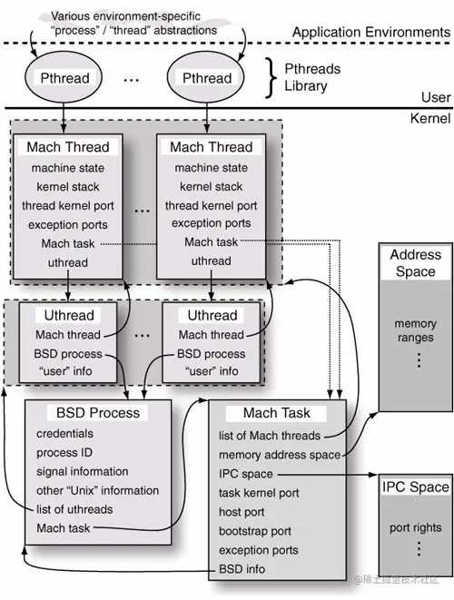
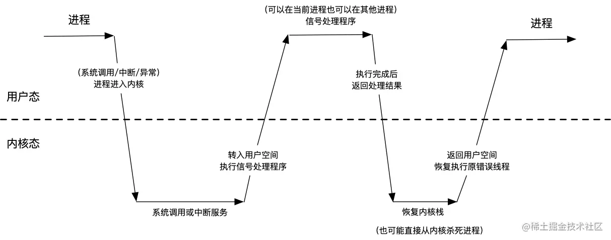
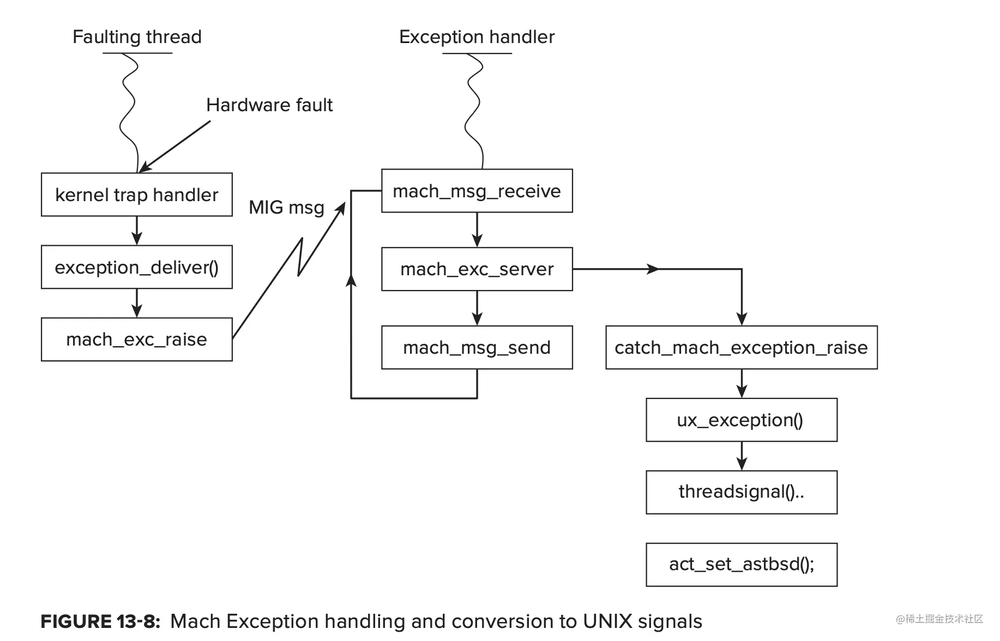
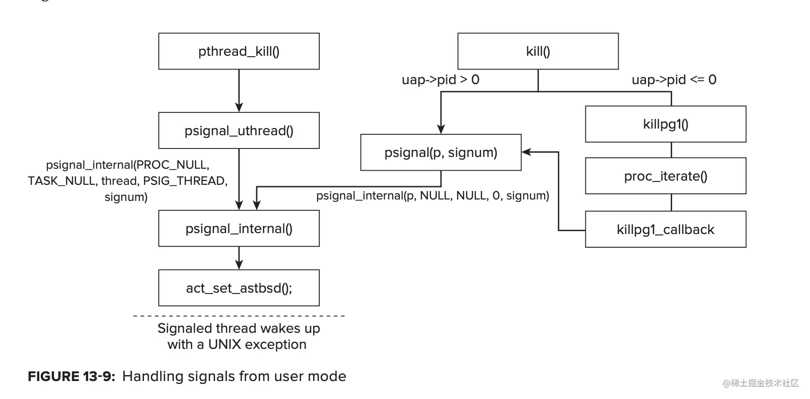

 
<!--BEGIN_DATA
{
    "create_date": "2022-06-20 14:20", 
    "modify_date": "2022-06-20 14:20", 
    "is_top": "0", 
    "summary": "你真的懂iOS的异常捕获吗？", 
    "tags": "iOS", 
    "file_name": "你真的懂iOS的异常捕获吗？.md"
}
END_DATA-->

#### <p>原文出处：<a href='https://juejin.cn/post/7142656591139962888' target='blank'>你真的懂iOS的异常捕获吗？</a></p>

## 序

在开发的日常中，经常会遇到一些极其偶现的Bug，有些Bug很难以复现，所以一般的解决方案是接入PLCrashReporter这些第三方的崩溃统计工具，从保存的崩溃文件中读取相应的崩溃信息。那么这些崩溃统计工具又是基于什么原理运作的呢？我对此产生了很大的兴趣，所以对此做了一些调研，以下是我的成果：

## Task & Thread & Process

在谈到应用崩溃之前，首先需要知道的是，iOS操作系统的内核是XNU，它是一个混合内核，而这个混合内核的核心就是Mach这个微内核。

### Process

操作系统被设计作为一个平台，而应用运行在这个平台之上。**每一个运行中的应用的实例都是一个进程（_process_）。**当然，一般情况下我们描述的是用户角度的进程。和很多任务的系统一样，一个可执行程序的一个实例就是一个进程，UNIX也是基于这个概念创建的。而每一个实例都通过一个独有的Process ID来标识（PID），即使是同一个可执行程序的不同实例，也是有不同的PID的。而许多进程进一步可能成为进程组，通常通过向一个Group发送信息，用户可以控制多个进程。一个进程可以通过调用`setpgrp(2)` 来加入进程组。

而在BSD这一层，BSD Process则更为具体一些，包含了内部的多个线程，以及对应的Mach Task等等。

### Task

首先要提到的就是Mach中的Task这个概念，Mach Task是系统资源的集合，每一个Task都包含了一个虚拟的地址空间（分配内存），一个端口权限名称空间，还有一个或者几个线程。在Mach内核中，Task是系统分配资源的基本单位。它和我们熟悉的进程的概念是非常相识的，但是**Mach Task**和**Process**是有区别的，相比而言Mach Task要提供更少的功能。在Process中，有信号、组、文件描述符等等。**而Mach Task用于资源的分配和共享，它是资源的容器。**

因为Mach是XNU这个混合内核中的微内核，所以Mach中的Mach Task是无法提供其他操作系统中的“进程”中的逻辑的，Mach Task仅仅提供了最重要的一些基础的实现，作为资源的容器。

而在BSD层中，BSD的process（其实也就是iOS的进程）和Mach Task是一一对应的。

### Thread

理论上，Thread是CPU调度的基本单位。iOS中的进程和POSIX 线程（pthread）是分别基于Mach task和Mach thread的顶层实现。一个线程是相当轻量级的实体，创建一个新线程和操作一个线程的开销是非常低的。

Mach threads是在内核中被实现的，Mach thread是最基本的计算实体，它属于且仅属于一个Mach task，这个Mach task定义了线程的虚拟地址内存空间。值得一提的是POSIX线程模型是除Windows之外，所有的操作系统都支持的一套标准的线程API，而iOS和OS X比其他系统都要更加支持`pthread`。

Mach Task是没有自己的生命周期的，因为它并不会去执行任务，只有线程才会执行指令。当它说“task Y does X”的时候，这其实意味着“包含在task Y中的一个线程执行了X操作”。



### 疑问

因为Task是XNU的微内核Mach独有的，这个就和我们熟知的进程，线程等等会有一些差异，所以这里就提出了几个问题

**1、Task和进程到底是什么关系？**

首先要明确的是task和进程是一一对应的关系，从springborad打开的每一个进程，其实在内核里都有一个task与之对应。Task只是进程资源的容器，并不具备一般进程应该拥有的功能。

**2、进程和线程到底是什么区别？**

线程是资源调度的最小单位。

进程是资源分配的最小单位，而在OS X以及iOS系统中，每一个进程对应的唯一资源容器就是Task。

## 异常的简述

应用通常运行在用户态的，但是当应用需要去主动使用系统调用，或者说在被动遇到一些异常或者中断的时候，应用都会有用户态进入到内核态，这个时候相当于系统收回了应用的运行权限，它要在内核态中去做一些特殊的处理。（system calls, exceptions, and interrupts）

而**接下来我们要说的异常（Exception），它就会应用由用户态进入到内核态。**这里就借鉴了腾讯Bugly的一张图来表示这种关系：



但是在iOS中所有的异常都会使得应用从用户态进入到内核态吗？

## 异常的分类

在所遇到的场景中，异常基本只有一种产生的原因，那就是工程师写的代码出现了问题，从而导致了异常的发生，引起了程序的崩溃。而产生的异常结果可以分类为两类：一种是硬件异常，一种是软件异常。

比如我们做了一个除0操作，这在CPU执行指令的时候出现指令异常，这就是一个hardware-generated 异常，再比如我们写Objective-C业务的过程中，给一个不存在的对象发送了消息，在Runtime时会抛出异常，这就是software-generated异常。当然了如果不做处理他们都会导致程序的崩溃，而如果要做处理，那就需要知道如何去捕获这些异常。

这里再重复一下：**虽然都是我们写的软件错误，但是造成的异常结果却可能是硬件异常，亦或是软件异常，**而只有硬件异常才会发生上述的用户态到内核态的转化。

### Mach Exception

#### Mach Exception的传递

在上面我们提到了硬件异常，硬件异常会产生用户态→内核态的转化，那么有哪些异常属于硬件异常呢？

  * 试图访问不存在的内存
  * 试图访问违反地址空间保护的内存
  * 由于非法或未定义的操作代码或操作数而无法执行指令
  * 产生算术错误，例如被零除、上溢、或者下溢
  * ……

以上这些都属于硬件异常，但是这些硬件异常和我们提到的Mach Exception有什么关系呢？

Mach内核提供了一个基于IPC的异常处理工具，其中异常被转化为message。当异常发生的时候，一条包含异常的mach message，例如异常类型、发生异常的线程等等，都会被发送到一个异常端口。而线程（thread），任务（task），主机（host）都会维护一组异常端口，当Mach Exception机制传递异常消息的时候，它会按照`thread → task → host` 的顺序传递异常消息（这三者就是线程，进程，和系统的递进关系），如果这三个级别都没有处理异常成功，也就是收到`KERN_SUCCESS`结果，那么内核就会终止该进程。在`/osfmk/kern/exception.c` 的源码中会通过`exception_trige()`方法来进行上述消息传递的流程，此方法内部调用`exception_deliver（）` 往对应级别的异常端口发送信息：

```c
// 源码地址：https://opensource.apple.com/source/xnu/xnu-2050.24.15/osfmk/kern/exception.c
void exception_trige(
				exception_type_t        exception, 
				mach_excpetion_data_t   code, 
				mach_msg_type_number_t  codeCnt) {
	...
	kern_return_t kr;
	...

	// 1、Try to raise the exception at the activation level.
	// 线程级别
	thread = current_thread()
	mutex = &thread->mutex;
	excp = &thread->exc_actions[exception];
	kr = exception_deliver(thread, esception, code, codeCnt, excp, mutex);
	if (kr == KERN_SUCCESS || kr == MACH_RCV_PORT_DIED) {
			goto out;
	}
	....

	// 2、Maybe the task level will handle it.
  	// 进程级别
	task = current_task();
	mutex = &task->lock;
	excp = &task->exc_actions[exception];
	kr = exception_deliver(thread, exception, code, codeCnt, excp, mutex);
	if (kr == KERN_SUCCESS || kr == MACH_RCV_PORT_DIED) {
			goto out;
	}
	...

	// 3、How about at the host level?
	// 主机级别
	host_priv = host_priv_self();
	mutex = &host_priv->lock;
	excp = &host_priv->exc_actions[exception];
	kr = exception_deliver(thread, exception, code, codeCnt, excp, mutex);
	if (kr == KERN_SUCCESS || kr == MACH_RCV_PORT_DIED) {
			goto out;
	}

	// 在MAC中还有一步，那就是如果这里启动了KDB，那么就使用KDB调试异常。
	/*
	 * 4、Nobody handled it, terminate the task.
	 */
	(void) task_terminate(task);
	.....

out:
	if ((exception != EXC_CRASH) && (exception != EXC_RESOURCE))
		thread_exception_return();

	return;
}
```

#### 如何处理Mach Exception？

既然异常发生了，那么异常就需要得到处理。**异常处理程序是**异常消息的接受者，它运行在自己的线程，虽然说它可以和发生异常的线程在同一个task中（也就是同一个进程中），但是它通常运行在其他的task中，比如说一个debugger。如果一个线程想处理这个task的异常消息，那么就需要调用`task_set_exception_ports()` 来注册这个task的异常端口。这样的话，只要这个进程出现了硬件异常最后都会转化为Mach Exception Mesaage并传递给注册的端口，从而被异常处理程序接受到，处理接收到的异常消息。以下是异常code对应具体的原因：

<table><thead><tr><th>Exception</th><th>Notes</th></tr></thead><tbody><tr><td>EXC_BAD_ACCESS</td><td>无法访问内存</td></tr><tr><td>EXC_BAD_INSTRUCTION</td><td>非法或者未定义的指令或者操作数</td></tr><tr><td>EXC_ARITHMETIC</td><td>算术异常（例如被零除）</td></tr><tr><td>EXC_EMULATION</td><td>遇到仿真支持指令</td></tr><tr><td>EXC_SOFTWARE</td><td>软件生成的异常（比如浮点数计算的异常）</td></tr><tr><td>EXC_BREAKPOINT</td><td>跟踪或者断点（比如Xcode的断点，就会产生异常）</td></tr><tr><td>EXC_SYSCALL</td><td>Unix系统调用</td></tr><tr><td>EXC_MACH_SYSCALL</td><td>Mach系统调用</td></tr><tr><td>EXC_RPC_ALERT</td><td>RPC警告</td></tr></tbody></table>

当然，并不是所有的异常引发的Exception都是我们所说的异常，这其中有的是系统调用，或者断点如`EXC_SYSCALL`，所以设置异常端口的时候，就需要去考虑到这一点，如下方的`myExceptionMask` 局部变量存储了需要捕获的几种异常类型：

```c
exception_mask_t myExceptionMask;
myExceptionMask = EXC_MASK_BAD_ACCESS |       /* Memory access fail */
                                EXC_MASK_BAD_INSTRUCTION |  /* Illegal instruction */
                                EXC_MASK_ARITHMETIC |       /* Arithmetic exception (eg, divide by zero) */
                                EXC_MASK_SOFTWARE |         /* Software exception (eg, as triggered by x86's bound instruction) */
                                EXC_MASK_BREAKPOINT |        /* Trace or breakpoint */
                                EXC_MASK_CRASH;

// 注意：这里必须要使用THREAD_STATE_NONE和plcrash框架中使用的保持一致
// 
rc = task_set_exception_ports(mach_task_self(),
                                  myExceptionMask,
                                  myexceptionPort,
                                  (EXCEPTION_DEFAULT | MACH_EXCEPTION_CODES),
                                  THREAD_STATE_NONE);
```

这里得着重强调一下端口设置方法的参数：

```c
kern_return_t task_set_exception_ports
(
	task_t task,
	exception_mask_t exception_mask,
	mach_port_t new_port,
	exception_behavior_t behavior,
	thread_state_flavor_t new_flavor
);
```

在这之中`xx_set_exception_ports()` 的`behavior` 参数指定来发生异常时发送的异常消息的类型。

<table><thead><tr><th>behavior</th><th>Notes</th></tr></thead><tbody><tr><td>EXCEPTION_DEFAULT</td><td>catch_exception_raise消息：包含线程标识</td></tr><tr><td>EXCEPTION_STATE</td><td>catch_exception_raise_state: 包含线程状态</td></tr><tr><td>EXCEPTION_STATE_IDENTITY</td><td>catch_exception_raise_state_identity: 包含线程标识和状态</td></tr></tbody></table>

`flavour` 参数指定要与异常消息一起发送的线程状态的类型，如果不需要，可以使用`THREAD_STATE_NONE`。但是要注意的是，无论线程状态是否在异常消息中被发送，异常处理程序都可以使用`thread_get_state()`和`thread_set_state()` 分别查询和设置出错线程的状态。

而默认情况下，线程级别的异常端口都被设置为null端口，而task级别的异常端口，会在`fork()` 期间被继承，通常也是null端口(fock其实指的是从内核fock出一个进程)。所以这个时候，压力就来到了Host的异常端口（也就是机器级的异常端口），这里发生了什么呢？

接下来，我们具体看一看如果一款Mac应用当线程中发生异常时，如果我们不做任何处理，会发生什么？(Apple自己的exception handler的处理流程)

1、内核会将错误线程挂起，并且发送一条消息给适合的异常端口。

2、错误线程保持挂起状态，等待消息回复。

3、`exception_deliver()` 方法向线程的异常端口发送消息，未得到成功回复。

4、`exception_deliver()` 方法向task的异常端口发送消息，未得到成功回复。

5、`exception_deliver()` 方法向host的异常端口发送消息。

3、具备接收异常端口权限的任意task中的异常处理线程将取出该消息（在Mac上一般是KDB调试程序）

4、异常处理程序调用`exc_server` 方法来处理该消息。

5、`exc_server` 根据端口设置的 `behavior` 参数来选择调用什么方法来获取相应的线程信息：`catch_exception_raise()、catch_exception_raise_state()、catch_exception_raise_state_identity()`，就是三个函数之一

6、如果上述函数处理后返回`KERN_SUCCESS` ，那么`exc_server()`准备返回消息发送到内核，使得线程从异常点继续执行。如果异常不是致命的，并且通过该函数修复了问题，那么修复线程的状态可以使得线程继续。

7、如果上述函数处理后返回的不是`KERN_SUCCESS` ，那么内核将终止该task。

这也就是为什么在Mac上如果Xcode崩溃之后，Mac上会出现Xcode崩溃的报告界面，同时系统会将Xcode关闭。

> 如果我们自己捕获处理之后，能否直接将调用方法`exc_server` 将消息继续往后转发呢？答案是否定的，因为在iOS中`exc_server`并不是一个public的API，所以根本无法使用。那么我们捕获异常之后如何转发给其他的端口呢？这个后面进行描述。

上述过程的具体处理流程如下图:



实际上在系统启动的时候，Host异常端口对应的**异常处理程序**就已经初始化好了，同时，Unix的异常处理也是在这里初始化，它会将Mach异常转化为Unix signals。在系统启动时，内核的BSD层通过`bsdinit_task()`方法`[源码在：bsd/kern/bsd_init.c中]`来进行初始化的：

```c
//源码地址：https://opensource.apple.com/source/xnu/xnu-7195.81.3/bsd/kern/bsd_init.c.auto.html
void
bsdinit_task(void)
{
	proc_t p = current_proc();
	process_name("init", p);
	/* Set up exception-to-signal reflection */
	ux_handler_setup()；
	······
}
```

然后`bsdinit_task()`它会调用`ux_handler_init`（在最新的xnu-7195.81.3中为`ux_handler_setup`）方法来进行设置异常监听端口：

```c
/// 源码地址：https://opensource.apple.com/source/xnu/xnu-7195.81.3/osfmk/kern/ux_handler.c.auto.html
/*
 * setup is called late in BSD initialization from initproc's context
 * so the MAC hook goo inside host_set_exception_ports will be able to
 * set up labels without falling over.
 */
void
ux_handler_setup(void)
{
	ipc_port_t ux_handler_send_right = ipc_port_make_send(ux_handler_port);
	if (!IP_VALID(ux_handler_send_right)) {
		panic("Couldn't allocate send right for ux_handler_port!\n");
	}
	kern_return_t kr = KERN_SUCCESS;
	/*
	 * Consumes 1 send right.
	 *
	 * Instruments uses the RPC_ALERT port, so don't register for that.
	 */
	kr = host_set_exception_ports(host_priv_self(),
	    EXC_MASK_ALL & ~(EXC_MASK_RPC_ALERT),
	    ux_handler_send_right,
	    EXCEPTION_DEFAULT | MACH_EXCEPTION_CODES,
	    0);
	if (kr != KERN_SUCCESS) {
		panic("host_set_exception_ports failed to set ux_handler! %d", kr);
	}
}
```

这里`host_set_exception_ports` 方法注册host级别的`ux_exception_port`异常端口，当这个端口接受到异常信息之后，异常处理线程会调用**`handle_ux_exception`** 方法，这个方法会调用`ux_exception`将mach信息转化为signal信号，随后会将转化的unix signal投递到错误线程：`threadsignal(thread, ux_signal, code, TRUE);` 具体的转化方法如下：

```c
/*
 * Translate Mach exceptions to UNIX signals.
 *
 * ux_exception translates a mach exception, code and subcode to
 * a signal.  Calls machine_exception (machine dependent)
 * to attempt translation first.
 */
static int
ux_exception(int exception,
    mach_exception_code_t      code,
    mach_exception_subcode_t   subcode)
{
	int machine_signal = 0;
	/* Try machine-dependent translation first. */
	if ((machine_signal = machine_exception(exception, code, subcode)) != 0) {
		return machine_signal;
	}
	switch (exception) {
	case EXC_BAD_ACCESS:
		if (code == KERN_INVALID_ADDRESS) {
			return SIGSEGV;
		} else {
			return SIGBUS;
		}
	case EXC_BAD_INSTRUCTION:
		return SIGILL;
	case EXC_ARITHMETIC:
		return SIGFPE;
	case EXC_EMULATION:
		return SIGEMT;
	case EXC_SOFTWARE:
		switch (code) {
		case EXC_UNIX_BAD_SYSCALL:
			return SIGSYS;
		case EXC_UNIX_BAD_PIPE:
			return SIGPIPE;
		case EXC_UNIX_ABORT:
			return SIGABRT;
		case EXC_SOFT_SIGNAL:
			return SIGKILL;
		}
		break;
	case EXC_BREAKPOINT:
		return SIGTRAP;
	}
	return 0;
}
```

### Unix Signal

Mach已经提供了底层的异常机制，但是基于Mach exception，Apple在内核的BSD层上也建立了一套信号处理系统。这是为什么呢？原因很简单，其实就是为了兼容Unix系统。而基于Linux的安卓也是兼容Unix的，所以安卓的异常也是抛出的Signal。当然这里得说明，在现代的Unix系统中，Mach异常只是导致信号生成的一类事件，还有很多其他的事件可能也会导致信号的生成，比如：显式的调用kill(2)或者killpg(2)、子线程的状态变化等等。

信号机制的实现只要是两个重要的阶段：信号生成和信号传递。信号生成是确保信号被生成的事件，而信号传递是对信号处理的调用，即相关信号动作的执行。而每一个信号都有一个默认动作，在Mac OS X上可以是以下事件：

1、终止异常进程

2、Dump core终止异常进程

3、暂停进程

4、如果进程停止，继续进程；否则忽略

5、忽略信号

当然这些都是信号的默认处理方法，我们可以使用自定义的处理程序来重写信号的默认处理方法，具体来说可以使用`sigaction`来自定义，详细的代码实例我们在后续的捕获信号的demo中有描述。

#### Mach Exception转化为Signal

Mach异常如果没有在其他地方（thread，task）得到处理，那么它会在`ux_exception()` 中将其转化为对应的Unix Signal信号，以下是两者之间的转化：

<table><thead><tr><th>Mach Exception</th><th>Unix Signal</th><th>原因</th></tr></thead><tbody><tr><td>EXC_BAD_INSTRUCTION</td><td>SIGILL</td><td>非法指令，比如除0操作，数组越界，强制解包可选形等等</td></tr><tr><td>EXC_BAD_ACCESS</td><td>SIGSEVG、SIGBUS</td><td>SIGSEVG、SIGBUS两者都是错误内存访问，但是两者之间是有区别的：SIGBUS（总线错误）是内存映射有效，但是不允许被访问； SIGSEVG（段地址错误）是内存地址映射都失效</td></tr><tr><td>EXC_ARIHMETIC</td><td>SIGFPE</td><td>运算错误，比如浮点数运算异常</td></tr><tr><td>EXC_EMULATION</td><td>SIGEMT</td><td>hardware emulation 硬件仿真指令</td></tr><tr><td>EXC_BREAKPOINT</td><td>SIGTRAP</td><td>trace、breakpoint等等，比如说使用Xcode的断点</td></tr><tr><td>EXC_SOFTWARE</td><td>SIGABRT、SIGPIPE、SIGSYS、SIGKILL</td><td>软件错误，其中SIGABRT最为常见。</td></tr></tbody></table>

Mach异常转化为了Signal信号并不代表Mach异常没有被处理过。有可能存在**线程级或者task级**的异常处理程序，它将接受异常消息并处理，处理完毕之后将异常消息转发给`ux_exception()` 这也将导致最终异常转化为Signal。

#### 软件异常转化为Signal

除了上述引发CPU Trap的异常之外，还有一类异常是软件异常，这一类异常并不会让进程进入内核态，所以它也并不会转化为Mach Exception，而是会直接转化为Unix Signal。而由Objective-C产生的异常就是软件异常这一类，它将直接转换为Signal信号，比如给对象发送未实现的消息，数组索引越界直接引发**SIGABRT**信号，作为对比Swift的数组异常会导致CPU Trap，转化为**EXC_BAD_INSTRUCTION**异常消息。

那为什么Objective-C异常只是软件异常，而不会触发CPU Trap？

因为Objective-C写的代码都是基于Runtime运行的，所以异常发生之后，直接会被Runtime处理转化为Unix Signal，同时，对于这类异常，我们可以直接使用**`NSSetUncaughtExceptionHandler`** 设置处理方法，即使我们设置了处理方法，OC异常依旧会被转发为信号，同时值得说明的是注册Signal的处理程序运行于的线程，以及**`NSSetUncaughtExceptionHandler`** 的处理程序运行于的线程，就是异常发生的线程，也就是哪个线程出错了，由哪个线程来处理。

#### Mach Exception和Unix Signal的区别

Mach Exception的处理机制中异常处理程序可以在自己创建的处理线程中运行，而该线程和出错的线程甚至可以不在一个task中，即可以不在一个进程中，因此异常处理不需要错误线程的资源来运行，这样可以在需要的时候直接获得错误线程的异常上下文，而Unix Signal的处理无法运行在其他的线程，只能在错误线程上处理，所以Mach异常处理机制的优势是很明显的，比如说debugging场景，我们平时打断点的时候，其实程序运行到这里的时候会给Xcode这个task中的注册异常端口发**EXC_BREAKPOINT**消息，而Xcode收到之后，就会暂停在断点处，在处理完之后（比如点击跳过断点），将发送消息返回到Xcode，Xcode也将继续跑下去。

这也是Mach Exception处理机制的优势，它可以在多线程的环境中很好的运行，而信号机制只能在出错线程中运行。而其实Mach异常处理程序可以以更细粒度的方式来运行，因为每一种Mach异常消息都可以有自己的处理程序，甚至是每一个线程，每一个Task单独处理，但是要说明的是，**线程级的异常处理程序通常适用于错误处理，而Task级的异常处理程序通常适用于调试。**

那么Unix Signal的优势是什么呢？就是全！无论是硬件异常还是软件异常都会被转化为Signal。

> 在《Mac OS X and iOS Internals To the Apple Core》这本书中提到：为了统一异常处理机制，所有的用户自身产生的异常并不会直接转化为Unix信号，而是会先下沉到内核中转化为Mach Exception，然后再走Mach异常的处理流程，最后在host层转化为UnixSignal信号。

**但是我是不同意这个观点的**，因为在我注册的Task级别的异常处理程序中并不会捕获Objective-C产生的异常（如数组越界），它是直接转化为SIGABRT的。而软件异常产生的Signal，实际上都是由以下两个API：kill(2)或者pthread_kill(2)之一生成的异常信号，而我这两个方法的[源码](https://opensource.apple.com/source/xnu/xnu-2050.22.13/bsd/kern/kern_sig.c)中并没有看到下沉到内核中的代码，而是直接转化为Signal并投递异常信号。流程如下图所示，其中`psignal()` 方法以及`psignal_internal()` 方法的源码都在[[/bsd/kern/kern_sig.c](https://opensource.apple.com/source/xnu/xnu-2050.22.13/bsd/kern/kern_sig.c)]文件中。

> 

## 异常的捕获

### 捕获异常的方式

说了这么多异常是什么，异常怎么分类，那么接下来我们具体来说说我们如何捕获异常，但是再聊如何捕获之前，且思考一下，我们应该采用哪种方式来捕获呢？从上述可知Mach Exception异常处理机制只能捕获硬件异常，而Unix异常处理机制都能捕获，所以大抵有两种方式可以选择：

1、Unix Signal

2、Mach Exception and Unix Signal

微软有一个非常著名的崩溃统计框架**PLCrashReport ，**这个框架也是提供了两种统计崩溃的方案：

```c
typedef NS_ENUM(NSUInteger, PLCrashReporterSignalHandlerType) {
		PLCrashReporterSignalHandlerTypeBSD = 0,    /// 一种是BSD层，也就是Unix Signal方式
		PLCrashReporterSignalHandlerTypeMach = 1    /// 一种是Mach层，也就是Mach Exception方式
}
```

对于第二种方案，如果看网上很多文章，都说提到到[PLCrashReport](https://github.com/microsoft/plcrashreporter)这个库中说：

> We still need to use signal handlers to catch SIGABRT in-process. The kernel sends an EXC_CRASH mach exception to denote SIGABRT termination. In that case, catching the Mach exception in-process leads to process deadlock in an uninterruptable wait. Thus, we fall back on BSD signal handlers for SIGABRT, and do not register for EXC_CRASH.

意思就是说，如果不捕获**SIGABRT** 信号，那么Mach Exception接到EXC_CRASH消息会发生进程的死锁，但是我不认可这个观点，原因如下：

1、在我自己测试Demo的过程中，发现需要捕获**SIGABRT** 信号的原因是软件异常并不会下沉到Mach内核转化为Signal，而是会直接发出**SIGABRT** 信号，所以需要捕获。

2、即使我在task的`task_set_exception_ports` 方法中设置了需要捕获EXC_CRASH异常，当异常发生时也不会出现死锁的情况。

3、如果看BSD层中将Mach异常转化为Signal的源码中`ux_exception`方法的具体实现，会发现根本就不会处理EXC_CRASH的情况，正如上述列表中的Mach Exception和Unix Signal的对应关系

所以我的结论是捕获**SIGABRT**信号，只是因为软件异常并不会造成Mach Exception，而是直接会被转化SIGABRT信号，并向错误线程投递。也就是说：**只采用Mach Exception无法捕获软件异常，所以需要额外捕获SIGABRT信号。** 那么具体来说如何捕获呢？

### 捕获异常的实践——Unix Signal

```c
// 1、首先是确定注册哪些信号
+ (void)signalRegister {
    ryRegisterSignal(SIGABRT);
    ryRegisterSignal(SIGBUS);
    ryRegisterSignal(SIGFPE);
    ryRegisterSignal(SIGILL);
    ryRegisterSignal(SIGPIPE);
    ryRegisterSignal(SIGSEGV);
    ryRegisterSignal(SIGSYS);
    ryRegisterSignal(SIGTRAP);
}

// 2、实际的注册方法：将信号和action关联，此处我的处理方法为rySignalHandler
static void ryRegisterSignal(int signal) {
    struct sigaction action;
    action.sa_sigaction = rySignalHandler;
    action.sa_flags = SA_NODEFER | SA_SIGINFO;
    sigemptyset(&action.sa_mask);
    sigaction(signal, &action, 0);
}

// 3、实现具体的异常处理程序
static void rySignalHandler(int signal, siginfo_t* info, void* context) {
    NSMutableString *mstr = [[NSMutableString alloc] init];
    [mstr appendString:@"Signal Exception:\n"];
    [mstr appendString:[NSString stringWithFormat:@"Signal %@ was raised. \n", signalName(signal)]];
    // 因为注册了信号崩溃回调方法，系统回来调用
    for (NSUInteger index = 0; index < NSThread.callStackSymbols.count; index ++) {
        NSString *str = [NSThread.callStackSymbols objectAtIndex:index];
        [mstr appendString:[str stringByAppendingString:@"\n"]];
    }
    [mstr appendString:@"threadInfo: \n"];
    [mstr appendString:[[NSThread currentThread] description]];
    NSString *path = [NSString stringWithFormat:@"%@/Library/signal.txt",NSHomeDirectory()];
    [mstr writeToFile:path atomically:true encoding:NSUTF8StringEncoding error:nil];
    exit(-1);
}
```

上面的流程很简单，我会在收到Signal信号之后，由错误线程来执行异常处理程序，执行完毕之后，使用`exit(-1)` 强制退出。

**问题一：如果只是执行一个写入文件的操作之后不退出即不执行`exit(-1)`会发生什么？**

它将会导致该出错线程执行完写入文件的操作之后，继续执行的时候依然出现异常，依然会抛出信号，然后又会抛给该线程处理异常，于是变成了一个死循环，导致一直在将错误信息写入文件。

**问题二：如果不想使用`exit(-1)` 又想正常工作，应该如何做呢？**

```c
// 1、首先取消掉所有绑定的action
// 2、然后处理完之后使用raise(signal) 将信号发给进程做默认处理
static void rySignalHandler(int signal, siginfo_t* info, void* context) {
    [Signal unRegisterSignal];
	...
	raise(signal);
}

static int monitored_signals[] = {SIGABRT, SIGBUS, SIGFPE, SIGILL, SIGPIPE, SIGSEGV, SIGSYS, SIGTRAP};
static int monitored_signals_count = (sizeof(monitored_signals) / sizeof(monitored_signals[0]));

+ (void)unRegisterSignal {
    for (int i = 0; i < monitored_signals_count; i++) {
        struct sigaction sa;
        memset(&sa, 0, sizeof(sa));
        sa.sa_handler = SIG_DFL;
        sigemptyset(&sa.sa_mask);
        sigaction(monitored_signals[i], &sa, NULL);
    }
}
```

上述方案其实是模仿的`PLCrashReport` 框架中的写法，建议阅读相关源码。

**问题三：如果错误线程是子线程，然后Signal投递到子线程处理，这个时候影响主线程吗？**

不影响，因为Signal异常处理程序在错误线程运行，这个和主线程无关，当然，如果错误线程是主线程，那就另当别论了。

### 捕获异常的实践——Mach Exception + Unix Signal

相对而言使用Mach Exception的异常处理机制要稍微复杂一些，Unix Signal的捕获上述已经提到了，接下来就是Mach Exception异常的捕获了。

```c
+ (void)setupMachHandler {
    kern_return_t rc;

		// 1、分配端口
    rc = mach_port_allocate(mach_task_self(), MACH_PORT_RIGHT_RECEIVE, &myexceptionPort);
    if (rc != KERN_SUCCESS) {
        NSLog(@"声明异常端口没有成功");
    }

    // 2、添加mach_send的权限
    rc = mach_port_insert_right(mach_task_self(), myexceptionPort, myexceptionPort, MACH_MSG_TYPE_MAKE_SEND);
    if (rc != KERN_SUCCESS) {
        NSLog(@"添加权限失败");
    }

    exception_mask_t myExceptionMask;

		// 3、设置需要接受哪些异常信息
    myExceptionMask = EXC_MASK_BAD_ACCESS |       /* Memory access fail */
                                EXC_MASK_BAD_INSTRUCTION |  /* Illegal instruction */
                                EXC_MASK_ARITHMETIC |       /* Arithmetic exception (eg, divide by zero) */
                                EXC_MASK_SOFTWARE |         /* Software exception (eg, as triggered by x86's bound instruction) */
                                EXC_MASK_BREAKPOINT |        /* Trace or breakpoint */
                                EXC_MASK_CRASH;

		// 4、task_set_exception_ports设置task级别的异常端口
    rc = task_set_exception_ports(mach_task_self(),
                                  myExceptionMask,
                                  myexceptionPort,
                                  (EXCEPTION_DEFAULT | MACH_EXCEPTION_CODES),
                                  THREAD_STATE_NONE);
		// 5、初始化异常处理线程，并设置异常处理方法。

    pthread_t thread;
    pthread_create(&thread, NULL, exc_handler, NULL);
}

// 6、异常处理程序
// 类似RunLoop的思路，使用一个while-true循环来保证线程不会退出，同时使用mach_msg来一直接收消息
static void* exc_handler(void *ignored) {
    mach_msg_return_t rc;

    // 自定义一个消息体
    typedef struct {
        mach_msg_header_t Head; /* start of the kernel processed data */
        mach_msg_body_t msgh_body;
        mach_msg_port_descriptor_t thread;
        mach_msg_port_descriptor_t task; /* end of the kernel processed data */
        NDR_record_t NDR;
        exception_type_t exception;
        mach_msg_type_number_t codeCnt;
        integer_t code[2];
        int flavor;
        mach_msg_type_number_t old_stateCnt;
        natural_t old_state[144];
        kern_return_t retcode;
    } Request;

    Request exc;
    exc.Head.msgh_size = 1024;
    exc.Head.msgh_local_port = myexceptionPort;

    while (true) {
        rc = mach_msg(&exc.Head,
                      MACH_RCV_MSG | MACH_RCV_LARGE,
                      0,
                      exc.Head.msgh_size,
                      exc.Head.msgh_local_port, // 这是一个全局的变量
                      MACH_MSG_TIMEOUT_NONE,
                      MACH_PORT_NULL);
        if (rc != MACH_MSG_SUCCESS) {
            NSLog(@"没有成功接受到崩溃信息");
            break;
        }
        // 将异常写入文件（当然， 你也可以做自己的自定义操作）			
        break;
    }

		exit(-1);
}
```

代码很容易理解，收到异常之后就会执行相应的处理代码，处理完异常之后执行`exit(-1)` 退出应用。依然是问自己几个问题：

**问题一：不做exit(-1)操作会发生什么，异常会不停写入吗？**

不然，因为这里接收到异常消息之后，就没有对外转发了，只会停留在task这一级，但是由于异常线程没有得到恢复，所以表现出来的状态就是异常线程阻塞。

**问题二：不做exit(-1)，异常线程是子线程，会对主线程有影响吗？**

不会，它只会阻塞异常线程，对主线程没有影响。换言之，UI事件正常响应。

**问题三：Mach Exception收到消息处理之后就不会向外转发了，那如果想转发呢？**

可以向原端口回复你的处理结果，这就会由系统默认向上转发，最终转化为Unix信号。

```c
static void* exc_handler(void *ignored) {
    mach_msg_return_t rc;

    // 自定义一个消息体
    typedef struct {
        mach_msg_header_t Head; /* start of the kernel processed data */
        mach_msg_body_t msgh_body;
        mach_msg_port_descriptor_t thread;
        mach_msg_port_descriptor_t task; /* end of the kernel processed data */
        NDR_record_t NDR;
        exception_type_t exception;
        mach_msg_type_number_t codeCnt;
        integer_t code[2];
        int flavor;
        mach_msg_type_number_t old_stateCnt;
        natural_t old_state[144];
        kern_return_t retcode;
    } Request;
		....

		// 处理完消息之后，我们回复处理结果
    Request reply;
    memset(&reply, 0, sizeof(reply));
    reply.Head.msgh_bits = MACH_MSGH_BITS(MACH_MSGH_BITS_REMOTE(exc.Head.msgh_bits), 0);
    reply.Head.msgh_local_port = MACH_PORT_NULL;
    reply.Head.msgh_remote_port = exc.Head.msgh_remote_port;
    reply.Head.msgh_size = sizeof(reply);
    reply.NDR = NDR_record;
    reply.retcode = KERN_SUCCESS;

    /*
     * Mach uses reply id offsets of 100. This is rather arbitrary, and in theory could be changed
     * in a future iOS release (although, it has stayed constant for nearly 24 years, so it seems unlikely
     * to change now). See the top-level file warning regarding use on iOS.
     *
     * On Mac OS X, the reply_id offset may be considered implicitly defined due to mach_exc.defs and
     * exc.defs being public.
     */
    reply.Head.msgh_id = exc.Head.msgh_id + 100;
    mach_msg(&reply.Head,
             MACH_SEND_MSG,
             reply.Head.msgh_size,
             0,
             MACH_PORT_NULL,
             MACH_MSG_TIMEOUT_NONE,
             MACH_PORT_NULL);

    return NULL;
}
```

## 参考

  1. 《Mac OS X and iOS Internals To the Apple Core》
  2. [Mac OS X Internals: A Systems Approach](https://flylib.com/books/en/3.126.1/) 第九章
  3. [kernel源码](https://opensource.apple.com/source/xnu/xnu-2050.22.13/bsd/kern)
  4. [Android 平台 Native 代码的崩溃捕获机制及实现](https://mp.weixin.qq.com/s/g-WzYF3wWAljok1XjPoo7w)
  5. [PLCrashReporter](https://github.com/microsoft/plcrashreporter)
