 
<!--BEGIN_DATA
{
    "create_date": "2023-07-19 13:50", 
    "modify_date": "2023-07-19 13:50", 
    "is_top": "0", 
    "summary": "全球历次房地产大泡沫：催生、疯狂、崩溃及启示", 
    "tags": "其它", 
    "file_name": "全球历次房地产大泡沫：催生、疯狂、崩溃及启示.md"
}
END_DATA-->

#### 
原文出处：<a href='https://mp.weixin.qq.com/s?__biz=Mzg3NzYwMzU1MQ%3D%3D&mid=2247515855&idx=1&sn=74e6bc53da529cb6fa154bdd22d27578&scene=45#wechat_redirect' target='blank'>全球历次房地产大泡沫：催生、疯狂、崩溃及启示</a>

> 房地产是周期之母，十次危机九次地产。我们提出“房地产长期看人口、中期看土地、短期看金融”的分析框架，根据国际经验，过度金融化是风险之源，人地挂钩和金融稳定是治本之策，频繁加息或金融过度收紧可能刺破泡沫。本文研究了全球历次房地产大泡沫的催生、疯狂、轰然崩溃及启示，包括1923-1926年美国佛罗里达州房地产泡沫与大萧条、1986-1991年日本房地产泡沫与失去的二十年、1992-1993年中国海南房地产泡沫、1991-1997年东南亚房地产泡沫与亚洲金融风暴、2001-2008年美国房地产泡沫与次贷危机。往事并不如烟，岁月变迁人性不变。

## 摘要

纵观全球历史上五次重大的房地产泡沫事件，我们可以得出以下九大启示：

**一、房地产是周期之母。**从对经济增长的带动看，无论在发展中国家，还是在发达国家，房地产业在宏观经济中都起到了至关重要的作用。每次经济繁荣多与房地产带动的消费投资有关，而每次经济大萧条则多与房地产泡沫破裂有关，比如1991年前后的日本、1998年前后的东南亚、2008年前后的美国。从财富效应看，在典型国家，房地产市值一般是年度GDP的2-3倍，是可变价格财富总量的50%，这是股市、债市、商品市场、收藏品市场等其他资产市场远远不能比拟的。以日本为例，1990年日本全部房地产市值是美国的5倍，是全球股市总市值的2倍，仅东京都的地价就相当于美国全国的土地价格。以中国为例，2018年房地产投资占全社会固定资产投资的四分之一，房地产相关投资占近一半，全国房地产市值约321万亿元，是当年GDP的3.6倍，占股债房市值的71%。

**二、十次危机九次地产。**由于房地产是周期之母，对经济增长和财富效应有巨大的影响，而且又是典型的高杠杆部门，因此全球历史上大的经济危机多与房地产有关，比如，1929年大萧条跟房地产泡沫破裂及随后的银行业危机有关，1991年日本房地产崩盘后陷入失落的二十年，1998年东南亚房地产泡沫破裂后多数经济体落入中等收入陷阱，2008年美国次贷危机至今全球仍未走出阴影。反观美国1987年股市异常波动、中国2015年股市异常波动，对经济的影响则要小很多。

**三、历次房地产泡沫的形成在一开始都有经济增长、城镇化、居民收入等基本面支撑。**商品房需求包括居住需求和投机需求，居住需求主要跟城镇化、居民收入、人口结构等有关，它反映了商品房的商品属性，投机需求主要跟货币投放和低利率有关，它反映了商品房的金融属性。大多数房地产泡沫一开始都有基本面支撑，比如1923-1925年美国佛罗里达州房地产泡沫一开始跟美国经济的一战景气和旅游兴盛有关，1986-1991年日本房地产泡沫一开始跟日本经济成功转型和长期繁荣有关，1991-1996年东南亚房地产泡沫一开始跟“亚洲经济奇迹”和快速城镇化有关。

**四、虽然时代和国别不同，但历次房地产泡沫走向疯狂则无一例外受到流动性过剩和低利率的刺激。**由于房地产是典型的高杠杆部门（无论需求端的居民抵押贷还是供给端的房企开发贷），因此房市对流动性和利率极其敏感，流动性过剩和低利率将大大增加房地产的投机需求和金融属性，并脱离居民收入、城镇化等基本面。1985年日本签订“广场协议”后为了避免日元升值对国内经济的负面影响而持续大幅降息，1991-1996年东南亚经济体在金融自由化下国际资本大幅流入，2000年美国网络泡沫破裂以后为了刺激经济持续大幅降息。中国2008年以来有三波房地产周期回升，2009、2012、2014-2016，除了经济中高速增长、快速城镇化等基本面支撑外，每次都跟货币超发和低利率有关，2014-2016年这波尤为明显。

**五、政府支持、金融自由化、金融监管缺位、银行放贷失控等起到了推波助澜、火上浇油的作用。**政府经常基于发展经济目的刺激房地产，1923年前后佛罗里达州政府大举兴办基础设施以吸引旅游者和投资者，1985年后日本政府主动降息以刺激内需，1992年海南设立特区后鼓励开发，2001年小布什政府实施“居者有其屋”计划。金融自由化和金融监管缺位使得过多货币流入房地产，1986年前后日本加快金融自由化和放开公司发债融资，1991-1996年东南亚国家加快了资本账户开放导致大量国际资本流入，2001-2007年美国影子银行兴起导致过度金融创新。由于房地产的高杠杆属性，银行放贷失控火上浇油，房价上涨抵押物升值会进一步助推银行加大放贷，甚至主动说服客户抵押贷、零首付、放杠杆，在历次房地产泡沫中银行业都深陷其中，从而导致房地产泡沫危机既是金融危机也是经济危机。

**六、虽然时代和国别不同，但历次房地产泡沫崩溃都跟货币收紧和加息有关。**风险是涨出来的，泡沫越大破裂的可能性越大、调整也越深。日本央行从1989 年开始连续5 次加息，并限制对房地产贷款和打击土地投机，1991年日本房地产泡沫破裂。1993年6月23日，朱镕基讲话宣布终止房地产公司上市、全面控制银行资金进入房地产业，24日国务院发布《关于当前经济情况和加强宏观调控意见》，海南房地产泡沫应声破裂。1997年东南亚经济体汇率崩盘，国际资本大举撤出，房地产泡沫破裂。美联储从2004年6月起两年内连续17次调高联邦基金利率，2007年次贷违约大幅增加，2008年次贷危机全面爆发。

**七、如果缺乏人口、城镇化等基本面支持，房地产泡沫破裂后调整恢复时间更长。**日本房地产在1974和1991年出现过两轮泡沫，1974年前后的第一次调整幅度小、恢复力强，原因在于经济中速增长、城市化空间、适龄购房人口数量维持高位等提供了基本面支撑；但是，1991年前后的第二次调整幅度大、持续时间长，原因在于经济长期低速增长、城市化进程接近尾声、人口老龄化等。2008年美国房地产泡沫破裂以后没有像日本一样陷入失去的二十年，而是房价再创新高，主要是因为美国开放的移民政策、健康的人口年龄结构、富有弹性和活力的市场经济与创新机制等。

**八、每次房地产泡沫崩盘，影响大而深远。**1926-1929年房地产泡沫破裂及银行业危机引发的大萧条从金融危机、经济危机、社会危机、政治危机最终升级成军事危机，对人类社会造成了毁灭性的打击。1991年日本房地产崩盘后陷入失落的二十年，经济低迷、不良高企、居民财富缩水、长期通缩。1993年海南房地产泡沫破裂后，不得不长期处置烂尾楼和不良贷款，当地经济长期低迷。2008年次贷危机至今已10年，美国经济经过3轮QE和零利率才开始走出衰退，至今，次贷危机对全球的影响仍未完全消除。

**九、房地产是最坚硬的泡沫，应软着陆、防止硬着陆，用时间换空间，警惕并采取措施控制房地产泡沫，以人地挂钩和金融稳定为核心加快构建长效机制。**“房地产长期看人口、中期看土地、短期看金融”。****中国经济和住宅投资已经告别高增长时代，房地产政策应适应“总量放缓、结构分化”新发展阶段特征。从长期看，尽管中国20-50岁主力置业人群比例在2013年达峰值，但综合考虑城镇化进程、居民收入增长和家庭户均规模小型化、住房更新等，中国房地产市场未来仍有较大发展空间。从中期看，区域分化明显，人口继续往大都市圈迁移，人地分离、供需错配问题仍严重。房地产泡沫具有十分明显的负作用：房价大涨恶化收入分配，增加了社会投机气氛并抑制企业创新积极性；房地产具有非生产性属性，过多信贷投向房地产将挤出实体经济投资；房价过高增加社会生产生活成本，容易引发产业空心化。当前应采取措施避免房价上涨脱离基本面的泡沫化趋势，可以考虑：以常住人口增量为核心改革“人地挂钩”，优化土地供应；稳步推进房地产税改革，推动土地财政转型；实行长期稳定的住房信贷金融政策，稳定市场预期；丰富供应主体，优化住房供应结构，加快补齐租赁住房短板。

## 正文

房地产是周期之母，十次危机九次地产。本文研究了全球历次房地产大泡沫的催生、疯狂、轰然崩溃及启示，包括1923-1926年美国佛罗里达州房地产泡沫与大萧条、1986-1991年日本房地产泡沫与失去的二十年、1992-1993年中国海南房地产泡沫、1991-1997年东南亚房地产泡沫与亚洲金融风暴、2001-2008年美国房地产泡沫与次贷危机。往事并不如烟，时代变迁人性不变。

### 1 美国1923-1926**年佛罗里达州房地产泡沫**

世界上最早可考证的房地产泡沫发生于1923-1926年的美国佛罗里达州，这次房地产投机狂潮曾引发了华尔街股市大崩溃，并导致了以美国为源头的20世纪30年代的全球经济大危机大萧条。

#### 1.1 背景：经济繁荣、享乐主义、消费信贷

**经济超级繁荣。**20世纪美国作为超级大国在世界舞台上醒目崛起。从19世纪最后30年开始，美国经济就呈现出一种跨跃式发展的态势。进入20世纪后，美国经济更是快速赶超英法等老牌资本主义国家。在第一次世界大战前夕的1913年，美国工业生产已经占世界总额的三分之一以上，超过了英、法、德、日的总和。

美国远离一战的战场。战争的特殊需求大大刺激了美国经济，极大地增强了国内生产能力。同时，劳动生产率的提高、政府与大企业的密切关系、信用消费形成等因素都促进了整个20年代的经济超级繁荣。

**享乐主义兴起。**到了20世纪20年代初，美国经济欣欣向荣，工作机会多，待遇优厚，除了本薪外又有休假，人人都在享受经济发达带来的繁荣，同时中产阶级也开始买得起私家车，可以自由驾车旅行，不再受制于火车了。由于经济的发展，物质主义、拜金主义、享乐主义开始流行。天性乐观的美国人，现在更是花钱如流水――买车、买房、度假――沉浸在幸福之中的美国人相信，20世纪的美国将会“永久繁荣”。

美国人乐观的心理首先表现在股票和房地产上。当时，股票天天涨，很多投资者都一跃成为富翁，房地产市场也是一片欣欣向荣。看上去，只要进行合适的投资，任何人都可以发财致富。

**现代消费信贷制度建立。**随着美国步入消费社会，1916年《联邦储备法》修正案以及1927年《麦克法登法案》开始允许国民银行发放非农业不动产贷款，而此前的不动产贷款仅仅适用于农场。同时，分期付款金融尤其是汽车金融开始流行。现代信贷消费制度的建立和发展为消费社会的形成提供了制度基础。据美国经济研究局的统计资料表明：1919-1929年间，美国人的消费总量占GNP的比例从67.63%上升到73.17%，其中耐用品消费（尤其是汽车）在信贷制度的推动下增加了75.9%。

**房地产需求大增。**城市化进程和商业繁荣共同刺激着对房地产的需求，在汽车普及和道路改善的推动下，1920年代美国房地产行业迅速发展。1925-1927年，由于经济繁荣、人口增加以及城市化进程多重推动，房地产业经历了疯狂扩张。与1919年相比，1925年美国新房建筑许可证发放量上升了208%，达到顶峰。当时虽然部分地区房价波动幅度较大，并吸引了大量投机资金，但是从全国范围来看，并没有形成大规模的房地产泡沫。1921-1925年间，华盛顿城区的房屋价格涨幅也只有10%左右。

随后，美国房地产业达到巅峰后逐渐进入到下行通道。房地产业在当时的大规模扩张，主要是来自新移民以及城市化所催生的大量需求。1926年，新开工建筑物估值达到121亿美元，相当于当年GDP的12.41%。1919-1927年间，房地产投资占GDP的比例平均达到10.52%。但是，从1926年始，房地产业就始出现持续下滑，不仅体现在价格下跌，房屋的建筑面积也不断减少。

#### 1.2 狂热：政府支持、银行助推、投机盛行

##### （1）旅游兴起

佛罗里达州位于美国的东南端，靠近古巴。佛罗里达的气候类似中国海南岛，冬季温暖湿润，它成了美国人的冬日度假胜地。尤其是佛罗里达迈阿密市以北的棕榈滩岛，更是成了美国富人聚集的天堂。棕榈滩岛东临墨西哥暖流，岛上草木茂盛，海滩上满布高大的棕榈树，优越的海洋性环境气候在世界众多一流的旅游胜地中名列前茅。每到旅游旺季，来自纽约等经济发达但冬季严寒的美国北部富翁便纷纷南下。由于棕榈滩岛上汇集的富翁如此多，有人形象地说“美国四分之一的财富在这里流动。”

在第一次世界大战之前，由于地处偏僻，佛罗里达的土地均价一直较美国其它地方低得多。然而，汽车的迅速普及改变了这种状况。第一次大战结束后，许多拥有汽车的旅游者在冬季纷纷涌向佛罗里达，在那里休闲度假。佛罗里达因此变成了有钱人的玩乐之都，非法的赌场、酒吧充斥迈阿密市――佛罗里达最繁华的城市。

冬季的度假热潮，对佛罗里达产生了很大的影响。在1920以前，大多数来佛罗里达的人是一些上了年纪的人、富翁或者来此休养的病人。但随着佛罗里达的旅游业开始兴旺发达，许多年龄较轻的中产阶级开始来到佛罗里达。对他们来说更愿意在这里购买一个冬天度假的小屋或买块土地作为日后定居的理想场所。于是房地产也跟着逐渐繁荣起来。许多眼光敏锐的投资人看准了这一点，便到这里来购买房地产。佛罗里达成了很多人心目中理想的投资地。

##### （2）政府支持

佛罗里达州政府和各地方当局都全力以赴地改善当地的交通和公共设施，甚至不惜以高息大举借债来兴建基础设施，以吸引旅游者和投资者。到了20年代初，迈阿密近海的200公里地段，各种建设项目如雨后春笋般四处矗立，高尔夫球场、私人俱乐部、休闲山庄、临海公寓――整个佛罗里达变成了一个大工地。

##### （3）投机盛行

随着房价飙升，羊群效应使炒房成风。有一个数据能说明当时的疯狂：据统计，到1925年，迈阿密市居然出现了两千多家地产公司，当时该市仅7.5万人口，其中竟有2.5万名地产经纪人，平均每三位居民就有一位专做房地产买卖。《迈阿密先驱报》因刊载巨量的房地产广告而成为当时世界上最厚的报纸。到佛罗里达投资成了美国人致富的途径之一，开往迈阿密的火车轮船上，挤满了做发财梦的美国人。

一时间，无数的财富竞相投入到佛罗里达，市区街道两侧的房屋均被高价买下，甚至连郊区尚未规划的土地也分区卖出。事实上，这些买房的投机者根本不在乎房子的位置何处，因为他们买房子不是为了自住，而是等待它上涨后卖出，从中获得差价。

1923－1926年，佛罗里达的人口呈几何数增长，而土地的价格升幅更是惊人。棕榈滩上的一块地，1923年值80万美元，1924年达150万美元，1925年竟高达400万美元。当时买土地的定金是10%，因此土地价格每升10%，炒家的利润便是100%。与土地相比，房子的价格升幅更是惊人，一幢房子在一年内涨四倍的情况比比皆是，迈阿密地区的房价在3年内上涨了5~6倍。

在短短几年之内，佛罗里达的土地价格就上涨了差不多3倍而且价格并没有要停止上涨的迹象，而且房地产热开始传导至佛罗里达附近的州，全国土地价格纷纷上涨。

##### （4）银行助推

在炒房成风下，一向保守冷静的银行界也纷纷加入。随着房地产价格的不断升高，银行批准贷款也不再看借款人的财务能力而专注于房地产的价格。投资者很容易地从银行获得贷款，佛罗里达当地银行宽松的贷款条件给这股房地产热火上加油。一般人在购房时只需10%的首付，其余90%的房款完全来自银行贷款。投资者只需支付一定的利息，就可以坐等一个好时机将房子转卖出去，而售价往往是原价的两倍以上。还清贷款后，所赚得的利润可达十倍以上。

#### 1.3 崩溃及影响：飓风、房价暴跌、股市崩盘、1929年大萧条、蔓延成世界经济危机

在房地产最疯狂的那几年，人们的口头禅就是“今天不买，明天就买不到了”！

投机的心理基础是预期未来价格的上升，一旦这种预期走向非理性的道路，投机需求中的“羊群效应”便会日益明显，资产价格将按照人们的预期被一步步地推高，而风险也在持续累积。这时候的高价格实际上是非常脆弱的，只要有任何的风吹草动，转手交易的下一个买主不再出现，泡沫的破灭就是必然。

1926年9月一场飓风袭击佛罗里达州，最终引发佛罗里达州房地产泡沫破碎。一场大飓风以每小时125英里的速度横扫佛罗里达，整个地区立刻变成废墟，飓风引起的海啸将佛罗里达的两个城市夷为平地，状况惨不忍睹，这次天灾摧毁了13000座房屋，415人丧生。美国气象局把这次飓风描述为：“可能是有史以来袭击美国的最具破坏性的飓风。”飓风过后，昔日繁华的佛罗里达州一片狼藉，一些地方的海水涨到了二楼，人们只能爬到屋顶逃命。

1926年底，不可避免的崩溃终于来临了，迈阿密的房产交易量从1925年的10.7亿美元急剧萎缩到了1926年的1.4亿美元。许多后来投入房市的人开始付不起每个月的房贷，于是破产的连锁反应就此展开。人们纷纷抛出自己手中的房地产，导致房价暴跌。持续狂热4年之后的佛罗里达房地产泡沫终于被飓风吹灭。

飓风之所以能吹灭佛罗里达州房地产泡沫，根本原因在于当地的房地产价格过高，而飓风不过是一个诱因。房地产泡沫一旦破灭，将导致整个资金链的断裂，大量房地产企业面临破产，银行爆出巨量坏账，甚至最终引发金融危机。美国佛罗里达州房地产泡沫破灭之后，导致许多企业和银行破产，一些破产的企业家、银行家或自杀或发疯，有的则沦为乞丐。据说美国商界大名鼎鼎的“麦当劳教父”雷·克洛克，当年因这场危机而一贫如洗，此后被迫做了17年的纸杯推销员。股票传奇炒手杰西·利弗莫尔也参加了这一游戏，他甚至认为佛罗里达的土地价格会继续攀升，可见身处史无前例的大泡沫之中股神也无法保持理智。

紧接着，这场泡沫又激化了美国的经济危机，结果引发了华尔街股市的崩溃，最终导致了20世纪30年代的世界经济大危机大萧条。

### 2 日本1986-1991**年房地产泡沫**

1985年日本经济空前繁荣，“买下美国”“日本可以说不”盛行。在低利率、流动性过剩、金融自由化、国际资本流入等刺激下，1986-1990年日本房地产催生了一场史无前例的大泡沫，仅东京都的地价就相当于美国全国的土地价格。随后在加息、管制房地产贷款和土地交易、资本流出等压力下，房地产大泡沫轰然倒塌，随后房价步入漫长下跌之旅，日本经济陷入失落的二十年。

#### 2.1 形成：经济繁荣、广场协议、日元升值、低利率

##### （1）80年代初日本经济空前繁荣

从上世纪60年代开始，日本保持着高速经济增长。1964年东京奥运会，1966年大阪世博会，日本向全世界展示了从战败阴影中复兴的国家形象。

上世纪80年代初期日本连续赶超意大利、法国、英国和德国，成为亚洲第一强国和仅次于美国的世界第二大强国。日本制造的产品遍布全球，日本企业在全球范围内大量投资和收购。日本的贸易和制造业直逼美国，在电子、汽车、钢铁、造船等领域更是超过美国。日本经济规模达到美国一半，外汇储备超过4000亿美元，占世界外汇储备的50%。1985年，日本取代美国成为世界上最大的债权国。美国人的银行、超市，甚至好莱坞的哥伦比亚电影公司和纽约的标志性建筑——洛克菲勒大楼都成为了日本人的囊中之物。

日本经济进入了令人炫目的鼎盛时期，在空前繁荣的背后，一场危机正在酝酿当中。

##### （2）广场协议：阴谋？阳谋？

1978年，第二次石油危机爆发。由于能源价格大幅上升，美国国内出现了严重的通货膨胀现象。1979年夏天，保罗·沃尔克就任美联储主席。为了治理通货膨胀，他连续三次提高联邦基金利率，实施紧缩的货币政策。

这一政策使美国联邦基金名义利率上升到20%左右的水平，吸引了大量的海外资金流入美国，导致美元大幅升值。从1979年底到1984年底，美元汇率上涨了近60%，美元对主要国家的汇率甚至超过了布雷顿森林体系崩溃前的水平。

美元过强导致美国对外贸易逆差大幅增长。为了改善国际收支不平衡的状况，美国希望通过美元贬值来增加产品的出口竞争力。

1985年9月，美国、日本、联邦德国、法国、英国等5个发达国家的财政部长和央行行长，在纽约广场饭店举行会议，决定五国政府联合干预外汇市场，使美元兑主要货币有序地下跌，以解决美国巨额的贸易赤字，史称“广场协议”。

“广场协议”签订之后，五国开始在外汇市场抛售美元，带动了市场投资者的抛售狂潮。美元因此持续大幅度贬值，而世界主要货币对美元汇率均有不同程度的上升。其中，日元的升值幅度最大，三年间达到了86.1%。

这并不是美国第一次干预外汇市场。1971年12月，日本曾与美国签订《斯密森协议》。根据协议，日元对美元的汇率从1美元兑360日元升值为1美元兑308日元，涨幅为18%。此轮汇率改革导致了1973年日本地价的上涨，但由于石油危机的影响，仅持续了1年。

日元的大幅升值提高了日元在国际货币体系中的地位，促进了日本对外投资大幅度增加，为日本企业在海外扩张提供了机遇。但与此同时，日本经济也已经埋下了泡沫的炸弹。

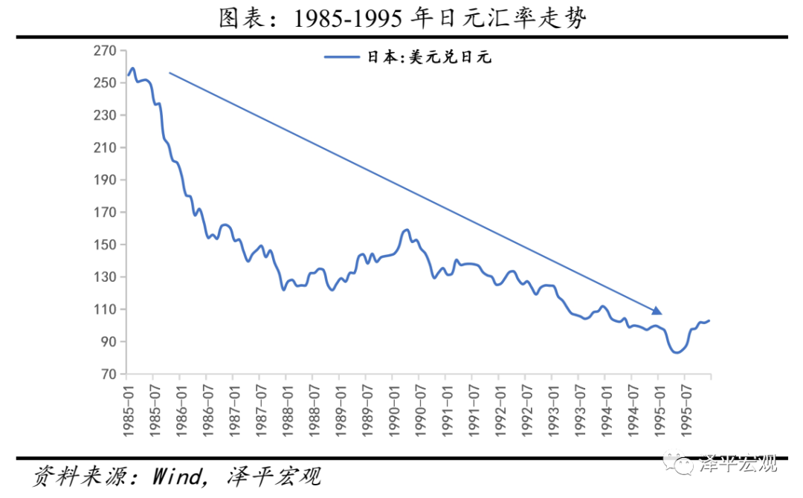

##### （3）低利率和放松金融管制

由于担心日元升值提高日本产品的成本和价格，日本政府制定了提升内需的经济扩张政策，并放松国内的金融管制。从1986年1月到1987年2月，日本银行连续5次降低利率，把中央银行贴现率从5%降低到2.5%，不仅为日本历史之最低，也为当时世界主要国家之最低。受货币宽松推动，1985-1990年间日本M2同比增速从8%上升至12%以上，但CPI同比增速并不高，这给了日本央行错觉。

1986年日本进一步金融市场自由化，企业可发行多种公司债券进行融资。据统计，日本企业在1985-1989年间融资金额上升了5.5倍。

在低利率和流动性过剩的背景下，大量资金流向了股市和房地产市场。人们纷纷从银行借款投资到收益可观的股票和不动产中。于是，股价扶摇直上，地价暴涨。但是当时，日本已经完成了城镇化建设，国内的城镇化率超过90%。一个巨大的泡沫正在诞生。

#### 2.2 狂热：银行推波助澜、国际热钱流入、投机盛行

##### （1）银行积极发放贷款

20世纪80年代，日本银行开始推行银行资本金管理改革。为了推动银行国际化，日本政府决定实行双重标准：国内营业的可以按照本国4%的标准，有海外分支机构的银行则必须执行8%的国际标准。在此要求下，日本银行除了必须不断补充资本金之外，还得调整银行资产结构。

相对于一般公司贷款，房地产抵押贷款的风险权重较低。这意味着银行发放相同数量的贷款，房地产抵押贷款只需一半资本金。于是日本商业银行纷纷将资金投放到房贷领域。

房地产业巨大的泡沫刺激了金融机构的房贷增长，银行大量投资房地产业，发放了大量抵押贷款，鼓励土地持有者进行投机。在地产泡沫膨胀时期,对房地产贷款的增长比货币供应量更快。日本银行《经济统计月报》显示,1984-1989年,银行对房贷年均增长率为19.9%，远远超出了同一时期9.2%的贷款增速。大藏省的《法人企业统计季报》表明,日本企业同期购入土地所需外部资金大部分来源于银行贷款。

在房价持续上涨阶段，银行业低估了房地产作抵押的贷款所含的风险，甚至发放无抵押的信用贷款。部分银行高层以放贷规模作为员工考核指标。于是，房地产抵押贷款在日本全国银行的贷款总额中所占比例逐年增加。随着地价和股价的上涨，借款人的抵押能力增强以及账外资产增加，这部分利用不动产抵押贷款筹集到资金的企业，将其大部分资金用于购买将来有可能升值的土地、股票等等，循环往复不断推升房价。

从1986-1991年，银行的房地产抵押贷款余额翻了一番。1984-1991年日本城市地价指数上涨了66.1%，而同期消费者物价指数仅上升了12.6%，地价高企完全脱离实体经济增长，泡沫日益膨胀。

##### （2）国际热钱涌入

同一时期，国际热钱的涌入加速了日本房地产泡沫的膨胀。签订《广场协议》之后，日元每年保持5%的升值水平，这意味着国际资本只要持有日元资产，可以通过汇率变动获得5%以上的汇兑收益。

敏锐的国际资本迅速卷土重来，在日本的股票和房地产市场上呼风唤雨。国际廉价资本的流入加剧了日元升值压力，导致股价和房价快速上涨，从而吸引了更多的国际资本进入日本投机，泡沫越吹越大。

##### （3）货币驱动，投机盛行

随着大量资金涌入房地产行业，日本的地价开始疯狂飙升。据日本国土厅公布的调查统计数据，1985年，东京的商业用地价格指数为120.1，到了1988年暴涨至334.2，在短短三年内增长了近2倍。

1990年，东京、大阪、名古屋、京都、横滨和神户六大城市中心的地价指数比1985年上涨了约90%。当年，仅东京都的地价就相当于美国全国的土地价格，制造了世界上空前的房地产泡沫。

然而同一时期日本名义GDP的年增幅只有5%左右。由于地价快速上涨，已经严重影响到了实体工业的发展。建筑用地价格过高，使得许多工厂企业难以扩大规模；过高的地价也给政府的城市建设带来了严重的阻碍；高昂的房价更是使普通日本人买不起属于自己的住房……日本泡沫经济离实体经济越走越远。

#### 2.3 崩溃：房地产泡沫轰然倒塌，日本金融战败

在股市与房市双重泡沫的压力下，日本政府选择了主动挤泡沫，并且采取了非常严厉的行政措施，调整了税收和货币政策，最终股市房市泡沫先后破裂。

##### （1）紧缩货币政策

随着通胀压力在1989年开始出现（3%-4%），而且股价和房价加速上涨，日本央行从1989 年开始连续5 次加息，商业银行向央行借款的利息率从1987 年2月的2.5%上升到了1990年8
月的6%。与此同时，货币供应增速大幅下滑。

一开始，日本政府没有意识到挤泡沫会产生如此大危害，如果提前知道，可能政策会有所变化。

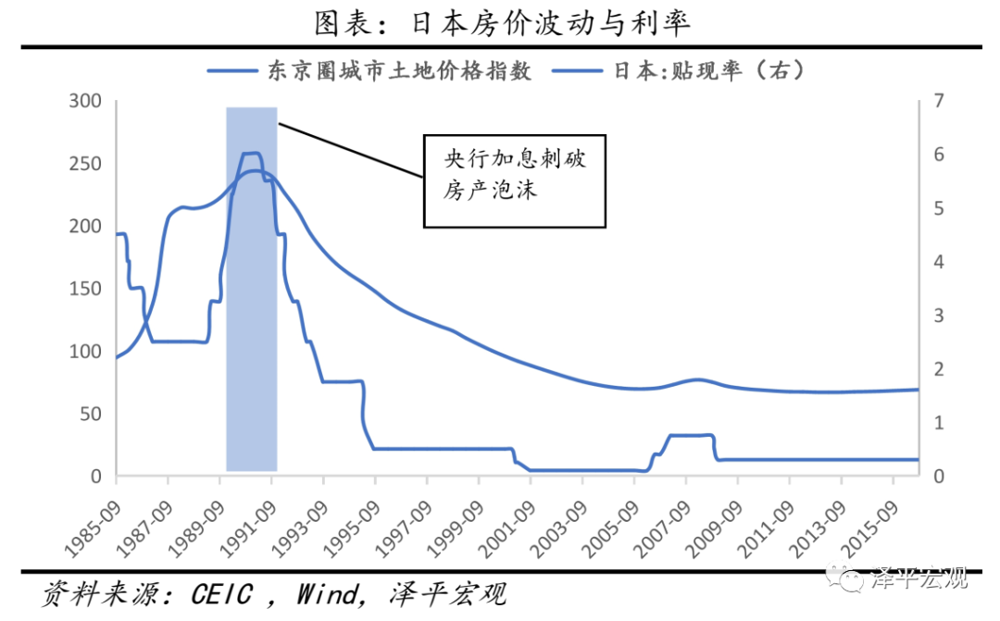

##### （2）对房地产贷款和土地交易采取严厉管制

1987 年7 月，日本财务省召集有关金融机构举行听证会，了解金融机构在房地产市场上的活动。此后，财务省发布了行政指导，要求金融机构严格控制在土地上的贷款项目，具体的要求是“房地产贷款增长速度不能超过总体贷款增长速度”。受此影响，日本各金融机构的房地产贷款增长速度迅速下降，从1987年6月的36.6%下降到了1988 年3 月的10.2%。到1991年，日本商业银行实际上已经停止了对房地产业的贷款。

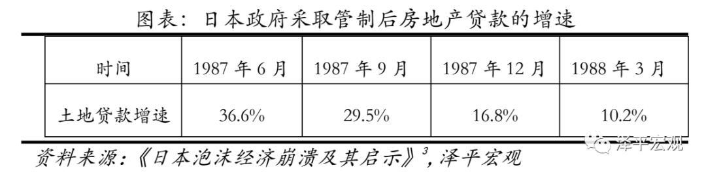

##### （3）调整土地收益税

在1987 年10 月调整税制之前，拥有土地10 年以内被视为“短期持有”，而10 年以上则被认为是“长期持有”，在调整税制后，持有不超过2年被视为是“超短期持有”，并受到重点监管。

##### （4）股市泡沫率先破裂

日本货币政策的突然转向，首先刺破了股票市场的泡沫。1990年1月12日，是日本股市有史以来最黑暗的一天。当天，日经指数顿挫，日本股市暴跌70%。人们依稀记得，就在半个月前的1989年12月31日，日经指数还达到了辉煌的高点38915点。但是，以1990年新年为转折点，日本股市陷入了长达20年的熊市之中。

1990年9月，日经股票市场平均亏损44%，相关股票平均下跌55%。日本股票价格的大幅下跌，使几乎所有银行、企业和证券公司出现巨额亏损。

##### （5）巨大的房地产泡沫轰然倒塌

公司破产导致其拥有的大量不动产涌入市场，顿时房地产市场出现供过于求，房价出现下跌趋势。

与此同时，随着日元套利空间日益缩小，国际资本开始撤逃。1991年，日本不动产市场开始垮塌，巨大的地产泡沫自东京开始破裂，迅速蔓延至日本全境。土地和房屋根本卖不出去，陆续竣工的楼房没有住户，空置的房屋到处都是，房地产价格一泻千里。

1992年，日本政府出台“地价税”政策，规定凡持有土地者每年必须交纳一定比例的税收。在房地产繁荣时期囤积了大量土地的所有者纷纷出售土地，日本房地产市场立刻进入“供大于求”的冰河时代。

几种因素的叠加，加速了日本房地产经济的全面崩溃。房地产价格的暴跌导致大量不动产企业及关联企业破产。1993年，日本不动产破产企业的负债总额高达3万亿日元。

紧接着，作为土地投机主角的非银行金融机构因拥有大量不良债权而陆续破产。结果，给这些机构提供资金的银行也因此拥有了巨额不良债权。当年，日本21家主要银行宣告产生1100亿美元的坏账，其中1/3与房地产有关。

1991年7月，富士银行的虚假储蓄证明事件被曝光。紧接着，东海银行，协和琦玉银行也被揭露出来存在同样的问题。大量银行丑闻不断曝光，使日本银行业产生了严重的信用危机。数年后，几家大银行相继倒闭。

“土地神话”的破灭，中小银行的破产，证券丑闻的暴露……接连的打击让日本民众对资本市场丧失了信心。此后，受到亚洲金融危机、次贷危机等影响，日本房地产市场再也未能重回辉煌。

##### （6）漫长的下跌之旅

日本土地价格于1991年到达最高点，随后开启漫长的下跌之旅。日本统计局数据显示，日本土地价格从1992开始持续下跌，截至2015年，六大主要城市住宅用地价格跌幅为65%，所有城市跌幅为53%。

大城市跌幅明显大于中小城市。日本统计局数据显示，1992-2000年间，日本六大主要城市住宅用地价格下跌55%，中小城市（六大主要城市以外的城市）跌幅仅19.4%。

2008年，日本国土交通省调查数据显示，日本的房屋空置率达到了13.1%，高于1988年的9.4%，是至今为止的最高水平。尽管经过了长达20年的艰难调整，但日本房地产市场依然疲软。 

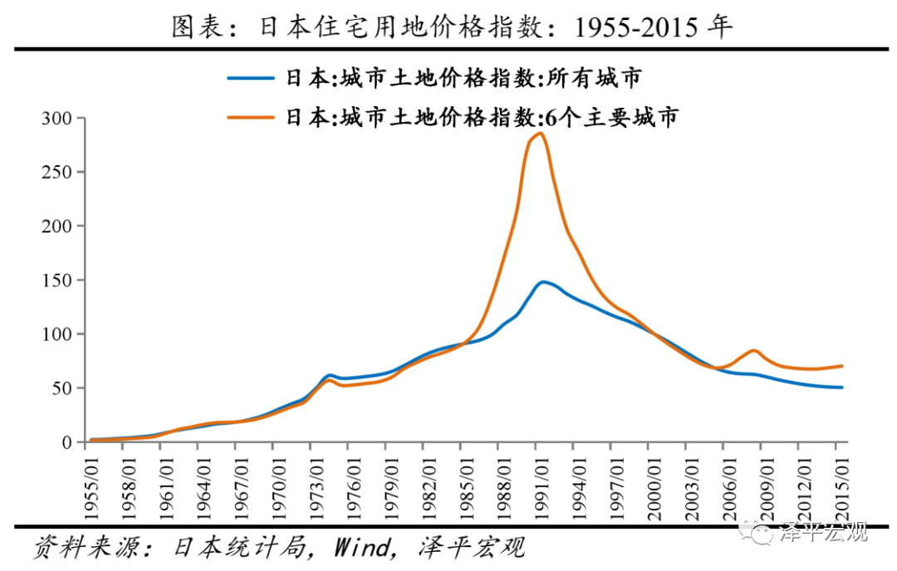

#### 2.4 影响：失去的二十年

日本房地产泡沫破灭后，经济陷入了失去的二十年和长期通缩，居民财富大幅缩水，企业资产负债表恶化，银行不良率上升，政府债台高筑。日本政治影响力下降，超级大国梦破灭。

##### （1）1991年泡沫调整幅度大、持续时间长的原因：适龄购房人群和经济增速拐点

日本1974年和1991年房价泡沫旗鼓相当，那么为何1991年是大拐点？如果对照日本1974年前后和1991年前后房地产泡沫的形成与破裂，可以发现，1974年前后的第一次调整幅度小、恢复力强，原因在于经济中速增长、城市化空间、适龄购房人口数量维持高位等提供了基本面支撑。1974-1985年日本虽然告别了高速增长，但仍实现了年均3.5%左右的中速增长。1970年日本城市化率72%，还有一定空间。1974年20-50岁适龄购房人口数量接近峰值后，并没有转而向下，在1974-1991年间维持在高水平。但是，1991年前后的第二次调整幅度大、持续时间长，原因在于经济长期低速增长、城市化进程接近尾声、适龄购房人口数量大幅快速下降等。1991年以后日本经济年均仅1%左右的增长，老龄化严重，人口抚养比大幅上升。1990年日本城市化率已经高达77.4%。1991年以后，20-50岁适龄购房人口数量大幅快速下降。

##### （2）陷入失去的二十年和长期通缩

1991年地产泡沫破灭后，日本经济增速和通胀率双双下台阶，落入高等收入陷阱。1992-2014年间，日本GDP增速平均为0.8%，CPI平均增长0.2%，而危机前十年，日本GDP平均增速为4.6%，CPI平均为1.9%。值得注意的是，这样的“成绩”还是在政府大力度刺激下才取得的。逆周期调控使得日本政府债务率大幅增长，央行资产负债表大幅扩张。日本10年国债收益率跌至负值，反映未来前景仍不乐观。

##### （3）私人财富缩水

辜朝明在其著作《大衰退》中提到，地产和股票价格的下跌给日本带来的财富损失，达到1500万亿日元，相当于日本全国个人金融资产的总和，这个数字还相当于日本3年的GDP总和。从下图可知，房地产比重无疑大于股票。

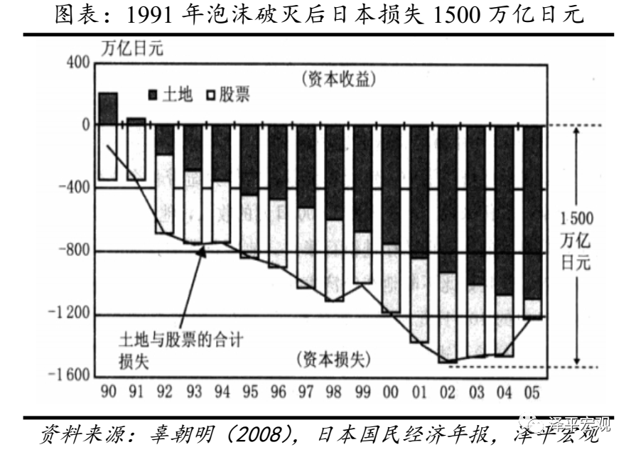

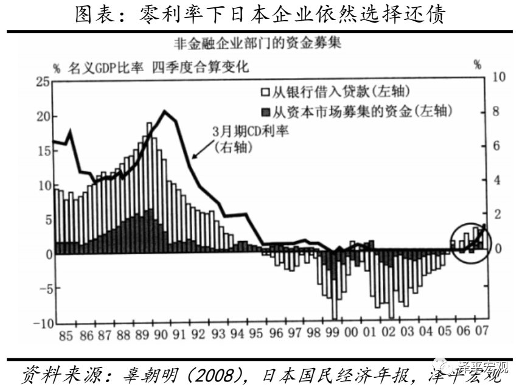

##### （4）企业资产负债表恶化

房地产和土地是很多企业重要资产和抵押品，随着这些资产价格的暴跌，日本企业资产负债表出现明显恶化。企业为修复其恶化的资产负债表，不得不努力归还债务，1991年后尽管利率大幅下降，日本企业从外部募集资金却持续减少，到90年代中，日本企业从债券市场和银行净融入资金均转为负值。

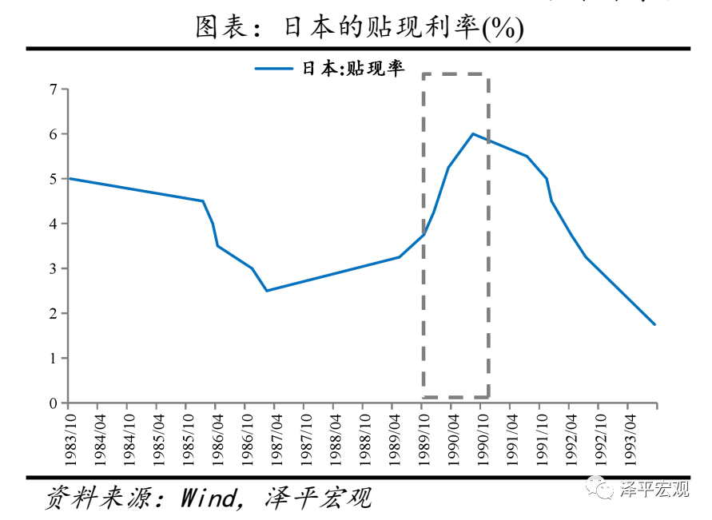

##### （5）银行坏账大幅增加

房地产价格大幅下跌和经济低迷使日本银行坏账大幅上升。1992年至2003年间，日本先后有180家金融机构宣布破产倒闭[参见吉野直行（2009），国际经济评论]。日本所有银行坏账数据，从1993年的12.8万亿日元上升至2000年的30.4万亿日元[参见李众敏（2008）国际经济评论]。

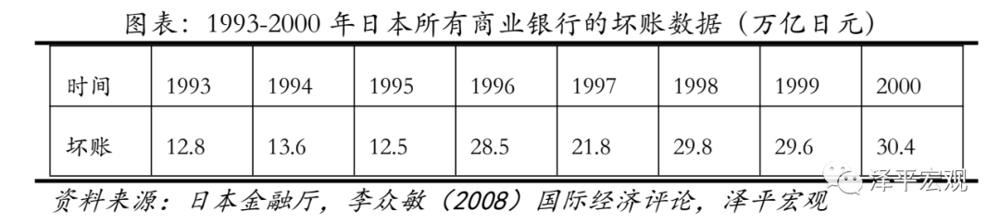

##### （6）政府债台高筑  

经济的持续衰退，和政府的逆周期调控，使得日本政府债台高筑。1991年日本政府债务/GDP比重为48%，低于美国的61%，意大利的99%，略高于德国的39.5%，2014年，日本政府债务/GDP比重为230%，远高于美国（103%），德国（71.6%），意大利（132.5%）等。

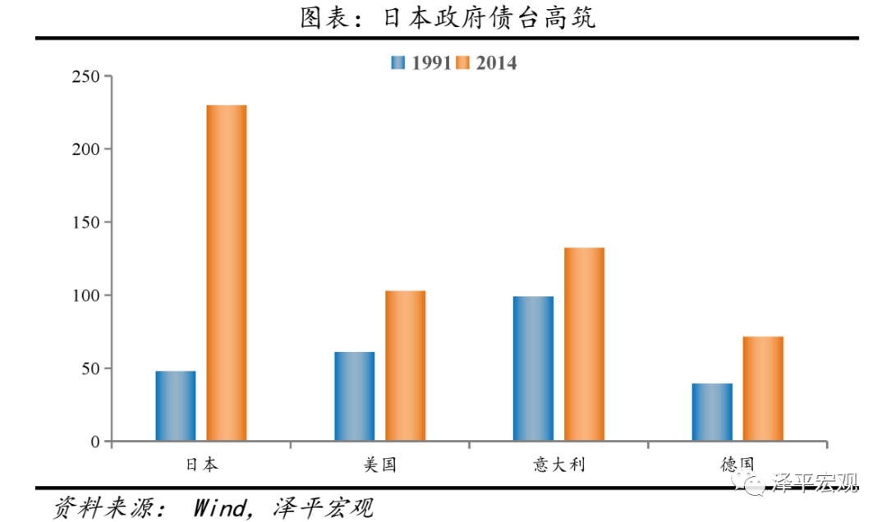

##### （7）国际地位下降

1991年后，日本经济陷入停滞，和其他国家相对力量出现明显变化。以美元计价的GDP总量来看，1991-2014年间，日本累计增长30%，美国增长194%，中国增长26.3倍，德国增长114%。1991-2014年间，日本GDP占美国比重从60%下降为26%，中国成为第二大经济体。

### 3 中国1992-1993**年海南房地产泡沫**

1992年总人数不过655.8万的海南岛上竟然出现了两万多家房地产公司。短短三年，房价增长超过4倍。最后的遗产，是600多栋“烂尾楼”、18834公顷闲置土地和800亿元积压资金，仅四大国有商业银行的坏账就高达300亿元。开发商纷纷逃离或倒闭，不少银行的不良贷款率一度高达60％以上。“天涯，海角，烂尾楼”一时间成为海南的三大景观。海南不得不为清理烂尾楼和不良贷款而长期努力。

#### 3.1 形成：特区实验，南巡讲话，住房改革

1988年，正值改革开放十周年之际，中国面临如何进一步深化改革和扩大开放的问题。当时，国内已经建立了深圳、珠海、厦门和汕头四个经济特区，但这四个城市皆属于沿海城市经济体，但对于广大农村地区仍需探索。因此，中央需要一块理想的试验田。1988年的海南农村人口占比超过80%，工业产出水平低下，人均GDP只相当于全国平均水平的80%，有六分之一的人口生活在贫困线以下，基本符合中央改革实验的各项条件，尤其是其所具有的独特地理条件。

1988年8月23日，有“海角天涯”之称的海南岛从广东省脱离,成立中国第31个省级行政区。海口，这个原本人口不到23万、总面积不足30平方公里的海滨小城一跃成为中国最大经济特区的首府，也成为了全国各地淘金者的“理想国”。

1992年初，邓小平发表南巡讲话，随后，中央提出加快住房制度改革步伐。海南建省和特区效应因此得到全面释放。

海南岛的房地产市场骤然升温。

#### 3.2 狂热：财富神话，击鼓传花

大量资金被投入到房地产上，高峰时期，这座总人数不过655.8万的海岛上竟然出现了两万多家房地产公司，平均每300个人一家房地产公司。

当时炒房的各路人马中，有包括中远集团、中粮集团、核工业总公司的中央军，也有全国各地知名企业组成的杂牌军，炒房的大部分的钱都来自国有银行。

据海南省处置积压房地产工作小组办公室资料统计，海南省1989年房地产投资仅为3.2亿元，而1990-1993年间，房地产投资比上年分别增长143%、123%、225%、62%，最高年投资额达93亿元，各年房地产投资额占当年固定资产投资总额的比例是22%、38%、66%与49%。

当然，这些公司不都是为了盖房子。事实上，大部分人都在玩一个“击鼓传花”的古老游戏。

1992年，海南全省房地产投资达87亿元，占固定资产总投资的一半，仅海口一地的房地产开发面积就达800万平方米，地价由1991年的十几万元/亩飙升至600多万元/亩；同年，海口市经济增长率达到了惊人的83％，另一个热点城市三亚也达到了73.6％，海南全省财政收入的40％来源于房地产业。

据《中国房地产市场年鉴（1996）》统计，1988年，海南商品房平均价格为1350元/平方米，1991年为1400元/平方米，1992年猛涨至5000元/平方米，1993年达到7500元/平方米的顶峰。短短三年，增长超过4倍。

与海南隔海相望的广西省北海市，房地产开发的火爆程度也毫不逊色。1992年，这座原本只有10万人的小城冒出了1000多家房地产公司，全国各地驻扎在北海的炒家达50余万人。经过轮番倒手，政府几万元/亩批出去的地能炒到100多万元/亩，当地政府一年批出去的土地就达80平方公里。以至于次年前来视察的朱镕基副总理忍不住提醒当地政府：“北海不同于我的上海……（北海建设）要量力而行”。

在这场空前豪赌中，政府、银行、开发商结成了紧密的铁三角。泡沫生成期间，以四大商业银行为首，银行资金、国企、乡镇企业和民营企业的资本通过各种渠道源源不断涌入海南，总数不下千亿。

几乎所有的开发商都成了银行的债务人。精明的开发商们纷纷把倒卖地皮或楼花赚到的钱装进自己的口袋，把还停留在图纸上的房子高价抵押给银行。

由于投机性需求已经占到了市场的70％以上，一些房子甚至还停留在设计图纸阶段，就已经被卖了好几道手。

每一个玩家都想在游戏结束前赶快把手中的“花”传给下一个人。只是，不是每个人都有好运气。

1993年6月23日，终场哨声突然吹响。时任国务院副总理的朱镕基发表讲话，宣布终止房地产公司上市、全面控制银行资金进入房地产业。

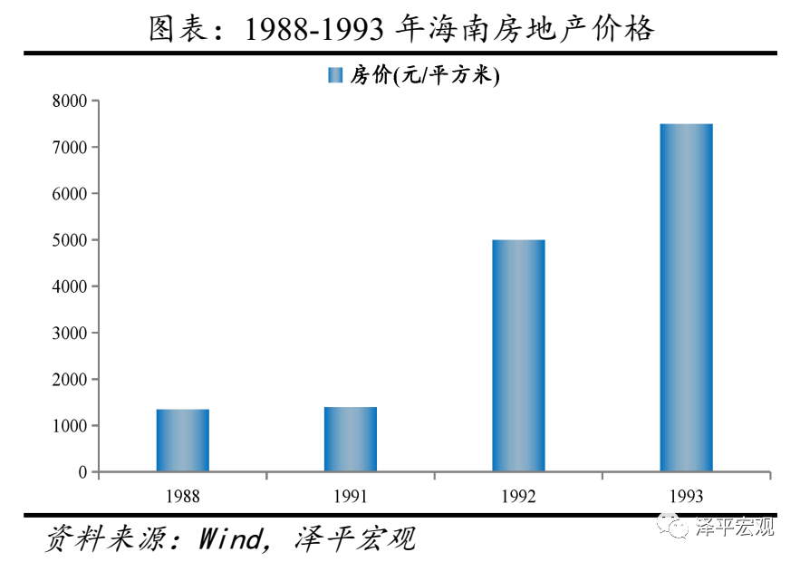

#### 3.3 崩溃及影响：宏观调控，银根收紧，烂尾楼，不良贷款

1993年6月23日，时任国务院副总理的朱镕基发表讲话，宣布终止房地产公司上市、全面控制银行资金进入房地产业。24日，国务院发布《关于当前经济情况和加强宏观调控意见》，16条强力调控措施包括严格控制信贷总规模、提高存贷利率和国债利率、限期收回违章拆借资金、削减基建投资、清理所有在建项目等。

银根全面紧缩，一路高歌猛进的海南房地产热顿时被釜底抽薪。这场调控的遗产，是给占全国0.6％总人口的海南省留下了占全国10％的积压商品房。全省“烂尾楼”高达600多栋、1600多万平方米，闲置土地18834公顷，积压资金800亿元，仅四大国有商业银行的坏账就高达300亿元。此后几年海南经济增速断崖式下跌。

一海之隔的北海，沉淀资金甚至高达200亿元，烂尾楼面积超过了三亚，被称为中国的“泡沫经济博物馆”。

开发商纷纷逃离或倒闭，银行顿时成为最大的发展商，不少银行的不良贷款率一度高达60％以上。当银行开始着手处置不良资产时，才发现很多抵押项目其实才挖了一个大坑，以天价抵押的楼盘不过是“空中楼阁”。更糟糕的是，不少楼盘还欠着大量的工程款，有的甚至先后抵押了多次。

据统计，仅建行一家，先后处置的不良房地产项目就达267个，报建面积760万平方米，其中现房面积近8万平方米，占海南房地产存量的20％，现金回收比例不足20％。

一些老牌券商如华夏证券、南方证券因在海南进行了大量房地产直接投资，同样损失惨重。为此，证监会不得不在2001年4月全面叫停券商直接投资。

1995年8月，海南省政府决定成立海南发展银行，以解决省内众多信托投资公司由于大量投资房地产而出现的资金困难问题。但是仅仅两年零10个月，海南发展银行就出现了挤兑风波。1998年6月21日，央行不得不宣布关闭海发行，这也是新中国首家因支付危机关闭的省级商业银行。

从1999年开始，海南省用了整整七年的时间，处置积压房地产的工作才基本结束。截至2006年10月，全省累计处置闲置建设用地23353.87公顷，占闲置总量的98.17％，处置积压商品房444.82万平方米，占积压总量的97.6％。

“天涯，海角，烂尾楼”一时间成为海南的三大景观。

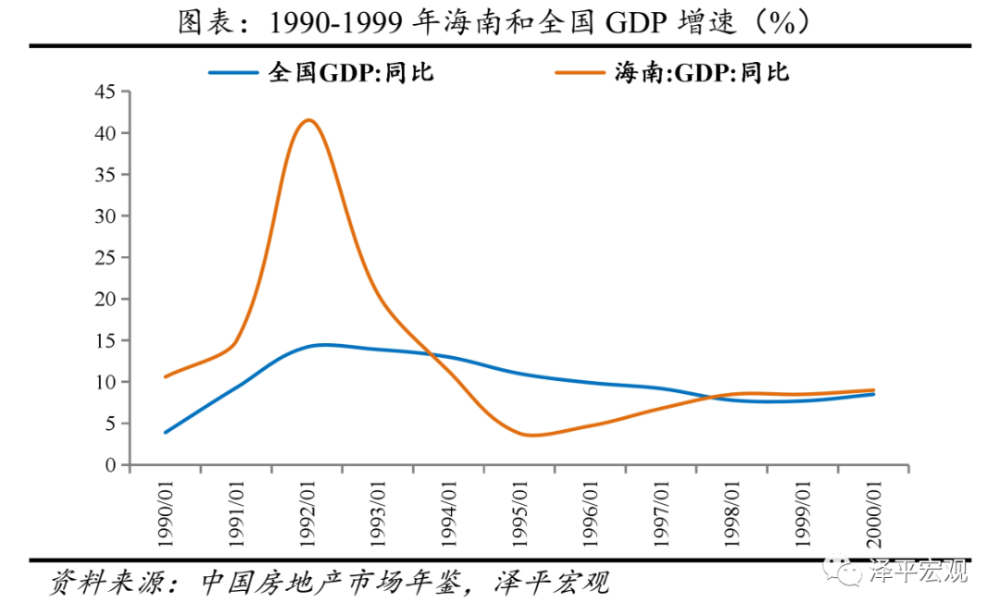

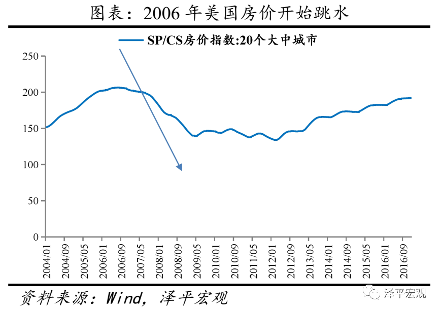

### 4 东南亚1991-1996年**房地产泡沫与1997年亚洲金融风暴**

1997年之前，东南亚经济体保持了持续高增长，创造了“亚洲奇迹”。但是，在全球低利率、金融自由化、国际资本流入、金融监管缺位等刺激下，大量信贷流入房地产，催生泡沫。随后在美联储加息、国际资本流出、固定汇率制崩盘等影响下，亚洲金融风暴爆发，房市泡沫破裂。从此之后，除韩国等少数地区转型成功，大多数东南亚国家仍停滞在中等收入阶段。

#### 4.1 1997年亚洲金融风暴始末

二战后，日本、韩国、中国台湾、印度尼西亚、马来西亚、泰国等东南亚国家和地区先后实现了持续的高速增长，一度被称为“亚洲奇迹”。但1997年东南亚金融危机打断了这一进程，这些地区经济普遍出现断崖式下滑，汇率大幅贬值。进入新世纪以来，除了日本，只有韩国等少数地区转型成功，大多数国家仍停滞在中等收入阶段。

上世纪80年代末～90年代初，受波斯湾战争、第三次石油危机、日本经济泡沫破裂、苏联解体等影响，美国经济表现低迷，美元指数走弱。与此同时，泰国、马来西亚、印度尼西亚、新加坡等国经济在此期间则实现了10%左右的高速增长，吸引了大量国际资本流入南亚地区，外债规模大幅上升。这些地区债务期限严重错配，大量中短期外债进入房地产投资领域。泰国等国房地产投机盛行，资产泡沫不断膨胀。在汇率政策方面，泰国等国在扩大金融自由化、取消资本管制的同时，仍然维持固定汇率制，给国际投机资本提供了条件。

进入上世纪90年代中期，美国经济开始强劲复苏，格林斯潘领导下的美联储提高联邦基金利率以应对可能的通胀风险，美元步入第二轮强势周期。采取固定汇率制的南亚国家货币被迫升值，出口竞争力削弱。与此同时，人民币大幅贬值，中国在吸引外资和增加出口方面表现出强大竞争力。1996年前后南亚国家出口显著下滑，经常账户加速恶化。1997年泰铢、菲律宾比索、印尼盾、马来西亚令吉、韩元等先后成为国际投机资本的攻击对象，资本大量流出，固定汇率制被迫放弃，货币大幅贬值。随后股市受到重创，房地产泡沫破裂，银行呆坏账剧增，金融机构和企业大规模破产。1998年8月俄罗斯中央银行宣布推迟偿还外债及暂停国债券交易，俄罗斯债务危机爆发，随后金融危机逐步升级成经济、政治危机。危机之后，大多数东南亚经济体没有恢复到危机前的增长水平。

#### 4.2 亚洲金融危机的背景条件：金融自由化、国际资本流入和固定汇率制

**金融自由化后国际资本流入。**1980年代，东南亚各国受发达国家金融深化、金融自由化理论和实践的影响，陆续开启以金融自由化为主的金融改革。菲律宾于1962年宣布取消外汇管制，1986年允许外资利润自由汇出。马来西亚1986年提高了外国投资者在本国股份公司允许持有股权的比例。同年印尼亦放松了对资本账户的管制。到1994年，东南亚主要国家基本实现了资本项目下的可自由兑换，其金融市场基本完全开放。20世纪80年代中期以后，日本经济低速增长，资金利率低，不少日本国内资金开始投向东南亚。到了20世纪90年代初期，国际资本看好东南亚经济，大量国际私人资本流入东南亚地区。

然而，由于国内经济基础不稳定，调控体系不健全以及监管能力不足等原因，过早对外开放了其尚未成熟的资本市场，过度放松了对资本项目的管理，为国际游资的大进大出地频繁流动和投机攻击行动提供了可乘之机。

**实行与美元挂钩的固定汇率制度。**东南亚国家大都实行固定汇率制度，其货币间接或直接与美元挂钩。1985年“广场协议”后美元对西方主要货币开始贬值，则东南亚各国的货币也随之贬值，大大增强其出口产品的市场竞争力。但是，固定汇率制度的问题是钉住国与被钉住国的货币形成了完全联动关系。1995年以后，美国“新经济”时代来临，进入经济持续增长与低通货膨胀率、低失业率并存的黄金时代，美元开始升值带动了东南亚各国货币一起升值，结果这些国家出口增长率停滞不前，而进口则激增，贸易及经常项目产生了巨额赤字。

当东南亚国家贸易赤字增加、货币实际贬值时，他们没有及时调整汇率，依然维持盯住美元的固定汇率制，引起投机者抛售本币，抢购外汇，迫使中央银行宣布实行浮动汇率，让本币贬值。这是东南亚发生金融危机的直接原因。

#### 4.3 金融风暴前后东南亚地产泡沫的催生与崩盘

金融自由化推动国际资本纷纷进入东南亚。1995年日本给中国内地、印尼、韩国、马来西亚、菲律宾、台湾地区、泰国等地的融资余额为1090亿美元，欧洲各国银行的贷款余额则为870亿美元。1996年日本给东南亚的放款余额为1140亿美元，欧洲银行则增加为1160亿美元。1996年下半年起受美元走强，东南亚货币开始同步升值导致出口增长率普遍下降（东南亚各国普遍属于外向型经济体），产能过剩，收益率下降和银行不良资产增加，使得大量产业资金流向股市和房地产市场而导致泡沫的形成。

1986-1994年，各国流向股市和房地产的银行贷款比例越来越大，其中新加坡33%、马来西亚30%、印尼20%、泰国50%、菲律宾11%。东南亚国家的房地产价格急剧上涨，其中印尼在1988-1991年内房地产价格上涨了约4倍，马来西亚、菲律宾和泰国在1988-1992年内都上涨了3倍左右。

##### 4.3.1 泰国

**泡沫的形成。**泰国是东南亚金融危机的起源地。20世纪80年代以来，泰国将出口导向型工业化作为经济发展的重点。为了解决基础设施落后和资金短缺等问题，泰国政府进行了一系列的改革措施，这其中包括开放资本账户。当时泰国土地价格低廉，劳动力供给充足，工资和消费水平都比较低，再加上政府的各种优惠政策，大量外资迅速涌入泰国。

在银行信贷的大量扩张下，首都曼谷等大城市的房地产价格迅速上涨，房地产业的超高利润更是吸引了大量的国际资本，两者相互作用，房地产泡沫迅速膨胀。1989年泰国的住房贷款总额为459亿泰铢，到1996年则超过了7900亿泰铢，7年里增加了17倍多。与此同时，房地产价格也迅速上升。1988-1992年间，地价以平均每年10%～30%的速度上涨；在1992年-1997年7月，则达到每年40%，某些地方的地价1年竟然上涨了14倍。房地产业在过度扩张的银行信贷的推动下不可避免地积聚了大量的泡沫。由于没有很好地进行调控，最终导致房地产市场供给大大超过需求，构成了巨大泡沫。1996年，泰国的房屋空置率持续升高，其中办公楼空置率高达50%。

**泡沫的破裂。**进入1996年以后，泰国出口产品的国际市场需求低迷，贸易赤字加剧。但是当时的泰国政府对国际形势判断失误，加上泰国金融监管薄弱、金融系统不稳定等因素，国际投资基金开始着手撤离泰国，从而对泰国的汇率造成了巨大的压力。巨大的流出压力迫使泰国央行最终放弃了固定汇率制度，实行“管理下的浮动汇率制度”，从而导致汇市和股市的超幅下跌，泰铢贬值1倍以上。房地产价格也迅速下跌，仅1997年下半年就缩水近30%，房地产泡沫最终崩溃。

##### 4.3.2 马来西亚

**泡沫的形成。**马来西亚长期实行外向型经济政策，对外贸易在经济结构中举足轻重。1990-1996年，马来西亚出口年均增长率高达18%，比同期GDP增速高出约10个百分点。马来西亚希望在2020年迈入发达国家行列。为此，马来西亚政府采取了用高投入拉动经济发展的政策，为了弥补投资资金的不足，马来西亚实行了经济金融自由化政策，包括资本项目可自由兑换。国际资本大量涌入国内，到1997年6月，马来西亚外债总额已经高达452亿美元，其中短期外债占30%左右。与泰国类似，大量的外债并未投入到实体经济中去，而是转到了房地产业和股票市场，从而使泡沫迅速形成。

随着投资和信贷的膨胀，整个房地产市场出现了异常的繁荣。由于马来西亚金融监管体系的缺陷，中央银行未能有效监管资本的流向，大量资本进入了投机性较高的房地产业和股票市场，导致房地产价格迅速上升。以首都吉隆坡为例，在金融危机爆发前的1995年，住宅租金和住宅价格分别上涨了55%和66%。价格上涨使得写字楼空置率由1990-1995年的平均5%～6%的正常水平上升到1998年的25%。

**泡沫的破裂。**金融危机爆发后，经济泡沫迅速崩溃。马来西亚货币汇率从1997年7月的1美元兑2.5247林吉特猛跌至1998年1月的1美元兑4.88林吉特，货币贬值近50%。股票市场大幅崩溃，金融和房地产类股票甚至下跌了70%～90%。房地产市场泡沫也随之破裂，1997年下半年，马来西亚房地产的平均交易量下降了37%，各项房价指数开始大幅回落。

##### 4.3.3 中国香港

**泡沫的形成。**70年代后期，中国香港逐步转型为以金融、贸易和服务为主的经济体。中国香港房地产业在这次产业调整中得到了迅速的发展。根据1998年的数据，中国香港房地产业对GDP的贡献高达20％，房地产投资占固定资产投资的近50％，而政府收入中也有35％来源于房地产业。进入90年代，中国香港经济持续发展，对房地产市场的需求不断增加，房地产价格上涨非常迅速。

从1991年开始，中国香港实施“紧缩”土地供应政策并以低利率进行刺激，房价一路飙升。房地产价格的暴涨引起市场的投机行为急剧升温，许多中国香港居民因为买卖房产实现财富高速增长，甚至企业纷纷向银行贷款转投地皮，中国香港房地产市场充斥着严重的投机风气。1996年第4季度，中国香港银行业放松了对住房按揭贷款的审查标准，直接促使大量炒楼力量进入房地产市场，使得本来就已经非常高的楼市价格再度暴涨。房地产价格增长率与GDP增长率之比在1986-1996年间的平均值达2.4，而1997年8月份在中国香港楼市高峰期，该指标高达3.6-5.0。中国香港地产泡沫可见一斑。

**泡沫的破裂。**1997年亚洲金融危机爆发，港币汇率和港股承压暴跌，引发了中国香港市场利率上升、银行信贷萎缩、失业增加等问题。由于前期房价上涨过快，房地产业在经济结构的比重严重失衡，且市场上对房产多是投机性需求，危机爆发后借贷成本的上升、居民支付能力减弱和对市场的悲观预期造成了楼市“跳水式”的下跌，1997年至1998年一年时间，中国香港楼价急剧下跌50%-60%，成交大幅萎缩，房屋空置率上升。

房价暴跌导致社会财富大量萎缩，据计算，从1997-2002年的5年时间里，中国香港房地产和股市总市值共损失约8万亿港元，比同期中国香港的生产总值还多。在这场泡沫中，中国香港平均每位业主损失267万港元，有十多万人由百万“富翁”一夜之间变成了百万“负翁”。

由于泡沫时期政府财政对房地产的依存度很高，财政收入长期依靠土地批租收入以及其他房地产相关税收，泡沫破裂后港府整体财政收入减少了20%～25%。另外，银行系统也积聚了大量不良贷款，个人和工商企业的抵押物资产大幅缩水。
从1998-2003年，中国香港经济一直处于衰退的泥潭中。1999年、2001年、2002年和2003年中国香港经济增长率分别为-1.2%、-0.7%、-0.6%和-2.2%。

### 5 美国2001-2007年**房地产泡沫与2008年次贷危机**

在过剩流动性和低利率刺激下，催生出2001-2006年间美国房地产大泡沫。2004年美联储开始加息，2008年美国次贷危机爆发，并迅速蔓延成国际金融危机。虽然经过QE和零利率，全球经济至今仍未完全走出国际金融危机的阴影。

#### 5.1 形成：网络泡沫破灭，“居者有其屋”计划，低利率，影子银行

2001年网络泡沫破灭，美国经济陷入衰退。小布什政府为了推动经济增长，刺激房地产，推动美国家庭“居者有其屋”的计划。但是，当时美国富裕阶层的购房需求基本饱和。因此，政府把注意力转向那些中、低收入或收入不固定甚至是没有收入的人，这些信用级别较低的人成了房地产市场消费的“新宠”，也就促成了次级贷款大量发放。

2001年后美国经济陷入衰退，为了刺激经济，美联储连续13次降息，联邦基金利率从2001年初的6.5%降低到了2003年6月的1%，30年固定利率抵押贷款合约利率从2000年5月的8.52%下降到2004年3月的5.45%。与此同时，美国政府立法要求金融机构向穷人发放贷款。宽松的贷款利率条件刺激了低收入群体的购房需求。

在美国，发放次级贷款的大部分金融机构是抵押贷款公司。由于缺乏销售网点，贷款公司主要以经纪人和客户代理为分销渠道。为了收取更多手续费，他们盲目发展客户市场，忽视甚至是有意隐瞒客户的借款风险。激烈的市场竞争不断拉低借款者的信用门槛。许多次级贷款公司针对次级信用贷款人推出了“零首付”、“零文件”的贷款方式，不查收入、不查资产，贷款人可以在没有资金的情况下购房，仅需声明其收入情况，而无须提供任何有关偿还能力的证明。一些放贷公司甚至编造虚假信息使不合格借贷人的借贷申请获得通过。在这种情况下，本来不可能借到钱或者借不到那么多钱的“边缘贷款者”，也被蛊惑进来。长期的宽松货币和低门槛贷款政策刺激了低收入群体的购房需求，同时也催生了市场大规模的投机性需求。

与商业银行不同，抵押贷款公司一般不能吸收公众存款，而是依靠贷款的二级市场和信贷资产证券化解决资金来源问题。为此，贷款公司大量通过贷款资产证券化，以住房抵押贷款支持证券(RMBS)的形式把贷款资产卖给市场，获取流动性的同时把相关的风险也部分转移给资本市场。对地产抵押贷款的金融创新不仅止于MBS，其他的产品如CDO类产品也层出不穷。

截至2007年，与次级贷款有关的金融产品总额高达8万亿美元，是抵押贷款的5倍。2001年以后随着中国、中东等经济体积累了大量贸易顺差和美元，国际资本流入美国本土购买美元资产包括次贷证券产品。过度的金融创新成为美国房地产泡沫膨胀的背后推手。

#### 5.2 疯狂：政府刺激，银行助推，短融长投

##### （1）政府政策支持向“三无”人员发放贷款

次级房屋贷款主要是向曾经有违约记录的人士提供房屋贷款，这些借款人通常是无工作、无固定收入和无资产，即“三无”人士。这类人群通常都没有很好还款能力，但是仍然能够轻而易举地获得贷款，甚至有部分银行主动向这部分人士发放贷款。“居者有其屋”的政策计划对拒绝向低收入人群提供住房贷款的金融机构冠以歧视的罪名进行罚款，数额通常高达数百万美元，这给贷款机构造成了很大的压力。

##### （2）金融机构基于房价持续上涨不断扩大贷款规模

在美联储的低利率政策下，作为抵押品的住宅价格一直在上涨。即便出现违约现象,银行可以拍卖抵押品（住宅）。由于房价一直在上涨,银行并不担心因借款人违约而遭受损失，因此对借款人的门槛要求越来越低，疯狂扩大其贷款规模。

##### （3）“短融长投”堆积风险

资本市场较高的流动性和货币市场较低的借贷成本，为金融机构开始利用短期资金为长期资产融资这一非常危险的模型提供了合适的市场环境。抵押贷款机构通常没有任何公司和零售存款，依然大量发放30年甚至更长的房屋贷款，而依靠的资金来源是货币市场上隔夜或者一周左右期限的资金，造成了银行资产与负债期限严重不匹配。一旦低息环境发生变化，“借短投长”的经营模式很容易出现债务挤压，从而导致资产支持证券价格的加速下跌。

##### （4）房价疯涨

美国房地产市场从1997年开始持续扩张，尤其自2001年起更加快速增长，占GDP比重由2001年年底的15.9%上升为2006年年低的19.7%，住宅投资在总投资中的比重最高时达到32%，新房开工量年增长率超过6%，2003年最高时达到8.4%。

在流动性过剩和低利率刺激下房价一路攀升。2000～2007年的房价涨幅大大超过了过去30多年来的长期增长趋势。据美国10个和20个主要城市的房价指数显示，2006年6月美国10大城市的房价涨至226.29的历史新高，是1996年12月的2.9倍。在房价上涨预期的刺激之下，加上抵押贷款利率下降导致购房成本降低，美国居民纷纷加入抵押贷款购房的行列，从2001年到2006年底，抵押贷款发放规模一共增加了4070亿美元，达到25200亿美元，2003年曾达到最高的37750亿美元。其中美国前25家最大的次贷发放机构所发行的次贷规模占总次贷规模的90%以上。

过剩的流动性催生了美国房市泡沫。房价上涨远远超过了居民收入上涨。房屋空置率由2005年年中的1.8%一路上升到2008年3季度的2.8%。

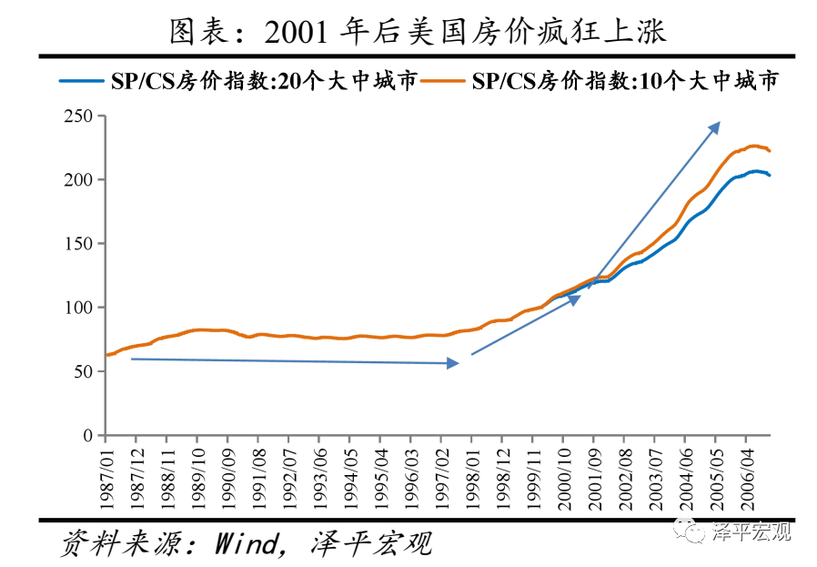

#### 5.3 崩溃及影响：利率上调、次贷违约、国际金融危机、沃尔克规则

2003年美国经济开始复苏，出于对通货膨胀的担忧，美联储从2004年6月起两年内连续17次调高联邦基金利率，将其从1%上调至2006年的5.25%。由于次贷大多为浮动利率贷款，重新设定的贷款利率随基准利率上升而上升，大多数次贷借款人的还款压力大幅增加。基准利率的上升逐渐刺破了美国房地产市场泡沫，进入2006年后，反映美国主要城市房价变动的S&P Case-Shiller 指数开始明显下跌。对于抵押贷款供应商来说，房价下跌降低了抵押品价值，导致其无法通过出售抵押品回收贷款本息。对于次贷借款人来说，房价下跌使其不能再通过房屋净值贷款获得新的抵押贷款，而即便是出售房产也偿还不了本息，所以只得违约。

2007-2008年次贷危机全面爆发并迅速蔓延成国际金融危机，其严重程度号称“百年一遇”。此次危机不仅影响范围广，其严重程度也大大超过过去几十年的历次金融危机。过去历次金融危机受到较大影响的主要是银行业，而此次危机却波及到了包括银行、对冲基金、保险公司、养老基金、政府信用支持的金融企业等几乎所有的金融机构。

受次贷违约冲击最大的是提供次贷的住房抵押贷款金融机构，2007年2月，汇丰控股（HSBC）为其美国附属机构的次贷业务增加18亿美元坏账拨备。2007年4月，美国第二大次贷公司新世纪金融公司（New Century Financial Corporation）申请破产保护，随后，30余家次级抵押贷款公司停业。接下来冲击的是购买了次贷RMBS、CDO的对冲基金和投资银行等机构投资者。全球著名投资银行雷曼兄弟破产，美林被收购，商业银行巨头RBS等欧洲大型银行纷纷国有化。保险、基金等其他金融机构作为次级贷款的参与人，也受到了重大的影响，如AIG资产与负债严重不平衡，最终由美国政府接管。美国次贷危机之所以升级成为国际金融危机，是由于美国住房贷款资产被投资银行衍生为其他金融产品，转卖给全球投资者，该项金融创新将美国房地产市场和全球金融市场前所未有地紧密联系起来。

次贷危机发生后，多家大型金融公司破产倒闭。为此，美联储做了一系列救市的举措。在2007年前，美联储资产负债表的结构较为稳定，总规模处于平稳上升状态，持有的国债占美联储总资产规模超过百分之八十。2007年金融危机发生之后，美联储在资产负债表的资产方新增了包含着有毒资产（主要是住房和商业房地产抵押贷款资产）背景的证券作为抵押品的抵押担保证券（MBS）等项目。为了拯救金融业，布什政府和奥巴马政府分别提出了“问题资产救助计划（TARP）”和“金融援助计划（FSP）”，总规模达到2.3万亿美元。美联储大量增持联邦机构债券和抵押贷款证券。截至2016年末，美联储资产负债表中的抵押担保证券(MBS)余额高达1.74万亿美元，占总资产的39%。如何在不影响金融市场正常运行的情况下处理其资产负债表内复杂的有毒资产是美联储未来的难题。

次贷危机暴露了美国监管体系的种种问题。2009年，奥巴马政府提出了金融监管体系改革方案，旨在让“我们的金融体系将因此更加安全”，该方案被称为“沃尔克法则”（Volcker Rule）。沃尔克规则的实质是禁止银行进行与客户金融服务无关的投机交易，其中核心的一条是禁止银行从事自营性质的投资业务。金融危机发生时，银行自营交易的风险集中在巨量的金融衍生品如MBS、CDO、CDS等产品上，这些衍生产品都具有数十倍甚至近百倍的杠杆，给市场造成了极大风险。禁止自营交易其实是政府强行对市场进行大规模的“去杠杆化”。

2008年次贷危机至今已近9年，美国经济经过3轮QE和零利率才开始走出衰退，而欧洲日本经济即使推出QQE和负利率仍处于低谷，中国经济从此告别了高增长时代，拉美、澳大利亚等资源国家则经济大幅回落并陷入长期低迷。至今，次贷危机对全球的影响仍未完全消除。

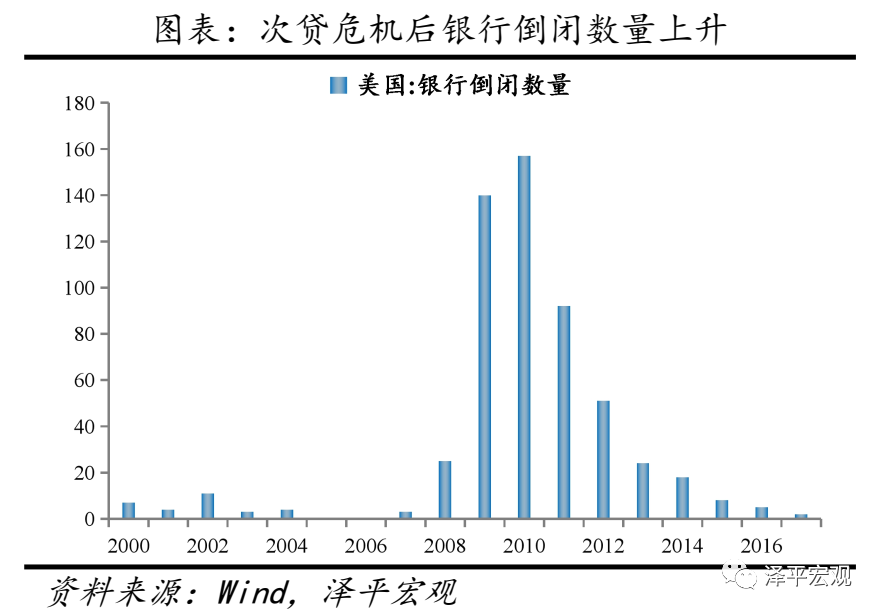

### 6 历次房地产泡沫的启示

纵观全球历史上五次重大的房地产泡沫事件，我们可以得出以下九大启示：

**1）房地产是周期之母。**从对经济增长的带动看，无论在发展中国家，还是在发达国家，房地产业在宏观经济中都起到了至关重要的作用。每次经济繁荣多与房地产带动的消费投资有关，而每次经济大萧条则多与房地产泡沫破裂有关，比如1991年前后的日本、1998年前后的东南亚、2008年前后的美国。从财富效应看，在典型国家，房地产市值一般是年度GDP的2-3倍，是可变价格财富总量的50%，这是股市、债市、商品市场、收藏品市场等其他资产市场远远不能比拟的。以日本为例，1990年日本全部房地产市值是美国的5倍，是全球股市总市值的2倍，仅东京都的地价就相当于美国全国的土地价格。以中国为例，2018年房地产投资占全社会固定资产投资的四分之一，房地产相关投资占近一半，全国房地产市值约321万亿元，是当年GDP的3.6倍，占股债房市值的71%。

**2）十次危机九次地产。**由于房地产是周期之母，对经济增长和财富效应有巨大的影响，而且又是典型的高杠杆部门，因此全球历史上大的经济危机多与房地产有关，比如，1929年大萧条跟房地产泡沫破裂及随后的银行业危机有关，1991年日本房地产崩盘后陷入失落的二十年，1998年东南亚房地产泡沫破裂后多数经济体落入中等收入陷阱，2008年美国次贷危机至今全球仍未走出阴影。反观美国1987年股市异常波动、中国2015年股市异常波动，对经济的影响则要小很多。

**3）历次房地产泡沫的形成在一开始都有经济增长、城镇化、居民收入等基本面支撑。**商品房需求包括居住需求和投机需求，居住需求主要跟城镇化、居民收入、人口结构等有关，它反映了商品房的商品属性，投机需求主要跟货币投放和低利率有关，它反映了商品房的金融属性。大多数房地产泡沫一开始都有基本面支撑，比如1923-1925年美国佛罗里达州房地产泡沫一开始跟美国经济的一战景气和旅游兴盛有关，1986-1991年日本房地产泡沫一开始跟日本经济成功转型和长期繁荣有关，1991-1996年东南亚房地产泡沫一开始跟“亚洲经济奇迹”和快速城镇化有关。

**4）虽然时代和国别不同，但历次房地产泡沫走向疯狂则无一例外受到流动性过剩和低利率的刺激。**由于房地产是典型的高杠杆部门（无论需求端的居民抵押贷还是供给端的房企开发贷），因此房市对流动性和利率极其敏感，流动性过剩和低利率将大大增加房地产的投机需求和金融属性，并脱离居民收入、城镇化等基本面。1985年日本签订“广场协议”后为了避免日元升值对国内经济的负面影响而持续大幅降息，1991-1996年东南亚经济体在金融自由化下国际资本大幅流入，2000年美国网络泡沫破裂以后为了刺激经济持续大幅降息。中国2008年以来有三波房地产周期回升，2009、2012、2014-2016，除了经济中高速增长、快速城镇化等基本面支撑外，每次都跟货币超发和低利率有关，2014-2016年这波尤为明显。

**5）政府支持、金融自由化、金融监管缺位、银行放贷失控等起到了推波助澜、火上浇油的作用。**政府经常基于发展经济目的刺激房地产，1923年前后佛罗里达州政府大举兴办基础设施以吸引旅游者和投资者，1985年后日本政府主动降息以刺激内需，1992年海南设立特区后鼓励开发，2001年小布什政府实施“居者有其屋”计划。金融自由化和金融监管缺位使得过多货币流入房地产，1986年前后日本加快金融自由化和放开公司发债融资，1991-1996年东南亚国家加快了资本账户开放导致大量国际资本流入，2001-2007年美国影子银行兴起导致过度金融创新。由于房地产的高杠杆属性，银行放贷失控火上浇油，房价上涨抵押物升值会进一步助推银行加大放贷，甚至主动说服客户抵押贷、零首付、放杠杆，在历次房地产泡沫中银行业都深陷其中，从而导致房地产泡沫危机既是金融危机也是经济危机。

**6）虽然时代和国别不同，但历次房地产泡沫崩溃都跟货币收紧和加息有关。**风险是涨出来的，泡沫越大破裂的可能性越大、调整也越深。日本央行从1989 年开始连续5 次加息，并限制对房地产贷款和打击土地投机，1991年日本房地产泡沫破裂。1993年6月23日，朱镕基讲话宣布终止房地产公司上市、全面控制银行资金进入房地产业，24日国务院发布《关于当前经济情况和加强宏观调控意见》，海南房地产泡沫应声破裂。1997年东南亚经济体汇率崩盘，国际资本大举撤出，房地产泡沫破裂。美联储从2004年6月起两年内连续17次调高联邦基金利率，2007年次贷违约大幅增加，2008年次贷危机全面爆发。

**7）如果缺乏人口、城镇化等基本面支持，房地产泡沫破裂后调整恢复时间更长。**日本房地产在1974和1991年出现过两轮泡沫，1974年前后的第一次调整幅度小、恢复力强，原因在于经济中速增长、城市化空间、适龄购房人口数量维持高位等提供了基本面支撑；但是，1991年前后的第二次调整幅度大、持续时间长，原因在于经济长期低速增长、城市化进程接近尾声、人口老龄化等。2008年美国房地产泡沫破裂以后没有像日本一样陷入失去的二十年，而是房价再创新高，主要是因为美国开放的移民政策、健康的人口年龄结构、富有弹性和活力的市场经济与创新机制等。

**8）每次房地产泡沫崩盘，影响大而深远。**1926-1929年房地产泡沫破裂及银行业危机引发的大萧条从金融危机、经济危机、社会危机、政治危机最终升级成军事危机，对人类社会造成了毁灭性的打击。1991年日本房地产崩盘后陷入失落的二十年，经济低迷、不良高企、居民财富缩水、长期通缩。1993年海南房地产泡沫破裂后，不得不长期处置烂尾楼和不良贷款，当地经济长期低迷。2008年次贷危机至今已10年，美国经济经过3轮QE和零利率才开始走出衰退，至今，次贷危机对全球的影响仍未完全消除。

**9）房地产是最坚硬的泡沫，应软着陆、防止硬着陆，用时间换空间，警惕并采取措施控制房地产泡沫，以人地挂钩和金融稳定为核心加快构建长效机制。**“房地产长期看人口、中期看土地、短期看金融”。中国经济和住宅投资已经告别高增长时代，房地产政策应适应“总量放缓、结构分化”新发展阶段特征，避免寄希望于刺激房地产重回高增长的泡沫风险。从长期看，尽管中国20-50岁主力置业人群比例在2013年达峰值，但综合考虑城镇化进程、居民收入增长和家庭户均规模小型化、住房更新等，中国房地产市场未来仍有较大发展空间。从中期看，区域分化明显，人口继续往大都市圈迁移，人地分离、供需错配问题仍严重。房地产泡沫具有十分明显的负作用：房价大涨恶化收入分配，增加了社会投机气氛并抑制企业创新积极性；房地产具有非生产性属性，过多信贷投向房地产将挤出实体经济投资；房价过高增加社会生产生活成本，容易引发产业空心化。当前应采取措施避免房价上涨脱离基本面的泡沫化趋势，可以考虑：以常住人口增量为核心改革“人地挂钩”，优化土地供应；稳步推进房地产税改革，推动土地财政转型；实行长期稳定的住房信贷金融政策，稳定市场预期；丰富供应主体，优化住房供应结构，加快补齐租赁住房短板。

