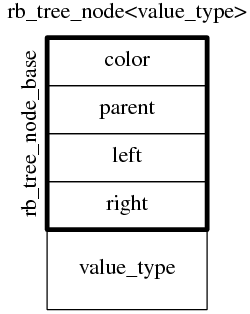
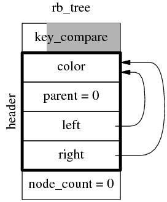
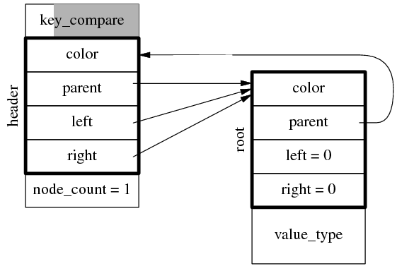
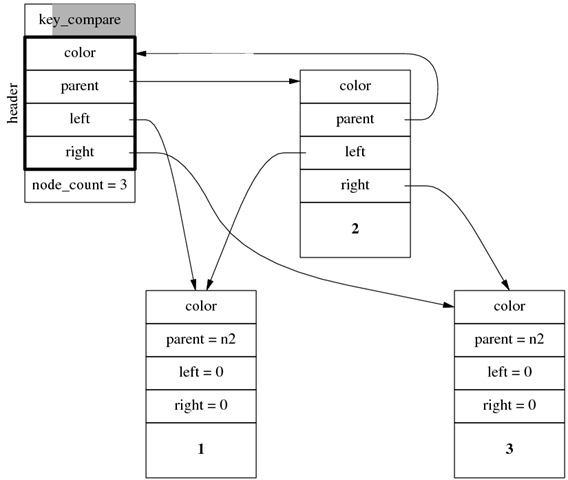
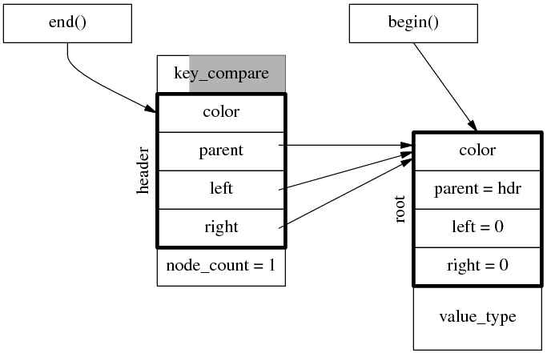
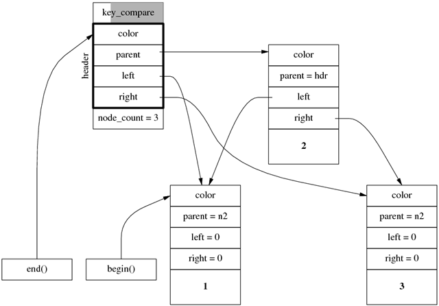
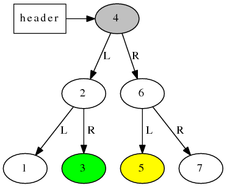
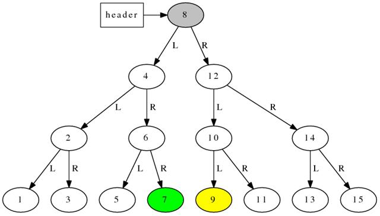
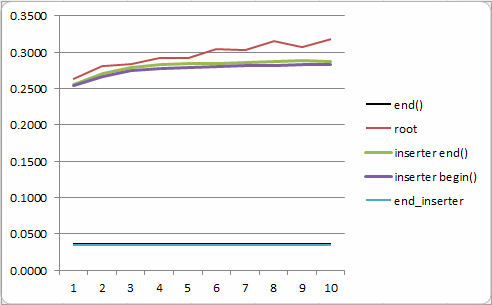

<!--BEGIN_DATA
{
    "create_date": "2021-11-09 12:00", 
    "modify_date": "2021-11-09 12:00", 
    "is_top": "0", 
    "summary": "关于std::set/std::map的几个为什么", 
    "tags": "C/C++、数据结构", 
    "file_name": "关于set/map的几个为什么.md"
}
END_DATA-->

#### <p>原文出处：<a href='https://mp.weixin.qq.com/s/BpyWSXNeStOEo2fnYtTHsQ' target='blank'>关于std::set/std::map的几个为什么</a></p>

std::set/std::map （以下用 std::map 代表） 是常用的关联式容器，也是 ADT（抽象数据类型）。也就是说，其接口（不是 OO 意义下的 interface）不仅规定了操作的功能，还规定了操作的复杂度（代价/cost）。例如 set::insert(iterator first, iterator last) 在通常情况下是 O(_N_ log _N_)，_N_ 是区间的长度；但是如果 [first, last) 已经排好序（在 `key_compare` 意义下），那么复杂度将会是 O(_N_)。

尽管 C++ 标准没有强求 std::map 底层的数据结构，但是根据其规定的时间复杂度，现在所有的 STL 实现都采用平衡二叉树来实现 std::map，而且用的都是红黑树。《算法导论（第 2 版）》第 12、13 章介绍了二叉搜索树和红黑树的原理、性质、伪代码，侯捷先生的《STL 源码剖析》第 5 章详细剖析了 SGI STL 的对应实现。本文对 STL 中红黑树（rb_tree）的实现**问了几个稍微深入一点的问题**，并给出了我的理解。

本文剖析的是 **G++ 4.7 自带的这一份 STL 实现及其特定行为**，与《STL 源码剖析》的版本略有区别。为了便于阅读，文中的变量名和 class 名都略有改写（例如 `_Rb_tree_node` 改为 `rb_tree_node`）。本文不谈红黑树的平衡算法，在我看来这属于“旁枝末节”（见陈硕《谈一谈网络编程学习经验》对此的定义），因此也就不关心节点的具体颜色了。

## 数据结构回顾

先回顾一下数据结构教材上讲的二叉搜索树的结构，节点（Node）一般有三个数据成员（left、right、data），树（Tree）有一到两个成员（root 和 node_count）。


```python
用 Python 表示：  
class Node:  
    def __init__(self, data):  
        self.left = None  
        self.right = None  
        self.data = data  
  
class Tree:  
    def __init__(self):  
        self.root = None  
        self.node_count = 0  
```

而实际上 STL rb_tree 的结构比这个要略微复杂一些，我整理的代码见 https://gist.github.com/4574621#file-tree-structure-cc  。

### 节点

Node 有 5 个成员，除了 left、right、data，还有 color 和 parent。


```cpp
C++实现，位于bits/stl_tree.h  
/**  
 * Non-template code  
 **/  
  
enum rb_tree_color { kRed, kBlack };  
  
struct rb_tree_node_base  
{  
  rb_tree_color       color_;  
  rb_tree_node_base*  parent_;  
  rb_tree_node_base*  left_;  
  rb_tree_node_base*  right_;  
};  
  
/**  
 * template code  
 **/  
  
template<typename Value>  
struct rb_tree_node : public rb_tree_node_base  
{  
  Value value_field_;  
};  
```

见下图。

node

color 的存在很好理解，红黑树每个节点非红即黑，需要保存其颜色（颜色只需要 1-bit 数据，一种节省内存的优化措施是把颜色嵌入到某个指针的最高位或最低位，Linux 内核里的 rbtree 是嵌入到 parent 的最低位）；parent 的存在使得非递归遍历成为可能，后面还将再谈到这一点。

### 树

Tree 有更多的成员，它包含一个完整的 `rb_tree_node_base`（color/parent/left/right），还有 `node_count` 和 `key_compare` 这两个额外的成员。

这里省略了一些默认模板参数，如 `key_compare` 和 `allocator`。


```cpp
template<typename Key, typename Value> // key_compare and allocator  
class rb_tree  
{  
 public:  
  typedef std::less<Key> key_compare;  
  typedef rb_tree_iterator<Value> iterator;  
 protected:  
  
  struct rb_tree_impl // : public node_allocator  
  {  
    key_compare       key_compare_;  
    rb_tree_node_base header_;  
    size_t            node_count_;  
  };  
  rb_tree_impl impl_;  
};  

template<typename Key, typename T> // key_compare and allocator  
class map  
{  
 public:  
  typedef std::pair<const Key, T> value_type;  
 private:  
  typedef rb_tree<Key, value_type> rep_type;  
  rep_type tree_;  
};  
```

见下图。这是一颗空树，其中阴影部分是 padding bytes，因为 `key_compare` 通常是 empty class。（allocator在哪里？）

tree

`rb_tree` 中的 header 不是 `rb_tree_node` 类型，而是 `rb_tree_node_base`，因此 rb_tree 的 size 是`6 * sizeof(void*)`，与模板类型参数无关。在 32-bit 上是 24 字节，在 64-bit 上是 48 字节，很容易用代码验证这一点。另外容易验证 std::set 和 std::map 的 sizeof() 是一样的。

注意 `rb_tree` 中的 header 不是 root 节点，其 left 和 right 成员也不是指向左右子节点，而是指向最左边节点（`left_most`）和最右边节点（`right_most`），后面将会介绍原因，是为了满足时间复杂度。header.parent 指向 root 节点，root.parent 指向 header，header 固定是红色，root 固定是黑色。在插入一个节点后，数据结构如下图。

tree1

继续插入两个节点，假设分别位于 root 的左右两侧，那么得到的数据结构如下图所示（parent 指针没有全画出来，因为其指向很明显），注意header.left 指向最左侧节点，header.right 指向最右侧节点。

tree3

### 迭代器

`rb_tree` 的 iterator 的数据结构很简单，只包含一个 `rb_tree_node_base` 指针，但是其++/--操作却不见得简单（具体实现函数不在头文件中，而在 libstdc++ 库文件中）。

```cpp    
// defined in library, not in header  
rb_tree_node_base* rb_tree_increment(rb_tree_node_base* node);  
// others: decrement, reblance, etc.  
  
template<typename Value>  
struct rb_tree_node : public rb_tree_node_base  
{  
  Value value_field_;  
};  
  
template<typename Value>  
struct rb_tree_iterator  
{  
  Value& operator*() const  
  {  
    return static_cast<rb_tree_node<Value>*>(node_)->value_field_;  
  }  
  
  rb_tree_iterator& operator++()  
  {  
    node_ = rb_tree_increment(node_);  
    return *this;  
  }  
  
  rb_tree_node_base* node_;  
};  
```

end() 始终指向 header 节点，begin() 指向第一个节点（如果有的话）。因此对于空树，begin() 和 end() 都指向 header 节点。对于 1 个元素的树，迭代器的指向如下。

tree1i

对于前面 3 个元素的树，迭代器的指向如下。

tree3i

思考，对 std::set<int>::end() 做 dereference 会得到什么？（按标准，这属于undefined behaviour，不过但试无妨。）

rb_tree 的 iterator 的递增递减操作并不简单。考虑下面这棵树，假设迭代器 iter 指向绿色节点3，那么 ++iter 之后它应该指向灰色节点 4，再 ++iter 之后，它应该指向黄色节点 5，这两步递增都各走过了 2 个指针。

tree7

对于一颗更大的树（下图），假设迭代器 iter 指向绿色节点7，那么 ++iter 之后它应该指向灰色节点 8，再 ++iter 之后，它应该指向黄色节点 9，这两步递增都各走过了 3 个指针。

tree15

由此可见，rb_tree 的迭代器的每次递增或递减不能保证是常数时间，最坏情况下可能是对数时间（即与树的深度成正比）。那么用 begin()/end() 迭代遍历一棵树还是不是 O(N)？换言之，迭代器的递增或递减是否是分摊后的（amortized）常数时间？

另外注意到，当 iter 指向最右边节点的时候（7 或 15），++iter 应该指向 header 节点，即 end()，这一步是 O(logN)。同理，对 end() 做--，复杂度也是 O(log N)，后面会用到这一事实。

`rb_tree` 迭代器的递增递减操作的实现也不是那么一目了然。要想从头到尾遍历一颗二叉树（前序、中序、后序），教材上给出的办法是用递归（或者用 stack 模拟递归，性质一样），比如：（https://gist.github.com/4574621#file-tree-traversal-py ）


```python
Python:  
def printTree(node):  
    if node:  
        printTree(node.left)  
        print node.data  
        printTree(node.right)  
```

如果考虑通用性，可以把函数作为参数进去，然后通过回调的方式来访问每个节点，代码如下。Java XML 的 SAX 解析方式也是这样。


```python
Python:  
def visit(node, func):  
    if node:  
        printTree(node.left)  
        func(node.data)  
        printTree(node.right)  
```

要想使用更方便，在调用方用 for 循环就能从头到尾遍历 tree，那似乎就不那么容易了。在 Python 这种支持 coroutine 的语言中，可以用yield 关键字配合递归来实现，代码如下，与前面的实现没有多大区别。

在 Python 3.3 中还可以用 yield from，这里用 Python 2.x 的写法。

```python    
def travel(root):  
    if root.left:  
        for x in travel(root.left):  
            yield x  
    yield root.data  
    if root.right:  
        for y in travel(root.right):  
            yield y  
```

调用方：

```python
for y in travel(root):  
    print y  
```

但是在 C++ 中，要想做到最后这种 StAX 的遍历方式，那么迭代器的实现就麻烦多了，见《STL 源码剖析》第 5.2.4 节的详细分析。这也是 node 中 parent 指针存在的原因，因为递增操作时，如果当前节点没有右子节点，就需要先回到父节点，再接着找。

### 空间复杂度

每个 `rb_tree_node` 直接包含了 `value_type`，其大小是 `4 * sizeof(void*) + sizeof(value_type)`。在实际分配内存的时候还要 round up 到 allocator/malloc 的对齐字节数，通常 32-bit 是 8 字节，64-bit 是 16 字节。因此 set<int>每个节点是 24 字节或 48 字节，100 万个元素的 set<int> 在 x86-64 上将占用 48M 内存。说明用 set<int> 来排序整数是很不明智的行为，无论从时间上还是空间上。

考虑 malloc 对齐的影响，`set<int64_t>` 和 `set<int32_t>` 占用相同的空间，set<int> 和 map<int, int> 占用相同的空间，无论 32-bit 还是 64-bit 均如此。

## 几个为什么

对于 `rb_tree` 的数据结构，我们有几个问题：

1. 为什么 `rb_tree` 没有包含 allocator 成员？
2. 为什么 iterator 可以 pass-by-value？
3. 为什么 header 要有 left 成员，并指向 left most 节点？
4. 为什么 header 要有 right 成员，并指向 right most 节点？
5. 为什么 header 要有 color 成员，并且固定是红色？
6. 为什么要分为 `rb_tree_node` 和 `rb_tree_node_base` 两层结构，引入 node 基类的目的是什么？
7. 为什么 iterator 的递增递减是分摊（amortized）常数时间？
8. 为什么 muduo 网络库的 Poller 要用 `std::map<int, Channel*>` 来管理文件描述符？

我认为，在面试的时候能把上面前 7 个问题答得头头是道，足以说明对 STL 的 map/set 掌握得很好。下面一一解答。

### 为什么 `rb_tree` 没有包含 allocator 成员？

因为默认的 allocator 是 empty class （没有数据成员，也没有虚表指针vptr），为了节约 `rb_tree` 对象的大小，STL 在实现中用了 empty base class optimization。具体做法是 std::map 以 `rb_tree` 为成员，`rb_tree` 以`rb_tree_impl` 为成员，而 `rb_tree_impl` 继承自 allocator，这样如果 allocator 是 empty class，那么`rb_tree_impl` 的大小就跟没有基类时一样。其他 STL 容器也使用了相同的优化措施，因此 std::vector 对象是 3 个 words，std::list 对象是 2 个 words。boost 的 compressed_pair 也使用了相同的优化。

我认为，对于默认的 `key_compare`，应该也可以实施同样的优化，这样每个 `rb_tree` 只需要 5 个 words，而不是 6 个。

### 为什么 iterator 可以 pass-by-value？

读过《Effective C++》的想必记得其中有个条款是 Prefer pass-by-reference-to-const to pass-by-value，即对象尽量以 const reference 方式传参。这个条款同时指出，对于内置类型、STL 迭代器和 STL 仿函数，pass-by-value 也是可以的，一般没有性能损失。

在 x86-64 上，对于 rb_tree iterator 这种只有一个 pointer member 且没有自定义 copy-ctor 的 class，pass-by-value 是可以通过寄存器进行的（例如函数的头 4 个参数，by-value 返回对象算一个参数），就像传递普通 int 和指针那样。因此实际上可能比 pass-by-const-reference 略快，因为callee 减少了一次 deference。

同样的道理，muduo 中的 Date class 和 Timestamp class 也是明确设计来 pass-by-value 的，它们都只有一个int/long 成员，按值拷贝不比 pass reference 慢。如果不分青红皂白一律对 object 使用 pass-by-const-reference，固然算不上什么错误，不免稍微显得知其然不知其所以然罢了。

### 为什么 header 要有 left 成员，并指向 left most 节点？

原因很简单，让 begin() 函数是 O(1)。假如 header 中只有 parent 没有 left，begin() 将会是 O(logN)，因为要从 root 出发，走 log N 步，才能到达 left most。现在 begin() 只需要用 header.left 构造 iterator 并返回即可。

### 为什么 header 要有 right 成员，并指向 right most 节点？

这个问题不是那么显而易见。end() 是 O(1)，因为直接用 header 的地址构造 iterator 即可，不必使用 right most 节点。在源码中有这么一段注释：


```cpp
bits/stl_tree.h  
// Red-black tree class, designed for use in implementing STL  
// associative containers (set, multiset, map, and multimap). The  
// insertion and deletion algorithms are based on those in Cormen,  
// Leiserson, and Rivest, Introduction to Algorithms (MIT Press,  
// 1990), except that  
//  
// (1) **the header cell is maintained with links not only to the root  
// but also** to the leftmost node of the tree, to enable constant  
// time begin(), and **to the rightmost node of the tree, to enable  
// linear time performance when used with the generic set algorithms  
// (set_union, etc.)**  
//  
// (2) when a node being deleted has two children its successor node  
// is relinked into its place, rather than copied, so that the only  
// iterators invalidated are those referring to the deleted node.  
```

这句话的意思是说，如果按大小顺序插入元素，那么将会是线性时间，而非 O(N log N)。即下面这段代码的运行时间与 N 成正比：


```cpp
// 在 end() 按大小顺序插入元素  
std::set<int> s;  
const int N = 1000 * 1000  
for (int i = 0; i < N; ++i)  
  s.insert(s.end(), i);  
```

在 `rb_tree` 的实现中，insert(value) 一个元素通常的复杂度是 O(log N)。不过，insert(hint, value)除了可以直接传 `value_type`，还可以再传一个 iterator 作为 hint，如果实际的插入点恰好位于 hint 左右，那么分摊后的复杂度是O(1)。对于这里的情况，既然每次都在 end() 插入，而且插入的元素又都比 `*(end()-1)` 大，那么 insert() 是O(1)。在具体实现中，如果 hint 等于 end()，而且 value 比 right most 元素大，那么直接在 right most的右子节点插入新元素即可。这里 header.right 的意义在于让我们能在常数时间取到 right most 节点的元素，从而保证 insert()的复杂度（而不需要从 root 出发走 log N 步到达 right most）。具体的运行时间测试见
https://gist.github.com/4574621#file-tree-bench-cc，测试结果如下，纵坐标是每个元素的耗时（微秒），其中最上面的红线是普通 insert(value)，下面的蓝线和黑线是 insert(end(), value)，确实可以大致看出 O(log N) 和 O(1) 关系。具体的证明见《算法导论（第 2 版》第 17 章中的思考题 17-4。



但是，根据测试结果，前面引用的那段注释其实是错的，std::inserter() 与 set_union() 配合并不能实现 O(N) 复杂度。原因是`std::inserter_iterator`会在每次插入之后做一次 ++iter，而这时 iter 正好指向 right most 节点，其++操作是 O(log N) 复杂度（前面提到过 end() 的递减是 O(log N)，这里反过来也是一样）。于是把整个算法拖慢到了 O(N log N)。要想 `set_union()` 是线性复杂度，我们需要自己写 inserter，见上面代码中的 `end_inserter` 和 `at_inserter`，此处不再赘言。

### 为什么 header 要有 color 成员，并且固定是红色？

这是一个实现技巧，对 iterator 做递减时，如果此刻 iterator 指向 end()，那么应该走到 right most 节点。既然 iterator 只有一个数据成员，要想判断当前是否指向 end()，就只好判断` (node_->color_ == kRed && node_->parent_->parent_ == node_) `了。

### 为什么要分为 `rb_tree_node` 和 `rb_tree_node_base` 两层结构，引入 node 基类的目的是什么？

这是为了把迭代器的递增递减、树的重新平衡等复杂函数从头文件移到库文件中，减少模板引起的代码膨胀（`set<int>` 和 `set<string>` 可以共享这些的`rb_tree` 基础函数），也稍微加快编译速度。引入 `rb_tree_node_base`基类之后，这些操作就可以以基类指针（与模板参数类型无关）为参数，因此函数定义不必放在在头文件中。这也是我们在头文件里看不到 iterator 的 `++/--` 的具体实现的原因，它们位于 libstdc++ 的库文件源码中。注意这里的基类不是为了 OOP，而纯粹是一种实现技巧。

### 为什么 iterator 的递增递减是分摊（amortized）常数时间？

严格的证明需要用到分摊分析（amortized analysis），一来我不会，二来写出来也没多少人看，这里我用一点归纳的办法来说明这一点。考虑一种特殊情况，对前面图中的满二叉树（perfect binary tree）从头到尾遍历，计算迭代器一共走过多少步（即 follow 多少次指针），然后除以节点数 N，就能得到平均每次递增需要走多少步。既然红黑树是平衡的，那么这个数字跟实际的步数也相差不远。

对于深度为 1 的满二叉树，有 1 个元素，从 begin() 到 end() 需要走 1 步，即从 root 到 header。

对于深度为 2 的满二叉树，有 3 个元素，从 begin() 到 end() 需要走 4 步，即 1->2->3->header，其中从 3 到 header 是两步

对于深度为 3 的满二叉树，有 7 个元素，从 begin() 到 end() 需要走 11 步，即先遍历左子树（4 步）、走 2 步到达右子树的最左节点，遍历右子树（4 步），最后走 1 步到达 end()，4 + 2 + 4 + 1 = 11。

对于深度为 4 的满二叉树，有 15 个元素，从 begin() 到 end() 需要走 26 步。即先遍历左子树（11 步）、走 3 步到达右子树的最左节点，遍历右子树（11 步），最后走 1 步到达 end()，11 + 3 + 11 + 1 = 26。

后面的几个数字依次是 57、120、247

对于深度为 n 的满二叉树，有 `2^n - 1` 个元素，从 begin() 到 end() 需要走 f(n) 步。那么 `f(n) = 2*f(n-1) + n`。

然后，用递推关系求出 `f(n) = sum(i * 2 ^ (n-i)) = 2^(n+1) - n - 2`（这个等式可以用归纳法证明）。即对于深度为 n 的满二叉树，从头到尾遍历的步数小于 `2^(n+1) - 2`，而元素个数是 `2^n - 1`，二者一除，得到平均每个元素需要 2 步。因此可以说 `rb_tree` 的迭代器的递增递减是分摊后的常数时间。

似乎还有更简单的证明方法，在从头到尾遍历的过程中，每条边（edge）最多来回各走一遍，一棵树有 N 个节点，那么有 N-1 条边，最多走 `2*(N-1)+1` 步，也就是说平均每个节点需要 2 步，跟上面的结果相同。

说一点题外话。

### 为什么 muduo 网络库的 Poller 要用 `std::map<int, Channel*>` 来管理文件描述符？

muduo 在正常使用的时候会用 EPollPoller，是对 epoll(4) 的简单封装，其中用 `std::map<int, Channel*> channels_` 来保存 fd 到 Channel 对象的映射。我这里没有用数组，而是用 std::map，原因有几点：

  * `epoll_ctl()` 是 O(lg N)，因为内核中用红黑树来管理 fd。因此用户态用数组管理 fd 并不能降低时间复杂度，反而有可能增加内存使用（用 hash 倒是不错）。不过考虑系统调用开销，map vs. vector 的实际速度差别不明显。（题外话：总是遇到有人说 epoll 是 O(1) 云云，其实 `epoll_wait()` 是 O(N)，N 是活动fd的数目。poll 和 select 也都是 O(N)，不过 N 的意义不同。仔细算下来，恐怕只有 `epoll_create()` 是 O(1) 的。也有人想把 epoll 改为数组，但是被否决了，因为这是开历史倒车https://lkml.org/lkml/2008/1/8/205 。）
  * `channels_` 只在 Channel 创建和销毁的时候才会被访问，其他时候（修改关注的读写事件）都是位于 assert() 中，用于 Debug 模式断言。而 Channel 的创建和销毁本身就伴随着 socket 的创建和销毁，涉及系统调用，`channels_` 操作所占的比重极小。因此优化 `channels_`属于优化 nop，是无意义的。

> 作者：陈硕
>
> https://blog.csdn.net/Solstice/article/details/8521946

- EOF -

推荐阅读  点击标题可跳转

1、[C++ std::function技术浅谈](http://mp.weixin.qq.com/s?__biz=MzAxNDI5NzEzNg==&mid=2651161055&idx=1&sn=293e88aa38405b70b93d1bccec1a3608&chksm=80645080b713d99611b4b5c151466beea653330113d7ccb38d0650091a84616bf3784190201a&scene=21#wechat_redirect)

2、[C++17之std::optional](http://mp.weixin.qq.com/s?__biz=MzAxNDI5NzEzNg==&mid=2651160855&idx=1&sn=82b23870041f4b180a860420c8306f4b&chksm=80645048b713d95e5543
2593d9ec7660b199257dba4d22f1e3d54f16654d84cef665597704ed&scene=21#wechat_redirect)

3、[关于std::function，几个行之有效的扩展小技巧](http://mp.weixin.qq.com/s?__biz=MzAxNDI5NzEzNg==&mid=2651162493&idx=2&sn=2bf1037d416a6435dc2622f6f724ae53&chksm=80645622b713df34c05af73fae02b18e3cebe912c0614faa27386dcbf3b994fe00413ce28c00&scene=21#wechat_redirect)
