<!--BEGIN_DATA
{
    "create_date": "2022-11-26 20:20", 
    "modify_date": "2022-11-26 20:20", 
    "is_top": "0", 
    "summary": "关于对搜索引擎的宏观认识、设计与演进", 
    "tags": "大数据", 
    "file_name": "关于对搜索引擎的宏观认识、设计与演进.md"
}
END_DATA-->

#### 
原文出处：<a href='https://km.woa.com/group/24938/articles/show/533066' target='blank'>关于对搜索引擎的宏观认识、设计与演进</a>

站在工程角度，搜索引擎要解决的是什么问题？几年来我们积累的经验是怎样的？我们又曾犯过什么样的错误？本文将带大家从不同的视角来认识搜索引擎，并介绍搜一搜目前的系统架构和检索召回部分后续可能的演进方向

## 序言

自18年5月起，加入搜一搜已经有4年半了，在工作的初期，我主要负责账号类搜索系统的业务逻辑开发和离线数据处理等工作，并未参与过搜索引擎的开发工作。在20年4月，中心突然提出要对老的搜索引擎进行升级换代，尽管当时我对搜索引擎只是一知半解，却有幸承担了在线检索部分的开发和后续的维护工作。这段经历对我个人的技术成长产生了极大的助力，以至于导致我内心产生了一个念头：公司要培养一个有经验的搜索引擎技术人员的成本实在是太高了。当经历了两年多的磨练终于有少许经验时，回顾当时自己所做的相关设计和开发，会发现有太多可以改进优化的地方，不论是运维效率，还是资源成本上都可以做到更优，而这些代价却是由公司承担，因此决定对这两年多来的经历进行总结，希望能将经验沉淀在公司，并传承下去，算是对这段经历的一个交代

最后，感谢yankzhang和senyang对本文内容的指导和校正。

## 内容总纲

这篇文章分为三部分的内容：

  * 第一部分是认识搜索  

在认识搜索部分，我会从不同的视角来带大家重新认识搜索引擎，以及介绍搜索引擎在开发设计过程中的挑战点在哪里  

  * 第二部分是当前设计  

这部分内容是本文的重心，在这一节里我会从宏观到微观，从搜一搜的数据处理流程开始，到搜一搜的离线的数据流架构，再到搜一搜的数据上线机制，再到搜一搜的在线业务架构，再到搜索引擎的核心检索链路，进而引出搜索引擎的信息模型，然后再往里走，来到垂搜架构的设计，再进一步，看到检索引擎的处理流程，最后看到检索引擎的核心索引结构，并将其与检索流程进行串联，走完从宏观到微观的每一层。  

由于本文的定位不是一个入门课程，因此这部分的内容会存在一定门槛，如果阁下没有搜/广/推的业务经验，同时也不是一名经验相对资深的开发，对其中的内容可能并不能领
会其内涵。  

  * 第三部分是演进方向  

在这部分内容中，我会从宏观架构方面，介绍我们目前面临的一些挑战以及后续可能的前进方向。事实上，搜索引擎相关的理想架构在网络上有很多的设想和讨论，本文提到的演进方向更多是结合当前业务的体量以及现状与困境的可行的下一步优化方向之一，不是大刀阔斧，亦非泛泛之谈。  

另一方面，搜索引擎在微观实现层面能做的也非常多，但是微观实现层面的内容实在太专了，可能大多数人会因为没经历过相应的技术场景，而无法理解，并且将导致本文的内容过度臃肿(目前的内容已经1.6w字了)，因此本文就略过了。事实上，在微观层面，我目前接触到的公司内的自研搜索引擎做的都挺垃圾，如果从资源成本上去分析，微观实现的影响甚至可能超过了宏观架构的影响。请不要误会，这里的垃圾也包括本人两年前开发的ZeroSearch。

> 本人的内容偏长，因为想在一篇文档中将搜索引擎的来龙去脉讲清楚，一些笔墨实在避免不了，但同时又受限于文章篇幅无法做到面面俱到，只能从宏观角度对各个层面进行阐述和分析（微观角度的牵扯面其实比宏观更多，不适合单篇文章分享的形式，适合书籍或者文集的形式），由于缺了微观角度的详细实现分析，从内容上看整体博而不精，略显空洞，因此在本文后半部分的关键节点中，本人提炼了一些问题，某种程度上，这些**问题才是本文的精华**，而前置内容本身只是为了引出这些问题，希望阁下能跟随我的节奏，到问题环节时，不要急着往下看，当有了自己的观点后，再来看待本人的观点，在阅读的同时，进行思考。

**最后，请不要将本文内容作为指引，而是作为观点，保持独立思考**。

## 认识搜索

### 视角0

当我们谈到搜索引擎时，我们想到的是什么？我相信很多人想到的肯定是倒排索引。我们来对倒排索引进行简单定义：

> **倒排索引：以词素(为key)->文档ID有序列表(为value)的组织形式的数据**

即形如下图的数据结构：

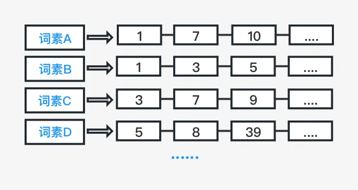

这里还存在一个问题，词素怎么得到的？如果从技术角度去看的话，在建立倒排索引之前，其实还有一步是文本分词。同样的，我们来对文本分词进行简单定义：

> **文本分词：将连续文本分隔为一串词素**

即形如下图的过程：

在得到了多个文档的分词结果后，我们才能构建倒排索引，得到以词素为key，value为有序文档id列表的数据结构。

这里依然还存在一个问题，分词库是怎么得到的？这一点不属于本文要讨论的范围内，我简单提及一下，其实一个基本能用的分词库并没有想象中那么复杂，结合到商业应用，其核心还是在于字典，以及与字典搭配的规则或者统计算法。事实上分词领域经过这么多年积累已经非常成熟了，各家信息处理产品的主要差距来源也不在这里。

在得到倒排索引之后，当然就是倒排求交了，我们来对倒排求交进行简单定义：

> **倒排求交：求多条有序倒排链的相同文档ID的过程**

即形如下图的过程：

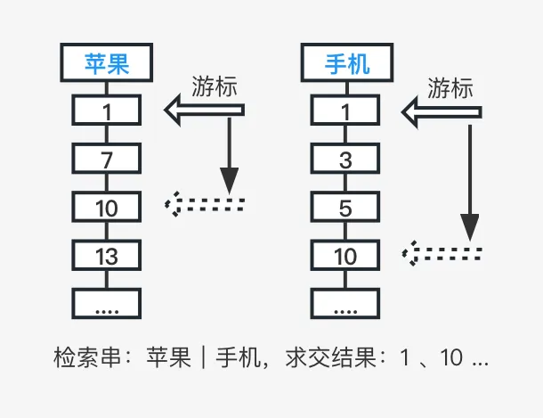

这里值得注意的是，(文档集的)文本分词与倒排索引的构建都是离线的过程，倒排求交是在线检索的过程。当然在实际检索过程中，检索引擎并不会直接把求交结果返回给用户，这里涉及到用户信息检索效率的问题，用户信息检索效率高则用户满意度会高，反之亦然。因此这里还存在一步文档排序，其目的是让相关度更高的结果优先触达用户，我们继续对文档排序进行简单定义：

> **文档排序：按多个维度特征拟合后的得分进行排序**

即形如下图的过程：

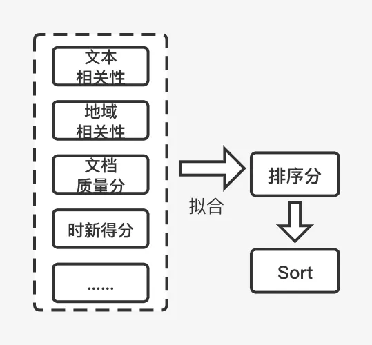

可能这就是大多数同学对搜索引擎的认识，我在20年4月份左右刚做搜索引擎时，对搜索引擎的认识就是这样子的。

### 视角1

我们来换一个视角，从技术与产品体验结合的一个视角来看待一下搜索引擎：

目前搜一搜大约有20+个垂搜品类，用户每次输入一个检索串来进行检索，检索结果最终展示在手机客户端屏幕中。 接下来，我们给整个过程加上数值度量：

从整个过程来看，搜索引擎完成的是，根据用户输入的Query，从一个百亿文档集合中，在700ms左右，选出来一屏4～6条展示给用户。

对我们的技术系统而言:

> 海量索引数据对应的是一个庞大复杂的离线数据处理系统 
> 而集合从百亿到个位数， 
> 裁剪数十亿倍的背后对应的是一个高扇出的在线检索架构

这里暗含了搜索引擎的几个关键字，第一个是**_海量数据_**，对应的是百亿级别的索引数据，第二个关键字是**_耗时_**，系统需要在一个较短的时间片内：700ms左右处理完整个检索过程，第三个关键字是**_效果_**，最终返回的头部结果需要尽可能满足用户需求。

### 视角2

我们再来切换一个视角，站在一个更高的一个商业角度来看（注：此视角源自本人视角，请辩证看待）：其实搜索引擎并不是一个纯粹的技术实现，它内部其实是由技术，内容，商业这个三角关系构成：

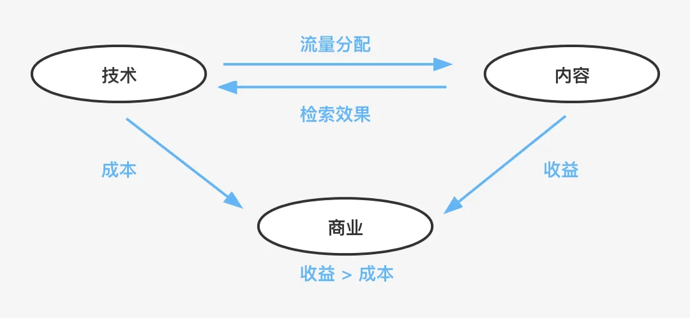

当然，这里我们主要还是以技术作为切入点来看，首先是技术与内容的关系：内容协同。

#### 内容协同

技术系统与内容生态其实存在一个循环，要么给双方带来正向价值，要么给双方带来负向价值。 （注：搜一搜内展现的生态内容，均有各自的流量主战场）

##### 流量分配

  * 技术实现将影响流量分配，流量分配将影响内容生态的构建  

技术实现是同样会直接影响到内容的流量分配的，而流量分配的机制最终会影响到内容生态的构建，比如内容丰富度，内容质量，原创激励，新号成长等等，道理也很简单，因为获取不到流量激励的创作生态是一定会萎靡掉的。

##### 检索效果

  * 内容生态的丰富度和质量将决定技术实现的检索结果的效果上界  

内容本身也会反过来影响技术系统的检索效果，内容生态的丰富度和质量其实会决定技术实现的检索效果的天花板  

  * 内容生产和消费环节中的用户“主动标注”信息将极大帮助技术实现提升效果  

在内容的生产和消费环节中，用户的一些标注行为的信息，是可以极大的帮助技术实现提升效果。  

这里说一个小体会，如果阁下同时用过视频号和抖音发视频的话，可能会有与本人相同的感受：抖音在内容生产发布环节对于用户的一些标注行为的引导和运营，应该是比视频号要丰富的。

#### 商业成功

商业成功无非就是收益>成本，而技术实现是直接影响到商业成本的

  * 成本  
成本方面，技术实现的方案会决定整个系统需要的**机器资源成本**和**人力成本**（迭代/维护）  

  * 收益  
收益方面，技术主要是通过与内容协同带来价值，一方面内容本身是数字资产，另一方面，内容生态将直接影响用户流量

在这个视角里面，其实引出了搜索引擎在开发设计过程中的最后一个关键点，也就是**_成本_**。

目前为止，我们收集齐了搜索引擎的4个关键字：**_海量数据，耗时，效果，成本_**，接下来，我们来看一下当前架构

> 可能有同学要怀疑是不是走错片场了，请不要着急，对于一款商业产品，技术实现从来都不是与业务（商业）脱离，而是顺应业务（商业）产生的，只有理解了业务（商业）逻辑后，才能对技术实现的考量与演进有足够的掌控。

## 当前设计

这是搜一搜从离线到在线的整条数据流处理流程：

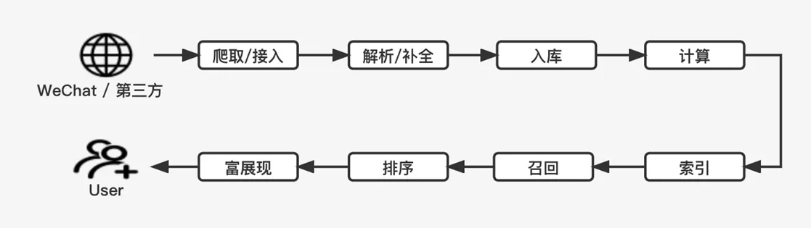

**数据整体是从生态内接入，流向离线系统，经过离线处理后，流向在线系统，经过检索，最终流向用户。**

整个链条从头至尾的大致经过以下环节：

> 1. 爬取/接入
> 目前主要是微信生态内的内容，如小程序，公众号，视频号的内容，也包含第三方平台合作推送过来的内容。
> 2. 解析补全
> 针对不同来源，不同形态（如视频，图文消息，网页内容）执行对应的数据解析和字段信息的补全
> 3. 入库
> 持久化存储
> 4. 计算
> 对文档进行各个维度的特征计算，例如基础分词，实体挖掘，以及一些数值特征的生成，比如文档质量分，这些特征的计算其实都是有数据流程来管理的
> 5. 索引
> 计算完毕这些特征之后，就可以进入到我们的索引阶段，生成倒排，正排索引文件，然后推送给线上
> 6. 召回
> 常规理解的倒排求交过程
> 7. 排序
> 常规理解的文档排序过程
> 8. 富展现
> 针对产品形态进行样式组织和内容填充

整体看，这条数据流程似乎并不长，实际上这里的每一个环节都代表一个系统，内部又有多个处理环节或者流程，以排序为例，目前搜一搜线上就分为5层排序。

这里要说明一下：**本文档的内容基本集中在在线检索部分**，也就是【召回->排序->富展现】部分，但是为了整个文档内容的完整度，我会用少量篇幅来简要介绍下离线部分。 （注：本人的工作集中在在线检索部分，离线部分由其他同事负责）

### 离线处理

可能跟大家预想的不一样，其实搜索引擎在工程层面的挑战更多是在离线数据管理，而不是在在线检索阶段。因为这部分的工作**主要是由其它同学在负责**，我们只简单过下离线面对的一些挑战:

  * 存储 
在线仅索引百亿的前提下，离线存储已大幅超过百亿，是索引量的数倍

  * IO 
由于频繁刷写文档特征和扫描文档构建索引的需要，叠加海量数据的因素，对底层存储有着巨大的IO压力冲击

  * 计算 
大量的文档特征计算流程，实时和批量两种场景，如何将混乱分散的计算逻辑收拢管理，算子如何复用，资源如何调配都需要对应的系统建设

  * 诊断
文档从接入到上线的链路非常长，链路中每个节点的失败或者运行异常都可能导致文档最终无法检索到，当一条数据出现问题的时候如何快速定位也是非常有挑战的一点

上面这些问题，对应到离线的整个工程架构里，都有对应的回答。比如应对存储，底层有多种技术选型，如wbt，cos等；应对IO，有数据的冷热分离，有次级索引的访问形式等；应对计算，有用于管理计算特征的子系统；应对诊断，有基于文档ID查询的全链路日志跟踪系统。

整个离线工程建设的基础标准是**有条不紊和滴水不漏**，在此之上，面对实时场景，需要确保整个数据流的时效性，面对批量场景，需要确保整个数据流的成本开销和流程稳定性。 关于离线的详细设计和考量我们就不展开了，我们沿着数据流动的方向继续往下走。

### 数据上线

离线是数据的加工厂，搜索引擎在离线处理好的数据，最终都要流向在线，影响在线的召回和排序。 离线生产出来的数据，从数据类型上主要分为3类：

> 第一类是索引数据(批量与实时)，特点是超大规模的数据量  
> 
> 第二类是静态数据(高频与低频)，主要是一些小规模文件集  
> 
> 第三类是排序需要的特征数据(批量与实时)，它的特点是需要提供在线的低时延的远程访问

针对不同的数据特点，**基于有序和可控管理的需要**，内部开发和选用了不同的数据上线系统：

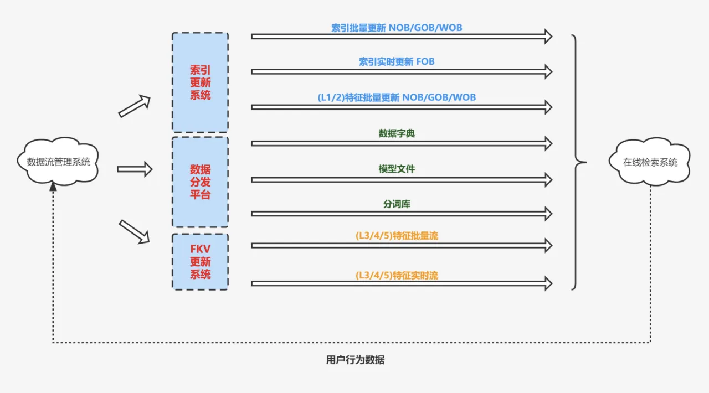

数据上线系统并不是单纯的作为一个数据中转站，而是用于提供数据的版本管理，校验，灰度，回退等控制能力，也因此，数据量越庞大，对数据上线系统的挑战会越高，即图里的索引更新系统，不过其不属于本文的重点，我们不进行展开。

##### 数据回路

离线生产出来的数据，最后会流向到用户这里，用户是数据流的终点站。巧妙的是，用户又是数据流的其中一个起始站，因此这里存在一条数据回路，用户的行为数据，又会回流到我们的数据流系统中，参与到特征/模型的生成，进而影响后续在线系统的召回和排序，这是工业搜索引擎中数据流里**最重要的一环**。

### 业务架构

经历完数据上线中转站后，数据终于流入了在线检索系统。搜一搜是一个具备多个搜索垂类的综合搜索引擎，每个搜索垂类采用独立部署的形式，最终形成了如下图所示的业务架构（模糊处理后）：

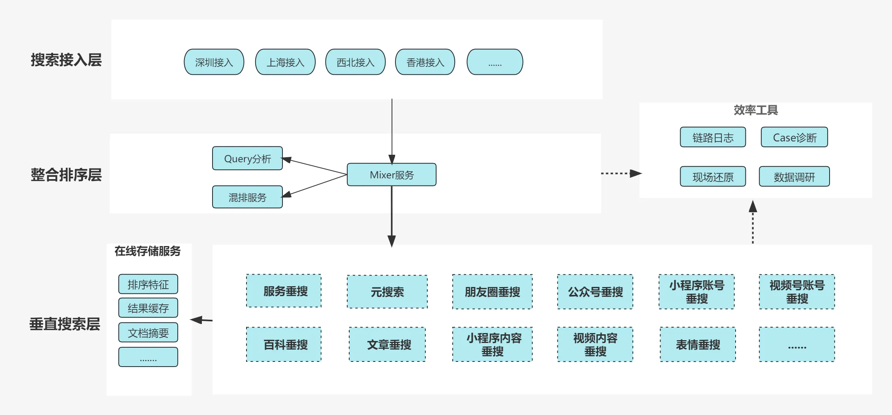

  * 搜索接入层 
搜索接入层采用的多idc部署的方式，在架构上主要负责将就近接入的请求走公司的骨干网，转发到上海idc，目前搜一搜的核心服务基本部署在上海idc中  

  * 整合排序层 
整合排序层负责对下游多个垂直搜索引擎返回的异构文档进行Box粒度的综合排序，并作为最终结果返回给用户

  * 垂直搜索层 
垂直搜索层是作为在线部分的最底层，资源密集型服务，负责完成一个垂直品类的文档的索引，召回，粗排和精排等过程，目前搜一搜内部存在20多个细分垂搜。  
另一方面，对于大型垂搜业务，往往会部署多个召回集群。即对在线召回而言，同样是会对索引进行分层的，分层的维度有多种，比如根据数据的质量，根据数据的时新度（简单理解就是文档发布时间）针对这两种维度，我们有GOB，WOB，FOB 3种集群。

<table class="cherry-table"><thead><tr><th>名词</th><th>定义</th><th>集群定位</th></tr></thead><tbody><tr><td>GOB</td><td>优质文档集群</td><td>作为业务召回的主集群</td></tr><tr><td>WOB</td><td>中长尾文档集群</td><td>作为业务补召回的附属集群</td></tr><tr><td>FOB</td><td>时新文档集群</td><td>时新数据召回集群</td></tr></tbody></table>

> 集群的划分维度可以很灵活，以上3类集群是按照明显的数据特点进行划分，实际在业务中，其也可能根据自身业务存在的效果/运维问题划立新集群。  

平台对于不同的集群有不同的设计原则：  

对于GOB集群，其特点为单机装载数据量较小&优质，采用内存搜索引擎，纯算力调度模型，单位算力（CPU）下性价比高，引擎的设计重点是提供丰富多样的召回特性/策略，满足业务对召回结果的精度和多样性需求  

对于WOB集群，其特点为单机装载数据量大，采用磁盘搜索引擎，异构资源调度模型，单位算力（CPU）下性价比低，引擎的设计重点是性能优化，以最优的成本满足业务补召回的需求  

性价比：单位算力下可处理的文档数量 （处理文档数 / 单位算力），该值越高，表示性价比越高  

该值反映的是系统处理一篇文档所需要消耗的框架层算力的多少，性价比越高，则框架层消耗越少  
磁盘搜索引擎受限于磁盘(低速设备)，需要协调CPU进行资源平衡(例如可能花费更多CPU在内存管理，数据解压上)，因此性价比低，亦即同样召回100篇文档，CPU的消耗比内存引擎更大

这里需要注意的一点是，从整合排序层到垂直搜索层，是有一层流量扇出的：整合排序层的一个请求，到垂直搜索层，最多会被扩散成20多个请求，这里是综合搜索引擎的第一
层流量扇出。

直到这里，我们还只是在介绍一个在线检索系统的业务架构，依然没涉及搜索引擎是如何在海量数据的一个背景下，解决效果、耗时、成本问题的。

### 检索链路

我们对在线的业务架构进行抽丝剥茧之后，可以得到在线检索的链路主干： 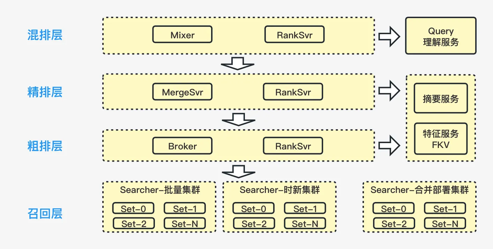

  * 混排层 
在架构上负责L5的排序，也就是针对针对异构资源进行排序  

  * 精排层 
在架构上负责L4的排序，针对单一类别文档的精排  

  * 粗排层 
在架构上负责L3的排序，针对单一类别文档的排序，但是粗排的定义是包含L1/L2/L3打分的，只是在架构实现上，L1和L2打分被放集成到了召回层  

  * 召回层 
架构上负责了文档的召回，l1和l2打分

<table class="cherry-table"><thead><tr><th>名词</th><th>定义</th></tr></thead><tbody><tr><td>L1排序</td><td>单个数据set内的粗排，无pos offset信息，只有命中域信息，目标是降低L2层计算压力，输入为单个doc</td></tr><tr><td>L2排序</td><td>单个数据set内的粗排，含pos offset信息，输入为单个doc</td></tr><tr><td>L3排序</td><td>粗排，集群多个数据set的结果混合后排序，输入为doc list</td></tr><tr><td>L4排序</td><td>精排，输入为doc list</td></tr><tr><td>L5排序</td><td>混排，针对异构资源进行排序，输入为各垂搜doc list</td></tr></tbody></table>

在前面的内容中提到过混排层到精排层（或者粗排层，部分业务没有精排层）有一层流量扇出的，最多会扩散20多倍，而粗排层到召回层，流量将再次大比例扇出，由于单机无法装载全量索引数据，召回层的服务均采用byset的部署模式（扇出比例为set数量）。 对于一些大型的垂直业务来说，它的set数超过40，也就是说从混排层到单个召回集群，请求量可能扩散接近1千倍，而大型的垂直业务一般还会分多个召回集群，如果把各个召回集群的流量累加起来的话，混排层到单个业务的召回层，流量会扩散**数千倍**。由于召回层是数据服务，因此召回层流量扩散越多，其处理的文档量也就会越大。

从另一个角度来看，整个链路越靠近底层，处理的文档量越多，而越靠近用户，处理的文档量则越少。

### 处理模型

如果我们继续对在线链路主干进行抽丝剥茧，可以引出搜索引擎的本质：

> 在线搜索系统是对效果，耗时，算力（成本）进行权衡设计之后的一个信息处理模型，并且整个系统是一个漏斗模型。

#### 漏斗模型

按从底向上的视角，从整个过程来看，在离线阶段我们会对全量文档做一次L0（主要为质量分，query无关）排序，这个排序会决定一个文档在倒排链中的位置，越优质的越靠前，保证它会被优先召回，L0排序的结果经历了在线召回之后，最终会依次经历L1到L5共5层排序，得到最终的排序结果，这5层排序，**越往下走，排序逻辑越重，但是参与的文档数量越少，单篇文档的处理耗时越高，且对效果的影响越大（因为越靠近用户）**

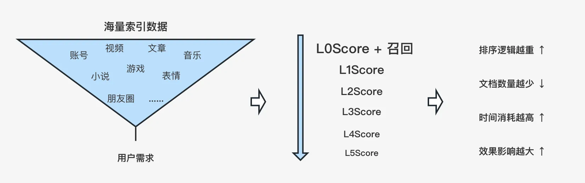

对应到技术实现：

  * 每一层都有截断控制 
从召回开始，以及后面的每一层排序都有截断控制，截断通常有2个维度：一是耗时，二是篇数，截断带来的影响是误差，整个检索过程就是在一定误差范围内以低成本的方式来找出相对优质的结果  

  * 文档的特征计算分层 
排序特征的计算需要分层，对于计算量大的精细特征或者模型调用，需要尽可能放到靠后的排序层来完成

#### 问题环节

**问题1：既然L5Score最重要，那是不是只要把L5Score做好了就行？**

> 当然不是的，每一层排序都会有自己的效果上界，L5Score的效果上界由L4Score的输出结果决定，
同理L4Score由L3Score决定，L3由L2... 以此类推

**问题2：L0Score的效果上界是由谁来决定的？**

> 这个问题很有趣，L0Score再往上已经没有策略排序了。
但其实在认识搜索部分已经给出过观点，由微信的内容生态决定

**问题3：越底层排序逻辑就越轻量，可以理解为成本就比效果更重要吗？**

> 并不是越底层，为了控制成本，就要以成本优先，牺牲掉部分效果。
效果是作为搜索引擎基础体验的重要组成部分，对于效果的考虑，在整个搜索引擎架构里都是贯穿始终的，只是说对于底层和上层，解决效果的思路是不一样的。
越靠近底层，对于效果的解决思路，会越侧重通过数量来解决效果问题。
例如在固定返回篇数的前提下，理论上输入数量的越多，满足用户需求的文档量占比也会越多

**问题4：为什么越靠近底层越侧重通过数量解决效果问题？**

> 漏斗的开口问题，漏斗的开口，决定了整个引擎的初始效果上界，如果一篇文档都没机会出现，那不管漏斗的每一层滤网有多精细都解决不了问题。

#### 三角权衡

另一方面，整个系统是对效果，耗时，算力（成本）的权衡设计，理论上三者互相制约，无法同时达成三个目标：

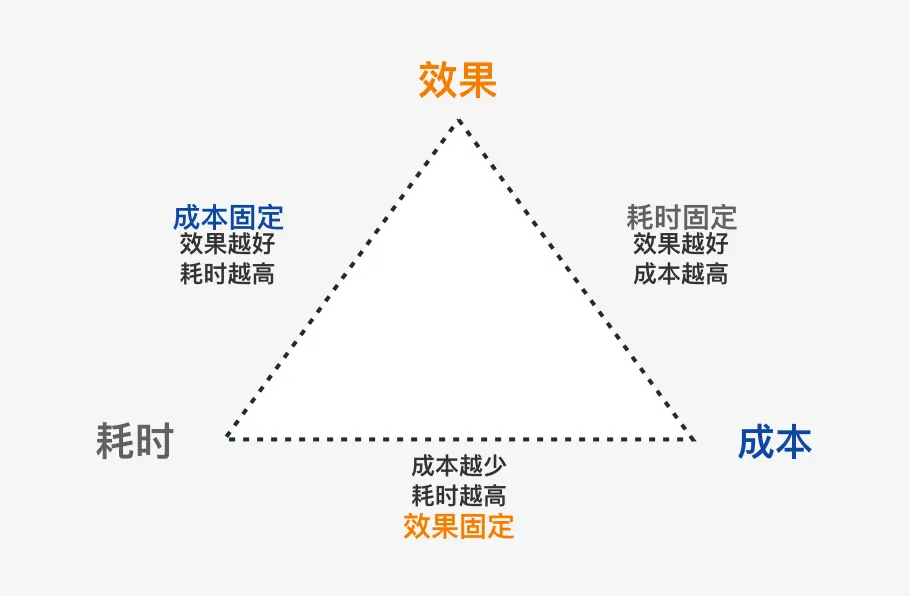

对工程系统而言，成本与耗时是很直观的量化指标，而效果的量化则是**保持当前搜索体验下所需要计算复杂度和计算篇数**。三角权衡虽然看似互相制约，但只是在理论上给出了三者的关系，实际上，我们至少可以从三个角度去同时达成三个目标

  * Cache机制 
Cache是常用&立竿见影的手段，通过Cache降低底层请求的频次，可在保持高计算复杂度的情况下仍然控制住最终成本。不过搜索引擎场景中的Cache机制建设会面对更多的挑战，例如时效性Query的判别，底层的排序实验，用户的地域信息，个性化信息等等  

  * 控制下发 
通过提升Query意图识别的精度，在混排层，可进一步提升垂搜请求下发的控制粒度，降低从混排层到召回层整体的流量扇出倍数 
在召回层，则可以通过数据分层和差异化的检索策略，控制不同集群的检索频次/检索条件，降低召回层的整体算力消耗  

  * 数据下沉 
用户的搜索词和点击数据并不仅限于上层排序使用，在积累足够多的检索数据后，可以将其应用在离线的倒排索引阶段，丰富相关文档的索引项，配合检索策略提升在线召回的精度，减少无效召回结果（正常检索过程中将被漏斗过滤的结果），进而减少系统的计算量。 
在积累足够多的检索数据后，在基础分词之上，可以扩展多个粒度的NGram索引，以NGram索引解决文本相关性问题，本质为将相关性打分逻辑下沉到离线的倒排索引阶段来实现，提升召回精度的同时，减少在线计算的复杂度。  
以上是搜索引擎中最具性价比的方式：用最简单的方法（倒排索引）和最低的成本来解决召回结果相关性问题，也是我们长期对于整个在线检索系统能控制住最终成本的信心来源

接下来我们进入漏斗模型的顶层，这里是在线检索系统资源使用最密集的地方，也是本人的工作范围，在架构上对应为架构中的粗排层和召回层。

### 垂搜架构

完整的垂搜架构包含了离线和在线两部分：

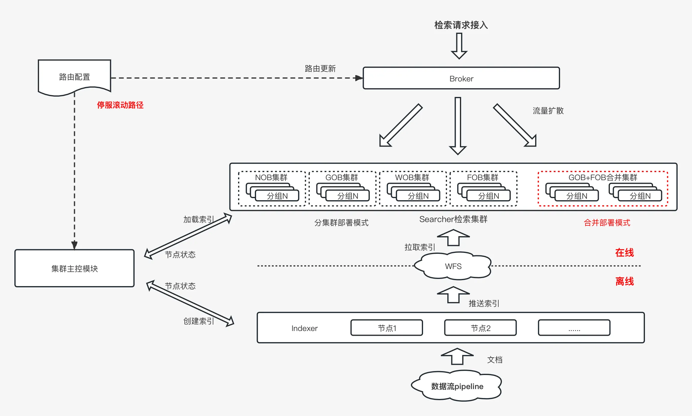

离线方面主要是：通过indexer（索引构建单元）构建索引库，再将索引库推送到wfs（微信内部分布式文件系统），最后通过索引更新系统将索引文件更新到线上集群

在线部分主要由检索接入层和召回集群两部分构成，检索接入层（习惯称为Broker），架构上对应前文中的粗排层，负责L3的排序；召回集群对应的是前文中的召回层（习惯称为Searcher），负责召回以及l1和l2打分

在垂搜架构中，一个业务的召回集群是可能有多个的，比如存放中长尾数据的wob-磁盘集群，存放优质数的gob-内存集群，存放时新数据的fob-实时集群等。但一个业务的召回集群越多，运维成本会线性增加，接入层的扇出流量也会同比增加。因此在架构层面，我们主要基于以下两点来设计：

  * 支持多集群合并部署的能力  
它的优势很明显，一方面是可以让资源的利用更加充分，在机器成本上更优  
另一方面，是可以降低业务的部署和维护成本，人力成本更优，适合搜一搜垂搜数量很多，但是大部分体量都比较小的业务情况。  

  * 基于大规格实例设计  
目前的召回集群整体都是基于大规格实例来进行设计的，前文提到过，接入层（broker）到召回层有一层流量扇出，基于大规格实例设计可以控制每个集群的set总数，从而有效控制接入层的单机扇出流量。

#### 问题环节

**问题 1 为什么要控制单机扇出流量？**

> 这个问题其实属于传统工程问题，主要是两方面的因素：
1 控制单机扇出流量的网卡带宽占用，接入层到召回层的单个请求包目前分布在几kb到几十kb之间，后续还有变大的可能。 
2 避开文件数量限制不谈，扇出越大，网络连接数越多，内核要处理的中断数量也将越多，在单机层面可能出现性能瓶颈

### 检索流程

尽管垂搜架构上的链路模块并不多，但是整个检索流程的链条却很长，从检索接入层收到请求，一直到检索接入层回包给调用模块，需要经历十几个处理阶段：

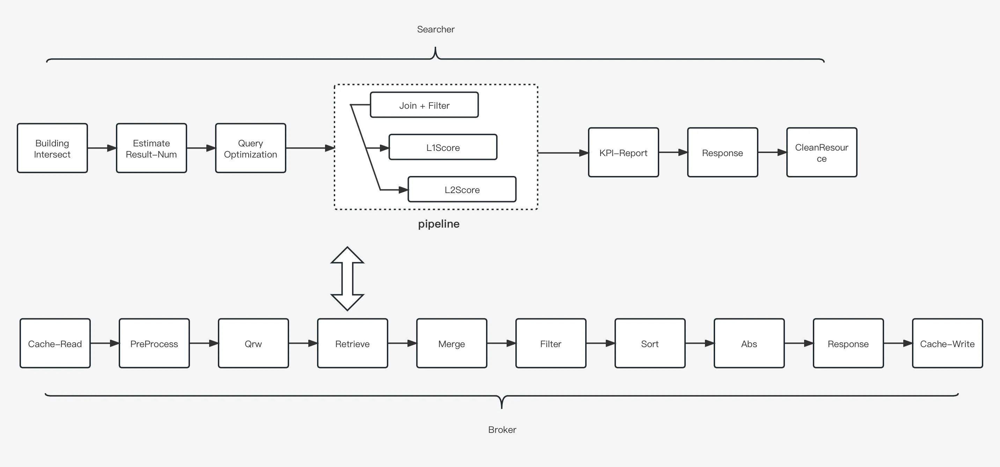

由于流程数量较多，这里挑出部分关键环节进行解释：

<table class="cherry-table"><thead><tr><th>环节</th><th>说明</th></tr></thead><tbody><tr><td>【Broker】Qrw</td><td>根据Query处理信息生成检索条件</td></tr><tr><td>【Broker】Retrieve</td><td>处理所有召回队列的召回逻辑</td></tr><tr><td>【Broker】Merge</td><td>处理所有召回队列的结果融合</td></tr><tr><td>【Broker】Filter</td><td>融合召回结果集过滤处理</td></tr><tr><td>【Searcher】Building Intersect</td><td>根据检索条件构建求交器</td></tr><tr><td>【Searcher】Join + Filter</td><td>负责语法树召回 + 文档筛选（业务自定义）</td></tr><tr><td>【Searcher】KPI-Report</td><td>生成和上报【各项检索指标、调试诊断信息】</td></tr></tbody></table>

> 关于求交器，求交器负责完成对应检索语法的召回逻辑，其实现方式有多种，在数据结构方面，常见的有树结构和DAG，在求交算法方面的做法则更多。每种求交器其实各有优劣，但是求交器其实可以做到互相结合，实现取众人之长，相关内容可以做非常详细的讨论，具体不在此展开  

关于pipeline，可以看到join，和l1、l2打分在图中是并行运行的模式，而常规的设计其实是串行执行，并行运行相比串行执行可以更充分利用CPU。  

##### 双打分流程

Join + Filter的设计是为了支持业务对求交结果进行筛选，以提升求交精度（如提升求交深度，召回多样性等等），在传统的设计中，召回完成后，会直接进行含pos off set信息的粗排打分，但是在Searcher内部我们采用了双打分流程的设计。引擎在Join环节存在Filter的同时，还引入了一次额外的L1Score，目的是进一步降低L2Score的进入篇数，降低检索集群的整体资源消耗，从目前线上资源的消耗情况来看，这一点的确为我们带来了收益。

#### 问题环节

**问题 1 为什么这里的双打分流程设计是一个有收益的设计？**

> 单篇文档的JoinScore打分逻辑和L2打分的逻辑的算力消耗，在我们的核心业务里相差百倍以上，这里存在一个性能消耗的跳变
因此我们在Join阶段存在Filter的前提下，还额外引入了L1打分，希望能借多一次排序来平滑一下各个阶段的算力消耗占比
另一方面，引入的L1Score与Join-Filter和L2Score在运行环境上是具有一定的区分度的。
Join-Filter是用来筛选召回文档的，与求交过程耦合，逻辑不能太重，L2Score可以取到文档的pos offset信息。
而引入L1Score可访问到的信息虽然与Join-Filter一致，但不耦合求交过程，与L2Score相比则访问不了pos offset信息，相对更轻量

**问题 2 既然增加一层L1Score能带来收益，那为什么不是排序过程越多越好？**

> 有3方面的原因：
1 新引入的排序流程在运行环境（输入）上可能没有区分度，也不存在性能跳变的情况，即必要性不足
2 每引入一层排序会增加软件开发的复杂度，排序特征的分层也不是那么容易的
3 每引入一层排序会增加策略在效果调试，以及对排序问题进行分析定位的复杂度

**问题 3 造成核心检索链路中的L1-L5多达5层排序的原因是什么？**

> 按照常规理解，就是粗排，精排，混排，而现在线上却多达5层排序。
在问题1中我们已经清楚了，在召回层我们额外引入了一次L1打分，另外多出来的一层打分其实是跟着业务发展的需要演变而来的。
系统的召回和排序的复杂度越来越高时，有两种做法，一种是继续横向扩展，增加每一层的复杂度，另一种是纵向扩展，增加一层来承载复杂度。
横向扩展需要良好的代码框架和实现来支持，纵向扩展则相对简单，但是运维和架构复杂度就上去了。
在非极端情况下，很难预先判断两种方式的优劣，只能通过结果来看，看是否良好的解决了问题。

### 微观串联

Searcher即传统意义上的检索引擎，拨开处理流程，进入其内部，从微观层面来看，Searcher的核心由以下部分组成：

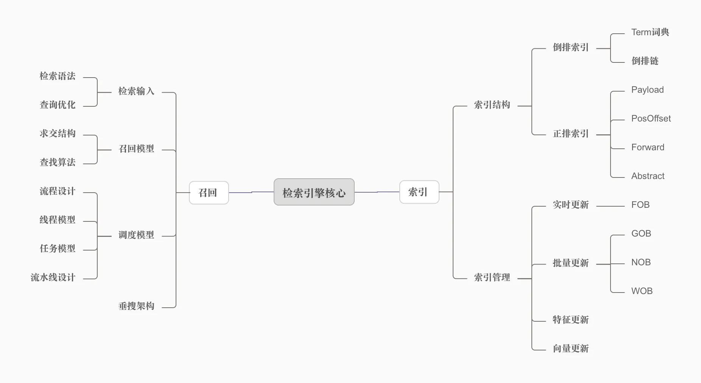

> 注 1：这里的FOB/GOB/NOB/WOB等指的是索引装载/卸载/更新等能力，与垂搜架构中的集群含义不同。  

注 2: 压缩/解压算法也是检索引擎的重要组成部分，由于其选取与实现和索引结构强相关，因此未单独拎出来

整体包含的内容比较多，本文只看搜索引擎最基本的元素，即索引结构与调度模型中的流程设计，只要具备了索引结构和检索流程两部分内容，引擎基本可以work了。

#### 六要素

不论索引结构如何改变，其核心依然是以下六类数据：

  * Term词典  
提供Term到Term对应倒排链位置的查询功能，常规实现如hash map，二分查找(有序数组)

  * 倒排索引  
保存Term->文档id列表数据，通常实现为有序数组，实际上可以有多种实现形式

  * Payload  
Term或者文档的有效载荷，即每个Term/文档携带的额外数据，例如Term Payload通常存放Term对应文档的权重，Doc Payload则是文档的特征数据，定位是召回阶段可用的特征数据

  * Forward  
文档正排数据，定位为存放文档在粗排打分阶段时需要访问的特征数据

  * PosOffset  
各个Term在文档中各个域的精确位置偏移信息(原则上Pos数据也属于正排数据，同样是需要在粗排打分阶段才可访问)

  * Abstract  
文档摘要数据，通常用于存放文档富展现数据

了解完基础概念后，我们再来看下每类数据在检索引擎中的功能定位，引擎的检索流程的设计正是基于各项功能之上，进行组合得到的：

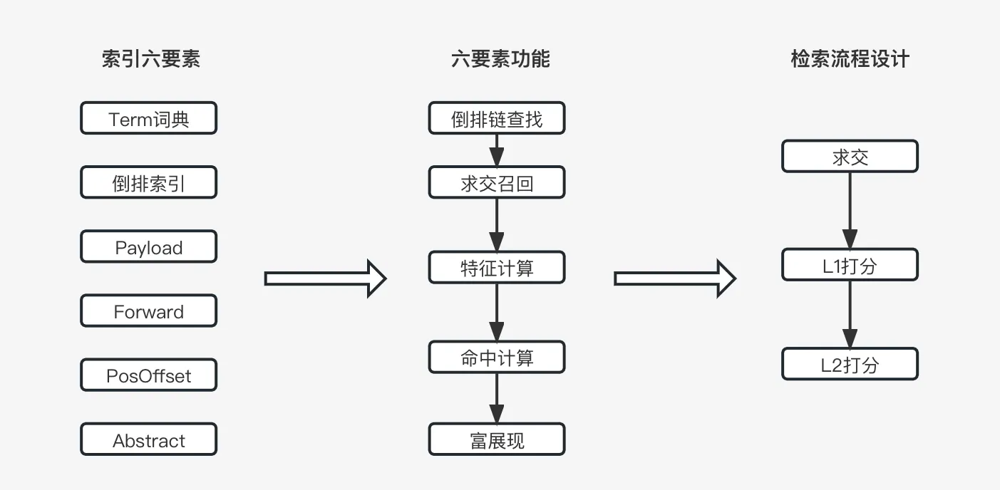

Payload与Forward虽然定位都是存储文档的特征数据，但是Payload在求交和L1打分阶段就可访问到，而Forward需要等待到L2打分阶段才可访问到。

在流程设计之上，基于各阶段算力分配的需求，会引出引擎内部的线程资源如何分配的问题，再往精细化考虑，考虑长尾请求的处理及长尾耗时的控制，基于对算力分配优先级的需要，会引出引擎的任务模型，在此基础上，考虑多核机器算力的充分运用，可以引出引擎的流水线设计。引擎核心的各个部分并非是独立的，而是环环相扣，不断延伸。

> 六要素反应的其实是索引格式设计通用准则中(自创/非权威说法)的第一条：  
1 索引格式设计应契合在线检索流程  
其余两条分别为：  
2 索引格式设计应考虑打分需求  
3 索引格式设计应考虑访存效率(TLB Miss & Cache Locatity & IO)

#### 问题环节

**问题 1 本质上Payload，Forward，Abstract等数据都可以理解为是文档的正排信息，为什么索引结构要对它们进行区分？**

> 理解了这个问题基本也就理解了索引结构设计的要领了。我们从两个方面来看：
1 机器的高速存储设备资源是昂贵且有限的（这简直像是句废话！）
2 不同的检索阶段，对于数据的访问频率是不一样的
我们会倾向把访问频率高的数据放在内存中，而访问频率低的数据则放在磁盘。
问题是什么样的数据访问频率会高呢？
这一点需要回到检索流程设计中来，求交阶段需要访问的数据是最多的，L1其次，L2最次，而检索流程之上的摘要填充环节对比之下就更加低频了。
因此索引结构的设计其实是顺应检索流程产生的，我们对于需要在求交和L1打分阶段中需要访问的数据以Payload来进行命名和区域存储，Forward与Abstract同理。

**问题 2 Forward索引与PosOffset索引均是在L2打分阶段才可使用，在索引存储上应该如何考虑？**

> 我们从两方面来看：
1 在机器内存吃紧时，它们是下放在磁盘中的优先选择
2 存储时应该保证它们是连续存储的，不论是在磁盘中还是内存中，由于局部性原理，对于需要一并访问的数据连续存储都可以节省IO。

**问题 3 结合问题1的结论，对于索引结构中的压缩/解压算法的技术选型有什么启示？**

> 对于压缩/解压算法的技术选型无非是从两方面去看待：压缩率和解压效率。
对于访问频率越高的数据，应该越侧重解压效率，甚至是直接不压缩，而访问频率越低的数据，则可以更侧重压缩率。
但是在如今的硬件规格中，低速设备的存储容量（对于检索引擎场景）根本不是问题。
因此在实操中，我们对于访问频率低的数据，同样会采用侧重解压效率的算法，以节省CPU开销。

> 在讨论压缩算法前，需要明确两点认识：  
1 压缩是时间换空间的行为，即以CPU换取存储（内存/磁盘），不限于容量，也包括带宽  
2 压缩是为了提升单机装载容量，但是单机装载容量越高，效果层面对于召回/打分篇数的数量需求也越高，即压缩后对CPU的诉求会增多  

综上，我们认为压缩属于正向收益的基础是：  
1 系统内存不足但是CPU富余(内存瓶颈)  
2 从硬件成本上内存比CPU更贵  

结合目前搜一搜在召回层的现状：  
1 目前主流业务的召回服务CPU负载超过60%（其中打分库L2Score消耗较高，占据了服务绝大部分CPU消耗），没有太多时间换空间的余量  
2 目前的硬件成本计价主要以CPU为主  

因此对于内存搜索引擎，结合其作为召回主集群(GOB)的定位，我们认为其不值得使用复杂的压缩算法  
而对于磁盘搜索引擎，结合其作为补召回集群(WOB)的定位，以及受限于磁盘IO的限制，我们认为其可以使用一般复杂度的压缩算法

## 未来方向

站在工程角度，引擎在微观实现和宏观架构方面均还有很大提升空间。 在微观实现层面，主要是功能支持与性能优化方面，相关内容不易理解，本文暂且略过。
在宏观架构层面，引擎后续优化的方向主要是以下两方面：

  * 降低检索集群成本  
降低机器资源成本，**且降低业务运维成本**，在前面的内容中，我们提到过存在多个角度去达成效果，耗时与成本三个目标，但里面的成本仅代表机器成本。如果业务盈利
不足的话，商业成功的充分条件将变成降低人力成本，不论这点是否成为必须，工程的演进方向都必须为此考虑  

  * 增加弹性伸缩能力  
目前检索集群的每个实例冷启动时需要拉取大量的索引库文件，并初始化较多的信息到共享内存中，导致服务扩容缓慢（视频业务超过十分钟，而图文业务达到小时级别），进而
导致了架构上的安全风险

本文接下来的内容将针对这两点进行一些**可能**的可行性方向探讨。

#### 被盖风头的磁盘

在介绍具体的架构优化方向前，我们需要先了解一下当前计算机硬件方面的情况，硬件的更新迭代，在降低软件设计复杂度的同时，也会为软件设计带来新的思路。

环顾近10年来计算机硬件的发展，磁盘才是近10年来计算机硬件发展的主角，可能是因为挖矿和人工智能太热而被显卡盖过了风头。(__日常的人工智能黑)

> 近十年来CPU方面虽然制作工艺越来越好了，算力每次都有一定比例的提升，平均功耗也降低了，但是和内存一样，在技术上并没有大的突破。

目前市面上的磁盘主要分为：机械硬盘，SATA固态，M2固态，由于检索引擎内存在大量IO操作，在磁盘容量上通常不会是瓶颈，因此我们从带宽，随机读IOPS，延迟
3方面来对它们进行简单对比：

<table class="cherry-table"><thead><tr><th>磁盘</th><th>带宽</th><th>随机读IOPS</th><th>延迟</th></tr></thead><tbody><tr><td>机械硬盘</td><td>200MB/s</td><td>100</td><td>10ms+</td></tr><tr><td>SATA固态</td><td>600MB/s</td><td>12w+/s</td><td>0.1ms+</td></tr><tr><td>M2固态(PCIe3.0 x4)</td><td>4GB/s</td><td>40w+/s</td><td>80us+</td></tr></tbody></table>

需要说明的是，每种类型的磁盘都有不同的规格，例如机械硬盘常见的有7200rpm，10000rpm，15000rpm的，而M2固态同样有SLC，MLC，TLC，甚至QLC的，在PCIe协议支持方面也有差异。因此表格中的数据只能作为参考，不能作为精确数据看待。

从表格中的数据可以看出，M2固态对比SATA固态在带宽和随机读方面均有倍数提升，对比机械硬盘平均性能则在十倍级以上，但是其价格却相对低廉，具有广阔的企业应用场景。

目前的磁盘引擎还是基于10年前磁盘带宽和随机读性能瓶颈的设计思想进行设计的，如今继续沿用这种设计思想，将会出现戏剧化的一幕：CPU反而会先比磁盘到达瓶颈。

> 其实在近10年内，还出现过一位存储硬件角色：optane，intel推出的持久化内存。intel的工程师曾多次线下与我们交流过，向我们推销optane，但是由于其价格昂贵，每次我们都要找各种理由婉拒。后来也是因为不胜其烦了，就直接挑明，价格太高，如果能打平到M2固态硬盘的价格（这里确实有点夸张了，本意是想表达大幅度降低），那完全不愁卖。巧合的是，后续没过多久，intel就宣布完全终止optane业务了  

另一方面，其实机械硬盘在近10年来，价格一直在持续走低，当前平均1GB容量的价格相比10年前已经降低了80%+，如果有人要出去技术创业的话，倒是可以考虑存储产品，别去搞什么人工智能了（老毛病又犯了）  

#### 资源综合利用率低下

目前搜一搜的召回集群综合资源利用率较低，线上集群用满的只有CPU，而其它硬件基本被闲置了。

<table class="cherry-table"><thead><tr><th>集群现状</th><th>描述</th></tr></thead><tbody><tr><td>网卡资源浪费</td><td>目前万兆网卡下，网卡流量利用率不足2%</td></tr><tr><td>磁盘资源浪费</td><td>CPU先于磁盘性能到达瓶颈，磁盘集群的容量完全浪费（不足15%，2T/14T),带宽，IOPS浪费</td></tr><tr><td>内存资源浪费</td><td>内存集群仅容量利用率较高，但是内存带宽和IOPS均非常充裕</td></tr><tr><td>Set副本数多</td><td>目前线上集群单个Set的实例(副本)数较多（加剧了硬件资源的浪费）</td></tr><tr><td>CPU瓶颈</td><td>目前整个线上集群，在资源综合利用率方面，CPU已经成为了短板/瓶颈</td></tr></tbody></table>

> 注意：硬件资源一直闲着同样是浪费，与无效空跑并无区别，并不会因此结算的成本价格就降低，哪怕你说你省电了。

**由于引擎在微观和宏观架构上的一些设计**，线上集群当前的普遍问题为：CPU已经到达瓶颈，而其它硬件却基本空闲。接下来看我们如何优化这个问题。

#### 降低检索集群成本

业务在召回层对于效果的追求和投入超出了我们最开始的预想。在召回与粗排结合的设计下（即L1/L2打分放在了召回层引擎中），导致了两方面的问题：

> 1 目前主流业务中，粗排（L2打分）占用了召回集群大部分的CPU消耗，加剧了集群综合利用率低的问题  
>    
> 2 业务打分库变更频繁，稳定性偏差，且引用了很多非索引数据的数据流，各个业务的召回集群由对应业务同学维护，但业务对引擎的细节却并不了解。

我们稍作分析：

> 1 整个检索链路中，求交和L1打分位于最底层，处理的文档量最大，访存消耗最大，最具“IO密集型”的特点，而到达L2打分时，文档数已经降低一个数量级，L2打分更侧重计算。  
> 
> 2 另一方面，目前召回集群的网卡资源基本是完全浪费的

在这两点基础之上，我们可以将粗排迁移出召回集群。

##### 粗排迁移与集群托管

引擎在完成求交与L1打分后，通过RPC的形式将文档及其正排数据发送给粗排打分服务，释放召回集群的CPU。

另一方面，由于各业务L1打分逻辑相对简单，引擎可引入DSL来对L1打分逻辑进行通用化的指令支持，实现召回集群彻底解耦业务代码和业务数据，集群可由平台来统一托管。 最终实现如下图所示的流程： 

与老流程相比，新的设计具备以下两点优势：

  * 提升整体资源利用率  
粗排逻辑迁移后，有更多CPU可分配给求交过程，才可带来存储资源的更高效利用，更高的装载量和更少的副本数  

  * 降低检索集群运维总成本  
平台同学更懂平台，平台收归所有召回集群的统一管理和运维工作后，相比目前各个业务同学分散管理的情况，可大幅降低业务运维成本

#### 增加弹性伸缩能力

在上面的内容中提到过，目前的召回集群是基于大规格实例设计的，该设计有效控制了接入层到召回集群的扇出流量：

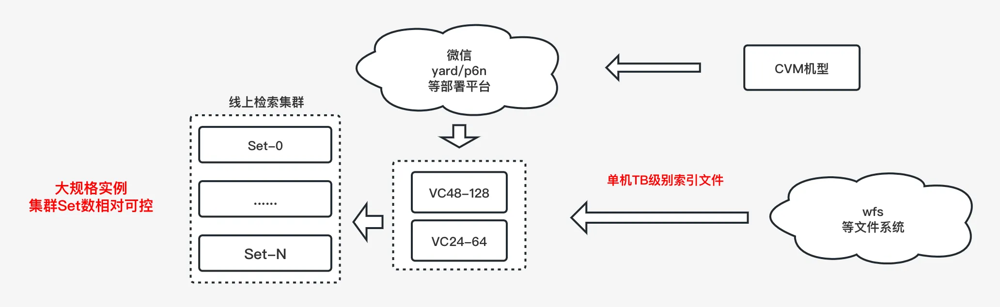

> 注：VC48-128指48核-128G内存的实例，VC24-64等同理

使用大规格实例设计似乎源自一种思维惯性：召回集群的数据量大，计算量大，理所当然应该使用高配大规格机器来部署。然而成也大规格实例，败也大规格实例，大规格实例的确为我们简化了在架构上的复杂度，却也带来了两方面问题：

  * 部署平台不友好  
与上云背景冲突，对部署平台来说，大规格实例的分配相对困难，且容易造成资源碎片，例如CPU分配完了，剩下内存和磁盘，或者内存用完了，剩下CPU  

  * 制约弹性伸缩  
大规格实例意味着大装载量，大装载量导致服务的冷启动时间将非常长，进而导致集群无法灵活扩缩容，也就意味着无法实现弹性伸缩

相对的，对于以上两个问题，采用小规格实例均可有效解决： 

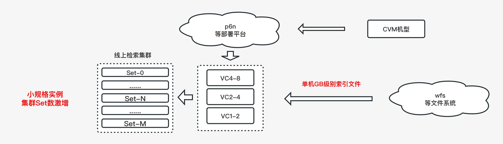

相比之下，小规格实例具备以下两点优势：

  * 优势1：小实例部署的模式对部署平台更友好  

  * 优势2：整个集群具备弹性伸缩能力在可用性方面更有保障

但是小规格实例并不是完美的，其也将带来新的问题：

  * 打分库内存占比增加  
在小规格实例设计中，由于每个实例的打分库内存占用固定，因此打分库的内存占比会提高，不过该问题可通过与粗排迁移联动解决  

  * 流量扇出倍数激增  
由于单机可装载的索引量大幅降低，部署的Set数将会大幅增加，接入层到检索集群的流量扇出将倍增，接入层可能成为瓶颈

在前面的内容中已经讨论过为何要控制单机扇出流量。但是对于扇出流量过大的问题，其实已经有成熟的做法：通过在调用链路上增加一级流量扇出层，可以有效解决接入层单机
扇出流量过大的问题。

在叠加粗排迁移和增加流量扇出层后，新的召回层的架构如下图所示：

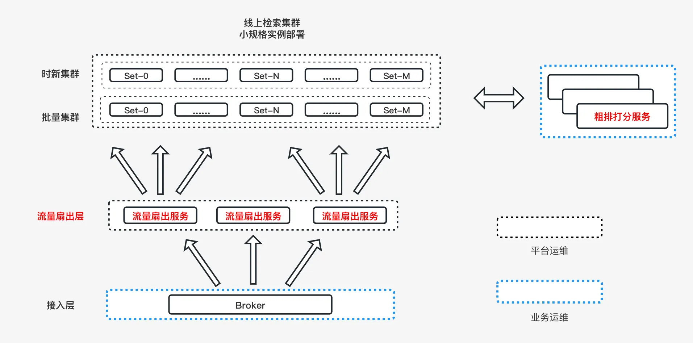

## 结语

二十年前，随着基础硬件的升级与完善，PC走进了千家万户，掌握了互联网终端技术与软件创意的人完成了互联网的开荒。

二十年后的今天，互联网软件已经覆盖了人类的方方面面，随着互联网软件设施的完善，面向C端的互联网再次上移，竞争来到了数据层面，分为了数据服务与内容消费，内容消费依然是由创意主宰，这是无数平凡人在这个行业中的机会，也是互联网仍具魅力的核心；而对科技公司而言，抛开产品层面，其竞争壁垒一定是数据和数据开采处理的技术体系，于我们处于平台型企业的互联网从业者而言，建立对信息处理的认识，同样是提升自我竞争力的一种形式。

本文虽然通篇在讲搜索引擎，但是理解搜索引擎并不是最终目的，建立和深化对信息处理的理解才是最终目的，既包含技术层面，也包含产品和商业层面。
