<!--BEGIN_DATA
{
    "create_date": "2021-01-09 23:50", 
    "modify_date": "2021-01-09 23:50", 
    "is_top": "0", 
    "summary": "内存管理设计精要", 
    "tags": "系统", 
    "file_name": "内存管理设计精要.md"
}
END_DATA-->

#### <p>原文出处：<a href='https://draven.co/system-design-memory-management/' target='blank'>内存管理设计精要</a></p>

> 系统设计精要是一系列深入研究系统设计方法的系列文章，文中不仅会分析系统设计的理论，还会分析多个实际场景下的具体实现。这是一个季更或者半年更的系列，如果你有想要了解的问题，可以在文章下面留言。

持久存储的磁盘在今天已经不是稀缺的资源了，但是 CPU 和内存仍然是相对比较昂贵的资源，作者在 [调度系统设计精要](https://draveness.me/system-design-scheduler/) 中曾经介绍操作系统和编程语言对 CPU 资源的调度策略和原理，本文将会介绍计算机中常见的另一个稀缺资源 — 内存，是如何管理的。


**图 1 - 内存系统设计精要**

内存管理系统和模块在操作系统以及编程语言中都占有着重要的地位，任何资源的使用都离不开申请和释放两个动作，内存管理中的两个重要过程就是内存分配和垃圾回收，内存管理系统如何利用有限的内存资源为尽可能多的程序或者模块提供服务是它的核心目标。

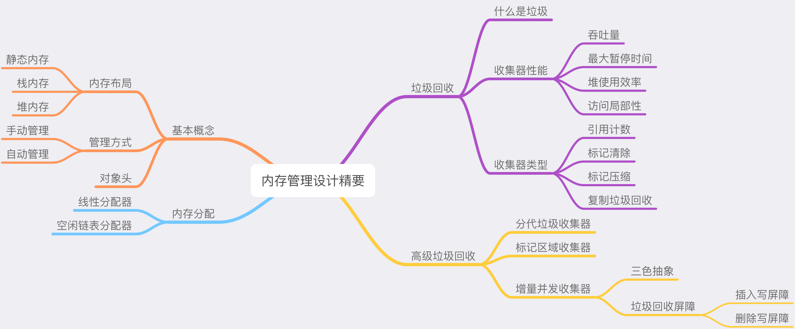

**图 2 - 文章脉络和内容**

虽然多数系统都会将内存管理拆分成多个复杂的模块并引入一些中间层提供缓存和转换的功能，但是内存管理系统实际上都可以简化成两个模块，即内存分配器（Allocator）、垃圾收集器（Collector）。当然除了这两个模块之外，在研究内存管理时都会引入第三个模块 — 用户程序（Mutator），帮助我们理解整个系统的工作流程。

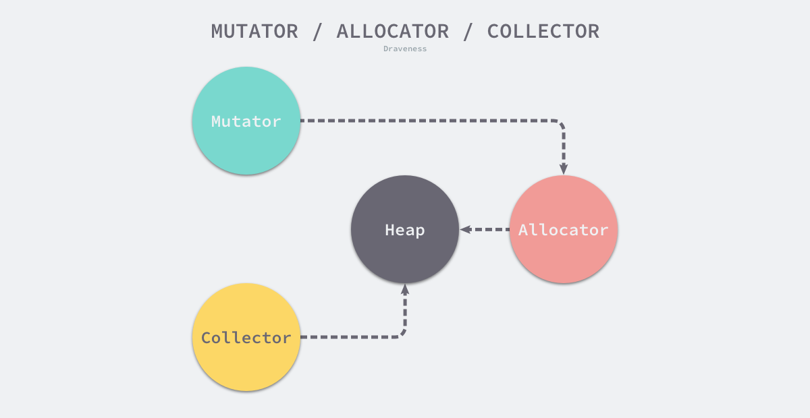

**图 3 - 内存管理系统模块**

  * 用户程序（Mutator）- 可以通过分配器创建对象或者更新对象持有的指针；
  * 内存分配器（Allocator）— 处理用户程序的的内存分配请求；
  * 垃圾收集器（Collector）- 标记内存中的对象并回收不需要的内存；

上述的三个模块是内存管理系统中的核心，它们在应用程序运行期间可以维护管理内存达到相对平衡的状态，我们在介绍内存管理时也会围绕这三个不同的组件，本节将从基本概念、内存分配和垃圾回收三个方面详细介绍内存管理的相关理论。

### 基本概念

基本概念这一节将介绍内存管理中的基本问题，我们会简单介绍应用程序的内存布局、内存管理中的设计的常见概念以及广义上的几种不同内存管理方式，这里会帮助各位读者从
顶层了解内存管理。

#### 内存布局

操作系统会为在其上运行的应用程序分配一片巨大的虚拟内存，需要注意的是，与操作系统的主存和物理内存不一样，虚拟内存并不是在物理上真正存在的概念，它是操作系统构建的逻辑概念。应用程序的内存一般会分成以下几个不同的区域：

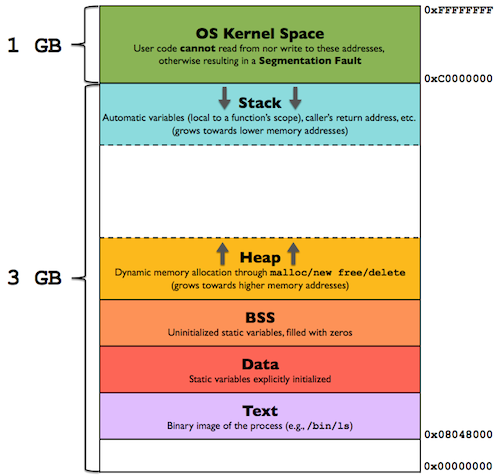

**图 4 - 内存布局**

  * 栈区（Stack）— 存储程序执行期间的本地变量和函数的参数，从高地址向低地址生长；
  * 堆区（Heap）— 动态内存分配区域，通过 `malloc`、`new`、`free` 和 `delete` 等函数管理；
  * 未初始化变量区（BSS）— 存储未被初始化的全局变量和静态变量；
  * 数据区（Data）— 存储在源代码中有预定义值的全局变量和静态变量；
  * 代码区（Text）— 存储只读的程序执行代码，即机器指令；

上述五种不同段虽然存储着不同的数据，但是我们可以将它们分成三种不同的内存分配类型，也就是静态内存、栈内存和堆内存。

##### 静态内存

静态内存可以最早追溯到 1960 年的 ALGOL 语言[1](https://draven.co/system-design-memory-management/#fn:1)，静态变量的生命周期可以贯穿整个程序。所有静态内存的布局都是在编译期间确认的，运行期间也不会分配新的静态内存，因为所有的静态内存都是在编译期间确认的，所以会为这些变量申请固定大小的内存空间，这些固定的内存空间也会导致静态内存无法支持函数的递归调用：


**图 5 - 静态内存的特性**

因为编译器可以确定静态变量的地址，所以它们是程序中唯一可以使用绝对地址寻址的变量。当程序被加载到内存中时，静态变量会直接存储在程序的 BSS区或者数据区，这些变量也会在程序退出时被销毁，正是因为静态内存的这些特性，我们并不需要在程序运行时引入静态内存的管理机制。

##### 栈内存

栈是应用程序中常见的内存空间，它遵循后进先出的规则管理存储的数据[2](https://draven.co/system-design-memory-management/#fn:2)。当应用程序调用函数时，它会将函数的参数加入栈顶，当函数返回时，它会将当前函数使用的栈全部销毁。栈内存管理的指令也都是由编译器生成的，我们会使用 BP 和 SP 这两个寄存器存储当前栈的相关信息，完全不需要工程师的参与，不过我们也只能在栈上分配大块固定的数据结构。


**图 6 - 栈内存的特性**

因为栈内存的释放是动态的并且是线性的，所以它可以支持函数的递归调用，不过运行时动态栈分配策略的引入也会导致程序栈内存的溢出，如果我们在编程语言中使用的递归函数超出了程序内存的上限，会造成栈溢出错误。

##### 堆内存

堆内存也是应用程序中的常见内存，与超过函数作用域会自动回收的栈内存相比，它能够让函数的被调用方向调用方返回内存并在内存的分配提供更大的灵活性，不过它提供的灵活性也带来了内存泄漏和悬挂指针等内存安全问题。

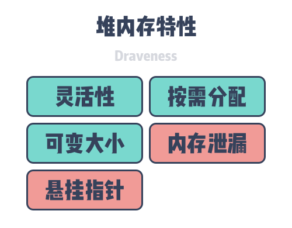

**图 7 - 堆内存的特性**

因为堆上的内存是工程师手动申请的，所以需要在使用结束时释放，一旦用过的内存没有释放，就会造成内存泄漏，占用更多的系统内存；如果在使用结束前释放，会导致危险的悬挂指针，其他对象指向的内存已经被系统回收或者重新使用。虽然进程的内存可以划分成很多区域，但是当我们在谈内存管理时，一般指的都是堆内存的管理，也就是如何解决内存泄漏和悬挂指针的问题。

#### 管理方式

我们可以将内存管理简单地分成手动管理和自动管理两种方式，手动管理内存一般是指由工程师在需要时通过 `malloc` 等函数手动申请内存并在不需要时调用`free` 等函数释放内存；自动管理内存由编程语言的内存管理系统自动管理，在大多数情况下不需要工程师的参与，能够自动释放不再使用的内存。


**图 8 - 手动管理和自动管理**

手动管理和自动管理只是内存管理的两种不同方式，本节将分别介绍两种内存管理的方式以及不同编程语言做出的不同选择。

##### 手动管理

手动管理内存是一种比较传统的内存管理方式，C/C++ 这类系统级的编程语言不包含**狭义上的**自动内存管理机制，工程师需要主动申请或者释放内存。如果存在理想的工程师能够精准地确定内存的分配和释放时机，人肉的内存管理策略只要做到足够精准，使用手动管理内存的方式可以提高程序的运行性能，也不会造成内存安全问题，

但是这种理想的工程师往往不存在于现实中，人类因素（Human Factor）总会带来一些错误，内存泄漏和悬挂指针基本是 C/C++ 这类语言中最常出现的错误，手动的内存管理也会占用工程师的大量精力，很多时候都需要思考对象应该分配到栈上还是堆上以及堆上的内存应该何时释放，维护成本相对来说还是比较高的，这也是必然要做的权衡。

##### 自动管理

自动管理内存基本是现代编程语言的标配，因为内存管理模块的功能非常确定，所以我们可以在编程语言的编译期或者运行时中引入自动的内存管理方式，最常见的自动内存管理机制就是垃圾回收，不过除了垃圾回收之外，一些编程语言也会使用自动引用计数辅助内存的管理。

自动的内存管理机制可以帮助工程师节省大量的与内存打交道的时间，让工程师将全部的精力都放在核心的业务逻辑上，提高开发的效率；在一般情况下，这种自动的内存管理机制都可以很好地解决内存泄漏和悬挂指针的问题，但是这也会带来额外开销并影响语言的运行时性能。

#### 对象头

对象头是实现自动内存管理的关键元信息，内存分配器和垃圾收集器都会访问对象头以获取相关的信息。当我们通过 `malloc`等函数申请内存时，往往都需要将内存按照指针的大小对齐（32 位架构上为 4 字节，64 位架构上为 8 字节），除了用于对齐的内存之外，每一个堆上的对象也都需要对应的对象头：

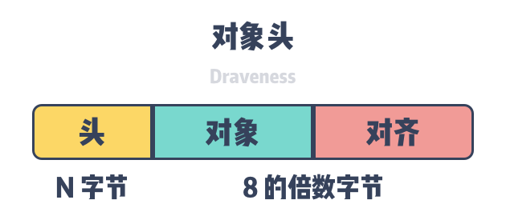

**图 9 - 对象头与对象**

不同的自动内存管理机制会在对象头中存储不同的信息，使用垃圾回收的编程语言会存储标记位 `MarkBit`/`MarkWord`，例如：Java 和 Go 语言；使用自动引用计数的会在对象头中存储引用计数 `RefCount`，例如：Objective-C。

编程语言会选择将对象头与对象存储在一起，不过因为对象头的存储可能影响数据访问的局部性，所以有些编程语言可能会单独开辟一片内存空间来存储对象头并通过内存地址建立两者之间的隐式联系。

### 内存分配

内存分配器是内存管理系统中的重要组件，它的主要职责是处理用户程序的内存申请。虽然内存分配器的职责非常重要，但是**内存的分配和使用其是一个增加系统中熵的过程**，所以内存分配器的设计与工作原理相对比较简单，我们在这里介绍内存分配器的两种类型。

内存分配器只包含线性内存分配器（Sequential Allocator）和空闲链表内存分配器（Free-list Allocator）两种，内存管理机制中的所有内存分配器其实都是上述两种不同分配器的变种，它们的设计思路完全不同，同时也有着截然不同的应用场景和特性，我们在这里依次介绍这两种内存分配器的原理。

#### 线性分配器

线性分配（Bump Allocator）是一种高效的内存分配方法，但是有较大的局限性。当我们在编程语言中使用线性分配器，我们只需要在内存中维护一个指向内存特定位置的指针，当用户程序申请内存时，分配器只需要检查剩余的空闲内存、返回分配的内存区域并修改指针在内存中的位置，即移动下图中的指针：


**图 10 - 线性分配器**

根据线性分配器的原理，我们可以推测它有较快的执行速度，以及较低的实现复杂度；但是线性分配器无法在内存被释放时重用内存。如下图所示，如果已经分配的内存被回收，线性分配器是无法重新利用红色的这部分内存的：


**图 11 - 线性分配器回收内存**

正是因为线性分配器的这种特性，我们需要合适的垃圾回收算法配合使用。标记压缩（Mark-Compact）、复制回收（Copying GC）和分代回收（Generational GC）等算法可以通过拷贝的方式整理存活对象的碎片，将空闲内存定期合并，这样就能利用线性分配器的效率提升内存分配器的性能了。

因为线性分配器的使用需要配合具有拷贝特性的垃圾回收算法，所以 C 和 C++ 等需要直接对外暴露指针的语言就无法使用该策略，我们会在下一节详细介绍常见垃圾回收算法的设计原理。

#### 空闲链表分配器

空闲链表分配器（Free-List Allocator）可以重用已经被释放的内存，它在内部会维护一个类似链表的数据结构。当用户程序申请内存时，空闲链表分配器会依次遍历空闲的内存块，找到足够大的内存，然后申请新的资源并修改链表：

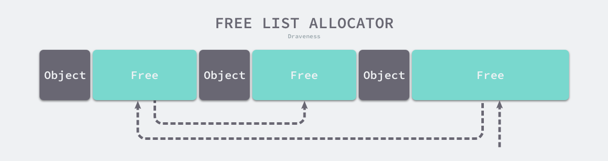

**图 12 - 空闲链表分配器**

因为不同的内存块以链表的方式连接，所以使用这种方式分配内存的分配器可以重新利用回收的资源，但是因为分配内存时需要遍历链表，所以它的时间复杂度就是`O(n)`。空闲链表分配器可以选择不同的策略在链表中的内存块中进行选择，最常见的就是以下四种方式：

  * 首次适应（First-Fit）— 从链表头开始遍历，选择第一个大小大于申请内存的内存块；
  * 循环首次适应（Next-Fit）— 从上次遍历的结束位置开始遍历，选择第一个大小大于申请内存的内存块；
  * 最优适应（Best-Fit）— 从链表头遍历整个链表，选择最合适的内存块；
  * 隔离适应（Segregated-Fit）— 将内存分割成多个链表，每个链表中的内存块大小相同，申请内存时先找到满足条件的链表，再从链表中选择合适的内存块；

上述四种策略的前三种就不过多介绍了，Go 语言使用的内存分配策略与第四种策略有些相似，我们通过下图了解一下该策略的原理：

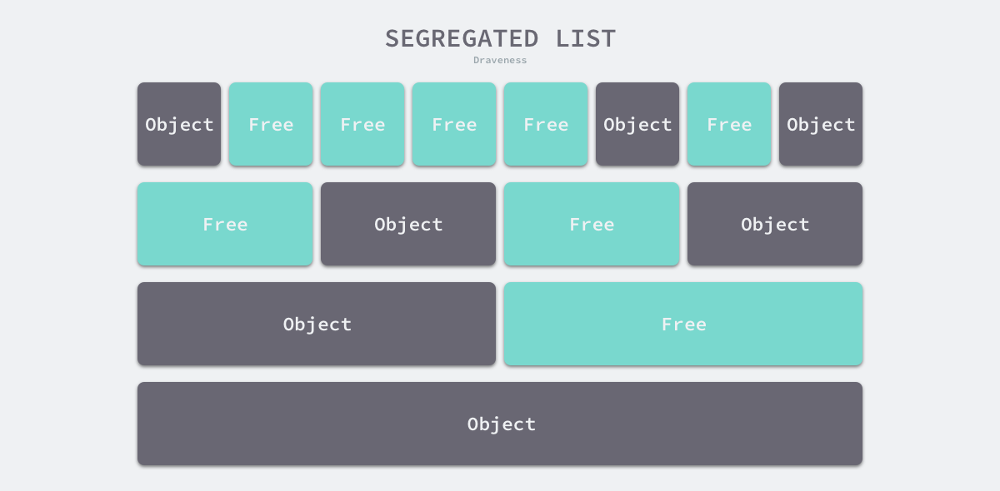

**图 13 - 隔离适应策略**

如上图所示，该策略会将内存分割成由 4、8、16、32 字节的内存块组成的链表，当我们向内存分配器申请 8 字节的内存时，我们会在上图中的第二个链表找到空闲的内存块并返回。隔离适应的分配策略减少了需要遍历的内存块数量，提高了内存分配的效率。

### 垃圾回收

垃圾回收是一种自动的内存管理形式[3](https://draven.co/system-design-memory-management/#fn:3)，垃圾收集器是内存管理系统的重要组件，内存分配器会负责在堆上申请内存，而垃圾收集器会释放不再被用户程序使用的对象。谈到垃圾回收，很多人的第一反应可能都是暂停程序（stop-the-world、STW）和垃圾回收暂停（GC Pause），垃圾回收确实会带来STW，但是这不是垃圾回收的全部，本节将详细介绍垃圾回收以及垃圾收集器的相关概念和理论。

#### 什么是垃圾

在深入分析垃圾回收之前，我们需要先明确垃圾回收中垃圾的定义，明确定义能够帮助我们更精确地理解垃圾回收解决的问题以及它的职责。计算机科学中的垃圾包括对象、数据和计算机系统中的其他的内存区域，这些数据不会在未来的计算中使用，因为内存资源是有限的，所以我们需要将这些垃圾占用的内存交还回堆并在未来复用[4](https://draven.co/system-design-memory-management/#fn:4)。

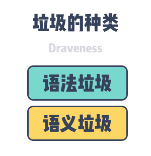

**图 14 - 语义和语法垃圾**

垃圾可以分成语义垃圾和语法垃圾两种，*语义垃圾（Semantic Garbage）*是计算机程序中永远不会被程序访问到的对象或者数据；*语法垃圾（Syntactic Garbage）*是计算机程序内存空间中从根对象无法达到（Unreachable）的对象或者数据。

语义垃圾是**不会被使用的**的对象，可能包括废弃的内存、不使用的变量，垃圾收集器无法解决程序中语义垃圾的问题，我们需要通过编译器来一部分语义垃圾。语法垃圾是在对象图中**不能从根节点达到的**对象，所以语法垃圾在一般情况下都是语义垃圾：

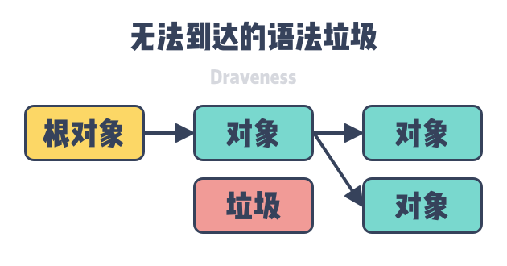

**图 15 - 无法达到的语法垃圾**

垃圾收集器能够发现并回收的就是对象图中无法达到的语法垃圾，通过分析对象之间的引用关系，我们可以得到图中根节点不可达的对象，这些不可达的对象会在垃圾收集器的清理阶段被回收。

#### 收集器性能

吞吐量（Throughput）和最大暂停时间（Pause time）是两个衡量垃圾收集器的主要指标，除了这两个指标之外，堆内存的使用效率和访问的局部性也是垃圾收集的常用指标，我们简单介绍以下这些指标对垃圾收集器的影响。

##### 吞吐量

垃圾收集器的吞吐量其实有两种解释，一种解释是垃圾收集器在执行阶段的速度，也就是单位时间的标记和清理内存的能力，我们可以用堆内存除以 GC 使用的总时间来计算。


    HEAP_SIZE / TOTAL_GC_TIME


另一种吞吐量计算方法是使用程序运行的总时间除以所有 GC 循环运行的总时间，GC 的时间对于整个应用程序来说是额外开销，这个指标能看出额外开销占用资源的百分比，从这一点，我们也能看出 GC 的执行效率。

##### 最大暂停时间

由于在垃圾回收的某些阶段会触发 STW，所以用户程序是不能执行的，最长的 STW 时间会严重影响程序处理请求或者提供服务的尾延迟，所以这一点也是我们在测量垃圾收集器性能时需要考虑的指标。

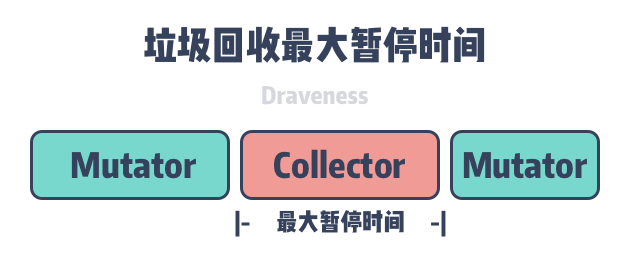

**图 16 - 最大暂停时间**

使用 STW 垃圾收集器的编程语言，用户程序在垃圾回收的全部阶段都不能执行。并发标记清除的垃圾收集器将可以与用户程序并发执行的工作全部并发执行，能够减少最大程序暂停时间，

##### 堆使用效率

堆的使用效率也是衡量垃圾收集器的重要指标。为了能够标识垃圾，我们需要在内存空间中引入包含特定信息的对象头，这些对象头都是垃圾收集器带来的额外开销，正如网络带宽可能不是最终的下载速度，协议头和校验码的传输会占用网络带宽，对象头的大小最终也会影响堆内存的使用效率；除了对象头之外，堆在使用过程中出现的碎片也会影响内存的使用效率，为了保证内存的对齐，我们会在内存中留下很多缝隙，这些缝隙也是内存管理带来的开销。

##### 访问局部性

访问的局部性是我们在讨论内存管理时不得不谈的话题，空间的局部性是指处理器在短时间内总会重复地访问同一片或者相邻的内存区域，操作系统会以内存页为单位管理内存空间，在理想情况下，合理的内存布局可以使得垃圾收集器和应用程序都能充分地利用空间局部性提高程序的执行效率。

#### 收集器类型

垃圾收集器的类型在总体上可以分成直接（Direct）垃圾收集器和跟踪（Tracing）垃圾收集器。直接垃圾收集器包括引用计数（Refernce-Counting），跟踪垃圾收集器包含标记清理、标记压缩、复制垃圾回收等策略，而引用计数收集器却不是特别常见，少数编程语言会使用这种方式管理内存。

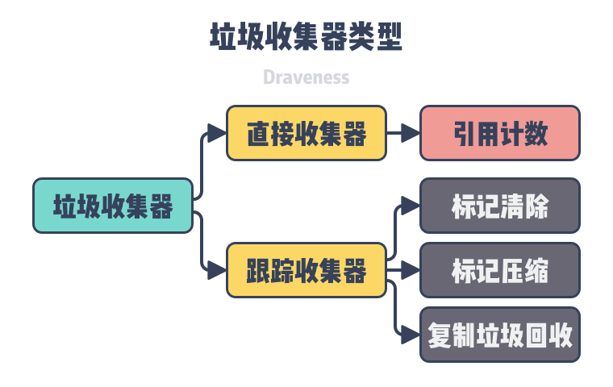

**图 17 - 垃圾收集器类型**

除了直接和跟踪垃圾收集器这些相对常见的垃圾回收方法之外，也有使用所有权或者手动的方式管理内存，我们在本节中会介绍引用计数、标记清除、标记压缩和复制垃圾回收四种不同类型垃圾收集器的设计原理以及它们的优缺点。

##### 引用计数

基于引用计数的垃圾收集器是直接垃圾收集器，当我们改变对象之间的引用关系时会修改对象之间的引用计数，每个对象的引用计数都记录了当前有多少个对象指向了该对象，当对象的引用计数归零时，当前对象就会被自动释放。在使用引用计数的编程语言中，垃圾收集是在用户程序运行期间实时发生的，所以在理论上也就不存在 STW 或者明显地垃圾回收暂停。

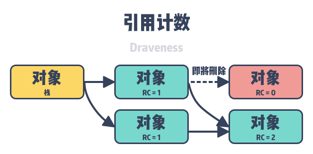

**图 18 - 对象的引用计数**

如上图所示，基于引用计数的垃圾收集器需要应用程序在对象头中存储引用计数，引用计数就是该类型的收集器在内存中引入的额外开销。我们在这里举一个例子介绍引用计数的工作原理，如果在使用引用计数回收器的编程语言中使用如下所示赋值语句时：

```    
obj.field = new_ref;
```

  1. 对象 `obj` 原来引用的对象 `old_ref` 的引用计数会**减一**；
  2. 对象 `obj` 引用的新对象 `new_ref` 的引用计数会**加一**；
  3. 如果 `old_ref` 对象的引用计数归零，我们会释放该对象回收它的内存；

这种类型的垃圾收集器会带来两个比较常见的问题，分别是递归的对象回收和循环引用：

  * 递归回收 — 每当对象的引用关系发生改变时，我们都需要计算对象的新引用计数，一旦对象被释放，我们就需要递归地访问所有该对象的引用并将被引用对象的计数器减一，一旦涉及到较多的对象就可能会造成 GC 暂停；
  * 循环引用 — 对象的相互引用在对象图中也非常常见，如果对象之间的引用都是强引用，循环引用会导致多个对象的计数器都不会归零，最终会造成内存泄漏；

递归回收是使用引用计数时不得不面对的问题，我们很难在工程上解决该问题；不过使用引用计数的编程语言却可以利用弱引用来解决循环引用的问题，弱引用也是对象之间的引用关系，**建立和销毁弱引用关系都不会修改双方的引用计数**，这就能避免对象之间的弱引用关系，不过这也需要工程师对引用关系作出额外的并且正确的判断。

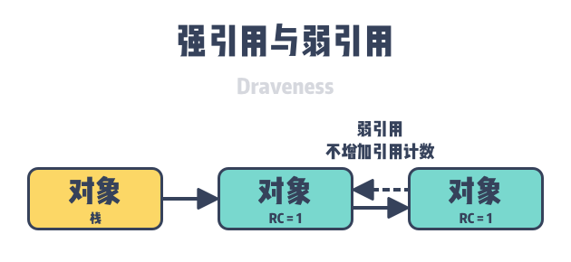

**图 19 - 强引用与弱引用**

除了弱引用之外，一些编程语言也会在引用计数的基础上加入标记清除技术，通过遍历和标记堆中不再被使用的对象解决循环引用的问题。

引用计数垃圾收集器是一种非移动（Non-moving）的垃圾回收策略，它在回收内存的过程中不会移动已有的对象，很多编程语言都会对工程师直接暴露内存的指针，所以 C、C++ 以及Objective-C 等编程语言其实都可以使用引用计数来解决内存管理的问题。

##### 标记清除

标记清除（Mark-Sweep）是最简单也最常见的垃圾收集策略，它的执行过程可以分成**标记**和**清除**两个阶段，标记阶段会使用深度优先或者广度优先算法扫描堆中的存活对象，而清除阶段会回收内存中的垃圾。当我们使用该策略回收垃圾时，它会首先从根节点出发沿着对象的引用遍历堆中的全部对象，能够被访问到的对象是存活的对象，不能被访问到的对象就是内存中的垃圾。

如下图所示，内存空间中包含多个对象，我们从根对象出发依次遍历对象的子对象并将从根节点可达的对象都标记成存活状态，即 A、C 和 D 三个对象，剩余的 B、E 和 F 三个对象因为从根节点不可达，所以会被当做垃圾：

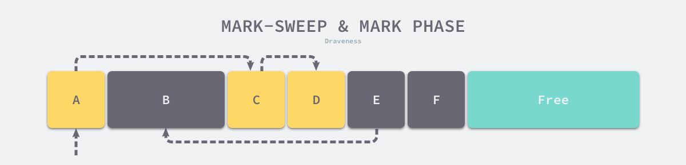

**图 20 - 标记清除的标记阶段**

标记阶段结束后会进入清除阶段，在该阶段中收集器会依次遍历堆中的所有对象，释放其中没有被标记的 B、E 和 F 三个对象并将新的空闲内存空间以链表的结构串联起来，方便内存分配器的使用。

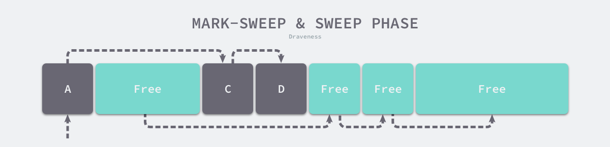

**图 21 - 标记清除的收集阶段**

使用标记清除算法的编程语言需要在对象头中加入表示对象存活的标记位（Mark Bit），标记位与操作系统的写时复制不兼容，因为即使内存页中的对象没有被修改，垃圾收集器也会修改内存页中对象相邻的标记位导致内存页的复制。我们可以使用位图（Bitmap）标记避免这种情况，表示对象存活的标记与对象分别存储，清理对象时也只需要遍历位图，能够降低清理过程的额外开销。

如上图所示，使用标记清除算法的垃圾收集器一般会使用基于空闲链表的分配器，因为对象在不被使用时会被就地回收，所以长时间运行的程序会出现很多内存碎片，这会降低内存分配器的分配效率，在实现上我们可以将空闲链表按照对象大小分成不同的区以减少内存中的碎片。

标记清除策略是一种实现简单的垃圾收集策略，但是它的内存碎片化问题也比较严重，简单的内存回收策略也增加了内存分配的开销和复杂度，当用户程序申请内存时，我们也需要在内存中找到足够大的块分配内存。

##### 标记压缩

标记压缩（Mark-Compact）也是比较常见的垃圾收集算法，与标记清除算法类似，标记压缩的执行过程可以分成**标记**和**压缩**两个阶段。该算法在标记阶段也会从根节点遍历对象，查找并标记所有存活的对象；在压缩阶段，我们会将所有存活的对象紧密排列，『挤出』存活对象之间的缝隙：

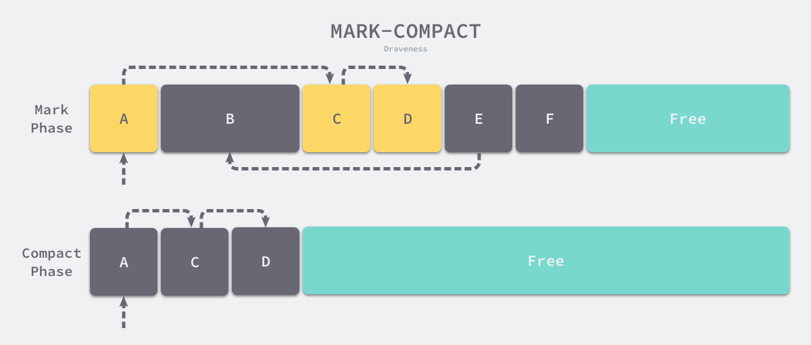

**图 22 - 标记压缩算法**

因为在压缩阶段我们需要移动存活的对象，所以这一种 moving 收集器，如果编程语言支持使用指针访问对象，那么我们就无法使用该算法。标记的过程相对比较简单，我们在这里以 Lisp 2
压缩算法为例重点介绍该算法的压缩阶段：

  1. 计算当前对象迁移后的最终位置并将位置存储在转发地址（Forwarding Address）中；
  2. 根据当前对象子对象的转发地址，将引用指向新的位置；
  3. 将所有存活的对象移动到对象头中转发地址的位置；

从上述过程我们可以看出，使用标记压缩算法的编程语言不仅要在对象头中存储标记位，还需要存储当前对象的转发地址，这增加了对象在内存中的额外开销。

标记压缩算法的实现比较复杂，在执行的过程中需要遍历三次堆中的对象，作为 moving 的垃圾收集器，它不适用于 C、C++等编程语言；压缩算法的引入可以减少程序中的内存碎片，我们可以直接使用最简单的线性分配器为用户程序快速分配内存。

##### 复制垃圾回收

复制垃圾回收（Copying GC）也是跟踪垃圾收集器的一种，它会将应用程序的堆分成两个大小相等的区域，如下图所示，其中左侧区域负责为用户程序分配内存空间，而右侧区域用于垃圾回收。

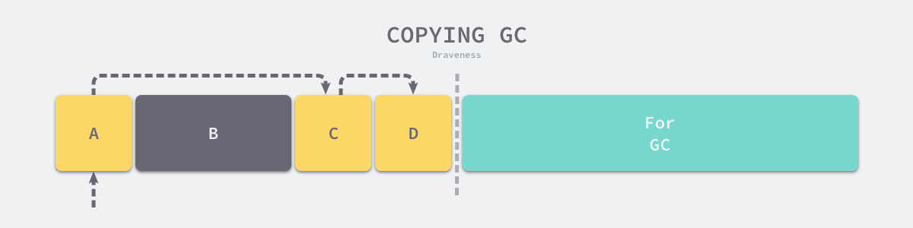

**图 23 - 复制垃圾回收**

当用户程序使用的内存超过上图中的左侧区域就会出现内存不足（Out-of memory、OOM），垃圾收集器在这时会开启新的垃圾收集循环，复制垃圾回收的执行过程可以非常以下的四个阶段：

  1. 复制阶段 — 从 GC 根节点出发遍历内存中的对象，将发现的存活对象迁移到右侧的内存中；
  2. 转发阶段 — 在原始对象的对象头或者在原位置设置新对象的转发地址（Forwarding Address），如果其他对象引用了该对象可以从转发地址转到新的地址；
  3. 修复指针 — 遍历当前对象持有的引用，如果引用指向了左侧堆中的对象，回到第一步迁移发现的新对象；
  4. 交换阶段 — 当内存中不存在需要迁移的对象之后，交换左右两侧的内存区域；

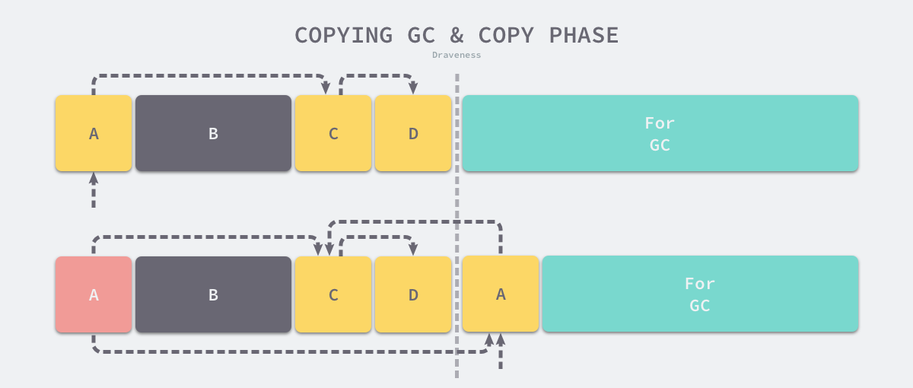

**图 24 - 复制垃圾回收的复制阶段**

如上图所示，当我们把 A 对象复制到右侧的区域后，会将原始的 A 对象指向新的 A 对象，这样其他引用 A 的对象可以快速找到它的新地址；因为 A 对象的复制是『像素级复制』，所以 A 对象仍然会指向左侧内存的 C 对象，这时需要将 C 对象复制到新的内存区域并修改 A 对象的指针。在最后，当不存在需要拷贝的对象时，我们可以直接交换两个内存区域的指针。

复制垃圾回收与标记压缩算法一样都会拷贝对象，能够减少程序中的内存碎片，我们可以使用线性的分配器快速为用户程序分配内存。因为只需要扫描一半的堆，遍历堆的次数也会减少，所以可以减少垃圾回收的时间，但是这也会降低内存的利用率。

### 高级垃圾回收

内存管理是一个相对比较大的话题，我们在上一小节介绍了垃圾回收的一些基本概念，其中包括常见的垃圾回收算法：引用计数、标记清除、标记压缩和复制垃圾回收，这些算法都是比较基本的垃圾回收算法，我们在这一节中将详细介绍一些高级的垃圾回收算法，它们会利用基本的垃圾回收算法和新的数据结构构建更复杂的收集器。

#### 分代垃圾收集器

分代垃圾回收（Generational garbage collection）是在生产环境中比较常见的垃圾收集算法，该算法主要建立在弱分代假设（Weak Generational Hypothesis）上 —— 大多数的对象会在生成后马上变成垃圾，只有极少数的对象可以存活很久[5](https://draven.co/system-design-memory-management/#fn:5)。根据该经验，分代垃圾回收会把堆中的对象分成多个代，不同代垃圾回收的触发条件和算法都完全不同。


**图 25 - 青年代和老年代**

常见的分代垃圾回收会将堆分成青年代（Young、Eden）和老年代（Old、Tenured），所有的对象在刚刚初始化时都会进入青年代，而青年代触发 GC 的频率也更高；而老年代的对象 GC 频率相对比较低，只有青年代的对象经过多轮 GC 没有被释放才可能被晋升（Promotion）到老年代，晋升的过程与复制垃圾回收算法的执行过程相差无几。

青年代的垃圾回收被称作是 Minor GC 循环，而老年代的垃圾回收被称作 Major GC 循环，Full GC 循环一般是指整个堆的垃圾回收，需要注意的是很多时候我们都会混淆 Major GC 循环和 Full GC 循环，在讨论时一定要先搞清楚双方对这些名词的理解是否一致。

青年代的垃圾回收只会扫描整个堆的一部分，这能够减少一次垃圾回收需要的扫描的堆大小和程序的暂停时间，提高垃圾回收的吞吐量。然而分代也为垃圾回收引入了复杂度，其中最常见的问题是_跨代引用（Intergenerational Pointer）_，即老年代引用了青年代的对象，如果堆中存在跨代引用，那么在 Minor GC 循环中我们不仅应该遍历垃圾回收的根对象，还需要从包含跨代引用的对象出发标记青年代中的对象。


**图 26 - 跨代引用**

为了处理分代垃圾回收的跨代引用，我们需要解决两个问题，分别是如何**识别**堆中的跨代引用以及如何**存储**识别的跨代引用，在通常情况下我们会使用*写屏障（Write Barrier）_识别跨代引用并使用_卡表（Card Table）*存储相关的数据。

> 注意：卡表只是标记或者存储跨代引用的一种方式，除了卡表我们也可以使用记录集（Record Set）存储跨代引用的老年代对象或者使用页面标记按照操作系统内存页的维度标记老年代的对象。

写屏障是当对象之间的指针发生改变时调用的代码片段，这段代码会判断该指针是不是从老年代对象指向青年代对象的跨代引用。如果该指针是跨代引用，我们会在如下所示的卡表中标记老年代对象所在的区域：

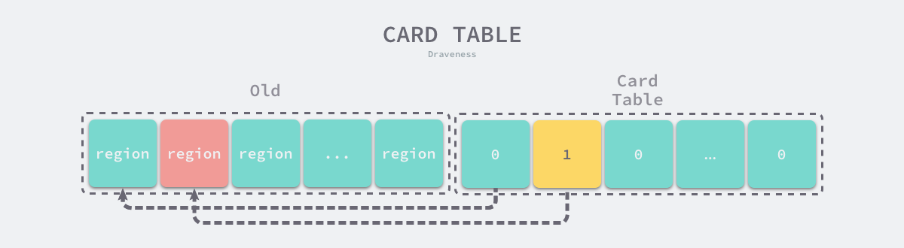

**图 27 - 卡表**

卡表与位图比较相似，它也由一系列的比特位组成，其中每一个比特位都对应着老年区中的一块内存，如果该内存中的对象存在指向青年代对象的指针，那么这块内存在卡表中就会被标记，当触发 Minor GC 循环时，除了从根对象遍历青年代堆之外，我们还会从卡表标记区域内的全部老年代对象开始遍历青年代。

分代垃圾回收基于弱分代假说，结合了复制垃圾回收、写屏障以及卡表等技术，将内存中的堆区分割成了青年代和老年代等区域，为不同的代使用不同的内存分配和垃圾回收算法，可以有效地减少 GC 循环遍历的堆大小和处理时间，但是写屏障技术也会带了额外开销，移动收集器的特性也使它无法在 C、C++ 等编程语言中使用，在部分场景下弱分代假说不一定会成立，如果大多数的对象都会活得很久，那么使用分代垃圾回收可能会起到反效果。

#### 标记区域收集器

标记区域收集器（Mark-Region Garbage Collector）是 2008 年提出的垃圾收集算法[6](https://draven.co/system-design-memory-management/#fn:6)，这个算法也被称作混合垃圾回收（Immix GC），它结合了标记清除和复制垃圾回收算法，我们使用前者来追踪堆中的存活对象，使用后者减少内存中存在的碎片。

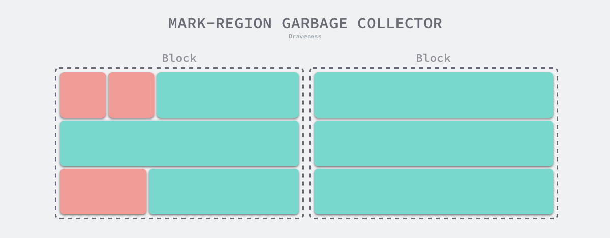

**图 28 - 标记区域收集器**

Immix 垃圾回收算法包含两个组件，分别是用于标记区域的收集器和去碎片化机制[7](https://draven.co/system-design-memory-management/#fn:7)。标记区域收集器与标记清除收集器比较类似，它将堆内存拆分成特定大小的内存块，再将所有的内存块拆分成特定大小的线。当用户程序申请内存时，它会在上述内存块中查找空闲的线并使用线性分配器快速分配内存；通过引入粗粒度的内存块和细粒度的线，可以更好地控制内存的分配和释放。

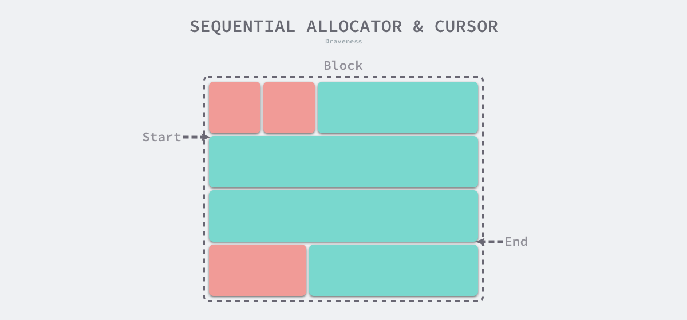

**图 29 - 线性分配器的光标**

标记区域收集器与标记清除收集器比较类似，因为它们不会移动对象，所以都会面临内存碎片化的问题。如下图所示，标记区域收集器在回收内存时都是以块和线为单位进行回收的，所以只要当前内存线中包含存活对象，收集器就会保留该片内存区域，这会带来我们在上面提到的内存碎片。

Immix 引入的机会转移（Opportunistic Evacuation）机制能够有效地减少程序中的碎片化，当收集器在内存块中遇到可以被转移的对象，它就会使用复制垃圾回收算法将当前块中的存活对象移动到新的块中并释放原块中的内存。

标记区域收集器将堆内存分成了粗粒度的内存块和细粒度的内存线，结合了标记清除算法和复制垃圾回收几种基本垃圾收集器的特性，既能够提升垃圾收集器的吞吐量，还能够利用线性分配器提高内存的分配速度，但是该收集器的实现相对比较复杂。

#### 增量并发收集器

相信很多人对垃圾收集器的印象都是暂停程序（Stop the world，STW），随着用户程序申请越来越多的内存，系统中的垃圾也逐渐增多；当程序的内存占用达到一定阈值时，整个应用程序就会全部暂停，垃圾收集器会扫描已经分配的所有对象并回收不再使用的内存空间，当这个过程结束后，用户程序才可以继续执行。

传统的垃圾收集算法会在垃圾收集的执行期间暂停应用程序，一旦触发垃圾收集，垃圾收集器就会抢占 CPU 的使用权占据大量的计算资源以完成标记和清除工作，然而很多追求实时的应用程序无法接受长时间的 STW。

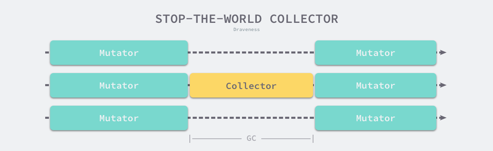

**图 30 - 垃圾收集与暂停程序**

远古时代的计算资源还没有今天这么丰富，今天的计算机往往都是多核的处理器，垃圾收集器一旦开始执行就会浪费大量的计算资源，为了减少应用程序暂停的最长时间和垃圾收集的总暂停时间，我们会使用下面的策略优化现代的垃圾收集器：

  * 增量垃圾收集 — 增量地标记和清除垃圾，降低应用程序暂停的最长时间；
  * 并发垃圾收集 — 利用多核的计算资源，在用户程序执行时并发标记和清除垃圾；

因为增量和并发两种方式都可以与用户程序交替运行，所以我们需要**使用屏障技术**保证垃圾收集的正确性；与此同时，应用程序也不能等到内存溢出时触发垃圾收集，因为当内存不足时，应用程序已经无法分配内存，这与直接暂停程序没有什么区别，增量和并发的垃圾收集需要提前触发并在内存不足前完成整个循环，避免程序的长时间暂停。

增量式（Incremental）的垃圾收集是减少程序最长暂停时间的一种方案，它可以将原本时间较长的暂停时间切分成多个更小的 GC 时间片，虽然从垃圾收集开始到结束的时间更长了，但是这也减少了应用程序暂停的最大时间：

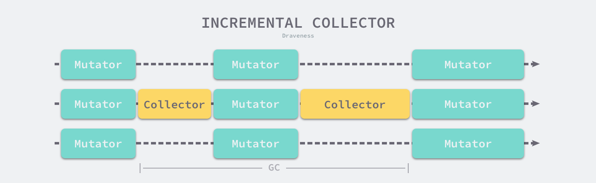

**图 31 - 增量垃圾收集器**

需要注意的是，增量式的垃圾收集需要与三色标记法一起使用，为了保证垃圾收集的正确性，我们需要在垃圾收集开始前打开写屏障，这样用户程序对内存的修改都会先经过写屏障的处理，保证了堆内存中对象关系的强三色不变性或者弱三色不变性。虽然增量式的垃圾收集能够减少最大的程序暂停时间，但是增量式收集也会增加一次 GC 循环的总时间，在垃圾收集期间，因为写屏障的影响用户程序也需要承担额外的计算开销，所以增量式的垃圾收集也不是只有优点的。

并发（Concurrent）的垃圾收集不仅能够减少程序的最长暂停时间，还能减少整个垃圾收集阶段的时间，通过开启读写屏障、**利用多核优势与用户程序并行执行**，并发垃圾收集器确实能够减少垃圾收集对应用程序的影响：

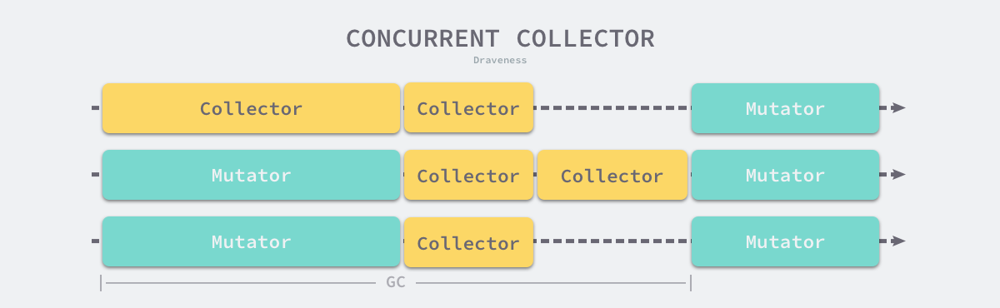

**图 32 - 并发垃圾收集器**

虽然并发收集器能够与用户程序一起运行，但是并不是所有阶段都可以与用户程序一起运行，部分阶段还是需要暂停用户程序的，不过与传统的算法相比，并发的垃圾收集可以将能够并发执行的工作尽量并发执行；当然，因为读写屏障的引入，并发的垃圾收集器也一定会带来额外开销，不仅会增加垃圾收集的总时间，还会影响用户程序，这是我们在设计垃圾收集策略时必须要注意的。

但是因为增量并发收集器的并发标记阶段会与用户程序一同或者交替运行，所以可能出现**标记为垃圾的对象被用户程序中的其他对象重新引用**，当垃圾回收的标记阶段结束后，被错误标记为垃圾的对象会被直接回收，这就会带来非常严重的问题，想要解决增量并发收集器的这个问题，我们需要了解三色抽象和屏障技术。

##### 三色抽象

为了解决原始标记清除算法带来的长时间 STW，多数现代的追踪式垃圾收集器都会实现三色标记算法的变种以缩短 STW 的时间。三色标记算法将程序中的对象分成白色、黑色和灰色三类[8](https://draven.co/system-design-memory-management/#fn:8)：

  * 白色对象 — 潜在的垃圾，其内存可能会被垃圾收集器回收；
  * 黑色对象 — 活跃的对象，包括不存在任何引用外部指针的对象以及从根对象可达的对象；
  * 灰色对象 — 活跃的对象，因为存在指向白色对象的外部指针，垃圾收集器会扫描这些对象的子对象；


**图 33 - 三色的对象**

在垃圾收集器开始工作时，程序中不存在任何的黑色对象，垃圾收集的根对象会被标记成灰色，垃圾收集器只会从灰色对象集合中取出对象开始扫描，当灰色集合中不存在任何对象时，标记阶段就会结束。

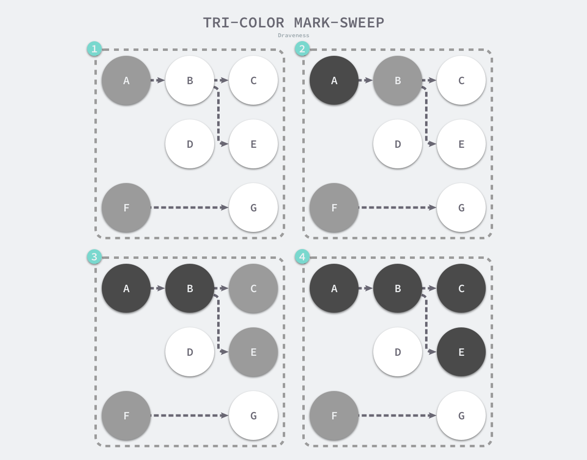

**图 34 - 三色标记垃圾收集器的执行过程**

三色标记垃圾收集器的工作原理很简单，我们可以将其归纳成以下几个步骤：

  1. 从灰色对象的集合中选择一个灰色对象并将其标记成黑色；
  2. 将黑色对象指向的所有对象都标记成灰色，保证该对象和被该对象引用的对象都不会被回收；
  3. 重复上述两个步骤直到对象图中不存在灰色对象；

当三色的标记清除的标记阶段结束之后，应用程序的堆中就不存在任何的灰色对象，我们只能看到黑色的存活对象以及白色的垃圾对象，垃圾收集器可以回收这些白色的垃圾，下面是使用三色标记垃圾收集器执行标记后的堆内存，堆中只有对象 D 为待回收的垃圾：

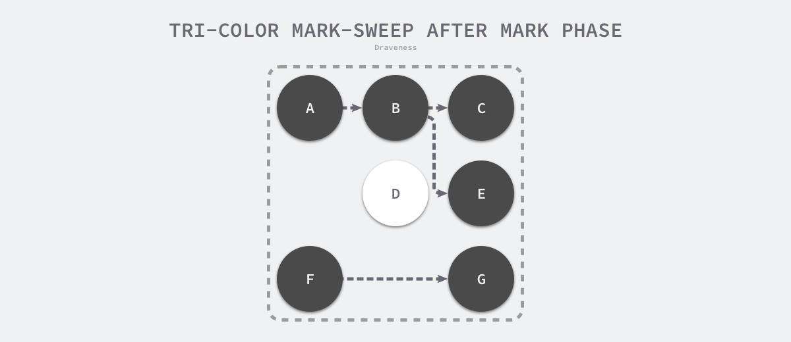

**图 35 - 三色标记后的堆**

因为用户程序可能在标记执行的过程中修改对象的指针，所以三色标记清除算法本身是不可以并发或者增量执行的，它仍然需要STW，在如下所示的三色标记过程中，用户程序建立了从 A 对象到 D 对象的引用，但是因为程序中已经不存在灰色对象了，所以 D 对象会被垃圾收集器错误地回收。

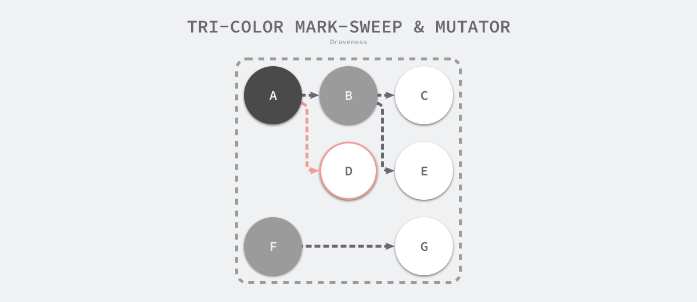

**图 36 - 三色标记与用户程序**

本来不应该被回收的对象却被回收了，这在内存管理中是非常严重的错误，我们将这种错误成为悬挂指针，即指针没有指向特定类型的合法对象，影响了内存的安全性[9](https://draven.co/system-design-memory-management/#fn:9)，想要并发或者增量地标记对象还是需要使用屏障技术。

##### 垃圾回收屏障

内存屏障技术是一种屏障指令，它可以让 CPU 或者编译器在执行内存相关操作时遵循特定的约束，目前的多数的现代处理器都会乱序执行指令以最大化性能，但是该技术能够保证代码对内存操作的顺序性，在内存屏障前执行的操作一定会先于内存屏障后执行的操作[10](https://draven.co/system-design-memory-management/#fn:10)。

想要在并发或者增量的标记算法中保证正确性，我们需要达成以下两种三色不变性（Tri-color invariant）中的任意一种：

  * 强三色不变性 — 黑色对象不会指向白色对象，只会指向灰色对象或者黑色对象；
  * 弱三色不变性 — 黑色对象指向的白色对象必须包含一条从灰色对象经由多个白色对象的可达路径[11](https://draven.co/system-design-memory-management/#fn:11)；

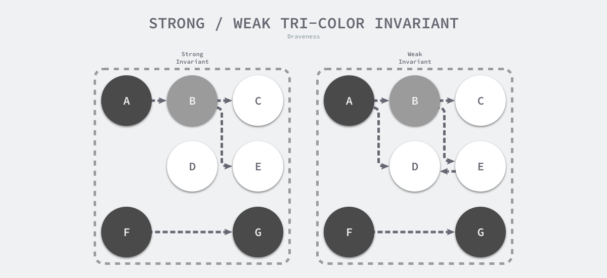

**图 37 - 三色不变性**

上图分别展示了遵循强三色不变性和弱三色不变性的堆内存，遵循上述两个不变性中的任意一个，我们都能保证垃圾收集算法的正确性，而屏障技术就是在并发或者增量标记过程中保证三色不变性的重要技术。

垃圾收集中的屏障技术更像是一个钩子方法，它是在用户程序读取对象、创建新对象以及更新对象指针时执行的一段代码，根据操作类型的不同，我们可以将它们分成读屏障（Read barrier）和写屏障（Write barrier）两种，因为读屏障需要在读操作中加入代码片段，对用户程序的性能影响很大，所以编程语言往往都会采用写屏障保证三色不变性。

我们在这里想要介绍的是以下几种写屏障技术，分别是 Dijkstra 提出的插入写屏障[12](https://draven.co/system-design-memory-management/#fn:12)和 Yuasa 提出的删除写屏障[13](https://draven.co/system-design-memory-management/#fn:13)，这里会分析它们如何保证三色不变性和垃圾收集器的正确性。

###### 插入写屏障

Dijkstra 在 1978 年提出了插入写屏障，通过如下所示的写屏障，用户程序和垃圾收集器可以在交替工作的情况下保证程序执行的正确性：

```
writePointer(slot, ptr):
    shade(ptr)
    *field = ptr
```

上述插入写屏障的伪代码非常好理解，每当我们执行类似 `*slot = ptr` 的表达式时，我们会执行上述写屏障通过 `shade`函数尝试改变指针的颜色。如果 `ptr` 指针是白色的，那么该函数会将该对象设置成灰色，其他情况则保持不变。

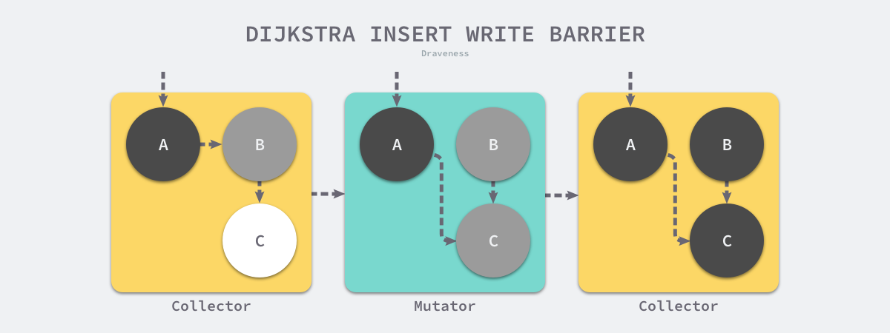

**图 38 - Dijkstra 插入写屏障**

假设我们在应用程序中使用 Dijkstra 提出的插入写屏障，在一个垃圾收集器和用户程序交替运行的场景中会出现如上图所示的标记过程：

  1. 垃圾收集器将根对象指向 A 对象标记成黑色并将 A 对象指向的对象 B 标记成灰色；
  2. 用户程序修改 A 对象的指针，将原本指向 B 对象的指针指向 C 对象，这时触发写屏障将 C 对象标记成灰色；
  3. 垃圾收集器依次遍历程序中的其他灰色对象，将它们分别标记成黑色；

Dijkstra的插入写屏障是一种相对保守的屏障技术，它会将**有存活可能的对象都标记成灰色**以满足强三色不变性。在如上所示的垃圾收集过程中，实际上不再存活的 B 对象最后没有被回收；而如果我们在第二和第三步之间将指向 C 对象的指针改回指向 B，垃圾收集器仍然认为 C 对象是存活的，这些被错误标记的垃圾对象只有在下一个循环才会被回收。

插入式的 Dijkstra 写屏障虽然实现非常简单并且也能保证强三色不变性，但是它也有很明显的缺点。因为栈上的对象在垃圾收集中也会被认为是根对象，所以为了保证内存的安全，Dijkstra 必须为栈上的对象增加写屏障或者在标记阶段完成重新对栈上的对象对象进行扫描，这两种方法各有各的缺点，前者会大幅度增加写入指针的额外开销，后者重新扫描栈对象时需要暂停程序，垃圾收集算法的设计者需要在这两者之前做出权衡。

###### 删除写屏障

Yuasa 在 1990 年的论文 Real-time garbage collection on general-purpose machines 中提出了删除写屏障，因为一旦该写屏障开始工作，它就会保证开启写屏障时堆上所有对象的可达，所以也被称作快照垃圾收集（Snapshot GC）[14](https://draven.co/system-design-memory-management/#fn:14)：

> This guarantees that no objects will become unreachable to the garbage collector traversal all objects which are live at the beginning of garbage collection will be reached even if the pointers to them are overwritten.

该算法会使用如下所示的写屏障保证增量或者并发执行垃圾收集时程序的正确性：

```    
writePointer(slot, ptr)
    shade(*slot)
    *slot = ptr
```

上述代码会在老对象的引用被删除时，将白色的老对象涂成灰色，这样删除写屏障就可以保证弱三色不变性，老对象引用的下游对象一定可以被灰色对象引用。

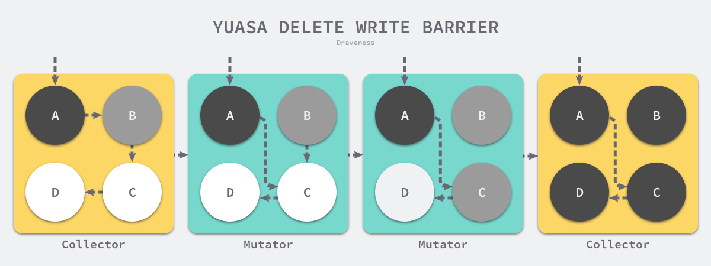

**图 39 - Yuasa 删除写屏障**

假设我们在应用程序中使用 Yuasa 提出的删除写屏障，在一个垃圾收集器和用户程序交替运行的场景中会出现如上图所示的标记过程：

  1. 垃圾收集器将根对象指向 A 对象标记成黑色并将 A 对象指向的对象 B 标记成灰色；
  2. 用户程序将 A 对象原本指向 B 的指针指向 C，触发删除写屏障，但是因为 B 对象已经是灰色的，所以不做改变；
  3. **用户程序将 B 对象原本指向 C 的指针删除，触发删除写屏障，白色的 C 对象被涂成灰色**；
  4. 垃圾收集器依次遍历程序中的其他灰色对象，将它们分别标记成黑色；

上述过程中的第三步触发了 Yuasa 删除写屏障的着色，因为用户程序删除了 B 指向 C 对象的指针，所以 C 和 D 两个对象会分别违反强三色不变性和弱三色不变性：

  * 强三色不变性 — 黑色的 A 对象直接指向白色的 C 对象；
  * 弱三色不变性 — 垃圾收集器无法从某个灰色对象出发，经过几个连续的白色对象访问白色的 C 和 D 两个对象；

Yuasa 删除写屏障通过对 C 对象的着色，保证了 C 对象和下游的 D 对象能够在这一次垃圾收集的循环中存活，避免发生悬挂指针以保证用户程序的正确性。

### 总结

内存管理在今天仍然是十分重要的话题，当我们在讨论编程语言的性能和便利程度时，内存管理机制都是绕不开的。编程语言在设计内存管理机制时，往往需要在手动管理和自动管理之间进行抉择，现代的大多数编程语言为了减少工程师的负担，多数都会选择使用垃圾回收的方式自动管理内存，但是也有少数编程语言通过手动管理追求极致的性能。

想要在一篇文章中详尽展示内存管理的方方面面是不可能的，我们可能需要一本书或者几本书的厚度才能详细地展示内存管理的相关技术，这里更多侧重的还是垃圾回收，Rust 的所有权、生命周期以及 C++ 的智能指针等机制在文章中都没有提及，感兴趣的读者可以自行了解。


1. Wikipedia: Static variable <https://en.wikipedia.org/wiki/Static_variable> [↩︎](https://draven.co/system-design-memory-management/#fnref:1)
2. Wikipedia: Stack-based memory allocation <https://en.wikipedia.org/wiki/Stack-based_memory_allocation> [↩︎](https://draven.co/system-design-memory-management/#fnref:2)
3. Wikipedia: Garbage collection (computer science) <https://en.wikipedia.org/wiki/Garbage_collection_(computer_science)> [↩︎](https://draven.co/system-design-memory-management/#fnref:3)
4. Wikipedia: Garbage (computer science) <https://en.wikipedia.org/wiki/Garbage_(computer_science)> [↩︎](https://draven.co/system-design-memory-management/#fnref:4)
5. Garbage Collection in Java (1) - Heap Overview <http://insightfullogic.com/2013/Feb/20/garbage-collection-java-1/> [↩︎](https://draven.co/system-design-memory-management/#fnref:5)
6. Immix: A Mark-Region Garbage Collector with Space Efficiency, Fast Collection, and Mutator Performance. Stephen M. Blackburn. Kathryn S. McKinley. 2008. <http://www.cs.utexas.edu/users/speedway/DaCapo/papers/immix-pldi-2008.pdf> [↩︎](https://draven.co/system-design-memory-management/#fnref:6)
7. The CS 6120 Course Blog. Siqiu Yao. 2019. <https://www.cs.cornell.edu/courses/cs6120/2019fa/blog/immix/> [↩︎](https://draven.co/system-design-memory-management/#fnref:7)
8. “Tri-color marking” <https://en.wikipedia.org/wiki/Tracing_garbage_collection#Tri-color_marking> [↩︎](https://draven.co/system-design-memory-management/#fnref:8)
9. “Dangling pointer” <https://en.wikipedia.org/wiki/Dangling_pointer> [↩︎](https://draven.co/system-design-memory-management/#fnref:9)
10. “Wikpedia: Memory barrier” <https://en.wikipedia.org/wiki/Memory_barrier> [↩︎](https://draven.co/system-design-memory-management/#fnref:10)
11. P. P. Pirinen. Barrier techniques for incremental tracing. In ACM SIGPLAN Notices, 34(3), 20–25, October 1998. <https://dl.acm.org/doi/10.1145/301589.286863> [↩︎](https://draven.co/system-design-memory-management/#fnref:11)
12. E. W. Dijkstra, L. Lamport, A. J. Martin, C. S. Scholten, and E. F. Steffens. On-the-fly garbage collection: An exercise in cooperation. Communications of the ACM, 21(11), 966–975, 1978. <https://www.cs.utexas.edu/users/EWD/transcriptions/EWD05xx/EWD520.html> [↩︎](https://draven.co/system-design-memory-management/#fnref:12)
13. T. Yuasa. Real-time garbage collection on general-purpose machines. Journal of Systems and Software, 11(3):181–198, 1990. <https://www.sciencedirect.com/science/article/pii/016412129090084Y> [↩︎](https://draven.co/system-design-memory-management/#fnref:13)
14. Paul R Wilson. “Uniprocessor Garbage Collection Techniques” <https://www.cs.cmu.edu/~fp/courses/15411-f14/misc/wilson94-gc.pdf> [↩︎](https://draven.co/system-design-memory-management/#fnref:14)
