<!--BEGIN_DATA
{
    "create_date": "2020-12-26 21:50", 
    "modify_date": "2020-12-26 21:50", 
    "is_top": "0", 
    "summary": "前向纠错FEC算法实现原理 自适应ARQ算法实践 使用FEC改善UDP（RTP）音视频传输效果", 
    "tags": "WebRTC", 
    "file_name": "前向纠错FEC算法实现原理与自适应ARQ算法实践.md"
}
END_DATA-->

#### 
原文出处：<a href='https://www.smiletoyou.cn/?p=319' target='blank'>前向纠错FEC算法实现原理</a>

### 前向纠错算法介绍

前向纠错（FEC）算法被广泛使用在实时音视频领域提升音视频的弱网抗性，只要收到FEC分组内的冗余包和一定数量的数据包，就能根据FEC算法恢复出对应的冗余包。常见的FEC实现包括M+1系列的异或算法、M+N系列的RS矩阵算法，这2种实现算法各有优缺点。

异或算法实现相对简单，将M个数据包逐字节进行异或计算，计算得到的结果即为冗余包。这种算法只需要进行异常运算，复杂度低。但是抗丢包能力弱，例如4+1算法，5个包里面最多只能丢1个包，否则就无法恢复。

**在实时音视频领域主要采用M+N系列的CRS矩阵算法。**

### CRS矩阵运算原理

CRS矩阵算法，RS编码只是一种应对擦除的编码，也就是应对数据块丢失的场景，并且我们是知道哪一块丢失的，然后我们可以通过冗余信息把丢失的数据块找回来。CRS指的是Cauthy RS，其中用到了柯西矩阵。计算过程相对复杂，一般需要在GF(2^8)伽罗瓦域上进行运算。具体计算过程，如下所示。

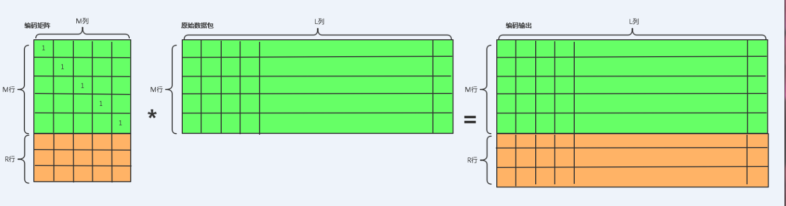

假设我们有个M个数据包，想要得到N个冗余包，一次异或计算只能得到一个冗余包，无法实现。如果直接用编码矩阵(M+N)*矩阵M，就可以得到一个M+N行的编码输出矩阵，其中L为原始数据包的长度。

### CRS矩阵编码过程

编码输出矩阵的M行为原始数据，因此编码矩阵的前M行必须是一个M*M的单位阵，后N行要满足在编码矩阵M+N行中随便选择M行组成的子矩阵都是可逆的，柯西矩阵以算法复杂度较低被选中。矩阵的运算都是逐字节进行的，而单个字节能够表示的范围为0～256，如果直接进行矩阵运算得到的结果肯定会超过单个字节的上限，因此要把矩阵运算放到GF(2^8)伽罗瓦域上进行计算。

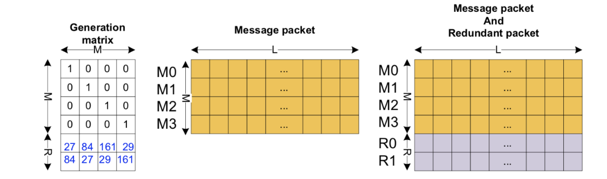

  * 构造生成矩阵：生成矩阵前M项是一个单位阵，后R项是一个柯西矩阵（便于求逆）。
  * 生成冗余数据：将M个原始数据包与生成矩阵做伽罗华域上的矩阵运算，即可得到N个冗余包。
  * 将数据包与冗余包通过网络发送，FEC恢复最多带来（M+1)个数据包间隔。

数据在网络中传输发生丢包，只要丢失的包个数小于N，就可以通过CRS恢复原始数据。例如，采用FEC 4+2，丢失2个数据包的恢复过程。  
  
### RS矩阵解码恢复过程

接收端收到数据包后，检测到编码输出数据包中前M个包中有数据包丢失，只要丢失的包不超过冗余包个数N，就可以从收到的数据包和冗余包里选出M个数据包，当然这M个数据包对应编码矩阵中的M行，只要从编码矩阵中选出来的M行组成的可逆，就可以计算出丢失的数据。

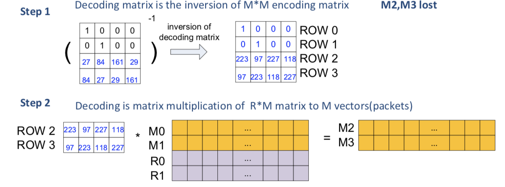

  * 求解恢复矩阵：在生成矩阵里面根据收到的数据包以及冗余包，（填充丢失数据包的位置）构成生成矩阵的子矩阵，对子矩阵求逆，得到恢复矩阵。
  * 数据包恢复：选取收到的数据包以及冗余数据与恢复矩阵进行伽罗华域上的矩阵运算，求解出丢失的数据包。

数据恢复的关键步骤在于矩阵求逆，通常采用LU分解算法，时间消耗达到N^3 。

### FEC算法关键优化点

FEC算法在伽罗华域的计算方式，可以进一步优化。在运算上主要有以下方面。

  * 根据冗余包个数，按照特定的规则生成编码矩阵。
  * 将伽罗华域上的乘、除法转换成二的幂次加减，查表计算。
  * 矩阵求逆采用LDU算法，将时间消耗保持在N^2。

### 实践经验

之前实现过一个版本的FEC算法，为了减少运算量，采用以时间换空间的算法将生成矩阵与逆矩阵提前计算好。在进行数据恢复时，根据M和N的组合方式找到对应子矩阵，再根据子矩阵找到对应的逆矩阵。缺点也很明显，只支持特定几种类型的FEC算法，抗连续丢包能力弱。

#### 
原文出处：<a href='https://www.smiletoyou.cn/?p=358' target='blank'>自适应ARQ算法实践</a>

在实时音视频领域，数据传输强调实时性，通常选择UDP协议可靠性就会降低。数据包发生丢包，就会引起解码失败，导致接收端发生卡顿影响用户体验。

### 抗丢包技术综述

实时音视频类应用需要保证数据传输的可靠性，需要应用自身实现抗丢包、抗抖动、抗拥塞算法。本文重点介绍抗丢包技术，下图为业界主要的抗丢包技术。

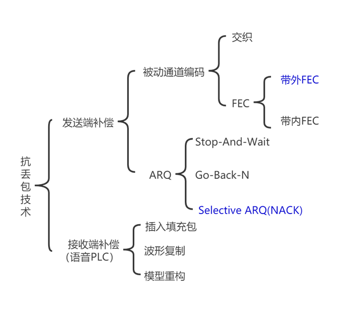

从图中可以看出，网络层弱网优化主要的技术包括前向纠错FEC、ARQ。FEC 恢复延时低，但会带来带宽消耗的增长。ARQ恢复延时较大，带宽消耗下。在低延时场景下，可以充分利用ARQ 进行丢包恢复。

### ARQ算法介绍

ARQ 是通过重传关键数据包来纠错的信道保护算法，包括三种形式：

1.Stop-and-waitARQ，发送端发送数据包后就停止并等待接收端的确认消息。
2.Go-Back-NARQ，发送端不需等待接收端的确认，直到收到接收端的重传请求。发送端除了重传被要求重传的数据包以外，还会把该数据包时间戳后面一批数据包全部重传一遍。
3.SelectiveRepeat ARQ，发送端不需等待接收端的确认；接收端只会有选择性地对关键的数据包发送非确认响应（NACK）包，要求重传。

前两种 ARQ传输实时性较低，不适用于实时音视频场景，实时音视频中主要采用NACK选择性丢包重传。

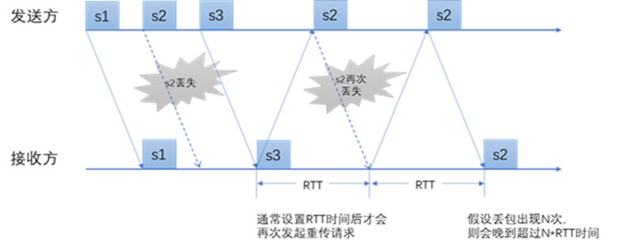

接收方在检测到数据包s2丢失后，会向发送方请求s2，等待1倍RTT时间后才会再次发起s2的重传请求。数据包的请求次数不会无限制持续发送，会有一个上限配置，这样做也会有以下几个问题。

  1. 如果丢包很高，数据包的重传请求次数已达上限还没有重传成功，数据包恢复失败。
  2. 如果媒体层已经播放到s3，还继续重传请求s2，即使收到s2媒体层也不会播放，重传包晚到。
  3. 如果当前发生了丢包，数据包会有延时，媒体层的buff没有适配继续匀速播放，重传利用率还是会下降。
  4. 当丢包率达到60%+，如果连续丢了8个，根据收到下一个seq传触发重传，就需要等到 320ms才能开始发送重传请求，会带来很大的延时。

**NACK** （**SelectiveRepeat ARQ ）在实时音视频的实践**

实时音视频领域，ARQ需要与媒体层进行联动，ARQ需要知道媒体层当前解码seq，媒体层需要知道当前的重传延时。 业界的优化思路主要包括如下策略。  
  
**重传与引擎联动** ，引擎同步当前解码seq、重传队列根据解码seq删除过期的待恢复seq。  
**主动重传**，增加数据包达到预估，如果下一个数据超过一定时间还没有到来，就主动发起重传NACK请求。   
**重传恢复延时反馈引擎**，网络层重传队列预估数据包重传回来需要的时间，将这个时间同步到引擎，用于调节jitterbuf水位，增加重传利用率。

 
#### 
原文出处：<a href='https://blog.csdn.net/mediapro/article/details/50393685' target='blank'>使用FEC改善UDP（RTP）音视频传输效果</a>

### 实时音视频领域UDP才是王道

在 Internet 上进行音视频实时互动采用的传输层方案有TCP（如：RTMP）和UDP（如：RTP）两种。TCP协议能为两个端点间的数据传输提供相对可靠的保障，这种保障是通过一个握手机制实现的。当数据传给接收者时，接收者要检查数据的正确性。发送者只有接到接收者的正确性认可才能发送下一个数据块。

如果没有接到确认报文，这个数据块就得重传。尽管这种机制对传送数据来说是非常合理的，但当用它在Internet传输实时音视频数据时就会引发很多问题。首先就是延迟问题，在传输信道丢包率较高时，TCP的传输质量下滑严重，重传拥塞导致音视频延时非常大，失去实时互通的意义。特别是无线信道（WIFI、4G、3G）下，使用TCP做双向互通通讯稳定性欠佳，易出现音视频长时间卡住不动然后快放的现象。

更多的产品选择采用的协议是UDP（一般上层应用层协议为RTP，以提供序号和音视频同步的服务）。UDP同 TCP 相比能提供更高的吞吐量和较低的延迟，非常适合低延时的音视频互动场合。

### UDP传输存在的问题：

UDP性能的提高是以不能保障数据完整性为代价的，它不能对所传数据提供担保，常见的问题有包乱序、包丢失、包重复。无线信道（WIFI、4G、3G）下，UDP包乱序和包丢失可以说是常态。

关于包乱序和包丢失的原因，参考诸多文献总结如下：

乱序原因：

1. 路由器的存储队列导致的包乱序。
2. UDP包据经过不同的路由造成了发送数据的混乱。

丢包原因：  

1. 当路由器和网关发生拥塞时，某些包可能被丢弃，发生这种情况一般是由于网络中传输的数据包大于网络信道的承载能力。  
2. 分组数据在传送时有生存时间限制以避免路由中死循环的出现，网络状况恶劣时，分组可能超时丢失。  
3. 接收端工作超载运行时可能因调度困难而不能及时处理网口数据。

视频码流的少量丢失都会导致解码后的视频出现花屏的现象。H264、HEVC这样的高压缩率视频压缩标准使得压缩的冗余度非常低，码流的丢失除了影响本帧的解码外，还将影响以此为参考的视频帧解码，导致花屏的累积扩散，直至下一个关键帧的到来视频画面方能恢复。虽然解码器内部会做一定的错误掩盖处理，但效果并不理想，特别是采用ffmpeg这类开源的解码器，其错误掩盖算法做得比较简单。为此，在很多产品中不得不采用较小的GOP（较小的I帧间隔），以期在出现丢包花屏后能尽快的用I帧码流刷新画面。这种方法副作用较大，而且某些场合下甚至会适得其反。因为I帧压缩效率远不如P帧、B帧，I帧往往比P帧、B帧大很多，频繁的I帧将给传输信道带来持续的波动压力，造成更严重的丢包、乱序。另外，因为编码器码率控制的缘故，I帧占用较多的码流后，紧接着的P、B帧将不得不采用较大的QP量化参数（较差的图像质量）以保证码率的局部可控，这样带来的直观感受是图像随着I帧间隔周期性的发虚、马赛克。乱序的UDP包不经过顺序恢复直接送解码器同样会导致解码花屏，因为解码器内部会将迟到的数据包丢弃。

综上所述，工程中急需一种抗丢包、抗乱序的增强型UDP方案来提升实时音视频传输效果，经过多年的积累与完善，我们推出了一套基于RTP并采用FEC前向纠错和后端QOS处理的完整解决方案，效果非常明显。

### 使用FEC\QOS武装RTP

对于丢包，我们采用改进型的vandermonde矩阵FEC(Forward Error/Erasure Correction）前向纠错技术来进行丢包恢复，由发送方进行FEC编码引入冗余包，接收方进行FEC解码并恢复丢失的数据包。

对于包乱序和包重复，我们采用QOS乱序恢复处理，该QOS方案特点是在没有丢包的情况下，不引入任何系统延时，并且可以通过可控的丢包等待时延来适应不同的信道乱序程度。QOS需要在接收端进行FEC解码前进行，确保送FEC解码模块的数据包序号是正确的（不存在乱序，仅存在丢包）。

众多产品案例表明：采用FEC+QOS+RTP的组合，能显著提升UDP传输的丢包、乱序抵抗力，为上层音视频服务提供有力保障。下图1是各模块在系统中的位置说明。

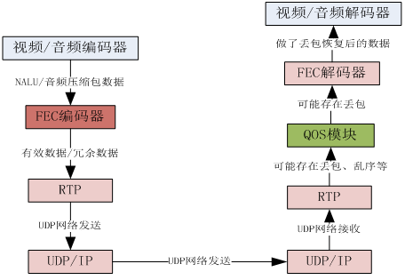  

图1 FEC、QOS在RTP系统中的位置

需要说明如下几点：

1. 从差错控制角度看，传输信道可以分为随机信道、突发信道和混合信道。在随机信道中，丢包出现是随机的，且相互统计独立，满足正态分布。在突发信道中，丢包是集中出现的，在一些短促的时间区间会出现大量的丢包，而在这些时间区间之外又存在较长的无丢包区间。混合信道则是上述二者的合体。本方案侧重于对具备随机信道特性的传输链路进行改进优化。

> 对 Internet信道的丢包特性研究发现，大多数情况下其满足随机信道的特点，丢失的都是单个包。连续两个或以上包同时丢失的概率虽然比纯随机过程要高，但发生的概率还是要比单包丢失低，发生连续丢失10个以上包的概率就更低了。由于单包丢失出现的最频繁，我们的抗丢包方案主要侧重于对单包丢失的修复，同时也应该兼顾连续丢失的少量包的修复。对大量连续丢失的包的修复相对来说就显得不那么重要了（出现概率低，修复的代价大）。

2. 当然，任何差错控制方案都是有其最大纠错能力限制，当丢包率超出当前系统的纠错能力时，丢包无法恢复，对于视频应用来说意味着视频将出现花屏。

> 为了改善系统在高丢包率下的用户体验，避免长时间花屏无法刷新的现象，我们建议使用者采用ARQ（自动请求重发）+FEC机制，这里的ARQ请求并不是请求远端重发丢失的数据包，因为那样相当于走了TCP这类内嵌ARQ功能协议的老路，必然引入不可控的延时。这里的ARQ只是请求远端即刻编码视频关键帧，避免长时间花屏无法刷新的现象，ARQ请求一般通过额外的TCP信道发出（在绝大多数的系统中，通讯双方一般会有TCP的信令通道，用于双方业务层信令的交互）。ARQ的发起是根据FEC解码输出视频码流是否丢包作为判断依据，发送端和接收端都需要对ARQ的频率做一定的保护措施，避免频繁的发起和响应，造成过多的I帧（过多I帧的副作用前面已有列举）。

### 测试效果

本方案为C++开发，提供PC、Android（JNI）、IOS跨平台的支持。为了方便测试，我们在PC下开发了几个简易测试DEMO用于验证演示。

**（A）数据验证DEMO**

下图所示为数据验证DEMO界面，它以指定的数据作为测试源，可帮助用户更好的理解处理流程。

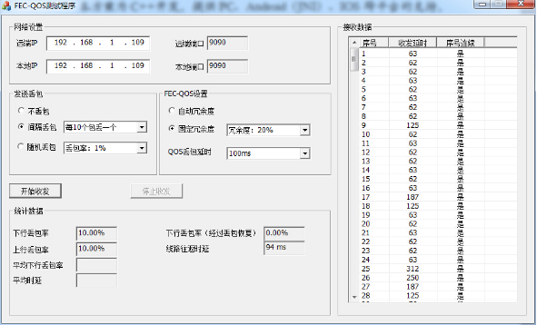  

图2  数据流程验证DEMO  
  
测试工具为点对点工作模式，可在两台PC上各自运行（同时也支持单机模式，只需将收发IP地址均设置为本地IP即可），以实现双方之间RTP（FEC+QOS）通讯。

软件收发自定义的测试包数据，提供了模拟丢包功能，支持按固定间隔丢包或者按随机比率丢包；支持设置FEC冗余度或者选择冗余度自适应，支持设置QOS丢包等待时延等参数。

测试工具内部默认使用10个媒体包外加冗余度（数量由选择的冗余度决定）作为一个GROUP，当选择冗余度20%时，一个GROUP由10个媒体包附加2个冗余包组成。下图是Wireshark的观察情况，10个媒体包后面紧接着2个冗余包。

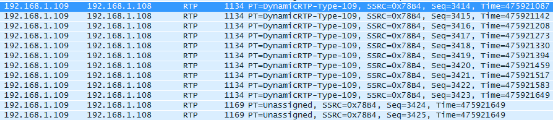

图3 Wireshark观察冗余包情况

需要说明的是：程序主动丢包是在UDP发送层进行，所以即可能丢媒体包也可能丢冗余包。

下面我们以20%冗余度为例说明系统对各类丢包率的抵抗能力。

当选择每10个包丢1个包时（丢包率10%），一个GROUP中最多只会丢弃1个包，20%的冗余度足够抵抗这一丢包率，测试结果也验证了这一结论，接收到的所有媒体包序号均保持连续，丢包率从10%降为0%，实验情况如上图2所示。

当选择每5个包丢弃1个包时（丢包率20%），丢包情况如下图4所示：

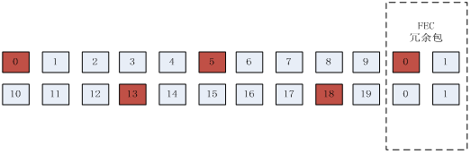

图4  每5个包丢弃1个包时的情况

对于第一个GROUP，一共丢弃了三个包，包括0号媒体包、5号媒体包、0号冗余包。因为接收的媒体包数为8个加接收的冗余包数1个，总数小于总媒体包数（10个），因此接收端FEC无法恢复。对于第二个GROUP，只丢失了两个媒体包，可以正常恢复。实验结果如下图5所示，说明了推断的正确性，0号媒体包、5号媒体包丢失，13号、18号媒体包被成功恢复，系统丢包率从20%降低到10%左右。

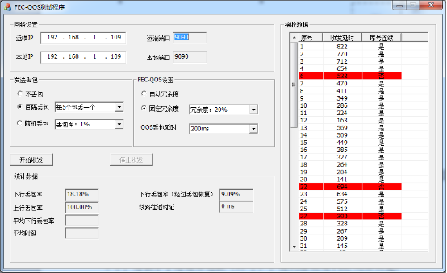  

图5  20%冗余度时，每5个包丢弃1个包时的恢复情况

**（B）音视频实测DEMO**

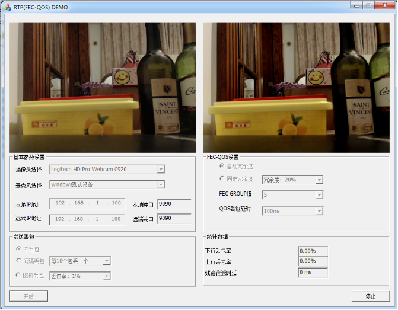  

图6 音视频实测DEMO

本DEMO支持如下特性：

（1）使用Direct进行摄像头、麦克风的采集和输出

（2）使用ffmpeg进行高效图像缩放等前置filter

（3）视频H264 HighProfile编码、解码

（4）音频AAC-LC、AAC-LD、AAC-ELD编码、解码（三种标准可选，44.1KHZ 16bit 2通道立体声）

（5）音视频RTP传输（带FEC\QOS功能）

（6）人为丢包测试功能

（7）实时统计输出线路丢包延时情况

DEMO的内部框架如下图7所示：

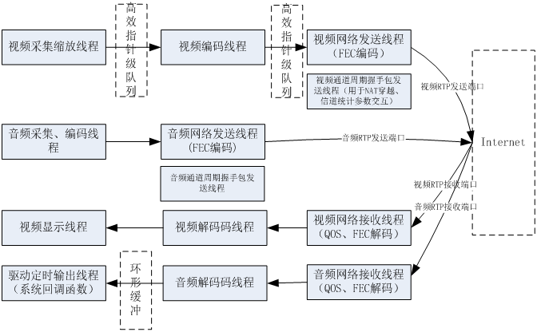

图7  DEMO内部线程框架

在视频采集缩放线程与视频编码线程之间，我们采用高效的双队列机制（队列元素为指针，进出队列无数据拷贝），如果视频编码性能非常充足的情况下，我们也可以将二者合并为一个线程。编码线程与网络发送线程分离，避免网络拥塞影响编码线程（这个对于UDP来说不成立，但对于RTMP这类TCP系统来说，网络收发线程与音视频编解码线程的分离是必须的，因为网络的抖动将影响音视频处理环节。站在系统设计的角度，我们为UDP和TCP统一使用上述架构）。

在音视频发送模块内，我们都配有定时握手包发送线程，这个线程与音视频使用相同的发送通道（端口），仅在包头上予以区别。它的作用非常重要，主要包括两个方面：为NAT穿越提供保障，当我们的客户端（内网IP）向服务器（公网IP）发送数据时，链路路由器会为该通讯链路映射“端口”，这样服务器（公网IP）向该客户端发送数据时，只需将收到的数据包的IP地址和端口翻转作为发送目标IP和端口便能向其发送数据。路由器在收到服务器的数据包时，检查本地存在对应的映射“端口”，予以放行，否则将丢弃这一数据包（这是基于安全的考虑，外网向内网发送数据不得不防）。值得注意的是，路由器上“端口”是有时效性的，超过一定时间即会失效，为了保证服务器能持续有效的向客户端发送数据，客户端必须以心跳包的方式向服务器发送数据以保持“端口”的有效性（客户端根据业务情况不一定向服务器持续发送数据包，可能只作为接收者）。

以上是对C/S模式下NAT的简要描述，P2P模式等其他情况请参考专门的资料。定时握手包的另一个作用是传输自定义的信道统计数据，这个类似于RTCP协议，接收方统计出下行丢包率后可以通过本握手包告知发送方，以便通知对方调整发送甚至编码策略。

音频的处理流程与视频类似，因为音频编码耗时非常低，我们一般将音频采集与编码放到一个线程内进行。音频的输出与视频不同，因为它需要按固定的输出频率工作，驱动将发起定时输出线程，我们只需要在该线程内向指定内存存入指定数量的PCM数据即可。（输出频率、存放数量由音频输出通道数、采样率、采样点字节数的配置而定）

若本地IP与远端IP设置一样，DEMO则进入本地回环模式，此时将不存在任何网络丢包，我们可以通过设置手动丢包来模拟测试。若本地IP与远端IP不同，且不属于同一网段，我们可以使用开源的WANEM来进行模拟丢包、延时、抖动、重复包等情况，这一方式后面我们将专门予以介绍。

**注意：真实的视频对比效果请跳转[视频对比效果](http://www.mediapro.cc/?page_id=14) 观看**

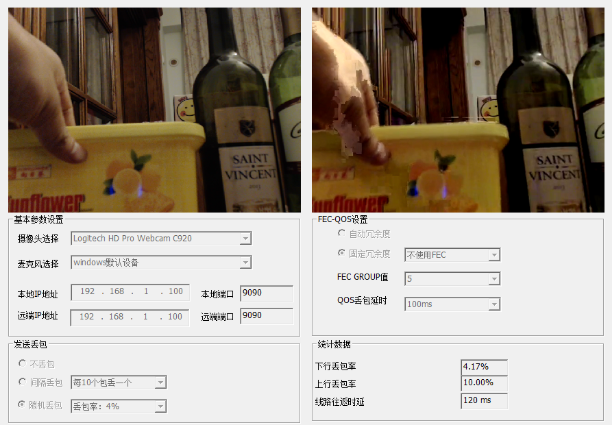  
图8 使用4%随机丢包，关闭FEC时经常性花屏，声音间歇断续

当使用4%随机丢包时，若关闭发端FEC功能，接收端视频将出现经常性花屏，声音出现丢失断续。若使用20%冗余度，视频花屏概率将大幅降低（不会完全消除，因为丢包是随机的，短时间内可能出现连续大量丢包的情况，超过20%冗余度的无失真抗丢包率是16.67%即会出现花屏）

若使用按间隔丢包，每6个包丢一个（丢包率将恒定为16.67%），此时选择20%冗余度可以实现无失真恢复，视频流畅无花屏，音质良好无断续。

  

图7 使用16.67%恒定丢包，FEC使用20%冗余度时音视频效果良好

