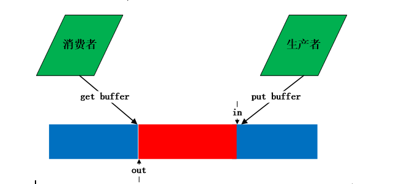
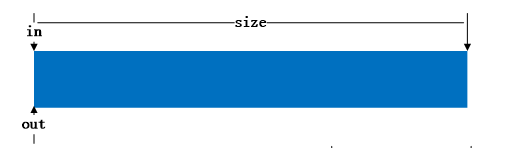
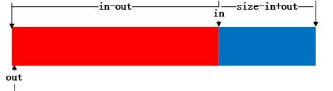
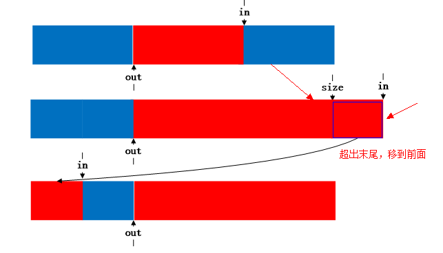
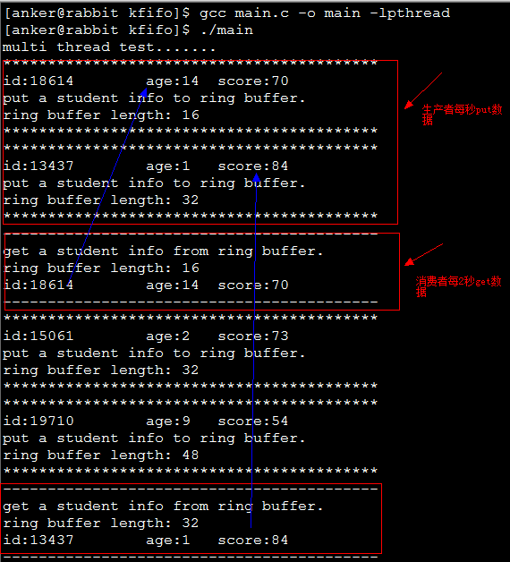

 
<!--BEGIN_DATA
{
    "create_date": "2016-08-19 12:01", 
    "modify_date": "2016-08-19 12:01", 
    "is_top": "0", 
    "summary": "匠心独运的kfifo", 
    "tags": "C/C++、Linux", 
    "file_name": "匠心独运的kfifo.md"
}
END_DATA-->

####<p>原文出处：<a href='http://blog.csdn.net/chen19870707/article/details/39899743' target='blank'>眉目传情之匠心独运的kfifo</a></p>

  
###一、kfifo概述

本文分析的原代码版本

2.6.32.63

kfifo的头文件

[include/linux/kfifo.h](https://git.kernel.org/cgit/linux/kernel/git/stable/linux-stable.git/tree/include/linux/kfifo.h?h=linux-2.6.38.y)

kfifo的源文件

[kernel/kfifo.c](https://git.kernel.org/cgit/linux/kernel/git/stable/linux-stable.git/tree/kernel/kfifo.c?h=linux-2.6.38.y)


kfifo是一种"First In First Out “数据结构，它采用了前面提到的环形缓冲区来实现，提供一个无边界的字节流服务。采用环形缓冲区的好处为，**当一个数据元素被用掉后，其余数据元素不需要移动其存储位置**，从而减少拷贝提高效率。更重要的是，kfifo采用了**并行无锁**技术，**kfifo实现的单生产/单消费模式的共享队列是不需要加锁同步的。**

    
    
    struct kfifo {
        unsigned char *buffer;    /* the buffer holding the data */
        unsigned int size;    /* the size of the allocated buffer */
        unsigned int in;    /* data is added at offset (in % size) */
        unsigned int out;    /* data is extracted from off. (out % size) */
        spinlock_t *lock;    /* protects concurrent modifications */
    };

buffer

用于存放数据的缓存

size

缓冲区空间的大小，在初化时，**将它向上圆整成2的幂**

in

指向buffer中队头

out

指向buffer中的队尾

lock

如果使用不能保证任何时间最多只有一个读线程和写线程，必须使用该lock实施同步。


它的结构如图：


这看起来与普通的环形缓冲区没有什么差别，但是让人叹为观止的地方就是它巧妙的用 in 和 out 的关系和特性，处理各种操作，下面我们来详细分析。


###二、kfifo内存分配和初始化


首先，看一个很有趣的函数，判断一个数是否为2的次幂，按照一般的思路，求一个数n是否为2的次幂的方法为看 n % 2 是否等于0，
我们知道**“取模运算”的效率并没有 “位运算” 的效率高**，有兴趣的同学可以自己做下实验。下面再验证一下这样取2的模的正确性，若n为2的次幂，则n和n-
1的二进制各个位肯定不同 (如8(1000)和7(0111))，&出来的结果肯定是0；如果n不为2的次幂，则各个位肯定有相同的 (如7(0111)
和6(0110))，&出来结果肯定为0。是不是很巧妙？

     
    bool is_power_of_2(unsigned long n)
    {
        return (n != 0 && ((n & (n - 1)) == 0));
    }

再看下kfifo内存分配和初始化的代码，前面提到kfifo总是对size进行2次幂的圆整，这样的好处不言而喻，可以将kfifo->size取模运算可以转化为
与运算，如下：  
           **kfifo->in % kfifo->size 可以转化为 kfifo->in & (kfifo->size – 1)**

“取模运算”的效率并没有 “位运算” 的效率高还记得不，不放过任何一点可以提高效率的地方。

    
    
    struct kfifo *kfifo_alloc(unsigned int size, gfp_t gfp_mask, spinlock_t *lock)
    {
        unsigned char *buffer;

        struct kfifo *ret;
        
        /*
         * round up to the next power of 2, since our 'let the indices
         * wrap' technique works only in this case.
         */
        if (!is_power_of_2(size)) {
            BUG_ON(size > 0x80000000);
            size = roundup_pow_of_two(size);
        }

        buffer = kmalloc(size, gfp_mask);
        if (!buffer)
            return ERR_PTR(-ENOMEM);

        ret = kfifo_init(buffer, size, gfp_mask, lock);

        if (IS_ERR(ret))
            kfree(buffer);

        return ret;
    }


###三、kfifo并发无锁奥秘---内存屏障

 **  **

**   为什么kfifo实现的单****生产/单消费模式的共享队列是不需要加锁同步的呢？**天底下没有免费的午餐的道理人人都懂，下面我们就来看看kfifo实现并发无锁的奥秘。

我们知道 编译器编译源代码时，会将源代码进行优化，**将源代码的指令进行重排序，**以适合于CPU的并行执行。然而，内核同步必须避免指令重新排序，优化屏障（
Optimization barrier）避免编译器的重排序优化操作，**保证编译程序时在优化屏障之前的指令不会在优化屏障之后执行**。

举个例子，如果多核CPU执行以下程序：

    a = 1;

    b = a + 1;

    assert(b == 2);

假设初始时a和b的值都是0，a处于CPU1-cache中，b处于CPU0-cache中。如果按照下面流程执行这段代码：

_1 CPU0执行a=1;  
2 因为a在CPU1-cache中，所以CPU0发送一个read invalidate消息来占有数据  
3 CPU0将a存入store buffer  
4 CPU1接收到read invalidate消息，于是它传递cache-line，并从自己的cache中移出该cache-line  
5 CPU0开始执行b=a+1;  
6 CPU0接收到了CPU1传递来的cache-line，即“a=0”  
7 CPU0从cache中读取a的值，即“0”  
8 CPU0更新cache-line，将store buffer中的数据写入，即“a=1”  
9 CPU0使用读取到的a的值“0”，执行加1操作，并将结果“1”写入b（b在CPU0-cache中，所以直接进行）  
10 CPU0执行assert(b == 2); 失败_

软件可通过读写**屏障强制内存访问次序**。读写屏障像一堵墙，所有在设置读写屏障之前发起的内存访问，必须先于在设置屏障之后发起的内存访问之前完成，确保**内
存访问按程序的顺序完成**。Linux内核提供的内存屏障API函数说明如下表。内存屏障可用于多处理器和单处理器系统，如果仅用于多处理器系统，就使用smp_x
xx函数，在单处理器系统上，它们什么都不要。

    
    
    smp_rmb

适用于多处理器的读内存屏障。

    
    
    smp_wmb

适用于多处理器的写内存屏障。

    
    
    smp_mb

适用于多处理器的内存屏障。

如果对上述代码加上内存屏障,就能保证在CPU0取a时，一定已经设置好了a = 1:

    
    
    void foo(void)
    {
         a = 1;

         smp_wmb();

         b = a + 1;
    }

这里只是简单介绍了内存屏障的概念，如果想对内存屏障有进一步理解,请参考我的译文《[为什么需要内存屏障](http://blog.csdn.net/chen1
9870707/article/details/39896655)》。


###四、kfifo的入队__kfifo_put和出队__kfifo_get操作


      __kfifo_put是入队操作，它先将数据放入buffer中，然后移动in的位置，其源代码如下：
    
    
    unsigned int __kfifo_put(struct kfifo *fifo,
                const unsigned char *buffer, unsigned int len)
    {
        unsigned int l;

        len = min(len, fifo->size - fifo->in + fifo->out);

        /*
         * Ensure that we sample the fifo->out index -before- we
         * start putting bytes into the kfifo.
         */

        smp_mb();

        /* first put the data starting from fifo->in to buffer end */

        l = min(len, fifo->size - (fifo->in & (fifo->size - 1)));
        memcpy(fifo->buffer + (fifo->in & (fifo->size - 1)), buffer, l);

        /* then put the rest (if any) at the beginning of the buffer */
        memcpy(fifo->buffer, buffer + l, len - l);

        /*
         * Ensure that we add the bytes to the kfifo -before-
         * we update the fifo->in index.
         */


        smp_wmb();

        fifo->in += len;

        return len;
    }


6行，环形缓冲区的剩余容量为fifo->size - fifo->in + fifo->out，让写入的长度取len和剩余容量中较小的，避免写越界；

**13行，加内存屏障，保证在开始放入数据之前，fifo->out取到正确的值（另一个CPU可能正在改写out值）**

16行，前面讲到fifo->size已经2的次幂圆整，而且kfifo->in % kfifo->size 可以转化为 kfifo->in &
(kfifo->size – 1)，所以fifo->size - (fifo->in & (fifo->size - 1)) 即位 fifo->in 到
buffer末尾所剩余的长度，l取len和剩余长度的最小值，即为需要拷贝l 字节到fifo->buffer + fifo->in的位置上。

17行，拷贝l 字节到fifo->buffer + fifo->in的位置上，如果l = len，则已拷贝完成，第20行len – l
为0，将不执行，如果l = fifo->size - (fifo->in & (fifo->size - 1)) ，则第20行还需要把剩下的 len – l
长度拷贝到buffer的头部。

**27行，加写内存屏障，保证in 加之前，memcpy的字节已经全部写入buffer，如果不加内存屏障，可能数据还没写完，另一个CPU就来读数据，读到的缓冲区内的数据不完全，因为读数据是通过 in – out 来判断的。**

**29行，注意这里 只是用了 fifo->in +=  len而未取模，这就是kfifo的设计精妙之处，这里用到了unsigned int的溢出性质，当in 持续增加到溢出时又会被置为0，这样就节省了每次in向前增加都要取模的性能，锱铢必较，精益求精，让人不得不佩服。**

****

__kfifo_get是出队操作，它从buffer中取出数据，然后移动out的位置，其源代码如下：

    
    
    unsigned int __kfifo_get(struct kfifo *fifo,
                 unsigned char *buffer, unsigned int len)
    {
        unsigned int l;

        len = min(len, fifo->in - fifo->out);
        
        /*
         * Ensure that we sample the fifo->in index -before- we
         * start removing bytes from the kfifo.
         */

        smp_rmb();

        /* first get the data from fifo->out until the end of the buffer */
        l = min(len, fifo->size - (fifo->out & (fifo->size - 1)));

        memcpy(buffer, fifo->buffer + (fifo->out & (fifo->size - 1)), l);

        /* then get the rest (if any) from the beginning of the buffer */
        memcpy(buffer + l, fifo->buffer, len - l);

        /*
         * Ensure that we remove the bytes from the kfifo -before-
         * we update the fifo->out index.
         */

        smp_mb();

        fifo->out += len;

        return len;
    }


6行，可去读的长度为fifo->in – fifo->out，让读的长度取len和剩余容量中较小的，避免读越界；

**13行，加读内存屏障，保证在开始取数据之前，fifo->in取到正确的值（另一个CPU可能正在改写in值）**

16行，前面讲到fifo->size已经2的次幂圆整，而且kfifo->out % kfifo->size 可以转化为 kfifo->out & (kfifo->size – 1)，所以fifo->size - (fifo->out & (fifo->size - 1)) 即位 fifo->out 到 buffer末尾所剩余的长度，l取len和剩余长度的最小值，即为从fifo->buffer + fifo->in到末尾所要去读的长度。

17行，从fifo->buffer + fifo->out的位置开始读取l长度，如果l = len，则已读取完成，第20行len – l
为0，将不执行，如果l =fifo->size - (fifo->out & (fifo->size - 1)) ，则第20行还需从buffer头部读取
len – l 长。

**27行，加内存屏障，保证在修改out前，已经从buffer中取走了数据，如果不加屏障，可能先执行了增加out的操作，数据还没取完，令一个CPU可能已经往buffer写数据，将数据破坏，因为写数据是通过fifo->size - (fifo->in & (fifo->size - 1))来判断的 。**

**29行，注意这里 只是用了 fifo->out +=  len 也未取模，同样unsigned int的溢出性质，当out 持续增加到溢出时又会被置为0，如果in先溢出，出现 in  < out 的情况，那么 in – out 为负数（又将溢出），in – out 的值还是为buffer中数据的长度。**


这里图解一下 in 先溢出的情况，size = 64， 写入前 in = 4294967291， out = 4294967279 ，数据 in – out = 12;


写入 数据16个字节，则 in + 16 = 4294967307，溢出为 11，此时 in – out = –4294967268，溢出为28，数据长度仍然正确，**由此可见，在这种特殊情况下，这种计算仍然正确，是不是让人叹为观止，妙不可言？**


###五、扩展

kfifo设计精巧，妙不可言，但主要为内核提供服务，内存屏障函数也主要为内核提供服务，并未开放出来，但是我们学习到了这种设计巧妙之处，就可以依葫芦画瓢，写出自己的并发无锁环形缓冲区，这将在下篇文章中给出，至于内存屏障函数的问题，好在**gcc 4.2以上的版本都内置提供__sync_synchronize()这类的函数**，效果相差不多。《[眉目传情之并发无锁环形队列的实现](http://blog.csdn.net/chen19870707/article/details/39994303)》给出自己的并发无锁的实现，有兴趣的朋友可以参考一下。


<hr>


####<p>原文出处：<a href='http://www.cnblogs.com/Anker/p/3481373.html' target='blank'>linux内核数据结构之kfifo</a></p>

**1、前言**

　　最近项目中用到一个环形缓冲区（ring buffer），代码是由linux内核的kfifo改过来的。缓冲区在文件系统中经常用到，通过缓冲区缓解cpu读写内存和读写磁盘的速度。例如一个进程A产生数据发给另外一个进程B，进程B需要对进程A传的数据进行处理并写入文件，如果B没有处理完，则A要延迟发送。为了保证进程
A减少等待时间，可以在A和B之间采用一个缓冲区，A每次将数据存放在缓冲区中，B每次冲缓冲区中取。这是典型的生产者和消费者模型，缓冲区中数据满足FIFO特性，因此可以采用队列进行实现。Linux内核的kfifo正好是一个环形队列，可以用来当作环形缓冲区。生产者与消费者使用缓冲区如下图所示：



环形缓冲区的详细介绍及实现方法可以参考<http://en.wikipedia.org/wiki/Circular_buffer>，介绍的非常详细，列举了实现环形队列的几种方法。环形队列的不便之处在于如何判断队列是空还是满。维基百科上给三种实现方法。

**2、linux 内核kfifo**

kfifo设计的非常巧妙，代码很精简，对于入队和出对处理的出人意料。首先看一下kfifo的数据结构：

    
    
    **struct kfifo {
        unsigned char *buffer;     /* the buffer holding the data */
        unsigned int size;         /* the size of the allocated buffer */
        unsigned int in;           /* data is added at offset (in % size) */
        unsigned int out;          /* data is extracted from off. (out % size) */
        spinlock_t *lock;          /* protects concurrent modifications */
    };**

kfifo提供的方法有：

    
```
//根据给定buffer创建一个kfifo
struct kfifo *kfifo_init(unsigned char *buffer, unsigned int size,
                gfp_t gfp_mask, spinlock_t *lock);
//给定size分配buffer和kfifo
struct kfifo *kfifo_alloc(unsigned int size, gfp_t gfp_mask,
                 spinlock_t *lock);
//释放kfifo空间
void kfifo_free(struct kfifo *fifo)
//向kfifo中添加数据
unsigned int kfifo_put(struct kfifo *fifo,
                const unsigned char *buffer, unsigned int len)
//从kfifo中取数据
unsigned int kfifo_put(struct kfifo *fifo,
                const unsigned char *buffer, unsigned int len)
//获取kfifo中有数据的buffer大小
unsigned int kfifo_len(struct kfifo *fifo)
```

       定义自旋锁的目的为了防止多进程/线程并发使用kfifo。因为in和out在每次get和out时，发生改变。初始化和创建kfifo的源代码如下：
    
    
```
struct kfifo *kfifo_init(unsigned char *buffer, unsigned int size,
             gfp_t gfp_mask, spinlock_t *lock)
{
    struct kfifo *fifo;
    /* size must be a power of 2 */
    BUG_ON(!is_power_of_2(size));
    fifo = kmalloc(sizeof(struct kfifo), gfp_mask);
    if (!fifo)
        return ERR_PTR(-ENOMEM);
    fifo->buffer = buffer;
    fifo->size = size;
    fifo->in = fifo->out = 0;
    fifo->lock = lock;

    return fifo;
}
struct kfifo *kfifo_alloc(unsigned int size, gfp_t gfp_mask, spinlock_t *lock)
{
    unsigned char *buffer;
    struct kfifo *ret;
    if (!is_power_of_2(size)) {
        BUG_ON(size > 0x80000000);
        size = roundup_pow_of_two(size);
    }
    buffer = kmalloc(size, gfp_mask);
    if (!buffer)
        return ERR_PTR(-ENOMEM);
    ret = kfifo_init(buffer, size, gfp_mask, lock);

    if (IS_ERR(ret))
        kfree(buffer);
    return ret;
}
```

在kfifo_init和kfifo_calloc中，kfifo->size的值总是在调用者传进来的size参数的基础上向2的幂扩展，这是内核一贯的做法。这样的好处不言而喻--对kfifo->size取模运算可以转化为与运算，如：**kfifo->in % kfifo->size 可以转化为kfifo->in & (kfifo->size - 1)**

kfifo的巧妙之处在于in和out定义为无符号类型，在put和get时，in和out都是增加，当达到最大值时，产生溢出，使得从0开始，进行循环使用。put和get代码如下所示：
    
    
```
static inline unsigned int kfifo_put(struct kfifo *fifo,
                const unsigned char *buffer, unsigned int len)
{
    unsigned long flags;
    unsigned int ret;
    spin_lock_irqsave(fifo->lock, flags);
    ret = __kfifo_put(fifo, buffer, len);
    spin_unlock_irqrestore(fifo->lock, flags);
    return ret;
}

static inline unsigned int kfifo_get(struct kfifo *fifo,
                     unsigned char *buffer, unsigned int len)
{
    unsigned long flags;
    unsigned int ret;
    spin_lock_irqsave(fifo->lock, flags);
    ret = __kfifo_get(fifo, buffer, len);
        //当fifo->in == fifo->out时，buufer为空
    if (fifo->in == fifo->out)
        fifo->in = fifo->out = 0;
    spin_unlock_irqrestore(fifo->lock, flags);
    return ret;
}


unsigned int __kfifo_put(struct kfifo *fifo,
            const unsigned char *buffer, unsigned int len)
{
    unsigned int l;
       //buffer中空的长度
    len = min(len, fifo->size - fifo->in + fifo->out);
    /*
     * Ensure that we sample the fifo->out index -before- we
     * start putting bytes into the kfifo.
     */
    smp_mb();
    /* first put the data starting from fifo->in to buffer end */
    l = min(len, fifo->size - (fifo->in & (fifo->size - 1)));
    memcpy(fifo->buffer + (fifo->in & (fifo->size - 1)), buffer, l);
    /* then put the rest (if any) at the beginning of the buffer */
    memcpy(fifo->buffer, buffer + l, len - l);

    /*
     * Ensure that we add the bytes to the kfifo -before-
     * we update the fifo->in index.
     */
    smp_wmb();
    fifo->in += len;  //每次累加，到达最大值后溢出，自动转为0
    return len;
}

unsigned int __kfifo_get(struct kfifo *fifo,
             unsigned char *buffer, unsigned int len)
{
    unsigned int l;
        //有数据的缓冲区的长度
    len = min(len, fifo->in - fifo->out);
    /*
     * Ensure that we sample the fifo->in index -before- we
     * start removing bytes from the kfifo.
     */
    smp_rmb();
    /* first get the data from fifo->out until the end of the buffer */
    l = min(len, fifo->size - (fifo->out & (fifo->size - 1)));
    memcpy(buffer, fifo->buffer + (fifo->out & (fifo->size - 1)), l);
    /* then get the rest (if any) from the beginning of the buffer */
    memcpy(buffer + l, fifo->buffer, len - l);
    /*
     * Ensure that we remove the bytes from the kfifo -before-
     * we update the fifo->out index.
     */
    smp_mb();
    fifo->out += len; //每次累加，到达最大值后溢出，自动转为0
    return len;
}
```

put和get在调用__put和__get过程都进行加锁，防止并发。从代码中可以看出put和get都调用两次memcpy，这针对的是边界条件。例如下图：蓝色表示空闲，红色表示占用。

（1）空的kfifo，



（2）put一个buffer后



（3）get一个buffer后


（4）当此时put的buffer长度超出in到末尾长度时，则将剩下的移到头部去



**3、测试程序**

 仿照kfifo编写一个ring_buffer，现有线程互斥量进行并发控制。设计的ring_buffer如下所示：

```
/**@brief 仿照linux kfifo写的ring buffer
 *@atuher Anker  date:2013-12-18
* ring_buffer.h
 * */

#ifndef KFIFO_HEADER_H 
#define KFIFO_HEADER_H

#include <inttypes.h>
#include <string.h>
#include <stdlib.h>
#include <stdio.h>
#include <errno.h>
#include <assert.h>

//判断x是否是2的次方
#define is_power_of_2(x) ((x) != 0 && (((x) & ((x) - 1)) == 0))
//取a和b中最小值
#define min(a, b) (((a) < (b)) ? (a) : (b))

struct ring_buffer
{
    void         *buffer;     //缓冲区
    uint32_t     size;       //大小
    uint32_t     in;         //入口位置
    uint32_t       out;        //出口位置
    pthread_mutex_t *f_lock;    //互斥锁
};
//初始化缓冲区
struct ring_buffer* ring_buffer_init(void *buffer, uint32_t size, pthread_mutex_t *f_lock)
{
    assert(buffer);
    struct ring_buffer *ring_buf = NULL;
    if (!is_power_of_2(size))
    {
    fprintf(stderr,"size must be power of 2.\n");
        return ring_buf;
    }
    ring_buf = (struct ring_buffer *)malloc(sizeof(struct ring_buffer));
    if (!ring_buf)
    {
        fprintf(stderr,"Failed to malloc memory,errno:%u,reason:%s",
            errno, strerror(errno));
        return ring_buf;
    }
    memset(ring_buf, 0, sizeof(struct ring_buffer));
    ring_buf->buffer = buffer;
    ring_buf->size = size;
    ring_buf->in = 0;
    ring_buf->out = 0;
        ring_buf->f_lock = f_lock;
    return ring_buf;
}
//释放缓冲区
void ring_buffer_free(struct ring_buffer *ring_buf)
{
    if (ring_buf)
    {
    if (ring_buf->buffer)
    {
        free(ring_buf->buffer);
        ring_buf->buffer = NULL;
    }
    free(ring_buf);
    ring_buf = NULL;
    }
}

//缓冲区的长度
uint32_t __ring_buffer_len(const struct ring_buffer *ring_buf)
{
    return (ring_buf->in - ring_buf->out);
}

//从缓冲区中取数据
uint32_t __ring_buffer_get(struct ring_buffer *ring_buf, void * buffer, uint32_t size)
{
    assert(ring_buf || buffer);
    uint32_t len = 0;
    size  = min(size, ring_buf->in - ring_buf->out);        
    /* first get the data from fifo->out until the end of the buffer */
    len = min(size, ring_buf->size - (ring_buf->out & (ring_buf->size - 1)));
    memcpy(buffer, ring_buf->buffer + (ring_buf->out & (ring_buf->size - 1)), len);
    /* then get the rest (if any) from the beginning of the buffer */
    memcpy(buffer + len, ring_buf->buffer, size - len);
    ring_buf->out += size;
    return size;
}
//向缓冲区中存放数据
uint32_t __ring_buffer_put(struct ring_buffer *ring_buf, void *buffer, uint32_t size)
{
    assert(ring_buf || buffer);
    uint32_t len = 0;
    size = min(size, ring_buf->size - ring_buf->in + ring_buf->out);
    /* first put the data starting from fifo->in to buffer end */
    len  = min(size, ring_buf->size - (ring_buf->in & (ring_buf->size - 1)));
    memcpy(ring_buf->buffer + (ring_buf->in & (ring_buf->size - 1)), buffer, len);
    /* then put the rest (if any) at the beginning of the buffer */
    memcpy(ring_buf->buffer, buffer + len, size - len);
    ring_buf->in += size;
    return size;
}

uint32_t ring_buffer_len(const struct ring_buffer *ring_buf)
{
    uint32_t len = 0;
    pthread_mutex_lock(ring_buf->f_lock);
    len = __ring_buffer_len(ring_buf);
    pthread_mutex_unlock(ring_buf->f_lock);
    return len;
}

uint32_t ring_buffer_get(struct ring_buffer *ring_buf, void *buffer, uint32_t size)
{
    uint32_t ret;
    pthread_mutex_lock(ring_buf->f_lock);
    ret = __ring_buffer_get(ring_buf, buffer, size);
    //buffer中没有数据
    if (ring_buf->in == ring_buf->out)
    ring_buf->in = ring_buf->out = 0;
    pthread_mutex_unlock(ring_buf->f_lock);
    return ret;
}

uint32_t ring_buffer_put(struct ring_buffer *ring_buf, void *buffer, uint32_t size)
{
    uint32_t ret;
    pthread_mutex_lock(ring_buf->f_lock);
    ret = __ring_buffer_put(ring_buf, buffer, size);
    pthread_mutex_unlock(ring_buf->f_lock);
    return ret;
}
#endif
```

采用多线程模拟生产者和消费者编写测试程序，如下所示：

```
/**@brief ring buffer测试程序，创建两个线程，一个生产者，一个消费者。
 * 生产者每隔1秒向buffer中投入数据，消费者每隔2秒去取数据。
 *@atuher Anker  date:2013-12-18
 * */
#include "ring_buffer.h"
#include <pthread.h>
#include <time.h>

#define BUFFER_SIZE  1024 * 1024

typedef struct student_info
{
    uint64_t stu_id;
    uint32_t age;
    uint32_t score;
}student_info;


void print_student_info(const student_info *stu_info)
{
    assert(stu_info);
    printf("id:%lu\t",stu_info->stu_id);
    printf("age:%u\t",stu_info->age);
    printf("score:%u\n",stu_info->score);
}

student_info * get_student_info(time_t timer)
{
    student_info *stu_info = (student_info *)malloc(sizeof(student_info));
    if (!stu_info)
    {
    fprintf(stderr, "Failed to malloc memory.\n");
    return NULL;
    }
    srand(timer);
    stu_info->stu_id = 10000 + rand() % 9999;
    stu_info->age = rand() % 30;
    stu_info->score = rand() % 101;
    print_student_info(stu_info);
    return stu_info;
}

void * consumer_proc(void *arg)
{
    struct ring_buffer *ring_buf = (struct ring_buffer *)arg;
    student_info stu_info; 
    while(1)
    {
    sleep(2);
    printf("------------------------------------------\n");
    printf("get a student info from ring buffer.\n");
    ring_buffer_get(ring_buf, (void *)&stu_info, sizeof(student_info));
    printf("ring buffer length: %u\n", ring_buffer_len(ring_buf));
    print_student_info(&stu_info);
    printf("------------------------------------------\n");
    }
    return (void *)ring_buf;
}

void * producer_proc(void *arg)
{
    time_t cur_time;
    struct ring_buffer *ring_buf = (struct ring_buffer *)arg;
    while(1)
    {
    time(&cur_time);
    srand(cur_time);
    int seed = rand() % 11111;
    printf("******************************************\n");
    student_info *stu_info = get_student_info(cur_time + seed);
    printf("put a student info to ring buffer.\n");
    ring_buffer_put(ring_buf, (void *)stu_info, sizeof(student_info));
    printf("ring buffer length: %u\n", ring_buffer_len(ring_buf));
    printf("******************************************\n");
    sleep(1);
    }
    return (void *)ring_buf;
}

int consumer_thread(void *arg)
{
    int err;
    pthread_t tid;
    err = pthread_create(&tid, NULL, consumer_proc, arg);
    if (err != 0)
    {
    fprintf(stderr, "Failed to create consumer thread.errno:%u, reason:%s\n",
        errno, strerror(errno));
    return -1;
    }
    return tid;
}
int producer_thread(void *arg)
{
    int err;
    pthread_t tid;
    err = pthread_create(&tid, NULL, producer_proc, arg);
    if (err != 0)
    {
    fprintf(stderr, "Failed to create consumer thread.errno:%u, reason:%s\n",
        errno, strerror(errno));
    return -1;
    }
    return tid;
}


int main()
{
    void * buffer = NULL;
    uint32_t size = 0;
    struct ring_buffer *ring_buf = NULL;
    pthread_t consume_pid, produce_pid;

    pthread_mutex_t *f_lock = (pthread_mutex_t *)malloc(sizeof(pthread_mutex_t));
    if (pthread_mutex_init(f_lock, NULL) != 0)
    {
    fprintf(stderr, "Failed init mutex,errno:%u,reason:%s\n",
        errno, strerror(errno));
    return -1;
    }
    buffer = (void *)malloc(BUFFER_SIZE);
    if (!buffer)
    {
    fprintf(stderr, "Failed to malloc memory.\n");
    return -1;
    }
    size = BUFFER_SIZE;
    ring_buf = ring_buffer_init(buffer, size, f_lock);
    if (!ring_buf)
    {
    fprintf(stderr, "Failed to init ring buffer.\n");
    return -1;
    }
#if 0
    student_info *stu_info = get_student_info(638946124);
    ring_buffer_put(ring_buf, (void *)stu_info, sizeof(student_info));
    stu_info = get_student_info(976686464);
    ring_buffer_put(ring_buf, (void *)stu_info, sizeof(student_info));
    ring_buffer_get(ring_buf, (void *)stu_info, sizeof(student_info));
    print_student_info(stu_info);
#endif
    printf("multi thread test.......\n");
    produce_pid  = producer_thread((void*)ring_buf);
    consume_pid  = consumer_thread((void*)ring_buf);
    pthread_join(produce_pid, NULL);
    pthread_join(consume_pid, NULL);
    ring_buffer_free(ring_buf);
    free(f_lock);
    return 0;
}
```    

测试结果如下所示：



**4、参考资料**

