 
<!--BEGIN_DATA
{
    "create_date": "2020-12-29 13:40", 
    "modify_date": "2020-12-29 13:40", 
    "is_top": "0", 
    "summary": "C++面试复习总结<br/>操作系统面试总结<br>计算机网络面试总结<br>OpenGL面试总结", 
    "tags": "C/C++、系统、网络、OpenGL", 
    "file_name": "各种面试总结.md"
}
END_DATA-->

#### <p>原文出处：<a href='https://www.cnblogs.com/zhxmdefj/p/12607469.html' target='blank'>C++面试复习总结</a></p>

本人20年3到4月内面了近十家公司，整理一下C++客户端问的多的基础问题

## C++面试

本人20年3到4月内面了近十家公司，整理一下C++客户端问的多的基础问题

### 代码到可执行程序

  1. 预处理：条件编译，头文件包含，宏替换的处理，生成.i文件。
  2. 编译：将预处理后的文件转换成汇编语言，生成.s文件
  3. 汇编：汇编变为目标代码(机器代码)生成.o的文件
  4. 链接：连接目标代码,生成可执行程序

### C++内存结构

  1. 栈区： 由编译器自动分配释放，像局部变量，函数参数，都是在栈区。会随着作用于退出而释放空间。
  2. 堆区：程序员分配并释放的区域，像malloc(c),new(c++)
  3. 全局数据区(静态区)：全局变量和静态量的存储是放在一块的，初始化的全局变量和静态变量在一块区域，未初始化的全局变量和未初始化的静态变量在相邻的另一块区域。程序结束释放。
  4. 代码区

### 静态库和动态库

静态库和动态库最本质的区别就是：该库**是否被编译进目标（程序）内部**

  * **静态库**  
一般扩展名为`.a`或`.lib`，在编译的时候会直接整合到目标程序中，所以利用静态函数库编译成的文件会比较大，最大的优点就是**编译成功的可执行文件可以独立运行**，而不再需要向外部要求读取函数库的内容；但是从升级难易度来看明显没有优势，**如果函数库更新，需要重新编译**。

  * **动态库**  
动态函数库的扩展名一般为`.so`或`.dll`，这类函数库通常名为libxxx.so或xxx.dll 。  
与静态函数库被整个捕捉到程序中不同，动态函数库在编译的时候，在程序里只有一个“指向”的位置而已，也就是说当可执行文件需要使用到函数库的机制时，程序才会去读取函数库来使用；也就是说可执行文件无法单独运行。这样从产品功能升级角度方便升级，只要替换对应动态库即可，不必重新编译整个可执行文件。

### dll加载

**隐式加载**（静态调用

在程序编译的时候就将dll编译到可执行文件中，这种加载方式调用方便，程序发布的时候可以不用带着dll  
缺点是程序会很大

**显示加载**（动态调用

在程序运行过程中，需要用到dll里的函数时，再动态加载dll到内存中  
这种加载方式因为是在程序运行后再加载的，所以可以让程序启动更快，而且dll的维护更容易，使得程序如果需要更新，很多时候直接更新dll，而不用重新安装程序  
这种加载方式，函数调用稍微复杂一点

### C++多态

#### 静态多态

静态多态：也称为编译期间的多态

  * 函数重载：包括普通函数的重载和成员函数的重载
  * 函数模板的使用

**函数签名**

为什么C语言中没有重载呢？  
C编译器的函数签名不会记录参数类型和顺序，  
C++中的函数签名(function signature)：包含了一个函数的信息——包括**函数名、参数类型、参数个数、顺序以及它所在的类和命名空间**，普通函数签名**并不包含函数返回值部分**。所以对于不同函数签名的函数，即使函数名相同，编译器和链接器都认为它们是不同的函数。

**调用协议**

**stdcall**是Pascal方式清理C方式压栈，通常用于Win32 Api中，参数入栈规则是**从右到左**，**自己在退出时清空堆栈**。  

**cdecl**是C和C++程序的缺省调用方式，参数入栈规则也是**从右至左**，**由调用者把参数弹出栈**。对于传送参数的内存栈是由调用者来维护的。每一个调用它的函数都**包含清空堆栈的代码**，所以产生的可执行文件大小会比调用stdcall函数的大。  

**fastcall**调用的主要特点就是快，通过**寄存器**来传送参数，从左开始不大于4字节的参数放入CPU的ECX和EDX寄存器，其余参数从右向左入栈

C语言：

<table>
<thead>
<tr>
<th>__stdcall</th>
<th>编译后，函数名被修饰为“_functionname@number”</th>
</tr>
</thead>
<tbody>
<tr>
<td>__cdecl</td>
<td>编译后，函数名被修饰为“_functionname”</td>
</tr>
<tr>
<td>__fastcall</td>
<td>编译后，函数名给修饰为“@functionname@nmuber”</td>
</tr>
</tbody>
</table>

C++：

<table>
<thead>
<tr>
<th>__stdcall</th>
<th>编译后，函数名被修饰为“?functionname@@YG******@Z”</th>
</tr>
</thead>
<tbody>
<tr>
<td>__cdecl</td>
<td>编译后，函数名被修饰为“?functionname@@YA******@Z”</td>
</tr>
<tr>
<td>__fastcall</td>
<td>编译后，函数名给修饰为“?functionname@@YI******@Z”</td>
</tr>
</tbody>
</table>

函数实现和函数定义时如果使用了不同的函数调用协议，则无法实现函数调用。C语言和C++语言间如果不进行特殊处理，也无法实现函数的互相调用。

#### 动态多态

**虚函数表**

当一个类在实现时，如果存在一个或以上的虚函数，这个类便会包含一张虚函数表。而当一个子类继承了基类，子类也会有自己的一张虚函数表。

当我们在设计类的时候，如果把某个函数设置成虚函数时，也就表明我们希望子类在继承的时候能够有自己的实现方式；如果我们明确这个类不会被继承，那么就不应该有虚函数的出现。

对于虚函数的调用是通过查虚函数表来进行的，每个虚函数在虚函数表中都存放着自己的一个地址。这张**虚函数表是在编译时产生的**，否则这个类的结构信息中也不会插入虚指针的地址信息。

**每个类使用一个虚函数表，每个类对象用一个虚表指针**。

多重继承的派生类有多个虚函数表，就像一个二维数组

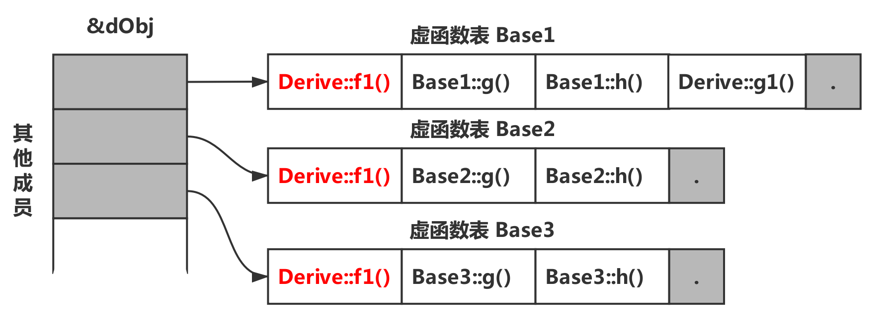

**虚析构**

如果析构函数不被声明成虚函数，则编译器采用的绑定方式是静态绑定，在删除基类指针时，只会调用基类析构函数，而不调用派生类析构函数，这样就会导致基类指针指向的派生类对象析构不完全。

**虚构造**

实例化一个对象时，首先会分配对象内存空间，然后调用构造函数来初始化对象。  

**vptr变量是在构造函数中进行初始化的**。又因为执行虚函数需要通过vptr指针来调用。如果可以定义构造函数为虚函数，那么就会陷入先有鸡还是先有蛋的循环讨论中。

> **重载，重写，重定义**
>
> 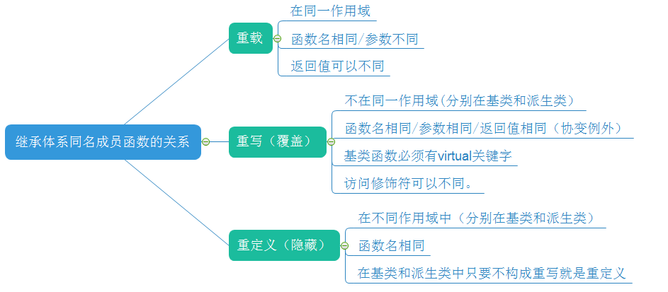
>
> **重载**(overload)：函数名相同，参数列表不同，override只是在**类的内部存在**
>
> **重写**(override)：也叫覆盖。子类重新定义父类中有**相同名称和参数**的虚函数(virtual)。
>
>   1. 被重写的函数不能是static的，且必须是virtual的
>   2. 重写函数必须有相同的类型，名称和参数列表
>   3. 重写函数的访问修饰符可以不同。尽管父类的virtual方法是private的，派生类中重写改写为public，protected也是可以的。这是因为被virtual修饰的成员函数，无论他们是private/protect/public的，都会被统一放置到虚函数表中。
>
> 对父类进行派生时，子类会继承到拥有相同偏移地址的虚函数标(相同偏移地址指的是各虚函数先谷底与VPTR指针的偏移)，因此就允许子类对这些虚函数进行重写
>
> **重定义**(redefining)，也叫隐藏。子类重新定义父类有相同名称的非虚函数(参数列表可以不同)。
>
> 子类若有和父类相同的函数，那么，这个类将会隐藏其父类的方法。除非你在调用的时候，强制转换成父类类型。在子类和父类之间尝试做类似重载的调用时不能成功的。

#### 菱形继承

虚继承解决菱形继承二义性问题，虚继承只影响**从指定了虚基类的派生类中进一步派生出来的类**，它不会影响派生类本身。

在实际开发中，位于中间层次的基类将其继承声明为虚继承一般不会带来什么问题。通常情况下，使用虚继承的类层次是由一个人或者一个项目组一次性设计完成的。对于一个独立开发的类来说，很少需要基类中的某一个类是虚基类，况且新类的开发者也无法改变已经存在的类体系。

C++标准库中的 iostream 类就是一个虚继承的实际应用案例。iostream 从 istream 和 ostream 直接继承而来，而 istream 和 ostream 又都继承自一个共同的名为 base_ios 的类，是典型的菱形继承。此时 istream 和 ostream 必须采用虚继承，否则将导致 iostream 类中保留两份 base_ios 类的成员。

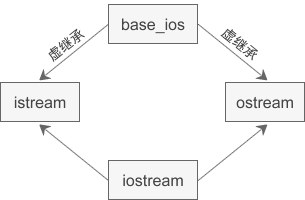

### 函数调用的过程

```cpp
int func(int param1 ,int param2,int param3){
    int var1 = param1;
    int var2 = param2;
    int var3 = param3;
    ...
}
int result = func(1,2,3);
```

在堆栈中变量分布是**从高地址到低地址**分布  

**EBP**是指向栈底的指针，在过程调用中不变，又称为帧指针。  

**ESP**指向栈顶，程序执行时移动，ESP减小分配空间，ESP增大释放空间，ESP又称为栈指针。

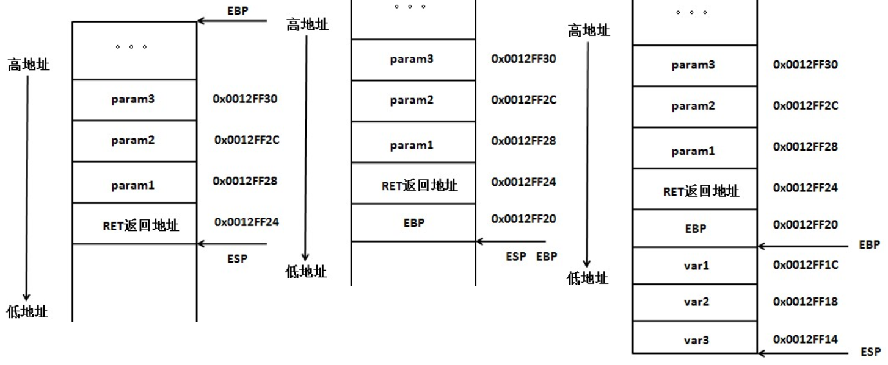

函数执行时，**参数从右向左逐步压入栈中**（stdcall），最后压入RET返回地址。  

通过跳转指令进入函数后（`func(1,2,3);`），函数地址入栈，EBP入栈，然后**把当前ESP的值给EBP**，对应的汇编指令

```cpp    
push ebp
mov ebp esp
```    

此时**栈顶和栈底指向同一位置**

之后再将调用的函数的临时变量压入，最后通过**EAX寄存器保存函数的返回值**  

调用执行函数完毕，局部变量var3，var2，var1一次出栈，EBP恢复原值，返回地址出栈，找到原执行地址，param1，param2，param3依次出栈，函数调用执行完毕。

调用执行函数完毕，局部变量var3，var2，var1一次出栈，EBP恢复原值，返回地址出栈，找到原执行地址，param1，param2，param3依次出栈，函数调用执行完毕。图略

### 类的类型大小

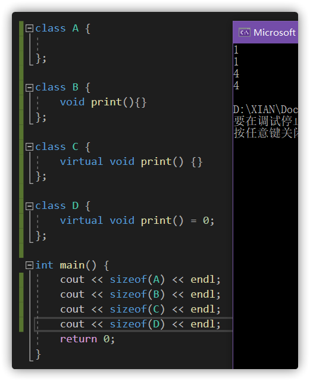

### static

**静态局部变量**：变量属于函数本身，仅受函数的控制。保存在全局数据区，而不是在栈中，每次的值保持到下一次调用，直到下次赋新值。  

**静态全局变量**：定义在函数体外，用于修饰全局变量，表示该变量**只在本文件可见**，不能被其它文件所用(全局变量可以)

**静态函数**：静态函数不能被其它文件所用，其它文件中可以定义相同名字的函数，不会发生冲突

**静态数据成员**：静态数据成员的生存期大于 class 的实例（静态数据成员是每个 class 有一份，普通数据成员是每个 instance 有一份）

  1. **静态成员之间可以相互访问**，包括静态成员函数访问静态数据成员和访问静态成员函数;
  2. **非静态成员函数**可以任意地访问静态成员函数和静态数据成员;
  3. **静态成员函数不能访问非静态**成员函数和非静态数据成员;
  4. 调用静态成员函数，可以用成员访问操作符(.)和(->)为一个类的对象或指向类对象的指针调用静态成员函数,也可以用类名::函数名调用(因为他本来就是属于类的，用类名调用很正常)

### const

修饰普通类型的变量

修饰指针：**顶层const**（指针本身是个常量）和**底层cosnt**（指针指向对象是一个常量）

修饰函数参数：

  1. 函数参数为值传递：值传递（pass-by-value）是传递一份参数的拷贝给函数，因此不论函数体代码如何运行，也只会修改拷贝而无法修改原始对象，这种情况**不需要将参数声明为const**。
  2. 函数参数为指针：指针传递（pass-by-pointer）**只会进行浅拷贝，拷贝一份指针给函数**，而不会拷贝一份原始对象。因此，给指针参数加上顶层const可以防止指针指向被篡改，加上底层const可以防止指向对象被篡改。
  3. 函数参数为引用：引用传递（pass-by-reference）有一个很重要的作用，由于引用就是对象的一个别名，因此不需要拷贝对象，减小了开销。这同时也导致可以通过修改引用直接修改原始对象（毕竟引用和原始对象其实是同一个东西），因此，大多数时候，推荐函数参数设置为**pass-by-reference-to-const**。给引用加上底层const，既可以减小拷贝开销，又可以防止修改底层所引用的对象。

修饰函数返回值：令函数返回一个常量，可以有效防止因用户错误造成的意外，比如 “=” 。

const成员函数：**const成员函数不可修改类对象的内容**（指针类型的数据成员只能保证不修改该指针指向）。原理是cost成员函数的this指针是底层const指针，不能用于改变其所指对象的值。  
当成员函数的 const 和 non-const 版本同时存在时：const object 只能调用 const 版本，non-const object 只能调用 non-const 版本。

<table>
<thead>
<tr>
<th style="text-align: left"></th>
<th style="text-align: center">const object（data members不得变动）</th>
<th style="text-align: center">non-const objectdata members可变动）</th>
</tr>
</thead>
<tbody>
<tr>
<td style="text-align: left"><strong>const member function（保证不更改data members）</strong></td>
<td style="text-align: center">可</td>
<td style="text-align: center">可</td>
</tr>
<tr>
<td style="text-align: left"><strong>non-const member function（不保证）</strong></td>
<td style="text-align: center">不可</td>
<td style="text-align: center">可</td>
</tr>
</tbody>
</table>

### extern "C"

extern "C"的主要作用就是为了能够正确实现**C++代码调用其他C语言代码**。  

加上extern "C"后，会指示编译器这部分代码按C语言（而不是C++）的方式进行编译。由于C++支持函数重载，因此编译器编译函数的过程中会将函数的参数类型也加到编译后的代码中，而不仅仅是函数名；而C语言并不支持函数重载，因此编译C语言代码的函数时不会带上函数的参数类型，一般只包括函数名。

在C++出现以前，很多代码都是C语言写的，而且很底层的库也是C语言写的，为了更好的支持原来的C代码和已经写好的C语言库，需要在C++中尽可能的支持C，而extern "C"就是其中的一个策略。

  1. C++代码调用C语言代码
  2. 在C++的头文件中使用
  3. 在多个人协同开发时，可能有的人比较擅长C语言，而有的人擅长C++

### inline

类内定义成员函数默认为inline

优点：

  1. inline 定义的类的内联函数，函数的代码被放入符号表中，在使用时直接进行替换，（像宏一样展开），没有了调用的开销，效率也很高。
  2. 内联函数也是一个真正的函数，编译器在调用一个内联函数时，会首先检查它的参数的类型，保证调用正确。然后进行一系列的相关检查，就像对待任何一个真正的函数一样。这样就消除了它的隐患和局限性。（宏替换不会检查参数类型，安全隐患较大）
  3. inline函数可以作为一个类的成员函数，与类的普通成员函数作用相同，可以访问一个类的私有成员和保护成员。内联函数可以用于替代一般的宏定义，最重要的应用在于类的存取函数的定义上面。

缺点：

  1. 内联函数具有一定的局限性，内联函数的**函数体一般来说不能太大**，如果内联函数的函数体过大，一般的编译器会放弃内联方式，而采用普通的方式调用函数。(换句话说就是，你使用内联函数，只不过是向编译器提出一个申请，编译器可以拒绝你的申请）这样，内联函数就和普通函数执行效率一样了。
  2. inline说明对编译器来说只是一种建议，编译器可以选择忽略这个建议。比如，你将一个长达1000多行的函数指定为inline，编译器就会忽略这个inline，将这个函数还原成普通函数，因此并不是说把一个函数定义为inline函数就一定会被编译器识别为内联函数，具体取决于编译器的实现和函数体的大小。

**和宏定义的区别**

宏是由预处理器对宏进行替代，而且内联函数是真正的函数，只是在需要用到的时候，内联函数像宏一样的展开，所以**取消了函数的参数压栈，减少了调用的开销**。你可以象调用函数一样来调用内联函数，而不必担心会产生于处理宏的一些问题。内联函数与带参数的宏定义进行下比较，它们的代码效率是一样，但是内联欢函数要优于宏定义，因为内联函数遵循的类型和作用域规则，它与一般函数更相近，在一些编译器中，一旦关联上内联扩展，将与一般函数一样进行调用，比较方便。

### stl容器

#### 序列容器

**vector**

动态数组，在堆中分配内存，元素连续存放，有保留内存，如果减少大小后，内存也不会释放；如果新值大于当前大小时才会重新分配内存。

`push_back()`，`pop_back()`，`insert()`，访问时间是O1，`erase()`时间是On，查找On

**扩容方式：**倍数开辟二倍的内存，旧的数据开辟到新内存，释放旧的内存，指向新内存。

  * 对头部和中间进行添加删除元素操作需要移动内存，如果元素是结构或类，那么移动的同时还会进行**构造和析构操作**
  * 对任何元素的访问时间都是O1，常用来保存需要经常进行随机访问的内容，并且不需要经常对中间元素进行添加删除操作
  * 属性与string差不多，同样可以使用capacity看当前保留的内存，使用swap来减少它使用的内存，如push_back 1000个元素，capacity返回值为16384
  * 对最后元素操作最快（在后面添加删除元素最快），此时一般不需要移动内存，只有保留内存不够时才需要

**list**

双向循环链表

元素存放在堆中，每个元素都是放在一块内存中，他的内存空间可以是不连续的，通过指针来进行数据的访问，这个特点使得它的随机存取变得非常没有效率，因此它没有提供`[]`操作符的重载。但是由于链表的特点，它可以很有效率的支持任意地方的删除和插入操作。

增删`erase()`都是O1，访问On，查找头O1，其余查找On。

**deque**

双端队列 deque 是对 vector 和list 优缺点的结合的一种容器。

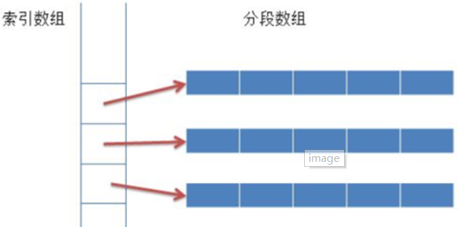

由于分段数组的大小是固定的，并且他们的首地址被连续存放在索引数组中，因此可以对其进行随机访问，但是效率比 vector 低很多。向两端加入新元素时，如果这一端的分段数组未满，则可以直接加入，如果这一端的分段数组已满，只需要创建新的分段数组，并把该分段数组的地址加入到索引数组中即可，这样就不需要对已有的元素进行移动，因此在双端队列的两端加入新的元素都具有较高的效率

`insert()`和`erase()`时间是On，查找On，其余O1。

**vector**：快速的随机储存，快速的在最后插入删除元素  

需要高效随机储存，需要高效的在末尾插入删除元素，不需要高效的在其他地方插入和删除元素

**list**：快速在任意位置插入删除元素，快速访问头尾元素  

需要大量插入删除操作，不关心随机储存的场景

**deque**：比较快速的随机存储（比vector的慢),快速的在头尾插入删除元素  

需要随机储存，需要高效的在头尾插入删除元素的场景

deque可以看作是vector和list的折中方案

#### 关联容器

底层都是红黑树

**set**

元素有序，无重复元素，插入删除操作的效率比序列容器高，因为对于关联容器来说，不需要做内存的拷贝和内存的移动。

增删改查Ologn

**multiset**

multiset和set相同，只不过它允许重复元素，也就是说multiset可包括多个数值相同的元素。

**map**

map由红黑树实现，其元素都是键值对，每个元素的键是排序的准则，每个键只能出现一次，不允许重复

增删改查Ologn

**multimap**

multimap和map相同，但允许重复元素，也就是说multimap可包含多个键值（key）相同的元素。

#### **unordered_map**和**map**

map内部实现了一个**红黑树**（所有元素都是有序的），unordered_map内部实现了一个**哈希表**（元素的排列是无序的）

**map**  

优点：**有序**性，这是map结构最大的优点，其元素的有序性在很多应用中都会简化很多的操作；内部实现一个红黑书使得map的很多操作在lgn的时间复杂度下就可以实现，因此**效率**非常的高  

缺点：**空间占用率高**，因为map内部实现了红黑树，虽然提高了运行效率，但是因为**每一个节点都需要额外保存父节点、孩子节点和红/黑性质**，使得每一个节点都占用大量的空间  

适用：对于那些有顺序要求的问题，用map会更高效一些

**unordered_map**：  

优点：因为内部实现了哈希表，因此其**查找速度**非常的快  

缺点：哈希表的**建立比较耗费时间**  

适用：对于**查找问题**，unordered_map会更加高效一些

### 智能指针

**将基本类型指针封装为类对象指针，并在析构函数里编写delete语句删除指针指向的内存空间。**
    
```cpp    
auto_ptr<string> ps (new string ("I reigned lonely as a cloud.”）;
auto_ptr<string> vocation; vocaticn = ps;
```    

如果 ps 和 vocation 是常规指针，则两个指针将指向同一个 string 对象。这是不能接受的，因为程序将试图删除同一个对象两次，一次是 ps 过期时，另一次是 vocation 过期时。要避免这种问题，方法有多种：

  1. 定义陚值运算符，使之执行**深复制**。这样两个指针将指向不同的对象，其中的一个对象是另一个对象的副本，缺点是浪费空间，所以智能指针都未采用此方案。
  2. 建立**所有权**（ownership）概念。对于特定的对象，只能有一个智能指针可拥有，这样只有拥有对象的智能指针的析构函数会删除该对象。然后让赋值操作转让所有权。这就是用于 auto_ptr 和 unique_ptr 的策略，但 unique_ptr 的策略更严格。
  3. 创建智能更高的指针，跟踪引用特定对象的智能指针数。这称为**引用计数**。例如，赋值时，计数将加 1，而指针过期时，计数将减 1，当减为 0 时才调用 delete。这是 shared_ptr 采用的策略。

所有的智能指针类都有一个explicit构造函数，以指针作为参数。因此不能自动将指针转换为智能指针对象，必须显式调用：

```cpp
shared_ptr<double> pd; 
double *p_reg = new double;
pd = p_reg;                               // not allowed (implicit conversion)
pd = shared_ptr<double>(p_reg);           // allowed (explicit conversion)
shared_ptr<double> pshared = p_reg;       // not allowed (implicit conversion)
shared_ptr<double> pshared(p_reg);        // allowed (explicit conversion)
```    

对全部三种智能指针都应避免的一点：

```cpp
string vacation("I wandered lonely as a cloud.");
shared_ptr<string> pvac(&vacation);   // No
```    

pvac过期时，程序将把delete运算符用于非堆内存，这是错误的。

**auto_ptr**

在 auto_ptr 对象销毁时，他所管理的对象也会自动被 delete 掉。  

auto_ptr 采用 copy 语义来转移指针资源，转移指针资源的所有权的同时将原指针置为NULL，拷贝后原对象变得无效，再次访问原对象时会导致程序崩溃。

**unique_ptr**

由 C++11 引入，旨在替代不安全的 auto_ptr。

unique_ptr 则禁止了拷贝语义，但提供了移动语义，即可以使用std::move() 进行控制权限的转移，如下代码所示：

它持有对对象的**独有权**——两个 unique_ptr 不能指向一个对象，即 unique_ptr 不共享它所管理的对象。  

内存资源所有权可以转移到另一个 unique_ptr，并且原始 unique_ptr 不再拥有此资源。实际使用中，建议将对象限制为由一个所有者所有，因为多个所有权会使程序逻辑变得复杂。因此，当需要智能指针用于存 C++ 对象时，可使用unique_ptr，构造 unique_ptr 时，可使用 make_unique 函数。

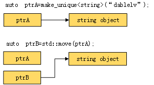

```cpp
//智能指针的创建  
unique_ptr<int> u_i; 	//创建空智能指针
u_i.reset(new int(3)); 	//绑定动态对象  
unique_ptr<int> u_i2(new int(4));//创建时指定动态对象
unique_ptr<T,D> u(d);	//创建空 unique_ptr，执行类型为 T 的对象，用类型为 D 的对象 d 来替代默认的删除器 delete
//所有权的变化  
int *p_i = u_i2.release();	//释放所有权  
unique_ptr<string> u_s(new string("abc"));  
unique_ptr<string> u_s2 = std::move(u_s); //所有权转移(通过移动语义)，u_s所有权转移后，变成“空指针” 
u_s2.reset(u_s.release());	//所有权转移
u_s2=nullptr;//显式销毁所指对象，同时智能指针变为空指针。与u_s2.reset()等价
```

当程序试图将一个 unique_ptr 赋值给另一个时，**如果源 unique_ptr 是个临时右值，编译器允许这么做；如果源 unique_ptr 将存在一段时间，编译器将禁止这么做**，比如：

```cpp
unique_ptr<string> pu1(new string ("hello world"));
unique_ptr<string> pu2;
pu2 = pu1;                                      // #1 not allowed
unique_ptr<string> pu3;
pu3 = unique_ptr<string>(new string ("You"));   // #2 allowed
```

其中#1留下悬挂的unique_ptr(pu1)，这可能导致危害。而#2不会留下悬挂的unique_ptr，因为它调用 unique_ptr的构造函数，该构造函数创建的临时对象在其所有权让给 pu3 后就会被销毁。**这种随情况而已的行为表明，unique_ptr优于允许两种赋值的auto_ptr 。**

使用move后，原来的指针仍转让所有权变成空指针，可以对其重新赋值。

**shared_ptr**

shared_ptr 是为了解决 auto_ptr 在对象所有权上的局限性（auto_ptr是独占的），在使用引用计数的机制上提供了可以共享所有权的智能指针，当然这需要额外的开销：

  1. shared_ptr 对象除了包括一个所拥有对象的指针外，还必须包括一个引用计数代理对象的指针；
  2. 时间上的开销主要在**初始化和拷贝操作**上， * 和 -> 操作符重载的开销跟 auto_ptr 是一样；
  3. 开销并不是我们不使用 shared_ptr 的理由,，永远不要进行不成熟的优化，直到性能分析器告诉你这一点。

**环形引用**：智能指针互相指向了对方，导致自己的引用计数一直为1，所以没有进行析构，这就造成了内存泄漏。

**weak_ptr**

weak_ptr 只对 shared_ptr 进行引用，而**不改变其引用计数**，当被观察的 shared_ptr 失效后，相应的 weak_ptr也相应失效。

### 内存泄漏

内存泄漏是指应用程序分配某段内存后，**失去了对该段内存的控制**，因而造成了内存的浪费。

  1. 在类的构造函数和析构函数中没有匹配的调用new和delete函数
  2. 没有正确地清除**嵌套的对象指针**
  3. 在释放**对象数组**时在中没有使用delete[]
  4. 指向对象的指针数组不等同于对象数组
  5. 缺少**拷贝构造函数**或**重载赋值运算符**：隐式的指针复制结果就是两个对象拥有指向同一个动态分配的内存空间的指针。
  6. 没有将基类的**析构函数**定义为虚函数

**野指针**：指向被释放的或者访问受限内存的指针。

造成野指针的原因：

  1. 指针变量没有被初始化（如果值不定，可以初始化为NULL）
  2. 指针被free或者delete后，没有置为NULL，free和delete只是把指针所指向的内存给释放掉，并没有把指针本身干掉，此时指针指向的是“垃圾”内存。释放后的指针应该被置为NULL.
  3. 指针操作超越了变量的作用范围，比如返回指向栈内存的指针就是野指针。

#### 避免内存泄漏

**RAII 资源获取即初始化**，是一种利用对象生命周期来控制程序资源（如内存、文件句柄、网络连接、互斥量等等）的简单技术。智能指针即RAII最具代表的实现

### RTTI

即通过运行时类型识别，程序能够使用基类的指针或引用来检查着这些指针或引用所指的对象的实际派生类型。

RTTI典型的应用需求  

1. 类型的识别，即能在运行时判断出某对象、表达式等的类型，能判断它们是基本类型（int、string），还是对象，以及它们区别于其它类型的标识；  
2. 对象的继承关系的运行时判断；  
3. 在出错处理、内存诊断等处理时的输出信息；  
4. 基于字符型名称的运行时对象访问、方法调用；  
5. 对象的自动保存和读入；  
6. 基于ID或名称的对象自动生成；  
7. 环境配置的保存和读入；  
8. 程序自动生成；

### 指针和引用

指针是存放内存地址的一种变量，指针的大小不会像其他变量一样变化。声明时可以**暂时不初始化**  

指针在声明周期内随时可能会为Null，所以使用时一定要做检查，防止出现空指针、野指针的情况

引用的本质是“变量的别名”，就一定要有本体。声明时就**必须初始化**  

C++中的引用本质上是一种被限制的指针，引用是占据内存的

### new和malloc

malloc实际是返还一段内存区域的中间地址，我们**可用的内存只可以是这个地址之后的**，地址前面的内存是根据系统固定规则存放着该**内存区域的信息**，这样free就可以知道malloc出来的地址前面的内容，从而确定整个内存区域的大小。

**1.类型安全**

new操作符内存分配成功时，返回的是对象类型的指针，类型严格与对象匹配，无须进行类型转换，故new是符合**类型安全**性的操作符。而malloc内存分配成功则是返回void * ，需要通过强制类型转换将void*指针转换成我们需要的类型。  

类型安全很大程度上可以等价于内存安全，类型安全的代码不会试图方法自己没被授权的内存区域。关于C++的类型安全性可说的又有很多了。

**2.分配失败返回**

new内存分配失败时，会抛出bac_alloc异常，它**不会返回NULL**；malloc分配内存失败时返回NULL。  
在使用C语言时，我们习惯在malloc分配内存后判断分配是否成功：

**3.调用ctor**

#### new的过程

使用new操作符来分配对象内存时会经历三个步骤：

  1. 调用operator new 函数（对于数组是operator new[]）分配一块足够大的，**原始**的，未命名的内存空间以便存储特定类型的对象。
  2. 编译器运行相应的**构造函数**以构造对象，并为其传入初值。
  3. 对象构造完成后，返回一个指向该对象的指针。

使用delete操作符来释放对象内存时会经历两个步骤：

  1. 调用对象的析构函数。
  2. 编译器调用operator delete(或operator delete[])函数释放内存空间。

总之来说，new/delete**会调用对象的构造函数/析构函数以完成对象的构造/析构**，而malloc则不会。

**placement new** 本质上是对 operator new 的重载，定义于#include 中，它不分配内存，调用合适的构造函数在 ptr 所指的地方构造一个对象，之后返回实参指针ptr

#### 重载

opeartor new /operator delete可以被重载，而malloc/free并**不允许重载**。

#### 总结

<table>
<thead>
<tr>
<th>特征</th>
<th>new/delete</th>
<th>malloc/free</th>
</tr>
</thead>
<tbody>
<tr>
<td>分配内存的位置</td>
<td>自由存储区</td>
<td>堆</td>
</tr>
<tr>
<td>分配成功</td>
<td>返回完整类型指针</td>
<td>返回void*</td>
</tr>
<tr>
<td>分配失败</td>
<td>默认抛出异常</td>
<td>返回NULL</td>
</tr>
<tr>
<td>分配内存的大小</td>
<td>由编译器根据类型计算得出</td>
<td>必须显式指定字节数</td>
</tr>
<tr>
<td>处理数组</td>
<td>有处理数组的new版本new[]</td>
<td>需要用户计算数组的大小后进行内存分配</td>
</tr>
<tr>
<td>已分配内存的扩充</td>
<td>无法直观地处理</td>
<td>使用realloc简单完成</td>
</tr>
<tr>
<td>是否相互调用</td>
<td>可以，看具体的operator new/delete实现</td>
<td>不可调用new</td>
</tr>
<tr>
<td>分配内存时内存不足</td>
<td>客户能够指定处理函数或重新制定分配器</td>
<td>无法通过用户代码进行处理</td>
</tr>
<tr>
<td>函数重载</td>
<td>允许</td>
<td>不允许</td>
</tr>
<tr>
<td>构造函数与析构函数</td>
<td>调用</td>
<td>不调用</td>
</tr>
</tbody>
</table>

### strcpy和memcpy

  1. 复制的内容不同。strcpy只能复制字符串，而memcpy可以复制任意内容，例如字符数组、整型、结构体、类等。企业中使用memcpy很平常，因为需要拷贝大量的结构体参数。memcpy通常与memset函数配合使用。
  2. 复制的方法不同。strcpy不需要指定长度，它遇到被复制字符的串结束符"\0"才结束，所以容易溢出。memcpy则是根据其第3个参数决定复制的长度。因此strcpy会复制字符串的结束符“\0”，而memcpy则不会复制。

### C++11，C++14

11：初始化列表，auto Type，foreach，nullptr，enum class，委托构造，禁止重写final，显示重写override，成员初始值，默认构造函数default，删除构造函数delete，常量表达式constexpr，Lambda函数

14：auto返回类型，泛型lambda

### 排序

堆排序、快速排序、希尔排序、直接选择排序是不稳定的排序算法，

而基数排序、冒泡排序、直接插入排序、折半插入排序、归并排序是稳定的排序算法。

**归并**

  1. 如果给的数组只有一个元素的话，直接返回（也就是递归到最底层的一个情况）
  2. 把整个数组分为尽可能相等的两个部分（分）
  3. 对于两个被分开的两个部分进行整个归并排序（治）
  4. 把两个被分开且排好序的数组拼接在一起

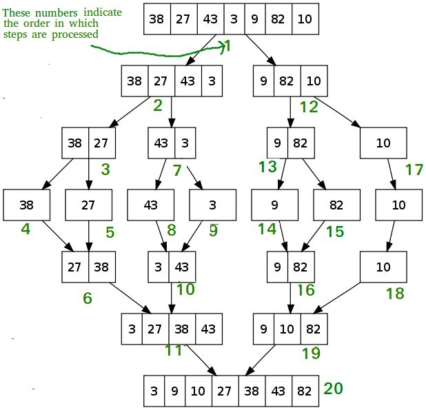

```cpp
void merge(int arr[], int l, int m, int r)
{
    int i, j, k;
    int n1 = m - l + 1;
    int n2 = r - m;
    vector<int> L(n1);
    vector<int> R(n2);
    for (i = 0; i < n1; i++)
        L[i] = arr[l + i];
    for (j = 0; j < n2; j++)
        R[j] = arr[m + 1 + j];
    i = 0;
    j = 0;
    k = l;
    while (i < n1 && j < n2){
        if (L[i] <= R[j]){
            arr[k] = L[i];
            i++;
        }
        else{
            arr[k] = R[j];
            j++;
        }
        k++;
    }
    while (i < n1){
        arr[k] = L[i];
        i++;
        k++;
    }
    while (j < n2){
        arr[k] = R[j];
        j++;
        k++;
    }
}

void mergeSort(int arr[], int l, int r)
{
    if (l < r)
    {
        int m = l + (r - l) / 2;
        mergeSort(arr, l, m);
        mergeSort(arr, m + 1, r);
        merge(arr, l, m, r);
    }
}
```

**堆排**

基本思想：把待排序的元素按照大小在二叉树位置上排列，排序好的元素要满足：父节点的元素要大于等于其子节点；这个过程叫做堆化过程。  
根据这个特性（大根堆根最大，小根堆根最小），就可以把根节点拿出来，然后再堆化下，再把根节点拿出来，循环到最后一个节点，就排序好了。

  * 最大堆中的最大元素值出现在根结点（堆顶）
  * 堆中每个父节点的元素值都大于等于其孩子结点

下图是最小堆：

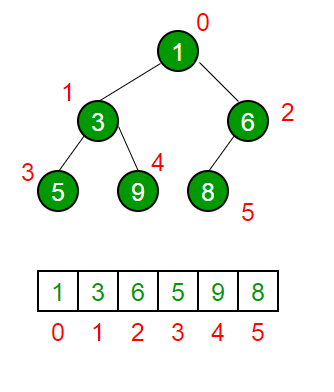

建立堆函数：

```cpp    
void heapify(int arr[], int n, int i) 
{ 
    int largest = i; // 将最大元素设置为堆顶元素
    int l = 2*i + 1; // left = 2*i + 1 
    int r = 2*i + 2; // right = 2*i + 2 
    // 如果 left 比 root 大的话
    if (l < n && arr[l] > arr[largest]) 
        largest = l; 
    // I如果 right 比 root 大的话
    if (r < n && arr[r] > arr[largest]) 
        largest = r; 
    if (largest != i) 
    { 
        swap(arr[i], arr[largest]); 
        // 递归地定义子堆
        heapify(arr, n, largest); 
    } 
} 
```

堆排序的方法如下，把最大堆堆顶的最大数取出，将剩余的堆继续调整为最大堆，再次将堆顶的最大数取出，这个过程持续到剩余数只有一个时结束。

堆排序函数：

```cpp
void heapSort(int arr[], int n) 
{ 
    // 建立堆
    for (int i = n / 2 - 1; i >= 0; i--) 
        heapify(arr, n, i); 
    // 一个个从堆顶取出元素
    for (int i=n-1; i>=0; i--) 
    { 
        swap(arr[0], arr[i]);  
        heapify(arr, i, 0); 
    } 
} 
```

**快排**
    
```cpp
void quickSort(int a[],int left,int right)
{
　　int i=left;
　　int j=right;
　　int temp=a[left];
　　if(left>=right)
　　　　return;
　　while(i!=j)
　　{
　　　　while(i<j&&a[j]>=temp) 
　　　　	j--;
　　　　if(j>i)
　　　　　　a[i]=a[j];//a[i]已经赋值给temp,所以直接将a[j]赋值给a[i],赋值完之后a[j],有空位
　　　　while(i<j&&a[i]<=temp)
　　　　i++;
　　　　if(i<j)
　　　　　　a[j]=a[i];
　　}
　　a[i]=temp;//把基准插入,此时i与j已经相等R[low..pivotpos-1].keys≤R[pivotpos].key≤R[pivotpos+1..high].keys
　　quickSort(a,left,i-1);/*递归左边*/
　　quickSort(a,i+1,right);/*递归右边*/
}
```

### 哈希冲突

<https://blog.csdn.net/u011109881/article/details/80379505>

### 图的联通

<https://blog.csdn.net/weixin_44646116/article/details/95523884>

### 红黑树和AVL

<table>
<thead>
<tr>
<th>平衡二叉树类型</th>
<th>平衡度</th>
<th>调整频率</th>
<th>适用场景</th>
</tr>
</thead>
<tbody>
<tr>
<td>AVL树</td>
<td>高</td>
<td>高</td>
<td>查询多，增/删少</td>
</tr>
<tr>
<td>红黑树</td>
<td>低</td>
<td>低</td>
<td>增/删频繁</td>
</tr>
</tbody>
</table>

### 设计模式

**单例模式**

保证一个类只有一个实例，并提供一个访问它的全局访问点，使得系统中只有唯一的一个对象实例。  

常用于管理资源，如日志、线程池

**工厂模式**

工厂模式的主要作用是封装对象的创建，分离对象的创建和操作过程，用于批量管理对象的创建过程，便于程序的维护和扩展。

<hr>


#### <p>原文出处：<a href='https://www.cnblogs.com/zhxmdefj/p/12613002.html' target='blank'>操作系统面试总结</a></p>

## 操作系统

### 进程和线程的区别

  * 进程是具有一定功能的程序关于某个数据集合上的一次运行活动，进程是系统进行**资源调度和分配**的一个独立单位。
  * **线程是进程的实体**，是**CPU调度和分派**的基本单位，它是比进程更小的能独立运行的基本单位。
  * 一个进程可以有多个线程，多个线程也可以并发执行

### 线程同步

互斥量：采用互斥对象机制，只有拥有互斥对象的线程才有访问公共资源的权限。因为互斥对象只有一个，所以可以保证公共资源不会被多个线程同时访问。

信号量：它允许同一时刻多个线程访问同一资源，但是需要控制同一时刻访问此资源的最大线程数量。

事件（信号）：通过通知操作的方式来保持多线程同步，还可以方便的实现多线程优先级的比较操作。

### 进程通信

主要分为：管道、系统**IPC**（包括消息队列、信号量、共享存储）、**SOCKET**

管道主要分为：普通管道**PIPE** 、流管道（**s_pipe**）、命名管道（**name_pipe**）

  * 管道是一种半双工的通信方式，数据只能单项流动，并且只能在具有亲缘关系的进程间流动，进程的亲缘关系通常是父子进程
  * 命名管道也是半双工的通信方式，它允许无亲缘关系的进程间进行通信
  * 信号量是一个计数器，用来控制多个进程对资源的访问，它通常作为一种锁机制。
  * 消息队列是消息的链表，存放在内核中并由消息队列标识符标识。
  * 信号是一种比较复杂的通信方式，用于通知接收进程某个事件已经发生。
  * 共享内存就是映射一段能被其它进程访问的内存，这段共享内存由一个进程创建，但是多个进程可以访问。

### 缓冲区溢出

计算机向缓冲区填充数据时超出了缓冲区本身的容量

  * 程序崩溃，导致拒绝额服务
  * 跳转并且执行一段恶意代码

造成缓冲区溢出的主要原因是程序中没有仔细检查用户输入。

### 死锁产生的条件

两个或多个进程无限期的阻塞、相互等待的一种状态。

死锁产生的四个条件（有一个条件不成立，则不会产生死锁）

  * **互斥条件**：一个资源一次只能被一个进程使用
  * **请求与保持条件**：一个进程因请求资源而阻塞时，对已获得资源保持不放
  * **不剥夺条件**：进程获得的资源，在未完全使用完之前，不能强行剥夺
  * **循环等待条件**：若干进程之间形成一种头尾相接的环形等待资源关系

### 死锁的处理基本策略

**预防死锁**：（严重地损害系统性能）  
**资源一次性分配：**（破坏请求和保持条件）  
**可剥夺资源：**即当某进程新的资源未满足时，释放已占有的资源（破坏不可剥夺条件）  
**资源有序分配法：**系统给每类资源赋予一个编号，每一个进程按编号递增的顺序请求资源，释放则相反（破坏环路等待条件）

**避免死锁**：  
由于在避免死锁的策略中，**允许进程动态地申请资源**。因而，系统在进行资源分配之前预先计算资源分配的安全性。若此次分配不会导致系统进入不安全状态，则将资源
分配给进程；否则，进程等待。其中最具有代表性的避免死锁算法是**银行家算法**。

**检测死锁**：  
首先为每个进程和每个资源指定一个唯一的号码；  
然后建立资源分配表和进程等待表

### 进程状态

  * 就绪状态：进程已获得除处理机以外的所需资源，等待分配处理机资源
  * 运行状态：占用处理机资源运行，处于此状态的进程数小于等于CPU数
  * 阻塞状态： 进程等待某种条件，在条件满足之前无法执行

### 进程调度

**FIFO或First Come, First Served (FCFS)先来先服务**

  * 调度的顺序就是任务到达就绪队列的顺序。
  * 公平、简单(FIFO队列)、非抢占、不适合交互式。
  * 未考虑任务特性，平均等待时间可以缩短。

**Shortest Job First (SJF)**

  * 最短的作业(CPU区间长度最小)最先调度。
  * SJF可以保证最小的平均等待时间。

**Shortest Remaining Job First (SRJF)**

  * SJF的可抢占版本，比SJF更有优势。
  * SJF(SRJF): 如何知道下一CPU区间大小？根据历史进行预测: 指数平均法。

**优先权调度**

  * 每个任务关联一个优先权，调度优先权最高的任务。
  * 注意：优先权太低的任务一直就绪，得不到运行，出现“饥饿”现象。

**时间片轮转**

  * 设置一个时间片，按时间片来轮转调度（“轮叫”算法）
  * 优点: 定时有响应，等待时间较短；缺点: 上下文切换次数较多；
  * 时间片太大，响应时间太长；吞吐量变小，周转时间变长；当时间片过长时，退化为FCFS。

**多级队列调度**

  * 按照一定的规则建立多个进程队列
  * 不同的队列有固定的优先级（高优先级有抢占权）
  * 不同的队列可以给不同的时间片和采用不同的调度方法
  * 存在问题1：没法区分I/O bound和CPU bound；
  * 存在问题2：也存在一定程度的“饥饿”现象；

**多级反馈队列调**

  * 进程在进入待调度的队列等待时，**首先进入优先级最高的Q1等待。**
  * **首先调度优先级高的队列中的进程。若高优先级中队列中已没有调度的进程，则调度次优先级队列中的进程。**例如：Q1,Q2,Q3三个队列，只有在Q1中没有进程等待时才去调度Q2，同理，只有Q1,Q2都为空时才会去调度Q3。
  * **对于同一个队列中的各个进程，按照时间片轮转法调度。**比如Q1队列的时间片为N，那么Q1中的作业在经历了N个时间片后若还没有完成，则进入Q2队列等待，若Q2的时间片用完后作业还不能完成，一直进入下一级队列，直至完成。
  * **在低优先级的队列中的进程在运行时，又有新到达的作业，那么在运行完这个时间片后，CPU马上分配给新到达的作业（抢占式）。**

### 进程同步

原子操作、信号量机制、自旋锁管程、会合、分布式系统

### 分页和分段的区别

**段是信息的逻辑单位**，它是根据用户的需要划分的，因此段对用户是可见的 ；**页是信息的物理单位**，是为了管理主存的方便而划分的，对用户是透明的。

段的大小不固定，有它所完成的功能决定；页大大小固定，由系统决定

段向用户提供二维地址空间；页向用户提供的是一维地址空间

段是信息的逻辑单位，便于存储保护和信息的共享，页的保护和共享受到限制。

### 虚拟内存

先将部分程序导入内存，执行完成后导入下一部分程序，给我们的感觉是内存变大了，实际上物理内存的大小并未发生变化。

虚拟内存的优点：将逻辑内存和物理内存分开。虚拟内存允许文件和内存通过共享页而为两个或多个进程所共享。

#### 最佳置换算法（OPT）

这是一种理想情况下的页面置换算法，但实际上是不可能实现的。该算法的基本思想是：发生缺页时，有些页面在内存中，其中有一页将很快被访问（也包含紧接着的下一条指令的那页），而其他页面则可能要到10、100或者1000条指令后才会被访问，每个页面都可 [1] 以用在该页面首次被访问前所要执行的指令数进行标记。最佳页面置换算法只是简单地规定：标记最大的页应该被置换。这个算法唯一的一个问题就是它无法实现。当缺页发生时，操作系统无法知道各个页面下一次是在什么时候被访问。虽然这个算法不可能实现，但是最佳页面置换算法可以用于对可实现算法的性能进行衡量比较。 [1]

#### 先进先出置换算法（FIFO）

最简单的页面置换算法是先入先出（FIFO）法。这种算法的实质是，总是选择在主存中停留时间最长（即最老）的一页置换，即先进入内存的页，先退出内存。理由是：最早调入内存的页，其不再被使用的可能性比刚调入内存的可能性大。建立一个FIFO队列，收容所有在内存中的页。被置换页面总是在队列头上进行。当一个页面被放入内存时，就把它插在队尾上。

这种算法只是在按线性顺序访问地址空间 [1]时才是理想的，否则效率不高。因为那些常被访问的页，往往在主存中也停留得最久，结果它们因变“老”而不得不被置换出去。

FIFO的另一个缺点是，它有一种异常现象，即在增加存储块的情况下，反而使缺页中断率增加了。当然，导致这种异常现象的页面走向实际上是很少见的。

#### 最近最久未使用（LRU）算法

FIFO算法和OPT算法之间的主要差别是，FIFO算法利用页面进入内存后的时间长短作为置换依据，而OPT算法的依据是将来使用页面的时间。如果以最近的过去作为不久将来的近似，那么就可以把过去最长一段时间里不曾被使用的页面置换掉。它的实质是，当需要置换一页时，选择在之前一段时间里最久没有使用过的页面予以置换。这种算法就称为最久未使用算法（Least Recently Used，LRU）。

LRU算法是与每个页面最后使用的时间有关的。当必须置换一个页面时，LRU算法选择过去一段时间里最久未被使用的页面。

<hr> 

#### <p>原文出处：<a href='https://www.cnblogs.com/zhxmdefj/p/12613065.html' target='blank'>计算机网络面试总结</a></p>

## 计算机网络面试总结

### TCP&UDP

TCP（Transmission Control Protocol，传输控制协议）是面向连接的协议，也就是说，**在收发数据前，必须和对方建立可靠的连接。**

一个TCP连接必须要经过三次“对话”才能建立起来。

  1. 主机A向主机B发出连接请求数据包：“我想给你发数据，可以吗？”，这是第一次对话；
  2. 主机B向主机A发送同意连接和要求同步 （同步就是两台主机一个在发送，一个在接收，协调工作）的数据包 ：“可以，你什么时候发？”，这是第二次对话；
  3. 主机A再发出一个数据包确认主机B的要求同步：“我现在就发，你接着吧！”， 这是第三次对话。

三次“对话”的目的是使数据包的发送和接收同步， 经过三次“对话”之后，主机A才向主机B正式发送数据。

#### 三次握手

  1. 主机A通过向主机B发送一个**含有同步序列号（SYN）的标志位的数据段**，向B请求建立连接，通过这个数据段， A告诉B两件事：我想要和你通信；你可以用这个序列号作为起始数据段来回应我。
  2. B收到A的请求后，用一个带有**确认应答（ACK）和同步序列号（SYN）标志位的数据段**响应A，也告诉A两件事：我已收到请求了，你可以传输数据了；你要用这个序列号作为起始数据段来回应我。
  3. A收到这个数据段后，再发送一个**确认应答（ACK）**，确认已收到B的数据段：**已收到回复，现在要开始传输实际数据了**，这样3次握手就完成了，主机A和主机B就可以传输数据了。

**没有应用层的数据**，SYN这个标志位只有在TCP建立连接时才会被置1，握手完成后SYN标志位被置0。

#### 四次挥手

  1. 当**A**完成数据传输后，将控制位FIN置1，提出停止TCP连接的请求；
  2. **B**收到FIN后对其作出响应，确认这一方向上的TCP连接将关闭，将ACK置1；
  3. 由**B**端再提出反方向的关闭请求，将FIN置1；
  4. **A**对**B**的请求进行确认，将ACK置1，双方向的关闭结束。

由TCP的三次握手和四次断开可以看出，TCP使用**面向连接的通信方式**， 大大提高了数据通信的可靠性，使发送数据端和接收端在数据正式传输前就有了交互，为数据正式传输打下了可靠的基础。

  1. ACK 是 TCP 报头的控制位之一，对数据进行确认。确认由目的端发出， 用它来**告诉发送端这个序列号之前的数据段都收到了**。只有当 ACK=1 时,确认号才有效，当ACK=0时，确认号无效，这时会要求重传数据，保证数据的完整性。
  2. SYN 同步序列号，TCP 建立连接时将这个位置 1。
  3. FIN 发送端完成发送任务位，当 TCP 完成数据传输需要断开时，**提出断开连接的一方将这位置1**。

#### UDP 与 TCP 对比

  1. **TCP 面向连接**，需要三次握手，四次挥手。**UDP 是无连接的**，即发送数据之前不需要建立连接，直接丢过去。
  2. TCP 提供可靠的服务，通过 TCP 连接传送的数据，无差错、不丢失、不重复，且按序到达。UDP 尽最大努力交付，即不保证可靠交付。
  3. TCP 面向字节流，实际上是 **TCP 把数据看成一连串无结构的字节流**。UDP 是面向报文的，**UDP 没有拥塞控制**，因此网络出现拥塞不会使源主机的发送速率降低（对实时应用很有用，如 IP 电话，实时视频会议等)。
  4. 每一条 **TCP 连接只能是点到点的**，**UDP 支持一对一，一对多，多对一和多对多**的交互通信。
  5. TCP 首部开销20字节，UDP 的首部开销小，只有8个字节。
  6. TCP 的逻辑通信信道是**全双工**的可靠信道，UDP 则是不可靠信道。

#### UDP 的应用场景

UDP 不属于连接型协议，因而具有**资源消耗小，处理速度快**的优点，所以通常**音频、视频和普通数据**在传送时使用UDP较多，因为它们即使偶尔丢失一两个数据包，也不会对接收结果产生太大影响。比如我们聊天用的 QQ 就是使用的UDP 协议，直播中也可以用 UDP。

##### QQ

> QQ 并不是端对端的聊天软件，是得经过服务器转发消息的，通过 QQ 聊天，数据是 A 发到服务器，服务器再转发到 B。

每一个 QQ 客户端之间的交互，实际上都是和服务器交互，再由服务器转发给正在通信的用户。  
如果每一个 QQ 用户从一上线到下线的这段时间全部采用 TCP 长连接，对服务器的负担很大；而如果采用 TCP短连接，频繁的连接断开也会造成网络负担。而采用 UDP 则可以避开上述麻烦，减少服务器的负担。

登陆成功之后，QQ 都会有一个 TCP 连接来保持在线状态。QQ 采用的通信协议以 UDP 为主，辅以 TCP 协议。QQ的服务器要同时容纳十几万的并发连接，因此服务器端只有采用 UDP 协议与客户端进行通讯才能保证这种超大规模的服务。

QQ 客户端之间的消息传送也采用了 UDP 模式，因为国内的网络环境非常复杂，而且很多用户采用的方式是通过代理服务器共享一条线路上网的方式，在这些复杂的情况下，客户端之间能彼此建立起来 TCP 连接的概率较小，严重影响传送信息的效率。而UDP 包能够穿透大部分的代理服务器，因此 QQ 选择了 UDP 作为客户之间的主要通信协议。**采用 UDP 协议，通过服务器中转方式。**因此，现在的 IP 侦探在你仅仅跟对方发送聊天消息的时候是无法获取到IP的。

大家都知道，UDP 协议是不可靠协议，它只管发送，不管对方是否收到的，但它的传输很高效。但是作为聊天软件，怎么可以采用这样的不可靠方式来传输消息呢？于是，腾讯采用了上层协议来保证可靠传输：**如果客户端使用 UDP 协议发出消息后，服务器收到该包，需要使用 UDP 协议发回一个应答包**，如此来保证消息可以无遗漏传输。之所以会发生在客户端明明看到"消息发送失败"但对方又收到了这个消息的情况，就是因为客户端发出的消息服务器已经收到并转发成功，但客户端由于网络原因没有收到服务器的应答包引起的。

##### Telegram 端对端加密

端到端加密是一种目前比较安全的通信系统。在这个系统中，只有参与通信的双方用户可以读取通信数据。

#### 如何实现UDP保证有序传输

  * 发送：包的分片、包确认、包的重发
  * 接收：包的调序、包的序号确认

建立缓冲区，由一个线程专门接受数据并且重排，但是这个是在UDP的基础上自己实现部分简单的TCP。即收到数据包检查无误后返回一个应答。如果发送端在一定时间内没有收到应答，就自动重发。

目前已有如下开源程序利用 UDP 实现了可靠的数据传输，分别为：RUDP、RTP、UDT

### 在浏览器中输入网址

  * 查找域名对应的IP地址。这一步会依次查找浏览器缓存，系统缓存，路由器缓存，ISPDNS缓存，根域名服务器
  * 浏览器向IP对应的web服务器发送一个HTTP请求
  * 服务器响应请求，发回网页内容
  * 浏览器解析网页内容

### OSI七层模型

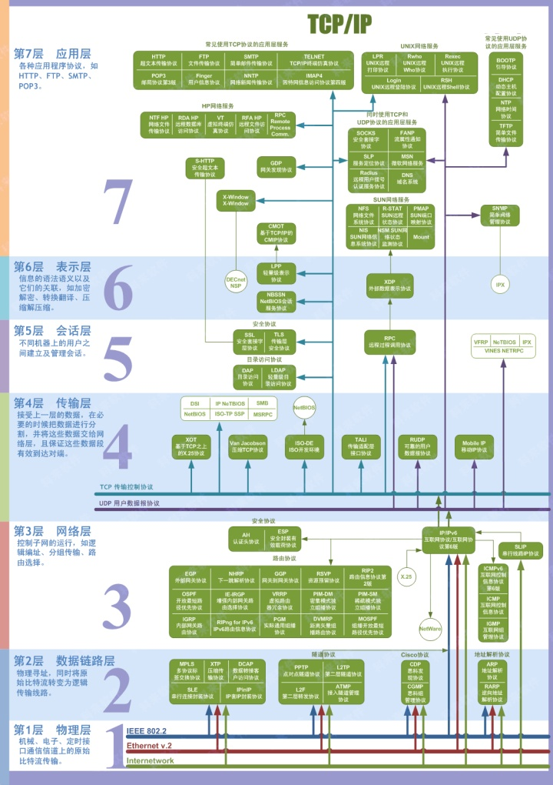

### TCP/IP四层模型


1. 主机到网络层  

实际上TCP/IP参考模型没有真正描述这一层的实现，只是要求能够提供给其上层-网络互连层一个访问接口，以便在其上传递IP分组。由于这一层次未被定义，所以其具体的实现方法将随着网络类型的不同而不同。

2. 网络互连层  

网络互连层是整个TCP/IP协议栈的核心。它的功能是把分组发往目标网络或主机。同时，为了尽快地发送分组，可能需要沿不同的路径同时进行分组传递。因此，分组到达的顺序和发送的顺序可能不同，这就需要上层必须对分组进行排序。  

网络互连层定义了分组格式和协议，即IP协议（Internet Protocol）。  

网络互连层除了需要完成路由的功能外，也可以完成将不同类型的网络（异构网）互连的任务。除此之外，网络互连层还需要完成拥塞控制的功能。

3. 传输层  

在TCP/IP模型中，传输层的功能是使源端主机和目标端主机上的对等实体可以进行会话。在传输层定义了两种服务质量不同的协议。即：传输控制协议TCP（trans mission control protocol）和用户数据报协议UDP（user datagram protocol）。  

TCP协议是一个面向连接的、可靠的协议。它将一台主机发出的字节流无差错地发往互联网上的其他主机。在发送端，它负责把上层传送下来的字节流分成报文段并传递给下层。在接收端，它负责把收到的报文进行重组后递交给上层。TCP协议还要处理端到端的流量控制，以避免缓慢接收的接收方没有足够的缓冲区接收发送方发送的大量数据。  

UDP协议是一个不可靠的、无连接协议，主要适用于不需要对报文进行排序和流量控制的场合。

4. 应用层  

TCP/IP模型将OSI参考模型中的会话层和表示层的功能合并到应用层实现。  

应用层面向不同的网络应用引入了不同的应用层协议。其中，有基于TCP协议的，如文件传输协议（File Transfer Protocol，FTP）、虚拟终端协议（TELNET）、超文本链接协议（Hyper Text Transfer Protocol，HTTP），也有基于UDP协议的。

应用层面向不同的网络应用引入了不同的应用层协议。其中，有基于TCP协议的，如文件传输协议（File Transfer Protocol，FTP）、虚拟终端协议（TELNET）、超文本链接协议（Hyper Text Transfer Protocol，HTTP），也有基于UDP协议的。

上层屏蔽下层细节，只使用其提供的服务。**高内聚低耦合，每一层专注于其功能，各层之间的关系依赖不大。**

### 拥塞控制

如果网络出现拥塞，**分组将会丢失，此时发送方会继续重传，从而导致网络拥塞程度更高**。因此当出现拥塞时，应当控制**发送方的速率**。这一点和流量控制很像，但是出发点不同。流量控制是为了让接收方能来得及接收，而拥塞控制是为了降低整个网络的拥塞程度。

TCP 主要通过四个算法来进行拥塞控制：**慢开始、拥塞避免、快重传、快恢复**。  

发送方需要维护一个叫做**拥塞窗口（cwnd）**的状态变量，注意拥塞窗口与发送方窗口的区别：拥塞窗口只是一个状态变量，实际决定发送方能发送多少数据的是发送方窗口。

<hr>

#### <p>原文出处：<a href='https://www.cnblogs.com/zhxmdefj/p/12613015.html' target='blank'>OpenGL面试总结</a></p>

## OpenGL面试

### GLSL语言

着色器(shader)是运行在GPU上的小程序，类似于C语言，构造一个着色器在其开头必须声明版本。本质上来说，着色器是一个把输入转化为输出的程序。  

着色器定义了`in`和`out`等关键字实现数据的输入和输出，从而实现数据的交流。如果从一个着色器向另一个着色器发送数据，则必须在发送方声明一个输出，在接收方声明一个类似的输入。当类型和名字都相同的时候，便会自动链接在一起，实现数据传递。  

另一种从cpu向gpu发送数据的方式是`uniform`。`uniform`是全局的，无需借助其他中介实现数据传递。在着色器程序中声明`uniform`变量，在主程序中通过`glGetUniformLocation`获得其地址，从而设置着色器中uniform变量的值。

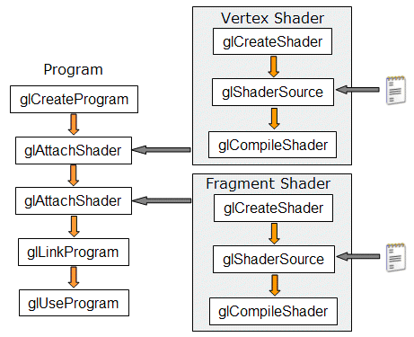

### CPU和GPU之间如何调度的

如1中所述，GLSL运行在GPU，其通过接口实现和CPU之间的数据转换。  
opengl程序涉及到两种类型的处理单元--CPU和GPU。opengl主程序由CPU调度运行，图像处理部分通过GLSL交由GPU执行。CPU与GPU之间的数据传递分三个步骤：

  1. 首先利用内置的OpenGL函数生成一个ID号码;
  2. 根据需要对该ID号码进行内存类型的绑定;在经过上面两个步骤之后，GPU中用于接收系统内存中数据的“标识符”就准备好了
  3. 对这部分内存进行初始化，初始化的内容来自于系统内存中，这一部分功能利用glBufferData函数完成。  

数据提交到GPU专用的内存中之后，需要根据应用场景对这些数据进行适当的分配。比如，有的数据当做顶点，有的是作为颜色，有的用于控制光照等等

此外，由于GPU具有高并行结构(heighly parallel structure)，所以GPU在处理图形和复杂算法方面计算效率较高。CPU大部分面积为控制器和寄存器，而GPU拥有更多的ALU(Arithmetric Logic Unit,逻辑运算单云)用于数据处理，而非数据的高速缓存和流控制。

### 缓冲

1. 帧缓冲(frame buffer)：帧缓冲是下面几种缓冲的合集。通过帧缓冲可以将你的场景渲染到一个不同的帧缓冲中，可以使我们能够在场景中创建镜子这样的效果，或者做出一些炫酷的特效，存放显示用的数据的。  
2. 颜色缓冲(color buffer)：存储所有片段的颜色：即视觉输出的效果。  
3. 深度缓冲(depth buffer)：根据缓冲的z值，确定哪些面片被遮挡。由GLFW自动生成。  
4. 模板缓冲(stencil buffer)：与深度测试类似，通过比较模板值和预设值，决定是否丢弃片段。  

数据在opengl中处理顺序是： 顶点着色器 - 片段着色器 - 模板测试 - 深度测试

### mipmap

Mipmap是多级渐远纹理，也是目前应用最为广泛的纹理映射(map)技术之一。简单来说，就是实现 “实物(图片)看起来近大远小，近处清晰远处模糊”的效果。它简单来说就是一系列的纹理图像，后一个纹理图像是前一个的二分之一。多级渐远纹理背后的理念很简单：距观察者的距离超过一定的阈值，OpenGL会使用不同的多级渐远纹理，即最适合物体的距离的那个。由于距离远，解析度不高也不会被用户注意到。同时，多级渐远纹理另一加分之处是它的性能非常好

### 坐标系

局部空间(local space):或称为 物体空间.指对象所在的坐标空间  

世界空间(world space):指顶点相对于(游戏)世界的坐标。物体变换到的最终空间就是世界坐标系  

观察空间(view space):观察空间(View Space)经常被人们称之OpenGL的摄像机(Camera)(所以有时也称为摄像机空间(Camera Space)或视觉空间(Eye Space))。观察空间就是将对象的世界空间的坐标转换为观察者视野前面的坐标。因此观察空间就是从摄像机的角度观察到的空间  

裁剪空间(clip sapce):或称为视觉空间.在一个顶点着色器运行的最后，OpenGL期望所有的坐标都能落在一个给定的范围内，且任何在这个范围之外的点都应该被裁剪掉(Clipped)。被裁剪掉的坐标就被忽略了，所以剩下的坐标就将变为屏幕上可见的片段。这也就是裁剪空间(Clip Space)名字的由来。  

屏幕空间(screen space):顾名思义，一般由`glViewPort`设置。

### 常用矩阵

`model`:主要针对模型的平移、旋转、缩放、错切等功能，将模型由局部空间转换到世界空间  
`view`：视图矩阵。摄像机/观察者的位置等信息（设置鼠标移动、滚轮等效果）,将所有世界坐标转换为观察坐标。  
`projection`:投影矩阵。裁剪坐标 转换到屏幕上

### 为什么说opengl是一个状态机

首先简单了解一下什么是"状态机"，比如我们使用的电脑，接受各种输入(鼠标，键盘，摄像头等)，然后改变自己当前的状态，但却并不知道状态的改变是如何实现的。opengl类似，接受各种参数，然后参数的改变引起当前状态的改变，达到一种新的状态(如：颜色改变，纹理变化，光照强弱变化)。

### 光照

冯式光照模型：环境光照(Ambient)、漫反射(Diffuse)、镜面(Specular)  

光源：点光、定向光、手电筒（聚光灯）

### 显示器是二维的，三维数据如何在二维屏幕上显示的

主要是通过图形渲染管线（管线：实际上是指一堆原始图像数据途径一个输送管道，期间经过经过各种变换处理，最终输出在屏幕上的过程）管理的，其被划分为两个过程：
1. 把3D坐标转换为2D坐标。 
2. 把2D坐标转换为实际有颜色的像素。  

2D坐标和像素是不同的，2D坐标精确表示一个点在空间的位置，而2D像素（好像都是整数）是这个点的近似值，2D像素受到个人屏幕/窗口 分辨率的限制。

### 渲染流水线

首先，发送**顶点数据**到**顶点着色器(VertexShader)**，顶点着色器主要的目的是把**3D坐标转为另一种3D坐标**（后面会解释），同时顶点着色器允许我们对顶点属性进行一些基本处理。

然后进入**图元装配(Primitive Assembly)**阶段将顶点着色器输出的所有顶点作为输入（如果是GL_POINTS，那么就是一个顶点），并所有的点**装配成指定图元**的形状。

图元装配阶段的输出会传递给**几何着色器(Geometry Shader)**。它可以通过**产生新顶点**构造出新的（或是其它的）图元来生成其他形状。

**光栅化阶段(Rasterization Stage)**，这里它会把**图元映射为最终屏幕上相应的像素**，生成**片段(Fragment)**。在片段着色器运行之前会执行裁切(Clipping)。裁切会丢弃超出你的视图以外的所有像素，用来提升执行效率。

**片段着色器(Fragment Shader)**计算一个像素的最终颜色。通常，片段着色器包含3D场景的数据（比如光照、阴影、光的颜色等等），这些数据可以被用来计算最终像素的颜色。

最终传到**Alpha测试和混合(Blending)**阶段。这个阶段检测片段的对应的**深度和模板值**，用它们来判断这个像素是其它物体的前面还是后面，决定是否应该丢弃。这个阶段也会检查alpha值（alpha值定义了一个物体的透明度）并对物体进行混合(Blend)。

几何着色器的输出会被传入光栅化阶段(Rasterization Stage)，这里它会把图元映射为最终屏幕上相应的像素，生成供片段着色器(Fragment Shader)使用的片段(Fragment)。在片段着色器运行之前会执行裁切(Clipping)。裁切会丢弃超出你的视图以外的所有像素，用来提升执行效率。

### gldrawArrays glDrawElement

glDrawElement基于索引绘制，需要配置EBO

