 
<!--BEGIN_DATA
{
    "create_date": "2020-06-14 15:00", 
    "modify_date": "2020-06-14 15:00", 
    "is_top": "0", 
    "summary": "哈夫曼（huffman）树和哈夫曼编码", 
    "tags": "算法、C/C++", 
    "file_name": "哈夫曼（huffman）树和哈夫曼编码.md"
}
END_DATA-->

####<p>原文出处：<a href='https://www.cnblogs.com/kubixuesheng/p/4397798.html' target='blank'>哈夫曼（huffman）树和哈夫曼编码</a></p>

###哈夫曼树

哈夫曼树也叫最优二叉树（哈夫曼树）  

###问题：什么是哈夫曼树？

例：将学生的百分制成绩转换为五分制成绩：≥90 分: A，80～89分: B，70～79分: C，60～69分: D，＜60分: E。

    
    if (a < 60){
        b = 'E';
    }
    else if (a < 70) {
        b = 'D';
    }
    else if (a<80) {
        b = 'C';
    }
    else if (a<90){
        b = 'B';
    }
    else {
        b = 'A';
    }

判别树：用于描述分类过程的二叉树。

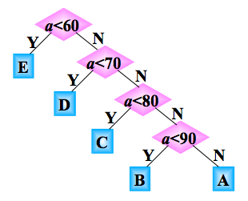

如果每次输入量都很大，那么应该考虑程序运行的时间

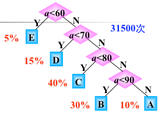

如果学生的总成绩数据有10000条，则5％的数据需 1 次比较，15％的数据需 2 次比较，40％的数据需 3 次比较，40％的数据需 4 次比较，因此 10000 个数据比较的

次数为：  10000 (5％＋2×15％＋3×40％＋4×40％)＝31500次

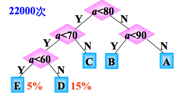

此种形状的二叉树，需要的比较次数是：10000 (3×20％＋2×80％)＝22000次，显然：两种判别树的效率是不一样的。

问题：能不能找到一种效率最高的判别树呢?

那就是哈夫曼树

回忆树的基本概念和术语

路径：若树中存在一个结点序列k1,k2,…,kj，使得ki是ki+1的双亲，则称该结点序列是从k1到kj的一条路径。

路径长度：等于路径上的结点数减1。

结点的权：在许多应用中，常常将树中的结点赋予一个有意义的数，称为该结点的权。

结点的带权路径长度：是指该结点到树根之间的路径长度与该结点上权的乘积。

树的带权路径长度：树中所有叶子结点的带权路径长度之和，通常记作：

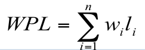

其中，n表示叶子结点的数目，wi和li分别表示叶子结点ki的权值和树根结点到叶子结点ki之间的路径长度。

赫夫曼树（哈夫曼树，huffman树）定义：

在权为w1,w2,…,wn的n个叶子结点的所有二叉树中，带权路径长度WPL最小的二叉树称为赫夫曼树或最优二叉树。

例：有4 个结点 a, b, c, d，权值分别为 7, 5, 2, 4，试构造以此 4 个结点为叶子结点的二叉树。

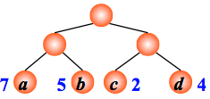

WPL=7´2+5´2+2´2+4´2= 36

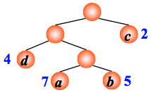

WPL=7´3+5´3+2´1+4´2= 46

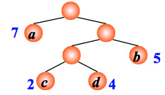

WPL=7´1+5´2+2´3+4´3= 35

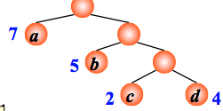

WPL=7´1+5´2+2´3+4´3= 35

后两者其实就是最有二叉树（也就是哈夫曼树）

####哈夫曼树的构造(哈夫曼算法)

1. 根据给定的n个权值{w1,w2,…,wn}构成二叉树集合F={T1,T2,…,Tn},其中每棵二叉树Ti中只有一个带权为wi的根结点,其左右子树为空.

2. 在F中选取两棵根结点权值最小的树作为左右子树构造一棵新的二叉树,且置新的二叉树的根结点的权值为左右子树根结点的权值之和.

3. 在F中删除这两棵树,同时将新的二叉树加入F中.

4. 重复2、3,直到F只含有一棵树为止.(得到哈夫曼树)

例：有4 个结点 a, b, c, d，权值分别为 7, 5, 2, 4，构造哈夫曼树。

根据给定的n个权值{w1,w2,…,wn}构成二叉树集合F={T1,T2,…,Tn},其中每棵二叉树Ti中只有一个带权为wi的根结点,其左右子树为空.

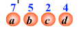

在F中选取两棵根结点权值最小的树作为左右子树构造一棵新的二叉树,且置新的二叉树的根结点的权值为左右子树根结点的权值之和.

在F中删除这两棵树,同时将新的二叉树加入F中.

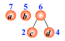

重复,直到F只含有一棵树为止.(得到哈夫曼树)

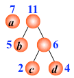

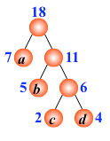

####关于哈夫曼树的注意点：

1、满二叉树不一定是哈夫曼树  

2、哈夫曼树中权越大的叶子离根越近  （很好理解，WPL最小的二叉树）

3、具有相同带权结点的哈夫曼树不惟一

4、哈夫曼树的结点的度数为 0 或 2， 没有度为 1 的结点。

5、包含 n 个叶子结点的哈夫曼树中共有 2n - 1 个结点。

6、包含 n 棵树的森林要经过 n-1 次合并才能形成哈夫曼树，共产生 n-1 个新结点

再看一个例子：如权值集合W={7,19,2,6,32,3,21,10 }构造赫夫曼树的过程。

根据给定的n个权值{w1,w2,…,wn}构成二叉树集合F={T1,T2,…,Tn},其中每棵二叉树Ti中只有一个带权为wi的根结点,其左右子树为空.

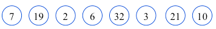

在F中选取两棵根结点权值最小的树


作为左右子树构造一棵新的二叉树，置新的二叉树的根结点的权值为左右子树根结点的权值之和

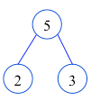

在F中删除这两棵树,同时将新的二叉树加入F中.

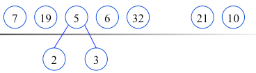

重复,直到F只含有一棵树为止.(得到哈夫曼树)

 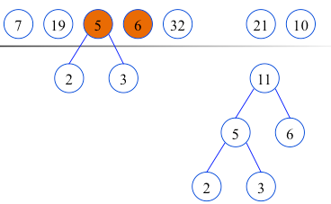

在F中删除这两棵树,同时将新的二叉树加入F中.

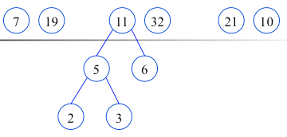

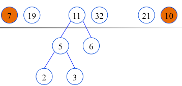

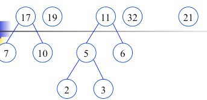

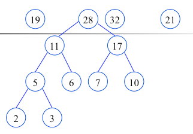

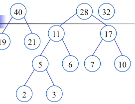

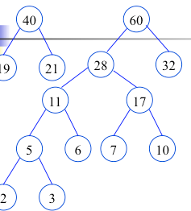

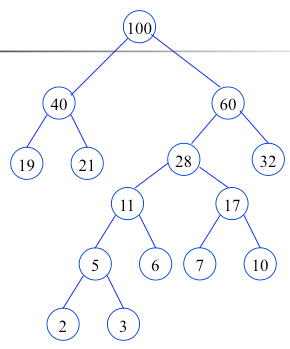

构造完毕（哈夫曼树，最有二叉树），也就是最佳判定树

###哈夫曼编码

哈夫曼树的应用很广，哈夫曼编码就是其在电讯通信中的应用之一。广泛地用于数据文件压缩的十分有效的编码方法。其压缩率通常在20%～90%之间。在电讯通信业务中，通常用二进制编码来表示字母或其他字符，并用这样的编码来表示字符序列。

例：如果需传送的电文为 'ABACCDA'，它只用到四种字符，用两位二进制编码便可分辨。假设 A, B, C, D 的编码分别为 00, 01,10, 11，则上述电文便为 '00010010101100'（共 14 位），译码员按两位进行分组译码，便可恢复原来的电文。

####能否使编码总长度更短呢？

实际应用中各字符的出现频度不相同，用短（长）编码表示频率大（小）的字符，使得编码序列的总长度最小，使所需总空间量最少

####数据的最小冗余编码问题

在上例中，若假设 A, B, C, D 的编码分别为 0，00，1，01，则电文 'ABACCDA' 便为 '000011010'（共 9 位），但此编码存在多义性：可译为： 'BBCCDA'、'ABACCDA'、'AAAACCACA' 等。

####译码的惟一性问题

要求任一字符的编码都不能是另一字符编码的前缀，这种编码称为前缀编码（其实是非前缀码）。在编码过程要考虑两个问题，数据的最小冗余编码问题，译码的惟一性问题，利用最优二叉树可以很好地解决上述两个问题

####用二叉树设计二进制前缀编码

以电文中的字符作为叶子结点构造二叉树。然后将二叉树中结点引向其左孩子的分支标 '0'，引向其右孩子的分支标 '1'；每个字符的编码即为从根到每个叶子的路径上得到的 0, 1 序列。如此得到的即为二进制前缀编码。

 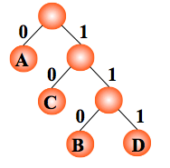

编码： A：0， C：10，B：110，D：111

任意一个叶子结点都不可能在其它叶子结点的路径中。

####用哈夫曼树设计总长最短的二进制前缀编码

假设各个字符在电文中出现的次数（或频率）为 wi ，其编码长度为 li，电文中只有 n 种字符，则电文编码总长为：

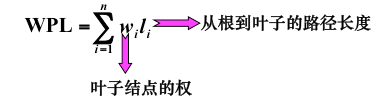

设计电文总长最短的编码，设计哈夫曼树（以 n 种字符出现的频率作权），由哈夫曼树得到的二进制前缀编码称为哈夫曼编码  

例：如果需传送的电文为 'ABACCDA'，即：A, B, C, D

的频率（即权值）分别为 0.43, 0.14, 0.29, 0.14，试构造哈夫曼编码。

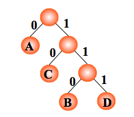

编码： A：0， C：10，  B：110， D：111 。电文 'ABACCDA' 便为 '0110010101110'（共 13 位）。

例：如果需传送的电文为 'ABCACCDAEAE'，即：A, B, C, D, E 的频率（即权值）分别为0.36, 0.1, 0.27, 0.1, 0.18，试构造哈夫曼编码。

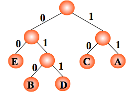

编码： A：11，C：10，E：00，B：010，D：011 ，则电文 'ABCACCDAEAE' 便为'110101011101001111001100'（共 24 位，比 33 位短）。

####译码

从哈夫曼树根开始，对待译码电文逐位取码。若编码是"0"，则向左走；若编码是"1"，则向右走，一旦到达叶子结点，则译出一个字符；再重新从根出发，直到电文结束。

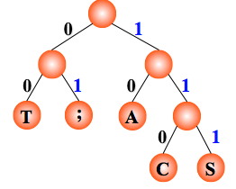

电文为 "1101000" ，译文只能是"CAT"

####哈夫曼编码算法的实现

由于哈夫曼树中没有度为1的结点，则一棵有n个叶子的哈夫曼树共有2×n-1个结点，可以用一个大小为2×n-1 的一维数组存放哈夫曼树的各个结点。由于每个结点同时还包含其双亲信息和孩子结点的信息，所以构成一个静态三叉链表。

    
```
//haffman 树的结构
typedef struct
{
    //叶子结点权值
    unsigned int weight;
    //指向双亲，和孩子结点的指针
    unsigned int parent;
    unsigned int lChild;
    unsigned int rChild;
} Node, *HuffmanTree;

//动态分配数组，存储哈夫曼编码
typedef char *HuffmanCode;

//选择两个parent为0，且weight最小的结点s1和s2的方法实现
//n 为叶子结点的总数，s1和 s2两个指针参数指向要选取出来的两个权值最小的结点
void select(HuffmanTree *huffmanTree, int n, int *s1, int *s2)
{
    //标记 i
    int i = 0;
    //记录最小权值
    int min;
    //遍历全部结点，找出单节点
    for(i = 1; i <= n; i++)
    {
        //如果此结点的父亲没有，那么把结点号赋值给 min，跳出循环
        if((*huffmanTree)[i].parent == 0)
        {
            min = i;
            break;
        }
    }
    //继续遍历全部结点，找出权值最小的单节点
    for(i = 1; i <= n; i++)
    {
        //如果此结点的父亲为空，则进入 if
        if((*huffmanTree)[i].parent == 0)
        {
            //如果此结点的权值比 min 结点的权值小，那么更新 min 结点，否则就是最开始的 min
            if((*huffmanTree)[i].weight < (*huffmanTree)[min].weight)
            {
               min = i;
            }
        }
    }
    //找到了最小权值的结点，s1指向
    *s1 = min;
    //遍历全部结点
    for(i = 1; i <= n; i++)
    {
        //找出下一个单节点，且没有被 s1指向，那么i 赋值给 min，跳出循环
        if((*huffmanTree)[i].parent == 0 && i != (*s1))
        {
            min = i;
            break;
        }
    }
    //继续遍历全部结点，找到权值最小的那一个
    for(i = 1; i <= n; i++)
    {
        if((*huffmanTree)[i].parent == 0 && i != (*s1))
        {
            //如果此结点的权值比 min 结点的权值小，那么更新 min 结点，否则就是最开始的 min
            if((*huffmanTree)[i].weight < (*huffmanTree)[min].weight)
            {
               min = i;
            }
        }
    }
    //s2指针指向第二个权值最小的叶子结点
    *s2 = min;
}

//创建哈夫曼树并求哈夫曼编码的算法如下，w数组存放已知的n个权值
void createHuffmanTree(HuffmanTree *huffmanTree, int w[], int n)
{
    //m 为哈夫曼树总共的结点数，n 为叶子结点数
    int m = 2 * n - 1;
    //s1 和 s2 为两个当前结点里，要选取的最小权值的结点
    int s1;
    int s2;
    //标记
    int i;
    // 创建哈夫曼树的结点所需的空间，m+1，代表其中包含一个头结点
    *huffmanTree = (HuffmanTree)malloc((m + 1) * sizeof(Node));
    //1--n号存放叶子结点，初始化叶子结点，结构数组来初始化每个叶子结点，初始的时候看做一个个单个结点的二叉树
    for(i = 1; i <= n; i++)
    {

        //其中叶子结点的权值是 w【n】数组来保存
        (*huffmanTree)[i].weight = w[i];
        //初始化叶子结点（单个结点二叉树）的孩子和双亲，单个结点，也就是没有孩子和双亲，==0
        (*huffmanTree)[i].lChild = 0;
        (*huffmanTree)[i].parent = 0;
        (*huffmanTree)[i].rChild = 0;
    }// end of for
    //非叶子结点的初始化
    for(i = n + 1; i <= m; i++)
    {
        (*huffmanTree)[i].weight = 0;
        (*huffmanTree)[i].lChild = 0;
        (*huffmanTree)[i].parent = 0;
        (*huffmanTree)[i].rChild = 0;
    }

    printf("\n HuffmanTree: \n");
    //创建非叶子结点，建哈夫曼树
    for(i = n + 1; i <= m; i++)
    {
        //在(*huffmanTree)[1]~(*huffmanTree)[i-1]的范围内选择两个parent为0
        //且weight最小的结点，其序号分别赋值给s1、s2
        select(huffmanTree, i-1, &s1, &s2);
        //选出的两个权值最小的叶子结点，组成一个新的二叉树，根为 i 结点
        (*huffmanTree)[s1].parent = i;
        (*huffmanTree)[s2].parent = i;
        (*huffmanTree)[i].lChild = s1;
        (*huffmanTree)[i].rChild = s2;
        //新的结点 i 的权值
        (*huffmanTree)[i].weight = (*huffmanTree)[s1].weight + (*huffmanTree)[s2].weight;

        printf("%d (%d, %d)\n", (*huffmanTree)[i].weight, (*huffmanTree)[s1].weight, (*huffmanTree)[s2].weight);
    }

    printf("\n");
}

//哈夫曼树建立完毕，从 n 个叶子结点到根，逆向求每个叶子结点对应的哈夫曼编码
void creatHuffmanCode(HuffmanTree *huffmanTree, HuffmanCode *huffmanCode, int n)
{
    //指示biaoji
    int i;
    //编码的起始指针
    int start;
    //指向当前结点的父节点
    int p;
    //遍历 n 个叶子结点的指示标记 c
    unsigned int c;
    //分配n个编码的头指针
    huffmanCode=(HuffmanCode *)malloc((n+1) * sizeof(char *));
    //分配求当前编码的工作空间
    char *cd = (char *)malloc(n * sizeof(char));
    //从右向左逐位存放编码，首先存放编码结束符
    cd[n-1] = '\0';
    //求n个叶子结点对应的哈夫曼编码
    for(i = 1; i <= n; i++)
    {
        //初始化编码起始指针
        start = n - 1;
        //从叶子到根结点求编码
        for(c = i, p = (*huffmanTree)[i].parent; p != 0; c = p, p = (*huffmanTree)[p].parent)
        {
            if( (*huffmanTree)[p].lChild == c)
            {
                //从右到左的顺序编码入数组内
                 cd[--start] = '0';  //左分支标0
            }
            else
            {
                cd[--start] = '1';  //右分支标1
            }
        }// end of for
        //为第i个编码分配空间
        huffmanCode[i] = (char *)malloc((n - start) * sizeof(char));

        strcpy(huffmanCode[i], &cd[start]);
    }

    free(cd);
    //打印编码序列
    for(i = 1; i <= n; i++)
    {
         printf("HuffmanCode of %3d is %s\n", (*huffmanTree)[i].weight, huffmanCode[i]);
    }

    printf("\n");
}

int main(void)
{
    HuffmanTree HT;
    HuffmanCode HC;
    int *w,i,n,wei,m;

    printf("\nn = " );

    scanf("%d",&n);

    w=(int *)malloc((n+1)*sizeof(int));

    printf("\ninput the %d element's weight:\n",n);

    for(i=1; i<=n; i++)
    {
        printf("%d: ",i);
        fflush(stdin);
        scanf("%d",&wei);
        w[i]=wei;
    }

    createHuffmanTree(&HT, w, n);
    creatHuffmanCode(&HT,&HC,n);

    return 0;
}
```


####补充：树的计数

已知先序序列和中序序列可确定一棵唯一的二叉树；

已知后序序列和中序序列可确定一棵唯一的二叉树；

已知先序序列和后序序列不能确定一棵唯一的二叉树。

