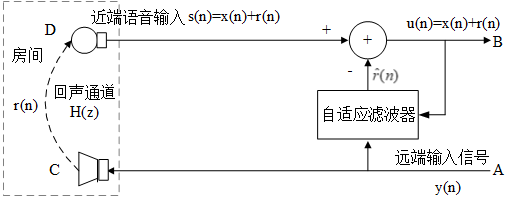
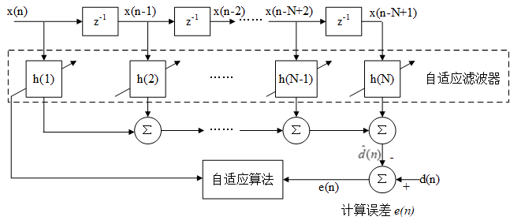
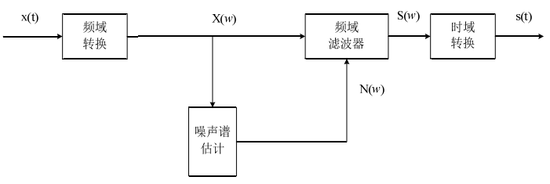
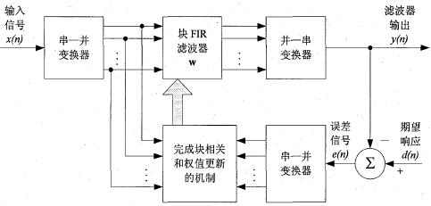
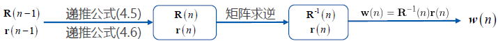
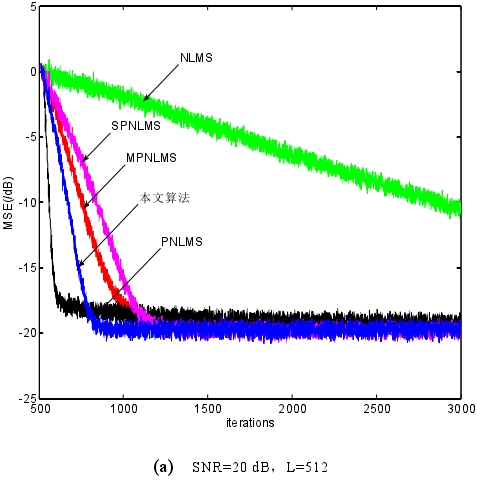
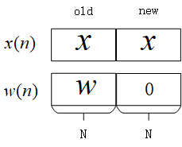
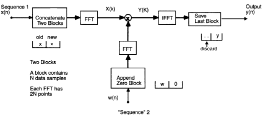
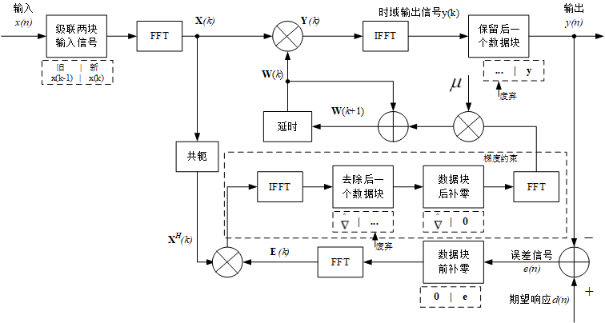
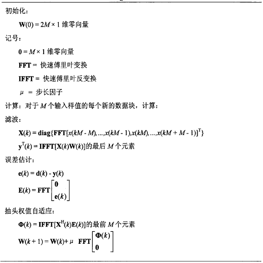

<!--BEGIN_DATA
{
    "create_date": "2021-01-28 12:40", 
    "modify_date": "2021-01-28 12:40", 
    "is_top": "0", 
    "summary": "回声消除中的自适应滤波算法综述 ", 
    "tags": "音视频、算法", 
    "file_name": "回声消除中的自适应滤波算法综述.md"
}
END_DATA-->

#### 
原文出处：<a href='https://www.cnblogs.com/LXP-Never/p/11773190.html' target='blank'>回声消除中的自适应滤波算法综述</a>

## 自适应回声消除原理

声学回声是指扬声器播出的声音在接受者听到的同时，也通过多种路径被麦克风拾取到。多路径反射的结果产生了不同延时的回声，包括直接回声和间接回声。

**直接回声**是指由扬声器播出的声音未经任何反射直接进入麦克风。这种回声的延时最短 ，它同远端说话者的语音能量，扬声器与麦克风之间的距离、角度 ,扬声器的播放音量，麦克风的拾取灵敏度等因素直接相关；

**间接回声**是指由扬声器播出的声音经过不同的路径 (如房屋或房屋内的任何物体 )的一次或多次反射后进入麦克风所产生的回声的集合。房屋内的任何物体的任何变动都会改变回声的通道。因此，这种回声的特点是多路径的、时变的。

自适应回声消除的基本思想是估计回音路径的特征参数，产生一个模拟的回音路径，得出模拟回音信号，从接收信号中减去该信号，实现回音抵消。其关键就是得到回声路径
的冲击响应$$\hat{h}(n)$$，由于回音路径通常是未知的和时变的，所以一般采用自适应滤波器来模拟回音路径。自适应回音消除的显著特点是实时跟踪，实时性强。

回声消除原理框图

图中$$ y(n)$$代表来自远端的信号 , $$r(n)$$是经过回声通道而产生的回声，$$x(n)$$是近端的语音信号。D端是近端麦克风，麦克风采集到的房间叠加的回声和近端说话人的语音。对回声消除器来说，接收到的远端信号作为一个参考信号，回声消除器根据参考信号由自适应滤波器产生回声的估计值$$\hat{r}(n)$$，将$$\hat{r}(n)$$从近端带有回声的语音信号减去，就得到近端传送出去的信号。在理想情况下，经过回声消除器处理后，残留的回声误差$$e(n)=r(n)-\hat{r}(n)$$将为0，从而实现回音消除。

## 自适应滤波器算法的性能指标

  * **收敛速度**：滤波器的收敛速度越快越好，使正常通话开始后，通话者很快就感觉不到明显的回波存在。
  * **稳态残留回波(稳定性)**：即当滤波器收敛达到稳态后的回波输出量，实际中总是希望该参数越小越好。
  * **算法复杂度**：良好的算法应该在保持收敛速度的同时尽量降低计算复杂度，同时也能减少功耗

ITU-T G.168对各种回音抵消器产品在包括以上两个主要指标在内的各种指标规定了必须达到的标准。

## 自适应滤波器结构

自适应滤波器结构

图中所示滤波器的输入是$$X(n)={x(n),x(n-1),...x(n-N+1)}^T$$，$$z^{-1}$$滤波器z域模型的延迟单元（零状态），滤波器的权重系数是$$h(n)={h_1(n),h_2(n),...,h_N(n)}^T$$，$$d(n)$$为期望输出信号，$$\hat{d}(n)$$为滤波器的实际输出，也称估计值，$$\hat{d}(n)=\sum_{i=1}^Nx(n-i+1)h_i(n)$$。$$e(n)$$是误差，$$e(n)=d(n)-\hat{d(n)}$$，由**误差**经过一定的**自适应滤波算法**来调整滤波系数，使得滤波器的实际输出接近期望输出信号。

传统的IIR和FIR滤波器在处理输入信号的过程中滤波器的参数固定，当环境发生变化时，滤波器无法实现原先设定的目标。自适应滤波器能够根据自身的状态和环境变化调整滤波器的权重。

自适应滤波器类型。可以分为两大类：**非线性自适应滤波器**、**线性自适应滤波器**。非线性自适应滤波器包括基于神经网络的自适应滤波器及Volterra滤波器。非线性自适应滤波器信号处理能力更强，但计算复杂度较高。所以实践中，**线性自适应滤波器使用较多**。

主要分为两类FIR滤波器、IIR滤波器。

  1. FIR滤波器时非递归系统，即当前输出样本仅是过去和现在输入样本的函数，其系统冲激响应h(n)是一个有限长序列。具有很好的线性相位，无相位失真，**稳定性较好**。
  2. IIR滤波器时递归系统，即当前输出样本是过去输出和过去输入样本的函数，其系统冲激h(n)是一个无限长序列。IIR系统的相频特性是非线性的，稳定性不能保证。好处是实现阶数较低，**计算量较少**。

由于IIR存在稳定性问题，因此一般采用FIR。

> 自适应滤波器算法按照不同的优化准则，常见自适应滤波算法有：递推最小二乘算法(RLS)，最小均方误差算法(LMS)，归一化均方误差算法(NLMS)，快速精确最小均方误差算法，子带滤波，频域的自适应滤波等等。

## 全带自适应稀疏算法

### 谱减法

本文研究的背景噪声是以汽车噪声和风声为主要对象，此类噪声的特点为加性的、局部平稳的、且与语音信号统计独立。谱减法根据噪声的加性特点，通过噪声能量估计和增益计算得到噪声的功率谱，然后从带噪语音的功率谱中减去估计出的噪声得到较为纯净的语音。

由于谱减法没有考虑人耳听觉对语音频谱分布的幅度较为敏感的特点。因此采用谱减法进行滤波后，会给原信号带来噪声，使语音质量变差，并且会影响到其他处理，如语音编码等。用实际的语音信号检测谱减法的滤波效果，如图下所示，可以看出，经过谱减法后噪声得到了一定的消除，但频率较低的信号处滤波效果并不是很理想。

### 最小均方算法（LMS）

1959年由Widrow和Hoff提出了**最小均方（Least Mean Square，LMS）**算法，LMS基于维纳滤波理论，采用瞬时值估计梯度矢量的算法，通过最小化误差信号的能量来更新自适应滤波器权值系数。

设计一个N 阶滤波器，它的参数为$$w(n)$$，则滤波器输出为

$$y(n)=\sum_{i=0}^{N-1} w_{i}(n) x(n-i)=w^{T}(n)x(n)=x^{T}(n) w(n)$$

期望输出为$$d(n)$$，则误差信号可以定义为：

$$e(n)=d(n)-y(n)=d(n)-w^{T}(n) x(n)$$

我们的目标就是将误差$$e(n)$$最小化，采用最小均方误差（MMSE ）准则，最小化目标函数：$$J(w)$$

$$J(w)=E\left\{|e(n)|^{2}\right\}=E\left\{\left|d(n)-w^{T}(n) x(n)\right|^{2}\right\}$$

计算目标函数$$J(w)$$对$$w$$的导数，令导数为0：

$$\nabla (J(w)) = \frac{{\partial [\mathop e\nolimits^2 (n)]}}{{\partial w(n)}} =  - 2e(n)X(n)$$

则滤波器系数的更新公式可以写为：

$$w(n+1)=w(n)-\frac{1}{2}\mu [-\nabla (J(w))]=w(n)+\mu e(n)X(n)$$

上式中的$$\mu$$为步长因子。$$\mu$$值越大，算法收敛越快，但稳态误差也越大；$$\mu$$值越小，算法收敛越慢，但稳态误差也越小。为保证算法稳态收敛，应
使$$\mu$$在以下范围取值：$$0 < \mu  < \frac{2}{{\sum\limits_{i = 1}^N {x(i)_{}^2} }}$$

  * **优点**：算法简单，易于实现，算法复杂度低(LMS<RLS)，能够抑制旁瓣效应
  * **缺点**： 
    * 收敛速率较慢(LMS<RLS)，因为LMS滤波器系数更新是逐点的（每来一个新的$x(n)$和$d(n)$，滤波器系数就更新一次）,每一次采样点梯度的估计对于真实梯度会存在误差，导致滤波器系数的每次更新不会严格按照真实梯度方向更新，而是有一定的偏差
    * 跟踪性能较差，并且随着滤波器阶数(步长参数)升高，系统的稳定性下降
    * LMS要求不同时刻的输入向量$x(n)$线性无关——LMS 的独立性假设。如果输入信号存在相关性，会导致前一次迭代产生的梯度噪声传播到下一次迭代，造成误差的反复传播，收敛速度变慢，跟踪性能变差。

所以，理论上，LMS 算法对白噪声的效果最好。为了降低输入信号的相关性，出现了一类“**解相关LMS**”算法，这里就不展开讲述了。

### 分块 LMS算法(Block LMS)

为了对付LMS运算量大的问题，在LMS基础上提出了块处理LMS（Block LMS）。它与LMS算法不同的是：LMS算法是每来一个采样点就调整一次滤波器权值；而**BLMS算法是每K采样点才对滤波器的权值更新一次**。

块自适应滤波器的原理图

输入数据序列经过串一并变换器被分成若干个长度为L的数据块。然后将这些数据块一次一块的送入长度为M的滤波器中，在收集到每一块数据样值后，进行滤波器抽头权值的更新，使得滤波器的自适应过程一块一块地进行，而不是像时域传统自适应滤波算法那样一个值一个值地进行。

具体算法如下：

累积$$L$$个采样点之后，我们再更新一次滤波器系数

$$
\begin{array}{l} w(n+1)=w(n)+\mu X(n) e(n) \\\  
w(n+2)=w(n+1)+\mu X(n+1) e(n+1) \\\  
\mathbf{. .} \\\  
w(n+L)=w(n+L-1)+\mu X(n+L-1) e(n+L-1) \end{array}$$

上式全部相加，中间的式子可以左右相消，就可以得出Block LMS滤波器权重的更新公式：

$$w(n+L)=w(n)+\mu \sum_{i=0}^{L-1}X(n+i) e(n+i)$$

其中，$$\mu$$为步长因子，为了推导方便，我们通常令$$L=N$$，更新一次block LMS相当于LMS更新了$$L$$倍。我们用一个新的时间索引$k$来代表Block LMS系数的更新，其中$$kL=n$$，上式可以写为：

$$w(k+1)=w(k)+\mu \sum_{i=0}^{L-1} X(k L+i) e(k L+i)$$

  * **优点**：运算量就比LMS的运算量要小的多
  * **缺点**：收敛速度却与LMS算法相同

### 归一化最小均方算法（NLMS）

归一化最小均方(Normalized Least Mean Squares，NLMS)算法是改进的LMS算法，对于较大的输入，会导致梯度噪声的放大，因此需要用输入向量的平方范数进行归一化。根据原LMS算法中误差信号与远端输入信号的乘积，对远端输入信号的平方(功率)进行归一化处理，将固定步长因子的LMS算法变为根据输入信号时变的变步长NLMS算法，具体算法如下：

$$w(n+1)=w(n)+2 \mu \frac{x(n)}{x^{T}(n) x(n)} e(n)$$

其中$$w(n)$$为滤波器的系数，$$e(n)$$为误差信号，N为滤波器系数

  * **优点**：改善了LMS算法收敛速度慢的缺点。计算简单、更高的精度
  * **缺点**：输入相关信号时，收敛速率明显下降

后续研发除了归一化块处理LMS（BNLMS）：结合以上NLMS和BLMS两者的特点则有归一化块处理LMS（BNLMS）

### 变步长LMS(VSS LMS)

针对μ 值, 人们研究了许多变步长LMS 算法（Variable Step-Size LMS），一般是在滤波器工作的开始阶段采用较大的μ值，以加快收敛速度，而在后阶段采用较小的μ值，可以减小稳态误差。这类算法的关键是确定在整个过程中μ值如何变化或μ值在何种条件满足下才改变。

  * 优点：收敛速度快，
  * 缺点：算法的稳定性和跟踪能力上较易受输入噪声的影响

### 递归最小二乘法（RLS）

MMSE适合处理平稳序列，因为MMSE是一个均匀加权的最优化问题，也就是说，每一时刻的误差信号对目标函数的贡献权重是相同的，如果对于非平稳的语音信号效果就不太好了。

RLS采用指数加权的方式，重新定义函数：

$$
J_{n}(w)=\sum_{i=0}^{n} \lambda^{n-i}|e(i)|^{2}=\sum_{i=0}^{n} \lambda^{n-i}\left|d(i)-w^{T}(n) x(i)\right|^{2}
$$

其中，滤波器系数选用的是$$w^T(n)$$，而不是$$w^T(i)$$。因为在自适应更新过程中，滤波器总是变得越来越好，这意味着对于任何的$$i<n$$，$$|d(i)-w^T(n)x(i)|$$总是比$$|d(i)-w^T(i)x(i)|$$小 。

$$0<\lambda\leq 1$$称为遗忘因子。对离$$n$$时刻越近的误差加比较大的权重，而对离$$n$$时刻越远的误差加比较小的权重，也就是说对各个时刻的误差具有一定的遗忘作用 。

  * $$\lambda=1$$：无任何遗忘功能，此时 RLS 退化为 LS 方法 
  * $$\lambda-->0$$：只对当前时刻的误差起作用，而过去时刻的误差完全被遗忘 

我们让目标函数$$J_{n}(w)$$对$$w$$求导，令梯度等于0，得到$$w$$的公式为：

$$w(n)==R^{-1}(n) r(n)$$

其中：

$$R(n)=\sum_{i=0}^{n} \lambda^{n-i} x(i) x^{T}(i)$$

$$r(n)=\sum_{i=0}^{n} \lambda^{n-i} x(i) d(i)$$

根据$$R(n)$$和$$r(n)$$的等式，得其时间递推公式：

$$R(n)=\lambda R(n-1)+x(n)x^T(n)$$

$$\lambda r(n-1)+x(n)d(n)$$

弊端：需要计算每个点$$R(n)$$的逆矩阵，很不划算。更优的方法？

探索$$P(n)=R^{-1}(n)$$的时间递推公式

$$P(n)=R^{-1}(n)=(\lambda R(n-1)+x(n)x^T(n))^{-1}$$

根据矩阵求逆引理：

$$(A+B C D)^{-1}=A^{-1}-A^{-1} B\left(C^{-1}+D A^{-1} B\right)^{-1} D A^{-1}$$

令：$$A=R(n-1) \quad B=x(n) \quad C=\frac{1}{\lambda} \quad D=x^{T}(n)$$

可以得到：

$$
\begin{aligned}  
P(n) &=\frac{1}{\lambda}\left[P(n-1)-\frac{P(n-1) x(n) x^{T}(n)
P(n-1)}{\lambda+x^{T}(n) P(n-1) x(n)}\right] \\\  
&=\frac{1}{\lambda}\left[P(n-1)-k(n) x^{T}(n) P(n-1)\right]  
\end{aligned}
$$

其中，增益向量：

$$k(n)=\frac{P(n-1) x(n)}{\lambda+x^{T}(n) P(n-1) x(n)}$$

 

$$\begin{aligned} \mathbf{P}(n) \mathbf{x}(n) &=\frac{1}{\lambda}\left[\mathbf{P}(n-1) \mathbf{x}(n)-\mathbf{k}(n) \mathbf{x}^{T}(n) \mathbf{P}(n-1) \mathbf{x}(n)\right] \\ &=\frac{1}{\lambda}\left\{\left[\lambda+\mathbf{x}^{T}(n) \mathbf{P}(n-1) \mathbf{x}(n)\right] \mathbf{k}(n)-\mathbf{k}(n) \mathbf{x}^{T}(n) \mathbf{P}(n-1) \mathbf{x}(n)\right\} \\ &=\mathbf{k}(n) \end{aligned}$$

探索$$w(n)$$的时间递推公式

$$
\begin{aligned} \mathbf{w}(n)=& \mathbf{R}^{-1}(n) \mathbf{r}(n)=\mathbf{P}(n) \mathbf{r}(n) \\ =& \frac{1}{\lambda}\left[\mathbf{P}(n-1)-\mathbf{k}(n) \mathbf{x}^{T}(n) \mathbf{P}(n-1)\right][\lambda \mathbf{r}(n-1)+\mathbf{x}(n) d(n)] \\ =& \mathbf{P}(n-1) \mathbf{r}(n-1)-\mathbf{k}(n) \mathbf{x}^{T}(n) \mathbf{P}(n-1) \mathbf{r}(n-1) \\ &+\frac{1}{\lambda} d(n)\left[\mathbf{P}(n-1) \mathbf{x}(n)-\mathbf{k}(n) \mathbf{x}^{T}(n) \mathbf{P}(n-1) \mathbf{x}(n)\right] \\ =& \mathbf{w}(n-1)+d(n) \mathbf{k}(n)-\mathbf{k}(n) \mathbf{x}^{T}(n) \mathbf{w}(n-1) \\ =& \mathbf{w}(n-1)+\mathbf{k}(n)\left[d(n)-\mathbf{x}^{T}(n) \mathbf{w}(n-1)\right] \\ =& \mathbf{w}(n-1)+\mathbf{k}(n) \varepsilon(n) \end{aligned}
$$

这就是标准RLS算法的更新公式，这里的$$\varepsilon (n)$$为先验估计误差。

标准RLS 算法的执行流程：

1)初始化： $$w(0)=0, p(0)=\delta ^{-1}I$，$\delta $$是一个很小的正数。

2)对每一个时刻$$n$$，重复如下计算

先验误差：$$\varepsilon(n)=d(n)-\mathbf{w}^{T}(n-1) \mathbf{x}(n)$$

增益向量：$$\mathbf{k}(n)=\frac{\mathbf{P}(n-1) \mathbf{x}(n)}{\lambda+\mathbf{x}^{T}(n) \mathbf{P}(n-1) \mathbf{x}(n)}$$

逆矩阵更新：$$\mathbf{P}(n)=\frac{1}{\lambda}\left[\mathbf{P}(n-1)-\mathbf{k}(n) \mathbf{x}^{T}(n) \mathbf{P}(n-1)\right]$$

滤波器更新：$$\mathbf{w}(n)=\mathbf{w}(n-1)+\mathbf{k}(n) \varepsilon(n)$$

一个广泛的共识是RLS 算法的收敛速度和跟踪性能都优于 LMS 算法，所付出的代价是需要更复杂的计算 。

<table border="0">
<tbody>
<tr>
<td style="text-align: center"><strong>算法</strong></td>
<td style="text-align: center"><strong>误差计算</strong></td>
<td style="text-align: center"><strong>收敛速度</strong></td>
<td style="text-align: center"><strong>跟踪性能</strong></td>
<td style="text-align: center"><strong>计算代价</strong></td>
</tr>
<tr>
<td style="text-align: center"><strong>LMS</strong></td>
<td style="text-align: center">后验误差</td>
<td style="text-align: center">慢</td>
<td style="text-align: center">慢</td>
<td style="text-align: center">小</td>
</tr>
<tr>
<td style="text-align: center"><strong>RLS</strong></td>
<td style="text-align: center">先验误差</td>
<td style="text-align: center">快</td>
<td style="text-align: center">快</td>
<td style="text-align: center">大</td>
</tr>
</tbody>
</table>

  * **优点**：RLS自适应滤波器提供更快的收敛速度和跟踪性能。
  * **缺点**：由于RLS 使用了自相关矩阵的逆矩阵的递推，所以，一旦输入信号的自相关矩阵接近奇异时RLS 的收敛速度和跟踪性能会严重恶化 。

### 仿射投影算法（AP）

仿射投影算法 (Affine projection algorithm) 是运算量介于 LMS 和 RLS 之间的一种自适应算法 。

$$y(n)=X^{T}(n) w^{*}(n)$$

其中，$$X(n)$$是输入向量矩阵，$$w^*(n)$$是$$w(n)$$的共轭转置

$$w(n)=w(n-1)+\mu \Delta w_{n}$$

$$y(n)=X^{T}(n) w^{*}(n-1)+\mu X^{T}(n) \Delta w_{n}^{*}$$

$$e(n)=y(n)-X^{T}(n) w^{*}(n-1)$$

为了简化，我们令$$\mu =1$$，则：

$$X^{T}(n) \Delta w_{n}^{*}=e(n)$$

$$X^{H}(n) \Delta w_{n}=e^{*}(n)$$

我们发现 滤波器系数的更新量$$\Delta W^{*}_n(\Delta W_n)$$，是由$$L$$个线性方程组成的线性方程组决定的

> 线性方程组相关知识补充：
>
> 对于线性方程组：$$A_{m*n}X_{n*1}=b_{m*1}$$
>
> 考虑（行/列）满秩的情况，分下面三种情况：
>
> （一）如果$$m=n$$，则：
>
> $$\begin{aligned} &\mathbf{x}=\mathbf{A}^{-1} \mathbf{b}&\text { 唯一解 精确解 } \end{aligned}$$
>
> （二）如果m<n即方程的个数小于未知数的个数此时方程组有无穷多个解 。 为了得到唯一解 必须增加约束条件 要求 x 的范数最小这样得到的解称为最小范数解 。
>
> $$\begin{aligned} &\mathbf{x}=\mathbf{A}^{H} \mathbf{(AA^H)^{-1}b}&\text { 最小范数解 } \end{aligned}$$
>
> （三）如果$$m>n$$即方程的个数大于未知数的个数 此时方程组不存在精确解 只存在近似解 。 我们自然希望找到一个使方程组两边的误差平方和为最小的解即最小二乘解 。
>
> $$\mathbf{x}=\left(\mathbf{A}^{H} \mathbf{A}\right)^{-1} \mathbf{A}^{H} \mathbf{b} \quad \text { 最小二乘解 }$$

利用线性方程组的结论，重新观察公式：

$$公式19：\mathbf{X}^{H}(n) \Delta \mathbf{w}_{n}=\mathbf{e}^{*}(n)$$

**分为两种情况讨论**：

**情况1**：$$1\leq L< N$$，方程组为欠定方程，具有唯一的最小范数解

$$\Delta \mathbf{w}_{n}=\mathbf{X}(n)\left(\mathbf{X}^{H}(n)\mathbf{X}(n)\right)^{-1} \mathbf{e}^{*}(n)$$

此时，权重更新公式变为：

$$\mathbf{w}(n)=\mathbf{w}(n-1)+\mu \mathbf{X}(n)\left(\mathbf{X}^{H}(n)\mathbf{X}(n)\right)^{-1} \mathbf{e}^{*}(n)$$

如果$$L=1$$，则退化为 NLMS 算法：

$$\mathbf{w}(n)=\mathbf{w}(n-1)+\mu e^{*}(n)\frac{\mathbf{x}(n)}{\mathbf{x}^{H}(n) \mathbf{x}(n)}$$

实际中，L 取 2 、 3 就足够了。

**情况2**：$$L\geq N$$，方程组为超定方程，其唯一解为最小二乘解：

$$\Delta \mathbf{w}_{n}=\left(\mathbf{X}(n) \mathbf{X}^{H}(n)\right)^{-1}\mathbf{X}(n) \mathbf{e}^{*}(n)$$

此时，权重更新公式变为：

$$\mathbf{w}(n)=\mathbf{w}(n-1)+\mu\left(\mathbf{X}(n)\mathbf{X}^{H}(n)\right)^{-1} \mathbf{X}(n) \mathbf{e}^{*}(n)$$

如果我们令：$$\mu =1$$, $$R(n)=\frac{1}{L}X(n)X^H(n)$$, $$r(n)=\frac{1}{L}X(n)y^*(n)$$并结合公式17，可得

$$
\begin{aligned}  
\mathbf{w}(n) &=\mathbf{w}(n-1)+\left(\mathbf{X}(n)
\mathbf{X}^{H}(n)\right)^{-1}
\mathbf{X}(n)\left(\mathbf{y}^{*}(n)-\mathbf{X}^{H}(n) \mathbf{w}(n-1)\right)
\\\  
&=\mathbf{w}(n-1)+\mathbf{R}^{-1}(n) \mathbf{r}(n)-\mathbf{R}^{-1}(n)
\mathbf{R}(n) \mathbf{w}(n-1)  
\end{aligned}$$

等价于RLS 算法

  * **优点**：收敛速度和计算复杂度介于 LMS 和RLS 之间

### 功率归一化最小均方——PNLMS

$$\mu(n)=\frac{\alpha}{\beta+\mathbf{x}^{T}(n) \mathbf{x}(n)}, \quad 0<\alpha<2, \quad \beta \geqslant 0$$

功率归一化LMS (PNLMS )是利用归一化项$$x^T(n)x(n)$$调整学习速率，数值稳定性要好于 NLMS 。当$$\alpha=1$$时， PNLMS退化为 NLMS 。

### 稀疏类自适应算法——PNLMS

> 通过对回声路径模型的分析，发现回声能量中较活跃系数均在时域聚集，且比重很小，其数值只有很少不为零的有效值，大多数都是零值或者接近零值，这就是**回声路径具有的稀疏特性**（基于时域对信号进行处理的一种特性）

#### PNLMS

根据回声路径的稀疏性，Duttweiler引入了比例自适应的思想，提出了**比例归一化最小均方算法PNLMS**，按比例分配滤波器的权值向量大小，该算法对回声消除的发展具有非常重要的意义。

该算法采用与滤波器抽头稀疏成正比的可变步长参数来调整算法收敛速度，利用其抽头稀疏的比例值来判断当前权重稀疏所属的活跃状态，根据状态的不同，所分配的步长大小也有所差异，活跃抽头系数分配较大的步长参数，这样可以加速其收敛，而不活跃的抽头系数则相反，通过分配其较小的步长参数来提高算法的稳态误差。每个滤波器抽头被分别赋予了不同估计值，算法的稳态收敛性得到了明显改善。然而，PNLMS有一个明显的缺点，即比例步长参数的选择引入了定值，这会导致估计误差累积，最后使算法在后期的收敛速度减慢下来。

**优点**：使算法对于稀疏的回声路径，在初始阶段拥有快速的收敛速率，与此同时降低了稳态误差，  

**缺点**：

  1. 由于 PNLMS 算法过分强调大系数的收敛，而当系数变小后，P 步长也随之变小，但随着算法的运行，则可能出现算法**后期收敛速度慢**、不能及时收敛的情况
  2. 相比于NLMS算法增加了**算法的复杂度**
  3. 另外在回声路径非稀疏情况下，收敛速度会变得比NLMS算法更慢

#### PNLMS++

PNLMS ++算法，在每个采样周期内，通过将NLMS算法和PNLMS算法之间进行**交替**来实现**收敛速度**方面的提升。但是PNLMS++算法只在回声路径**稀疏或高度非稀疏的情况下**表现良好。

#### CPNLMS

CPNLMS 算法（Composite PNLMS）通过比较误差信号功率和已设阈值大小，来判断算法采用 PNLMS 还是 NLMS 算法

  * **缺点**：阈值的选取往往和实际环境有关，因此该算法在实际应用中不能通用

#### $$\mu$$准则MPNLMS

$$\mu$$准则MPNLMS算法：为了解决PNLMS算法后程收敛速度慢的问题，将最速下降法应用到PNLMS算法中，使用$$\mu$$准则来计算比例因子（使用对数函数代替PNLMS算法中的绝对值函数）

  * 优点：使得滤波器权值向量的更新更加平衡，提升了PNLMS算法接近稳态时期的收敛速率
  * 缺点：复杂性加大

#### 改进比例归一化最小均方 IPNLMS

IPNLMS算法，基于L1范数将估计的回声路径权值向量均值与比例步长参数之和作为比例矩阵的对角元素（通过调整滤波器的比例参数步长），使得IPNLMS有着和PNLMS相近的初始收敛速率，并且在非稀疏的回声路径条件下，IPNLMS的收敛速率相比PNLMS有所改善，但性能改善的同时也增加了计算复杂度。

#### 改进的IPNLMS

在PNLMS类算法进行自适应迭代更新过程中，大抽头权值向量拥有大步长因子，这样提升了收敛速率，但滤波器自适应收敛至接近稳态时，大抽头权值向量将会产生较大的稳态误差。为了解决这一问题，P.A.Naylor提出了改进的IPNLMS（Improved IPNLMS，IIPNLMS）算法。IIPNLMS算法在IPNLMS算法的基础之上，对于数值较大的权值向量，使用较小的参数使得其步长成比例减小，从而降低系数噪声。

#### MPNLMS

MPNLMS算法引入最优步长控制矩阵，均衡了滤波器大小系数之间的更新，MPNLMS 中 P 步长的计算方式克服了 PNLMS过分注重大系数收敛忽略小系数收敛的缺点，修正了 PNLMS 算法收敛后期速度慢的缺点，但

  * **缺点**：MPNLMS算法的运算过程中包含对数的计算，因此算法的运算复杂度相对较高。

#### SPNLMS

SPNLMS算法，将MPNLMS滤波器更新过程中的对数函数关系简为两段折线形式的形式。

SPNLMS的P步长计算函数$$F(|w_l(k)|)$$可以描述为：

$$F(|w_l(k)|)=\left\{\begin{matrix} 600*|w_l(k)|&&|w_l(k)\leq 0.005|\\  3&&其他 \end{matrix}\right.$$

  * **优点**：相对于MPNLMS为减小运法复杂度
  * **缺点**：但收敛速度有所下降

改进的 MPNLMS算法，采用多个分段函数来近似 MPNLMS 的对数函数，从而降低算法的复杂度。

改进的 SPNLMS算法，通过控制步长控制矩阵迭代的频率降低算法复杂度。收敛速度也所下降

以上对 MPNLMS 的改进算法在减小算法运算复杂度的情况下损害了收敛性能和稳定性能。

#### 稀疏控制(Sparse Control, SC)

有时候回声路径的稀疏程度会根据温度、压力以及房间墙面的吸声系数等等因素而产生变化，这就需要一种能够适应不同稀疏度变化的AEC算法。

稀疏控制比例回声消除算法（**SC-PNLMS**、**SC-MPLNMS**、**SC-IPNLMS**），使用新的稀疏控制方法动态地适应回声路径的稀疏程度，使得算法在稀疏和非稀疏的回声路径条件下都有良好的性能表现，体现了稀疏控制类的自适应滤波算法能够提高算法对回声路径稀疏程度的鲁棒性。

> **小总结**：通过上述对 PNLMS 算法的分析，可知导致 PNLMS算法整体收敛速度慢的原因主要是**大系数和小系数之间收敛的不均衡**。尽管很多学者针对此缺陷提出了修正算法，如 PNLMS++、CPNLMS 等，但是PNLMS 忽略小系数收敛的缺陷并未从根本上得到改善，因此这些改进算法的效果不是十分理想。Deng通过对滤波器系数收敛过程的定量分析，在权系数更新过程中推导出最优步长的计算方式，提出一种改进的算法——MPNLMS 算法。MPNLMS 中 P 步长的计算方式克服了 PNLMS过分注重大系数收敛忽略小系数收敛的缺点，修正了 PNLMS 收敛后期速度慢的缺陷。
>
> 　　一种新的改进型 PNLMS 算法，因 PNLMS 算法只注重大系数更新，忽视小系数收敛，致使算法在收敛后期速度下降，因此在 P步长引入的同时必须注意小系数的更新。MPNLMS 算法通过建立 P 步长与当前滤波器权系数的函数关系，在一定程度上解决了 PNLMS 算法后期收敛速度慢的问题，但滤波过程包含了对数运算，不利于系统的实时实现。
>
>  　　本文通过定量分析滤波过程，并考虑到大、小系数的收敛，建立了一种新的 P步长与当前滤波器系数之间的映射关系，降低了算法的运算复杂度。 该改进算法以PNLMS 算法为基础，通过改变收敛过程来克服 PNLMS 算法的缺陷

## 子带自适应滤波器(SAF)

在声学回声消除应用中，**远端输入语音信号的相关性较高**，然而，传统的方法是基于“信号的无关性”假设的，传统的全带LMS 和NLMS 等计算复杂度低的随机梯度算法收敛速度明显下降。

远端语音信号相关性有两层含义：

  * 时域上：它表征语音信号相关矩阵特征值的扩散度
  * 频域上：它表征远端语音信号的频谱动态范围

一般来说，语音信号相比白色信号，前者明显有更大的频谱动态范围，即更大的信号相关性。因此，可以通过**降低输入信号的相关性来加快算法收敛速度**，但是行之有效的一种方法是将自适应滤波器和滤波器组理论相结合，提出了子带自适应滤波（subband adaptive filter，SAF）算法，子带结构是基于频域对信号进行的一种处理（节省计算量、提高收敛速度）。

**子带自适应滤波器**：SAF算法将相关信号通过滤波器组分割成近似无关的各个子带独立信号(**子带分割**)。然后对子带信号进行多速率抽取来获得采样信号，再进行信号的自适应处理。为研究子带自适应滤波器，首先需要了解多速率信号抽取系统和滤波器组。

#### 多速率系统[1]

用于子带自适应滤波器的多速率抽取系统有**下采样**和**上采样**两种，主要通过抽取和插值方法来使系统获得不同采样率。输入信号经过 N 个滤波器分频后的总采样点数是原信号的 N 倍，大幅度提高的采样数增加了计算量。

#### 滤波器组[1]

信号子带分割通过滤波器组实现。滤波器组由**分析滤波器**和**综合滤波器**共同组成。而滤波器组的实质是一系列带通滤波器。

分析滤波器组将数字信号分割后抽取成多个子带信号，经过信号处理后，综合滤波器组再对子带信号进行插值和滤波相加而恢复成原来的信号。

### 子带自适应算法结构[1]

在传统的 SAF中，子带自适应算法都是以最小化子带误差信号为目标的，这样基于局部目标函数误差的最小化不一定是全局误差能量最小化。而分析滤波器组在子带切割和综合滤波器组重建全带信号时皆会引入时延，在AEC 应用中，这样的时延会使包含近端语音的全带误差信号传到远端，为了消除时延的影响，无延时子带闭环结构系统以全局误差能量最小化为约束条件来调整滤波器系数。最后，确保自适应滤波算法能够收敛到最佳的滤波器系数。

  * 优点：改善了全带自适应滤波算法在相关信号条件下的收敛速率
  
  * 缺点： 
    * 但其稳态误差由于输出时存在的混叠分量而显著升高
    * 当采用正交镜像滤波器组时，虽然可以通过子带系统将混叠部分相互抵消掉，但在现实中却无法实现

**子带自适应算法的后续发展**

问题：针对SAF算法稳态误差较高的问题

解决：提出了 基于最小扰动原理提出了**归一化的SAF（normalized SAF，NSAF）**算法。

优点：由于SAF类算法固有的解相关特性，NSAF在处理相关输入信号时比全带的NLMS收敛速度快，而且计算成本与NLMS不相上下

近几年研究人员为了能够提升AEC算法的收敛性能和稳态性能，在NSAF的基础上结合全带自适应滤波算法的成比例理论，提出了几种改进的NSAF算法，例如不同形式的**变步长因子NSAF**以及**变正则化参数NSAF**。为了在识别稀疏回声路径时快速收敛，文献[22,23]将NLMS算法中的成比例思想以类比的方式融合到NSAF算法中，提出了比例**NASF（proportionate NASF，PNSAF）**算法和μ准则**PNSAF（μ-law PNASF，MPNSAF）**算法。

因为子带结构中存在混叠分量问题

  1. Keermann于1988年利用采样滤波器组技术消除了混叠现象，但是此举增加了算法复杂度。
  2. 相邻子带间留安全频带，缺点：引入了空白频带，降低了信号质量。
  3. 重叠子滤波器补偿法，缺点：因为交叉项而增加了运算量，还降低了收敛速度。

2004年K. A. Lee 和 W. S. Gan提出了基于最小扰动原理的**多带结构式**自适应滤波器(Multiband Structured SAF，MSAF)算法，并给出了自适应滤波器抽头系数的更新方程。该结构完全不存在滤波器输出端的混叠分量问题。

## 多带自适应滤波器

子带自适应滤波器中每个子带单独使用一个子滤波器。该结构会导致输出端产生混叠分量，解决此问题的传统方法多以降低信号的质量或增大稳态误差为代价，Lee 和 Gan在 2004 年提出了一种全新多带结构。不同于子带滤波器在每个子带都使用不同的滤波器，多带结构的每个子带使用相同的全带滤波器，这很好地克服了输出端存在混叠分量的问题。

### 频域分块LMS

在讲频域分块LMS之前建议大家回顾一个时域分块LMS算法

时域分块LMS：

$$e(n+m)=d(n+m)-X^{T}(n+m) \mathbf{w}(n)$$

$$w(k+1)=w(k)+\mu \sum_{i=0}^{L-1} X(k L+i) e(k L+i)$$

Block  LMS的误差计算 和 权重更新公式中，

$$y(n+m)=X^{T}(n+m) w(n)$$：是输入向量与滤波器系数向量的**线性卷积**

$$\hat{\nabla}(k)=-\sum_{i=0}^{L-1} X(k L+i) e(k L+i)$$：是误差信号与输入向量的**线性相关**

对于线性卷积和线性相关的运算，针对回声路径很长且复杂，并且回声延迟较高时，时域自适应滤波算法计算复杂度较高，我们更愿意把这两个信号变换到频域，**通过频域相乘的方式来取代时域复杂度相当高的卷积或相关运算**。所以我们把时域自适应滤波算法，衍生到频域自适应滤波算法。

> **预备知识**：线性卷积（相关）和圆周卷积（相关）之间的关系
>
>   1. 一般的，如果两个有限长序列的长度为$$N_1$$和$N_2$$，且满足$$N_1\geq N_2$$，则有**圆周卷积**的**后**$$N_1-N_2+1$$个点，与**线性卷积**的结果一致。
>   2. 一般的，如果两个有限长序列的长度为$$N_1$$和$$N_2$$，且满足$$N_1\geq N_2$$，则有**圆周相关**的**前**$$N_1-N_2+1$$个点，与**线性相关**的结果一致。
>   3. 时域中的圆周卷积对应于其离散傅里叶变换的乘积
>   4. 时域中的圆周相关对应于其离散傅里叶变换共轭谱的乘积

因此我们需要将 分块LMS自适应滤波算法中的**线性卷积**和**线性相关**均可以采用快速傅里叶变换(FFT)来实现。这样实现的分块LMS自适应滤波算法称为频域块LMS自适应滤波算法(FDAF，Frequency-Domain Block Least Mean Square Adaptive Filter)。FDAF算法将长度为L的自适应滤波器分成FFT长度的整数倍个子块，对输入信号的每个子块进行频域内的LMS算法。

**第一步：计算线性卷积**

$$y(n+m)=X^{T}(n+m) w(n)$$

计算线性卷积的方法有：

  * 重叠存储法（overlap save method，更常用）
  * 重叠相加法（overlap add method）

我们这里以overlap save method为例，为了确保能得到$$N$$个点的线性卷积输出信号，我们至少要保证有N个点的线性卷积和圆周卷积的结果一致（预备知识）

$$N_1-N_2+1$=N$$

由于$$N_1\geq N_2$$ (输入信号长度通常大于滤波器的阶数)，且$$N_2=N$$ (滤波器的阶数为N)，那么要求每次参与运算的输入信号长度$$N_1$$至少为$$2N-1$$，为了计算FFT方便，我们令输入信号的长度为：$$N_1=2N$$，那么我们FFT的长度也为$$2N$$

为了构造长度为$$2N$$的数据，我们需要在每个$N$阶滤波器后面$$N$$补零

要求线性卷积，根据预备知识1，我们需要 求圆周卷积后$$N_1-N_2+1$$个点，根据预备知识3，我们只需要求 离散傅里叶变换的乘积就能得到圆周卷积的结果，然后我们分别计算 输入信号向量 和 滤波器系数向量 的FFT：

$$X(k)=\operatorname{diag}\\{F[x(k N-N), \ldots, x(k N-1),| x(k N), \ldots, x(k N+N-1))]\\}$$

$$W(k)=F\left[W^{T}(k), |0, \ldots, 0\right]^{T}$$

频域相乘

$$\mathbf{Y}(k)=\mathbf{X}(k) \mathbf{W}(k)$$

则，$$N$$点线性卷积输出信号，就等于$$Y(k)$$的傅里叶逆变换的后N个点：$$y(k)=F^{-1} Y(k)$$

图: overlap save 方法

**第二步：计算线性相关**

$$\hat{\nabla}(k)=-\sum_{i=0}^{L-1} X(k L+i) e(k L+i)$$

根据预备知识2，4可知，需要求线性相关，我们可以通过获得 圆周相关 来获得。因此我们需要**求输入信号的共轭谱与误差信号谱的乘积**。

输入信号$$X(k)$$在上一步处理卷积运算是已经求得。

那么，剩下的工作就是，将误差向量$$e(k)$$也扩展到$2N$长度，因为是求**相关**，我们需要在误差向量**前面补0**，然后经过FFT：$$E(k)=F\left[0,0, \ldots, 0, e^{T}(k)\right]^{T}$$

频域相乘：

$$\boldsymbol{\Delta}(k)=X^{*}(k) E(k)$$

最后，将梯度向量进行傅里叶逆变换$$\vec{\nabla}(k)=F^{-1} \Delta(k)$$，取前$$N$$个点，就是我们求的线性相关。

**第三步：滤波器系数更新**

$$W(k+1)=W(k)+\mu F\left[\vec{\nabla}^{T}(k), 0,0, \ldots, 0\right]^{T}$$

注意：

  * 第一，滤波器系数直接在频域更新，所以需要将梯度向量再次变换到频域；
  * 第二，由于滤波器系数向量后面补了N 个零 【 参考公式15 】 ，为了保证结果的正确性梯度向量也需要在后面补 N 个零。

基于重叠存储法的频域块LMS自适应滤波算法的信号流程图

  * **优点**： 
    * 降低了时域自适应滤波器的计算复杂度
    * 提高了收敛速度
  * **缺点**： 
    * 增加了延迟（需要通过频域滤波器延迟期望信号）
    * 增加了内存需求（需要同时存储激励信号和期望信号）

如前所述，回声消除等应用回波路径较长，会导致较大的延迟和存储需求。该缺点可以通过诸如多延迟自适应滤波器之类的方法来克服。在这种方法中，块大小可以小于所需的时域自适应滤波器，并且可以应用每个频点中的自适应滤波器来代替单个系数。因此，可以减轻FDAF的缺点，同时保持降低的计算复杂性和提高的收敛速度。

**学习速率如何选取**

$$W(k+1)=W(k)+2 \mu F\left[\vec{\nabla}^{T}(k), 0,0, \ldots, 0\right]^{T}$$

我们在推导频域自适应滤波方法的时候，为了简化问题，将每一个frequency bin 上的学习速率均设为常数$$\mu $$。

在实际工程应用中，用的更多的一种方法是，对第$$m$$个 frequency bin ，利用输入信号在这个频点的功率 对学习速率$$P_m(k)$$进行归一化：

$$\mu_{m}(k)=\frac{\mu}{P_{m}(k)}$$

频点功率$$P_m(k)$$通常采用迭代的方式求得：

$$P_{m}(k)=\lambda P_{m}(k-1)+(1-\lambda)\left|X_{m}(k)\right|^{2}$$

## 综上所述

《声学回声消除中子带和块稀疏自适应算法研究_魏丹丹》

远端输入语音信号的相关性较高，且声学回声信道的冲击响应一般只有少量的非零系数，因此是一个稀疏信道。

针对用于声学回声消除的子带和块稀疏算法进行了研究和改进，以达到提高算法跟踪性能和抗冲激鲁棒性的目的。本文的主要贡献如下：

首先，区别于传统文献中子带归一化自适应算法消除回声的方法，

我提出一种用于声学回声消除的新型**子带归一化自适应滤波切换算法**(LMS-NSAF)。

该算法核心思想是根据语音信号的状态不同，采用 VAD 快慢包络技术切换算法，当输入远端信号的瞬时能量值较大时，使用收敛速度快的子带 NLMS 算法，当输入信号的瞬时能量值较小时，则使用计算复杂度低的权重矢量更新公式，从而使得改进的子带 NLMS 算法在提高收敛性的同时又能降低算法的计算复杂度

基于多带结构的改进型自适应滤波切换算法NLMS-NSAF

首先远端语音信号利用包络法判别有无语音段，

然后将信号状态输出到自适应多带结构算法模块当中。

若语音区输入信号的短时能量较大，则使用收敛速度快的自适应滤波算法(NLMS)；

若语音区输入信号的短时能量较小，需考虑计算量低的算法(NSAF)，

当然，语音在无语音区时算法迭代停止。

对输入语音信号能量高低的判定是通过和阈值比较得到的。在充分考虑语音特性的情况下，切换算法实现了算法在收敛速度的优势，同时完成了同算法复杂度的优化选择。最后达到了提高滤波算法性能、降低运算量的目的。

回声路径是经典的稀疏路径，且语音信号作为远端输入时相关性较强，

## 总结

回声消除的**挑战**在于能否**快速跟踪回声路径**中的变化，同时又**对大声干扰（例如双向通话）保持鲁棒性**。这两个目标是矛盾的，因为为了快速适应回声路径的变化，系统需要具有快速收敛速度的自适应算法，这又意味着在出现双向通话时很容易发散。

在大多数系统中，实现了双向通话检测器以冻结自适应并防止发散。双向通话检测器的决策阈值通常需要对信号处理环境进行一些调整。这是一个不良的特性，因此，大多数系统都被调整为过于保守。换句话说，由于双向通话决策遗漏比双向通话虚假警报更重要，因此要进行调整以确保不会发生任何丢失的决策。这可能会导致系统产生高频率的错误警报，从而导致系统无法及时调整。

健壮的自适应算法在回声消除系统中的应用使双向通话检测器的保守性降低。由于大多数双向通话遗漏都发生在语音段的开始和偏移处，因此鲁棒的自适应算法试图使滤波器系数的自适应不受干扰，直到可以做出双向通话决定为止。由过去误差信号的电平调节的比例因子控制自适应算法的速率。因此，例如尚未收敛的系统将导致高比例因子。在双向通话的情况下，由于使用了过去的误差信号值，因此其开始会被延迟。

[消除回声的两路径方法（AEC）论文](https://www.vocal.com/echo-cancellation/echo-control/)进一步讨论了该主题。双向通话检测器的复杂性以及使用两组滤波器系数作为缓解快速收敛和双向通话问题的方法的目的变得更加清晰。双路径方法的问题是需要两个FIR操作，这给系统增加了内存和计算复杂度。鲁棒的自适应算法的应用可以帮助缓解过于保守的双向通话检测器的问题，而不会增加两径方法的负担。

除了居于核心地位的自适应滤波技术外，实际回音抵消技术应用系统中还包括远端信号检测、近端信号检测、舒适噪声产生、残留回波的非线性处理技术等，这些技术也有待改进。这样整个回音抵消器才能实现一个较好的回音抵消效果。

大家可以根据实际项目中对计算复杂度、 收敛速度的要求 选择合适的自适应算法 解决自身场景的问题 。

## 参考

* 声学回声消除中子带和块稀疏自适应算法研究_魏丹丹
* 《车载免提系统降噪算法的研究以及硬件实现》__张雪
* 频域块LMS自适应滤波算法的研究__田超