 
<!--BEGIN_DATA
{
    "create_date": "2021-12-02 21:50", 
    "modify_date": "2021-12-02 21:50", 
    "is_top": "0", 
    "summary": "图像的表示（1） 图像的表示（2） 图像的表示（3）", 
    "tags": "音视频", 
    "file_name": "图像的表示.md"
}
END_DATA-->

#### 
原文出处：<a href='https://mp.weixin.qq.com/s/fOiV32SZb7UcN6KLUCI61g' target='blank'>图像的表示（1）</a>

>（本文基本逻辑：图像的定义是什么 → 图像成像的原理是什么 → 怎样对图像进行数学描述 → 怎样对图像进行数字化 → 数字图像数据是什么）

在了解了音频的基础知识后，我们理应对应的去介绍视频。但如果简单来看，视频其实就是按时间序列组合在一起的一组图像，因此想要了解视频，首先要知道图像的本质是什么。在这篇文章里，我们依然先提出一个问题：**从我们眼睛看见的『画面』，到我们用手机、电脑所处理的『图像数据』，其中经历了什么？**从这个问题出发，我们来浅浅的探讨一下：日常开发工作中处理的图像数据，是如何从现实的光影世界映射而来。

我们将上面的问题细分为几个子问题一一探讨：

  * **图像的定义是什么？**

  * **图像成像的原理是什么？**

  * **怎样对图像进行数学描述？**

  * **怎样对图像进行数字化？**

  * **数字图像数据是什么？**

## 1、图像的定义是什么？

『看见』，对我们来讲是非常稀松平常的一种能力，如果把我们看见的画面叫做图像，那怎么定义它呢？从维基百科找到的图像的定义如下：

**图像是人对视觉感知的物质再现。**图像可以由光学设备获取，如照相机、镜子、望远镜及显微镜等；也可以人为创作，如手工绘画。图像可以记录、保存在纸质介质、胶片等等对光信号敏感的介质上。随着数字采集技术和信号处理理论的发展，越来越多的图像以数字形式存储。

上述定义里有两个关键词：『视觉感知』和『物质再现』。前者对应着图像成像的过程，后者对应着图像信号处理的过程。

## 2、图像成像的原理是什么？

### 2.1、我们怎样看见图像？

那人眼是怎么做到**视觉感知**的呢？  

人眼能够看到物体，是因为人眼的晶状体结构相当于一个凸透镜，物体的反射光通过晶状体折射成像于视网膜上，再由视觉神经感知传给大脑，这样人就看到了物体。这就是物体在人眼成像的原理。

当我们探讨数字图像时，那必然也需要对应的设备承担类似人眼的功能来实现『视觉感知』，日常生活中最常见的这类设备就是相机，它们的成像原理也类似人眼的成像原理。

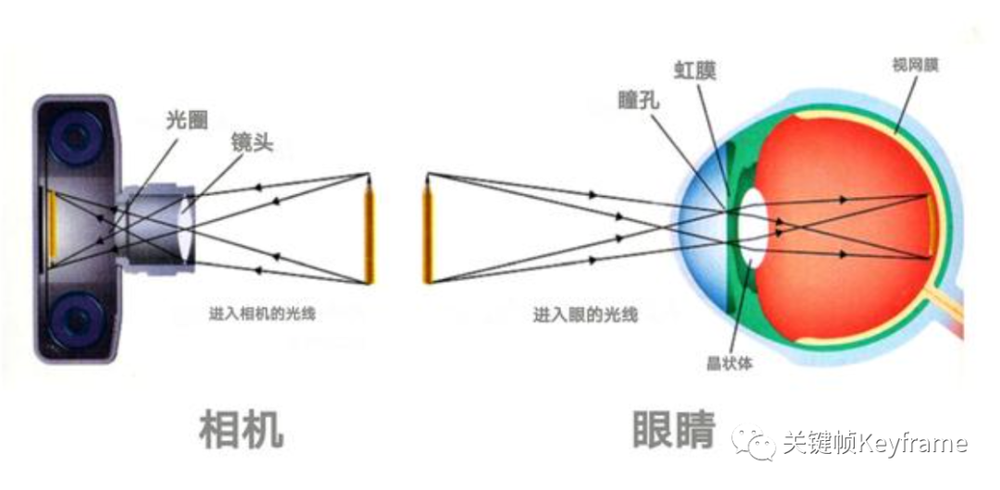

相机利用光的直线传播性质和光的折射与反射规律，以光子为载体，把某一瞬间的被摄景物的光信息量，以能量方式经镜头传递给感光材料（模拟的胶卷或数字的硅片），最终成为可视的影像。

对于成像原理，在很多应用场景中将镜头当做理想的针孔，对照小孔成像原理来理解就足够了，上面介绍的人眼和相机的成像原理即是如此。但是，如果要处理诸如焦距、曝光、虚影和像差等问题，就需要提出更复杂的模型，这是光学要研究的问题，我们这里就不做过多探讨了。

成像原理是我们感知到图像的存在的原因，那我们感知到的图像的**颜色**又是怎么回事呢？

### 2.2、我们怎样感知颜色？

我们为什么能感知到『颜色』？答案是因为物体发出或反射的光。早在之前，人类就发现光是一种电磁波，而人类视觉系统中有三种不同的椎体细胞，它们分别对不同波长段的光最敏感，视锥细胞形成的视觉信号复合后为人呈现了色彩缤纷的世界，这是**人眼视觉感知三原色理论**。人类并不能看见所有的电磁波，因此把能看见的电磁波称为**可见光**，对应的波长在 380-780 nm 之间。我们日常所见的大多数光，都是不同波长的光组合而成，因此我们才能看到这么多颜色。比如太阳光，它就是由多种不同颜色的光组合而成，牛顿很早的时候就用棱镜揭示过这个事实：**白光包含所有可见光谱的波长**。  

> 人类视觉系统中有三种不同的椎体细胞，它们分别对黄绿色、绿色和蓝紫色的光最敏感。第一种对长波长的光响应最大，峰值波长约为 560 nm，有时将这种类型视锥细胞称为 L。第二种类型对中波长的光响应最大，在 530 nm 处达到峰值，通常简称为 M。第三种类型对短波长的光响应最大，在 420 nm 处达到峰值，简称为 S。人类视锥细胞的峰值响应因人而异，所以这三种类型的峰值波长要取决于个人，它们的范围在 564–580 nm，534–545 nm 和 420–440 nm 附近。
>
> 这三种类型不完全对应于如我们所知的特定的颜色。相反，对颜色的感知是由一个开始于这些位于视网膜的细胞差异化的输出，且将在大脑的视觉皮层和其它相关区域中完成的复杂的过程实现的。例如，尽管 L 视锥细胞简称为红色感受器，紫外可见分光光度法表明它们的峰值敏感度在光谱的绿黄色区域。类似的，S 视锥细胞和 M 视锥细胞也不直接对应蓝色和绿色，尽管它们经常被这样描述（在很多资料的描述中，人眼的三种椎体细胞敏感的光分别对应 630 nm 的红光、530 nm 的绿光和 450 nm 的蓝光，因此才把 RGB 作为三基色）。实际上 RGB 颜色模型仅仅是用以表达颜色的一个方便的方式，而不是直接基于人眼中的视锥细胞类型。

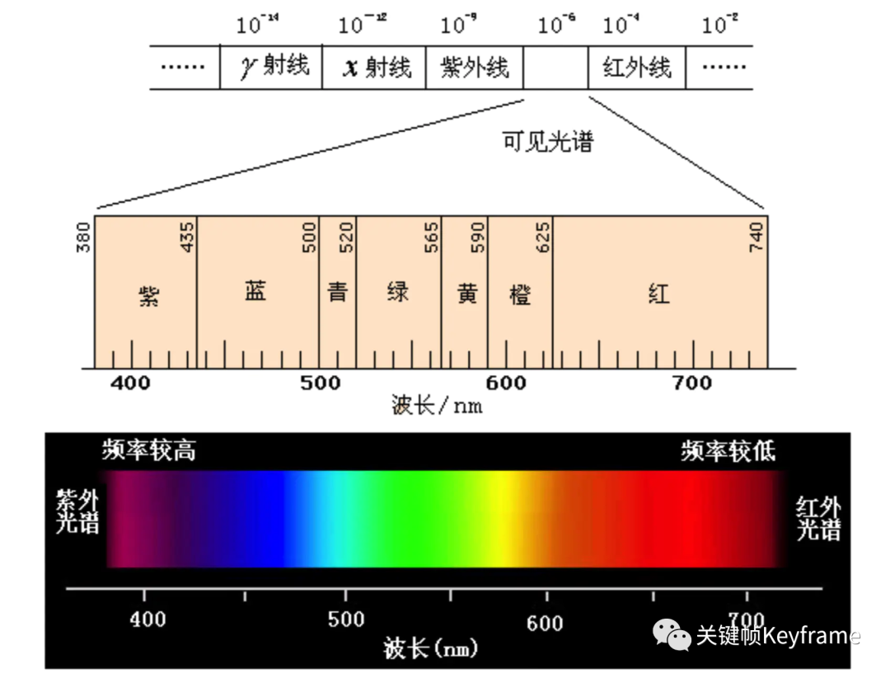

当我们把人眼对颜色的感受进一步细化，它可以分为如下几个特征：

  * **色调（hue）。**太阳或灯泡等光源发射可见波段的全部频率而产生白色光。当白色光投射到一个物体上时，某些频率被反射，某些则被物体吸收了。在反射光中混合的频率确定了我们所感受到的物体的颜色。如果在反射光中以低频率为主，则物体呈现红色。此时，我们可以说光谱中红色端有一个主频率（或主波长），也称为光的色调。

  * **亮度（brightness）。**对应于光的能量大小，可量化为光源亮度。

  * **饱和度（saturation）。**对应于光的颜色表现接近光谱色（例如红色）的程度。浅色或暗淡的颜色的饱和度较低，它们比较接近白色。

还有另外一个术语**色度（chromaticity）**通常是说明『饱和度』和『色调』这两种特征的综合表现。

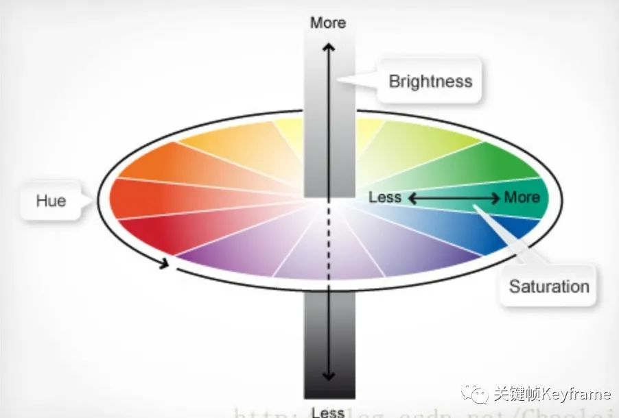

以上便是我们的视觉感知到图像及其颜色的原因。

（通过上文的探讨，我们了解了图像定义以及我们是如何感知到图像及其颜色的基础知识。对于图像进行数学描述的问题，由于篇幅较长，我们将在后面用完整的一篇文章来探讨，敬请期待）

#### 
原文出处：<a href='https://mp.weixin.qq.com/s/7QMpCe3YBgKxtHM260SZYA' target='blank'>图像的表示（2）</a>

  

Lena像素版(去公众号发送消息『像素王国』，帮你生成像素风格图片)

在前面的文章[《图像的表示（1）》](http://mp.weixin.qq.com/s?__biz=MjM5MTkxOTQyMQ==&mid=2257484446&idx=1&sn=24ce52c46c987ed90e7bdbaff421fef0&chksm=a5d4e6cc92a36fda127fac1ec
86e3859479751ea1686d44c5f5fbcef71701a7f468eeee57aa7&scene=21#wechat_redirect)里，我们提出了一个问题：**从我们眼睛看见的『画面』，到我们用手机、电脑所处理的『图像数据』，其中经历了什么？**从这个问题出发，我们探讨了『图像的定义是什么』和『图像成像的原理是什么』这两个问题，接下来我们继续探讨下个问题：『怎样对图像进行数学描述』。全文分为如下几节内容：

  * **颜色建模的背景**

  * **CIE RGB 颜色模型**：基于人眼视觉感知三原色理论，CIE 通过大量实验数据建立了 RGB 颜色模型，标准化了 RGB 表示。

  * **CIE XYZ 颜色模型**：为了解决 RGB 模型中与负光混合所带来的种种问题，CIE 从数学上定义了三种标准基色 XYZ，形成了 CIE XYZ 颜色模型。

  * **NTSC YIQ 颜色模型**：在模拟电视时代，RGB 工业显示器要求一幅彩色图像由分开的 R、G、B 信号组成，而电视显示器则需要混合信号输入，为了实现对这两种标准的兼容，NTSC 基于 XYZ 模型制定了 YIQ 颜色模型，实现了彩色电视和黑白电视的信号兼容。

  * **PAL YUV 颜色模型**：为了解决 NTSC YIQ 的组合模拟视频信号中分配给色度信息的带宽较低而影响了图像颜色质量的问题，PAL 引入了 YUV 颜色模型，支持用不同的采样格式来调整传输的色度信息量。

  * **ITU-R YCbCr 颜色模型**：进入数字电视时代，ITU-R 为数字视频转换制定了 YCbCr 颜色模型，成为我们现在最常使用的颜色模型。

  * **伽马校正**：在早年 CRT 显示器流行的年代，我们遇到了显示伽马问题，从而引入了伽马校正过程并延用至今。

这篇的字数有点多，可以先点赞收藏，如果你能耐心读完，对于建立图像数学描述历程的初步认识，相信会有一些帮助。

## 3、 怎样对图像进行数学描述？

从前文的介绍中，我们知道了感知图像的大致过程和其中的原理，那接下来要探讨的就是怎么对其建模和数学描述，这也是后续我们对图像进行数字化的基础。

### 3.1、颜色建模的背景

**颜色是对图像视觉感知最核心的要素，所以对图像进行数学描述，最重要的是建立『颜色模型（颜色空间）』。**

颜色模型指的是在某种特定上下文中对颜色的特性和行为进行解释的方法。没有哪种颜色模型能解释所有的颜色问题，因此我们需要使用不同的模型来帮助说明我们看到的不同的颜色特征。

在实际应用中，针对某一类型的应用场景，人们还是希望尽量做到颜色模型的统一和兼容，所以我们经历了一系列颜色建模和标准制定的过程。下图是颜色标准制定的关键节点图：

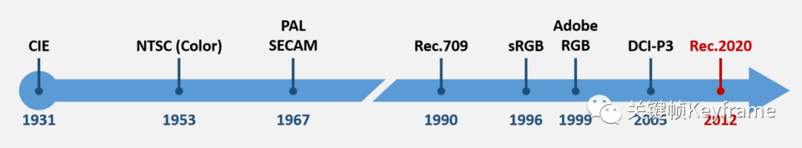

其中，CIE 是国际照明协会的简称，他们是最早采用数学方式来定义颜色模型的。CIE 提出的颜色模型是从 1920 年代后期 W. David Wright（Wright 1928）和 John Guild（Guild 1931）做的一系列实验中得出的。他们的实验结果合并到了 CIE RGB 颜色模型的规定中，CIE XYZ 颜色模型再从它发展而来。

在后续的学术研究和工业应用中，很多新出的颜色模型就是以 CIE XYZ 为基础制定的。这其中就包括模拟电视时代 NTSC、PAL 和 SECAM 等制式标准推出的颜色模型。下图是模拟电视时代，NTSC、PAL 和 SECAM 三大制式应用分布图：

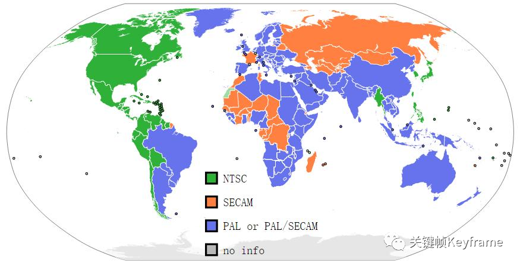

其中，北美、日本采用『NTSC 制式』（美国国家电视系统委员会），常被人提到的『NTSC 色域』其实是『NTSC 1953 色域』，也就是 NTSC 在 1953 年制定的彩色电视色域标准。我国和欧洲的模拟电视采用『PAL 制式』，其色域标准和 SECAM 制式一样，都是 EBU（欧洲广播联盟）色域。

接下来，我们就从 CIE RGB 开始并依次介绍 CIE XYZ、NTSC YIQ、PAL YUV 等颜色模型，最后到 ITU-R YCbCr 结束，这样就来到了我们目前在音视频开发中最常接触的 YCbCr 模型。希望在这一趟历程里能帮你梳理清楚『颜色』这个概念的发展脉络。

### 3.2、CIE RGB 颜色模型

当光由两个或多个具有不同主频率的光源混合而成时，我们可以改变各个光源的强度来生成一系列其他颜色的光，这是一种构造颜色模型的方法，称为**加色模式**。其中用来生成其他颜色光源的色彩称为**基色**。通过基色可以产生的所有颜色的集合称为该颜色模型的**颜色范围（色域）**。如果两种基色混合则生成白色光，就称它们为**互补色**，比如红色和青色、绿色和品红、蓝色和黄色都是互补色。

> 加色模式通常应用于『有源物体』。一个能自己发出光波的物体称为有源物体，它的颜色由该物体发出的光波决定。物体发出对应颜色的光，被眼睛接收，则感应到对应的颜色。比如，太阳、电灯、显示屏等。
>
> 与加色模式对应的是『减色模式』，表示从光源中减去某些颜色后得到的颜色，比如 CMYK 就是一种减色颜色模型。减色模式通常应用于『无源物体』。一个自己不发出光波的物体称为无源物体，它的颜色由物体吸收的光波（或反射的光波）决定。第三方光源照到物体上，有的波长被吸收，有的波长被反射，被反射的光波被眼睛接收，从而感知到对应的颜色。比如，油画、印刷品等。

在实际的基本颜色中，没有哪一组集合能组合生成所有可见的颜色（我们后续可以通过色度图来说明）。但是，三种基色对多数应用来说是够用的，并且，不包含在指定基色集的颜色范围中的颜色仍然可以使用扩充的方法进行描述。

**为了测试和量化上面提到的『人眼视觉感知三原色理论』，我们可以尝试选择适当的三种基色来混合以再现所有单色（单个波长）的颜色（单色光可以用棱镜或特殊制造的滤镜来获得）。国际照明协会（CIE）就这样干了，他们在 1931 年通过使用红、绿、蓝（波长分别是 700.0、546.1、435.8 nm）三种基色所进行的彩色匹配实验，标准化了 RGB 表示。**

对应的 **RGB 三基色的颜色匹配函数**如下图所示：

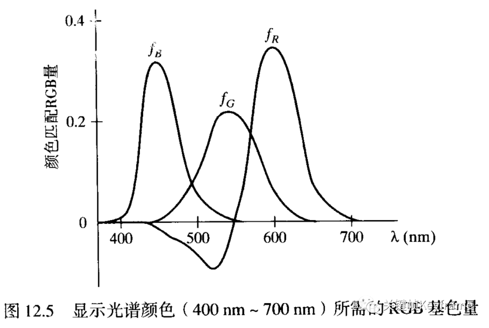

图中的曲线是经过大量实验综合而得（对大量受试者的感知结果做平均），可以指定合成任何一种光谱颜色所需要的红、绿、蓝的量。其中需要注意的是，在 500 nm 附近的颜色需要从蓝光和绿光的混合光中再『减去』对应的红光得到（红光曲线在 500 nm 附近是负值）。由于这个『负光』的效果在 RGB 彩色显示器无法实现，所以 RGB 彩色显示器不能显示 500 nm 左右的颜色。

> CIE 取得的这些实验结果也为具有不同光谱能量分布的同色光的存在提供了简单的解释，这样的光在感觉上是无法区分的。注意，两个纺织品或涂料颜色在一种照明下表现为具有不同光谱能量分布的同色光，并不意味着在另一种光照下也如此。

我们采用下图中在 RGB 坐标轴定义的单位立方体来描述 RGB 颜色模型。坐标原点表示黑色，其对角坐标点 (1, 1, 1)表示白色，在三个坐标轴上的顶点分别表示三个基色，余下的顶点则代表每个基色的补色。

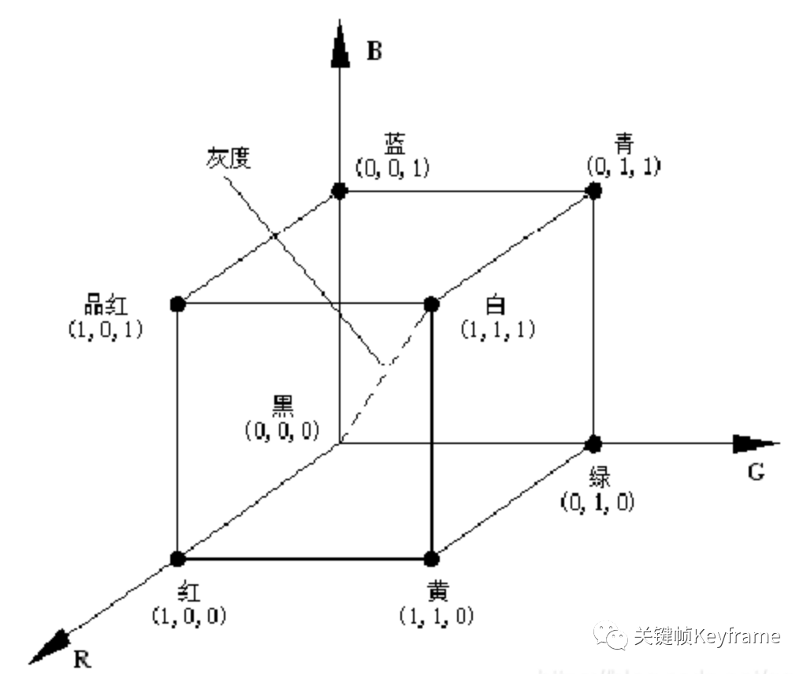

RGB 是一种**加色模式**，多种基色的量加在一起生成另一种颜色。立方体边界中的每一个颜色点都可以表示为三基色的加权向量和。

在 RGB 系统中，标准白光是按下列比例的 RGB 光通量混合而成：  

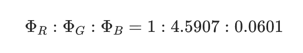

> 光通量，是一种表示光的功率的物理量，单位为『流明(lm)』，用来衡量光源整体亮度的指标。指单位时间内由光源所发出或由被照物体所吸收的光能。

通常把光通量为 1 lm 的红光、4.5907 lm 的绿光、0.0601 lm 的蓝光作为三基色的单位基色量，用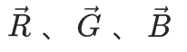表示，三基色各自的比例用系数 R、G、B 表示。因此，任何一种具有一定亮度的彩色光的光通量为：

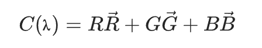

其中 C(λ) 表示彩色光的亮度（luminance），对应颜色的亮度（brightness）特征。当我们只关心颜色的色度（chromaticity）时，要知道色度依赖于色调（hue）和饱和度（saturation），反映的是 R、G、B 之间的比例关系，这时候我们可以做归一化处理：

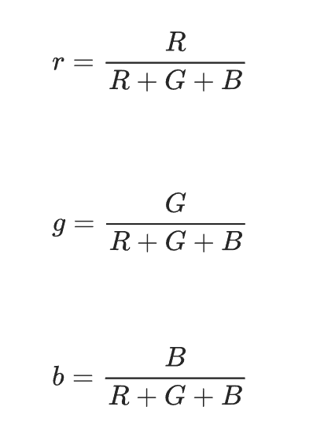

我们把 r、g、b 称为**色度坐标**，色度坐标舍弃了给定色彩样本的绝对亮度而只表示其纯色。由于 r + g + b = 1，因此任意颜色只需要 r、g 两个色度坐标进行描述即可，即色度空间是二维的。一般以 r-g 为色度坐标给出 **RGB 颜色模型的色度图**，如下图所示。其中标准白光位置在 (r = 1/3, g = 1/3) 处。

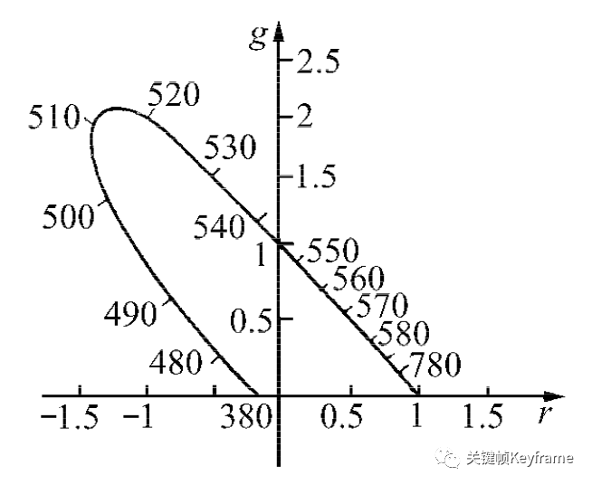

### 3.3、CIE XYZ 颜色模型

**因为 RGB 模型中与『负光』混合所带来的种种问题，CIE 从数学上定义了三种标准基色 XYZ（是理论上的颜色，而非实际的颜色），形成了『CIE XYZ 颜色模型』。同时还定义了一组输出全部为正值的 『XYZ 颜色匹配函数』，指定了描述任何一种光谱颜色所需要的各基色分量，XYZ 颜色匹配函数是基于 RGB 三基色颜色匹配函数的线性组合。CIE XYZ 颜色模型是定义各种颜色的国际标准。并且使用 CIE 基色还能避免颜色的负值匹配问题，以及选择一组实际基色有关的其他问题。**

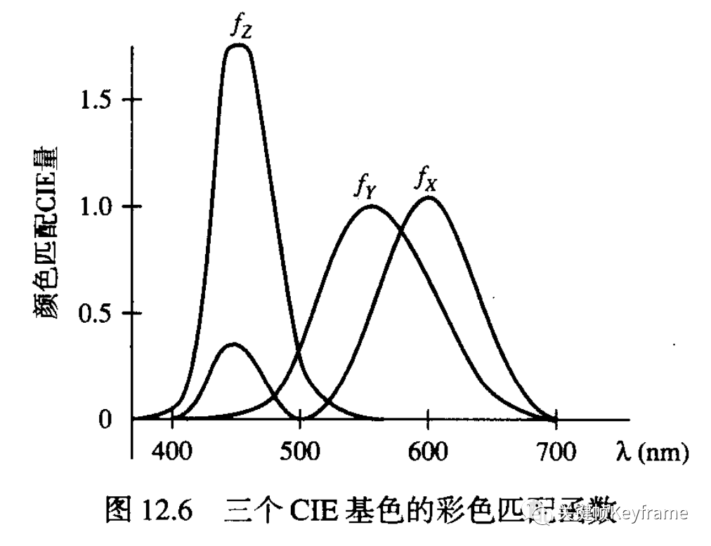

其中 X、Y、Z 分别表示生成一种颜色所需的 CIE 基色量的系数。因此，在 XYZ 颜色模型中描述一种颜色的方式与 RGB 模型中是一样的。在三维 XYZ 颜色空间中，任何一种颜色 C(λ) 可以表示成：

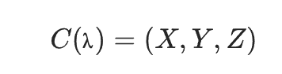

λ其中，X、Y、Z 由上图对应的彩色匹配函数计算而来：

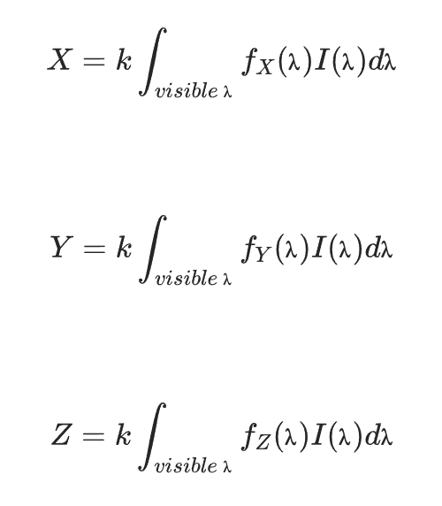

在上面的计算中，参数 k 的取值为 683 流明/瓦特（lm/W），等于一个均匀点光源在单位主体角内发出的光通量。函数 I(λ)
表示光谱辐射率，即在某一方向上某种光的强度。彩色匹配函数 fY 对应的参数 Y 是颜色的亮度，亮度值的范围一般是 0 到 100.0，其中 100.0
表示白光的亮度。

在 XYZ 颜色空间中任何颜色都可以表示为三个基色的单位向量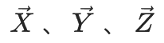的加性组合，即：

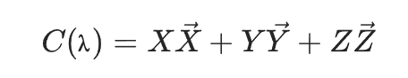

λ其中 C(λ) 表示彩色光的亮度（luminance），对应颜色的亮度（brightness）特征。X、Y、Z 则为三基色比例系数。XYZ
颜色模型表示颜色时满足以下 3 个条件：

  * **X、Y、Z 三色比例系数大于 0；**

  * **Y 的数值正好表示光的亮度值；**

  * **当 X = Y = Z 时，表示标准的白光。**

根据这些条件，可以得到 RGB 模型与 XYZ 模型的转换关系：

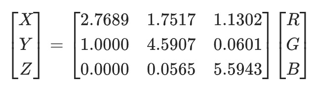

和 RGB 模型一样，当我们只关心颜色的色度时，我们可以做归一化处理：

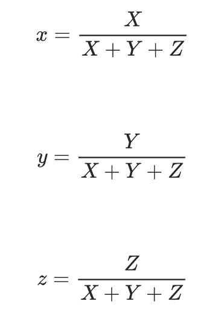

同样的，这里我们把 x、y、z 称为色度坐标，由于 x + y + z = 1，任意颜色可仅用 x 和 y 表示。一般以 x-y 为色度坐标给出 CIE XYZ 颜色模型的色度图，**CIE 1931 年的 x-y 色度图**如下所示：

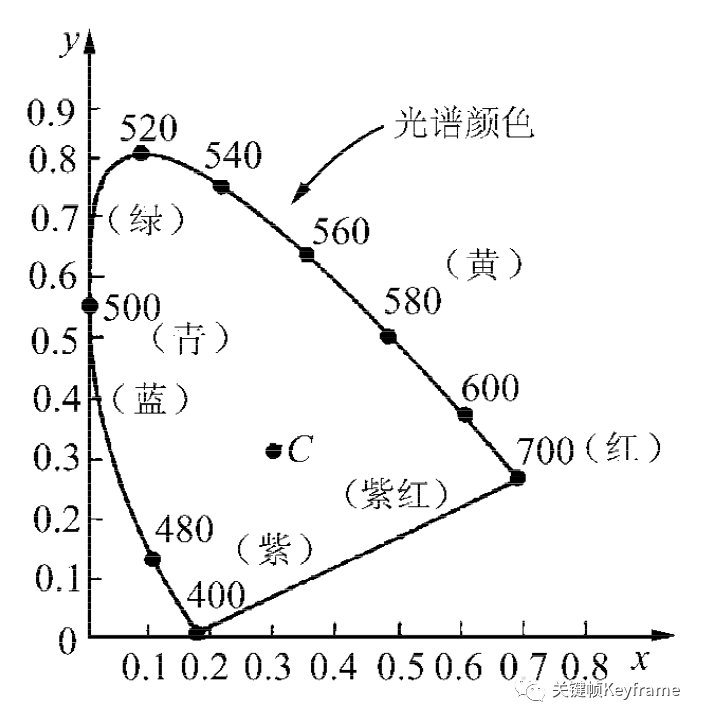

上图中，曲线上的点是电磁光谱中的纯色，按波长的顺序从光谱的红色端到紫色端方向来标明，连接红色和紫色光谱点的直线称为**紫色线**，它不属于光谱。曲线内部的点表示所有可能的可见颜色的组合。其中 C 点对应与 (x = 1/3, y = 1/3) 的位置，表示白色。在实际中，C 点通常作为白光源或日光色度近似值。由于归一化的处理，色度图中没有亮度值。所有具有统一色度但不同亮度的颜色都映射到色度图中的同一点。色度图主要用于：

  * **为不同基色组比较整个颜色范围；**

  * **标识互补色；**

  * **确定指定颜色的主波长；**

  * **确定指定颜色的饱和度。**

#### 1）颜色范围

色度图中可以用直线段或多边形来表示颜色范围。

比如，如果用 C1 和 C2 两种颜色作为基色，它们的颜色范围就是它们的连线，下图中的 C1 到 C2 连线上的所有颜色可以通过混合适量的 C1 和 C2 颜色得到。如果 C1 占比大，则结果色就更接近 C1。

三点 C3、C4、C5 作为三基色的颜色范围是他们连成的三角形区域（包含边上）。三基色只能生成对应三角形区域的颜色。因此，**色度图可以帮助我们理解为什么没有哪一个三基色组可以通过加色混合生成所有的颜色，因为没有一个三角形能包含所有的颜色。**

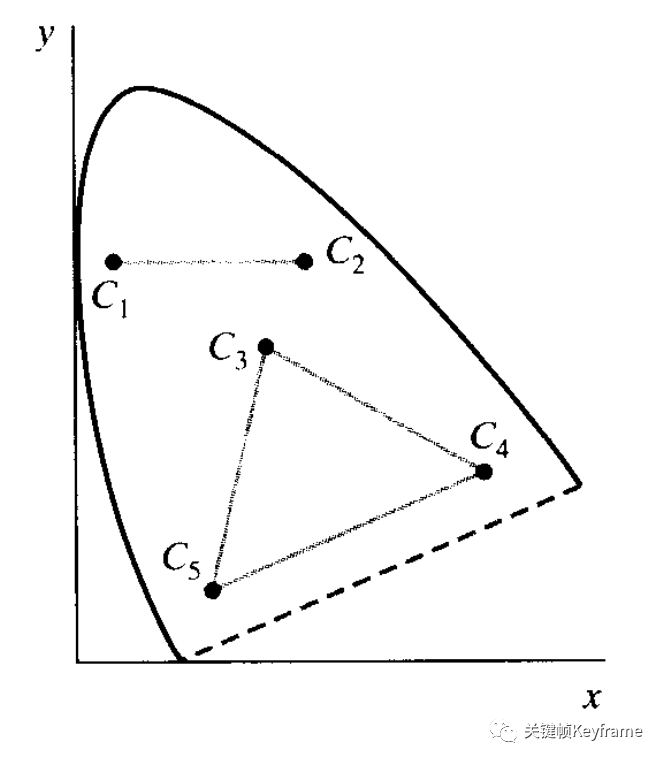

在 CIE 色度图上可以很容易对比不同颜色标准的颜色范围，比如下图是几种不同标准的颜色范围：

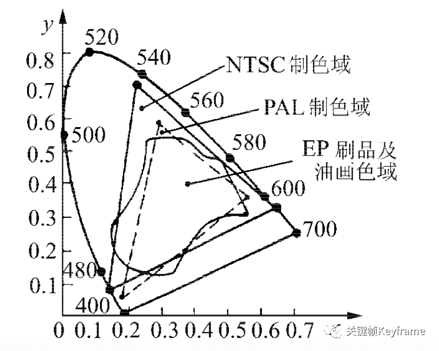

下表是几种不同标准采用 RGB 三基色时在 CIE 色度图中的三角坐标：  

<table style="margin: 1.2em 0px;padding: 0px;border-collapse: collapse;border-spacing: 0px;font: inherit;border-width: 0px;border-style: initial;border-color: initial;"><thead><tr style="border-width: 1px 0px 0px;border-right-style: initial;border-bottom-style: initial;border-left-style: initial;border-right-color: initial;border-bottom-color: initial;border-left-color: initial;border-top-style: solid;border-top-color: rgb(204, 204, 204);background-color: white;margin: 0px;padding: 0px;"><th style="font-size: 1em;border-width: 1px;border-style: solid;border-color: rgb(204, 204, 204);margin: 0px;padding: 0.5em 1em;font-weight: bold;background-color: rgb(240, 240, 240);"> </th><th style="font-size: 1em;border-width: 1px;border-style: solid;border-color: rgb(204, 204, 204);margin: 0px;padding: 0.5em 1em;font-weight: bold;background-color: rgb(240, 240, 240);">R</th><th style="font-size: 1em;border-width: 1px;border-style: solid;border-color: rgb(204, 204, 204);margin: 0px;padding: 0.5em 1em;font-weight: bold;background-color: rgb(240, 240, 240);">G</th><th style="font-size: 1em;border-width: 1px;border-style: solid;border-color: rgb(204, 204, 204);margin: 0px;padding: 0.5em 1em;font-weight: bold;background-color: rgb(240, 240, 240);">B</th></tr></thead><tbody style="margin: 0px;padding: 0px;border-width: 0px;border-style: initial;border-color: initial;"><tr style="border-width: 1px 0px 0px;border-right-style: initial;border-bottom-style: initial;border-left-style: initial;border-right-color: initial;border-bottom-color: initial;border-left-color: initial;border-top-style: solid;border-top-color: rgb(204, 204, 204);background-color: white;margin: 0px;padding: 0px;"><td style="font-size: 1em;border-width: 1px;border-style: solid;border-color: rgb(204, 204, 204);margin: 0px;padding: 0.5em 1em;">CIE</td><td style="font-size: 1em;border-width: 1px;border-style: solid;border-color: rgb(204, 204, 204);margin: 0px;padding: 0.5em 1em;">(0.735, 0.265)</td><td style="font-size: 1em;border-width: 1px;border-style: solid;border-color: rgb(204, 204, 204);margin: 0px;padding: 0.5em 1em;">(0.274, 0.717)</td><td style="font-size: 1em;border-width: 1px;border-style: solid;border-color: rgb(204, 204, 204);margin: 0px;padding: 0.5em 1em;">(0.167, 0.009)</td></tr><tr style="border-width: 1px 0px 0px;border-right-style: initial;border-bottom-style: initial;border-left-style: initial;border-right-color: initial;border-bottom-color: initial;border-left-color: initial;border-top-style: solid;border-top-color: rgb(204, 204, 204);margin: 0px;padding: 0px;background-color: rgb(248, 248, 248);"><td style="font-size: 1em;border-width: 1px;border-style: solid;border-color: rgb(204, 204, 204);margin: 0px;padding: 0.5em 1em;">NTSC 制式</td><td style="font-size: 1em;border-width: 1px;border-style: solid;border-color: rgb(204, 204, 204);margin: 0px;padding: 0.5em 1em;">(0.670, 0.323)</td><td style="font-size: 1em;border-width: 1px;border-style: solid;border-color: rgb(204, 204, 204);margin: 0px;padding: 0.5em 1em;">(0.214, 0.710)</td><td style="font-size: 1em;border-width: 1px;border-style: solid;border-color: rgb(204, 204, 204);margin: 0px;padding: 0.5em 1em;">(0.140, 0.084)</td></tr><tr style="border-width: 1px 0px 0px;border-right-style: initial;border-bottom-style: initial;border-left-style: initial;border-right-color: initial;border-bottom-color: initial;border-left-color: initial;border-top-style: solid;border-top-color: rgb(204, 204, 204);background-color: white;margin: 0px;padding: 0px;"><td style="font-size: 1em;border-width: 1px;border-style: solid;border-color: rgb(204, 204, 204);margin: 0px;padding: 0.5em 1em;">PAL 制式</td><td style="font-size: 1em;border-width: 1px;border-style: solid;border-color: rgb(204, 204, 204);margin: 0px;padding: 0.5em 1em;">(0.640, 0.330)</td><td style="font-size: 1em;border-width: 1px;border-style: solid;border-color: rgb(204, 204, 204);margin: 0px;padding: 0.5em 1em;">(0.290, 0.600)</td><td style="font-size: 1em;border-width: 1px;border-style: solid;border-color: rgb(204, 204, 204);margin: 0px;padding: 0.5em 1em;">(0.150, 0.060)</td></tr><tr style="border-width: 1px 0px 0px;border-right-style: initial;border-bottom-style: initial;border-left-style: initial;border-right-color: initial;border-bottom-color: initial;border-left-color: initial;border-top-style: solid;border-top-color: rgb(204, 204, 204);margin: 0px;padding: 0px;background-color: rgb(248, 248, 248);"><td style="font-size: 1em;border-width: 1px;border-style: solid;border-color: rgb(204, 204, 204);margin: 0px;padding: 0.5em 1em;">彩色显示器</td><td style="font-size: 1em;border-width: 1px;border-style: solid;border-color: rgb(204, 204, 204);margin: 0px;padding: 0.5em 1em;">(0.628, 0.346)</td><td style="font-size: 1em;border-width: 1px;border-style: solid;border-color: rgb(204, 204, 204);margin: 0px;padding: 0.5em 1em;">(0.268, 0.588)</td><td style="font-size: 1em;border-width: 1px;border-style: solid;border-color: rgb(204, 204, 204);margin: 0px;padding: 0.5em 1em;">(0.150, 0.070)</td></tr></tbody></table>

#### 2）互补色

前面有提到过，互补色是两个混合在一起为白色的颜色。又由于色度图上两种基色的颜色范围是一条线段，所以一对互补色在色度图上对应的两个点一定位于白色 C 点的两边，并且它们的连线经过 C。如下图所示，用一定量的 C1 和 C2 就可得到白色，C1 和 C2 与 C 的距离决定了产生白色所需的两种颜色的量。

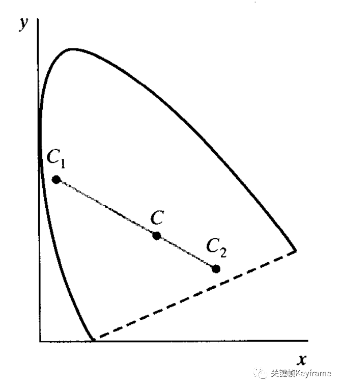

#### 3）主波长

在色度图中确定一种颜色的主波长要怎么做呢？以下图中的 C1 为例，我们可以从 C 通过 C1 画一条直线与光谱曲线相交于 Cs，这时候就可以认为颜色 C1 可以表示成白光 C 和光谱颜色 Cs 的混合，因此 C1 的主波长就是 Cs。

但这种确定主波长的方法不适用于 C 与紫色线之间的颜色点。以下图中的 C2 为例，我们画一条从 C 经过 C2 的直线与紫色线相交于 Cp，Cp 并不在可见光谱中，这种情况下，点 C2 称为**非光谱颜色**，它的主波长根据 Cp 的补点 Csp 得到，Csp 是从 C 经过 C2 直线的反向延长线与光谱曲线的交点。**非光谱颜色是在紫-品红范围内，具有从白光减去主波长（如 Csp）的光谱分布。**

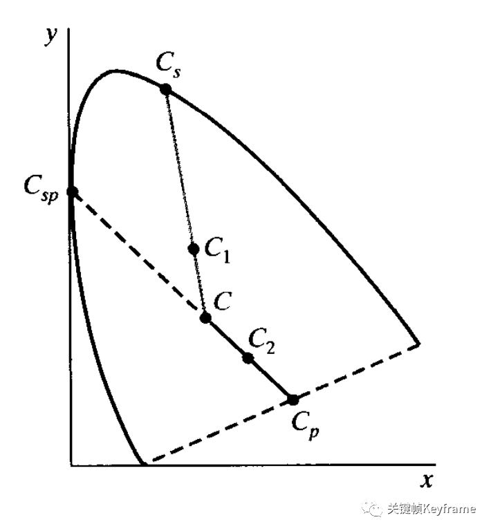

#### 4）饱和度

对于饱和度的计算，我们还是以上图中的 C1 颜色为例，我们通过沿 C 到 Cs 的直线计算 C1 到 C 的相对位置来确定饱和度。如果 dC1 表示从 C 到 C1 的距离，且 dCs 表示 C 到 Cs 的距离，我们可以按比率 dC1/dCs 来计算饱和度。在上图中，颜色 C1 的纯度大概是 25%，因为它位于 C 到 Cs 全程大约四分之一处。在 Cs 处颜色的饱和度为 100%  

### 3.4、NTSC YIQ 颜色模型

**RGB 工业显示器要求一幅彩色图像由分开的 R、G、B 信号组成，而电视显示器则需要混合信号输入，为了实现对这两种标准的兼容，NTSC（美国国家电视系统委员会）制定了 『YIQ 颜色模型』，它的主要优点是可以实现对彩色电视和黑白电视的兼容，即可以用黑白电视收看彩色电视信号。**

YIQ 颜色模型是以 CIE XYZ 颜色模型为基础来定义的，其参数 Y 与 XYZ 模型中的参数 Y 相同，表示图像的亮度信息。在没有色度的情况下，Y 也就对应于黑白图像，或者说黑白电视只接收 Y 信号。参数 I 包含有橙-青颜色信息，提供鲜艳色彩的明暗度。参数 Q 包含绿-品红颜色信息。

NTSC 组合颜色信号的设计允许黑白电视机从一幅占 6 MHz 带宽的图像信息中提取所需的灰度信息，因此，YIQ 信息必须在 6 MHz 带宽限制下编码。亮度值和色度值用不同的模拟信号进行编码，这样只是在原来的带宽内增加了颜色信息，黑白电视机仍然可以按原来的方式取得原样的亮度信号。

亮度信息（Y 值）以调幅的方式用带宽约为 4.2 MHz 的载波传输；色度信息（I、Q 值）被结合在一起用带宽约为 1.8 MHz 的载波传输。参数名称 I、Q 指的就是用来在载波上编码颜色信息的调制方法。后续还发展出了新的编码方法，这里就不多探讨了。

在 NTSC 信号中，亮度信息（4.2 MHz 带宽）的编码精度高于色度信息（1.8 MHz 带宽），这是因为**人眼对亮度的变化比对色度的变化更敏感**。因此，NTSC 用较低的精度传输色度信息并没有造成图像颜色质量的明显下降。

用于 NTSC 制式的 YIQ 可以与 RGB 之间进行转换（这里的 R、G、B 是经过伽马校正的，表示为 R’、G’、B’）。YIQ 的亮度信号 Y 为：

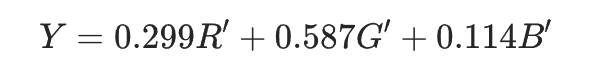

YIQ 规定的色差信号如下：

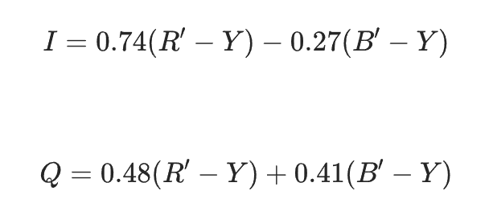

映射到色度图上，也可以发现参数 I 包含有橙-青颜色信息，参数 Q 包含有绿-品红颜色，I 和 Q 混合可以提高颜色的色调和饱和度。根据上面算式即可得到 YIQ 与 R’G’B’ 之间的转换矩阵为：  

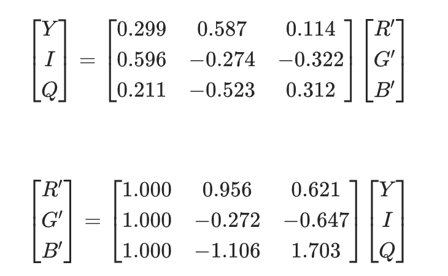

其中对于数字信号的 R’、G’、B’ 和 Y、U、V 的取值范围：

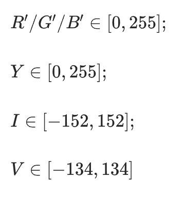

在实际使用中，上面的方程式通常会被缩放处理来简化 NTSC 制式数字信号的编解码实现。

### 3.5、PAL YUV 颜色模型

**上面提到过，因为 NTSC YIQ 的组合模拟视频信号中分配给色度信息的带宽较低，所以 NTSC YIQ 图像的颜色质量会受到一些影响。当我们开始追求更高的图像品质时，就需要改善这个问题了，这样就诞生了多种 YIQ 编码的变体来提高视频传输的颜色质量。『YUV 颜色模型』就是一种变体，它为 PAL 广播制式提供视频传输的组合颜色信息，它可以用不同的采样格式来调整传输的色度信息量。**

YUV 颜色模型中用亮度、色度来表示颜色。它的亮度信息和色度信息是分离的，其中 Y 表示亮度通道，U 和 V 则表示色度通道。如果只有 Y 信息，没有 U、V 信息，那么表示的图像就是灰度图像。YUV 常用在各种影像处理场景中。YUV 在对照片或视频编码时，考虑到人眼对亮度信息的敏感度高于色度信息，允许降低色度的带宽。

在 PAL 制式中使用的 YUV 与 RGB 的转换等式如下（这里的 R、G、B 是经过伽马校正的，表示为 R’、G’、B’）：

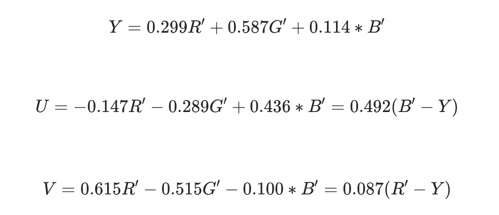

换成矩阵运算表示：

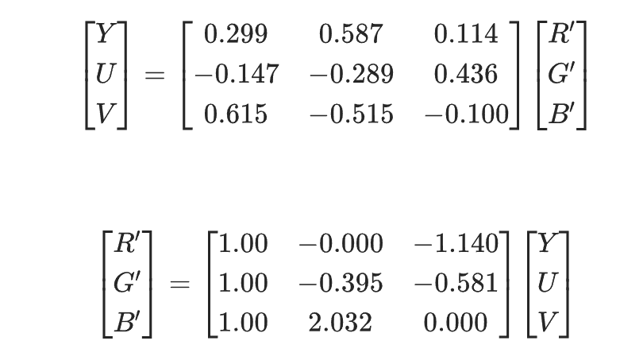

其中对于数字信号的 R’、G’、B’ 和 Y、U、V 的取值范围：

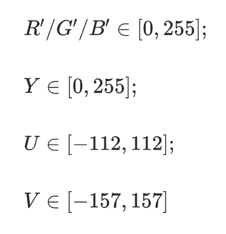

在实际使用中，上面的方程式通常会被缩放处理来简化 PAL 制式数字信号的编解码实现。

### 3.6、ITU-R YCbCr 颜色模型

**YCbCr 颜色模型是目前广泛使用的一种 YUV 变体，它是为数字视频转换而设计的颜色模型。YCbCr 由 ITU-R（国际电信联盟无线电通信部门，前身是国际无线电咨询委员会 CCIR）在 ITU-R BT.601 首次制定，并在后续的 ITU-R BT.709、ITU-R BT.2020 等标准中都有涉及。**  

上面提到的 ITU-R BT.601/709/2020 系列标准，规定了彩色视频转换成数字图像时使用的采样率，RGB 和 YCbCr 两个彩色模型之间的转换关系等，它们分别面向标清电视（SDTV）、高清电视（HDTV）、超清电视（UDTV）应用场景。

它们对应的色域的 RGB 三基色以及白色点在 CIE 1931 x-y 色度图的坐标分别是：

<table style="margin: 1.2em 0px;padding: 0px;border-collapse: collapse;border-spacing: 0px;font: inherit;border-width: 0px;border-style: initial;border-color: initial;"><thead><tr style="border-width: 1px 0px 0px;border-right-style: initial;border-bottom-style: initial;border-left-style: initial;border-right-color: initial;border-bottom-color: initial;border-left-color: initial;border-top-style: solid;border-top-color: rgb(204, 204, 204);background-color: white;margin: 0px;padding: 0px;"><th style="font-size: 1em;border-width: 1px;border-style: solid;border-color: rgb(204, 204, 204);margin: 0px;padding: 0.5em 1em;font-weight: bold;background-color: rgb(240, 240, 240);"> </th><th style="font-size: 1em;border-width: 1px;border-style: solid;border-color: rgb(204, 204, 204);margin: 0px;padding: 0.5em 1em;font-weight: bold;background-color: rgb(240, 240, 240);">R</th><th style="font-size: 1em;border-width: 1px;border-style: solid;border-color: rgb(204, 204, 204);margin: 0px;padding: 0.5em 1em;font-weight: bold;background-color: rgb(240, 240, 240);">G</th><th style="font-size: 1em;border-width: 1px;border-style: solid;border-color: rgb(204, 204, 204);margin: 0px;padding: 0.5em 1em;font-weight: bold;background-color: rgb(240, 240, 240);">B</th><th style="font-size: 1em;border-width: 1px;border-style: solid;border-color: rgb(204, 204, 204);margin: 0px;padding: 0.5em 1em;font-weight: bold;background-color: rgb(240, 240, 240);">白色 D65</th></tr></thead><tbody style="margin: 0px;padding: 0px;border-width: 0px;border-style: initial;border-color: initial;"><tr style="border-width: 1px 0px 0px;border-right-style: initial;border-bottom-style: initial;border-left-style: initial;border-right-color: initial;border-bottom-color: initial;border-left-color: initial;border-top-style: solid;border-top-color: rgb(204, 204, 204);background-color: white;margin: 0px;padding: 0px;"><td style="font-size: 1em;border-width: 1px;border-style: solid;border-color: rgb(204, 204, 204);margin: 0px;padding: 0.5em 1em;">ITU-R BT.601/625 行</td><td style="font-size: 1em;border-width: 1px;border-style: solid;border-color: rgb(204, 204, 204);margin: 0px;padding: 0.5em 1em;">(0.640, 0.330)</td><td style="font-size: 1em;border-width: 1px;border-style: solid;border-color: rgb(204, 204, 204);margin: 0px;padding: 0.5em 1em;">(0.290, 0.600)</td><td style="font-size: 1em;border-width: 1px;border-style: solid;border-color: rgb(204, 204, 204);margin: 0px;padding: 0.5em 1em;">(0.150, 0.060)</td><td style="font-size: 1em;border-width: 1px;border-style: solid;border-color: rgb(204, 204, 204);margin: 0px;padding: 0.5em 1em;">(0.3127, 0.3290)</td></tr><tr style="border-width: 1px 0px 0px;border-right-style: initial;border-bottom-style: initial;border-left-style: initial;border-right-color: initial;border-bottom-color: initial;border-left-color: initial;border-top-style: solid;border-top-color: rgb(204, 204, 204);margin: 0px;padding: 0px;background-color: rgb(248, 248, 248);"><td style="font-size: 1em;border-width: 1px;border-style: solid;border-color: rgb(204, 204, 204);margin: 0px;padding: 0.5em 1em;">ITU-R BT.601/525 行</td><td style="font-size: 1em;border-width: 1px;border-style: solid;border-color: rgb(204, 204, 204);margin: 0px;padding: 0.5em 1em;">(0.640, 0.340)</td><td style="font-size: 1em;border-width: 1px;border-style: solid;border-color: rgb(204, 204, 204);margin: 0px;padding: 0.5em 1em;">(0.310, 0.595)</td><td style="font-size: 1em;border-width: 1px;border-style: solid;border-color: rgb(204, 204, 204);margin: 0px;padding: 0.5em 1em;">(0.155, 0.070)</td><td style="font-size: 1em;border-width: 1px;border-style: solid;border-color: rgb(204, 204, 204);margin: 0px;padding: 0.5em 1em;">(0.3127, 0.3290)</td></tr><tr style="border-width: 1px 0px 0px;border-right-style: initial;border-bottom-style: initial;border-left-style: initial;border-right-color: initial;border-bottom-color: initial;border-left-color: initial;border-top-style: solid;border-top-color: rgb(204, 204, 204);background-color: white;margin: 0px;padding: 0px;"><td style="font-size: 1em;border-width: 1px;border-style: solid;border-color: rgb(204, 204, 204);margin: 0px;padding: 0.5em 1em;">ITU-R BT.709</td><td style="font-size: 1em;border-width: 1px;border-style: solid;border-color: rgb(204, 204, 204);margin: 0px;padding: 0.5em 1em;">(0.640, 0.330)</td><td style="font-size: 1em;border-width: 1px;border-style: solid;border-color: rgb(204, 204, 204);margin: 0px;padding: 0.5em 1em;">(0.300, 0.600)</td><td style="font-size: 1em;border-width: 1px;border-style: solid;border-color: rgb(204, 204, 204);margin: 0px;padding: 0.5em 1em;">(0.150, 0.060)</td><td style="font-size: 1em;border-width: 1px;border-style: solid;border-color: rgb(204, 204, 204);margin: 0px;padding: 0.5em 1em;">(0.3127, 0.3290)</td></tr><tr style="border-width: 1px 0px 0px;border-right-style: initial;border-bottom-style: initial;border-left-style: initial;border-right-color: initial;border-bottom-color: initial;border-left-color: initial;border-top-style: solid;border-top-color: rgb(204, 204, 204);margin: 0px;padding: 0px;background-color: rgb(248, 248, 248);"><td style="font-size: 1em;border-width: 1px;border-style: solid;border-color: rgb(204, 204, 204);margin: 0px;padding: 0.5em 1em;">ITU-R BT.2020</td><td style="font-size: 1em;border-width: 1px;border-style: solid;border-color: rgb(204, 204, 204);margin: 0px;padding: 0.5em 1em;">(0.708, 0.292)</td><td style="font-size: 1em;border-width: 1px;border-style: solid;border-color: rgb(204, 204, 204);margin: 0px;padding: 0.5em 1em;">(0.170, 0.797)</td><td style="font-size: 1em;border-width: 1px;border-style: solid;border-color: rgb(204, 204, 204);margin: 0px;padding: 0.5em 1em;">(0.131, 0.046)</td><td style="font-size: 1em;border-width: 1px;border-style: solid;border-color: rgb(204, 204, 204);margin: 0px;padding: 0.5em 1em;word-break: break-all;">(0.3127, 0.3290)</td></tr></tbody></table>

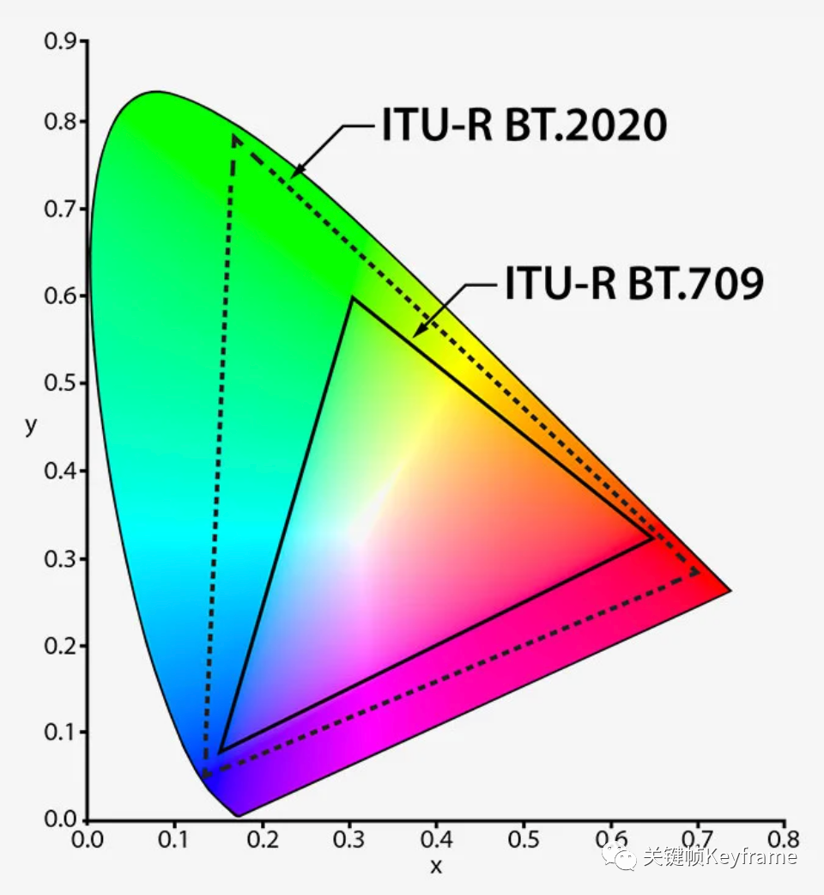

实际上，YCbCr 不是一种绝对颜色模型（绝对颜色模型是指不依赖任何外部因素就可以准确表示颜色的模型），而是在 YUV 颜色模型的基础上经过缩放和偏移的版本，其中 Y 与 YUV 中 Y 的含义一致，表示亮度；Cb、Cr 与 U、V 一样都表示色度，只不过在表示方法上不同而已，Cb 反映的是 RGB 输入信号蓝色部分与 RGB 信号亮度值之间的差值，Cr 则反映的是红色部分与亮度之间的差值。

YCbCr 是目前广泛应用于数字图像处理的颜色模型，JPEG、MPEG、DVD、摄影机、数字电视等都使用这一模型。因此一般俗称的 YUV 大多是指 YCbCr。

#### 1）用于 SDTV 的 YCbCr 与 RGB 的转换公式

这里的 R、G、B 是经过伽马校正的，表示为 R’、G’、B’：

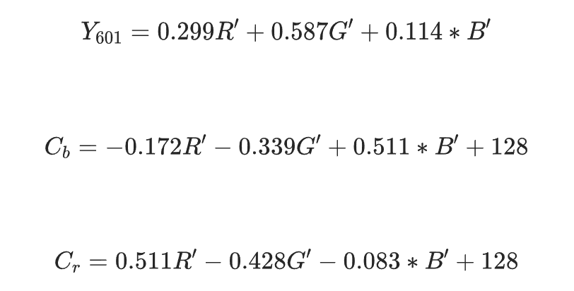

换成矩阵运算表示：

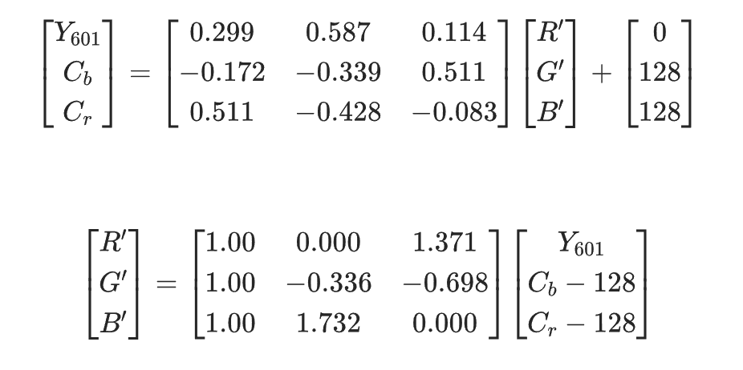

名义上，R’、G’、B’ 和 Y、Cb、Cr 的取值范围为：

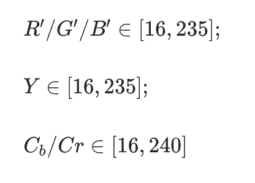

当进行 Y、Cb、Cr 到 R’、G’、B’ 的转换时，R’、G’、B’ 名义上的范围是 16-235，但也有可能会得到 0-15 和 236-255 的值。这是由于视频数据处理或者噪音的原因会导致 Y 和 CbCr 的取值可能落入 16-235 和 16-240 之外。所以，我们在数据处理时，还是要给予他们 0-255 的数值空间，以防止溢出问题。

在计算机系统中，如果可以保证 R’G’B’ 的取值范围为 0-255，则用下面的转换矩阵会更方便：

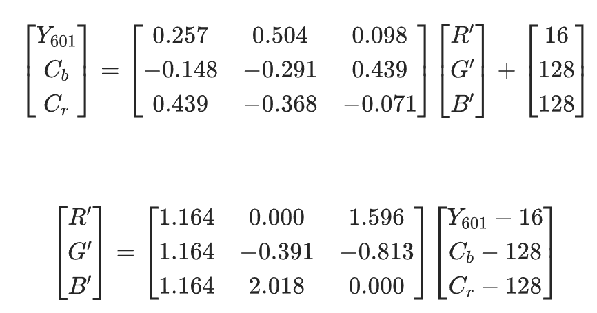

R’、G’、B’ 和 Y、Cb、Cr 的取值范围为：

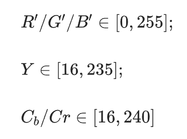

#### 2）用于 HDTV 的 YCbCr 与 RGB 的转换公式

类似 SDTV，当 R’、G’、B’ 名义上的范围是 16-235 时，YCbCr 与 RGB 的转换矩阵为：

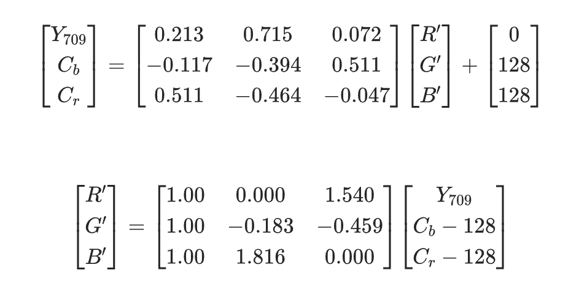

名义上，R’、G’、B’ 和 Y、Cb、Cr 的取值范围为：

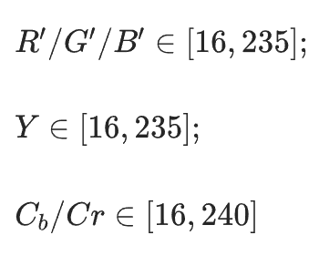

在计算机系统中，如果可以保证 R’G’B’ 的取值范围为 0-255，则用下面的转换矩阵会更方便：

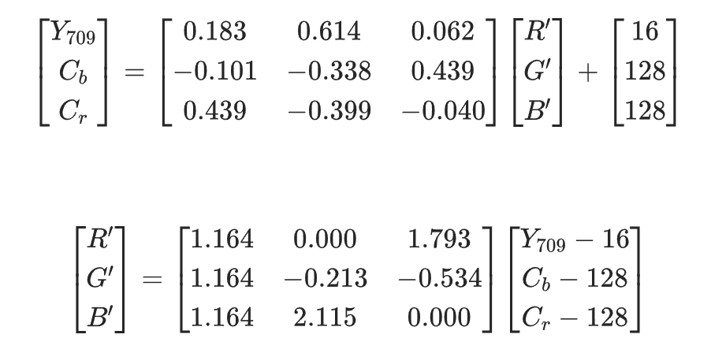

R’、G’、B’ 和 Y、Cb、Cr 的取值范围为：

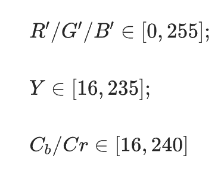

#### 3）YCbCr 采样格式

常见的 YCbCr 的采样格式有：

  * **4:4:4**：表示完整采样，保持了 CbCr 分量的完整信息。

  * **4:2:2**：表示 CbCr 分量具有 2:1 的水平采样，垂直完全采样。相对于完整信息压缩了 **33.3%** 的数据量。

  * **4:1:1**：表示 CbCr 分量具有 4:1 的水平采样，垂直完全采样。相对于完整信息压缩了 **50%** 的数据量。

  * **4:2:0**：表示 CbCr 分量具有 2:1 的水平采样，2:1 的垂直采样，这里并不是指只有 Cb，没有 Cr，而是对于每一行，只有一个 Cb 或者 Cr 分量，如果第一行是 4:2:0，那么下一行就是 4:0:2，以此类推。相对于完整信息压缩了 **50%** 的数据量。

以几个图来直观地表示 4:4:4、4:2:2、4:1:1、4:2:0 的采样方式：

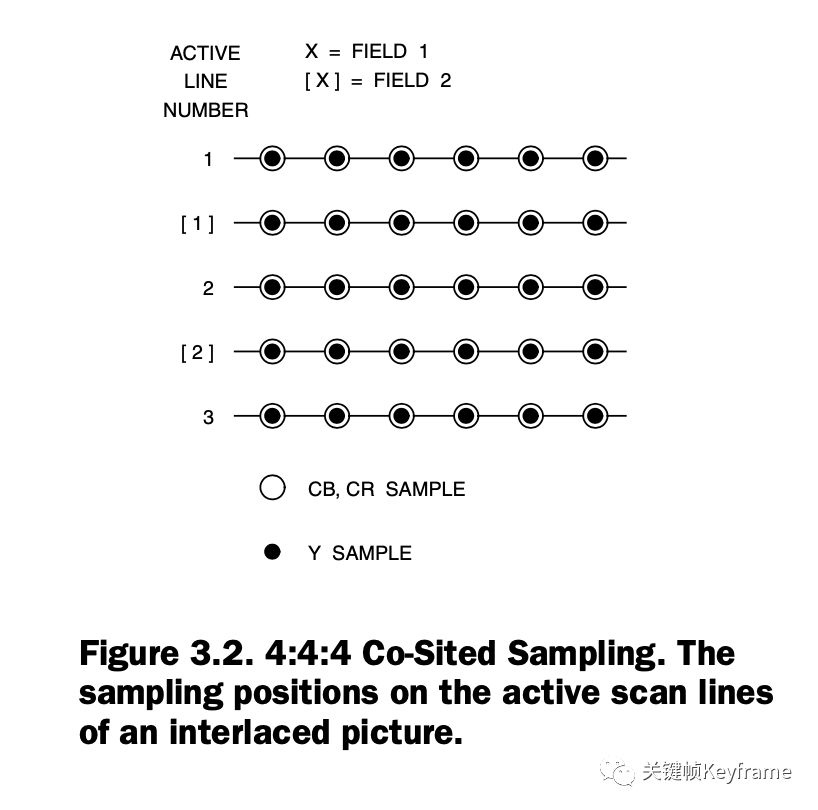

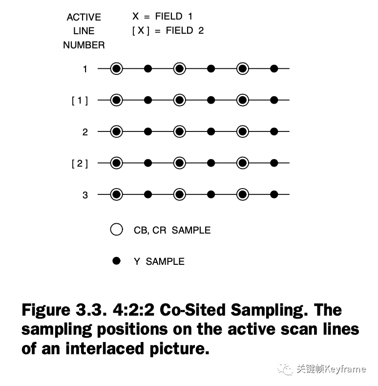

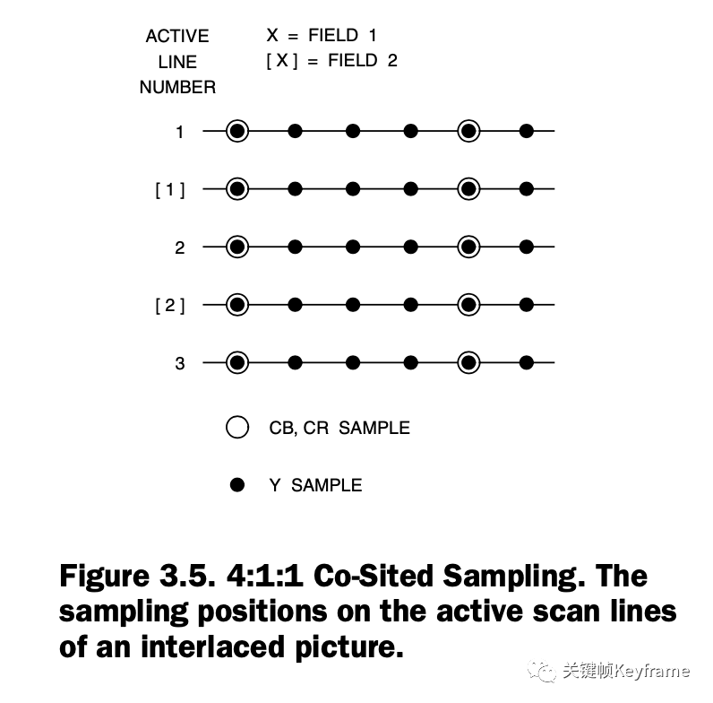  

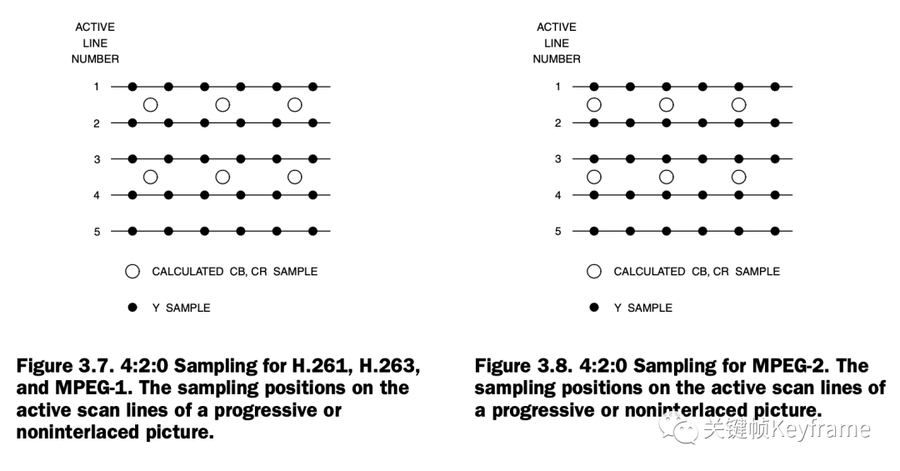

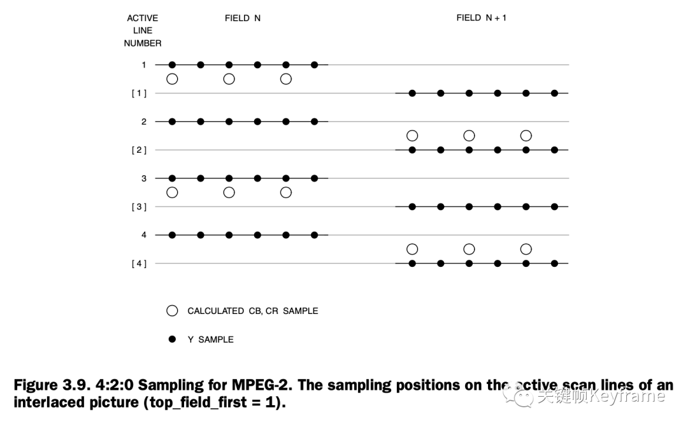

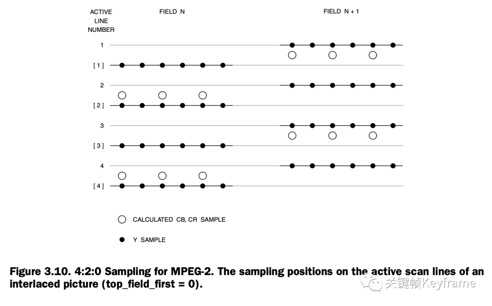  

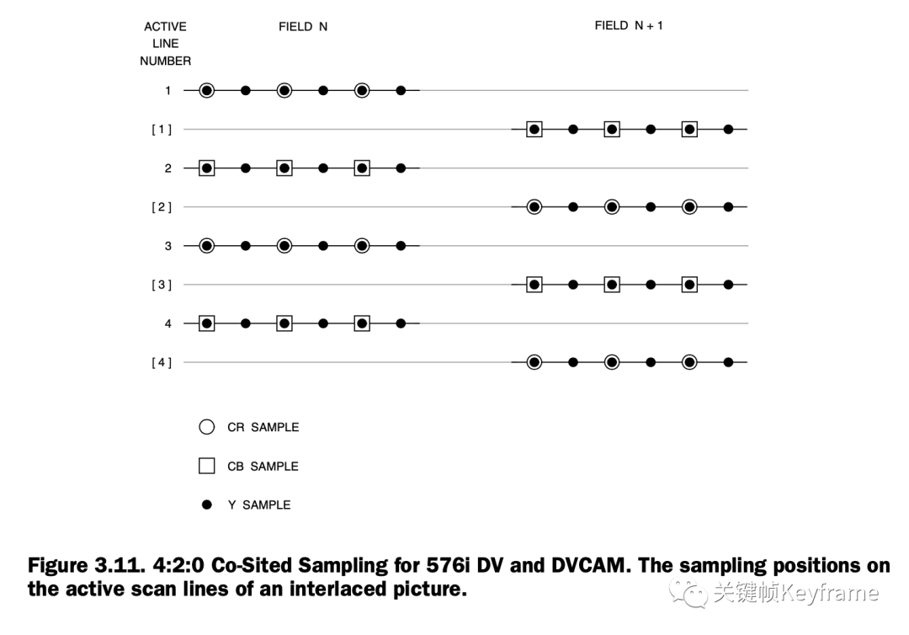

**4）YCbCr 存储格式**

在 YCbCr 中常见的存储格式一般分为两种：

  * **平面格式（planar）**：先连续存储所有像素点的 Y，紧接着存储所有像素点的 Cb、Cr。

  * **紧缩格式（packed）**：每个像素点的 Y、Cb、Cr 是连续交叉存储的。

有时候，平面格式和紧缩格式会混合使用。

我们经常听到的 I420、YV12、NV12、NV21 等名词其实就对应着 YCbCr 各分量的存储方式。它们都属于 4:2:0 采样格式，只是按存储方式又分为两大类：

  * **420P（planar）平面格式**，I420 和 YV12 属于此类。

  * **420SP（simi-planar）混合格式**，NV12 和 NV21 属于此类。

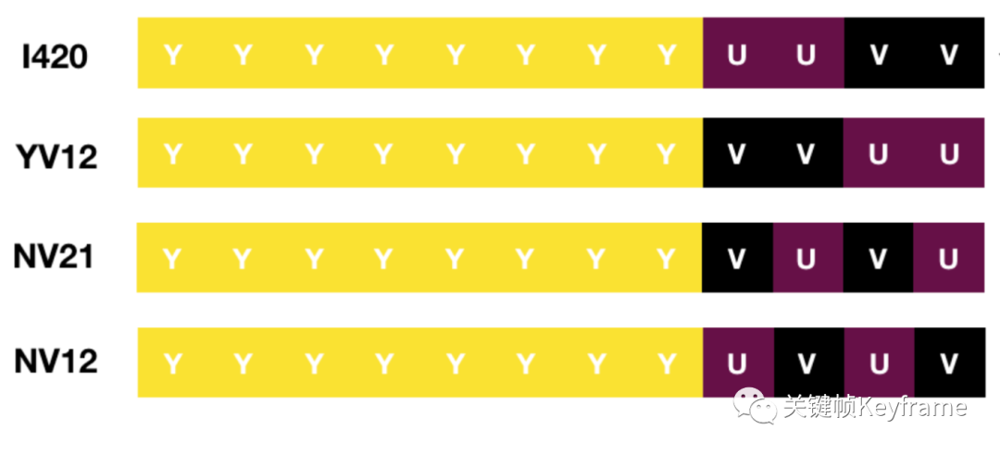

### 3.7、伽马校正

在前文介绍颜色模型的转换时，我们提到过伽马校正，但没有解释过它是干什么的，这里我们来探讨一下这个概念。  

如果大家接触过更早的电视机或电脑显示器，应该知道一种叫做阴极射线管（CRT）的显示设备，这种设备的显示原理是使用一个电压轰击它的屏幕来发光以展示图像。人们在使用 CRT 时发现它有一个问题：调节电压为原来的 n 倍，对应的屏幕发光亮度并没有提高 n 倍，而是一个类似幂律曲线的关系，其公式粗略表示为：

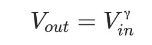

典型的 CRT 显示器产生的亮度约为输入电压的 2.2 次幂，即在上述公式中 γ 为 2.2，这个称为**显示伽马（display gamma）**。

由于显示伽马问题的存在，在将图像输入到显示器之前需要对应的进行一个**伽马校正（gamma correction）**，以使得最终显示出来的图像亮度与捕捉到的真实场景的亮度是成线性比例关系的。这里的伽马处理叫做**编码伽马（encoding gamma）**。这个处理过程通常是在图像采集设备的电路中完成的，比如对于 TV 摄像机，需要将感知到的亮度 Y 通过以典型的数值 1/γ = 0.45 做逆伽马重新映射：

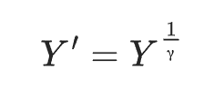

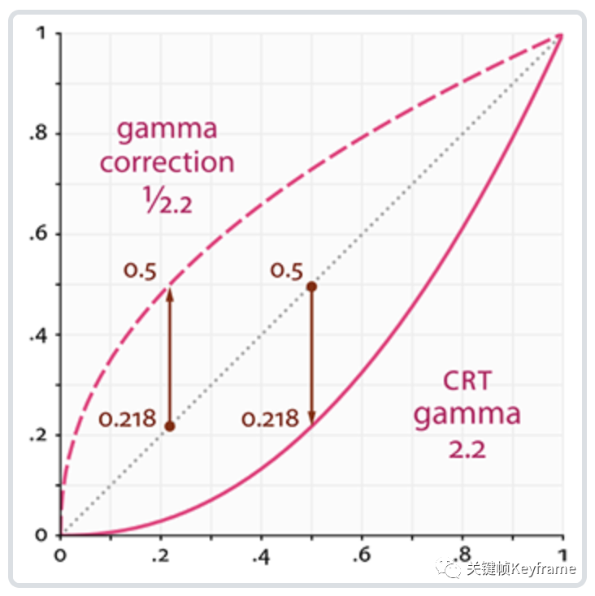

这里伽马校正的非线性转换的过程除了解决显示伽马的问题外，还带来了一个**有益的副效应**：传输期间增加的噪声（模拟信号时代），在噪声比较明显的较暗信号区域（在接收器做了伽马校正后）会被减少。因为我们的视觉系统对相对亮度差别是敏感的，如下图所示，经过伽马校正后的非线性梯度明显对人眼感知来说更均匀：

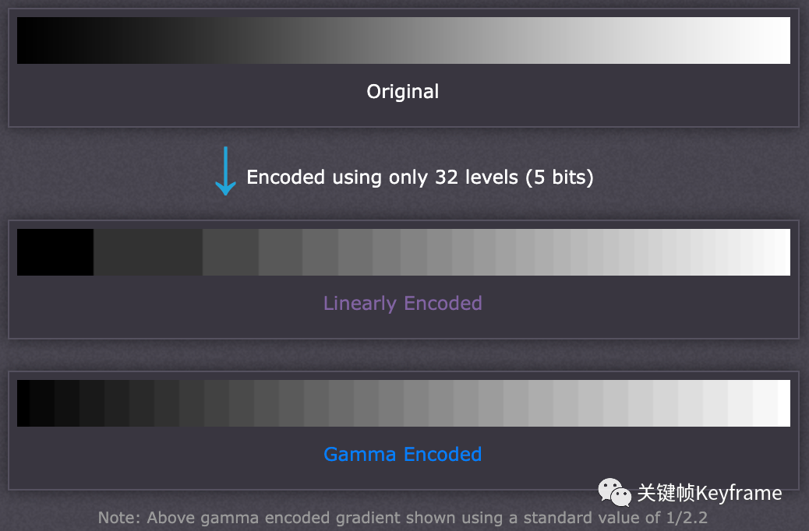

在彩色电视发明后，R、G、B 信号会被分别做完伽马校正后再合起来编码（这也就是我们前文中表示的 R’、G’、B’）。

到如今，尽管在传输系统中我们不再有模拟噪声，但信号压缩时仍然需要量化，因此在传感数据上做伽马校正仍然是有用的。

不过，在计算机视觉的一些图像处理场景，需要图像的亮度信息在线性空间中才能进行，这时候则需要撤销伽马校正后再进行处理。在处理完成后，将图像输入显示器之前可能需要再重新做伽马校正。

所以，一个完整的图像获取和显示系统，需要至少两个伽马值：1）编码伽马（encoding gamma），体现了设备获取到的场景亮度值和编码像素值之间的关系；2）显示伽马（display gamma），体现了编码像素值和显示器亮度之间的关系。

而编码伽马（encoding gamma）和显示伽马（display gamma）的乘积就是整个图像系统的**端到端伽马（end-to-end gamma）**。如果这个乘积为 1，那么显示出来的图像亮度与捕捉到的真实场景的亮度就是成线性比例的。

当你的显示器已校准为 2.2 的标准伽马时，下图展示了在编码伽马确定时，不同显示伽马对系统端到端伽马的影响以及对最终图像展示效果的影响：

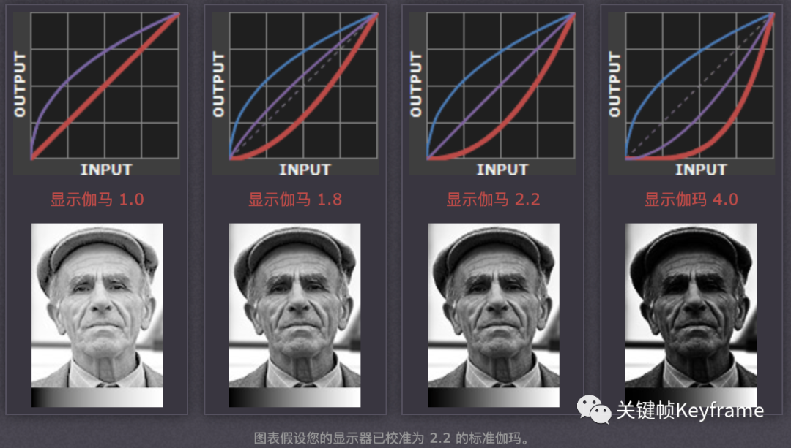

上面提到过，显示伽马是 CRT 显示器带来的问题，如今我们已经基本告别 CRT 显示器普遍使用 LCD 显示器了，那显示伽马的问题是不是就没有了呢？事实上，LCD 显示器本身确实没有 CRT 显示器的伽马效应，但是为了兼容性，LCD 以及其他非 CRT 显示设备都模拟了这个伽马效应以实现先前兼容。

>（通过上文的探讨，我们知道了图像数字描述过程中对颜色进行建模的发展历程：基于人眼视觉感知三原色理论，CIE 通过大量实验数据建立了 RGB 颜色模型，标准化了 RGB 表示 → 为了解决 RGB 模型中与负光混合所带来的种种问题，CIE 从数学上定义了三种标准基色 XYZ，形成了 CIE XYZ 颜色模型 → 在模拟电视时代，RGB 工业显示器要求一幅彩色图像由分开的 R、G、B 信号组成，而电视显示器则需要混合信号输入，为了实现对这两种标准的兼容，NTSC 基于 XYZ 模型制定了 YIQ 颜色模型，实现了彩色电视和黑白电视的信号兼容 → 为了解决 NTSC YIQ 的组合模拟视频信号中分配给色度信息的带宽较低，而影响了图像颜色质量的问题，PAL 引入了 YUV 颜色模型，支持用不同的采样格式来调整传输的色度信息量 → 进入数字电视时代，ITU-R 为数字视频转换制定了 YCbCr 颜色模型，成为我们现在最常使用的颜色模型。在早年 CRT 显示器流行的年代，我们遇到了显示伽马问题，从而引入了伽马校正过程并延用至今。可见这一路都是遇到问题解决问题的过程。这些知识或许并不会在日常开发中用到，但知其然，又知其所以然，不亦乐乎。关于后续图像数字化的问题，我们将在下一篇来探讨，敬请期待）

#### 
原文出处：<a href='https://mp.weixin.qq.com/s/RhMLfOoDdf6TvRoGVQaNHA' target='blank'>图像的表示（3）</a>

在前面的文章中，我们提出了一个问题：****从我们眼睛看见的『画面』，到我们用手机、电脑所处理的『图像数据』，其中经历了什么？****从这个问题出发，我们在[《图像的表示（1）》](http://mp.weixin.qq.com/s?__biz=MjM5MTkxOTQyMQ==&mid=2257484446&idx=1&sn=24ce52c46c987ed90e7bdbaff421fef0&chksm=a5d4e6cc92a36fda127fac1ec86e3859479751ea1686d44c5f5fbcef71701a7f468eeee57aa7&scene=21#wechat_redirect)和[《图像的表示（2）》](http://mp.weixin.qq.com/s?__biz=MjM5MTkxOTQyMQ==&mid=2257484448&idx=1&sn=a245b5a178f173489e730a0bac4c7b9c&chksm=a5d4e6f292a36fe4b79063ad93b4df175e2f0f460e03162370934683bc69519fed5cf998f864&scene=21#wechat_redirect)两篇文章中接连探讨了『图像的定义是什么』、『图像成像的原理是什么』、『怎样对图像进行数学描述』这几个问题，接下来我们继续探讨剩下的两个问题：『怎样对图像进行数字化』和『数字图像数据是什么』。

## 4、怎样对图像进行数字化？

如果要完整的探讨图像数字化的流程，细节还是很复杂的，比如下图是现代数码相机中获取数字图像流程的简单版本，即使简化后，图中所涉及的内容也不是短短几篇文章能够叙述清楚的，所以我们并不打算对这里面的环节都一一覆盖，只是想探讨一下最简单的理论环节，建立一个初步的概念即可。

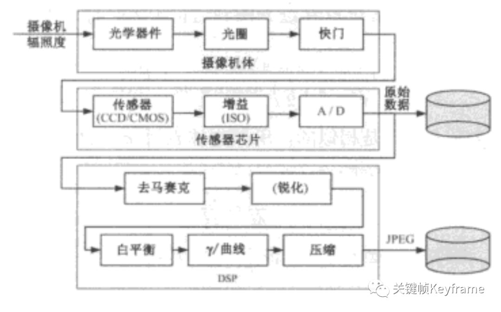

其实图像的数字化跟声音的数字化也类似，最终都是要把模拟信号转换为数字信号，这种转换包括两种处理过程：**采样**和**量化**。

为了产生一幅数字图像，我们需要把连续的感知数据转换为数字形式。一幅平面图像中各个点的颜色值可以用其位置坐标 (x, y) 的函数 f(x, y)来描述。显然，由于图像的 x、y 坐标和颜色值可能都是连续的，f(x, y) 作为二维连续函数，会有无穷多个取值。这种用连续函数表示的图像无法用计算机进行处理，也无法在各种数字系统中传输和存储，所以必须在坐标值和颜色值上将连续的模拟信号转换为离散的数字信号。**对坐标值的数字化称为采样，对颜色值的数字化称为量化。**

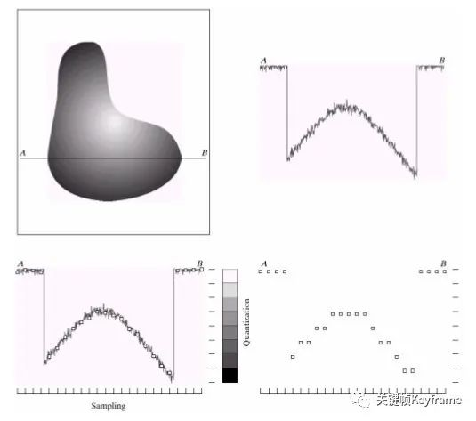

上图是生成一幅数字图像的简化过程，右上角图中的一维函数是左上角图中沿线段 AB 的连续图像幅度值（灰度级）的曲线。随机变化是由图像噪声引起的。为了对该函数采样，我们沿线段 AB 等间隔的对函数进行采样，如左下角图中所示，每个样本的空间位置由图像底部的垂直刻度指出，样本则由函数曲线上的小方块表示。这样的一组离散位置就给出了采样函数。

但是，样本值仍跨越了灰度值的连续范围。为了形成数字函数，灰度值也必须转换为离散量，图中显示了已经分为 8 个离散区间的灰度标尺，范围从黑到白。垂直刻度标尺赋予了 8 个灰度各自的特定值，通过对每一样本赋予 8 个离散灰度级中的一个，来量化连续灰度级。赋值多少取决于该样本与哪个垂直刻度标记更接近。

通过采样和量化，就生成了右下角图中的数字样本。如果我们从该图像的顶部到底部逐行执行这一过程，则会产生一幅二维数字图像。

得到的数字图像，我们怎么展示它呢？

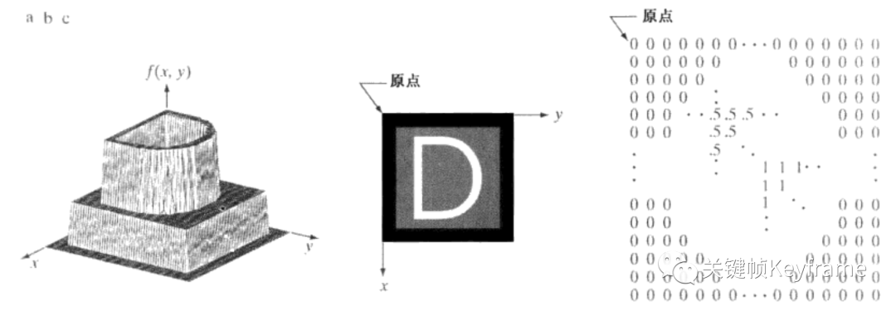

我们延用上面提到的 f(x, y) 函数表示法的，上图展示了 3 种数字图像的基本展示方式：

1）第一种用两个坐标轴 x、y 决定空间位置，第三个坐标轴决定 x、y 对应的灰度值。这种展示法对于细节太多的复杂图像来说很难理解。

2）第二种是更一般的展示方法，它显示了图像出现在显示器的情况，这里每个点的灰度与该点处 f 值成正比。比如图中如果仅由三个等间隔且归一化到 [0, 1]区间的灰度值时，那么图像中的每个点的灰度是 0、0.5、1 中的某一个值，在显示器上就简单的把这三个值变换成黑色、灰色、白色即可。这种展示法可以让我们快速的观察图像结果。

3）第三种则是将 f(x, y) 的数值简单地展示为一个矩阵。这种展示法打印起来麻烦，而且传达的信息也不多，但是在开发图像相关的算法需要做数值分析时就非常有
用了。其中，矩阵中的每个元素我们称为**像素（图像单元、图像元）**。

所以，上面第二种和第三种数字图像的展示方式是最有用的，第二种允许我们快速观察结果，第三种则可用于数值处理和算法开发。

经过数字化处理后的图像包含如下几个基本属性：

  * **图像分辨率**

  * **像素深度**

### 1）图像分辨率 

我们经常听到的一种图像分辨率的说法是：这张图片分辨率是 1024 x 1024 像素。但图像大小本身其实并不能告诉我们全部内容，如果没有规定图像包含的空间维度信息，这种说法意义不大。

图像空间分辨率的度量必须针对空间单位来规定才有意义，所以这里探讨的图像分辨率也称为**空间分辨率**，表示图像中可辨别的最小细节的度量。空间分辨率有很多方法来说明，其中最通用的是**单位距离线对数**和**单位距离点数（像素数）**。

单位距离线对数可以这样来理解：假设我们用交替的黑色和白色垂直线来构造一幅图像，如果一条线宽是 0.1 mm，每单位距离（mm）就有 5 个线对（10条黑白交替的线）。

单位距离点数是印刷和出版业中常用的图像分辨率的度量。在美国，这一度量常用**每英寸点数（dpi）**来表示，比如，报纸用 75 dpi 的分辨率来印刷，书页用 2044 dpi 印刷。

单位距离像素数常用在电子设备上。比如我们常常会听到用**每英寸像素数（ppi）**来衡量显示屏的成像分辨率，比如 iPhone 4 使用 326 ppi 的屏幕，iPhone 13 Pro Max 则使用 458 ppi 的屏幕。

下图是图像使用不同空间分辨率时的展示效果：

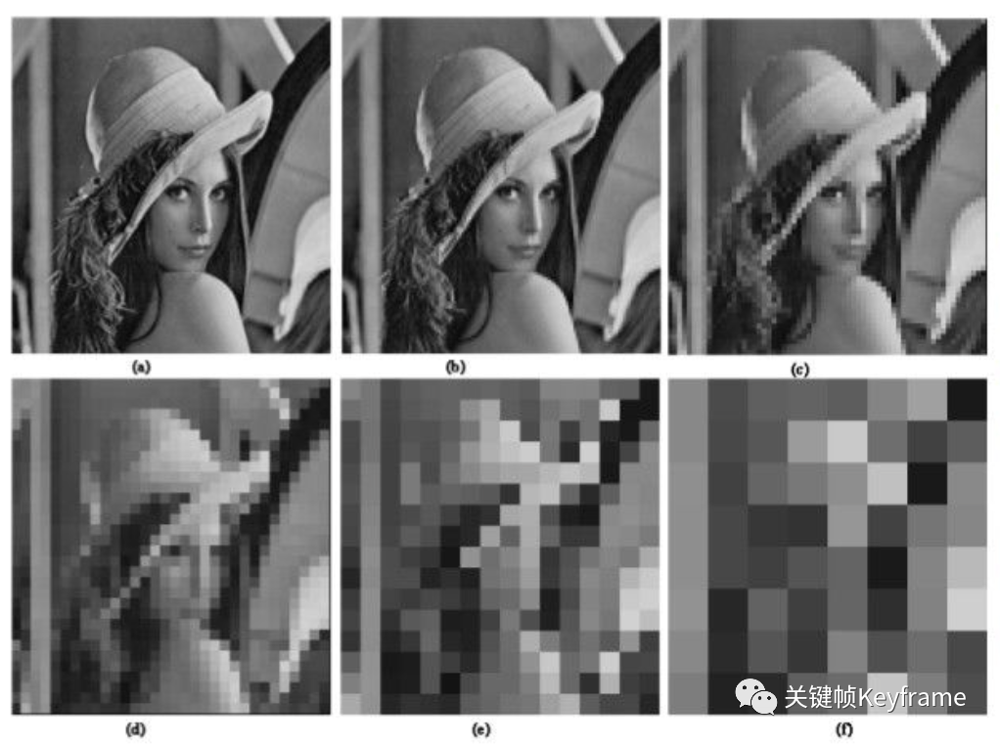

### 2）像素深度

像素深度决定了图像每个像素的颜色级数。对于灰度图像，则决定了每个像素的灰度级数。像素深度通常是 2 的整数次幂，比如，当像素深度为 24 位时，那么每个像素的颜色可以是 16777216（224）种颜色中的一种。

提高像素深度，每个像素能显示的颜色种类也就更多了，图像也就更细腻自然。但受到人眼分辨率的限制，像素深度不一定要特别大，人类眼睛感知的颜色种类的上限大概是 1000 万种颜色，24 位的颜色深度已经完全够用。

下图是灰度图像使用不同灰度级数时的展示效果：

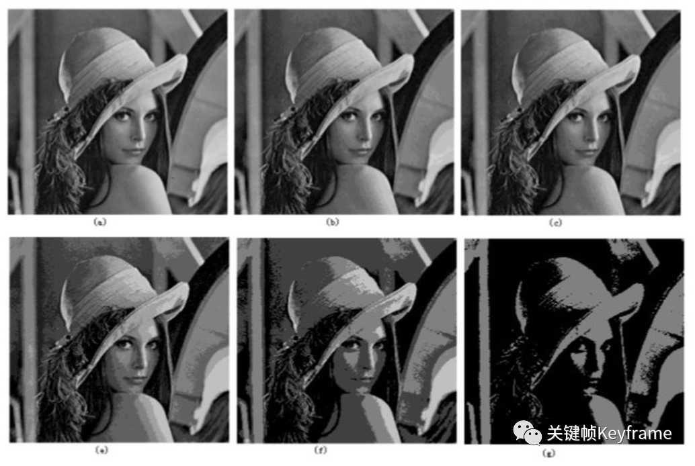

## 5、数字图像数据是什么？

我们在手机、电脑上处理的图像数据，也就是经过数字化处理后的**数字图像数据**。

在音视频开发中，处理最多的图像数据其实是 RGB、YCbCr 数据，在前面的文章里我们已经详细介绍过这两种颜色模型。RGB 数据主要是用于屏幕显示，YCbCr 数据则由于较好的压缩性，则主要用于图像数据处理、编码、传输。它们之间的转换，则需要根据具体使用的颜色模型标准、采样格式及存储格式来借助前文介绍过的转换矩阵来实现。这里就不再重复叙述了。

提到数字图像数据的格式，我们还经常听到的是 PNG、JPEG、GIF 等名词，这些是图像的文件存储格式，它们是对数字图像数据进行编码后进行存储。如果要展示，则需要读取文件数据，进行解码再展示。这里我们不做过多探讨了。

## 本文参考  

1. [数字图像处理](https://book.douban.com/subject/6434627/)
2. [计算机图形学](https://book.douban.com/subject/1392483/)
3. [计算机视觉：算法与应用](https://book.douban.com/subject/10465997/)
4. [图像](https://zh.wikipedia.org/wiki/%E5%9B%BE%E5%83%8F)
5. [彩色图像](https://www.jianshu.com/p/e5e2c013ba02)
6. [视锥细胞](https://zh.wikipedia.org/wiki/%E8%A7%86%E9%94%A5%E7%BB%86%E8%83%9E)
7. [Color Space](https://www.compression.ru/download/articles/color_space/ch03.pdf)
8. [Gamma Correction](https://www.cambridgeincolour.com/tutorials/gamma-correction.htm)

>（通过上文的探讨，我们知道了最基本的图像数据数字化的过程，也了解了我们在音视频开发中最常接触到的数字图像数据是什么。那么关于『从我们眼睛看见的画面，到我们用手机、电脑所处理的图像数据，其中经历了什么』这个问题的探讨也可以告一段落。我们接下来会继续探讨一些『音视频编码』相关的基础知识，敬请期待）
