 
<!--BEGIN_DATA
{
    "create_date": "2022-03-30 22:25", 
    "modify_date": "2022-03-30 22:25", 
    "is_top": "0", 
    "summary": "深入理解Flutter的图形图像绘制原理——图形库skia剖析", 
    "tags": "OpenGL", 
    "file_name": "图形库skia剖析.md"
}
END_DATA-->

#### <p>原文出处：<a href='https://mp.weixin.qq.com/s/NwW4SKe1uFYkPh94pAsprA' target='blank'>深入理解Flutter的图形图像绘制原理——图形库skia剖析</a></p>

> Flutter是目前流行的高性能跨平台UI框架，图形库skia是其跨平台的基石。本文将深入分析skia的图形、字体、图片的渲染原理，如何挖掘硬件特性，为UI性能优化提供思路。

## 1. 引言

Flutter是目前非常流行的跨平台UI开发框架，不仅支持Android、iOS，还支持Windows、Linux等操作系统。Flutter的性能非常高，拥有120fps的刷新率。那么flutter是如何实现在不同平台上高性能绘制图形图像的呢？首先我们分析下Flutter App和原生Android App、原生iOS App的UI绘制原理。

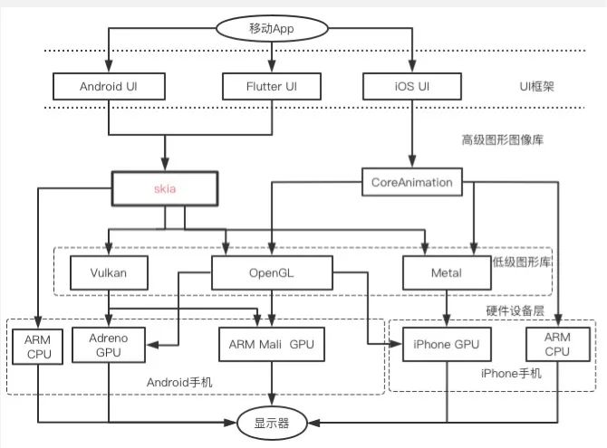

移动App的整体UI框架大致分成下面4个层次：

1）UI库

跟Android、iOS原生开发类似，Flutter用dart语言实现一整套UI控件。Flutter先将控件树转成渲染树，然后交由skia库绘制界面。

2）图形库

Skia图形库跟iOS平台的CoreAnimation等库功能类似，不仅提供了图形渲染功能，还提供文字绘制和图片显示功能。高级图形图像库将需要绘制的图形转成
点、线、三角形等图元，再调用底层图形接口实现绘制。

3）低级图形接口

OpenGL是使用最广的低级图形接口，兼容性最好，基本上支持市面上的所有GPU。Vulkan是最近几年新推出的图形API，除了iPhone的GPU，其他厂家
的GPU基本都支持。Metal是苹果新推出的图形API，只支持自家GPU。

4）硬件设备层

目前的移动设备出于性能考虑，大部分图形都是通过GPU渲染，少数情况也会使用CPU渲染，后文会介绍skia使用CPU和GPU渲染的具体场景。

iPhone 在A11芯片以前使用power vr系列GPU，之后采用自研GPU。安卓手机大部分采用高通Adreno GPU或ARM mail GPU。GPU渲染完一帧图像后送FrameBuffer，最后在合适的时机展示在屏幕上。

Skia应用广泛并且跨平台，不仅用于Flutter和Android操作系统，还用于Google Chrome浏览器，同时支持windows、Mac、iOS操作系统。Skia由C++编写，代码开源，通过研究skia有助于理解图形图像的绘制原理，为UI性能优化提供思路。

## 2. skia 框架分析

### 2.1 Skia外部组件依赖

Skia依赖的第三方库众多，包括字体解析库freeType,图片编解码库libjpeg-turbo、libpng、libgifocode、libwebp和pdf文档处理库fpdfemb等。Skia支持多种软硬件平台，既支持ARM和x86指令集，也支持OpenGL、Metal和Vulkan低级图形接口。

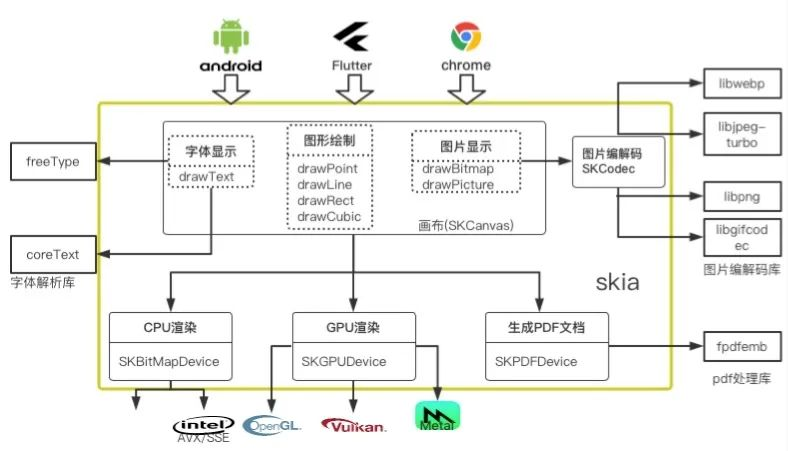

### 2.2 Skia 层次分析  

Skia在结构上大致分成三层：画布层，渲染设备层和封装适配层。

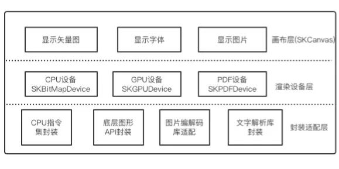

#### 2.2.1 画布层

画布层可以理解成提供给开发者在一个设备无关的画布，可以在上面绘制各种图形，且不用关心硬件细节，功能如下：

<table width="694"><thead style="box-sizing: border-box;background-color: rgb(248, 248, 248);"><tr cid="n29" mdtype="table_row" style="box-sizing: border-box;break-inside: avoid;break-after: auto;border-top: 1px solid rgb(223, 226, 229);"><th style="box-sizing: border-box;padding: 6px 13px;border-top-width: 1px;border-bottom: 0px;border-top-color: rgb(223, 226, 229);border-right-color: rgb(223, 226, 229);border-left-color: rgb(223, 226, 229);text-align: justify;"><span style="box-sizing: border-box;display: inline-block;min-width: 1ch;width: 155.213px;min-height: 10px;font-size: 15px;">类别</span></th><th style="box-sizing: border-box;padding: 6px 13px;border-top-width: 1px;border-bottom: 0px;border-top-color: rgb(223, 226, 229);border-right-color: rgb(223, 226, 229);border-left-color: rgb(223, 226, 229);text-align: justify;"><span style="box-sizing: border-box;display: inline-block;min-width: 1ch;width: 266.813px;min-height: 10px;font-size: 15px;">函数名</span></th><th style="box-sizing: border-box;padding: 6px 13px;border-top-width: 1px;border-bottom: 0px;border-top-color: rgb(223, 226, 229);border-right-color: rgb(223, 226, 229);border-left-color: rgb(223, 226, 229);text-align: justify;"><span style="box-sizing: border-box;display: inline-block;min-width: 1ch;width: 190.012px;min-height: 10px;font-size: 15px;">含义</span></th></tr></thead><tbody style="box-sizing: border-box;"><tr cid="n33" mdtype="table_row" style="box-sizing: border-box;break-inside: avoid;break-after: auto;border-top: 1px solid rgb(223, 226, 229);"><td style="box-sizing: border-box;padding: 6px 13px;border-color: rgb(223, 226, 229);min-width: 32px;text-align: justify;"><span style="box-sizing: border-box;display: inline-block;min-width: 1ch;width: 155.213px;min-height: 10px;font-size: 14px;">画图形</span></td><td style="box-sizing: border-box;padding: 6px 13px;border-color: rgb(223, 226, 229);min-width: 32px;text-align: justify;"><span style="box-sizing: border-box;display: inline-block;min-width: 1ch;width: 266.813px;min-height: 10px;font-size: 14px;">drawPoints</span></td><td style="box-sizing: border-box;padding: 6px 13px;border-color: rgb(223, 226, 229);min-width: 32px;text-align: justify;"><span style="box-sizing: border-box;display: inline-block;min-width: 1ch;width: 190.012px;min-height: 10px;font-size: 14px;">画点</span></td></tr><tr cid="n37" mdtype="table_row" style="box-sizing: border-box;break-inside: avoid;break-after: auto;border-top: 1px solid rgb(223, 226, 229);background-color: rgb(248, 248, 248);"><td style="box-sizing: border-box;padding: 6px 13px;border-color: rgb(223, 226, 229);min-width: 32px;text-align: justify;"><span style="box-sizing: border-box;display: inline-block;min-width: 1ch;width: 155.213px;min-height: 10px;font-size: 14px;">画图形</span></td><td style="box-sizing: border-box;padding: 6px 13px;border-color: rgb(223, 226, 229);min-width: 32px;text-align: justify;"><span style="box-sizing: border-box;display: inline-block;min-width: 1ch;width: 266.813px;min-height: 10px;font-size: 14px;">drawRect</span></td><td style="box-sizing: border-box;padding: 6px 13px;border-color: rgb(223, 226, 229);min-width: 32px;text-align: justify;"><span style="box-sizing: border-box;display: inline-block;min-width: 1ch;width: 190.012px;min-height: 10px;font-size: 14px;">画矩形</span></td></tr><tr cid="n41" mdtype="table_row" style="box-sizing: border-box;break-inside: avoid;break-after: auto;border-top: 1px solid rgb(223, 226, 229);"><td style="box-sizing: border-box;padding: 6px 13px;border-color: rgb(223, 226, 229);min-width: 32px;text-align: justify;"><span style="box-sizing: border-box;display: inline-block;min-width: 1ch;width: 155.213px;min-height: 10px;font-size: 14px;">画图形</span></td><td style="box-sizing: border-box;padding: 6px 13px;border-color: rgb(223, 226, 229);min-width: 32px;text-align: justify;"><span style="box-sizing: border-box;display: inline-block;min-width: 1ch;width: 266.813px;min-height: 10px;font-size: 14px;">drawVertices</span></td><td style="box-sizing: border-box;padding: 6px 13px;border-color: rgb(223, 226, 229);min-width: 32px;text-align: justify;"><span style="box-sizing: border-box;display: inline-block;min-width: 1ch;width: 190.012px;min-height: 10px;font-size: 14px;">画多边形</span></td></tr><tr cid="n45" mdtype="table_row" style="box-sizing: border-box;break-inside: avoid;break-after: auto;border-top: 1px solid rgb(223, 226, 229);background-color: rgb(248, 248, 248);"><td style="box-sizing: border-box;padding: 6px 13px;border-color: rgb(223, 226, 229);min-width: 32px;text-align: justify;"><span style="box-sizing: border-box;display: inline-block;min-width: 1ch;width: 155.213px;min-height: 10px;font-size: 14px;">画图形</span></td><td style="box-sizing: border-box;padding: 6px 13px;border-color: rgb(223, 226, 229);min-width: 32px;text-align: justify;"><span style="box-sizing: border-box;display: inline-block;min-width: 1ch;width: 266.813px;min-height: 10px;font-size: 14px;">drawRoundRect</span></td><td style="box-sizing: border-box;padding: 6px 13px;border-color: rgb(223, 226, 229);min-width: 32px;text-align: justify;"><span style="box-sizing: border-box;display: inline-block;min-width: 1ch;width: 190.012px;min-height: 10px;font-size: 14px;">画圆角矩形</span></td></tr><tr cid="n49" mdtype="table_row" style="box-sizing: border-box;break-inside: avoid;break-after: auto;border-top: 1px solid rgb(223, 226, 229);"><td style="box-sizing: border-box;padding: 6px 13px;border-color: rgb(223, 226, 229);min-width: 32px;text-align: justify;"><span style="box-sizing: border-box;display: inline-block;min-width: 1ch;width: 155.213px;min-height: 10px;font-size: 14px;">画图形</span></td><td style="box-sizing: border-box;padding: 6px 13px;border-color: rgb(223, 226, 229);min-width: 32px;text-align: justify;"><span style="box-sizing: border-box;display: inline-block;min-width: 1ch;width: 266.813px;min-height: 10px;font-size: 14px;">drawArc</span></td><td style="box-sizing: border-box;padding: 6px 13px;border-color: rgb(223, 226, 229);min-width: 32px;text-align: justify;"><span style="box-sizing: border-box;display: inline-block;min-width: 1ch;width: 190.012px;min-height: 10px;font-size: 14px;">画圆弧</span></td></tr><tr cid="n53" mdtype="table_row" style="box-sizing: border-box;break-inside: avoid;break-after: auto;border-top: 1px solid rgb(223, 226, 229);background-color: rgb(248, 248, 248);"><td style="box-sizing: border-box;padding: 6px 13px;border-color: rgb(223, 226, 229);min-width: 32px;text-align: justify;"><span style="box-sizing: border-box;display: inline-block;min-width: 1ch;width: 155.213px;min-height: 10px;font-size: 14px;">画图形</span></td><td style="box-sizing: border-box;padding: 6px 13px;border-color: rgb(223, 226, 229);min-width: 32px;text-align: justify;"><span style="box-sizing: border-box;display: inline-block;min-width: 1ch;width: 266.813px;min-height: 10px;font-size: 14px;">drawOval</span></td><td style="box-sizing: border-box;padding: 6px 13px;border-color: rgb(223, 226, 229);min-width: 32px;text-align: justify;"><span style="box-sizing: border-box;display: inline-block;min-width: 1ch;width: 190.012px;min-height: 10px;font-size: 14px;">画椭圆</span></td></tr><tr cid="n57" mdtype="table_row" style="box-sizing: border-box;break-inside: avoid;break-after: auto;border-top: 1px solid rgb(223, 226, 229);"><td style="box-sizing: border-box;padding: 6px 13px;border-color: rgb(223, 226, 229);min-width: 32px;text-align: justify;"><span style="box-sizing: border-box;display: inline-block;min-width: 1ch;width: 155.213px;min-height: 10px;font-size: 14px;">画图形</span></td><td style="box-sizing: border-box;padding: 6px 13px;border-color: rgb(223, 226, 229);min-width: 32px;text-align: justify;"><span style="box-sizing: border-box;display: inline-block;min-width: 1ch;width: 266.813px;min-height: 10px;font-size: 14px;">drawPath</span></td><td style="box-sizing: border-box;padding: 6px 13px;border-color: rgb(223, 226, 229);min-width: 32px;text-align: justify;"><span style="box-sizing: border-box;display: inline-block;min-width: 1ch;width: 190.012px;min-height: 10px;font-size: 14px;">画矢量图</span></td></tr><tr cid="n61" mdtype="table_row" style="box-sizing: border-box;break-inside: avoid;break-after: auto;border-top: 1px solid rgb(223, 226, 229);background-color: rgb(248, 248, 248);"><td style="box-sizing: border-box;padding: 6px 13px;border-color: rgb(223, 226, 229);min-width: 32px;text-align: justify;"><span style="box-sizing: border-box;display: inline-block;min-width: 1ch;width: 155.213px;min-height: 10px;font-size: 14px;">绘制文字</span></td><td style="box-sizing: border-box;padding: 6px 13px;border-color: rgb(223, 226, 229);min-width: 32px;text-align: justify;"><span style="box-sizing: border-box;display: inline-block;min-width: 1ch;width: 266.813px;min-height: 10px;font-size: 14px;">drawText</span></td><td style="box-sizing: border-box;padding: 6px 13px;border-color: rgb(223, 226, 229);min-width: 32px;text-align: justify;"><span style="box-sizing: border-box;display: inline-block;min-width: 1ch;width: 190.012px;min-height: 10px;font-size: 14px;">显示文字</span></td></tr><tr cid="n65" mdtype="table_row" style="box-sizing: border-box;break-inside: avoid;break-after: auto;border-top: 1px solid rgb(223, 226, 229);"><td style="box-sizing: border-box;padding: 6px 13px;border-color: rgb(223, 226, 229);min-width: 32px;text-align: justify;"><span style="box-sizing: border-box;display: inline-block;min-width: 1ch;width: 155.213px;min-height: 10px;font-size: 14px;">显示图片</span></td><td style="box-sizing: border-box;padding: 6px 13px;border-color: rgb(223, 226, 229);min-width: 32px;text-align: justify;"><span style="box-sizing: border-box;display: inline-block;min-width: 1ch;width: 266.813px;min-height: 10px;font-size: 14px;">drawBitmap</span></td><td style="box-sizing: border-box;padding: 6px 13px;border-color: rgb(223, 226, 229);min-width: 32px;text-align: justify;"><span style="box-sizing: border-box;display: inline-block;min-width: 1ch;width: 190.012px;min-height: 10px;font-size: 14px;">显示位图</span></td></tr></tbody></table>

#### 2.2.2 渲染设备层

渲染设备层负责画布层的硬件实现，skia将设备封装成下面三个类：

1）SKBitmapDevice

CPU渲染模式绘图，用于没有显卡或者显卡驱动的设备。此模式下，最后会将需要绘制的图形转成位图数据（RGB）写入指定内存，故称为BitmapDevice。写内存操作通过AVX或者NEON指令集实现。

2）SKGPUDevice

GPU渲染方式绘图。目前大部分移动设备和个人电脑都有GPU，GPU比CPU的运算单元多，并行计算能力强，通过GPU绘图可降低CPU占用，性能更好。Flutter、最新版本的chrome和android系统默认设置为GPU渲染模式。Chrome中的配置截图如下，可看到默认采用GPU渲染。

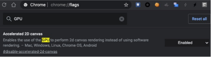

3）SKPDFDevice

选用此设备时，渲染结果不是输出到显示器的画面，而是输出为pdf文件。

可以通过skia官网在线体验不同设备的渲染结果：https://fiddle.skia.org/c/@shapes

#### 2.2.3封装适配层

Skia为了屏蔽不同依赖库的接口差异，对依赖库进行了封装和适配。例如基于图片编解码库libjpeg-turbo、libpng、libwebp 封装了类SKJpegCodec、SKPngCodec、SKWebpCodec。基于底层图形库OpenGL、Metal、Vulkan封装了GrGLOpsRenderPass， GrMTOpsRenderPass, GrVKOpsRenderPass三个类。基于苹果平台CoreText字体库和开源字体FreeType封装了类SkScalerContext_Mac和SkScalerContext_FreeType。

Skia的外部依赖和层级结构讲解完毕，下面重点讲解skia的图形、文字和图片的绘制原理。

## 3. 图形绘制原理

Skia支持绘制的图形众多，包括圆形、椭圆、矩形、贝塞尔曲线等。下文重点分析图形的CPU和GPU两种渲染模式的原理。

### 3.1 图形CPU渲染原理

曲线的绘制涉及的数学知识较多，本文不再展开，下面以绘制实心矩形为例说明原理进行剖析。

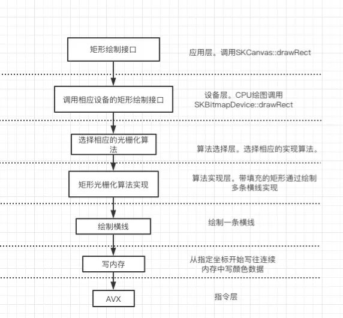

1）调用画布的绘图API

应用层调用画布SKCanvas的drawRect函数，传入左上角和右下角顶点坐标。

2）选用对应的设备的绘图API

由于选择的是CPU渲染模式，故调用SKBitmapDevice的矩形绘图函数drawRect实现。

3）图形表示

所有的图形可分解成下面几种基本矢量图形的组合，矩形可表示成四条直线的组合。

<table width="694"><thead style="box-sizing: border-box;background-color: rgb(248, 248, 248);"><tr cid="n94" mdtype="table_row" style="box-sizing: border-box;break-inside: avoid;break-after: auto;border-top: 1px solid rgb(223, 226, 229);"><th style="box-sizing: border-box;padding: 6px 13px;border-top-width: 1px;border-bottom: 0px;border-top-color: rgb(223, 226, 229);border-right-color: rgb(223, 226, 229);border-left-color: rgb(223, 226, 229);text-align: justify;"><span style="box-sizing: border-box;display: inline-block;min-width: 1ch;width: 163.613px;min-height: 10px;font-size: 15px;">曲线类型</span></th><th style="box-sizing: border-box;padding: 6px 13px;border-top-width: 1px;border-bottom: 0px;border-top-color: rgb(223, 226, 229);border-right-color: rgb(223, 226, 229);border-left-color: rgb(223, 226, 229);text-align: justify;"><span style="box-sizing: border-box;display: inline-block;min-width: 1ch;width: 209.213px;min-height: 10px;font-size: 15px;">参数</span></th><th style="box-sizing: border-box;padding: 6px 13px;border-top-width: 1px;border-bottom: 0px;border-top-color: rgb(223, 226, 229);border-right-color: rgb(223, 226, 229);border-left-color: rgb(223, 226, 229);text-align: justify;"><span style="box-sizing: border-box;display: inline-block;min-width: 1ch;width: 239.213px;min-height: 10px;font-size: 15px;">用途</span></th></tr></thead><tbody style="box-sizing: border-box;"><tr cid="n98" mdtype="table_row" style="box-sizing: border-box;break-inside: avoid;break-after: auto;border-top: 1px solid rgb(223, 226, 229);"><td style="box-sizing: border-box;padding: 6px 13px;border-color: rgb(223, 226, 229);min-width: 32px;text-align: justify;"><span style="box-sizing: border-box;display: inline-block;min-width: 1ch;width: 163.613px;min-height: 10px;font-size: 14px;">直线（一次贝塞尔曲线）</span></td><td style="box-sizing: border-box;padding: 6px 13px;border-color: rgb(223, 226, 229);min-width: 32px;text-align: justify;"><span style="box-sizing: border-box;display: inline-block;min-width: 1ch;width: 209.213px;min-height: 10px;font-size: 14px;">起点坐标，终点坐标</span></td><td style="box-sizing: border-box;padding: 6px 13px;border-color: rgb(223, 226, 229);min-width: 32px;text-align: justify;"><span style="box-sizing: border-box;display: inline-block;min-width: 1ch;width: 239.213px;min-height: 10px;font-size: 14px;">可表示绘制三角形、四边形等多边形</span></td></tr><tr cid="n102" mdtype="table_row" style="box-sizing: border-box;break-inside: avoid;break-after: auto;border-top: 1px solid rgb(223, 226, 229);background-color: rgb(248, 248, 248);"><td style="box-sizing: border-box;padding: 6px 13px;border-color: rgb(223, 226, 229);min-width: 32px;text-align: justify;"><span style="box-sizing: border-box;display: inline-block;min-width: 1ch;width: 163.613px;min-height: 10px;font-size: 14px;">圆锥曲线</span></td><td style="box-sizing: border-box;padding: 6px 13px;border-color: rgb(223, 226, 229);min-width: 32px;text-align: justify;"><span style="box-sizing: border-box;display: inline-block;min-width: 1ch;width: 209.213px;min-height: 10px;font-size: 14px;">起点坐标，终点坐标，椭圆参数</span></td><td style="box-sizing: border-box;padding: 6px 13px;border-color: rgb(223, 226, 229);min-width: 32px;text-align: justify;"><span style="box-sizing: border-box;display: inline-block;min-width: 1ch;width: 239.213px;min-height: 10px;font-size: 14px;">表示椭圆、圆弧、圆形</span></td></tr><tr cid="n106" mdtype="table_row" style="box-sizing: border-box;break-inside: avoid;break-after: auto;border-top: 1px solid rgb(223, 226, 229);"><td style="box-sizing: border-box;padding: 6px 13px;border-color: rgb(223, 226, 229);min-width: 32px;text-align: justify;"><span style="box-sizing: border-box;display: inline-block;min-width: 1ch;width: 163.613px;min-height: 10px;font-size: 14px;">二次贝塞尔曲线</span></td><td style="box-sizing: border-box;padding: 6px 13px;border-color: rgb(223, 226, 229);min-width: 32px;text-align: justify;"><span style="box-sizing: border-box;display: inline-block;min-width: 1ch;width: 209.213px;min-height: 10px;font-size: 14px;">三个控制点</span></td><td style="box-sizing: border-box;padding: 6px 13px;border-color: rgb(223, 226, 229);min-width: 32px;text-align: justify;"><span style="box-sizing: border-box;display: inline-block;min-width: 1ch;width: 239.213px;min-height: 10px;font-size: 14px;">表示TrueType字体、抛物线等曲线</span></td></tr><tr cid="n110" mdtype="table_row" style="box-sizing: border-box;break-inside: avoid;break-after: auto;border-top: 1px solid rgb(223, 226, 229);background-color: rgb(248, 248, 248);"><td style="box-sizing: border-box;padding: 6px 13px;border-color: rgb(223, 226, 229);min-width: 32px;text-align: justify;"><span style="box-sizing: border-box;display: inline-block;min-width: 1ch;width: 163.613px;min-height: 10px;font-size: 14px;">三次贝塞尔曲线</span></td><td style="box-sizing: border-box;padding: 6px 13px;border-color: rgb(223, 226, 229);min-width: 32px;text-align: justify;"><span style="box-sizing: border-box;display: inline-block;min-width: 1ch;width: 209.213px;min-height: 10px;font-size: 14px;">四个控制点</span></td><td style="box-sizing: border-box;padding: 6px 13px;border-color: rgb(223, 226, 229);min-width: 32px;text-align: justify;"><span style="box-sizing: border-box;display: inline-block;min-width: 1ch;width: 239.213px;min-height: 10px;font-size: 14px;">表示OpenType字体和其他曲线</span></td></tr></tbody></table>

4）绘制算法实现  

矢量图转成位图的过程称为光栅化。带填充的矩形光栅化过程比较简单，可以分解成绘制多条横线。

5）横线线绘制算法

每条横向的画法通过SKBlitter:: blitH实现。接口定义如下：

```cpp
virtual void blitH(int x, int y, int width);
```

功能：从坐标x,y开始，连续写入宽度为width的RGB颜色值。

6）内存中写颜色数据

通过追踪代码，发现上文中的横线绘制函数调用的是memsetT函数（内存赋值）实现。参数如下：

```cpp
static void memsetT(T buffer[], T value, int count)
```

目前x86和ARM处理器是32或者64位，普通的指令一次最多写入32位或者64位数据，一个带透明通道的点通常占4个字节，相当于一次只能绘制1到2个点，效率比较低。Skia从性能角度考虑，采用的SIMD指令集来加速内存操作。

在X86平台，调用SSE、AVX、AVX2等指令集实现内存赋值，SSE支持一次操作128位操作，AVX/AVX2支持一次操作256位数据，ARM处理器的NEON指令集支持一次操作128位数据。

### 3.2 图形GPU渲染原理

GPU的并行运算能力强，目前大部分移动设备都采用的是GPU渲染。

skia GPU渲染流程如下：

1）发起绘图，先调用SKCanvas的绘图函数drawRect，传入左上角和右下角顶点坐标。

2）调用GPU设备的绘图函数SKGPUDevice::drawRect。

3）采用命令模式，将GPU绘图操作封装成类GrOpsTask的实例。

4）根据软硬件平台的不同选用不同的底层API。

OpenGL（Open Graphics Library”）是目前使用最广泛的跨平台图形变成接口，跨平台特性好，大部分操作系统和GPU。Skia在大部分平台采用OpenGL实现GPU绘图，少部分平台调用Metal和vulkan。

Metal是苹果公司2014年推出的和 OpenGL类似的面向底层的图形编程接口，只支持iOS。对软硬件有要求，要求硬件苹果A7及以后，操作系统iOS 10及以上。Metal理论上性能比OpenGL性能强，故新设备中开启Metal可提高性能。例如Flutter中已启用了metal支持，详情参考https://github.com/flutter/flutter/wiki/Metal-on-iOS-FAQ。

Vulkan是新一代跨平台的2D和3D绘图应用程序接口（API）,旨在取代OpenGL，理论上性能强于OpenGL。自 Android 7.0 开发者预览版开始，Google便在系统平台中添加了对Vulkan的API支持。目前Skia的GPU渲染模式已用vulkan实现了一套，但存在一些bug。具体参考https://skia.org/user/special/vulkan。

Skia对上述三种图形接口进行了封装，屏蔽了不同底层图形API接口的差异。OpenGL接口的封为GrGLOpsRenderPass，Metal的封装层为GrMTOpsRenderPass,Vuklan的封装层为 GrVKOpsRenderPass。

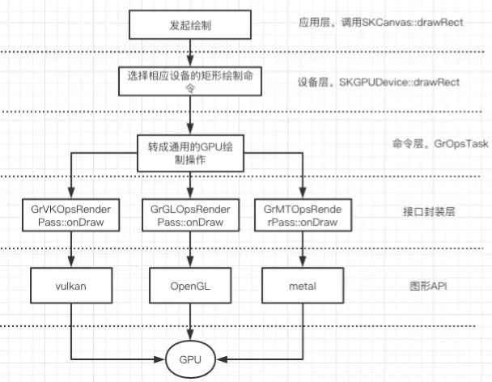

5）通过GPU完成剩余绘图操作。

下面以OpenGL为例说明。接口封装层调用OpenGL glDrawArray绘制矩形，之后在渲染流水线中完成顶点变换、光栅化和着色，最后送帧缓冲显示。渲染流水线如下图所示：

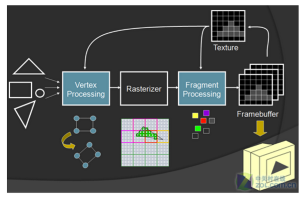

Metal、vulkan的渲染流水线这里不再展开。

## 4. 字体绘制原理

字体无法直接显示在屏幕上，需要解析成位图或者矢量图才能绘制。Skia的字体解析实现跟进平台差异有所不同，mac和iOS平台调用coreText库,安卓平台调用开源库freeType。

FreeType是一个用C语言实现的，免费的高质量可移植字体引擎，支持点阵字体PCF、BDF和矢量字体TrueType、freeType等字体。

### 4.1 skia点阵字体绘制原理

Skia支持的点阵字体有PCF、BDF格式。点阵存储的是多张位图，常见的有`16*16`，`24*24`，`32*32`等尺寸，解码和显示简单，缺点是放大后有锯齿。

1) skia点阵文字显示代码：

```cpp
SkFont font;
font.setEdging(SkFont::Edging::kAlias);
font.setSize(40);
const char text[] = "Click this link!";
size_t byteLength = strlen(static_cast<const char*>(text));
canvas->drawSimpleText(text, byteLength, SkTextEncoding::kUTF8, x, y, font, SkPaint());
```

文字绘制流程如下：

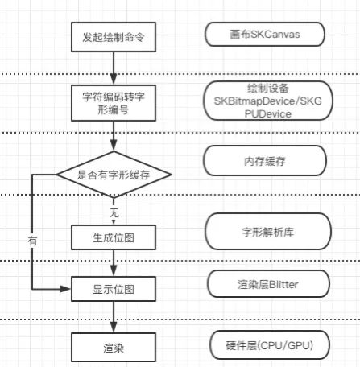

点阵字体最后解析成了位图，然后根据平台不同选用CPU或者GPU渲染出来。Skia为了提高字体显示速度，对字体的解析结果做了内存缓存。

### 4.2 矢量字体绘制原理

矢量字体主要通过贝塞尔曲线描述字体，存储空间小，但渲染复杂，还需要导入字体库文件。Skia支持的矢量字体有tff(true type font)和otf(open true type)格式。前者采用二次贝塞尔曲线表示，后者采用三次贝塞尔曲线表示。Skia中矢量文字绘制代码如下：

```cpp
SkPaint p;
    p.setStyle(SkPaint::kStroke_Style);
    p.setStrokeWidth(10);
    p.setARGB(0xff, 0xbb, 0x00, 0x00);
   sk_sp<SkTypeface> ttf = MakeResourceAsTypeface("fonts/Stroking.ttf");
SkFont font(ttf, 100);
if (ttf) {
        SkFont font(ttf, 100);
        canvas->drawString("○◉  ⁻₋⁺₊", 10, 100, font, p);
}
```

绘制流程如下：

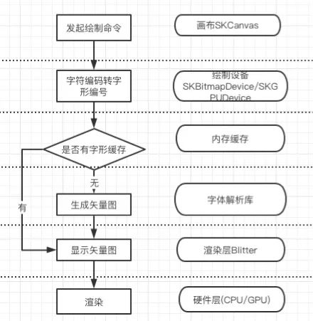

矢量字体的绘制流程跟点阵字体大部分一样，不同之处在于解析结果为贝塞尔曲线。贝塞尔曲线的渲染算法稍微复杂，参考文章https://www3.cs.stonybrook.edu/~qin/courses/geometry/4.pdf

## 5. 图片绘制原理

### 5.1 Skia位图绘制原理

skia提供了showBitmap函数可直接显示位图。位图渲染模式跟矢量图形类似，分为CPU渲染和GPU渲染。位图的CPU渲染跟实心矩形的渲染原理类似，通过SIMD指令集将位图内存一行一行拷贝到指定内存缓存中。GPU渲染模式通过调用OpenGL、Metal、vulkan的纹理贴图函数实现。

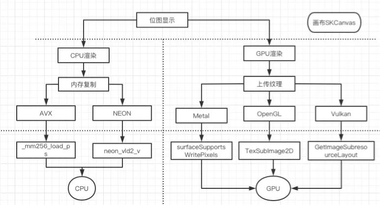

### 5.2 Skia压缩格式图片绘制原理

位图由于占用空间大，使用频率低，大部分情况下使用压缩格式图片。Skia支持的压缩格式图片如下：

<table width="694"><thead style="box-sizing: border-box;background-color: rgb(248, 248, 248);"><tr cid="n176" mdtype="table_row" style="box-sizing: border-box;break-inside: avoid;break-after: auto;border-top: 1px solid rgb(223, 226, 229);"><th style="box-sizing: border-box;padding: 6px 13px;border-top-width: 1px;border-bottom: 0px;border-top-color: rgb(223, 226, 229);border-right-color: rgb(223, 226, 229);border-left-color: rgb(223, 226, 229);text-align: justify;"><span style="box-sizing: border-box;display: inline-block;min-width: 1ch;width: 41.2125px;min-height: 10px;font-size: 15px;">格式</span></th><th style="box-sizing: border-box;padding: 6px 13px;border-top-width: 1px;border-bottom: 0px;border-top-color: rgb(223, 226, 229);border-right-color: rgb(223, 226, 229);border-left-color: rgb(223, 226, 229);text-align: justify;"><span style="box-sizing: border-box;display: inline-block;min-width: 1ch;width: 185.213px;min-height: 10px;font-size: 15px;">优点</span></th><th style="box-sizing: border-box;padding: 6px 13px;border-top-width: 1px;border-bottom: 0px;border-top-color: rgb(223, 226, 229);border-right-color: rgb(223, 226, 229);border-left-color: rgb(223, 226, 229);text-align: justify;"><span style="box-sizing: border-box;display: inline-block;min-width: 1ch;width: 142.012px;min-height: 10px;font-size: 15px;">缺点</span></th><th style="box-sizing: border-box;padding: 6px 13px;border-top-width: 1px;border-bottom: 0px;border-top-color: rgb(223, 226, 229);border-right-color: rgb(223, 226, 229);border-left-color: rgb(223, 226, 229);text-align: justify;"><span style="box-sizing: border-box;display: inline-block;min-width: 1ch;width: 108.413px;min-height: 10px;font-size: 15px;">场景</span></th><th style="box-sizing: border-box;padding: 6px 13px;border-top-width: 1px;border-bottom: 0px;border-top-color: rgb(223, 226, 229);border-right-color: rgb(223, 226, 229);border-left-color: rgb(223, 226, 229);text-align: justify;"><span style="box-sizing: border-box;display: inline-block;min-width: 1ch;width: 80.8125px;min-height: 10px;font-size: 15px;">依赖解码库</span></th></tr></thead><tbody style="box-sizing: border-box;"><tr cid="n182" mdtype="table_row" style="box-sizing: border-box;break-inside: avoid;break-after: auto;border-top: 1px solid rgb(223, 226, 229);"><td style="box-sizing: border-box;padding: 6px 13px;border-color: rgb(223, 226, 229);min-width: 32px;text-align: justify;"><span style="box-sizing: border-box;display: inline-block;min-width: 1ch;width: 41.2125px;min-height: 10px;font-size: 14px;">gif</span></td><td style="box-sizing: border-box;padding: 6px 13px;border-color: rgb(223, 226, 229);min-width: 32px;text-align: justify;"><span style="box-sizing: border-box;display: inline-block;min-width: 1ch;width: 185.213px;min-height: 10px;font-size: 14px;">文件小，支持动画、透明，无兼容性问题</span></td><td style="box-sizing: border-box;padding: 6px 13px;border-color: rgb(223, 226, 229);min-width: 32px;text-align: justify;"><span style="box-sizing: border-box;display: inline-block;min-width: 1ch;width: 142.012px;min-height: 10px;font-size: 14px;">只支持种颜色，且透明度只有1位，有白边和锯齿</span></td><td style="box-sizing: border-box;padding: 6px 13px;border-color: rgb(223, 226, 229);min-width: 32px;text-align: justify;"><span style="box-sizing: border-box;display: inline-block;min-width: 1ch;width: 108.413px;min-height: 10px;font-size: 14px;">简单的动图</span></td><td style="box-sizing: border-box;padding: 6px 13px;border-color: rgb(223, 226, 229);min-width: 32px;text-align: justify;"><span style="box-sizing: border-box;display: inline-block;min-width: 1ch;width: 80.8125px;min-height: 10px;font-size: 15px;">libgifcodec</span></td></tr><tr cid="n188" mdtype="table_row" style="box-sizing: border-box;break-inside: avoid;break-after: auto;border-top: 1px solid rgb(223, 226, 229);background-color: rgb(248, 248, 248);"><td style="box-sizing: border-box;padding: 6px 13px;border-color: rgb(223, 226, 229);min-width: 32px;text-align: justify;"><span style="box-sizing: border-box;display: inline-block;min-width: 1ch;width: 41.2125px;min-height: 10px;font-size: 14px;">jpg</span></td><td style="box-sizing: border-box;padding: 6px 13px;border-color: rgb(223, 226, 229);min-width: 32px;text-align: justify;"><span style="box-sizing: border-box;display: inline-block;min-width: 1ch;width: 185.213px;min-height: 10px;font-size: 14px;">支持位真彩色，压缩率高</span></td><td style="box-sizing: border-box;padding: 6px 13px;border-color: rgb(223, 226, 229);min-width: 32px;text-align: justify;"><span style="box-sizing: border-box;display: inline-block;min-width: 1ch;width: 142.012px;min-height: 10px;font-size: 14px;">有损压缩，不支持透明通道</span></td><td style="box-sizing: border-box;padding: 6px 13px;border-color: rgb(223, 226, 229);min-width: 32px;text-align: justify;"><span style="box-sizing: border-box;display: inline-block;min-width: 1ch;width: 108.413px;min-height: 10px;font-size: 14px;">色彩丰富的图片</span></td><td style="box-sizing: border-box;padding: 6px 13px;border-color: rgb(223, 226, 229);min-width: 32px;text-align: justify;"><span style="box-sizing: border-box;display: inline-block;min-width: 1ch;width: 80.8125px;min-height: 10px;font-size: 15px;">libjpeg-turbo</span></td></tr><tr cid="n194" mdtype="table_row" style="box-sizing: border-box;break-inside: avoid;break-after: auto;border-top: 1px solid rgb(223, 226, 229);"><td style="box-sizing: border-box;padding: 6px 13px;border-color: rgb(223, 226, 229);min-width: 32px;text-align: justify;"><span style="box-sizing: border-box;display: inline-block;min-width: 1ch;width: 41.2125px;min-height: 10px;font-size: 14px;">png</span></td><td style="box-sizing: border-box;padding: 6px 13px;border-color: rgb(223, 226, 229);min-width: 32px;text-align: justify;"><span style="box-sizing: border-box;display: inline-block;min-width: 1ch;width: 185.213px;min-height: 10px;font-size: 14px;">无损压缩，支持透明，简单图片尺寸小</span></td><td style="box-sizing: border-box;padding: 6px 13px;border-color: rgb(223, 226, 229);min-width: 32px;text-align: justify;"><span style="box-sizing: border-box;display: inline-block;min-width: 1ch;width: 142.012px;min-height: 10px;font-size: 14px;">不支持动画，压缩率低</span></td><td style="box-sizing: border-box;padding: 6px 13px;border-color: rgb(223, 226, 229);min-width: 32px;text-align: justify;"><span style="box-sizing: border-box;display: inline-block;min-width: 1ch;width: 108.413px;min-height: 10px;font-size: 14px;">logo/icon/透明图</span></td><td style="box-sizing: border-box;padding: 6px 13px;border-color: rgb(223, 226, 229);min-width: 32px;text-align: justify;"><span style="box-sizing: border-box;display: inline-block;min-width: 1ch;width: 80.8125px;min-height: 10px;font-size: 15px;">libpng</span></td></tr><tr cid="n200" mdtype="table_row" style="box-sizing: border-box;break-inside: avoid;break-after: auto;border-top: 1px solid rgb(223, 226, 229);background-color: rgb(248, 248, 248);"><td style="box-sizing: border-box;padding: 6px 13px;border-color: rgb(223, 226, 229);min-width: 32px;text-align: justify;"><span style="box-sizing: border-box;display: inline-block;min-width: 1ch;width: 41.2125px;min-height: 10px;font-size: 14px;">webp</span></td><td style="box-sizing: border-box;padding: 6px 13px;border-color: rgb(223, 226, 229);min-width: 32px;text-align: justify;"><span style="box-sizing: border-box;display: inline-block;min-width: 1ch;width: 185.213px;min-height: 10px;font-size: 14px;">比jpeg压缩率更高，支持有损和无损压缩，支持动画、透明通道</span></td><td style="box-sizing: border-box;padding: 6px 13px;border-color: rgb(223, 226, 229);min-width: 32px;text-align: justify;"><span style="box-sizing: border-box;display: inline-block;min-width: 1ch;width: 142.012px;min-height: 10px;font-size: 14px;">谷歌自研格式，部分平台不支持。</span></td><td style="box-sizing: border-box;padding: 6px 13px;border-color: rgb(223, 226, 229);min-width: 32px;text-align: justify;"><span style="box-sizing: border-box;display: inline-block;min-width: 1ch;width: 108.413px;min-height: 10px;font-size: 14px;">支持有损和无损压缩格式，支持动画</span></td><td style="box-sizing: border-box;padding: 6px 13px;border-color: rgb(223, 226, 229);min-width: 32px;text-align: justify;"><span style="box-sizing: border-box;display: inline-block;min-width: 1ch;width: 80.8125px;min-height: 10px;font-size: 15px;">libwebp</span></td></tr></tbody></table>

压缩格式图片使用代码如下：  

```cpp
SkCanvas c(dst);  
    SkBitmap src;  
    SkImageDecoder::DecodeFile(“test.jpg”, &src);//  图片解码
    c.drawBitmap(src, 0, 0, NULL);  //图片显示
```

显示流程如下图所示：

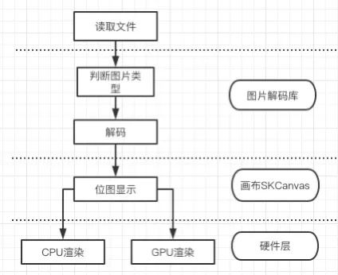

读取文件后，先通过文件头判断图片类型，然后送相应的图片库解码成位图图像后，再通过CPU或者GPU渲染。

## 6. skia小结

Skia是一个功能强大的跨平台图形库，能绘制矩形、圆形、贝塞尔曲线等矢量图，绘制点阵字体和矢量字体，显示jpeg、png、gif、webp等图片，同时性能好，从算法和硬件两个层面进行了优化。skia支持多种软硬件平台，除了Android、chrome、Flutter等产品直接将其作为图形引擎，也支持iOS、windows等操作系统。Skia功能较多，还支持lottie动画，图像特效，还引入了中间语言SKGL，限于篇幅，这里不再展开。

## 参考文档

1. [iOS高性能绘图](https://medium.com/@almalehdev/high-performance-drawing-on-ios-part-1-f3a24a0dcb31)

2. [Core Animation 编程指南](https://developer.apple.com/library/archive/documentation/Cocoa/Conceptual/CoreAnimation_guide/Introduction/Introduction.html#//apple_ref/doc/uid/TP40004514-CH1-SW1)

3. [skia编译方法](https://skia.org/user/build)

4. [Skia技术路线](https://docs.google.com/document/d/1C9w8qpPpdgNGThqmgNnTToLZ5UYK4TsUGl5X3B_q6oM/edit)

5. [SKGL说明](https://github.com/google/skia/blob/master/src/sksl/README)

6. [Skia源码](https://skia.googlesource.com/skia.git)

7. [Skia 百科](https://zh.wikipedia.org/zh-cn/Skia_Graphics_Library)

8. [字体介绍](http://www.klayge.org/wiki/index.php/%E5%AD%97%E4%BD%93%E7%B3%BB%E7%BB%9F)

9. [FreeType官网](https://www.freetype.org/)

10. [png压缩原理](https://www.jianshu.com/p/5ad19825a3d0)

11. [GPU渲染流水线](https://zhuanlan.zhihu.com/p/61949898)

12. [Vukan介绍](https://www.khronos.org/assets/uploads/developers/library/overview/Vk_201602_Overview_Feb16.pdf)

13. [ARM Mali GPU介绍](https://developer.arm.com/solutions/graphics-and-gaming/apis/vulkan)

14. [Vulkan和OpenGL ES比较](https://community.arm.com/developer/tools-software/graphics/b/blog/posts/initial-comparison-of-vulkan-api-vs-opengl-es-api-on-arm)

15. [Qualcomm宣布Adreno 530 GPU支持vulkan](https://www.qualcomm.cn/news/releases-2016-02-18-0)

16. https://www.adobe.com/content/dam/acom/en/devnet/font/pdfs/5005.BDF_Spec.pdf
