 
<!--BEGIN_DATA
{
    "create_date": "2021-01-20 10:36", 
    "modify_date": "2021-01-20 10:36", 
    "is_top": "0", 
    "summary": "图解什么是并查集", 
    "tags": "算法", 
    "file_name": "图解什么是并查集.md"
}
END_DATA-->

#### <p>原文出处：<a href='https://mp.weixin.qq.com/s/Lg_3i3wpiegQet83dE-e6A' target='blank'>图解什么是并查集</a></p>

## Uion-Find 算法

在计算机科学中，**并查集**（英文：Disjoint-set data structure，直译为不交集数据结构）是一种数据结构，用于处理一些不交集（Disjoint sets，一系列没有重复元素的集合）的合并及查询问题。并查集支持如下操作：

  * 查询：查询某个元素属于哪个集合，通常是返回集合内的一个“代表元素”。这个操作是为了判断两个元素是否在同一个集合之中。
  * 合并：将两个集合合并为一个。
  * 添加：添加一个新集合，其中有一个新元素。添加操作不如查询和合并操作重要，常常被忽略。

由于支持查询和合并这两种操作，并查集在英文中也被称为联合-查找数据结构（Union-find data structure）或者合并-查找集合（Merge-find set）。

并查集是用于计算最小生成树的[迪杰斯特拉算法](https://mp.weixin.qq.com/s?__biz=MzA4NDE4MzY2MA==&mid=2647520862&idx=1&sn=0bfa987a59d36130b67531eeee63b97e&scene=21#wechat_redirect)中的关键。由于最小生成树在网络路由等场景下十分重要，并查集也得到了广泛的引用。此外，并查集在符号计算，寄存器分配等方面也有应用。

### 引论

设计一个算法大致分为六个步骤：

  1. 定义问题（define the problem)
  2. 设计一个算法来解决问题（Find an algorithm to solve it）
  3. 判断算法是否足够高效？（Fast Enough?)
  4. 如果不够高效，思考为什么，并进行优化。（If not，figure out why ?）
  5. 寻找一种方式来处理问题 (Find a way to address the problem)
  6. 迭代设计，直到满足条件 (Iterate until satisfied.)

我们从一个基本问题：网络连通性（Network connectivity）出发，该问题可以抽象为：

  * 一组对象。
  * UNION 命令：连接两个对象。
  * FIND 查询：是否有路径将一个对象连接到另一个对象？

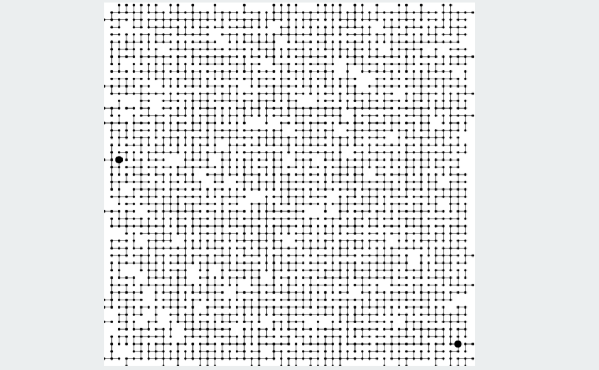

并查集的对象可以是下面列出的任何类型：

  * 网络中的计算机
  * 互联网上的 web 页面
  * 计算机芯片中的晶体管。
  * 变量名称别名。
  * 数码照片中的像素。
  * 复合系统中的金属点位。

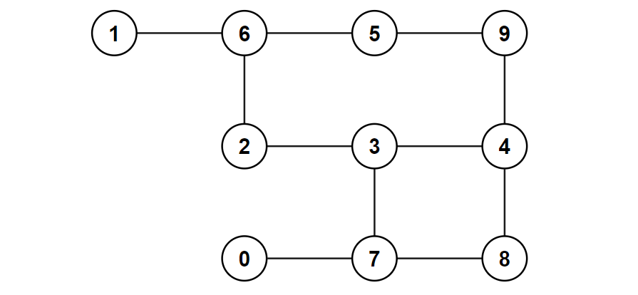

图 1 连通图

在编程的时候，为了方便起见，我们对这些对象从 0 到 n-1 进行编号，从而用一个整形数字表示对象。隐藏与 Union-find 不相关的细节；可以使用整数快速获取与对象相关的信息（数组的下标）；可以使用符号表对对象进行转化。

简化有助于我们理解连通性的本质。

如图 1 所示，假设我们有编号为 `[0,1,2,3,4,5,6,7,8,9]` 的 10 个对象，对象的不相交集合为 : `{{0},{1},{2,3,9},{5,6},{7},{4,8}}` 。

**Find** 查询：2 和 9 是否在一个集合当中呢？

答：`{{0},{1},{2,3,9},{5,6},{7},{4,8}}` 。

**Union** 命令：合并包含 3 和 8 的集合。

答：`{{0},{1},{2,3,4,8,9},{5,6},{7}}` 。

**连接组件(Connected Component)：一组相互连接的顶点.**

**每一次 Union 命令会将组（连通分量）的数量减少 1 个。**

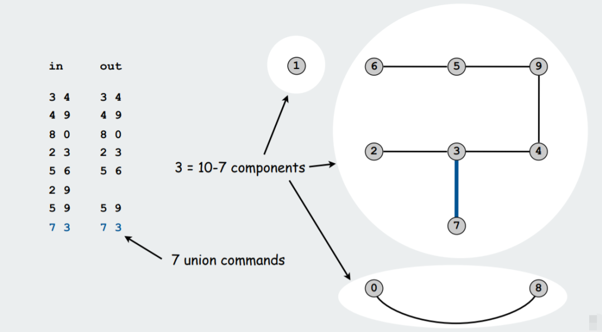

如上图所示，初始时，每一个顶点为一个组，我们执行了 7 次 Union 操作后，变成了 3 个组。其中 `{2 9}` 不算做一次 Union 操作，是因为在 Union 之前，我们使用 Find 查找命令，会发现 `{2 9}` 此时已经位于同一个组 `{2 3 4 5 6 9}` 当中。

以网络连通性问题为例，如下图所示，**find(u,v)** 可以判断顶点 u 和 v 是否联通？

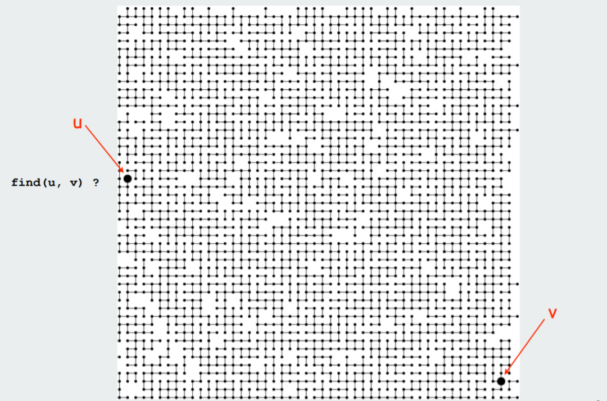

如下图所示，图中共包含 63 个组，其中对象 u 和 对象 v 在同一个集合当中，我们可以找到一条从对象 u 到对象 v 的路径（红色路线）但是我们并不关心这条路劲本身，只关心他们是否联通：

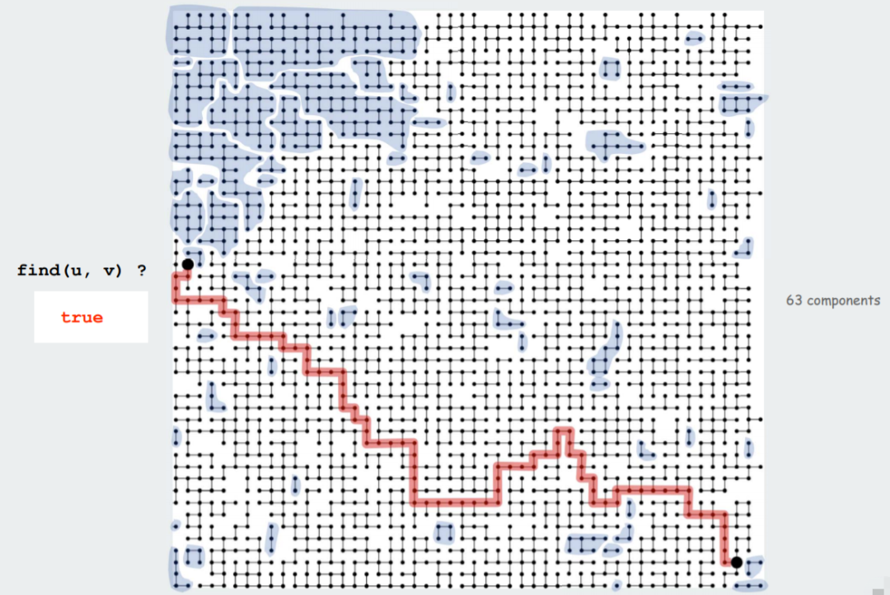

上面的问题看似很复杂，但也很容易抽象为 Union-Find 模型：

  * 对象。
  * 对象的不相交集（Disjoint Set）。
  * Find 查询：两个对象是否在同一集合中？
  * Union 命令：将包含两个对象的集合替换为它们的并集。

现在目标就是为 Union-Find 设计一个高效的数据结构：

  * Find 查询和 Union 命令可以混合使用。
  * Find 和 Union 的操作数量 M 可能很大。
  * 对象数量 N 可能很大。

### Quick-Find

设计一个大小为 N 的整型数组 `id[]`，如果 p 和 q 有相同的 `id` ，即 `id[p] = id[q]`，则认为 p 和 q 是联通的，位于同一个集合中，如下图所示，5 和 6 是联通的，2、3、4 和 9 是联通的。

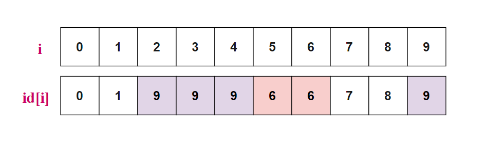

`Find(p,q)` 查询操作只需要判断 p 和 q 是否具有相同的 id，即 `id[p]` 是否等于 `id[q]` ；比如查询 `Find(2,9)`，`id[2] = id[9] = 9` ，则 2 和 9 是联通的。

`Union(p,q)` 操作：合并包含 p 和 q 的所有组，将输入中所有 id 为 `id[p]` 的对象 id 修改为 `id[q]`。比如 `Union(3,6)` ，需要将 id 为 `id[3] = 9` 的所有对象 `{2,3,4,9}` 的 id 均修改为 `id[6] = 6`，如下图所示。

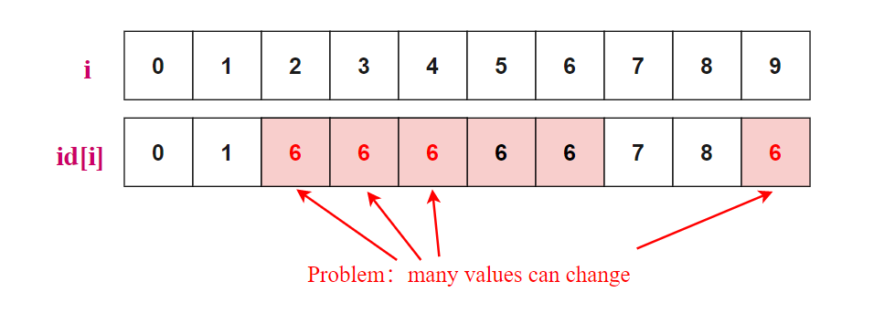

`Find(u,v)` 的时间复杂度为  ，`Union(p,q)` 的时间复杂度为  量级 ，每一次 `Union` 操作需要更新很多元素 `i` 的 index `id[i]` 。

以下图为例，我们依次执行 `Union(3,4)`， `Union(4,9)`， `Union(8,0)`，`Union(2,3)`，......，`Union(6,1)` 操作，整形数组 `id[]` 中元素的变化过程。

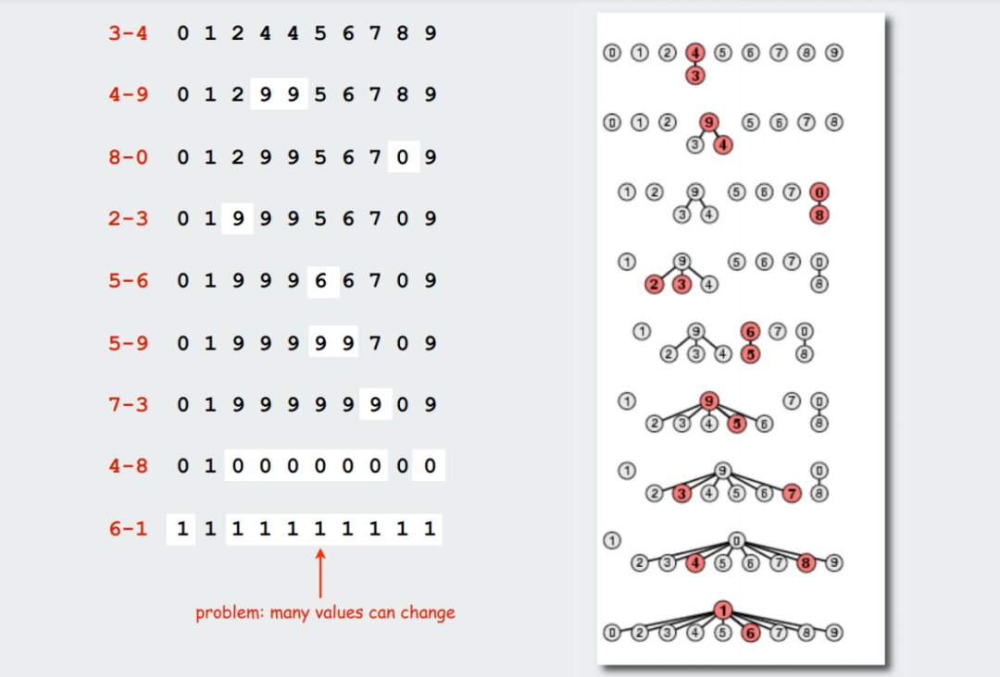

#### 实现

```java
public class QuickFind  
{  
    private int[] id;  
    public QuickFind(int N)  
    {  
        id = new int[N];  
        for (int i = 0; i < N; i++){  
            id[i] = i;  
        }  
    }  
        
    public boolean find(int p, int q)  
    {  
        return id[p] == id[q];  
    }  
        
    public void unite(int p, int q)  
    {  
        int pid = id[p];  
        for (int i = 0; i < id.length; i++) {  
            if (id[i] == pid) {  
                id[i] = id[q];  
            }  
        }  
    }  
}  
``` 

#### 复杂度分析

Quick-find 算法的 `find` 函数非常简单，只是判断 `id[p] == id[q]` 并返回，时间复杂度为  ，而 `Union(u,v)` 函数因为无法确定谁的 ID 与 `id[q]` 相同，所以每次都要把整个数组遍历一遍，如果一共有  个对象，则时间复杂度为 。综合一下，表示如果 `Union` 操作执行  次，总共  个对象（数组大小），则时间复杂度为  量级，。

因为这个算法 `Find` 操作很快，而 `Union` 操作却很慢，所以将其称为 **Quick-Find** 算法。

### Quick-Union

回忆 Quick-Find 中 union 函数，就像是暴力法，遍历所有对象的 `id[]` ，然后把有着相同 `id` 的数全部改掉， Quick-Union 算法则是引入 “树” 的概念来优化 union 函数，我们把每一个数的 `id` 看做是它的父结点。比如说，`id[3] = 4`，就表示 3 的父结点为 4。

与 Quick-Find 算法使用一样的数据结构，但是 `id[]` 数组具有不同的含义：

  * 大小为  的整型数组 `id[]`
  * 解释：`id[i]` 表示  `i` 的父结点
  * `i` 的根结点为 `id[id[id[...id[i]...]]]`

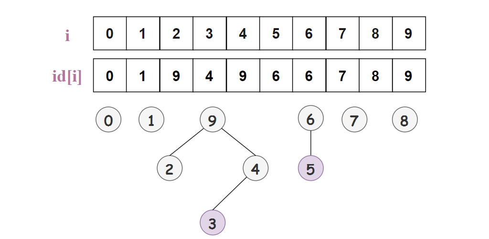

如图所示，`id[2] = 9` 就表示 2 的父结点为 9；3 的根节点为 9 (3 的父结点为 4，4 的父结点为 9，9的父结点还是 9，也就是根结点了)，5 的根结点为 6 。

那么 `Find(p,q)` 操作就变成了判断 `p` 和 `q` 的根结点是否相同，比如 `Find(2,3)` ，2 和 3 的根结点 9 相同，所以 2 和 3 是联通的。

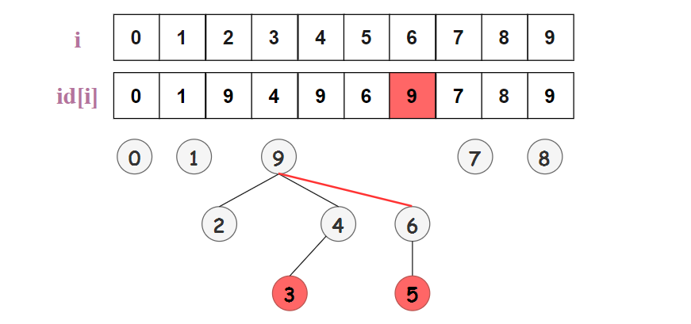

`Union(p,q)` 操作就是将 `q` 根结点的 id 设置为 `p` 的根结点的 id。如上图所示，**Union(3,5)** 就是将**5** 的根结点的 **6** 设置为 **3** 的根结点 **9** ，即 **id[5] = 9** ，仅更新一个元素的 **id** 。

对于原数组 **i = {0,1,2,3,4,5,6,7,8,9}** 及 id 数组 **id[10] = {0,1,2,3,4,5,6,7,8,9}** ，依次执行 `Union(3,4)` ，`Union(4,9)` ，`Union(8,0)`，`Union(2,3)` ，`Union(5,6)` ，`Union(5,9)` ，`Union(7,3)` ，`Union(4,8)`，`Union(6,2)` 的过程中如下：

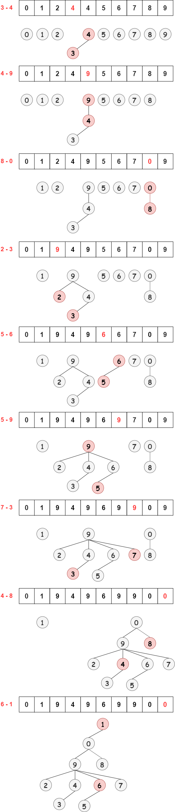

#### 实现代码

```java
public class QuickUnion  
{  
    private int[] id;  
    public QuickUnion(int N) {  
        id = new int[N];  
        for (int i = 0; i < N; i++) id[i] = i;  
    }  
        
    private int root(int i) {  
        while (i != id[i]) i = id[i];  
        return i;  
    }  
        
    public boolean find(int p, int q) {  
        return root(p) == root(q);  
    }  
        
    public void unite(int p, int q) {  
        int i = root(p);  
        int j = root(q);  
        id[i] = j;  
    }  
}  
```

#### 复杂度分析

对于 `Find(p,q)` 操作，只需要找到 p 的根结点和 q 的根结点，检查它们是否相等。合并操作就是找到两个根节点并将第一个根节点的 id 记录值设为第二个根节点 。

与 Quick-Find 算法相比， Quick-Union 算法对于问题规模较大时是更加高效。不幸的是，Quick-Union 算法快了一些但是依然太慢了，相对 Quick-Find 的慢，它是另一种慢。有些情况下它可以很快，而有些情况下它还是太慢了。但 Quick-Union 算法依然是用来求解动态连通性问题的一个快速而优雅的设计。

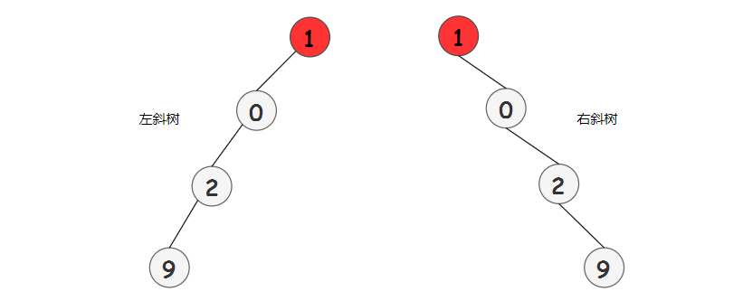

Quick-Union 算法的缺点在于树可能太高了。这意味着查找操作的代价太大了。你可能需要回溯一棵瘦长的树（斜树），每个对象只是指向下一个节点，那么对叶子节点执行一次查找操作，需要回溯整棵树，只进行查找操作就需要花费 N 次数组访问，如果操作次数很多的话这就太慢了。

`Find` 操作：最好时间复杂度为 O(1)，最坏为 O(n)，平均 O(logn) 。

`Union` 操作：最好时间复杂度为 O(1)，最坏为 O(n)，平均 O(logn) 。

当进行  次 Union 操作，那么平均时间复杂度就是 O(MlogN) 。

### Weighted Quick-Union

好，我们已经看了快速合并和快速查找算法，两种算法都很容易实现，但是不支持巨大的动态连通性问题。那么，我们该怎么改进呢？

一种非常有效的改进方法，叫做加权。也许我们在学习前面两个算法的时候你已经想到了。这个改进的想法是在实现 Quick-Union 算法的时候执行一些操作避免得到一颗很高的树。

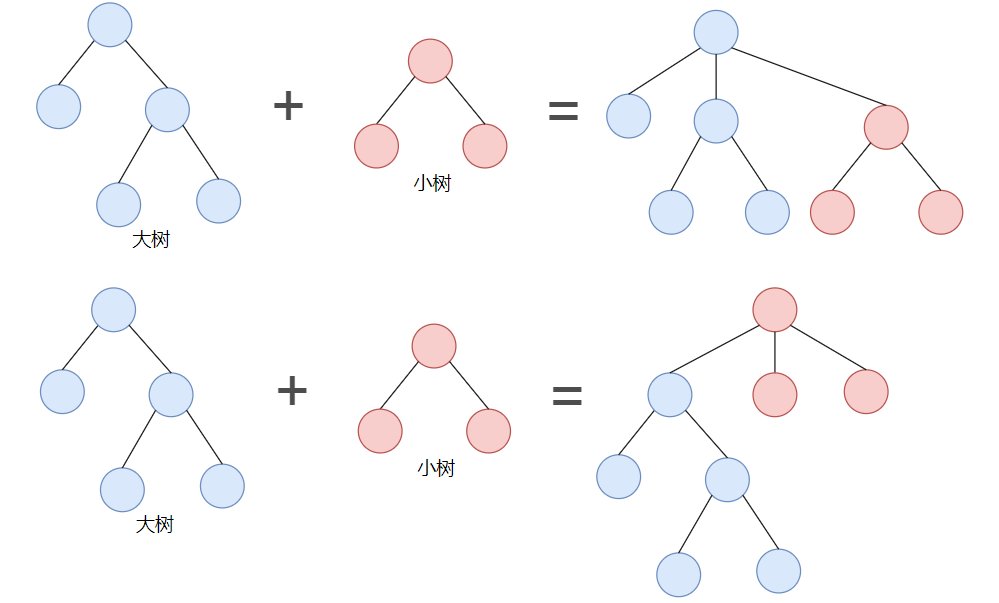

如果一棵大树和一棵小树合并，避免将大树放在小树的下面，就可以一定程度上避免更高的树，这个加权操作实现起来也相对容易。我们可以跟踪每棵树中对象的个数，然后我们通过确保将小树的根节点作为大树的根节点的子节点以维持平衡，所以，我们避免将大树放在小树下面的情况。

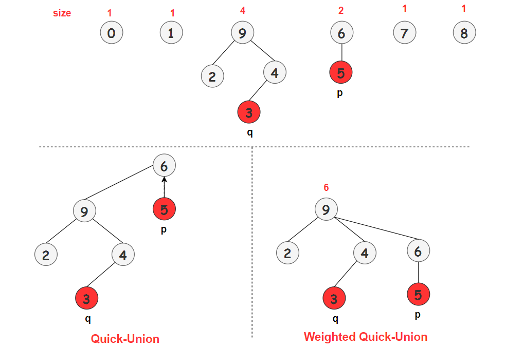

如上图所示，以 **Union(5,3)** 为例，5 的根结点为 6，3 的根结点为 9 ：

  * Quick-Union：以 9 为根结点树将作为 6 的子树
  * Weighted Quick-Union：以 6 为根结点的树将作为 9 的子树。

我们可以看一下 Weighted Quick-Union 操作的例子：

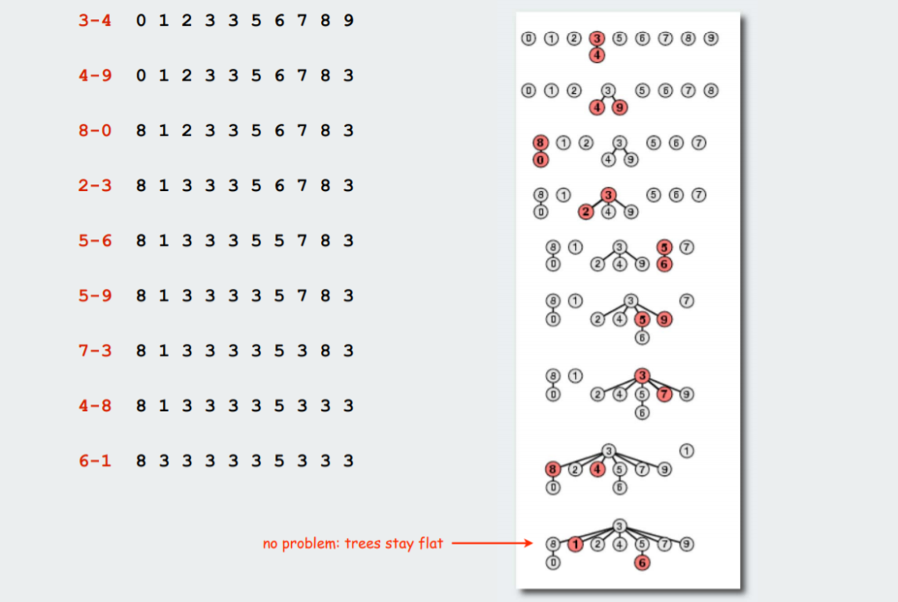

可以看到 Weighted Quick-Union 所生成的树很 “胖”，刚好满足我们的需求。

#### 实现代码

Weighted Quick-Union 的实现基本和 Quick-Union 一样，我们只需要维护一个数组 `sz[]` ，用来保存以 i 为根的树中的对象个数，比如 `sz[0] = 1` ，就表示以 0 为根的树包含 1 个对象。

```java
public class WeightedQuickUnion  
{  
    private int[] id;  
    private int[] sz;  
    public WeightedQuickUnion(int N) {  
        id = new int[N];  
        sz = new int[N];  
        for (int i = 0; i < N; i++) {  
            id[i] = i;  
            sz[i] = 1; // 初始时，每一个结点为一棵树，sz[i] = 1  
        }  
    }  
        
    private int root(int i) {  
        while (i != id[i]) i = id[i];  
        return i;  
    }  
        
    public boolean find(int p, int q) {  
        return root(p) == root(q);  
    }  
        
    public void unite(int p, int q) {  
        int i = root(p);  
        int j = root(q);  
        if (sz[i] < sz[j]) {  
            id[i] = j;  
            sz[j] += sz[i];  
        } else {  
            id[j] = i;  
            sz[i] += sz[j];  
        }  
    }  
}  
```    

#### 复杂度分析

对于加权 Quick-Union 算法处理  个对象和  条连接时最多访问  次，其中  为常数，即时间复杂度为  量级。与 Quick-Find 算法（以及某些情况下的 Quick-Union 算法）的时间复杂度  形成鲜明对比。

`Find` 操作：O(logn)

`Union` 操作：O(logn)

### Union-Find

Union-Find 算法是在 Weighted Quick-Union 的基础之上进一步优化，即路径压缩的 Weighted Quick-Union 算法。Weighted Quick-Union 算法通过对 Union 操作进行加权保证 Quick-Union 算法可能出现的 “瘦高” 情况发生。而Union-Find 算法是通过路径压缩进一步将 Weighted Quick-Union 算法的树高降低。

所谓 **路径压缩** ，就是在计算结点 **i** 的根之后，将回溯路径上的每个被检查结点的 id 设置为**root(i)**。

如下图所示，`root(9)=0` ，从结点 **9** 到根结点 **0** 的路径为 **9→6→3→1→0** ，则将**6,3,1** 的根结点设置为 **0** 。这样一来，树的高度一下子就变矮了，而且对于 **Union** 和 **Find**操作没有任何影响。

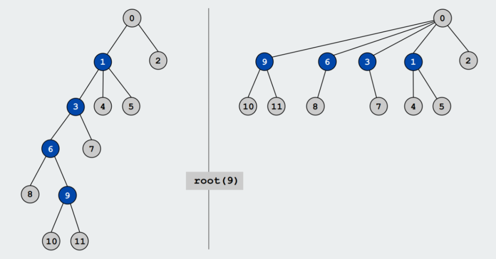

路径压缩：

  * 标准实现：在 `root()` 中添加第二个循环，将每个被遍历到的结点的的 id 设置为根结点。
    
```java
private int root(int i) {  
    int  root = i;  
    // 找到结点 i 的根结点 root  
    while (root !=  id[root]) root = id[root];  
        
    // 每个被遍历到的结点的的 id 设置为根结点 root  
    while  (i != root) {  
    int tmp = id[i];  
        id[i] = root;  
        i = tmp;  
    }  
    return root;  
}  
``` 

  * 简化的实现：使路径中的所有其他结点指向其祖父结点，即 `id[i] = id[id[i]]` 。
    
```java 
private int root(int i) {  
    while (i != id[i]) {  
        id[i] = id[id[i]]; // 简化的方法  
        i = id[i];  
    }  
    return i;  
}  
``` 

在实践中，我们没有理由不选择简化的方式，简化的方式同样可以使树几乎完全平坦，如下图所示：

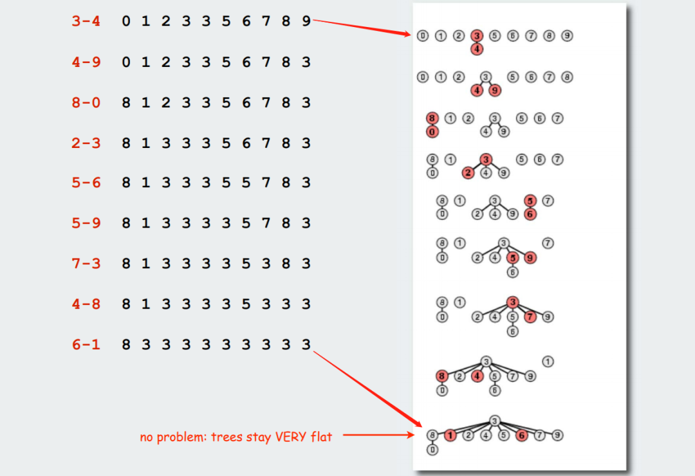

#### 复杂度分析

定理：从一个空数据结构开始，对  个对象执行  次 `Union` 和 `Find` 操作的任何序列都需要时间。时间复杂度的具体证明非常困难，但这并不妨碍算法的简单性！

路径压缩的加权 Quick-Union （**W**eigthed **Q**uick-**U**nion with **P**ath**C**ompression）算法虽是最优算法，但是并非所有操作都能在常数时间内完成。也就是，WQUPC算法的每个操作在最坏情况下（即均摊后）都不是常数级别的，而且不存在其他算法能够保证 Union-Find 算法的所有操作在均摊后都是常数级别。

#### 各类算法时间复杂度对比

<table data-tool="mdnice编辑器"><thead><tr style="border-width: 1px 0px 0px;border-right-style: initial;border-bottom-style: initial;border-left-style: initial;border-right-color: initial;border-bottom-color: initial;border-left-color: initial;border-top-style: solid;border-top-color: rgb(204, 204, 204);background-color: white;"><th style="border-top-width: 1px;border-color: rgb(204, 204, 204);background-color: rgb(240, 240, 240);text-align: center;">算法</th><th style="border-top-width: 1px;border-color: rgb(204, 204, 204);background-color: rgb(240, 240, 240);text-align: center;">Union</th><th style="border-top-width: 1px;border-color: rgb(204, 204, 204);background-color: rgb(240, 240, 240);text-align: center;">Find</th><th style="border-top-width: 1px;border-color: rgb(204, 204, 204);background-color: rgb(240, 240, 240);text-align: center;">最坏时间复杂度</th></tr></thead><tbody style="border-width: 0px;border-style: initial;border-color: initial;"><tr style="border-width: 1px 0px 0px;border-right-style: initial;border-bottom-style: initial;border-left-style: initial;border-right-color: initial;border-bottom-color: initial;border-left-color: initial;border-top-style: solid;border-top-color: rgb(204, 204, 204);background-color: white;"><td style="border-color: rgb(204, 204, 204);text-align: center;">Quick-Find</td><td style="border-color: rgb(204, 204, 204);text-align: center;">N</td><td style="border-color: rgb(204, 204, 204);text-align: center;">1</td><td style="border-color: rgb(204, 204, 204);text-align: center;word-break: break-all;">MN<br></td></tr><tr style="border-width: 1px 0px 0px;border-right-style: initial;border-bottom-style: initial;border-left-style: initial;border-right-color: initial;border-bottom-color: initial;border-left-color: initial;border-top-style: solid;border-top-color: rgb(204, 204, 204);background-color: rgb(248, 248, 248);"><td style="border-color: rgb(204, 204, 204);text-align: center;">Quick-Union</td><td style="border-color: rgb(204, 204, 204);text-align: center;">tree Height</td><td style="border-color: rgb(204, 204, 204);text-align: center;">tree Height</td><td style="border-color: rgb(204, 204, 204);text-align: center;word-break: break-all;">MN<br></td></tr><tr style="border-width: 1px 0px 0px;border-right-style: initial;border-bottom-style: initial;border-left-style: initial;border-right-color: initial;border-bottom-color: initial;border-left-color: initial;border-top-style: solid;border-top-color: rgb(204, 204, 204);background-color: white;"><td style="border-color: rgb(204, 204, 204);text-align: center;">Weighted Quick-Union</td><td style="border-color: rgb(204, 204, 204);text-align: center;">lg N</td><td style="border-color: rgb(204, 204, 204);text-align: center;">lg N</td><td style="border-color: rgb(204, 204, 204);text-align: center;word-break: break-all;">N+MlogN<br></td></tr><tr style="border-width: 1px 0px 0px;border-right-style: initial;border-bottom-style: initial;border-left-style: initial;border-right-color: initial;border-bottom-color: initial;border-left-color: initial;border-top-style: solid;border-top-color: rgb(204, 204, 204);background-color: rgb(248, 248, 248);"><td style="border-color: rgb(204, 204, 204);text-align: center;">WQUPC</td><td style="border-color: rgb(204, 204, 204);text-align: center;">Very near to 1 (amortized)</td><td style="border-color: rgb(204, 204, 204);text-align: center;">Very near to 1 (amortized)</td><td style="border-color: rgb(204, 204, 204);text-align: center;word-break: break-all;">(N+M)logN<br></td></tr></tbody></table>

对于大规模的数据，比如包含  个顶点， 条边的图，WQUPC 可以将时间从 3000 年降低到 1 分钟之内就可以处理完，而这是超级计算机也无法匹敌的。对于同一问题，使用一部手机运行的 WQUPC 轻松击败在超级计算机 上运行的Quick-Find算法，这也许就是算法的魅力。

### 并查集的应用

  * 网络连通性问题
  * 渗滤
  * 图像处理。
  * 最近公共祖先。
  * 有限状态自动机的等价性。
  * Hinley-Milner 的多态类型推断。
  * Kruskal 的最小生成树算法。
  * 游戏(围棋、十六进制)。
  * 在 Fortran 中的编译语句的等价性问题
