 
<!--BEGIN_DATA
{
    "create_date": "2019-07-21 15:16", 
    "modify_date": "2019-07-21 15:16", 
    "is_top": "0", 
    "summary": "基于Webrtc和Janus的多人视频会议系统开发", 
    "tags": "WebRTC、C/C++", 
    "file_name": "基于Webrtc和Janus的多人视频会议系统开发.md"
}
END_DATA-->

####<p>原文出处：<a href='https://blog.csdn.net/u011382962/article/details/81504789' target='blank'>基于Webrtc和Janus的多人视频会议系统开发1--系统架构</a></p>

目前业界如教育行业，直播行业，低延迟音视频连麦方案基本采用声网，即构，腾讯等第三方方案，采用第三方方案最大的优点就是接入快捷，可以迅速搭建自己的产品，缺点就是完全受制于第三方，另外费用比较高，公司规模小的时候比较合适，公司规模大了后就会有顾虑，通常达到一定规模后可以考虑自研一套方案和第三方方案并行使用，避免完全受制于第三方，和华为采购高通芯片的同时也研发自有芯片一个道理。

正是基于这样的考虑，我们开始研发自研的连麦系统，作为技术方案来说，现今支持浏览器直连基本上已经是刚需，所以webrtc是必须要兼容的，所以技术方案设计上决定是以webrtc协议为基础，支持多人会议，完全从0开始做不可取，经过对现有开源框架的研究比较后，决定在janus方案的基础上研发并逐步改进以符合需要，本系列文章就是对整改系统的研发过程的记录和总结，供大家参考。

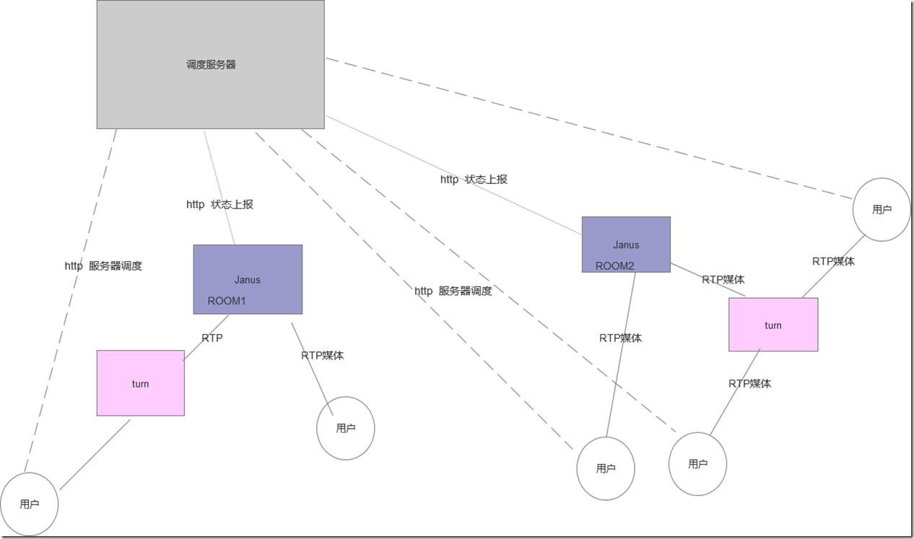

基于webrtc和janus方案的多人视频通话会议系统架构

如图所示，janus支持房间和视频分发， turn负责解决连通性问题，比如某些海外用户无法直接连到国内的janus服务时，需要走turn。

**连接步骤：**

1. 用户向调度服务器申请加入房间
2. 调度服务器查询房间所在janus，若房间已经存在直接告诉用户房间所在服务器，若房间不存在，选择一个空闲和最近的服务器创建房间并返回给用户；
3. 用户根据janus协议连指定的服务器并加入房间，发布媒体，拉取其他用户的媒体；
4. 视频通话连接完成；

**优势：**

用turn服务解决连通性问题，一个房间用户连到一台janus服务器，janus和turn都很成熟可以直接用，作为第一阶段尽快看到结果比较合适

**劣势：**

1. 存在容量问题，单个房间用户数受限一台服务器处理能力
2. 若janus在国内，国内有一个用户，国外比如南非本地有3个用户，这三个用户都需要到国内走一圈获取到其他2人的数据，无法智能本地获取；
3. Janus的房间概念让系统设计不太灵活，不太合适按需获取


虽然有些劣势，不过做为第一阶段尽快出成果来说，这个方案是比较合适的，只需要少量的工作即可看到成功：

1. 调度服务器，先实现简单的案容量来调度以及房间服务器的映射查询；
2. Janus服务器改造，上报自身状况，供调度服务器调度决策
3. Janus客服端SDK，当前Janus提供了web接入，android和ios接入demo代码，都能顺利连通，很遗憾的是翻遍整个网络，没有找到windows和Mac下的c++接入demo， 所以这块是先阶段的重点和难点，因为我们的产品windows原生客户端是很重要的一环。

调度服务器和Janus服务器状态上报都很简单在此不多讲，后续几篇文章主要讲如何开发windows和mac下的原生c++的janus客户端SDK.


<hr>


####<p>原文出处：<a href='https://blog.csdn.net/u011382962/article/details/81507131' target='blank'>基于Webrtc和Janus的多人视频会议系统开发2---Janus建立连接过程的角色关系图</a></p>

本篇文章开始讲解如何开发windows和mac下的原生c++的janus客户端SDK。

项目组几个人搜编百度，谷歌，bing，一直没找到Janus的c++原生SDK的demo，只有ios,android和web的demo, 但是我们windows和Mac下都要支持原生APP的SDK接入，最后无奈之下只好自己动手丰衣足食。

根据资料参考，webrtc源码的example下有个peerconnection\_client和peerconnection\_server， 可以演示c++ 的webrtc视频p2p通话，只要这个连通了，在加上Janus协议的支持，应该就可以支持janus的C++客户端，不过开始时是对整个连通过程一头雾水，下图是正确的客户端和Janus服务器关系的正确关系，帮助初入坑的兄弟们理解：

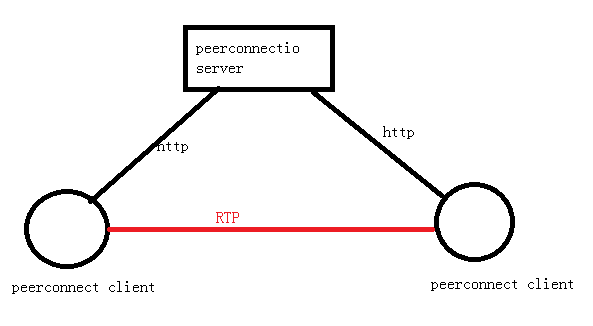

此图是peerconnection双方的连接过程，server其实是提供了个http服务，两个客户端使用http接口通过server交换sdp，达到相互建立连接的目的（对sdp不了解的可以百度下，可以说webrtc建立连接的过程就是如何得到对方的sdp以及把自己的sdp发给对方的过程），连接建立后双方就直接建立连接互发RTP包了， 大家注意角色，然后对比下janus的客户端服务器关系图。

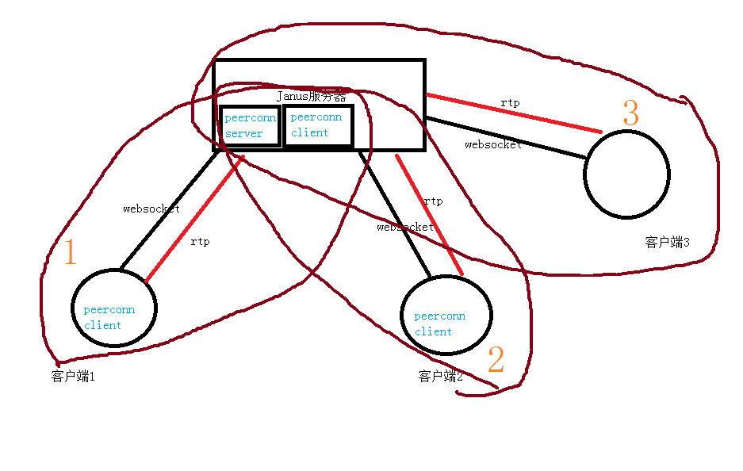

在Janus客户端1和客户端2连接，如果理解成客户端1就是peerconnection例子了的client1，客户端2就是client2，Janus对应peerconnection图里的server那就理解错误了， 如图所示，事实上上图包含了3个完整的peerconnection过程，Janus不仅扮演了peerconnection例子里的server功能， 用于帮助交换sdp，同时还扮演了peerconnection client功能，接受客户端的RTP媒体，而peerconnection例子里的server实际只有信令交换功能，不处理媒体流的。

为何这么做呢？

因为janus要实现多人视频，帮助客户端1的媒体流转发给多个其他客户端， 如果客户端1的媒体流直接发给客户端2，客户端3的话，有多少个参会人，客户端1就要上行多少路媒体流，无论性能和带宽都吃不消，现在先通过一个完整的peerconnection过程将媒体流发到Janus后，对客户端1来说所有的过程就结束了，媒体流怎么发到客户端2，客户端3他不关心，那是Janus和客户端2和客户端3之间的事情， 是另外的peerconnection过程的事情。

理解了这个原理，才能理解后续的接入过程。下一篇文章开始讲解如何改造peerconnection例程。


<hr>


####<p>原文出处：<a href='https://blog.csdn.net/u011382962/article/details/81706804' target='blank'>基于Webrtc和Janus的多人视频会议系统开发3 - Peerconnection从ninja工程改造成VS工程</a></p>


之所以要专门写这一章，是因为这一步卡了不少时间，遇到不少问题，写出来给大家做参考。在做这一步之前您至少要已经完成webrtc在windows下的编译，这个编译的介绍文章比较多，这里就不说了。

在自己改造前，也是参考了这篇文章：

<https://www.cnblogs.com/CoderTian/p/7828926.html>

根据这个博主留下的下载地址下下来的工程确实能编译通过，可行博主只提供了x64的库，我用我自己编的32为库和博主的工程搭配，始终链接不过，另外该博主的工程里需求另外加入libYUV和json等源码到工程了，而实际上这些东西在webrtc工程里都已经有了。

试了很多方法不行后，最后想ninja工程都能链接生成成功，没理由缺库的，灵机一动，用文本编辑器打开

	out\Debug\obj\examples\peerconnection_client.ninja

看到里面一大堆link的.lib库，copy出来整理下就可以啦，花了不少功夫，方便大家，贴在这里：

```
#pragma comment(lib, "../../webrtc_src/out/Debug/obj/webrtc.lib")  
#pragma comment(lib,
"../../webrtc_src/out/Debug/obj/api/libjingle_peerconnection_api.lib")  
#pragma comment(lib,
"../../webrtc_src/out/Debug/obj/media/rtc_media_base.lib")  
#pragma comment(lib, "../../webrtc_src/out/Debug/obj/api/audio_codecs/builtin_
audio_decoder_factory.lib")  
#pragma comment(lib, "../../webrtc_src/out/Debug/obj/api/audio_codecs/builtin_
audio_encoder_factory.lib")  
#pragma comment(lib,
"../../webrtc_src/out/Debug/obj/media/rtc_audio_video.lib")  
#pragma comment(lib, "../../webrtc_src/out/Debug/obj/modules/video_capture/vid
eo_capture_module.lib")  
#pragma comment(lib, "../../webrtc_src/out/Debug/obj/rtc_base/rtc_base.lib")  
#pragma comment(lib, "../../webrtc_src/out/Debug/obj/webrtc_common.lib")  
#pragma comment(lib,
"../../webrtc_src/out/Debug/obj/rtc_base/rtc_base_generic.lib")  
#pragma comment(lib,
"../../webrtc_src/out/Debug/obj/third_party/boringssl/boringssl.lib")  
#pragma comment(lib,
"../../webrtc_src/out/Debug/obj/third_party/boringssl/boringssl_asm.lib")  
#pragma comment(lib,
"../../webrtc_src/out/Debug/obj/third_party/libyuv/libyuv_internal.lib")  
#pragma comment(lib,
"../../webrtc_src/out/Debug/obj/third_party/libjpeg_turbo/libjpeg.lib")  
#pragma comment(lib,
"../../webrtc_src/out/Debug/obj/third_party/libjpeg_turbo/simd.lib")  
#pragma comment(lib,
"../../webrtc_src/out/Debug/obj/third_party/libjpeg_turbo/simd_asm.lib")  
#pragma comment(lib,
"../../webrtc_src/out/Debug/obj/common_video/common_video.lib")  
#pragma comment(lib,
"../../webrtc_src/out/Debug/obj/system_wrappers/system_wrappers.lib")  
#pragma comment(lib,
"../../webrtc_src/out/Debug/obj/rtc_base/rtc_numerics.lib")  
#pragma comment(lib,
"../../webrtc_src/out/Debug/obj/common_audio/common_audio.lib")  
#pragma comment(lib,
"../../webrtc_src/out/Debug/obj/third_party/openmax_dl/dl/dl.lib")  
#pragma comment(lib,
"../../webrtc_src/out/Debug/obj/common_audio/common_audio_sse2.lib")  
#pragma comment(lib,
"../../webrtc_src/out/Debug/obj/modules/utility/utility.lib")  
#pragma comment(lib, "../../webrtc_src/out/Debug/obj/modules/audio_processing/
audio_processing.lib")  
#pragma comment(lib,
"../../webrtc_src/out/Debug/obj/audio/utility/audio_frame_operations.lib")  
#pragma comment(lib, "../../webrtc_src/out/Debug/obj/modules/audio_coding/audi
o_format_conversion.lib")  
#pragma comment(lib,
"../../webrtc_src/out/Debug/obj/third_party/protobuf/protobuf_lite.lib")  
#pragma comment(lib,
"../../webrtc_src/out/Debug/obj/modules/audio_processing/vad/vad.lib")  
#pragma comment(lib,
"../../webrtc_src/out/Debug/obj/modules/audio_coding/isac.lib")  
#pragma comment(lib,
"../../webrtc_src/out/Debug/obj/modules/audio_coding/isac_c.lib")  
#pragma comment(lib,
"../../webrtc_src/out/Debug/obj/modules/audio_coding/isac_common.lib")  
#pragma comment(lib, "../../webrtc_src/out/Debug/obj/modules/audio_processing/
audioproc_debug_proto.lib")  
#pragma comment(lib, "../../webrtc_src/out/Debug/obj/p2p/libstunprober.lib")  
#pragma comment(lib, "../../webrtc_src/out/Debug/obj/p2p/rtc_p2p.lib")  
#pragma comment(lib,
"../../webrtc_src/out/Debug/obj/api/audio_codecs/L16/audio_decoder_L16.lib")  
#pragma comment(lib,
"../../webrtc_src/out/Debug/obj/modules/audio_coding/pcm16b.lib")  
#pragma comment(lib,
"../../webrtc_src/out/Debug/obj/modules/audio_coding/g711.lib")  
#pragma comment(lib, "../../webrtc_src/out/Debug/obj/modules/audio_coding/lega
cy_encoded_audio_frame.lib")  
#pragma comment(lib,
"../../webrtc_src/out/Debug/obj/api/audio_codecs/g711/audio_decoder_g711.lib")  
#pragma comment(lib,
"../../webrtc_src/out/Debug/obj/api/audio_codecs/g722/audio_decoder_g722.lib")  
#pragma comment(lib,
"../../webrtc_src/out/Debug/obj/modules/audio_coding/g722.lib")  
#pragma comment(lib, "../../webrtc_src/out/Debug/obj/api/audio_codecs/isac/aud
io_decoder_isac_float.lib")  
#pragma comment(lib,
"../../webrtc_src/out/Debug/obj/api/audio_codecs/ilbc/audio_decoder_ilbc.lib")  
#pragma comment(lib,
"../../webrtc_src/out/Debug/obj/modules/audio_coding/ilbc.lib")  
#pragma comment(lib,
"../../webrtc_src/out/Debug/obj/api/audio_codecs/opus/audio_decoder_opus.lib")  
#pragma comment(lib,
"../../webrtc_src/out/Debug/obj/modules/audio_coding/webrtc_opus.lib")  
#pragma comment(lib,
"../../webrtc_src/out/Debug/obj/third_party/opus/opus.lib")  
#pragma comment(lib, "../../webrtc_src/out/Debug/obj/modules/audio_coding/audi
o_network_adaptor.lib")  
#pragma comment(lib, "../../webrtc_src/out/Debug/obj/modules/audio_coding/audi
o_network_adaptor_config.lib")  
#pragma comment(lib,
"../../webrtc_src/out/Debug/obj/modules/audio_coding/ana_config_proto.lib")  
#pragma comment(lib, "../../webrtc_src/out/Debug/obj/modules/audio_coding/ana_
debug_dump_proto.lib")  
#pragma comment(lib, "../../webrtc_src/out/Debug/obj/api/audio_codecs/opus/aud
io_encoder_opus_config.lib")  
#pragma comment(lib,
"../../webrtc_src/out/Debug/obj/api/audio_codecs/L16/audio_encoder_L16.lib")  
#pragma comment(lib,
"../../webrtc_src/out/Debug/obj/api/audio_codecs/g711/audio_encoder_g711.lib")  
#pragma comment(lib,
"../../webrtc_src/out/Debug/obj/api/audio_codecs/g722/audio_encoder_g722.lib")  
#pragma comment(lib, "../../webrtc_src/out/Debug/obj/api/audio_codecs/isac/aud
io_encoder_isac_float.lib")  
#pragma comment(lib,
"../../webrtc_src/out/Debug/obj/api/audio_codecs/ilbc/audio_encoder_ilbc.lib")  
#pragma comment(lib,
"../../webrtc_src/out/Debug/obj/modules/video_coding/video_coding.lib")  
#pragma comment(lib,
"../../webrtc_src/out/Debug/obj/modules/video_coding/webrtc_i420.lib")  
#pragma comment(lib,
"../../webrtc_src/out/Debug/obj/modules/rtp_rtcp/rtp_rtcp.lib")  
#pragma comment(lib, "../../webrtc_src/out/Debug/obj/modules/remote_bitrate_es
timator/remote_bitrate_estimator.lib")  
#pragma comment(lib,
"../../webrtc_src/out/Debug/obj/modules/video_coding/webrtc_vp8.lib")  
#pragma comment(lib,
"../../webrtc_src/out/Debug/obj/modules/video_coding/webrtc_vp8_helpers.lib")  
#pragma comment(lib,
"../../webrtc_src/out/Debug/obj/third_party/libvpx/libvpx.lib")  
#pragma comment(lib,
"../../webrtc_src/out/Debug/obj/third_party/libvpx/libvpx_yasm.lib")  
#pragma comment(lib,
"../../webrtc_src/out/Debug/obj/modules/video_coding/webrtc_vp9.lib")  
#pragma comment(lib,
"../../webrtc_src/out/Debug/obj/modules/video_coding/webrtc_vp9_helpers.lib")  
#pragma comment(lib,
"../../webrtc_src/out/Debug/obj/modules/video_coding/encoded_frame.lib")  
#pragma comment(lib,
"../../webrtc_src/out/Debug/obj/rtc_base/experiments/alr_experiment.lib")  
#pragma comment(lib,
"../../webrtc_src/out/Debug/obj/modules/video_coding/webrtc_h264.lib")  
#pragma comment(lib, "../../webrtc_src/out/Debug/obj/third_party/winsdk_sample
s/winsdk_samples.lib")  
#pragma comment(lib,
"../../webrtc_src/out/Debug/obj/media/rtc_internal_video_codecs.lib")  
#pragma comment(lib, "../../webrtc_src/out/Debug/obj/media/rtc_constants.lib")  
#pragma comment(lib,
"../../webrtc_src/out/Debug/obj/media/rtc_software_fallback_wrappers.lib")  
#pragma comment(lib,
"../../webrtc_src/out/Debug/obj/modules/video_coding/webrtc_multiplex.lib")  
#pragma comment(lib, "../../webrtc_src/out/Debug/obj/call/call.lib")  
#pragma comment(lib, "../../webrtc_src/out/Debug/obj/modules/bitrate_controlle
r/bitrate_controller.lib")  
#pragma comment(lib,
"../../webrtc_src/out/Debug/obj/modules/pacing/pacing.lib")  
#pragma comment(lib, "../../webrtc_src/out/Debug/obj/modules/congestion_contro
ller/congestion_controller.lib")  
#pragma comment(lib, "../../webrtc_src/out/Debug/obj/modules/congestion_contro
ller/transport_feedback.lib")  
#pragma comment(lib, "../../webrtc_src/out/Debug/obj/modules/congestion_contro
ller/network_control/network_control.lib")  
#pragma comment(lib, "../../webrtc_src/out/Debug/obj/modules/congestion_contro
ller/rtp/congestion_controller.lib")  
#pragma comment(lib, "../../webrtc_src/out/Debug/obj/modules/congestion_contro
ller/rtp/transport_feedback.lib")  
#pragma comment(lib, "../../webrtc_src/out/Debug/obj/rtc_base/experiments/cong
estion_controller_experiment.lib")  
#pragma comment(lib,
"../../webrtc_src/out/Debug/obj/modules/congestion_controller/bbr/bbr.lib")  
#pragma comment(lib, "../../webrtc_src/out/Debug/obj/modules/congestion_contro
ller/goog_cc/goog_cc.lib")  
#pragma comment(lib, "../../webrtc_src/out/Debug/obj/audio/audio.lib")  
#pragma comment(lib,
"../../webrtc_src/out/Debug/obj/modules/audio_processing/aec3/aec3.lib")  
#pragma comment(lib,
"../../webrtc_src/out/Debug/obj/modules/audio_coding/audio_coding.lib")  
#pragma comment(lib,
"../../webrtc_src/out/Debug/obj/modules/audio_coding/cng.lib")  
#pragma comment(lib,
"../../webrtc_src/out/Debug/obj/modules/audio_coding/red.lib")  
#pragma comment(lib,
"../../webrtc_src/out/Debug/obj/modules/audio_coding/neteq.lib")  
#pragma comment(lib,
"../../webrtc_src/out/Debug/obj/modules/audio_coding/rent_a_codec.lib")  
#pragma comment(lib, "../../webrtc_src/out/Debug/obj/video/video.lib")  
#pragma comment(lib, "../../webrtc_src/out/Debug/obj/modules/video_processing/
video_processing.lib")  
#pragma comment(lib, "../../webrtc_src/out/Debug/obj/modules/video_processing/
video_processing_sse2.lib")  
#pragma comment(lib, "../../webrtc_src/out/Debug/obj/rtc_base/weak_ptr.lib")  
#pragma comment(lib,
"../../webrtc_src/out/Debug/obj/modules/audio_mixer/audio_mixer_impl.lib")  
#pragma comment(lib, "../../webrtc_src/out/Debug/obj/modules/audio_mixer/audio
_frame_manipulator.lib")  
#pragma comment(lib, "../../webrtc_src/out/Debug/obj/pc/rtc_pc_base.lib")  
#pragma comment(lib, "../../webrtc_src/out/Debug/obj/media/rtc_data.lib")  
#pragma comment(lib,
"../../webrtc_src/out/Debug/obj/third_party/usrsctp/usrsctp.lib")  
#pragma comment(lib,
"../../webrtc_src/out/Debug/obj/third_party/libsrtp/libsrtp.lib")  
#pragma comment(lib,
"../../webrtc_src/out/Debug/obj/pc/create_pc_factory.lib")  
#pragma comment(lib,
"../../webrtc_src/out/Debug/obj/logging/rtc_event_log_impl_base.lib")  
#pragma comment(lib,
"../../webrtc_src/out/Debug/obj/logging/rtc_event_log_impl_encoder.lib")  
#pragma comment(lib,
"../../webrtc_src/out/Debug/obj/logging/rtc_event_log_proto.lib")  
#pragma comment(lib, "../../webrtc_src/out/Debug/obj/pc/peerconnection.lib")  
#pragma comment(lib, "../../webrtc_src/out/Debug/obj/stats/rtc_stats.lib")  
#pragma comment(lib, "Winmm.lib")  
#pragma comment(lib, "strmiids.lib")  
#pragma comment(lib, "IPHLPAPI.lib")  
#pragma comment(lib, "Psapi.lib")  
#pragma comment(lib, "Secur32.lib")  
#pragma comment(lib, "libs/x86/websocketsd_static.lib")  
#pragma comment(lib, "libs/x86/zlib_internald.lib")

```

还要加系统lib： ws2_32.lib;msdmo.lib;dmoguids.lib;wmcodecdspuuid.lib;

**需要注意问题1：**peerconnection的代码一定要用配套的webrtc的example里的，我用从别人那下的peerconnection配套自己的webrtc版本，编译错误花了不少时间

**需要注意问题2: **VS工程配置里的平台工具集一定要和ninja编译时指定的一致。


<hr>


####<p>原文出处：<a href='https://blog.csdn.net/u011382962/article/details/81708519' target='blank'>基于Webrtc和Janus的多人视频会议系统开发4 - 改造信令交互系统完成sdp交换过程</a></p>

大家都知道webrtc双方完成连接，最重要的就是要双方完成sdp的交换，google没有对这个如何完成这个sdp交互做出规定，这个sdp即使通过邮件交换也行，当然我们要做一个会议系统SDK肯定要智能一点，需要向用户隐藏这个sdp交互过程。

在webrtc的例子peerconnection\_client和peerconnection\_server里，通过用peerconnection\_server做一个http服务器，两个peerconnection\_client调用http接口完成sdp和icecandidate的交换，在基于Webrtc和Janus的多人视频会议系统开发1-系统架构里，已经说明，在用Janus服务器实现webrtc多人视频会议时，对每一个客户端和Janus的连接，客户端扮演example里peerconnection\_client的角色，Janus同时扮演peerconnection\_server和peerconnection\_client的角色，我们的目标是要将自己的视频发布到Jannus服务器，发到Janus后，后续的转发是另外一个拉取的过程，这个在后续文章中说明。

因此我们首先需要将peerconnection例子里http接口，改造成Janus用的websocket接口，websocket怎么连就不具体说了，重点讲连接后的信令过程，其实就是Janus的信令交换协议，限于篇幅，本章只列出协议过程：

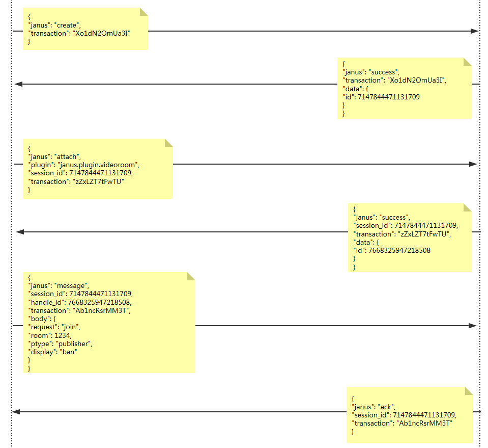

 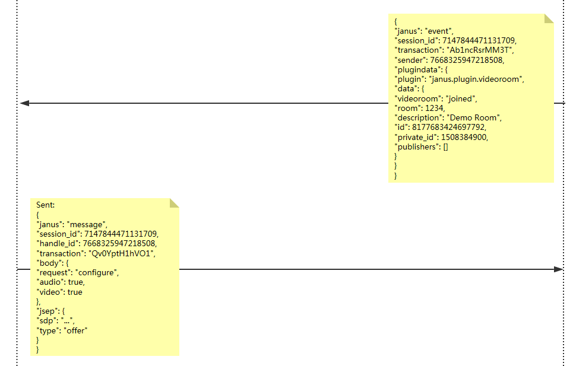

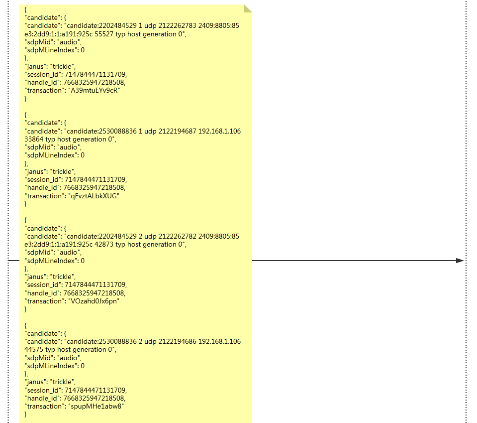

 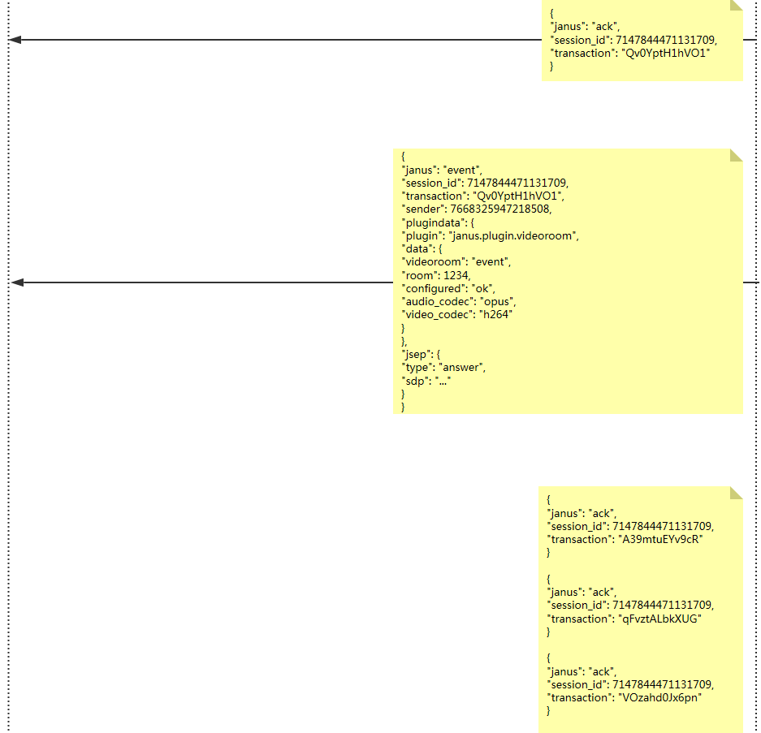

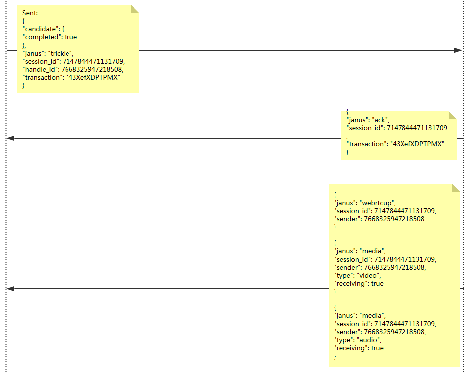

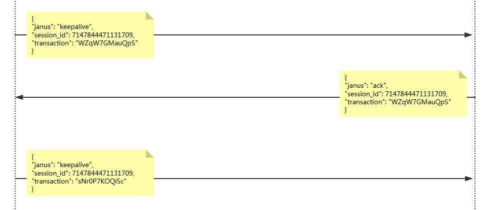


<hr>


####<p>原文出处：<a href='https://blog.csdn.net/u011382962/article/details/82180337' target='blank'> 基于Webrtc和Janus的多人视频会议系统开发5 - 发布媒体流到Janus服务器 </a></p>

前面一章讲述了客户端和Janus之间是如何通过信令完成sdp交互的，信令虽然看起来都懂，但初始接触webrtc的话，对sdp生成，ice作用和过程等都一头雾水，刚开始我也是花了不少时间来理解这个过程，当初信令都正确，但是其他web订阅端就是看不到我这个windows下SDK发布的媒体流。

发布过程的create, attach, join信令过程都很简单也很好理解,需要注意的就是join信令，需要设置自己的角色为 publisher

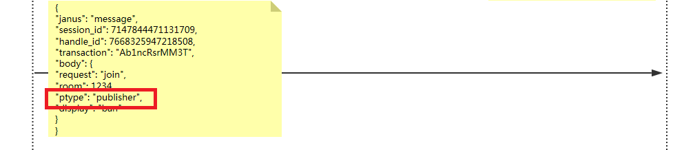

join成功后，会收到janus告知当前room都有些谁在发布视频流，就不多说了，现在是关键一步，告知janus自己的sdp, 所以发信令前需呀先获取自己的sdp，幸好如何生成sdp，webrtc都帮我们做了，只要调用webrtc::PeerConnectionInterface::CreateOffer(CreateSessionDescriptionObserver* observer,const MediaConstraintsInterface*
constraints);接口即可在回调接口CreateSessionDescriptionObserver\*的函数void
OnSuccess(SessionDescriptionInterface\* desc)里收到SDP，
当然，在调用CreateOffer前，需要先初始化PeerConnection,添加自己的音频视频，下面是关键代码：

```
bool myRtcConnection::InitializePeerConnection()  
{  
    //RTC_DCHECK(peer_connection_factory_.get() == NULL);  
    if (peer_connection_factory_.get() != NULL)  
        return true;

    peer_connection_factory_ = webrtc::CreatePeerConnectionFactory(  
        webrtc::CreateBuiltinAudioEncoderFactory(),  
        webrtc::CreateBuiltinAudioDecoderFactory());

    if (!peer_connection_factory_.get()) {  
        //rtcobserver_->MessageBox("Error",  "Failed to initialize
PeerConnectionFactory", true);  
        DeletePeerConnection();  
        return false;  
    }

    if (!CreatePeerConnection(DTLS_ON)) {  
        //rtcobserver_->MessageBox("Error",    "CreatePeerConnection failed",
true);  
        DeletePeerConnection();  
    }  
    //AddStreams();  
    return peer_connection_.get() != NULL;  
}

bool  myRtcConnection::PublishStream()  
{  
    if (InitializePeerConnection()) {  
        AddStreams();  
        peer_connection_->CreateOffer(this, NULL);  
        return true;  
    }  
    else {  
        return false;  
    }  
}
```

具体的函数在webrtc的peerconnection_client里都有，我们在CreateOffer的回调里发送sdp给Janus:

```
void myRtcConnection::OnSuccess(webrtc::SessionDescriptionInterface* desc)  
{  
    peer_connection_->SetLocalDescription(DummySetSessionDescriptionObserver::
Create(), desc);

    SdpType type = desc->GetType();  
    std::string sdp;  
    desc->ToString(&sdp);

    ///////send sdp to janus  
    janus_websocket_->configure(handleid_, sdp);

}
```

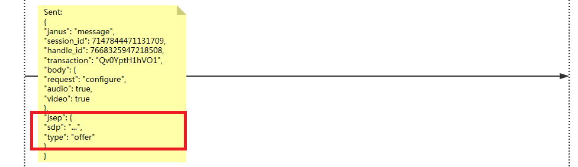

注意发布端的sdp type是offer，同步进行的是ice过程，ice过程是什么时候触发的呢？答案是CreatePeerConnection的时候触发的，
看下CreatePeerConnection函数定义：

```
bool myRtcConnection::CreatePeerConnection(bool dtls) {  
    RTC_DCHECK(peer_connection_factory_.get() != NULL);

    webrtc::PeerConnectionInterface::RTCConfiguration config;  
    webrtc::PeerConnectionInterface::IceServer server;  
    server.uri = GetPeerConnectionString();  
    config.servers.push_back(server);

    webrtc::FakeConstraints constraints;  
    if (dtls) {  
		constraints.AddOptional(webrtc::MediaConstraintsInterface::kEnableDtlsSrtp,  
            "true");  
    }  
    else {  
		constraints.AddOptional(webrtc::MediaConstraintsInterface::kEnableDtlsSrtp,  
            "false");  
    }

	peer_connection_ = peer_connection_factory_->CreatePeerConnection(  
        config, &constraints, NULL, NULL, this);  
    return peer_connection_.get() != NULL;  
}
```
如上代码CreatePeerConnection的时候，传入了this指针，因为myRtcConnection实现了PeerConnectionObserver，这个接口是ice过程的回调接口,我们在回调接口收到ice时，通过信令发送给Janus即可：

```
void myRtcConnection::OnIceCandidate(const webrtc::IceCandidateInterface*
candidate)  
{  
    RTC_LOG(INFO) << __FUNCTION__ << " " << candidate->sdp_mline_index();

    std::string sdp;  
    if (!candidate->ToString(&sdp)) {  
        RTC_LOG(LS_ERROR) << "Failed to serialize candidate";  
        return;  
    }  
  
    std::string sdp_mid = candidate->sdp_mid();  
    int sdp_mlineindex = candidate->sdp_mline_index();

    //////send candicate to janus  
    janus_websocket_->send_candidate(handleid_, sdp_mlineindex, sdp_mid, sdp);  
}
```

对应的信令过程：

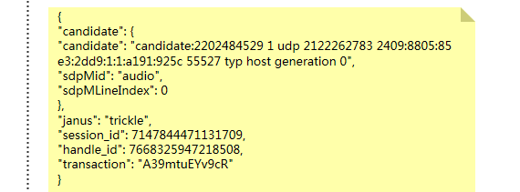

需要注意的是，我们需要在ice完成的时候发一条ice结束信令给janus：

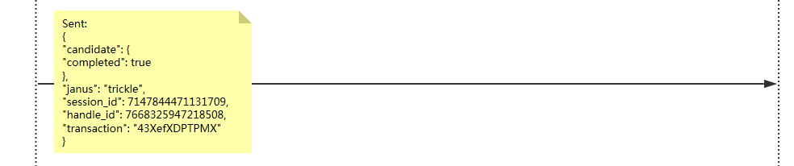

这是什么时候发送呢？

```
void myRtcConnection::OnIceGatheringChange(  
    webrtc::PeerConnectionInterface::IceGatheringState new_state)  
{  
    switch (new_state)  
    {  
    case webrtc::PeerConnectionInterface::kIceGatheringNew:  
        break;  
    case webrtc::PeerConnectionInterface::kIceGatheringGathering:  
        break;  
    case webrtc::PeerConnectionInterface::kIceGatheringComplete:  
    {  
        janus_websocket_->send_candidate_complete(handleid_);
    }  
    break;  
    default:  
        break;  
    }  
}
```

通过上述过程，我们就把自己的sdp和ice信息发送给了janus服务器，但是只是把自己的发给对方还不够，还需要获取jansu的sdp和ice信息，所以我们需要吃力websocket收到的sdp和ice信息，将这些信息告诉webrtc:

```
void myRtcConnection::onJanusPeerSdp(std::string sdptype, std::string sdp)  
{  
    webrtc::SdpParseError error;  
    rtc::Optional<SdpType> type_maybe = webrtc::SdpTypeFromString(sdptype);  
    if (!type_maybe) {  
        RTC_LOG(LS_ERROR) << "Unknown SDP type: " << sdptype;  
        return;  
    }  
    SdpType type = *type_maybe;

    if (!InitializePeerConnection())  
    {  
        ///onError callback  
        return;  
    }

    std::unique_ptr<webrtc::SessionDescriptionInterface> session_description =
webrtc::CreateSessionDescription(type, sdp, &error);  
    if (!session_description) {  
        RTC_LOG(WARNING) << "Can't parse received session description message."  
            << "SdpParseError was: " << error.description;  
        return;  
    }  
    RTC_LOG(INFO) << " Received session description :" << sdp;  
	peer_connection_->SetRemoteDescription(DummySetSessionDescriptionObserver::Create(), session_description.release());
}
```

最重要的就是调用SetRemoteDescription告知webrtc, ice也一样：

```
void myRtcConnection::onJanusIceCandidate( std::string sdp, std::string
sdp_mid, int sdp_mlineindex)  
{  
    webrtc::SdpParseError error;  
    std::unique_ptr<webrtc::IceCandidateInterface> candidate(  
        webrtc::CreateIceCandidate(sdp_mid, sdp_mlineindex, sdp, &error));  
    if (!candidate.get()) {  
        RTC_LOG(WARNING) << "Can't parse received candidate message. "  
            << "SdpParseError was: " << error.description;  
        return;  
    }  
    if (!peer_connection_->AddIceCandidate(candidate.get())) {  
        RTC_LOG(WARNING) << "Failed to apply the received candidate";  
        return;  
    }  
}
```

到这里，webrtc就可以开始向对方发媒体流数据了，在janus的web测试端可以看到您发布的视频流了。


<hr>


####<p>原文出处：<a href='https://blog.csdn.net/u011382962/article/details/86737076' target='blank'>基于Webrtc和Janus的多人视频会议系统开发6 - 从Janus服务器订阅媒体流</a></p>

由于前段时间一直忙于开发，没有及时记录开发过程中遇到的问题，现在只能靠回忆来写一些印象深刻的坑了，本篇文章先把本系列的最后一篇补上，前面只是做到了把流推上去，现在还需要把流订阅下来。

记得当时是遇到几个问题的，其中一个是订阅其他流后，自己发布的视频就没有声音了，其他问题已经记不清楚了，大家如果遇到什么问题说下说不定能帮助想起了。

感接时有点疑惑，推流时已经建立了peerconnection，收流时是不是可以直接用这个connection就行了，查了些资料，如果只是两个人通讯确实可行，不过对于我们这个需要拉多个人视频的就不合适了，出发在connection上加上区分流所属用户字段，那就复杂了也没比较，janus也不支持，所以实际的peerconnection是这样的：

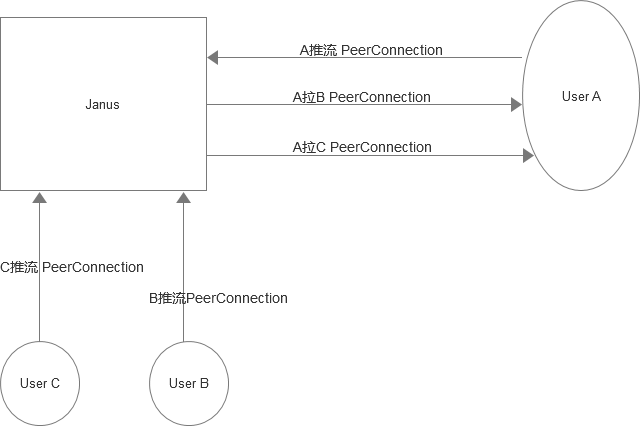

推流的peerconnection归推流，拉流的peerconnection归拉流，互补相干.

你在连接Janus，join到一个房间后，如果有另外一个用户publish流成功，你会收到一个信令告诉你有人发布媒体了，并告诉你详细信息，这时发起一个subscribe必须要把该用户的streamname带上，这个是关键，关键，关键，只有这样Janus才知道这个peerconnection是要发该用户的数据的。

Janus收到该信令后，会发起createoffer流程，等待该信令把Janus的SDP发过来，然后我们再回复里把answer的SDP回复过去(publish是我们发offer，Janus回answer)，就完成了SDP的交换:

    
    void KKRtcConnection::onJanusPeerSdp(std::string sdptype, std::string sdp)
    {
    	webrtc::SdpParseError error;
    	rtc::Optional<SdpType> type_maybe = webrtc::SdpTypeFromString(sdptype);
    	if (!type_maybe) {
    		RTC_LOG(LS_ERROR) << "Unknown SDP type: " << sdptype;
    		return;
    	}
    	SdpType type = *type_maybe;
    	if (!InitializePeerConnection())
    	{
    		///onError callback
    		return;
    	}
    	std::unique_ptr<webrtc::SessionDescriptionInterface> session_description = webrtc::CreateSessionDescription(type, sdp, &error);
    	if (!session_description) {
    		blog(emLOG_WARNING, "%s Can't parse received session description message. SdpParseError was: %s",__func__ ,error.description.c_str() );
    		return;
    	}
    	blog(emLOG_INFO, "%s Received session description ",__func__);
    	peer_connection_->SetRemoteDescription(DummySetSessionDescriptionObserver::Create(), session_description.release());
    	if (type == SdpType::kOffer) {
    		peer_connection_->CreateAnswer(this, NULL);
    	}
    #ifdef DEBUG_LOG
    	blog(emLOG_INFO, " curthreadId:%u   %s  proccess  end(%d) handleId=%d", rtc::CurrentThreadId(), __func__, __LINE__,handleid_);
    #endif
    }

然后是创建初始化peerconnection来收集ICE：

    
    
	peer_connection_factory_ = webrtc::CreatePeerConnectionFactory(rtc::Thread::Current(),	rtc::Thread::Current(),
		reinterpret_cast<webrtc::AudioDeviceModule *>(adm_.get()),
		webrtc::CreateBuiltinAudioEncoderFactory(),
		webrtc::CreateBuiltinAudioDecoderFactory(), 
		NULL,NULL);
	webrtc::PeerConnectionInterface::RTCConfiguration config;
	webrtc::FakeConstraints constraints;
	if (dtls) 
	{
		constraints.AddOptional(webrtc::MediaConstraintsInterface::kEnableDtlsSrtp,	"true");
	}
	else 
	{
		constraints.AddOptional(webrtc::MediaConstraintsInterface::kEnableDtlsSrtp,	"false");
	}
	constraints.AddOptional(webrtc::MediaConstraintsInterface::kCpuOveruseDetection, "false");
	peer_connection_ = peer_connection_factory_->CreatePeerConnection(config, &constraints, NULL, NULL, this);
	auto ptr = new rtc::RefCountedObject<KKRTCStatus>();
	peer_connection_->GetStats(ptr);

CreatePeerConnection调用设置了回调接口PeerConnectionObserver的实现类this,
调用后每次ICE状态回调，主要这三个函数就可以了：

OnIceCandidate

OnIceGatheringChange

OnAddStream

在OnIceCandidate把IceCandidate信令发给Janus, 在OnIceGatheringChange把IceComplete信令发给Janus,

OnAddStream里设置remote帧来了后的回调处理类：

    
    
    void KKRtcConnection::OnAddStream(	rtc::scoped_refptr<webrtc::MediaStreamInterface> stream) 
    {
    #ifdef DEBUG_LOG
    	blog(emLOG_INFO,"%s  %d", __func__ ,stream->id() );	
    #endif
    	webrtc::VideoTrackVector tracks = stream->GetVideoTracks();
    	// Only render the first track.
    	if (!tracks.empty()) {
    		webrtc::VideoTrackInterface* track = tracks[0];
    		rendered_track_ = track;
    		rendered_track_->AddOrUpdateSink(this, rtc::VideoSinkWants());
    	}
    	stream->Release();
    #ifdef DEBUG_LOG
    	blog(emLOG_INFO, " curthreadId:%u   %s  proccess  end(%d) handleId=%d", rtc::CurrentThreadId(), __func__, __LINE__, handleid_);
    #endif
    }

然后在帧回调里处理对方的帧预览就可以啦。


<hr>


####<p>原文出处：<a href='https://blog.csdn.net/u011382962/article/details/86743087' target='blank'>基于Webrtc和Janus的多人视频会议系统开发7 - publish和subscribe声音设备冲突导致对方听不到声音</a></p>

这里说下C++原生SDK开发过程遇到一个比较大的坑：在只有publish时，对方（WEB）拉流是可以听到我方的声音的，但是增加了subscribe对方的流后，对方就听不到我方的声音了，这个问题查了比较久，专门写出来供大家参考避坑。

问题产生的原因在于：windows音频部分默认内部开启了AEC功能，但必须要求先初始化Playout再初始化Record.由于目前推流是不需要初始化Playout，导致的Record无法初始化通过。

解决的方法：目前采用的方式是"篡改" sdp 把Playout初始化
 
    
    void RtcConnection::onJanusPeerSdp(std::string sdptype, std::string sdp)
    {
    	webrtc::SdpParseError error;
    	rtc::Optional<SdpType> type_maybe = webrtc::SdpTypeFromString(sdptype);
    	if (!type_maybe) {
    		RTC_LOG(LS_ERROR) << "Unknown SDP type: " << sdptype;
    		return;
    	}
    	SdpType type = *type_maybe;
    	if (is_myself()) {
    		//TODO windows音频部分默认内部开启了AEC功能，但必须要求先初始化Playout再初始化Record.由于目前推流是不需要初始化Playout
    		//导致的Record无法初始化通过，目前采用的方式是"篡改" sdp 把Playout初始化。
    		blog(emLOG_INFO," %s is_myself() ==true  ",__func__);
    		webrtc::JsepSessionDescription jdesc(type);
    		webrtc::SdpDeserialize(sdp, &jdesc, NULL);
    		auto audio_desc = (jdesc.description())->GetContentByName("audio")->media_description();
    		audio_desc->as_audio()->set_direction(webrtc::RtpTransceiverDirection::kSendRecv);
    		cricket::StreamParams stream_;
    		stream_.add_ssrc(0x12345678);
    		stream_.cname = rtc::CreateRandomString(8);
    		std::vector<std::string> vec_;
    		vec_.push_back("local_fake_audio");
    		stream_.set_stream_ids(vec_);
    		stream_.id = "local_fake_stream";
    		audio_desc->as_audio()->AddStream(stream_);
    		jdesc.ToString(&sdp);
    	}
    	if (!InitializePeerConnection())
    	{
    		///onError callback
    		return;
    	}
    	std::unique_ptr<webrtc::SessionDescriptionInterface> session_description = webrtc::CreateSessionDescription(type, sdp, &error);
    	if (!session_description) {
    		blog(emLOG_WARNING, "%s Can't parse received session description message. SdpParseError was: %s",__func__ ,error.description.c_str() );
    		return;
    	}
    	peer_connection_->SetRemoteDescription(DummySetSessionDescriptionObserver::Create(), session_description.release());
    	if (type == SdpType::kOffer) {
    		peer_connection_->CreateAnswer(this, NULL);
    	}
    }

到这篇文章，webrtc的基础入门Janus原生c++ SDK开发就结束了，后面是如何一步步改造，把整个系统的优化改进，做成一个可实用的实时会议系统。


<hr>


###完整的WebRTC调用序列图

 说在前面的话：此图出自Rea-Time Communication with WebRTC: https://book.douban.com/subject/25849712/ 的第五章。
 

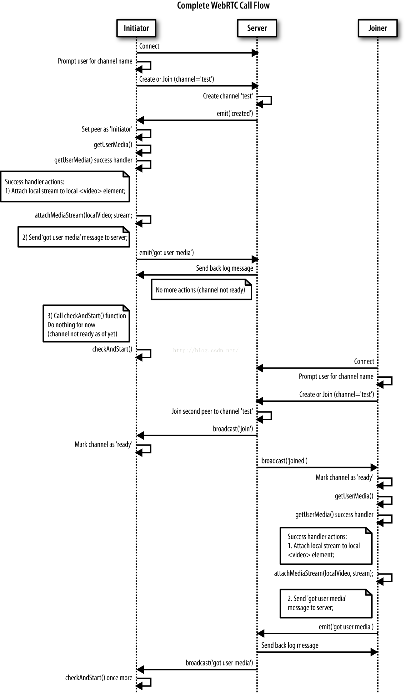


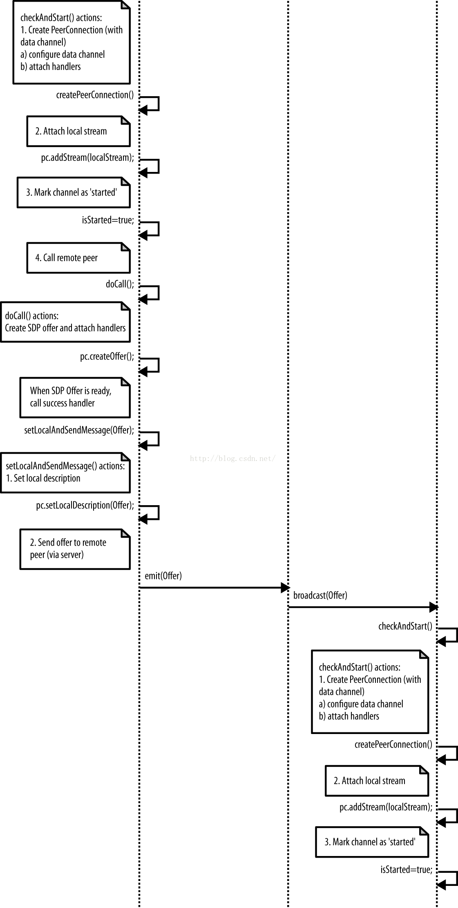


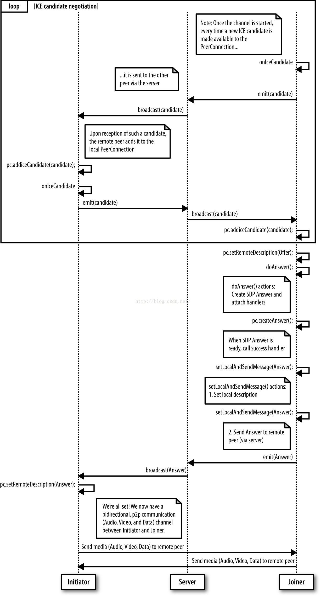