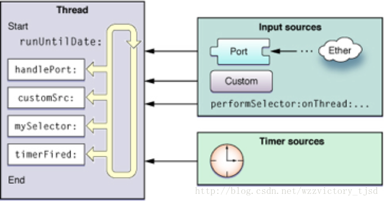
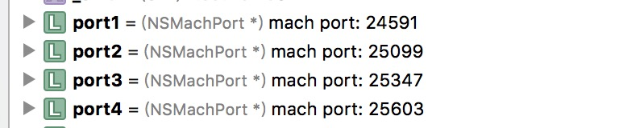
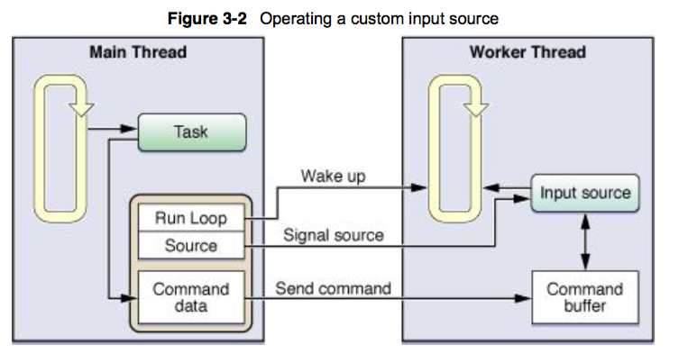
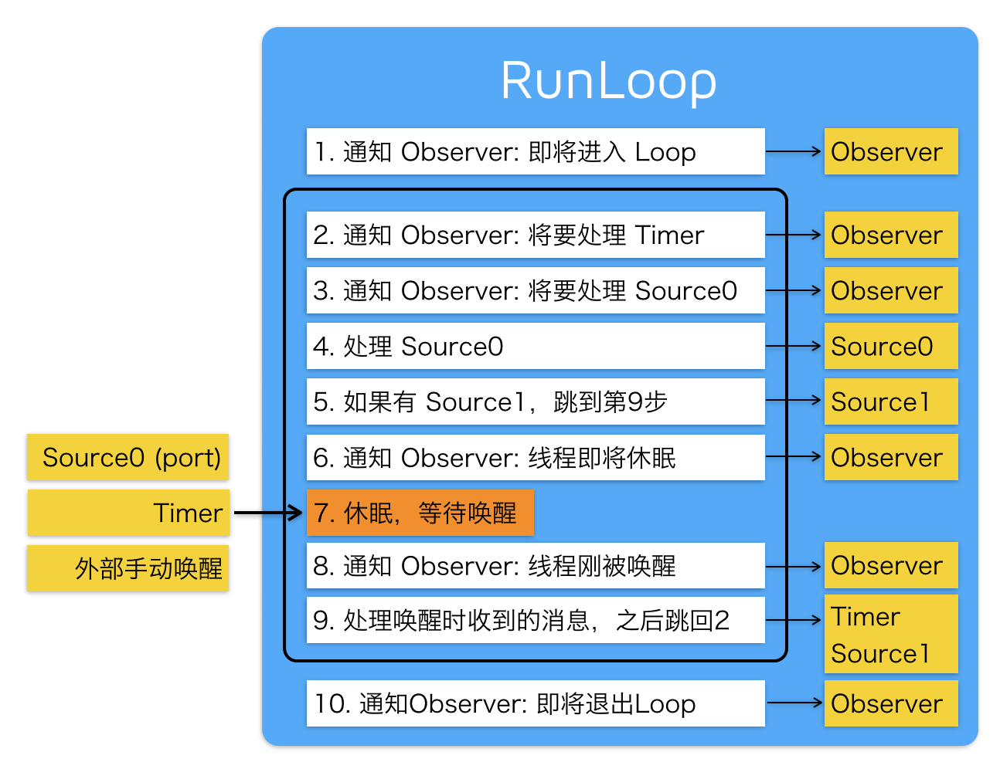

 
<!--BEGIN_DATA
{
    "create_date": "2016-12-28 15:29", 
    "modify_date": "2016-12-28 15:29", 
    "is_top": "0", 
    "summary": "基于runloop的线程保活、销毁与通信", 
    "tags": "iOS", 
    "file_name": "基于runloop的线程保活、销毁与通信.md"
}
END_DATA-->

####
原文出处：<a href='http://www.jianshu.com/p/4d5b6fc33519' target='blank'>基于runloop的线程保活、销毁与通信</a>

##基于runloop的线程保活、销毁与通信

#####首先看一段AF2.x经典代码:

    
    
    + (NSThread *)networkRequestThread {
        static NSThread *_networkRequestThread = nil;
        static dispatch_once_t oncePredicate;
        dispatch_once(&oncePredicate, ^{
            _networkRequestThread = [[NSThread alloc] initWithTarget:self selector:@selector(networkRequestThreadEntryPoint:) object:nil];
            [_networkRequestThread start];
        });
        return _networkRequestThread;
    }
    + (void)networkRequestThreadEntryPoint:(id)__unused object {
        @autoreleasepool {
            [[NSThread currentThread] setName:@"AFNetworking"];
            NSRunLoop *runLoop = [NSRunLoop currentRunLoop];
            [runLoop addPort:[NSMachPort port] forMode:NSDefaultRunLoopMode];
            [runLoop run];
        }
    }

  * 首先我们要明确一个概念，线程一般都是一次执行完任务，就销毁了。
  * 而添加了runloop，并运行起来，实际上是添加了一个do,while循环，这样这个线程的程序一直卡在这个do,while循环上，这样相当于线程的任务一直没有执行完，所以线程一直不会销毁。
  * 所以，一旦我们添加了一个runloop，并run了，我们如果要销毁这个线程，必须停止runloop，至于停止的方式，我们接下去往下看。

这里创建了一个线程，取名为AFNetworking,因为添加了一个runloop，所以**这个线程不会被销毁，直到runloop停止**。
    
    
    [runLoop addPort:[NSMachPort port] forMode:NSDefaultRunLoopMode];

  * 这行代码的目的是添加一个端口监听这个端口的事件，这也是我们后面会讲到的一种线程间的通信方式-基于端口的通信。
    
    
		[runLoop run];

  * runloop开始跑起来，但是要注意，这种runloop，只有一种方式能终止
    
    
    	[NSRunLoop currentRunLoop]removePort:<#(nonnull NSPort *)#> forMode:<#(nonnull NSRunLoopMode)#>

  * 只有从runloop中移除我们之前添加的端口，这样runloop没有任何事件，所以直接退出。

再次回到AF2.x的这行源码上，因为他用的是run，而且并没有记录下自己添加的NSMachPort，所以显然，它就没打算退出这个runloop，**这是一个常驻线程**。事实上，看过AF2.x源码的同学会知道，这个thread需要常驻的原因，在此就不做赘述了。

#####接下来我们看看AF3.x是怎么用runloop的：

需要开启的时候：

    
    CFRunLoopRun();

终止的时候：
  
    
    CFRunLoopStop(CFRunLoopGetCurrent());

  * 由于NSUrlSession参考了AF的2.x的优点，自己维护了一个线程池，做Request线程的调度与管理，所以在AF3.x中，没有了常驻线程，都是用的时候run,结束的时候stop。

#######再看看RAC中的runloop:
   
    
    do {
        [NSRunLoop.mainRunLoop runMode:NSDefaultRunLoopMode beforeDate:[NSDate dateWithTimeIntervalSinceNow:0.1]];
    } while (!done);

  * 大致讲下这段代码实现的内容，自己用一个Bool值done去控制runloop的运行，每次只运行这个模式的runloop，0.1秒。0.1秒后开启runloop的下一次运行。

**以上我们都大致分析一下，后面我们再来讲为什么。**

#####首先我们先讲讲runloop的概念：

  

runloop官方图.png

  * **Runloop，顾名思义就是跑圈，他的本质就是一个do,while循环，当有事做时做事，没事做时睡眠。**至于怎么做事，怎么睡眠，这个是由系统内核来调度的，我们后面会讲到。
  * 每个线程都有一个Run Loop，主线程的Run Loop会在App运行时自动运行，子线程中需要手动获取运行，第一次获取时，才会去创建。
  * 每个Run Loop都会以一个模式mode来运行，可以使用NSRunLoop的
    
        -(BOOL)runMode:(NSString *)mode beforeDate:(NSDate *)limitDate

方法运行在某个特定模式mode。

  * Run Loop的处理两大类事件源：Timer Source和Input Source(包括performSelector_*_方法簇、Port或者自定义Input Source)，每个事件源都会绑定在Run Loop的某个特定模式mode上，而且只有RunLoop在这个模式运行的时候才会触发该Timer和Input Source。

  * 最后，如果没有任何事件源添加到Run Loop上，Run Loop就会立刻exit，这也是一开始的AF例子，为什么需要绑定一个Port的原因。

#######我们先来谈谈Runloop Mode

OS下Run Loop的主要运行模式mode有： 
 
1) NSDefaultRunLoopMode: 默认的运行模式，除了NSConnection对象的事件。 
 
2) NSRunLoopCommonModes: 是一组常用的模式集合，将一个input source关联到这个模式集合上，等于将input source关联到这个模式集合中的所有模式上。在iOS系统中NSRunLoopCommonMode包含NSDefaultRunLoopMode、NSTaskDeathCheckMode、UITrackingRunLoopMode。

  * 假如我有个timer要关联到这些模式上，一个个注册很麻烦，我可以用： 
   
`CFRunLoopAddCommonMode([[NSRunLoop currentRunLoop] getCFRunLoop],(__bridge CFStringRef) UITrackingRunLoopMode);` 将UITrackingRunLoopMode或者其他模式添加到这个NSRunLoopCommonModes模式中，然后只需要将Timer关联到NSRunLoopCommonModes，即可以实现Run Loop运行在这个模式集合中任何一个模式时，这个Timer都可以被触发。

  * 当然，默认情况下NSRunLoopCommonModes包含了NSDefaultRunLoopMode和UITrackingRunLoopMode。我指的是如果有其他自定义Mode。
  * 注意：让Run Loop运行在NSRunLoopCommonModes下是没有意义的，因为一个时刻Run Loop只能运行在一个特定模式下，而不可能是个模式集合。

3) UITrackingRunLoopMode:

用于跟踪触摸事件触发的模式（例如UIScrollView上下滚动），主线程当触摸事件触发时会设置为这个模式，可以用来在控件事件触发过程中设置Timer。  

4) GSEventReceiveRunLoopMode: 用于接受系统事件，属于内部的Run Loop模式。  

5)自定义Mode：可以设置自定义的运行模式Mode，你也可以用

CFRunLoopAddCommonMode添加到NSRunLoopCommonModes中。

#####总结一下：

**Run Loop运行时只能以一种固定的模式运行，如果我们需要它切换模式，只有停掉它，再重新开启它。**  运行时它只会监控这个模式下添加的Timer Source和Input Source，如果这个模式下没有相应的事件源，Run Loop的运行也会立刻返回的。注意Run Loop不能在运行在NSRunLoopCommonModes模式，因为NSRunLoopCommonModes其实是个模式集合，而不是一个具体的模式，我可以在添加事件源的时候使用NSRunLoopCommonModes，只要Run Loop运行在NSRunLoopCommonModes中任何一个模式，这个事件源都可以被触发。

#####Run Loop运行接口

  * 要操作Run Loop，Foundation层和Core Foundation层都有对应的接口可以操作Run Loop：Foundation层对应的是NSRunLoop，Core Foundation层对应的是CFRunLoopRef；

  * 两组接口差不多，不过功能上还是有许多区别的：例如CF层可以添加自定义Input Source事件源、(CFRunLoopSourceRef)Run Loop观察者Observer(CFRunLoopObserverRef)，很多类似功能的接口特性也是不一样的。

NSRunLoop的运行接口：
   
    
    //运行 NSRunLoop，运行模式为默认的NSDefaultRunLoopMode模式，没有超时限制
    - (void)run;
    //运行 NSRunLoop: 参数为运时间期限，运行模式为默认的NSDefaultRunLoopMode模式 
    - (void)runUntilDate:(NSDate *)limitDate;
    //运行 NSRunLoop: 参数为运行模式、时间期限，返回值为YES表示是处理事件后返回的，NO表示是超时或者停止运行导致返回的
    - (BOOL)runMode:(NSString *)mode beforeDate:(NSDate *)limitDate;

    
CFRunLoopRef的运行接口：
  
    
    //运行 CFRunLoopRef
    void CFRunLoopRun();
    //运行 CFRunLoopRef: 参数为运行模式、时间和是否在处理Input Source后退出标志，返回值是exit原因
    SInt32 CFRunLoopRunInMode (mode, seconds, returnAfterSourceHandled);
    //停止运行 CFRunLoopRef
    void CFRunLoopStop( CFRunLoopRef rl );
    //唤醒CFRunLoopRef
    void CFRunLoopWakeUp ( CFRunLoopRef rl );

#####首先，详细讲解下NSRunLoop的三个运行接口：

#####first

    
    
    - (void)run; 无条件运行

  * 不建议使用，因为这个接口会导致Run Loop永久性的运行在NSDefaultRunLoopMode模式。
  * 即使用CFRunLoopStop(runloopRef);也无法停止Run Loop的运行，除非能移除这个runloop上的所有事件源，包括定时器和source事件，不然这个子线程就无法停止，只能永久运行下去。

#####second

    
    
    - (void)runUntilDate:(NSDate *)limitDate;  有一个超时时间限制

  * 比上面的接口好点，有个超时时间，可以控制每次Run Loop的运行时间，也是运行在NSDefaultRunLoopMode模式。这个方法运行Run Loop一段时间会退出给你检查运行条件的机会，如果需要可以再次运行Run Loop。

  * 注意CFRunLoopStop(runloopRef),也无法停止Run Loop的运行。  
使用示例代码如下：

    
        while (!Done)
	    {
	      [[NSRunLoop currentRunLoop] runUntilDate:[NSDate dateWithTimeIntervalSinceNow:10]];
	      NSLog(@"exiting runloop.........:");
	    }

  * 注意这个Done是我们自定义的一个Bool值，用来控制是否还需要开启下一次的runloop。
  * 这个例子大概做了如下的事：这个Runloop会每10秒退出一次，然后输出exiting runloop.........，然后下一次根据我们的Done值来判断是否再去运行runloop。

#####third

      
    //有一个超时时间限制，而且设置运行模式
    - (BOOL)runMode:(NSString *)mode beforeDate:(NSDate *)limitDate;

  * 从方法上来看，比上面多了一个参数，可以设置运行模式。
  * 有一点需要注意：这种运行方式是可以被`CFRunLoopStop(runloopRef)`所停止的(大家可以自己写个例子试试)。
  * 除此之外，这个方法和第二个方法还有一个很大的区别，就是这样去运行runloop会多一种退出方式。这里我指的退出方式是除了timer触发以外的事件，都会导致runloop退出，这里简单的举个例子:
    
    
	    - (void)testDemo1
	    {
	        dispatch_async(dispatch_get_global_queue(0, 0), ^{
	            NSLog(@"线程开始");
	            //获取到当前线程
	            self.thread = [NSThread currentThread];
	            NSRunLoop *runloop = [NSRunLoop currentRunLoop];
	            //添加一个Port，同理为了防止runloop没事干直接退出
	            [runloop addPort:[NSMachPort port] forMode:NSDefaultRunLoopMode];
	            //运行一个runloop，[NSDate distantFuture]：很久很久以后才让它失效
	            [runloop runMode:NSDefaultRunLoopMode beforeDate:[NSDate distantFuture]];
	            NSLog(@"线程结束");
	        });
	        dispatch_after(dispatch_time(DISPATCH_TIME_NOW, (int64_t)(2 * NSEC_PER_SEC)), dispatch_get_main_queue(), ^{
	            //在我们开启的异步线程调用方法
	            [self performSelector:@selector(recieveMsg) onThread:self.thread withObject:nil waitUntilDone:NO];
	        });
	    }
	    - (void)recieveMsg
	    {
	        NSLog(@"收到消息了，在这个线程：%@",[NSThread currentThread]);
	    }

输出结果如下

    
    2016-11-22 14:04:15.250 TestRunloop3[70591:1742754] 线程开始
    2016-11-22 14:04:17.250 TestRunloop3[70591:1742754] 收到消息了，在这个线程：<NSThread: 0x600000263c80>{number = 3, name = (null)}
    2016-11-22 14:04:17.250 TestRunloop3[70591:1742754] 线程结束

  * 在这里我们用了performSelector: onThread...这个方法去进行线程间通信，这只是其中一种最简单的方式。但是缺点也很明显，就是在去调用这个线程的时候，如果线程已经不存在了，程序就会crash。后面我们会仔细讲各种线程间的通信。

  * 我们看到，我们收到了一个消息，这个消息是一个非timer的事件，所以runloop处理完就退出了，这里为什么会这样呢，我们可以看看runloop的源代码：
    
    
	    /// RunLoop的实现
	    int CFRunLoopRunSpecific(runloop, modeName, seconds, stopAfterHandle) {
	        /// 首先根据modeName找到对应mode
	        CFRunLoopModeRef currentMode = __CFRunLoopFindMode(runloop, modeName, false);
	        /// 如果mode里没有source/timer/observer, 直接返回。
	        if (__CFRunLoopModeIsEmpty(currentMode)) return;
	        /// 1. 通知 Observers: RunLoop 即将进入 loop。
	        __CFRunLoopDoObservers(runloop, currentMode, kCFRunLoopEntry);
	        /// 内部函数，进入loop
	        __CFRunLoopRun(runloop, currentMode, seconds, returnAfterSourceHandled) {
	            Boolean sourceHandledThisLoop = NO;
	            int retVal = 0;
	            do {
	                /// 2. 通知 Observers: RunLoop 即将触发 Timer 回调。
	                __CFRunLoopDoObservers(runloop, currentMode, kCFRunLoopBeforeTimers);
	                /// 3. 通知 Observers: RunLoop 即将触发 Source0 (非port) 回调。
	                __CFRunLoopDoObservers(runloop, currentMode, kCFRunLoopBeforeSources);
	                /// 执行被加入的block
	                __CFRunLoopDoBlocks(runloop, currentMode);
	                /// 4. RunLoop 触发 Source0 (非port) 回调。
	                sourceHandledThisLoop = __CFRunLoopDoSources0(runloop, currentMode, stopAfterHandle);
	                /// 执行被加入的block
	                __CFRunLoopDoBlocks(runloop, currentMode);
	                /// 5. 如果有 Source1 (基于port) 处于 ready 状态，直接处理这个 Source1 然后跳转去处理消息。
	                if (__Source0DidDispatchPortLastTime) {
	                    Boolean hasMsg = __CFRunLoopServiceMachPort(dispatchPort, &msg)
	                    if (hasMsg) goto handle_msg;
	                }
	                /// 6.通知 Observers: RunLoop 的线程即将进入休眠(sleep)。
	                if (!sourceHandledThisLoop) {
	                    __CFRunLoopDoObservers(runloop, currentMode, kCFRunLoopBeforeWaiting);
	                }
	                /// 7. 调用 mach_msg 等待接受 mach_port 的消息。线程将进入休眠, 直到被下面某一个事件唤醒。
	                /// ? 一个基于 port 的Source 的事件。
	                /// ? 一个 Timer 到时间了
	                /// ? RunLoop 自身的超时时间到了
	                /// ? 被其他什么调用者手动唤醒
	                __CFRunLoopServiceMachPort(waitSet, &msg, sizeof(msg_buffer), &livePort) {
	                    mach_msg(msg, MACH_RCV_MSG, port); // thread wait for receive msg
	                }
	                /// 8. 通知 Observers: RunLoop 的线程刚刚被唤醒了。
	                __CFRunLoopDoObservers(runloop, currentMode, kCFRunLoopAfterWaiting);
	                /// 9.收到消息，处理消息。
	                handle_msg:
	                /// 10.1 如果一个 Timer 到时间了，触发这个Timer的回调。
	                if (msg_is_timer) {
	                    __CFRunLoopDoTimers(runloop, currentMode, mach_absolute_time())
	                } 
	                /// 10.2 如果有dispatch到main_queue的block，执行block。
	                else if (msg_is_dispatch) {
	                    __CFRUNLOOP_IS_SERVICING_THE_MAIN_DISPATCH_QUEUE__(msg);
	                } 
	                /// 10.3 如果一个 Source1 (基于port) 发出事件了，处理这个事件
	                else {
	                    CFRunLoopSourceRef source1 = __CFRunLoopModeFindSourceForMachPort(runloop, currentMode, livePort);
	                    sourceHandledThisLoop = __CFRunLoopDoSource1(runloop, currentMode, source1, msg);
	                    if (sourceHandledThisLoop) {
	                        mach_msg(reply, MACH_SEND_MSG, reply);
	                    }
	                }
	                /// 执行加入到Loop的block
	                __CFRunLoopDoBlocks(runloop, currentMode);
	                if (sourceHandledThisLoop && stopAfterHandle) {
	                    /// 进入loop时参数说处理完事件就返回。
	                    retVal = kCFRunLoopRunHandledSource;
	                } else if (timeout) {
	                    /// 超出传入参数标记的超时时间了
	                    retVal = kCFRunLoopRunTimedOut;
	                } else if (__CFRunLoopIsStopped(runloop)) {
	                    /// 被外部调用者强制停止了
	                    retVal = kCFRunLoopRunStopped;
	                } else if (__CFRunLoopModeIsEmpty(runloop, currentMode)) {
	                    /// source/timer/observer一个都没有了
	                    retVal = kCFRunLoopRunFinished;
	                }
	                /// 如果没超时，mode里没空，loop也没被停止，那继续loop。
	            } while (retVal == 0);
	        }
	        /// 11. 通知 Observers: RunLoop 即将退出。
	        __CFRunLoopDoObservers(rl, currentMode, kCFRunLoopExit);
	    }

代码一长串，但是标了注释，应该大致能看明白，大概讲一下：

  * 函数的主体是一个do,while循环，用一个变量retVal，来控制循环的执行。默认为0，无限循环。
  * 刚进入循环1，2，3，4，5在做一件事，就是检查是否有事件需要处理，如果有的话，就直接跳到9去处理事件。
  * 处理完事件之后，到第10，会去判断4种是否应该跳出循环的情况，给变量retVal赋一个不为0的值，来跳出循环。
  * 如果走到6，则判断没有事做，那么runloop就睡眠了，停在第7行，这一行
    
        __CFRunLoopServiceMachPort(waitSet, &msg, sizeof(msg_buffer), &livePort)
	    { 
	        // thread wait for receive msg 
	        mach_msg(msg, MACH_RCV_MSG, port); 
	    }

这一行类似sync这样的一个同步机制（其实不是，举个例子。。），把程序阻塞在这一行，直到有消息返回值，才继续往下进行。**这一阻塞操作是系统内核来挂起的，阻塞了当前的线程**，当有消息返回时，**因为当前线程是被阻塞的，系统内核会再开辟一个新的线程去返回这个消息。**然后程序继续往下进行。

  * 走到第8、9，通知Observers，然后处理事件。

  * 到10，去判断是否退出循环的条件，如果满足条件退出循环，runloop结束。反之，又从新开始循环，从2开始。这就是整个一个runloop处理事件的流程。

回到上述的例子这种模式下的runloop：

    
    
    - (BOOL)runMode:(NSString *)mode beforeDate:(NSDate *)limitDate;

我们让线程执行了一个事件，结果执行完，runloop就退出了，原因原来是这样：

    
    
    if (sourceHandledThisLoop && stopAfterHandle)
    { 
        /// 进入loop时参数说处理完事件就返回。 
        retVal = kCFRunLoopRunHandledSource; 
    }

  * 这种形式开启的runloop, **stopAfterHandle这个参数为YES**，  
而**sourceHandledThisLoop**这个参数在如下代码中被赋值为YES：

    
        /// 10.3 如果一个 Source1 (基于port) 发出事件了，处理这个事件
	    else {
	      CFRunLoopSourceRef source1 = __CFRunLoopModeFindSourceForMachPort(runloop, currentMode, livePort);
	      sourceHandledThisLoop = __CFRunLoopDoSource1(runloop, currentMode, source1, msg);
	      if (sourceHandledThisLoop) {
	          mach_msg(reply, MACH_SEND_MSG, reply);
	      }
	    }

所以在这里我们触发了事件之后，runloop被退出了，这时候我们也明白了为什么timer并不会导致runloop的退出。

#####接下来我们分析一下Core Foundation中运行runloop的接口：

    
    
    //运行 CFRunLoopRef
    void CFRunLoopRun();
    //运行 CFRunLoopRef: 参数为运行模式、时间和是否在处理Input Source后退出标志，返回值是exit原因
    SInt32 CFRunLoopRunInMode (mode, seconds, returnAfterSourceHandled);
    //停止运行 CFRunLoopRef
    void CFRunLoopStop( CFRunLoopRef rl );
    //唤醒 CFRunLoopRef
    void CFRunLoopWakeUp ( CFRunLoopRef rl );

#####first：

    
    
    void CFRunLoopRun();

  * 运行在默认的kCFRunLoopDefaultMode模式下，直到使用**CFRunLoopStop**接口停止这个Run Loop，或者Run Loop的所有事件源都被删除。
  * NSRunloop是基于CFRunloop来封装的，NSRunloop是线程不安全的，而CFRunloop则是线程安全的。
  * 在这里我们可以看到和上面NSRunloop有一个直观的区别就是，**CFRunLoopStop能直接停止掉所有用CFRunloop运行起runloop**，其实之前讲到的：
    
        - (void)runUntilDate:(NSDate *)limitDate; 有一个超时时间限制

这方式运行的runloop也能用`CFRunLoopStop`停止掉的原因它是完全基于下面这种方式封装的：

    
        SInt32 CFRunLoopRunInMode (mode, seconds, returnAfterSourceHandled);

可以看到参数几乎一模一样，前者默认returnAfterSourceHandled参数为YES，当触发一个非timer事件后，runloop就终止了。

  * 这里比较简单，就不举例赘述了，读者可以自行举例。

#####second：

    
    
    SInt32 CFRunLoopRunInMode (mode, seconds, returnAfterSourceHandled);

  * 这里有3个参数，1个返回值。
  * 其中第一个参数是指RunLoop运行的模式（例如kCFRunLoopDefaultMode或者kCFRunLoopCommonModes），第二个参数是运行时间，第三个参数是是否在处理事件后让Run Loop退出返回，NSRunloop的第三种开启runloop的方法，综上述，我们知道，实际上就是设置**stopAfterHandle这个参数为YES**
  * 关于返回值，我们知道调用runloop运行，代码是停在这一行不返回的，当返回的时候runloop就结束了，所以这个返回值就是**runloop结束原因的返回**，为一个枚举值，具体原因如下：
    
        enum {
	      kCFRunLoopRunFinished = 1, //Run Loop结束，没有Timer或者其他Input Source
	      kCFRunLoopRunStopped = 2, //Run Loop被停止，使用CFRunLoopStop停止Run Loop
	      kCFRunLoopRunTimedOut = 3, //Run Loop超时
	      kCFRunLoopRunHandledSource = 4 ////Run Loop处理完事件，注意Timer事件的触发是不会让Run Loop退出返回的，即使CFRunLoopRunInMode的第三个参数是YES也不行
	    };

看到这，我们发现我们忽略了NSRunloop第三种开启方式的返回值。  
`\- (BOOL)runMode:(NSString *)mode beforeDate:(NSDate *)limitDate;`它其实就是基于CFRunLoopRunInMode封装的，它的返回值为一个Bool值，如果是PerfromSelector_*_事件或者其他Input Source事件触发处理后，Run Loop会退出返回YES，其他返回NO。

举个例子：

    
    
    - (void)testDemo2
    {
        dispatch_async(dispatch_get_global_queue(0, 0), ^{
            NSLog(@"starting thread.......");
            NSTimer *timer = [NSTimer timerWithTimeInterval:1 target:self selector:@selector(doTimerTask1:) userInfo:remotePort repeats:YES];
            [[NSRunLoop currentRunLoop] addTimer:timer forMode:NSDefaultRunLoopMode];
            //最后一个参数，是否处理完事件返回,结束runLoop
            SInt32 result = CFRunLoopRunInMode(kCFRunLoopDefaultMode, 100, YES);
            /*
             kCFRunLoopRunFinished = 1, //Run Loop结束，没有Timer或者其他Input Source
             kCFRunLoopRunStopped = 2, //Run Loop被停止，使用CFRunLoopStop停止Run Loop
             kCFRunLoopRunTimedOut = 3, //Run Loop超时
             kCFRunLoopRunHandledSource = 4 ////Run Loop处理完事件，注意Timer事件的触发是不会让Run Loop退出返回的，即使CFRunLoopRunInMode的第三个参数是YES也不行
             */
            switch (result) {
                case kCFRunLoopRunFinished:
                    NSLog(@"kCFRunLoopRunFinished");
                    break;
                case kCFRunLoopRunStopped:
                    NSLog(@"kCFRunLoopRunStopped");
                case kCFRunLoopRunTimedOut:
                    NSLog(@"kCFRunLoopRunTimedOut");
                case kCFRunLoopRunHandledSource:
                    NSLog(@"kCFRunLoopRunHandledSource");
                default:
                    break;
            }
            NSLog(@"end thread.......");
        });
    }
    - (void)doTimerTask1:(NSTimer *)timer
    {
        count++;
        if (count == 2) {
            [timer invalidate];
        }
        NSLog(@"do timer task count:%d",count);
    }

输出结果如下：

    
    
    2016-11-23 09:19:28.342 TestRunloop3[88598:1971412] starting thread.......
    2016-11-23 09:19:29.347 TestRunloop3[88598:1971412] do timer task count:1
    2016-11-23 09:19:30.345 TestRunloop3[88598:1971412] do timer task count:2
    2016-11-23 09:19:30.348 TestRunloop3[88598:1971412] kCFRunLoopRunFinished
    2016-11-23 09:19:30.348 TestRunloop3[88598:1971412] end thread.......

  * 很清楚的可以看到，当timer被置无效的时候，runloop里面没有了任何的事件源，所以退出了，退出原因为：**kCFRunLoopRunFinished**，线程也就结束了。

####总结一下：

  * runloop运行方法一共5种：包括NSRunloop的3种，CFRunloop的两种;  
而取消的方式一共为3种：  
1）移除掉runloop中的所有事件源（timer和source）。  
2）设置一个超时时间。  
3）只要CFRunloop运行起来就可以用：`void CFRunLoopStop( CFRunLoopRefrl );`去停止。

    * 除此之外用`NSRunLoop`下面这个方法运行也能使用`void CFRunLoopStop( CFRunLoopRef rl );`停止：
        
                [NSRunLoop currentRunLoop]runMode:<#(nonnull NSRunLoopMode)#> beforeDate:<#(nonnull NSDate *)#>

  * 实际过程中，可以根据需求，我们可以设置一个自己的Bool值，来控制runloop的开始与停止,类似下面这样：
    
        while (!cancel) {
	      CFRunLoopRunInMode(kCFRunLoopDefaultMode, 1, YES);
	    }

  * 每次runloop只运行1秒就停止，然后开始下一次的runloop。
  * 这里最后一个参数设置为YES，当有非timer事件进来，也会立即开始下一次runloop。
  * 当然每次进来我们都可以去修改Mode的值，这样我们可以让runloop每次都运行在不同的模式下。
  * 当我们不需要runloop的时候，直接将cancel置为YES即可。

当然，这里只是提供一个思路，具体有需求，可以根据实际需要。

######基于runloop的线程通信

首先明确一个概念，线程间的通信（不仅限于通信，几乎所有iOS事件都是如此），实际上是各种输入源，触发runloop去处理对应的事件，所以我们先来讲讲输入源：输入源异步的发送消息给你的线程。事件来源取决于输入源的种类：

  * 基于端口的输入源和自定义输入源。基于端口的输入源监听程序相应的端口。自定义输入源则监听自定义的事件源。

至于run loop，它不关心输入源的是基于端口的输入源还是自定义的输入源。系统会实现两种输入源供你使用。两类输入源的区别在于：

  * 基于端口的输入源由内核自动发送，而自定义的则需要人工从其他线程发送。

当你创建输入源，你需要将其分配给run loop中的一个或多个模式。模式只会在特定事件影响监听的源。大多数情况下，run loop运行在默认模式下，但是你也可以使其运行在自定义模式。若某一源在当前模式下不被监听，那么任何其生成的消息只在run loop运行在其关联的模式下才会被传递。

1）基于端口的输入源:  
在runloop中，被定义名为souce1。Cocoa和Core Foundation内置支持使用端口相关的对象和函数来创建的基于端口的源。例如，在Cocoa里面你从来不需要直接创建输入源。你只要简单的创建端口对象，并使用NSPort的方法把该端口添加到run loop。端口对象会自己处理创建和配置输入源。

在Core Foundation，你必须人工创建端口和它的run loop源.在两种情况下，你都可以使用端口相关的函数（CFMachPortRef，CFMessagePortRef，CFSocketRef）来创建合适的对象。

这里用Cocoa里的举个例子，Cocoa里用来线程间传值的是NSMachPort，它的父类是NSPort。  

首先我们看下面：

    
    
    NSPort *port1 = [[NSPort alloc]init];
    NSPort *port2 = [[NSMachPort alloc]init];
    NSPort *port3 = [NSPort port];
    NSPort *port4 = [NSMachPort port];

我们打断点可以看到如下：  

  

port图.png

  * 发现我们怎么创建，都返回给我们的是NSMachPort的实例，这应该是NSPort内部做了一个消息的转发，这就有点像是一个抽象类了，它本身只是定义一些公有的属性和方法，然后利用集成它的子类去实现（只是我个人猜测。。）

继续看我们写的一个利用NSMachPort来线程通信的实例：

    
    
    - (void)testDemo3
    {
        //声明两个端口   随便怎么写创建方法，返回的总是一个NSMachPort实例
        NSMachPort *mainPort = [[NSMachPort alloc]init];
        NSPort *threadPort = [NSMachPort port];
        //设置线程的端口的代理回调为自己
        threadPort.delegate = self;
        //给主线程runloop加一个端口
        [[NSRunLoop currentRunLoop]addPort:mainPort forMode:NSDefaultRunLoopMode];
        dispatch_async(dispatch_get_global_queue(0, 0), ^{
            //添加一个Port
            [[NSRunLoop currentRunLoop]addPort:threadPort forMode:NSDefaultRunLoopMode];
            [[NSRunLoop currentRunLoop]runMode:NSDefaultRunLoopMode beforeDate:[NSDate distantFuture]];
        });
        NSString *s1 = @"hello";
        NSData *data = [s1 dataUsingEncoding:NSUTF8StringEncoding];
        dispatch_after(dispatch_time(DISPATCH_TIME_NOW, (int64_t)(2 * NSEC_PER_SEC)), dispatch_get_main_queue(), ^{
            NSMutableArray *array = [NSMutableArray arrayWithArray:@[mainPort,data]];
            //过2秒向threadPort发送一条消息，第一个参数：发送时间。msgid 消息标识。
            //components，发送消息附带参数。reserved：为头部预留的字节数（从官方文档上看到的，猜测可能是类似请求头的东西...）
            [threadPort sendBeforeDate:[NSDate date] msgid:1000 components:array from:mainPort reserved:0];
        });
    }
    //这个NSMachPort收到消息的回调，注意这个参数，可以先给一个id。如果用文档里的NSPortMessage会发现无法取值
    - (void)handlePortMessage:(id)message
    {
        NSLog(@"收到消息了，线程为：%@",[NSThread currentThread]);
        //只能用KVC的方式取值
        NSArray *array = [message valueForKeyPath:@"components"];
        NSData *data =  array[1];
        NSString *s1 = [[NSString alloc]initWithData:data encoding:NSUTF8StringEncoding];
        NSLog(@"%@",s1);
    //    NSMachPort *localPort = [message valueForKeyPath:@"localPort"];
    //    NSMachPort *remotePort = [message valueForKeyPath:@"remotePort"];
    }

打印如下:

    
    
    2016-11-23 16:50:20.604 TestRunloop3[1322:120162] 收到消息了，线程为：<NSThread: 0x60800026d700>{number = 3, name = (null)}
    2016-11-23 16:50:26.551 TestRunloop3[1322:120162] hello

  * 我们跨越线程，确实从主线程往另一个线程发送了消息。
  * 这里要注意几个点：  
1）`\- (void)handlePortMessage:(id)message`这里这个代理的参数，从.h里去复制过来的为NSPortMessage类型的一个对象，但是我们发现苹果只是在.h中@class进来，我们无法调用它的任何方法。所以我们用id声明，然后通过KVC去取它的属性。  

2）关于下面这个传值类型的问题：  
`NSMutableArray *array = [NSMutableArray arrayWithArray:@[mainPort,data]];` 作者在这困惑了好一会。。之前我是往数组里添加的是String或者其他类型的对象，但是发现参数传过去之后，变成nil了。于是去百度查了半天，然后没有结果。。于是去翻官方文档，终于在方法描述里看到（其实很醒目。。然而作者英文水平实在有限。。）：

> The components array consists of a series of instances  
of some subclass of NSData, and instances of some  
subclass of NSPort; since one subclass of NSPort does  
not necessarily know how to transport an instance of  
another subclass of NSPort (or could do it even if it  
knew about the other subclass), all of the instances  
of NSPort in the components array and the 'receivePort'  
argument MUST be of the same subclass of NSPort that  
receives this message. If multiple DO transports are  
being used in the same program, this requires some care.

从这段描述中我们可以看出，**这个传参数组里面只能装两种类型的数据，一种是NSPort的子类，一种是NSData的子类。**所以我们如果要用这种方式传值必须得先把数据转成NSData类型的才行。

2)Cocoa 执行 Selector 的源:

  * 除了基于端口的源，Cocoa定义了自定义输入源，允许你在任何线程执行selector。它被称为source0,和基于端口的源一样，执行selector请求会在目标线程上序列化，减缓许多在线程上允许多个方法容易引起的同步问题。不像基于端口的源，一个selector执行完后会自动从run loop里面移除。
  * 有方法如下：
    
    
	    [self performSelectorOnMainThread:<#(nonnull SEL)#> withObject:<#(nullable id)#> waitUntilDone:<#(BOOL)#>]
	    [self performSelectorOnMainThread:<#(nonnull SEL)#> withObject:<#(nullable id)#> waitUntilDone:<#(BOOL)#> modes:<#(nullable NSArray<NSString *> *)#>]
	    [self performSelector:<#(nonnull SEL)#> onThread:<#(nonnull NSThread *)#> withObject:<#(nullable id)#> waitUntilDone:<#(BOOL)#>]
	    [self performSelector:<#(nonnull SEL)#> onThread:<#(nonnull NSThread *)#> withObject:<#(nullable id)#> waitUntilDone:<#(BOOL)#> modes:<#(nullable NSArray<NSString *> *)#>]

  * 这四个方法很类似，一个是在主线程去掉，一个可以指定一个线程。然后一个带Mode，一个不带。
  * 大概讲一下 waitUntilDone 这个参数，顾名思义，就是是否等到结束。  
1）如果这个值设为YES，那么就需要等到这个方法执行完，线程才能继续往下去执行。它会阻塞提交的线程。  
2）如果为NO的话，这个调用的方法会异步的实行，不会阻塞提交线程。  
方法比较简单，就不举例说明了。

3) 自定义输入源:

  * 为了自定义输入源，必须使用 Core Foundation里面的 CGRunLoopSourceRef类型相关的函数来创建。你可以使用回调函数来配置自定义输入源。Corefondation 会在配置源的不同地方调用回调函数，处理输入时间，在源从 runloop 移除的时候清理它。  
除了定义在事件到达时自定义输入源的行为，你也必须定义消息传递机制。源的这部分运行在单独的线程里面，并负责在数据等待处理的时候传递数据给源并源并通知它处理数据
。消息传递机制的定义取决于你，但是最好不要过于复杂。  
创建自定义的输入源包括定义以下内容：  
1.输入源要处理的信息。  
2.使感兴趣的客户端知道如何和输入源交互的调度例程。  
3.处理其他任何客户端发送请求的例程。  
4.使输入源失效的取消例程。

  * 由于创建输入源来处理自定义消息，实际配置选是灵活配置的。调度例程，处理例程和取消例程都是创建自定义输入源是最关键的例程。二输入源其他的大部分行为都发生在这些例程的外部。比如，由于你决定数据传输到输入源的机制，还有输入源和其他线程的通信机制也是由你决定。

下图中，程序的主线程维护了一个输入源的引用，输入源所需的自定义命令缓冲区和输入源所在的 runloop。当主线程有任务需要分发给工作线程时候，**_主线程会给命令缓冲区发送命令和必须的信息来通知工作线程开始执行任务。（因为主线程和输入源所在工作线程都可以访问命令缓冲区，因此这些访问必须是同步的）_**一旦命令传送出去，主线程会通知输入源并且唤醒工作线程的 runloop。而一收到唤醒命令，runloop 会调用输入源的处理程序，由它来执行命令缓冲区中响应的命令。

  

自定义输入源.png

还是一样，我们来写一个实例来讲讲自定义的输入源（注：自定义输入源，只有用CF来实现）：

    
    
    CFRunLoopRef _runLoopRef;
    CFRunLoopSourceRef _source;
    CFRunLoopSourceContext _source_context;

首先我们声明3个成员变量，这是我们自定义输入源所需要的3个参数。具体我们举完例子之后再说。

    
    
    - (void)testDemo4
    {
        dispatch_async(dispatch_get_global_queue(0, 0), ^{
            NSLog(@"starting thread.......");
            _runLoopRef = CFRunLoopGetCurrent();
            //初始化_source_context。
            bzero(&_source_context, sizeof(_source_context));
            //这里创建了一个基于事件的源，绑定了一个函数
            _source_context.perform = fire;
            //参数
            _source_context.info = "hello";
            //创建一个source
            _source = CFRunLoopSourceCreate(NULL, 0, &_source_context);
            //将source添加到当前RunLoop中去
            CFRunLoopAddSource(_runLoopRef, _source, kCFRunLoopDefaultMode);
            //开启runloop 第三个参数设置为YES，执行完一次事件后返回
            CFRunLoopRunInMode(kCFRunLoopDefaultMode, 9999999, YES);
            NSLog(@"end thread.......");
        });
        dispatch_after(dispatch_time(DISPATCH_TIME_NOW, (int64_t)(2 * NSEC_PER_SEC)), dispatch_get_main_queue(), ^{
            if (CFRunLoopIsWaiting(_runLoopRef)) {
                NSLog(@"RunLoop 正在等待事件输入");
                //添加输入事件
                CFRunLoopSourceSignal(_source);
                //唤醒线程，线程唤醒后发现由事件需要处理，于是立即处理事件
                CFRunLoopWakeUp(_runLoopRef);
            }else {
                NSLog(@"RunLoop 正在处理事件");
                //添加输入事件，当前正在处理一个事件，当前事件处理完成后，立即处理当前新输入的事件
                CFRunLoopSourceSignal(_source);
            }
        });
    }
    //此输入源需要处理的后台事件
    static void fire(void* info){
        NSLog(@"我现在正在处理后台任务");
        printf("%s",info);
    }

输出结果如下：

    
    
    2016-11-24 10:42:24.045 TestRunloop3[4683:238183] starting thread.......
    2016-11-24 10:42:26.045 TestRunloop3[4683:238082] RunLoop 正在等待事件输入 
    2016-11-24 10:42:31.663 TestRunloop3[4683:238183] 我现在正在处理后台任务
    hello
    2016-11-24 10:42:31.663 TestRunloop3[4683:238183] end thread.......

  * 例中可见我们创建一个自定义的输入源，绑定了一个函数，一个参数，并且用这个输入源，实现了线程间的通信。
  * 大概讲一下：  
a)`CFRunLoopRef _runLoopRef;`就不用说了，就是CF的runloop。

b)`CFRunLoopSourceContext _source_context;`注意到例中用了一个c函数`bzero(&_source_context, sizeof(_source_context));`来初始化。其实它本质是一个结构体如下：

    
        typedef struct {
	      CFIndex version;
	      void *  info;
	      const void *(*retain)(const void *info);
	      void    (*release)(const void *info);
	      CFStringRef (*copyDescription)(const void *info);
	      Boolean (*equal)(const void *info1, const void *info2);
	      CFHashCode  (*hash)(const void *info);
	      void    (*schedule)(void *info, CFRunLoopRef rl, CFRunLoopMode mode);
	      void    (*cancel)(void *info, CFRunLoopRef rl, CFRunLoopMode mode);
	      void    (*perform)(void *info);
	    } CFRunLoopSourceContext;

    * `bzero(&_source_context, sizeof(_source_context));`所以这个函数其实就是把所有内容先置为0。
    * 我们在这里绑定了两个参数一个是signal触发的函数，一个是函数的参数，至于其他参数的用途，可以看看苹果官方文档的说明如下：

> version  
Version number of the structure. Must be 0.  
info  
An arbitrary pointer to program-defined data, which can be associated with the
CFRunLoopSource at creation time. This pointer is passed to all the callbacks
defined in the context.  
retain  
A retain callback for your program-defined info pointer. Can be NULL.  
release  
A release callback for your program-defined info pointer. Can be NULL.  
copyDescription  
A copy description callback for your program-defined info pointer. Can be
NULL.  
equal  
An equality test callback for your program-defined info pointer. Can be NULL.  
hash  
A hash calculation callback for your program-defined info pointer. Can be
NULL.  
schedule  
A scheduling callback for the run loop source. This callback is called when
the source is added to a run loop mode. Can be NULL.  
cancel  
A cancel callback for the run loop source. This callback is called when the
source is removed from a run loop mode. Can be NULL.  
perform  
A perform callback for the run loop source. This callback is called when the
source has fired.

c)`CFRunLoopSourceRef _source;`这个是自定义输入源中最重要的一个参数。它用来连接runloop与CFRunLoopSource Context中的一些配置项，**注意我们自定义的输入源，必须由我们手动来触发**。需要先`CFRunLoopSourceSignal(_source);`在看当前runloop是否在休眠中，来看是否需要调用`CFRunLoopWakeUp(_runLoopRef);`(一般都是要调用的)。

4) 定时源:

  * 定时源在预设的时间点同步方式传递消息。定时器是线程通知自己做某事的一种方法。
  * 尽管定时器可以产生基于时间的通知，但它并不是实时机制。和输入源一样，定时器也和 runloop 的特定模式相关。如果定时器所在的模式当前未被 runloop 监视，那么定时器将不会开始知道 runloop 运行在响应的模式下。类似的。如果定时器在 runloop 处理某一事件期间开始，定时器会一直等待直到下次 runloop 开始响应的处理程序。如果 runloop 不运行了，那么定时器也永远不启动。
  * 配置定时源:  
Cocoa 中可以使用以下 NSTimer 类方法来创建并调配一个定时器:􏰂

    
        [NSTimer scheduledTimerWithTimeInterval:<#(NSTimeInterval)#> target:<#(nonnull id)#> selector:<#(nonnull SEL)#> userInfo:<#(nullable id)#> repeats:<#(BOOL)#>
	    [NSTimer timerWithTimeInterval:<#(NSTimeInterval)#> target:<#(nonnull id)#> selector:<#(nonnull SEL)#> userInfo:<#(nullable id)#> repeats:<#(BOOL)#>]

当然还有Block ,invocation的形式，就不做赘述了。  
第一种timer默认是把加到了NSDefaultRunLoopMode模式下。  
第二种timer没有默认值，我们使用的使用必须调用`[[NSRunLoop currentRunLoop] addTimer:timer
forMode:NSDefaultRunLoopMode];`去给它指定一个mode。

Core Foundation 创建定时器

    
        CFRunLoopRef runLoop = CFRunLoopGetCurrent();
	    CFRunLoopTimerContext context = {0, NULL, NULL, NULL, NULL};
	    CFRunLoopTimerRef timer = CFRunLoopTimerCreate(kCFAllocatorDefault, 0.1, 0.3, 0, 0,
	    &myCFTimerCallback, &context);

最后用一张runloop运行时的流程图来梳理一下我们这些源触发的顺序  

  

RunLoop_1.png

  * 如图所示，首先我要明确一个知识点：**runloop跑一圈，只能执行一个事件。**
  * **timer和source0进入runloop中，都只是通知Observer我要处理，但是还是会有 678睡眠唤醒这一步。但是source1如果有，就会直接跳到第9步去执行。**
  * 我们前面也讲过第7步，这里再提一下。它是一直阻塞在这一行的，直到：
    * a.soruce1来了。 b.定时器启动。 c。runloop超时。d。runloop被显示唤醒CFRunLoopWakeUp(runloop) (也就是source0来了)。
    * 这里可能大家会奇怪了，之前不是说source1有的话就直接跳到第9步去执行了么？但是仔细想想，如果runloop正处在睡眠状态下，这时候有个soruce1来了，是不是也需要唤醒runloop~
    * 至于其他的，应该不难理解了。

#####Run Loop的Observer

上图提到了Observer，顺带简单讲讲吧：  
Core Foundation层的接口可以定义一个Run Loop的观察者在--- Run Loop进入以下某个状态时得到通知：

  * Run loop的进入
  * Run loop处理一个Timer的时刻
  * Run loop处理一个Input Source的时刻
  * Run loop进入睡眠的时刻
  * Run loop被唤醒的时刻，但在唤醒它的事件被处理之前
  * Run loop的终止
  * Observer的创建以及添加到Run Loop中需要使用Core Foundation的接口：  
方法很简单如下：

    
        // 创建observer
	    CFRunLoopObserverRef observer = CFRunLoopObserverCreateWithHandler(CFAllocatorGetDefault(), kCFRunLoopAllActivities, YES, 0, ^(CFRunLoopObserverRef observer, CFRunLoopActivity activity) {
	    });
	    // 添加观察者：监听RunLoop的状态
	    CFRunLoopAddObserver(CFRunLoopGetCurrent(), observer, kCFRunLoopDefaultMode);
	    // 释放Observer
	    CFRelease(observer);

    * 方法就是创建一个observer，绑定一个runloop和模式，而block回调就是监听到runloop每种状态的时候会触发。
    * 其中`CFRunLoopActivity`是一枚举值，与每种状态对应：
        
        	typedef CF_OPTIONS(CFOptionFlags, CFRunLoopActivity) {
		        kCFRunLoopEntry = (1UL << 0), // 1 // 即将进入Loop
		        kCFRunLoopBeforeTimers = (1UL << 1), // 2 // 即将处理 Timer
		        kCFRunLoopBeforeSources = (1UL << 2), // 4 即将处理 Source
		        kCFRunLoopBeforeWaiting = (1UL << 5), // 32 // 即将进入休眠
		        kCFRunLoopAfterWaiting = (1UL << 6), // 64
		        // 刚从休眠中唤醒
		        kCFRunLoopExit = (1UL << 7), // 128 // 即将退出Loop
		        kCFRunLoopAllActivities = 0x0FFFFFFFU // 可以监听以上所有状态
	        };

#####写在结尾

  * 关于runloop，还有一些更深层次拓展性的内容，包括与**gcd的协同关系**、**AutoreleasePool的释放时机**、**GCDTimer和NStimer区别**等等，本来是想写一写的，奈何篇幅已经很大了，实在写不动了，推荐感兴趣的可以看看YY大神这篇：[深入理解RunLoop](http://blog.ibireme.com/2015/05/18/runloop/)
  * 本文是作者自己的一些思路与想法，很多地方虽然竭力证明，仍不能保证其准确性，如果有不同的看法可以评论或者简信我，来者不拒^^~(转载请注明来源。谢谢~谢谢~~)

