 
<!--BEGIN_DATA
{
    "create_date": "2024-07-29 21:00", 
    "modify_date": "2024-07-29 21:00", 
    "is_top": "0", 
    "summary": "基于tcmalloc的高并发内存池", 
    "tags": "C/C++", 
    "file_name": "基于tcmalloc的高并发内存池.md"
}
END_DATA-->

#### <p>原文出处：<a href='https://mp.weixin.qq.com/s/L1gBgdnx2jG8-C-3n7oCzg' target='blank'>基于tcmalloc的高并发内存池</a></p>

## 内存池

  * 池化技术：

池是在计算机技术中经常使用的一种设计模式，其内涵在于：将程序中需要经常使用的核心资源先申请出来，放到一个池内，由程序自己管理，这样可以提高资源的使用效率，也可以保证本程序占有的资源数量。经常使用的池技术包括内存池、线程池和连接池等，其中尤以内存池和线程 池使用最多。

  * 内存池

内存池(Memory Pool) 是一种动态内存分配与管理技术。通常情况下，开发者习惯直接使 用new、delete、malloc、free等API申请分配和释放内存，这样导致的后果是：当程序长时间运行时，由于所申请内存块的大小不定，频繁使用时会造成大量的内存碎片从而降低程序和操作系统的性能。内存池则是在真正使用内存之前，先申请分配一大块内存(内存池)留作备用，当申请内存时，从池中取出一块动态分配，当释放内存时，将释放的内存再放入池内，再次申请池可以再取出来使用，并尽量与周边的空闲内存块合并。若内存池不够时，则自动扩大内存池，从操作系统中申请更大的内存池。

## 内存池主要解决的问题

### 1.内存碎片问题

内存碎片问题是指系统中存在大量不连续的、无法被有效利用的内存空间。这些不连续的内存块虽然总和能够满足内存需求，但由于它们被分割成了许多小块，导致系统无法为较大的内存请求提供连续的内存空间，从而降低了内存利用率和系统性能。

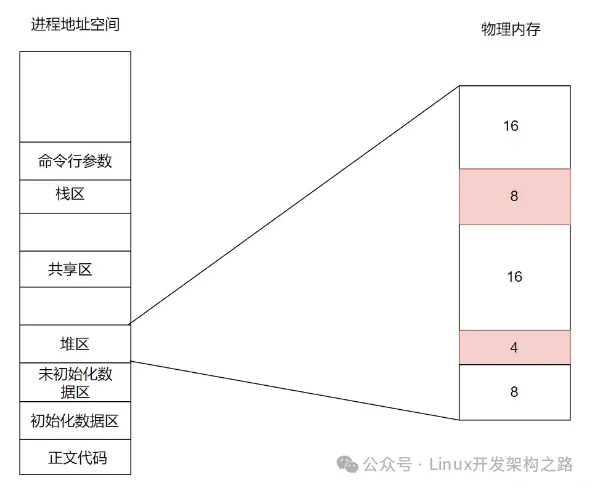

假设系统依次分配了16byte、8byte、16byte、4byte，还剩余8byte未分配。这时要分配一个24byte的空间，操作系统回收了一个上面的两个16byte，总的剩余空间有40byte，但是却不能分配出一个连续24byte的空间，这就是内存碎片问题。

> 内存碎片主要分为两种：

  * 内部碎片：内部碎片是指已经被分配给进程或应用程序的内存块中未被使用的部分。例如，如果一个进程请求了一块较大的内存空间，但实际上只使用了其中的一部分，那么剩余的部分就会成为内部碎片。

  * 外部碎片：外部碎片是指未被分配的内存块之间的小块空闲内存，这些空闲内存虽然总和可用内存量很大，但由于它们分散在内存中，无法被有效利用，从而导致内存浪费。上面的例子就属于外部碎片问题。

> 内存碎片带来的影响：

  * 降低内存利用率： 内存碎片使得一部分内存无法被有效利用，从而降低了系统的内存利用率。

  * 影响性能： 当系统中存在大量的内存碎片时，系统可能无法为大型内存请求提供连续的内存空间，从而导致频繁的内存分配和释放操作，影响系统的性能。

  * 增加内存管理开销： 内存碎片可能导致内存管理算法变得复杂，增加了内存管理的开销。

使用内存池可以减少内存碎片问题。

### 2.申请效率问题

它通过预先分配一定数量的内存块，并在需要时从这些预分配的内存块中获取内存，可以提高内存申请的效率，减少内存申请和释放的开销。

有了内存池后，当动态申请内存时，直接从内存池中获取一个预分配的内存块，避免了动态内存分配的开销，提高了内存申请的效率，不再需要操作系统在内存频繁的申请内存了。

## 实现一个定长内存池

定长内存池就是针对固定大小内存块的申请和释放的内存池，由于定长内存池只需要支持固定大小内存块的申请和释放，因此我们可以将其性能做到极致，并且在实现定长内存池时不需要考虑内存碎片等问题，因为我们申请/释放的都是固定大小的内存块。

定长内存池也叫做对象池，在创建对象池时，对象池可以根据传入的对象类型的大小来实现“定长”。因此我们可以通过使用模板参数来实现“定长”，比如创建定长内存池时传入的对象类型是int，那么该内存池就只支持4字节大小内存的申请和释放。

> 定长内存池所需要的成员变量

对于定长内存池肯定需要先向系统申请一大块内存，然后对其进行管理。还需要知道剩余内存大小信息。对于已经释放的内存还需要管理再次使用。

对于已经释放的内存使用自由链表进行管理。

图解：

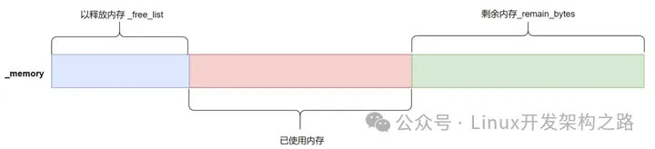


类图：

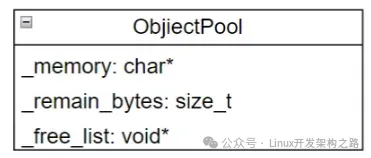

  * `_memory`: 维护申请到的一大块内存池

  * `_remain_bytes`: 内存池中剩余字节数

  * `_free_list`: 释放回来后的自由链表头指针

将维护内存池的指针设置为`char*`，这样申请获得申请内存对象的大小后，直接对其进行加法操作即可。因为指针加整数的操作是根据指针类型来计算新的地址的。比如`int* + 8`，会让指针加上8个int大小的地址。即移动了32个字节。`char* + 8` 就只会移动8个字节。`char*` 方便对内存池进程切割

> 管理已释放内存

对于还给内存池的内存块，使用自由链表进行管理，自由链表维护了一个列表，其中每个节点代表一个可用的内存块，并且这些内存块可能是连续的或者分散的。自由链表的基本思想是，当需要分配内存时，可以从自由链表中选择一个可用的内存块分配给请求者；当释放内存时，将被释放的内存块添加到自由链表中，以便之后的内存分配请求可以使用。

同时也不需要对其设计专门的链式结构，让内存块的前4个字节(32位下)或者前8个字节(64位下)存储下一个内存块的地址即可。当有新的内存块释放时，对自由链表进行头插即可。


注意：以32位平台为例：可能申请的对象不足4字节，在申请空间时，如果小于4字节，就多开一点空间最少开4字节，为了自由链表做牺牲。

> 定长内存池的实现

```cpp
template<class T>
class ObjectPool
{
public:
  T* New() {
    T* obj = nullptr;
    //先使用已经释放的内存块
    if (_free_list != nullptr) {
      void* next = *((void**)_free_list);
      obj = (T*)_free_list;
      _free_list = next;
    } else {
      //剩余内存不够一个对象大小时，重新开空间
      if (_remain_bytes < sizeof(T)) {
        _remain_bytes = 128 * 1024;
        _memory = (char*)malloc(_remain_bytes);
        if (_memory == nullptr) {
          printf("malloc fail");
          exit(-1);
        }
      }
      
      obj = (T*)_memory;//类型匹配
      size_t obj_size = sizeof(T) < sizeof(void*) ? sizeof(void*) : sizeof(T);//保证对象能够存下指针的大小 比指针还小就多开点
      _memory += obj_size;//char* 用了多少直接加
      _remain_bytes -= obj_size;

    }
    //定位new在已分配的内存块上使用定位 new 构造对象
    new(obj)T;
    return obj;
  }

  void Delete(T* obj) {
    //显示调用该对象的析构函数清理该对象 防止该来中有动态资源没有释放造成内存泄漏。
    obj->~T();
    //自由链表头插
    *(void**)obj = _free_list;
    _free_list = obj;
  }

private:
  char* _memory = nullptr;//维护大的内存池指针
  size_t _remain_bytes = 0;//剩余内存字节数
  void* _free_list = nullptr;//管理释放回来的自由链表头指针
};
```

解析：

先不考虑有已经释放内存块的情况，图解整个为对象动态开辟空间的过程。

  * 申请过程

首先内存池会申请128kb大小的内存池，让对象obj指向内存池的起始地址。


确定对象大小，如果不足地址的大小，就多开一些，为后面自由链表做牺牲。假设对象大小是32字节。维护内存池的_memory指针就会向后移动32字节，同时剩余地址字节数也会更新。(后面在申请时，根据内存池剩字节数和对象大小来判断是否需要重新开空间)


然后通过定位new，在已分配的内存块上构造对象。最后返回对象的指针即可。到此不考虑有以释放内存的动态开辟空间的过程就完了。

  * 释放过程：

释放已申请空间,释放已申请空间就是将内存块头插到自由链表的过程。需要注意的是，将内存块的头四个字节来存储下一个内存块的地址，存放是有技巧的。首先在申请的时候，如果对象不足一个地址的大小，就会按照一个地址的大小来开辟，32位下指针4个字节，64位下，指针8个字节。开空间很好开，但是要拿到对象的头四个字节或者八个字节是需要解引用操作的。指针的类型决定了指针解引用的大小。这样，32位平台和64位平台下，不使用二级指针，就要做条件判断。使用二级指针，就能很好的解决这个问题。

`void**`一个二级指针，在32位下，他的大小是4字节，64位下是8字节。因为指针大小不论类型，只有在不同的平台下才有差距。

但是如果对`void**`进行解引用操作，即`*(void**)`,在不同的平台下就是不同的大小，32位下，`void*` 指针的大小是4个字节，而 `void**` 是指向 `void*` 指针的指针，因此其大小也是4个字节。当对 `void**` 进行解引用操作时就会访问`void*`大小字节数，也就是4个字节。在64位平台下，对其进行解引用操作，也会访问`void*`大小字节数，就是8个字节。因为指针解引用取决于指针指向数据类型的大小，比如一个指针指向int类型的数据，对其进行解引用就会访问4字节大小的地址。

当然不止是`void**`可以，只要是个二级指针就可以做到在32位平台下访问头四个字节，在64位下访问头8个字节。

拿到内存块对象的头4或8个字节后，就是自由链表头插的过程了。

自由链表头插：(32位下为例)

如果是第一次头插，`_free_list == nullptr` 让内存块对象的头四字节指向`_free_list`,再让`_free_list`指向内存块。


如果不是第一次头插，也可以让新的内存块头四字节指向`_free_list`,再让`_free_list`指向新的内存块。


这样就不用做特殊情况处理了，每次头插都可以使用同样的逻辑处理。

```c
*(void**)obj = _free_list;
_free_list = obj;
```

以上就是整个内存释放的过程。

当自由链表不为空，说明下次为对象动态开辟空间时，就会先使用自由链表中的内存块。

```c
void* next = *((void**)_free_list);
obj = (T*)_free_list;
_free_list = next;
```

自由链表中头四个字节存放的是下一个内存块的地址，先保存起来，在让obj指向自由链表，从自由链表中定位new即可(还是从内存池中申请空间，这里只是抽象了一下。从内存池中以释放的地址中进行申请)。最后更新一下自由链表即可。

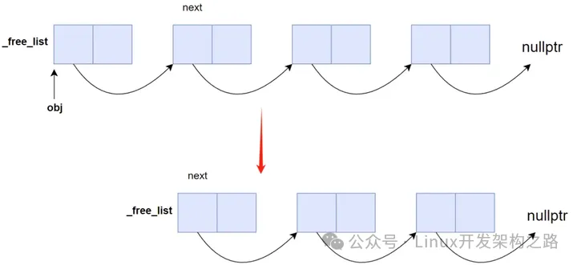

> 性能对比

性能测试要在release下进行测试，debug下会关闭优化，且可能会启用额外的运行时检查（如边界检查、空指针检查等）。

  * 内置类型对比：
  
```cpp
void test()
{
  // 申请释放的轮次
  const size_t Rounds = 5;

  // 每轮申请释放多少次
  const size_t N = 10000000;

  //使用new和delete
  std::vector<int*> v1;
  v1.reserve(N);
  size_t begin1 = clock();
  for (int i = 0; i < Rounds; ++i)
  {
    for (int j = 0; j < N; ++j)
    {
      v1.push_back(new int());
    }
    for (int j = 0; j < N; ++j)
    {
      delete v1[j];
    }  
    v1.clear();
  }
  size_t end1 = clock();
  //使用内存池
  std::vector<int*> v2;
  v2.reserve(N);
  ObjectPool<int> obj_pool;
  size_t begin2 = clock();
  for (int i = 0; i < Rounds; ++i)
  {
    for (int j = 0; j < N; ++j)
    {
      v2.push_back(obj_pool.New());
    }
    for (int j = 0; j < N; ++j)
    {
      obj_pool.Delete(v2[j]);
    }
    v2.clear();
  }
  size_t end2 = clock();

  cout << "USE NEW TIME = :" << end1 - begin1 << endl;
  cout << "USE OBJECTPOOL TIME = :" << end2 - begin2 << endl;
}
```

运行结果：


对于一千万内置类型数据，申请释放五次，使用内存池会快27倍的。非常的恐怖。

  * 自定义类型

自定义一个二叉树节点类

```cpp
struct TreeNode
{
  int _val;
  TreeNode* _left;
  TreeNode* _right;

  TreeNode()
    :_val(0)
    , _left(nullptr)
    , _right(nullptr)
  {}
};
```

对其进行测试

```cpp
void test()
{
  // 申请释放的轮次
  const size_t Rounds = 5;

  // 每轮申请释放多少次
  const size_t N = 10000000;

  //使用new和delete
  std::vector<TreeNode*> v1;
  v1.reserve(N);
  size_t begin1 = clock();
  for (int i = 0; i < Rounds; ++i)
  {
    for (int j = 0; j < N; ++j)
    {
      v1.push_back(new TreeNode());
    }
    for (int j = 0; j < N; ++j)
    {
      delete v1[j];
    }  
    v1.clear();
  }
  size_t end1 = clock();
  //使用内存池
  std::vector<TreeNode*> v2;
  v2.reserve(N);
  ObjectPool<TreeNode> obj_pool;
  size_t begin2 = clock();
  for (int i = 0; i < Rounds; ++i)
  {
    for (int j = 0; j < N; ++j)
    {
      v2.push_back(obj_pool.New());
    }
    for (int j = 0; j < N; ++j)
    {
      obj_pool.Delete(v2[j]);
    }
    v2.clear();
  }
  size_t end2 = clock();

  cout << "USE NEW TIME = :" << end1 - begin1 << endl;
  cout << "USE OBJECTPOOL TIME = :" << end2 - begin2 << endl;
}
```

运行结果：

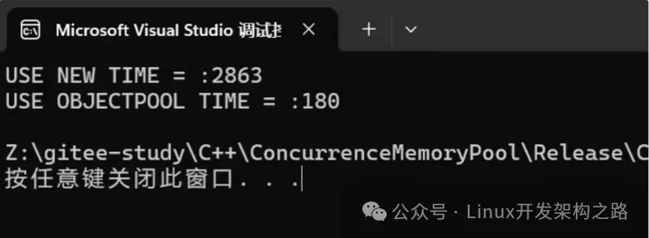

同样对于一千万自定义类型数据，进行五轮申请释放，使用内存池会快将近18倍。

> 这里内存池和new底层都是使用malloc进行的

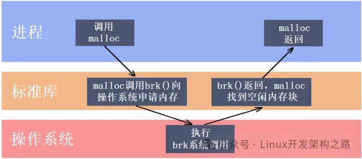

malloc函数在内部可能会实现一些简单的内存池管理策略。可以不通过malloc直接使用系统调用接口向堆区申请空间。在windows下使用VirtualAlloc系统调用接口，用于在进程的虚拟地址空间中分配内存。它可以用于分配一块指定大小的内存，并返回指向这块内存的指针。在Linux下，可以调用brk或mmap函数。

```cpp
#ifdef _WIN32
#include <Windows.h>
#else
//...Linux
#endif

//直接去堆上申请按页申请空间
inline static void* SystemAlloc(size_t kpage)
{
#ifdef _WIN32
  void* ptr = VirtualAlloc(0, kpage << 13, MEM_COMMIT | MEM_RESERVE, PAGE_READWRITE);
#else
  // linux下brk mmap等
        void* ptr = mmap(0, kpage << 13, PROT_READ | PROT_WRITE, MAP_PRIVATE | MAP_ANONYMOUS, -1, 0);
#endif
  if (ptr == nullptr)
  {
    printf("malloc fail");
    exit(-1);
  }
  return ptr;
}
```

在内存池new的时候调用SystemAlloc进行申请

```c
_memory = (char*)SystemAlloc(_remain_bytes >> 13);
```

这样，动态申请内存的时候就完全脱离malloc了。VirtualAlloc 函数在 Windows 系统中以页面（page）为单位进行内存申请。页面大小是操作系统的内存管理单位，通常是 8KB。`128*1024`字节，右移13位就是除以8kb。申请的时候申请16页即可。

## 高并发内存池(concurrent memory pools)

在高并发多线程的环境下，在申请内存的时，必然存在激烈的锁竞争问题。malloc本身其实已经很优秀了，但是在并发场景下可能会因为频繁的加锁和解锁导致效率有所降低，而该项目的原型tcmalloc实现的就是一种在多线程高并发场景下更胜一筹的内存池。

对比上面的定长内存池，高并发内存池不仅要解决内存碎片问题和效率问题，还要解决多线程环境下，锁竞争的问题。

对比malloc,malloc本身已经很优秀了，它在性能方面可能不够高效，特别是在多线程环境下，可能存在锁竞争等问题。tcmalloc（Thread-Caching Malloc）是由 Google 开发的一种针对多线程应用的高性能内存分配器。它采用了线程本地缓存技术，减少了线程间的竞争，提高了性能。

tcmalloc 在空间利用率方面可能比 malloc 更好。它有更好的内存回收策略和碎片整理机制，可以减少内存碎片化，提高内存利用率。

Concurrent Memory Pools主要由3个部分组成

### 1.线程缓存 (thread cache)：

thread cache 其主要思想是为每个线程维护一个本地的内存缓存，以减少多线程并发操作时的锁竞争，提高内存分配的性能。thread cache 是每个线程独有的，用于小于256kb的内存分配，线程从这里申请内存不需要加锁，每个线程独享一个thread cache。这也是并发内存池高效的一个地方。

### 2.中心缓存(central cache)：

中心缓存是所有线程共享的，thread cache 按需从central cache中获取对象。central cache周期性的回收thread cache的对象。避免一个线程占用太多的内存，导致其他线程内存吃紧。做到内存分配在多线程中更加均衡的按需调度的目的。central cache是存在竞争的，从这里取内存对象是需要加锁保护的。

### 3.页缓存(page cache)：

页缓存是在central cache上面的一层缓存，存储的内存是以页为单位存储以及分配的。central cache没有内存时，从page cache分配出一定数量的page，并切割成定长大小的小块内存块，分配给central cache。page cache没有足够的内存时，就会向堆区申请。

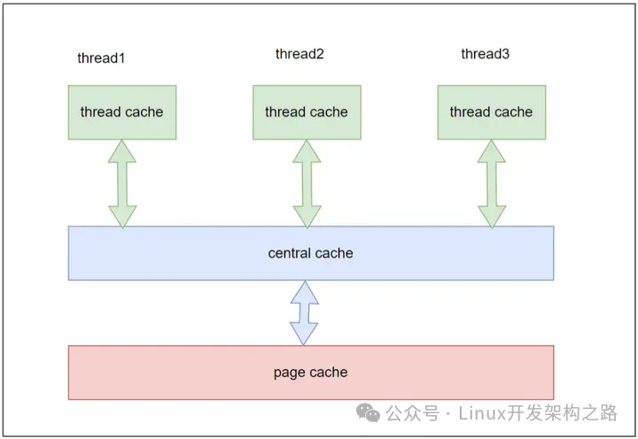

下面就一一实现各层，看看是如何将性能发挥到极致的。

## Thread Cache

定长内存池只支持固定大小对象内存的申请和释放，在定长内存池中只需要一个自由链表即可管理。在高并发内存池中，要支持不同大小对象内存的申请和释放，这就需要多个自由链表进行管理。thread cache 本质是一个哈希桶，每个桶都是大小不同的自由链表。逻辑图如下：

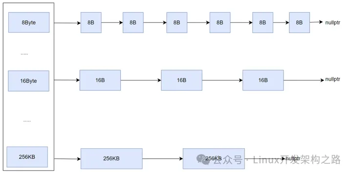

Thread Cache支持小于256Kb内存申请。最小支持8字节的内存申请(因为64位下，回收回来的内存要使用自由链表管理，自由链表使用头部地址存放一下个内存块的地址，64位下，一个地址至少8字节)。

如果从8字节开始到256Kb，每个大小都挂一个自由链表，至少需要256*1024 - 8个自由链表，也就是26万多个桶。仅只是保存这些自由链表，至少都需要256kb空间。释放的时候，自由链表下在存放一些内存块，一个Thread Cache对象都占用很大的空间了。而Thread Cache在多线程环境下是每个线程独享的，创建线程的时候就会分配Thread Cache对象。一个进程，多创建几个线程，仅仅维护Thread Cache对象都需要很大的内存空间了。

解决这个问题，参考tcmalloc采用了特定对齐规则。让这些字节数进行向上对齐，比如申请1个字节时，会直接申请8个字节，剩余的可以七字节不用。申请9字节时，会直接给16字节。

对齐规则并不是256KB内的都按照8Byte进行对齐，如果都按照8Byte对齐，256Kb则需要`256*1024 / 8 = 32768`个桶，还是比较多。让不同范围的按照不同的对齐规则进行对齐，对齐规则如下：

<table><tbody><tr><th style=";"><p>字节数</p></th><th style=";"><p>对齐数</p></th><th style=";"><p>自由链表下标</p></th></tr><tr><td><p>[1-128]</p></td><td><p>8 Byte</p></td><td><p>[0,16)</p></td></tr><tr><td><p>[128+1,1024]</p></td><td><p>16 Byte</p></td><td><p>[16,72)</p></td></tr><tr><td><p>[ 1024 + 1 ， 8 * 1024]</p></td><td><p>128 Byte</p></td><td><p>[72,128)</p></td></tr><tr><td><p>[8* 1024 + 1, 64 * 1024]</p></td><td><p>1024 Byte</p></td><td><p>[128,184)</p></td></tr><tr><td><p>[64*1024+1,256 * 1024 ]</p></td><td><p>8*1024 Byte</p></td><td><p>[184,208)</p></td></tr></tbody></table>

使用上面对齐规则，桶的个数控制在了208个，也就是自由链表的下标是[0-207]。逻辑图如下：

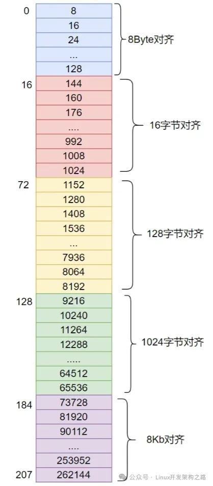

采用对齐规则后，一定会带来内碎片的问题。使用好的对齐规则，可以减少空间浪费率。空间浪费率：


使用上面的对齐规则后，根据公式浪费率最大就是分子最大且分母最小的时候。

  * 比如在`[128+1,1024]`这个区间。开129字节时，浪费率最大。实际开了`16*9=144`字节。浪费了15字节。此时浪费率为10.41%。

  * 在`[1024+1,8*1024]`这个区间中，开1025字节时，浪费率最大。实际开了1152字节。浪费了127字节。浪费率等于11.02%

  * 在最后一个区间`[641024+1,256 * 1024]`中，开641024+1字节浪费率最大。实际开了73728字节。浪费了8211字节。浪费率为11.13%。

不考虑第一个区间，因为第一个区间的浪费率太大了。这里浪费率从第二区间开始。按照上面的对齐规则，空间浪费率最低。

采用上面的内存对齐规则，可以控制空间浪费率到10%左右。tcmalloc实际的对齐规则比这还要复杂很多，但是基本原理是这样的，就是让浪费率最低即可。

实现一个类，专门计算向上对齐规则。这里参考了tcmalloc的计算规则。

```cpp
class SizeClass
{
public:  
  static const size_t MAX_BYTES = 256 * 1024;
  
  // tcmalloc库的写法 返回实际开辟字节数
  static inline size_t _RoundUp(size_t bytes, size_t align)
  {
    return ((bytes + align - 1) & ~(align - 1));
  }

  //根据对象大小计算对齐规则   
  static inline size_t RoundUp(size_t bytes)
  {
    assert(bytes <= MAX_BYTES);
    if (bytes <= 128)
    {
      return _RoundUp(bytes, 8);//按照8字节对齐
    }
    else if (bytes <= 1024)
    {
      return _RoundUp(bytes, 16);//按照16字节对齐
    }
    else if (bytes <= 8 * 1024)
    {
      return _RoundUp(bytes, 128);//按照128字节对齐
    }
    else if (bytes <= 64 * 1024)
    {
      return _RoundUp(bytes, 1024);//按照1024字节对齐
    }
    else if (bytes <= 256 * 1024)
    {
      return _RoundUp(bytes, 8*1024);//按照8*1024字节对齐
    }
    else
    {
      assert(false);
      return -1;
    }
  }
};
```

### Thread Cache的实现

ThreadCache 核心就是自由链表 这里封装一个自由链表，做为Thread Cache类的成员。

```cpp
class FreeList
{
public:
  //头插
  void Push(void* obj)
  {
    *(void**)obj = _free_list;
    _free_list = obj;
                
    ++_size;
  }

  //头插一段链表
  void PushRound(void * start,void* end,size_t size)
  {
    *(void**)end = _free_list;
    _free_list = start;

    _size += size;
  }

  //头删
  void*Pop()
  {
    void* next = *((void**)_free_list);
    void* obj = _free_list;
    _free_list = next;
                
    --_size;
    return obj;
  }   

  //头删一段链表
  void PopRound(void*& start,void*& end,size_t size)
  {
    start = _free_list;
    end = start;
    for (size_t i = 0; i < size - 1; ++i)
    {
      end = NextObj(end);
    }
    _free_list = NextObj(end);
                
    _size -= size;
    NextObj(end) = nullptr;
  }

  bool IsEmpty()
  {
    return _free_list == nullptr;
  }

  //获取当前链表最大个数
  size_t& MaxSize()
  {
    return _max_size;
  }

  //获取当前链表元素个数
  size_t Size()
  {
    return _size;
  }

private:
  void* _free_list = nullptr;
  size_t _max_size = 1;
  size_t _size = 0;
};
```

Thread Cache类的声明。

```cpp
#pragma once
#include "Common.h"

class ThreadCache
{
public:
  //申请内存对象
  void* Allocate(size_t size);
  //释放内存对象
  void Deallocate(void* ptr,size_t size);
  // 从中心缓存获取对象
  void* FetchFromCentralCache(size_t index, size_t size);
  // 释放对象时，链表过长时，回收内存回到中心缓存
  void ListTooLong(FreeList& list, size_t size);
private:
  FreeList _free_list[NFREELISTS];//管理切分好的自由链表(哈希桶)
};

//使用 __declspec(thread) 声明的变量将为每个线程创建一个独立的副本
//每个线程都可以在其独立的存储空间中访问该变量，而不会影响其他线程的副本。
//让这个指针维护thread cache进行内存时申请和释放
static __declspec(thread) ThreadCache* tls_threadcache = nullptr;
```

其中ThreadCache的属性有：

  * `FreeList _free_list[NFREELISTS]`:哈希桶(一共208个桶)

ThreadCache提供的方法有：

  * `void* Allocate(size_t size);`:申请内存

  * `Svoid Deallocate(void* ptr,size_t size);`:释放内存

  * `void* FetchFromCentralCache(size_t index, size_t size);`:Thread Cache没有内存时，从Central Cache中获取。

  * `void ListTooLong(FreeList& list, size_t size);`：释放时，链表太长释放一部分到Central Cache。

### ThreadCache支持无锁并发访问

小于256kb的内存申请直接从ThreadCache中进行申请(如果有)。一般进程申请空间的时候，小块内存的申请更加频繁，几乎很少申请一大块空间。

多线程环境下，多个线程向内存池申请内存时，不加锁和加锁的效率是两个等级的。Thread Cache在设计的时候，就是让每一个线程独享一个Thread Cache对象，这样，在申请小对象的时候，可以有效的提高效率。

让ThreadCache支持无锁并发访问，就是让每个线程独立一个ThreadCache对象。需要用到线程局部存储TLS(Thread Local Storage)机制。

#### TLS机制：

  * 用于在多线程程序中为每个线程分配独立的存储空间。它允许每个线程拥有自己的数据副本，这样每个线程可以在其私有存储空间中保存数据，而不会受到其他线程的影响。

  * TLS 的主要目的是解决多线程环境下的数据共享与隔离问题。在多线程程序中，如果多个线程共享同一块内存区域，那么这些线程的并发访问可能会导致数据竞争和不确定的行为。而使用 TLS 可以确保每个线程都有自己独立的数据副本，从而避免了数据共享带来的问题。

> TLS对象声明

```c
static __declspec(thread) ThreadCache* tls_threadcache = nullptr;
```

> TLS使用方法

使用`new tls_threadcache = new ThreadCache();`

脱离new，直接使用上面实现的定长内存池进行申请

```cpp
static ObjectPool<ThreadCache> thread_cache_pool;
tls_threadcache = thread_cache_pool.New();
```

### Thread Cache申请内存

Thread Cache申请内存通过Allocate函数进行申请。实现Allocate函数。

  * 在申请内时，先根据对象大小，确定桶的位置。

  * 如果桶中有内存对象时，直接从自由链表中pop一个对象返回即可。

  * 时间复杂度是O(1)。并且没有锁的竞争。

  * 如果桶中没有内存对象时，就从Central Cache中获取，获取的对象大小一定是经过对齐规则计算后的大小。

```cpp
void* ThreadCache::Allocate(size_t size)
{
  assert(size <= MAX_BYTES);
  //确定桶的位置
  size_t index = SizeClass::Index(size);
  //确定对齐规则
  size_t align_size = SizeClass::RoundUp(size);
  //eg 申请127字节  按照8字节对齐，实际align_size = 128, index = 15。
  if (_free_list[index].IsEmpty())//空就去中心缓存获取 暂时不考虑大于256kb的情况
  {
    //中心缓存一次可能会多申请空间，只返回当前对齐数的大小，剩余的存到thread cache的自由链表中
    return FetchFromCentralCache(index, align_size);
  }
  else
  {
    return _free_list[index].Pop();
  }
}
```

从Central Cache获取对象时，也是有对应的策略的。Central Cache 是多线程共享的，频繁的申请要加锁，会有锁的竞争，会降低效率的。所以，参考tcmalloc，使用一定的反馈算法来一次批量的申请内存。

比如频繁的从Central Cache 中申请8Kb大小的内存时，会根据慢反馈调节算法，一次批量的申请多个大小的内存块。

比如第一次申请8Kb，申请一个，第二次申请时，申请两个，返回一个，多申请的交给自由链表管理，下次再申请8kb的时候，Thread Cache的自由链表就有内存了，不用再去向Central Cache申请了。以此类推，当然，这个算法还要定一个上限，不能一下申请好几万个交给自由链表管理。上限规定，一次最多申请512个内存块，申请太多会成负担的。【这个机制和网络中的tcp协议的慢启动 机制类似】

```cpp
static size_t NumMoveSize(size_t size)
{
    assert(size > 0);

    // [2, 512]，一次批量移动多少个对象的(慢启动)上限值
    // 小对象一次批量上限高
    // 小对象一次批量上限低
    int num = MAX_BYTES / size;
    if (num < 2)
            num = 2;

    if (num > 512)
            num = 512;

    return num;
}
```

根据慢反馈调节算法，决定了一次从Central Cache申请多少内存。如果申请到1个的话，就直接返回给Allocate即可，申请到多个，将剩余的一部分插入到自由链表中(自由链表提供PushRound()函数，可以一次插入一段链表)，将第一个内存块返回给Allocate即可。

```cpp
void* ThreadCache::FetchFromCentralCache(size_t index, size_t size)
{
  // 慢开始反馈调节算法
  //NumMoveSize决定上限  
  size_t batch_num = min(_free_list[index].MaxSize(),SizeClass::NumMoveSize(size));
  if (batch_num == _free_list[index].MaxSize())
  {
    _free_list[index].MaxSize()+=1;
  }

  // 从中心缓存中获取一段内存 可能会多申请 多申请的放到thread cache即可
  void* start = nullptr;
  void* end = nullptr;
  size_t actual_num = CentralCache::GetInstace()->FetchRangeObj(start, end, batch_num, size);
  assert(actual_num >= 1);//至少申请一个
  if (actual_num == 1)
  {
    return start;
  }
  else
  {
    _free_list[index].PushRound(NextObj(start), end, actual_num -1 );
    return start;
  }
}
```

### Thread Cache释放内存

Thread Cache申请内存通过Deallocate函数进行申请。实现Deallocate函数。

  * 当释放的内存小于256Kb时，直接计算对象大小对应桶的位置，插入到对应的桶中即可。

```cpp
void ThreadCache::Deallocate(void* ptr, size_t size)
{
  //根据大小确定桶的位置
  size_t index = SizeClass::Index(size);
  _free_list[index].Push(ptr);
  //自由链表超过批量申请的大小  还给Cetral Cache
  if (_free_list[index].Size() >= _free_list[index].MaxSize())
  {
    ListTooLong(_free_list[index], size);
  }
}
```

  * Thread Cache一直回收内存，一直回收，会导致链表长度太长了，也会带来维护成本。当回收完内存时，计算一下链表长度，如果超过批量申请的大小，就还给Central Cache。

```cpp
void ThreadCache::ListTooLong(FreeList& list, size_t size)
{
  //取一段内存 给Central Cache
  void* start = nullptr;
  void* end = nullptr;
  list.PopRound(start, end, list.MaxSize());
  CentralCache::GetInstace()->ReleaseListToSpans(start, size);
}
```

## Central Cache

### Central Cache设计框架

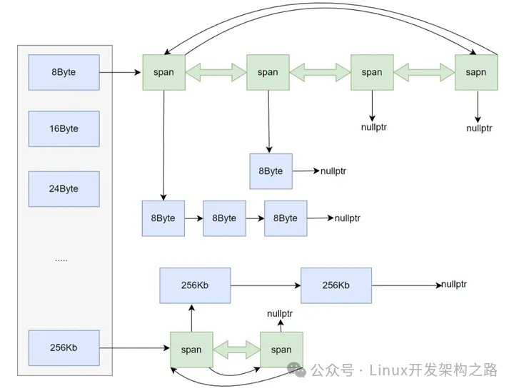

Central Cache主要为Thread Cache提供服务，哈希映射规则采用的是按字节进行映射。经过一定的规则对齐后的映射。

central cache的结构与thread cache是一样的，它们都是哈希桶的结构，并且它们遵循的对齐映射规则都是一样的。这样做的好处就是，当thread cache的某个桶中没有内存了，就可以直接到central cache中对应的哈希桶里去取内存就行了。

Cecntral Cache的结构和Thread Cache是一样的，但是，Thread Cache是每一个线程独享的，Central Cache是多线程共享的，在整个内存池中只有一个Central Cache，再实现的时候，将其设计成为单例模式更为合理。

每个线程的Thread Cache对象没有内存时都会向Central Cache进行申请，多线程环境下，要注意加锁问题。Central Cache在加锁的时候，并不是将整个Central Cache都加上锁，可以设计成为桶锁。只有当多线程同时从一个桶去申请内存时，才会有互斥的行为。比如线程1申请8Byte内存，线程2申请256kb内存，俩个线程不是从同一个桶中申请内存的，这种情况这两个线程就不用存在互斥关系，可以并发同时进行申请。这也是内存池高效的原因之一。

Thead Cache的每一个桶都是对应大小的自由链表，而Central Cache的桶则是一个一个的span对象。sapn管理的是以页为单位的大块内存块。用双向带头循环链表的方式将这些span管理起来。而每个span还有自由链表对象。

每个进程都有自己的进程地址空间，32位下，进程地址空间最大是2^32，也就是4Gb。而64位下，进程地址空间最大是2^64。这些地址空间，按页为单位进行划分，一页普遍是8kb。64位下，一共有`2^64 / 2^13 = 2^51`页。管理页号这里，32位下和64位下，使用不同的类型记录。32位下，`size_t`类型完全足够，但是64位下，`size_t` 类型远远不够。64位下用unsigned long long类型保存(表示无符号的 64 位整数)。

存储页号，使用条件编译解决。当然，实际上不可能有这么多的页号，进程地址空间的地址是虚拟的，实际上没有这么多，64位下，2^64字节，16TB的地址空间大小，一般计算机很难有这个水平的，大公司的服务器一般才有这个配置。虚拟地址就是每个进程都“以为”自己能有16tb,但是一般普通的计算机实际根本到不了。还是根据实际的物理内存来的。尽管是虚拟的，也要按照最大的来进行维护页号。

```cpp
#ifndef _WIN64
  typedef unsigned long long PAGE_ID;
#elif _WIN32
  typedef size_t PAGE_ID;
#endif // !_WIN64
```

### sapn

sapn描述是以页为单位的大块内存的

```cpp
//管理以页为单位的大块内存
struct Span
{
  PAGE_ID _page_id = 0; //页号
  size_t _page_num = 0;//页的数量

  Span* _prev = nullptr;
  Span* _next = nullptr;

  size_t _obj_size = 0;//对象大小 
  size_t _use_count = 0;
  void* _free_list = nullptr;
  bool _is_use = false;//span对象是否被使用
};
```

span描述的以页为单位的大块内存，我们需要知道这块内存具体在哪一个位置，便于之后page cache进行前后页的合并，因此span结构当中会记录所管理大块内存起始页的页号。

至于每一个span管理的到底是多少个页，这并不是固定的，需要根据多方面的因素来控制，因此span结构当中有一个_page_num成员，该成员就代表着该span管理的页的数量。

span中对象大小属性，在释放的时候，根据地址获取页号，再根据页号获取对应的span，从sapn中获取到对象的大小，再释放的时候直接根据地址就可以确定大小了，不用再释放的时候也传对象大小。

每个span管理的大块内存，都会被切成相应大小的内存块挂到当前span的自由链表中，比如8Byte哈希桶中的span，会被切成一个个8Byte大小的内存块挂到当前span的自由链表中，因此span结构中需要存储切好的小块内存的自由链表_free_list。

在Page Cache中会进行合并操作，需要记录一下当前span是否正在被使用，如果正在使用就无法进行合并操作。

将这些sapn对象以循环双链表组织起来，做为Central Cache的成员变量。

```cpp
class SpanList
{
public:
  SpanList()
  {
    _head = new Span;
    _head->_next = _head;
    _head->_prev = _head;
  }

  Span* Begin()
  {
    return _head->_next;
  }

  Span* End()
  {
    return _head;
  }
  
  void Insert(Span* cur, Span* newspan)
  {
    assert(cur != _head);
    assert(newspan != nullptr);

    Span* prev = cur->_prev;
    prev->_next = newspan;
    newspan->_prev = prev;
    newspan->_next = cur;
    cur->_prev = newspan;
  }

  void Erase(Span* cur)
  {
    assert(cur != nullptr);
    assert(cur != _head);

    Span* prev = cur->_prev;
    Span* next = cur->_next;
    prev->_next = next;
    next->_prev = prev;
  }

  bool Empty()
  {
    return _head->_next == _head;
  }

  void PushFront(Span* newspan)
  {
    assert(newspan != nullptr);
    Insert(Begin(), newspan);
  }

  Span* PopFront()
  {
    Span* front = _head->_next;
    Erase(front);
    return front;
  }

private:
  Span* _head = nullptr;
public:
  std::mutex _bucket_lock;//桶锁
};
```

### Central Cache 实现

Central Cache在整个进程中只能存在一份，将其设计成为单例。

```cpp
#pragma once
#include "Common.h"
//单例
class CentralCache
{
public:
  static CentralCache* GetInstace()
  {
    return &_inst;
  }

  CentralCache(const CentralCache&) = delete;
  CentralCache& operator=(const CentralCache) = delete;

  // 从中心缓存获取一定数量的对象给thread cache
  size_t FetchRangeObj(void*& start, void*& end, size_t num, size_t size);

  // 获取一个非空的span
  Span* GetOneSpan(SpanList& list, size_t byte_size);

  // 将一定数量的对象释放到span对象
  void ReleaseListToSpans(void* start, size_t byte_size);

private:
  CentralCache() {}
  SpanList _span_lists[NFREELISTS]; // 按对齐方式映射
  static CentralCache _inst;//静态成员变量 一定要在源文件中定义 这里只是声明
};
```

Central Cache类主要的成员就是`_span_lists`双向循环链表。

### FetchRangeObj实现

Central Cache申请内存

  * 当Thread Cache没有内存时，就会向Central Cache批量申请一些内存。Thread Cache 通过FetchRangeObj接口批量申请内存
    
```cpp
size_t CentralCache::FetchRangeObj(void*& start, void*& end, size_t batch_num, size_t size)
{
  //中心缓存和thread cache的哈希结构是一样的使用同样的方式确定下标
  size_t index = SizeClass::Index(size);
  //加桶锁
  _span_lists[index]._bucket_lock.lock();
  //从哈希桶中获取span对象(还是加锁的)
  Span* span = GetOneSpan(_span_lists[index], size);
  assert(span != nullptr);
  assert(span->_free_list != nullptr);

  //从Span中获取num个内存块
  //span中可能不够num个 有多少申请多少 
  //span可能很多 最多要batch_num个(thread cache一次批量申请的个数)
  start = span->_free_list;
  end = start;
  size_t i = 0;
  size_t actual_num = 1;
  while (NextObj(end)!= nullptr  && (i < batch_num - 1))
  {
    end = NextObj(end);
    actual_num++;
    ++i;
  }
  //更新span中的free_list 和use_count
  span->_free_list = NextObj(end);
  NextObj(end) = nullptr;
  span->_use_count += actual_num;
  _span_lists[index]._bucket_lock.unlock();  

  return actual_num;
}
```

  * Thread Cache向Central Cache批量申请内存时，就需要加桶锁了。

  * 然后通过GetOneSpan接口从SpanList中申请span对象。

  * 申请到的span对象下的内存块有两种情况分别是不足Thread Cache申请的个数。还有一种情况就是span对象下有很多个内存块，但是Thread Cache不需要这么多，最多要一次批量申请的即可。

  * 当不够Thread Cache一次批量申请的个数时，有多少申请多少即可。

  * 当超过Thread Cache一次批量申请的个数时，按照一次批量申请的最大个数申请即可。

  * 申请完后，需要及时更新span管理的自由链表和使用计数。

注意： 从哈希桶中申请sapn对象时就要加桶锁了。

### GetOneSpan实现

GetOnespan主要的功能是从Central Cache中的哈希桶中获取对应的span对象，如果Central Cache的哈希桶中有，直接返回即可，如果没有就需要从Page Cache中获取span对象了, 通过Page Cache的NewSpan接口获取(这个接口在Page Cache会详细介绍)。

```cpp
Span* CentralCache::GetOneSpan(SpanList& list, size_t size)
{
  //遍历SpanList 查找未使用的Span
  Span* iter = list.Begin();
  while (iter != list.End())
  {
    if (iter->_free_list != nullptr)
    {
      return iter;
    }
    else
    {
      iter = iter->_next;
    }
  }
  //从pagecache中获取内存时先解锁，其他线程释放内存的时候不受影响
  list._bucket_lock.unlock(); 

  //没有Span对象 去Page Cache中申请  从page cache中申请时要加锁。
  PageCache::GetInstance()->_page_mtx.lock();
  Span* span = PageCache::GetInstance()->NewSpan(SizeClass::NumMovePage(size));
  span->_is_use = true;
  span->_obj_size = size;
  PageCache::GetInstance()->_page_mtx.unlock();

  //切分的时候不用加锁  
  //对span进行切分 需要知道大块内存的起始地址和大块内存的字节数
  char* start = (char*)(span->_page_id << PAGE_SHIFT);//页号*8kb就是起始地址
  size_t byte_size = span->_page_num << PAGE_SHIFT;//页的数量*8kb就是字节数
  char* end = start + byte_size;
  //将大块内存切分成小块内存挂到自由链表下面
  //尾插 头插的话地址不连续 是反的
  span->_free_list = start;
  start += size;
  void* tail = span->_free_list;
  while (start < end)
  {
    NextObj(tail) = start;
    tail = start;
    start += size;
  }
  NextObj(tail) = nullptr;

  //将切好的span插入到spanlist中 (要加桶锁) 恢复锁 FetchRangeObj 会解锁
  list._bucket_lock.lock();
  list.PushFront(span);
  return span;
}
```

如果Central Cache中有span对象，那么直接返回给FetchRangeObj即可。如果没有，从Page Cache中获取到span对象，就需要注意以下事情：

  1. 从Page Cache获取span对象的时候，应该把桶锁先解除了。因为Central Cache是多线程共享的临界资源。比如线程1申请8kb，内存时，Thread Cache没有，就需要加桶锁向Central Cache中申请。如果此时线程2正好释放8kb内存时，由于线程2的8kb自由链表太长，需要还给Central Cache。遇到这种情况时，如果线程1不解锁，线程2释放内存时就会阻塞挂起，理论上线程2不应该被挂起。所以再向Page Cahce申请内存时，应该先解锁。等从Page Cache申请完内存后，把申请到的span需要插入到SpanList时再把锁恢复了。

  2. 从Page Cache申请到span对象后，需要把sapn管理的大块内存进行切分，切分成为申请对象大小对应的大小内存块插入到该span的自由链表下(说的比较别扭一点了，简单说就是比如申请8kb时，把span管理的大块内存块切分成8kb大小的内存块挂到自由链表下）。

具体得切分逻辑如下：

进行切分得时候不用加锁，因为其他线程不会执行到这得。

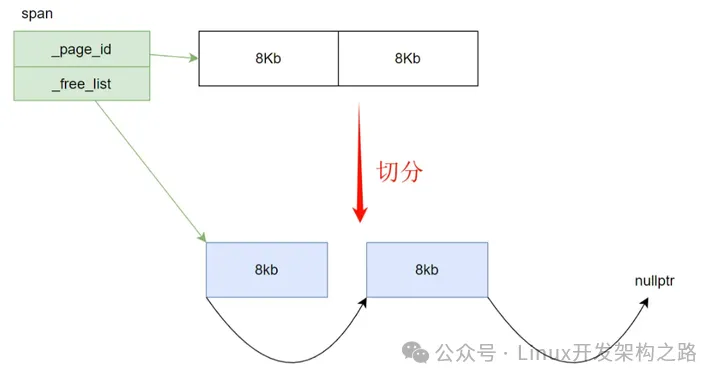

```cpp
//切分的时候不用加锁  
//对span进行切分 需要知道大块内存的起始地址和大块内存的字节数
char* start = (char*)(span->_page_id << PAGE_SHIFT);//页号*8kb就是起始地址
size_t byte_size = span->_page_num << PAGE_SHIFT;//页的数量*8kb就是字节数
char* end = start + byte_size;
//将大块内存切分成小块内存挂到自由链表下面
//尾插 头插的话地址不连续 是反的
span->_free_list = start;
start += size;
void* tail = span->_free_list;
while (start < end)
{
        NextObj(tail) = start;
        tail = start;
        start += size;
}
NextObj(tail) = nullptr;
```

### ReleaseListToSpans实现

ReleaseListToSpans主要功能是把Thread Cache回收回来得内存存放到对应span对象下得自由链表中。

```cpp
void CentralCache::ReleaseListToSpans(void* start, size_t size)
{
  size_t index = SizeClass::Index(size);
  _span_lists[index]._bucket_lock.lock();
  while (start != nullptr)
  {
    //把内存块挂到对应的span对象中 需要知道内存块和span的映射关系
    Span* span = PageCache::GetInstance()->MapObjectToSpan(start);
    void* next = NextObj(start);
    //头插到sapn下的freelist中
    *(void**)start = span->_free_list;
    span->_free_list = start;
    span->_use_count--;
    //sapn下的所有小块内存都回来了 还给pagecache 进行合并 解决内存碎片问题
    if (span->_use_count == 0)
    {
      _span_lists[index].Erase(span);
      span->_free_list = nullptr;
      span->_next = span->_prev = nullptr;

      _span_lists[index]._bucket_lock.unlock();
      PageCache::GetInstance()->_page_mtx.lock();
      PageCache::GetInstance()->ReleaseSpanToPageCache(span);
      PageCache::GetInstance()->_page_mtx.unlock();
      _span_lists[index]._bucket_lock.lock();//恢复锁
    }
    start = next;
  }
  _span_lists[index]._bucket_lock.unlock();
}
```

  * 回收得时候根据自由链表得起始地址，将其插入到对应span下得自由链表即可。同时插入的时候也要加对应得桶锁。

  * 将内存插入到span对象时，需要知道内存块和span的映射关系。就是哪个span管理的这块内存(这个哈希映射是通过Page Cache的MapObjectToSpan接口获取的。他们的映射关系在Page Cache申请span对象时就确定的，在Page Cache中会详细介绍)。

  * 当span下的自由链表的小块内存都回收回来的时候，就把这个span对象交给Page Cache进行合并，来解决内存碎片问题(外碎片问题)。

  * 交给Page Cache合并的时候，也可以把锁先解除了，这样其他线程从Central Cache申请内存时就不会阻塞了(其他span还有内存，一定先把这个span拿出来再释放锁)。

  * 同时Page Cache合并内存时，则需要加锁(这个锁并不是桶锁)。

## Page Cache

### Page Cache 设计框架：

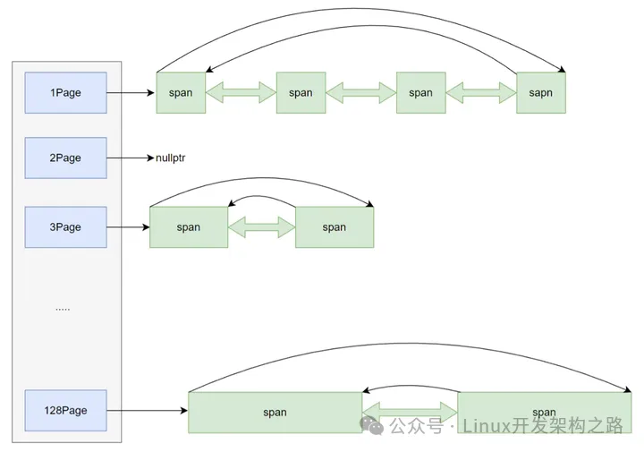

Page Cache是一个哈希桶的结构。每个桶下面都是一个个span对象。Page Cache主要向Central Cache提供服务，直接管理SpanList向Central Cache提供span对象即可。

整个Page Cache又是以页为单位来进行映射的。比如1页的映射到0号桶。128页映射到127号桶。这样映射的时候需要注意下标位置。可以多开一个空间，0-129号下标，第一个桶不用，让1页的映射到1号桶，2页的射到2号桶，依次类推。更加简单。

当前内存池支持单个对象最大是256Kb,128页刚好可以被切分成为4个256Kb对象,所以128页完全足够.

### Page Cache实现

整个进程中只能存在一个Page Cache，将Page Cache设计成为单例。

```cpp
#pragma once
#include "Common.h"
#include "ObjectPool.h"
//单例
class PageCache
{
public:
  PageCache(const PageCache&) = delete;
  PageCache& operator=(const PageCache) = delete;
  
  //获取单例对象
  static PageCache* GetInstance()
  {
    return &_inst;
  }

  //获取size页的Span给中心缓存
  Span* NewSpan(size_t size);

  // 获取从对象到span的映射
  Span* MapObjectToSpan(void* obj);

  // 释放空闲span回到Pagecache，并合并相邻的span
  void ReleaseSpanToPageCache(Span* span);
  std::mutex _page_mtx;
private:
  PageCache() {}
  static PageCache _inst;//只是声明
  SpanList _span_lsit[PAGE_NUMS];
  std::unordered_map<PAGE_ID, Span*> _id_span_map;
  ObjectPool<Span> _span_pool;
};
```

其中Page Cache的属性有：

  * `static PageCache _inst;`:单例对象。

  * `_span_lsit[PAGE_NUMS];`:管理span对象的双向循环的链表。

  * `std::unordered_map<PAGE_ID, Span*> _id_span_map;`：建立span对象和页号的映射关系，为了后续合并进行查找。

  * `ObjectPool<Span> _span_pool;`:为了脱离malloc和new，直接从上面实现的定长内存池中申请。

Page Cache提供的方法有：

  * `static PageCache* GetInstance()`:获取单例对象。

  *` Span* NewSpan实现(size_t size)`:获取size页给Central Cache。

  * `Span* MapObjectToSpan(void* obj)`;:获取页号和span对象的映射关系。

  * `void ReleaseSpanToPageCache(Span* span)`;释放空间，并且进行合并相邻的span对象。

### NewSpan实现

NewSpan的主要功能是向Central Cache的GetOneSpan函数获取span对象的。

当进程申请大于128页的内存时，就不会经过Thread Cache 和 Central Cache，直接向PageCache申请即可。而PageCache在申请时，直接从堆区申请即可。

从堆区申请按页为单位进行申请，申请到大块内存后，交给span对象进行管理。

当小于128页时，就会从对应的桶下进行查找，如果有就返回，没有就去下一个桶进行查找,，直到遍历完整个哈希表后都没有，就去堆区申请。

当去下一个桶查找时发现有的时候，就进行切分。比如申请5页的，遍历到10页后发现有未使用的span对象。就把这个10页的span进行切分，切分成两个5页的，一个返回给Central Cache，一个挂到5页的桶下面管理起来即可。

```cpp
//获取一个size页的span
Span* PageCache::NewSpan(size_t size)
{
  if (size > PAGE_NUMS -1)//大于128页 
  {
    void* ptr = SystemAlloc(size);
    //申请的内存交给span管理
    Span* span = _span_pool.New();
    //根据地址确定页号
    span->_page_id = (PAGE_ID)ptr >> PAGE_SHIFT;
    span->_page_num = size;
    _id_span_map[span->_page_id] = span;
    _id_span_map[span->_page_id + span->_page_num - 1] = span;
    return span;
  }

  //SpanList中有就返回 没有就从堆中申请
  if (!_span_lsit[size].Empty())
  {
    //建立id和span的映射关系
    Span* kspan = _span_lsit[size].PopFront();
    for (PAGE_ID i = 0; i < kspan->_page_num; ++i)
    {
      _id_span_map[kspan->_page_id + i] = kspan;
    }
    return kspan;
  }

  //检查下一个桶有没有
  for (int i = size + 1; i < PAGE_NUMS; ++i)
  {
    if (!_span_lsit[i].Empty())
    {
      //切分
      Span* nspan = _span_lsit[i].PopFront();
      Span* kspan = _span_pool.New();

      kspan->_page_id = nspan->_page_id;
      kspan->_page_num = size;

      nspan->_page_id += size;
      nspan->_page_num -= size;
      //将切分剩余的页头插到对应的桶下面
      _span_lsit[nspan->_page_num].PushFront(nspan);
      //建立nspan首尾页号的映射关系 方便page cache回收内存时进行合并查找
      _id_span_map[nspan->_page_id] = nspan;
      _id_span_map[nspan->_page_id + nspan->_page_num - 1] = nspan;
      //建立id和span的映射关系
      for (PAGE_ID i = 0; i < kspan->_page_num; ++i)
      {
        _id_span_map[kspan->_page_id + i] = kspan;
      }
      return kspan;
    }
  }

  //从堆区申请
  Span* span = _span_pool.New();
  void* ptr = SystemAlloc(PAGE_NUMS - 1);
  //根据地址确定页号  地址除8*1024即可(一页8kb)
  span->_page_id = (PAGE_ID)ptr >> PAGE_SHIFT;
  span->_page_num = PAGE_NUMS - 1;
  //插入到128号桶下
  _span_lsit[span->_page_num].PushFront(span);
  //切分 递归调用自己进行切分即可，不用再写切分逻辑了
  return NewSpan(size);
}
```

注意:

Page Cache 申请内存

  * 当central cache向page cache申请内存时，page cache先检查对应位置有没有span，如果没有则向更大页寻找一个span，如果找到则分裂成两个。比如：申请的是4page，4page后 面没有挂span，则向后面寻找更大的span，假设在10page位置找到一个span，则将 10page span分裂为一个4page span和一个6page span。

  * 如果找到128 page都没有合适的span，则向系统使用mmap、brk或者是VirtualAlloc等方式 申请128page span挂在自由链表中，再重复1中的过程。

获取页号时只能根据地址来确定页号。PageCache申请内存时都以页为单位从堆区获取。堆区申请时返回的是页的起始地址，这就涉及到如何从地址转换到页。

假设申请到的地址是0x00120000，他对应的页号就是0x00120000 除以8Kb(除8Kb直接右移13位即可)对应的是144页。

144页存放的地址就是0x00120000到0x00122000。这8kb的地址。(2000是16进制，转10进制就是8192)。

申请到的内存要与span建立映射关系，便于删除时进行合并操作。

当整个PageCache 没有对应的内存大小时，从堆区进行申请后，要进行切分操作。比如第一次申请8页大小时，整个PageCache是没有内存的，直接从堆区申请128页的内存，这时就需要切分。将128页的内存切分为一个8页的返回给Central Cache，剩余的120页挂到120号桶下即可。切分的时候直接递归调用自己即可，不用再写切分逻辑。

### MapObjectToSpan实现：

MapObjectToSpan函数就是获取页号与管理该页span对象的映射关系。方便后续进行合并查找。

获取页号时，同样也需要通过地址确定页号。确定完页号后，在`unordered_map`中查找该span对象即可。

```cpp

Span* PageCache::MapObjectToSpan(void* obj)
{
  std::unique_lock<std::mutex> lock(_page_mtx);
  //根据地址获取页号
  PAGE_ID id = ((PAGE_ID)obj >> PAGE_SHIFT);

  auto ret = _id_span_map.find(id);
  if (ret != _id_span_map.end())
  {
    return ret->second;
  }
  else
  {
    return nullptr;
  }  
}
```

### ReleaseSpanToPageCache

释放空间，并且进行合并相邻的span对象。

释放空间的时候，根据释放对象大小确定释放规则。

  * 如果大于128页。整个内存池无法管理，直接还给堆区。

  * 小于128页的，交给内存池进行管理，方便下次申请小于128页的内存，直接从内存池拿即可，不用再从堆区申请，提高整个申请效率。

Central Cache把内存块还给PageCache的时候，要把小块内存合并成大块内存，解决内存碎片问题。

  * 合并的时候，以向前合并为例。向后合并和向前合并的逻辑是一样的。先找到前一页的页号，在哈希表中查找到管理对应页的span对象。

  * 合并的时候，前一页span对象必须没有在被使用才可以合并，并且，当前页和前一页的页数不能超过128页，整个内存池只在设计的时候只管理小于128页的内存对象。

  * 比如当前对象管理的是一个5页的大小。页号为144页，先找到前一页143页。前一页是一个4页大小的sapn对象管理，并且未被使用，就可以将这俩个合并成为一个7页的。然后继续向前合并，直到不能合并为止。

  * 合并的时候只需要修改对应的页数和页号(向后合并的时候不需要更新页号，因为向后合并起始页号不会改变)。每次合并完后，将合并的span从管理span的SpanList中删除即可。

  * 合并成一个大块内存后，将合并好的span插入到对应的SpanList中管理起来，然后更新页号和span的映射关系即可。这样下次申请大块内存时，就能减少内存碎片的问题了。

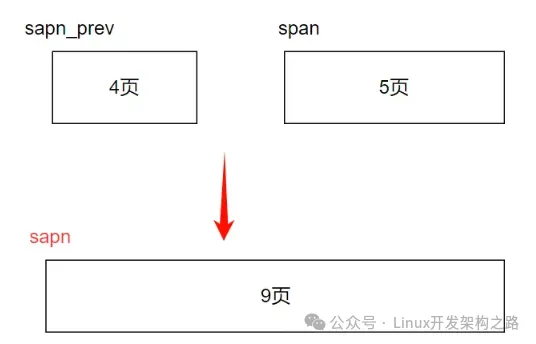

```cpp
void PageCache::ReleaseSpanToPageCache(Span* span)
{
  size_t size = span->_page_num;
  if (size > PAGE_NUMS - 1)
  {
    //根据页号计算地址
    void* ptr = (void*)(span->_page_id << PAGE_SHIFT);
    SystemFree(ptr);
    _span_pool.Delete(span);
    return;
  }

  //向前合并
  while (1)
  {
    PAGE_ID prev_span_page_id = span->_page_id - 1;
    auto ret = _id_span_map.find(prev_span_page_id);
    if (ret == _id_span_map.end())
    {
      break;
    }
    Span* prev_span = ret->second;
    if (prev_span->_is_use)
    {
      break;
    }
    if (prev_span->_page_num + span->_page_num > PAGE_NUMS - 1)
    {
      break;
    }
    //合并
    span->_page_num += prev_span->_page_num;
    span->_page_id = prev_span->_page_id;
    _span_lsit[prev_span->_page_num].Erase(prev_span);
    _span_pool.Delete(prev_span);
  }

  //向后合并
  while (1)
  {
    PAGE_ID next_span_page_id = span->_page_id + span->_page_num;
    auto ret = _id_span_map.find(next_span_page_id);
    if (ret == _id_span_map.end())
    {
      break;
    }
    Span* next_span = ret->second;
    if (next_span->_is_use)
    {
      break;
    }
    if (span->_page_num + next_span->_page_num > PAGE_NUMS - 1)
    {
      break;
    }

    //合并
    span->_page_num += next_span->_page_num;
    _span_lsit[next_span->_page_num].Erase(next_span);
    _span_pool.Delete(span);
  }

  //将合并好的插入到对应的页号下
  _span_lsit[span->_page_num].PushFront(span);
  span->_is_use = false;
  //更新页的首尾映射关系
  _id_span_map[span->_page_id] = span;
  _id_span_map[span->_page_id + span->_page_num - 1] = span;
}
```

Page Cache释放内存

  * 如果central cache 释放一个span对象，依次寻找span前后的页号的span，看是否可以合并。可以合并就继续向前或者向后进行合并，这样就可以将切小的内存块合并成大的span。可以有效的减少内存碎片。

释放内存到堆区时，是以页为单位进行释放的，需要根据页号确定地址，比如144页，144页左移13位(*8Kb)就能确定144页的起始地址了。

## 性能测试

内存池对比malloc函数进行对比。同时启动相同数量的线程，执行一样的轮次进行申请释放。比如同时启动四个线程，并发执行10000轮次，每次执行申请释放内存50次。

```cpp
#include"ConcurrentAlloc.h"
#include <atomic>

// ntimes 一轮申请和释放内存的次数
// rounds 轮次
void BenchmarkMalloc(size_t ntimes, size_t nworks, size_t rounds)
{
  std::vector<std::thread> vthread(nworks);
  std::atomic<size_t> malloc_costtime = 0;
  std::atomic<size_t> free_costtime = 0;

  for (size_t k = 0; k < nworks; ++k)
  {
    vthread[k] = std::thread([&, k]() {
      std::vector<void*> v;
      v.reserve(ntimes);

      for (size_t j = 0; j < rounds; ++j)
      {
        size_t begin1 = clock();
        for (size_t i = 0; i < ntimes; i++)
        {
          v.push_back(malloc(16));
          //v.push_back(malloc((16 + i) % 8192 + 1));
        }
        size_t end1 = clock();

        size_t begin2 = clock();
        for (size_t i = 0; i < ntimes; i++)
        {
          free(v[i]);
        }
        size_t end2 = clock();
        v.clear();

        malloc_costtime += (end1 - begin1);
        free_costtime += (end2 - begin2);
      }
      });
  }

  for (auto& t : vthread)
  {
    t.join();
  }

  printf("%u个线程并发执行%u轮次，每轮次malloc %u次: 花费：%zu ms\n",
    nworks, rounds, ntimes, malloc_costtime.load());

  printf("%u个线程并发执行%u轮次，每轮次free %u次: 花费：%u ms\n",
    nworks, rounds, ntimes, free_costtime.load());

  printf("%u个线程并发malloc&free %u次，总计花费：%u ms\n",
    nworks, nworks * rounds * ntimes, malloc_costtime.load() + free_costtime.load());
}

// ntimes 一轮申请和释放内存的次数
// rounds 轮次
// 单轮次申请释放次数 线程数 轮次
void BenchmarkConcurrentMalloc(size_t ntimes, size_t nworks, size_t rounds)
{
  std::vector<std::thread> vthread(nworks);
  std::atomic<size_t> malloc_costtime = 0;
  std::atomic<size_t> free_costtime = 0;

  for (size_t k = 0; k < nworks; ++k)
  {
    vthread[k] = std::thread([&]() {
      std::vector<void*> v;
      v.reserve(ntimes);

      for (size_t j = 0; j < rounds; ++j)
      {
        size_t begin1 = clock();
        for (size_t i = 0; i < ntimes; i++)
        {
          v.push_back(ConcurrentAlloc(16));
          //v.push_back(ConcurrentAlloc((16 + i) % 8192 + 1));
        }
        size_t end1 = clock();

        size_t begin2 = clock();
        for (size_t i = 0; i < ntimes; i++)
        {
          ConcurrentFree(v[i]);
        }
        size_t end2 = clock();
        v.clear();

        malloc_costtime += (end1 - begin1);
        free_costtime += (end2 - begin2);
      }
      });
  }

  for (auto& t : vthread)
  {
    t.join();
  }

  printf("%u个线程并发执行%u轮次，每轮次concurrent alloc %u次: 花费：%u ms\n",
    nworks, rounds, ntimes, malloc_costtime.load());

  printf("%u个线程并发执行%u轮次，每轮次concurrent dealloc %u次: 花费：%u ms\n",
    nworks, rounds, ntimes, free_costtime.load());

  printf("%u个线程并发concurrent alloc&dealloc %u次，总计花费：%u ms\n",
    nworks, nworks * rounds * ntimes, malloc_costtime.load() + free_costtime.load());
}

int main()
{
  size_t n = 50;
  cout << "==========================================================" << endl;
  BenchmarkConcurrentMalloc(n, 4, 10000);
  cout << endl << endl;

  BenchmarkMalloc(n, 4, 10000);
  cout << "==========================================================" << endl;

  return 0;
}
```

运行结果：


嗯？内存池的效率还不如malloc。用性能检测工具检测一下，看哪里的性能太差。这里使用vs自带的性能检测工具。

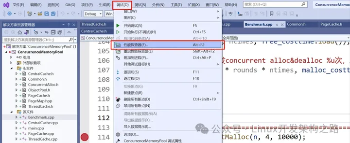


选择这个选项，可以查看每个函数调用的时间，就可以进一步定位问题了。

通过这个检测工具发现，释放的时候获取页号和span对象的这个函数占用时间最长。


进入MapObjectToSpan函数后，发现，消耗最多的是加锁问题。因为这里使用了STL中的`unordered_map`进行映射的。而STL本身是线程不安全的，必须要加锁访问。(`unordered_map`底层是哈希表，会发生动态扩容，扩容的时候必须要加锁，而map底层是红黑树，红黑树涉及到旋转问题，也必须要加锁)


解决这个问题，参考tcmalloc使用基数树进行优化。基数树本质解决的是扩容问题，让哈希表底层是固定的，不会发生动态扩容。这样，再访问时就不用担心其他线程插入数据发发生扩容，而获取到"脏数据"的问题。

## 使用基数树优化

基数树可以做到获取映射时，无锁访问。基数树实际采用的就是直接定址法，每一个页号对应span对象的地址就存储数组中在以该页号为下标的位置。


每一个页都需要映射一个sapn对象，这样在32位下，一页8kb计算，一共有2^19个页。一个地址4个字节，也就是存储他们的映射关系就需要2^19*4字节。即2Mb的空间。消耗的资源还可以。

```cpp
template<int BITS>
class TCMalloc_PageMap1
{
public:
  typedef uintptr_t Number;

  explicit TCMalloc_PageMap1()
  {
    size_t size = sizeof(void*) << BITS;//需要开辟数组的大小
    _array = (void**)SystemAlloc(size >> PAGE_SHIFT);
    memset(_array, 0, size);
  }

  void* get(Number k) const
  {
    if ((k >> BITS) > 0)
    {
      return nullptr;
    }
    return _array[k];
  }

  void set(Number k,void* v)
  {
    assert(k >> BITS == 0);
    _array[k] = v;//建立映射
  }

private:
  void** _array;
  static const int LENGTH = 1 << BITS;
};
```

基数树采用非类型模板参数，对于32位系统，PageCache创建哈希表对象时，直接传32-13即可。就是19。就是页个数的次方。(也可以直接固定死)`TCMalloc_PageMap1<32 - PAGE_SHIFT> _id_span_map;`

使用基数树替换`unordered_map`。建立映射时，调用set即可，获取映射关系时调用get即可。

比如建立span下的页号和span的映射关系:

```cpp
_id_span_map.set(span->_page_id,span);
```

获取页号和span的关系：

```cpp
Span* ret = (Span*)_id_span_map.get(span->_page_id);
```

替换完基数树后的测试结果：比使用`unordered_map`快了9倍，比malloc快了3倍。(DEBUG版本下)。


测性能DEBUG并不能很好的测试，使用RELEASE版本进行测试：

  * DEBUG下数据量尽量给小点，大了由于进程还有DEBUG信息。由于额外的调试信息和辅助数据，程序占用的内存可能会更多。申请空间时申请会失败。

  * RELEASE版本下，内存池的效率比malloc的效率高了近二倍。


  * 当然这只是固定大小的内存对象申请。内存池对于不同大小的对象申请时，由于桶锁的buff加成，效率更是快了几倍。


对于32位机器来说，使用基数树是完全没问题的，但是64位机器下，共有2^51页，开空间就要`2^51 * 8`字节。也就是16,384TB,很显然，不可能开这么多。这个问题tcmalloc解决方式是，采用多层基数树。上面的基数树称之为单层基数树。还有二层基数树。二层基数树就是进行两次哈希映射。

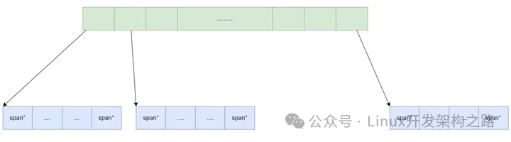

比如在32位下，存储页号需要2^19字节。而二层基数树实际上就是把这些字节分为两次进行映射。

将单层基数一次开得2mb空间，划分成多个区域，比如以4096页为单位划分，每4096页需要一个二层哈希表进行映射，第一层需要`2^19 / 2^12 = 128`字节即可。第二层，当开到对应得页号时在申请空间进行映射(一般不可能申请`2^19`页这么多)。这样就能减少空间开辟了。

如果在64位机器下，二层基数树，依然无法解决问题。采用三层基数树，进一步划分即可。三层基数树就是进一步划分区域，分位三层哈希。

