 
<!--BEGIN_DATA
{
    "create_date": "2016-08-16 12:47", 
    "modify_date": "2016-08-16 12:47", 
    "is_top": "0", 
    "summary": "基于定时器的动画和性能调优", 
    "tags": "iOS", 
    "file_name": "基于定时器的动画和性能调优.md"
}
END_DATA-->

####<p>原文出处：<a href='http://www.cnblogs.com/imhere/p/4316197.html' target='blank'>基于定时器的动画和性能调优</a></p>

**基于定时器的动画**

我可以指导你，但是你必须按照我说的做。 -- 骇客帝国

在第10章"缓冲"中，我们研究了CAMediaTimingFunction，它是一个通过控制动画缓冲来模拟物理效果例如加速或者减速来增强现实感的东西，那么如果想更加真实地模拟

物理交互或者实时根据用户输入修改动画改怎么办呢？在这一章中，我们将继续探索一种能够允许我们精确地控制一帧一帧展示的基于定时器的动画。

**定时帧  **

动画看起来是用来显示一段连续的运动过程，但实际上当在固定位置上展示像素的时候并不能做到这一点。一般来说这种显示都无法做到连续的移动，能做的仅仅是足够快地展示一系列静态图片，只是看起来像是做了运动。

我们之前提到过iOS按照每秒60次刷新屏幕，然后CAAnimation计算出需要展示的新的帧，然后在每次屏幕更新的时候同步绘制上去，CAAnimation最机智的地方在于每次刷新需要展示的时候去计算插值和缓冲。

在第10章中，我们解决了如何自定义缓冲函数，然后根据需要展示的帧的数组来告诉CAKeyframeAnimation的实例如何去绘制。所有的Core Animation实际上都是按照一定的序列来显示这些帧，那么我们可以自己做到这些么？

NSTimer

实际上，我们在第三章"图层几何学"中已经做过类似的东西，就是时钟那个例子，我们用了NSTimer来对钟表的指针做定时动画，一秒钟更新一次，但是如果我们把频率调整成一秒钟更新60次的话，原理是完全相同的。

我们来试着用NSTimer来修改第十章中弹性球的例子。由于现在我们在定时器启动之后连续计算动画帧，我们需要在类中添加一些额外的属性来存储动画的fromValue，toValue，duration和当前的timeOffset（见清单11.1）。

清单11.1 使用NSTimer实现弹性球动画

```
@interface ViewController ()
@property (nonatomic, weak) IBOutlet UIView *containerView;
@property (nonatomic, strong) UIImageView *ballView;
@property (nonatomic, strong) NSTimer *timer;
@property (nonatomic, assign) NSTimeInterval duration;
@property (nonatomic, assign) NSTimeInterval timeOffset;
@property (nonatomic, strong) id fromValue;
@property (nonatomic, strong) id toValue;
@end
@implementation ViewController
- (void)viewDidLoad
{
    [super viewDidLoad];
    //add ball image view
    UIImage *ballImage = [UIImage imageNamed:@"Ball.png"];
    self.ballView = [[UIImageView alloc] initWithImage:ballImage];
    [self.containerView addSubview:self.ballView];
    //animate
    [self animate];
}
- (void)touchesBegan:(NSSet *)touches withEvent:(UIEvent *)event
{
    //replay animation on tap
    [self animate];
}
float interpolate(float from, float to, float time)
{
    return (to - from) * time + from;
}
- (id)interpolateFromValue:(id)fromValue toValue:(id)toValue time:(float)time
{
    if ([fromValue isKindOfClass:[NSValue class]]) {
        //get type
        const char *type = [(NSValue *)fromValue objCType];
        if (strcmp(type, @encode(CGPoint)) == 0) {
            CGPoint from = [fromValue CGPointValue];
            CGPoint to = [toValue CGPointValue];
            CGPoint result = CGPointMake(interpolate(from.x, to.x, time), interpolate(from.y, to.y, time));
            return [NSValue valueWithCGPoint:result];
        }
    }
    //provide safe default implementation
    return (time < 0.5)? fromValue: toValue;
}
float bounceEaseOut(float t)
{
    if (t < 4/11.0) {
        return (121 * t * t)/16.0;
    } else if (t < 8/11.0) {
        return (363/40.0 * t * t) - (99/10.0 * t) + 17/5.0;
    } else if (t < 9/10.0) {
        return (4356/361.0 * t * t) - (35442/1805.0 * t) + 16061/1805.0;
    }
    return (54/5.0 * t * t) - (513/25.0 * t) + 268/25.0;
}
- (void)animate
{
    //reset ball to top of screen
    self.ballView.center = CGPointMake(150, 32);
    //configure the animation
    self.duration = 1.0;
    self.timeOffset = 0.0;
    self.fromValue = [NSValue valueWithCGPoint:CGPointMake(150, 32)];
    self.toValue = [NSValue valueWithCGPoint:CGPointMake(150, 268)];
    //stop the timer if it's already running
    [self.timer invalidate];
    //start the timer
    self.timer = [NSTimer scheduledTimerWithTimeInterval:1/60.0
                                                  target:self
                                                selector:@selector(step:)
                                                userInfo:nil
                                                 repeats:YES];
}
- (void)step:(NSTimer *)step
{
    //update time offset
    self.timeOffset = MIN(self.timeOffset + 1/60.0, self.duration);
    //get normalized time offset (in range 0 - 1)
    float time = self.timeOffset / self.duration;
    //apply easing
    time = bounceEaseOut(time);
    //interpolate position
    id position = [self interpolateFromValue:self.fromValue
                                     toValue:self.toValue
                                  time:time];
    //move ball view to new position
    self.ballView.center = [position CGPointValue];
    //stop the timer if we've reached the end of the animation
    if (self.timeOffset >= self.duration) {
        [self.timer invalidate];
        self.timer = nil;
    }
}
@end
```

很赞，而且和基于关键帧例子的代码一样很多，但是如果想一次性在屏幕上对很多东西做动画，很明显就会有很多问题。

NSTimer并不是最佳方案，为了理解这点，我们需要确切地知道NSTimer是如何工作的。iOS上的每个线程都管理了一个NSRunloop，字面上看就是通过一个循环来完成一些任务列表。但是对主线程，这些任务包含如下几项：

  * 处理触摸事件

  * 发送和接受网络数据包

  * 执行使用gcd的代码

  * 处理计时器行为

  * 屏幕重绘

当你设置一个NSTimer，他会被插入到当前任务列表中，然后直到指定时间过去之后才会被执行。但是何时启动定时器并没有一个时间上限，而且它只会在列表中上一个任务完成之后开始执行。这通常会导致有几毫秒的延迟，但是如果上一个任务过了很久才完成就会导致延迟很长一段时间。

屏幕重绘的频率是一秒钟六十次，但是和定时器行为一样，如果列表中上一个执行了很长时间，它也会延迟。这些延迟都是一个随机值，于是就不能保证定时器精准地一秒钟执行六十次。有时候发生在屏幕重绘之后，这就会使得更新屏幕会有个延迟，看起来就是动画卡壳了。有时候定时器会在屏幕更新的时候执行两次，于是动画看起来就跳动了。

我们可以通过一些途径来优化：

  * 我们可以用CADisplayLink让更新频率严格控制在每次屏幕刷新之后。

  * 基于真实帧的持续时间而不是假设的更新频率来做动画。

  * 调整动画计时器的run loop模式，这样就不会被别的事件干扰。

CADisplayLink

CADisplayLink是CoreAnimation提供的另一个类似于NSTimer的类，它总是在屏幕完成一次更新之前启动，它的接口设计的和NSTimer很类似，所以它实际上就是一个内置实现的替代，但是和timeInterval以秒为单位不同，CADisplayLink有一个整型的frameInterval属性，指定了间隔多少帧之后才执行。默认值是1，意味着每次屏幕更新之前都会执行一次。但是如果动画的代码执行起来超过了六十分之一秒，你可以指定frameInterval为2，就是说动画每隔一帧执行一次（一秒钟30帧）或者3，也就是一秒钟20次，等等。

用CADisplayLink而不是NSTimer，会保证帧率足够连续，使得动画看起来更加平滑，但即使CADisplayLink也不能保证每一帧都按计划执行，一些失去控制的离散的任务或者事件（例如资源紧张的后台程序）可能会导致动画偶尔地丢帧。当使用NSTimer的时候，一旦有机会计时器就会开启，但是CADisplayLink却不一样：如果它丢失了帧，就会直接忽略它们，然后在下一次更新的时候接着运行。

计算帧的持续时间

无论是使用NSTimer还是CADisplayLink，我们仍然需要处理一帧的时间超出了预期的六十分之一秒。由于我们不能够计算出一帧真实的持续时间，所以需要手动测量。我们可以在每帧开始刷新的时候用CACurrentMediaTime()记录当前时间，然后和上一帧记录的时间去比较。

通过比较这些时间，我们就可以得到真实的每帧持续的时间，然后代替硬编码的六十分之一秒。我们来更新一下上个例子（见清单11.2）。

清单11.2 通过测量没帧持续的时间来使得动画更加平滑

```
@interface ViewController ()
@property (nonatomic, weak) IBOutlet UIView *containerView;
@property (nonatomic, strong) UIImageView *ballView;
@property (nonatomic, strong) CADisplayLink *timer;
@property (nonatomic, assign) CFTimeInterval duration;
@property (nonatomic, assign) CFTimeInterval timeOffset;
@property (nonatomic, assign) CFTimeInterval lastStep;
@property (nonatomic, strong) id fromValue;
@property (nonatomic, strong) id toValue;
@end
@implementation ViewController
...
- (void)animate
{
    //reset ball to top of screen
    self.ballView.center = CGPointMake(150, 32);
    //configure the animation
    self.duration = 1.0;
    self.timeOffset = 0.0;
    self.fromValue = [NSValue valueWithCGPoint:CGPointMake(150, 32)];
    self.toValue = [NSValue valueWithCGPoint:CGPointMake(150, 268)];
    //stop the timer if it's already running
    [self.timer invalidate];
    //start the timer
    self.lastStep = CACurrentMediaTime();
    self.timer = [CADisplayLink displayLinkWithTarget:self
                                             selector:@selector(step:)];
    [self.timer addToRunLoop:[NSRunLoop mainRunLoop]
                     forMode:NSDefaultRunLoopMode];
}
- (void)step:(CADisplayLink *)timer
{
    //calculate time delta
    CFTimeInterval thisStep = CACurrentMediaTime();
    CFTimeInterval stepDuration = thisStep - self.lastStep;
    self.lastStep = thisStep;
    //update time offset
    self.timeOffset = MIN(self.timeOffset + stepDuration, self.duration);
    //get normalized time offset (in range 0 - 1)
    float time = self.timeOffset / self.duration;
    //apply easing
    time = bounceEaseOut(time);
    //interpolate position
    id position = [self interpolateFromValue:self.fromValue toValue:self.toValue
                                        time:time];
    //move ball view to new position
    self.ballView.center = [position CGPointValue];
    //stop the timer if we've reached the end of the animation
    if (self.timeOffset >= self.duration) {
        [self.timer invalidate];
        self.timer = nil;
    }
}
@end
```

Run Loop 模式

注意到当创建CADisplayLink的时候，我们需要指定一个run loop和run loop mode，对于run
loop来说，我们就使用了主线程的run loop，因为任何用户界面的更新都需要在主线程执行，但是模式的选择就并不那么清楚了，每个添加到runloop的任务都有一个指定了优先级的模式，为了保证用户界面保持平滑，iOS会提供和用户界面相关任务的优先级，而且当UI很活跃的时候的确会暂停一些别的任务。

一个典型的例子就是当是用UIScrollview滑动的时候，重绘滚动视图的内容会比别的任务优先级更高，所以标准的NSTimer和网络请求就不会启动，一些常见的run loop模式如下：

  * NSDefaultRunLoopMode - 标准优先级

  * NSRunLoopCommonModes - 高优先级

  * UITrackingRunLoopMode - 用于UIScrollView和别的控件的动画

在我们的例子中，我们是用了NSDefaultRunLoopMode，但是不能保证动画平滑的运行，所以就可以用NSRunLoopCommonModes来替代。但是要小心，因为如果动画在一个高帧率情况下运行，你会发现一些别的类似于定时器的任务或者类似于滑动的其他iOS动画会暂停，直到动画结束。

同样可以同时对CADisplayLink指定多个run loop模式，于是我们可以同时加入NSDefaultRunLoopMode和UITrackingRunLoopMode来保证它不会被滑动打断，也不会被其他UIKit控件动画影响性能，像这样：

```
self.timer = [CADisplayLink displayLinkWithTarget:self selector:@selector(step:)];
[self.timer addToRunLoop:[NSRunLoop mainRunLoop] forMode:NSDefaultRunLoopMode];
[self.timer addToRunLoop:[NSRunLoop mainRunLoop] forMode:UITrackingRunLoopMode];
```

和CADisplayLink类似，NSTimer同样也可以使用不同的run
loop模式配置，通过别的函数，而不是+scheduledTimerWithTimeInterval:构造器

```
self.timer = [NSTimer timerWithTimeInterval:1/60.0
                                 target:self
                               selector:@selector(step:)
                               userInfo:nil
                                repeats:YES];
[[NSRunLoop mainRunLoop] addTimer:self.timer
                          forMode:NSRunLoopCommonModes];
```

**物理模拟**

即使使用了基于定时器的动画来复制第10章中关键帧的行为，但还是会有一些本质上的区别：在关键帧的实现中，我们提前计算了所有帧，但是在新的解决方案中，我们实际上实在按需要在计算。意义在于我们可以根据用户输入实时修改动画的逻辑，或者和别的实时动画系统例如物理引擎进行整合。

Chipmunk

我们来基于物理学创建一个真实的重力模拟效果来取代当前基于缓冲的弹性动画，但即使模拟2D的物理效果就已近极其复杂了，所以就不要尝试去实现它了，直接用开源的物理引擎库好了。

我们将要使用的物理引擎叫做Chipmunk。另外的2D物理引擎也同样可以（例如Box2D），但是Chipmunk使用纯C写的，而不是C++，好处在于更容易和Objective-C项目整合。Chipmunk有很多版本，包括一个和Objective-C绑定的"indie"版本。C语言的版本是免费的，所以我们就用它好了。在本书写作的时候6.1.4是最新的版本；你可以从[http://chipmunk-physics.net](http://chipmunk-physics.net/)下载它。

Chipmunk完整的物理引擎相当巨大复杂，但是我们只会使用如下几个类：

  * cpSpace - 这是所有的物理结构体的容器。它有一个大小和一个可选的重力矢量

  * cpBody - 它是一个固态无弹力的刚体。它有一个坐标，以及其他物理属性，例如质量，运动和摩擦系数等等。

  * cpShape - 它是一个抽象的几何形状，用来检测碰撞。可以给结构体添加一个多边形，而且cpShape有各种子类来代表不同形状的类型。

在例子中，我们来对一个木箱建模，然后在重力的影响下下落。我们来创建一个Crate类，包含屏幕上的可视效果（一个UIImageView）和一个物理模型（一个cpBody和一个cpPolyShape，一个cpShape的多边形子类来代表矩形木箱）。

用C版本的Chipmunk会带来一些挑战，因为它现在并不支持Objective-C的引用计数模型，所以我们需要准确的创建和释放对象。为了简化，我们把cpShape和cpBody的生命周期和Crate类进行绑定，然后在木箱的-init方法中创建，在-dealloc中释放。木箱物理属性的配置很复杂，所以阅读了Chipmunk文档会很有意义。

视图控制器用来管理cpSpace，还有和之前一样的计时器逻辑。在每一步中，我们更新cpSpace（用来进行物理计算和所有结构体的重新摆放）然后迭代对象，然后再更新我们的木箱视图的位置来匹配木箱的模型（在这里，实际上只有一个结构体，但是之后我们将要添加更多）。

Chipmunk使用了一个和UIKit颠倒的坐标系（Y轴向上为正方向）。为了使得物理模型和视图之间的同步更简单，我们需要通过使用geometryFlipped属性翻转容器视图的集合坐标（第3章中有提到），于是模型和视图都共享一个相同的坐标系。

具体的代码见清单11.3。注意到我们并没有在任何地方释放cpSpace对象。在这个例子中，内存空间将会在整个app的生命周期中一直存在，所以这没有问题。但是在现实世界的场景中，我们需要像创建木箱结构体和形状一样去管理我们的空间，封装在标准的Cocoa对象中，然后来管理Chipmunk对象的生命周期。图11.1展
示了掉落的木箱。

清单11.3 使用物理学来对掉落的木箱建模

```
#import "ViewController.h" 
#import #import "chipmunk.h"
@interface Crate : UIImageView
@property (nonatomic, assign) cpBody *body;
@property (nonatomic, assign) cpShape *shape;
@end
@implementation Crate
#define MASS 100
- (id)initWithFrame:(CGRect)frame
{
    if ((self = [super initWithFrame:frame])) {
        //set image
        self.image = [UIImage imageNamed:@"Crate.png"];
        self.contentMode = UIViewContentModeScaleAspectFill;
        //create the body
        self.body = cpBodyNew(MASS, cpMomentForBox(MASS, frame.size.width, frame.size.height));
        //create the shape
        cpVect corners[] = {
            cpv(0, 0),
            cpv(0, frame.size.height),
            cpv(frame.size.width, frame.size.height),
            cpv(frame.size.width, 0),
        };
        self.shape = cpPolyShapeNew(self.body, 4, corners, cpv(-frame.size.width/2, -frame.size.height/2));
        //set shape friction & elasticity
        cpShapeSetFriction(self.shape, 0.5);
        cpShapeSetElasticity(self.shape, 0.8);
        //link the crate to the shape
        //so we can refer to crate from callback later on
        self.shape->data = (__bridge void *)self;
        //set the body position to match view
        cpBodySetPos(self.body, cpv(frame.origin.x + frame.size.width/2, 300 - frame.origin.y - frame.size.height/2));
    }
    return self;
}
- (void)dealloc
{
    //release shape and body
    cpShapeFree(_shape);
    cpBodyFree(_body);
}
@end
@interface ViewController ()
@property (nonatomic, weak) IBOutlet UIView *containerView;
@property (nonatomic, assign) cpSpace *space;
@property (nonatomic, strong) CADisplayLink *timer;
@property (nonatomic, assign) CFTimeInterval lastStep;
@end
@implementation ViewController
#define GRAVITY 1000
- (void)viewDidLoad
{
    //invert view coordinate system to match physics
    self.containerView.layer.geometryFlipped = YES;
    //set up physics space
    self.space = cpSpaceNew();
    cpSpaceSetGravity(self.space, cpv(0, -GRAVITY));
    //add a crate
    Crate *crate = [[Crate alloc] initWithFrame:CGRectMake(100, 0, 100, 100)];
    [self.containerView addSubview:crate];
    cpSpaceAddBody(self.space, crate.body);
    cpSpaceAddShape(self.space, crate.shape);
    //start the timer
    self.lastStep = CACurrentMediaTime();
    self.timer = [CADisplayLink displayLinkWithTarget:self
                                             selector:@selector(step:)];
    [self.timer addToRunLoop:[NSRunLoop mainRunLoop]
                     forMode:NSDefaultRunLoopMode];
}
void updateShape(cpShape *shape, void *unused)
{
    //get the crate object associated with the shape
    Crate *crate = (__bridge Crate *)shape->data;
    //update crate view position and angle to match physics shape
    cpBody *body = shape->body;
    crate.center = cpBodyGetPos(body);
    crate.transform = CGAffineTransformMakeRotation(cpBodyGetAngle(body));
}
- (void)step:(CADisplayLink *)timer
{
    //calculate step duration
    CFTimeInterval thisStep = CACurrentMediaTime();
    CFTimeInterval stepDuration = thisStep - self.lastStep;
    self.lastStep = thisStep;
    //update physics
    cpSpaceStep(self.space, stepDuration);
    //update all the shapes
    cpSpaceEachShape(self.space, &updateShape, NULL);
}
@end
```

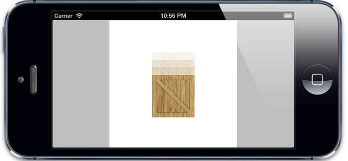

图11.1 一个木箱图片，根据模拟的重力掉落

添加用户交互

下一步就是在视图周围添加一道不可见的墙，这样木箱就不会掉落出屏幕之外。或许你会用另一个矩形的cpPolyShape来实现，就和之前创建木箱那样，但是我们需要检测的是木箱何时离开视图，而不是何时碰撞，所以我们需要一个空心而不是固体矩形。

我们可以通过给cpSpace添加四个cpSegmentShape对象（cpSegmentShape代表一条直线，所以四个拼起来就是一个矩形）。然后赋给空间的staticBody属性（一个不被重力影响的结构体）而不是像木箱那样一个新的cpBody实例，因为我们不想让这个边框矩形滑出屏幕或者被一个下落的木箱击中而消失。

同样可以再添加一些木箱来做一些交互。最后再添加一个加速器，这样可以通过倾斜手机来调整重力矢量（为了测试需要在一台真实的设备上运行程序，因为模拟器不支持加速器事件，即使旋转屏幕）。清单11.4展示了更新后的代码，运行结果见图11.2。

由于示例只支持横屏模式，所以交换加速计矢量的x和y值。如果在竖屏下运行程序，请把他们换回来，不然重力方向就错乱了。试一下就知道了，木箱会沿着横向移动。

清单11.4 使用围墙和多个木箱的更新后的代码

```
- (void)addCrateWithFrame:(CGRect)frame
{
    Crate *crate = [[Crate alloc] initWithFrame:frame];
    [self.containerView addSubview:crate];
    cpSpaceAddBody(self.space, crate.body);
    cpSpaceAddShape(self.space, crate.shape);
}
- (void)addWallShapeWithStart:(cpVect)start end:(cpVect)end
{
    cpShape *wall = cpSegmentShapeNew(self.space->staticBody, start, end, 1);
    cpShapeSetCollisionType(wall, 2);
    cpShapeSetFriction(wall, 0.5);
    cpShapeSetElasticity(wall, 0.8);
    cpSpaceAddStaticShape(self.space, wall);
}
- (void)viewDidLoad
{
    //invert view coordinate system to match physics
    self.containerView.layer.geometryFlipped = YES;
    //set up physics space
    self.space = cpSpaceNew();
    cpSpaceSetGravity(self.space, cpv(0, -GRAVITY));
    //add wall around edge of view
    [self addWallShapeWithStart:cpv(0, 0) end:cpv(300, 0)];
    [self addWallShapeWithStart:cpv(300, 0) end:cpv(300, 300)];
    [self addWallShapeWithStart:cpv(300, 300) end:cpv(0, 300)];
    [self addWallShapeWithStart:cpv(0, 300) end:cpv(0, 0)];
    //add a crates
    [self addCrateWithFrame:CGRectMake(0, 0, 32, 32)];
    [self addCrateWithFrame:CGRectMake(32, 0, 32, 32)];
    [self addCrateWithFrame:CGRectMake(64, 0, 64, 64)];
    [self addCrateWithFrame:CGRectMake(128, 0, 32, 32)];
    [self addCrateWithFrame:CGRectMake(0, 32, 64, 64)];
    //start the timer
    self.lastStep = CACurrentMediaTime();
    self.timer = [CADisplayLink displayLinkWithTarget:self
                                             selector:@selector(step:)];
    [self.timer addToRunLoop:[NSRunLoop mainRunLoop]
                     forMode:NSDefaultRunLoopMode];
    //update gravity using accelerometer
    [UIAccelerometer sharedAccelerometer].delegate = self;
    [UIAccelerometer sharedAccelerometer].updateInterval = 1/60.0;
}
- (void)accelerometer:(UIAccelerometer *)accelerometer didAccelerate:(UIAcceleration *)acceleration
{
    //update gravity
    cpSpaceSetGravity(self.space, cpv(acceleration.y * GRAVITY, -acceleration.x * GRAVITY));
}
```

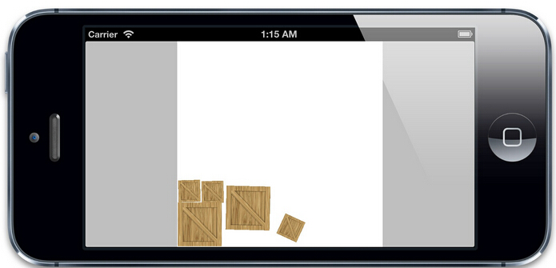

图11.1 真实引力场下的木箱交互

模拟时间以及固定的时间步长

对于实现动画的缓冲效果来说，计算每帧持续的时间是一个很好的解决方案，但是对模拟物理效果并不理想。通过一个可变的时间步长来实现有着两个弊端：

  * 如果时间步长不是固定的，精确的值，物理效果的模拟也就随之不确定。这意味着即使是传入相同的输入值，也可能在不同场合下有着不同的效果。有时候没多大影响，但是在基于物理引擎的游戏下，玩家就会由于相同的操作行为导致不同的结果而感到困惑。同样也会让测试变得麻烦。

  * 由于性能故常造成的丢帧或者像电话呼入的中断都可能会造成不正确的结果。考虑一个像子弹那样快速移动物体，每一帧的更新都需要移动子弹，检测碰撞。如果两帧之间的时间加长了，子弹就会在这一步移动更远的距离，穿过围墙或者是别的障碍，这样就丢失了碰撞。

我们想得到的理想的效果就是通过固定的时间步长来计算物理效果，但是在屏幕发生重绘的时候仍然能够同步更新视图（可能会由于在我们控制范围之外造成不可预知的效果）。

幸运的是，由于我们的模型（在这个例子中就是Chipmunk的cpSpace中的cpBody）被视图（就是屏幕上代表木箱的UIView对象）分离，于是就很简单了。我们只需要根据屏幕刷新的时间跟踪时间步长，然后根据每帧去计算一个或者多个模拟出来的效果。

我们可以通过一个简单的循环来实现。通过每次CADisplayLink的启动来通知屏幕将要刷新，然后记录下当前的CACurrentMediaTime()。我们需要在一个小增量中提前重复物理模拟（这里用120分之一秒）直到赶上显示的时间。然后更新我们的视图，在屏幕刷新的时候匹配当前物理结构体的显示位置。

清单11.5展示了固定时间步长版本的代码

清单11.5 固定时间步长的木箱模拟

```
#define SIMULATION_STEP (1/120.0)
- (void)step:(CADisplayLink *)timer
{
    //calculate frame step duration
    CFTimeInterval frameTime = CACurrentMediaTime();
    //update simulation
    while (self.lastStep < frameTime) {
        cpSpaceStep(self.space, SIMULATION_STEP);
        self.lastStep += SIMULATION_STEP;
    }
    ?
    //update all the shapes
    cpSpaceEachShape(self.space, &updateShape, NULL);
}
```

避免死亡螺旋

当使用固定的模拟时间步长时候，有一件事情一定要注意，就是用来计算物理效果的现实世界的时间并不会加速模拟时间步长。在我们的例子中，我们随意选择了120分之一秒来模拟物理效果。Chipmunk很快，我们的例子也很简单，所以cpSpaceStep()会完成的很好，不会延迟帧的更新。

但是如果场景很复杂，比如有上百个物体之间的交互，物理计算就会很复杂，cpSpaceStep()的计算也可能会超出1/120秒。我们没有测量出物理步长的时间，因为我们假设了相对于帧刷新来说并不重要，但是如果模拟步长更久的话，就会延迟帧率。

如果帧刷新的时间延迟的话会变得很糟糕，我们的模拟需要执行更多的次数来同步真实的时间。这些额外的步骤就会继续延迟帧的更新，等等。这就是所谓的死亡螺旋，因为最后的结果就是帧率变得越来越慢，直到最后应用程序卡死了。

我们可以通过添加一些代码在设备上来对物理步骤计算真实世界的时间，然后自动调整固定时间步长，但是实际上它不可行。其实只要保证你给容错留下足够的边长，然后在期望支持的最慢的设备上进行测试就可以了。如果物理计算超过了模拟时间的50%，就需要考虑增加模拟时间步长（或者简化场景）。如果模拟时间步长增加到超过1/60秒（一个完整的屏幕更新时间），你就需要减少动画帧率到一秒30帧或者增加CADisplayLink的frameInterval来保证不会随机丢帧，不然你的动画将会看起来不平滑。

**总结**

在这一章中，我们了解了如何通过一个计时器创建一帧帧的实时动画，包括缓冲，物理模拟等等一系列动画技术，以及用户输入（通过加速计）。

在第三部分中，我们将研究动画性能是如何被被设备限制所影响的，以及如何调整我们的代码来活的足够好的帧率。  
\-----------------------------------------------------------------------------
---------------------------------------------------------------------------

**性能调优**

代码应该运行的尽量快，而不是更快 - 理查德

在第一和第二部分，我们了解了Core Animation提供的关于绘制和动画的一些特性。Core Animation功能和性能都非常强大，但如果你对背后的原理不清楚的话也会降低效率。让它达到最优的状态是一门艺术。在这章中，我们将探究一些动画运行慢的原因，以及如何去修复这些问题。

**CPU VS GPU**

关于绘图和动画有两种处理的方式：CPU（中央处理器）和GPU（图形处理器）。在现代iOS设备中，都有可以运行不同软件的可编程芯片，但是由于历史原因，我们可以说CPU所做的工作都在软件层面，而GPU在硬件层面。

总的来说，我们可以用软件（使用CPU）做任何事情，但是对于图像处理，通常用硬件会更快，因为GPU使用图像对高度并行浮点运算做了优化。由于某些原因，我们想尽可能把屏幕渲染的工作交给硬件去处理。问题在于GPU并没有无限制处理性能，而且一旦资源用完的话，性能就会开始下降了（即使CPU并没有完全占用）

大多数动画性能优化都是关于智能利用GPU和CPU，使得它们都不会超出负荷。于是我们首先需要知道Core
Animation是如何在这两个处理器之间分配工作的。

动画的舞台

Core Animation处在iOS的核心地位：应用内和应用间都会用到它。一个简单的动画可能同步显示多个app的内容，例如当在iPad上多个程序之间使用手势切换，会使得多个程序同时显示在屏幕上。在一个特定的应用中用代码实现它是没有意义的，因为在iOS中不可能实现这种效果（App都是被沙箱管理，不能访问别的视图）。

动画和屏幕上组合的图层实际上被一个单独的进程管理，而不是你的应用程序。这个进程就是所谓的渲染服务。在iOS5和之前的版本是SpringBoard进程（同时管理着iOS的主屏）。在iOS6之后的版本中叫做BackBoard。

当运行一段动画时候，这个过程会被四个分离的阶段被打破：

  * 布局 - 这是准备你的视图/图层的层级关系，以及设置图层属性（位置，背景色，边框等等）的阶段。

  * 显示 - 这是图层的寄宿图片被绘制的阶段。绘制有可能涉及你的-drawRect:和-drawLayer:inContext:方法的调用路径。

  * 准备 - 这是Core Animation准备发送动画数据到渲染服务的阶段。这同时也是Core Animation将要执行一些别的事务例如解码动画过程中将要显示的图片的时间点。

  * 提交 - 这是最后的阶段，Core Animation打包所有图层和动画属性，然后通过IPC（内部处理通信）发送到渲染服务进行显示。

但是这些仅仅阶段仅仅发生在你的应用程序之内，在动画在屏幕上显示之前仍然有更多的工作。一旦打包的图层和动画到达渲染服务进程，他们会被反序列化来形成另一个叫做渲染树的图层树（在第一章"图层树"中提到过）。使用这个树状结构，渲染服务对动画的每一帧做出如下工作：

  * 对所有的图层属性计算中间值，设置OpenGL几何形状（纹理化的三角形）来执行渲染

  * 在屏幕上渲染可见的三角形

所以一共有六个阶段；最后两个阶段在动画过程中不停地重复。前五个阶段都在软件层面处理（通过CPU），只有最后一个被GPU执行。而且，你真正只能控制前两个阶段：布局和显示。Core Animation框架在内部处理剩下的事务，你也控制不了它。

这并不是个问题，因为在布局和显示阶段，你可以决定哪些由CPU执行，哪些交给GPU去做。那么改如何判断呢？

GPU相关的操作

GPU为一个具体的任务做了优化：它用来采集图片和形状（三角形），运行变换，应用纹理和混合然后把它们输送到屏幕上。现代iOS设备上可编程的GPU在这些操作的执行上又很大的灵活性，但是Core Animation并没有暴露出直接的接口。除非你想绕开Core Animation并编写你自己的OpenGL着色器，从根本上解决硬件加速的问题，那么剩下的所有都还是需要在CPU的软件层面上完成。

宽泛的说，大多数CALayer的属性都是用GPU来绘制。比如如果你设置图层背景或者边框的颜色，那么这些可以通过着色的三角板实时绘制出来。如果对一个contents属性设置一张图片，然后裁剪它 - 它就会被纹理的三角形绘制出来，而不需要软件层面做任何绘制。

但是有一些事情会降低（基于GPU）图层绘制，比如：

  * 太多的几何结构 - 这发生在需要太多的三角板来做变换，以应对处理器的栅格化的时候。现代iOS设备的图形芯片可以处理几百万个三角板，所以在Core Animation中几何结构并不是GPU的瓶颈所在。但由于图层在显示之前通过IPC发送到渲染服务器的时候（图层实际上是由很多小物体组成的特别重量级的对象），太多的图层就会引起CPU的瓶颈。这就限制了一次展示的图层个数（见本章后续"CPU相关操作"）。

  * 重绘 - 主要由重叠的半透明图层引起。GPU的填充比率（用颜色填充像素的比率）是有限的，所以需要避免重绘（每一帧用相同的像素填充多次）的发生。在现代iOS设备上，GPU都会应对重绘；即使是iPhone 3GS都可以处理高达2.5的重绘比率，并任然保持60帧率的渲染（这意味着你可以绘制一个半的整屏的冗余信息，而不影响性能），并且新设备可以处理更多。

  * 离屏绘制 - 这发生在当不能直接在屏幕上绘制，并且必须绘制到离屏图片的上下文中的时候。离屏绘制发生在基于CPU或者是GPU的渲染，或者是为离屏图片分配额外内存，以及切换绘制上下文，这些都会降低GPU性能。对于特定图层效果的使用，比如圆角，图层遮罩，阴影或者是图层光栅化都会强制Core Animation提前渲染图层的离屏绘制。但这不意味着你需要避免使用这些效果，只是要明白这会带来性能的负面影响。

  * 过大的图片 - 如果视图绘制超出GPU支持的2048x2048或者4096x4096尺寸的纹理，就必须要用CPU在图层每次显示之前对图片预处理，同样也会降低性能。

CPU相关的操作

大多数工作在Core Animation的CPU都发生在动画开始之前。这意味着它不会影响到帧率，所以很好，但是他会延迟动画开始的时间，让你的界面看起来会比较迟钝。

以下CPU的操作都会延迟动画的开始时间：

  * 布局计算 - 如果你的视图层级过于复杂，当视图呈现或者修改的时候，计算图层帧率就会消耗一部分时间。特别是使用iOS6的自动布局机制尤为明显，它应该是比老版的自动调整逻辑加强了CPU的工作。

  * 视图懒加载 - iOS只会当视图控制器的视图显示到屏幕上时才会加载它。这对内存使用和程序启动时间很有好处，但是当呈现到屏幕上之前，按下按钮导致的许多工作都会不能被及时响应。比如控制器从数据库中获取数据，或者视图从一个nib文件中加载，或者涉及IO的图片显示（见后续"IO相关操作"），都会比CPU正常操作慢得多。

  * Core Graphics绘制 - 如果对视图实现了-drawRect:方法，或者CALayerDelegate的-drawLayer:inContext:方法，那么在绘制任何东西之前都会产生一个巨大的性能开销。为了支持对图层内容的任意绘制，Core Animation必须创建一个内存中等大小的寄宿图片。然后一旦绘制结束之后，必须把图片数据通过IPC传到渲染服务器。在此基础上，Core Graphics绘制就会变得十分缓慢，所以在一个对性能十分挑剔的场景下这样做十分不好。

  * 解压图片 - PNG或者JPEG压缩之后的图片文件会比同质量的位图小得多。但是在图片绘制到屏幕上之前，必须把它扩展成完整的未解压的尺寸（通常等同于图片宽 x 长 x 4个字节）。为了节省内存，iOS通常直到真正绘制的时候才去解码图片（14章"图片IO"会更详细讨论）。根据你加载图片的方式，第一次对图层内容赋值的时候（直接或者间接使用UIImageView）或者把它绘制到Core Graphics中，都需要对它解压，这样的话，对于一个较大的图片，都会占用一定的时间。

当图层被成功打包，发送到渲染服务器之后，CPU仍然要做如下工作：为了显示屏幕上的图层，Core
Animation必须对渲染树种的每个可见图层通过OpenGL循环转换成纹理三角板。由于GPU并不知晓Core Animation图层的任何结构，所以必须要由CPU做这些事情。这里CPU涉及的工作和图层个数成正比，所以如果在你的层级关系中有太多的图层，就会导致CPU没一帧的渲染，即使这些事情不是你的应用程序可控的。

IO相关操作

还有一项没涉及的就是IO相关工作。上下文中的IO（输入/输出）指的是例如闪存或者网络接口的硬件访问。一些动画可能需要从山村（甚至是远程URL）来加载。一个典型的例子就是两个视图控制器之间的过渡效果，这就需要从一个nib文件或者是它的内容中懒加载，或者一个旋转的图片，可能在内存中尺寸太大，需要动态滚动来加载。

IO比内存访问更慢，所以如果动画涉及到IO，就是一个大问题。总的来说，这就需要使用聪敏但尴尬的技术，也就是多线程，缓存和投机加载（提前加载当前不需要的资源，但是之后可能需要用到）。这些技术将会在第14章中讨论。

**测量，而不是猜测**

于是现在你知道有哪些点可能会影响动画性能，那该如何修复呢？好吧，其实不需要。有很多种诡计来优化动画，但如果盲目使用的话，可能会造成更多性能上的问题，而不是修复。

如何正确的测量而不是猜测这点很重要。根据性能相关的知识写出代码不同于仓促的优化。前者很好，后者实际上就是在浪费时间。

那该如何测量呢？第一步就是确保在真实环境下测试你的程序。

真机测试，而不是模拟器

当你开始做一些性能方面的工作时，一定要在真机上测试，而不是模拟器。模拟器虽然是加快开发效率的一把利器，但它不能提供准确的真机性能参数。

模拟器运行在你的Mac上，然而Mac上的CPU往往比iOS设备要快。相反，Mac上的GPU和iOS设备的完全不一样，模拟器不得已要在软件层面（CPU）模拟设备的GPU，这意味着GPU相关的操作在模拟器上运行的更慢，尤其是使用CAEAGLLayer来些一些OpenGL的代码时候。

这就是说在模拟器上的测试出的性能会高度失真。如果动画在模拟器上运行流畅，可能在真机上十分糟糕。如果在模拟器上运行的很卡，也可能在真机上很平滑。你无法确定。

另一件重要的事情就是性能测试一定要用发布配置，而不是调试模式。因为当用发布环境打包的时候，编译器会引入一系列提高性能的优化，例如去掉调试符号或者移除并重新组织代码。你也可以自己做到这些，例如在发布环境禁用NSLog语句。你只关心发布性能，那才是你需要测试的点。

最后，最好在你支持的设备中性能最差的设备上测试：如果基于iOS6开发，这意味着最好在iPhone 3GS或者iPad2上测试。如果可能的话，测试不同的设备和iOS版本，因为苹果在不同的iOS版本和设备中做了一些改变，这也可能影响到一些性能。例如iPad3明显要在动画渲染上比iPad2慢很多，因为渲染4倍多的像素点（为了支持视网膜显示）。

保持一致的帧率

为了做到动画的平滑，你需要以60FPS（帧每秒）的速度运行，以同步屏幕刷新速率。通过基于NSTimer或者CADisplayLink的动画你可以降低到30FPS，而且效果还不错，但是没办法通过Core Animation做到这点。如果不保持60FPS的速率，就可能随机丢帧，影响到体验。

你可以在使用的过程中明显感到有没有丢帧，但没办法通过肉眼来得到具体的数据，也没法知道你的做法有没有真的提高性能。你需要的是一系列精确的数据。

你可以在程序中用CADisplayLink来测量帧率（就像11章"基于定时器的动画"中那样），然后在屏幕上显示出来，但应用内的FPS显示并不能够完全真实测量出Core Animation性能，因为它仅仅测出应用内的帧率。我们知道很多动画都在应用之外发生（在渲染服务器进程中处理），但同时应用内FPS计数的确可以对某些性能问题提供参考，一旦找出一个问题的地方，你就需要得到更多精确详细的数据来定位到问题所在。苹果提供了一个强大的Instruments工具集来帮我们做到这些。

**Instruments**

Instruments是Xcode套件中没有被充分利用的一个工具。很多iOS开发者从没用过Instruments，或者只是用Leaks工具检测循环引用。实际上有很多Instruments工具，包括为动画性能调优的东西。

你可以通过在菜单中选择Profile选项来打开Instruments（在这之前，记住要把目标设置成iOS设备，而不是模拟器）。然后将会显示出图12.1（如果没有看到所有选项，你可能设置成了模拟器选项）。

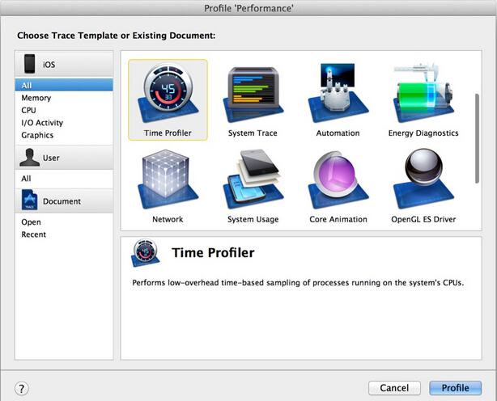

图12.1 Instruments工具选项窗口

就像之前提到的那样，你应该始终将程序设置成发布选项。幸运的是，配置文件默认就是发布选项，所以你不需要在分析的时候调整编译策略。

我们将讨论如下几个工具：

时间分析器 - 用来测量被方法/函数打断的CPU使用情况。

  * Core Animation - 用来调试各种Core Animation性能问题。

  * OpenGL ES驱动 - 用来调试GPU性能问题。这个工具在编写Open GL代码的时候很有用，但有时也用来处理Core Animation的工作。

  * Instruments的一个很棒的功能在于它可以创建我们自定义的工具集。除了你初始选择的工具之外，如果在Instruments中打开Library窗口，你可以拖拽别的工具到左侧边栏。我们将创建以上我们提到的三个工具，然后就可以并行使用了（见图12.2）。

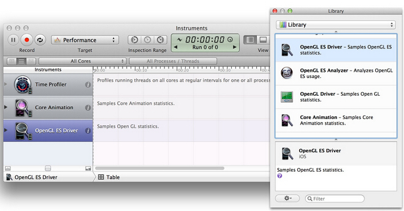

图12.2 添加额外的工具到Instruments侧边栏

时间分析器

时间分析器工具用来检测CPU的使用情况。它可以告诉我们程序中的哪个方法正在消耗大量的CPU时间。使用大量的CPU并不一定是个问题 -你可能期望动画路径对CPU非常依赖，因为动画往往是iOS设备中最苛刻的任务。

但是如果你有性能问题，查看CPU时间对于判断性能是不是和CPU相关，以及定位到函数都很有帮助（见图12.3）。

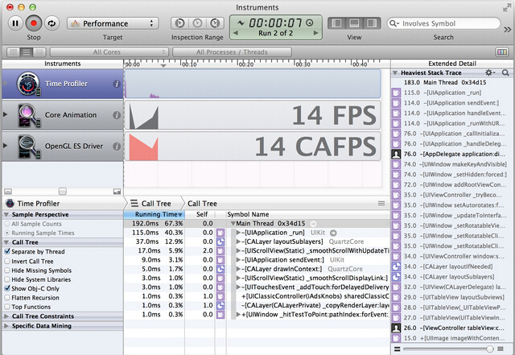

图12.3 时间分析器工具

  * 时间分析器有一些选项来帮助我们定位到我们关心的的方法。可以使用左侧的复选框来打开。其中最有用的是如下几点：

  * 通过线程分离 - 这可以通过执行的线程进行分组。如果代码被多线程分离的话，那么就可以判断到底是哪个线程造成了问题。

  * 隐藏系统库 - 可以隐藏所有苹果的框架代码，来帮助我们寻找哪一段代码造成了性能瓶颈。由于我们不能优化框架方法，所以这对定位到我们能实际修复的代码很有用。

只显示Obj-C代码 - 隐藏除了Objective-C之外的所有代码。大多数内部的Core
Animation代码都是用C或者C++函数，所以这对我们集中精力到我们代码中显式调用的方法就很有用。

Core Animation

Core Animation工具用来监测Core Animation性能。它给我们提供了周期性的FPS，并且考虑到了发生在程序之外的动画（见图12.4）。

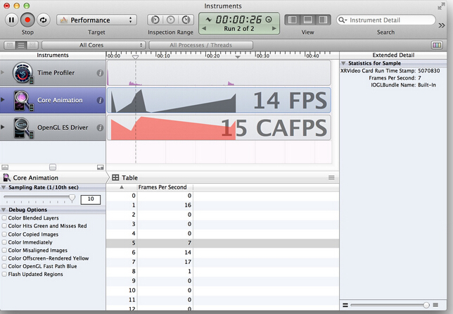

图12.4 使用可视化调试选项的Core Animation工具

  * Core Animation工具也提供了一系列复选框选项来帮助调试渲染瓶颈：

  * Color Blended Layers - 这个选项基于渲染程度对屏幕中的混合区域进行绿到红的高亮（也就是多个半透明图层的叠加）。由于重绘的原因，混合对GPU性能会有影响，同时也是滑动或者动画帧率下降的罪魁祸首之一。

  * ColorHitsGreenandMissesRed - 当使用shouldRasterizep属性的时候，耗时的图层绘制会被缓存，然后当做一个简单的扁平图片呈现。当缓存再生的时候这个选项就用红色对栅格化图层进行了高亮。如果缓存频繁再生的话，就意味着栅格化可能会有负面的性能影响了（更多关于使用shouldRasterize的细节见第15章"图层性能"）。

  * Color Copied Images - 有时候寄宿图片的生成意味着Core Animation被强制生成一些图片，然后发送到渲染服务器，而不是简单的指向原始指针。这个选项把这些图片渲染成蓝色。复制图片对内存和CPU使用来说都是一项非常昂贵的操作，所以应该尽可能的避免。

  * Color Immediately - 通常Core Animation Instruments以每毫秒10次的频率更新图层调试颜色。对某些效果来说，这显然太慢了。这个选项就可以用来设置每帧都更新（可能会影响到渲染性能，而且会导致帧率测量不准，所以不要一直都设置它）。

  * Color Misaligned Images - 这里会高亮那些被缩放或者拉伸以及没有正确对齐到像素边界的图片（也就是非整型坐标）。这些中的大多数通常都会导致图片的不正常缩放，如果把一张大图当缩略图显示，或者不正确地模糊图像，那么这个选项将会帮你识别出问题所在。

  * Color Offscreen-Rendered Yellow - 这里会把那些需要离屏渲染的图层高亮成黄色。这些图层很可能需要用shadowPath或者shouldRasterize来优化。

  * Color OpenGL Fast Path Blue - 这个选项会对任何直接使用OpenGL绘制的图层进行高亮。如果仅仅使用UIKit或者Core Animation的API，那么不会有任何效果。如果使用GLKView或者CAEAGLLayer，那如果不显示蓝色块的话就意味着你正在强制CPU渲染额外的纹理，而不是绘制到屏幕。

  * Flash Updated Regions - 这个选项会对重绘的内容高亮成黄色（也就是任何在软件层面使用Core Graphics绘制的图层）。这种绘图的速度很慢。如果频繁发生这种情况的话，这意味着有一个隐藏的bug或者说通过增加缓存或者使用替代方案会有提升性能的空间。

这些高亮图层的选项同样在iOS模拟器的调试菜单也可用（图12.5）。我们之前说过用模拟器测试性能并不好，但如果你能通过这些高亮选项识别出性能问题出在什么地方的话，那么使用iOS模拟器来验证问题是否解决也是比真机测试更有效的。

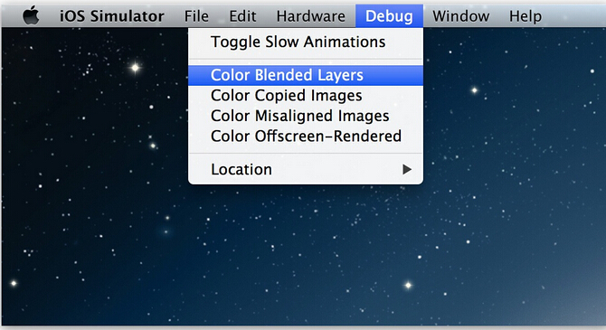

图12.5 iOS模拟器中Core Animation可视化调试选项

OpenGL ES驱动

OpenGL ES驱动工具可以帮你测量GPU的利用率，同样也是一个很好的来判断和GPU相关动画性能的指示器。它同样也提供了类似Core Animation那样显示FPS的工具（图12.6）。

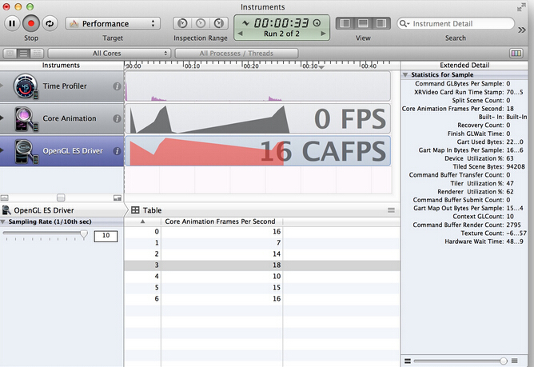

图12.6 OpenGL ES驱动工具

侧栏的邮编是一系列有用的工具。其中和Core Animation性能最相关的是如下几点：

  * Renderer Utilization - 如果这个值超过了~50%，就意味着你的动画可能对帧率有所限制，很可能因为离屏渲染或者是重绘导致的过度混合。

  * Tiler Utilization - 如果这个值超过了~50%，就意味着你的动画可能限制于几何结构方面，也就是在屏幕上有太多的图层占用了。

**一个可用的案例**

现在我们已经对Instruments中动画性能工具非常熟悉了，那么可以用它在现实中解决一些实际问题。

我们创建一个简单的显示模拟联系人姓名和头像列表的应用。注意即使把头像图片存在应用本地，为了使应用看起来更真实，我们分别实时加载图片，而不是用-imageNamed:预加载。同样添加一些图层阴影来使得列表显示得更真实。清单12.1展示了最初版本的实现。

清单12.1 使用假数据的一个简单联系人列表

```
#import "ViewController.h"
#import @interface ViewController () @property (nonatomic, strong) NSArray *items;
@property (nonatomic, weak) IBOutlet UITableView *tableView;
@end
@implementation ViewController
- (NSString *)randomName
{
    NSArray *first = @[@"Alice", @"Bob", @"Bill", @"Charles", @"Dan", @"Dave", @"Ethan", @"Frank"];
    NSArray *last = @[@"Appleseed", @"Bandicoot", @"Caravan", @"Dabble", @"Ernest", @"Fortune"];
    NSUInteger index1 = (rand()/(double)INT_MAX) * [first count];
    NSUInteger index2 = (rand()/(double)INT_MAX) * [last count];
    return [NSString stringWithFormat:@"%@ %@", first[index1], last[index2]];
}
- (NSString *)randomAvatar
{
    NSArray *images = @[@"Snowman", @"Igloo", @"Cone", @"Spaceship", @"Anchor", @"Key"];
    NSUInteger index = (rand()/(double)INT_MAX) * [images count];
    return images[index];
}
- (void)viewDidLoad
{
    [super viewDidLoad];
    //set up data
    NSMutableArray *array = [NSMutableArray array];
    for (int i = 0; i < 1000; i++) {
        ?//add name
        [array addObject:@{@"name": [self randomName], @"image": [self randomAvatar]}];
    }
    self.items = array;
    //register cell class
    [self.tableView registerClass:[UITableViewCell class] forCellReuseIdentifier:@"Cell"];
}
- (NSInteger)tableView:(UITableView *)tableView numberOfRowsInSection:(NSInteger)section
{
    return [self.items count];
}
- (UITableViewCell *)tableView:(UITableView *)tableView cellForRowAtIndexPath:(NSIndexPath *)indexPath
{
    //dequeue cell
    UITableViewCell *cell = [self.tableView dequeueReusableCellWithIdentifier:@"Cell" forIndexPath:indexPath];
    //load image
    NSDictionary *item = self.items[indexPath.row];
    NSString *filePath = [[NSBundle mainBundle] pathForResource:item[@"image"] ofType:@"png"];
    //set image and text
    cell.imageView.image = [UIImage imageWithContentsOfFile:filePath];
    cell.textLabel.text = item[@"name"];
    //set image shadow
    cell.imageView.layer.shadowOffset = CGSizeMake(0, 5);
    cell.imageView.layer.shadowOpacity = 0.75;
    cell.clipsToBounds = YES;
    //set text shadow
    cell.textLabel.backgroundColor = [UIColor clearColor];
    cell.textLabel.layer.shadowOffset = CGSizeMake(0, 2);
    cell.textLabel.layer.shadowOpacity = 0.5;
    return cell;
}
@end
```

当快速滑动的时候就会非常卡（见图12.7的FPS计数器）。

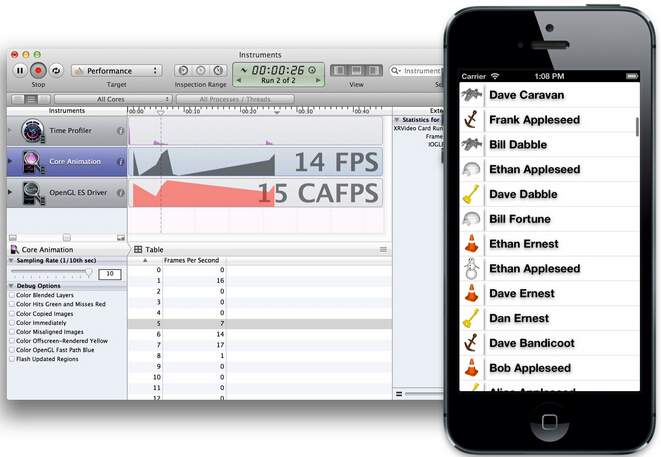

图12.7 滑动帧率降到15FPS

仅凭直觉，我们猜测性能瓶颈应该在图片加载。我们实时从闪存加载图片，而且没有缓存，所以很可能是这个原因。我们可以用一些很赞的代码修复，然后使用GCD异步加载图片，然后缓存。。。等一下，在开始编码之前，测试一下假设是否成立。首先用我们的三个Instruments工具分析一下程序来定位问题。我们推测问题可能和图片加载相关，所以用Time Profiler工具来试试（图12.8）。

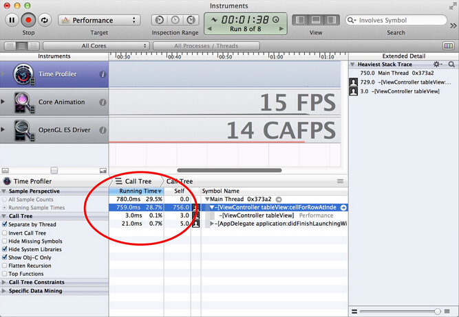

图12.8 用The timing profile分析联系人列表

-tableView:cellForRowAtIndexPath:中的CPU时间总利用率只有~28%（也就是加载头像图片的地方），非常低。于是建议是CPU/IO并不是真正的限制因素。然后看看是不是GPU的问题：在OpenGL ES Driver工具中检测GPU利用率（图12.9）。

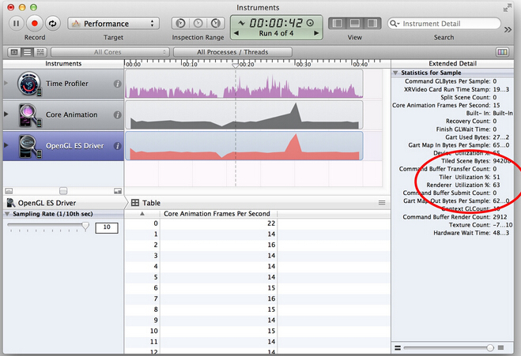

图12.9 OpenGL ES Driver工具显示的GPU利用率

渲染服务利用率的值达到51%和63%。看起来GPU需要做很多工作来渲染联系人列表。

为什么GPU利用率这么高呢？我们来用Core Animation调试工具选项来检查屏幕。首先打开Color Blended Layers（图12.10）。

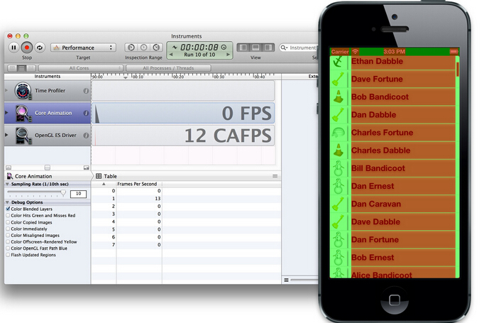

图12.10 使用Color Blended Layers选项调试程序

屏幕中所有红色的部分都意味着字符标签视图的高级别混合，这很正常，因为我们把背景设置成了透明色来显示阴影效果。这就解释了为什么渲染利用率这么高了。

那么离屏绘制呢？打开Core Animation工具的Color Offscreen - Rendered Yellow选项（图12.11）。

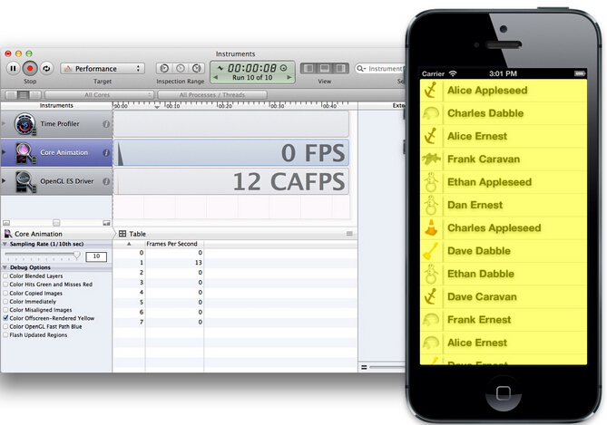

图12.11 Color Offscreen-Rendered Yellow选项

所有的表格单元内容都在离屏绘制。这一定是因为我们给图片和标签视图添加的阴影效果。在代码中禁用阴影，然后看下性能是否有提高（图12.12）。

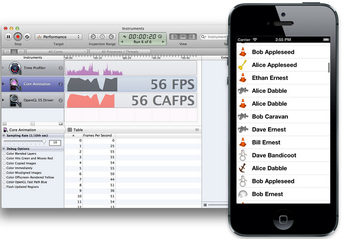

图12.12 禁用阴影之后运行程序接近60FPS

问题解决了。干掉阴影之后，滑动很流畅。但是我们的联系人列表看起来没有之前好了。那如何保持阴影效果而且不会影响性能呢？

好吧，每一行的字符和头像在每一帧刷新的时候并不需要变，所以看起来UITableViewCell的图层非常时候做缓存。我们可以使用shouldRasterize来缓存图层内容。这将会让图层离屏之后渲染一次然后把结果保存起来，直到下次利用的时候去更新（见清单12.2）。

清单12.2 使用shouldRasterize提高性能

```
- (UITableViewCell *)tableView:(UITableView *)tableView cellForRowAtIndexPath:(NSIndexPath *)indexPath
?{
    //dequeue cell
    UITableViewCell *cell = [self.tableView dequeueReusableCellWithIdentifier:@"Cell"
                                                                 forIndexPath:indexPath];
    ...
    //set text shadow
    cell.textLabel.backgroundColor = [UIColor clearColor];
    cell.textLabel.layer.shadowOffset = CGSizeMake(0, 2);
    cell.textLabel.layer.shadowOpacity = 0.5;
    //rasterize
    cell.layer.shouldRasterize = YES;
    cell.layer.rasterizationScale = [UIScreen mainScreen].scale;
    return cell;
}
```

我们仍然离屏绘制图层内容，但是由于显式地禁用了栅格化，Core Animation就对绘图缓存了结果，于是对提高了性能。我们可以验证缓存是否有效，在Core Animation工具中点击Color Hits Green and Misses Red选项（图12.13）。

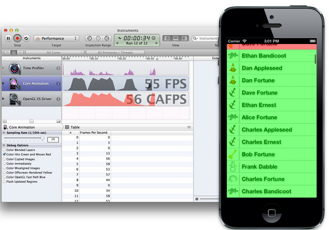

图12.13 Color Hits Green and Misses Red验证了缓存有效

结果和预期一致 - 大部分都是绿色，只有当滑动到屏幕上的时候会闪烁成红色。因此，现在帧率更加平滑了。

所以我们最初的设想是错的。图片的加载并不是真正的瓶颈所在，而且试图把它置于一个复杂的多线程加载和缓存的实现都将是徒劳。所以在动手修复之前验证问题所在是个很好的习惯！

**总结**

在这章中，我们学习了Core Animation是如何渲染，以及我们可能出现的瓶颈所在。你同样学习了如何使用Instruments来检测和修复性能问题。

在下三章中，我们将对每个普通程序的性能陷阱进行详细讨论，然后学习如何修复。


<hr>


####<p>原文出处：<a href='https://objccn.io/issue-3-1/' target='blank'>绘制像素到屏幕上</a></p>

一个像素是如何绘制到屏幕上去的？有很多种方式将一些东西映射到显示屏上，他们需要调用不同的框架、许多功能和方法的结合体。这里我们大概的看一下屏幕之后发生的事情。当你想要弄清楚什么时候、怎么去查明并解决问题时，我希望这篇文章能帮助你理解哪一个 API 可以更好的帮你解决问题。我们将聚焦于iOS，然而我讨论的大多数问题也同样适用于 OS X。

###图形堆栈

当像素映射到屏幕上的时候，后台发生了很多事情。但一旦他们显示到屏幕上，每一个像素均由三个颜色组件构成：红，绿，蓝。三个独立的颜色单元会根据给定的颜色显示到一个像素上。在 iPhone5 的[液晶显示器](https://zh.wikipedia.org/wiki/%E6%A9%AB%E5%90%91%E9%9B%BB%E5%A0%B4%E6%95%88%E6%87%89%E9%A1%AF%E7%A4%BA%E6%8A%80%E8%A1%93)上有1,136×640=727,040个像素，因此有2,181,120个颜色单元。在15寸视网膜屏的 MacBook Pro 上，这一数字达到15.5百万以上。所有的图形堆栈一起工作以确保每次正确的显示。当你滚动整个屏幕的时候，数以百万计的颜色单元必须以每秒60次的速度刷新，这是一个很大的工作量。

###软件组成

从简单的角度来看，软件堆栈看起来有点像这样：

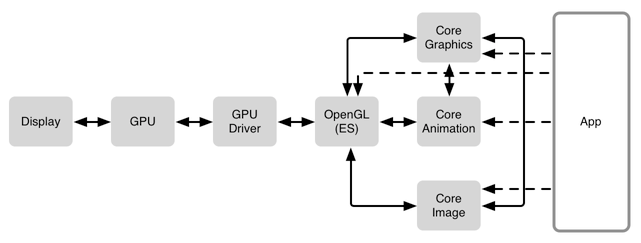

Display 的上一层便是图形处理单元 GPU，GPU 是一个专门为图形高并发计算而量身定做的处理单元。这也是为什么它能同时更新所有的像素，并呈现到显示器上。它并发的本性让它能高效的将不同纹理合成起来。我们将有一小块内容来更详细的讨论图形合成。关键的是，GPU是非常专业的，因此在某些工作上非常高效。比如，GPU 非常快，并且比 CPU 使用更少的电来完成工作。通常 CPU 都有一个普遍的目的，它可以做很多不同的事情，但是合成图像在 CPU 上却显得比较慢。

GPU Driver 是直接和 GPU 交流的代码块。不同的GPU是不同的性能怪兽，但是驱动使他们在下一个层级上显示的更为统一，典型的下一层级有OpenGL/OpenGL ES.

OpenGL([Open Graphics Library](http://zh.wikipedia.org/wiki/OpenGL)) 是一个提供了 2D 和 3D 图形渲染的 API。GPU 是一块非常特殊的硬件，OpenGL 和 GPU密切的工作以提高GPU的能力，并实现硬件加速渲染。对大多数人来说，OpenGL 看起来非常底层，但是当它在1992年第一次发布的时候(20多年前的事了)是第一个和图形硬件(GPU)交流的标准化方式，这是一个重大的飞跃，程序员不再需要为每个GPU重写他们的应用了。

OpenGL 之上扩展出很多东西。在 iOS 上，几乎所有的东西都是通过 Core Animation 绘制出来，然而在 OS X 上，绕过 Core Animation 直接使用 Core Graphics 绘制的情况并不少见。对于一些专门的应用，尤其是游戏，程序可能直接和 OpenGL/OpenGL ES 交流。事情变得使人更加困惑，因为 Core Animation 使用 Core Graphics 来做一些渲染。像 AVFoundation，Core Image 框架，和其他一些混合的入口。

要记住一件事情，GPU 是一个非常强大的图形硬件，并且在显示像素方面起着核心作用。它连接到 CPU。从硬件上讲两者之间存在某种类型的[总线](https://zh.wikipedia.org/wiki/I/O%E6%80%BB%E7%BA%BF)，并且有像 OpenGL，Core Animation 和Core Graphics 这样的框架来在 GPU 和 CPU 之间精心安排数据的传输。为了将像素显示到屏幕上，一些处理将在 CPU 上进行。然后数据将会传送到 GPU，这也需要做一些相应的操作，最终像素显示到屏幕上。

这个过程的每一部分都有各自的挑战，并且许多时候需要做出折中的选择。

###硬件参与者


正如上面这张简单的图片显示那些挑战：GPU 需要将每一个 frame 的纹理(位图)合成在一起(一秒60次)。每一个纹理会占用 VRAM(video RAM)，所以需要给 GPU 同时保持纹理的数量做一个限制。GPU 在合成方面非常高效，但是某些合成任务却比其他更复杂，并且 GPU在16.7ms(1/60s)内能做的工作也是有限的。

下一个挑战就是将数据传输到 GPU 上。为了让 GPU 访问数据，需要将数据从 RAM 移动到 VRAM 上。这就是提及到的上传数据到GPU。这看起来貌似微不足道，但是一些大型的纹理却会非常耗时。

最终，CPU 开始运行你的程序。你可能会让 CPU 从 bundle 加载一张 PNG 的图片并且解压它。这所有的事情都在 CPU上进行。然后当你需要显示解压缩后的图片时，它需要以某种方式上传到 GPU。一些看似平凡的，比如显示文本，对 CPU 来说却是一件非常复杂的事情，这会促使Core Text 和 Core Graphics 框架更紧密的集成来根据文本生成一个位图。一旦准备好，它将会被作为一个纹理上传到 GPU并准备显示出来。当你滚动或者在屏幕上移动文本时，不管怎么样，同样的纹理能够被复用，CPU 只需简单的告诉 GPU 新的位置就行了,所以 GPU 就可以重用存在的纹理了。CPU 并不需要重新渲染文本，并且位图也不需要重新上传到 GPU。

这张图涉及到一些错综复杂的方面，我们将会把这些方面提取出来并深一步了解。

###合成

在图形世界中，合成是一个描述不同位图如何放到一起来创建你最终在屏幕上看到图像的过程。在许多方面显得显而易见，而让人忘了背后错综复杂的计算。

让我们忽略一些难懂的事例并且假定屏幕上一切事物皆纹理。一个纹理就是一个包含 RGBA 值的长方形，比如，每一个像素里面都包含红、绿、蓝和透明度的值。在Core Animation 世界中这就相当于一个CALayer。

在这个简化的设置中，每一个 layer 是一个纹理，所有的纹理都以某种方式堆叠在彼此的顶部。对于屏幕上的每一个像素，GPU需要算出怎么混合这些纹理来得到像素 RGB 的值。这就是合成大概的意思。

如果我们所拥有的是一个和屏幕大小一样并且和屏幕像素对齐的单一纹理，那么屏幕上每一个像素相当于纹理中的一个像素，纹理的最后一个像素也就是屏幕的最后一个像素。

如果我们有第二个纹理放在第一个纹理之上，然后GPU将会把第二个纹理合成到第一个纹理中。有很多种不同的合成方法，但是如果我们假定两个纹理的像素对齐，并且使用正常的混合模式，我们便可以用下面这个公式来计算每一个像素：

    
    
    R = S + D * ( 1 – Sa )
    

结果的颜色是源色彩(顶端纹理)+目标颜色(低一层的纹理)*(1-源颜色的透明度)。在这个公式中所有的颜色都假定已经预先乘以了他们的透明度。

显然相当多的事情在这发生了。让我们进行第二个假定，两个纹理都完全不透明，比如alpha=1.如果目标纹理(低一层的纹理)是蓝色(RGB=0,0,1)，并且源纹理(顶层的纹理)颜色是红色(RGB=1,0,0)，因为 Sa
为1，所以结果为：

    
    
    R = S
    

结果是源颜色的红色。这正是我们所期待的(红色覆盖了蓝色)。

如果源颜色层为50%的透明，比如 alpha=0.5，既然 alpha 组成部分需要预先乘进 RGB 的值中，那么 S 的 RGB 值为(0.5, 0, 0)，公式看起来便会像这样:

    
    
                           0.5   0               0.5
    R = S + D * (1 - Sa) = 0   + 0 * (1 - 0.5) = 0
                           0     1               0.5
    

我们最终得到RGB值为(0.5, 0, 0.5),是一个紫色。这正是我们所期望将透明红色合成到蓝色背景上所得到的。

记住我们刚刚只是将纹理中的一个像素合成到另一个纹理的像素上。当两个纹理覆盖在一起的时候，GPU需要为所有像素做这种操作。正如你所知道的一样，许多程序都有很多层，因此所有的纹理都需要合成到一起。尽管GPU是一块高度优化的硬件来做这种事情，但这还是会让它非常忙碌。

###不透明 VS 透明

当源纹理是完全不透明的时候，目标像素就等于源纹理。这可以省下 GPU 很大的工作量，这样只需简单的拷贝源纹理而不需要合成所有的像素值。但是没有方法能告诉GPU 纹理上的像素是透明还是不透明的。只有当你作为一名开发者知道你放什么到 CALayer 上了。这也是为什么 CALayer 有一个叫做 opaque的属性了。如果这个属性为 YES，GPU 将不会做任何合成，而是简单从这个层拷贝，不需要考虑它下方的任何东西(因为都被它遮挡住了)。这节省了 GPU相当大的工作量。这也正是 Instruments 中 color blended layers
选项中所涉及的。(这在模拟器中的Debug菜单中也可用).它允许你看到哪一个 layers(纹理) 被标注为透明的，比如 GPU 正在为哪一个 layers做合成。合成不透明的 layers 因为需要更少的数学计算而更廉价。

所以如果你知道你的 layer 是不透明的，最好确定设置它的 opaque 为 YES。如果你加载一个没有 alpha 通道的图片，并且将它显示在UIImageView 上，这将会自动发生。但是要记住如果一个图片没有 alpha 通道和一个图片每个地方的 alpha都是100%，这将会产生很大的不同。在后一种情况下，Core Animation 需要假定是否存在像素的 alpha 值不为100%。在 Finder中，你可以使用 Get Info 并且检查 More Info 部分。它将告诉你这张图片是否拥有 alpha 通道。

###像素对齐 VS 不重合在一起

到现在我们都在考虑像素完美重合在一起的 layers。当所有的像素是对齐的时候我们得到相对简单的计算公式。每当 GPU需要计算出屏幕上一个像素是什么颜色的时候，它只需要考虑在这个像素之上的所有 layer 中对应的单个像素，并把这些像素合并到一起。或者，如果最顶层的纹理是不透明的(即图层树的最底层)，这时候 GPU 就可以简单的拷贝它的像素到屏幕上。

当一个 layer 上所有的像素和屏幕上的像素完美的对应整齐，那这个 layer 就是像素对齐的。主要有两个原因可能会造成不对齐。第一个便是缩放；当一个纹理放大缩小的时候，纹理的像素便不会和屏幕的像素排列对齐。另一个原因便是当纹理的起点不在一个像素的边界上。

在这两种情况下，GPU 需要再做额外的计算。它需要将源纹理上多个像素混合起来，生成一个用来合成的值。当所有的像素都是对齐的时候，GPU只剩下很少的工作要做。

Core Animation 工具和模拟器有一个叫做 color misaligned images 的选项，当这些在你的 CALayer实例中发生的时候，这个功能便可向你展示。

###Masks

一个图层可以有一个和它相关联的 mask(蒙板)，mask 是一个拥有 alpha 值的位图，当像素要和它下面包含的像素合并之前都会把 mask应用到图层的像素上去。当你要设置一个图层的圆角半径时，你可以有效的在图层上面设置一个 mask。但是也可以指定任意一个蒙板。比如，一个字母 A 形状的mask。最终只有在 mask 中显示出来的(即图层中的部分)才会被渲染出来。

###离屏渲染(Offscreen Rendering)

离屏渲染可以被 Core Animation自动触发，或者被应用程序强制触发。屏幕外的渲染会合并/渲染图层树的一部分到一个新的缓冲区，然后该缓冲区被渲染到屏幕上。

离屏渲染合成计算是非常昂贵的, 但有时你也许希望强制这种操作。一种好的方法就是缓存合成的纹理/图层。如果你的渲染树非常复杂(所有的纹理，以及如何组合在一起)，你可以强制离屏渲染缓存那些图层，然后可以用缓存作为合成的结果放到屏幕上。

如果你的程序混合了很多图层，并且想要他们一起做动画，GPU 通常会为每一帧(1/60s)重复合成所有的图层。当使用离屏渲染时，GPU第一次会混合所有图层到一个基于新的纹理的位图缓存上，然后使用这个纹理来绘制到屏幕上。现在，当这些图层一起移动的时候，GPU便可以复用这个位图缓存，并且只需要做很少的工作。需要注意的是，只有当那些图层不改变时，这才可以用。如果那些图层改变了，GPU需要重新创建位图缓存。你可以通过设置 shouldRasterize 为 YES 来触发这个行为。

然而，这是一个权衡。第一，这可能会使事情变得更慢。创建额外的屏幕外缓冲区是 GPU需要多做的一步操作，特殊情况下这个位图可能再也不需要被复用，这便是一个无用功了。然而，可以被复用的位图，GPU 也有可能将它卸载了。所以你需要计算 GPU的利用率和帧的速率来判断这个位图是否有用。

离屏渲染也可能产生副作用。如果你正在直接或者间接的将mask应用到一个图层上，Core Animation 为了应用这个mask，会强制进行屏幕外渲染。这会对 GPU 产生重负。通常情况下 mask 只能被直接渲染到帧的缓冲区中(在屏幕内)。

Instrument 的 Core Animation 工具有一个叫做 _Color Offscreen-Rendered Yellow_ 的选项，它会将已经被渲染到屏幕外缓冲区的区域标注为黄色(这个选项在模拟器中也可以用)。同时记得检查 _Color Hits Green and Misses Red_ 选项。绿色代表无论何时一个屏幕外缓冲区被复用，而红色代表当缓冲区被重新创建。

一般情况下，你需要避免离屏渲染，因为这是很大的消耗。直接将图层合成到帧的缓冲区中(在屏幕上)比先创建屏幕外缓冲区，然后渲染到纹理中，最后将结果渲染到帧的缓冲区中要廉价很多。因为这其中涉及两次昂贵的环境转换(转换环境到屏幕外缓冲区，然后转换环境到帧缓冲区)。

所以当你打开 _Color Offscreen-Rendered Yellow_ 后看到黄色，这便是一个警告，但这不一定是不好的。如果 Core Animation 能够复用屏幕外渲染的结果，这便能够提升性能。

同时还要注意，rasterized layer 的空间是有限的。苹果暗示大概有屏幕大小两倍的空间来存储 rasterized layer/屏幕外缓冲区。

如果你使用 layer 的方式会通过屏幕外渲染，你最好摆脱这种方式。为 layer 使用蒙板或者设置圆角半径会造成屏幕外渲染，产生阴影也会如此。

至于 mask，圆角半径(特殊的mask)和 clipsToBounds/masksToBounds，你可以简单的为一个已经拥有 mask 的 layer创建内容，比如，已经应用了 mask 的 layer 使用一张图片。如果你想根据 layer 的内容为其应用一个长方形 mask，你可以使用contentsRect 来代替蒙板。

如果你最后设置了 shouldRasterize 为 YES，那也要记住设置 rasterizationScale 为contentsScale。

###更多的关于合成

像往常一样，维基百科上有更多关于[透明合成](https://en.wikipedia.org/wiki/Alpha_compositing)的基础公式。当我们谈完像素后，我们将更深入一点的谈论红，绿，蓝和 alpha 是怎么在内存中表现的。

###OS X

如果你是在 OS X 上工作，你将会发现大多数 debugging 选项在一个叫做 _Quartz Debug_ 的独立程序中，而不是在Instruments 中。Quartz Debug 是 Graphics Tools 中的一部分，这可以在苹果的 [developer portal](https://developer.apple.com/downloads/) 中下载到。

###Core Animation OpenGL ES

正如名字所建议的那样，Core Animation 让你在屏幕上实现动画。我们将跳过动画部分，而集中在绘图上。需要注意的是，Core Animation允许你做非常高效的渲染。这也是为什么当你使用 Core Animation 时可以实现每秒 60 帧的动画。

Core Animation 的核心是 OpenGL ES 的一个抽象物，简而言之，它让你直接使用 OpenGL ES 的功能，却不需要处理 OpenGL ES 做的复杂的事情。当我们上面谈论合成的时候，我们把 layer 和 texture 当做等价的，但是他们不是同一物体，可又是如此的类似。

Core Animation 的 layer 可以有子 layer，所以最终你得到的是一个图层树。Core Animation
所需要做的最繁重的任务便是判断出哪些图层需要被(重新)绘制，而 OpenGL ES 需要做的便是将图层合并、显示到屏幕上。

举个例子，当你设置一个 layer 的内容为 CGImageRef 时，Core Animation 会创建一个 OpenGL
纹理，并确保在这个图层中的位图被上传到对应的纹理中。以及当你重写 `-drawInContext` 方法时，Core Animation会请求分配一个纹理，同时确保 Core Graphics会将你所做的(即你在`drawInContext`中绘制的东西)放入到纹理的位图数据中。一个图层的性质和 CALayer 的子类会影响到 OpenGL的渲染结果，许多低等级的 OpenGL ES 行为被简单易懂地封装到 CALayer 概念中。

Core Animation 通过 Core Graphics 的一端和 OpenGL ES 的另一端，精心策划基于 CPU 的位图绘制。因为 Core Animation 处在渲染过程中的重要位置上，所以你如何使用 Core Animation 将会对性能产生极大的影响。

###CPU 限制 VS GPU 限制

当你在屏幕上显示东西的时候，有许多组件参与了其中的工作。其中，CPU 和 GPU 在硬件中扮演了重要的角色。在他们命名中 P 和 U 分别代表了”处理”和”单元”，当需要在屏幕上进行绘制时，他们都需要做处理，同时他们都有资源限制(即 CPU 和 GPU 的硬件资源)。

为了每秒达到 60 帧，你需要确定 CPU 和 GPU 不能过载。此外，即使你当前能达到 60fps(frame per
second),你还是要把尽可能多的绘制工作交给 GPU 做，而让 CPU 尽可能的来执行应用程序。通常，GPU 的渲染性能要比 CPU高效很多，同时对系统的负载和消耗也更低一些。

既然绘图性能是基于 CPU 和 GPU 的，那么你需要找出是哪一个限制你绘图性能的。如果你用尽了 GPU 所有的资源，也就是说，是 GPU限制了你的性能，同样的，如果你用尽了 CPU，那就是 CPU 限制了你的性能。

要告诉你，如果是 GPU 限制了你的性能，你可以使用 OpenGL ES Driver instrument。点击上面那个小的 i按钮，配置一下，同时注意勾选 Device Utilization %。现在，当你运行你的 app 时，你可以看到你 GPU 的负荷。如果这个值靠近100%，那么你就需要把你工作的重心放在GPU方面了。

###Core Graphics / Quartz 2D

通过 Core Graphics 这个框架，Quartz 2D 被更为广泛的知道。

Quartz 2D 拥有比我们这里谈到更多的装饰。我们这里不会过多的讨论关于 PDF 的创建，渲染，解析，或者打印。只需要注意的是，PDF的打印、创建和在屏幕上绘制位图的操作是差不多的。因为他们都是基于 Quartz 2D。

让我们简单的了解一下 [Quartz 2D](https://developer.apple.com/library/mac/documentation/GraphicsImaging/Conceptual/drawingwithquartz2d/Introduction/Introduction.html)主要的概念。有关详细信息可以到苹果的官方文档中了解。

放心，当 Quartz 2D 涉及到 2D 绘制的时候，它是非常强大的。有基于路径的绘制，反锯齿渲染，透明图层，分辨率，并且设备独立，可以说出很多特色。这可能会让人产生畏惧，主要因为这是一个低级并且基于 C 的 API。

主要的概念相对简单，UIKit 和 AppKit 都包含了 Quartz 2D 的一些简单 API，一旦你熟练了，一些简单 C 的 API也是很容易理解的。最终你学会了一个能实现 Photoshop 和 Illustrator 大部分功能的绘图引擎。苹果把 iOS程序里面的[股票应用](https://developer.apple.com/videos/wwdc/2011/?id=129)作为讲解 Quartz 2D 在代码中实现动态渲染的一个例子。

当你的程序进行位图绘制时，不管使用哪种方式，都是基于 Quartz 2D 的。也就是说，CPU 部分实现的绘制是通过 Quartz 2D 实现的。尽管Quartz 可以做其它的事情，但是我们这里还是集中于位图绘制，在缓冲区(一块内存)绘制位图会包括 RGBA 数据。

比方说，我们要画一个[八角形](https://zh.wikipedia.org/wiki/%E5%85%AB%E8%BE%B9%E5%BD%A2)，我们通过 UIKit 能做到这一点

    
    
    UIBezierPath *path = [UIBezierPath bezierPath];
    [path moveToPoint:CGPointMake(16.72, 7.22)];
    [path addLineToPoint:CGPointMake(3.29, 20.83)];
    [path addLineToPoint:CGPointMake(0.4, 18.05)];
    [path addLineToPoint:CGPointMake(18.8, -0.47)];
    [path addLineToPoint:CGPointMake(37.21, 18.05)];
    [path addLineToPoint:CGPointMake(34.31, 20.83)];
    [path addLineToPoint:CGPointMake(20.88, 7.22)];
    [path addLineToPoint:CGPointMake(20.88, 42.18)];
    [path addLineToPoint:CGPointMake(16.72, 42.18)];
    [path addLineToPoint:CGPointMake(16.72, 7.22)];
    [path closePath];
    path.lineWidth = 1;
    [[UIColor redColor] setStroke];
    [path stroke];
    

相对应的 Core Graphics 代码：

    
    
    CGContextBeginPath(ctx);
    CGContextMoveToPoint(ctx, 16.72, 7.22);
    CGContextAddLineToPoint(ctx, 3.29, 20.83);
    CGContextAddLineToPoint(ctx, 0.4, 18.05);
    CGContextAddLineToPoint(ctx, 18.8, -0.47);
    CGContextAddLineToPoint(ctx, 37.21, 18.05);
    CGContextAddLineToPoint(ctx, 34.31, 20.83);
    CGContextAddLineToPoint(ctx, 20.88, 7.22);
    CGContextAddLineToPoint(ctx, 20.88, 42.18);
    CGContextAddLineToPoint(ctx, 16.72, 42.18);
    CGContextAddLineToPoint(ctx, 16.72, 7.22);
    CGContextClosePath(ctx);
    CGContextSetLineWidth(ctx, 1);
    CGContextSetStrokeColorWithColor(ctx, [UIColor redColor].CGColor);
    CGContextStrokePath(ctx);
    

需要问的问题是:这个绘制到哪儿去了？这正好引出所谓的 CGContext登场。我们传过去的ctx参数正是在那个上下文中。而这个上下文定义了我们需要绘制的地方。如果我们实现了 CALayer 的 `-drawInContext:`这时已经传过来一个上下文。绘制到这个上下文中的内容将会被绘制到图层的备份区(图层的缓冲区).但是我们也可以创建我们自己的上下文，叫做基于位图的上下文，比如
`CGBitmapContextCreate()`.这个方法返回一个我们可以传给 CGContext 方法来绘制的上下文。

注意 UIKit 版本的代码为何不传入一个上下文参数到方法中？这是因为当使用 UIKit 或者 AppKit 时，上下文是唯一的。UIkit维护着一个上下文堆栈，UIKit 方法总是绘制到最顶层的上下文中。你可以使用 `UIGraphicsGetCurrentContext()`来得到最顶层的上下文。你可以使用 `UIGraphicsPushContext()` 和 `UIGraphicsPopContext()` 在 UIKit的堆栈中推进或取出上下文。

最为突出的是，UIKit 使用 `UIGraphicsBeginImageContextWithOptions()` 和
`UIGraphicsEndImageContext()` 方便的创建类似于 `CGBitmapContextCreate()` 的位图上下文。混合调用UIKit 和 Core Graphics 非常简单：

    
    
    UIGraphicsBeginImageContextWithOptions(CGSizeMake(45, 45), YES, 2);
    CGContextRef ctx = UIGraphicsGetCurrentContext();
    CGContextBeginPath(ctx);
    CGContextMoveToPoint(ctx, 16.72, 7.22);
    CGContextAddLineToPoint(ctx, 3.29, 20.83);
    ...
    CGContextStrokePath(ctx);
    UIGraphicsEndImageContext();
    

或者另外一种方法:

    
    
    CGContextRef ctx = CGBitmapContextCreate(NULL, 90, 90, 8, 90 * 4, space, bitmapInfo);
    CGContextScaleCTM(ctx, 0.5, 0.5);
    UIGraphicsPushContext(ctx);
    UIBezierPath *path = [UIBezierPath bezierPath];
    [path moveToPoint:CGPointMake(16.72, 7.22)];
    [path addLineToPoint:CGPointMake(3.29, 20.83)];
    ...
    [path stroke];
    UIGraphicsPopContext(ctx);
    CGContextRelease(ctx);
    

你可以使用 Core Graphics 创建大量的非常酷的东西。一个很好的理由就是，苹果的文档有很多例子。我们不能得到所有的细节，但是 Core Graphics 有一个非常接近 [Adobe Illustrator](https://zh.wikipedia.org/wiki/Adobe_Illustrator) 和 [Adobe Photoshop](https://zh.wikipedia.org/wiki/Adobe_Photoshop)如何工作的绘图模型，并且大多数工具的理念翻译成 Core Graphics 了。终究，他是起源于[NeXTSTEP](https://zh.wikipedia.org/wiki/NEXTSTEP) 。(原来也是乔老爷的作品)。

###CGLayer

我们最初指出 CGLayer 可以用来提升重复绘制相同元素的速度。正如 [Dave Hayden指出](http://iosptl.com/posts/cglayer-no-longer-recommended/)，这些[小道消息](http://iosptl.com/posts/cglayer-no-longer-recommended/)不再可靠。

###像素

屏幕上的像素是由红，绿，蓝三种颜色组件构成的。因此，位图数据有时也被叫做 RGB数据。你可能会对数据如何组织在内存中感到好奇。而事实是，有很多种不同的方式在内存中展现RGB位图数据。

稍后我们将会谈到压缩数据，这又是一个完全不同的概念。现在，我们先看一下RGB位图数据，我们可以从颜色组件:红，绿，蓝中得到一个值。而大多数情况下，我们有第四个组件:透明度。最终我们从每个像素中得到四个单独的值。

###默认的像素布局

在 iOS 和 OS X 上最常见的格式就是大家所熟知的 32bits-per-pixel(bpp), 8bits-per-componet(bpc),透明度会首先被乘以到像素值上(就像上文中提到的那个公式一样),在内存中，像下面这样:

    
    
      A   R   G   B   A   R   G   B   A   R   G   B  
    | pixel 0       | pixel 1       | pixel 2   
      0   1   2   3   4   5   6   7   8   9   10  11 ...
    

这个格式经常被叫做 ARGB。每个像素占用 4 字节(32bpp),每一个颜色组件是1字节(8bpc).每个像素有一个 alpha值，这个值总是最先得到的(在RGB值之前)，最终红、绿、蓝的值都会被预先乘以 alpha 的值。预乘的意思就是 alpha值被烘烤到红、绿、蓝的组件中。如果我们有一个橙色，他们各自的 8bpc 就像这样: 240,99,24.一个完全不透明的橙色像素拥有的 ARGB 值为:255，240，99，24，它在内存中的布局就像上面图示那样。如果我们有一个相同颜色的像素，但是 alpha 值为33%，那么他的像素值便是:84，80，33，8.

另一个常见的格式便是 32bpp，8bpc，跳过第一个 alpha 值，看起来像下面这样：

    
    
      x   R   G   B   x   R   G   B   x   R   G   B  
    | pixel 0       | pixel 1       | pixel 2   
      0   1   2   3   4   5   6   7   8   9   10  11 ...
    

这常被叫做 xRGB。像素并没有任何 alpha值(他们都被假定为100%不透明)，但是内存布局是一样的。你应该想知道为什么这种格式很流行，当我们每一个像素中都有一个不用字节时，我们将会省下 25%的空间。事实证明，这种格式更容易被现代的 CPU 和绘图算法消化，因为每一个独立的像素都对齐到 32-bit 的边界。现代的 CPU不喜欢装载(读取)不对齐的数据，特别是当将这种数据和上面没有 alpha 值格式的数据混合时，算法需要做很多挪动和蒙板操作。

当处理 RGB 数据时，Core Graphics 也需要支持把alpha 值放到最后(另外还要支持跳过)。有时候也分别称为 RGBA 和 RGBx，假定是8bpc，并且预乘了 alpha 值。

###深奥的布局

大多数时候，当处理位图数据时，我们也需要处理 Core Graphics/Quartz 2D。有一个非常详细的列表列出了他支持的混合组合。但是让我们首先看一下剩下的 RGB 格式：

另一个选择是 16bpp，5bpc，不包含 alpha 值。这个格式相比之前一个仅占用 50% 的存储大小(每个像素2字节)，但将使你存储它的 RGB数据到内存或磁盘中变得困难。既然这种格式中，每个颜色组件只有5bits(原文中写的是每个像素是5bits，但根据上下文可知应该是每个组件)，这样图形(特别是平滑渐变的)会造成重叠在一起的假象。

还有一个是 64bpp，16bpc，最终为 128bpp，32bpc，浮点数组件(有或没有 alpha 值)。它们分别使用 8 字节和 16 字节，并且允许更高的精度。当然，这会造成更多的内存使用和昂贵的计算。

整件事件中，Core Graphics 也支持一些像灰度模式和 [CMYK](https://zh.wikipedia.org/wiki/%E5%8D%B0%E5%88%B7%E5%9B%9B%E5%88%86%E8%89%B2%E6%A8%A1%E5%BC%8F) 格式，这些格式类似于仅有 alpha值的格式(蒙板)。

###二维数据

当颜色组件(红、绿、蓝、alpha)混杂在一起的时候，大多数框架(包括 Core Graphics)使用像素数据。正是这种情况下我们称之为二维数据，或者二维组件。这个意思是：每一个颜色组件都在它自己的内存区域，也就是说它是二维的。比如 RGB数据，我们有三个独立的内存区域，一个大的区域包含了所有像素的红颜色的值，一个包含了所有绿颜色的值，一个包含了所有蓝颜色的值。

在某些情况下，一些视频框架便会使用二维数据。

###YCbCr

当我们处理视频数据时，[YCbCr](https://zh.wikipedia.org/wiki/YCbCr)是一种常见的格式。它也是包含了三种(Y,Cb和Cr)代表颜色数据的组件。但是简单的讲，它更类似于通过人眼看到的颜色。人眼对 Cb 和 Cr这两种组件的色彩度不太能精确的辨认出来，但是能很准确的识别出 Y 的亮度。当数据使用 YCbCr 格式时，在同等的条件下，Cb 和 Cr 组件比 Y组件压缩的更紧密。

出于同样的原因，JPEG 图像有时会将像素数据从 RGB 转换到 YCbCr。JPEG 单独的压缩每一个二维颜色。当压缩基于 YCbCr 的平面时，Cb 和Cr 能比 Y 压缩得更完全。

###图片格式

当你在 iOS 或者 OS X 上处理图片时，他们大多数为 JPEG 和 PNG。让我们更进一步观察。

###JPEG

每个人都知道 JPEG。它是相机的产物。它代表着照片如何存储在电脑上。甚至你妈妈都听说过 JPEG。

一个很好的理由，很多人都认为 JPEG 文件仅是另一种像素数据的格式，就像我们刚刚谈到的 RGB 像素布局那样。这样理解离真相真是差十万八千里了。

将 JPEG 数据转换成像素数据是一个非常复杂的过程，你通过一个周末的计划都不能完成，甚至是一个非常漫长的周末(原文的意思好像就是为了表达这个过程非常复杂，不过老外的比喻总让人拎不清)。对于每一个二维颜色，JPEG 使用一种基于[离散余弦变换](https://zh.wikipedia.org/wiki/%E7%A6%BB%E6%95%A3%E4%BD%99%E5%BC%A6%E5%8F%98%E6%8D%A2)(简称 DCT 变换)的算法，将空间信息转变到频域.这个信息然后被量子化，排好序，并且用一种[哈夫曼编码](https://zh.wikipedia.org/wiki/%E9%9C%8D%E5%A4%AB%E6%9B%BC%E7%BC%96%E7%A0%81)的变种来压缩。很多时候，首先数据会被从 RGB 转换到二维 YCbCr，当解码 JPEG的时候，这一切都将变得可逆。

这也是为什么当你通过 JPEG 文件创建一个 UIImage 并且绘制到屏幕上时，将会有一个延时，因为 CPU 这时候忙于解压这个JPEG。如果你需要为每一个 tableviewcell 解压 JPEG，那么你的滚动当然不会平滑(原来 tableviewcell 里面最要不要用JPEG 的图片)。

那究竟为什么我们还要用 JPEG 呢？答案就是 JPEG 可以非常非常好的压缩图片。一个通过 iPhone5 拍摄的，未经压缩的图片占用接近24M。但是通过默认压缩设置，你的照片通常只会在 2-3M 左右。JPEG 压缩这么好是因为它是失真的，它去除了人眼很难察觉的信息，并且这样做可以超出像gzip 这样压缩算法的限制。但这仅仅在图片上有效的，因为 JPEG依赖于图片上有很多人类不能察觉出的数据。如果你从一个基本显示文本的网页上截取一张图，JPEG将不会这么高效。压缩效率将会变得低下，你甚至能看出来图片已经压缩变形了。

###PNG

[PNG](https://zh.wikipedia.org/wiki/PNG)读作”ping”。和 JPEG 相反，它的压缩对格式是无损的。当你将一张图片保存为 PNG，并且打开它(或解压)，所有的像素数据会和最初一模一样，因为这个限制，PNG 不能像 JPEG一样压缩图片，但是对于像程序中的原图(如buttons，icons)，它工作的非常好。更重要的是，解码 PNG 数据比解码 JPEG 简单的多。

在现实世界中，事情从来没有那么简单，目前存在了大量不同的 PNG 格式。可以通过维基百科查看详情。但是简言之，PNG 支持压缩带或不带 alpha通道的颜色像素(RGB)，这也是为什么它在程序原图中表现良好的另一个原因。

###挑选一个格式

当你在你的程序中使用图片时，你需要坚持这两种格式: JPEG 或者 PNG。读写这种格式文件的压缩和解压文件能表现出很高的性能，另外，还支持并行操作。同时Apple 正在改进解压缩并可能出现在将来的新操作系统中，届时你将会得到持续的性能提升。如果尝试使用另一种格式，你需要注意到，这可能对你程序的性能会产生影响，同时可能会打开安全漏洞，经常，图像解压缩算法是黑客最喜欢的攻击目标。

已经写了很多关于优化 PNGs，如果你想要了解更多，请到互联网上查询。非常重要的一点，注意 Xcode 优化 PNG 选项和优化其他引擎有很大的不同。

当 Xcode 优化一个 PNG 文件的时候，它将 PNG 文件变成一个从技术上讲不再是[有效的PNG文件](https://developer.apple.com/library/ios/qa/qa1681/_index.html)。但是 iOS 可以读取这种文件，并且这比解压缩正常的 PNG文件更快。Xcode 改变他们，让 iOS 通过一种对正常 PNG
不起作用的算法来对他们解压缩。值得注意的重点是，这改变了像素的布局。正如我们所提到的一样，在像素之下有很多种方式来描绘 RGB 数据，如果这不是 iOS绘制系统所需要的格式，它需要将每一个像素的数据替换，而不需要加速来做这件事。

让我们再强调一遍，如果你可以，你需要为原图设置 resizable images。你的文件将变得更小，因此你只需要从文件系统装载更少的数据。

###UIKit 和 Pixels

每一个在 UIKit 中的 view 都有它自己的CALayer。依次，这些图层都有一个叫像素位图的后备存储，有点像一个图像。这个后备存储正是被渲染到显示器上的。

###With –drawRect:

如果你的视图类实现了 `-drawRect:`，他们将像这样工作:

当你调用 `-setNeedsDisplay`，UIKit 将会在这个视图的图层上调用 `-setNeedsDisplay`。这为图层设置了一个标识，标记为dirty(直译是脏的意思，想不出用什么词比较贴切,污染？)，但还显示原来的内容。它实际上没做任何工作，所以多次调用`-setNeedsDisplay`并不会造成性能损失。

下面，当渲染系统准备好，它会调用视图图层的-display方法.此时，图层会装配它的后备存储。然后建立一个 Core Graphics上下文(CGContextRef)，将后备存储对应内存中的数据恢复出来，绘图会进入对应的内存区域，并使用 CGContextRef 绘制。

当你使用 UIKit 的绘制方法，例如: `UIRectFill()` 或者 `-[UIBezierPath fill]` 代替你的
`-drawRect:` 方法，他们将会使用这个上下文。使用方法是，UIKit 将后备存储的 CGContextRef 推进他的 graphics context stack，也就是说，它会将那个上下文设置为当前的。因此 `UIGraphicsGetCurrent()` 将会返回那个对应的上下文。既然UIKit 使用 `UIGraphicsGetCurrent()` 绘制方法，绘图将会进入到图层的后备存储。如果你想直接使用 Core Graphics方法，你可以自己调用 `UIGraphicsGetCurrent()` 得到相同的上下文，并且将这个上下文传给 Core Graphics 方法。

从现在开始，图层的后备存储将会被不断的渲染到屏幕上。直到下次再次调用视图的 `-setNeedsDisplay` ，将会依次将图层的后备存储更新到视图上。

###不使用 -drawRect:

当你用一个 UIImageView 时，事情略有不同，这个视图仍然有一个 CALayer，但是图层却没有申请一个后备存储。取而代之的是使用一个CGImageRef 作为他的内容，并且渲染服务将会把图片的数据绘制到帧的缓冲区，比如，绘制到显示屏。

在这种情况下，将不会继续重新绘制。我们只是简单的将位图数据以图片的形式传给了 UIImageView，然后 UIImageView 传给了 Core Animation，然后轮流传给渲染服务。

###实现-drawRect: 还是不实现 -drawRect:

这听起来貌似有点低俗，但是最快的绘制就是你不要做任何绘制。

大多数时间，你可以不要合成你在其他视图(图层)上定制的视图(图层)，这正是我们推荐的，因为 UIKit 的视图类是非常优化的(就是让我们不要闲着没事做,自己去合并视图或图层) 。

当你需要自定义绘图代码时，Apple 在[WWDC 2012’s session
506](https://developer.apple.com/videos/wwdc/2012/?id=506):Optimizing 2D
Graphics and Animation Performance 中展示了一个很好的例子:”finger painting”。

另一个地方需要自定义绘图的就是 iOS 的股票软件。股票是直接用 Core Graphics 在设备上绘制的，注意，这仅仅是你需要自定义绘图，你并不需要实现`-drawRect:` 方法。有时，通过 `UIGraphicsBeginImageContextWithOptions()` 或者 `CGBitmapContextCeate()` 创建位图会显得更有意义，从位图上面抓取图像，并设置为 `CALayer`的内容。下面我们将给出一个例子来测试，检验。

###单一颜色

如果我们看这个例子：

    
    
    // Don't do this
    - (void)drawRect:(CGRect)rect
    {
        [[UIColor redColor] setFill];
        UIRectFill([self bounds]);
    }
    

现在我们知道这为什么不好:我们促使 Core Animation 来为我们创建一个后备存储，并让它使用单一颜色填充后备存储，然后上传给 GPU。

我们跟本不需要实现 `-drawRect:`，并节省这些代码工作量，只需简单的设置这个视图图层的背景颜色。如果这个视图有一个 CAGradientLayer作为图层，那么这个技术也同样适用于此（渐变图层）。

###可变尺寸的图像

类似的，你可以使用可变尺寸的图像来降低绘图系统的压力。让我们假设你需要一个 300×50 点的按钮插图，这将是 600×100=60k 像素或者60kx4=240kB 内存大小需要上传到 GPU，并且占用 VRAM。如果我们使用所谓的可变尺寸的图像，我们只需要一个 54×12 点的图像，这将占用低于2.6k 的像素或者 10kB 的内存，这样就变得更快了。

Core Animation 可以通过 CALayer 的 `[contentsCenter`](https://developer.apple.com/l
ibrary/mac/documentation/graphicsimaging/reference/CALayer_class/Introduction/
Introduction.html#//apple_ref/occ/instp/CALayer/contentsCenter)
属性来改变图像，大多数情况下，你可能更倾向于使用，`[-[UIImage resizableImageWithCapInsets:resizingMode:]`](https://developer.apple.com/library/ios/documentation/UIKit/Reference/UIImage_Class/Reference/Reference.html#//apple_ref/occ/instm/UIImage/resizableImageWithCapInsets:resizingMode:)。

同时注意，在第一次渲染这个按钮之前，我们并不需要从文件系统读取一个 60k 像素的 PNG 并解码，解码一个小的 PNG 将会更快。通过这种方式，你的程序在每一步的调用中都将做更少的工作，并且你的视图将会加载的更快。

###并发绘图

上一次 [objc.io](http://objccn.io/issue-2/) 的话题是关于并发的讨论。正如你所知道的一样，UIKit的线程模型是非常简单的：你仅可以从主队列(比如主线程)中调用 UIKit 类(比如视图),那么并发绘图又是什么呢？

如果你必须实现 `-drawRect:`，并且你必须绘制大量的东西，这将占用时间。由于你希望动画变得更平滑，除了在主队列中，你还希望在其他队列中做一些工作。同时发生的绘图是复杂的，但是除了几个警告，同时发生的绘图还是比较容易实现的。

我们除了在主队列中可以向 CALayer的后备存储中绘制一些东西，其他方法都将不可行。可怕的事情将会发生。我们能做的就是向一个完全断开链接的位图上下文中进行绘制。

正如我们上面所提到的一样，在 Core Graphics 下，所有 Core Graphics 绘制方法都需要一个上下文参数来指定绘制到那个上下文中。UIKit 有一个当前上下文的概念(也就是绘制到哪儿去)。这个当前的上下文就是 per-thread.

为了同时绘制，我们需要做下面的操作。我们需要在另一个队列创建一个图像，一旦我们拥有了图像，我们可以切换回主队列，并且设置这个图像为 UIImageView的图像。这个技术在 [WWDC 2012 session
211](https://developer.apple.com/videos/wwdc/2012/?id=211) 中讨论过。(异步下载图片经常用到这个)

增加一个你可以在其中绘制的新方法：

    
    
    - (UIImage *)renderInImageOfSize:(CGSize)size
    {
        UIGraphicsBeginImageContextWithOptions(size, NO, 0);
        // do drawing here
        UIImage *result = UIGraphicsGetImageFromCurrentImageContext();
        UIGraphicsEndImageContext();
        return result;
    }
    

这个方法通过 `UIGraphicsBeginImageContextWithOptions()` 方法，并根据给定的大小创建一个新的CGContextRef 位图。这个方法也会将这个上下文设置为_当前UIKit_的上下文。现在你可以在这里做你想在 `-drawRect:`中做的事了。然后我们可以通过`UIGraphicsGetImageFromCurrentImageContext()`,将获得的这个上下文位图数据作为一个UIImage，最终移除这个上下文。

很重要的一点就是，你在这个方法中所做的所有绘图的代码都是线程安全的，也就是说，当你访问属性等等，他们需要线程安全。因为你是在另一个队列中调用这个方法的。如果这个方法在你的视图类中，那就需要注意一点了。另一个选择就是创建一个单独的渲染类，并设置所有需要的属性，然后通过触发来渲染图片。如果这样，你可以通过使用简单的UIImageView 或者 UITableViewCell。

要知道，所有 UIKit 的绘制 API 在使用另一个队列时，都是安全的。只需要确定是在同一个操作中调用他们的，这个操作需要以`UIGraphicsBeginImageContextWithOptions()` 开始，以 `UIGraphicsEndIamgeContext()`结束。

你需要像下面这样触发渲染代码：

    
    
    UIImageView *view; // assume we have this
    NSOperationQueue *renderQueue; // assume we have this
    CGSize size = view.bounds.size;
    [renderQueue addOperationWithBlock:^(){
            UIImage *image = [renderer renderInImageOfSize:size];
            [[NSOperationQueue mainQueue] addOperationWithBlock:^(){
                view.image = image;
            }];
    }];
    

要注意，我们是在主队列中调用 view.image = image.这是一个非常重要的细节。你不可以在任何其他队列中调用这个代码。

像往常一样，同时绘制会伴随很多问题，你现在需要取消后台渲染。并且在渲染队列中设置合理的同时绘制的最大限度。

为了支持这一切，最简单的就是在一个 NSOperation 子类内部实现 `-renderInImageOfSize:`。

最终，需要指出，设置 UITableViewCell内容为异步是非常困难的。单元格很有可能在完成异步渲染前已经被复用了。尽管单元格已经被其他地方复用，但你只需要设置内容就行了。

###CALayer

到现在为止，你需要知道在 GPU 内，一个 CALayer 在某种方式上和一个纹理类似。图层有一个后备存储，这便是被用来绘制到屏幕上的位图。

通常，当你使用 CALayer 时，你会设置它的内容为一个图片。这到底做了什么？这样做会告诉 Core Animation使用图片的位图数据作为纹理。如果这个图片(JPEG或PNG)被压缩了，Core Animation 将会这个图片解压缩，然后上传像素数据到 GPU。

尽管还有很多其他种类的图层，如果你是用一个简单的没有设置上下文的 CALayer，并为这个 CALayer 设置一个背景颜色，Core Animation并不会上传任何数据到 GPU，但却能够不用任何像素数据而在 GPU 上完成所有的工作，类似的，对于渐变的图层，GPU 是能创建渐变的，而且不需要 CPU做任何工作，并且不需要上传任何数据到 GPU。

###自定义绘制的图层

如果一个 CALayer 的子类实现了 `-drawInContext:` 或者它的代理，类似于 `-drawLayer:inContest:`, Core Animation 将会为这个图层申请一个后备存储，用来保存那些方法绘制进来的位图。那些方法内的代码将会运行在 CPU 上，结果将会被上传到 GPU。

###形状和文本图层

形状和文本图层还是有些不同的。开始时，Core Animation 为这些图层申请一个后备存储来保存那些需要为上下文生成的位图数据。然后 Core Animation 会讲这些图形或文本绘制到后备存储上。这在概念上非常类似于，当你实现 `-drawInContext:`方法，然后在方法内绘制形状或文本，他们的性能也很接近。

在某种程度上，当你需要改变形状或者文本图层时，这需要更新它的后备存储，Core Animation将会重新渲染后备存储。例如，当动态改变形状图层的大小时，Core Animation 需要为动画中的每一帧重新绘制形状。

###异步绘图

CALayer 有一个叫做 drawsAsynchronously 的属性，这似乎是一个解决所有问题的高招。注意，尽管这可能提升性能，但也可能让事情变慢。

当你设置 drawsAsynchronously 为 YES 时，发生了什么？你的 `-drawRect:/-drawInContext:`
方法仍然会被在主线程上调用。但是所有调用 Core Graphics 的操作都不会被执行。取而代之的是，绘制命令被推迟，并且在后台线程中异步执行。

这种方式就是先记录绘图命令，然后在后台线程中重现。为了这个过程的顺利进行，更多的工作需要被做，更多的内存需要被申请。但是主队列中的一些工作便被移出来了(大概意思就是让我们把一些能在后台实现的工作放到后台实现，让主线程更顺畅)。

对于昂贵的绘图方法，这是最有可能提升性能的，但对于那些绘图方法来说，也不会节省太多资源。

