<!--BEGIN_DATA
{
    "create_date": "2022-02-08 21:00", 
    "modify_date": "2022-02-08 21:00", 
    "is_top": "0", 
    "summary": "基于深度噪声抑制模型的智能音频降噪技术", 
    "tags": "音视频", 
    "file_name": "基于深度噪声抑制模型的智能音频降噪技术.md"
}
END_DATA-->

#### 
原文出处：<a href='https://mp.weixin.qq.com/s/y5Nsk_JhWI-3PC5ZRKcQXg' target='blank'>基于深度噪声抑制模型的智能音频降噪技术</a>

## 1、引言

通常情况下，一段夹杂噪声的语音，会严重影响语音质量，给听者带来不适，不利于语音信息有效可靠的传达。

语音降噪，属于对音频数据的一项语音增强技术。语音增强是指当语音信号被各种各样的噪声干扰、甚至淹没后，从噪声背景中提取有用的语音信号，抑制、降低噪声干扰的技术。当前语音降噪算法可分为传统语音降噪算法和基于深度学习的语音降噪算法两类。传统语音降噪主要包括自适应滤波法、谱减法和维纳滤波法等；基于深度学习的语音降噪算法也可分为两类，一种是基于TF时频的方法（基于mask和非基于mask的方法），另一种是基于时域的方法。传统语音降噪算法对平稳噪声的抑制效果尚且可以，但是在面对非平稳噪声显得力不从心，例如风声、键盘声和开门声等。

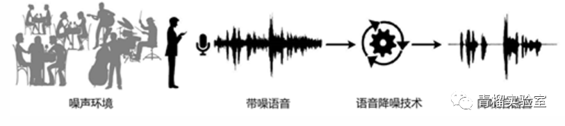

## 2、深度噪声抑制的发展

**RNNoise**：第一代的模型降噪算法，将传统信号处理与深度学习相结合的实时噪声抑制算法(2017.09)

**Wave-U-Net**：一种卷积神经网络，它直接作用于原始音频波形(wav)， 实现端到端音频源分离(2018.08)

**Conv-TasNet**：一种全卷积时域音频分离网络，将一组加权函数应用于编码器的输出来实现说话人分离，最后使用线性解码器得到分离出的语音波形(2018.09)

**DC-U-Net**：结合了深度复数网络和 Unet 的优点来处理复数值谱图，利用复数信息在极坐标系下估计语音的幅值和相位，许多卷积来提取上下文信息，从而导致较大的模型和复杂度(2019.03)

**DPRNN**：分为分割、块处理和重叠相加，分割是把输入长序列分割成互相重叠的块并拼接为3D向量，接着把向量传给堆叠的DPRNN块来反复执行局部和全局建模，最后通过重叠相加转化为输出序列(2019.10)

**Demucs**：时域语音降噪网络，由卷积Unet和LSTM构成，帧长40ms，帧移16ms (2019.11)

**DCCRN**：复数卷积和卷积递归网络(CRN)结合，在相同的模型参数大小情况下，仅用了1/6的DCUNET计算量，就达到了DC-U-Net的效果。(2020.08)

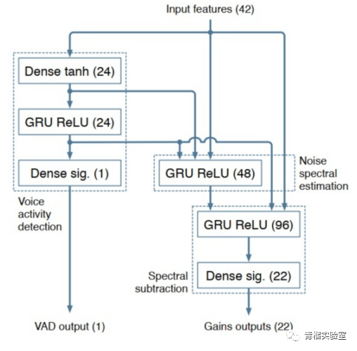

RNNoise  

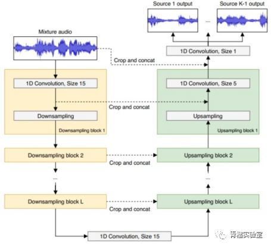

Wave-U-Net

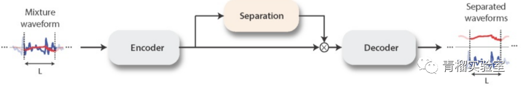

Conv-TasNet

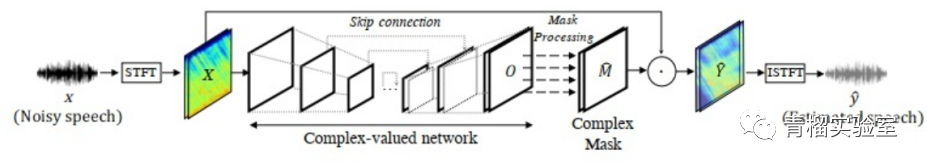

DC-U-Net

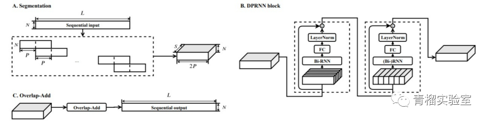DPRNN

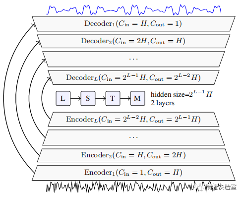Demucs

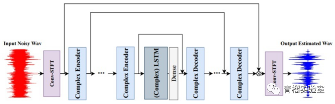

DCCRN

模型全景

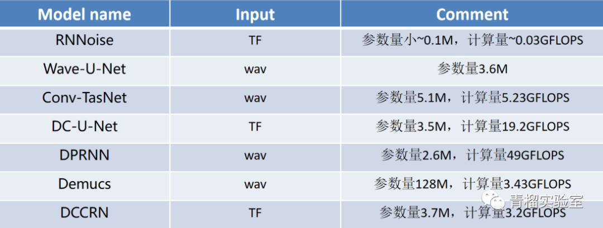

## 3、深度噪声抑制实现原理

以移动端部署情况为例，深度学习模型的部署大致分为以下五个步骤：

（1）数据收集：Deep Noise Suppression Challenge(DNS-Challenge数据集) 和部分标注噪音数据。

（2）预处理：利用干净语音数据和噪声语音数据生成训练数据、测试数据等。

（3）模型构建：即算法选型与设计，应用于该任务常见的有LSTM，GRU等。

（4）模型训练与预测：遵循神经网络的常规流程。

（5）模型压缩：通过压缩手段，如剪枝、量化等，降低模型的参数量和计算量。

基于深度学习的语音降噪需要关注非实时性和实时性。实际工作中，想要模型落地，考虑的不止这些，目前端侧对算法开销要求比较严苛，PC相对较好，像手机、平板的算法落地需要更加严格的模型选型和剪枝、量化。

所以本文采用基于时频域方法中的基于mask的方法进行算法模型构建：利用傅立叶变换提取音频帧的频域特征，把傅立叶变换后的特征给LSTM+全连接网络，学习出音频特征在频域的mask，然后利用mask得到干净语音信号的频域特征，利用反傅立叶变换得到时域的音频帧。

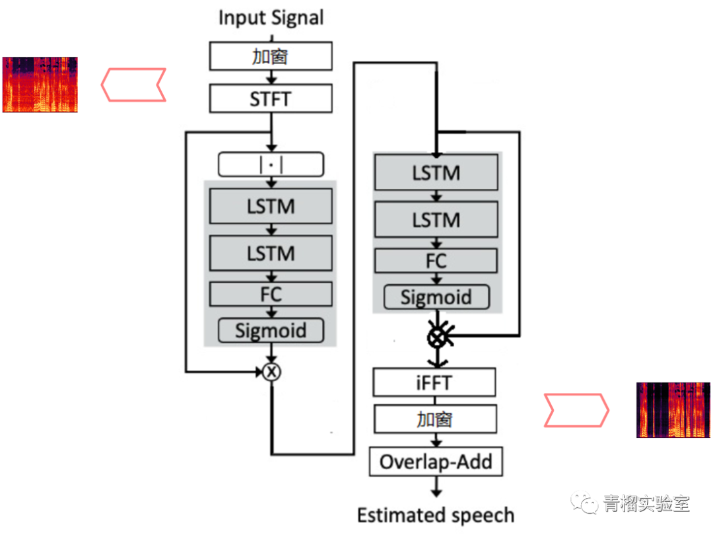

DTLN优化算法模型

模型利用Tensorflow搭建，为了保证模型的实时性，网络结构每次处理音频帧为32ms，位移为8ms，利用500小时语音数据对模型进行训练，同时训练数据中也加入了啸叫等噪声，这样使得模型既能去除噪音，也能进行啸叫抑制，通过训练得到最终的模型权重文件。

为了与常规DTLN模型效果进行对比，选用以下常用于语音降噪效果的评价指标：

（1）PESQ -- 感知语音质量评价(衡量失真) -0.5 ～ 4.5

（2）STOI -- 短时目标清晰度(衡量可理解读) 0 ～ 1

（3）MOS -- 平均意见值 0 ~ 5

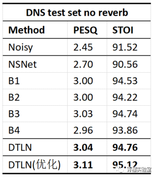

DNS no_reverb 测试数据

采用本文DTLN优化算法模型后，其中pesq提升至3.11；Stoi值提升至95.12。本文DTLN优化算法模型明显优于常规DTLN模型。该模型文件可以在服务端对音频帧进行实时处理，在Intel I5-6600k @3.5GHz上，保存的h5模型文件处理一帧32ms音频耗时0.65ms。

为了能在手机端、平板等运行模型，需对模型进行压缩，量化，采用Tensorflow转tflite，原始h5模型文件保存大小为3M，在经过tflite转换之后，模型大小仅为900Kb，此时在Intel I5-6600k @3.5GHz运行tflite文件耗时0.36ms，经过quantized耗时仅为0.27ms。

最后经过Mos值评测：在非混响条件下Mos值为3.85，混响条件下的Mos值为3.28。

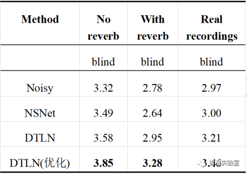

封装成SDK运行在手机端实测的，完全符合实时性的要求，能对嘈杂环境、室外交通、车内噪音、白噪音、风声、键盘声等噪音进行很好的去除。

## 4、效果展示

（1）降噪前后

<video src="http://mpvideo.qpic.cn/0bc3tiaaqaaatmalylco6frfbgwdbcnaacaa.f10002.mp4?dis_k=15d2cac9c0f33deddebdbb04ef14b370&amp;dis_t=1649384869&amp;vid=wxv_2344327144581300225&amp;format_id=10002&amp;support_redirect=0&amp;mmversion=false" poster="http://mmbiz.qpic.cn/mmbiz_jpg/XKFpmLFeRuJqX3SCClxLWR80cCPlicCviaEqdJRw2aUicqnDpJXpda3eicF8SPQbbib7ZMich69cuu51xrzJMWj8Rn2g/0?wx_fmt=jpeg" webkit-playsinline="isiPhoneShowPlaysinline" playsinline="isiPhoneShowPlaysinline" preload="metadata" crossorigin="anonymous" controlslist="nodownload" class=""> 您的浏览器不支持 video 标签 </video>

（2）啸叫抑制前后

<video src="http://mpvideo.qpic.cn/0bc3xuaaqaaahial25co4vrfbpodbc6qacaa.f10003.mp4?dis_k=033e6dd37369553b66e2c1ae20d6b8f5&amp;dis_t=1649384869&amp;vid=wxv_2344333677545324548&amp;format_id=10003&amp;support_redirect=0&amp;mmversion=false" poster="http://mmbiz.qpic.cn/mmbiz_jpg/XKFpmLFeRuJqX3SCClxLWR80cCPlicCviaL6UTxejJMW8voKQYuq6IWhs40AxIwticICsqEBf0uPtlMfxOIbK2hMg/0?wx_fmt=jpeg" webkit-playsinline="isiPhoneShowPlaysinline" playsinline="isiPhoneShowPlaysinline" preload="metadata" crossorigin="anonymous" controlslist="nodownload" class=""> 您的浏览器不支持 video 标签 </video>

## 5、结语

实时深度噪声抑制模型的应用，可以对嘈杂环境、室外交通、车内噪音、白噪音、风声、键盘声等噪音进行很好的去除，通过抑制或降低背景噪声干扰，改善语音质量，提升听者的舒适感，提高语音信息传达的可懂度。

随着音频技术的快速发展，对于音频处理的需求也越来越高，语音降噪技术将会具备更广阔的应用前景。

