 
<!--BEGIN_DATA
{
    "create_date": "2022-03-28 12:10", 
    "modify_date": "2022-03-28 12:10", 
    "is_top": "0", 
    "summary": "声学回声消除", 
    "tags": "音视频", 
    "file_name": "声学回声消除.md"
}
END_DATA-->

#### 
原文出处：<a href='https://km.woa.com/articles/show/511758?kmref=author_post' target='blank'>声学回声消除</a>

回声消除（Echo Cancellation）是语音交互和语音通讯领域不可或缺的一项重要技术。一般来说，回声消除的效果受诸多因素的影响，包括：

  * 声学环境，包括反射，混响等；

  * 通话设备本身声学设计，包括音腔设计以及器件的非线性失真等；

  * 系统性能，处理器的计算能力以及操作系统线程调度的能力。

AEC技术已经经历半个多世纪的发展，目前逐渐形成以自适应滤波处理联合回声后处理为主的技术方案。自适应滤波器用来模拟和追踪真实的回声路径，以此估算出回声信号，再从近端纯净语音和回声的混合信号中减去估计回声，从而达到回声消除的目的。

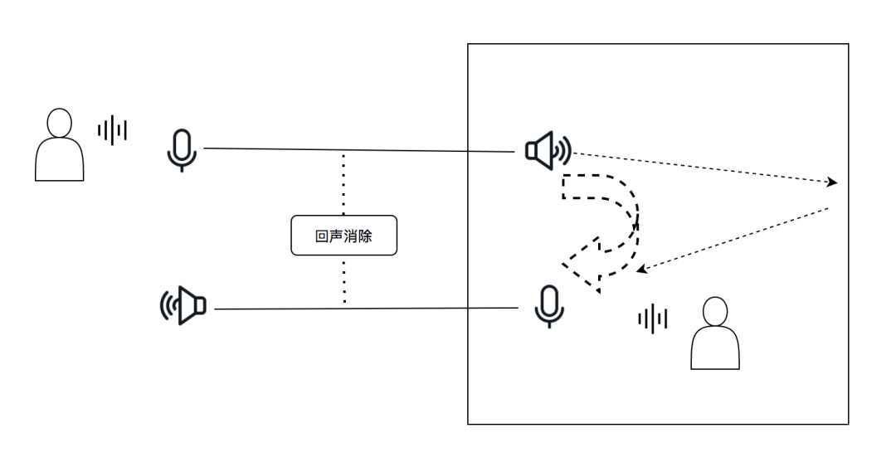

那么声学回声消除模块（AEC, Acoustic Echo Cancellation）是如何消除回声的呢？具体的步骤见如下简图所示：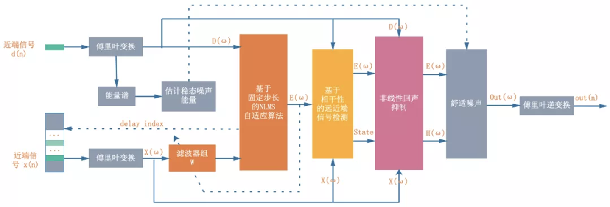

  * 第一步需要找到参考信号/扬声器信号跟麦克风信号之间的延迟。

  * 第二步根据参考信号估计出麦克风信号中的线性回声成分，并将其从麦克风信号中减去，得到残差信号。

  * 第三步通过非线性的处理将残差信号中的残余回声给彻底抑制掉。

与以上的三个步骤相对应，回声消除也由三个大的算法模块组成：

  * 延迟估计（Delay Estimation）

  * 线性自适应滤波器（Linear Adaptive Filter）

  * 非线性处理（Nonlinear Processing）

其中「延迟估计」决定了AEC的下限，「线性自适应滤波器」决定了 AEC 的上限，「非线性处理」决定了最终的通话体验，特别是回声抑制跟双讲之间的平衡。

> 注：双讲是指在交互场景中，互动双方或多方同时讲话，其中一方的声音会受到抑制，从而出现断断续续的情况。这是由于回声消除算法“矫枉过正”，消除了部分不该去
除的音频信号。

接下来，先围绕这三个算法模块，分别讲讲其中的技术挑战与优化思路。

## 一、延迟估计

受具体系统实现的影响，当把参考信号与麦克风信号分别送入 AEC 模块进行处理之时，它们所存入的数据 buffer 之间存在一个时间上的延迟，即在上图中看到的“delay=T”。假设这个产生回声的设备是一部手机，那么声音从它的扬声器发出后，一部分会经过设备内部传导到麦克风，也可能会经过外部环境传回到麦克风中。所以这个延迟就包含了设备采集播放 buffer 的长度，声音在空气中传输的时间，也包含了播放线程与采集线程开始工作的时间差。**正是由于影响延迟的因素很多，因此这个延迟的值在不同系统，不同设备，不同 SDK 底层实现上都各不相同。**它在通话过程中也许是一个定值，也有可能会中途变化（所谓的 overrun 和 underrun）。这也是为什么一个 AEC 算法在设备 A 上可能起作用，但换到另一个设备上可能效果会变差。延迟估计的精确性是 AEC 能够工作的先决条件，过大的估计偏差会导致 AEC 的性能急剧下降，甚至无法工作，而无法快速跟踪时延变化是出现偶现回声的重要因素。

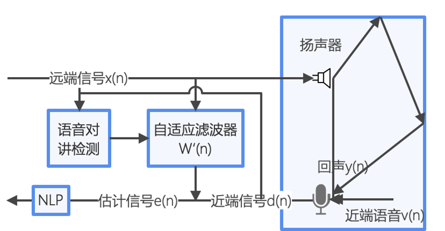

为了估计近端数据相对远端数据的延迟，算法需要在缓存中緩存一定时长的远端历史数据，缓存的时长要尽可能覆盖到应用场景中可能出现的最大延迟。然后用 AEC 当前取到的一帧近端数据跟远端缓存中每一的历史数据进行匹配，找到相似度最高的那一帧远端数据，两者时间素引的差值就是估计出来的延迟。延迟估计算法最核心的地方就是如何衡量近端数据和远端数据之问的相似度，从而进行匹配。WebRTC 的AEC 所使用的延迟估计算法相对于传统的互相关算法具有计算复杂度低，准确度高的优点。

  * 首先将当前参与运算的 128 点远端时域信号和 128 点近端时域信号变换到频域，获得一个 63点振幅谱数据块。
  * 接着选取第 12 个频点到第 43 个频点之间共 32 个子带数据，更新出每个频点对应的國值。
  * 然后将32个子带数据分别与对应的岡值进行比较，如果大于阈值，该子带处记为1，否则记为0，这样就可以用一个长度为 32 位的无符号二进制数据米表示结果，这里用“二元诺”来描述。将远端二元谐缓存的位置集体后移一位，并将当前获得的远端二元谱放入缓存的最新位置。用当前近端二元谱数据跟缓存中每一个二元谱数据按位异或，然后统计结果中1的个数，1的个数越少，则说明相应缓存中这一帧二元谱跟近端二元谱越相似，最相似的这一顿所代表的延迟很有可能就是真正的延迟

这样的延迟估计算法相对于传统的互相关算法具有计算复杂度低，准确度高的优点。为了得到更加精确的延迟，还需要在此基础上做进一步的统计处理。

## 二、线性自适应滤波器

对于线性滤波器，已有大量的文献介绍其原理及实践。当应用于回声消除的应用场景，主要考虑的指标包含收敛速度（convergence rate），稳态失调（steady-state misalignment）及跟踪性能（tracking capability）。这些指标之间往往也有冲突，譬如较大的步长可以改善收敛速度，但是会导致较大的失调。这个就是自适应滤波器中的没有免费的午餐定理(No Free Lunch Theorem)。对于自适应滤波器的类型，除了最为常用的 NLMS 滤波器（Model Independent），还可以使用 RLS 滤波器（Least Squares Model）或 Kalman 滤波器（State-Space Model）。除了各自理论推导中的各种假设，近似，优化，这些滤波器的性能最终都归结到如何计算最佳的步长因子（在卡尔曼滤波器里面步长因子合并到 Kalman Gain 的计算里面）。在滤波器尚未收敛或是环境传输函数突变的情形下，步长因子需要足够大以跟踪环境变化，当滤波器收敛及环境传递函数变化缓慢的时间段，步长因子应尽量减小以达到尽可能小的稳态失调。对于步长因子的计算，需要考虑自适应滤波器后残余回声跟残差信号间的能量比值，建模为系统的 leakage coefficients。这个变量常常等价于求滤波器系数跟真实传递函数之间的差（Kalman 滤波器里面称为状态空间状态向量误差），这也是整个估计算法中的难点。除此之外，双讲阶段的滤波器发散问题也是一个需要考虑的点，一般来说这个问题可以通过调整滤波器结构，使用 two echo path models 来解决。

自适应滤波器算法并不使用单一的滤波器类型，而是兼顾了不同滤波器之间的优点，同时搭配自适应算法计算最优的步长因子。此外，算法通过线性滤波器系数实时估计环境的传递函数，自动修正滤波器长度，以覆盖通信设备连接 HDMI 外设等高混响，强回声的场景。如下是一个例子，在办公室的一个中型会议室中（面积约20m2，三面玻璃墙），使用 Macbook Pro 通过 HDMI 连接小米电视，图中是线性滤波器时域信号的变化趋势，算法能自动计算并匹配实际环境传递函数的长度（在第 1400 帧左右自动检测出了强混响环境），以优化线性滤波器的性能。

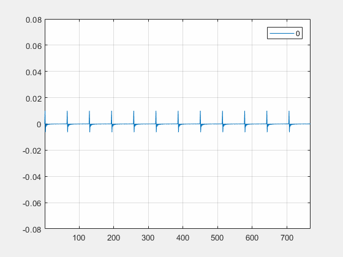

## 三、非线性处理

怎么判断是线性回声还是非线性回声？要解决这个问题，核心就是要认识清楚这里面的每一个环节，看看它们到底是线性系统还是非线性系统，如果所有的环节都是线性的话，那么很自然y[k]就是一个线性的回声，否则只要有一个环节是非线性的，那么这个回声就是非线性回声。从发送到到接收端。发出的信号首先要经过**

  * **1、D/A变换，从数字域变换到模拟域；**
  * **2、然后再经过功率放大器，放大之后驱动喇叭，这样就会发出声音。**
  * **3、发出来的声音经过空气信道传播之后，到了接收端被麦克风采集到，然后再次经过功率放大器；**
  * **4、最后再通过A/D变换，从模拟域又变回到数字域，最后输出回声信号。**

首先这里的1和4比较好判断，他们都属于线性时不变系统。比较难判断的是3，因为在一些比较复杂的场景下，声学回声往往会经过多个不同路径的多次反射之后到达接收端，同时会带有很强的混响，甚至在更极端情况下，喇叭与麦克风之间还会产生相对位移变化，导致回声路径也会随时间快速变化。这么多因素叠加在一起，往往会导致回声消除算法的性能急剧退化，甚至完全失效。然而要区分线性跟非线性的主要依据是叠加原理，前面提到的这些复杂场景，它们依然是满足叠加原理的，所以3是线性系统。2里面有一个功率放大器，同时在3里面也有一个功率放大器，为什么经2的功率放大器放大之后，可能带来非线性失真，而3的功率放大器不会产生非线性失真呢？二者的主要区别在于2放大之后输出是一个大信号，用来驱动喇叭。而3放大之后输出依然是小信号，通常不会产生非线性的失真。非线性声学回声产生的原因，一般有两种；

  * 1、声学器件的小型化与廉价化，这里所指的声学器件就是前面2里面提到的功率放大器和喇叭。
  * 2、就是声学结构设计的不合理。最典型的一个实例就是声学系统的隔振设计不合理。喇叭发声单元跟麦克接收单元之间，通常是需要做隔振处理的，如果没有隔振处理的话，那么在喇叭发声的过程中，他所产生的振动会通过物理方式传递到麦克接收端，对麦克接收到的声学信号进行调制，而这种振动本质上是一种随机的、非线性的振动，所以它必然会带来非线性失真。

### 1、**非线性声学回声系统建模

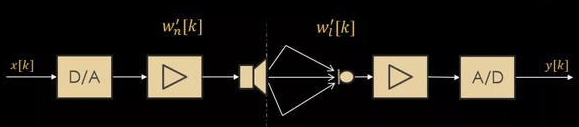  

将左边的喇叭端用一个传递函数Wn来表示，假设它代表的是非线性的回声路径传递函数；同时将喇叭右边，就是麦克端，统一用Wl来表示，他代表的是线性回声传递函数。基于这样的数学假设，收到的信号y就可以表示成发射的信号x分别跟这样两个传递函数进行卷积之后的结果。

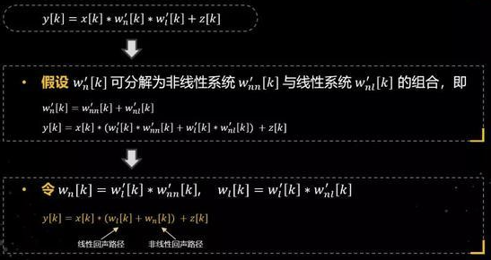

接下来对这个模型进行了适当的简化，简化主要是基于数学分解，假设非线性的传递函数，可以分解成线性跟非线性这样两个系统函数的组合形式，就会得到中间的方程。

接下来对中间的方程进行变量替换，就得到最后这个表达式，这个表达式它的物理意义很清晰，可以看到，整个回声路径是可以表示成线性回声路径跟非线性回声路径二者之和的形式，这是它的物理意义。

### 2. 双耦合自适应滤波器

基于这样一个数学模型，接下来就构建了一种新的滤波器结构，称之为双耦合自适应滤波器。这个滤波器跟传统线性的自适应滤波器相比，主要有两个方面的不同，第一个不同是传统的线性滤波器只有一个学习单元，当前这个滤波器有两个学习单元，分别是这里的线性回声路径滤波器，用Wl来表示。还有非线性的回声路径滤波器，用Wn来表示。第二个不同就是，在这两个滤波器之间还加入了一个耦合因子，这个耦合因子目的就是为了协同二者更好的工作，让二者能够发挥出最大的效能，甚至能够起到1+1＞2的效果。

### 3. 双耦合滤波器设计

当滤波器的结构确定下来之后，就要去设计滤波器系数了。设计过程可以把它总结成了三步，第一步就是构建优化准则，第二步是求解滤波器的权系数——Wl和Wn，最后一步就是构建耦合机制。

  * 第一步就是构建优化准则。这应该是整个滤波器设计里面最重要的一步，因为它决定了滤波器性能的上限。什么样的优化准则是一个好的优化准则呢？优化准则需要跟问题的物理特性有效匹配起来，所以在构建优化准则之前，需要先对非线性声学回声的特性进行分析，希望通过这种分析去挖掘非线性声学回声的一些物理特性。 

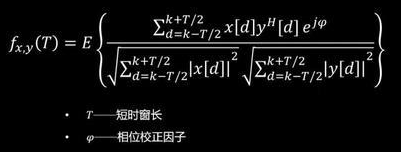

基于上面的短时相关度函数，它所表示的是两个信号，在一个短时的观测时间窗“T”这样一个尺度范围内的波形的相似程度，需要注意的是这个函数它是统计意义上的，因为对它进行了数学期望运算。同时在分子的最后一项还加了一个相位校正因子，目的是为了将这两路信号的初始相位对齐。

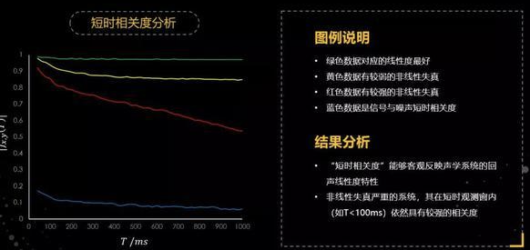

基于前面构建的短时相关度函数，对大量声学回声数据进行分析，并挑选了几组比较典型的数据：绿色的曲线对应的是一组线性度非常好的回声数据。从这个数据上可以看到，在整个时间T的变化范围内，它的短时相关度都非常高，达到0.97以上，接近于1。黄色曲线，对应的数据具有比较弱的非线性失真，所以在时间T变大了之后，短期相关度逐渐降低，最后趋于一个相对平稳的值。而红色曲线是一条具有强非线性失真的数据，为了对这三组数据进行有效对比，还给出了一条蓝色曲线，这条曲线是信号与噪声的短时相关度，它在整个时间T范围内都很小。

通过这样一组曲线的对比，会得到两个结论，第一个结论就是构建的短时相关度函数，能够相对客观反映这个声学系统的线性度特征，线性度越好，这个值会越大。第二个结论：对于非线性失真很强的系统，其在短时观测窗内（如T<100ms）依然具有较强的相关度，这从红色的曲线可以看出来。

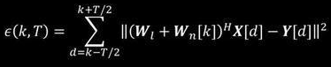

也正是基于这样的特征，接下来就构建了一种新的误差函数，称之为“短时累积误差函数”。大家可以注意到在一个观测时间窗T内，对残差进行了累积。

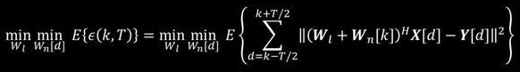

基于这样的误差函数，进一步构建了一种新的优化准则，称为“最小平均短时累计误差准则”。希望通过优化准则的约束，最后得到的滤波器权系数能够满足两个特性，第一个特性是滤波器在统计意义上能够达到最优，即全局最优，因此在目标函数里加入了数学期望运算。同时，还希望它在一个短时的观测时间窗的尺度里面也是最优的，即局部最优，所以在数学期望内部，因此又对误差进行了短时积分。

这个优化准则跟传统的线性自适应滤波器是有本质区别的，因为传统的线性自适应滤波器基于最小均方误差准则，它只是在统计意义上最优，没有局部最优约束。

  * 第二步求解这里的Wl和Wn，Wi就是线性滤波器。主要求解方法是，假设Wn就是非线性滤波器是最优解，把这个最优解代入到前面的优化方程里，就会得到上面简化之后的优化目标函数。

在这个地方，又做了一些先验假设，假设非线性的滤波器的一阶统计量和二阶统计量都等于0，就可以把上面的优化问题进一步简化，就得到非常熟悉的方程，就是Wiener-Hopf方程。这个结果说明，线性滤波器的最优解跟传统的自适应滤波器的最优解是一致的，都是Wiener-Hopf方程的理论最优解。所以就可以采用一些现有的比较成熟的算法，比如NLMS算法、RLS算法，对它进行迭代求解。这就是Wl的设计。

接下来再看看Wn的设计。Wn的设计跟Wl的设计是类似的，也是需要将优化之后的线性滤波器，代入到最开始的优化问题里，可以把前面的优化问题简化成下面的方程。接下来进行一系列的变量替换之后，最后就得到了非线性滤波器的最优解，它具有最小二乘估计形式。

  * 第三步构建耦合机制。在介绍耦合机制之前，先说一下这种耦合机制的期望特性。在声学系统的线性度非常好的情况下，线性滤波器起到主导作用，而非线性滤波器处于休眠的状态，或者关闭的状态；反过来，当声学系统的非线性很强时，希望非线性滤波器起到主导作用，而线性滤波器处于半休眠状态。实际声学系统往往是非线性与线性两种状态的不断交替、叠加，因此需要构建一种机制来对这两种状态进行耦合控制。

为了设计耦合机制，就必须对线性度和非线性度特征进行度量。先定义了两个因子，分别是线性度因子和非线性度因子，对应左边的这两个方程。进行耦合控制的基本的思想就是将这两个因子的值代入到NLMS算法和最小二乘算法之中，调整二者的学习速度。

为了便于大家对双耦合声学回声消除算法有一个定性的认识，如图，左边一组图对应的是线性回声的场景。首先来看一下NLMS算法，黄色曲线代表真实的系统传递函数，红色曲线是NLMS算法的结果。可以看到，在线性场景下，NLMS算法得到的线性滤波器可以有效逼近真实传递函数，进而能够有效抑制线性声学回声。

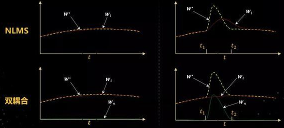

下面再来看一下这个双耦合算法，在线性的回声场景里，双耦合的非线性滤波器是处于休眠的状态，所以它的值是趋于0的，这个时候起主导作用的是线性滤波器。

接下来再看一下右边的非线性声学回声场景。假设非线性的失真主要出现在t1到t2这个时间段内，大家可以看到黄色线在这个时间里，出现了一次突变，对于NLMS算法，当出现非线性失真之后，它的线性滤波器会去逼近非线性失真。但是由于学习的速度跟不上滤波器变化的速度，所以它跟真实的值之间总是存在一个比较大的gap。同时当非线性失真消失之后，它还需要一段时间恢复到正常状态，因此在整个时间段里，都会出现回声泄露的问题。

接下来再看双耦合算法，在非线性失真出现之后，线性滤波器会进入到一种相对休眠的状态，就是前面所提到的耦合机制，会降低它的更新速度，所以在整个非线性出现的这段时间里，他的值是缓慢变化的。

进入非线性失真状态之后，非线性滤波器开始工作，它会快速跟踪非线性特性的变化，而当非线性失真消失之后，非线性滤波器又进入休眠状态。将这两个滤波器结合起来，就可以实现对整个声学回声路径的变化进行有效跟踪。这里只是给出了一个示例，实际情况往往要复杂很多。

主要是从4个不同的维度对这2个滤波器做了特性比较。

  * 首先是优化准则。NLMS算法是基于最小均方误差准则，而双耦合算法是基于最小平均短时累计误差准则，所以他们的优化准则是不一样的。
  * 第二个就是理论的最优解，NLMS算法具有Wiener-Hopf方程解，而双耦合算法的线性滤波器也具有Wiener-Hopf方程解，非线性滤波器具有最小二乘解。
  * 第三个维度就是运算量，NLMS运算量是O（M），M代表是滤波器的阶数，而双耦合算法运算量后面会多一个O（N2），因为他有两个滤波器，N是非线性滤波器的阶数，这里的平方是因为最小二乘需要对矩阵进行求逆运算，所以它的运算量比线性的NLMS运算量要大很多。
  * 第四个就是控制机制，NLMS算法只有一个滤波器，它的控制主要是通过调整步长来实现的，控制起来要相对简单。而双耦合算法需要对两套滤波器进行耦合控制，控制的复杂度要高很多。
