 
<!--BEGIN_DATA
{
    "create_date": "2016-07-06 11:45", 
    "modify_date": "2016-07-06 11:45", 
    "is_top": "0", 
    "summary": "如何动态调用C函数", 
    "tags": "C/C++", 
    "file_name": "如何动态调用C函数.md"
}
END_DATA-->

####<p>原文出处：<a href='http://blog.cnbang.net/tech/3219/' target='blank'>如何动态调用C函数</a></p>

[JSPatch](https://github.com/bang590/JSPatch) 支持了动态调用 C 函数，无需在编译前桥接每个要调用的 C函数，只需要在 JS 里调用前声明下这个函数，就可以直接调用：

    
    
    require('JPEngine').addExtensions(['JPCFunction'])
    defineCFunction("malloc", "void *, size_t")
    malloc(10)
    

我们一步步来看看怎样可以做到动态调用 C 函数。

###函数地址

首先若要动态调用 C 函数，第一步就是需要通过传入一个函数名字符串找到这个函数地址，这里一个必要的前提条件就是 C编译后的可执行文件里必须有原函数名的信息，才有可能做到通过函数名字符串找到函数地址。我们写个简单的程序来看看它编译后可执行文件的内容有没有这个信息：

    
    //main.m
    void test() {
    }
    int main() {
      return 0;
    }
    

编译这个文件，并用otool看下它的汇编：  

    
    
    gcc main.m -o main.o
    otool -tV main.o
    

输出：

    
    
    main.o:
    (__TEXT,__text) section
    _test:
    0000000100000f90 pushq %rbp
    0000000100000f91 movq %rsp, %rbp
    0000000100000f94 popq %rbp
    0000000100000f95 retq
    0000000100000f96 nopw %cs:(%rax,%rax)
    _main:
    0000000100000fa0 pushq %rbp
    0000000100000fa1 movq %rsp, %rbp
    0000000100000fa4 xorl %eax, %eax
    0000000100000fa6 movl $0x0, -0x4(%rbp)
    0000000100000fad popq %rbp
    0000000100000fae retq
    

可以看到函数名 test 和 main 都清楚地记录在可执行文件里，只不过前面多了个下划线_，所以完全可以在运行时通过函数名字符串查到这个函数地址。

###dlsym()

实际上动态链接器已经提供一个API：dlsym()，本来是用于动态加载库(DLL)，然后通过这个接口拿到函数地址，它也可以应用于当前可执行文件镜像，原理是一样的。

    
    
    void test() {
      printf("testFunc");
    }
    int main() {
      void (*funcPointer)() = dlsym(RTLD_DEFAULT, "test");
      funcPointer();
      return 0;
    }
    

好了现在我们可以通过函数名拿到对应的函数地址了，这样就可以自由动态调用所有 C 函数了吗？还不行，这样只能动态调用返回值和参数都为空的 C 函数，上面funcPointer指针只能在指向参数返回值都为空的函数时才能正确调用到。对于有返回值和有参数的 C 函数，这里定义时需要指明参数和返回值类型才能使用：

    
    
    int testFunc(int n, int m) {
      printf("testFunc");
      return 1;
    }
    int main() {
      // ①
      int (*funcPointer)(int, int) = dlsym(RTLD_DEFAULT, "testFunc");
      funcPointer(1, 2);
      // ②
      void (*funcPointer)() = dlsym(RTLD_DEFAULT, "testFunc");
      funcPointer(1, 2); //error
      return 0;
    }
    

（这里①和②两个调用方式下文会多次提到，①表示调用正确定义了函数参数/返回值类型的函数指针，②表示调用没有正确定义参数/返回值类型的函数指针）

这个例子中 dlsym 返回了 testFunc 的函数指针，必须像 ① 那样指明它的返回类型和参数类型后，才能调用成功，如果像 ②那样定义这个指针，没有正确的参数类型和返回值类型，在调用时就会出现crash。

也就是说我们没法通过定义一个万能的函数指针去支持所有函数的动态调用，这里必须让函数的参数/返回值类型都对应上才能调用，为什么必须要对应上呢？因为函数的调用方和被调用方是会遵循一种叫调用惯例(Calling Convention)的约定的。

###Calling Convention

一个函数的调用过程中，函数的参数既可以使用栈传递，也可以使用寄存器传递，参数压栈的顺序可以从左到右也可以从右到左，函数调用后参数从栈弹出这个工作可以由函数调用方完成，也可以由被调用方完成。如果函数的调用方和被调用方(函数本身)不遵循统一的约定，有这么多分歧这个函数调用就没法完成。这个双方必须遵守的统一约定就叫做调用惯例(Calling Convention)，调用惯例规定了参数的传递的顺序和方式，以及栈的维护方式。

函数调用者和被调用者需要遵循这同一套约定，上述②这样的情况，就是函数本身遵循了这个约定，而调用者没有遵守，导致调用出错。

再简单分析下，如果按①那样正确的定义方式定义funcPointer，然后调用它，这里编译成汇编后，在调用处会有相应指令把参数 n,m 的值 1 和 2入栈，然后跳过去 testFunc()函数实体执行，这个函数执行时，按约定它知道n,m两个参数值已经在栈上，就可以取出来使用了。

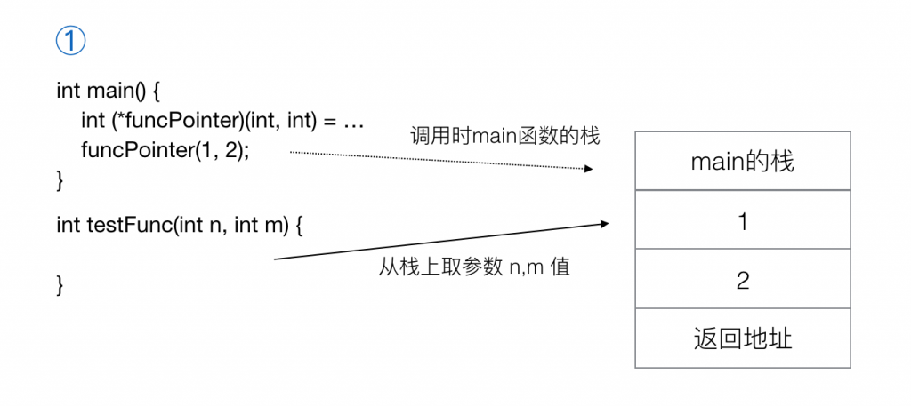

而如果按②那样定义，编译后这里不会把参数 n,m 的值 1 和 2入栈，因为这里编译器把它当成了没有参数和没有返回值的函数，也就不需要进行参数入栈的操作，然后在testFunc()函数实体里按约定去栈上取参数时就会发现栈上本来应该存参数 n 和 m 的地方并没有数据，或者是其他错误的数据，导致调用出错。

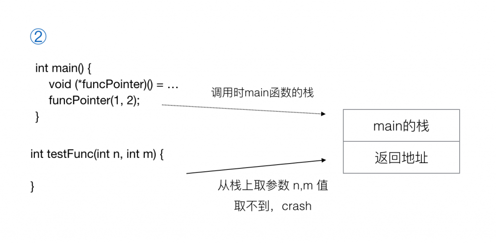

所以你需要在调用前明确告诉编译器这个函数的参数和返回值类型是什么，编译器才能生成对应的正确的汇编代码，让被调用的函数执行时能正常取到参数。

也就是说如果需要动态调用任意 C 函数，就得先准备好任意 参数类型/参数个数/返回值类型 排列组合的 C
函数指针，让最终的汇编把所有情况都准备好，最后调用时通过 switch 去找到正确的那个去执行就可以了。但显然这是很糟糕的主意。

在 C 语言这个层面上是解决不了这个问题的，要解决只能再往底层走，靠汇编。

（P.S. 在不同 CPU 架构上调用惯例不同，例如arm32位所有参数都通过栈传递，arm64位会让部分参数通过寄存器传递，超出寄存器大小的参数才通过栈传递，因为64位机器多出了寄存器，通过寄存器传递比栈快。不过就算所有CPU架构调用惯例相同，也不影响我们碰到的这个问题，你可以忽略这点。）

###objc_msgSend

实际上你会发现 OC 上有个函数脱离了上述限制，就是 objc_msgSend。OC 所有方法调用最终都会走到
objc_msgSend去调用，这个神奇的方法支持任意返回值任意参数类型和个数，而它的定义仅是这样：

    
    
    void objc_msgSend(void /* id self, SEL op, ... */ )
    

为什么它就可以支持所有函数调用呢，不是说调用者和函数本身要遵循调用惯例吗，这个函数跟我们上述的②有什么区别？

答案是在C语言层面上没区别，但人家在汇编上做了手脚，objc_msgSend是用汇编写的，在调用这个函数之前，会把栈/寄存器等数据都准备好，相当于调用前对参数入栈等处理由这个函数自己写的汇编代码接管了，不需要编译器在调用处去生成这些指令。

这里会在调用真正的函数之前，根据 Calling Convention 准备好栈帧/寄存器数据和状态，最后再 jump/call到函数实体执行就可以了，这时函数实体按约定去取参数是取得到的，可以正常执行。于是 objc 就做到了在编译前只需要定义一个简单的objc_msgSend，就支持运行时动态调用任意类型的 C 函数（所有 OC 方法的 IMP）。

所以我们要仿照 objc_msgSend做一遍这个事情吗？难度好高:(。不用怕， libffi 这个神器已经帮你做了。

###libffi

对 libffi 的介绍可以看 [[这里]](http://www.oschina.net/p/libffi)，简单来说它就是提供了动态调用任意 C
函数的功能。

先来看看怎样通过 libffi 动态调用一个 C 函数：

    
    
    int testFunc(int m, int n) {
      printf("params: %d %d \n", n, m);
      return n+m;
    }
    int main() {
      //拿函数指针
      void* functionPtr = dlsym(RTLD_DEFAULT, "testFunc");
      int argCount = 2;
      //按ffi要求组装好参数类型数组
      ffi_type **ffiArgTypes = alloca(sizeof(ffi_type *) *argCount);
      ffiArgTypes[0] = &ffi_type_sint;
      ffiArgTypes[1] = &ffi_type_sint;
       //按ffi要求组装好参数数据数组
      void **ffiArgs = alloca(sizeof(void *) *argCount);
      void *ffiArgPtr = alloca(ffiArgTypes[0]->size);
      int *argPtr = ffiArgPtr;
      *argPtr = 1;
      ffiArgs[0] = ffiArgPtr;
      void *ffiArgPtr2 = alloca(ffiArgTypes[1]->size);
      int *argPtr2 = ffiArgPtr2;
      *argPtr2 = 2;
      ffiArgs[1] = ffiArgPtr2;
      //生成 ffi_cfi 对象，保存函数参数个数/类型等信息，相当于一个函数原型
      ffi_cif cif;
      ffi_type *returnFfiType = &ffi_type_sint;
      ffi_status ffiPrepStatus = ffi_prep_cif_var(&cif, FFI_DEFAULT_ABI, (unsigned int)0, (unsigned int)argCount, returnFfiType, ffiArgTypes);
      if (ffiPrepStatus == FFI_OK) {
        //生成用于保存返回值的内存
        void *returnPtr = NULL;
        if (returnFfiType->size) {
          returnPtr = alloca(returnFfiType->size);
        }
        //根据cif函数原型，函数指针，返回值内存指针，函数参数数据调用这个函数
        ffi_call(&cif, functionPtr, returnPtr, ffiArgs);
        //拿到返回值
        int returnValue = *(int *)returnPtr;
        printf("ret: %d \n", returnValue);
      }
    }
    

看起来挺复杂的，梳理一下就这几步：

  1. 通过 dlsym 拿到函数指针。
  2. 给每个参数申请内存空间，按 ffi 要求把参数数据组装成数组。（用alloca()申请空间，不需要free()去释放）
  3. 用函数参数个数/参数类型/返回值类型组装成 cif 对象，表示这个函数原型。（有点像OC的methodSignature）
  4. 申请内存空间用于保存函数返回值。
  5. 把 cif 函数原型，函数指针，返回值内存指针，参数数据 传入 ffi_call调用这个函数。

这里每一步都是可以在运行时动态去做的，也就可以做到在运行时动态调用任意 C 函数了。

这里最终 libffi 能调用任意 C 函数的原理按我理解跟上面说的
objc_msgSend的原理差不多，ffi_call底层是用汇编实现的，它在调用我们传入的函数之前，会根据上面提到的函数原型 cif 和参数数据，把参数都
按规则塞到栈/寄存器里，准备好数据和状态，这样调用的函数实体里就可以按规则取到这些参数，正常执行了。调用完再获取返回值，清理这些栈帧/寄存器数据。libff
i 针对每个架构不同的 Calling Convention 写了不同的汇编代码去做这个事。可以参见 libffi 里的 sysv_arm64.Ssysv_arm.S等汇编源码。[[这篇文章]](http://blog.csdn.net/ayu_ag/article/details/50706429)有一些细节解析，可以看看。

到这里已经完成了动态调用 C 函数，接下来的工作就只是在 JS 和 libffi 之间加一层转换，就可以让 JSPatch 支持动态调用 C函数了，JPCFunction就是做这层转换的。

###JPCFunction

目前 [JPCFunction](https://github.com/bang590/JSPatch/blob/master/Extensions/JPCFunction/JPCFunction.m)比较简单，直接看代码就可以了，简单说下流程：

  1. 调用 C 函数之前需要通过 defineCFunction定义这个函数的各参数类型和返回值类型，defineCFunction 里解析了类型字符串，转换成一个 JPCFunctionSignature对象，每个函数对应一个 JPCFunctionSignature对象，这里模拟了 OC 方法的NSMethodSignature。
  2. 调用函数时根据函数名拿到 JPCFunctionSignature对象，集齐了 参数个数/各参数类型/返回值类型/各参数数据 这些信息，组装成 ffi 需要的格式进行调用。

这里第二步的处理中对于 struct 类型会比较麻烦，目前还未支持参数/返回值类型为 struct 的 C 函数，后续会补上。

###总结

回顾下动态调用 C 函数的探索过程，先是通过 dlsym()拿到函数指针，然后需要告诉编译器这个函数的参数/返回值类型，编译器才会根据 Calling Convention 约定生成对应的汇编代码，在调用函数时对参数进行正确的入栈/存入寄存器等操作，让函数成功调用，这一步在运行时在C语言层面上无法做到，所以 objc_msgSend()和 libffi 都用汇编模拟了这一过程，达到动态调用 C 函数的目的。


<hr>


####<p>原文出处：<a href='http://blog.jobbole.com/105471/' target='blank'>深入理解 C 语言的函数调用过程</a></p>

原文出处： [wjlkoorey](http://blog.chinaunix.net/uid-23069658-id-3981406.html)  

本文主要从进程栈空间的层面复习一下C语言中函数调用的具体过程，以加深对一些基础知识的理解。

先看一个最简单的程序：

主函数main里定义了4个局部变量，然后调用同文件里的foo1()函数。4个局部变量毫无疑问都在进程的栈空间上，当进程运行起来后我们逐步了解一下main函数里是如何基于栈实现了对foo1()的调用过程，而foo1()又是怎么返回到main函数里的。为了便于观察的粒度更细致一些，我们对test.c生成的汇编代码进行调试。如下：

```
.file "test.c"
        .text
.globl foo1
        .type foo1
foo1:
        pushl %ebp
        movl %esp, %ebp
        subl $16, %esp
        movl 12(%ebp), %eax
        movl 8(%ebp), %edx
        leal (%edx,%eax), %eax
        addl 16(%ebp), %eax
        movl %eax, -4(%ebp)
        movl -4(%ebp), %eax
        leave
        ret
        .size foo1, .-foo1
        .section .rodata
.LC0:
        .string "result=%d\n"
        .text
.globl main
        .type main
main:
        pushl %ebp
        movl %esp, %ebp
        andl $-16, %esp
        subl $32, %esp
        movl $11, 16(%esp)
        movl $22, 20(%esp)
        movl $33, 24(%esp)
        movl 24(%esp), %eax
        movl %eax, 8(%esp)
        movl 20(%esp), %eax
        movl %eax, 4(%esp)
        movl 16(%esp), %eax
        movl %eax, (%esp)
        call foo1
        movl %eax, 28(%esp)
        movl $.LC0, %eax
        movl 28(%esp), %edx
        movl %edx, 4(%esp)
        movl %eax, (%esp)
        call printf
        movl $0, %eax
        leave
        ret
        .size main, .-main
        .ident "GCC: (GNU) 4.4.4 20100726 (Red Hat 4.4.4-13)"
        .section .note.GNU-stack,"",@progbits
```

上面的汇编源代码和最终生成的可执行程序主体结构上已经非常类似了：

```
[root  1]# gcc -g -o test test.s
[root  1]# objdump -D test > testbin
[root  1]# vi testbin
 //… 省略部分不相关代码
80483c0:       ff d0                               call   *%eax
 80483c2:       c9                                   leave
 80483c3:       c3                                   ret
 
080483c4 :
 80483c4:       55                                  push   %ebp
 80483c5:       89 e5                               mov    %esp,%ebp
 80483c7:       83 ec 10                          sub    $0x10,%esp
 80483ca:       8b 45 0c                          mov    0xc(%ebp),%eax
 80483cd:       8b 55 08                         mov    0x8(%ebp),%edx
 80483d0:       8d 04 02                         lea    (%edx,%eax,1),%eax
 80483d3:       03 45 10                         add    0x10(%ebp),%eax
 80483d6:       89 45 fc                          mov    %eax,-0x4(%ebp)
 80483d9:       8b 45 fc                          mov    -0x4(%ebp),%eax
 80483dc:       c9                                   leave
 80483dd:       c3                                   ret
 
080483de
:
 80483de:       55                                     push   %ebp
 80483df:       89 e5                                 mov    %esp,%ebp
 80483e1:       83 e4 f0                            and    $0xfffffff0,%esp
 80483e4:       83 ec 20                           sub    $0x20,%esp
 80483e7:       c7 44 24 10 0b 00 00       movl   $0xb,0x10(%esp)
 80483ee:       00
 80483ef:       c7 44 24 14 16 00 00        movl   $0x16,0x14(%esp)
 80483f6:       00
 80483f7:       c7 44 24 18 21 00 00        movl   $0x21,0x18(%esp)
 80483fe:       00
 80483ff:       8b 44 24 18                      mov    0x18(%esp),%eax
 8048403:       89 44 24 08                    mov    %eax,0x8(%esp)
 8048407:       8b 44 24 14                    mov    0x14(%esp),%eax
 804840b:       89 44 24 04                    mov    %eax,0x4(%esp)
 804840f:       8b 44 24 10                     mov    0x10(%esp),%eax
 8048413:       89 04 24                         mov    %eax,(%esp)
 8048416:       e8 a9 ff ff ff                     call   80483c4
 804841b:       89 44 24 1c                     mov    %eax,0x1c(%esp)
 804841f:       b8 04 85 04 08                 mov    $0x8048504,%eax
 8048424:       8b 54 24 1c                     mov    0x1c(%esp),%edx
 8048428:       89 54 24 04                     mov    %edx,0x4(%esp)
 804842c:       89 04 24                         mov    %eax,(%esp)
 804842f:       e8 c0 fe ff ff                     call   80482f4
 8048434:       b8 00 00 00 00              mov    $0x0,%eax
 8048439:       c9                                  leave
 804843a:       c3                                  ret
 804843b:       90                                 nop
 804843c:       90                                 nop
 //… 省略部分不相关代码
```

用GDB调试可执行程序test：

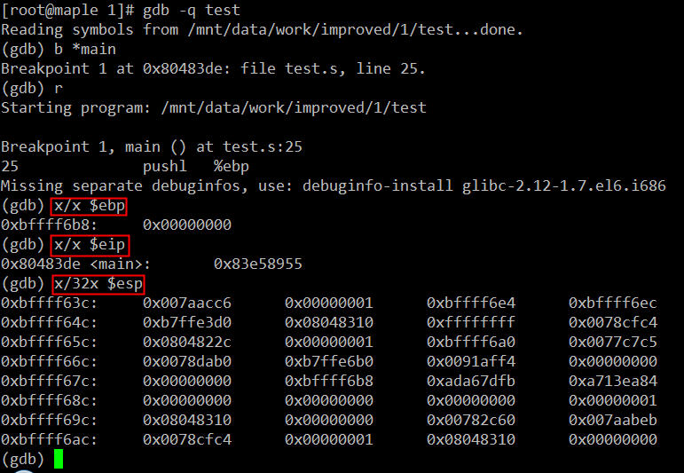

在main函数第一条指令执行前我们看一下进程test的栈空间布局。因为我们最终的可执行程序是通过glibc库启动的，在main的第一条指令运行前，其实还有很多故事的，这里就不展开了，以后有时间再细究，这里只要记住一点：main函数执行前，其进程空间的栈里已经有了相当多的数据。我的系统里此时栈顶指针esp的值是0
xbffff63c，栈基址指针ebp的值0xbffff6b8，指令寄存器eip的值是0x80483de正好是下一条马上即将执行的指令，即main函数内的第一条指令“push %ebp”。那么此时，test进程的栈空间布局大致如下：

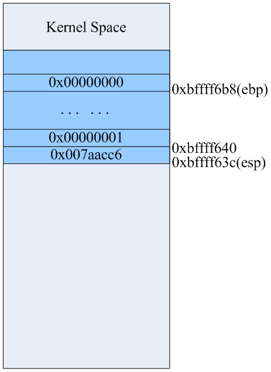

然后执行如下三条指令：

pushl %ebp //将原来ebp的值0xbffff6b8如栈，esp自动增长4字节 movl %esp, %ebp //用ebp保存当前时刻esp的值andl $-16, %esp //内存地址对其，可以忽略不计

```
pushl %ebp         //将原来ebp的值0xbffff6b8如栈，esp自动增长4字节
movl %esp, %ebp    //用ebp保存当前时刻esp的值
andl $-16, %esp    //内存地址对其，可以忽略不计
```

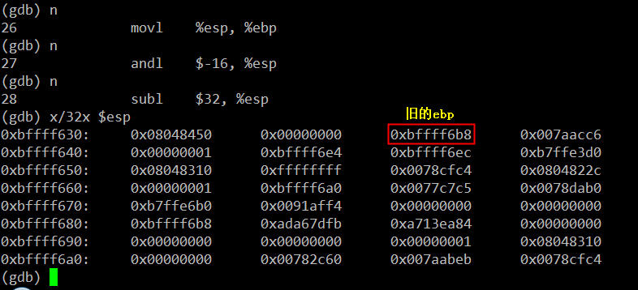

行完上述三条指令后栈里的数据如上图所示，从0xbffff630到0xbffff638的8字节是为了实现地址对齐的填充数据。此时ebp的值0xbffff638，该地址处存放的是ebp原来的值0xbffff6b8。详细布局如下：

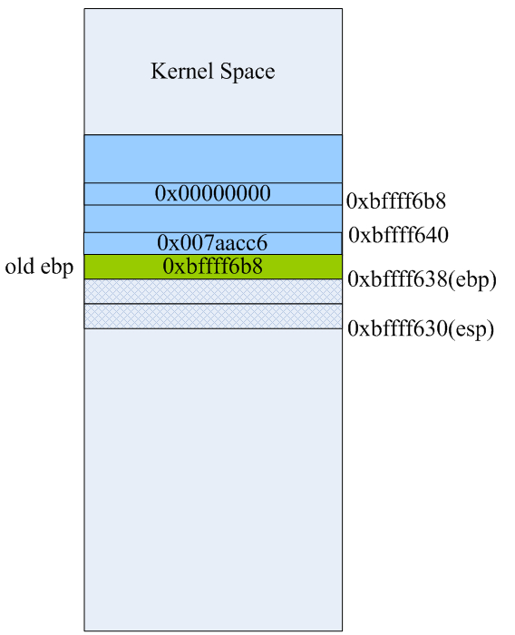

第28条指令“subl $32, %esp”是在栈上为函数里的本地局部变量预留空间，这里我们看到main主函数有4个int型的变量，理论上说预留16字节空间就可以了，但这里却预留了32字节。GCC编译器在生成汇编代码时，已经考虑到函数调用时其输入参数在栈上的空间预留的问题，这一点我们后面会看到。当第28条指令执行完后栈空间里的数据和布局如下：

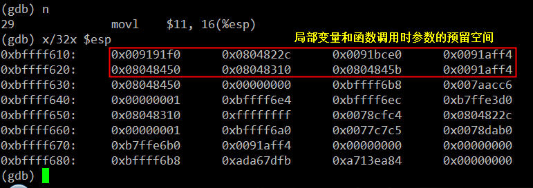

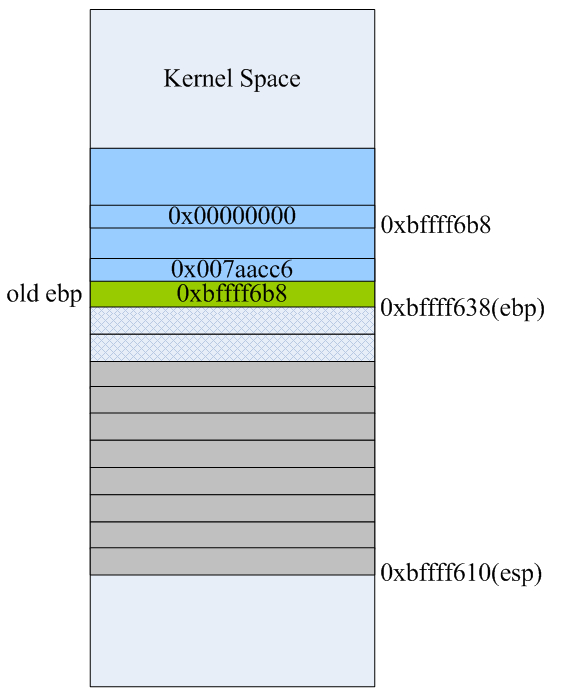

然后main函数里的变量x，y，z的值放到栈上，就是接下来的三条指令：

movl $11, 16(%esp) movl $22, 20(%esp) movl $33, 24(%esp)

```
movl $11, 16(%esp)
movl $22, 20(%esp)
movl $33, 24(%esp)
```

这是三条寄存器间接寻址指令，将立即数11，22，33分别放到esp寄存器所指向的地址0xbffff610向高位分别偏移16、20、24个字节处的内存单元里，最后结果如下：

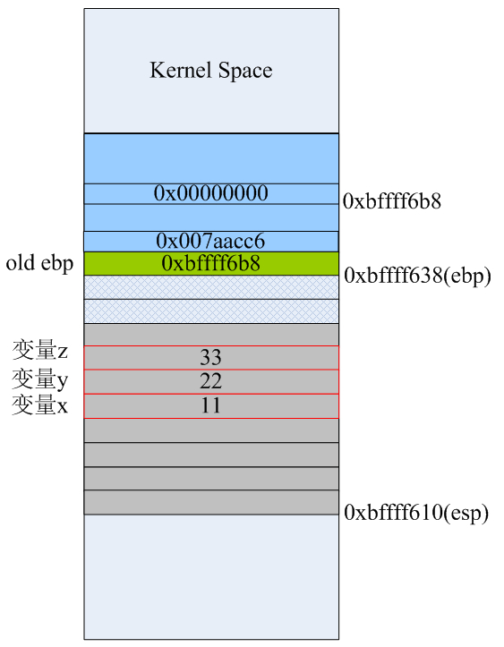

注意：这三条指令并没有改变esp寄存器的值。

接下来main函数里就要为了调用foo1函数而做准备了。由于mov指令的两个操作数不能都是内存地址，所以要将x，y和z的值传递给foo1函数，则必须借助通用寄存器来完成，这里我们看到eax承担了这样的任务：

```
movl 24(%esp), %eax
movl %eax, 8(%esp)
movl 20(%esp), %eax
movl %eax, 4(%esp)
movl 16(%esp), %eax
movl %eax, (%esp)
```

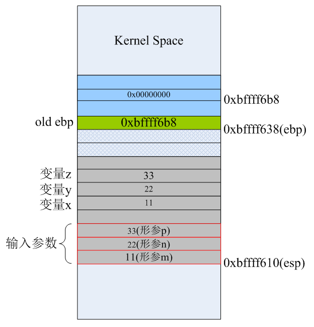

当foo1函数所需要的所有输入参数都已经按正确的顺序入栈后，紧接着就需要调用call指令来执行foo1函数的代码了。前面的博文说过，call指令执行时分两步：首先会将call指令的下一条指令(movl %eax,28(%esp))的地址(0x0804841b)压入栈，然后跳转到函数foo1入口处开始执行。当第38条指令“call foo1”执行完后，栈空间布局如下：

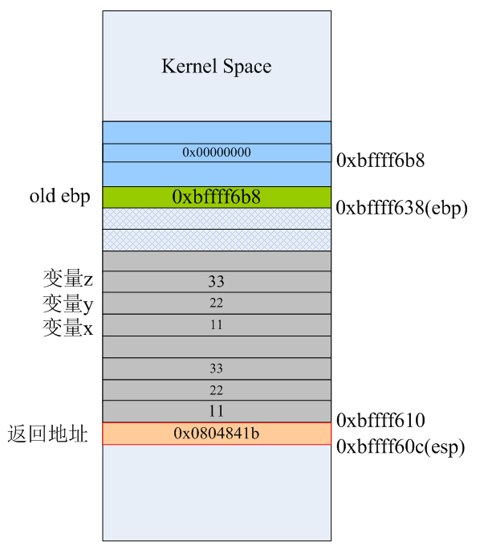

call指令自动将下一条要执行的指令的地址0x0804841b压入栈，栈顶指针esp自动向低地址处“增长”4字节。所以，我们以前在C语言里所说的函数返回地址，应该理解为：当被调用函数执行完之后要返回到它的调用函数里下一条马上要执行的代码的地址。为了便于观察，我们把foo1函数最后生成指令再列出来：

```
.globl foo1
          .type foo1
foo1:
			pushl %ebp
			movl %esp, %ebp
			subl $16, %esp
			movl 12(%ebp), %eax
			movl 8(%ebp), %edx
			leal (%edx,%eax), %eax
			addl 16(%ebp), %eax
			movl %eax, -4(%ebp)
			movl -4(%ebp), %eax
			leave
			ret
			.size foo1, .-foo1
```

进入到foo1函数里，开始执行该函数里的指令。当执行完第6、7、8条指令后，栈里的数据如下。这三条指令就是汇编层面函数的“序幕”，分别是保存ebp到栈，让ebp指向当前栈顶，然后为函数里的局部变量预留空间：

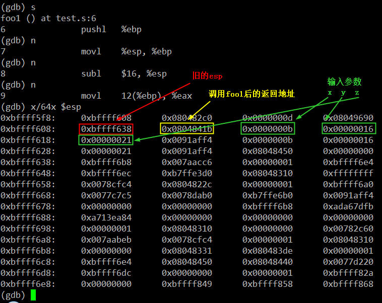

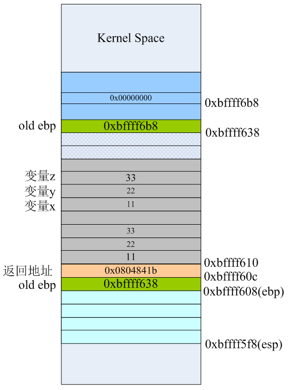

接下来第9和第10条指令，也并没有改变栈上的任何数据，而是将函数输入参数列表中的的x和y的值分别转载到eax和edx寄存器，和main函数刚开始时做的事情一样。此时eax=22、edx=11。然后用了一条leaf指令完成x和y的加法运算，并将运算结果存在eax里。第12条指令“addl 16(%ebp), %eax”将第三个输入参数p的值，这里是实参z的值为33，同样用寄存器间接寻址模式累加到eax里。此时eax=11+22+33=66就是我们最终要得计算结果。

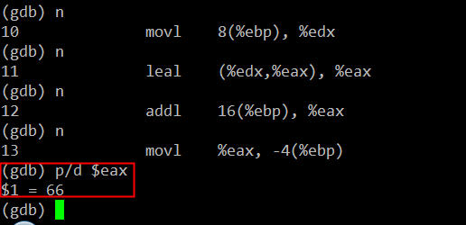

因为我们foo1()函数的C代码中，最终计算结果是保存到foo1()里的局部变量x里，最后用return语句将x的值通过eax寄存器返回到mian函数里，所以我们看到接下来的第13、14条指令有些“多此一举”。这足以说明gcc人家还是相当严谨的，C源代码的函数里如果有给局部变量赋值的语句，生成汇编代码时确实会在栈上为本地变量预留的空间里的正确位置为其赋值。当然gcc还有不同级别的优化技术来提高程序的执行效率，这个不属于本文所讨论的东西。让我们继续，当第13、14条指令执行完后，栈布局如下：

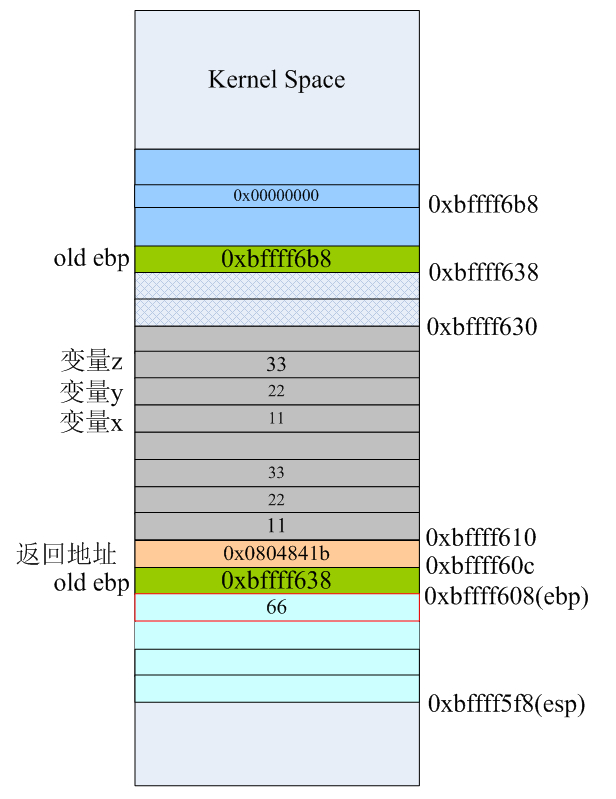

将ebp-4的地址处0xbffff604(其实就是foo1()里的第一个局部参数x的地址)的值设置为66，然后再将该值复制到eax寄存器里，等会儿在main函数里就可以通过eax寄存器来获取最终的计算结果。当第15条指令leave执行完后，栈空间的数据和布局如下：

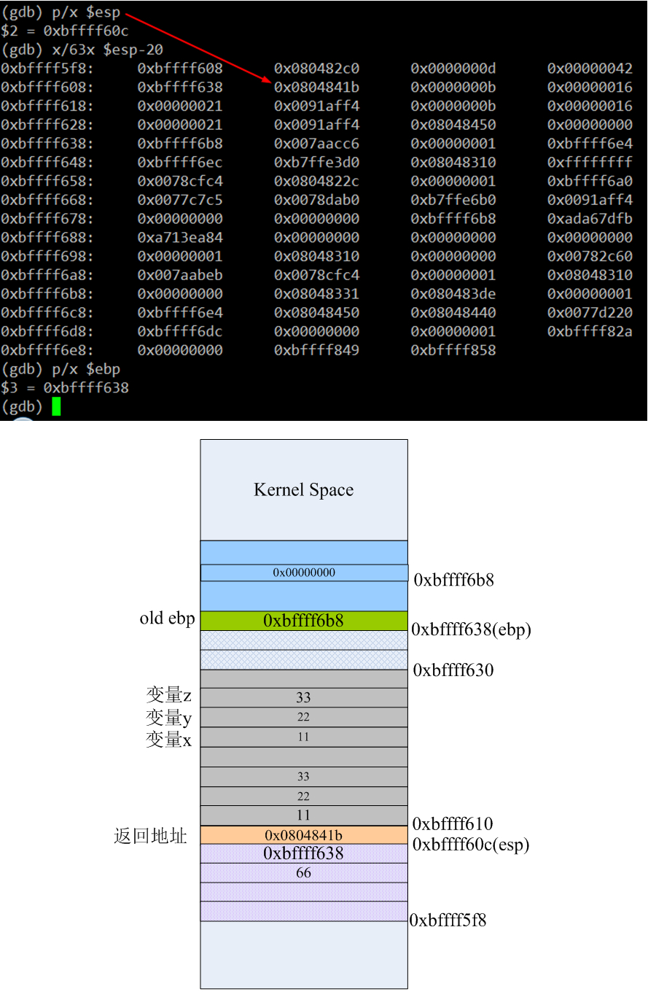


我们发现，虽然栈顶从0xbffff5f8移动到0xbffff60c了，但栈上的数据依然存在。也就是说，此时你通过esp-8依旧可以访问foo1函数里的局部变量x的值。当然，这也是说得通的，因为函数此时还没有返回。我们看栈布局可以知道当前的栈顶0xbffff60c处存放的是下一条即将执行的指令的地址，对照反汇编结果可以看到这正是main函数里的第18条指令(在整个汇编源文件test.s里的行号是39)“movl %eax, 28(%esp)”

leave指令其实完成了两个任务：

1、将栈上为函数预留的空间“收回”；  
2、恢复ebp；

也就是说leave指令等价于下面两条指令，你将leave替换成它们编译运行，结果还是对的：


	movl %ebp,%esp
	popl %ebp

前面我们也说过，ret指令会自动到栈上去pop数据，相当于执行了“popl %eip”，会使esp增大4字节。所以当执行完第16条指令ret后，esp从0xbffff60c增长到0xbffff610处，栈空间结构如下：

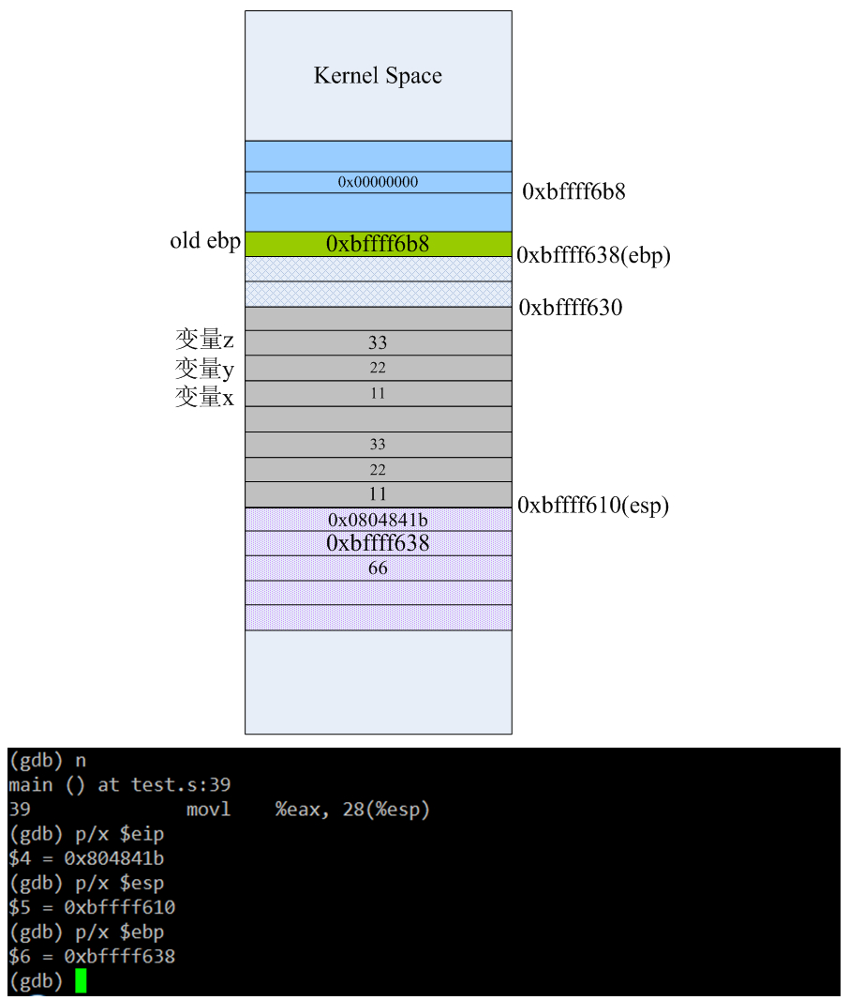

现在已经从foo1里返回了，但是由于还没执行任何push操作，栈顶“上部”的数据依旧还是可以访问到了，即esp-12的值就是foo1里的局部变量x的值、esp-4的值就是函数的返回地址，当执行第39条指令“movl %eax，28(%esp)”后栈布局变成下面的样子：

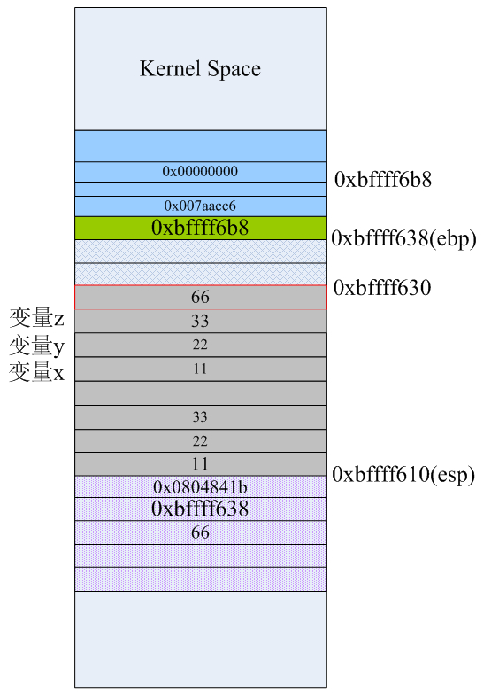

第39条指令就相当于给main里的result变量赋值66，如上红线标注的地方。接下来main函数里要执行printf("result=%d\n",result)语句了，而printf又是C库的一个常用的输出函数，这里就又会像前面调用foo1那样，初始化栈，然后用“call printf的地址”来调用C函数。当40～43这4条指令执行完后，栈里的数据如下：

	movl $.LC0, %eax
	movl 28(%esp), %edx
	movl %edx, 4(%esp)
	movl %eax, (%esp)

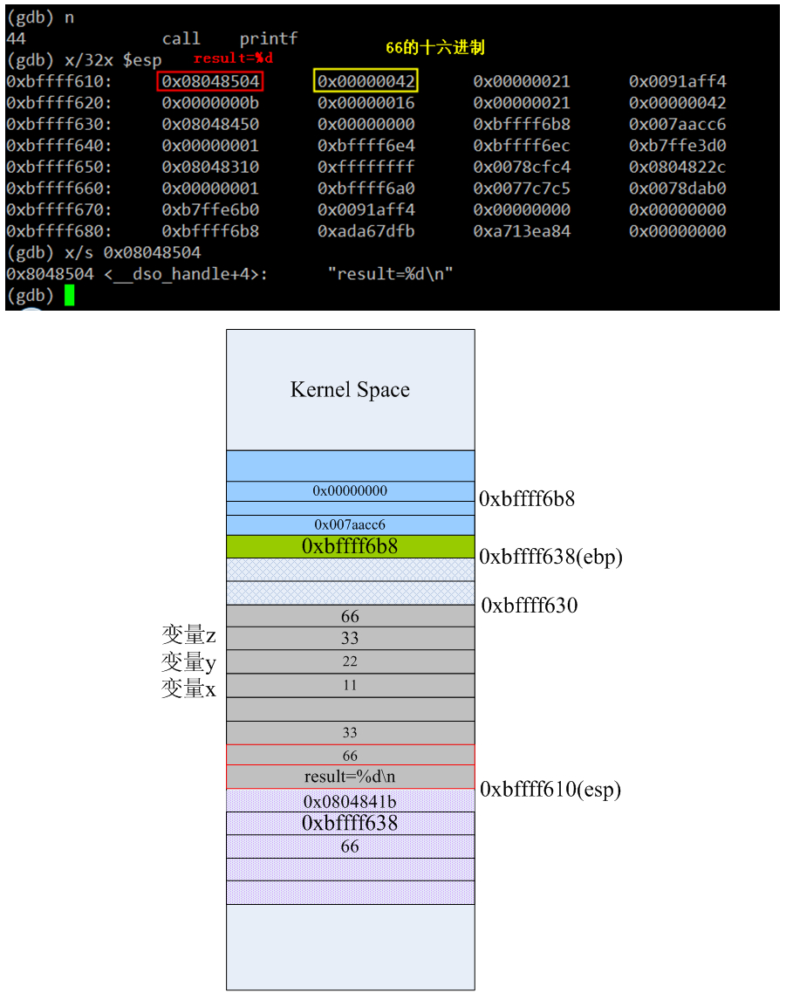

上图为了方便理解，将栈顶的0x08048504替换了成字符串“result=%d\n”，但进程实际运行时此时栈顶esp的值是字符串所在的内存地址。当第44条指令执行完后，栈布局如下：

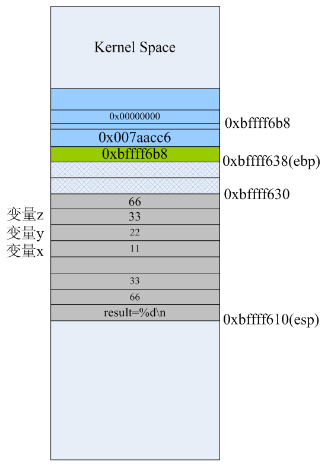

由于此时栈已经用来调用printf了，所以栈顶0xbffff610“以上”部分的空间里就找不到foo1的任何影子了。最后在main函数里，当第46、47条指令执行完后栈的布局分别是：

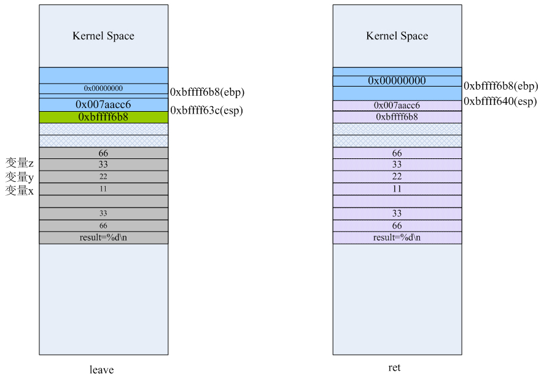

当main函数里的ret执行完，其实是返回到了C库里继续执行剩下的清理工作。  
所以，最后关于C的函数调用，我们可以总结一下：

1、函数输入参数的入栈顺序是函数原型中形参从右至左的原则；  
2、汇编语言里调用函数通常情况下都用call指令来完成；  
3、汇编语言里的函数大部分情况下都符合以下的函数模板：

```
.globl fun_name
.type fun_name
fun_name:
        pushl %ebp
        movl %esp, %ebp
        <函数主体代码> 
        leave
        ret
```

如果我们有个函数原型：int funtest(int x,int y int z char* ptr)，在汇编层面，当调用它时栈的布局结构一般是下面这个样子：

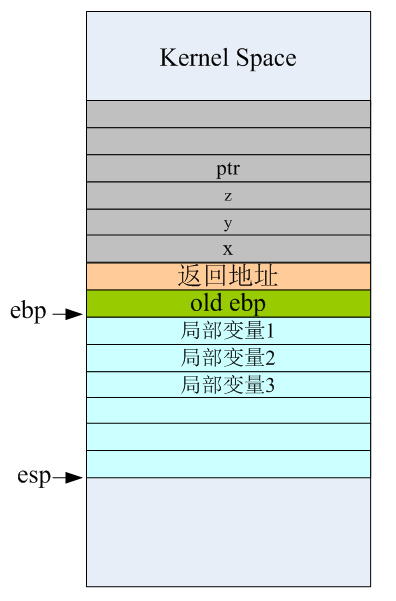

而有些资料上将ebp指向函数返回地址的地方，这是不对的。正常情况下应该是ebp指向old ebp才对，这样函数末尾的leave和ret指令才可以正常工作。

