 
<!--BEGIN_DATA
{
    "create_date": "2016-08-23 12:45", 
    "modify_date": "2016-08-23 12:45", 
    "is_top": "0", 
    "summary": "如何实现1080P延迟低于500ms的实时超清直播传输技术", 
    "tags": "架构", 
    "file_name": "如何实现1080P延迟低于500ms的实时超清直播传输技术.md"
}
END_DATA-->

####
原文出处：<a href='http://www.tuicool.com/articles/EF3AFnV' target='blank'>如何实现1080P延迟低于500ms的实时超清直播传输技术</a>

导语：视频直播是很多技术团队及架构师关注的问题，在实时性方面，大部分直播是准实时的，存在 1-3
秒延迟。本文由袁荣喜向「高可用架构」投稿，介绍其将直播延迟控制在 500ms 的背后的实现。

袁荣喜，学霸君工程师，2015年加入学霸君，负责学霸君的网络实时传输和分布式系统的架构设计和实现，专注于基础技术领域，在网络传输、数据库内核、分布式系统和并发编程方面有一定了解。

最近由于公司业务关系，需要一个在公网上能实时互动超清视频的架构和技术方案。众所周知，视频直播用 CDN + RTMP就可以满足绝大部分视频直播业务，我们也接触了和测试了几家 CDN 提供的方案，单人直播没有问题，一旦涉及到 **多人互动延迟非常大**，无法进行正常的互动交谈。对于我们做在线教育的企业来说没有互动的直播是毫无意义的，所以我们决定自己来构建一个超清晰（1080P）实时视频的传输方案。

先来解释下什么是实时视频，实时视频就是视频图像从产生到消费完成整个过程人感觉不到延迟，只要符合这个要求的视频业务都可以称为实时视频。关于视频的实时性归纳为三个等级：

  * 伪实时：视频消费延迟超过 3 秒，单向观看实时，通用架构是 CDN + RTMP + HLS，现在基本上所有的直播都是这类技术。 

  * 准实时： 视频消费延迟 1 ~ 3 秒，能进行双方互动但互动有障碍。有些直播网站通过 TCP/UDP + FLV 已经实现了这类技术，YY 直播属于这类技术。 

  * 真实时：视频消费延迟 < 1秒，平均 500 毫秒。这类技术是真正的实时技术，人和人交谈没有明显延迟感。QQ、微信、Skype 和 WebRTC 等都已经实现了这类技术。 

市面上大部分真实时视频都是 480P 或者 480P 以下的实时传输方案，用于在线教育和线上教学有一定困难，而且有时候流畅度是个很大的问题。在实现超清晰实时视频我们做了大量尝试性的研究和探索，在这里会把大部分细节分享出来。

要实时就要缩短延迟，要缩短延迟就要知道延迟是怎么产生的，视频从产生、编码、传输到最后播放消费，各个环节都会产生延迟，总体归纳为下图：

（ 点击图片可以全屏缩放）

成像延迟，一般的技术是毫无为力的，涉及到 CCD 相关的硬件，现在市面上最好的 CCD，一秒钟 50 帧，成像延迟也在 20 毫秒左右，一般的 CCD 只有20 ~ 25 帧左右，成像延迟 40 ~ 50 毫秒。

编码延迟，和编码器有关系，在接下来的小结介绍，一般优化的空间比较小。

我们着重针对网络延迟和播放缓冲延迟来进行设计，在介绍整个技术细节之前先来了解下视频编码和网络传输相关的知识和特点。

#####一、视频编码那些事

我们知道从 CCD 采集到的图像格式一般的 RGB 格式的（BMP），这种格式的存储空间非常大，它是用三个字节描述一个像素的颜色值，如果是 1080P分辨率的图像空间：1920 x 1080 x 3 = 6MB，就算转换成 JPG 也有近 200KB，如果是每秒 12 帧用 JPG 也需要近2.4MB/S 的带宽，这带宽在公网上传输是无法接受的。

视频编码器就是为了解决这个问题的，它会根据前后图像的变化做运动检测，通过各种压缩把变化的发送到对方，1080P 进行过  H.264 编码后带宽也就在200KB/S ~ 300KB/S 左右。在我们的技术方案里面我们采用 H.264 作为默认编码器（也在研究 H.265）。

#####1.1 H.264 编码

前面提到视频编码器会根据图像的前后变化进行选择性压缩，因为刚开始接收端是没有收到任何图像，那么编码器在开始压缩的视频时需要做个全量压缩，这个全量压缩在H.264 中 I 帧，后面的视频图像根据这个I帧来做增量压缩，这些增量压缩帧叫做 P 帧，H.264 为了防止丢包和减小带宽还引入一种双向预测编码的 B帧，B 帧以前面的 I 或 P 帧和后面的 P 帧为参考帧。H.264 为了防止中间 P 帧丢失视频图像会一直错z它引入分组序列（GOP）编码 ，也就是隔一段时间发一个全量 I 帧，上一个 I 帧与下一个 I 帧之间为一个分组 GOP。它们之间的关系如下图：

_ PS： **在实时视频当中最好不要加入 B 帧** ，因为 B 帧是双向预测，需要根据后面的视频帧来编码，这会增大编解码延迟。  _

#####1.2 马赛克、卡顿和秒开

前面提到如果 GOP 分组中的P帧丢失会造成解码端的图像发生错误,其实这个错误表现出来的就是马赛克。因为中间连续的运动信息丢失了，H.264在解码的时候会根据前面的参考帧来补齐，但是补齐的并不是真正的运动变化后的数据，这样就会出现颜色色差的问题，这就是所谓的 **马赛克现象** ，如图：

这种现象不是我们想看到的。为了避免这类问题的发生，一般如果发现 P 帧或者 I 帧丢失，就不显示本 GOP 内的所有帧，直到下一个 I帧来后重新刷新图像。但是 I 帧是按照帧周期来的，需要一个比较长的时间周期，如果在下一个 I帧来之前不显示后来的图像，那么视频就静止不动了，这就是出现了所谓的 **卡顿现象**
。如果连续丢失的视频帧太多造成解码器无帧可解，也会造成严重的卡顿现象。视频解码端的卡顿现象和马赛克现象都是因为丢帧引起的，最好的办法就是
**让帧尽量不丢** 。

知道 H.264 的原理和分组编码技术后所谓的秒开技术就比较简单了， 只要发送方从最近一个 GOP 的 I
帧开发发送给接收方，接收方就可以正常解码完成的图像并立即显示。但这会在视频连接开始的时候多发一些帧数据造成播放延迟，只要在接收端播放的时候尽量让过期的帧数据只解码不显示，直到当前视频帧在播放时间范围之内即可。

#####1.3 编码延迟与码率

前面四个延迟里面我们提到了编码延迟，编码延迟就是从 CCD 出来的 RGB 数据经过 H.264 编码器编码后出来的帧数据过程的时间。我们在一个 8 核CPU 的普通客户机测试了最新版本 X.264 的各个分辨率的延迟，数据如下：

 从上面可以看出，超清视频的编码延迟会达到
50ms，解决编码延迟的问题只能去优化编码器内核让编码的运算更快，我们也正在进行方面的工作。

#####在 1080P 分辨率下，视频编码码率会达到 300KB/S，单个 I 帧数据大小达到 80KB，单个 P 帧可以达到
30KB，这对网络实时传输造成严峻的挑战。

二、网络传输质量因素

实时互动视频一个关键的环节就是网络传输技术,不管是早期 VoIP，还是现阶段流行的视频直播，其主要手段是通过 TCP/IP 协议来进行通信。但是 IP网络本来就是不可靠的传输网络，在这样的网络传输视频很容易造成卡顿现象和延迟。先来看看 IP 网络传输的几个影响网络传输质量关键因素。

#####2.1 TCP 和 UDP

对直播有过了解的人都会认为做视频传输首选的就是 TCP + RTMP，其实这是比较片面的。在大规模实时多媒体传输网络中，TCP 和 RTMP都不占优势。TCP 是个拥塞公平传输的协议，它的拥塞控制都是为了保证网络的公平性而不是快速到达，我们知道，TCP层只有顺序到对应的报文才会提示应用层读数据，如果中间有报文乱序或者丢包都会在 TCP 做等待，所以 TCP的发送窗口缓冲和重发机制在网络不稳定的情况下会造成延迟不可控，而且传输链路层级越多延迟会越大。

关于 TCP 的原理：

http://coolshell.cn/articles/11564.html

关于 TCP 重发延迟：

http://weibo.com/p/1001603821691477346388

在实时传输中使用 UDP 更加合理，UDP 避免了 TCP 繁重的三次握手、四次挥手和各种繁杂的传输特性，只需要在 UDP 上做一层简单的链路 QoS监测和报文重发机制，实时性会比 TCP 好，这一点从 RTP 和 DDCP 协议可以证明这一点，我们正式参考了这两个协议来设计自己的通信协议。

#####2.2 延迟

要评估一个网络通信质量的好坏和延迟一个重要的因素就是 Round-Trip Time（网络往返延迟）,也就是 RTT。评估两端之间的 RTT方法很简单，大致如下：

  1. 发送端方一个带本地时间戳 T1 的 ping 报文到接收端；

  2. 接收端收到 ping 报文，以 ping 中的时间戳 T1 构建一个携带 T1 的 pong 报文发往发送端；

  3. 发送端接收到接收端发了的 pong 时，获取本地的时间戳 T2，用 T2 – T1 就是本次评测的 RTT。

示意图如下：

（ 点击图片可以全屏缩放）

上面步骤的探测周期可以设为 1 秒一次。为了防止网络突发延迟增大，我们采用了借鉴了 TCP 的 RTT 遗忘衰减的算法来计算，假设原来的 RTT 值为rtt，本次探测的 RTT 值为 keep_rtt。那么新的 RTT 为：

#####new_rtt = (7 * rtt + keep_rtt) / 8

可能每次探测出来的 keep_rtt 会不一样，我们需要会计算一个 RTT 的修正值 rtt_var，算法如下：

#####new_rtt_var = (rtt_var * 3 + abs(rtt – keep_rtt)) / 4

#####rtt_var 其实就是网络抖动的时间差值。

如果 RTT 太大，表示网络延迟很大。 我们在端到端之间的网络路径同时保持多条并且实时探测其网络状态，如果 RTT 超出延迟范围会进行传输路径切换（本地网络拥塞除外）。

#####2.3 抖动和乱序

UDP 除了延迟外，还会出现网络抖动。什么是抖动呢？举个例子，假如我们每秒发送 10 帧视频帧，发送方与接收方的延迟为 50MS，每帧数据用一个 UDP报文来承载，那么发送方发送数据的频率是 100ms 一个数据报文，表示第一个报文发送时刻 0ms， T2 表示第二个报文发送时刻 100ms . ..，如果是理想状态下接收方接收到的报文的时刻依次是（50ms, 150ms, 250ms,350ms….），但由于传输的原因接收方收到的报文的相对时刻可能是（50ms, 120ms, 240ms, 360ms….），接收方实际接收报文的时刻和理想状态时刻的差值就是抖动。如下示意图：

 （ 点击图片可以全屏缩放）

我们知道视频必须按照严格是时间戳来播放，否则的就会出现视频动作加快或者放慢的现象，如果我们按照接收到视频数据就立即播放，那么这种加快和放慢的现象会非常频繁和明显。也就是说网络抖动会严重影响视频播放的质量，一般为了解决这个问题会 **设计一个视频播放缓冲区**，通过缓冲接收到的视频帧，再按视频帧内部的时间戳来播放既可以了。

UDP 除了小范围的抖动以外，还是出现大范围的乱序现象，就是后发的报文先于先发的报文到达接收方。乱序会造成视频帧顺序错乱，一般解决的这个问题会在视频**播放缓冲区里做一个先后排序功能** 让先发送的报文先进行播放。

播放缓冲区的设计非常讲究，如果缓冲过多帧数据会造成不必要的延迟，如果缓冲帧数据过少，会因为抖动和乱序问题造成播放无数据可以播的情况发生，会引起一定程度的卡顿。关于播放缓冲区内部的设计细节我们在后面的小节中详细介绍。

#####2.4 丢包

UDP 在传输过程还会出现丢包，丢失的原因有多种，例如：网络出口不足、中间网络路由拥堵、socket 收发缓冲区太小、硬件问题、传输损耗问题等等。在基于UDP 视频传输过程中，丢包是非常频繁发生的事情，丢包会造成视频解码器丢帧，从而引起视频播放卡顿。这也是大部分视频直播用 TCP 和 RTMP 的原因，因为
TCP 底层有自己的重传机制，可以保证在网络正常的情况下视频在传输过程不丢。基于 UDP 丢包补偿方式一般有以下几种：

#####报文冗余

报文冗余很好理解，就是一个报文在发送的时候发送 2 次或者多次。这个做的好处是简单而且延迟小，坏处就是需要额外 N 倍（N 取决于发送的次数）的带宽。

#####FEC

Forward Error Correction ， 即向前纠错算法，常用的算法有纠删码技术（EC），在分布式存储系统中比较常见。最简单的就是 A B两个报文进行 XOR（与或操作）得到 C，同时把这三个报文发往接收端，如果接收端只收到 AC,通过 A 和 C 的 XOR 操作就可以得到 B操作。这种方法相对增加的额外带宽比较小，也能防止一定的丢包，延迟也比较小，通常用于实时语音传输上。对于  1080P 300KB/S码率的超清晰视频，哪怕是增加 20% 的额外带宽都是不可接受的 ， 所以视频传输不太建议采用 FEC 机制。

#####丢包重传

丢包重传有两种方式，一种是 push 方式，一种是 pull 方式。Push 方式是发送方没有收到接收方的收包确认进行周期性重传，TCP 用的是 push方式。pull 方式是接收方发现报文丢失后发送一个重传请求给发送方，让发送方重传丢失的报文。丢包重传是按需重传，比较适合视频传输的应用场景，不会增加太对额外
的带宽，但一旦丢包会引来至少一个 RTT 的延迟。

#####2.5 MTU 和最大 UDP

IP 网定义单个 IP 报文最大的大小，常用 MTU 情况如下：

超通道 65535

16Mb/s 令牌环 179144

Mb/s 令牌环 4464

FDDI 4352

以太网 1500

IEEE 802.3/802.2 1492

X.25 576

点对点（低时延）296

红色的是 Internet 使用的上网方式，其中 X.25 是个比较老的上网方式，主要是利用 ISDN 或者电话线上网的设备，也不排除有些家用路由器沿用X.25 标准来设计。所以我们必须清晰知道每个用户端的 MTU 多大，简单的办法就是在初始化阶段用各种大小的 UDP 报文来探测 MTU 的大小。MTU的大小会影响到我们视频帧分片的大小，视频帧分片的大小其实就是单个 UDP 报文最大承载的数据大小。

#####分片大小 = MTU – IP 头大小 – UDP 头大小 – 协议头大小;

#####IP 头大小 = 20 字节， UDP 头大小 = 8 字节。

为了适应网络路由器小包优先的特性，我们如果得到的分片大小超过 800 时，会直接默认成 800 大小的分片。

#####三、传输模型

我们根据视频编码和网络传输得到特性对 1080P超清视频的实时传输设计了一个自己的传输模型，这个模型包括一个根据网络状态自动码率的编解码器对象、一个网络发送模块、一个网络接收模块和一个 UDP可靠到达的协议模型。各个模块的关系示意图如下：

 （ 点击图片可以全屏缩放）

3.1 通信协议

先来看通信协议，我们定义的通信协议分为三个阶段：接入协商阶段、传输阶段、断开阶段。

#####接入协商阶段：

主要是发送端发起一个视频传输接入请求，携带本地的视频的当前状态、起始帧序号、时间戳和 MTU
大小等，接收方在收到这个请求后，根据请求中视频信息初始化本地的接收通道，并对本地 MTU 和发送端 MTU 进行比较取两者中较小的回送给发送方，让发送方按协商后的 MTU 来分片。示意图如下：

（ 点击图片可以全屏缩放）

#####传输阶段：

传输阶段有几个协议，一个测试量 RTT 的 PING/PONG协议、携带视频帧分片的数据协议、数据反馈协议和发送端同步纠正协议。其中数据反馈协议是由接收反馈给发送方的，携带接收方已经接收到连续帧的报文 ID、帧 ID和请求重传的报文 ID 序列。同步纠正协议是由发送端主动丢弃发送窗口缓冲区中的报文后要求接收方同步到当前发送窗口位置，防止在发送主动丢弃帧数据后接收方一直要求发送方重发丢弃的数据。示意图如下:

（ 点击图片可以全屏缩放）

#####断开阶段：

就一个断开请求和一个断开确认，发送方和接收方都可以发起断开请求。

3.2 发送

发送主要包括视频帧分片算法、发送窗口缓冲区、拥塞判断算法、过期帧丢弃算法和重传。先一个个来介绍。

#####帧分片

前面我们提到 MTU 和视频帧大小，在 1080P 下大部分视频帧的大小都大于 UDP 的 MTU大小，那么就需要对帧进行分片，分片的方法很简单，按照先连接过程协商后的 MTU 大小来确定分片大小（ **确定分片大小的算法在 MTU 小节已经介绍过）**，然后将 帧数据按照分片大小切分成若干份，每一份分片以 segment 报文形式发往接收方。

#####重传

重传比较简单，我们采用 pull 方式来实现重传，当接收方发生丢包，如果丢包的时刻 T1 + rtt_var< 接收方当前的时刻T2，就认为是丢包了，这个时候就会把所有满足这个条件丢失的报文 ID 构建一个 segment ack 反馈给发送方，发送方收到这个反馈根据 ID到重发窗口缓冲区中查找对应的报文重发即可。

为什么要间隔一个 rtt_var 才认为是丢包了？因为报文是有可能乱序到达，所有要等待一个抖动周期后认为丢失的报文还没有来才确认是报文丢失了，如果检测到丢包立即发送反馈要求重传，有可能会让发送端多发数据，造成带宽让费和网络拥塞。

#####发送窗口缓冲区

发送窗口缓冲区保存这所有正在发送且没有得到发送方连续 ID 确认的报文。当接收方反馈最新的连续报文 ID，发送窗口缓冲就会删除所有小于最新反馈连续的报文ID， **发送窗口缓冲区缓冲的报文都是为了重发而存在** 。这里解释下接收方反馈的连续的报文 ID，举个例子，假如发送方发送了 1. 2. 3. 4. 5，接收方收到 1.2. 4. 5。这个时候最小连续 ID = 2，如果后面又来了 3，那么接收方最小连续 ID = 5。

#####拥塞判断

我们把当前时间戳记为 curr_T，把发送窗口缓冲区中最老的报文的时间戳记为 oldest_T，它们之间的间隔记为 delay，那么

#####delay = curr_T - oldest_T

在编码器请求发送模块发送新的视频帧时，如果 delay > 拥塞阈值 Tn，我们就认为网络拥塞了，这个时候会根据最近 20 秒接收端确认收到的数据大小计算一个带宽值，并把这个带宽值反馈给编码器，编码器收到反馈后，会根据带宽调整编码码率。如果多次发生要求降低码率的反馈，我们会缩小图像的分辨率来保证视频的流畅性和实时性。Tn 的值可以通过 rtt 和 rtt_var 来确定。

但是网络可能阶段性拥塞，过后却恢复正常，我们设计了一个定时器来定时检查发送方的重发报文数量和
delay，如果发现恢复正常，会逐步增大编码器编码码率，让视频恢复到指定的分辨率和清晰度。

#####过期帧丢弃

在网络拥塞时可能发送窗口缓冲区中有很多报文正在发送，为了缓解拥塞和减少延迟我们会对整个缓冲区做检查，如果有超过一定阈值时间的 H.264 GOP分组存在，我们会将这个 GOP 所有帧的报文从窗口缓冲区移除。并将它下一个 GOP 分组的 I 的帧 ID 和报文 ID 通过 wnd sync协议同步到接收端上，接收端接收到这个协议，会将最新连续 ID 设置成同步过来的ID。这里必须要说明的是如果频繁出现过期帧丢弃的动作会造成卡顿，说明当前网络不适合传输高分辨率视频，可以直接将视频设成更小的分辨率

#####3.3 接收

接收主要包括丢包管理、播放缓冲区、缓冲时间评估和播放控制，都是围绕播放缓冲区来实现的，一个个来介绍。

#####丢包管理

丢包管理包括丢包检测和丢失报文 ID 管理两部分。丢包检测过程大致是这样的，假设播放缓冲区的最大报文 ID 为 max_id，网络上新收到的报文 ID 为new_id，如果 max_id + 1 < new_id，那么可能发生丢包，就会将 [max_id + 1, new_id -1] 区间中所有的 ID和当前时刻作为 K/V 对加入到丢包管理器当中。如果 new_id < max_id，那么就将丢包管理中的 new_id 对应的 K/V对删除，表示丢失的报文已经收到。当收包反馈条件满足时，会扫描整个丢包管理，将达到请求重传的丢包 ID 加入到 segment ack反馈消息中并发往发送方请求重传，如果 ID 被请求了重传，会将当前时刻设置为 K/V 对中，增加对应报文的重传计数器
count，这个扫描过程会统计对包管理器中单个重发最多报文的重发次数 resend_count。

#####缓冲时间评估

在前面的抖动与乱序小节中我们提到播放端有个缓冲区，这个缓冲区过大时延迟就大，缓冲区过小时又会出现卡顿现象，我们针对这个问题设计了一个缓冲时间评估的算法。缓冲区评估先会算出一个 cache timer，cache timer 是通过扫描对包管理得到的 resend count 和 rtt得到的，我们知道从请求重传报文到接收方收到重传的报文的时间间隔是一个 RTT 周期，所以 cache timer 的计算方式如下。

#####cache timer = (2 * resend_count+ 1) * (rtt + rtt_var) / 2

有可能 cache timer 计算出来很小（小于视频帧之间间隔时间 frame timer），那么 cache timer = frame timer，也就是说网络再好，缓冲区缓冲区至少 1 帧视频的数据，否则缓冲区是毫无意义的。

如果单位时间内没有丢包重传发生，那么 cache timer 会做适当的缩小，这样做的好处是当网络间歇性波动造成 cache timer 很大，恢复正常后cache timer 也能恢复到相对小位置，缩减不必要的缓冲区延迟。

#####播放缓冲区

我们设计的播放缓冲区是按帧 ID 为索引的有序循环数组，数组内部的单元是视频帧的具体信息：帧 ID、分片数、帧类型等。缓冲区有两个状态：waiting 和 playing，waiting 状态表示缓冲区处于缓冲状态，不能进行视频播放直到缓冲区中的帧数据达到一定的阈值。Playing状态表示缓冲区进入播放状态，播放模块可以从中取出帧进行解码播放。我们来介绍下这两个状态的切换关系：

  1. 当缓冲区创建时会被初始化成 waiting 状态。

  2. 当缓冲区中缓冲的最新帧与最老帧的时间戳间隔 > cache timer 时，进入 playing 状态并更当前时刻设成播放绝对时间戳 play ts。

  3. 当缓冲区处于 playing 状态且缓冲区是没有任何帧数据，进入 waiting 状态直到触发第 2 步。

#####播放缓冲区的目的就是防止抖动和应对丢包重传，让视频流能按照采集时的频率进行播放，播放缓冲区的设计极其复杂，需要考虑的因素很多，实现的时候需要慎重。

#####播放控制

接收端最后一个环节就是播放控制，播放控制就是从缓冲区中拿出有效的视频帧进行解码播放。但是怎么拿？什么时候拿？我们知道视频是按照视频帧从发送端携带过来的相对时间戳来做播放，我们每一帧视频都有一个相对时间戳 TS，根据帧与帧之间的 TS 的差值就可以知道上一帧和下一帧播放的时间间隔，假如上一帧播放的绝对时间戳为prev_play_ts，相对时间戳为 prev_ts，当前系统时间戳为 curr_play_ts，当前缓冲区中最小序号帧的相对时间戳为frame_ts，只要满足：

Prev_play_ts + (frame_ts – prev_ts) < curr_play_ts **且这一帧数据是所有的报文都收齐了**

这两个条件就可以进行解码播放，取出帧数据后将 Prev_play_ts = cur_play_ts，但更新 prev_ts
有些讲究，为了防止缓冲延迟问题我们做了特殊处理。

如果 frame_ts + cache timer < 缓冲区中最大帧的 ts，表明缓冲的时延太长，则 prev_ts = 缓冲区中最大帧的 ts - cache timer。 否则 prev_ts = frame_ts。

#####四、测量

再好的模型也需要有合理的测量方式来验证，在多媒体这种具有时效性的传输领域尤其如此。一般在实验室环境我们采用 netem 来进行模拟公网的各种情况进行测试 ，如果在模拟环境已经达到一个比较理想的状态后会组织相关人员在公网上进行测试。下面来介绍怎么来测试我们整个传输模型的。

#####4.1 netem 模拟测试

Netem 是 Linux 内核提供的一个网络模拟工具，可以设置延迟、丢包、抖动、乱序和包损坏等，基本能模拟公网大部分网络情况。

关于 netem 可以访问它的官网：

https://wiki.linuxfoundation.org/networking/netem

我们在实验环境搭建了一个基于服务器和客户端模式的测试环境，下面是测试环境的拓扑关系图：

我们利用 Linux
来做一个路由器，服务器和收发端都连接到这个路由器上，服务器负责客户端的登记、数据转发、数据缓冲等，相当于一个简易的流媒体服务器。Sender负责媒体编码和发送，receiver 负责接收和媒体播放。为了测试延迟，我们把 sender 和 receiver 运行在同一个 PC 机器上，在sender 从 CCD 获取到 RGB 图像时打一个时间戳，并把这个时间戳记录在这一帧数据的报文发往 server 和 receiver，receiver收到并解码显示这帧数据时，通过记录的时间戳可以得到整个过程的延迟。我们的测试用例是用 1080P 码率为 300KB/S 视频流，在 router 用netem 上模拟了以下几种网络状态：

  1. 环路延迟 10m，无丢包，无抖动，无乱序

  2. 环路延迟 30ms，丢包 0.5%，抖动 5ms, 2% 乱序

  3. 环路延迟 60ms，丢包 1%，抖动 20ms, 3% 乱序，0.1% 包损坏

  4. 环路延迟 100ms，丢包 4%，抖动 50ms, 4% 乱序，0.1% 包损坏

  5. 环路延迟 200ms，丢包 10%，抖动 70ms, 5% 乱序，0.1% 包损坏

  6. 环路延迟 300ms，丢包 15%，抖动 100ms, 5% 乱序，0.1% 包损坏

因为传输机制采用的是可靠到达，那么检验传输机制有效的参数就是视频延迟，我们统计 2 分钟周期内最大延迟，以下是各种情况的延迟曲线图：

从上图可以看出， 如果网络控制在环路延迟在 200ms 丢包在 10% 以下，可以让视频延迟在 500ms 毫秒以下
，这并不是一个对网络质量要求很苛刻的条件。所以我们在后台的媒体服务部署时，尽量让客户端到媒体服务器之间的网络满足这个条件，如果网路环路延迟在 300ms丢包 15% 时，依然可以做到小于 1 秒的延迟，基本能满足双向互动交流。

#####4.2 公网测试

公网测试相对比较简单，我们将 Server 部署到 UCloud 云上，发送端用的是上海电信 100M 公司宽带，接收端用的是河北联通 20M小区宽带，环路延迟在 60ms 左右。总体测试下来 1080P 在接收端观看视频流畅自然，无抖动，无卡顿，延迟统计平均在 180ms 左右。

#####五、坑

在整个 1080P 超清视频的传输技术实现过程中，我们遇到过比较多的坑。大致如下：

#####Socket 缓冲区问题

我们前期开发阶段都是使用 socket 默认的缓冲区大小，由于 1080P 图像帧的数据非常巨大（关键帧超过
80KB），我们发现在在内网测试没有设置丢包的网络环境发现接收端有严重的丢包，经查证是 socket 收发缓冲区太小造成丢包的，后来我们把 socket缓冲区设置到 128KB 大小，问题解决了。

#####H.264 B 帧延迟问题

前期我们为了节省传输带宽和防丢包开了 B 帧编码，由于 B 帧是前后双向预测编码的，会在编码期滞后几个帧间隔时间，引起了超过 100ms的编码延时，后来我们为了实时性干脆把 B 帧编码选项去掉。

#####Push 方式丢包重传

在设计阶段我们曾经使用发送端主动 push 方式来解决丢包重传问题，在测试过程发现在丢包频繁发生的情况下至少增加了 20%的带宽消耗，而且容易带来延迟和网络拥塞。后来几经论证用现在的 pull 模式来进行丢包重传。

#####Segment 内存问题

在设计阶段我们对每个视频缓冲区中的帧信息都是动态分配内存对象的，由于 1080P 在传输过程中每秒会发送 400 - 500 个 UDP 报文，在 PC端长时间运行容易出现内存碎片，在服务器端出现莫名其妙的 clib 假内存泄露和并发问题。我们实现了一个 memory slab管理频繁申请和释放内存的问题。

#####音频和视频数据传输问题

在早期的设计之中我们借鉴了 FLV 的方式将音频和视频数据用同一套传输算法传输，好处就是容易实现，但在网络波动的情况下容易引起声音卡顿，也无法根据音频的特性优化传输。后来我们把音频独立出来，针对音频的特性设计了一套低延迟高质量的音频传输体系，定点对音频进行传输优化。

后续的工作是重点放在媒体器多点分布、多点并发传输、P2P 分发算法的探索上，尽量减少延迟和服务带宽成本,让传输变的更高效和更低廉。

Q&A

#####提问：在优化到 500ms 方案中，哪一块是最关键的？

袁荣喜：主要是丢包重传 拥塞和播放缓冲这三者之间的协调工作最为关键，要兼顾延迟控制和视频流畅性。

#####提问：多方视频和单方有哪些区别，用到了 CDN 推流吗？

袁荣喜：我们公司是做在线教育的，很多场景需要老师和学生交谈，用 CDN推流方式延迟很大，我们这个视频主要是解决多方通信之间交谈延迟的问题。我们现在观看放也有用 CDN 推流，但只是单纯的观看。我们也在研发基于 UDP的观看端分发协议，目前这部分工作还没有完成。

#####参考阅读

  * [ 移动直播技术秒开优化经验（含PPT） ](http://mp.weixin.qq.com/s?__biz=MzAwMDU1MTE1OQ==&mid=2653547042&idx=1&sn=26d8728548a6b5b657079eeab121e283&scene=21#wechat_redirect)

  * [ 揭秘百万人围观的Facebook视频直播 ](http://mp.weixin.qq.com/s?__biz=MzAwMDU1MTE1OQ==&mid=2653547390&idx=1&sn=c241c46b7c9eba70cd0324117835270a&scene=21#wechat_redirect)

####
原文出处：<a href='http://www.cnblogs.com/jhj117/p/5455761.html' target='blank'>移动直播技术秒开优化经验（含PPT）</a>

##移动直播技术秒开优化经验（含PPT）

2016-04-28 09:27

> 徐立，七牛创始合伙人兼产品副总裁，负责七牛直播云的整体研发，是国内 Go / Docker / Container 技术早期布道者，Go / Containers / Distributed Systems技术的忠实爱好者和实践者。曾合著国内第一本 Go 语言图书《Go 语言编程》，翻译《Go 语言程序设计》。

现今移动直播技术上的挑战要远远难于传统设备或电脑直播，其完整的处理环节包括但不限于：音视频采集、美颜/滤镜/特效处理、编码、封包、推流、转码、分发、解码/渲染/播放等。

直播常见的问题包括

  * 主播在不稳定的网络环境下如何稳定推流？

  * 偏远地区的观众如何高清流畅观看直播？

  * 直播卡顿时如何智能切换线路？

  * 如何精确度量直播质量指标并实时调整？

  * 移动设备上不同的芯片平台如何高性能编码和渲染视频？

  * 美颜等滤镜特效处理怎么做？

  * 如何实现播放秒开？

  * 如何保障直播持续播放流畅不卡顿？

本次分享将为大家揭开移动直播核心技术的神秘面纱。

视频、直播等基础知识

什么是视频？

首先我们需要理解一个最基本的概念：视频。从感性的角度来看，视频就是一部充满趣味的影片，可以是电影，可以是短片，是一连贯的视觉冲击力表现丰富的画面和音频。但从理性的角度来看，视频是一种有结构的数据，用工程的语言解释，我们可以把视频剖析成如下结构：

内容元素 ( Content )

  * 图像 ( Image )

  * 音频 ( Audio )

  * 元信息 ( Metadata )

编码格式 ( Codec )

  * Video : H.264，H.265, …

  * Audio : AAC， HE-AAC, …

容器封装 (Container)

  * MP4，MOV，FLV，RM，RMVB，AVI，…

任何一个视频 Video 文件，从结构上讲，都是这样一种组成方式：

  * 由图像和音频构成最基本的内容元素；

  * 图像经过视频编码压缩格式处理（通常是 H.264）；

  * 音频经过音频编码压缩格式处理（例如 AAC）；

  * 注明相应的元信息（Metadata）；

最后经过一遍容器（Container）封装打包（例如 MP4），构成一个完整的视频文件。

如果觉得难以理解，可以想象成一瓶番茄酱。最外层的瓶子好比这个容器封装（Container），瓶子上注明的原材料和加工厂地等信息好比元信息（Metadata），瓶盖打开（解封装）后，番茄酱本身好比经过压缩处理过后的编码内容，番茄和调料加工成番茄酱的过程就好比编码（Codec），而原材料番茄和调料则好比最原本的内容元素（Content）。

视频的实时传输

简而言之，理性的认知视频的结构后，有助于我们理解视频直播。如果视频是一种"有结构的数据"，那么视频直播无疑是实时传输这种"有结构的数据"（视频）的方式。

那么一个显而易见的问题是：如何实时（Real-Time）传输这种"有结构的数据"（视频）呢？

这里边一个悖论是：一个经过容器（Container）封装后的视频，一定是不可变的 ( Immutable ) 视频文件，不可变的 ( Immutable )的视频文件已经是一个生产结果，根据"相对论"，而这个生产结果显然不可能精确到实时的程度，它已经是一段时空的记忆。

因此视频直播，一定是一个 "边生产，边传输，边消费"的过程。这意味着，我们需要更近一步了解视频从原始的内容元素 ( 图像和音频 ) 到成品 ( 视频文件 )之前的中间过程 ( 编码 )。

视频编码压缩

不妨让我们来深入浅出理解视频编码压缩技术。

为了便于视频内容的存储和传输，通常需要减少视频内容的体积，也就是需要将原始的内容元素(图像和音频)经过压缩，压缩算法也简称编码格式。例如视频里边的原始图像数据会采用 H.264 编码格式进行压缩，音频采样数据会采用 AAC 编码格式进行压缩。

视频内容经过编码压缩后，确实有利于存储和传输;不过当要观看播放时，相应地也需要解码过程。因此编码和解码之间，显然需要约定一种编码器和解码器都可以理解的约定。就视频图像编码和解码而言，这种约定很简单：

编码器将多张图像进行编码后生产成一段一段的 GOP ( Group of Pictures ) ， 解码器在播放时则是读取一段一段的 GOP进行解码后读取画面再渲染显示。

GOP ( Group of Pictures ) 是一组连续的画面，由一张 I 帧和数张 B / P
帧组成，是视频图像编码器和解码器存取的基本单位，它的排列顺序将会一直重复到影像结束。

I 帧是内部编码帧（也称为关键帧），P 帧是前向预测帧（前向参考帧），B 帧是双向内插帧（双向参考帧）。简单地讲，I 帧是一个完整的画面，而 P 帧和 B帧记录的是相对于 I 帧的变化。

如果没有 I 帧，P 帧和 B 帧就无法解码。

小结一下，一个视频 ( Video ) ，其图像部分的数据是一组 GOP 的集合, 而单个 GOP 则是一组 I / P / B 帧图像的集合。

在这样的一种几何关系中，Video 好比一个 "物体"，GOP 好比 "分子"，I / P / B 帧的图像则好比 "原子"。

想象一下，如果我们把传输一个 "物体"，改成传输一个一个的 "原子"，将最小颗粒以光速传送，那么以人的生物肉眼来感知，将是一种怎样的体验？

什么是视频直播？

不难脑洞大开一下，直播就是这样的一种体验。视频直播技术，就是将视频内容的最小颗粒 ( I / P / B 帧，…)，基于时间序列，以光速进行传送的一种技术。

简而言之，直播就是将每一帧数据 ( Video / Audio / Data Frame )，打上时序标签 ( Timestamp ) 后进行流式传输的过程。发送端源源不断的采集音视频数据，经过编码、封包、推流，再经过中继分发网络进行扩散传播，播放端再源源不断地下载数据并按时序进行解码播放。如此就实现了"边生产、边传输、边消费" 的直播过程。

理解以上两个关于 视频和直播两个基础概念后，接下来我们就可以一窥直播的业务逻辑了。

直播的业务逻辑

如下是一个最精简的一对多直播业务模型，以及各个层级之间的协议。

各协议差异对比如下

以上就是关于直播技术的一些基础概念。下面我们进一步了解下影响人们视觉体验的直播性能指标。

影响视觉体验的直播性能指标

直播第一个性能指标是延迟，延迟是数据从信息源发送到目的地所需的时间。

根据爱因斯坦的狭义相对论，光速是所有能量、物质和信息运动所能达到的最高速度，这个结论给传播速度设定了上限。因此，即便我们肉眼感觉到的实时，实际上也是有一定的延迟。

由于 RTMP/HLS 是基于 TCP 之上的应用层协议，TCP 三次握手，四次挥手，慢启动过程中的每一次往返来回，都会加上一次往返耗时 ( RTT)，这些交互过程都会增加延迟。

其次根据 TCP 丢包重传特性，网络抖动可能导致丢包重传，也会间接导致延迟加大。

一个完整的直播过程，包括但不限于以下环节：采集、处理、编码、封包、推流、传输、转码、分发、拉流、解码、播放。从推流到播放，再经过中间转发环节，延迟越低，则用户体验越好。

第二个直播性能指标卡顿，是指视频播放过程中出现画面滞帧，让人们明显感觉到"卡"。单位时间内的播放卡顿次数统计称之为卡顿率。

造成卡顿的因素有可能是推流端发送数据中断，也有可能是公网传输拥塞或网络抖动异常，也有可能是终端设备的解码性能太差。卡顿频次越少或没有，则说明用户体验越好。

第三个直播性能指标首屏耗时，指第一次点击播放后，肉眼看到画面所等待的时间。技术上指播放器解码第一帧渲染显示画面所花的耗时。通常说的"秒开"，指点击播放后，一秒内即可看到播放画面。首屏打开越快，说明用户体验越好。

如上三个直播性能指标，分别对应一个低延迟、高清流畅、极速秒开 的用户体验诉求。了解这三个性能指标，对优化移动直播 APP 的用户体验至关重要。

那么移动直播场景下具体而言有哪些常见的坑呢？

根据实践总结下来的经验，移动平台上视频直播的坑主要可以总结为两方面：设备差异，以及网络环境这些场景下带来的技术考验。

移动直播场景的坑与规避措施

不同芯片平台上的编码差异

iOS 平台上无论硬编还是软编，由于是 Apple 一家公司出厂，几乎不存在因为芯片平台不同而导致的编码差异。

然而，在 Android 平台上，Android Framework SDK 提供的 MediaCodec 编码器，在不同的芯片平台上，差异表现很大，不同的厂家使用不同的芯片，而不同的芯片平台上 Android MediaCodec 表现略有差异，通常实现全平台兼容的成本不低。

另外就是 Android MediaCodec 硬编层面的 H.264 编码画质参数是固定的 baseline，所以画质通常也一般。因此，在 Android平台下，推荐是用软编，好处是画质可调控，兼容性也更好。

低端设备如何上高性能地采集和编码？

例如 Camera 采集输出的可能是图片，一张图的体积并不会小，如果采集的频次很高，编码的帧率很高，每张图都经过编码器，那么编码器又可能会出现过载。

这个时候，可以考虑在编码前，不影响画质的前提下（前面我们讲过帧率的微观意义），进行选择性丢帧，以此降低编码环节的功耗开销。

弱网下如何保障高清流畅推流

移动网络下，通常容易遇到网络不稳定，连接被重置，断线重连，一方面频繁重连，建立连接需要开销。另一方面尤其是发生 GPRS / 2G / 3G / 4G切换时，带宽可能出现瓶颈。当带宽不够，帧率较高/码率较高的内容较难发送出去，这个时候就需要可变码率支持。

即在推流端，可检测网络状态和简单测速，动态来切换码率，以保障网络切换时的推流流畅。

其次编码、封包、推流 这一部分的逻辑也可以做微调，可以尝试选择性丢帧，比如优先丢视频参考帧（不丢 I 帧和音频帧)，这样也可以减少要传输的数据内容，但同时又达到了不影响画质和版视听流畅的目的。

需要区分直播流的状态和业务状态

直播是媒体流、APP 的交互是 API 信令流，两者的状态不能混为一谈。尤其是不能基于 APP 的交互的 API 状态来判断直播流的状态。

以上是移动直播场景下常见的几个坑和规避措施。

移动直播场景其他优化措施

一、怎么优化打开速度，达到传说中的 "秒开"？

大家可能会看到，市面上某些手机直播 APP 的打开速度非常快，一点就开。而某些手机直播APP，点击播放后要等好几秒以后才能播放。是什么原因导致如此的天壤之别呢？

大部分播放器都是拿到一个完成的 GOP 后才能解码播放，基于 FFmpeg移植的播放器甚至需要等待音画时间戳同步后才能播放（如果一个直播里边没有音频只有视频相当于要等待音频超时后才能播放画面）。

"秒开"可以从以下几个方面考虑：

1\. 改写播放器逻辑让播放器拿到第一个关键帧后就给予显示。

GOP 的第一帧通常都是关键帧，由于加载的数据较少，可以达到 "首帧秒开"。

如果直播服务器支持 GOP 缓存，意味着播放器在和服务器建立连接后可立即拿到数据，从而省却跨地域和跨运营商的回源传输时间。

GOP 体现了关键帧的周期，也就是两个关键帧之间的距离，即一个帧组的最大帧数。假设一个视频的恒定帧率是 24fps（即1秒24帧图像），关键帧周期为2s，那么一个 GOP 就是 48 张图像。一般而言，每一秒视频至少需要使用一个关键帧。

增加关键帧个数可改善画质（GOP 通常为 FPS 的倍数），但是同时增加了带宽和网络负载。这意味着，客户端播放器下载一个 GOP，毕竟该 GOP存在一定的数据体积，如果播放端网络不佳，有可能不是能够快速在秒级以内下载完该 GOP，进而影响观感体验。

如果不能更改播放器行为逻辑为首帧秒开，直播服务器也可以做一些取巧处理，比如从缓存 GOP 改成缓存双关键帧（减少图像数量），这样可以极大程度地减少播放器加载GOP 要传输的内容体积。

2\. 在 APP 业务逻辑层面方面优化。

比如提前做好 DNS 解析（省却几十毫秒），和提前做好测速选线（择取最优线路）。经过这样的预处理后，在点击播放按钮时，将极大提高下载性能。

一方面，可以围绕传输层面做性能优化；另一方面，可以围绕客户播放行为做业务逻辑优化。两者可以有效的互为补充，作为秒开的优化空间。

二、美颜等滤镜如何处理？

在手机直播场景下，这就是一个刚需。没有美颜功能的手机直播APP，主播基本不爱用。可以在采集画面后，将数据送给编码器之前，将数据源回调给滤镜处理程序，原始数据经过滤镜处理完后，再送回给编码器进行编码即可。

除了移动端可以做体验优化之外，直播流媒体服务端架构也可以降低延迟。例如收流服务器主动推送 GOP 至边缘节点，边缘节点缓存GOP，播放端则可以快速加载，减少回源延迟。

其次，可以贴近终端就近处理和分发

三、如何保障直播持续播放流畅不卡顿？

"秒开"解决的是直播首次加载的播放体验，如何保障直播持续播放过程中的画面和声音视听流畅呢？因为，一个直播毕竟不是一个 HTTP 一样的一次性请求，而是一个Socket 层面的长连接维持，直到直到主播主动终止推流。

上述我们讲过卡顿的定义：即播放时画面滞帧，触发了人们的视觉感受。在不考虑终端设备性能差异的情况下，针对网络传输层面的原因，我们看看如何保障一个持续的直播不卡顿。

这其实是一个直播过程中传输网络不可靠时的容错问题。例如，播放端临时断网了，但又快速恢复了，针对这种场景，播放端如果不做容错处理，很难不出现黑屏或是重新加载播放的现象。

为了容忍这种网络错误，并达到让终端用户无感知，客户端播放器可以考虑构建一个FIFO（先进先出）的缓冲队列，解码器从播放缓存队列读取数据，缓存队列从直播服务器源源不断的下载数据。通常，缓存队列的容量是以时间为单位（比如3s），在播放端网络不可靠时，客户端缓存区可以起到"断网无感"的过渡作用。

显然，这只是一个"缓兵之计"，如果直播服务器边缘节点出现故障，而此时客户端播放器又是长连接，在无法收到对端的连接断开信号，客户端的缓冲区容量再大也不管用了，这个时候就需要结合客户端业务逻辑来做调度。

重要的是客户端结合服务端，可以做精准调度。在初始化直播推流之前，例如基于 IP地理位置和运营商的精确调度，分配线路质量最优的边缘接入节点。在直播推流的过程中，可以实时监测帧率反馈等质量数据，基于直播流的质量动态调整线路。

Q & A

1\. 关键帧设置频率一般是多少？有没有根据接入动态设置？过长首屏秒会很难做到。

徐立：关键帧间隔越长，也就是 GOP 越长，理论上画面越高清。但是生成 HLS 直播时，最小切割粒度也是一个 GOP，所以针对交互直播，通常不建议 GOP设置太长。直播一般 2 个关键帧间隔即可。比如帧率是 24fps， 那么 2 个关键帧的间隔就是 48fps ，这个 GOP 就是2s。

2\. 七牛这个直播是用的网宿加速？有遇到什么坑没？

徐立：七牛在直播方面主要是自建节点，也支持融合众多第三方 CDN 服务商，多样化的线路组合为客户提供更优质的服务。在和第三方 CDN合作的过程中遇到的问题等有机会再做更细粒度的交流和分享。

3\. RTMP 直播流除了优化线路外，还有什么加速手段吗？

徐立：物理上优化线路，逻辑上优化策略，比如选择性丢帧，不影响编码画质的前提下减轻传输体积。

4\. OBS 推流，播放端 HLS 出现视/音频不同步是哪个环节的问题？怎么优化？

徐立：有可能是采集端的问题，如果是采集端编码环节就出现音画不同步，可以在收流服务器上做音画时间戳同步，这样是全局的校对。如果是播放端解码性能问题，那么需要调节播放逻辑，比如保证音画时间戳强一致性的前提下，选择性丢一部帧。

5\. PPT 前几页中一个概念好像错了，I 帧不是关键帧，IDR 帧才是。IDR 帧是 I 帧，但是 I 帧不一定是 IDR 帧。只有 IDR帧才是可重入的。

徐立：中文都把 I 帧翻译成关键帧了，不过既然提到了 IDR 帧，可以展开说明一下。所有的 IDR 帧都是 I 帧，但是并不是所有 I 帧都是 IDR帧，IDR 帧是 I 帧的子集。I 帧严格定义是帧内编码帧，由于是一个全帧压缩编码帧，通常用 I 帧表示 "关键帧"。IDR 是基于 I 帧的一个"扩展"，带了控制逻辑，IDR 图像都是 I 帧图像，当解码器解码到 IDR 图像时，会立即将参考帧队列清空，将已解码的数据全部输出或抛弃。重新查找参数集，开始一个新的序列。这样如果前一个序列出现重大错误，在这里可以获得重新同步的机会。IDR 图像之后的图像永远不会使用 IDR 之前的图像的数据来解码。

6\. 有没有调研过 nginx rtmp module，为什么没有用，对它有什么评价？

徐立：有调研过，nginx_rtmp_module 是单进程多线程，非 go 这种轻量级线程/协程用并发自然语义的方式编写流业务。nginx原本的代码量较大（约 16 万行，但和直播业务相关的功能并不是很多）。且主要靠写 nginx.conf做配置租户，通常单租户可以，但业务可扩展性方面不是很灵活，可满足基本需求，不满足高级功能。

7\. 用到了那些开源软件？编码用的是 x264 吗？直播服务器你们自己开发还是开源的？

徐立：直播服务器用 go 开发的，移动端编码优先硬编，软编用 x264

8\. 请教一下用 OBS 推流到 nginx_rtmp_module 的时候是已经做了视频压缩了还是需要基于 OBS 再开发？

徐立：OBS 把编码压缩都做了，不需要再开发。

9\. 视频直播想在 HLS 流中无缝插入一段广告的 ts 文件，有问题想请教一下：1、这段 ts 的分辨率是否一定要和之前的视频流一致？2、pts时间戳是否要和上一个 ts 递增？

徐立：1、可以不一致。这种情况两段视频完全是独立状态，可以没有任何关系，只需要插入 discontinue
标记，播放器在识别到这个标记之后重置解码器参数就可以无缝播放，画面会很平滑的切换。2、不需要递增。举个例子，视频 A 正在直播，播放到 pts 在 5s的时候，插入一个视频 B，需要先插入一个 discontinue，再插入 B，等 B 播放完之后，再插入一个 discontinue，再插入 A，这个时候
A 的 pts 可以和之前递增，也可以按照中间插入的 B 的时长做偏移，一般做点播和时移的时候 pts 会连续递增，直播的话会算上 B 的时长。

由于移动直播在实践上还有非常多细节，本文未能全部覆盖，感兴趣的朋友欢迎在文章最后留言讨论。

 

####
原文出处：<a href='http://blog.jobbole.com/102524/' target='blank'>QQ空间直播秒开优化实践</a>

2016年应该是直播元年，直播应用百团大战，QQ 空间也在6.5版本上线了直播功能，从无到有、快速搭建了直播间。“先扛住再优化”，第一个版本和竞品相比，我们进入直播间的速度比较慢。根据外网统计在6.5版本的用户端看到画面需要4.4s，因此在6.5发布之后，着手启动了优化工作，目标：观看直播需要达到秒进体验（1s内看到画面）。

先上一张直播间的截图：

**一、优化效果**  
**1）实验室数据（小米5 WIFI）30次平均进入时间475ms**

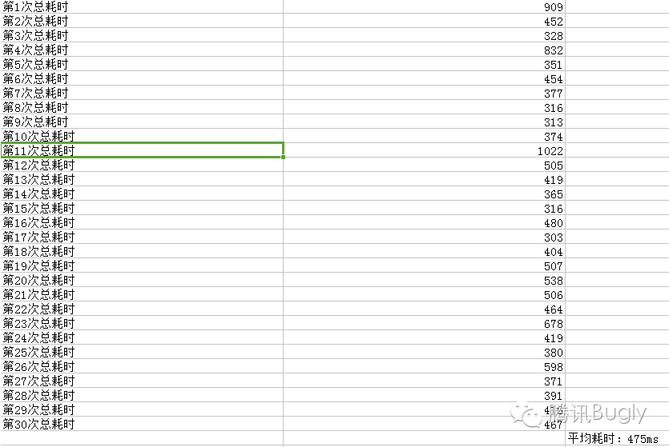

**2）外网运营数据 （6.5版本 对比 6.5.3版本）**

从外网运营数据看，观看成功率提升到99.41%；观看延时提升到平均2.5s，加快43.5%。用户进入直播间的时间区间在（0，1]（观看端0-1秒内进入成功）的占比提升到19.52%，提升191%。

**3）与竞品对比 （左侧空间 VS 右侧竞品）**

[https://v.qq.com/iframe/preview.html?vid=x0306f83wfv&](https://v.qq.com/iframe/preview.html?vid=x0306f83wfv&)

**4）总结**

1、优化可以拔高速度上限，能使用户进入直播间的耗时上限提高到 500ms 以内，从（0，1]的占比区间提升，对大量用户的提升还是比较明显的。

2、直播是强依赖网络状况的产品。如果主播的网络条件很差，上行丢包严重时，观众卡在这个时间点进入，由于没有上行是拉取不到首帧数据的，这种情况会导致统计数据被拉高。这也是整体平均时间未到 1s 以内的原因。

**二、QQ 空间直播的架构**

在前期技术选型上，综合考虑开发周期，稳定性和质量监控体系，我们选用腾讯云的现有视频互动直播解决方案，以下是整体的架构图。

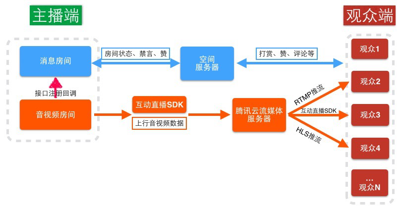

1、 直播房间使用 roomid 做唯一 key。逻辑上分为两层。音视频房间，主要负责和腾讯云的流媒体服务器通信音视频数据和 音视频房间状态的维护；消息房间，主要负责和空间的服务器进行交互，包括赞，评，打赏等业务逻辑和消息房间的状态维护。消息房间通过注册接口来响应音视频房间的状态。这样设计好处就是，消息房间和音视频房间是解耦的，各自单独运行都是允许的；

2、 观众端可以通过音视频 sdk、RTMP 或 HLS 协议三种方式收到主播的推流；观看场景涵盖 H5，native 多平台。

3、 直播浮层设计为独立进程，主要是考虑到独立进程 crash 不影响主进程的稳定性；缺点是和主进程的通信复杂，进程启动有部分耗时；

**三、耗时分析**  
我们将观看直播耗时的各阶段拆细分析：

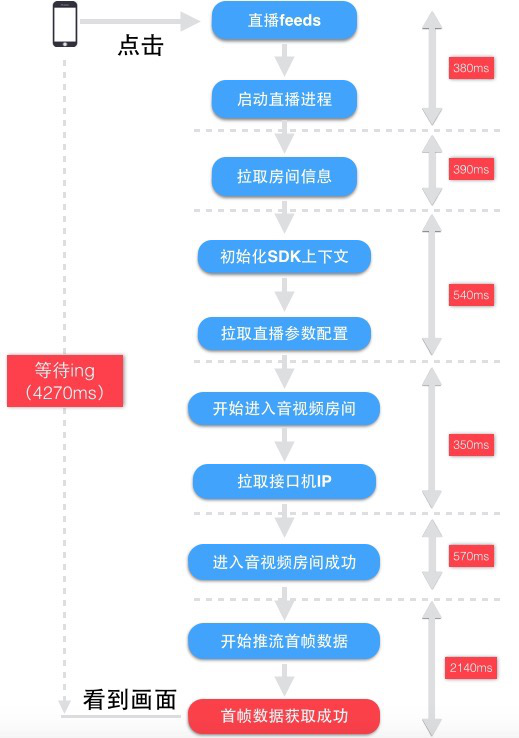

1、 整个观看直播的流程是串行的，导致整体耗时是每个步骤的耗时累加。

2、 拉取房间信息，拉取直播参数配置，拉取接口机 IP 是三个网络请求，耗时存在不稳定性，一般是 300ms，网络情况不好就会到 1000ms+；

3、 直播进程的生命周期是跟随 avtivity 的生命周期，activity 销毁后，进程也随之销毁，再打开需要耗时重新创建进程。

4、 视频 SDK 的上下文是依赖直播进程，新进入也需要重新初始化。

5、 拉取首帧数据是单步骤耗时最久，急需解决。

**四、确立方案，各个击破**

根据直播的具体业务来分析，我们确立了以下几个解决的纬度。

速度优化一般有以下几个方向来解决问题：

1、 预加载。

2、 缓存。

3、 串行变为并行，减少串行耗时。

4、 对单步骤中的耗时逻辑梳理优化。

根据这些方向，我们做的工作：

1、 预加载进程。

2、 视频 SDK 上下文全局单例，并且预先初始化。

3、 并行预拉取接口机 IP，房间信息，预进入 avsdk 房间。

4、 接口机缓存首帧数据，减少 GOP 分片时间，修改播放器逻辑，解析到I帧就开始播放。

**1）新方案的整体流程图：**

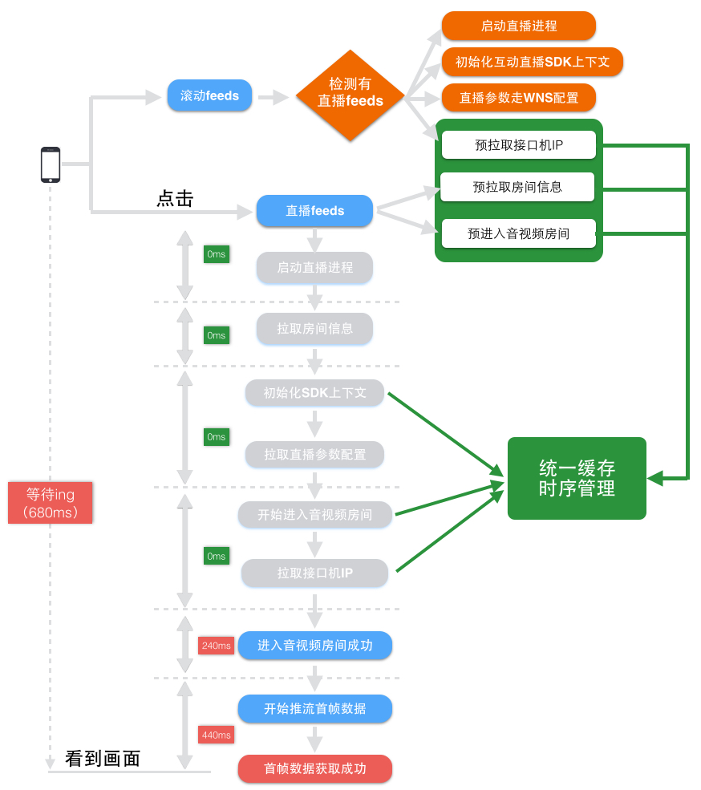

该方案在加速的基础上，还有其他的优点：

1、对现有的代码改动最小，保证版本的稳定性，除了新增的预拉取逻辑，在原有流程上只需要将之前的异步逻辑改为拉取缓存的逻辑。

2、原有逻辑成为备份逻辑，流程茁壮型得到增强，预拉取失败还有原有逻辑作为备份“重试”，进房间成功率提高。

**2）预拉取流程，详细介绍**

从“预拉取接口机 IP”这个点来详细介绍如何做预拉取，缓存管理和时序处理：

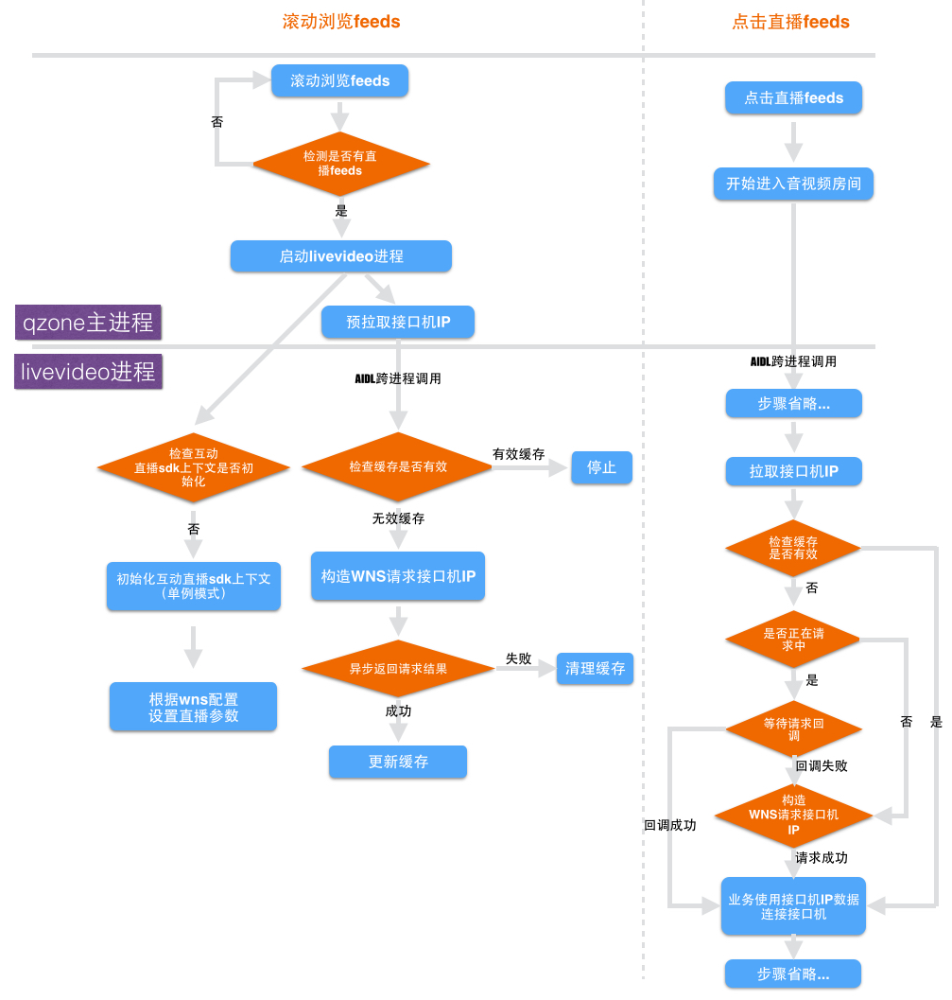

1、 由于直播进程和主进程是内存隔离。Feeds 滚动停止（开始预拉取）是在主进程触发。拉取的 wns 请求需要在直播进程。通过 AIDL 跨进程去调用。

2、 接口机 IP 的请求为异步，需要缓存请求的状态。请求缓存接口机 IP 数据时，预拉取的状态为成功，直接使用缓存数据。

预拉取的状态为请求中，等待本次预拉取的结果。

预拉取的状态为失败，走之前流程，重新请求接口机 IP。

3、 接口机 IP 需要有时效性的，每次滑动停止都预加载 IP，会造成了请求浪费；并且腾讯云的接口机 IP有就近接入的特性。为保证负载稳定，如果一直使用缓存的接口机 IP 可能会导致某台机器负载过多。需要加入时效性的控制。

**3）秒开关键**

细心的同学肯定发现还有一个最大的耗时点没有解决——拉取首帧数据过慢。这个步骤耗时降低才是秒开的关键。

首帧数据的展示过程，其实是一个下载，解码，渲染的过程。

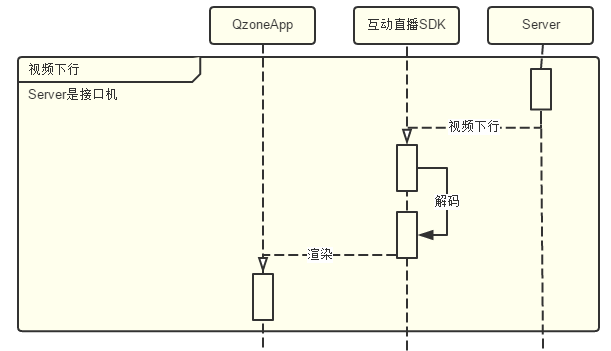

这里简单插述一下视频编解码过程中的一种约定：GOP( Group of Pictures )

为了便于视频内容的存储和传输，通常需要减少视频内容的体积，也就是需要将原始的内容元素(图像和音频)经过压缩，压缩算法也简称编码格式。例如视频里边的原始图像数据会采用 H.264 编码格式进行压缩，音频采样数据会采用 AAC 编码格式进行压缩。 视频内容经过编码压缩后，确实有利于存储和传输;不过当要观看播放时，相应地也需要解码过程。因此编码和解码之间，显然需要约定一种编码器和解码器都可以理解的约定。就视频图像编码和解码而言，这种约定很简单：编码器将多张图像进行编码后生产成一段一段的 GOP ( Group of Pictures ) ， 解码器在播放时则是读取一段一段的 GOP 进行解码后读取画面再渲染显示。 GOP ( Group of Pictures ) 是一组连续的画面，由一张 I 帧和数张 B / P 帧组成，是视频图像编码器和解码器存取的基本单位，它的排列顺序将会一直重复到影像结束。

在互动直播 SDK 中，将帧类型扩展到五种：

  * I 帧不需要参考帧。
  * P 帧只参考上一帧。
  * P_WITHSP 帧可参考上一帧、I 帧、GF 帧、SP 帧，自己不可以被参考。
  * SP 帧可参考 I 帧、GF 帧、SP 帧。
  * GF 帧可参考 I 帧、GF 帧 。

1) 标准的 H264 编码的参照关系，每一个 GOP 的第一针是 I 帧，P 帧依次参考上一帧，抗丢包性不强，如果中间有 I 帧或 P 帧丢失，则该GOP 内后续 P 帧就会解码失败。

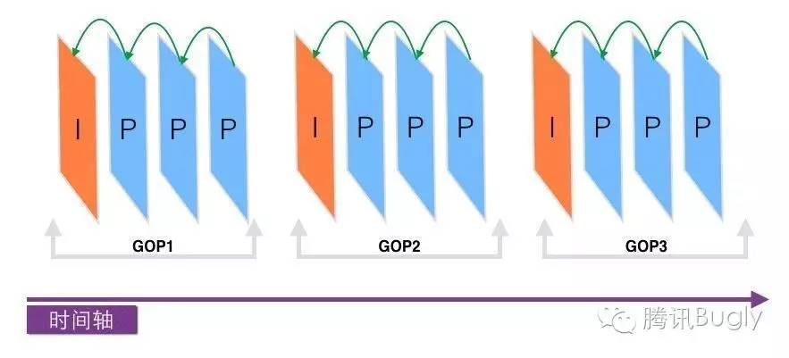

(1.标准 GOP 组织图)

2) 在实时直播的场景，为保证流畅性，重写编码器逻辑，首个 GOP 包开头为I帧，后面 GOP 包开头为 GF 帧，这是利用 GF 帧的传递参考关系是跨 GOP，每个 GF 帧参考上一个 GOP 的 I 帧或 GF 帧。GF 帧体积对比 I 帧要小，后续 GOP 的下载解码更快速。

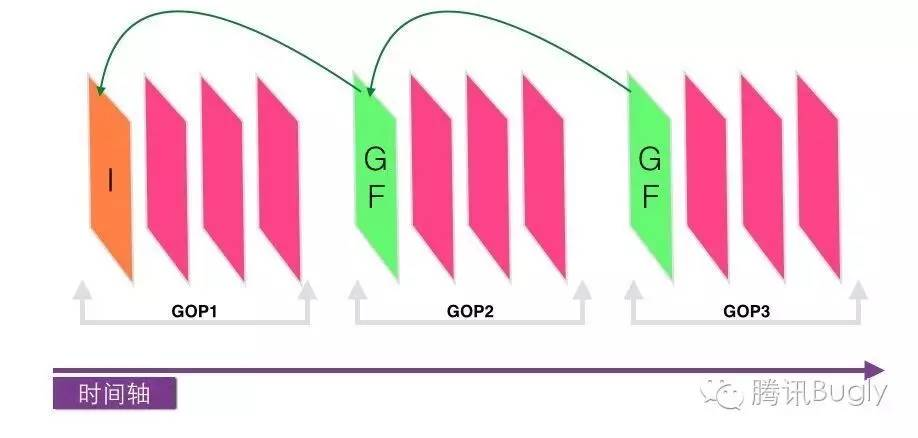

(2.SDK 的 GOP 组织图)

3) 对 GOP 内部的帧组织，也使用 P_WITHSP 帧来代替 P 帧，主要是因为 P_WITHSP 帧（粉红色表示）的解析可参考上一帧、I 帧、GF帧、SP 帧，自己不可以被参考。就算上一帧 P_WITHSP 未解码出来，后一帧 P_WITHSP 的解码也不受影响，增强了抗丢包性

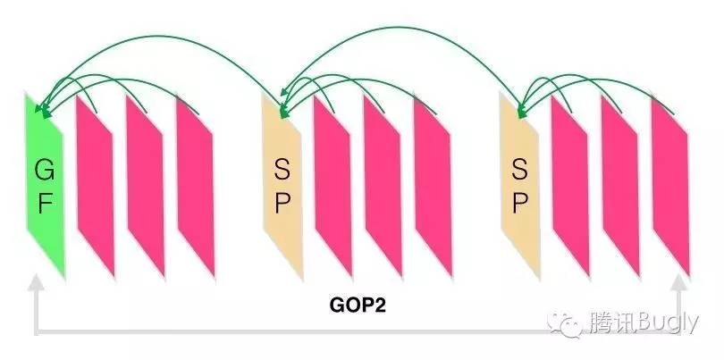

(3.SDK 的 GOP 帧内部参考关系)

那具体到业务上，通过 wireshark 抓包我们发现。过程主要耗时在首个 GOP 包下行比较慢，需要等待 I 帧（FT 是 0 代表 I帧）下载完毕才开始解码，如果 I 帧不完整无法解码，则需要等待第二个 GOP 包，等待时间加长。

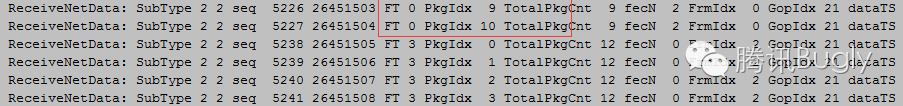

那通过这个现象，为了让整个过程加快，和 SDK 的同事在1.8.1版本一起做了以下工作：

1、 减小首个 GOP 包的分片大小：将 GOP 的分片由 5s 改为 3s，并且首个 GOP 包只缓存必要的 I 帧，减少首个 GOP包的体积；（PS：GOP 包的长度和主播端编码性能也是强相关，GOP 分片太小，编码性能不高，分片时长的确定需要综合考虑）

2、 首个 GOP 包需要走网络下载，同样网络条件下这部分路径越短下载越快。GOP 包之前是存在流控服务器上，GOP包要到达客户端连接的接口机，还需要链接传输的耗时。新的版本直接在接口机上缓存当前直播中房间的 GOP数据，保证在客户端连上接口机之后，就可以直接从本机缓存中推流首帧数据，省掉之前的链接传输耗时。

3、 大部分播放器都是拿到一个完整的 GOP 后才能解码播放， 改写播放器逻辑让播放器拿到第一个关键帧（I帧）后就给予显示。不需要等待全部的 GOP下载完毕才开始解码。

以上三点做好了之后，效果明显，整个的拉取首帧的时间由之前的 2140ms 降到平均300ms，当然完成这些工作并不是上面叙述的三点那么简单，中间过程我们也发现一些棘手问题，并推动解决：

如主播上行网络丢包导致的 GOP 乱序、多台接口机之间缓存的管理、GOP 分片时长的确定。

**4）持续优化**

我们一直没有放弃“更快更爽”的体验追求，在后续的迭代中也持续优化直播的体验：

1、接口机 IP 竞速。

2、合并请求。

3、多码率。

**五、遇到的问题**

我们的优化手段是将串行的异步请求改为并行；但是将串行改为并行后，几个异步请求同时开始，如何保证各个异步回调的时序运行正常，这是一定要解决的问题，也是大家在做优化过程中比较有代表性的问题。

处理这种异步回调时序问题类似于 Promise 模式。我这里在具体业务上使用LiveVideoPreLoadManager 来统一处理，类图如下：

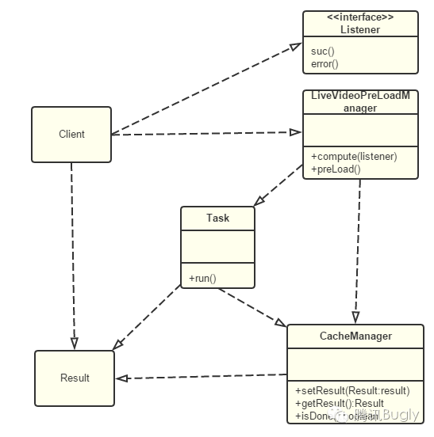

  * LiveVideoPreLoadManager：负责对外暴露启动预加载方法和拉取结果数据对象的方法。其主要方法及职责如下。Compute：注册监听器，获取结果的数据对象，使用监听器实例来响应对数据对象的处理。preLoad：启动异步任务的执行。
  * CacheManager：缓存异步任务处理结果和状态，检查是否过期。负责检测异步任务是否处理完毕、返回和存储异步任务处理结果。其主要方法及职责如下。getResult：获取缓存异步任务的执行结果。setResult：设置缓存异步任务的执行结果及当前的执行状态：开始，过程中，结束。isDone：检测异步任务是否执行完毕。
  * Result：负责表示异步任务处理结果。具体类型由相应的业务决定。
  * Task：负责真正执行异步任务。其主要方法及职责如下run：执行异步任务所代表的过程。

获取异步任务处理结果的序列图如下。

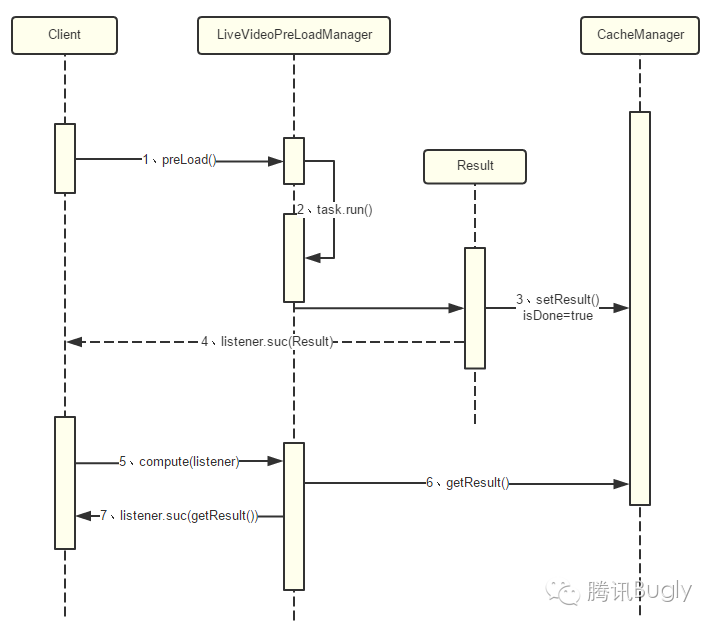

采用这种模式，当异步任务同时开始，如拉取房间信息，接口机 IP，房间信息，它们都被封装在 LiveVideoPreLoadManager 的 Task请求实例中，而主流程则无须关心这些细节，只需要将之前的请求方式变为LiveVideoPreLoadManage.compute，并注册对应的异步回调接口。Compute 内部会通过 CacheManager 的 getResult 方法检查异步任务处理结果状态，如果异步任务已经执行完毕，则该调用会直接返回，类似与同步操作（步骤5，6，7），那么LiveVideoPreLoadManager 对外暴露的 compute 方法是个同步方法；若异步任务还未执行完毕，则会阻塞一直等待异步任务执行完毕，再调用 compute 注册的回调来响应结果，此时 compute 方法是个异步方法（步骤5，4）。也就是说，无论compute方法是一个同步方法还是异步方法，对客户端的编写方式都是一样的。

采用这种 Promise 模式，即对原有流程改动最小，也增强了原有流程的茁壮型，在预拉取失败的时候，那么原有流程的串行逻辑作为兜底保护。从统计数据也可以看到，在优化版本之后，版本的观看端进入房间成功率也有提升。

**六、总结**

整个的秒开优化版本时间非常紧张，中间肯定还有别的优化空间，统计数据上来看，整体用户的进入时间还是在2.5s+，新的迭代版本还在持续优化，大家如果对秒进有什么好的想法和建议，欢迎交流。也欢迎大家下载新版 QQ 空间独立版体验 Qzone
的直播功能，分享生活，留住感动！

