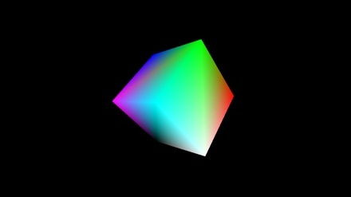
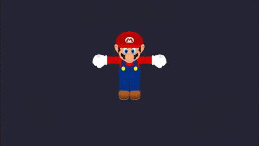
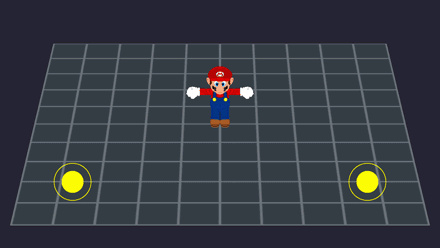
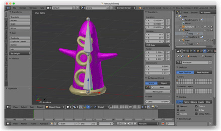
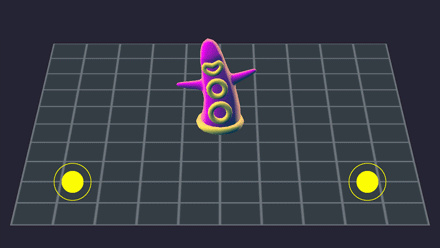
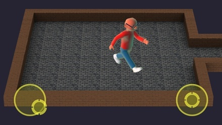
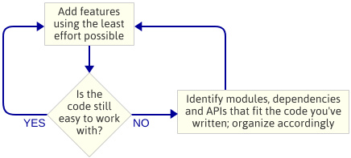
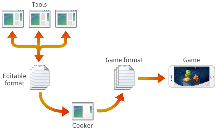
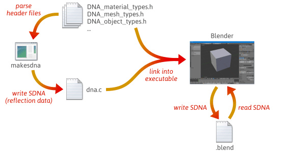

 
<!--BEGIN_DATA
{
    "create_date": "2018-06-09 15:53",
    "modify_date": "2018-06-09 15:53",
    "is_top": "0",
    "summary": "如何编写 C++ 游戏引擎",
    "tags": "C/C++",
    "file_name": "如何编写C++游戏引擎.md"
}
END_DATA-->

####<p>原文出处：<a href='http://blog.jobbole.com/113960/' target='blank'>如何编写 C++ 游戏引擎</a></p>

本文由 [伯乐在线](http://blog.jobbole.com) \-
[李大萌](http://www.jobbole.com/members/nemoland)
翻译，[艾凌风](http://www.jobbole.com/members/hanxiaomax) 校稿。未经许可，禁止转载！  
英文出处：[Jeff Preshing](http://preshing.com/20171218/how-to-write-your-own-cpp-game-engine/)。欢迎加入[翻译组](http://group.jobbole.com/category/feedback/trans-team/)。

最近我在用 C++ 写游戏引擎，再用这个引擎做了一个移动端小游戏跳一跳（Hop Out）。下面是截自我的 iPhone6 的一个小片段。

视频地址：http://preshing.com/images/hopoutclip.mp4

跳一跳是我想玩的游戏类型：3D卡通外观的复古街机游戏。目标是改变每个填充块的颜色，就像Q * Bert一样。

Hop Out仍在开发中，但引擎的功能已经很完善了，所以我想在这里分享一些关于引擎开发的技巧。

你为什么想要写一个游戏引擎？可能有很多原因：

你是个修理工，喜欢从头开始建立系统，直到系统完成。

关于游戏开发你想了解更多。我在游戏行业工作了14年，现在我仍然在不停的琢磨。我甚至不确定我是否可以从头开始编写一个引擎，因为它与大型工作室的编程工作的日常职责大不相同。我想知道答案。

你喜欢控制。对完全按照你想要的方式组织代码，知道一切都在哪里，感到满意。

你可以从[AGI](https://en.wikipedia.org/wiki/Adventure_Game_Interpreter)（1984），[id
Tech 1](https://en.wikipedia.org/wiki/Doom_engine)（1993），[Build](https://en.wikipedia.org/wiki/Build_\(game_engine\))（1995）等经典游戏引擎以及Unity和Unreal等行业巨头那里获得灵感。

你相信我们这个游戏产业应该试着去揭开引擎发展的序幕。我们并没有掌握制作游戏的艺术。还离得很远！我们对这个过程的研究越多，改进的机会就越大。

2017年的游戏平台 - 手机，游戏机和电脑 - 非常强大，而且在很多方面都非常相似。游戏引擎的开发并不是像过去一样，在脆弱和怪异的硬件上挣扎。在我看来，更多是关于自己制造出来的复杂性的斗争。创造一个怪物很容易！这就是为什么本文建议围绕着保持事情可控的原因。我把它分成三部分：

  1. 使用迭代方法
  2. 在统一事物前要三思
  3. 请注意，序列化是一个很大的课题

这个建议适用于任何类型的游戏引擎。我不会告诉你如何编写着色器，八叉树是什么，或者如何添加物体。这些事儿，都是我假设你已经知道而且应该知道 -
这很大程度上取决于你想要制作的游戏类型。相反，我故意选择了一些似乎没有被广泛承认或提及的观点 - 这些是我在试图揭开一个主题神秘面纱时最感兴趣的一些观点。

##

###使用迭代方法

我的第一条建议是使一些东西（任何东西），快速运行起来，然后迭代。

如果可能的话，从一个示例应用程序开始，初始化设备并在屏幕上绘制一些东西。就我而言，我下载了[SDL](https://www.libsdl.org/)，打开了Xcode-iOS / Test / TestiPhoneOS.xcodeproj，然后在我的iPhone上运行了testgles2示例。



瞧！我使用OpenGL ES 2.0，生成了一个可爱的旋转立方体。

下一步，是下载一个其他人制作的马里奥3D 模型。我写了一个快速和粗糙的OBJ文件加载器 - 文件格式并不太复杂 - 并且修改了例程，来呈现Mario，而不是一个立方体。我还集成了[SDL_Image](https://www.libsdl.org/projects/SDL_image/)来帮助加载纹理。

****

然后我实现了一个双摇杆控制器用来操控马里奥（我本来想要创建的是一个双摇杆设计游戏，并不是马里奥。）



接下来，我想探索骨骼动画，所以我打开了[Blender](https://www.blender.org/)，做了一个触手模型，并且用一个前后摆动的双骨架来操纵它。



此时，我放弃了OBJ文件格式，编写了一个Python脚本来从Blender导出自定义的JSON文件。这些JSON文件描述了皮肤网格，骨架和动画数据。在[C++ JSON库](https://github.com/nlohmann/json)的帮助下将这些文件加载到游戏中。



一旦这个完成，我回到了Blender，并做了更详细的角色设计。 （这是我创造的第一个被操纵的3D人，我为他感到骄傲。）



在接下来的几个月里，我采取了以下几个步骤：

  1. 开始将向量和矩阵函数分解成我自己的3D数学库。
  2. 用CMake项目替换.xcodeproj。
  3. 在Windows和iOS上运行引擎，因为我喜欢在Visual Studio下工作。
  4. 开始将代码移动到单独的“引擎”和“游戏”库中。随着时间的推移，我把它们分成更细粒度的库。
  5. 写了一个单独的应用程序将我的JSON文件转换为游戏可以直接加载的二进制数据。
  6. 最终从iOS版本中删除所有SDL库。 （Windows版本仍然使用SDL。）

重点是：在开始编程之前，我没有对引擎架构进行设计。这是一个经过深思熟虑的选择。相反，我只是写了实现下一个特性的最简单的代码，然后我会查看代码，看看会出现什么自然生成的架构。我说的“引擎架构”是指组成游戏引擎的模块集，这些模块之间的依赖关系，以及用于与每个模块交互的[API](https://en.wikipedia.org/wiki/Application_programming_interface)。



这是一个[迭代](https://en.wikipedia.org/wiki/Iterative_and_incremental_development)的方法，因为它关注于较小的可交付成果。它在编写游戏引擎时效果非常好，因为在每个步骤中，你都有一个正在运行的程序。如果在将代码合成到新模块中时出现问题，可以随时将做的更改与以前工作的代码进行比较。显然，我假设你在使用[某种源代码管理工具](https://www.perforce.com/blog/list-of-equivalent-commands-in-git-mercurial-and-svn)。

你可能会认为这种方法浪费了很多时间，因为总是在编写糟糕的代码，之后需要清理。但是大部分的清理操作都是将代码从一个.cpp文件移动到另一个，将函数声明提取到.h文件中，或者直接进行简单的修改。决定事情应该去哪是难点，但是这在已经有代码的时候会更容易决定。

我认为用相反的方法：试图设计出一个能够提前完成所有需求的架构，会浪费更多的时间。我最喜欢的两篇关于系统过度设计风险的文章是 [Tomasz
Dąbrowski 的《泛化的恶性循环》](http://altdevblog.com/2011/04/01/vicious-circle-of-generalization/)和 [Joel Spolsky 的《不要让架构太空人吓到你》](https://www.joelonsoftware.com/2001/04/21/dont-let-architecture-astronauts-scare-you/)。

我并不是说在用代码处理问题之前，不应该在纸上进行设计。我也不是说你不应该事先决定你想要的功能。比如，我从一开始就知道我想让我的引擎在后台线程中加载所有资源。我只是没有尝试设计或实现该功能，直到我的引擎首先加载一些资源。

迭代的方法给了我一个比我以前盯着一张白纸冥思苦想更优雅的架构。我的引擎的iOS版本现在是 100％ 原始代码，包括自定义数学库，容器模板，反射/序列化系统，渲染框架，物理模块和音频混合器。我可以编写每一个模块，但是你可能没有必要自己写所有这些东西。你可能会发现适合自己引擎的许多优秀的开源代码库。
[GLM](https://glm.g-truc.net/)、[Bullet
Physics](https://pybullet.org/wordpress/) 和 [STB 头文件](https://github.com/nothings/stb)只是一些有趣的例子。

###在整合事物太多之前要三思

作为程序员，我们尽量避免代码重复，喜欢代码遵循统一的风格。不过，我认为不要让这些本能凌驾于每一个决定之上。

#####偶尔要抵制一下 DRY 原则

举个例子，我的引擎包含了几个“智能指针”模板类，与 std :: shared_ptr 类似。每一个指针作为一个原始指针的包装，有助于防止内存泄漏。

  * <> 是用于具有单个所有者的动态分配的对象。
  * Reference<> 使用引用计数来允许一个对象拥有多个所有者。
  * audio :: AppOwned <> 被音频混音器以外的代码调用，允许游戏系统拥有音频混音器使用的对象，例如当前播放的语音。
  * audio :: AudioHandle <> 使用音频混音器内部的引用计数系统。

这样可能看起来像其中一些类复制了其它的功能，违反
[DRY（不要重复自己）](https://en.wikipedia.org/wiki/Don%27t_repeat_yourself)的原则。事实上，在开发早期，我尽可能地重用现有的Reference<>类。但是，我发现音频对象的生命周期是由特殊规则来管理的：如果一个音频语音已经完成了一个样本的播放，并且游戏没有指向该语音的指针，那么该语音会被立即到删除排队等待。如果游戏持有指针，则不应删除这个语音对象。如果游戏持有一个指针，但指针的所有者在语音结束之前被销毁，这段语音应该被取消，而不是增加Reference<>的复杂性，我决定引入单独的模板类，这样更为实用。

95％ 的时间都在重用现有的代码。但是，如果你开始感到麻痹，或者发现自己增加了一件简单的事情的复杂性，那就问自己，代码库中的东西是否应该是两件事。

#####可以使用不同的调用规则

我不喜欢Java的一件事是，它强迫你在一个类中定义每个函数。在我看来，这是无稽之谈。这可能会使你的代码看起来更加一致，但是它也鼓励过度工程，并且不适合我前面描述的迭代方法。

在我的 C++ 引擎中，一些函数属于类，有些则不属于类。例如，游戏中的每个敌人都是一个类，可能就像你预料的那样，大部分敌人的行为都是在这个类内部实现的。另一方面，在我的引擎中投射的球体是通过调用
[sphereCast(](https://stackoverflow.com/questions/7136449/shape-casting-a-capsule-against-convex-polyhedra)) 函数来执行的，这是物理命名空间中的一个函数。 sphereCast() 不属于任何类-它只是物理模块的一部分。我构建了一个系统来管理模块之间的依赖关系，这使得我的代码组织得很好。将这个函数包装在一个任意的类中不会以任何有意义的方式改善代码的组织。

然后是[动态调度](https://en.wikipedia.org/wiki/Dynamic_dispatch)，这是一种[多态的形式](https://en.wikipedia.org/wiki/Polymorphism_\(computer_science\))。我们经常需要为一个对象调用一个函数，而不知道该对象的确切类型。
C++程序员的第一本能是用虚函数定义抽象基类，然后在派生类中重写这些函数。这是有效的，但这只是一种技术。还有其他动态调度技术，不会引入额外的代码，或带来其他好处：

  * C ++ 11引入了std :: function，这是存储回调函数的一个简便方法。也可以编写自己的std :: function版本，这样在调试中不会那么痛苦。
  * 许多回调函数可以用一对指针来实现：一个函数指针和一个类型不确定的参数。它只需要在回调函数中进行明确的转换。你在纯C语言库中经常看到。
  * 有时候，底层类型实际上是在编译时已知的，你可以绑定这个函数调用而不用额外的运行开销。 [Turf](https://github.com/preshing/turf)是我在游戏引擎中使用的一个库，它非常依赖这种技术。例如看到turf:: Mutex,这只是针对特定平台类的定义。
  * 有时，最直接的方法是自己构建和维护一个原始函数指针表。我在我的音频混音器和序列化系统中使用了这种方法。Python解释器也大量使用这种技术，如下所述。
  * 你甚至可以将函数指针存储在散列表中，使用函数名称作为关键字。我使用这种技术来调度输入事件，如多点触控事件。这是记录游戏输入并用重放系统回放的策略的一部分。

动态调度是一个很大的课题。我只是想表明，有很多方法来实现它。你编写的可扩展底层代码越多（这在游戏引擎中很常见），越会发现替代方法越多。如果你不习惯这种编程，C语言编写的Python解释器是一个很好的学习资源。它实现了一个强大的对象模型：每个PyObject都指向一个PyTypeObject，每个PyTypeObject都包含一个用于动态分配的函数指针表。如果你想直接跳转到其中的话，[定义新类型](https://docs.python.org/3/extending/newtypes.html)的文档是一个很好的起点。

###注意序列化是一个大问题

[序列化](https://en.wikipedia.org/wiki/Serialization)是将运行时对象转换为字节序列的操作。换句话说，就是保存和加载数据。

对于许多游戏引擎来说，游戏内容以各种可编辑的格式创建，例如.png，.json，.blend或专有格式，然后最终转换为特定于平台的可以快速加载到引擎的游戏格式。流水线中的最后一个应用通常被称为“炊具”。炊具可能被集成到另一个工具，甚至分布在几台机器上。通常，炊具和一些工具是与游戏引擎本身一起开发和维护的。



在建立这样的流水线时，每个阶段的文件格式的选择取决于你。你可以定义自己的一些文件格式，这些格式可能会随着添加引擎功能而变化。渐渐地可能会发现有必要保持某些程序与以前保存的文件兼容。不管什么格式，你最终都需要用C++来序列化它。

用C ++实现序列化有无数种方法。一个相当明显的方式是将加载和保存函数添加到要序列化的C ++类。可以通过在文件头中存储版本号来实现向后兼容，然后将这个数字传递给每个加载函数。这是可行的，尽管这样代码可能维护起来比较繁琐。

```
void load(InStream& in, u32 fileVersion) {
    // 加载预期的成员变量
    in >> m_position;
    in >> m_direction;
 
    // 仅当正在加载的文件版本是2或更大时才加载新的变量
    if (fileVersion >= 2) {
        in >> m_velocity;
    }
}
```
  
通过[反射](https://en.wikipedia.org/wiki/Reflection_\(computer_programming\))（特别是通过创建描述C++类型布局的运行时数据），可以编写更灵活，不容易出错的序列化代码。想要快速了解反射如何进行序列化，请看一下开源项目[Blender](https://www.blender.org/get-involved/developers/)是如何实现的。




从源代码构建Blender时，有许多步骤。首先，编译并运行一个名为makesdna的自定义实用程序。该实用程序解析Blender源代码树中的一组C语言头文件，然后以[SDNA](https://wiki.blender.org/index.php/Dev:Source/Architecture/SDNA_Notes)的自定义格式输出所有C定义类型的汇总。这个SDNA数据作为反射数据，链接到Blender本身，并保存在Blender写入的每个.blend文件中。从这一刻开始，每当Blender加载一个.blend文件，就会将.blend文件的SDNA与链接到当前版本的SDNA进行比较，并使用通用序列化代码来处理差异。这个策略使Blender具有令人印象深刻的向前和向后兼容性。你仍然可以在最新版本的Blender中加载[1.0版本](https://www.blendernation.com/2008/12/01/blender-dna-rna-and-backward-compatibility/)的文件，也可以在旧版本中加载新的.blend文件。

像Blender一样，许多游戏引擎及其相关工具都会生成并使用自己的反射数据。有很多方法可以做到这一点：可以像Blender一样解析自己的C / C++源代码来提取类型信息。你可以创建一个单独的数据描述语言，并编写一个工具来从该语言生成C ++类型定义和反射数据。可以使用预处理器宏和C++模板在运行时生成反射数据。一旦你有反射数据可用，有无数的方法来编写一个通用的序列化器。

显然，我省略了很多细节。在这篇文章中，我只想表明有很多不同的方法来序列化数据，其中一些非常复杂。程序员不会像其他引擎系统那样讨论序列化，尽管大多数其他系统依赖于它。例如，在[GDC 2017](https://www.gdcvault.com/browse/gdc-17/?categories=Pg)给出的96个程序设计讲座中，我数了一下，共有31次关于图形，11次关于在线，10次关于工具，4次关于AI，3关于物理模块，2关于音频的 - 但只有一个[直接涉及到序列化](https://www.gdcvault.com/play/1024444/The-Data-Building-Pipeline-of)。

至少，试着想一想你的需求会有多复杂。如果你正在制作一个像Flappy
Bird这样的小游戏，只有少数资源.，那么你可能不需要想太多的序列化。你可以直接从PNG加载纹理，这样很好处理。如果你需要一个向后兼容的紧凑的二进制格式，但不想自己开发，可以看看第三方库，比如[Cereal](https://uscilab.github.io/cereal/)或者[Boost.Serialization](https://theboostcpplibraries.com/boost.serialization)。我不认为[Google协议缓冲区](https://developers.google.com/protocol-buffers/)是序列化游戏资产的理想选择，但是值得研究。

编写一个游戏引擎，即使是一个小游戏引擎，也是一个很大的任务。关于这个我可以说的还有很多，但是对于这个长度的帖子来说，这真的是我认为最有用的建议：迭代地工作，抵制统一代码的冲动，并且知道序列化是一个大问题，你需要选择一个合适的策略。根据我的经验，如果忽视这些事情，每一件事情都可能成为一个绊脚石。

我喜欢比较这些东西，真的很想听到其他开发人员的意见。如果你已经写了一个引擎，你的经验是否让你有什么相同的结论吗？如果你没有写，或者只是在构思，我也对你的想法也很感兴趣。你认为什么是好的学习资源？哪些部分对你来说看起来很神秘？你可以在下面评论或在[Twitter](https://twitter.com/preshing)上给我留言！

