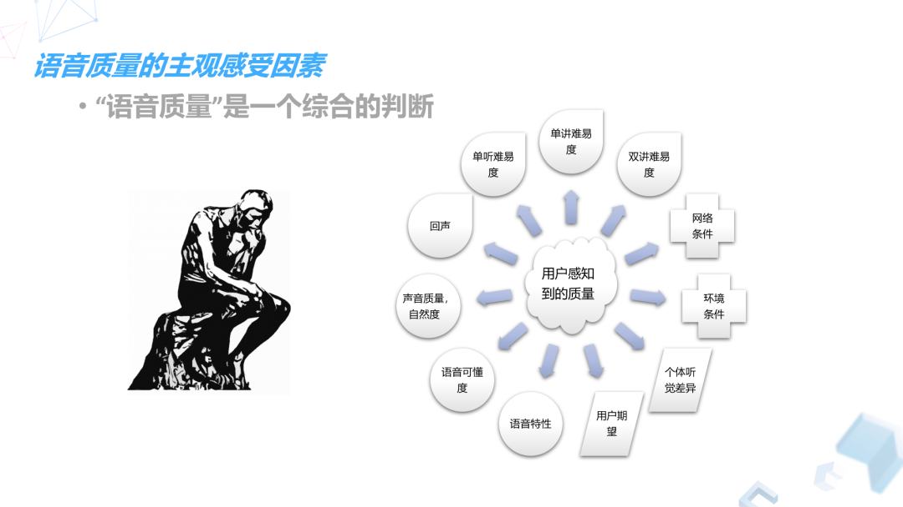
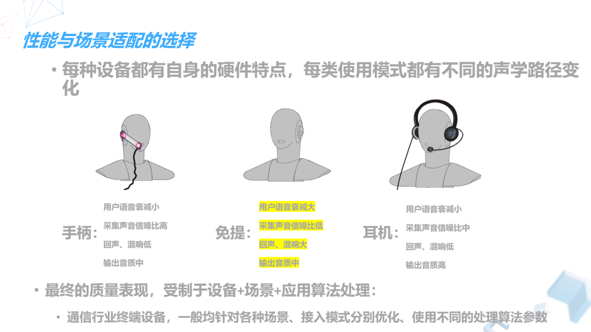
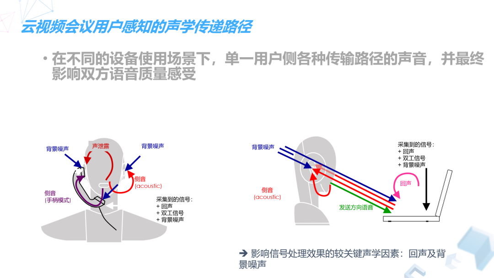
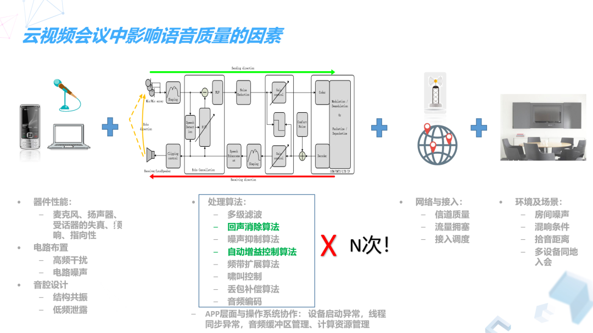
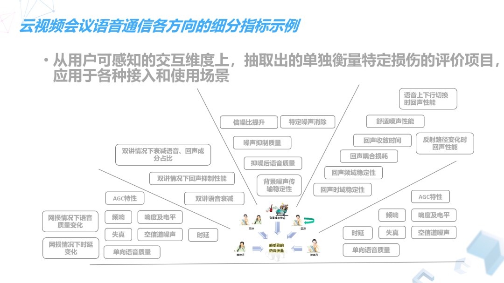
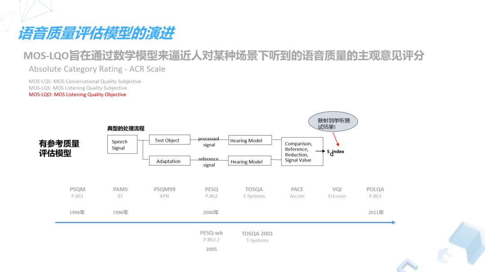
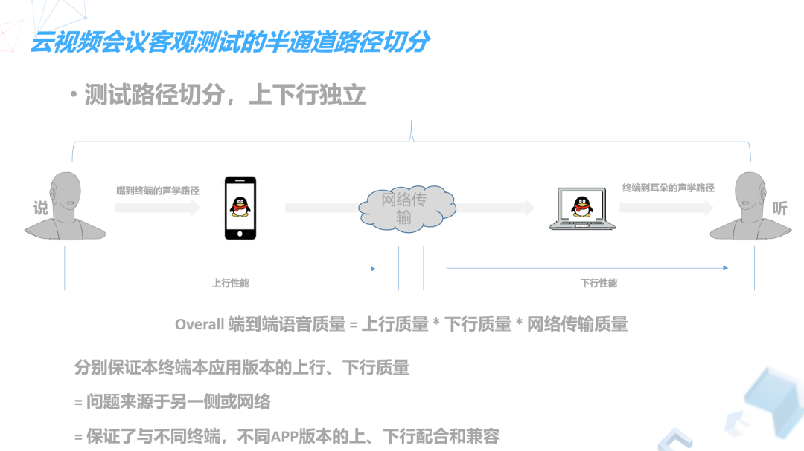
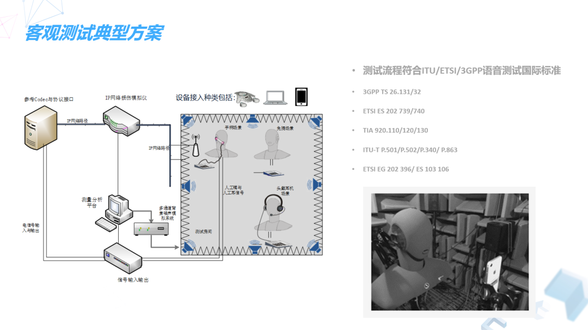

 
<!--BEGIN_DATA
{
    "create_date": "2020-04-28 10:37", 
    "modify_date": "2020-04-28 10:37", 
    "is_top": "0", 
    "summary": "如何进行语音质量评估？", 
    "tags": "WebRTC、C/C++", 
    "file_name": "如何进行语音质量评估？.md"
}
END_DATA-->

####
原文出处：<a href='https://cloud.tencent.com/developer/article/1613290' target='blank'>如何进行语音质量评估？</a>

**导读** | 自疫情发生以来，腾讯会议每天都在进行资源扩容，日均扩容主机接近1.5万台，用户活跃度攀升。在如此高并发流量的冲击下，腾讯会议如何保证语音通信清晰流畅？如何对语音质量进行评估？在【腾讯技术开放日·云视频会议专场】中，腾讯多媒体实验室音频技术专家易高雄针对语音质量评估进行了分享。

**一、语音质量界定**

音频和语音是电声学下面两个不同的学科分支，属于两个不同的应用，两者在应用目的、使用场景、行业和用户认知统一度三方面存在差异，所以**对于语音质量测试来说，首先要界定一下评估对象是音频还是语音。**

**1、应用目的：语音交互、沟通VS个性化呈现音乐**

语音质量关注交互和沟通，其最终目的是尽量保真传输语音，保证交互效率；音频质量关注音乐的表达，如何个性化呈现音乐，其目的是让人感受到所播放音乐的听感效果是好的，这里音乐听感是不是和录制时现场并不一样。

**2、使用场景：双向、主动交互VS单向、被动聆听**

语音质量需要考虑双向沟通过程中用户的体验，音频则是被动的聆听，质量评估更多关注音乐提供者让用户感受到的音乐质量。

**3、行业、用户认知统一度：标准程度较好VS分裂不统一**

经过这么多年的技术发展，语音通信质量评估在行业里有很多标准，但评估音乐播放的标准并不多。

我们今天分享的内容就是针对语音质量测试的，对于语音通信来说，尽管有了比较多的标准，但因为语音质量也是非常主观的感觉，仍存在很多困扰，比如语音质量究竟如何评估，用户到底自己是如何感受？

**二、语音质量主观感受因素**

诸多研究表明，用户在使用语音通信应用时，能感知到的语音质量受很多因素影响。

**1、外部因素**

（1）**网络条件**：如果网络不好，实际听到的声音会有卡顿；传输是通信的基石，如果传输质量无法保证，那么质量会受到很大影响

（2）**环境条件**：如果周围环境嘈杂，对方会听到很多噪音，不管用什么算法，都可能会感受到残留的噪音；如果在封闭房间通信，房间的混响条件也会让语音听起来很浑浊，影响对方的听感。

（3）**个体的听觉差异**：不同人的听力曲线不同，耳朵对不同频段的声音反应也就不一样，这个和年龄段有关系，不同年龄段听域范围不一样。

（4）**用户期望**：用户在使用APP或终端时，自然而然会对所使用的产品表现出的质量产生期望，这些期望也跟用户的经验有关系。同时，在一些场景，应用若提供了额外信息，也会影响到用户对该次通信质量的期望。

**2、语音本身**

（1）**单听或单说**：语音特性会影响语音质量，有人本身音色不好，或者对非母语的语言熟悉程度特性，也会让对方觉得通话质量不高，此外，语音可懂度、声音质量、自然度也和对方能感知的语音质量有密切关系。

（2）**双方交互**：最主要的主观感受因素是回声，如果听到回声，那么通话质量不好，如果两人同时说话产生语音剪切，通话质量也会不好。

**三、云视频会议语音通信的性能目标**

语音视频会议是一个非常复杂的场景，电信业界多年遇到的语音交互场景，几乎都可能被会议场景所涵盖，它的接入方式包括固定电话通信和移动通信两种传统接入方式，同时还要接受电脑、Pad的接入。此外，同时参会的用户并不固定在安静环境中，因此所有纷繁复杂的场景都可能汇总到同一个语音视频会议中。

虽然加入到同一个会议里的人数不固定，每个人的接入方式不固定，但总体抽象来说，一次会议里的语音交互，仍然可以看成是自己和另外一方的交互，也许另外一方是两个人甚至更多人，但每个人在自己这端，仍可以把它抽象成一对一的语音交互。

站在这个角度，**我们可以沿用电信业界成熟的质量目标参考**， ITU-T多年前就定义的比较清楚，要达成好的语音传输，需要实现大概什么样的效果呢？就是**两个人站在没有障碍的空间，一对一间隔一米说话的效果**。不过由于语音通信的应用和终端分布在不同城市，接入不同移动运营商，同时还受到硬件本身采集、处理和播放特性的影响，永远无法达到面对面1米交流的时间低延迟，也永远达不到那么高的质量和自然度，但始终在努力逼近。

**四、影响云视频会议通信实现的三大因素**

** 1、性能与场景适配选择对语音质量的影响**

**（1）接入场景：**视频会议中允许电信网接入，主要包括PLMN和PSTN，PSTN就是固定电话接入，固定电话可能是模拟电话，也可能是企业里的IP电话；PLMN就是移动通信，现在更多的移动终端本身还支持vowifi 接入。此外，还有最主要的VoIP接入是手机或者电脑上装app的软件接入，这种会和PSTN接入有一些区别。

**（2）使用模式：**从使用模式来说，用户说话时会涉及不同设备的不同使用方式。比如PSTN接入，用固定电话，要把听筒放在耳边；用VOIP接入，可能使用的电脑，这种叫做免提模式，同时手机也存在免提模式；戴耳机就是耳机的使用模式。

**（3）性能与场景适配选择：**不同的使用模式会给语音通信应用带来不同效果，效果是由设备本身和场景定义的，就存在性能和场景适配的选择。 

  * **手柄模式**，听筒离耳朵近，话筒送话器离嘴巴近，嘴巴发出的声音到收话器间距离很短，语音衰减小，所以相对于周围环境来讲采集到的声音信噪比高，因此麦克风灵敏度可以低、处理中加上的增益可以更小，导致低回声和低混响。
  * **免提模式**，嘴巴发出声音，到声音采集设备麦克风的距离较大，语音衰减大，相比在环境中的噪声来讲，语音信噪比降低很多，同时为了采集到合适大小声音，麦克风灵敏度和增益要提高，回声和混响进一步增多。
  * **耳机模式**，用户的语音衰减少，因为耳朵上的麦克风离嘴巴距离要稍远一点，但耳机本身采集声音的单元离耳朵鼓膜更近，同时耳机还具有一些额外屏蔽效果，并且相比前两种模式来说，输出的声音音质可以更好。

传统的电信业界，每个硬件设备针对其场景和接入模式，都根据自己的硬件特性，都分别做了优化，但对于语音视频会议或纯语音通信应用来说，可能没有办法完全知道用户的接入场景，也没办法获得更多设备硬件的信息，所接触到的语音，都是被特性未知的硬件采集到的声音，所以获得更高的语音质量难度会大很多。

**2、声学传递路径影响语音质量的关键因素：回声和背景噪声**

**（1）手柄或耳机模式：**手柄或耳机通话，进入到麦克风的不仅有自己的声音，也会采集到一些回声、双工信号以及背景噪声，我们的耳朵收到对方声音的同时也会听到背景噪声，还有自己说话的声音。

**（2）免提模式：**麦克风采集到的声音和刚刚的模式类似，有回声、双工信号、背景噪声，唯一不同的是，在免提模式下，设备本身需要发出较大的声音，才能让用户听的清楚和响亮，麦克风采集需要更强，才能采集到更响亮的用户语音，自然而然进入到麦克风的回声大小也就跟原来不一样。

总体而言，**影响语音通信过程中信号处理效果关键的因素是回声和背景噪声**。对于任何语音通信应用来讲，回声处理都是语音通信中非常重要的一环，因为其它环境因素可以通过别的方法规避，但回声没有办法，只要想跟对方进行自由没有阻碍的双方交互，就会有回声被采集进麦克风。

**3、云视频会议中影响语音质量的四大因素**

**（1）硬件设备：**

应用不可能独立存在，实现会议语音通信一定要依赖于具体的硬件设备，所以硬件设备本身会**导致语音受到恶化或者激变**，包括麦克风性能、扬声器性能等，都会有一些失真，可能不能完全无损的采集和恢复声音。除了**失真、频率响应**，还有一些**指向性特点**，一些新型超新型麦克风能采集到的声音在不同位置下会有区别较大。

语音质量还受其它**电路布置**的影响，比如手机接入，手机麦克风到DSP中间，是模拟电路的话，会受到无线信号的干扰。此外，声音输出环节，**音腔设计和扬声器结构共振导致的非线性**，也都是回声难以处理的影响因素。

**（2）语音处理算法**

**语音处理算法主要包括：多级滤波、回声处理算法、噪声抑制算法、自动增益控制算法、频带扩展算法、啸叫控制算法、丢包补偿算法、音频编码。**相同类型的处理算法可能会经过N次级联处理，硬件和软件都会进行处理，每一步处理都会对语音造成损伤。

算法层面外，**软件跟操作系统中间的协作中存在的设备启动异常**，包括麦克风没正常打开、或打开滞后，线程同步异常导致的声音卡顿、音频缓冲区管理、计算资源管理等，这些都是影响语音质量的因素。

**（3）网络接入**

首先**信道质量**方面，受到流量拥塞影响，WiFi丢包、无线通信效果不好、信号强度低等情况会出现。其次受**接入调度影响**，应用客户端接入了更远位置的服务器经过更长更多段的IP传输路径，发生流量拥塞和丢包的概率也会提升。

**（4）环境和场景**

上一部分提到的诸如房间的噪声、混响、拾音距离、多设备同地入会造成啸叫现象等也都是影响语音质量的因素。

**五、云视频会议通信的四大客观评估指标**

**1、用户可感知的交互维度**

**（1）发送和接收方效果**：我说话对方听到的效果，对方说话我听到的效果。

**（2）双讲效果**：双方交互同时说话时有没有如实把两边声音展现出来。

**（3）回声效果**：我说话时有没有听到自己的声音从对方传回来。

**（4）背景噪声传输**：实际上很多通信场景并不是说要把噪声完全消除是最好的，这也做不到，总有残留。有时候对方希望知道你本地的额外信息，从而了解你所处的场景，例如是否适合通话和长时间交谈。

**2、云视频会议语音通信各方向的细分指标**

**（1）发送和接收方评估指标**

  * **单向时延**：对于VOIP通信来讲，如果能达到200毫秒以下，是非常理想的效果。也要关注频响，这样才能保真场景，无失真的把语音传给对方，还要评估响度或语音电频，声音到对方那里后，对方听起来的效果、声音大小是否合适、会不会没有说话时也会产生噪声。
  * **AGC特性**：使用自动增益算法后，需要评估对方听到的声音是否足够响亮，过多的增益有没有造成非线性或者削顶，会不会传到的声音突然变大或变小。
  * **单向语音质量**：理想情况下，大家希望用一个指标，用一到五分给语音质量打分，把质量标识出来，但实际中很难达成，因为目前这些打分能标识的是单独说或听的语音效果，没有涉及双方交互的场景。

**（2）双讲指标**

  * 双讲下需要评估本地发出去语音是否被减弱，以及有没有同时泄露回声。

**（3）回声评估指标**

  * **时域上和频率上的稳定性**：这里注意在双讲情况下，要关注回声处理后的效果，是否在某个时间段发散导致漏回声。
  * **回声耦合损耗**：需关注声音从听筒播出来，被麦克风采集并处理后传递给对方的过程中，回声到底衰减了多少，是否还会被对方听到。
  * **回声收敛时间**：需要评估算法从开始启动到工作，花多长时间收敛才能达到最佳回声处理效果
  * **反射路径变化时的回声性能**：要关注通信中周围回声路径发生变化，比如对方拿着笔记本走来走去，不停晃动，这些反射路径变化会对回声处理的跟踪造成影响。

**（4）噪声指标**

  * **信噪比提升**：关注信噪比提升的量、噪声抑制完残留的听感，以及语音本身有没有受到过多损伤，例如被消除，部分频段被抑制。
  * **特定噪声场景**：要评估诸如敲键盘、点鼠标、下雨打在窗户上等特定噪声场景下的噪声抑制效果。 

**六、语音质量评估模型的演进**

目前业界基于MOS分数（语音质量分数）有两类语音质量评估模型，有参考语音质量评估模型和无参考语音质量评估模型，腾讯会议都有在使用。

**1、有参考语音质量评估模型：POLQA P.863模型 接受程度最高**

ITU-T历史上主要推出了**PSQM P.861、PESQ P.862、POLQA P.863三个著名的模型**，它们核心运作机理是把处理完的语音和无损语音做对比，在对比过程中，首先把声音对齐，找到二者的偏差，对齐后把每个小片段的语音和无损的小片段语音单独放到听觉模型中，看各频段上频率成本的损失、有无额外频率产生，这些频率成分的增减在人的听觉上是否足够显著等，最后做整个时域上做各片段语音损伤情况的平滑、加权平均等，最终映射到单独的语音质量分数。目前最被大家接受的是POLQA P.863模型，但在使用过程中大家还是要小心，因为每个模型都有应用场景限定，不同的场景或者不同的输入信号，对测试结果的准确性都有影响。

**2、无参考语音质量评估模型：多媒体实验室基于深度学习的模型LSQA**

包括本来是被用于网络规划的E-ModelG.107标准、ITU-T基于流媒体的P.1201标准和腾讯多媒体实验室模型EVA。此外，还有基于信号域的ITU-TP.563标准和ANIQUE+。

**这两年多媒体实验室基于深度学习，提出自己的无参考语音质量评估LSQA**，通过神经网络的方式，去对传过来的语音里有没有加信噪声、发生大的语音丢失，以及整体有没有大频率成分偏移做评估，最终拟合到用户主观感受MOS质量分数。这些质量监控手段已经用在腾讯会议日常运用中，并帮我们定位网络传输中语音可能发生的质量突变。

**七、云视频会议客观测试的路径切分**

以往都是把两个客户端连接建立会议，从一个端的耳机接口注入声音，从另一端的耳机接口采集声音，两边做比对得到MOS分，但实际中存在很多问题，为了保证与不同终端、不同APP版本上、下行配合和兼容，我们把路径做了切分，上下行质量独立。 

**上行质量是从嘴巴产生声音到被软件和硬件处理完上传到网络的效果质量，下行质量是网络传过来的声音，被软件和硬件处理后又被耳朵听到的效果，**中间还包括网络传输质量，包括丢包等，这样能更好定位问题发生在哪里。

**切分路径还需要额外的工具**，比如嘴巴发出声音被终端和软件处理后，怎样取出来？需要用**VoIP参考点**，它需要实现整套语音通信的协议，不用去做语音的任何额外处理，只是跟另一端的软硬件建立语音通信链路，打通链路就能把语音取回来，跟嘴巴产生的声音去做对比。

有了上下行切分，我们就可以在实验室实现客观测试环节，但想要做到可重复、比较准确的数据采集和分析，仍需关注：

（1）**可控的、准确的输入输出接口**：需要专门的人工头去模拟嘴产生语音的声场特性，模拟耳朵采集到的声音效果，以及要保证硬件设备准确实施信号的注入和采集。

（2）**准确的、可复现的客观环境**：需要专门的声学房间，隔绝外界干扰，还需要可复现的噪声模拟方式，需要反复不断在同一场景下去实验噪声抑制算法。

（3）**准确可控的网络条件**：对语音质量造成最大影响的是网络丢包，如果数据没有完整传输或收到，实际的语音质量是无法保证的，这也是实验各种网络处理策略正确性和丢包补偿算法的必备条件。

**八、多媒体实验室客观测试典型方案**

多媒体实验室目前所用的典型客观测试方案简单示意图如下：

整个测试流程符合现在电信界的国际标准，包括ITU、ETSI等，例如评估手机用的3GPP TS 26.131/32，电信业界评估VoIP通信用的ETSI202 739/740，以及北美评估VoIP通信用的TIA  920.110/120/130等。

测试信号和流程也符合ITU-T的定义，比如P.501对于测试信号的定义，P.502对于测试分析方法的定义，P.340在免提场景对于一些特殊的测试流程的定义，以及最重要的评估语音质量的模型P.863的定义。

噪声抑制评估也按照ETSI 定义的标准执行，比如根据用EG202 396去模拟噪声，ES103 106去分析模拟算法所带来的损伤等。

以上就是腾讯多媒体实验室音频技术专家易高雄的完整分享，帮助大家从语音质量界定、主观感受因素、目标、影响因素、模型、方案等方面了解如何进行语音质量评估。
