 
<!--BEGIN_DATA
{
    "create_date": "2020-10-12 20:06", 
    "modify_date": "2020-10-12 20:06", 
    "is_top": "0", 
    "summary": "完全理解ICMP协议", 
    "tags": "网络", 
    "file_name": "完全理解ICMP协议.md"
}
END_DATA-->

#### 
原文出处：<a href='https://www.cnblogs.com/iiiiher/p/8513748.html' target='blank'>完全理解ICMP协议</a>

### 1.ICMP出现的原因

在IP通信中，经常有数据包到达不了对方的情况。原因是，在通信途中的某处的一个路由器由于不能处理所有的数据包，就将数据包一个一个丢弃了。或者，虽然到达了对方，但是由于搞错了端口号，服务器软件可能不能接受它。这时，在错误发生的现场，为了联络而飞过来的信鸽就是ICMP 报文。在IP网络上，由于数据包被丢弃等原因，为了控制将必要的信息传递给发信方。ICMP 协议是为了辅助IP 协议，交换各种各样的控制信息而被制造出来的。

制定万维网规格的IETF 在1981 年将RFC7922作为ICMP 的基本规格整理出来了。那个RFC792 的开头部分里写着“ICMP 是IP的不可缺少的部分，所有的IP 软件必须实现ICMP协议。也是，ICMP 是为了分担IP 一部分功能而被制定出来的。

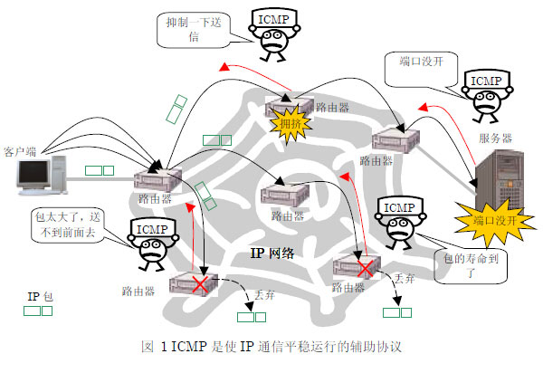

### 2.ICMP的用途

在RFC，将ICMP 大致分成两种功能：差错通知和信息查询。

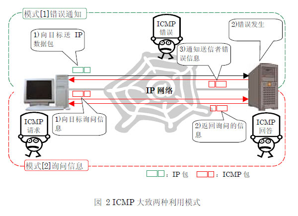

[1]给送信者的错误通知；[2]送信者的信息查询。

[1]是到IP 数据包被对方的计算机处理的过程中，发生了什么错误时被使用。不仅传送发生了错误这个事实，也传送错误原因等消息。

[2]的信息询问是在送信方的计算机向对方计算机询问信息时被使用。被询问内容的种类非常丰富，他们有目标IP地址的机器是否存在这种基本确认，调查自己网络的子网掩码，取得对方机器的时间信息等。

### 3.ICMP作为IP的上层协议在工作

ICMP 的内容是放在IP 数据包的数据部分里来互相交流的。也就是，从ICMP的报文格式来说，ICMP 是IP 的上层协议。但是，正如RFC所记载的，ICMP 是分担了IP 的一部分功能。所以，被认为是与IP 同层的协议。看一下RFC 规定的数据包格式和报文内容吧。

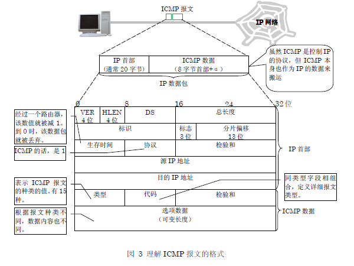

更加详细地看一下数据包的格式吧。用来传送ICMP 报文的IP 数据包上实际上有不少字段。但是实际上与ICMP 协议相关的只有7 个子段。

1）协议；2）源IP 地址；3）目的IP 地址；4）生存时间；这四个包含在IP 首部的字段。

5）类型；6）代码；7）选项数据；这三个包含在ICMP数据部分的字段。

这里面，1)协议字段值是1。2)和3)是用来交流ICMP 报文的地址信息，没有特殊意义。对于理解ICMP本身，重要的是5)，6)，7)三个字段。这里面的可以称为核心的重要字段是5)类型，6)代码这两个字段。所有ICMP用来交流错误通知和信息询问的报文，都是由类型和代码的组合来表示的。RFC 定义了15种类型。“报文不可到达”这样的错误通知和“回送请求”这样的信息查询是由类型字段来区分的。ICMP报文由类型来表达它的大概意义，需要传递细小的信息时由代码来分类。进一步，需要向对方传送数据的时候，用7）选项数据字段来放置。

可能的消息列表：

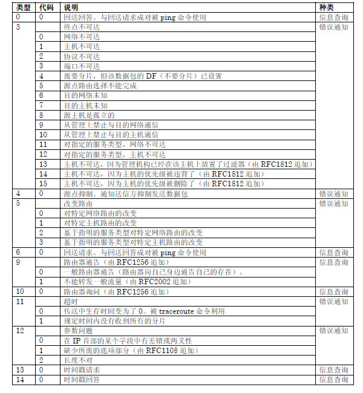

### 4.ICMP实现之MTU探索

所谓路径MTU 探索，是探索与通信对方之间不用分片IP 数据包，就能交流的MTU大小的功能。MTU大小是指计算机一次能够送出去的数据的最大长度，基本上由网路的种类来决定。例如，以太网的话通常是1500 字节，使用PPPoE 的ADSL通常是1492 字节。为了实现这个路径MTU 探索，ICMP 被使用着。沿着流程，具体看一下Windows 的MTU 探索的样子吧。

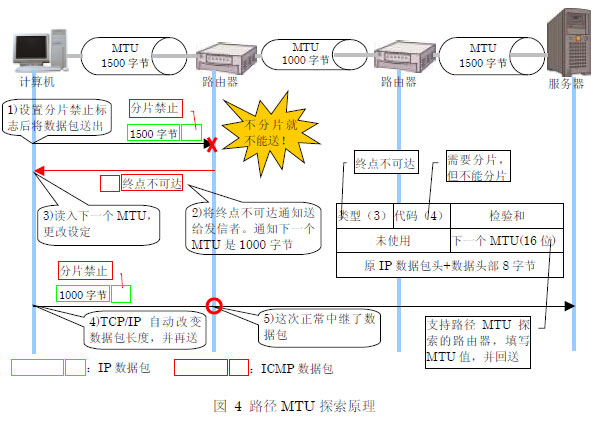

路径MTU 探索的原理本身是非常简单的。首先，Windows 向通信对方送IP 数据包时，先设置IP 首部的分片禁止标志然后再送。这是路径MTU探索的基本。假如，Windows 将大于1000 字节的数据包送了出去，通信路径上有MTU 从1500 字节变成1000字节的地方。因此，那个路由器将不允许超过1000 字节的数据包通过，而进入MTU 是1000 字节的网路。路由器尝试着将IP数据包分片。但是因为数据包的分片禁止标志是有效的，所以不能分片。该路由器就将该IP 数据包丢弃，并用ICMP 通知送信方“想分片，但不能分片”。这时路由器发送的ICMP的类型字段是3，代码字段为4。这是“需要分片但不能分片，不能送至终点”的意思。而且，大多数路由器将在数据选项部里填入不分片就能通过的MTU大小。Windows 收到该ICMP 报文后就知道了不分片就能够传送的数据大小，并暂时将MTU 大小更换掉，然后继续通信。

### 5.ICMP实现之改变路由

改变路由是指路由器向送信方计算机指示路径改变这个功能。计算机根据自己的路由信息(路由表)来决定传送目标。不知道发给谁好的时候，就将数据包发给设为默认网关的路由器。被指定为默认网关的路由器接收到数据包，发现将数据包发给局域网内的其它路由器会比较快的时候，将这一信息通过ICMP通知发送方。这时使用的是，类型是5，代码是1 的ICMP 改变路由报文。在选项数据部分里写着应该发送给的路由器IP 地址。Windows收到这个报文后，重写自己的路由表，与对方的通信将在一段时间里经由被指定的路由器来实行。

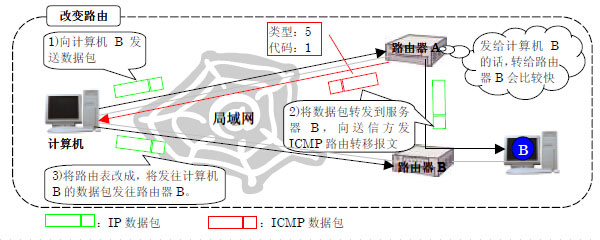

### 6.ICMP实现之源点抑制

数据包集中到达某一路由器后，数据包因为来不及被处理，有可能被丢弃的情况。这时候，向送信方发送的是ICMP 源点抑制报文，用来使送行方减慢发送速度。

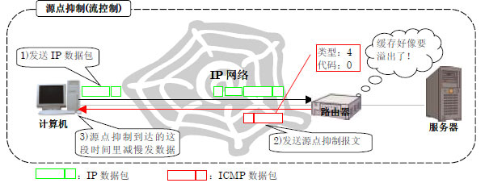

### 7.ICMP实现之ping命令

ping 命令用来在IP 层次上调查与指定机器是否连通，调查数据包往复需要多少时间。为了实现这个功能，ping 命令使用了两个ICMP 报文。  

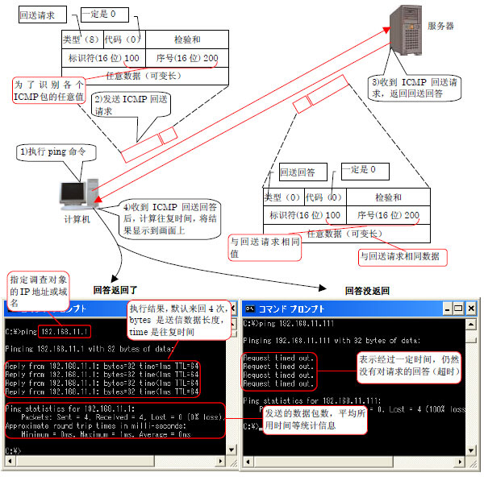

1.向目标服务器发送回送请求。

首先，向目标服务器发出回送请求（类型是8，代码是0）报文（同2）。在这个回送请求报文里，除了类型和代码字段，还被追加了标识符和序号字段。标识符和序号字段分别是16 位的字段。ping 命令在发送回送请求报文时，在这两个字段里填入任意的值。对于标识符，应用程序执行期间送出的所有报文里填入相同的值。对于序号，每送出一个报文数值就增加1。而且，回送请求的选项数据部分用来装任意数据。这个任意数据用来调整ping 的交流数据包的大小。

2.鹦鹉学舌一样返回回送回答。  

计算机送出的回送请求到达目标服务器后，服务器回答这一请求，向送信方发送回送请求（类型是0，代码是0）（同3）。这个ICMP 回送回答报文在IP层来看，与被送来的回送请求报文基本上一样。不同的只是，源和目标IP地址字段被交换了，类型字段里填入了表示回送回答的0。也就是，从送信方来看，自己送出的ICMP 报文从目标服务器那里象鹦鹉学舌那样原样返回了。  
送信方的计算机可以通过收到回送回答报文，来确认目标服务器在工作着。进一步，记住发送回送请求报文的时间，与接收到回送回答报文的时间一比较，就能计算出报文一去一回往复所需要的时间（同4）。但是，收到的回送回答报文里写的只是类型和代码的话，发送方计算机将无法判断它是否是自己发出去请求的回答。因此，前面说到的标识符和序号字段就有它的意义了。将这两个值与回送回答报文中的相同字段值一比较，送行方计算机就能够简单地检测回送回答是否正确了。执行ping命令而调查的结果没什么问题的话，就将目标服务器的IP 地址，数据大小，往复花费的时间打印到屏幕上。

3.用ping 命令不能确定与对方连通的原因大致有三个。  

1）目标服务器不存在；2)花在数据包交流上的时间太长ping 命令认为超时；3）目标服务器不回答ping 命令。如果是原因2），通过ping命令的选项来延长到超时的等待时间，就能正确显示结果了。如果原因是1）或3）的话，仅凭ping 命令的结果就不能判断是哪方了。正如这样，ping命令不一定一定能判断对方是否存在。

### 8.ICMP实现之traceroute命令

为了调查到通信对方的路径现在是怎么样了，使用的是traceroute 命令。它与ping 并列，是代表网络命令。这个traceroute 也是ICMP的典型实现之一。  

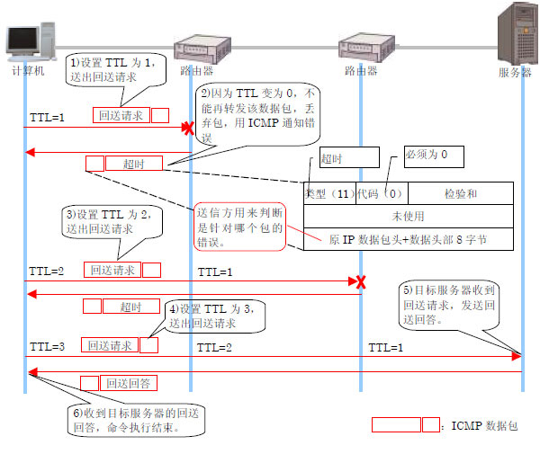

1.执行tracert命令。  

在Windows 上执行tracert 命令后，首先计算机向目的服务器发送IP 数据包。Windows 上使用的是与ping 同样的ICMP回送请求报文。但是，有一点和通常的回送请求不一样。那是，最初将IP 首部的TTL(生存时间)字段设为1 这一点。  

路由器每转送一次数据包就将TTL 的值减1。当TTL 变为0 的时候，按规定将丢弃这个数据包。正如这样，与其说TTL 是时间，还不如说TTL是经过路由器的个数。对于计算机发送出去的数据包，只要它与目标服务器不在同一局域网内，一定会被哪儿的路由器中继。这时如果TTL的值是1，由于路由器的处理会变为0，则该数据包将会被丢弃（同2）。

2.用超时报文来通知送信方。  

路由器丢弃数据包的同时，用ICMP 报文来通知错误。这时使用的ICMP 报文是，类型为11，代码为0 的ICMP超时报文。而且在选项数据字段里，将填入原先数据包的IP 首部和ICMP 的开始8 字节。正如ping 命令的时候看到的，ICMP 回送请求的先头8字节里包含了标识符和序号字段。因此，送信方的计算机看了超时报文后，就知道是针对自己发出的回送请求的错误通知。  

计算机接到针对第一个数据包的ICMP 超时报文后，接下来将TTL 加1（TTL=2）并同样地送出（同3）。这次通过第一个路由器，TTL变为1，到达第二个路由器。但是第二个路由器象前面一样，由于TTL变为0，将不能转发该包。因此，同第一个路由器一样，将该包丢弃，并返回ICMP超时报文。以后，收到错误的发送方计算机将TTL 加1，重复同样的工作（同4）。

3.只有目标服务器的反应不同。  

如此一个一个增加TTL，某个时候ICMP 回送请求报文将到达最终的目标服务器。这时，只有目标服务器与途中的路由器不同，不返回ICMP超时报文。为什么呢？因为即使目标服务器收到TTL 为1 的数据包也不会发生错误。  

作为代替处理，服务器针对送信方计算机发出的ICMP 回送请求报文，返回ICMP 回送回答报文。也就是，送信方计算机与服务器之间，与ping命令的执行一样了（同5）。得到了ICMP 回送回答报文的送信方知道了路经调查已经到了目标服务器，就结束了tracert命令的执行（同6）。像这样，通过列出中途路由器返回的错误，就能知道构成到目标服务器路径的所有路由器的信息了。

4.操作系统不同则实现方法略微不同。  

到这里，以Windows 上的tracert 命令为例看了原理，有些别的操作系统的traceroute 命令的原理略微不同。  

具体来说，也有用向目标发送UDP 数据包代替ICMP 回送请求报文来实现的。虽说是用UDP，但途中的路由器的处理与図 8完全相同。只是UDP数据包到达目标后的处理不同。目标计算机突然收到与通信无关的数据包，就返回ICMP 错误，因此根据返回数据包的内容来判断命令的中止。

### 9.ICMP实现之端口扫描

所谓的端口扫描就是检查服务器不需要的端口是否开着。服务器管理者用来检查有没有安全上有问题的漏洞开着。不是象ping 和traceroute那样是操作系统自带的工具，需要利用网络工具才行。

端口扫描大致分为“UDP 的端口扫描”和“TCP 的端口扫描”两种。这里面，与ICMP 相关的是UDP一边。使用TCP的通信，通信之前必定要先遵循三向握手的程序。因此，只要边错开端口号边尝试TCP连接就能调查端口的开闭。不特别需要ICMP。与此相对，UDP没有这样的连接程序。因此，调查端口是否打开需要想点办法。这样，被使用的是ICMP。根据ICMP 规格，UDP数据包到达不存在的端口时，服务器需要返回ICMP 的“终点不可达”之一的“端口不可达”报文。

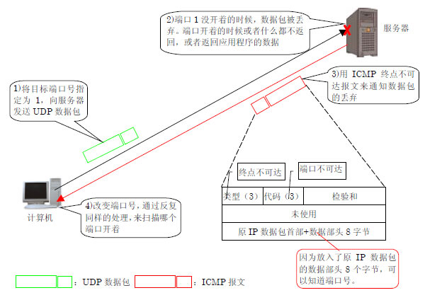  

具体来说，向希望调查的服务器发送端口号被适当指定了的UDP 数据包。这样，目标端口没开着的话，服务器就返回ICMP 端口不可达报文。返回的ICMP数据包的选项数据字段里放入着，送信方送出的UDP 数据包的IP 首部与UDP 首部的头8 个字节。送信方通过这个信息来辨别该错误通知是针对哪个UDP数据包的，并判断端口是否打开着。

UDP 端口扫描一边一个一个错开端口号，一边持续着这个通信。这样，就知道了哪个端口是“好象开着的”了。但是，UDP 端口扫描与TCP端口扫描有很大区别的地方。那就是，即使ICMP 端口不可达报文没有返回，也不能断定端口开着。端口扫描除了被管理员用来检查服务器上是否有开着的漏洞，作为黑客非法访问的事先调查，对服务器实施的情况也是很多的。需要非常小心地来使用。

### 10.ICMP和安全的关系

##### 10.1 为什么停止方便的ICMP？

为什么有停止ICMP 使用的设定项目呢？理由只有一个，那就是确保安全。虽然ICMP 是非常便利的协议，但黑客在尝试非法访问的时候会被恶意利用。由于ICMP被恶意使用而遭受损害的用户正在不断增加之中，因此有了限制ICMP 使用的意见。

##### 10.2 ICMP数据包攻击

那么实际上，ICMP 被怎样恶意使用的呢？想考虑安全相关问题，不知道这个就开不了头。看两个典型的恶意使用例子吧。

作为恶意使用ICMP 的最有代表性的例子，也就是所谓的 “ping 洪水”的攻击。它利用ping 的原理，向目标服务器发送大量的ICMP回送请求。这是黑客向特定的机器连续发送大量的ICMP 回送请求报文。目标机器回答到达的ICMP回送请求已经用尽全力了，原来的通信处理就变得很不稳定了。进一步，目标机器连接的网络也可能由于大量的ICMP 数据包而陷入不可使用的状态。

与ping 洪水相似，以更加恶劣的使用方法而闻名的是称为“smurf”的攻击手法。smurf 同样，黑客恶意的使用ICMP 回送请求报文。这一点同ping洪水是相同的。不过在smurf，对ICMP 回送请求实施了一些加工。源IP地址被伪装成攻击对象服务器的地址，目标地址也不是攻击对象服务器的地址，而是成为中转台的网络的广播地址。  

来具体看一下smurf 攻击的流程吧！  

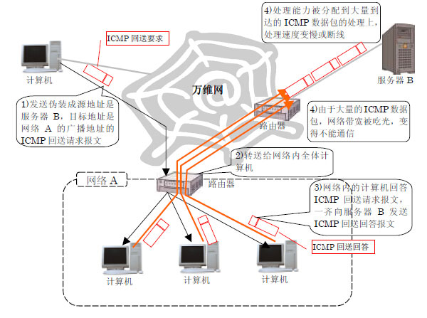

黑客发送伪装了的ICMP 回送请求后，到达在作为踏板的网络的入口处的路由器。这样，路由器将回送请求转发给网内所有的计算机（同2）。假如有100台计算机，回送请求将到达100台所有的计算机。收到回送请求的计算机对此作出反应，送出回送回答报文（同3）。这样，黑客送出的一个ICMP回送请求报文，一下子增加到了100 倍。  

这样增加的ICMP 回送回答报文面向的不是黑客的计算机，而是伪装成回送请求的源IP 地址的攻击对象服务器。变成到达了，从几百台计算机发出的巨大数量的ICMP回送回答。smurf 与ping 洪水攻击不同，因为到达服务器的是ICMP回送回答，服务器不用返回回答。但是为了处理大量的ICMP，服务器承受了大量的负载。网路被撑爆了也是一样的（同4）。

除此之外，还有很多各种各样ICMP 被恶意使用的例子。例如，通知错误或询问信息本身，也有被黑客用来传递谎言的可能性。同用信鸽来扩展谎言的传播，通过传递与事实不同的信息来使人判断错误是一样的。而且，反过来也有传递错误信息而变成问题的例子。例如，在实现篇里看到的端口扫描，黑客就可以利用它来进行攻击对象的调查。进一步，推翻了“ICMP 是用来控制IP 的”这一常识的恶意使用方法也登场了。就是将ICMP的选项数据部分作为信息搬运工的手法。黑客将这种工具隐藏在服务器里，从外部控制服务器，将用户的个人信息和重要的情报偷盗出来。如上，仅从安全的方面来说，ICMP是有百害而无一利的。

##### 10.3 阻止ICMP后将陷入困境

“那阻止所有的ICMP 不就行了吗！”可能有读者会这样认为。不过那就太轻率了。ICMP 作为支持IP的协议是需要的，所以被制作了。即使没有，也不是说IP通信本身就完全不行了，实际上会出现几个难办的情况。  

它的典型例子就是称为“黑洞路由器”的问题。所谓黑洞路由器，就是通信路径上的IP 数据包不留痕迹的消失了的现象。原因是，实现篇里说明的路径MTU探索功能不起作用了。

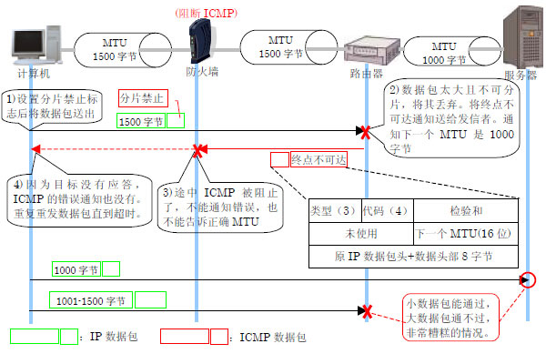

假设通信路径上有因为MTU 大小不同而需要分片的路由器。而且，计算机和路由器之间，为了安全上的原因，设置了阻止ICMP报文通过的防火墙。这种情况下，计算机实行路径MTU 探索将会怎么样呢？

1.不能调整数据包长度  

如果是传送路径上不需要分片大小的IP 数据包，它将会毫无问题地到达对方。另一方面，数据包的长度是需要分片的时候，发送就会有问题。  正如实现篇看到的，这样的数据包到达连接在不同大小MTU 的网络的路由器后，路由器将用ICMP终点不可达报文来通知发送方。本来的处理是，送信方接收到该ICMP 报文，根据路径MTU 探索处理调整MTU 大小后继续通信。但是，这次的例子，ICMP报文被路经中的防火墙隔断了。路径MTU 探索功能不起作用，MTU 的大小也就不能调整了。

2.不知道原理就不可能理解 

最近从局域网的计算机通过ADSL 服务访问万维网时，经常看到这个黑洞路由器现象。ADSL 线路的MTU 大小，宽带路由器的设定，Windows 的路径MTU探索功之间互相关联引起了这个现象。糟糕的是，即使有黑洞路由器，也不是完全不能通信这一点。不管怎么样说，被吸进去的只是长度是需要分片的IP数据包。也就是，考虑一下WEB 访问，连接WEB服务器时是没有问题的，以文字为主体的页面也大都能被显示，但是含有比较大图像的页面不能被显示。黑洞路由器就由这种复杂奇怪的现象表现出来了。如果不知道路径MTU探索和黑洞路由器的原理的话，碰到这种现象，可能连猜想原因都很困难了。

3.即使阻止了客户端也没问题  

如最初所见，在现实的万维网上，如果事先使所有的ICMP 功能有效的话，就会给了黑客各种各样的机会，安全上就会有问题了。  

另一方面，如果一个一个阻止了的话，不仅非常不方便，而且还会发生黑洞路由器等问题。那么，如何充分运用ICMP才行呢？客户端，服务器，还有路由器，从各个方面来看一下。  

首先从客户端开始。最近的宽带路由器和个人防火墙，通过设置来阻止ICMP 的很多。但是，初期设置是千差万别的。阻止全部ICMP的也有，反过来的也有。其中，只允许ping 命令等一部分ICMP 报文通过的也有。  

原来，对于安全的考虑方法是根据环境的不同而变化巨大的，并不是一定要这样才行的。但是，最近的倾向是，使连在万维网上的个人计算机不应答没有必要的ICMP报文。例如Windows XP 的情况下，使用操作系统自带的个人防火墙的话，默认是将外部来的所有ICMP 报文隔断。  

那么路由器怎么样呢？万维网中的路由器，不小心阻断了ICMP 的话，会发生黑洞路由器等问题。还有，大量的数据包涌过来的时候，如果不发送ICMP 源点抑制报文，处理速度就会跟不上。路由器的话，这样的情况以外，再加上考虑周围网络环境的基础上，再来判断是否阻断不需要的或者可能造成攻击的ICMP数据包比较好吧。  

服务器就比较难判断了。例如，不让它回应ping 命令的话，连不上服务器的时候，就缺少了调查的有效手段。但是，有受到ping洪水攻击的可能性也是事实。这些只能由管理者来判断了。

