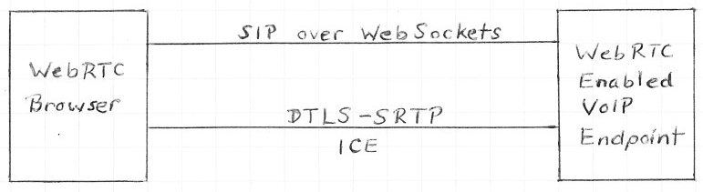
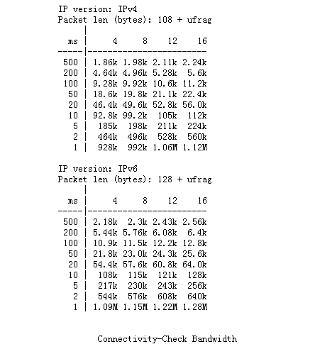
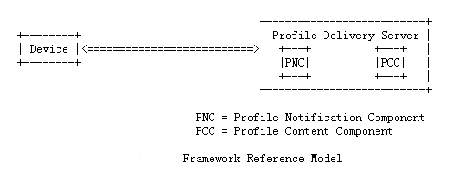
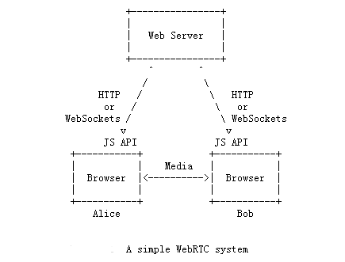

<!--BEGIN_DATA
{
    "create_date": "2020-12-18 14:30", 
    "modify_date": "2020-12-18 14:30", 
    "is_top": "0", 
    "summary": "完整SIP/SDP媒体协商概论-ICE/SIP呼叫延迟问题初探<br/>完整SIP/SDP媒体协商概论-ICE攻击类型和安全架构讨论", 
    "tags": "WebRTC", 
    "file_name": "完整SIP/SDP媒体协商概论-ICE/SIP呼叫延迟问题初探与ICE攻击类型和安全架构讨论.md"
}
END_DATA-->

#### <p>原文出处：<a href='https://mp.weixin.qq.com/s?__biz=MzA4NjU0NTIwNQ==&mid=2656447742&idx=1&sn=0274769f9e4ee559b9d7d1b02b4d1229&chksm=84658aa4b31203b281fdff4b48133fcadb8cad0cad1179b21fa5cdd50ea67cd22462432771ee&scene=178&cur_album_id=1358845057818017793#rd' target='blank'>完整SIP/SDP媒体协商概论-ICE/SIP呼叫延迟问题初探</a></p>

前面的章节中笔者讨论了ICE中更新状态和ICE选项支持的内容。这里，我们要进一步讨论ICE中媒体处理和配合SIP场景中可能面对的问题。具体讨论在ICE在处理涉及的发送媒体和接收媒体的两个不同的流程。最后，笔者将介绍在ICE环境中，配合SIP使用时，呼叫业务需要处理的流程以及呼叫延迟推荐的优化方式。  

首先说明，在ICE环境中，针对媒体/数据处理两种规范有一定的区别。具体来说，在RFC5245规范中规定的是媒体收发处理，但是在其更新的规范RFC8445中讨论的是数据收发处理。这里，规范中使用的定义有所区别，另外，具体的处理流程也有所不同。这里，我们主要是根据RFC5245的规范做详解，没有根据RFC8445规范说明。因此，读者如果需要最新的关于数据收发的处理，应该参考RFC8445和RFC576（以及最新的RFC8656）。  

## 1 ICE环境中发送媒体

针对发送媒体的讨论需要关注三个部分的内容。首先是全部署环境中发送媒体的讨论。在全部署场景中，agent总是使用一对候选配对来发送媒体，我们称之为“selected candidate pair”。Agent将会通过已选候选配对将媒体发送到远端候选地址，并且设置数据包的目的地地址和端口等于远端候选地址,然后从已选配对的本地候选地址发送媒体。当本地候选地址是server 或者 peer reflexive时，媒体是从基准地址来发送。从转发候选地址发送过来的媒体需要从基准地址通过STUN服务器端发送出去，发送处理流程按照RFC5766（最新规范参考RFC8656）的规范来执行。如果本地候选地址是转发候选地址的话，RFC5245规范推荐，针对远端候选地址，agent需要在STUN服务器端创建一个通道。关于agent创建通道的流程按照RFC5766-11的规范执行。针对媒体流的构件的已选配对有以下三种状态说明：

  * 如果此媒体流的检查列表的状态是运行状态，并且因为重启ICE，没有以前的已选配对，那么已选配对为空。
  * 如果此媒体流的检查列表的状态是运行状态，并且因为重启ICE，存在一对以前的已选配对，已选配对等于以前的已选配对。
  * 如果检查列表的状态是完成状态，针对此媒体构件来说，已选配对等于在有效列表中的最高优先级标识配对。  

媒体流的构件影响着媒体流的发送方式，并且已选配对数量状态也决定agent是否可以针对具体构件发送媒体。具体来说，针对一个媒体流中的一个构件中（至少一个构件），如果一个已选配对为空，agent**一定不能**对其他构件发送媒体。针对媒体流的每个构件，已选配对都有一个值的话，agent**可以**为此媒体流的所有构件发送媒体。**注意**，媒体流的一个构件的已选配对可以不等于同样构件中最近offer/answer交互中的默认配对。如果不相等时，选择已选配对发送媒体，而不是使用默认配对发送媒体。当ICE流程首先完成时，如果已选配对不能匹配默认配对，被控agent就会发送一个更新的offer/answer交互消息来纠正这个不同。不过，直到更新offer收到之前，仍然存在一个不匹配结果。进一步来说，在一些极端情况下，在更新offer/answer交互中的默认配对不会有任何匹配。以上介绍的是全场景部署环境中关于媒体发送的处理讨论。这里，我们简单介绍在轻量级的部署环境中媒体发送的流程。轻量级部署场景中媒体发送的流程比较简单。在有效列表中没有任何候选配对时，轻量级部署场景中的agent一定不能发送媒体流，直到在有效列表中为媒体流每个构件包含了一个候选配对，agent才能发送媒体流。Agent将会通过候选配对将媒体发送到远端候选地址，设置数据包的目的地地址和端口等于远端候选地址, 从已选配对的本地候选地址发送媒体。

在完整场景部署环境中，ICE支持了一个抖动缓冲机制（jitter buffer）交互。在传输RTP流时，RTP媒体流可以开始使用一个候选地址传输，一定时间后，RTP流可以切换到另外一个候选地址继续传输。虽然以上这种场景不会在ICE中经常发生，但是这种情况一旦发生的话，可能引起语音延迟等问题。具体来说，传输地址切换到新的候选地址可能导致RTTP流使用不同的网络资源属性通过不同的网络路径或者网络环境发送媒体流，这样就会导致RTP延迟的问题。因此，agent可以使用抖动缓冲机制来优化数据包发送时候选地址切换带来的语音延迟。很多语音编码使用一个标记来标识talkspurt起始段。为了使用抖动缓冲机制的目的，当发送媒体流时，候选地址发生切换时，RFC5245规范推荐发送方marker bit来表示。具体关于marker bit，读者可以参考RFC3550。关于talkspurt和RTP的其他定义，读者可以参考RFC5391，以及参考资料中的其他链接来进行进一步学习，这里不再展开讨论。

## 2 ICE环境中接收媒体

一旦ICE成功执行了最新的offer/answer交互流程，ICE部署场景中的接收方必须准备接收候选地址每个构件所支持的媒体，包括其RTP和RTCP数据流。根据RFC5245推荐，针对一个具体的媒体流，当agent从新的源地址和目的地IP收到媒体流数据包时，agent应该使用抖动缓冲机制来接收媒体流数据（前面已讨论）。在RFC3550-8的算法中定义了SSRC的冲突检测和重复循环机制，这些算法中使用了一些基础的资源，例如同一SSRC的不同源传输地址中的检测方式。当使用ICE时，可能发生媒体流通过不同候选地址（切换）发送媒体流数据。Agent能够比较智能，可以判断媒体流是否来自于同一对端，此agent的对端可能产生了STUN交互传输的新地址。因此，如果源传输地址发生了改变，但是数据流来自于同一对端peer的话，这种情况不应该被视作为SSRC的冲突。

## 3 ICE配合SIP使用的讨论

前面我们全部讨论的是关于ICE环境中的处理流程。因为目前大部分的语音通信中，SIP协议已经非常普遍，很多应用场景不得不和SIP呼叫集成。在RFC5245中讨论了很多和SIP应用场景的集成，但是在最新的RFC8445中已经移除了关于SIP的使用讨论。因为目前很多应用仍然需要和SIP集成，为了能够让读者对ICE相关技术有一个比较完整的认识，因此笔者认为仍然有必要针对SIP协议的集成进行说明。具体来说，关于ICE部署场景中和SIP结合使用可能涉及几个方面的内容细节，包括SIP信令延迟处理（INVITE中的offer处理/响应中的offer处理），SIP options标签和媒体功能option标签支持，SIP分寸处理交互，SIP Preconditions交互和SIP第三方呼叫控制交互。下面，笔者针对这些内容做具体说明。

## 4 关于ICE/SIP延迟原则讨论

根据笔者前面文章中介绍的和本文章前面介绍的内容，ICE处理流程需要在两个终端之间进行一系列，基于STUN的连接检查。这些检查是通过answerer生成的answer消息启动，对端offerer收到answer消息启动offerer的检查。完成这些检查需要**耗费一定的**时间，并且还有一些类似的处理，例如在**answer或offer选择的消息**都会被看作影响用户时延的一些要素条件。在这些时延的处理中，其中两个比较重要的时延需要用户去认真考虑，它们分别是**post-pickup delay和post-dial delay**。Post-pickup delay表示的延迟是介于用户应答呼叫和用户之间开始进行正式语音通话的时间。Post-dial delay表示的延迟是介于用户输入呼叫目的地地址和成功呼叫对方以后返回的回铃音之间的时间。因为这两个时间分别出现在了初始请求中和响应中，并且涉及到了ICE的连接检查，因此，我们针对这两个时间在各自流程中的细节做进一步的说明。  



## 5 INVITE中的offer消息

很多时候，一些用户可能会遇到一些通过WebRTC呼叫延迟的问题。这些问题很多都是和ICE协商处理流程过长相关。现在，我们讨论一个非常具体的问题，那就是post-dial 延迟问题。如果需要降低post-dial 延迟，RFC5245推荐呼叫方开始采集候选地址的流程应该早于初始INVITE发送时间。这个设置方式可以通过界面的设置提供一个提示，此时SIP呼叫正在等待状态，或者通过拨号盘的一个事务活动，电话摘机等方式进行提示处理。因此，ICE可以早于初始请求发送之前采集候选地址，决定延迟时间。  

如果应答方answerer在INVITE请求中收到一个offer消息，answerer应该开始采集候选地址，一旦完成采集流程，然后生成一个临时响应消息。这里，ICE要求在SDP中传输的临时响应消息是可靠传输。这种可靠传输可以通过现在的PRACK机制来实现。具体的实现机制可以参考RFC3262。另外，这种传输也可以通过ICE的优化来实现。使用ICE优化的处理方式来实现的话，如果临时响应中包含SDP answer，这个SDP answer开始ICE流程来处理一个或多个媒体流的话，这个临时响应可以实现可靠发送无需按照RFC3262规范执行。如果这样操作，agent通过TU的指数退避算法重新临时响应。具体的定义参考RFC3262。这样的重传处理可以通过两种方式实现（停止STUN绑定或者重传answer消息）。Agent重传必须停止STUN绑定接收流程，针对媒体流的STUN 绑定接收是在SDP中设定。因为这个绑定请求接收表示offerer方已经收到了对端的answer消息。另外，agent如果需要这样的重传，需要在2xx响应中重新传输answer消息。如果对端peer是一个轻量级的agent的话，就从来不会有STUN绑定请求。如果类似这样的场景发生，agent发送4次18x临时响应以后，然后必须停止重传。这里，有时尽管对端从来没有收到18x临时响应，实际上ICE已开始工作。但是，在实际生产环境中，对一些中间设备或者防火墙穿越来说，发送18x仍然是非常重要的一种验证方式。如果agent在最后重传之前没有收到绑定请求，agent不会认为此会话已结束。

尽管临时响应通过可靠传输进行，但是，当agent能够发送更新offer或者answer时必须遵从一定的规则，规则不能发生修改，规则定义按照RFC3262处理。具体来说，如果INVITE中包含一个offer，同样对应的answer出现在此INVITE的1xx所有响应消息和2xx响应消息中。另外，仅2xx发送以后，更新的offer/answer交互才能执行。如果双方agent都支持PRACK的话，这种优化机制就不应该被使用。注意，优化机制不是支持临时可靠传输的标准技术，这种优化机制具体使用在临时响应传输answer消息的环境中，通过此answer消息开始ICE处理流程。

除了以上的处理延迟的方法以外，另外一种可选方式是agent可以延迟发送一个answer消息，直到收到200 OK以后再发送answer消息。但是，这种处理方式可能带来不好的用户体验，RFC5245不建议推荐。  

一旦agent发送answer以后，此agent应该开始连接性检查。一旦针对媒体流的每个构件的候选配对进入到了有效列表中，answerer应答方可以开始在媒体流资源上发送媒体数据。  

因为SIP处理流程和ICE的结合，可能会遇到关于其他媒体流发送的问题。根据前面的处理方式，在此流程处理节点之前，任何需要针对呼叫方发送的媒体（例如早期媒体流）一定不能在此处理节点之前发送。因为这个原因，ICE处理应该延迟提示被呼叫方，直到前面说的候选配对进入到有效列表中才开始发送媒体，否则没有任何候选地址可以支持媒体流的每个构件。如果在SIP呼叫的路径上有PSTN网关的应用场景，还要考虑PSTN的setup消息的处理流程带来的延迟。这样就会增加一个post-dial 的延迟（拨号后延迟）。但是，这样可能会带来一个假振铃（ghost rings）的“好的”效果。这种假振铃通常是被呼叫方会听到振铃声，接听电话以后被呼叫方听不到对方任何声音。因此，假振铃也无需要求或使用precondition（因为precondition是取决于本地支持（RFC5027））。除了以上好处以外，另外一个好处就是可以“保证”无爆破音数据产生在第一个媒体的数据包。因此，也可能出现post-pickup delay为0的“理想”结果。如果agent选择延迟本地提示的方式，一旦提示开始以后，agent应该生成一个180响应消息。  

## 6 Response中的offer消息

前面我们讨论了offer在INVITE中，answer通过临时响应或者200 OK传输的情况。其实，ICE也可以在另外一种环境工作，那就是offer消息出现在响应消息中。这种情况经常出现在第三方呼叫业务（RFC3725）的场景中，agent应该在可靠临时响应中生成自己的offer消息（生成消息的规则必须遵从RFC3262规范），并且不能在INVITE接收中提示用户。answer消息将随PRACK抵达。这样的处理方式就会支持ICE处理流程早于提示消息，因此不会增加呼叫创建时间，也不会产生post-pickup delay。一旦ICE完成以后，当呼叫应答以后，被呼叫方可以提示用户并且生成200 OK。因为offer/answer交互在之前已经完成，此200 OK消息中就不会包含任何SDP消息。

除了以上处理方式以外，另外一种可选方式是agent可以把此offer消息置于200 Ok中（这种情况下，answer是在ACK中）。当这种场景发生时，被呼叫方通过INVITE接收消息提示用户，用户应答以后，ICE处理流程才启动。这样处理的好处是可以降低呼叫创建延迟，但是可能会引起后续的post-pickup delay和出现媒体爆破音问题。

## 7 SIP options标签和媒体功能标签

RFC5768规范定义了配合ICE使用时的SIP可选标签支持和媒体功能的标签支持。ICE部署使用SIP应该支持可选标签和媒体功能标签细节，使用功能标签处理注册机制来支持兼容性处理流程。具体关于“sip.ice” 功能标签细节，读者可以查阅RFC5768规范。

## 8 ICE和SIP分叉处理的讨论

ICE可以非常好地配合SIP forking处理流程工作。事实上，ICE可以解决很多和分叉处理关联的问题。如果没有ICE的话，当呼叫被分叉处理后，呼叫方收到多个媒体流数据时，呼叫方不能决定哪个媒体流对应哪个被呼叫方。如果使用了ICE后，媒体传输中包含用户信息，连接性检查会早于媒体传输之前执行，媒体传输过程中包含了具体的用户名称（username fragments），通过这样的方式就会获得媒体流以及对应的被呼叫方信息。因此，只要呼叫方收到了一个answer以后，呼叫方就可以执行关联性处理。  

## 9 ICE和SIP Preconditions讨论

QoS（服务质量）是通信服务的核心要求，RFC3312和RFC4032定义了QoS的规范。但是，QoS只能支持在offer/answer交互中的默认目的地列表中的传输地址。如果ICE修改了传输地址，这个传输地址已接收了媒体流的话，这个更新就会通过更新offer来处理，在更新的offer中修改默认目的地地址匹配ICE已选地址。这样的话，这种修改类似于发生了一个re-INVITE，可以完全视作支持了RFC3312和RFC4032，可以忽略掉背后发生的ICE协商的目的地修改流程。注意，很多情况下，事实上agent不应该提前指示QoS preconditions已匹配的结果，它应该等待一定的时间，直到ICE检查完成，并且ICE已选择了候选配对来传输媒体流以后，agent才能指示QoS preconditions已匹配的结果。  

ICE有自己的检查预处理条件(Connectivity Preconditions)的交互规范(RFC5898)。此交互规范提供了更多的功能和语法细节。语法规则如下：

```cpp
precondition-type = "conn" / "sec" / "qos" / token
```

有兴趣的读者可以参考RFC5898了解其具体处理流程。  

## 10 ICE和SIP 第三方业务呼叫的互动讨论

ICE可以支持第三方呼叫中的flow I，III，和IV呼叫流程（在RFC3725中定义了4种3PCC呼叫流程，读者可以查阅RFC3725做详细了解）。其中，flow I 可以支持ICE工作场景，无控制方支持，无ICE感知支持。在Flow IV中，只要控制方通过ICE属性传递支持，无任何属性修改的话，Flow IV就可以工作。Flow II (**这里不是flow III，规范拼写错误？**)则完全和ICE不兼容，每个agent认为自己是answerer，因此从来不会生成一个re-INVITE请求。  
关于第三方处理流程的后续操作处理，需要按照RFC3725-7来进行，这个流程需要其他ICE的处理支持。具体来说，如果agent收到一个mid-dialog的re-INVITE,它没有包含offer消息的话，agent必须为此媒体重新启动ICE，然后完成新候选地址采集流程。另外，候选地址列表应该包含当前正在被媒体使用的候选地址。  

笔者在本文章中首先介绍了ICE环境中媒体收发流程，然后介绍了offer在INVITE请求和响应中的处理，并且指定介绍了关于涉及了SIP呼叫时面对的呼叫延迟以及优化的推荐处理方式。最后，笔者介绍了关于ICE和SIP第三方呼叫业务的整合规范。

### 参考资料

* [https://www.rfc-editor.org/rfc/rfc8445](https://www.rfc-editor.org/rfc/rfc8445)
* [https://www.rfc-editor.org/rfc/rfc5766](https://www.rfc-editor.org/rfc/rfc5766)
* [https://www.rfc-editor.org/rfc/rfc8656](https://www.rfc-editor.org/rfc/rfc8656)
* [http://sbhunia.me/publications/manuscripts/acity11.pdf](http://sbhunia.me/publications/manuscripts/acity11.pdf)
* [https://www.researchgate.net/publication/224348734_Jitter_Buffer_Analysis](https://www.researchgate.net/publication/224348734_Jitter_Buffer_Analysis)
* [http://genesysguru.com/blog/blog/2009/11/12/voice-quality-jitter-silence-supression-and-talkspurts/](http://genesysguru.com/blog/blog/2009/11/12/voice-quality-jitter-silence-supression-and-talkspurts/)
* [https://tools.ietf.org/html/rfc5391](https://tools.ietf.org/html/rfc5391)
* [https://www.rfc-editor.org/rfc/rfc3960](https://www.rfc-editor.org/rfc/rfc3960)
* [https://www.rfc-editor.org/rfc/rfc5027](https://www.rfc-editor.org/rfc/rfc5027)
* [https://www.rfc-editor.org/rfc/rfc5898](https://www.rfc-editor.org/rfc/rfc5898)
* [https://www.slideshare.net/alexpiwi5/deploying-webrtc-in-a-lowlatency-streaming-service](https://www.slideshare.net/alexpiwi5/deploying-webrtc-in-a-lowlatency-streaming-service)

<hr>

#### <p>原文出处：<a href='https://mp.weixin.qq.com/s/KULQN3tqycyIdAxEGduxyA' target='blank'>完整SIP/SDP媒体协商概论-ICE攻击类型和安全架构讨论</a></p>

为了完成整个SIP/SDP媒体协商概论，笔者花费了很多时间介绍关于WebRTC中的ICE处理流程。通过完整的详解，笔者相信关于ICE处理流程的大部分内容已经
解释的比较清楚。在总结ICE部署安全问题之前，重复说明一下关于ICE部署-RFC5245的完整名称：

```cpp
Interactive Connectivity Establishment (ICE):
A Protocol for Network Address Translator (NAT) Traversal for
Offer/Answer Protocols
```

在本章节，笔者重点结合RFC8445官方为读者补充一些关于ICE部署操作时应该注意的一些问题。这里先说一点题外话。和RFC3261规范或者其他规范相比，笔者认为RFC5245规范不是一个“非常好”的规范（可能笔者是错误看法，仅供参考），主要有以下几个方面的原因：

  1. 多处定义和流程说明不是非常明晰完整（不具体举例），有个别语言用词不是非常规范，开发人员可能存在很多理解偏差。
  2. 因为WebRTC的发展太快，浏览器终端技术和开发语言也发展太快，很多新的其他技术在短短几年发生了很多变化，导致协议规范本身的兼容性出现很多问题。这可能也是WebRTC部署使用存在很多问题的原因。
  3. 关于和SIP相关内容调整有一点突然。如果SIP和ICE结合使用时，可能让开发人员引起歧义。因为在RFC8445中移除了此部分的建议，因此开发人员如何实现和SIP具体业务的兼容性支持是一个挑战。

当然，任何技术或者官方制定参与者都有其局限性，而且很多出现的新技术完全可能淘汰旧的技术，特别是一些基于浏览器的技术。因此，我们讨论关于ICE处理流程的规范时也必须要结合RFC8445规范来讨论，除了以上链接所介绍的文章以外，为了保证ICE处理流程讨论的完整性，笔者这里重点针对RFC5245和RFC8445中关于ICE部署时需要注意的几个问题进行补充讨论。接下来的讨论中，笔者将讨论关于ICE部署时需要考虑的问题，ICE安全问题，WebRTC安全架构草案。  

## 1 ICE部署时需要考虑的问题

这里，我们首先简单讨论关于NAT和防火墙的环境问题。当初ICE的设计目标是基于当时现存NAT和防火墙设备而设计的。因此，为了部署ICE也没有必要替换或者修改这些设备。另外，如果ICE部署在VOIP环境中的话包括了NAT和防火墙设备的话，语音质量的控制可能已经不是ICE环境所能够控制的。在两个关于NAT和防火墙处理方面的关键的规范RFC4787和RFC5382中，根据规范建议ICE部署应该可以完美支持NAT设备和其终端。在“遵从NAT规范”的网络环境中（实际上很难实现，很多场景仍然依赖于STUN，TURN服务器协助），无需STUN服务器端，ICE可以正常工作。其他一些呼叫应用的优化，例如语音质量提升，降低呼叫创建时间，降低带宽占用都取决于网络运营者本身。  

首先需要一定的带宽要求支持STUN和TURN服务器。在部署ICE时仍然需要很多和网络环境本身的交互，因此很多因素都需要考虑。在现在比较大型的ICE部署环境中，典型的应用包括了ICE和STUN和TURN服务器的交互（一般应用可以借助于第三方的STUN服务器）。一般来说，这些服务器都部署在数据中心或者其他云服务平台。STUN服务器要求相对比较小的带宽服务。对于每个数据/媒体流的每个构件来说，从每个客户端到STUN服务器端至少将会产生一个或者多个STUN事务。在IPv4的网络环境中，基于语音呼叫的呼叫流程中，每个呼叫在呼叫方和被呼叫方之间至少生成4个事务，包括各自的RTP和RTCP。每个事务是一个请求和一个响应。前期的数据包长度是20 bytes，后期的将达到28 bytes。其实，如果按照每个用户在繁忙时间，平均每个用户呼叫4次的话，10用户差不多需要10×1.7 bps，一百万个用户也差不多1.4Mbps。 这个数据相对来说仍然是一个比较小的数据。当然，这是仅针对STUN事务来说的，实际应用环境中还有很多其他因素需要考虑，这里不再讨论。



相对于STUN来说，TRUN服务器可能需要更多的带宽。在TRUN服务器端除了STUN数据以外，可能还有其他转发的媒体数据。如果呼叫需要通过TRUN转发的话，网络环境还要考虑转发到数据流量，最终处理方式仍然取决于网络环境部署本身，例如，如何实现更加灵活的高并发语音和视频会议转发以及如何处理会议进行中人数动态增加的场景都是对带宽处理的挑战。  

除了前面说的STUN和TURN服务器对带宽的要求以外，候选地址采集和连接性检查也对带宽有一定的要求。事实上，场景候选地址和执行连接性检查也非常消耗带宽。当然，这应该是一般的常识，和ICE创建以后相比，前期ICE执行候选地址采集和执行连接性检查需要双方不断发送和接收交互请求响应消息，因此就会产生更多的数据流量。如果ICE检查结束以后，带宽的消耗也相对比较低，重新启动ICE以后，带宽消耗又随着重新交互流程启动，带宽消耗也逐步增加。开始启动ICE keepalives以后，带宽仅局限于一定的边际范围，相当于总带宽来说仍然是比较小的消耗数量。因此，网络部署环境中需要考虑部分ICE候选地址采集和连接性检查交互的数据带宽，还要考虑媒体流传输所需带宽，其余的ICE keepalvies的数据占比相对比较小，则无需太多考虑。  

除了以上两种需要考虑到因素以外，因为候选地址场景和连接性接触引起的网络拥塞也是一个在网络部署中重要的考虑因素。很多网络拥塞可能来自于终端的访问，包括终端处理性能问题，访问边界的网络环境问题导致网络拥塞。网络部署中，管理人员应该考虑ICE部署所引起的这些问题，并且最好确保ICE部署可以实现灵活调整的功能。当然，如果支持ICE灵活调整功能的话，肯定会同时带来呼叫创建时间增加的风险，不过，这样可以保证ICE的稳定性和实现易部署方式。  

在部署ICE时，用户也要考虑STUN keepalives的设置，避免过长或者过短的keepalives设置，另外，keepalives的数据无需太多带宽支持，因此此参数应该不会影响网络环境中ICE部署。  

在很多部署环境中，用户可能混合使用ICE和lICE-lite。特别说明，ICE-lite的使用场景非常有限，建议用户慎用。  

因为很多ICE部署场景是端对端的用户场景，在部署ICE场景时，ICE连接性检查启动端对端的执行流程时涉及了很多的处理流程。这些流程的执行对网络运营人员是一个很大的挑战，因此网络运营人员就会面对两个比较重要的问题：

1. 部署ICE时，如何通过工具来排查问题。
2. 如何通过工具来检测ICE的执行性能。ICE内置功能支持了信令交互的中传输ICE传输的设置，可以检测这些参数和候选地址类型。但是，目前专业的ICE排查工具相对还是比较少，另外，因为ICE需要浏览器客户端的支持，如果浏览器缺乏最新的规范支持，或者WebRTC缺乏最新官方支持的话，其工具可能会影响运维人员的排查效果。除了排查工具因为，另外一种排查手段是系统log或者浏览器的log日志。通过服务器端log和浏览器端的log可以提供丰富的log日志，可以检测到ICE的执行状态。

ICE配合终端使用时，其中一个重要的终端就是SIP终端。ICE的配置依赖于SIP终端的配置信息。配置终端上需要考虑的几个参数包括定时器，TURN服务器的用户安全信息，STUN和TURN主机名等。ICE自己本身不会提供这些配置信息，ICE依赖于附加到ICE的终端认证机制来实现。这种机制管理终端的用户配置信息，例如SIP终端使用的一个架构来传输SIP用户profile。因为篇幅关系，笔者这里不再展开讨论，如果读者有兴趣的话，可以参考RFC6080学习关于”Session Initiation Protocol User Agent Profile Delivery“。



## 2 ICE安全问题讨论

安全问题一直是通信环境中最重要的问题，并且确实也存在很多的安全漏洞。因为无论在初期的信令协商阶段，还是在后期的语音视频传输阶段都可能存在数据暴露的问题。在ICE部署环境中也存在同样的可能性。在起始阶段中，侦测候选地址的流程就会暴露客户端和对端peer的源地址，攻击者就会不断监听这些端口和地址来找出攻击的漏洞。一些地址可能是比较敏感的地址，例如通过通过VPN用户的本地网络接口采集到的服务器端反射地址。



如果在部署ICE时，网络运维人员不能杜绝这些潜在的安全问题，ICE会针对这些地址使用定义机制进行协商和侦测执行流程，最终这些安全机制的核心信息就会被暴露出来。另外，WebRTC本质上来说是为了实现点对点的连接，如果用户双方通过web页面实现连接的话，它们之间的web源数据中可能会出现双方协商的其他相关地址信息，这些信息可能被其他第三方获得来，这样就会导致更多安全问题。为了针对WebRTC的地址安全问题进行优化，Google在2019年提出来一个草案作为一个WebRTC地址的执行要求:  

```
WebRTC IP Address Handling Requirements
https://tools.ietf.org/id/draft-ietf-rtcweb-ip-handling-12.html
```

此份草案提出了4个基本规则和4个基本的模式（Enumerate all addresses，Default route associated local addresses，Default route only和Force proxy）。此草案提供了介于ICE和WEBRTC隐私暴露处理方面的要求和基本的原则。

以上背景说明总结了关于ICE中可能存在的安全问题，根据其环境部署，执行连接检测，侦测候选地址等不同阶段，在ICE部署中存在以下几种类型的攻击方式：**连接性检查攻击**: 攻击者的目的是对连接性检查进行扰乱，攻击者让agent进入到一个错误的连接性检查的状态中。根据攻击类型的不同，攻击者需要不同的支持能力。在一些攻击场景中，攻击者需要置入到连接性检查的路径中。还有的场景中，攻击者也无需在连接性检查路径上，攻击者具备可以生成STUN连接检查的能力也可以进行攻击。攻击者在连接检查的网络环境以后，它们可以被看作为一个网络实体来控制agent，攻击者可以通过为连接性检查提供**错误的**检查结果或者测试结果进行攻击，具体的几种欺骗类型包括：

  * False Invalid：这种类型环境中，攻击者可以对一对agent进行欺骗，让agent认为候选地址是无效的地址。这样会引起agent的错误判断，让agent认为推荐的候选地址是有效地址（攻击者推荐的候选地址，已被注入），或者对呼叫进行干扰，强制候选地址采集失败。为了强制生成一个这样的结果，攻击者需要对端其中一方的agent发送对端连接检查。当连接性检查发送后，攻击者注入一个伪装的响应消息，携带一个不可恢复的错误响应，例如400或者故意丢弃此响应，响应就永远不会返回到agent。另外一种方式是如果候选地址是有效的，初始请求仍然可能会抵达对端agent，并且返回一个成功的响应。攻击者就需要强制数据包和其响应通过DoS的攻击的实体来干扰数据正常收发或者丢弃数据。攻击者通过伪装一个响应消息，使其具有能力通过STUN 短期安全机制生成用户信息。为了保证响应成功处理，攻击者需要密码，此刻，如果候选地址交互信令是加密的，攻击者就不会获得密码，不能获得密码然后就丢弃这个响应。当然，如果信令没有进行加密，攻击者就可能获得用户密码，进行进一步的攻击流程。伪装的Spoofed ICMP Hard Errors（Type 3, codes 2-4）也可以用来生成False Invalid结果。攻击者也具有一定的能力生成ICMP错误响应消息来欺骗agent，agent会对攻击者暴露多个候选地址和端口信息。这样攻击者通过ICMP伪装的响应消息获得攻击权限。
  * False Valid：这种类型的欺骗环境中，攻击者可以对一对agent进行欺骗，当候选地址不是有效地址时，攻击者欺骗agent，认为候选地址配对是有效。这样会引起agent通过配对生成一个会话，最后，agent接收不到任何返回的数据。如何实现强制生成False Valid的具体流程和以上讨论的非常相似。
  * False Peer-Reflexive Candidate：这种类型的欺骗场景中，攻击者诱导agent发现一对新的候选地址配对，实际上这一对配对不是agent所期望获得的候选配对。这样可能导致攻击者通过数据转发的方式，让数据进入到DoS目的地，然后进行监听等攻击流程。这种方式的实现是通过伪造请求，伪造响应或伪造转发地址来实现。
  * False Valid on False Candidate：这种类型的欺骗采集中，agent已经相信了攻击者的身份，攻击者已经置入了一个候选地址，这个地址实际上不会路由到agent端地址。例如，注入错误的peer-reflexive candidate或者错误的false server-reflexive candidate。当然，如果攻击者注入任何其他的错误地址，攻击者可以进行任何方式的攻击。涉及到具体的安全攻击类型可以参考RFC5389-16。以上多种场景可能发生有很多前提条件。除非伪装的候选地址确认了攻击者的身份，否则攻击很难实现。因为双方agent可能在不同的网络环境，结构不同的转发地址，在不同网络，不同终端那个同时协调，并且对攻击者实现了成功认证，这种概率相对比较低。即使攻击者被伪装的候选地址确认为一个正常用户，如果数据路径是加密的，攻击者也很难实现攻击，但是可能会对连接性检查流程造成干扰。  

第二种攻击方式就是此服务器的反射地址进行攻击**-服务器反射地址采集攻击。**因为ICE终端使用STUN绑定请求从STUN服务器端来采集服务器反射候选地址，不会以任何方式来进行签权认证。因此，攻击者可以使用很多方式进行攻击，例如，使用一些攻击方式为客户端提供错误的服务器反射候选地址。攻击者可以和DNS服务达成一个伪数据，这样，DNS查询以后返回一个伪装的STUN服务器地址，这个STUN服务器地址然后对客户端提供一个伪装的服务器反射地址。另外一种方式是通过攻击者监控STUN信息，发现网络漏洞或者其他共享资源，例如WIFI等，然后攻击者注入自己的伪响应消息，客户端接受为有效的信息。还有一种攻击方式是攻击者通过伪造方式，构建一个STUN服务器，STUN服务器返回一个不正确的响应消息，携带错误的映射地址。  

第三种方式是对**转发候选地址采集攻击****。**攻击者试图干扰转发候选地址采集的消息，强制客户端相信客户端有一个错误的转发候选地址。TURN签权交互的机制是使用的长期安全机制，因此，如果注入伪装的响应消息或者请求消息不会很多成功的注入。另外，不像绑定请求的处理流程，因为为客户端提供转发候选地址时没有使用源IP地址和端口，因此，分配请求不会允许转发攻击（携带了已修改的源IP地址或端口）信息。最后，即使攻击者强制客户端认为其转发地址是无效转发候选地址，连接检查也成功确认其候选地址是成功的配对地址。攻击者仍然需要每次在错误的候选地址发起一个错误的有效结果，成功协调以上的状态对攻击者来说也是一个极大的挑战，因此这种攻击方式的成功概率也非常低。

最后一种攻击方式是**内部攻击。**很多时候，往往内部安全问题是安全措施中最为薄弱的地方。攻击者通过第三方工具注入伪候选地址或STUN信息。当攻击者在交互流程中是一个已认证用户和有效参与方时，攻击者可以发送攻击信息来配合ICE部署。一些内部软件或者第三方业务和ICE集成时可能会导致安全问题。比较常见的一种攻击方式是STUN放大攻击。攻击者会让agent转发候选地址或者语音数据包到一个目的地地址。攻击者发送大量的候选地址，相应的响应agent收到候选地址消息以后就会启动检查。就会转发到目的地地址，当然，最终这些目的地地址不会返回任何响应消息，agent因此也从来收不到响应消息。放大攻击的方式也可能使用在定时器的设置中。

在WebRTC的使用场景中，攻击执行可能已经在后台执行，WebRTC用户可能根本没有意识已经被攻击，因为攻击执行可能通过浏览器访问已经获取到了攻击代码。同时，在每Ta毫秒内，answerer端将会启动一个新的连接性检查, 因为攻击者发送了大量的候选地址（例如提供50个候选地址），重传定时器就会对大量候选地址设置一个非常大的定时器数值。因为网络资源的限定，或者agent端的资源能力，放大攻击的手段可能最终导致处理时延和其他相关流程的延迟。当然，这种放大攻击的手段也可以通过其他的手段来避免，例如，agent终端限制接受候选地址最大数量，或者限制连接性检查的并发数量等方式。很多研究人员也试图通过升级或者拓展相关的协议来避免攻击发生，例如强制发起方发送第一个消息以后，等待一段时间，收到回复响应以后，再进行下一个消息发送。这种思路事实上在ICE部署环境中非常难以实现，ICE不可能区分以下两种场景的处理：  

  * 无响应消息，因为发起方被启用执行DoS攻击来针对一个可信任的目的地实体（此实体将无任何响应）。
  * 无响应消息，因为对发起方来说，IP地址和端口都是不可达状态。

以上这两种情况中，第一种情况下无进一步的检查发送，第二种情况下，在下一个机会中还会再发送一次检查消息。  

## 3 WebRTC安全初探  

在本文章中，笔者重点讨论的是关于ICE的安全问题和其攻击手段的一些详解。但是，因为讨论ICE部署必须结合WebRTC来进行讨论，因此，笔者在本章节结合最近发布的一些WebRTC安全草案简单讨论一下关于WebRTC的业务功能中的一些安全问题。根据最新的关于WebRTC安全的草案和专家针对浏览器安全提出的建议，用户需要考虑以下几个方面的安全问题：  

  * 对信令加密，对媒体加密。笔者在以前很多文章中针对信令和媒体加密做了很多技术，这里不再讨论。
  * 对终端资源进行安全管理。WebRTC需要访问终端麦克风和摄像头资源，所以用户需要对此资源进行充分的安全管理。调用这些资源前必须获得认可。
  * 应用/屏幕关系的访问许可。确保对端用户是安全用户，可以确保本地信息不会被泄漏。
  * 确保本地IP地址和隐私不会被轻易访问获取。
  * 确保WebRTC访问策略返回企业内部的安全访问策略。

在最新的关于WebRTC安全架构的建议中，通过可信任命模式下针对已确认实体和未确认实体进行区别处理，并且增加了针对SIP SDP的拓展说明，WebRTC关于终端安全访问模式细节，通信认可处理，Web安全讨论和IP位置隐私处理等内容。这些最新的细节基本上符合了目前WebRTC中所遇到的各种安全问题，在ICE部署环境中，网络运营人员可以通过此草案来做进一步学习。读者可以通过以下链接做更多了解：  

```
WebRTC Security Architecture
https://tools.ietf.org/html/draft-ietf-rtcweb-security-arch-20#section-6.4
```

本章节首先介绍了关于ICE运营环境的要求，然后介绍了关于ICE攻击的类型，最后介绍了WebRTC的安全问题以及关于WebRTC安全架构的简述。

总结，通过以上关于ICE攻击类型和安全条例，结合以前的历史文档，笔者已经基本完成了关于ICE部署的详解讨论。在接下来关于SIP/SDP的概论讨论中，笔者将继续讨论其他和SIP/SDP的内容。

### 参考资料

* [https://tools.ietf.org/id/draft-thomson-tram-turn-bandwidth-01.xml](https://tools.ietf.org/id/draft-thomson-tram-turn-bandwidth-01.xml)
* [https://tools.ietf.org/html/draft-wing-tram-turn-mobility-03](https://tools.ietf.org/html/draft-wing-tram-turn-mobility-03)
* [https://github.com/coturn/rfc5766-turn-server/](https://github.com/coturn/rfc5766-turn-server/)
* [https://bloggeek.me/is-webrtc-safe/](https://bloggeek.me/is-webrtc-safe/)
* [https://webrtc-security.github.io/](https://webrtc-security.github.io/)
* [https://tools.ietf.org/html/draft-ietf-rtcweb-security-12#section-3](https://tools.ietf.org/html/draft-ietf-rtcweb-security-12#section-3)
