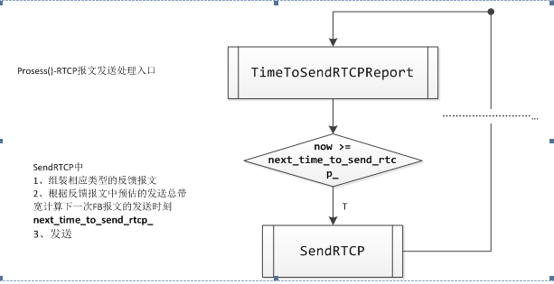
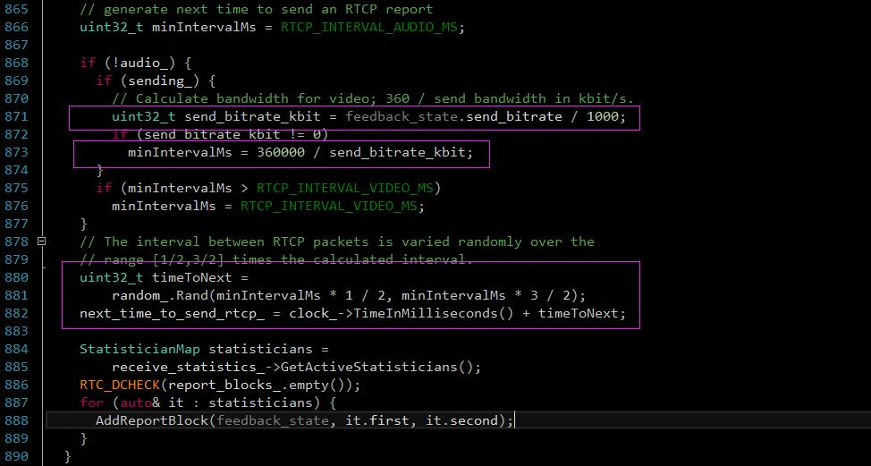

 
<!--BEGIN_DATA
{
    "create_date": "2019-12-06 16:35", 
    "modify_date": "2019-12-06 16:35", 
    "is_top": "0", 
    "summary": "实时传输协议RTP/RTCP及源码分析", 
    "tags": "WebRTC、C/C++", 
    "file_name": "实时传输协议RTP/RTCP及源码分析.md"
}
END_DATA-->

####<p>原文出处：<a href='https://www.jianshu.com/p/631273bc9847' target='blank'>实时传输协议RTP/RTCP</a></p>

####一、 简介

目前，在IP网络中实现实时语音、视频通信和应用已经成为网络应用的一个主流技术和发展方向，本文详细介绍IP协议族中用于实时语音、视频数据传输的标准协议**RTP（ Real-time Transport Protocol）和RTCP（RTP Control Ptotocol）**的主要功能。


RTP标准定义了两个子协议，RTP和RTCP

**数据传输协议RTP**，用于实时传输数据。该协议提供的信息包括：时间戳（用于同步）、序列号（用于丢包和重排序检测）、以及负载格式（用于说明数据的编码格式）。  
**控制协议RTCP**，用于QoS反馈和同步媒体流。相对于RTP来说，RTCP所占的带宽非常小，通常只有5%。

> **为什么要使用RTP？**  
一提到流媒体传输、一谈到什么视频监控、视频会议、语音电话（VOIP），都离不开RTP协议的应用，但当大家都根据经验或者别人的应用而选择RTP协议的时候，你可曾想过，为什么我们要使用RTP来进行流媒体的传输呢？为什么我们一定要用RTP？难道TCP、UDP或者其他的网络协议不能达到我们的要求么？  
**像TCP这样的可靠传输协议，通过超时和重传机制来保证传输数据流中的每一个bit的正确性，但这样会使得无论从协议的实现还是传输的过程都变得非常的复杂**。而且，当传输过程中有数据丢失的时候，由于对数据丢失的检测（超时检测）和重传，会数据流的传输被迫暂停和延时。  
或许你会说，**我们可以利用客户端构造一个足够大的缓冲区来保证显示的正常，这种方法对于从网络播放音视频来说是可以接受的**，但是对于一些需要实时交互的场合（如视频聊天、视频会议等），如果这种缓冲超过了200ms，将会产生难以接受的实时性体验。

**那为什么RTP可以解决上述问题呢？**  
**RTP协议是一种基于UDP的传输协议，RTP本身并不能为按顺序传送数据包提供可靠的传送机制，也不提供流量控制或拥塞控制，它依靠RTCP提供这些服务**。这样，对于那些丢失的数据包，不存在由于超时检测而带来的延时，同时，对于那些丢弃的包，也可以由上层根据其重要性来选择性的重传。比如，对于I帧、P帧、B帧数据，由于其重要性依次降低，故在网络状况不好的情况下，可以考虑在B帧丢失甚至P帧丢失的情况下不进行重传，这样，在客户端方面，虽然可能会有短暂的不清晰画面，但却保证了实时性的体验和要求。

####二、RTP解析

#####RTP的工作机制：

当应用程序建立一个RTP会话时，应用程序将确定一对目的传输地址。目的传输地址由一个网络地址和一对端口组成，有两个端口：一个给RTP包，一个给RTCP包，使得RTP/RTCP数据能够正确发送。RTP数据发向偶数的UDP端口，而对应的控制信号RTCP数据发向相邻的奇数UDP端口（偶数的UDP端口＋1），这样就构成一个UDP端口对。 RTP的发送过程如下，接收过程则相反。

>   1. RTP协议从上层接收流媒体信息码流（如H.263），封装成RTP数据包；RTCP从上层接收控制信息，封装成RTCP控制包.

>   2. RTP将RTP 数据包发往UDP端口对中偶数端口；RTCP将RTCP控制包发往UDP端口对中的奇数端口。

RTP分组只包含RTP数据，而控制是由RTCP协议提供。RTP在1025到65535之间选择一个未使用的偶数UDP端口号，而在同一次会话中的RTCP则使用下
一个奇数UDP端口号。端口号5004和5005分别用作RTP和RTCP的默认端口号。RTP分组的首部格式如图2所示，其中前12个字节是必须的。

#####应用层的一部分

从应用开发者的角度看，RTP 应当是应用层的一部分。在应用的发送端，开发者必须编写用 RTP 封装分组的程序代码，然后把 RTP 分组交给 UDP
插口接口。在接收端，RTP 分组通过 UDP 插口接口进入应用层后，还要利用开发者编写的程序代码从 RTP 分组中把应用数据块提取出来。

#######RTP报文头的内容


  
**版本号（V）**：2比特，用来标志使用的RTP版本。

**填充位（P）**：1比特，如果该位置位，则该RTP包的尾部就包含附加的填充字节。

**扩展位（X）**： 1比特，如果该位置位的话，RTP固定头部后面就跟有一个扩展头部。

**CSRC计数器（CC）**：4比特，含有固定头部后面跟着的CSRC的数目。

**标记位（M）**： 1比特,该位的解释由配置文档（Profile）来承担.

**载荷类型（PayloadType）**： 7比特，标识了RTP载荷的类型。

**序列号（SN）**：16比特，每发送一个 RTP 数据包，序列号增加1。接收端可以据此检测丢包和重建包序列。

**时间戳(Timestamp)**: 2比特，记录了该包中数据的第一个字节的采样时刻。在一次会话开始时，时间戳初始化成一个初始值。即使在没有信号发送时，时间戳的数值也要随时间而不断地增加（时间在流逝嘛）。时钟频率依赖于负载数据格式，并在描述文件（profile）中进行描述。

**同步源标识符(SSRC)**：32比特，同步源就是指RTP包流的来源。在同一个RTP会话中不能有两个相同的SSRC值。该标识符是随机选取的 RFC1889推荐了MD5随机算法。

**贡献源列表（CSRC List）**：0～15项，每项32比特，用来标志对一个RTP混合器产生的新包有贡献的所有RTP包的源。由混合器将这些有贡献的SSRC标识符插入表中。SSRC标识符都被列出来，以便接收端能正确指出交谈双方的身份。

#####RTP的会话过程

当应用程序建立一个RTP会话时，**应用程序将确定一对目的传输地址**。目的传输地址由一个网络地址和一对端口组成，有两个端口：**一个给RTP包，一个给RTCP包，使得RTP/RTCP数据能够正确发送**。RTP数据发向偶数的UDP端口，而对应的控制信号RTCP数据发向相邻的奇数UDP端口（偶数的UDP端口＋1），这样就构成一个UDP端口对。

######RTP的发送过成如下，接收过程相反

>   1. RTP协议从上层接收流媒体信息码流（如H.263），封装成RTP数据包；RTCP从上层接收控制信息，封装成RTCP控制包。

>   2. RTP将RTP 数据包发往UDP端口对中偶数端口；RTCP将RTCP控制包发往UDP端口对中的接收端口。

#####RTP的profile机制

RTP为具体的应用提供了非常大的灵活性，它将传输协议与具体的应用环境、具体的控制策略分开，传输协议本身只提供完成实时传输的机制，开发者可以根据不同的应用环境，自主选择合适的配置环境、以及合适的控制策略。

这里所说的控制策略指的是**你可以根据自己特定的应用需求，来实现特定的一些RTCP控制算法，比如前面提到的丢包的检测算法、丢包的重传策略、一些视频会议应用中的控制方案等等**（这些策略我可能将在后续的文章中进行描述）。

对于上面说的合适的配置环境，主要是指RTP的相关配置和负载格式的定义。RTP协议为了广泛地支持各种多媒体格式（如 H.264, MPEG-4, MJPEG, MPEG），没有在协议中体现出具体的应用配置，而是通过profile配置文件以及负载类型格式说明文件的形式来提供。

> 说明：如果应用程序不使用专有的方案来提供有效载荷类型(payload type)、顺序号或者时间戳，而是使用标准的RTP协议，应用程序就更容易与其他的网络应用程序配合运行，这是大家都希望的事情。例如，如果有两个不同的公司都在开发因特网电话软件，他们都把RTP合并到他们的产品中，这样就有希望：使用不同公司电话软件的用户之间能够进行通信。

####RTCP的封装

RTCP的主要功能：**服务质量的监视与反馈、媒体间的同步，以及多播组中成员的标识**。在RTP会话期 间，各参与者周期性地传送RTCP包。RTCP包中含有已发送的数据包的数量、丢失的数据包的数量等统计资料，因此，**各参与者**可以利用这些信息动态地改变传输速率，甚至改变有效载荷类型。RTP和RTCP配合使用，它们能以有效的反馈和最小的开销使传输效率最佳化，因而特别适合传送网上的实时数据。

RTCP也是用UDP来传送的，但RTCP封装的仅仅是一些控制信息，因而分组很短，所以可以将多个RTCP分组封装在一个UDP包中。

根据所携带的控制信息不同RTCP信息包可分为RR（接收者报告包）、SR（源报告包）、SEDS（源描述包）、BYE（离开申明）和APP（特殊应用包）五类5类：

####RTCP传输间隔

由于RTP设计成允许应用自动扩展，可从几个人的小规模系统扩展成上千人的大规模系统。由于每个对话成员定期发送RTCP信息包，随着参加者不断增加，RTCP信息包频繁发送将占用过多的网络资源，为了防止拥塞，必须限制RTCP信息包的流量，控制信息所占带宽一般不超过可用带宽的 5%，因此就需要调整RTCP包的发送速率。**由于任意两个RTP终端之间都互发RTCP包，因此终端的总数很容易估计出来，应用程序根据参加者总数就可以调整RTCP包的发送速率**

####RTP/RTCP的不足之处

RTP与RTCP相结合虽然保证了实时数据的传输，但也有自己的缺点。最显著的是当有许多用户一起加入会话进程的时候，由于每个参与者都周期发送RTCP信息包，导致RTCP包泛滥(flooding)。

> 参考自 [RTP与RTCP协议详解](https://my.oschina.net/u/727148/blog/300029) 开源中国


<hr>


####<p>原文出处：<a href='https://www.jianshu.com/p/c84be6f3ddf3' target='blank'>WebRTC中RTP/RTCP协议实现分析</a></p>

####一 前言

RTP/RTCP协议是流媒体通信的基石。RTP协议定义流媒体数据在互联网上传输的数据包格式，而RTCP协议则负责可靠传输、流量控制和拥塞控制等服务质量保证。
在WebRTC项目中，RTP/RTCP模块作为传输模块的一部分，负责对发送端采集到的媒体数据进行进行封包，然后交给上层网络模块发送；在接收端RTP/RTCP模块收到上层模块的数据包后，进行解包操作，最后把负载发送到解码模块。因此，RTP/RTCP 模块在WebRTC通信中发挥非常重要的作用。

本文在深入研究WebRTC源代码的基础上，以Video数据的发送和接收为例，力求用简洁语言描述RTP/RTCP模块的实现细节，为进一步深入掌握WebRTC打下良好基础。

####二 RTP/RTCP协议概述
 
RTP协议是Internet上针对流媒体传输的基础协议，该协议详细说明在互联网上传输音视频的标准数据包格式。RTP协议本身只保证实时数据的传输，RTCP协议则负责流媒体的传输质量保证，提供流量控制和拥塞控制等服务。在RTP会话期间，各参与者周期性彼此发送RTCP报文。报文中包含各参与者数据发送和接收等统计信息，参与者可以据此动态控制流媒体传输质量。

RFC3550 [1]定义RTP/RTCP协议的基本内容，包括报文格式、传输规则等。除此之外，IETF还定义一系列扩展协议，包括RTP协议基于档次的扩展，和RTCP协议基于报文类型的扩展，等等。详细内容可参考文献[2]。</br>

####三 WebRTC线程关系和数据流

WebRTC对外提供两个线程：Signal和Worker，前者负责信令数据的处理和传输，后者负责媒体数据的处理和传输。在WebRTC内部，有一系列线程各司其职，相互协作完成数据流管线。下面以Video数据的处理流程为例，说明WebRTC内部的线程合作关系。


图1 WebRTC线程关系和数据管线

如图1所示，Capture线程从摄像头采集原始数据，得到VideoFrame；Capture线程是系统相关的，在Linux系统上可能是调用V4L2接口的线程，而在Mac系统上可能是调用AVFoundation框架的接口。接下来原始数据VideoFrame从Capture线程到达Worker线程，Worker线程
起搬运工的作用，没有对数据做特别处理，而是转发到Encoder线程。Encoder线程调用具体的编码器(如VP8, H264)对原始数据VideoFrame进行编码，编码后的输出进一步进行RTP封包形成RTP数据包。然后RTP数据包发送到Pacer线程进行平滑发送，Pacer线程会把RTP数据包推送到Network线程。最终Network线程调用传输层系统函数把数据发送到网络。

在接收端，Network线程从网络接收字节流，接着Worker线程反序列化为RTP数据包，并在VCM模块进行组帧操作。Decoder线程对组帧完成的数据帧进行解码操作，解码后的原始数据VideoFrame会推送到IncomingVideoStream线程，该线程把VideoStream投放到render进行渲染显示。至此，一帧视频数据完成从采集到显示的完整过程。

在上述过程中，RTP数据包产生在发送端编码完成后，其编码输出被封装为RTP报文，然后经序列化发送到网络。在接收端由网络线程收到网络数据包后，经过反序列化还原成RTP报文，然后经过解包得到媒体数据负载，供解码器进行解码。RTP报文在发送和接收过程中，会执行一系列统计操作，统计结果作为数据源供构造RTCP报文之用。RTP报文构造、发送/接收统计和RTCP报文构造、解析反馈，是接下来分析的重点。</br>

####四 RTP报文发送和接收

RTP报文的构造和发送发生在编码器编码之后、网络层发送数据包之前，而接收和解包发生在网络层接收数据之后、解码器编码之前。本节详细分析这两部分的内容。

#####4.1 RTP报文构造和发送

图2描述发送端编码之后RTP报文的构造和发送过程，涉及三个线程：Encoder、Pacer和Network，分别负责编码和构造RTP报文，平滑发送和传输层发送。下面详细描述这三个线程的协同工作过程。


图2 RTP报文构造和发送

Encode线程调用编码器(比如VP8)对采集到的Raw VideoFrame进行编码，编码完成以后，其输出EncodedImage通过回调到达VideoSendStream::Encoded()函数，进而通过PayloadRouter路由到ModuleRtpRtcpImpl::SendOutgoingData()。接下来，该函数向下调用RtpSender::SendOutgoingData()，进而调用RtpSenderVideo::SendVideo()。该函数对EncodedImage进行打包，然后填充RTP头部构造RTP报文；如果配置了FEC，则进一步封装为FEC报文。最后返回RtpSender::SendToNetwork()进行下一步发送。

RtpSender::SendToNetwork()函数把报文存储到RTPPacketHistory结构中进行缓存。接下来如果开启PacedSending，则构造Packe发送到PacedSender进行排队，否则直接发送到网络层。

Pacer线程周期性从队列中获取Packet，然后调用PacedSender::SendPacket()进行发送，接下来经过ModuleRtpRtcpImpl到达RtpSender::TimeToSendPacket()。该函数首先从RtpPacketHistory缓存中拿到Packet的负载，然后调用PrepareAndSendPacket()函数：更新RtpHeader的相关域，统计延迟和数据包，调用SendPacketToNetwork()把报文发送到传输模块。

Network线程则调用传输层套接字执行数据发送操作。至此，发送端的RTP构造和发送流程完成。需要注意的是，在RtpSender中进行Rtp发送后，会统计RTP报文相关信息。这些信息作为RTCP构造SR/RR报文的数据来源，因此非常重要。

#####4.2 RTP报文接收和解析

在接收端，RTP报文的接收和解包操作主要在Worker线程中执行，RTP报文从Network线程拿到后，进入Worker线程，经过解包操作，进入VCM模块，由Decode线程进行解码，最终由Render线程进行渲染。下图3描述RTP报文在Worker线程中的处理流程。


图3 RTP报文接收和解析

RTP数据包经网络层到达Call对象，根据其SSRC找到对应的VideoReceiveStream，通过调用其DeliverRtp()函数到RtpStreamReceiver::DeliverRtp()。该函数首先解析数据包得到RTP头部信息，接下来执行三个操作：1.码率估计；2.继续发送数据包；3.接收统计。
码率估计模块使用GCC算法估计码率，构造REMB报文，交给RtpRtcp模块发送回发送端。而接收统计则统计RTP接收信息，这些信息作为RTCPRR报文的数据来源。下面重点分析接下来的数据包发送流程。</br>

RtpStreamReceiver::ReceivePacket()首先判断数据包是否是FEC报文，如果是则调用FecReceiver进行解包，否则直接调用RtpReceiver::IncomingRtpPacket()。该函数分析RTP报文得到通用的RTP头部描述结构，然后调用RtpReceiverVideo::ParseRtpPacket()进一步得到Video相关信息和负载，接着经过回调返回RtpStreamReceiver对象。该对象把Rtp描述信息和负载发送到VCM模块，继续接下来的JitterBuffer缓存和解码渲染操作。</br>

RTP报文解包过程是封包的逆过程，重要的输出信息是RTP头部描述和媒体负载，这些信息是下一步JitterBuffer缓存和解码的基础。另外对RTP报文进行统计得到的信息则是RTCP RR报文的数据来源。

####五 RTCP报文发送和接收
 
RTCP协议是RTP协议的控制下可以，负责流媒体的服务质量保证。比较常用的RTCP报文由发送端报告SR和接收端报告RR，分别包含数据发送统计信息和数据接收信息。这些信息对于流媒体质量保证非常重要，比如码率控制、负载反馈，等等。其他RTCP报文还有诸如SDES、BYE、SDES等，RFC3550对此有详细定义。

本节重点分析WebRTC内部RTCP报文的构造、发送、接收、解析、反馈等流程。需要再次强调的是，RTCP报文的数据源来自RTP报文发送和接收时的统计信息。在WebRTC内部，RTCP报文的发送采取周期性发送和及时发送相结合的策略：ModuleProcess线程周期性发送RTCP报文；而RtpSender则在每次发送RTP报文之前都判断是否需要发送RTCP报文；另外在接收端码率估计模块构造出REMB报文后，通过设置超时让ModuleProcess模块立即发送RTCP报文。

#####5.1 RTCP报文构造和发送

在发送端，RTCP以周期性发送为基准，辅以RTP报文发送时的及时发送和REMB报文的立即发送。发送过程主要包括Feedback信息获取、RTCP报文构造、序列化和发送。图4描述了RTCP报文的构造和发送过程。


图4 RTCP报文构造和发送

ModuleProcess线程周期性调用ModuleRtpRtcpImpl::Process()函数，该函数通过RTCPSender::TimeToSendRtcpReport()函数确定当前是否需要立即发送RTCP报文。若是，则首先从RTPSender::GetDataCounters()获取RTP发送统计信息，然后调用RTCPSender::SendRTCP()，接着是SendCompoundRTCP()发送RTCP组合报文。关于RTCP组合报文的定义，请参考文献[1]。

在SendCompoundRTCP()函数中，首先通过PrepareReport()确定将要发送何种类型的RTCP报文。然后针对每一种报文，调用其构造函数(如构造SR报文为BuildSR()函数)，构造好的报文存储在PacketContainer容器中。最后调用SendPackets()进行发送。

接下来每种RTCP报文都会调用各自的序列化函数，把报文序列化为网络字节流。最后通过回调到达PacketContainer::OnPacketReady()，最终把字节流发送到传输层模块：即通过TransportAdapter到达BaseChannel，Network线程调用传输层套接字API发送数据到网络。

RTCP报文的构造和发送过程总体不是很复杂，最核心的操作就是获取数据源、构造报文、序列化和发送。相对来说构造报文和序列化比较繁琐，基于RFC定义的细节进行。

#####5.2 RTCP报文接收和解析

接收端的RTCP报文接收和解析过程如图5所示。##


图5 RTCP报文接收和解析

在接收端，RTCP报文的接收流程和RTP一样，经过网络接收之后到达Call对象，进而通过SSRC找到VideoReceiveStream，继而到达RtpStreamReceiver。接下来RTCP报文的解析和反馈操作都在ModuleRtpRtcpImpl::IncomingRtcpPacket()函数中完成。该函数首先调用RTCPReceiver::IncomingRtcpPacket()解析RTCP报文，得到RTCPPacketInformation对象，然后调用 TriggerCallbacksFromRTCPPacket()，触发注册在此处的各路观察者执行回调操作。

RTCPReceiver::IncomingRtcpPacket()使用RTCPParser解析组合报文，针对每一种报文类型，调用对应的处理函数(如处理SDES的HandleSDES函数)，反序列化后拿到报文的描述结构。最后所有报文综合在一起形成RTCPPacketInformation对象。该对象接下来作为参数调用TriggerCallbacksFromRTCPPacket()函数触发回调操作，如处理NACK的回调，处理SLI的回调，处理REMB的回调，等等。这些回调在各自模块控制流媒体数据的编码、发送、码率等服务质量保证，这也是RTCP报文最终起作用的地方。

至此，我们分析了RTCP报文发送和接收的整个流程。

####六 总结

本文在深入分析WebRTC源代码的基础上，结合流程图描述出RTP/RTCP模块的实现流程，在关键问题上(如RTCP报文的数据来源)进行深入细致的研究。为进一步深入掌握WebRTC的实现原理和细节打下良好基础。</br>  
</br>

####参考文献

[1] RFC3550 - RTP: A Transport Protocol for Real-Time Applications  
[https://www.ietf.org/rfc/rfc3550.txt](https://link.jianshu.com?t=https://www.ietf.org/rfc/rfc3550.txt)  
[2] 超越RFC3550 － RTP/RTCP协议族分析 : [http://www.jianshu.com/p/e5e21aeb219f](https://www.jianshu.com/p/e5e21aeb219f)


<hr>

 

####<p>原文出处：<a href='https://blog.csdn.net/DittyChen/article/details/78065974' target='blank'>RTCP介绍及发送间隔控制</a></p>

RTP实时传输协议，广泛应用于流媒体传输应用场景，根据rfc3550介绍，RTP协议应用场景有如下几种：

Ø  简单多播音频会议（Simple Multicast Audio Conference）

Ø  音频和视频会议（Audioand Video Conference）

Ø  混频器和转换器（MixersandTranslators）

Ø  分层编码（LayeredEncodings）

在实时音视频应用场合，考虑低延迟问题一般都使用RTP over UDP进行流媒体数据的传输，因此对于丢包、延迟、流畅性的考虑，发送端必须了解发送出去的流媒体数据到达对端的统计信息，RTP 控制协议 RTCP，就是用于监控服务质量和传达关于在一个正在进行的会议中的参与者的信息，包括对抗卡顿、网络拥塞控制扩展功能的实现，均利用RTCP报文实现，有名的是Google的GCC（拥塞控制算法(Google Congestion Control,简称GCC[1])）），RTCP的Nack、fir、pli报文都是实现抗丢包的策略，详细可查看rfc4585；

####2、RFC3550中关于RTCP的介绍

#####2.1、基本场景介绍

RTP 控制协议(RTCP)向会议中所有成员周期性发送控制包。它使用与数据包相同的传输机制。底层协议必须提供数据包和控制包的复用，例如用不同的 UDP 端口或相同的UDP端口（采用复用模式下）。RTCP 提供以下四个功能：

Ø  **基本功能是提供数据传输质量的反馈；**

这是 RTP 作为一种传输协议的主要作用，它与其他协议的流量和拥塞控制相关。反馈可能对自适应编码有直接作用，并且 IP 组播的实验表明它对于从接收端得到反馈信息以诊断传输故障也有决定性作用。向所有成员发送接收反馈可以使"观察员"评估这些问题是局部的还是全局的。利用类似多点广播的传输机制，可以使某些实体，诸如没有加入会议的网络业务观察员，接收到反馈信息并作为第三方监视员来诊断网络故障。反馈功能通过 RTCP 发送者和接收者报告实现。

Ø  **RTCP 为每个 RTP 源传输一个固定的识别符，称为规范名（CNAME）；**

由于当发生冲突或程序重启时 SSRC可能改变，接收者要用 CNAME 来跟踪每个成员。接收者还要用 CNAME 来关联一系列相关 RTP 会话中来自同一个成员的多个数据流，例如同步语音和图像。

Ø  **1和2功能要求参与方都发送RTCP报文，为保证会议参与方增长，必须严格控制发送包速率，避免过多占用本端带宽，导致视频质量差；**

通过让每个成员向所有成员发送控制包，各个成员都可以独立地观察会议中所有成员的数目。此数目可以用来估计发包速率。

Ø  **传输最少的会议控制信息；**

例如在用户接口中显示参与的成员。这最可能在"松散控制"的会议中起作用，在"松散控制"会议里，成员可以不经过资格控制和参数协商而加入或退出会议。

#####2.2、包格类型介绍

<div class="table-box"><table border="1" cellspacing="0" cellpadding="0"><tbody><tr><td valign="top">
<p><strong>类型</strong></p>
</td>
<td width="138" colspan="2" valign="top">
<p><strong>类型简称</strong></p>
</td>
<td valign="top">
<p><strong>描述</strong></p>
</td>
<td valign="top">
<p><strong>RFC文档</strong></p>
</td>
</tr><tr><td valign="top" style="background:#C0C0C0;">
<p><strong><span style="color:#FF0000;">192</span></strong></p>
</td>
<td width="138" colspan="2" valign="top" style="background:#C0C0C0;">
<p><span style="color:#FF0000;">FIR</span></p>
</td>
<td valign="top" style="background:#C0C0C0;">
<p><span style="color:#FF0000;">关键帧重传请求（</span><span style="color:#FF0000;">IDR</span><span style="color:#FF0000;">帧，无需参考帧可解码）</span></p>
</td>
<td valign="top" style="background:#C0C0C0;">
<p><span style="color:#FF0000;">RFC2032</span></p>
</td>
</tr><tr><td valign="top">
<p><strong><span style="color:#FF0000;">193</span></strong></p>
</td>
<td width="138" colspan="2" valign="top">
<p><span style="color:#FF0000;">NACK</span></p>
</td>
<td valign="top">
<p><span style="color:#FF0000;">否定确认，</span><span style="color:#FF0000;">NACK</span><span style="color:#FF0000;">重传（丢包）</span></p>
</td>
<td valign="top">
<p><span style="color:#FF0000;">RFC2032</span></p>
</td>
</tr><tr><td valign="top" style="background:#C0C0C0;">
<p><strong>194</strong></p>
</td>
<td width="138" colspan="2" valign="top" style="background:#C0C0C0;">
<p>SMPTETC</p>
</td>
<td valign="top" style="background:#C0C0C0;">
<p>SMPTE time-code 映射</p>
</td>
<td valign="top" style="background:#C0C0C0;">
<p>RFC5484</p>
</td>
</tr><tr><td valign="top">
<p><strong>195</strong></p>
</td>
<td width="138" colspan="2" valign="top">
<p>IJ</p>
</td>
<td valign="top">
<p>extended inter-arrival jitter report.</p>
</td>
<td valign="top">
<p>RFC5450</p>
</td>
</tr><tr><td valign="top" style="background:#C0C0C0;">
<p><strong><span style="color:#FF0000;">200</span></strong></p>
</td>
<td width="138" colspan="2" valign="top" style="background:#C0C0C0;">
<p><span style="color:#FF0000;">SR</span></p>
</td>
<td valign="top" style="background:#C0C0C0;">
<p><span style="color:#FF0000;">发送者报告，描述作为活跃发送者成员的发送和接收统计数字</span></p>
</td>
<td valign="top" style="background:#C0C0C0;">
<p><span style="color:#FF0000;">RFC3550</span></p>
</td>
</tr><tr><td valign="top">
<p><strong><span style="color:#FF0000;">201</span></strong></p>
</td>
<td width="138" colspan="2" valign="top">
<p><span style="color:#FF0000;">RR</span></p>
</td>
<td valign="top">
<p><span style="color:#FF0000;">接收者报告，描述非活跃发送者成员的接收统计数字；</span></p>
</td>
<td valign="top">
<p><span style="color:#FF0000;">RFC3550</span></p>
</td>
</tr><tr><td valign="top" style="background:#C0C0C0;">
<p><strong>202</strong></p>
</td>
<td width="138" colspan="2" valign="top" style="background:#C0C0C0;">
<p>SDES</p>
</td>
<td valign="top" style="background:#C0C0C0;">
<p>源描述项，其中包括规范名 CNAME。</p>
</td>
<td valign="top" style="background:#C0C0C0;">
<p>RFC3550</p>
</td>
</tr><tr><td valign="top">
<p><strong>203</strong></p>
</td>
<td width="138" colspan="2" valign="top">
<p>BYE</p>
</td>
<td valign="top">
<p>表明参与者将结束会话。</p>
</td>
<td valign="top">
<p>RFC3550</p>
</td>
</tr><tr><td valign="top" style="background:#C0C0C0;">
<p><strong>204</strong></p>
</td>
<td width="138" colspan="2" valign="top" style="background:#C0C0C0;">
<p>APP</p>
</td>
<td valign="top" style="background:#C0C0C0;">
<p>应用描述功能</p>
</td>
<td valign="top" style="background:#C0C0C0;">
<p>RFC3550</p>
</td>
</tr><tr><td valign="top">
<p><strong>205</strong></p>
</td>
<td width="138" colspan="2" valign="top">
<p>RTPFB</p>
</td>
<td valign="top">
<p>通用RTP反馈</p>
</td>
<td valign="top">
<p>RFC4585</p>
</td>
</tr><tr><td rowspan="3" valign="top" style="background:#C0C0C0;">
<p><strong><span style="color:#FF0000;">&nbsp;</span></strong></p>
<p><strong><span style="color:#FF0000;">206</span></strong></p>
</td>
<td rowspan="3" valign="top" style="background:#C0C0C0;">
<p align="center"><span style="color:#FF0000;">&nbsp;</span></p>
<p><span style="color:#FF0000;">PSFB</span></p>
</td>
<td valign="top" style="background:#C0C0C0;">
<p><span style="color:#FF0000;">PLI</span></p>
</td>
<td rowspan="3" valign="top" style="background:#C0C0C0;">
<p><span style="color:#FF0000;">&nbsp;</span></p>
<p><span style="color:#FF0000;">有效载荷比</span></p>
</td>
<td rowspan="3" valign="top" style="background:#C0C0C0;">
<p><span style="color:#FF0000;">&nbsp;</span></p>
<p><span style="color:#FF0000;">RFC4585</span></p>
</td>
</tr><tr><td valign="top" style="background:#C0C0C0;">
<p><span style="color:#FF0000;">SLI</span></p>
</td>
</tr><tr><td valign="top" style="background:#C0C0C0;">
<p><span style="color:#FF0000;">RPSI</span></p>
</td>
</tr><tr><td valign="top">
<p><strong>207</strong></p>
</td>
<td width="138" colspan="2" valign="top">
<p>XR</p>
</td>
<td valign="top">
<p>RTCP扩展</p>
</td>
<td valign="top">
<p>RFC3611</p>
</td>
</tr><tr><td valign="top" style="background:#C0C0C0;">
<p><strong>208</strong></p>
</td>
<td width="138" colspan="2" valign="top" style="background:#C0C0C0;">
<p>AVB</p>
</td>
<td valign="top" style="background:#C0C0C0;">
<p>AVB RTCP数据包</p>
</td>
<td valign="top" style="background:#C0C0C0;">
<p>IEEE1733</p>
</td>
</tr><tr><td valign="top">
<p><strong>209</strong></p>
</td>
<td width="138" colspan="2" valign="top">
<p>RSI</p>
</td>
<td valign="top">
<p>接收端汇总信息</p>
</td>
<td valign="top">
<p>RFC5760</p>
</td>
</tr><tr><td valign="top" style="background:#C0C0C0;">
<p><strong>&nbsp;</strong></p>
</td>
<td width="138" colspan="2" valign="top" style="background:#C0C0C0;">
<p>&nbsp;</p>
</td>
<td valign="top" style="background:#C0C0C0;">
<p>&nbsp;</p>
</td>
<td valign="top" style="background:#C0C0C0;">
<p>&nbsp;</p>
</td>
</tr></tbody></table></div>

注：其中206Type的PSFB中又拥有三个子项，详见rfc4585第六章

PSFB（Payload-Specific FB）消息被定义为载荷类型为PSFB的RTCP消息；

PLI：The PLI FB messageis identified by PT=PSFB and FMT=1. Picture Loss
Indication，为整个图像帧丢失后发送

SLI：The SLI FB messageis identified by PT=PSFB and FMT=2. Slice Loss
Indication，为帧内部分块损坏后发送

RPSI：The RPSI FB messageis identified by PT=PSFB and FMT=3. Reference Picture Selection Indication


其中各种类型报文均有用途，一般使用中各种类型有如下用途：

**I 、关键帧请求**

主要包括SLI／PLI／FIR，集中报文手段，目的是在关键帧丢失无法解码时，请求发送方重新生成并发送一个关键帧。本质是一种重传，但是跟传输层的重传的区别是，它重传是最新生成的帧。

PLI 是Picture LossIndication，SLI 是Slice Loss Indication。发送方接收到接收方反馈的PLI或SLI需要重新让编码器生成关键帧并发送给接收端。

FIR 是Full Intra Request，这里面Intra的含义可能很多人不知道。Intra的含义是图像内编码，不需要其他图像信息即可解码；Inter 指图像间编码，解码需要参考帧。故Intra Frame其实就是指I帧，Inter Frame指P帧或B帧。

那么为什么在PLI和SLI之外还需要一个FIR呢？原因是使用场景不同，FIR更多是在一个中心化的Video Conference中，新的参与者加入，就需要发送一个FIR，其他的参与者给他发送一个关键帧这样才能解码，而PLI和SLI的含义更多是在发生丢包或解码错误时使用。


**II 、重传请求**

主要包括RTX／NACK／RPSI

这个重传跟关键帧请求的区别是它可以要求任意帧进行重传

**III、码率控制**

主要包括REMB／TMMBR／TMMBN

TMMBR是Temporal Max MediaBitrate Request，表示临时最大码率请求。表明接收端当前带宽受限，告诉发送端控制码率。

REMB是ReceiverEstimatedMax Bitrate，接收端估计的最大码率。

TMMBN是Temporal Max MediaBitrate Notification

另外，除了关键帧请求和重传，Webrtc还支持RED／FEC等冗余编码和前向纠错手段来保证视频质量。

以上报文用途，摘录自<http://blog.csdn.net/wangruihit/article/details/47041515>的博客；

#####2.3、RTCP传输时间间隔

为保证会议参与方人数稳定上升，必须对RTCP报文带宽进行管理控制，如一个上千人的会议，就必须对这个进行管理考虑，否则单端带宽占用严重，但对于MCU集中混屏会议来说，客户端不需要做这点，需要服务器去做。

RTP 被设计为允许应用自动适应不同的规模的会话――从几个参与者到几千个参与者的会话。对每一个会话，我们假定数据传输受到一个上限――会话带宽的限制。会话带宽分配给所有的参与者。这个带宽会被预留，并由网络所限制。如果没有预留，基于环境的其他约束将会确定合理的最大带宽供会话使用，这就是会话带宽。会话带宽在一定程度上独立于媒体编码，但媒体编码却依赖于会话带宽。

此参数由单个发送者选择的编码方式的数据带宽算出。会话管理可能会基于多播范围的规则或其他标准确定带宽限制。所有的参与者应使用相同的会话带宽值以保证计算出相同的 RTCP 间隔。

控制传输带宽应当是会话带宽的一小部分，这部分所占总的会话带宽的百分比应是已知的一小部分；

传输协议的首要功能是传输数据；已知：控制传输带可以被放进带宽描述中提供给资源预留协议，并且使每个参与者都可以独立的计算出他所占有的带宽份额。

控制传输带宽作为额外的一部分加入到会话带宽中。建议 RTCP 控制传输带宽为 RTCP 会话带宽的 5%。其中的 1/4 分配给发送者；当发送者的比例超过所有参与者的 1/4 时，其 RTCP 控制带宽相应增加。所有的会话参与者必须使用相同的常数（以上提到的百分比），以便计算出相同的发送时间间隔。这些常数应在一个特殊的描述文件中确定。

计算出的 RTCP 复合包的发送时间间隔应该有一个下限，以免参与者数量较少时大量发送 RTCP 包。这也使网络暂时断开时，发送间隔不会太小。在应用开始时，一个延迟应加到第一个的 TCP 复合包发送之前，以便从其他参与者接收 RTCP 复合包。这样，发送时间间隔能更快的收敛到正确的值。这个延迟可以设为最小时间间隔的一半。固定的时间间隔建议为 5 秒。

一个实现可能使 RTCP 最小发送时间间隔与会话带宽参数成比例，则应满足下列约束： 

1、对多播会话，只有活动的数据发送者使用减小的最小化的值计算 RTCP 复合包的发送时间间隔。

2、对单播会话，减小的值也可能被不是活动的数据发送者使用，发送初始的 RTCP 复合包之前的延迟可能是 0。

3、 对所有会话，在计算参与者的离开时间时，这个固定最小值会被用到。因此，不使用减小的值进行 RTCP包的发送，就不会被其他参与者提前宣布超时。

4、减小的最小时间间隔建议为：360/sb(秒)，其中 sb：会话带宽（千字节/秒）。当sb>72kb/s 时，最小时间间隔将小于 5s。

5、计算出的 RTCP 包的时间间隔与组中参与者的人数成正比。（参与者越多，发送时间间隔越长，每个参与者占有的 RTCP 带宽越小）。

6、 RTCP 包的（真实）时间间隔是计算出的时间间隔的 0.5～1.5 倍之间某个随机的值，以避免所有的参与者意外的同步。

7、RTCP 复合包的平均大小将会被动态估计，包括所有发送的包和接收的包。以自动适应携带的控制信息数量的变化。

8、由于计算出的时间间隔依赖于组中的人数。因此，当一个的用户加入一个已经存在的会话或者大量的用户几乎同时加入一个新的会话时，就会有意外的初始化效应。这些新
用户将在开始时错误的估计组中的人数（估计太小）。因此他们的 RTCP 包的发送时间间隔就会太短。如果许多用户同时加入一个会话，这个问题就很重要了。为了处理这
处问题考虑了一种叫“时间重估”的算法。这个算法使得组中人数增加时，用户能够支持 RTCP 包的传输。当有用户离开会话，不管是发送 BYE
包还是超时，组中的人数会减少。计算出的时间间隔也应当减少。

因此，应用“逆向重估”算法，使组中的成员更快的减少他们的时间间隔，以对组中的人数减少做出响应。

9、BYE 包的处理和其他 RTCP 包的处理不同。BYE 包的发送用到一个“放弃支持”算法。以避免大量的 BYE包同时发送，使大量参与者同时离开会话。

这个算法适用于所有参与者都允许 RTCP 包的情况。此时，会话带宽＝每个发送者的带宽×会话中参与者的总人数。

同时针对不同类型的RTCP报文，发送间隔时间不同，这样适应性更强，如语音包的反馈报文比视频包的间隔长，Tmmbr需立即发送，SSRC报文较短。

####3、WebRtc中RTCP报文发送控制

Webrtc中RTCP报文发送间隔控制是相当好的基本处理流程如下：



RTCPSender::TimeToSendRTCPReport(boolsendKeyframeBeforeRTP)接口中写道

对于音频，我们使用一个固定的5秒间隔。在带宽小于360 kbit/s时，视频使用1秒的时间间隔，在视频带宽低于10kbit/s时，表面上我们打破最大5%
RTCP 带宽限制，但那应该是非常罕见的。

**RFC3550写道**

最大的RTCP带宽应是会会话带宽的5%，一个SR报文在包含CNAME时，大约是65个字节，一个RR报文大约为28字节。

最小发送间隔的值推荐为360/会话带宽，发送间隔单位为秒，带宽单位为kbps，这个最低在带宽大于72 kb/s时，这个最小值小于5秒。如果参与者尚未发送RTCP包（包已经初始化），则常量Tmin设置为2.5秒，否则设置为5秒。

RTCP包的发送间隔是在[ 0.5,1.5 ]倍计算值之间随机变化的，避免所有参与者同步出现的意外情况

1\.   如果我们需要发送报文

参与者是发送者（we_sent为真），常数c设置为RTCP包大小平均值（avg\_rtcp\_size）除以RTCP带宽的25%（rtcp_bw），和常数n设置为发送的方数。

2\.   如果我们只接收报文

如果we_sent是不为真，常数c设置为RTCP包大小平均值（avg_rtcp_size）除以RTCP带宽的75%。常数n被设置为接收的方数（members - senders）。如果发件人senders的数量大于25%，senders和members一起处理。

>P2p不需要重新考虑
>
>“timer reconsideration”是使用的.该算法实现了一种简单的回退机制,会导致用户阻止RTCP包传输如果群体规模正在增加。
>
>N = number of members
>
>C = avg\_size /（rtcpbw / 4）

3\.   确定性计算区间Td设置为最大（Tmin，N×C）。

4\.   计算出的区间t被设置为均匀分布在确定计算区间的0.5到1.5倍之间的数。

5\.   由此产生的t值除以3 / 2 = 1.21828，弥补了定时器复议算法收敛到一个值低于预期的平均RTCP带宽



**位于rtcp_sender.cc中**

以下为WebRtc中计算法源码：

```
void RTCPSender::PrepareReport(const std::set<RTCPPacketType>& packetTypes,

                               const FeedbackState& feedback_state){

  // Add all flags as volatile. Non volatile entries will not be overwritten

  // and all new volatile flags added will be consumed by the end of this call.

  SetFlags(packetTypes, true);

 

  if (packet_type_counter_.first_packet_time_ms== -1)

    packet_type_counter_.first_packet_time_ms= clock_->TimeInMilliseconds();

 

  bool generate_report;

  if (IsFlagPresent(kRtcpSr)|| IsFlagPresent(kRtcpRr)){

    // Report type already explicitly set, don't automatically populate.

    generate_report = true;

    RTC_DCHECK(ConsumeFlag(kRtcpReport)== false);

  } else {

    generate_report =

        (ConsumeFlag(kRtcpReport)&& method_ == RtcpMode::kReducedSize)||

        method_ == RtcpMode::kCompound;

    if (generate_report)

      SetFlag(sending_? kRtcpSr : kRtcpRr, true);

  }

 

  if (IsFlagPresent(kRtcpSr)|| (IsFlagPresent(kRtcpRr)&& !cname_.empty()))

    SetFlag(kRtcpSdes, true);

 

  if (generate_report) {

    if (!sending_ && xr_send_receiver_reference_time_enabled_)

      SetFlag(kRtcpXrReceiverReferenceTime, true);

    if (feedback_state.has_last_xr_rr)

      SetFlag(kRtcpXrDlrrReportBlock, true);

 

    // generate next time to send an RTCP report

    uint32_t minIntervalMs = RTCP_INTERVAL_AUDIO_MS;

 

    if (!audio_) {

      if (sending_) {

        // Calculate bandwidth for video; 360 / send bandwidth in kbit/s.

        uint32_t send_bitrate_kbit = feedback_state.send_bitrate/ 1000;

        if (send_bitrate_kbit !=0)

          minIntervalMs =360000 / send_bitrate_kbit;

      }

      if (minIntervalMs > RTCP_INTERVAL_VIDEO_MS)

        minIntervalMs = RTCP_INTERVAL_VIDEO_MS;

    }

    // The interval between RTCP packets is varied randomly over the

    // range [1/2,3/2] times the calculated interval.

    uint32_t timeToNext =

        random_.Rand(minIntervalMs* 1 / 2, minIntervalMs * 3/ 2);

    next_time_to_send_rtcp_ = clock_->TimeInMilliseconds()+ timeToNext;

 

    StatisticianMap statisticians =

        receive_statistics_->GetActiveStatisticians();

    RTC_DCHECK(report_blocks_.empty());

    for (auto& it: statisticians){

      AddReportBlock(feedback_state, it.first, it.second);

    }

  }

}
```

<hr>


####<p>原文出处：<a href='https://www.jianshu.com/p/614229acd557' target='blank'>WebRTC RTP/RTCP 源码分析（一）：RTP 的发送</a></p>

####一、 RTP 发包的上层通知

  * PacedSender （最慢）每30ms就执行一次 Process()，即调用 PacketSender 发送。

	    // src/modules/pacing/paced_sender.cc
	    const int64_t kMaxIntervalTimeMs = 30;
	    bool PacedSender::SendPacket(const PacketQueueInterface::Packet& packet,
	                                 const PacedPacketInfo& pacing_info) {
	      const bool success = packet_sender_->TimeToSendPacket(
	         packet.ssrc, packet.sequence_number, packet.capture_time_ms,
	         packet.retransmission, pacing_info);
	    }
    

  * PacketSender 作为父类，其定义如下：
    
    
	    // src/modules/pacing/paced_sender.h
	    class PacketSender {
	     public:
	      virtual bool TimeToSendPacket(uint32_t ssrc,
	                                    uint16_t sequence_number,
	                                    int64_t capture_time_ms,
	                                    bool retransmission,
	                                    const PacedPacketInfo& cluster_info) = 0;
	      virtual size_t TimeToSendPadding(size_t bytes,
	                                       const PacedPacketInfo& cluster_info) = 0;
	     protected:
	      virtual ~PacketSender() {}
	    };
    

  * PacketRouter 继承了 PacketSender 并实现其虚函数。**PacedSender中调用的函数由此响应。** 此处通知了 RtpRtcp 来实现发送。

    
    
	    // src/modules/pacing/packet_router.h
	    class PacketRouter : public PacedSender::PacketSender,
	                         public TransportSequenceNumberAllocator,
	                         public RemoteBitrateObserver,
	                         public TransportFeedbackSenderInterface {};
	    // src/modules/pacing/packet_router.cc
	    bool PacketRouter::TimeToSendPacket(uint32_t ssrc,
	                                        uint16_t sequence_number,
	                                        int64_t capture_timestamp,
	                                        bool retransmission,
	                                        const PacedPacketInfo& pacing_info) {
	      return rtp_module->TimeToSendPacket(ssrc, sequence_number,
	                                          capture_timestamp, retransmission,
	                                          pacing_info);
	    }
    

  * RtpRtcp 作为父类，其定义如下：
    
    
	    // src/modules/rtp_rtcp/include/rtp_rtcp.h
	    class RtpRtcp : public Module, public RtcpFeedbackSenderInterface {
	      virtual bool TimeToSendPacket(uint32_t ssrc,
	                                    uint16_t sequence_number,
	                                    int64_t capture_time_ms,
	                                    bool retransmission,
	                                    const PacedPacketInfo& pacing_info) = 0;
	    };
    

  * ModuleRtpRtcpImpl 继承了 RtpRtcp，并实现其虚函数。此处通知 RTPSender 实现发送。

    
    
	    // src/modules/rtp_rtcp/source/rtp_rtcp_impl.h
	    class ModuleRtpRtcpImpl : public RtpRtcp, public RTCPReceiver::ModuleRtpRtcp {};
	    // src/modules/rtp_rtcp/source/rtp_rtcp_impl.cc
	    bool ModuleRtpRtcpImpl::TimeToSendPacket(uint32_t ssrc,
	                                             uint16_t sequence_number,
	                                             int64_t capture_time_ms,
	                                             bool retransmission,
	                                             const PacedPacketInfo& pacing_info) {
	      return rtp_sender_->TimeToSendPacket(ssrc, sequence_number, capture_time_ms,
	                                           retransmission, pacing_info);
	    }
    

####二、 RTP 发送的总体流程

  * RTPSender 负责发送 RTP 包， 其中的关键步骤：
  1. 从发送缓存取包，包括普通 RTP 包和 FEC 包
  2. 给 RTP 包添加头部扩展
  3. 通知 TransportFeedbackObserver 记录 RTP 包的发送时间
  4. 通知 SendPacketObserver 记录 RTP 发送延迟的 Stats
  5. 通知 Transport 发送 RTP 包

    
	    // src/modules/rtp_rtcp/source/rtp_sender.cc
	    bool RTPSender::TimeToSendPacket(uint32_t ssrc,
	                                     uint16_t sequence_number,
	                                     bool retransmission,
	                                     const PacedPacketInfo& pacing_info) {
	      // ...
	      // 从发送缓存队列获取要发送的包，若为 FEC 则另从 FEC 缓存队列获取
	      // ...
	      return PrepareAndSendPacket(
	          std::move(packet),
	          retransmission && (RtxStatus() & kRtxRetransmitted) > 0, retransmission,
	          pacing_info);
	    }
	    bool RTPSender::PrepareAndSendPacket(std::unique_ptr<RtpPacketToSend> packet,
	                                         bÂool send_over_rtx,
	                                         bool is_retransmit,
	                                         const PacedPacketInfo& pacing_info) {
	      // ...
	      // 给 packet 添加头部扩展（包括序列号）
	      // 如果不是重传包则更新发送延迟
	      // ...
	      AddPacketToTransportFeedback(options.packet_id, *packet_to_send,
	                                   pacing_info);
	      UpdateOnSendPacket(options.packet_id, packet->capture_time_ms(),
	                         packet->Ssrc());
	      SendPacketToNetwork(*packet_to_send, options, pacing_info);
	    }
	    void RTPSender::AddPacketToTransportFeedback(
	        uint16_t packet_id,
	        const RtpPacketToSend& packet,
	        const PacedPacketInfo& pacing_info) {
	      transport_feedback_observer_->AddPacket(SSRC(), packet_id, packet_size,
	                                              pacing_info);
	    }
	    void RTPSender::UpdateOnSendPacket(int packet_id,
	                                       int64_t capture_time_ms,
	                                       uint32_t ssrc) {
	      send_packet_observer_->OnSendPacket(packet_id, capture_time_ms, ssrc);
	    }
	    bool RTPSender::SendPacketToNetwork(const RtpPacketToSend& packet,
	                                        const PacketOptions& options,
	                                        const PacedPacketInfo& pacing_info) {
	      // ...
	      // 更新 rtp 头部开销
	      // ...
	      bytes_sent = transport_->SendRtp(packet.data(), packet.size(), options)
	                       ? static_cast<int>(packet.size())
	                       : -1;
	    }
    

####三、 记录 RTP 发送时间

  * TransportFeedbackObserver 作为父类，其定义如下：

    
	    // src/modules/rtp_rtcp/include/rtp_rtcp_defines.h
	    class TransportFeedbackObserver {
	     public:
	      TransportFeedbackObserver() {}
	      virtual ~TransportFeedbackObserver() {}
	      virtual void AddPacket(uint32_t ssrc,
	                             uint16_t sequence_number,
	                             size_t length,
	                             const PacedPacketInfo& pacing_info) = 0;
	      virtual void OnTransportFeedback(const rtcp::TransportFeedback& feedback) = 0;
	    };
    

  * 接口 SendSideCongestionControllerInterface 继承了 TransportFeedbackObserver，但没有给出后者两个成员函数的实现。

    
	    // src/modules/congestion_controller/include/send_side_congestion_controller_interface.h
	    class SendSideCongestionControllerInterface : public CallStatsObserver,
	                                                  public Module,
	                                                  public TransportFeedbackObserver{};
    

  * SendSideCongestionController 又继承了接口SendSideCongestionControllerInterface，并实现了TransportFeedbackObserver 的两个虚函数。**发送 RTP 包时调用的AddPacket由此处响应。**

    
	    // src/modules/congestion_controller/include/send_side_congestion_controller.h
	    class SendSideCongestionController
	        : public SendSideCongestionControllerInterface {};
	    // src/modules/congestion_controller/send_side_congestion_controller.cc
	    void SendSideCongestionController::AddPacket(
	        uint32_t ssrc,
	        uint16_t sequence_number,
	        size_t length,
	        const PacedPacketInfo& pacing_info) {
	      transport_feedback_adapter_.AddPacket(ssrc, sequence_number, length,
	                                            pacing_info);
	    }
	    

  * TransportFeedbackAdapter 负责维护一个 SendTimeHistory 类型的对象，记录每个 RTP 序列号对应的发送时间。当发送端收到 Transport Feedback 包后，可以根据序列号找到相应发送时间，从而计算 GCC 算法所需的OWDV(one-way delay variation)。此外，TransportFeedbackAdapter 会调用PacketFeedbackObserver::OnPacketAdded 记录发送了的序列号。

    
	    // src/modules/congestion_controller/transport_feedback_adapter.cc
	    void TransportFeedbackAdapter::AddPacket(uint32_t ssrc,
	                                             uint16_t sequence_number,
	                                             size_t length,
	                                             const PacedPacketInfo& pacing_info) {
	      send_time_history_.AddAndRemoveOld(
	          PacketFeedback(creation_time_ms, sequence_number, length, local_net_id_,
	                         remote_net_id_, pacing_info));
	      observer->OnPacketAdded(ssrc, sequence_number);
	    }
    

####四、 记录 RTP 发送延迟 Stats

  * SendPacketObserver 作为父类，其定义如下：
    
    
	    // src/common_types.h
	    class SendPacketObserver {
	     public:
	      virtual ~SendPacketObserver() {}
	      virtual void OnSendPacket(uint16_t packet_id,
	                                int64_t capture_time_ms,
	                                uint32_t ssrc) = 0;
	    };
    

  * SendDelayStats 继承了 SendPacketObserver，实现了后者的虚函数。**发送 RTP 包时调用的 OnSendPacket 由此响应。** 用于记录每个 RTP 序列号对应的 ssrc, capture_time, send_time。

    
	    // src/video/send_delay_stats.h
	    class SendDelayStats : public SendPacketObserver {};
	    // src/video/send_delay_stats.cc
	    void SendDelayStats::OnSendPacket(uint16_t packet_id,
	                                      int64_t capture_time_ms,
	                                      uint32_t ssrc) {};
    

####五、 发送 RTP 包

  * Transport 作为父类，其定义如下：
    
    
	    // src/api/call/transport.h
	    class Transport {
	     public:
	      virtual bool SendRtp(const uint8_t* packet,
	                           size_t length,
	                           const PacketOptions& options) = 0;
	      virtual bool SendRtcp(const uint8_t* packet, size_t length) = 0;
	     protected:
	      virtual ~Transport() {}
	    };
    

  * AudioSendStream 和 TransportAdapter 都继承了 Transport类，分别负责音频和视频的 RTP 包发送。
    
    
	    // src/audio/audio_send_stream.cc
	    class AudioSendStream::TimedTransport : public Transport {};
	    // src/video/transport_adapter.h
	    class TransportAdapter : public Transport {};


<hr>


####<p>原文出处：<a href='https://www.jianshu.com/p/38eb00681331' target='blank'>WebRTC RTP/RTCP 源码分析（二）：RTP 的接收.</a></p>

当 RTP 包完成拆分后，BaseChannel 把包到达时间抓换成微秒，然后通知 MediaChannel 处理收到的包。

    
    // src/pc/channel.cc
    void BaseChannel::OnRtpPacket(const webrtc::RtpPacketReceived& parsed_packet) {
      // 重构了 parsed_packet 里的 PacketTime
      OnPacketReceived(/*rtcp=*/false, parsed_packet.Buffer(), packet_time);
    }
    void BaseChannel::OnPacketReceived(bool rtcp,
                                       const rtc::CopyOnWriteBuffer& packet,
                                       const rtc::PacketTime& packet_time) {
      // 如果是第一个 RTP 包则进行额外处理
      invoker_.AsyncInvoke<void>(
          RTC_FROM_HERE, worker_thread_,
          Bind(&BaseChannel::ProcessPacket, this, rtcp, packet, packet_time));
    }
    void BaseChannel::ProcessPacket(bool rtcp,
                                    const rtc::CopyOnWriteBuffer& packet,
                                    const rtc::PacketTime& packet_time) {
      media_channel_->OnPacketReceived(&data, packet_time);
    }
    

MediaChannel 是个父类，由 VoiceMediaChannel，VideoMediaChannel和DataMediaChannel实现，一下主要讲视频方面。WebRtcVideoChannel 继承了 VideoMediaChannel，实现了 OnPacketReceived，响应BaseChannel 的调用。

WebRtcVideoChannel 通知 Call 递交 RTP 包。如果递交结果为`DELIVERY_OK`则说明包被正常递交，`DELIVERY_PACKET_ERROR`说明包无法正常解析，`DELIVERY_UNKNOWN_SSRC`说明没找到该包的 ssrc，最后返回。


    
    // src/media/engine/webrtcvideoengine.cc
    void WebRtcVideoChannel::OnPacketReceived(rtc::CopyOnWriteBuffer* packet,
                                              const rtc::PacketTime& packet_time) {
      const webrtc::PacketReceiver::DeliveryStatus delivery_result =
          call_->Receiver()->DeliverPacket(webrtc::MediaType::VIDEO, *packet,
                                           webrtc_packet_time);
    }
    

Call 判断包是否能正常解析，是否能找到对应 ssrc，计算包到达时间，计算方式为 `(timestamp_us + 500) / 1000`，调用 RemoteEstimatorProxy 记录每个包序列号对应的到达时间用于 send-side congestion control，然后把视频包传递给
RtpStreamReceiverController 进一步处理。之后统计每秒收到的数据总大小和每秒收到的视频数据总大小。
    
    
    // src/call/call.cc
    PacketReceiver::DeliveryStatus Call::DeliverPacket(
        MediaType media_type,
        rtc::CopyOnWriteBuffer packet,
        const PacketTime& packet_time) {
      // 如果是 RTCP 包则调用 DeliverRtcp 处理
      return DeliverRtp(media_type, std::move(packet), packet_time);
    }
    PacketReceiver::DeliveryStatus Call::DeliverRtp(MediaType media_type,
                                                    rtc::CopyOnWriteBuffer packet,
                                                    const PacketTime& packet_time) {
      NotifyBweOfReceivedPacket(parsed_packet, media_type);
      video_receiver_controller_.OnRtpPacket(parsed_packet);
    }
    

RtpStreamReceiverController 没有其他操作直接传给 RtpDemuxer 处理包。

    
    
    // src/call/rtp_stream_receiver_controller.cc
    bool RtpStreamReceiverController::OnRtpPacket(const RtpPacketReceived& packet) {
      rtc::CritScope cs(&lock_);
      return demuxer_.OnRtpPacket(packet);
    }
    

RtpDemuxer 根据 MID、RSID 或者 payload 类型获取对应的 RtpPacketSinkInterface。  
视频包由 RtpVideoStreamReceiver 继续处理，其余还有
RtxReceiveStream、FlexfecReceiveStream、ChannelProxy。

    
    // src/call/rtp_demuxer.cc
    bool RtpDemuxer::OnRtpPacket(const RtpPacketReceived& packet) {
      RtpPacketSinkInterface* sink = ResolveSink(packet);
      if (sink != nullptr) {
        sink->OnRtpPacket(packet);
        return true;
      }
      return false;
    }
    

RtpVideoStreamReceiver 负责处理常规 RTP 包和由 FlexFEC 恢复的包。首先获取包的 Header 信息，然后通知RtpReceiver 正式接收 RTP 包，记录非重传包的接收数据。最后调用二级sink继续处理。
    
    
    // src/video/rtp_video_stream_receiver.cc
    void RtpVideoStreamReceiver::OnRtpPacket(const RtpPacketReceived& packet) {
      packet.GetHeader(&header);
      ReceivePacket(packet.data(), packet.size(), header);
      rtp_receive_statistics_->IncomingPacket(header, packet.size(),
                                              IsPacketRetransmitted(header));
      secondary_sink->OnRtpPacket(packet);
    }
    void RtpVideoStreamReceiver::ReceivePacket(const uint8_t* packet,
                                               size_t packet_length,
                                               const RTPHeader& header) {
      if (header.payloadType == config_.rtp.red_payload_type) {
        ParseAndHandleEncapsulatingHeader(packet, packet_length, header);
        return;
      }
      const uint8_t* payload = packet + header.headerLength;
      assert(packet_length >= header.headerLength);
      size_t payload_length = packet_length - header.headerLength;
      const auto pl =
          rtp_payload_registry_.PayloadTypeToPayload(header.payloadType);
      if (pl) {
        rtp_receiver_->IncomingRtpPacket(header, payload, payload_length,
                                         pl->typeSpecific);
      }
    }
    

RtpReceiver 类由 RtpReceiverImpl 进行实现，响应上面对 IncomingRtpPacket 的调用。RtpReceiver 负责处理 audio_level 信息，通知 RTPReceiverStrategy 解析 RTP 包，并区别迟到和重传的包。
    
    
    bool RtpReceiverImpl::IncomingRtpPacket(const RTPHeader& rtp_header,
                                            const uint8_t* payload,
                                            size_t payload_length,
                                            PayloadUnion payload_specific) {
      int32_t ret_val = rtp_media_receiver_->ParseRtpPacket(
          &webrtc_rtp_header, payload_specific, payload, payload_length,
          clock_->TimeInMilliseconds());
    }
    

RTPReceiverStrategy 类由 RTPReceiverVideo 和 RTPReceiverAudio 进行实现，视频 RTP 包由 RTPReceiverVideo 负责具体解析 rtp_header 和 rtp_payload。
    
    
    int32_t RTPReceiverVideo::ParseRtpPacket(WebRtcRTPHeader* rtp_header,
                                             const PayloadUnion& specific_payload,
                                             const uint8_t* payload,
                                             size_t payload_length,
                                             int64_t timestamp_ms) {}


<hr>


####<p>原文出处：<a href='https://www.jianshu.com/p/7092c86dce7f' target='blank'>WebRTC RTP/RTCP 源码分析（三）：RTCP 的构造和发送</a></p>

因为当前版本使用发送端带宽预测(SendSideBWE)，所以接收端使用RemoteEstimatorProxy 负责构造 RTCP 包，并通知TransportFeedbackSenderInterface 发送 RTCP 包。

    
    // /modules/remote_bitrate_estimator/remote_estimator_proxy.cc
    // 接收端发送RTCP
    void RemoteEstimatorProxy::Process() {
      BuildFeedbackPacket(&feedback_packet)
      feedback_sender_->SendTransportFeedback(&feedback_packet);
    }
    // 构造Feedback Packet
    bool RemoteEstimatorProxy::BuildFeedbackPacket(
        rtcp::TransportFeedback* feedback_packet) {
        const int64_t first_sequence = it->first;
        feedback_packet->SetMediaSsrc(media_ssrc_);
        feedback_packet->SetBase(static_cast<uint16_t>(window_start_seq_ & 0xFFFF),
                                 it->second * 1000);
        feedback_packet->SetFeedbackSequenceNumber(feedback_sequence_++);
        for (; it != packet_arrival_times_.end(); ++it) {
            if (!feedback_packet->AddReceivedPacket(
                static_cast<uint16_t>(it->first & 0xFFFF), it->second * 1000)) {
                break;
            }
            window_start_seq_ = it->first + 1;
        }
        return true;
    }
    

TransportFeedbackSenderInterface 作为父类，由 PacketRouter 继承，并实现通知 RtpRtcp 发送 RTCP 包的成员函数 SendTransportFeedback()。

    
    
    // src/modules/pacing/packet_router.cc
    // 发送TransportFeedback包
    bool PacketRouter::SendTransportFeedback(rtcp::TransportFeedback* packet) {
      rtp_module->SendFeedbackPacket(*packet);
    }
    

RtpRtcp 作为父类，由 ModuleRtpRtcpImpl 继承，并实现通知 RTCPSender 发送 RTCP 包的成员函数SendFeedbackPacket()。
    
    
    // src/modules/rtp_rtcp/source/rtp_rtcp_impl.cc
    bool ModuleRtpRtcpImpl::SendFeedbackPacket(
        const rtcp::TransportFeedback& packet) {
      return rtcp_sender_.SendFeedbackPacket(packet);
    }
    

RTCPSender 负责将 RTCP 包实际交给 Transport 进行传输。
    
    
    // src/modules/rtp_rtcp/source/rtcp_sender.cc
    // 发送TransportFeedback包
    bool RTCPSender::SendFeedbackPacket(const rtcp::TransportFeedback& packet) {
      transport_->SendRtcp(packet.data(), packet.size());
        return packet.BuildExternalBuffer(buffer, max_packet_size, &sender) &&
             !sender.send_failure_;
    }
    

Transport 作为父类，由 WebRtcVideoChannel 继承并实现成员函数 SendRtcp()，将 RTCP 包交给 MediaChannel 发送。
    
    
    // src/media/engine/webrtcvideoengine.cc
    bool WebRtcVideoChannel::SendRtcp(const uint8_t* data, size_t len) {
      rtc::CopyOnWriteBuffer packet(data, len, kMaxRtpPacketLen);
      return MediaChannel::SendRtcp(&packet, rtc::PacketOptions());
    }
    

MediaChannel 执行 SendRtcp 方法调用 MediaChannel::NetworkInterface 真正发送 RTCP 包

    
    
    // src/media/base/mediachannel.h
    bool SendRtcp(rtc::CopyOnWriteBuffer* packet,
                  const rtc::PacketOptions& options) {
      return DoSendPacket(packet, true, options);
    }
    bool DoSendPacket(rtc::CopyOnWriteBuffer* packet,
                      bool rtcp,
                      const rtc::PacketOptions& options) {
      rtc::CritScope cs(&network_interface_crit_);
      if (!network_interface_)
        return false;
      return (!rtcp) ? network_interface_->SendPacket(packet, options)
                     : network_interface_->SendRtcp(packet, options);
    }
    

MediaChannel::NetworkInterface 作为父类，由 BaseChannel 继承并实现成员函数 SendRtcp()
    
    
    // src/pc/channel.cc
    bool BaseChannel::SendRtcp(rtc::CopyOnWriteBuffer* packet,
                               const rtc::PacketOptions& options) {
      return SendPacket(true, packet, options);
    }
    bool BaseChannel::SendPacket(bool rtcp,
                                 rtc::CopyOnWriteBuffer* packet,
                                 const rtc::PacketOptions& options) {
      // ...
      // Bon voyage.
      return rtcp ? rtp_transport_->SendRtcpPacket(packet, options, PF_SRTP_BYPASS)
                  : rtp_transport_->SendRtpPacket(packet, options, PF_SRTP_BYPASS);
    }
    //src/pc/rtptransportinternal.h


<hr>


####<p>原文出处：<a href='https://www.jianshu.com/p/4ad212723010' target='blank'>WebRTC RTP/RTCP 源码分析（四）：RTCP 的接收和解析</a></p>

收到 RTCP 包后分音频视频传递给相应 ReceiveStream 处理。

    
    // /call/call.cc
    PacketReceiver::DeliveryStatus Call::DeliverRtcp(MediaType media_type,
                                                     const uint8_t* packet,
                                                     size_t length) {
      // media_type == MediaType::VIDEO
      video_receive_stream_->DeliverRtcp(packet, length);
      // media)type == MediaType::AUDIO
      audio_receive_stream->DeliverRtcp(packet, length);
    }
    

这里主要关注视频流，继续向下传递 RTCP 包。
    
    
    // /video/video_receive_stream.cc
    bool VideoReceiveStream::DeliverRtcp(const uint8_t* packet, size_t length) {
      return rtp_video_stream_receiver_.DeliverRtcp(packet, length);
    }
    

RtpVideoStreamReceiver 通知 RtpRtcp 类解析 RTCP 包后，获得 RTT 等信息。
    
    
    // /video/rtp_video_stream_receiver.cc
    bool RtpVideoStreamReceiver::DeliverRtcp(const uint8_t* rtcp_packet,
                                             size_t rtcp_packet_length) {
      rtp_rtcp_->IncomingRtcpPacket(rtcp_packet, rtcp_packet_length);
    }
    

ModuleRtpRtcpImpl 类实现了 RtpRtcp，相应上面的调用，通知 RTCPReceiver 解析 RTCP 包。
    
    
    // /modules/rtp_rtcp/source/rtp_rtcp_impl.cc
    void ModuleRtpRtcpImpl::IncomingRtcpPacket(const uint8_t* rtcp_packet,
                                               const size_t length) {
      rtcp_receiver_.IncomingPacket(rtcp_packet, length);
    }
    

RTCPReceiver 类负责分解复合 RTCP 包，并触发相应回调函数。

    
    // /modules/rtp_rtcp/souce/rtcp_receiver.cc
    void RTCPReceiver::IncomingPacket(const uint8_t* packet, size_t packet_size) {
      PacketInformation packet_information;
      if (!ParseCompoundPacket(packet, packet + packet_size, &packet_information))
        return;
      TriggerCallbacksFromRtcpPacket(packet_information);
    }
    

RTCP 包的类型有：SR/RR/SDE/PLI/REMB/FIR等等，具体见 RFC3550。
    
    
    bool RTCPReceiver::ParseCompoundPacket(const uint8_t* packet_begin,
                                           const uint8_t* packet_end,
                                           PacketInformation* packet_information) {
        switch (rtcp_block.type()) {
          case rtcp::SenderReport::kPacketType:
            HandleSenderReport(rtcp_block, packet_information);
            break;
          case rtcp::ReceiverReport::kPacketType:
            HandleReceiverReport(rtcp_block, packet_information);
            break;
          case rtcp::Sdes::kPacketType:
            HandleSdes(rtcp_block, packet_information);
            break;
          case rtcp::ExtendedReports::kPacketType:
            HandleXr(rtcp_block, packet_information);
            break;
          case rtcp::Bye::kPacketType:
            HandleBye(rtcp_block);
            break;
          case rtcp::Rtpfb::kPacketType:
            switch (rtcp_block.fmt()) {
              case rtcp::Nack::kFeedbackMessageType:
                HandleNack(rtcp_block, packet_information);
                break;
              case rtcp::Tmmbr::kFeedbackMessageType:
                HandleTmmbr(rtcp_block, packet_information);
                break;
              case rtcp::Tmmbn::kFeedbackMessageType:
                HandleTmmbn(rtcp_block, packet_information);
                break;
              case rtcp::RapidResyncRequest::kFeedbackMessageType:
                HandleSrReq(rtcp_block, packet_information);
                break;
              case rtcp::TransportFeedback::kFeedbackMessageType:
                HandleTransportFeedback(rtcp_block, packet_information);
                break;
              default:
                ++num_skipped_packets_;
                break;
            }
            break;
          case rtcp::Psfb::kPacketType:
            switch (rtcp_block.fmt()) {
              case rtcp::Pli::kFeedbackMessageType:
                HandlePli(rtcp_block, packet_information);
                break;
              case rtcp::Fir::kFeedbackMessageType:
                HandleFir(rtcp_block, packet_information);
                break;
              case rtcp::Remb::kFeedbackMessageType:
                HandlePsfbApp(rtcp_block, packet_information);
                break;
              default:
                ++num_skipped_packets_;
                break;
            }
            break;
          case rtcp::App::kPacketType:
              switch (rtcp_block.fmt()) {
              case rtcp::App::kNtpSyncResponseType:
                  HandleSyncNtp(rtcp_block, packet_information);
                  break;
              default:
                  ++num_skipped_packets_;
                  break;
              }
              break;
          default:
            ++num_skipped_packets_;
            break;
        }
    }
    

例如：GCC 输入就来自 TransportFeedback 类型的 RTCP 包，上面的函数传给 TransportFeedback 来解读 RTCP 包携带的信息（序列号、时间戳等）。

    
    
    // /modules/rtp_rtcp/source/rtcp_receiver.cc
    void RTCPReceiver::HandleTransportFeedback(
        const CommonHeader& rtcp_block,
        PacketInformation* packet_information) {
        transport_feedback->Parse(rtcp_block);
    }
    // /modules/rtp_rtcp/souce/rtcp_packet/transport_feedback.cc
    bool TransportFeedback::Parse(const CommonHeader& packet) {
      const uint8_t* const payload = packet.payload();
      ParseCommonFeedback(payload);
      base_seq_no_ = ByteReader<uint16_t>::ReadBigEndian(&payload[8]);
      uint16_t status_count = ByteReader<uint16_t>::ReadBigEndian(&payload[10]);
      base_time_ticks_ = ByteReader<int32_t, 3>::ReadBigEndian(&payload[12]);
      feedback_seq_ = payload[15];
      Clear();
      size_t index = 16;
      const size_t end_index = packet.payload_size_bytes();
      // ...
    }
    

分解了复合包之后就触发相应的回调函数。比如 TransportFeedback包就回调 TransportFeedbackObserver 来使用 RTCP 包的信息，开始 GCC 的流程。

    
    
    // /modules/rtp_rtcp/source/rtcp_receiver.cc
    void RTCPReceiver::TriggerCallbacksFromRtcpPacket(
        const PacketInformation& packet_information) {
      if (transport_feedback_observer_ &&
          (packet_information.packet_type_flags & kRtcpTransportFeedback)) {
        uint32_t media_source_ssrc =
            packet_information.transport_feedback->media_ssrc();
        if (media_source_ssrc == local_ssrc ||
            registered_ssrcs.find(media_source_ssrc) != registered_ssrcs.end()) {
          transport_feedback_observer_->OnTransportFeedback(
              *packet_information.transport_feedback);


