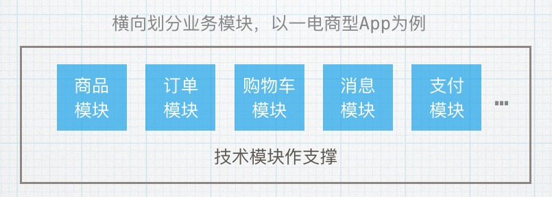
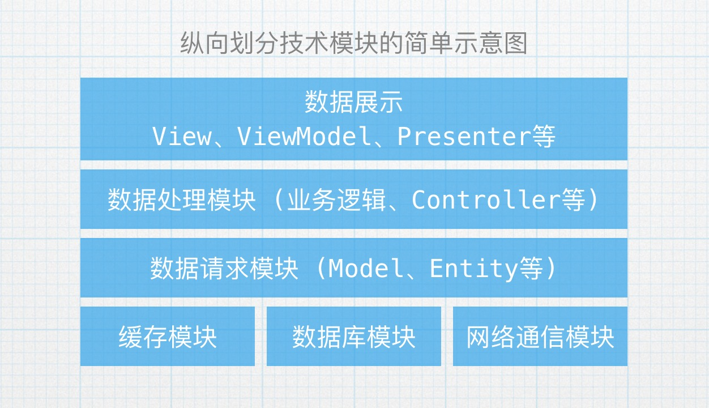
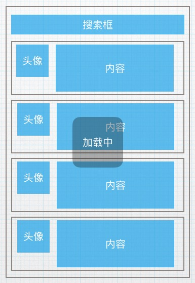
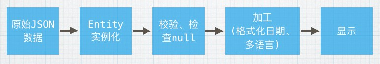

 
<!--BEGIN_DATA
{
    "create_date": "2016-06-25 16:17", 
    "modify_date": "2016-06-25 16:17", 
    "is_top": "0", 
    "summary": "对组件化与模块化的思考与总结", 
    "tags": "iOS、架构", 
    "file_name": "对组件化与模块化的思考与总结.md"
}
END_DATA-->

####
原文出处：<a href='http://tutuge.me/2016/03/29/modular-and-component-summary/' target='blank'>对组件化与模块化的思考与总结</a>

###前言

前段时间反复研读了[蘑菇街 App 的组件化之路](http://limboy.me/ios/2016/03/10/mgj-components.html)、[蘑菇街 App 的组件化之路·续](http://limboy.me/ios/2016/03/14/mgj-components-continued.html)和[iOS应用架构谈 组件化方案](http://casatwy.com/iOS-Modulization.html)，然后又找到了其它一些研究组件化、模块化方案的文章，但是总觉得差点什么，所以还是决定从头开始思考。文章的标题起的好宽泛，感觉给自己挖了个深坑-
。-，其实只是自己对组件化、模块化的一些看法、总结。

###为什么

先总结下为什么要大动干戈的对代码分模块、拆组件。

**代码量膨胀，不利于维护，更不利于新功能的开发**  
现在随便开发一个App的代码行数都是数以万计的，如果不对代码做合理的拆分，那简直就是灾难性的，估计只有最初的开发人员知道如何维护修改，如果换人开发的话，难以
下手，更不用说开发新功能了。

**不同业务代码耦合严重，难以多人合作，职责不分明**  
多人一起开发时，如果代码结构、模块化的不好，就很难对不同业务划分出分界线，难以明确各自的职责，牵一发动全身，出了问题更是容易相互扯皮（这个时候只能说一句“怪
我咯o(╯□╰)o”），更不用提合并代码时的冲突了。

所以，合理的组织代码，划分模块、拆分组件是项目可以高效迭代的基础。

###疑问

那到底什么是模块化、组件化？查资料的时候一会儿模块，一会儿组件，有什么联系，有什么区别？有人说这只是叫法习惯问题，知道大概意思就好，不用咬文嚼字，但是总觉得
没有个“定义”感觉不踏实，所以还是求助了万能的维基百科=。=

###模块化

维基百科的[Modular
programming](https://en.wikipedia.org/wiki/Modular_programming)的开头定义如下:

> Modular programming is a software design technique that emphasizes
separating the functionality of a program into independent, interchangeable
modules, such that each contains everything necessary to execute only one
aspect of the desired functionality.

接着，在**Key aspects**部分的开头也说了:

> With modular programming, concerns are separated such that modules perform
logically discrete functions, interacting through well-defined interfaces.

可以总结为：模块化的目的在于将一个程序按照其功能做拆分，分成相互独立的模块，以便于每个模块只包含与其功能相关的内容，模块之间通过接口调用。

当然，模块化编程的具体概念是包含了很多内容的，读者可以详细阅读下维基百科的定义。

###组件化

关于组件化，能找到的比较接近的就是维基百科的[Component-based software
engineering](https://en.wikipedia.org/wiki/Component-based_software_engineering)，其开头内容如下：

> Component-based software engineering (CBSE), also known as component-based
development (CBD), is a branch of software engineering that emphasizes the
separation of concerns in respect of the wide-ranging functionality available
throughout a given software system. It is a reuse-based approach to defining,
implementing and composing loosely coupled independent components into
systems.

乍一看，这不是跟模块化**Modular programming**的定义很相似嘛=。=  
的确，文中也提到组件化跟模块化是很类似的，都是主要为了对一个系统做拆分，比如文中提到：

> All system processes are placed into separate components so that all of the
data and functions inside each component are semantically related (just as
with the contents of classes). Because of this principle, it is often said
that components are modular and cohesive.

同时，组件还具有其他属性，如可替代性(substitutable)，通过接口(interface)访问，可重用性(Reusability)等，读者可自行阅读
。

###对比

难道模块化跟组件化真的是完全一样的？的确，很多时候两者的概念完全可以相互替换，在实践中更是经常混用。  
在求助谷歌，甚至阅读了大量的前端技术等其它技术领域的组件化、模块化的文章后，我觉得如果真要将它们两者做个对比，大概总结如下：

  * 模块化强调的是**拆分**，无论是从业务角度还是从架构、技术角度，模块化首先意味着将代码、数据等内容按照其职责不同分离，使其变得更加容易维护、迭代，使开发人员可以分而治之。
  * 组件化则着重于**可重用性**，不管是界面上反复使用的用户头像按钮，还是处理数据的流程中的某个部件，只要可以被反复使用，并且进行了高度封装，只能通过接口访问，就可以称其为“组件”。

当然，并不是说模块就不能被复用，还是要根据实际情况来看，使系统更加容易维护，开发更加方便，才是最终目的。

###如何拆分

无论是模块化还是组件化，首先肯定是做拆分，但是如何拆分？怎么下手？依照什么标准？  
下面简单总结一些方法。

#####横向拆分业务、功能模块

很多时候，一个完整的软件程序是同时为多种业务服务的，所有可以优先按照业务的不同，将整个系统进行拆分。

如一个电商类型的App，就可以分出商品浏览模块、订单模块、购物车模块、消息模块、支付模块等。又如微信这种社交型应用，可以拆分出联系人模块、朋友圈模块、聊天模
块、消息模块等。

其实就是从用户使用的角度，按照功能的不同划分模块，当然，这种业务模块是要由各种技术模块作支撑的。

#####纵向拆分技术、架构模块

如果脱离业务，只从技术角度来看，则可以尝试纵向对系统拆分模块。

其实这里的纵向拆分跟对系统的架构做分层有点像=。=，现如今只要需要联网请求API的App都免不了有网络请求、数据缓存、数据加工处理、数据展示、反馈用户操作等
行为，所有这些环节层层递进才能完成一个功能。

当开始着手规划一个完整软件系统，或者说App时，就可以按照这些环节划分模块，纵向分层次的组合，搭建出一个以技术模块组成的简易系统架构图，方便后续的开发，如下
图。

大体上的技术模块划分好以后，就可以按照具体的需求，实现每个技术模块，乃至细分出更多的子模块，如缓存模块可能由键值对缓存（NSUserDefaults）、数据
库缓存（SQLite、Realm）、图片缓存等子模块组成，根据具体情况而定。

#####从界面入手，拆分可视化组件

现在再来看看如何从界面入手拆分可复用的组件。假如有如下布局的界面：

很多时候，像界面里面的“搜索框”、“头像按钮”、“内容框”和显示提示用的“加载中”HUD，甚至整个内容的Cell，都是可能在很多地方出现的，而且本身的样式、
功能比较集中。  
如头像可能要支持点击跳转，头像图片圆角，内容框有特定的Padding和字体大小等，所以可以将这些界面上的元素“提”出来，单独封装成一个组件，供整个App复用
。或者直接用第三方的组件，如图中的“加载中”HUD，就可以用SVProgressHUD、MBProgressHUD等开源库。

其实这里的组件有种sunnyxx大大提到过的“Self-Manager”的味道=。=，组件本身负责自己的所有功能、样式，参考：[iOS 开发中的 Self-
Manager 模式](http://blog.sunnyxx.com/2015/12/19/self-manager-pattern-in-
ios/)。当然跟前端的组件化也挺像的，如React里面的component，样式、功能都封装到component里面，以便更好地解耦复用。

#####从数据入手，拆分数据加工组件

再来看看从数据入手，拆分可复用的组件。假如有如下数据处理流程：

其实大部分时候，拆分模块、组件都是以清晰的流程、逻辑为基础的，就如上图的过程，当流程清晰后，可以拆分复用的组件也就“出来了”。  
如从JSON数据实例化出对应的Entity对象，这个功能就是一个完整独立的组件，当然实际开发中会用Mantle、JSONModel等库实现。  
以此类推，校验、格式化日期（如“几秒钟前、几天前”）、多语言等环节，都可以独立成一个个的组件。  
当然，这里的组件一般是指能在多个模块使用的功能组件，如果只是在某个界面上才用的，倒不如放到ViewModel、Presenter等这些直接跟界面有关的类里面
。

#####小节

上面的几种方法比较适合不知道如何下手时使用=。=，真正的开发中，还是要根据实际情况考虑，情况也会复杂些。不过倒是可以总结几点原则：

  * **单一职责**，意味着一个模块、一个组件只做一件事，绝不多做。
  * **正交性**，意思是不重复，一个模块跟另一个模块的职责是正交的，没有重叠，组件也是一样。
  * **单向依赖**，模块之间最多是单向的依赖，如果出现A依赖B，B也依赖A，那么要么是A、B应该属于一个模块，要么就是整体的拆分有问题。一个完整的软件系统的模块依赖应该是一张有向无环图。（当然这是最终理想=。=）
  * **紧凑性**，模块、组件对外暴露的接口、属性应该尽可能的少，接口的参数个数也要少。
  * **面向接口**，模块、组件对外提供服务时最好是面向接口的，以便后期可以灵活的变更实现。

###最后

一切为了更加干净整洁的代码，“May the clean code be with you”

