 
<!--BEGIN_DATA
{
    "create_date": "2024-07-31 11:00", 
    "modify_date": "2024-07-31 11:00", 
    "is_top": "0", 
    "summary": "寻路算法基础<br/>RecastNavigation", 
    "tags": "Game、算法", 
    "file_name": "寻路算法研究.md"
}
END_DATA-->

#### <p>原文出处：<a href='https://km.woa.com/articles/show/608457' target='blank'>寻路算法研究（一）寻路算法基础</a></p>

## 寻路问题建模

* 定义：建模指的是为地图寻找一个空间表征（spatial representation），即把原始地图转换成计算机数据结构表示的模型，用于后面的寻路。

* 三种建模方式的图形化表示：
  
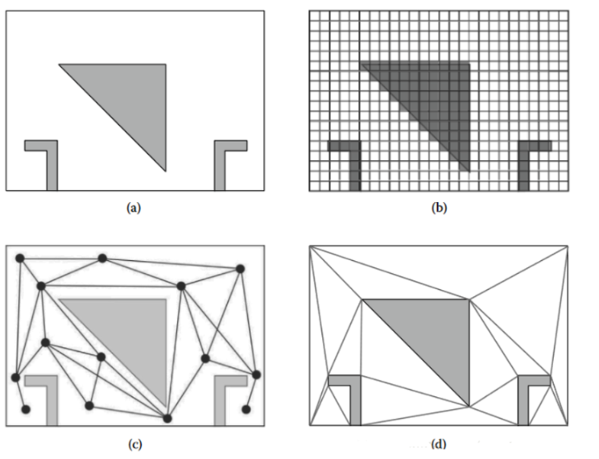

* (a) 原版地图

* (b) 格子（3D情况下可以对应为体素寻路）

* (c) 路点

* (d) 导航网格

* 三者对比  

<table><thead><tr><th align="center">属性</th><th align="center">导航网格</th><th align="center">格子</th><th align="center">路点</th></tr></thead><tbody><tr><td align="center">实现复杂度</td><td align="center">高</td><td align="center">中</td><td align="center">低</td></tr><tr><td align="center">内存和计算开销</td><td align="center">中</td><td align="center">高</td><td align="center">低</td></tr><tr><td align="center">表达精确性</td><td align="center">高</td><td align="center">中</td><td align="center">低</td></tr><tr><td align="center">优点</td><td align="center">精确表征世界，内存和计算开销适中</td><td align="center">容易实现，动态修改简单</td><td align="center">实现简单，内存和计算开销低</td></tr><tr><td align="center">缺点</td><td align="center">复杂，难以实现和修改，建网格耗时耗内存</td><td align="center">内存和计算开销大，可能需要额外平滑，不太适合3D地图</td><td align="center">需要人工参与，灵活性低，不考虑实际底层地图</td></tr><tr><td align="center">适用场景</td><td align="center">地图大，精确度要求高</td><td align="center">地图中等，不太大，内存充足</td><td align="center">路径固定，不考虑真实地形影响</td></tr></tbody></table>

## 基础寻路算法

### 深度和广度优先

#### DFS

  * **基本思想：**DFS从起始节点开始，沿着每条分支尽可能深入地搜索，直到遇到目标节点或无可深入的节点，然后回溯并探索其他分支。

  * 伪代码  

```c
DFS(node, goal):
if node is goal:
	return path to node
mark node as visited

for each neighbor in neighbors(node):
	if neighbor is not visited:
		path = DFS(neighbor, goal)
		if path is not None:
			return path
return None
```

#### BFS

  * **基本思想：**BFS从起始节点开始，逐层向外扩展，先访问当前层的所有节点，然后再访问下一层的所有节点，直到找到目标节点。

  * 伪代码  

```c
BFS(start, goal):
create a queue Q
enqueue start onto Q
mark start as visited

while Q is not empty:
	node = dequeue Q
	if node is goal:
		return path to node
	for each neighbor in neighbors(node):
		if neighbor is not visited:
			mark neighbor as visited
			enqueue neighbor onto Q
return None
```

### Dijkstra算法

  * **基本思想：**Dijkstra算法用于在加权图中找到从起始节点到目标节点的最短路径。算法维护一个优先队列，存储各节点的当前最短路径估计值，不断更新这些值直到找到最短路径。

  * 伪代码  

```c
Dijkstra(graph, start, goal):
	create a priority queue Q
	for each node in graph:
		dist[node] = infinity
		previous[node] = undefined
	dist[start] = 0
	Q.insert(start, dist[start])

	while Q is not empty:
		node = Q.extract_min()
		if node is goal:
			return reconstruct_path(previous, goal)
		for each neighbor in neighbors(node):
			alt = dist[node] + cost(node, neighbor)
			if alt < dist[neighbor]:
				dist[neighbor] = alt
				previous[neighbor] = node
				Q.decrease_key(neighbor, alt)
	return None

reconstruct_path(previous, goal):
	path = []
	while goal is not undefined:
		path.prepend(goal)
		goal = previous[goal]
	return path
```

### Floyd算法（Floyd-Warshall算法）

  * **基本思想**：Floyd-Warshall算法是一种动态规划算法，用于计算加权图中所有节点对之间的最短路径。它通过不断更新路径矩阵，使得每次更新考虑更多的中间节点。

  * 伪代码  

```c
FloydWarshall(graph):
n = number of nodes in graph
dist = array[n][n]

for i from 1 to n:
	for j from 1 to n:
		if i == j:
			dist[i][j] = 0
		else if (i, j) in graph:
			dist[i][j] = weight of edge (i, j)
		else:
			dist[i][j] = infinity

for k from 1 to n:
	for i from 1 to n:
		for j from 1 to n:
			if dist[i][j] > dist[i][k] + dist[k][j]:
				dist[i][j] = dist[i][k] + dist[k][j]
return dist
```

### Bellman-Ford算法

  * **基本思想：**Bellman-Ford算法用于计算单源最短路径，能够处理带负权边的图。它通过反复松弛边缘，更新最短路径估计值。如果在V-1次松弛之后还能松弛，说明存在负权环。

  * 伪代码  

```c
BellmanFord(graph, source):
	n = number of nodes in graph
	dist = array[n]
	parent = array[n]
	## Step 1: Initialize distances from source to all other nodes as infinity
	for i from 1 to n:
		dist[i] = infinity
		parent[i] = undefined
	dist[source] = 0

	## Step 2: Relax all edges |V| - 1 times
	for i from 1 to n-1:
		for each edge (u, v) in graph:
			if dist[u] + weight(u, v) < dist[v]:
				dist[v] = dist[u] + weight(u, v)
				parent[v] = u

	## Step 3: Check for negative-weight cycles
	for each edge (u, v) in graph:
		if dist[u] + weight(u, v) < dist[v]:
			print("Graph contains a negative-weight cycle")
			return None
	return dist, parent

reconstruct_path(parent, target):
	path = []
	while target is not undefined:
		path.append(target)
		target = parent[target]
	path.reverse()
	return path
```

### SPFA算法（Shortest Path Faster Algorithm）

  * **基本思想：**SPFA算法是对Bellman-Ford算法的一种优化，通过使用队列来选择下一个要处理的节点，从而减少不必要的重复计算，提高效率。它适用于带有负权边但无负权环的图。

  * 伪代码  

```c
SPFA(graph, source):
n = number of nodes in graph
dist = array[n]
inQueue = array[n]

for i from 1 to n:
	dist[i] = infinity
	inQueue[i] = false
dist[source] = 0
queue = [source]
inQueue[source] = true

while queue is not empty:
	u = queue.pop(0)
	inQueue[u] = false
	for each neighbor v of u:
		if dist[u] + weight(u, v) < dist[v]:
			dist[v] = dist[u] + weight(u, v)
			if not inQueue[v]:
				queue.append(v)
				inQueue[v] = true
return dist
```

### 贪婪最佳优先搜索

  * **基本思想：**贪婪最佳优先搜索基于启发式函数进行搜索，每次选择距离目标最近的节点扩展。该算法并不总能找到最短路径，但通常能较快找到一个解决方案。

  * 伪代码  

```c
GreedyBestFirstSearch(start, goal, heuristic):
create a priority queue Q
Q.insert(start, heuristic(start, goal))
mark start as visited

while Q is not empty:
	node = Q.extract_min()
	if node is goal:
		return path to node
	for each neighbor in neighbors(node):
		if neighbor is not visited:
			mark neighbor as visited
			Q.insert(neighbor, heuristic(neighbor, goal))
return None
```

### 总结

<table><thead><tr><th align="center">算法</th><th align="center">时间复杂度</th><th align="center">空间复杂度</th><th align="center">优点</th><th align="center">缺点</th><th align="center">适用场景</th></tr></thead><tbody><tr><td align="center">深度优先搜索 (DFS)</td><td align="center">O(V + E)</td><td align="center">O(V)</td><td align="center">实现简单，内存使用低</td><td align="center">可能会陷入死循环，不保证找到最短路径</td><td align="center">小规模图，解决迷宫问题，图遍历</td></tr><tr><td align="center">广度优先搜索 (BFS)</td><td align="center">O(V + E)</td><td align="center">O(V)</td><td align="center">能找到无权图中的最短路径</td><td align="center">内存使用较高</td><td align="center">短路径搜索，图遍历，树的层次遍历</td></tr><tr><td align="center">Dijkstra算法</td><td align="center">O(V^2) 或 O(E + V log V)（使用优先队列）</td><td align="center">O(V^2) 或 O(V)（使用优先队列）</td><td align="center">适用于无负权边的图，可以找到最短路径</td><td align="center">无法处理带负权边的图</td><td align="center">带权图的最短路径问题，网络路由</td></tr><tr><td align="center">Floyd-Warshall算法</td><td align="center">O(V^3)</td><td align="center">O(V^2)</td><td align="center">能解决所有节点对的最短路径问题，可处理负权边</td><td align="center">时间和空间复杂度高</td><td align="center">稠密图，解决所有节点对的最短路径问题</td></tr><tr><td align="center">Bellman-Ford算法</td><td align="center">O(V * E)</td><td align="center">O(V)</td><td align="center">能处理带负权边的图，检测负权环</td><td align="center">时间复杂度较高，效率低于Dijkstra</td><td align="center">单源最短路径，带负权边的图</td></tr><tr><td align="center">SPFA算法</td><td align="center">平均O(V)~O(E)</td><td align="center">O(V)</td><td align="center">优化了Bellman-Ford算法，效率高于Bellman-Ford</td><td align="center">可能会进入死循环，需要检测负权环</td><td align="center">单源最短路径，带负权边的图</td></tr><tr><td align="center">贪婪最佳优先搜索</td><td align="center">O(E)</td><td align="center">O(V)</td><td align="center">通常能较快找到解决方案</td><td align="center">不保证最短路径</td><td align="center">路径规划，启发式搜索</td></tr></tbody></table>

## A*算法及其改进算法

### A*

  * **基本思想**：A*算法结合了Dijkstra算法和贪婪最佳优先搜索，使用启发式函数（通常是目标节点的估计距离）来指导搜索过程。它同时考虑到当前节点到起始节点的实际距离（g(n)）和从当前节点到目标节点的估计距离（h(n)），总优先级为f(n) = g(n) + h(n)。  

  * 伪代码  

```c
AStar(graph, start, goal, heuristic):
	create an open set (priority queue) Q
	create a closed set
	g_score = {node: infinity for node in graph}
	f_score = {node: infinity for node in graph}
	g_score[start] = 0
	f_score[start] = heuristic(start, goal)
	Q.insert(start, f_score[start])

	while Q is not empty:
		current = Q.extract_min()
		if current is goal:
			return reconstruct_path(came_from, current)
		closed_set.add(current)
		for neighbor in neighbors(current):
			if neighbor in closed_set:
				continue
			tentative_g_score = g_score[current] + cost(current, neighbor)
			if tentative_g_score < g_score[neighbor]:
				came_from[neighbor] = current
				g_score[neighbor] = tentative_g_score
				f_score[neighbor] = g_score[neighbor] + heuristic(neighbor, goal)
				if neighbor not in Q:
					Q.insert(neighbor, f_score[neighbor])
	return None

reconstruct_path(came_from, current):
	path = []
	while current in came_from:
		path.append(current)
		current = came_from[current]
	path.reverse()
	return path
```

### JPS和JPS+算法

#### JPS算法

  * **基本思想：**JPS是对A算法的一种优化，专用于`*`网格图。它通过跳过某些不必要的节点（跳点）来加速路径搜索。这种方法利用对称性和方向性来减少`A*`需要评估的节点数量，从而提高效率。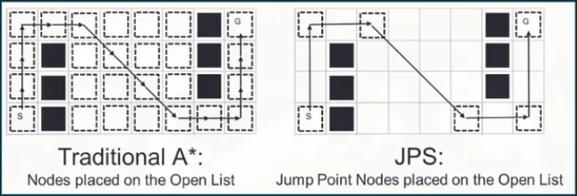

    * 强迫邻居：节点x的8个邻居中有障碍，且x的父节点p经过x到达n的距离代价比不经过x到达的n的任意路径的距离代价小，则称n是x的强迫邻居，即去n必过x点。

    * 跳点

      * 节点x是起点/终点。

      * 节点x至少有一个强迫邻居。

      * 如果父节点在斜方向(意味着这是斜向搜索)，节点x的水平或垂直方向上有满足以上2个条件的点  

  * 伪代码  

```c
JPS(start, goal, grid):
   openSet = priority queue
   closedSet = set
   gScore = dictionary with default value infinity
   fScore = dictionary with default value infinity
   parent = dictionary
   gScore[start] = 0
   fScore[start] = heuristic(start, goal)
   openSet.insert(start, fScore[start])

   while openSet is not empty:
       current = openSet.extract_min()
       if current == goal:
           return reconstruct_path(parent, current)
       closedSet.add(current)
       for neighbor in jump_neighbors(current, goal, grid):
           if neighbor in closedSet:
               continue
           tentative_gScore = gScore[current] + distance(current, neighbor)
           if tentative_gScore < gScore[neighbor]:
               gScore[neighbor] = tentative_gScore
               parent[neighbor] = current
               fScore[neighbor] = gScore[neighbor] + heuristic(neighbor, goal)
               if neighbor not in openSet:
                   openSet.insert(neighbor, fScore[neighbor])
   return None

jump_neighbors(current, goal, grid):
   neighbors = []
   for direction in possible_directions:
       jumpPoint = jump(current, direction, goal, grid)
       if jumpPoint is not None:
           neighbors.append(jumpPoint)
   return neighbors

jump(current, direction, goal, grid):
   next = current + direction
   if not in_bounds(next, grid) or is_obstacle(next, grid):
       return None
   if next == goal:
       return next
   if forced_neighbors(next, direction, grid):
       return next
   if direction is diagonal:
       if jump(next, (direction[0], 0), goal, grid) is not None or \\
          jump(next, (0, direction[1]), goal, grid) is not None:
           return next
   return jump(next, direction, goal, grid)

forced_neighbors(node, direction, grid):
   ## Implement detection of forced neighbors
   return True or False

reconstruct_path(parent, current):
   path = []
   while current in parent:
       path.append(current)
       current = parent[current]
   path.reverse()
   return path
```

  * 一些优化方案：

    * JPS·Bit使用运算效率更高的位运算和CPU指令运算来优化原始JPS节点扩展过程。

    * JPS-BitPrune将中间跳点全部删除，将中间跳点后继跳点中的非中间跳点的父跳点改为中间跳点的父跳点，可以有效避免冗余的节点拓展运算。由于删除了中间跳点，因此JPS-BitPrune需要在搜索到完整的路径之后以一定的策路在最后寻得的路径中加入中间拐点，使得每两个相邻的路径节点之间都是垂直、水平、对角线方向可达的。

    * Goal Bounding节点裁减技术：为每个节点的边(Edge)计算一个节点集合，该集合至少包含通过该边可到达最短路的所有节点，在执行路径搜索算法（如A*）时，使用预计算的目标节点集合来减少需要考虑的路径，从而加速搜索过程。

#### JPS+算法

  * **基本思想：**JPS+ 是 JPS 的改进版，旨在进一步优化搜索过程。JPS+ 通过预处理地图，将跳点信息预先计算并存储，从而在搜索过程中减少实时计算的开销，进一步提升路径搜索的速度。  

  * 伪代码  

```c
JPSPlus(start, goal, grid):
   preprocessed_grid = preprocess_grid(grid)
   openSet = priority queue
   closedSet = set
   gScore = dictionary with default value infinity
   fScore = dictionary with default value infinity
   parent = dictionary
   gScore[start] = 0
   fScore[start] = heuristic(start, goal)
   openSet.insert(start, fScore[start])

   while openSet is not empty:
       current = openSet.extract_min()
       if current == goal:
           return reconstruct_path(parent, current)
       closedSet.add(current)
       for neighbor in jump_neighbors_plus(current, goal, preprocessed_grid):
           if neighbor in closedSet:
               continue
           tentative_gScore = gScore[current] + distance(current, neighbor)
           if tentative_gScore < gScore[neighbor]:
               gScore[neighbor] = tentative_gScore
               parent[neighbor] = current
               fScore[neighbor] = gScore[neighbor] + heuristic(neighbor, goal)
               if neighbor not in openSet:
                   openSet.insert(neighbor, fScore[neighbor])
   return None

preprocess_grid(grid):
   ## Implement preprocessing to compute jump points
   return preprocessed_grid

jump_neighbors_plus(current, goal, preprocessed_grid):
   ## Use precomputed jump points from preprocessed_grid
   neighbors = preprocessed_grid[current]
   return neighbors

reconstruct_path(parent, current):
   path = []
   while current in parent:
       path.append(current)
       current = parent[current]
   path.reverse()
   return path
```

### B*算法

  * **基本思想**

    * B算法是一种用于树结构搜索的路径优化算法，主要应用于人工智能和游戏开发中的路径规划。它是对经典的A算法的一种改进，结合了最佳优先搜索和界限估计的概念。B*算法通过在搜索过程中同时考虑路径成本和启发式信息，进一步提高了搜索效率。

    * B_算法在搜索过程中，会计算每个节点的综合评价函数 *`f(n) = g(n) + h(n) + b(n)`，其中：

      * **`g(n)`** 是从起始节点到当前节点的实际路径成本。

      * **`h(n)`** 是当前节点到目标节点的启发式估计成本。

      * **`b(n)`** 是一个界限函数，用于动态调整启发式信息。  
B_算法通过动态调整界限函数 *`b(n)` 来优化搜索路径，避免走冤枉路，从而提高效率。  

  * 伪代码  

```c
BStar(graph, start, goal, heuristic):
	openSet = priority queue
	closedSet = set
	gScore = dictionary with default value infinity
	fScore = dictionary with default value infinity
	bScore = dictionary with default value 0
	parent = dictionary
	gScore[start] = 0
	fScore[start] = heuristic(start, goal) + bScore[start]
	openSet.insert(start, fScore[start])
	while openSet is not empty:
		current = openSet.extract_min()
		if current == goal:
			return reconstruct_path(parent, current)
		closedSet.add(current)
		for neighbor in neighbors(current, graph):
			if neighbor in closedSet:
				continue
			tentative_gScore = gScore[current] + distance(current, neighbor)
			tentativeFScore = tentative_gScore + heuristic(neighbor, goal) + bScore[neighbor]
			if tentative_gScore < gScore[neighbor]:
				gScore[neighbor] = tentative_gScore
				fScore[neighbor] = tentativeFScore
				parent[neighbor] = current
				if neighbor not in openSet:
					openSet.insert(neighbor, fScore[neighbor])
				else:
					openSet.update(neighbor, fScore[neighbor])
		## Update the boundary function b(n)
		update_bScore(bScore, current, graph)
	return None

def update_bScore(bScore, current, graph):
	## Implement the logic to update bScore based on current node and graph
	pass

def reconstruct_path(parent, current):
	path = []
	while current in parent:
		path.append(current)
		current = parent[current]
	path.reverse()
	return path
```

### Theta*算法

  * 基本思想：`Theta`算法是对`A*`算法的改进，通过允许在路径规划中沿对角线方向移动，而不是仅沿网格边缘行走，从而减少路径的节点数，提高路径规划的效率。  

  * 伪代码  

```c
ThetaStar(graph, start, goal, heuristic):
   openSet = priority queue
   closedSet = set
   gScore = dictionary with default value infinity
   fScore = dictionary with default value infinity
   parent = dictionary
   gScore[start] = 0
   fScore[start] = heuristic(start, goal)
   openSet.insert(start, fScore[start])
   while openSet is not empty:
       current = openSet.extract_min()
       if current == goal:
           return reconstruct_path(parent, current)
       closedSet.add(current)
       for neighbor in neighbors(current):
           if neighbor in closedSet:
               continue
           tentative_gScore = gScore[current] + distance(current, neighbor)
           if has_line_of_sight(parent[current], neighbor):
               new_gScore = gScore[parent[current]] + distance(parent[current], neighbor)
               if new_gScore < gScore[neighbor]:
                   gScore[neighbor] = new_gScore
                   parent[neighbor] = parent[current]
                   fScore[neighbor] = gScore[neighbor] + heuristic(neighbor, goal)
                   if neighbor not in openSet:
                       openSet.insert(neighbor, fScore[neighbor])
           else:
               if tentative_gScore < gScore[neighbor]:
                   gScore[neighbor] = tentative_gScore
                   parent[neighbor] = current
                   fScore[neighbor] = gScore[neighbor] + heuristic(neighbor, goal)
                   if neighbor not in openSet:
                       openSet.insert(neighbor, fScore[neighbor])
   return None

reconstruct_path(parent, current):
   path = []
   while current in parent:
       path.append(current)
       current = parent[current]
   path.reverse()
   return path

has_line_of_sight(node1, node2):
   ## Implement line-of-sight check
   return True or False
```

### IDA*算法

  * 基本思想：`IDA（Iterative Deepening A）`算法结合了A算法的启发式搜索和迭代加深搜索的深度限制。基本思想是使用A算法的启发式函数进行路径评估，但通过逐步增加深度限制来进行搜索，从而减少内存使用。设定一个深度限制（即阈值），从起点开始进行深度优先搜索。每次搜索到当前阈值时，如果没有找到目标，就增加阈值并重新开始搜索，直到找到目标或证明无解。

### 总结

<table><thead><tr><th align="center">算法</th><th align="center">时间复杂度</th><th align="center">空间复杂度</th><th align="center">优点</th><th align="center">缺点</th><th align="center">适用场景</th></tr></thead><tbody><tr><td align="center">A*</td><td align="center">O(E)</td><td align="center">O(V)</td><td align="center">启发式搜索，效率高，能找到最优路径</td><td align="center">需要合理的启发式函数，可能受启发式函数影响较大</td><td align="center">需要快速且最优路径规划的场景</td></tr><tr><td align="center">JPS</td><td align="center">O(E)</td><td align="center">O(V)</td><td align="center">大幅减少A*需要评估的节点数量，提高搜索效率</td><td align="center">仅适用于网格图，需实现复杂的跳点检测算法</td><td align="center">网格图的路径规划，启发式搜索</td></tr><tr><td align="center">JPS+</td><td align="center">O(E)</td><td align="center">O(V) + 预处理时间和空间</td><td align="center">基于JPS进一步优化，通过预处理减少实时计算开销，提高速度</td><td align="center">需要预处理地图，适用范围较局限</td><td align="center">大规模网格图的路径规划，启发式搜索</td></tr><tr><td align="center">B*</td><td align="center">O(E)</td><td align="center">O(V)</td><td align="center">通过动态调整界限函数，提高搜索效率；避免冤枉路</td><td align="center">需要额外维护和计算界限函数，实现复杂度较高</td><td align="center">需要高效路径规划的复杂环境，如游戏AI、机器人导航等</td></tr><tr><td align="center">Theta*</td><td align="center">O(E)</td><td align="center">O(V)</td><td align="center">将A*的启发式搜索与线性插值相结合，能找到更短且平滑的路径</td><td align="center">实现较为复杂，可能需要更多的计算资源</td><td align="center">需要平滑路径且高效的路径规划场景，如机器人导航</td></tr><tr><td align="center">IDA*</td><td align="center">O(b^d)</td><td align="center">O(d)</td><td align="center">空间效率高，适合内存受限环境，能找到最优路径</td><td align="center">时间效率较低，多次迭代增加计算开销</td><td align="center">内存受限但需要最优路径的场景，如嵌入式系统、机器人导航</td></tr></tbody></table>

## A*算法优化思路

### 预先计算好每一条路径

  * 预先计算好寻路空间中每条可能的路径(Roy-Floyd-Warshal算法)，并把路径数据保存在一张查找表中，通过“换乘点”进行无损压缩或者通过“枢轴pivot节点”有损压缩。

### **Hierarchical and Dynamic Pathfinding**

#### **Hierarchical Pathfinding（层次化寻路）**

  * 基本思想  
层次化寻路通过将地图或图划分为多个层次，以减少搜索空间并加快路径搜索过程。其基本思想是：

    * **分层结构**：

      * 将地图或图划分为多个不同的层次，每个层次表示不同的抽象级别。例如，最低层可以是具体的网格或节点，较高层可以是较大的区域或簇。

      * 每个层次包含较低层次的抽象表示。例如，在游戏中，最低层次是具体的地图网格，中间层次是区域（如房间或走廊），最高层次可能是整个建筑或区域的抽象表示。

    * **路径搜索过程**：

      * 在最高层次进行粗略的路径搜索，确定从起点到终点的大致路径。

      * 在较低层次逐步细化路径，直到找到具体的路径。

      * 通过这种分层次的方式，搜索空间显著减少，搜索效率提高。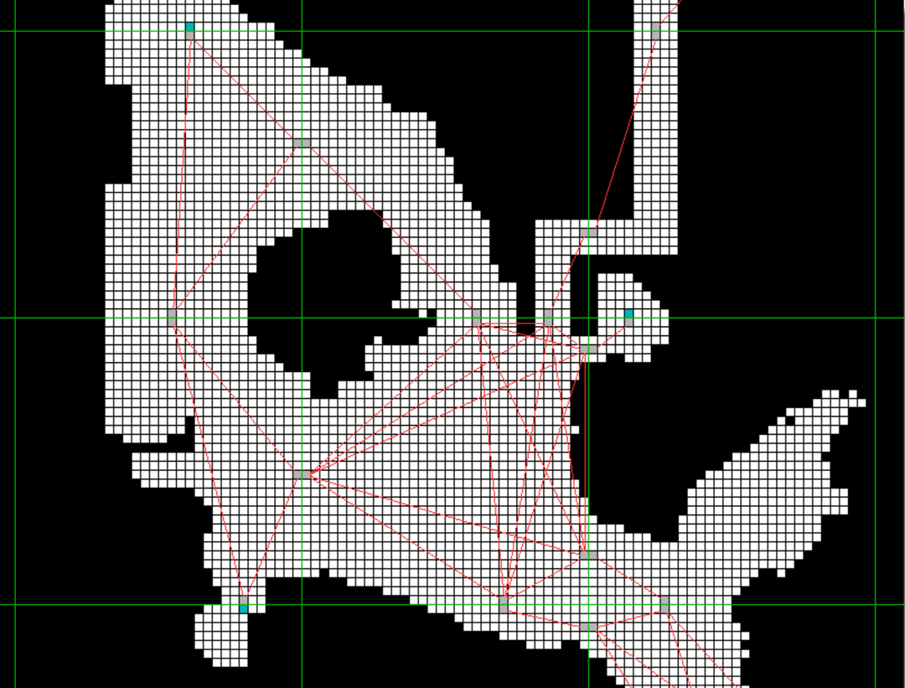

    * 上图中把整个地图按区域来进行一次划分，而 A* 算法也分为两步：

      * local A，即在单个区域内部进行 A 算法

      * tile A，即在区域间进行 A 算法

    * 区域间存在一个路点(Way Point)，而区域间的邻接关系靠的就是这些路点的邻接关系，所以每一次长路径，都是先从源点走到相邻区域的路点，再从当前路点出发，走到下一个路店，直到到达目标区域的目标点

#### **Dynamic Pathfinding（动态寻路）**

  * 动态寻路处理动态变化的环境，例如地图中某些部分发生变化（如新增障碍物、道路变化等）。动态寻路技术包括：

    * **动态更新路径**：

      * 在路径搜索过程中，根据环境的变化实时更新路径。

      * 当环境发生变化时，不必重新计算整个路径，而是只更新受影响的部分。

    * **增量更新**：

      * 通过增量更新技术，只计算必要的变化部分，从而提高效率。例如，当一个障碍物出现时，只重新计算受影响的路径节点，而不是整个路径。

### 预分配所需的内存空间

  * 在开始阶段预分配一个内存池，然后反复利用。因为每个节点所占用的内存空间是一样大的，因此这些数据可以很容易从预分配的缓存中进行调用而不会产生任何碎片。

### 高估或者更好的启发函数

  * `f(x)=g(x)+ (h(x)*weight)`，对weight不断进行实验，同时改进h(x)函数

## 参考文章

  * [寻路建模的三种方式比较](https://blog.csdn.net/needmorecode/article/details/82050409)  

  * [深入理解游戏中的寻路算法](https://my.oschina.net/u/1859679/blog/1486636)  

  * [游戏人工智能](https://book.douban.com/subject/27154117/)

<hr/>

#### <p>原文出处：<a href='https://km.woa.com/articles/show/608458' target='blank'>寻路算法研究（二）RecastNavigation</a></p>

> 导语 一文介绍RecastNavigation的基本背景，模块组成，Recast和Detour两大模块实现原理，Offmesh、动态阻碍、Detourcrowd等特性。

## NavMesh引入

### 早期导航网格-Meadow Map

  * 论文《Path Planning for a Vision-Based Autonomous Robot》提出使用凸多边形构建可行走区域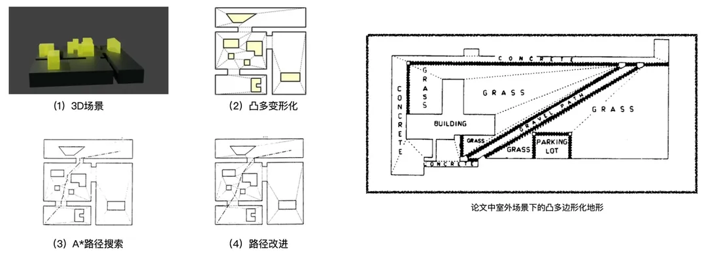   

  * 使用凸多边形构建寻路算法使用的图节点的原因：

    * 凸边形任意两点连接不出会超出凸多边形

    * 使用凸边形上的边缘节点代替凸多边形，降低空间复杂度  

  * 当代Recast Navigtion主要在最初的可行走区域进行了自动化构建的改进，同时改进了后续部分算法使其更适用于3D场景。  
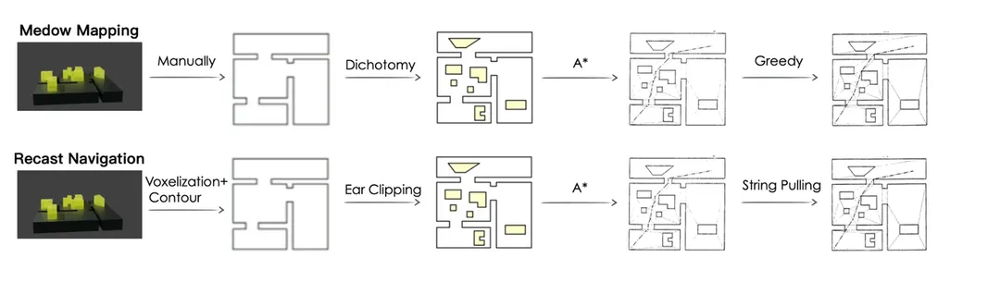  

<table><thead><tr><th align="center"></th><th align="center">MeadowMapping</th><th>RecastNavigation</th></tr></thead><tbody><tr><td align="center">可行走区域生成方式</td><td align="center">手工绘制</td><td>基于体素构建可行走区域，最后生成边缘</td></tr><tr><td align="center">凸多边形构建</td><td align="center">二分法</td><td>耳切法</td></tr><tr><td align="center">路径改善</td><td align="center">局部贪心</td><td>拉绳算法</td></tr></tbody></table>

### 当代导航网格方案

#### **Havok AI与NavPower**

  * 商业非开源方案。  

  * 多边形裁减生成导航网格：直接对地形的多边形网格数据进行裁剪及合并，从而生成导航网格。方法比较直观，但难度更高。  

  * Navpower支持墙面/天花板移动

#### Recast Navigation

  * 开源方案，被unity和ue引擎所采用，在内存和CPU消耗都相对较好，且工具链完善，寻路算法优化成熟，是一般项目的首选。  

  * **体素化生成导航网格**：体素化是对地形多边形网格进行栅格化，然后用这些“格子”重新生成导航网格，方法更复杂，但难度更低。  

  * 缺点：

    * 假设 Agent 都是在地面行走且收到重力影响的。

    * 假设 Agent 始终保持直立姿态的，即平行于重力方向。

    * Agent 不能飞，甚至不能跳。即使“走”在一些斜坡上，也始终应该是直立姿态，而不能是垂直于地表（即地表法线方向）。

    * 对于开放地图并不友好。如果需要判断远距离的两个点是否互相可到达，则需要将这个范围内的所有导航网格加载完，才可计算出路径，才可以判断是否可达到。

### Recast中体素的存储

体素的存储主要有两种方式，稀疏八叉树和高度场，由于后者更适合地形的表示与处理，Recast采取了后者。

#### 稀疏八叉树SVO

  * 可以极大减少无内容空间的数据存储，降低运行时内存使用。查询耗时由八叉树的高度决定，而树的高度与场景复杂度、体素最小粒度有关。  
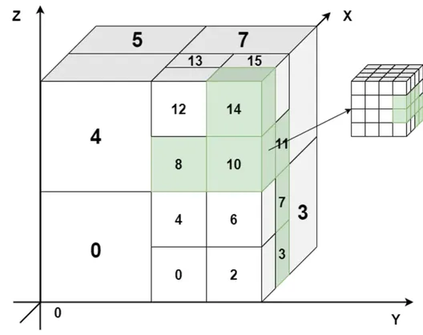

#### 高度场Span

  * 每个Span由上、下表面高度决定最终形状。  

  * 运行时常使用体素数组span_arr和索引数组cell_arr来存储数据。

    * 查找(x,y)处体素，首先找到体素数组在`(x,y)`处起始下标`start=cell_arr[ycol+x]`，然后找到体素数组在`(x,y)`处终止下标的下一位`end=cell_arr[ycol+x+1]`

    * 最后就可以得出`(x,y)`处的体素数量`count=(end-start)/2`，体素数据为闭区间`[span_arr[start], span_arr[end-1]]`。

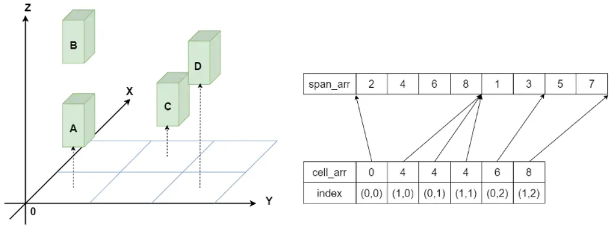

#### 两者对比

<table><thead><tr><th align="center">特性</th><th align="center">稀疏八叉树(SVO)</th><th align="center">高度场Span</th></tr></thead><tbody><tr><td align="center">数据结构</td><td align="center">八叉树</td><td align="center">体素数组与索引数组</td></tr><tr><td align="center">内存效率</td><td align="center">高（仅存储有内容的空间）</td><td align="center">中（基于高度场，较为紧凑）</td></tr><tr><td align="center">查询效率</td><td align="center">取决于树的高度</td><td align="center">高（数组索引操作）</td></tr><tr><td align="center">适用场景</td><td align="center">三维体素数据存储，稀疏数据场景</td><td align="center">地形表示与高度场数据处理</td></tr><tr><td align="center">实现复杂度</td><td align="center">较高</td><td align="center">中</td></tr><tr><td align="center">存储方式</td><td align="center">多层次的节点与指针结构</td><td align="center">体素数组 span_arr 和索引数组 cell_arr</td></tr><tr><td align="center">数据查询</td><td align="center">递归查找</td><td align="center">数组索引快速定位</td></tr><tr><td align="center">存储空间利用率</td><td align="center">高</td><td align="center">较高</td></tr><tr><td align="center">示例应用</td><td align="center">三维游戏场景、复杂模型存储</td><td align="center">地形编辑器、地形生成和渲染</td></tr><tr><td align="center">优势</td><td align="center">内存占用小、适合稀疏数据存储</td><td align="center">查找效率高、适合地形数据处理</td></tr><tr><td align="center">劣势</td><td align="center">实现复杂度高、查询可能较慢（递归）</td><td align="center">不适合高维稀疏数据、需要额外索引数组</td></tr></tbody></table>

## RecastNavigation概览

### 总体介绍

  * RecastNav是一组工具，用于完全自动化导航网格构建过程、加载和流式传输导航网格数据、在运行时路径化和查询导航网格、控制 AI 代理移动等。它最初由 Mikko Mononen 于 2009 年创建，并已在无数独立游戏、AAA 级游戏以及 Unity、Unreal、Godot 和 O3DE 等商业和开源游戏引擎中发布。  

  * 导航网格是游戏世界可遍历区域的简化视图，针对 AI 路径和移动计算进行了优化。Navmesh通常是由世界上的物理碰撞机构建的，其定义了AI可以合法存在的区域。  
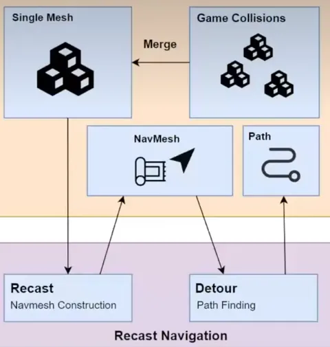  

  * RecastNav组成。RecastNavigation开源库主要包括分为两部分：

    * `Recast/` - Navmesh生成

    * `Detour/` - 运行时加载导航网格数据、寻路、导航网格查询  
除此之外还有如下几部分作为补充：

    * `DetourTileCache/` - Navmesh 流式处理。适用于大型关卡和开放世界游戏

    * `DetourCrowd/` - 智能体移动、防撞和人群模拟

    * `DebugUtils/` - 用于绘制导航数据和行为的调试可视化的 API

    * `Tests/` - 单元测试

    * `RecastDemo/` - 独立、全面的演示应用程序，展示了 Recast & Detour 功能的各个方面

### 代理属性

  * 导航网格针对具有特定大小和一组移动功能的特定类型的 AI 代理量身定制。通常需要为同一环境构建多个导航网格，以适应不同的代理类型，例如不同体型的人物。  

  * 具体属性  
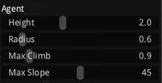

    * **Radius和Height**：AI大小是最重要的属性，在 Recast 中定义为半径(Radius)和高度（Height）。

    * **Max Slope**:最大坡度值定义了角色可以行走的最陡峭角度几何体。

    * **MAX Climb**:最大“步进”高度定义了 AI 代理可以步入的最高障碍,有助于其跨过一个小路边或爬上一段楼梯。

### 导航网格生成方式

  * recast提供了三种生成导航网格的模式  
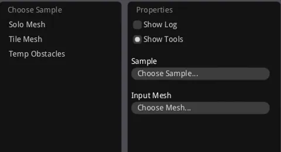

    * SoloMesh：为整个场景生成单块网格

    * TileMesh：以Tile为单位生成导航网格，在demo中会显示白色的线来表示分割的Tile  
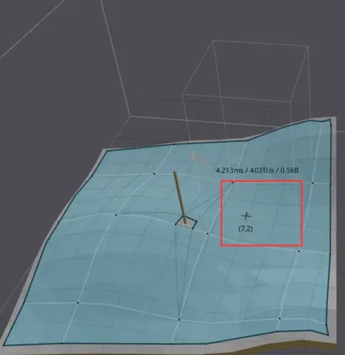

    * TempObstacles：以Tile为单位生成动态的导航网格，支持动态添加障碍物  

  * recast主要生成方式主要还是区分Solo Mesh和Tile Mesh，Temp Obstacles只是在TileMesh上做了优化

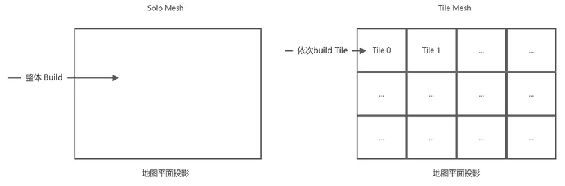

### 大体过程

#### Recast

  * [Sample_SoloMesh.cpp](https://recastnav.com/Sample__SoloMesh_8cpp.html) 很好地介绍了构建 Navmesh 的一般过程。它构建了一个单一的、统一的导航网格，是两个示例中更简单、更有限的一个。 [Sample_TileMesh.cpp](https://recastnav.com/Sample__TileMesh_8cpp.html) 构建一个平铺导航网格，支持 Recast 和 Detour 围绕动态障碍物和运行时重新划分网格的所有功能。

    * `Sample_SoloMesh.cpp`的大体流程如下：
    
```cpp
根据输入几何边界确定栅格体素格网的大小。
rcCalcGridSize
 
对输入几何体素化
rcAllocHeightfield
rcCreateHeightfield rcCreateHeight字段
rcMarkWalkableTriangles
rcRasterizeTriangles
 
清理体素数据并过滤掉不适合步行的区域。
rcFilterLowHangingWalkableObstacles
rcFilterLedgeSpans
rcFilterWalkableLowHeightSpans
 
将体素数据合并为更紧凑的表示形式
rcAllocCompactHeightfield
rcAllocCompactHeight字段
rcBuildCompactHeightfield
rcBuildCompactHeight字段
 
进一步优化体素表示
rcErodeWalkableArea
rcBuildDistanceField
rcBuildRegions rcBuild区域
 
根据体素数据对导航网格面进行三角测量
rcAllocContourSet
rcBuildContours
rcAllocPolyMesh
rcBuildPolyMesh
 
使用在运行时有用的其他元数据打包网格。
rcAllocPolyMeshDetail
rcBuildPolyMeshDetail
 
rcFreeHeightField
rcFreeCompactHeightfield rcFreeCompactHeight字段
rcFreeContourSet
```

  * 其流程图如下  
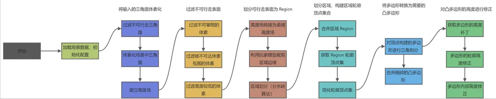

  * 各个阶段的时间分布大值如下表所示，一般来说最开始的体素化（Rasterize）占据了时间的大头。  

<table><thead><tr><th align="center">Step</th><th align="center">Time(ms)</th><th align="center">Percentage</th></tr></thead><tbody><tr><td align="center">Rasterize</td><td align="center">0.24</td><td align="center">35.9%</td></tr><tr><td align="center">Build Compact</td><td align="center">0.04</td><td align="center">6.6%</td></tr><tr><td align="center">Filter Border</td><td align="center">0.04</td><td align="center">6.6%</td></tr><tr><td align="center">Filter Walkable</td><td align="center">0.01</td><td align="center">0.8%</td></tr><tr><td align="center">Erode Area</td><td align="center">0.04</td><td align="center">6.6%</td></tr><tr><td align="center">Median Area</td><td align="center">0.00</td><td align="center">0.0%</td></tr><tr><td align="center">Mark Box Area</td><td align="center">0.00</td><td align="center">0.0%</td></tr><tr><td align="center">Mark Convex Area</td><td align="center">0.00</td><td align="center">0.0%</td></tr><tr><td align="center">Mark Cylinder Area</td><td align="center">0.00</td><td align="center">0.0%</td></tr><tr><td align="center">Build Distance Field - Distance</td><td align="center">0.04</td><td align="center">5.5%</td></tr><tr><td align="center">Build Distance Field - Blur</td><td align="center">0.01</td><td align="center">1.7%</td></tr><tr><td align="center">Build Regions - Expand</td><td align="center">0.03</td><td align="center">4.4%</td></tr><tr><td align="center">Build Regions - Find Basins</td><td align="center">0.01</td><td align="center">1.4%</td></tr><tr><td align="center">Build Regions - Filter</td><td align="center">0.01</td><td align="center">1.7%</td></tr><tr><td align="center">Build Layers</td><td align="center">0.01</td><td align="center">1.7%</td></tr><tr><td align="center">Build Contours - Trace</td><td align="center">0.02</td><td align="center">3.5%</td></tr><tr><td align="center">Build Contours - Simplify</td><td align="center">0.01</td><td align="center">2.1%</td></tr><tr><td align="center">Build PolyMesh</td><td align="center">0.01</td><td align="center">1.4%</td></tr><tr><td align="center">Build PolyMesh Detail</td><td align="center">0.06</td><td align="center">8.5%</td></tr><tr><td align="center">Merge PolyMeshes</td><td align="center">0.00</td><td align="center">0.0%</td></tr><tr><td align="center">Merge PolyMesh Details</td><td align="center">0.00</td><td align="center">0.0%</td></tr><tr><td align="center">TOTAL</td><td align="center">0.58</td><td align="center">88.4%</td></tr></tbody></table>

    * 在recastdemo右侧栏目中，有着控制各个阶段的参数信息  


#### Detour

  * Detour基于Recast构建的Navmesh数据进行A*寻路：

    * 开始寻路时，根据起始和结束点进行三维空间查找BVH，查询属于哪个凸边形内。

    * 使用A*寻路，找到从开始的多边形到结束的多边形将会经过哪几个多边形，路径线进入三角形的边称为穿入边，路径线出去的边称为穿出边。每个三角形的花费（g值）采用穿入边和穿出边的中点的距离，至于估价函数（h值）使用该三角形的中心点（3个顶点的平均值）到路径终点的x和y方向的距离。

    * 路径优化，开始点开始，根据拉绳算法，计算出路径的各个拐点组成了路径点坐标。  

  * 其流程可视化如下：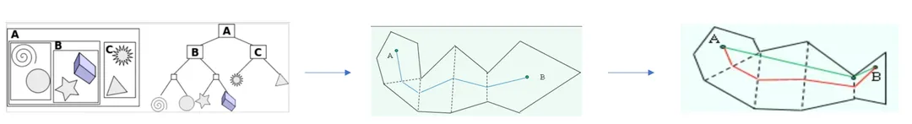

## Recast具体原理

### 加载场景数据

  * 流程开始截图  
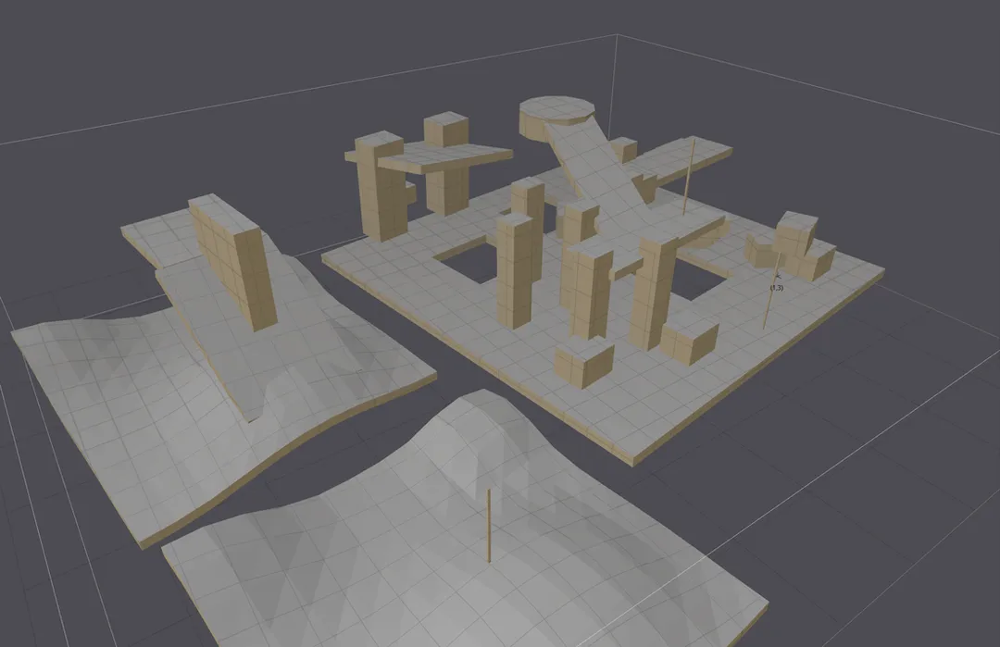

  * Recast的输入主要包括原始模型数据和配置数据，之后进行BVH处理

    * 配置数据  
  
```c
struct rcConfig
{
	int width; // 场景中x向的cell个数
	int height; // 场景中z向的cell个数
	int tileSize; // tile正方形的边长
	int borderSize; // 指定距离四周边界多远的区域不用生成导航数据，缩小需要生成的区域
	float cs; // cell size
	float ch; // cell height
	float bmin[3]; // 场景包围盒坐标
	float bmax[3]; // 场景包围盒坐标
	float walkableSlopeAngle; // 最大可行走坡度
	int walkableHeight; // 最小可行走通过的高度
	int walkableClimb; // 最大的可攀爬高度
	int walkableRadius; // agent的半径
	int maxEdgeLen; // 最终导航网格中多边形周长的最大值，限定多边形的大小
	float maxSimplificationError; // 最终导航网格中多边形周长的最大值，限定多边形的大小	
	int minRegionArea; // 独立岛屿region的最小cell数目
	int mergeRegionArea; // span数目小于此值的region都将被合并
	int maxVertsPerPoly; // 多边形的最多顶点数目
};
```

* 通过InputGemo::loadMesh接口解析原始Obj文件

  * 为了方便后续的体素操作，采用InputGeom::rcCreateChunkyTriMesh来构建BVH层次包围盒  

```c	
const float* verts;///输入的顶点集合
const int* tris;///输入的三角形集合
int ntris;///输入的三角形个数
	
///三角形在xz平面投影的包围盒
struct BoundsItem
{
	float bmin[2];
	float bmax[2];
	int i;///由于会对包围盒按坐标排序，id记录了这个包围盒对应的输入三角形的id
};
	
///BVH的节点
struct rcChunkyTriMeshNode
{
	float bmin[2];///包含区域内所有三角形的包围盒
	float bmax[2];
	int i;///i为正表示是叶子节点；i为负表示是非叶子节点，大小等于在数组内的覆盖范围
	int n;///节点内包含的三角形个数
};
	
///一棵BVH树
struct rcChunkyTriMesh
{
	rcChunkyTriMeshNode* nodes;///根节点
	int nnodes;///节点个数
	int* tris;///按区域划分排序后的三角形集合
	int ntris;///三角形个数
	int maxTrisPerChunk;///叶子节点最多包含的三角形数
}
```

### 将输入的三角面体素化

  * 该流程后截图如下 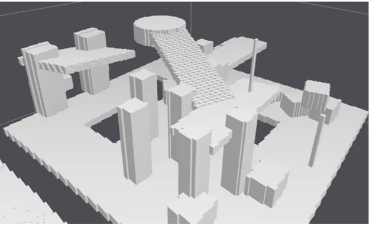

#### 过滤不可行走三角形面

  * 对场景中所有的2D表面基于**最大可行走坡度walkableSlopeAngle进行可行走性判断，**即判断法线与竖直夹角是否小于设定的**walkableSlopeAngle。**  
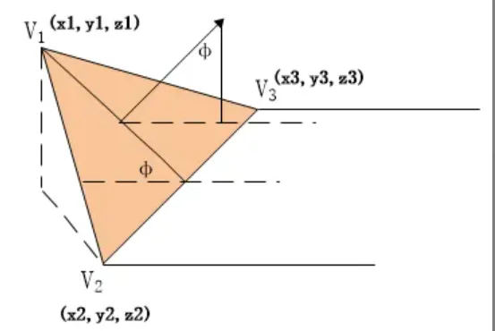  

  * 部分源码参考

```c
void rcMarkWalkableTriangles(rcContext* ctx, const float walkableSlopeAngle,
							 const float* verts, int nv,
							 const int* tris, int nt,
							 unsigned char* areas)
{
	rcIgnoreUnused(ctx);
	rcIgnoreUnused(nv);
	const float walkableThr = cosf(walkableSlopeAngle/180.0f*RC_PI);
	float norm[3];
	for (int i = 0; i < nt; ++i)
	{
		const int* tri = &tris[i*3];
		calcTriNormal(&verts[tri[0]*3], &verts[tri[1]*3], &verts[tri[2]*3], norm);
		// Check if the face is walkable.
		if (norm[1] > walkableThr)
			areas[i] = RC_WALKABLE_AREA;
	}
}
```

#### 体素化三角面

  * 体素化三角面主要遍历所有三角面转换成空间内的体素集，找到三角形的 AABB 包围盒，计算三角形的y轴高度，按投影的XZ平面切割三角形（每次切割的单位长度都是一个 Cell Size）

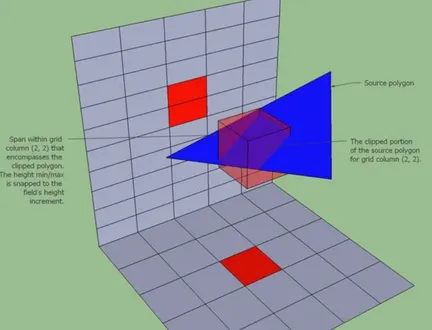 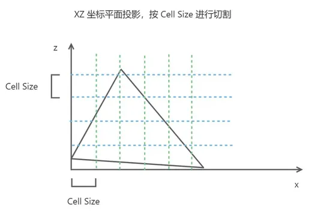

#### 建立高度场

* 相关数据结构。Recast采用rcSpan与rcHeightfield来表达体素后的结果。

  * rcSpan：表达一列（xz平面投影相同）连续的体素盒子。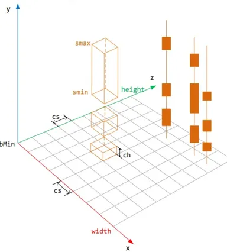   
  
```c
struct rcSpan
{
	unsigned int smin : RC_SPAN_HEIGHT_BITS; ///< The lower limit of the span. [Limit: < #smax]
	unsigned int smax : RC_SPAN_HEIGHT_BITS; ///< The upper limit of the span. [Limit: <= #RC_SPAN_MAX_HEIGHT]
	unsigned int area : 6;                   ///< The area id assigned to the span.
	rcSpan* next;                            ///< The next span higher up in column.
};
```

  * rcHeightfield
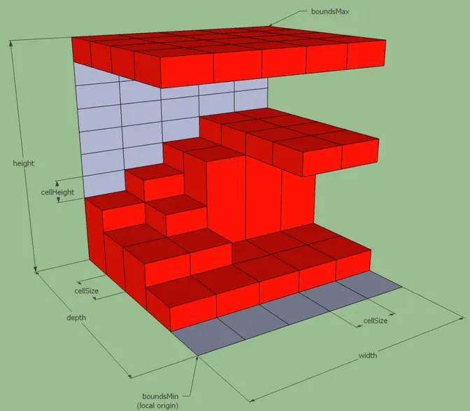

  * 高度场是容纳了所有地图元素的一个容器，其维护了一个二维数组（表示 XZ 平面），数组元素是**在 XZ 平面投影相同的 span 的链表。**

  * AddSpan：创建rcSpan并加入高度场的主要在AddSpan中实现。

    * 添加Span到高度场时，若和同一列中现有Span重合，则可以合并为一个Span;

    * 若不重合，则可以构成单向链表。  
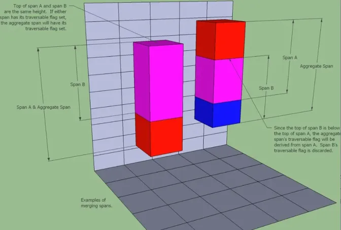  
  
```c
struct rcHeightfield
{
	rcHeightfield();
	~rcHeightfield();
	
	int width;          ///< The width of the heightfield. (Along the x-axis in cell units.)
	int height;         ///< The height of the heightfield. (Along the z-axis in cell units.)
	float bmin[3];      ///< The minimum bounds in world space. [(x, y, z)]
	float bmax[3];      ///< The maximum bounds in world space. [(x, y, z)]
	float cs;           ///< The size of each cell. (On the xz-plane.)
	float ch;           ///< The height of each cell. (The minimum increment along the y-axis.)
	rcSpan** spans;     ///< Heightfield of spans (width*height).
	rcSpanPool* pools;  ///< Linked list of span pools.
	rcSpan* freelist;   ///< The next free span.
	
private:
	// Explicitly-disabled copy constructor and copy assignment operator.
	rcHeightfield(const rcHeightfield&);
	rcHeightfield& operator=(const rcHeightfield&);
};
```

### 过滤不可行走表面

  * 该步骤完成后最终效果图如下，蓝色表示都是可行走的区域。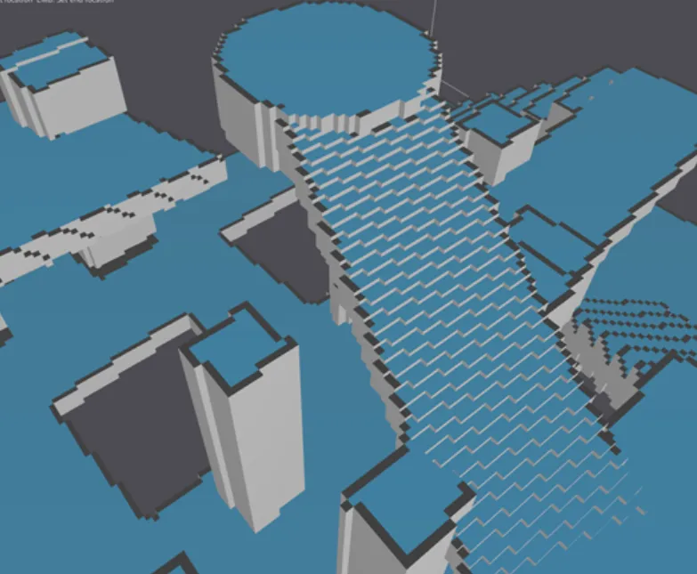

  * 过滤不可攀爬体素（**rcFilterLowHangingWalkableObstacles**）：根据同一个 XZ 坐标不同 Span 之间,如果它们的距离小于 walkableClimb ,并且下面的 Span可走,则把上面的 Span 也标记成可走, 即处理台阶楼梯之类的情形。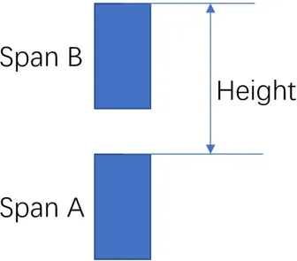

  * 过滤不可达体素包围的体素（**rcFilterLedgeSpans**）：和周围的 Span 比较，Span 的高度差是否大于 Agent 高度，小于 Agent 高度，说明不够高，无法行走，如果 Span 的 4 个方向都不满足,该 Span 也会被判断定为不能走。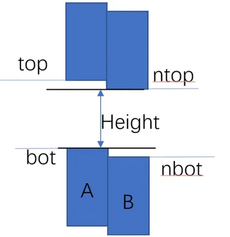

  * 过滤高度较低的体素（**rcFilterWalkableLowHeightSpans**）：判断当前格子所形成的空间，是否足够高（> Agent 高度），不够高也判断为不可走，如下图所示，同一个 XZ 坐标上，一系列的 Span 之间的高度差要足够容纳agent的高度。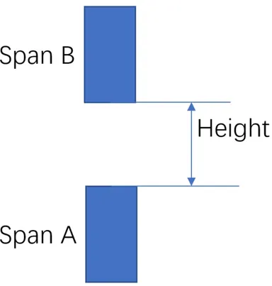

### 划分可行走表面为 Region

  * 该步骤最终效果如下，不同区域颜色不同，之间不重叠。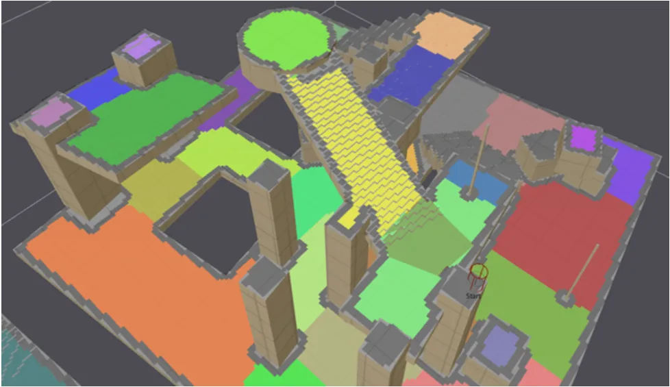

#### 高度场转换为紧缩高度场（**rcBuildCompactHeightfield**）

* 反体素：recast生成导航数据时，并不会直接使用高度场信息，而是先将高度场转为紧凑高度场，即构建rcCompactSpan，再构建rcCompactHeightfield。  
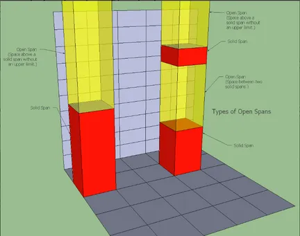  

* 相关数据结构

  * rcCompactSpan:由上下rcSpan的上下表面高度之差求出此rcCompactSpan的高度y。  

```c
/// Represents a span of unobstructed space within a compact heightfield.
struct rcCompactSpan
{
	unsigned short y;			///< The lower extent of the span. (Measured from the heightfield's base.)
	unsigned short reg;			///< The id of the region the span belongs to. (Or zero if not in a region.)
	unsigned int con : 24;		///< Packed neighbor connection data.    与 Neighbor Span 的连通性，这里 24bit，每 6 bit 一个方向（）
	unsigned int h : 8;			///< The height of the span.  (Measured from #y.)
};
```

* rcCompactHeightfield与rcCompactCell：rcCompactHeightfield中的**spans数组大小为spanCount，标记了所有的可行走的CompactSpan，**此时不能再通过x向及z向cell定位到对应CompactSpan，为了加速定位，引入了rcCompactSpan  

```c
/// A compact, static heightfield representing unobstructed space.
/// @ingroup recast
struct rcCompactHeightfield
{
	// some define 
	float bmin[3];				///< The minimum bounds in world space. [(x, y, z)]
	float bmax[3];				///< The maximum bounds in world space. [(x, y, z)]
	float cs;					///< The size of each cell. (On the xz-plane.)
	float ch;					///< The height of each cell. (The minimum increment along the y-axis.)
	rcCompactCell* cells;		///< Array of cells. [Size: #width*#height]                          Cell 的合集，这里采用一维数组表示
	rcCompactSpan* spans;		///< Array of spans. [Size: #spanCount]							     所有数组的合集，这里采用一维数组表示
	unsigned short* dist;		///< Array containing border distance data. [Size: #spanCount]       记录距离场
	unsigned char* areas;		///< Array containing area id data. [Size: #spanCount]               记录区域是否可行走，或者草地山地等情况
};

/// Provides information on the content of a cell column in a compact heightfield. 
struct rcCompactCell
{
	unsigned int index : 24;	///< Index to the first span in the column. XZ 平面下的坐标，参考右图 					
	unsigned int count : 8;		///< Number of spans in the column. 8 位，理论上不会超过 256 个 Span					      
};
```  

  * 连通性判断

    * 获取到所有 CompactSpan 之后，再计算每个 CompactSpan 与它的 Neighbor Compact Span 的联通性,有如下两个条件：

      * 首先两个多边形需要邻接，有公共边

      * 合并后公共边的两个顶点需要为凸点（不然又变成了凹多边形）

      * 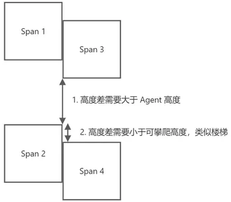   

  * con成员:CompactSpan之间的连通性保存在内部的con成员中，作为一个24bit的整数，表示在平面视图中上下左右四个方向的连通性，每6bit表示一个方向。

#### 裁减区域边缘（**rcErodeWalkableArea**）

  * 主要对边界区域进行裁剪，目的主要是为了让玩家模型和边界保留一定距离（防止贴着墙走，穿模到墙内），主要步骤如下：

    * 筛选边界Span，Span需要满足**Neighbor Span数量小于4**（比如地图边界或者在柱子旁）

    * 新增一个dist整型数组（长度为 Span 的数量），记录可行走Span与上述筛选出来的Span的距离（单位是体素盒子），第一步筛选出来的Span的dist值均设置为0，其他Span默认值为255。

    * 分**两次**遍历，第一次从左下角到右上角遍历XZ平面每个格子的Span，用当前Span下半部分的4个格子更新dist数组（比较格子与Span的大小，取min值作为dist值），第二次从右上角向左下角遍历XZ平面每个格子，用当前Span上半部分的4个格子更新dist数组

    * 遍历dist数组，将对应Span的dist距离小于（角色半径/Cell Size）的Span都设置为不可行走。

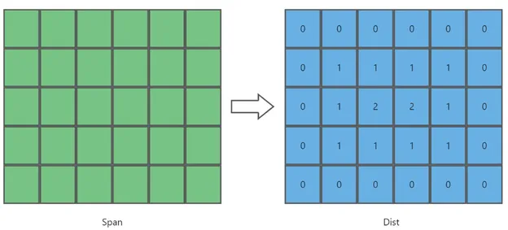

#### 区域划分算法

  * 再次构建距离场（**rcBuildDistanceField**）：与**用玩家模型半径修剪可行走区域边界**中构建的 dist 数组基本一致，区别在于非边界 Span的定义：

    * 需要前后左右 4 个方向都存在连通邻居。

    * 连通邻居的 area id 也需要与当前Span的**area id**相同。

### - 关于area id，recast默认情况下只有2种area id，可行走和不可行走，RecastDemo提供了一种功能，在demo左侧的工具栏目中可以利用create convex volumns来创建不同的区域。

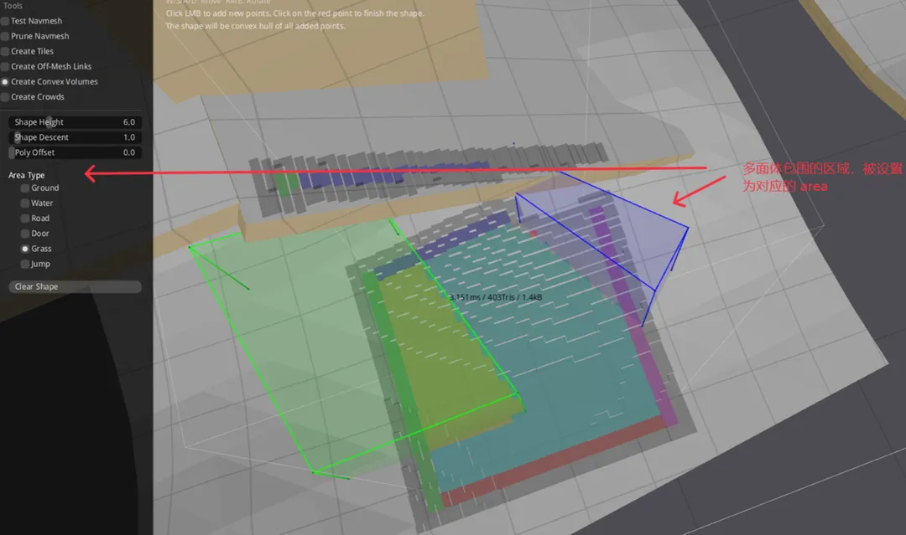

  * 模糊降噪处理：遍历 Span 的 8 个邻居 Span，合计 9 个 Span，`(dist[1] + ... dist[9]) / 9`，当某个邻居不连通时，则用自身的 Dist 值补上。然后将计算出来的值作为当前 Span 新的 Dist 值。  

  * 区域划分（rcBuildRegions）。recast中提供了三种区域划分算法：

    * 分水岭(watershed) :recast默认算法，效果好，速度慢。

      * 分水岭算法基本原理为将**构建得到的距离场看作深度场，距离边界越远，深度越深**；然后向深度场内注水，水往低处流，会优先填满多个最深的地方，继续注水直到多个水域相交，最终得到的多个水域即为划分的区域。  
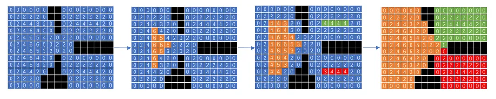

      * RegionId与srcReg：srcReg数组保存了每个CompactSpan对应的Region（区域）信息，在开始灌水前先会基于基于borderSize标记对应范围的Region为边界Region，分水岭算法中RegionId从1开始递增，最终不同区域的Region Id各不相同。

      * floodRegion是分水岭算法中**"产生水源"**的接口，主要思想是**为指定位置的CompactSpan的Region赋予指定Id，并以从它开始，采用深度优先的方式，查找满足条件的邻居并为其赋予该Region Id**。

      * expandRegions使用floodRegion产生的水源进行灌水。

      * 具体过程：

        * **初始区域划分**：首先对当前区域根据前面构建的距离进行划分，默认情况下如果区域过大（距离场中最大的距离 maxDist > 16），会划分为 maxDist / 16 次进行处理，以保证后续每次处理长度为8的数组（不同数组梯度差值为2）。

        * **区域内span划分**：选定好区域之后，对区域内的 Span 进一步划分，拆分到 8 个 数组中（这里的拆分根据距离来，如 dist 值为 0~2 的存放到一个数组，2~4 为一个数组，直到15-16为一个数组）。

        * **中心注水**：首先对最中心的区域（距离最远的那个数组）先调用 `floodRegion` 进行注水：以一个 Span 作为起始点，按 4 邻域泛洪填充它所能扩展到的区域（填充操作就是给 Span 设置 Region id），每次处理新的节点时，会先判断它的 8 个邻接节点是否已经有了更早的填充标记，如果有，则说明当前节点处于区域相交处，先跳过该节点。

        * **数组遍历**：接着遍历下一个数组，先检查能否通过 `expandRegion` 合并到之前的区域中，合并条件是两个 Span 是否有相同的 area_id （目前来看除了不能行走的区域，area id 应该都是相同的），有则合并。

        * **再次注水**：`expandRegion` 完毕后检查有没有 Span 仍然没有 region id，如果有，说明 area id 不一样，再对其进行 `floodRegion` 注水操作

        * 以此类推，直到所有区域的数组遍历操作完毕，区域也就划分完了

    * Monotone：速度快。但是生成的 Region 可能会又细又长，效果一般。

    * layers：类同monotone，只是区域在生成过程中不会有叠层(不会跨相同x、z坐标的多个y坐标体素)。

### 划分区域，构建区域轮廓顶点集合

  * 最终效果图如下，最终保留为区域轮廓上一系列简化的多边形节点。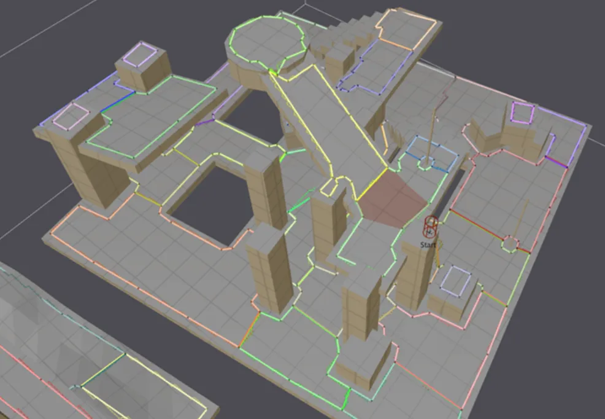

#### 合并区域Region

  * 获取每个Region的邻接Region，若其Span数量过少（小于minRegionArea）并且不和边界相连的区域进行处理，将其直接和相邻Region进行合并。

#### 获取Region轮廓顶点集

  * 初始化区域边界：遍历紧缩高度场中的 Span，根据 Region id（区域标记）求出每个span与周围相邻 Span 的区域关系，用一个 4 位的 2 进制数来表示，如果相邻 Span 为同个 Region，则对应的标记记为 0，这样最后得到的 flag 若为0，则表示是一个区域内部的span (4 面都是同一个 Region)，否则就是一个区域边界上的 span。  

  * 获取 Region 边界的轮廓顶点集（walkContour），以一个边界span作为起始位置，顺时针方向判断它的4条边：

    * 若当前边是区域分界边，则将边的一个顶点加入到轮廓顶点集中，并继续判断下一条边

    * 若当前边不是区域分界边，则移动到与这条边相邻的Span中（这个 Span 是在同一个区域内，重新判断新的Span的边（重新顺时针方向依次判断）

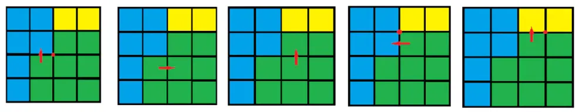

#### 简化轮廓顶点集

  * 使用尽可能少的直线段来逼近带毛刺的边界，对于轮廓线段，遍历线段中间的其它顶点，找到偏离线段最远的顶点，如果偏离距离大于指定值，则将该顶点加入轮廓，如下所示：  
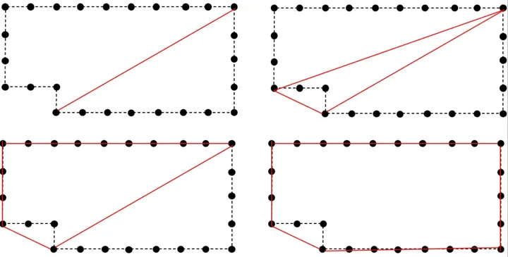

  * 相关数据结构。最终得到的所有轮廓点会存储于轮廓集合**rcContourSet**中，主要数组结构如下所示：  

```c
// 一条轮廓线段
struct rcContour
{
	int* verts;			//简化后轮廓顶点数组
	int nverts;		//简化后顶点数目
	int* rverts;		//原始顶点数组
	int nrverts;		//原始顶点数目
	unsigned short reg;	//拾取轮廓的起始CompactSpan对应Region
	unsigned char area;//拾取轮廓的起始CompactSpan对应area
};

struct rcContourSet
{
	rcContour* conts;	//轮廓数组
	int nconts;		//轮廓数组
	float maxError;	//简化时的最大距离
};
```

  * 孔洞处理。

    * 找出孔洞：利用calcAreaOfPolygon2D计算轮廓面积，孔洞是顺序存储，计算结果是负数。

    * 处理孔洞：找出空洞左下角点A1，将所有顶点与A1相连，找出和孔洞及外轮廓都不相割的线中距离最短的一条使用该条线将孔洞及外轮廓合并为一个轮廓。  
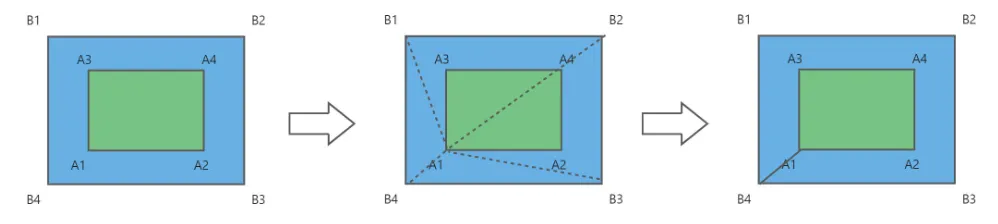

### 将多边形转换为需要的凸多边形

  * 最终效果图如下，将一系列轮廓细分为凸多边形，构建出rcpolyMesh。  
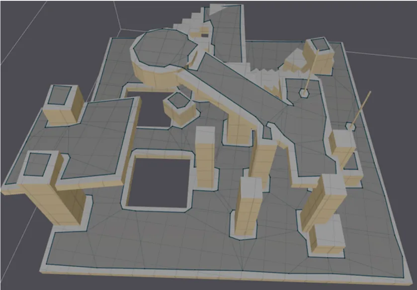

#### 三角剖分

  * 利用耳切法对凸多边形进行切分，每次找出分割线最短的耳朵。

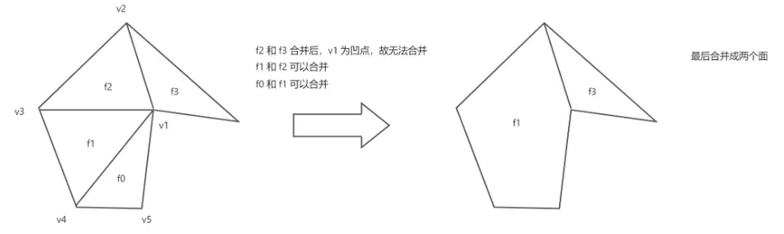

#### 合并三角形

  * 将凸三角形转化为凸多边形，以减少多边形数量，合并条件为：

    * 首先两个多边形需要邻接，有公共边

    * 合并后公共边的两个顶点需要为凸点（不然又变成了凹多边形）  


  * 相关数据结构。得到凸多边形还需要构建凸多边形的连通性（**buildMeshAdjacency**），生成最终的PolyMesh数据，邻接性信息主要存储在polys成员下，对于每个多边形，前nvp个数存顶点id，后nvp个数存与它相邻的多边形id（n个顶点最多与n个多边形相邻）。  

```c
struct rcPolyMesh
{
	unsigned short* verts;	// 所有的多边形顶点信息
		int nvp;		// 一个多边形中的最多顶点个数
	unsigned short* regs;	// 每个多边形对应的region id
	unsigned char* areas;	// 每个多边形对应的area
	int nverts;		// 顶点总数
	int npolys;		// 多边形总数
	int maxpolys;		// 耳割后的初始的三角形个数
	unsigned short* polys;	// 多边形顶点index及邻居多边形index. [Length: #maxpolys * 2 * #nvp]
};
```

### 对凸多边形的高度进行修正

  * 最终效果图如下，主要通过Delaunay三角形剖分来完善细节，将rcPolyMesh转化为rcDetailedMesh。

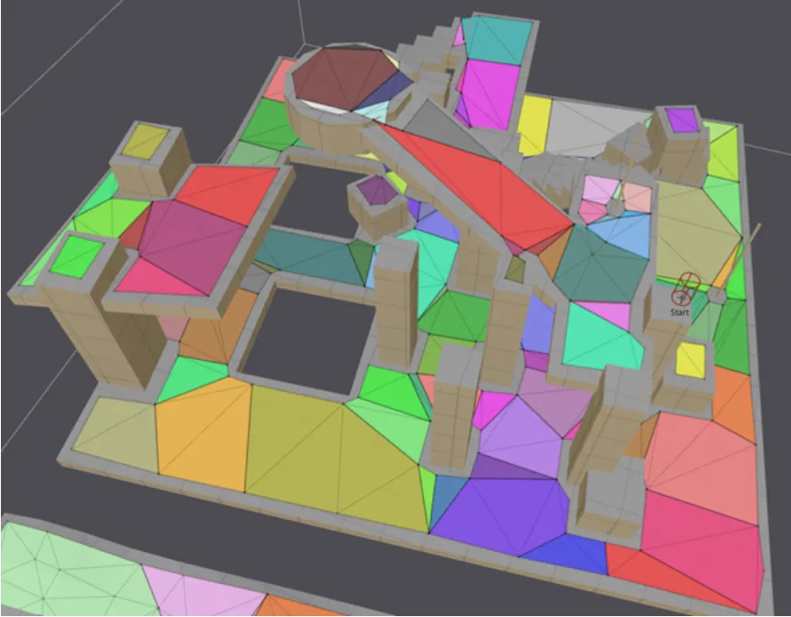

#### 获取高度补丁与轮廓高度修正

  * 对每条边进行分段采样点，高度差超过阈值的话则增加一个新的轮廓点。  
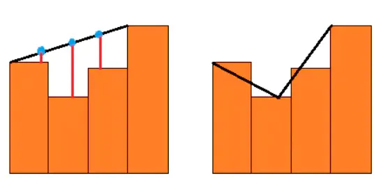

  * 新增点的轮廓需要进行再次进行耳切法进行三角化。

#### 多边形内部高度修正

  * 内部采样点进行同样的操作。  
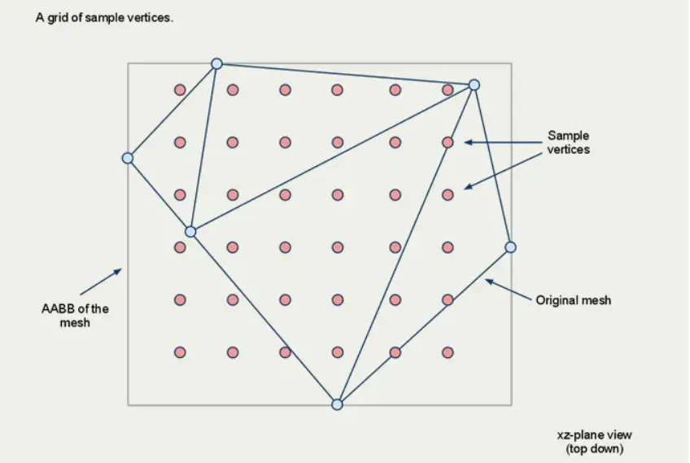

## Detour具体原理

### 找出点所在多边形()

  * 根据recast求出的最后的凸多边形构建一颗BV树，之后通过查找BV树来找到点对应的多边形（**findNearestPoly**）。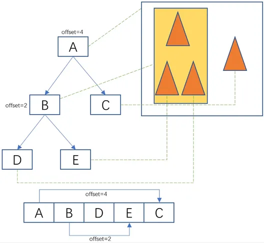

  * 相关数据结构

    * dtMeshTile：Detour会将Recast中得到的PolyMesh进行数据转化，其中每个Tile中的导航信息保存在dtMeshTile。  

```c
struct dtMeshTile
{
	unsigned int salt;			// 标记当前Tile是否有变更
	dtMeshHeader* header;			// 继续Tile的整体信息
	dtPoly* polys;				// 所有的多边形信息
	float* verts;				// 所有的顶点信息
	dtLink* links;				// 多边形间的连接信息数组，每个多边形对应一个dtLink*，dtLink*是一个单向链表，存储了该多边形的所有连接信息
	dtPolyDetail* detailMeshes;		// 细节网格数据
	float* detailVerts;	                // 细节网格顶点
	unsigned char* detailTris;	        // 细节网格三角形
	dtBVNode* bvTree;                       // 多边形对应的BV树
	dtMeshTile* next;		        // 下一个tile
};
```

* dtPoly:dtPoly中的flags可以代表不同的寻路成本。  

```c
struct dtPoly
{
	unsigned int firstLink;
	unsigned short verts[DT_VERTS_PER_POLYGON]; //多边形节点索引 从dtMeshTile::verts中取元素
	unsigned short neis[DT_VERTS_PER_POLYGON]; //每条边对应的邻居
	unsigned short flags; // 用户定义标记，不同类型flag对应不同的寻路成本
	unsigned char vertCount; // 多边形数量
	unsigned char areaAndtype; // 对应type和area 高2bit表示type 低6bit表示area
};
```

    * dtBVNode：叶子节点的i表示poly id,而非叶子节点则表示右边子节点的跨度。  

```c
struct dtBVNode
{
	unsigned short bmin[3];			// 该节点包含的多边形的AABB包围盒下边界
	unsigned short bmax[3];			// 该节点包含的多边形的AABB包围盒上边界
	int i;					// 表示Poly id或者右边子节点的跨度
};
```

### 使用A*算法求出多边形序列路径

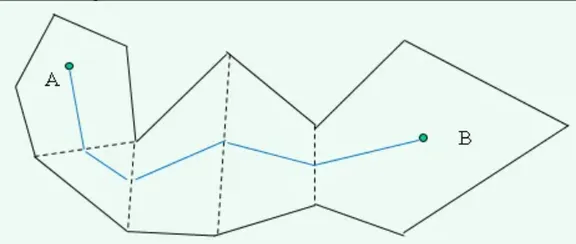

  * 使用标准的A*算法进行寻路，其中多边形的F值计算组成如下：

    * G：parent凸多边形的G值 + 代表parent凸多边形的顶点到parent与该多边形公共边中点的欧几里得距离。

    * H：parent与该多边形公共边中点到终点的欧几里得距离。  

  * 相关数据结构。dtNode代表A*算法中的图节点。  

```c
struct dtNode
{
	float pos[3];								///< Position of the node.
	float cost;									///< Cost from previous node to current node.
	float total;								///< Cost up to the node.
	unsigned int pidx : DT_NODE_PARENT_BITS;	///< Index to parent node.
	unsigned int state : DT_NODE_STATE_BITS;	///< extra state information. A polyRef can have multiple nodes with different extra info. see DT_MAX_STATES_PER_NODE
	unsigned int flags : 3;						///< Node flags. A combination of dtNodeFlags.
	dtPolyRef id;								///< Polygon ref the node corresponds to.
};
```

### 使用拉绳算法（漏斗算法）平滑路径

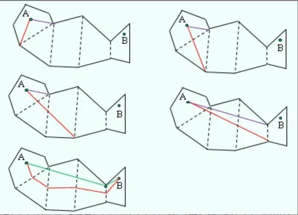

  * 根据起点初始化漏斗端口。起点A不仅作为漏斗的初始顶点，也作为漏斗的初始两个端口，此后两个端口不停地向公共边的两个端点移动。  

  * 漏斗左右端点继续移动，需要满足下面2个条件:

    * 移动端点后的边是朝向漏斗收缩的方向。

    * 移动端点后的边没有跨过另外1条边。  

  * 增加新的漏斗顶点：如果移动端点后的边是朝向漏斗收缩的方向，但会跨过另外1条边。此时将另外1个端点加入路径，并将其更新为新漏斗的顶点。

## TempObstacles障碍实现原理

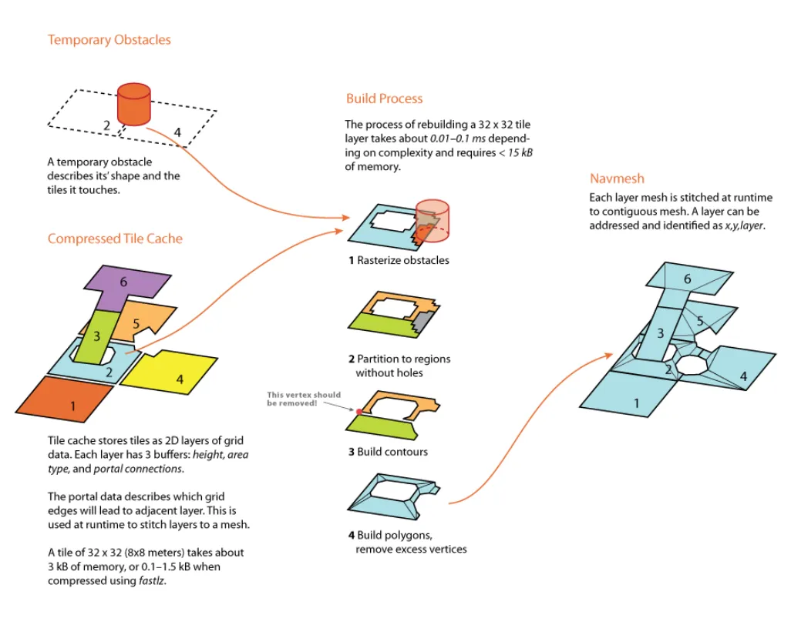

  * recast中的TempObstacles支持向场景中动态添加或移除预设形状的阻挡物，导航网格也会随之更新。  

  * 与SoloMesh相比,TempObstacles的差异体现为两个方面：

    * tile分割的思想：在处理动态阻挡时，由于单个阻挡对地图的影响区域是有限的，所以会采用将地图切割成多个固定大小的tile，以tile为单位进行网格的生成。这样在添加或移除阻挡时，只需要处理与阻挡相交的tile，而不需要处理整个地图。

    * 动态阻挡会存储压缩的高度域信息（光栅化和创建高度域占据的时间占据大头，所以会存储此部分压缩数据）到**tile cache**，在运行时如果有进行动态障碍的更改，通过对tile设定的触发器，重新进行构建操作。  

```c
//TempObstacles的大致运作流程
Preprocess
for each tile
- rasterize static triangles
- find walkable cells
- mark areas
- store compressed heighfield

At Run Time
for a changed tile
- uncompressed heighfield
- mark obstacles
- build regions
- build contours
- build poly mesh
- build detail mesh
- store navmesh
```

## DetourCrowd

### **局部转向和动态避让**

  * 目标是为了防止Agent相互碰撞。

#### 局部转向

  * 主要关注的是代理（agents）在局部环境中的路径选择和转向行为，使代理能够沿着期望的路径移动。  

  * 局部转向可以基于一系列行为规则（如分离、对齐、聚集）来调整代理的运动,这些行为规则可以组合形成复杂的群体行为模式。例如，分离行为确保代理保持一定距离，对齐行为使代理匹配周围代理的方向，聚集行为使代理向群体中心移动。

#### **动态避让（Dynamic Avoidance）**

  * 动态避让主要关注的是代理在移动过程中如何避开动态障碍物（包括其他移动的代理）以防止碰撞。

### **代理添加和配置**

  * 将Agent添加到DetourCrowd后，通过提供各种配置设置，例如最大速度和加速度，和一个本地目标，DetourCrowd在每次更新时都会提供帧的新代理位置和速度。  

```c
// 创建 DetourCrowd 对象
dtCrowd* crowd = dtAllocCrowd();
// 初始化 DetourCrowd
crowd->init(maxAgents, maxAgentRadius, navMesh);
// 配置代理参数
dtCrowdAgentParams ap;
memset(&ap, 0, sizeof(ap));
ap.radius = agentRadius;
ap.height = agentHeight;
ap.maxAcceleration = maxAcceleration;
ap.maxSpeed = maxSpeed;
// 添加代理到 DetourCrowd
int agentId = crowd->addAgent(startPosition, &ap);
// 设置代理目标
crowd->requestMoveTarget(agentId, targetPosition);
// 在每帧更新代理位置和速度
crowd->update(deltaTime, nullptr);
```

  * 运动将受到导航网格的限制，并将应用转向以确保由人群管理的代理不会相互碰撞。  

  * 局限性:

    * Agent的目标距离其当前位置不应超过 256 个多边形。长距离计划需要为DetourCrowd提供中间目标。

    * 所有使用DetourCrowd的Agent都将使用相同的 dtQueryFilter。

    * 最大代理数量应该控制在 20 到 30 之间。

### **DetourCrowd与RVO的对比**

<table><thead><tr><th align="center">特性</th><th align="center">DetourCrowd</th><th align="center">RVO（ReciprocalVelocityObstacles）</th></tr></thead><tbody><tr><td align="center">实现方式</td><td align="center">基于导航网格的路径规划和局部避障</td><td align="center">基于速度障碍理论的局部避障</td></tr><tr><td align="center">路径规划</td><td align="center">使用 A* 算法和路径走廊进行全局路径规划和优化</td><td align="center">不进行全局路径规划，只做局部避障</td></tr><tr><td align="center">避障机制</td><td align="center">通过邻居和障碍物信息进行局部避障，选择最优速度</td><td align="center">计算速度空间，找出不会导致碰撞的速度</td></tr><tr><td align="center">路径优化</td><td align="center">使用切片式 A* 算法和拓扑优化</td><td align="center">不进行路径优化</td></tr><tr><td align="center">依赖性</td><td align="center">强依赖导航网格</td><td align="center">不依赖导航网格</td></tr><tr><td align="center">局部转向</td><td align="center">通过路径走廊和拐点计算</td><td align="center">基于相邻 Agent 的速度进行实时计算</td></tr><tr><td align="center">实时计算</td><td align="center">每个时间步长进行路径和避障更新</td><td align="center">每个时间步长实时计算速度，确保避障</td></tr><tr><td align="center">配置选项</td><td align="center">多样化配置选项</td><td align="center">配置较少，主要关注避障半径和速度</td></tr><tr><td align="center">复杂性</td><td align="center">包含路径规划、优化和动态避障，多步骤复杂实现</td><td align="center">实现较简单，专注于局部避障</td></tr><tr><td align="center">最大路径长度</td><td align="center">目标距离不超过 256 个多边形，需提供中间目标</td><td align="center">无全局路径规划限制</td></tr><tr><td align="center">过滤器</td><td align="center">所有 Agent 使用相同的 dtQueryFilter</td><td align="center">无过滤器</td></tr><tr><td align="center">最大 Agent 数量</td><td align="center">建议 20 到 30 个 Agent</td><td align="center">理论上无限制，但实际效果取决于计算性能</td></tr><tr><td align="center">适用场景</td><td align="center">适合大规模人群模拟和复杂环境中的路径规划</td><td align="center">适合需要快速局部避障的场景</td></tr><tr><td align="center">局限性</td><td align="center">配置和计算复杂，路径长度和 Agent 数量有限制</td><td align="center">不使用导航网格，可能导致越界，适用场景有限</td></tr></tbody></table>

## Off-Mesh Connections

  * 在各种情况下，希望能够表示智能体以各种方式离开环境地面的可能性。例如，在电子游戏中，可能需要表示敌人从上面的地板上跳下来攻击玩家的可能性。或者，可能需要表示代理可以使用电梯（电梯）在建筑物的楼层之间移动。Recast支持使用off-Mesh Link表示有关此类“网格外连接”的信息，并在查找代理路径时将任何网格外连接集成到搜索图中。  

  * 指定off mesh link:根据放置在网格表面上的“端点”以及这些端点之间的连接来指定。

    * 下图显示了两个端点被放置在两个地面之间的悬垂上方和下方，然后连接在一起，使代理能够从悬垂处跳下来。  
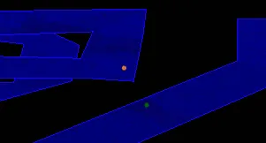  
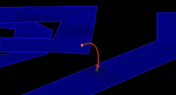

  * 运动方向:off mesh link是定向的。在上面的示例中，从端点 0 到端点 1 的单个连接表示代理能够从悬垂处跳下，但随后无法跳回。如果需要在一对端点之间进行双向移动，则需要指定两个连接，每个方向一个连接。  

  * 指定网外移动的成本:可以对每个off mesh link指定一个惩罚，以指定该移动会产生一些成本。在连接上移动的成本是端点之间的直线距离加上指定的任何惩罚。

## 参考文章

  * [拉绳算法](https://blog.csdn.net/romantic_jie/article/details/114012756)  
  * [现代游戏常用的几种寻路方案](https://github.com/fff455/tech-share/blob/master/GameDev/%E7%8E%B0%E4%BB%A3%E6%B8%B8%E6%88%8F%E5%B8%B8%E7%94%A8%E7%9A%84%E5%87%A0%E7%A7%8D%E5%AF%BB%E8%B7%AF%E6%96%B9%E6%A1%88.md)  
  * [RecastNavigation之Recas](https://www.cnblogs.com/lawliet12/p/16442212.html)
