 
<!--BEGIN_DATA
{
    "create_date": "2021-02-04 22:30", 
    "modify_date": "2021-02-04 22:30", 
    "is_top": "0", 
    "summary": "小议WebRTC拥塞控制算法：GCC介绍", 
    "tags": "WebRTC", 
    "file_name": "小议WebRTC拥塞控制算法：GCC介绍"
}
END_DATA-->

#### 
原文出处：<a href='https://www.cnblogs.com/wangyiyunxin/p/11122003.html' target='blank'>小议WebRTC拥塞控制算法：GCC介绍</a>

网络拥塞是基于IP协议的数据报交换网络中常见的一种网络传输问题，它对网络传输的质量有严重的影响，网络拥塞是导致网络吞吐降低，网络丢包等的主要原因之一，这些问题使得上层应用无法有效的利用网络带宽获得高质量的网络传输效果。特别是在通信领域，网络拥塞导致的丢包，延迟，抖动等问题，严重的影响了通信质量，如果不能很好的解决这些问题，一个通信产品就无法在现实环境中正常使用。在这方面WebRTC中的网络拥塞控制算法给我们提供了一个可供参考的实现，本篇文章会尽量详细的介绍WebRTC中的拥塞控制算法---GCC的实现方式。

## WebRTC简介

WebRTC是一个Web端的实时通信解决方案，它可以做到在不借助外部插件的情况下，在浏览器中实现点对点的实时通信。WebRTC已经由W3C和IETF标准化，最早推出和支持这项技术的浏览器是Chrome, 其他主流浏览器也正在陆续支持。Chrome中集成的WebRTC代码已全部开源，同时Chrome提供了一套LibWebRTC的代码库，使得这套RTC架构可以移植到其他APP当中，提供实时通信功能。

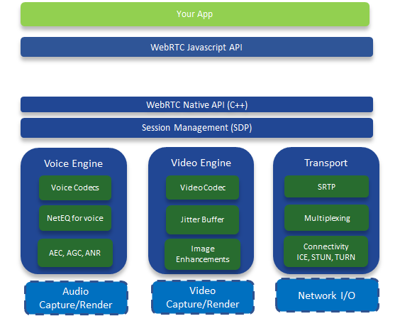

## GCC算法概述

本文主要介绍的是WebRTC的拥塞控制算法，WebRTC的传输层是基于UDP协议，在此之上，使用的是标准的RTP/RTCP协议封装媒体流。RTP/RTCP本身提供很多机制来保证传输的可靠性，比如RR/SR, NACK，PLI，FIR, FEC，REMB等，同时WebRTC还扩展了RTP/RTCP协议，来提供一些额外的保障，比如Transport-CCFeedback, RTP Transport-wide-cc extension，RTP abs-sendtime extension等，其中一些后文会详细介绍。

GCC算法主要分成两个部分，一个是基于丢包的拥塞控制，一个是基于延迟的拥塞控制。在早期的实现当中，这两个拥塞控制算法分别是在发送端和接收端实现的，接收端的拥塞控制算法所计算出的估计带宽，会通过RTCP的remb反馈到发送端，发送端综合两个控制算法的结果得到一个最终的发送码率，并以此码率发送数据包。下图便是展现的该种实现方式：

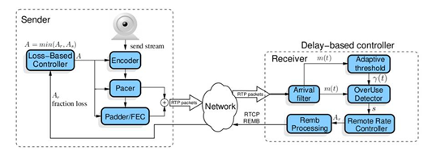

从图中可以看到，Loss-Based Controller在发送端负责基于丢包的拥塞控制，它的输入比较简单，只需要根据从接收端反馈的丢包率，就可以做带宽估算；上图右侧比较复杂，做的是基于延迟的带宽估计，这也是本文后面主要介绍的部分。在最近的WebRTC实现中，GCC把它的两种拥塞控制算法都移到了发送端来实现，但是两种算法本身并没有改变，只是在发送端需要计算延迟，因而需要一些额外的feedback信息，为此WebRTC扩展了RTCP协议，其中最主要的是增加了Transport-CC Feedback，该包携带了接收端接收到的每个媒体包的到达时间。

基于延迟的拥塞控制比较复杂，WebRTC使用延迟梯度来判断网络的拥塞程度，延迟梯段的概念后文会详细介绍；

其算法分为几个部分：

l  到达时间滤波器

l  过载检测器

l  速率控制器

在获得两个拥塞控制算法分别结算到的发送码率之后，GCC最终的发送码率取的是两种算法的最小值。下面我们详细介绍WebRTC的拥塞控制算法GCC。

### （一）基于丢包的带宽估计

基于丢包的拥塞控制比较简单，其基本思想是根据丢包的多少来判断网络的拥塞程度，丢包越多则认为网络越拥塞，那么我们就要降低发送速率来缓解网络拥塞；如果没有丢包，这说明网络状况很好，这时候就可以提高发送码率，向上探测是否有更多的带宽可用。实现该算法有两点：一是获得接收端的丢包率，一是确定降低码率和提升码率的阈值。

WebRTC通过RTCP协议的Receive Report反馈包来获取接收端的丢包率。Receive Report包中有一个lost fraction字段，包含了接收端的丢包率，如下图所示。

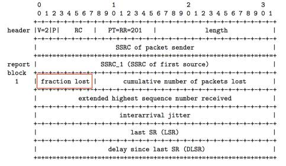

另外，WebRTC通过以下公式来估算发送码率，式中 As(tk) 即为 tk 时刻的带宽估计值，fl(tk)即为 tk 时刻的丢包率：

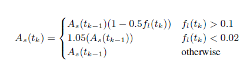

简单来说，当丢包率大于10%时则认为网络有拥塞，此时根据丢包率降低带宽，丢包率越高带宽降的越多；当丢包率小于2%时，则认为网络状况很好，此时向上提高5%的带宽以探测是否有更多带宽可用；2%到10%之间的丢包率，则会保持当前码率不变，这样可以避免一些网络固有的丢包被错判为网络拥塞而导致降低码率，而这部分的丢包则需要通过其他的如NACK或FEC等手段来恢复。

### （二）基于延迟梯度的带宽估计

WebRTC实现的基于延迟梯度的带宽估计有两种版本：

l  最早一种是在接受端实现，评估的带宽结果通过RTCP REMB消息反馈到发送端。在此种实现中，为了准确计算延迟梯度，WebRTC添加了一种RTP扩展头部abs-send-time,
用来表示每个RTP包的精确发送时间，从而避免发送端延迟给网络传播延迟的估计带来误差。这种模式也是RFC和google的paper中描述的模式。

l  在新近的WebRTC的实现中，所有的带宽估计都放在了发送端，也就说发送端除了做基于丢包的带宽估计，同时也做基于延迟梯度的带宽估计。为了能够在接受端做基于延迟梯度的带宽估计，WebRTC扩展了RTP/RTCP协议，其一是增加了RTP扩展头部，添加了一个session级别的sequence number,目的是基于一个session做反馈信息的统计，而不紧紧是一条音频流或视频流；其二是增加了一个RTCP反馈信息transport-cc-feedback，该消息负责反馈接受端收到的所有媒体包的到达时间。接收端根据包间的接受延迟和发送间隔可以计算出延迟梯度，从而估计带宽。

关于如何根据延迟梯度推断当前网络状况， 后面会分几点详细展开讲， 总体来说分为以下几个步骤：

l  到达时间滤波器

l  过载检测器

l  速率控制器

其过程就是，到达时间滤波器根据包间的到达时延和发送间隔，计算出延迟变化，这里会用到卡尔曼滤波对延迟变化做平滑以消除网络噪音带来的误差；延迟变化会作为过载检测器的输入，由过载检测器判断当前网络的状态，有三种网络状态返回**overuse/underuse/normal**，检测的依据是比较延迟变化和一个阈值，其中该阈值非常关键且是动态调整的。最后根据网络状态的变化，速率控制器根据一个带宽估计公式计算带宽估计值。

### （三）到达时间滤波器

前面多次提到WebRTC使用延迟梯度来判断网络拥塞状况，那什么是延迟梯度，为什么延迟梯度可以作为判断网络拥塞的依据，我们在这里详细介绍，首先来看以下，延迟梯度是怎样计算出来的：

#### 1. 延迟梯度的计算

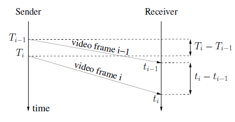

如上图所示，用两个数据包的到达时间间隔减去他们的发送时间间隔，就可以得到一个延迟的变化，这里我们称这个延迟的变化为单向延迟梯度（one way delay gradient），其公式可记为：

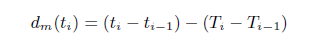

那么为什么延迟梯度可以用来判断网络拥塞的呢，如下面两图所示：

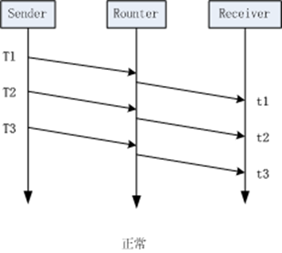

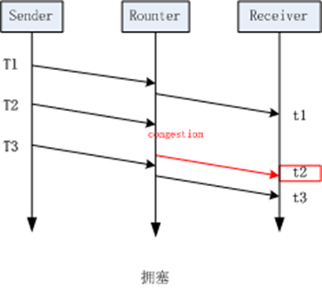

左边这幅图的场景是理想状况下的网络传输，没有任何拥塞，按我们上面提到的公式（2）来计算，这种场景下，所计算到的延迟梯度应该为0。而右边这幅图的场景则是发送拥塞时的状况，当包在t2时刻到达时，该报在网络中经历过一次因拥塞导致的排队，这导致他的到达时间比原本要完，此时计算出的延迟梯度就为一个较大的值，通过这个值，我们就能判断当前网络正处在拥塞状态。

在WebRTC的具体实现中，还有一些细节来保证延迟梯度计算的准确性，总结如下：

l  由于延迟梯度的测量精度很小，为了避免网络噪音带来的误差，利用了卡尔曼滤波来平滑延迟梯度的测量结果。

l  WebRTC的实现中，并不是单纯的测量单个数据包彼此之间的延迟梯度，而是将数据包按发送时间间隔和到达时间间隔分组，计算组间的整体延迟梯度。分组规则是：

1) 发送时间间隔小于5ms的数据包被归为一组，这是由于WebRTC的发送端实现了一个平滑发送模块，该模块的发送间隔是5ms发送一批数据包。

2) 到达时间间隔小于5ms的数据包被归为一组，这是由于在wifi网络下，某些wifi设备的转发模式是，在某个固定时间片内才有机会转发数据包，这个时间片的间隔可能长达100ms，造成的结果是100ms的数据包堆积，并在发送时形成burst，这个busrt内的所有数据包就会被视为一组。

l  为了计算延迟梯度，除了接收端要反馈每个媒体包的接受状态，同时发送端也要记录每个媒体包的发送状态，记录其发送的时间值。在这个情况下abs-send-time扩展不再需要。

#### 2.transport-cc-feedback消息

l  该消息是对RTCP的一个扩展，专门用于在GCC中反馈数据包的接受情况。这里有两点需要注意：

l  该消息的发送速率如何确定，按RFC[2]中的说明，可以是收到每个frame发送一次，另外也指出可以是一个RTT的时间发送一次，实际WebRTC的实现中大约估计了一个发送带宽的5%这样一个发送速率。

l  如果这个数据包丢失怎么办，RFC[2]和WebRTC实现中都是直接忽略，这里涉及的问题是，忽略该包对计算延迟梯度影响不大，只是相当于数据包的分组跨度更大了，丢失的包对计算没有太大影响，但另一个问题是，发送端需要计算接受端的接受速率，当feedback丢失时，会认为相应的数据包都丢失了，这会影响接受速率的计算，这个值在后续计算估计带宽中会用到，从而导致一定误差。

具体消息格式如下：

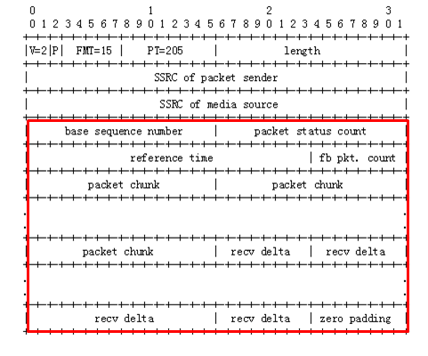

如上图所示，红框之前的字段是RTCP包的通用字段，红框中的字段为transport-cc的具体内容，其中前四个字段分别表示：

l  base sequence number：当前包携带的媒体包的接受信息是从哪个包开始的

l  packet status count：当前包携带了几个媒体包的接受信息

l  reference time：一个基准时间，计算该包中每个媒体包的到达时间都要基于这个基准时间计算

l  fb pkt. count：第几个transport-cc包

在此之后，是两类信息：多个packet chunk字段和多个recv delta字段。其中pcaket chunk具体含义如下：

如下两图所示， 表示媒体包到达状态的结构有两种编码方式， 其中 T 表示chunk type；0表示RunLength Chunk, 1表示Status Vector Chunk.

1）Run LengthChunk

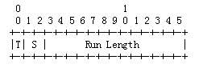

这种表示方式是用于，当我们连续收到多个数据包，他们都有相同的到达状态，就可以用这种编码方式。其中S表示的是到达状态，Run Length表示有多少个连续的包属于这一到达状态。

到达状态有三种：

     00 Packet not received

     01 Packet received, small delta （所谓small detal是指能用一个字节表示的数值）

     10 Packet received, large ornegative delta （large即是能用两个字节表示的数值）

2) Status Vector Chunk

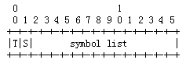

这种表示方式用于每个数据包都需要自己的状态表示码，当然还是上面提到的那三种状态。但是这里的S就不是上面的意思，这里的S指的是symbol list的编码方式，s = 0时，表示symbollist的每一个bit能表示一个数据包的到达状态，s = 1时表示每两个bit表示一个数据包的状态。

s = 0 时

     0 Packet not received

     1 Packet received , small detal

s = 1 时

      同 Run Length Chunk

最后，对于每一个状态为Packet received 的数据包的延迟依次填入|recv delta|字段，到达状态为1的，recv delta占用一个字节，到达状态为2的，recv delta占用两个字节可以看出以上编码的目的是为了尽量减少该数据包的大小，因为每个媒体包都需要反馈他的接受状态。

### （四）过载检测器

到达时间滤波器计算出每组数据包的延迟梯度之后，就要据此判断当前的网络拥塞状态，通过和某个阈值的比较，高过某个阈值就认为时网络拥塞，低于某个阈值就认为网路状态良好，因此如何确定阈值就至关重要。这就是过载检测器的主要工作，它主要有两部分，一部分是确定阈值的大小，另一部分就是依据延迟梯度和阈值的判断，估计出当前的网络状态，一共有三种网络状态: **overuse underuse normal****，**我们先看网络状态的判断。

#### 1.网络状态判断

判断依据入下图所示：

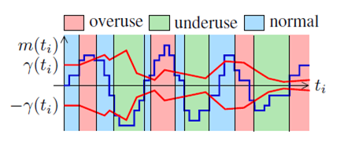

其中表示的是计算出的延迟梯，表示的是一个判断阈值，这个阈值是自适应的， 后面还会介绍他是怎么动态调整的，这里先只看如何根据这两个值判断当前网络状态。

从上图可以看出，这里的判断方法是：

这样计算的依据是，网络发生拥塞时，数据包会在中间网络设备中排队等待转发，这会造成延迟梯度的增长，当网络流量回落时，网络设备快速消耗（转发）其发送队列中的数据包，而后续的包排队时间更短，这时延迟梯度减小或为负值。

这里了需要说明的是：

l  在实际WebRTC的实现中，虽然每个数据包组（前面提到了如何分组）的到达都会触发这个探测过程，但是使用的m(ti)这个值并不是直接使用每组数据到来时的计算值，而是将这个值放大了60倍。这么做的目的可能是m(ti)这个值通常情况下很小，理想网络下基本为0，放大该值可以使该算法不会应为太灵敏而波动太大。

l  在判断是否overuse时，不会一旦超过阈值就改变当前状态，而是要满足延迟梯度大于阈值至少持续100ms，才会将当前网络状态判断为overuse。

#### 2.自适应阈值

上节提到的阈值值，它是判断当前网络状况的依据，所以如何确定它的值也就非常重要了。虽然理想状况下，网络的延迟梯度是0，但是实际的网络中，不同转发路径其延迟梯度还是有波动的，波动的大小也是不一样的，这就导致如果设置固定的 太大可能无法探测到拥塞，太小又太敏感，导致速率了变化很大。同时，另外一个问题是，实验中显示固定的值会导致在和TCP链接的竞争中，自己被饿死的现象（TCP是基于丢包的拥塞控制），因此WebRTC使用了一种自适应的阈值调节算法，具体如下：

（1） 自适应算法

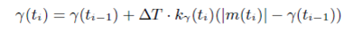

上面的公式就是GCC提出的阈值自适应算法，其中：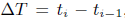，每组数据包会触发一次探测，同时更新一次阈值，这里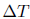的意义就是距上次更新阈值时的时间间隔。

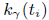是一个变化率，或者叫增长率，当然也有可能是负增长，增长的基值是：当前的延迟梯度和上一个阈值的差值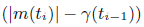。其具体的取值如下：

**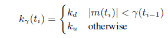**

其中：ku = 0.01; kd = 0.00018

从这个式子中可以看出，当延迟梯度减小时，阈值会以一个更慢的速率减小；延迟梯度增加时，阈值也会以一个更慢的速度增加；不过相对而言，阈值的减小速度要小于增加速度。

#### （五）速率控制器

速率控制器主要实现了一个状态机的变迁，并根据当前状态来计算当前的可用码率，状态机如下图所示：

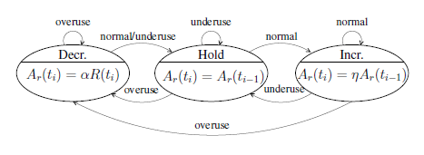

速率控制器根据过载探测器输出的信号（overuse underusenormal）驱动速率控制状态机， 从而估算出当前的网络速率。从上图可以看出，当网络拥塞时，会收到overuse信号，状态机进入“decrease”状态，发送速率降低；当网络中排队的数据包被快速释放时，会受到underuse信号，状态机进入“hold”状态。网络平稳时，收到normal信号，状态机进入“increase”状态，开始探测是否可以增加发送速率。

在Google的paper[3]中，计算带宽的公式如下：

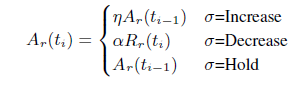

其中  = 1.05， =0.85。从该式中可以看到，当需要Increase时，以前一次的估算码率乘以1.05作为当前码率；当需要Decrease时，以当前估算的接受端码率（Rr(ti)）乘以0.85作为当前码率；Hold状态不改变码率。

最后，将基于丢包的码率估计值和基于延迟的码率估计值作比较，其中最小的码率估价值将作为最终的发送码率。

以上便是WebRTC中的拥塞控制算法的主要内容，其算法也一直还在演进当中，每个版本都有会有一些改进加入。其他还有一些主题这里没有覆盖到，比如平滑发送，可以避免突发流量； padding包等用来探测带宽的策略。应该说WebRTC的这套机制能覆盖大部分的网络场景，但是从我们测试来看有一些特殊场景，比如抖动或者丢包比较高的情况下，其带宽利用率还是不够理想，但总体来说效果还是很不错的。

## Reference

* [1] https://tools.ietf.org/html/draft-ietf-rmcat-gcc-02
* [2] https://tools.ietf.org/html/draft-holmer-rmcat-transport-wide-cc-extensions-01
* [3] Analysis and Design of the Google CongestionControl for Web Real-time Communication

