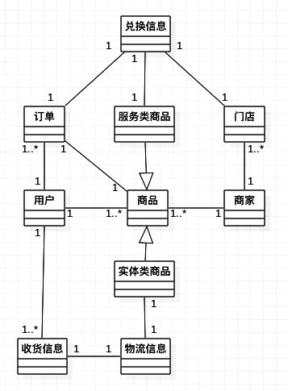
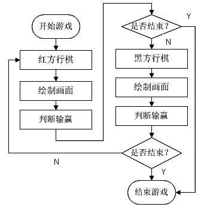
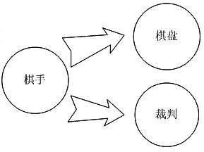
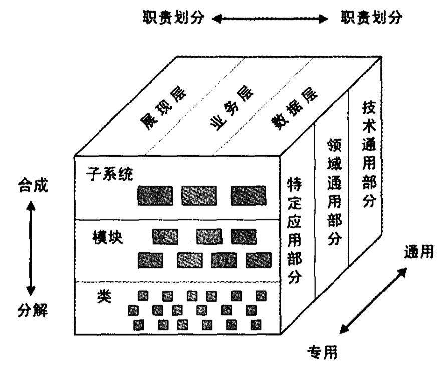

 
<!--BEGIN_DATA
{
    "create_date": "2016-07-05 13:25", 
    "modify_date": "2016-07-05 13:25", 
    "is_top": "0", 
    "summary": "小钢的架构思考", 
    "tags": "架构", 
    "file_name": "小钢的架构思考.md"
}
END_DATA-->

####
原文出处：<a href='http://keeganlee.me/post/architecture/20160425' target='blank'>小钢的架构思考:什么是架构</a>

原创文章，转载请注明：转载自[Keegan小钢](http://keeganlee.me/)  
并标明原文链接：**<http://keeganlee.me/post/architecture/20160425>**  
微信订阅号：**keeganlee_me**  
写于2016-04-25

* * *

[小钢的架构思考:什么是架构](http://keeganlee.me/post/architecture/20160425)  
[小钢的架构思考:架构规划](http://keeganlee.me/post/architecture/20160509)  
[小钢的架构思考:架构设计](http://keeganlee.me/post/architecture/20160621)

* * *

最近在思考架构方面一些最基本的问题，比如什么是架构？如何评价一个架构的好坏？是否有一些通用的基本原则指引架构设计？在面向对象设计方面，有单一职责、里氏替换、
依赖倒置、接口隔离、迪米特、开闭原则等等基本原则；那么，在架构设计方面是否也有类似的基本原则呢？本文就先聊聊第一个问题。

###什么是架构

关于什么是架构，业界从来没有一个统一的定义。Martin Fowler在《企业应用架构模式》中也没有对其给出定义，只是提到能够统一的内容有两点：

  1. 最高层次的系统分解；
  2. 系统中不易改变的决定。

《软件架构设计》一书则将架构定义总结为组成派和决策派：

  * 组成派：架构=组件+交互：软件系统的架构将系统描述为计算组件及组件之间的交互。
  * 决策派：架构=重要决策集：软件架构是在一些重要方面所作出的决策的集合。

而架构的概念最初来源于建筑，因此，我想从建筑的角度去思考这个问题。Wikipedia中，对架构，即Architecture的定义如下：

> Architecture is both the process and the product of planning, designing, and
constructing buildings and other physical structures.

简单翻译就是：架构是规划、设计和构建建筑物或其他物理构筑物的过程和结果。

从上面的定义中可知，首先，架构的最终目标是为了产出建筑物或其他物理构筑物，构筑物可以只是一套房子，也可以是一栋楼盘，抑或是一个小区、商业区，甚至是一个城市。
构筑物越大，其架构必然也越复杂。

其次，产出建筑物之前需要经过三个阶段：规划(planning)、设计(designing)和构建(constructing)。这三个阶段其实也是架构的核心了
。比如，开发商要建一个住宅小区，首先肯定要对该小区有一个整体的规划吧：小区的建设选址、建设的规模、建设的内容、投资估算、建设周期等等。接着，就要对小区的各方
面进行设计了，最高层次的应该是小区的总体布局设计，拆分开的话就是各楼盘的设计、绿化的设计、各种配套设施的设计等等，再细化下去就是各种户型的设计、楼盘内和小区
内各种走道的设计等等。最后，构建阶段也就是施工阶段了，是将之前所有的想法转为实际的建筑物的阶段。

最后，架构包含了以上的过程和结果。也就是说，对小区总体规划的过程是架构，规划的结果方案也是架构，小区总体布局的设计、楼盘的设计、户型的设计等等的每个过程也都
是架构，每个过程产出的设计方案也是架构，构建阶段的施工图也是架构，可以说，产出建筑物期间的每个过程和结果都是架构。

那么，如果将建筑物换成了软件，那就变成对软件架构的定义了：软件架构是规划、设计和构建软件的过程和结果。

相应地，软件架构的最终目标就是为了产出软件，可以是一个App，也可以是一个平台，如SaaS、PaaS、BaaS等等，甚至还可以是智慧城市这样庞大的生态系统，
地球人都知道，越庞大复杂的系统，架构越难。规划阶段更多考虑的是软件的需求，包括业务上的功能性需求和技术上的非功能性需求，如可靠性、可扩展性、可维护性等；此阶
段的架构一般为系统架构。设计阶段的工作更多的就是拆分细化，以满足各种需求；此阶段的架构一般为逻辑架构。构建阶段主要就是对软件的实现和部署了；此阶段的架构一般
为物理架构。

###写在最后

其实，对架构的每种定义都没有错，就像《软件架构设计》一书也说过的，只是每个人所看的角度不同而已。从上面的定义中也可知，架构涵盖了软件研发的方方面面，很难有人
能够全部都懂，大部分架构师懂得的只是其中的某些方面。一栋高楼大厦也不是一个人完成的。

思考完什么是架构之后，那接下来，就要思考架构怎么做了？这个问题留待后文继续思考。

* * *

####
原文出处：<a href='http://keeganlee.me/post/architecture/20160509' target='blank'>小钢的架构思考:架构规划</a>

原创文章，转载请注明：转载自[Keegan小钢](http://keeganlee.me/)  
并标明原文链接：**<http://keeganlee.me/post/architecture/20160509>**  
微信订阅号：**keeganlee_me**  
写于2016-05-09

* * *

[小钢的架构思考:什么是架构](http://keeganlee.me/post/architecture/20160425)  
[小钢的架构思考:架构规划](http://keeganlee.me/post/architecture/20160509)  
[小钢的架构思考:架构设计](http://keeganlee.me/post/architecture/20160621)

* * *

[上一篇](http://keeganlee.me/post/architecture/20160425)简单聊了下什么是架构，还将架构划分为三个阶段：规划
阶段、设计阶段和构建阶段，构建阶段其实也是架构实现的阶段。其实，三个阶段的界限并不明显，而占比最多的是设计阶段；而且，规划和构建阶段其实也会有设计。也可能因
此，当我们谈到架构的时候，更多是在谈架构设计。但仔细想想，三个阶段的划分确是合理的。本文先聊聊架构规划。

###架构规划

架构规划做什么呢？我觉得主要是规划好下个阶段架构设计的边界。而影响架构边界的，其实就是需求。需求形成了对架构的约束条件，从而也对架构设计形成了边界。那么，有
哪些需求呢？可以分为三大类：商业需求、功能需求和质量需求。

####商业需求

商业需求是最高层次的需求，对其含义，我比较赞同温昱在《软件架构设计》中提到的解释：它关注从客户群、企业现状、未来发展、预算、立项、开发、运营、维护在内的整个
软件生命周期涉及的商业因素，包括了商业层面的目标、期望和限制等。商业需求一般对架构的影响比较大，对架构产生限制的商业因素也比较多，在此列举一些比较常见的：

  1. **上市时间**：上市时间限定了系统从设计、开发、测试到上市的时间边界。之前我跟进过一个垂直于大学生市场的应用，上市时间就要求在新生入学前，不然就会错过推广的最佳时期，预留给开发的时间只有两个月。因此，我们只好大部分重用前个项目的元素，包括重用服务端的一些模块，还包括客户端的架构和界面。当然，一般情况下，预留给开发的时间不会这么短，但也不会特别长。架构师需要根据时间长短，平衡各方面需求，做好架构选型。
  2. **成本预算**：成本预算就限定了能使用的资源边界。不同架构的开发成本肯定不同，要满足更多功能需求和更多质量需求的架构成本也更高，在预算有限的情况下，只能权衡各种需求，优先满足重要程度高的需求。
  3. **人力现状**：100人的开发团队和10人的开发团队，软件的架构会有很大不同。另外，开发团队人员所掌握的技术也会对架构选型有影响。例如，团队里还没有人会用React Native，那现阶段就不适合选择React Native作为App架构的技术基础。
  4. **与外围系统的集成**：当需要与外围系统集成时，需要认真考虑集成方法，尤其是外围系统比较老的时候，集成难度可能更高。另外，外围系统的不可控因素一般也比较多，因此，对架构处理这些不可控风险的要求相对也高。
  5. **开放性**：封闭的私有系统和开放式系统对架构的要求也不同，一个系统如果选择了开放，那对架构的质量要求更高，对安全性、扩展性、性能等质量属性都应该比封闭时高。
  6. **目标市场**：目标用户10万、100万、1000万，不同级别的目标市场，架构也是大有不同。另外，大众市场和垂直的专门市场，架构也同样有区别，较大的专门市场一般都采用产品线的规划方案。
  7. **多端支持**：现在移动端普遍支持Android、iOS、Wechat，管理端通常则支持PC Web，如果管理端也要支持Android、iOS、Wechat，或者移动端和管理端还要再支持WindowsPhone、黑莓，甚至再支持VR，则需要投入更多时间和人力，架构上相应也需要做出调整。
  8. **期望的系统生存期**：从主观上说，谁都希望自己的系统可以生存很久，但生存期越长，意味着系统的可修改性、可扩展性、可移植性等需要更高。但是，受上市时间、成本预算等因素的制约，再加上软件本身的变化快，所以，客观上，一般也不会期望其生存期太长。当系统不能满足渐增的需求时，基本通过重构来解决。
  9. **阶段性计划**：每一个大平台系统普遍都是分阶段完成的，因此，前期阶段的架构设计时就需要考虑好重用性、扩展性、伸缩性、移植性等特性。但因为每个阶段经过市场验证后，需求有可能会变化，所以又不能过度设计，否则就会造成设计浪费，还可能加大了后续阶段架构调整的难度。
  10. **国际化**：如果走国际化路线，那架构上就要考虑好对多国语言的支持。
  11. **竞争对手**：产品要比竞争对手优秀，那就要在一些关键的功能或质量上超越对方，也意味着在这些方面的架构需要投入更多。
  12. **法律法规**：比如，对某些关键字要进行过滤屏蔽，这是天朝独有的，大家懂的。

商业需求多种多样，有些需求还可能会相互矛盾，比如，上市时间和成本预算就会和期望的系统生存期可能产生矛盾，期望的生存期越长其成本就会越高，需要投入的时间就会越
多，那么，就有可能拖延上市时间。因此，做架构规划时，必须梳理清楚哪些需求是能够被满足的，能被满足的程度如何，需要在各个需求间权衡利弊。另外，商业需求因为是最
高层次的需求，因此，相对于功能需求和质量需求，其优先级一般也比较高。

####功能需求

功能需求描述了系统应该提供的服务，包括为用户提供的服务，也包括为其他系统提供的服务。而架构主要就是为功能服务的，而功能需求基本与具体的业务相关。因此，要做好
功能需求这块的架构，就必须对该业务领域足够了解，这样才能更好地抽象建模。对功能需求的架构规划，主要就是建立业务领域模型。领域模型定下来后，下个阶段的设计必须
与领域模型保持一致。

而对功能需求进行领域建模之前，还需先梳理下需求的优先级。因为受商业需求的影响，功能需求也需要权衡。比如，上市时间紧、成本预算低、人力资源也不是很充足的情况下
，功能需求只能少不能多。而需要与外围系统集成的时候，也意味着这部分功能不需要自己实现了；但是，如果外围系统无法完全满足需求时，则还需要自己再实现缺失的需求。
因此，现阶段需要满足哪些功能需求？需要满足到什么程度？这两个问题确定了之后才能更有效地进行领域建模。

领域建模主要就是要分析清楚每个领域模型和模型之间的关系。还是直接用一个例子来说明吧。假设现在要做一个支持O2O(Online To
Offline)的电商平台，以下是经过梳理后的几个关键的功能需求：

  1. 商家可以在平台发布商品，可以是实体类商品，也可以是服务类商品。
  2. 实体类商品支持快递，服务类商品只能到商家门店兑换消费。
  3. 用户购买实体类商品时需提供收货信息。
  4. 用户购买每个商品时对应生成一个订单。
  5. 用户购买的是实体类商品时，可以查看商品的物流信息。
  6. 用户购买的是服务类商品时，可以用订单的兑换码到商家门店兑换消费。

根据以上需求，可以初步得到相关的领域概念有：商家、商品、实体类商品、服务类商品、物流信息、门店、用户、收货信息、订单、兑换信息。理清这些领域概念之间的关系之
后，可以得到类似于下面的领域模型视图：  
  
当然，这只是一个很小的例子，实际上的领域模型会比这个例子复杂得多。领域模型确定之后，系统中有多少业务领域、各领域概念之间的关系如何就一清二楚了。

####质量需求

质量需求是三类需求中，需求层次最低的，但却是大部分架构师最关注的。纵览那么多架构技术，就会发现，大部分都是为了解决某个或某些质量属性优化的问题。

质量属性常见的有以下这些：

  * 性能(Performance)：性能无疑是一个非常重要的特性，尤其在计算资源有限的情况下。但也无需过分追求高性能，从而牺牲其他更重要的特性。关于过度关注性能的问题，这篇文章说得很好：[架构之路（二）：性能](http://www.cnblogs.com/freeflying/p/4788494.html)。
  * 安全性(Security)：安全性一般会和性能相互制约，最明显的例子就是HTTPS，使用HTTPS提高了安全性，但性能就会有所牺牲。很难做到既满足高安全又高性能，因此需要根据具体需求平衡两方面的特性。
  * 可用性(Availability)：也有人称为有效性，一般定义为：可用性 = 系统正常工作时间 / (系统正常工作时间 + 故障维修时间）。此定义就说明了可用性与系统故障有关，故障率高，可用性就低，故障率低，可用性才高。另外，高可用性还说明了系统对故障维修的时间也很短。
  * 易用性(Usability)：易用性很容易和可用性混淆，可用性关注的是系统长时间无故障运行的能力，而易用性关注的则是系统易于使用的能力。
  * 鲁棒性(Robustness)：也称为健壮性、容错性，是指系统在出现了用户非法操作、或软硬件的缺陷导致的异常情况下，系统依然能够正常运行的能力。比如说，系统在输入错误、磁盘故障、网络过载或有意攻击情况下，能否不死机、不崩溃，就是该软件的鲁棒性。
  * 可伸缩性(Scalability)：可伸缩性是指当用户量和数据量增加时，系统维持高服务质量的能力。比如，当并发量为1W时，系统响应时间为1秒，那如果并发量增加到100W时，只要通过增加服务器数量，而无需对代码进行修改即可达到系统响应时间依然为1秒，就说明该系统的可伸缩性高。
  * 互操作性(Interoperability)：互操作性反映了本系统与其他系统交换数据和服务的难易程度。
  * 可扩展性(Extensibility)：也称为灵活性，反映了系统应对变化的能力。在软件开发过程中，需求变更是常有的事，尤其在移动互联网时代，变化是非常频繁的，也因此，可扩展性是移动互联网产品重点考虑的质量需求。
  * 可理解性(Understandability)：可理解性是指开发人员通过源代码和相关文档，了解程序功能、结构和运行方式的难易程度。遵从好的开发规范一般都可以提高可理解性。另外，单一职责原则运用得好，也能大大提高可理解性，所谓“简单就是美”，简单才容易理解。
  * 可测试性(Testability)：简单点说，可测试性就是测试和诊断软件错误的难易程度。比如进行单元测试的难易程度。如果程序包含了复杂的处理逻辑、数据结构、模块关系，可测试性的设计更显得尤为重要。
  * 可复用性(Reusability)：可重用性表明了一个软件组件可以在其他程序中使用的难易程度。一般需要将一个组件抽离成通用性的组件时，对可复用性的要求就会比较高。
  * 可移植性(Portability)：可移植性表明了将软件系统从一个运行环境转移到另一个不同的运行环境的难易程度。
  * 可维护性(Maintainability)：可维护性是指理解、改正、改动、改进软件的难易程度。我觉得，可维护性是保证一个软件系统能够长期生存的最重要的特性，没有之一。对一个可维护性差的系统，久而久之，不断变得牵一发而动全身，变得不可维护，慢慢只能宣布灭亡。

理想情况下，谁都希望所有属性都是高质量的，但谁都清楚这是不可能的事。要提高更多质量属性，实现的难度更大，需要付出的成本更高。而且，不同质量属性之间还存在制约
关系，比如，提高安全性，一般就会减低性能；提高了性能，还可能减低了可维护性。因此，在实际做架构规划时，必须根据具体需求在各质量属性间权衡优先级。

###写在最后

现在有不少公司，尤其是创业型的公司，为了快，直接从需求跳到开发，没有架构规划，也没有架构设计。这样的系统，就等于一栋没有打地基的建筑物，其风险自不用说。架构
就是软件系统的地基。有一句话说得好，“基础不牢，地动山摇”。

* * *

####
原文出处：<a href='http://keeganlee.me/post/architecture/20160621' target='blank'>小钢的架构思考:架构设计</a>

原创文章，转载请注明：转载自[Keegan小钢](http://keeganlee.me/)  
并标明原文链接：**<http://keeganlee.me/post/architecture/20160621>**  
微信订阅号：**keeganlee_me**  
写于2016-06-21

* * *

[小钢的架构思考:什么是架构](http://keeganlee.me/post/architecture/20160425)  
[小钢的架构思考:架构规划](http://keeganlee.me/post/architecture/20160509)  
[小钢的架构思考:架构设计](http://keeganlee.me/post/architecture/20160621)

* * *

最近一个多月因为忙于工作上的项目重构，所以文章一直没能更新。现在，重构终于暂时告一段落，于是，赶紧抽时间把文章写完更新发布。下面进入正文。

* * *

当[架构规划](http://keeganlee.me/post/architecture/20160509)的结果，整理出一堆不同优先级的需求，尤其是质量
需求之后，接下来就要思考如何才能最大限度地实现这些需求，这就是架构设计要解决的问题。那么，如何进行架构设计呢？设计到什么程度才合适呢？我从架构思维和架构原则
方面来思考架构设计的问题。

###架构思维

这里说的架构思维是指进行架构设计时最高层级的思考方式，比如：面向过程、面向对象、面向切面、面向服务等。

####面向过程(Procedure Oriented)

面向过程的设计思路就是将问题分解成一个个步骤，按照步骤一步步执行之后，问题就解决了。每一个步骤就是一个子过程，也可以称为一个模块，子过程还可以继续拆分成更多
更细的子过程。因此，面向过程的设计核心就是过程分析、功能分解，一般采用自顶向下、逐步求精的分解方式。一个大的程序可以分解成多个子程序，子程序再分解成多个大模
块，大模块再分解成多个小模块，最终分解成一个个函数。

在此我想借用一个象棋对战的例子，例子来源于一篇很老的文章：[架构师之路(4)---详解面向对象](http://blog.csdn.net/wanghao72214/article/details/3961250)。以下是采用面向过程的设计思路分解的对战流程图：  
  
将以上每个流程分别用函数实现，问题就解决了。

面向过程的优点主要有两个：一是流程清晰简单；二是性能比较高。尤其是性能，这也是为什么至今很多单片机开发、驱动程序开发、或其他与硬件相关的系统开发等对性能要求
很高的软硬件程序依然在用面向过程的方式进行设计和开发。

面向过程的缺点也很明显：一是主程序太重，主程序与模块承担的任务不均衡；二是函数不易扩展，导致其可扩展性、可复用性、可维护性相对都比较差；三是上下层级模块之间
的联系太紧密，耦合高，所以模块也难以复用。

####面向对象(Object Oriented)

面向过程的思路是“怎么做”，关注于实现细节；而面向对象的思路是“谁来做”，关注于抽象的对象。对象的封装、继承和多态等特性，让我们以更接近现实世界的方式来思考
程序设计。面向对象相比面向过程容易实现更好的分离，相应地可扩展性、可复用性、可维护性也会比较高，但同时会牺牲掉一些性能。不过，也因为硬件发展迅猛，所以牺牲的
那点性能也不算什么了。

面向对象设计的难点在于抽象，从问题域中抽象出一个个对象，并找出它们之间的关系。好在有SOLID原则和一大堆设计模式指导我们如何更好地设计。也有领域驱动设计的
方法论指导我们怎么进行领域建模。

还是象棋对战的例子，用面向对象的设计思路，可以抽象出以下三种对象：

  1. 棋手：负责行棋，红黑两方行为一致。
  2. 棋盘：负责绘制棋盘画面。
  3. 裁判：负责判定吃子、犯规和输赢等。

三者关系如下图：  
  
棋手对象行棋后，棋盘对象根据棋子布局的变化刷新棋盘画面，裁判对象则对棋局进行判定。

####面向切面(Aspect Oriented)

面向切面，也就是AOP，是对面向对象的一种扩展，为了弥补面向对象的局限性。面向对象设计主要是对业务领域进行抽象封装，但对于业务领域之外的内容，比如日志记录、
权限检查、事务支持等，在没有AOP之前，只能将实现这些功能的代码散布在所有对象层次中，但这些代码与所散布的对象的核心业务功能是没任何关系的。这种做法也导致了
大量重复的代码，而且难以复用。AOP就是为了解决这种问题而产生的，将这些与业务领域无关的部分分离出来，以横切面的方式注入系统，从而减少重复代码、减低耦合度、
增强扩展性和维护性。

将日志记录、权限检查、事务支持等等使用横切技术分别独立成一个个服务模块，这些模块也称为“横切面”，这样就可以将这些与业务无关的服务从业务核心中解耦出来，就可
以将系统划分为两部分：业务核心和通用服务。业务核心依然采用面向对象的思路去设计，而通用服务则可以采用面向切面的思想来实现。

Spring就大量使用了AOP技术，OkHttp的Interceptor也是AOP设计的一种实现。很多场景都可以使用AOP的思想去设计，比如添加统一的Http Request Header，添加统一的登录验证，添加统一的缓存，添加统一的错误处理，等等，只要是通用的功能点基本都可以使用AOP的思想去设计和实现。

####面向服务(Service Oriented)

不管是SOA还是现在流行的微服务架构，都是采用面向服务的思维方式。说到面向服务，需要先了解一个概念：**Monolith**，也称为单体架构。在没有SOA思
想之前，软件系统将所有功能整合成一个独立的软件包，然后部署在单一的平台上。比如，在J2EE平台，一个软件系统最终会打成一个包含所有功能的WAR包，然后部署到
Web容器中。若要扩展的话，则通过复制这个WAR包部署到多个Web容器来实现。这种方式，如果程序需要改动，不管多么微小的改动，都需要重新打包个新的WAR包，
并替换掉所有Web容器的旧WAR包。

面向服务的架构思想则是，将系统的不同功能分离成一个个单独的应用程序或组件，统称为服务，不同服务部署在不同容器中，不同服务之间通过一些轻量级的交互机制来通信，
如HTTP，RPC等。这样，相比单体架构，功能服务之间明显是松耦合的，扩展也会灵活很多。而且，不同服务还可以用不同编程语言实现，部署到不同平台。

不管是面向过程，面向对象，面向切面，还是面向服务，最本质的区别还是在于看问题的角度不同。而在实际应用中，也不会只使用一种架构思维，而是综合考虑的，系统的不同
方面或不同层级可能会用不同的架构思维去思考。比如，一个庞大的复杂系统，整体上可能用面向服务的架构思维去拆解各种服务，业务核心方面的服务可能再用面向对象的架构
思维进行建模，通用功能服务还是用面向切面的架构思维来设计，事务流程当然是采用面向过程的架构思维最直观。

###架构原则

架构思维从面向过程，到现在的面向服务，以后也不知道还会出现什么新的思维方式。但无论是何种思维方式，都存在一些共通性的架构原则，可以指导我们如何设计出一个合适
的架构。从另一方面来说，架构设计，不管是面向过程、面向对象、面向切面，还是面向服务，无一例外，主要都是在对复杂的系统进行分解。那么，相应地，就需要思考三个问
题：分解为哪些？如何分解？分解到什么程度？相对应地，有三个重要原则可以分别为解答这三个问题提供指引。

####关注点分离原则

关注点分离原则主要就是为了解决将复杂系统分解为哪些部分的问题，分解出来的部分就是关注点。过程、对象、切面、服务，只是分解的角度（也是关注点）不同而已。将复杂
的问题根据不同的关注点分解为多个相对简单的问题，再对每个简单的问题进行分别处理，这就是关注点分离。分离之后，各个关注点相对独立，每个关注点的变化基本不会影响
到其他的关注点，即使需要改变，改变的部分也很小。需要扩展时，影响也将会最小化。

关注点分离，最难的在于如何识别出有哪些关注点。要识别出有哪些关注点，需要将复杂系统不同的方方面面抽象成一个个具有清晰明确的边界的概念模型，或为“对象”，或为
“组件”，或“切面”，或“服务”，以将复杂问题分解为一个个相对简单的问题。

从不同维度，可以有不同的分离方案。除了上面提到的面向过程、面向对象、面向切面、面向服务等思维角度之外，还有如下图所示的其他几种不同维度，该图引自《软件架构设
计》一书中的【**2.1.1 关注点分离之道**】一节：  
  
上图分别从功能职责、通用性、大小粒度的不同维度进行分离。从职责维度进行分离，就可以分为三层架构：展现层、业务层、数据层，相应的关注点就是：数据展示、数据加工
、数据管理。另外，数据层还可以再分离为网络层和缓存层。从通用性维度来看，就可以分离出技术通用部分、领域通用部分、特定应用部分。一般，使用框架技术就可以用于分
离各种不同的通用部分。从大小粒度的维度考虑，无非就是将复杂系统分离为各个子系统，再分离为不同模块，再细分到不同类。

在实际应用中，并不会只采用一种维度，而是多种维度综合考虑，不同部分采用不同维度的分离方案。比如，也许，整体上按职责分离为多层架构，然后，在某些层级根据大小粒
度再进行分离，例如将业务层按照不同业务模块进行分离。另外，也会将不同的通用部分进行分离，例如可将技术通用部分的日志记录、领域通用部分的权限检查分别分离出来。

[《架构就是关注点分离》](http://www.educity.cn/blog/user2/51639/archives/2009/41580.html)
这篇文章则描述了更多关注点分离的例子。

####高内聚低耦合原则

系统应该如何分解？或者说关注点应该如何分离？高内聚低耦合原则就可以为该问题提供设计指引。

内聚是指模块内部的功能和元素之间的紧密程度，而耦合则是指模块与模块之间的关联程度。

内聚可分为好多种：功能内聚、顺序内聚、通信内聚、过程内聚、时间内聚、逻辑内聚、偶然内聚。功能内聚是最强最好的内聚，模块内各元素共同协作完成一个单一的功能，这
些元素紧密联系、缺一不可。顺序内聚则是指，模块中各个处理元素和同一个功能密切相关，而且这些处理必须顺序执行，通常前一个处理元素的输出时后一个处理元素的输入。
顺序内聚的内聚度也比较高，但相比功能内聚，缺点就是可维护性相对差些。偶然内聚则是最弱的内聚，模块内的各元素之间没有任何联系，只是偶然地被凑到一起。

耦合也分为好多种：非直接耦合、数据耦合、标记耦合、控制耦合、外部耦合、公共耦合、内容耦合。非直接耦合表示两个模块之间没有直接关系，它们之间的联系完全是通过主
模块的控制和调用来实现的，其耦合度是最弱的，模块独立性最强。数据耦合表示调用模块和被调用模块之间只传递简单的数据项参数，相当于高级语言中的值传递。标记耦合也
称为特征耦合，表示调用模块和被调用模块之间传递的不是简单数据，而是数据结构，像高级语言中的数据名、记录名和文件名等数据结果，这些名字即为标记，其实传递的是地
址。控制耦合则表示模块之间传递的不是数据信息，而是控制信息例如标志、开关等，一个模块控制了另一个模块的功能。外部耦合则是指一组模块都访问同一全局简单变量，而
且不通过参数表传递该全局变量的信息。内容耦合则是一个模块直接访问另一模块的内容，这是最强的耦合。

高内聚的设计原则是说：一个模块只完成一个单一的功能，尽可能使模块达到功能内聚。  
低耦合的设计原则是说：若模块间必须存在耦合，应尽量使用数据耦合，少用控制耦合，慎用或有控制地使用公共耦合，并限制公共耦合的范围，尽量避免内容耦合。

####适度设计

适度设计原则关注的就是系统分解到什么程度的问题。适度设计就是指设计不要过度，也不要不足。那么，怎样才算设计过度？怎样才算设计不足？一句话，设计过度就是想太多
，设计不足就是想太少。感觉好虚，是吧？我也这么觉得。因为，如何判断一个设计是否过度或不足，并没有标准的可量化指标。因此，设计是否适度，更多在于主观的判断。而
如何避免设计过度或不足，更多的也在于个人经验积累所形成的直觉。

设计不足相对还比较容易判断，导致设计不足的原因主要有两个：一是因为新手的设计经验不足而导致；二是因为一味追求快速实现产品功能而跳过或大幅度减少了设计而导致。

也有些设计过度比较明显的例子，比如Uncle Bob提出的Clean架构，每个关注点都有着清晰明确的边界，架构真的很清晰，可维护性、可测试性都非常不错，高内
聚低耦合。但是，如果将其应用到一个只有两三个开发人员的小团队的小项目中，就会明显发现代码量大而且复杂，每需要添加一个小功能，却需要编写大量代码。这对一个小团
队小项目来说，明显不适合。Clean架构比较适用于人员较多的团队，和中大型项目。

因此，判断设计是否适度，不能脱离团队和项目的现状。另外，还有其他现状因素，包括各种商业需求、功能需求和质量需求。大部分情况下，形成过度设计的原因在于：一是过
多地考虑了未来可能发生的变化；二是为了追求设计而设计。适度设计，首先应该着眼于当下，当下的需求、当下的开发成本、当下的人员和项目现状；其次才是适当考虑如何应
对未来的变化。对于未来的变化，也不是任何可能都要考虑，只需考虑在可预见的未来里有非常大的几率会发生的变化即可，这个非常大的几率可以达到90%以上。比如，已经
确定要实现的需求，只是因为优先级问题而稍微延后；比如，已经确定的人员扩充计划；比如，双11要搞活动，交易量将会激增；等等。

也就是说，适度设计的原则，可以总结为：设计应该优先满足当前确定的需求，再满足可预见未来里几乎可以确定会发生的需求。只满足当前需求而不考虑未来，就容易导致设计
不足；而过多地考虑未来可能发生的需求，就容易导致设计过度。因此，适度设计需要在当前需求和未来需求之间做好平衡，而我觉得只考虑当前需求和未来几乎确定会发生的需
求是最好的平衡点。

###写在最后

本来计划还想再谈谈架构风格，比如分层架构、MVC\MVP\MVVM、RESTFul、Clean架构等等。但因为这篇文章的进度已经拖了一个多月，不能再拖了。因
此，决定本文就此收手，那些架构风格以后有机会再讲吧。

